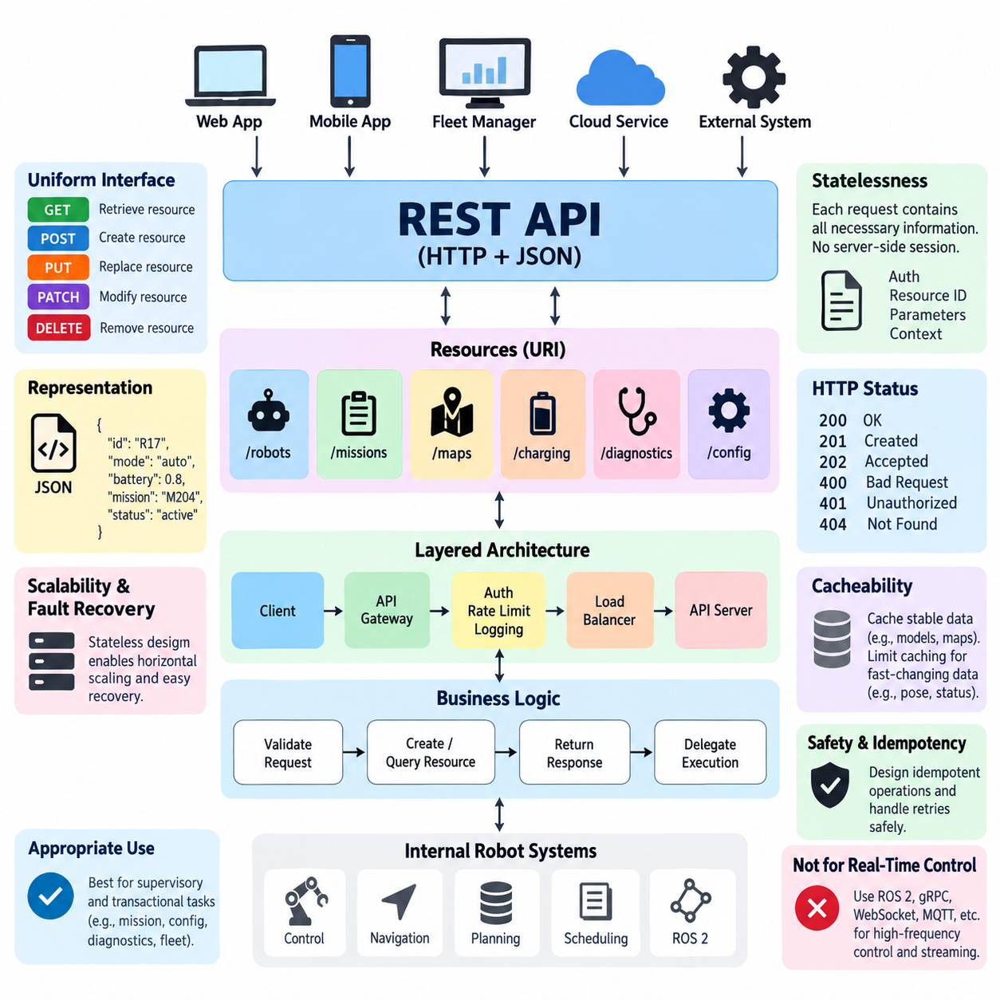
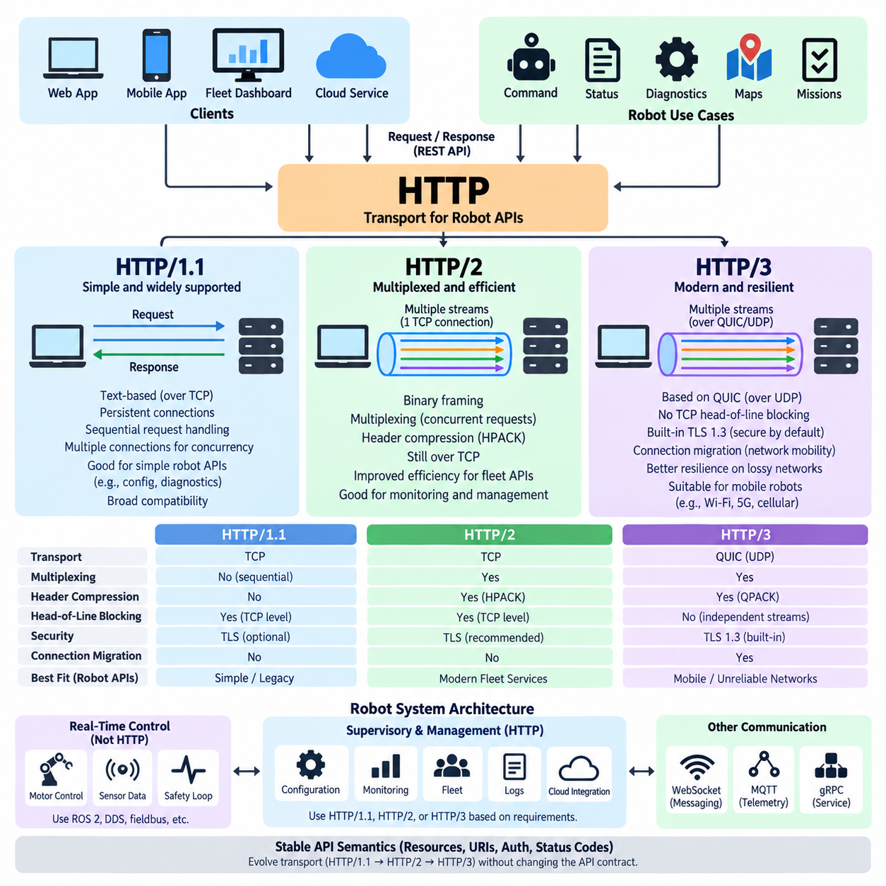
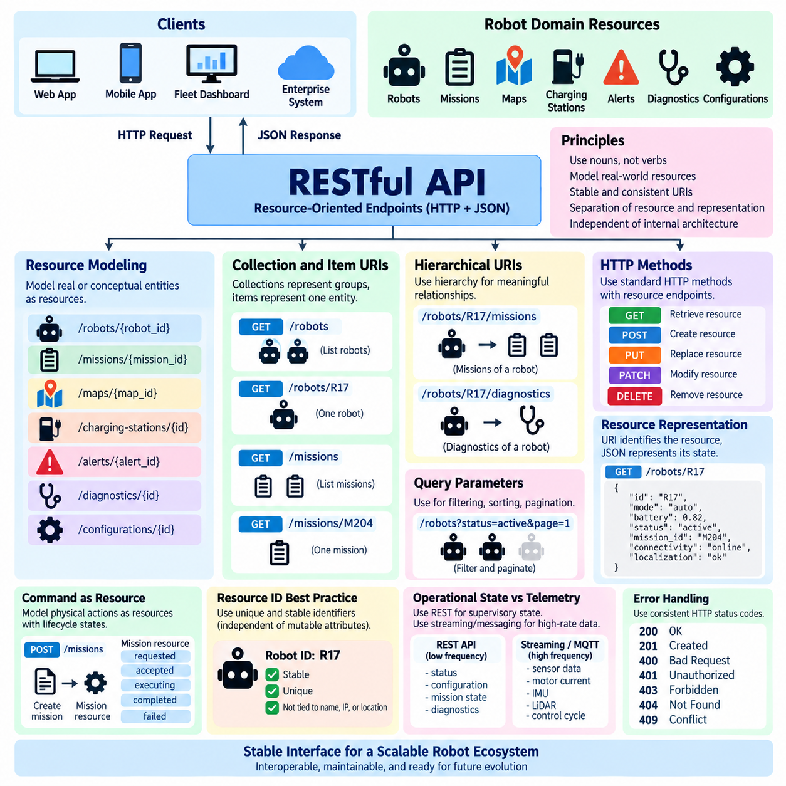
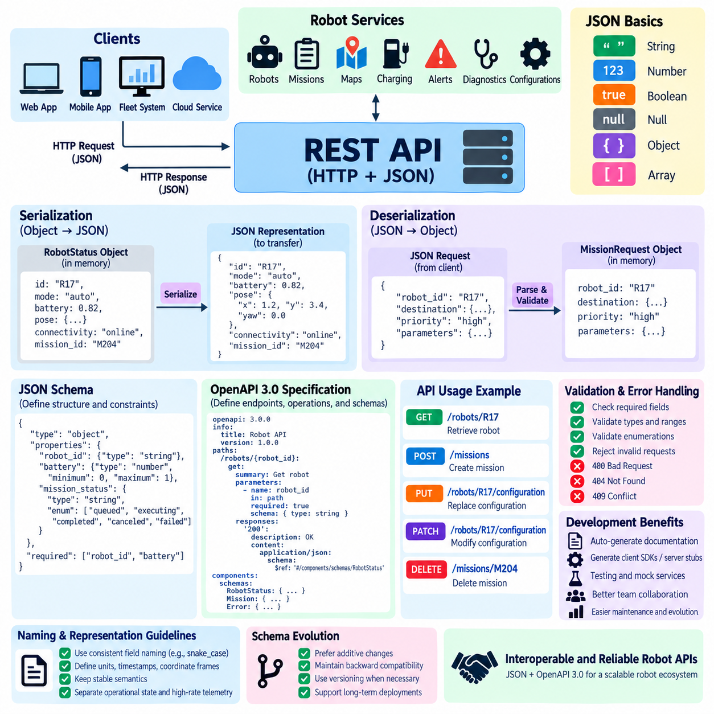
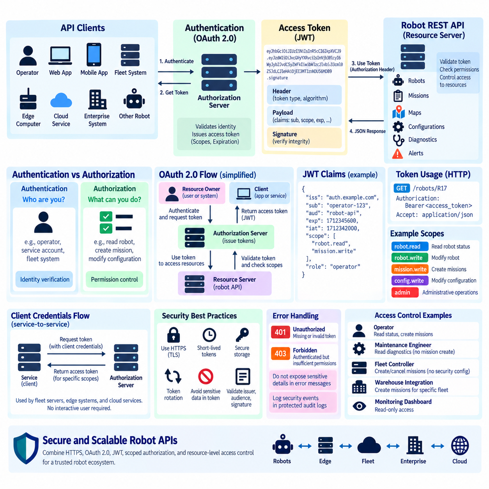
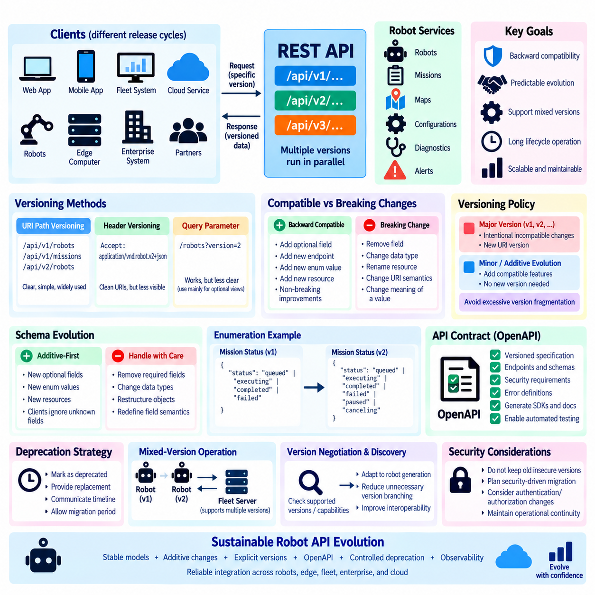
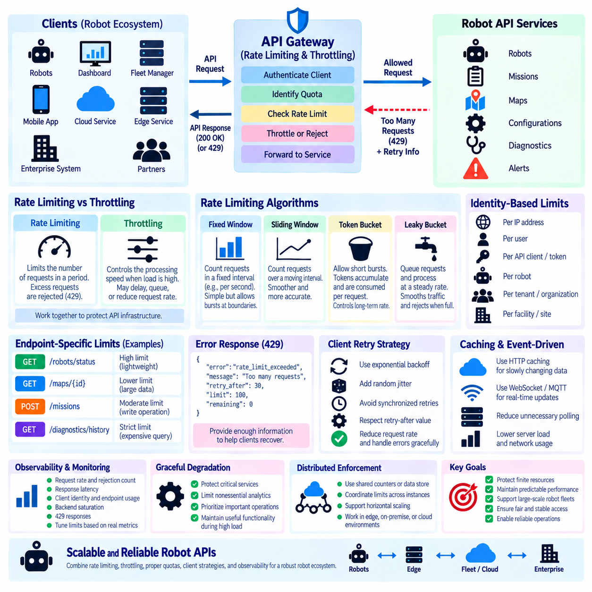
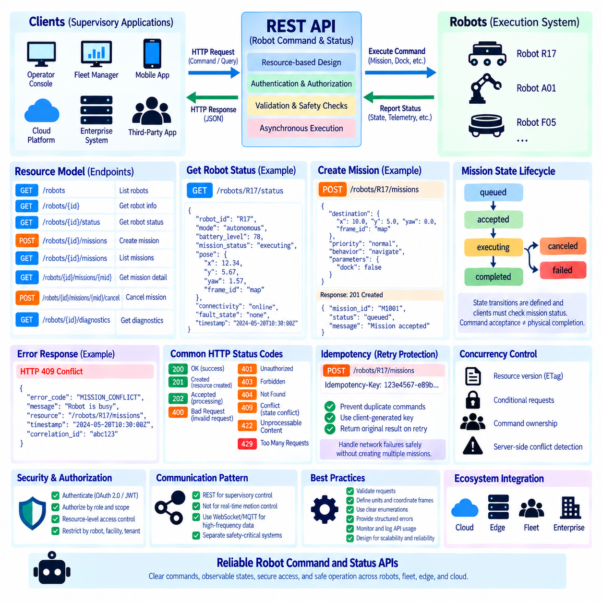
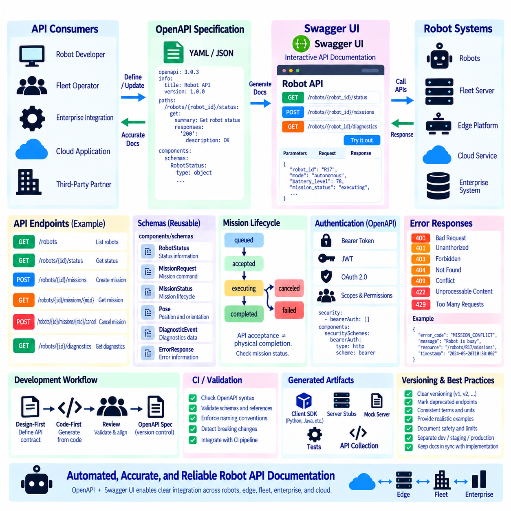
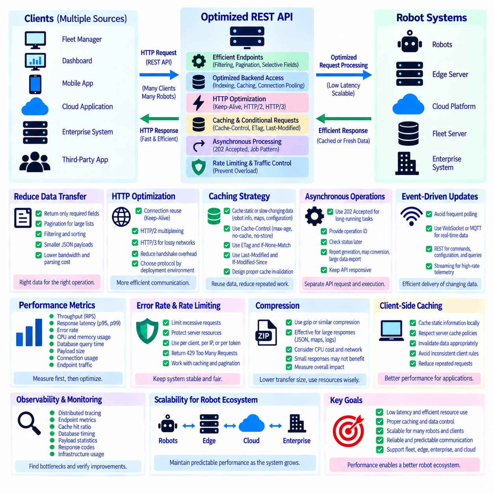

**Volume 06 Robot Communication and APIs**


# 01. REST API

##  

## 01.01 REST Architecture Principles: Stateless, Resource, Uniform

{width="7.268055555555556in" height="7.268055555555556in"}

Representational State Transfer (REST) is an architectural style for distributed systems in which network-accessible functionality is organized around resources rather than remote procedures. In a robot software environment, resources may represent robots, missions, maps, charging stations, diagnostics, configurations, or fleet states. REST provides a consistent interaction model that allows clients and services to evolve independently while communicating through standardized web mechanisms.

A resource is the central abstraction of REST architecture. Instead of exposing implementation-specific functions such as startRobotMotor() or executeNavigationTask(), a REST interface identifies conceptual entities through resource identifiers. A robot might therefore be represented as /robots/{robot_id}, while its missions could appear beneath /robots/{robot_id}/missions. This resource-oriented approach separates the external API contract from internal software components and algorithms.

Resources are normally identified through Uniform Resource Identifiers (URIs), while their current state is exchanged through representations such as JSON. The URI identifies what the client is interacting with, whereas the representation describes the resource at a particular moment. A robot resource may contain operational mode, battery state, localization quality, mission status, or connectivity information without exposing the internal ROS 2 nodes, control loops, device drivers, or database structures that produce those values.

REST relies strongly on the uniform interface constraint. Clients interact with resources through a small and standardized set of HTTP methods rather than application-specific network commands. GET retrieves a representation, POST commonly creates a subordinate resource or initiates processing, PUT replaces a resource representation, PATCH modifies selected fields, and DELETE removes a resource where deletion is meaningful. Their consistent semantics reduce coupling between robot applications and external systems.

Uniform interfaces are especially valuable when heterogeneous systems must communicate with a robot platform. A warehouse management system, fleet manager, maintenance dashboard, cloud service, and mobile application can use the same fundamental interaction conventions even when they are implemented with different programming languages and frameworks. The API therefore becomes an architectural boundary through which robot capabilities can be exposed without requiring every external application to understand the internal robotics middleware.

Statelessness is another fundamental REST constraint. Every client request should contain the information required by the server to understand and process that request, without depending on conversational session state stored from previous requests. Authentication credentials, resource identifiers, request parameters, and required context must therefore accompany the appropriate request. The server may maintain persistent application state, such as mission records, but it should not require hidden client-session history to interpret subsequent interactions.

The distinction between stateless communication and persistent resource state is important in robotics. A mission server can permanently store that robot R17 is executing mission M204, while the REST interaction used to query that mission remains stateless. A GET request for the mission can be processed independently because the request identifies the required resource. Statelessness therefore does not imply that the robot forgets its operational state; it means that request processing does not depend on an implicit communication session.

This property improves scalability and fault recovery because any compatible service instance can potentially process an incoming request when shared application state is managed appropriately. Load balancers can distribute requests across multiple API servers without preserving a dedicated client-to-server session. For fleet systems containing tens, hundreds, or thousands of robots, this characteristic supports horizontal scaling of management services and simplifies replacement or restart of failed API instances.

REST also distinguishes resource manipulation from the physical execution mechanisms behind those resources. Creating a mission resource does not mean that an HTTP request directly controls wheel velocity or closes a motor-control loop. Instead, the API can validate the request, create a mission object, return its identifier, and delegate execution to navigation, planning, scheduling, or ROS 2 subsystems. This separation is particularly important because robot motion frequently requires deterministic or high-frequency communication unsuitable for ordinary REST transactions.

REST APIs are therefore most appropriate for supervisory and transactional robot interactions rather than hard real-time control. Mission creation, configuration management, map selection, diagnostics retrieval, fleet queries, maintenance records, and historical data access naturally fit resource-oriented HTTP interfaces. High-frequency sensor streams, low-latency control commands, and continuous telemetry may instead use ROS 2 DDS, gRPC streaming, WebSocket, MQTT, or specialized real-time communication mechanisms elsewhere in the communication architecture.

HTTP response semantics provide another element of the uniform interface. Successful retrieval can return 200 OK, resource creation can return 201 Created, asynchronous acceptance may use 202 Accepted, malformed input can return 400 Bad Request, unauthorized access can produce 401 Unauthorized, and a missing resource can return 404 Not Found. Consistent status semantics allow robot clients to interpret outcomes without learning a different proprietary error protocol for every service.

REST interactions should also consider safety and idempotency when commands affect physical systems. Repeating a GET request should not change robot state, while operations such as PUT are normally designed with idempotent semantics. For mission commands, designers must carefully handle retries caused by network failures so that a duplicated request does not unintentionally create two missions or execute the same physical operation twice. Resource identifiers, request identifiers, and explicit command state can support reliable retry behavior.

Another REST constraint is cacheability. Responses should indicate whether they may be reused by clients or intermediary systems. Relatively stable resources such as robot models, map metadata, software configuration schemas, or capability descriptions may benefit from caching, reducing network traffic and server workload. Rapidly changing resources such as robot pose, obstacle information, mission progress, or safety state generally require restrictive cache policies because stale representations could produce incorrect operational decisions.

REST architecture can also employ layered systems. A client does not need to know whether it communicates directly with the robot, an edge gateway, an API gateway, a fleet server, or an intermediary proxy. Authentication, routing, rate limiting, logging, caching, and protocol adaptation can therefore be introduced as intermediate layers without fundamentally changing the resource interface presented to the client. This becomes valuable in cloud-edge robot architectures where communication paths evolve as deployments scale.

A well-designed robot REST API consequently exposes stable domain abstractions rather than mirroring internal software implementation. Robots, missions, maps, alerts, diagnostics, and configurations form meaningful resources, while internal ROS 2 topics, processes, memory structures, and hardware-specific interfaces remain encapsulated. This abstraction permits internal algorithms or middleware components to change while preserving compatibility for external applications that depend on the API contract.

REST should ultimately be viewed as one component of a broader robot communication architecture rather than a universal protocol for every data flow. Its strengths are resource abstraction, stateless interaction, uniform semantics, interoperability, scalability, and compatibility with established web infrastructure. Combined with streaming and real-time protocols for workloads that REST does not naturally serve, it provides a practical control and integration plane connecting individual robots, edge computers, fleet services, enterprise systems, and cloud applications.

REST(Representational State Transfer)는 네트워크로 접근할 수 있는 기능을 원격 프로시저(Remote Procedure)가 아니라 리소스(Resource)를 중심으로 구성하는 분산 시스템(Distributed System)의 아키텍처 스타일(Architectural Style)이다. 로봇 소프트웨어 환경에서 리소스는 로봇(Robot), 미션(Mission), 지도(Map), 충전 스테이션(Charging Station), 진단(Diagnostics), 설정(Configuration), 플릿 상태(Fleet State) 등을 나타낼 수 있다. REST는 표준화된 웹 메커니즘(Web Mechanism)을 통해 클라이언트(Client)와 서비스(Service)가 서로 독립적으로 발전하면서 통신할 수 있도록 일관된 상호작용 모델(Interaction Model)을 제공한다.

리소스(Resource)는 REST 아키텍처의 핵심 추상화(Abstraction)이다. startRobotMotor() 또는 executeNavigationTask()처럼 구현에 종속된 함수를 직접 노출하는 대신, REST 인터페이스(REST Interface)는 리소스 식별자(Resource Identifier)를 통해 개념적인 엔티티(Entity)를 식별한다. 예를 들어 로봇은 /robots/{robot_id}로 표현할 수 있으며, 해당 로봇의 미션은 /robots/{robot_id}/missions와 같이 표현할 수 있다. 이러한 리소스 지향 접근(Resource-Oriented Approach)은 외부 API 계약(API Contract)을 내부 소프트웨어 구성요소와 알고리즘으로부터 분리한다.

리소스(Resource)는 일반적으로 통합 자원 식별자(Uniform Resource Identifier, URI)를 통해 식별되며, 현재 상태는 JSON과 같은 표현(Representation)을 통해 교환된다. URI는 클라이언트가 무엇과 상호작용하는지를 식별하고, 표현은 특정 시점의 리소스 상태를 기술한다. 로봇 리소스에는 동작 모드(Operational Mode), 배터리 상태(Battery State), 위치추정 품질(Localization Quality), 미션 상태(Mission Status), 연결 상태(Connectivity Information) 등이 포함될 수 있으며, 이러한 값을 생성하는 내부 ROS 2 노드(Node), 제어 루프(Control Loop), 장치 드라이버(Device Driver), 데이터베이스 구조(Database Structure)를 외부에 노출할 필요는 없다.

REST는 균일 인터페이스 제약(Uniform Interface Constraint)에 크게 의존한다. 클라이언트는 애플리케이션별 네트워크 명령 대신 소수의 표준화된 HTTP 메서드(HTTP Method)를 사용하여 리소스와 상호작용한다. GET은 표현을 조회하고, POST는 일반적으로 하위 리소스를 생성하거나 처리를 시작하며, PUT은 리소스 표현을 교체하고, PATCH는 선택된 필드를 수정하며, DELETE는 삭제가 의미 있는 경우 해당 리소스를 제거한다. 이러한 일관된 의미 체계(Semantics)는 로봇 애플리케이션과 외부 시스템 사이의 결합도(Coupling)를 낮춘다.

균일 인터페이스(Uniform Interface)는 이기종 시스템(Heterogeneous System)이 로봇 플랫폼과 통신해야 할 때 특히 유용하다. 창고 관리 시스템(Warehouse Management System), 플릿 관리자(Fleet Manager), 유지보수 대시보드(Maintenance Dashboard), 클라우드 서비스(Cloud Service), 모바일 애플리케이션(Mobile Application)은 서로 다른 프로그래밍 언어와 프레임워크로 구현되더라도 동일한 기본 상호작용 규칙을 사용할 수 있다. 따라서 API는 모든 외부 애플리케이션이 내부 로봇 미들웨어(Robotics Middleware)를 이해하지 않고도 로봇 기능을 사용할 수 있게 하는 아키텍처 경계(Architectural Boundary)가 된다.

무상태성(Statelessness)은 REST의 또 다른 핵심 제약 조건이다. 각 클라이언트 요청(Client Request)은 서버가 이전 요청에서 저장한 대화형 세션 상태(Session State)에 의존하지 않고 해당 요청을 이해하고 처리하는 데 필요한 정보를 포함해야 한다. 따라서 인증 자격정보(Authentication Credentials), 리소스 식별자(Resource Identifier), 요청 매개변수(Request Parameter), 필요한 컨텍스트(Context)는 적절한 요청에 함께 포함되어야 한다. 서버는 미션 기록과 같은 지속적인 애플리케이션 상태(Application State)를 유지할 수 있지만, 이후 요청을 해석하기 위해 숨겨진 클라이언트 세션 이력에 의존해서는 안 된다.

무상태 통신(Stateless Communication)과 지속적인 리소스 상태(Persistent Resource State)의 차이는 로보틱스에서 중요하다. 미션 서버(Mission Server)는 로봇 R17이 미션 M204를 수행하고 있다는 정보를 영구적으로 저장할 수 있지만, 해당 미션을 조회하는 REST 상호작용 자체는 무상태로 유지된다. GET 요청이 필요한 리소스를 직접 식별하므로 각 요청은 독립적으로 처리될 수 있다. 따라서 무상태성은 로봇이 자신의 동작 상태를 기억하지 않는다는 의미가 아니라, 요청 처리가 암묵적인 통신 세션(Communication Session)에 의존하지 않는다는 의미이다.

이러한 특성은 확장성(Scalability)과 장애 복구(Fault Recovery)를 향상시킨다. 공유 애플리케이션 상태(Shared Application State)가 적절하게 관리된다면 호환 가능한 어떤 서비스 인스턴스(Service Instance)라도 들어오는 요청을 처리할 수 있다. 로드 밸런서(Load Balancer)는 특정 클라이언트와 서버 사이의 전용 세션을 유지하지 않고 요청을 여러 API 서버에 분산할 수 있다. 수십 대에서 수천 대의 로봇으로 구성된 플릿 시스템(Fleet System)에서 이러한 특성은 관리 서비스의 수평 확장(Horizontal Scaling)을 지원하고 장애가 발생한 API 인스턴스의 교체나 재시작을 단순화한다.

REST는 또한 리소스 조작(Resource Manipulation)과 그 이면에서 수행되는 물리적 실행 메커니즘(Physical Execution Mechanism)을 구분한다. 미션 리소스를 생성한다고 해서 HTTP 요청이 직접 휠 속도(Wheel Velocity)를 제어하거나 모터 제어 루프(Motor-Control Loop)를 닫는 것은 아니다. 대신 API는 요청을 검증하고 미션 객체(Mission Object)를 생성한 뒤 식별자를 반환하고, 실제 실행은 내비게이션(Navigation), 계획(Planning), 스케줄링(Scheduling), ROS 2 서브시스템(Subsystem)에 위임할 수 있다. 이러한 분리는 로봇 동작이 일반적인 REST 트랜잭션(Transaction)에 적합하지 않은 결정적 또는 고주파 통신을 요구하는 경우가 많기 때문에 특히 중요하다.

따라서 REST API는 하드 실시간 제어(Hard Real-Time Control)보다 감독 및 트랜잭션 기반 로봇 상호작용(Supervisory and Transactional Robot Interaction)에 더 적합하다. 미션 생성(Mission Creation), 설정 관리(Configuration Management), 지도 선택(Map Selection), 진단 조회(Diagnostics Retrieval), 플릿 질의(Fleet Query), 유지보수 기록(Maintenance Record), 이력 데이터 접근(Historical Data Access)은 리소스 지향 HTTP 인터페이스에 자연스럽게 적합하다. 반면 고주파 센서 스트림(High-Frequency Sensor Stream), 저지연 제어 명령(Low-Latency Control Command), 연속 텔레메트리(Continuous Telemetry)는 ROS 2 DDS, gRPC 스트리밍(gRPC Streaming), 웹소켓(WebSocket), MQTT 또는 특수 실시간 통신 메커니즘을 사용하는 것이 적합할 수 있다.

HTTP 응답 의미 체계(Response Semantics)는 균일 인터페이스의 또 다른 요소를 제공한다. 성공적인 조회는 200 OK를 반환할 수 있고, 리소스 생성은 201 Created, 비동기 처리 요청의 수락은 202 Accepted를 사용할 수 있다. 잘못된 입력은 400 Bad Request, 인증되지 않은 접근은 401 Unauthorized, 존재하지 않는 리소스는 404 Not Found를 반환할 수 있다. 일관된 상태 의미 체계를 사용하면 로봇 클라이언트는 각 서비스마다 서로 다른 독자적인 오류 프로토콜(Error Protocol)을 학습하지 않고도 처리 결과를 해석할 수 있다.

REST 상호작용은 명령이 물리 시스템(Physical System)에 영향을 미치는 경우 안전성(Safety)과 멱등성(Idempotency)도 고려해야 한다. GET 요청을 반복해도 로봇 상태가 변경되어서는 안 되며, PUT과 같은 연산은 일반적으로 멱등 의미 체계(Idempotent Semantics)를 갖도록 설계된다. 미션 명령의 경우 네트워크 장애로 요청이 재시도되었을 때 중복 요청으로 두 개의 미션이 생성되거나 동일한 물리적 동작이 두 번 실행되지 않도록 신중하게 처리해야 한다. 리소스 식별자, 요청 식별자(Request Identifier), 명시적인 명령 상태(Command State)는 신뢰성 있는 재시도(Reliable Retry)를 지원할 수 있다.

REST의 또 다른 제약 조건은 캐시 가능성(Cacheability)이다. 응답은 클라이언트나 중간 시스템(Intermediary System)이 이를 재사용할 수 있는지를 명확하게 나타내야 한다. 로봇 모델(Robot Model), 지도 메타데이터(Map Metadata), 소프트웨어 설정 스키마(Configuration Schema), 기능 설명(Capability Description)처럼 비교적 안정적인 리소스는 캐싱(Caching)을 통해 네트워크 트래픽과 서버 부하를 줄일 수 있다. 반면 로봇 위치(Robot Pose), 장애물 정보(Obstacle Information), 미션 진행 상태(Mission Progress), 안전 상태(Safety State)처럼 빠르게 변화하는 리소스는 오래된 표현이 잘못된 운영 판단으로 이어질 수 있으므로 제한적인 캐시 정책(Cache Policy)이 필요하다.

REST 아키텍처는 계층형 시스템(Layered System)도 활용할 수 있다. 클라이언트는 자신이 로봇, 엣지 게이트웨이(Edge Gateway), API 게이트웨이(API Gateway), 플릿 서버(Fleet Server), 중간 프록시(Intermediary Proxy) 중 어디와 직접 통신하는지 알 필요가 없다. 따라서 인증(Authentication), 라우팅(Routing), 속도 제한(Rate Limiting), 로깅(Logging), 캐싱(Caching), 프로토콜 변환(Protocol Adaptation) 기능을 중간 계층에 추가하면서도 클라이언트에 제공되는 리소스 인터페이스를 근본적으로 변경하지 않을 수 있다. 이는 배포 규모가 확대되면서 통신 경로가 변화하는 클라우드-엣지 로봇 아키텍처(Cloud-Edge Robot Architecture)에서 특히 유용하다.

잘 설계된 로봇 REST API는 내부 소프트웨어 구현을 그대로 외부에 노출하기보다 안정적인 도메인 추상화(Domain Abstraction)를 제공해야 한다. 로봇, 미션, 지도, 경고(Alert), 진단, 설정은 의미 있는 리소스를 구성하고, 내부 ROS 2 토픽(Topic), 프로세스(Process), 메모리 구조(Memory Structure), 하드웨어 종속 인터페이스(Hardware-Specific Interface)는 캡슐화(Encapsulation)된다. 이러한 추상화는 API에 의존하는 외부 애플리케이션과의 호환성을 유지하면서 내부 알고리즘이나 미들웨어 구성요소를 변경할 수 있도록 한다.

궁극적으로 REST는 모든 데이터 흐름에 적용되는 범용 프로토콜이라기보다 더 광범위한 로봇 통신 아키텍처(Robot Communication Architecture)를 구성하는 하나의 요소로 이해해야 한다. REST의 주요 강점은 리소스 추상화(Resource Abstraction), 무상태 상호작용(Stateless Interaction), 균일한 의미 체계(Uniform Semantics), 상호운용성(Interoperability), 확장성(Scalability), 기존 웹 인프라(Web Infrastructure)와의 호환성이다. REST가 자연스럽게 처리하기 어려운 작업에는 스트리밍 및 실시간 프로토콜을 함께 사용함으로써 개별 로봇, 엣지 컴퓨터(Edge Computer), 플릿 서비스(Fleet Service), 기업 시스템(Enterprise System), 클라우드 애플리케이션(Cloud Application)을 연결하는 실용적인 제어 및 통합 계층(Control and Integration Plane)을 구성할 수 있다.

##  

## 01.02 HTTP1.1 vs HTTP2 vs HTTP3: Robot API Perspective

{width="7.268055555555556in" height="7.268055555555556in"}

HTTP is the transport foundation for most REST APIs, but its three major generations---HTTP/1.1, HTTP/2, and HTTP/3---provide substantially different communication behavior. For robot APIs, these differences become important because robots continuously exchange commands, status information, diagnostics, configuration data, maps, and mission information across networks whose latency and reliability may vary significantly.

HTTP/1.1 remains widely supported and conceptually straightforward. It normally operates over TCP and represents each request and response as textual HTTP messages. Persistent connections allow multiple transactions to reuse an established TCP connection, avoiding repeated connection setup. This simplicity makes HTTP/1.1 practical for robot configuration, diagnostics, maintenance interfaces, and moderate-frequency REST transactions where extreme communication efficiency is unnecessary.

A major limitation of HTTP/1.1 appears when many requests must be processed concurrently. Although persistent connections improve efficiency, requests associated with a connection have historically faced ordering and concurrency limitations, encouraging clients to open several parallel TCP connections. A robot dashboard requesting status, battery information, mission state, diagnostics, maps, and configuration simultaneously can therefore generate unnecessary connection overhead and inefficient network utilization.

HTTP/2 changes this communication model by introducing binary framing and multiplexing while retaining familiar HTTP semantics such as methods, status codes, URIs, and headers. Multiple independent request and response streams can share a single TCP connection. Consequently, a fleet application can request information about many robot resources concurrently without requiring a separate TCP connection for every transaction, improving connection efficiency and application-level concurrency.

Multiplexing is particularly useful for robot monitoring and fleet-management applications. A supervisory interface may simultaneously request robot health, mission progress, localization state, charging information, alarms, and configuration metadata. HTTP/2 assigns these exchanges to separate streams carried through the same connection. This reduces the connection-management burden and enables responses to progress independently at the HTTP layer rather than forcing strictly sequential application transactions.

HTTP/2 also introduces header compression through HPACK. REST requests frequently repeat headers containing content types, authorization information, user-agent data, caching directives, and other metadata. When hundreds of robots repeatedly communicate with edge or fleet servers, repeated HTTP headers can consume meaningful bandwidth. Header compression reduces this redundancy and can improve efficiency, particularly for frequent API calls containing relatively small payloads.

However, HTTP/2 still relies on TCP. TCP guarantees reliable and ordered byte delivery, which is beneficial for API correctness but creates transport-level head-of-line blocking. If a TCP packet is lost, later data belonging to otherwise independent HTTP/2 streams may wait until the missing data is retransmitted. On stable wired networks this effect may be limited, but wireless robot networks can experience interference, handovers, congestion, and packet loss that make the limitation more visible.

HTTP/3 addresses this transport limitation by moving HTTP semantics from TCP to QUIC, which normally operates over UDP. QUIC integrates secure transport, stream multiplexing, congestion control, and connection management. Independent QUIC streams avoid the TCP-level head-of-line blocking behavior affecting HTTP/2, so packet loss associated with one stream does not necessarily prevent unrelated streams from continuing their progress.

This characteristic is attractive for mobile robots operating across Wi-Fi, private 5G, public cellular, or other changing network environments. An AMR moving between access points may encounter temporary packet loss or changes in network path characteristics. HTTP/3 can provide better resilience to such conditions because QUIC was designed for modern network mobility and independent stream handling rather than relying entirely on the traditional TCP connection model.

QUIC also incorporates TLS 1.3 into its transport architecture, making encrypted communication fundamental to HTTP/3. Connection establishment can require fewer round trips than conventional combinations of TCP and TLS, especially when communication is resumed between previously connected endpoints. For robot-cloud and fleet-edge APIs, reduced connection-establishment latency can be useful when robots frequently reconnect because of mobility, temporary wireless interruption, service migration, or changing network availability.

Connection migration is another relevant QUIC capability. Traditional TCP connections are closely associated with network endpoint information, so changes in a device\'s network path can disrupt an existing connection. QUIC uses connection identifiers that can help preserve logical connections when network addressing changes. This can benefit mobile robot platforms moving between wireless networks, although actual behavior still depends on infrastructure, security policy, NAT behavior, and implementation support.

The progression from HTTP/1.1 to HTTP/2 and HTTP/3 should not be interpreted simply as three levels of raw speed. Performance depends on payload size, request frequency, connection lifetime, packet loss, network latency, server implementation, proxy infrastructure, and security configuration. A simple robot maintenance API on a reliable industrial Ethernet network may obtain little operational benefit from HTTP/3, while a cloud-connected mobile fleet may benefit considerably from QUIC characteristics.

Compatibility also influences protocol selection. HTTP/1.1 has extremely broad support across embedded devices, proxies, gateways, debugging tools, and legacy enterprise systems. HTTP/2 is mature across modern web infrastructure and provides an effective balance between compatibility and multiplexed performance. HTTP/3 adoption continues to expand, but robot developers must verify support across API gateways, load balancers, firewalls, observability tools, embedded clients, and industrial network infrastructure.

From a robot API perspective, protocol selection should therefore follow communication requirements rather than technology novelty. HTTP/1.1 remains suitable for simple administrative APIs and legacy integration. HTTP/2 is well suited to modern REST services requiring concurrent requests and efficient connection reuse. HTTP/3 becomes especially interesting where robots communicate through variable-latency or lossy networks and where connection establishment, mobility, and transport-level blocking materially affect service quality.

None of these HTTP generations should automatically be treated as a replacement for deterministic robot communication. Motor control, safety loops, high-rate sensor transport, and tightly synchronized control generally require communication mechanisms designed for their timing and reliability constraints. REST over HTTP is more naturally positioned at supervisory, management, configuration, diagnostics, mission, fleet, edge, and cloud integration layers within the broader robot communication architecture.

A practical robot system can therefore use multiple communication technologies simultaneously. ROS 2 and DDS may handle internal distributed robot communication, specialized real-time networks may support deterministic control, WebSocket or MQTT may carry continuous events and telemetry, gRPC may provide efficient service communication, and REST may expose interoperable resource-oriented APIs. HTTP/1.1, HTTP/2, or HTTP/3 can then be selected according to the network environment and API workload.

For large robot fleets, the most important architectural principle is to separate API semantics from transport evolution. Resource models, URI structures, authentication policies, status codes, and application contracts should remain stable wherever possible even when the underlying HTTP generation changes. This separation allows a robot platform to migrate from HTTP/1.1 toward HTTP/2 or HTTP/3 without redesigning its entire external API, preserving interoperability while progressively improving communication efficiency.

HTTP는 대부분의 REST API를 위한 전송 기반(Transport Foundation)이지만, 주요 세대인 HTTP/1.1, HTTP/2, HTTP/3는 상당히 다른 통신 동작 특성을 제공한다. 로봇 API에서는 이러한 차이가 특히 중요하다. 로봇은 명령(Command), 상태 정보(Status Information), 진단(Diagnostics), 설정(Configuration), 지도(Map), 미션 정보(Mission Information)를 지속적으로 교환하며, 이러한 통신이 이루어지는 네트워크의 지연시간(Latency)과 신뢰성(Reliability)은 운용 환경에 따라 크게 달라질 수 있기 때문이다.

HTTP/1.1은 여전히 광범위하게 지원되며 개념적으로도 비교적 단순하다. 일반적으로 전송 제어 프로토콜(TCP)을 기반으로 동작하며, 각각의 요청(Request)과 응답(Response)을 텍스트 기반 HTTP 메시지로 표현한다. 지속 연결(Persistent Connection)을 사용하면 여러 트랜잭션(Transaction)이 이미 설정된 TCP 연결을 재사용할 수 있어 반복적인 연결 설정을 줄일 수 있다. 이러한 단순성으로 인해 HTTP/1.1은 극단적인 통신 효율이 필요하지 않은 로봇 설정, 진단, 유지보수 인터페이스, 중간 빈도의 REST 트랜잭션에 실용적으로 활용될 수 있다.

HTTP/1.1의 주요 한계는 많은 요청을 동시에 처리해야 할 때 나타난다. 지속 연결(Persistent Connection)은 효율성을 높이지만, 하나의 연결에 속하는 요청들은 전통적으로 순서 및 동시성(Concurrency)에 제약을 받아왔으며, 이 때문에 클라이언트가 여러 개의 병렬 TCP 연결을 생성하는 방식이 사용되기도 한다. 로봇 대시보드(Robot Dashboard)가 상태, 배터리 정보, 미션 상태, 진단, 지도, 설정을 동시에 요청하면 불필요한 연결 오버헤드(Connection Overhead)와 비효율적인 네트워크 사용이 발생할 수 있다.

HTTP/2는 기존 HTTP 메서드(Method), 상태 코드(Status Code), URI, 헤더(Header) 등의 의미 체계를 유지하면서 바이너리 프레이밍(Binary Framing)과 다중화(Multiplexing)를 도입하여 이러한 통신 모델을 변경한다. 여러 개의 독립적인 요청 및 응답 스트림(Stream)이 하나의 TCP 연결을 공유할 수 있다. 따라서 플릿 애플리케이션(Fleet Application)은 각각의 트랜잭션마다 별도의 TCP 연결을 생성하지 않고 여러 로봇 리소스(Resource)의 정보를 동시에 요청할 수 있어 연결 효율성과 애플리케이션 수준의 동시성을 향상시킬 수 있다.

다중화(Multiplexing)는 특히 로봇 모니터링(Robot Monitoring)과 플릿 관리(Fleet Management) 애플리케이션에서 유용하다. 감독 인터페이스(Supervisory Interface)는 로봇 상태, 미션 진행 상황, 위치추정 상태(Localization State), 충전 정보, 경보(Alarm), 설정 메타데이터(Configuration Metadata)를 동시에 요청할 수 있다. HTTP/2는 이러한 데이터 교환을 하나의 연결에서 서로 다른 스트림으로 처리하므로 연결 관리 부담을 줄이고, 엄격하게 순차적인 애플리케이션 트랜잭션을 요구하지 않으면서 HTTP 계층에서 여러 응답을 독립적으로 진행할 수 있도록 한다.

HTTP/2는 HPACK을 통한 헤더 압축(Header Compression)도 도입한다. REST 요청에서는 콘텐츠 유형(Content Type), 인증 정보(Authentication Information), 사용자 에이전트 데이터(User-Agent Data), 캐시 지시자(Cache Directive) 등의 헤더가 반복적으로 전송되는 경우가 많다. 수백 대의 로봇이 엣지 서버(Edge Server)나 플릿 서버(Fleet Server)와 반복적으로 통신하면 이러한 HTTP 헤더가 상당한 대역폭(Bandwidth)을 사용할 수 있다. 헤더 압축은 이러한 중복을 줄여 비교적 작은 페이로드(Payload)를 빈번하게 전송하는 API 호출의 효율성을 향상시킬 수 있다.

그러나 HTTP/2는 여전히 TCP에 의존한다. TCP는 신뢰성 있고 순서가 보장된 바이트 전달(Reliable and Ordered Byte Delivery)을 제공하여 API의 정확성에는 유리하지만, 전송 계층 수준의 선두 차단(Head-of-Line Blocking)을 발생시킬 수 있다. TCP 패킷 하나가 손실되면 서로 독립적인 HTTP/2 스트림에 속하는 이후 데이터도 손실된 패킷이 재전송될 때까지 기다려야 할 수 있다. 안정적인 유선 네트워크에서는 영향이 제한적일 수 있지만, 무선 로봇 네트워크에서는 간섭(Interference), 핸드오버(Handover), 혼잡(Congestion), 패킷 손실(Packet Loss) 때문에 이러한 한계가 더욱 분명하게 나타날 수 있다.

HTTP/3는 HTTP 의미 체계를 TCP에서 QUIC으로 이동시킴으로써 이러한 전송 계층의 한계를 해결하고자 한다. QUIC은 일반적으로 UDP 위에서 동작하며 보안 전송(Secure Transport), 스트림 다중화(Stream Multiplexing), 혼잡 제어(Congestion Control), 연결 관리(Connection Management)를 통합한다. 서로 독립적인 QUIC 스트림은 HTTP/2에서 발생할 수 있는 TCP 수준의 선두 차단을 피할 수 있으므로, 하나의 스트림에서 발생한 패킷 손실이 다른 관련 없는 스트림의 진행을 반드시 중단시키지는 않는다.

이러한 특성은 Wi-Fi, 사설 5G(Private 5G), 공용 셀룰러 네트워크(Public Cellular Network) 또는 기타 변화하는 네트워크 환경에서 동작하는 이동 로봇(Mobile Robot)에 매력적이다. 자율이동로봇(AMR)이 여러 액세스 포인트(Access Point) 사이를 이동하면 일시적인 패킷 손실이나 네트워크 경로 특성의 변화를 경험할 수 있다. HTTP/3는 기존 TCP 연결 모델에 전적으로 의존하지 않고 현대적인 네트워크 이동성과 독립적인 스트림 처리를 고려하여 QUIC이 설계되었기 때문에 이러한 환경에 더 높은 복원력(Resilience)을 제공할 수 있다.

QUIC은 또한 TLS 1.3을 전송 아키텍처(Transport Architecture)에 통합하므로 암호화 통신(Encrypted Communication)이 HTTP/3의 기본 요소가 된다. 연결 설정(Connection Establishment)은 기존 TCP와 TLS를 조합한 방식보다 적은 왕복 통신(Round Trip)을 필요로 할 수 있으며, 이전에 연결되었던 엔드포인트(Endpoint) 사이에서 통신을 재개할 때 특히 효과적일 수 있다. 로봇-클라우드(Robot-Cloud) 및 플릿-엣지(Fleet-Edge) API에서는 이동성, 일시적인 무선 연결 중단, 서비스 이전(Service Migration), 네트워크 가용성 변화 등으로 로봇이 빈번하게 재접속할 경우 연결 설정 지연 감소가 유용할 수 있다.

연결 마이그레이션(Connection Migration)은 QUIC의 또 다른 중요한 기능이다. 기존 TCP 연결은 네트워크 엔드포인트 정보와 밀접하게 연관되어 있기 때문에 장치의 네트워크 경로가 변경되면 기존 연결이 중단될 수 있다. QUIC은 연결 식별자(Connection Identifier)를 사용하여 네트워크 주소가 변경되더라도 논리적인 연결을 유지하는 데 도움을 줄 수 있다. 이는 여러 무선 네트워크 사이를 이동하는 모바일 로봇 플랫폼에 유용할 수 있지만, 실제 동작은 네트워크 인프라, 보안 정책(Security Policy), NAT 동작, 구현 지원 여부에 따라 달라진다.

HTTP/1.1에서 HTTP/2, HTTP/3로의 발전을 단순히 세 단계의 원시 속도(Raw Speed) 향상으로 이해해서는 안 된다. 실제 성능은 페이로드 크기(Payload Size), 요청 빈도(Request Frequency), 연결 유지시간(Connection Lifetime), 패킷 손실, 네트워크 지연시간, 서버 구현(Server Implementation), 프록시 인프라(Proxy Infrastructure), 보안 설정(Security Configuration)에 따라 달라진다. 안정적인 산업용 이더넷(Industrial Ethernet)에서 동작하는 단순한 로봇 유지보수 API는 HTTP/3를 통해 얻는 운영상의 이점이 크지 않을 수 있지만, 클라우드에 연결된 이동 로봇 플릿에서는 QUIC의 특성이 상당한 이점을 제공할 수 있다.

호환성(Compatibility) 역시 프로토콜 선택에 영향을 준다. HTTP/1.1은 임베디드 장치(Embedded Device), 프록시(Proxy), 게이트웨이(Gateway), 디버깅 도구(Debugging Tool), 기존 기업 시스템(Legacy Enterprise System)에서 매우 광범위하게 지원된다. HTTP/2는 현대적인 웹 인프라에서 성숙한 기술이며 호환성과 다중화 성능 사이에서 효과적인 균형을 제공한다. HTTP/3의 도입도 지속적으로 확대되고 있지만, 로봇 개발자는 API 게이트웨이, 로드 밸런서(Load Balancer), 방화벽(Firewall), 관측성 도구(Observability Tool), 임베디드 클라이언트(Embedded Client), 산업용 네트워크 인프라에서의 지원 여부를 확인해야 한다.

따라서 로봇 API 관점에서 프로토콜 선택은 기술의 최신성보다는 통신 요구사항(Communication Requirements)에 따라 이루어져야 한다. HTTP/1.1은 단순한 관리 API와 레거시 통합(Legacy Integration)에 여전히 적합하다. HTTP/2는 동시 요청과 효율적인 연결 재사용이 필요한 현대적인 REST 서비스에 적합하다. HTTP/3는 특히 로봇이 지연시간 변화가 크거나 패킷 손실이 발생하는 네트워크를 통해 통신하고, 연결 설정, 이동성, 전송 계층 차단이 서비스 품질(Service Quality)에 실질적인 영향을 주는 환경에서 중요성이 커진다.

이러한 HTTP 세대 중 어느 것도 결정적 로봇 통신(Deterministic Robot Communication)을 자동으로 대체하는 기술로 간주해서는 안 된다. 모터 제어(Motor Control), 안전 루프(Safety Loop), 고속 센서 전송(High-Rate Sensor Transport), 정밀하게 동기화된 제어(Tightly Synchronized Control)는 일반적으로 해당 시스템의 시간 및 신뢰성 요구조건을 만족하도록 설계된 통신 메커니즘을 필요로 한다. HTTP 기반 REST는 보다 자연스럽게 감독, 관리, 설정, 진단, 미션, 플릿, 엣지, 클라우드 통합 계층에 배치된다.

실용적인 로봇 시스템은 따라서 여러 통신 기술을 동시에 사용할 수 있다. ROS 2와 DDS는 로봇 내부의 분산 통신(Distributed Robot Communication)을 담당하고, 특수 실시간 네트워크(Specialized Real-Time Network)는 결정적 제어를 지원할 수 있다. 웹소켓(WebSocket)이나 MQTT는 연속적인 이벤트(Event)와 텔레메트리(Telemetry)를 전달하고, gRPC는 효율적인 서비스 통신(Service Communication)을 제공하며, REST는 상호운용 가능한 리소스 지향 API(Resource-Oriented API)를 외부에 제공할 수 있다. 이후 네트워크 환경과 API 워크로드(Workload)에 따라 HTTP/1.1, HTTP/2 또는 HTTP/3를 선택할 수 있다.

대규모 로봇 플릿(Large Robot Fleet)에서 가장 중요한 아키텍처 원칙은 API 의미 체계(API Semantics)와 전송 기술의 발전(Transport Evolution)을 분리하는 것이다. 리소스 모델(Resource Model), URI 구조(URI Structure), 인증 정책(Authentication Policy), 상태 코드(Status Code), 애플리케이션 계약(Application Contract)은 기반 HTTP 세대가 변경되더라도 가능한 한 안정적으로 유지되어야 한다. 이러한 분리를 통해 로봇 플랫폼은 전체 외부 API를 다시 설계하지 않고도 HTTP/1.1에서 HTTP/2 또는 HTTP/3로 점진적으로 전환할 수 있으며, 상호운용성을 유지하면서 통신 효율성을 지속적으로 향상시킬 수 있다.

##  

## 01.03 RESTful Endpoint Design: Resource Modeling / URI [w/Code]

{width="7.268055555555556in" height="7.268055555555556in"}

RESTful endpoint design begins with identifying the domain resources that external clients need to observe or manipulate. In a robot platform, these resources may include robots, missions, maps, charging stations, alerts, diagnostics, configurations, and fleet information. The endpoint structure should describe these domain concepts rather than expose internal functions, software modules, ROS 2 nodes, or database implementation details.

A resource model defines how real or conceptual entities in the robot system are represented through the API. A robot can be modeled as a primary resource identified by \`/robots/{robot_id}\`, while \`/missions/{mission_id}\` can identify an individual mission. Resource modeling establishes stable abstractions that allow clients to interact with the robot system even when navigation algorithms, middleware components, hardware, or internal data structures change.

Resource names should normally use nouns because REST endpoints represent entities rather than operations. An endpoint such as \`/robots/R17\` clearly identifies a robot resource, whereas \`/getRobot/R17\` unnecessarily embeds an action into the URI. The HTTP method already expresses the operation being performed. GET can retrieve the robot, PATCH can modify selected properties, and DELETE can remove the resource when deletion is meaningful within the application domain.

Collection resources represent groups of related entities. \`/robots\` can represent the available robot collection, while \`/robots/R17\` identifies one member of that collection. Similarly, \`/missions\` represents missions and \`/missions/M204\` represents a specific mission. This collection-and-item structure creates predictable URI patterns and makes the API easier for developers, fleet applications, dashboards, and enterprise systems to understand without extensive endpoint-specific knowledge.

Hierarchical URIs are useful when a resource has a meaningful relationship with another resource. For example, \`/robots/R17/missions\` can represent missions associated with robot R17, while \`/robots/R17/diagnostics\` can expose its diagnostic information. Such nesting communicates resource ownership or context clearly. However, excessive nesting should be avoided because deeply hierarchical URIs increase coupling and make endpoint structures difficult to maintain as relationships evolve.

URI design should remain stable and independent of the internal deployment architecture. A URI such as \`/robots/R17/status\` should not change merely because status processing moves from an onboard computer to an edge server or cloud service. Clients should interact with the logical resource model rather than know where the corresponding computation occurs. This abstraction supports migration between robot, edge, on-premise, and cloud architectures without unnecessarily changing external API contracts.

Resource representations carry the actual state exchanged between client and server. A GET request to \`/robots/R17\` might return JSON containing an identifier, operational mode, battery level, connectivity state, localization status, and active mission identifier. The URI identifies the resource, while the JSON document represents its current state. Separating resource identity from representation allows the same conceptual resource to evolve while preserving a stable addressing structure.

HTTP methods should be combined consistently with resource-oriented endpoints. \`GET /robots/R17\` retrieves the robot representation, while \`POST /missions\` may create a new mission. \`PUT /robots/R17/configuration\` can replace a complete configuration resource, and \`PATCH /robots/R17/configuration\` can update selected configuration fields. \`DELETE /missions/M204\` may remove a mission when application rules permit it. Consistent semantics reduce ambiguity for API consumers.

Robot commands require additional care because many commands represent physical actions rather than conventional data manipulation. Instead of creating arbitrary verb-based endpoints for every action, important operations can often be modeled as resources. A mission request can become a mission resource, a charging request can become a charging task, and an operational command can become a command resource whose lifecycle includes requested, accepted, executing, completed, rejected, or failed states.

This resource-oriented command model is valuable for asynchronous robot operations. Navigation to a destination may require several minutes, so an HTTP connection should not remain open until physical execution finishes. A client can create a mission using \`POST /missions\`, receive the newly created mission identifier, and subsequently retrieve \`/missions/{mission_id}\` to observe progress. The API therefore separates request acceptance from long-running physical execution.

Query parameters should be used primarily for filtering, sorting, pagination, and optional views rather than for defining fundamental resource identity. A fleet server might support \`/robots?status=active\` to select active robots or \`/missions?robot_id=R17\` to retrieve missions associated with one robot. Large collections may use pagination parameters to prevent clients from retrieving thousands of resources in a single response and consuming excessive server or network capacity.

Resource identifiers should be unique, stable, and independent of mutable attributes whenever possible. A robot\'s display name, network address, current location, or assigned work area may change during its operational lifetime, making these values poor permanent identifiers. A stable robot ID allows URI references, audit records, mission histories, maintenance systems, and fleet databases to continue referring to the same logical robot despite changes in its configuration or network environment.

Endpoint naming conventions should be consistent across the complete robot API. Developers should establish conventions for plural resource names, capitalization, separators, identifier formats, nesting depth, query parameters, and versioning. Consistency is more important than creating individually clever endpoint names. When \`/robots\`, \`/missions\`, \`/maps\`, \`/alerts\`, and \`/diagnostics\` follow the same structural rules, developers can often predict API behavior before reading detailed documentation.

The resource model should also distinguish operational state from high-frequency telemetry. A REST endpoint such as \`/robots/R17/status\` may provide a supervisory snapshot of battery level, mission state, connectivity, and localization health. It should not necessarily expose every motor current, IMU sample, LiDAR packet, or control-cycle value through repeated HTTP requests. High-rate information is generally better handled by streaming or messaging technologies designed for continuous communication.

Error behavior should remain consistent with the resource model. Requesting an unknown robot can return 404 Not Found, malformed resource data can produce 400 Bad Request, and attempts to perform an operation without appropriate authorization can return 401 Unauthorized or 403 Forbidden depending on the situation. Conflict conditions may use 409 Conflict, such as when a requested resource transition cannot be performed because the robot or mission is already in an incompatible state.

Well-designed RESTful endpoints ultimately form a stable semantic boundary around the robot platform. External systems interact with understandable resources and predictable URI structures while internal control, navigation, perception, scheduling, ROS 2 communication, databases, and hardware interfaces remain encapsulated. This resource-centered architecture supports interoperability and long-term evolution across robot, fleet, edge, and cloud systems while preparing the API structure for later schema, security, versioning, and performance design.

RESTful 엔드포인트 설계(RESTful Endpoint Design)는 외부 클라이언트가 관찰하거나 조작해야 하는 도메인 리소스(Domain Resource)를 식별하는 것에서 시작한다. 로봇 플랫폼에서 이러한 리소스는 로봇(Robot), 미션(Mission), 지도(Map), 충전 스테이션(Charging Station), 경고(Alert), 진단(Diagnostics), 설정(Configuration), 플릿 정보(Fleet Information) 등을 포함할 수 있다. 엔드포인트 구조는 내부 함수, 소프트웨어 모듈, ROS 2 노드(Node), 데이터베이스 구현 세부사항이 아니라 이러한 도메인 개념을 표현해야 한다.

리소스 모델(Resource Model)은 로봇 시스템의 실제 또는 개념적 엔티티(Entity)를 API를 통해 어떻게 표현할 것인지를 정의한다. 로봇은 \`/robots/{robot_id}\`로 식별되는 주요 리소스로 모델링할 수 있으며, \`/missions/{mission_id}\`는 개별 미션을 식별할 수 있다. 리소스 모델링(Resource Modeling)은 내비게이션 알고리즘, 미들웨어 구성요소, 하드웨어 또는 내부 데이터 구조가 변경되더라도 클라이언트가 로봇 시스템과 계속 상호작용할 수 있도록 안정적인 추상화(Abstraction)를 제공한다.

REST 엔드포인트는 동작(Operation)이 아니라 엔티티를 나타내기 때문에 리소스 이름(Resource Name)은 일반적으로 명사(Noun)를 사용해야 한다. \`/robots/R17\`과 같은 엔드포인트는 로봇 리소스를 명확하게 식별하지만, \`/getRobot/R17\`은 동작을 URI에 불필요하게 포함한다. 수행할 동작은 이미 HTTP 메서드(HTTP Method)가 표현한다. GET은 로봇을 조회하고, PATCH는 선택된 속성을 수정하며, DELETE는 애플리케이션 도메인에서 삭제가 의미 있는 경우 해당 리소스를 제거할 수 있다.

컬렉션 리소스(Collection Resource)는 서로 관련된 엔티티의 집합을 나타낸다. \`/robots\`는 사용 가능한 로봇의 컬렉션을 나타낼 수 있으며, \`/robots/R17\`은 그 컬렉션에 속한 하나의 구성원을 식별한다. 마찬가지로 \`/missions\`는 미션 컬렉션을 나타내고 \`/missions/M204\`는 특정 미션을 나타낸다. 이러한 컬렉션-항목 구조(Collection-and-Item Structure)는 예측 가능한 URI 패턴을 형성하며, 개발자, 플릿 애플리케이션, 대시보드, 기업 시스템이 각 엔드포인트에 대한 광범위한 사전 지식 없이도 API를 쉽게 이해할 수 있도록 한다.

계층형 URI(Hierarchical URI)는 하나의 리소스가 다른 리소스와 의미 있는 관계를 가질 때 유용하다. 예를 들어 \`/robots/R17/missions\`는 로봇 R17과 연관된 미션을 나타낼 수 있고, \`/robots/R17/diagnostics\`는 해당 로봇의 진단 정보를 제공할 수 있다. 이러한 중첩(Nesting)은 리소스 소유 관계나 컨텍스트를 명확하게 표현한다. 그러나 지나치게 깊은 계층형 URI는 결합도를 높이고 관계가 변화할 때 엔드포인트 구조의 유지보수를 어렵게 만들기 때문에 과도한 중첩은 피해야 한다.

URI 설계(URI Design)는 내부 배포 아키텍처(Deployment Architecture)와 독립적이고 안정적으로 유지되어야 한다. \`/robots/R17/status\`와 같은 URI는 상태 처리 기능이 로봇 탑재 컴퓨터에서 엣지 서버(Edge Server)나 클라우드 서비스(Cloud Service)로 이동했다는 이유만으로 변경되어서는 안 된다. 클라이언트는 해당 연산이 실제로 어디에서 수행되는지를 알 필요 없이 논리적인 리소스 모델과 상호작용해야 한다. 이러한 추상화는 외부 API 계약(API Contract)을 불필요하게 변경하지 않고 로봇, 엣지(Edge), 온프레미스(On-Premise), 클라우드(Cloud) 아키텍처 사이에서 기능을 이전할 수 있도록 지원한다.

리소스 표현(Resource Representation)은 클라이언트와 서버 사이에서 교환되는 실제 상태를 전달한다. \`/robots/R17\`에 대한 GET 요청은 식별자, 동작 모드(Operational Mode), 배터리 수준(Battery Level), 연결 상태(Connectivity State), 위치추정 상태(Localization Status), 활성 미션 식별자(Active Mission Identifier)를 포함하는 JSON을 반환할 수 있다. URI는 리소스를 식별하고 JSON 문서는 해당 리소스의 현재 상태를 표현한다. 리소스 식별(Resource Identity)과 표현을 분리하면 안정적인 주소 구조를 유지하면서 동일한 개념적 리소스를 지속적으로 발전시킬 수 있다.

HTTP 메서드는 리소스 지향 엔드포인트(Resource-Oriented Endpoint)와 일관되게 결합되어야 한다. \`GET /robots/R17\`은 로봇 표현을 조회하고, \`POST /missions\`는 새로운 미션을 생성할 수 있다. \`PUT /robots/R17/configuration\`은 전체 설정 리소스를 교체할 수 있으며, \`PATCH /robots/R17/configuration\`은 선택된 설정 필드만 수정할 수 있다. 애플리케이션 규칙이 허용한다면 \`DELETE /missions/M204\`를 사용하여 미션을 제거할 수 있다. 일관된 의미 체계(Semantics)는 API 사용자의 혼란을 줄여준다.

로봇 명령(Robot Command)은 일반적인 데이터 조작보다 물리적 동작(Physical Action)을 나타내는 경우가 많기 때문에 추가적인 주의가 필요하다. 모든 동작에 임의의 동사 기반 엔드포인트(Verb-Based Endpoint)를 만드는 대신 중요한 동작 자체를 리소스로 모델링할 수 있다. 미션 요청은 미션 리소스(Mission Resource), 충전 요청은 충전 작업(Charging Task), 운용 명령은 요청됨(Requested), 수락됨(Accepted), 실행 중(Executing), 완료됨(Completed), 거부됨(Rejected), 실패함(Failed) 등의 생명주기 상태(Lifecycle State)를 가지는 명령 리소스(Command Resource)로 표현할 수 있다.

이러한 리소스 지향 명령 모델(Resource-Oriented Command Model)은 비동기 로봇 작업(Asynchronous Robot Operation)에 특히 유용하다. 목적지까지 이동하는 작업은 수분이 걸릴 수 있으므로 물리적 실행이 완료될 때까지 HTTP 연결을 유지해서는 안 된다. 클라이언트는 \`POST /missions\`를 사용하여 미션을 생성하고 새로 생성된 미션 식별자를 받은 후, \`/missions/{mission_id}\`를 조회하여 진행 상황을 확인할 수 있다. 따라서 API는 요청 수락(Request Acceptance)과 장시간 수행되는 물리적 실행(Long-Running Physical Execution)을 분리할 수 있다.

쿼리 매개변수(Query Parameter)는 기본적인 리소스 식별을 정의하기보다 주로 필터링(Filtering), 정렬(Sorting), 페이지네이션(Pagination), 선택적 뷰(Optional View)에 사용해야 한다. 플릿 서버는 \`/robots?status=active\`를 통해 활성 로봇을 선택하거나 \`/missions?robot_id=R17\`을 통해 특정 로봇과 연관된 미션을 조회할 수 있다. 대규모 컬렉션에서는 페이지네이션 매개변수를 사용하여 클라이언트가 한 번의 응답으로 수천 개의 리소스를 조회하면서 과도한 서버 또는 네트워크 자원을 소비하는 것을 방지할 수 있다.

리소스 식별자(Resource Identifier)는 가능한 한 고유하고(Unique), 안정적이며(Stable), 변경 가능한 속성과 독립적이어야 한다. 로봇의 표시 이름(Display Name), 네트워크 주소(Network Address), 현재 위치(Current Location), 할당된 작업 영역(Assigned Work Area)은 운용 기간 동안 변경될 수 있으므로 영구 식별자로 사용하기에 적합하지 않다. 안정적인 로봇 ID(Robot ID)를 사용하면 설정이나 네트워크 환경이 변경되더라도 URI 참조, 감사 기록(Audit Record), 미션 이력(Mission History), 유지보수 시스템, 플릿 데이터베이스가 동일한 논리적 로봇을 지속적으로 참조할 수 있다.

엔드포인트 명명 규칙(Endpoint Naming Convention)은 전체 로봇 API에서 일관성을 유지해야 한다. 개발자는 복수형 리소스 이름(Plural Resource Name), 대소문자(Capitalization), 구분자(Separator), 식별자 형식(Identifier Format), 중첩 깊이(Nesting Depth), 쿼리 매개변수, 버전 관리(Versioning)에 대한 규칙을 수립해야 한다. 개별적으로 독창적인 엔드포인트 이름을 만드는 것보다 전체적인 일관성이 중요하다. \`/robots\`, \`/missions\`, \`/maps\`, \`/alerts\`, \`/diagnostics\`가 동일한 구조적 규칙을 따르면 개발자는 상세 문서를 읽기 전에도 API 동작을 상당 부분 예측할 수 있다.

리소스 모델은 운용 상태(Operational State)와 고주파 텔레메트리(High-Frequency Telemetry)도 구분해야 한다. \`/robots/R17/status\`와 같은 REST 엔드포인트는 배터리 수준, 미션 상태, 연결 상태, 위치추정 건전성(Localization Health) 등의 감독용 스냅샷(Supervisory Snapshot)을 제공할 수 있다. 그러나 모든 모터 전류(Motor Current), IMU 샘플, LiDAR 패킷, 제어 주기(Control Cycle) 값을 반복적인 HTTP 요청으로 제공할 필요는 없다. 고속 정보는 일반적으로 연속 통신에 적합하도록 설계된 스트리밍(Streaming) 또는 메시징(Messaging) 기술을 통해 처리하는 것이 적합하다.

오류 처리(Error Behavior) 역시 리소스 모델과 일관성을 유지해야 한다. 존재하지 않는 로봇을 요청하면 404 Not Found를 반환할 수 있고, 잘못된 리소스 데이터는 400 Bad Request를 발생시킬 수 있다. 적절한 권한 없이 작업을 수행하려는 경우 상황에 따라 401 Unauthorized 또는 403 Forbidden을 반환할 수 있다. 충돌 상태(Conflict Condition)에는 409 Conflict를 사용할 수 있으며, 예를 들어 로봇이나 미션이 이미 호환되지 않는 상태에 있어 요청된 리소스 상태 전환(Resource State Transition)을 수행할 수 없는 경우가 이에 해당한다.

잘 설계된 RESTful 엔드포인트는 궁극적으로 로봇 플랫폼을 둘러싸는 안정적인 의미적 경계(Semantic Boundary)를 형성한다. 외부 시스템은 이해하기 쉬운 리소스와 예측 가능한 URI 구조를 통해 상호작용하는 반면, 내부 제어(Control), 내비게이션(Navigation), 인지(Perception), 스케줄링(Scheduling), ROS 2 통신, 데이터베이스, 하드웨어 인터페이스는 캡슐화(Encapsulation)된다. 이러한 리소스 중심 아키텍처(Resource-Centered Architecture)는 로봇, 플릿, 엣지, 클라우드 시스템 전반의 상호운용성(Interoperability)과 장기적인 발전을 지원하면서 이후의 스키마(Schema), 보안(Security), 버전 관리, 성능 설계를 위한 API 구조의 기반을 제공한다.

##  

## 01.04 JSON Serialization and Schema Definition: OpenAPI 3.0 [w/Code]

{width="7.268055555555556in" height="7.268055555555556in"}

JSON is the dominant representation format for REST APIs because it provides a compact, human-readable, and language-independent way to exchange structured information. In robot systems, JSON can represent robot status, missions, configurations, diagnostics, maps, alerts, and fleet information. Its object and array structures map naturally to application data models and are supported by nearly every modern programming environment.

Serialization is the process of converting an in-memory software object into a transferable representation such as JSON. A robot application may maintain a status object containing a robot identifier, operating mode, battery level, pose, connectivity state, and active mission. Before transmitting this object through a REST API, the server serializes its fields into JSON text that can be transported inside an HTTP response body.

Deserialization performs the reverse operation. When a client submits a JSON request, the server parses the received representation and converts it into internal data structures that application logic can process. A mission request may contain a robot identifier, destination, priority, and execution parameters. Reliable deserialization must verify expected data types and required fields before the request is accepted by mission-management or robot-control subsystems.

JSON supports several fundamental value types, including strings, numbers, Boolean values, null values, objects, and arrays. These simple primitives can be combined into complex robot representations. A pose can be represented as a nested object containing position and orientation, while a mission route can contain an array of waypoints. The resulting hierarchy allows complex robotic information to remain logically organized without exposing internal memory structures.

A consistent JSON naming convention is important for long-term API maintainability. Field names such as \`robot_id\`, \`battery_level\`, \`mission_status\`, and \`localization_quality\` should follow one convention across the complete interface. Mixing styles such as snake_case, camelCase, and inconsistent abbreviations increases client complexity. Stable field semantics are equally important because changing the meaning of an existing field can break consumers even when its name remains unchanged.

Serialization also requires careful treatment of units, timestamps, enumerations, and coordinate systems. A field named \`velocity\` is ambiguous unless clients know whether it represents meters per second, kilometers per hour, or another unit. Robot APIs should therefore define these semantics explicitly. Timestamps should use an agreed representation, while pose and orientation fields should identify their reference frame when interpretation depends on a coordinate system.

A JSON document alone does not guarantee that clients and servers interpret data consistently. Schema definition addresses this problem by formally describing the expected structure of a representation. A schema can specify that \`robot_id\` is a required string, \`battery_level\` is a numeric value within an expected range, and \`mission_status\` must belong to an allowed set such as queued, executing, completed, canceled, or failed.

Schema validation creates a protective boundary between external API traffic and internal robot software. Incoming data can be checked before it reaches navigation, scheduling, configuration, or control components. Missing required fields, invalid enumerations, incorrect types, or values outside defined constraints can be rejected early. This reduces ambiguity and prevents malformed external requests from propagating deeply into the robot software architecture.

OpenAPI 3.0 provides a machine-readable specification for describing HTTP APIs, including endpoints, operations, parameters, request bodies, responses, authentication mechanisms, and reusable schemas. Instead of maintaining API behavior only in prose documentation, developers can create an OpenAPI document that formally defines the contract between robot services and their clients. YAML or JSON can be used to represent the specification itself.

The \`paths\` section of an OpenAPI document describes available API endpoints and their HTTP operations. A path such as \`/robots/{robot_id}\` can define a GET operation that retrieves a robot representation, including the required path parameter and possible responses. Another path such as \`/missions\` can define POST behavior for mission creation. This connects resource-oriented URI design directly with a machine-readable API contract.

Reusable data models are commonly placed in the OpenAPI \`components/schemas\` section. A \`RobotStatus\` schema might define robot identification, mode, battery state, connectivity, localization, and active mission information. A \`Mission\` schema can describe destination, priority, lifecycle state, and timestamps. Reusing these schemas prevents duplicated definitions and helps maintain consistent representations across multiple endpoints and responses.

OpenAPI can describe request and response media types through \`content\`, commonly using \`application/json\` for REST APIs. A mission-creation endpoint can reference a mission request schema for its request body and a mission response schema for the successful response. Error responses can similarly reference a standardized error schema containing fields such as error code, message, timestamp, resource identifier, and optional diagnostic context.

Validation constraints can express more than basic data types. Schemas may define required properties, minimum and maximum numeric values, string formats, array sizes, enumerations, and nested object structures. In robotics, these constraints can detect invalid configuration values or malformed mission requests at the API boundary. However, schema validation complements rather than replaces domain-level and physical safety validation performed by robot software.

OpenAPI specifications can also support automated development workflows. Tooling can generate interactive API documentation, client SDKs, server stubs, validation components, test cases, and mock services from the formal contract. This is particularly valuable when robot APIs must be consumed by web applications, fleet-management systems, cloud services, factory software, and external partners implemented in different programming languages.

A machine-readable API contract also improves collaboration between robot software teams. Navigation developers, fleet developers, cloud engineers, frontend developers, system integrators, and validation teams can work against the same endpoint and schema definitions. Changes to fields or operations become visible as contract changes rather than informal implementation details, making interface review, compatibility testing, and release management more systematic.

Schema evolution must nevertheless be controlled carefully. Adding an optional JSON property is usually easier for existing clients to tolerate than removing a field, changing its type, or redefining its meaning. Robot APIs that operate for many years may have clients running different software versions simultaneously. Stable schemas, explicit compatibility policies, and controlled API versioning therefore become essential for long-lived industrial deployments.

JSON serialization and OpenAPI schema definition together establish a structured information boundary around the robot platform. JSON provides the transferable representation, schemas define the expected structure and constraints, and OpenAPI 3.0 connects those representations with REST endpoints and HTTP behavior. This combination creates APIs that are easier to validate, document, test, integrate, and evolve across robot, edge, fleet, enterprise, and cloud systems.

JSON은 구조화된 정보를 간결하고 사람이 읽기 쉬우며 프로그래밍 언어에 독립적인 방식으로 교환할 수 있기 때문에 REST API에서 가장 널리 사용되는 표현 형식(Representation Format)이다. 로봇 시스템에서 JSON은 로봇 상태(Robot Status), 미션(Mission), 설정(Configuration), 진단(Diagnostics), 지도(Map), 경고(Alert), 플릿 정보(Fleet Information) 등을 표현할 수 있다. 객체(Object)와 배열(Array) 구조는 애플리케이션 데이터 모델(Application Data Model)에 자연스럽게 대응되며 거의 모든 현대적인 프로그래밍 환경에서 지원된다.

직렬화(Serialization)는 메모리 내부의 소프트웨어 객체(In-Memory Software Object)를 JSON과 같이 전송 가능한 표현으로 변환하는 과정이다. 로봇 애플리케이션은 로봇 식별자(Robot Identifier), 동작 모드(Operating Mode), 배터리 수준(Battery Level), 자세(Pose), 연결 상태(Connectivity State), 활성 미션(Active Mission)을 포함하는 상태 객체를 유지할 수 있다. 이 객체를 REST API를 통해 전송하기 전에 서버는 각 필드를 HTTP 응답 본문(Response Body)으로 전달할 수 있는 JSON 텍스트로 직렬화한다.

역직렬화(Deserialization)는 이와 반대되는 과정을 수행한다. 클라이언트가 JSON 요청을 전송하면 서버는 수신된 표현을 파싱(Parsing)하고 이를 애플리케이션 로직(Application Logic)이 처리할 수 있는 내부 데이터 구조로 변환한다. 미션 요청에는 로봇 식별자, 목적지(Destination), 우선순위(Priority), 실행 매개변수(Execution Parameter)가 포함될 수 있다. 신뢰할 수 있는 역직렬화를 위해서는 미션 관리 또는 로봇 제어 서브시스템(Subsystem)이 요청을 수락하기 전에 예상 데이터 유형과 필수 필드를 검증해야 한다.

JSON은 문자열(String), 숫자(Number), 불리언 값(Boolean Value), 널 값(Null Value), 객체(Object), 배열(Array)과 같은 기본적인 값 유형(Value Type)을 지원한다. 이러한 단순한 기본 요소(Primitive)를 결합하여 복잡한 로봇 표현을 구성할 수 있다. 자세(Pose)는 위치(Position)와 방향(Orientation)을 포함하는 중첩 객체(Nested Object)로 표현할 수 있으며, 미션 경로(Mission Route)는 여러 웨이포인트(Waypoint)의 배열을 포함할 수 있다. 이러한 계층 구조를 사용하면 내부 메모리 구조를 노출하지 않으면서 복잡한 로봇 정보를 논리적으로 구성할 수 있다.

일관된 JSON 명명 규칙(Naming Convention)은 API의 장기적인 유지보수성(Maintainability)을 위해 중요하다. \`robot_id\`, \`battery_level\`, \`mission_status\`, \`localization_quality\`와 같은 필드 이름은 전체 인터페이스에서 하나의 규칙을 따라야 한다. 스네이크 케이스(snake_case), 카멜 케이스(camelCase), 일관되지 않은 약어(Abbreviation)를 혼용하면 클라이언트 구현의 복잡성이 증가한다. 기존 필드의 이름을 유지하더라도 의미를 변경하면 API 소비자(API Consumer)가 정상적으로 동작하지 않을 수 있으므로 안정적인 필드 의미 체계(Field Semantics)도 중요하다.

직렬화에서는 단위(Unit), 타임스탬프(Timestamp), 열거형(Enumeration), 좌표계(Coordinate System)도 신중하게 처리해야 한다. \`velocity\`라는 필드는 클라이언트가 초당 미터(m/s), 시속 킬로미터(km/h) 또는 다른 단위를 사용하는지 알지 못하면 모호하다. 따라서 로봇 API는 이러한 의미를 명시적으로 정의해야 한다. 타임스탬프는 합의된 표현 방식을 사용해야 하며, 자세 및 방향 필드는 해석이 좌표계에 의존하는 경우 해당 기준 좌표계(Reference Frame)를 명확하게 식별해야 한다.

JSON 문서만으로는 클라이언트와 서버가 데이터를 일관되게 해석한다는 것을 보장할 수 없다. 스키마 정의(Schema Definition)는 표현의 예상 구조를 공식적으로 기술함으로써 이러한 문제를 해결한다. 스키마(Schema)는 \`robot_id\`가 필수 문자열이어야 하고, \`battery_level\`이 예상 범위 내의 숫자 값이어야 하며, \`mission_status\`가 queued, executing, completed, canceled, failed와 같이 허용된 상태 집합에 포함되어야 한다는 것을 정의할 수 있다.

스키마 검증(Schema Validation)은 외부 API 트래픽과 내부 로봇 소프트웨어 사이에 보호 경계(Protective Boundary)를 형성한다. 수신 데이터가 내비게이션(Navigation), 스케줄링(Scheduling), 설정 또는 제어 구성요소에 전달되기 전에 검증할 수 있다. 필수 필드 누락, 잘못된 열거형, 부정확한 데이터 유형, 정의된 제약조건을 벗어난 값 등을 조기에 거부할 수 있다. 이를 통해 모호성을 줄이고 잘못 구성된 외부 요청이 로봇 소프트웨어 아키텍처 내부로 깊숙이 전달되는 것을 방지할 수 있다.

OpenAPI 3.0은 엔드포인트(Endpoint), 연산(Operation), 매개변수(Parameter), 요청 본문(Request Body), 응답(Response), 인증 메커니즘(Authentication Mechanism), 재사용 가능한 스키마(Reusable Schema)를 포함하여 HTTP API를 설명하기 위한 기계 판독 가능 명세(Machine-Readable Specification)를 제공한다. API 동작을 단순한 설명 문서로만 관리하는 대신 개발자는 로봇 서비스와 클라이언트 사이의 계약을 공식적으로 정의하는 OpenAPI 문서를 작성할 수 있다. 명세 자체는 YAML 또는 JSON으로 표현할 수 있다.

OpenAPI 문서의 \`paths\` 섹션은 사용 가능한 API 엔드포인트와 해당 HTTP 연산을 정의한다. \`/robots/{robot_id}\`와 같은 경로는 필요한 경로 매개변수(Path Parameter)와 가능한 응답을 포함하여 로봇 표현을 조회하는 GET 연산을 정의할 수 있다. \`/missions\`와 같은 다른 경로는 미션 생성을 위한 POST 동작을 정의할 수 있다. 이를 통해 리소스 지향 URI 설계(Resource-Oriented URI Design)를 기계 판독 가능한 API 계약과 직접 연결할 수 있다.

재사용 가능한 데이터 모델(Reusable Data Model)은 일반적으로 OpenAPI의 \`components/schemas\` 섹션에 배치된다. \`RobotStatus\` 스키마는 로봇 식별, 모드, 배터리 상태, 연결 상태, 위치추정(Localization), 활성 미션 정보를 정의할 수 있다. \`Mission\` 스키마는 목적지, 우선순위, 생명주기 상태(Lifecycle State), 타임스탬프를 기술할 수 있다. 이러한 스키마를 재사용하면 중복된 정의를 방지하고 여러 엔드포인트와 응답에서 일관된 표현을 유지하는 데 도움이 된다.

OpenAPI는 \`content\`를 통해 요청 및 응답 미디어 유형(Media Type)을 기술할 수 있으며 REST API에서는 일반적으로 \`application/json\`을 사용한다. 미션 생성 엔드포인트는 요청 본문에 미션 요청 스키마(Mission Request Schema)를 참조하고 성공 응답에는 미션 응답 스키마(Mission Response Schema)를 참조할 수 있다. 오류 응답 역시 오류 코드(Error Code), 메시지(Message), 타임스탬프, 리소스 식별자, 선택적인 진단 컨텍스트(Diagnostic Context)를 포함하는 표준화된 오류 스키마(Error Schema)를 참조할 수 있다.

검증 제약조건(Validation Constraint)은 기본적인 데이터 유형보다 더 많은 내용을 표현할 수 있다. 스키마는 필수 속성(Required Property), 숫자의 최소값과 최대값, 문자열 형식(String Format), 배열 크기(Array Size), 열거형, 중첩 객체 구조 등을 정의할 수 있다. 로보틱스에서는 이러한 제약조건을 사용하여 API 경계에서 잘못된 설정 값이나 비정상적인 미션 요청을 탐지할 수 있다. 그러나 스키마 검증은 로봇 소프트웨어에서 수행하는 도메인 수준 검증(Domain-Level Validation)과 물리적 안전 검증(Physical Safety Validation)을 대체하는 것이 아니라 이를 보완한다.

OpenAPI 명세는 자동화된 개발 워크플로(Automated Development Workflow)도 지원할 수 있다. 도구를 이용하면 공식적인 API 계약으로부터 대화형 API 문서(Interactive API Documentation), 클라이언트 SDK(Client SDK), 서버 스텁(Server Stub), 검증 구성요소(Validation Component), 테스트 케이스(Test Case), 모의 서비스(Mock Service)를 생성할 수 있다. 이는 로봇 API를 서로 다른 프로그래밍 언어로 구현된 웹 애플리케이션, 플릿 관리 시스템, 클라우드 서비스, 공장 소프트웨어, 외부 파트너 시스템에서 사용해야 할 때 특히 유용하다.

기계 판독 가능한 API 계약(Machine-Readable API Contract)은 로봇 소프트웨어 팀 간 협업도 향상시킨다. 내비게이션 개발자, 플릿 개발자, 클라우드 엔지니어, 프론트엔드 개발자(Frontend Developer), 시스템 통합 담당자(System Integrator), 검증 팀(Validation Team)이 동일한 엔드포인트와 스키마 정의를 기반으로 작업할 수 있다. 필드나 연산의 변경은 비공식적인 구현 세부사항이 아니라 명확한 계약 변경(Contract Change)으로 나타나므로 인터페이스 검토, 호환성 테스트(Compatibility Testing), 릴리스 관리(Release Management)를 더욱 체계적으로 수행할 수 있다.

그러나 스키마 진화(Schema Evolution)는 신중하게 관리해야 한다. 선택적 JSON 속성(Optional JSON Property)을 추가하는 것은 일반적으로 기존 클라이언트가 쉽게 수용할 수 있지만, 기존 필드를 제거하거나 데이터 유형을 변경하거나 의미를 재정의하는 것은 호환성을 손상시킬 수 있다. 장기간 운용되는 로봇 API에서는 서로 다른 소프트웨어 버전의 클라이언트가 동시에 사용될 수 있다. 따라서 안정적인 스키마, 명확한 호환성 정책(Compatibility Policy), 통제된 API 버전 관리(API Versioning)가 장기적인 산업용 배포(Industrial Deployment)에 필수적이다.

JSON 직렬화(JSON Serialization)와 OpenAPI 스키마 정의(OpenAPI Schema Definition)는 함께 로봇 플랫폼을 둘러싸는 구조화된 정보 경계(Structured Information Boundary)를 형성한다. JSON은 전송 가능한 표현을 제공하고, 스키마는 예상되는 구조와 제약조건을 정의하며, OpenAPI 3.0은 이러한 표현을 REST 엔드포인트와 HTTP 동작에 연결한다. 이러한 조합은 로봇, 엣지(Edge), 플릿(Fleet), 기업 시스템(Enterprise System), 클라우드(Cloud) 전반에서 검증, 문서화, 테스트, 통합, 확장이 용이한 API를 구축할 수 있도록 한다.

##  

## 01.05 REST API Authentication: JWT / OAuth 2.0 [w/Code]

{width="7.268055555555556in" height="7.268055555555556in"}

Authentication is a fundamental security function of a REST API because it establishes the identity of the client requesting access to robot resources. In robotic systems, API clients may include operators, fleet-management applications, edge computers, cloud services, enterprise systems, and other robots. Authentication ensures that commands, configuration changes, mission requests, and sensitive operational information are accessible only through recognized identities.

Authentication should be distinguished from authorization. Authentication answers the question of who or what is making a request, while authorization determines which resources and operations that authenticated identity is permitted to access. A maintenance engineer may be allowed to retrieve diagnostics but not create missions, while a fleet controller may create and cancel missions without being permitted to modify security configuration.

Basic credentials or static API keys can provide simple authentication, but they become difficult to manage securely across large robot fleets. Long-lived secrets may be copied, leaked, or remain active after a device or user should no longer have access. Modern robot API architectures therefore commonly rely on token-based mechanisms that support expiration, scoped permissions, centralized identity management, and controlled credential lifecycle management.

JSON Web Token (JWT) is a compact token format frequently used to carry authenticated identity and authorization information between systems. A JWT consists conceptually of a header, payload, and signature. The header describes token-related metadata, the payload contains claims, and the signature allows a receiving service to verify that the token has not been modified and was issued according to the expected trust relationship.

JWT claims can describe information such as the token issuer, intended audience, subject identity, expiration time, issue time, and application-specific permissions. In a robot platform, the subject might represent an operator, service account, fleet controller, or robot identity. Claims can also support roles or scopes that determine whether the requester may read robot status, create missions, modify configuration, or perform administrative operations.

A signed JWT provides integrity and authenticity but does not automatically provide confidentiality. The payload is typically encoded rather than encrypted, meaning sensitive secrets should not simply be placed inside token claims. REST APIs should normally transmit bearer tokens through encrypted HTTPS connections using TLS. This protects tokens from network interception while the token signature protects them against unauthorized modification.

Token expiration is important because bearer tokens effectively grant access to whoever possesses them. Short-lived access tokens reduce the period during which a stolen token can be abused. When an access token expires, a client may obtain another token through an approved authentication process rather than relying indefinitely on one credential. Robot systems should also validate expiration, issuer, audience, signature, and relevant authorization claims on protected requests.

OAuth 2.0 provides an authorization framework for obtaining and using access tokens without requiring every API service to directly manage user passwords. Its architecture separates responsibilities among the resource owner, client, authorization server, and resource server. In a robot ecosystem, the resource server may be a fleet or robot API, while a centralized authorization service issues tokens according to authenticated identities and approved permissions.

An OAuth 2.0 access token can be presented to a REST API using the HTTP Authorization header, commonly with the Bearer scheme. The receiving API validates the token and evaluates whether its scopes or permissions allow the requested operation. A token with \`robot.read\` authority might retrieve robot status, while \`mission.write\` could permit mission creation. More sensitive administrative operations can require separate, narrowly defined permissions.

OAuth 2.0 supports different authorization flows for different client types. Human-facing applications can use flows designed for interactive authorization, while machine-to-machine communication can use the Client Credentials flow when an application acts on its own behalf. This distinction is particularly relevant in robotics because a fleet server, edge gateway, cloud service, and human operator represent different security principals and should not necessarily share the same authentication mechanism.

The Client Credentials flow is useful for service-to-service communication where no interactive user is involved. An authorized fleet service can authenticate itself to an authorization server using protected client credentials and receive an access token for specific scopes. The service then presents that token to robot or fleet APIs. Credentials should be securely provisioned and protected rather than embedded casually in application source code or deployment images.

JWT and OAuth 2.0 are related but should not be treated as identical technologies. OAuth 2.0 defines authorization processes and token usage, whereas JWT defines a token representation format that may be used for access tokens. An OAuth deployment can issue JWT-formatted access tokens, but OAuth does not require every token to be a JWT. Keeping these concepts separate helps architects choose appropriate identity, token, and validation mechanisms.

Authorization policies should follow the principle of least privilege. A monitoring dashboard may require read-only access to robot status and diagnostics but should not automatically receive mission-control privileges. A warehouse integration service may create missions for a particular fleet without receiving access to firmware or security settings. Narrow roles and scopes reduce the consequences of compromised credentials and simplify security auditing.

Robot APIs must also consider authorization at the individual resource level. Permission to call \`/robots\` does not necessarily imply permission to control every robot returned by that collection. A multi-site fleet platform may restrict a client to specific robots, facilities, tenants, or operational zones. The server must therefore evaluate both the requested API operation and the particular resource being accessed rather than trusting endpoint-level permissions alone.

Authentication failures should produce consistent HTTP behavior without revealing unnecessary security information. Missing or invalid authentication commonly results in 401 Unauthorized, while an authenticated client that lacks permission for an operation may receive 403 Forbidden. Detailed internal reasons, signing information, credentials, or sensitive policy data should not be exposed through public error messages, although appropriate events should be recorded in protected audit logs.

Token security depends on the complete credential lifecycle rather than only the authentication endpoint. Secure provisioning, protected storage, rotation, expiration, revocation strategy, TLS, clock synchronization, audit logging, and key management all influence the effectiveness of the system. In industrial robot fleets, compromised credentials can potentially affect physical operations, making identity management part of the broader robot cybersecurity and safety architecture.

A scalable robot REST API can therefore combine HTTPS, OAuth 2.0, appropriately designed JWT access tokens, scoped authorization, and resource-level access control into a layered security model. The API gateway or service validates identity and token properties before requests reach mission, fleet, configuration, or diagnostic services. This approach provides a consistent trust boundary across robots, edge infrastructure, fleet servers, enterprise applications, and cloud services.

인증(Authentication)은 로봇 리소스에 대한 접근을 요청하는 클라이언트(Client)의 신원을 확인하는 REST API의 핵심 보안 기능(Security Function)이다. 로봇 시스템에서 API 클라이언트는 운영자(Operator), 플릿 관리 애플리케이션(Fleet-Management Application), 엣지 컴퓨터(Edge Computer), 클라우드 서비스(Cloud Service), 기업 시스템(Enterprise System), 다른 로봇 등을 포함할 수 있다. 인증은 명령(Command), 설정 변경(Configuration Change), 미션 요청(Mission Request), 민감한 운영 정보가 확인된 신원을 통해서만 접근되도록 보장한다.

인증(Authentication)은 인가(Authorization)와 구분해야 한다. 인증은 누가 또는 무엇이 요청을 수행하는지를 확인하는 것이며, 인가는 인증된 신원이 어떤 리소스와 작업에 접근할 수 있는지를 결정한다. 예를 들어 유지보수 엔지니어(Maintenance Engineer)는 진단 정보를 조회할 수 있지만 미션을 생성할 수 없으며, 플릿 제어기(Fleet Controller)는 미션을 생성하고 취소할 수 있지만 보안 설정(Security Configuration)을 변경할 권한은 갖지 않을 수 있다.

기본 자격증명(Basic Credentials)이나 정적 API 키(Static API Key)는 단순한 인증을 제공할 수 있지만 대규모 로봇 플릿에서는 이를 안전하게 관리하기 어려워진다. 장기간 유지되는 비밀정보(Long-Lived Secret)는 복사되거나 유출될 수 있으며, 장치나 사용자의 접근 권한을 제거해야 하는 시점 이후에도 계속 유효할 수 있다. 따라서 현대적인 로봇 API 아키텍처는 만료(Expiration), 범위가 지정된 권한(Scoped Permission), 중앙 집중식 신원 관리(Centralized Identity Management), 통제된 자격증명 생명주기 관리(Credential Lifecycle Management)를 지원하는 토큰 기반 메커니즘(Token-Based Mechanism)을 일반적으로 활용한다.

JSON 웹 토큰(JSON Web Token, JWT)은 시스템 사이에서 인증된 신원과 인가 정보를 전달하기 위해 자주 사용되는 간결한 토큰 형식(Token Format)이다. JWT는 개념적으로 헤더(Header), 페이로드(Payload), 서명(Signature)으로 구성된다. 헤더는 토큰 관련 메타데이터(Token Metadata)를 기술하고, 페이로드는 클레임(Claim)을 포함하며, 서명은 수신 서비스가 토큰이 변조되지 않았고 예상된 신뢰 관계(Trust Relationship)에 따라 발급되었는지를 검증할 수 있도록 한다.

JWT 클레임(JWT Claim)은 토큰 발급자(Issuer), 대상 수신자(Audience), 주체 신원(Subject Identity), 만료 시간(Expiration Time), 발급 시간(Issue Time), 애플리케이션별 권한(Application-Specific Permission) 등의 정보를 기술할 수 있다. 로봇 플랫폼에서 주체(Subject)는 운영자, 서비스 계정(Service Account), 플릿 제어기 또는 로봇 신원을 나타낼 수 있다. 또한 클레임은 요청자가 로봇 상태 조회, 미션 생성, 설정 변경 또는 관리 작업을 수행할 수 있는지를 결정하는 역할(Role)이나 범위(Scope)를 지원할 수 있다.

서명된 JWT(Signed JWT)는 무결성(Integrity)과 진위성(Authenticity)을 제공하지만 자동으로 기밀성(Confidentiality)을 제공하는 것은 아니다. 페이로드는 일반적으로 암호화(Encryption)되는 것이 아니라 인코딩(Encoding)되므로 민감한 비밀정보를 토큰 클레임 내부에 단순히 저장해서는 안 된다. REST API는 일반적으로 TLS를 사용하는 암호화된 HTTPS 연결을 통해 베어러 토큰(Bearer Token)을 전송해야 한다. 이를 통해 TLS는 네트워크에서 토큰이 가로채지는 것을 방지하고, 토큰 서명은 허가되지 않은 변조를 방지한다.

토큰 만료(Token Expiration)는 베어러 토큰을 소유한 주체가 사실상 해당 접근 권한을 행사할 수 있기 때문에 중요하다. 단기 액세스 토큰(Short-Lived Access Token)은 탈취된 토큰이 악용될 수 있는 기간을 줄인다. 액세스 토큰이 만료되면 클라이언트는 하나의 자격증명에 무기한 의존하지 않고 승인된 인증 절차를 통해 새로운 토큰을 획득할 수 있다. 로봇 시스템은 보호된 요청에 대해 만료 시간, 발급자, 대상 수신자, 서명, 관련 인가 클레임을 검증해야 한다.

OAuth 2.0은 모든 API 서비스가 사용자의 비밀번호를 직접 관리하지 않고도 액세스 토큰(Access Token)을 획득하고 사용할 수 있도록 하는 인가 프레임워크(Authorization Framework)를 제공한다. OAuth 2.0 아키텍처는 리소스 소유자(Resource Owner), 클라이언트(Client), 인가 서버(Authorization Server), 리소스 서버(Resource Server)의 책임을 분리한다. 로봇 생태계에서 리소스 서버는 플릿 또는 로봇 API가 될 수 있으며, 중앙 집중식 인가 서비스는 인증된 신원과 승인된 권한에 따라 토큰을 발급한다.

OAuth 2.0 액세스 토큰은 일반적으로 베어러 방식(Bearer Scheme)을 사용하여 HTTP Authorization 헤더를 통해 REST API에 전달할 수 있다. 토큰을 수신한 API는 이를 검증하고 해당 토큰의 범위 또는 권한이 요청된 작업을 허용하는지를 평가한다. \`robot.read\` 권한을 가진 토큰은 로봇 상태를 조회할 수 있으며, \`mission.write\` 권한은 미션 생성을 허용할 수 있다. 더욱 민감한 관리 작업에는 별도로 정의된 제한적인 권한을 요구할 수 있다.

OAuth 2.0은 서로 다른 클라이언트 유형(Client Type)에 대응하기 위해 다양한 인가 흐름(Authorization Flow)을 지원한다. 사용자와 상호작용하는 애플리케이션은 대화형 인가(Interactive Authorization)를 위한 흐름을 사용할 수 있으며, 기계 간 통신(Machine-to-Machine Communication)에서는 애플리케이션이 자신의 권한으로 동작할 때 클라이언트 자격증명 흐름(Client Credentials Flow)을 사용할 수 있다. 이러한 구분은 플릿 서버, 엣지 게이트웨이(Edge Gateway), 클라우드 서비스, 사람 운영자가 서로 다른 보안 주체(Security Principal)를 나타내며 반드시 동일한 인증 메커니즘을 공유할 필요가 없는 로보틱스 환경에서 특히 중요하다.

클라이언트 자격증명 흐름(Client Credentials Flow)은 대화형 사용자가 존재하지 않는 서비스 간 통신(Service-to-Service Communication)에 유용하다. 승인된 플릿 서비스는 보호된 클라이언트 자격증명을 이용하여 인가 서버에 자신을 인증하고 특정 범위에 대한 액세스 토큰을 받을 수 있다. 이후 해당 서비스는 그 토큰을 로봇 또는 플릿 API에 전달한다. 자격증명은 애플리케이션 소스 코드나 배포 이미지(Deployment Image)에 무분별하게 삽입하는 대신 안전하게 프로비저닝(Provisioning)하고 보호해야 한다.

JWT와 OAuth 2.0은 서로 관련되어 있지만 동일한 기술로 취급해서는 안 된다. OAuth 2.0은 인가 과정과 토큰 사용 방식을 정의하는 반면, JWT는 액세스 토큰에 사용할 수 있는 토큰 표현 형식(Token Representation Format)을 정의한다. OAuth 배포 환경에서는 JWT 형식의 액세스 토큰을 발급할 수 있지만 OAuth가 모든 토큰을 JWT로 사용하도록 요구하는 것은 아니다. 이러한 개념을 분리하면 아키텍트가 적절한 신원(Identity), 토큰(Token), 검증(Validation) 메커니즘을 선택하는 데 도움이 된다.

인가 정책(Authorization Policy)은 최소 권한 원칙(Principle of Least Privilege)을 따라야 한다. 모니터링 대시보드(Monitoring Dashboard)는 로봇 상태와 진단 정보에 대한 읽기 전용 접근(Read-Only Access)이 필요할 수 있지만 미션 제어 권한까지 자동으로 부여받아서는 안 된다. 창고 통합 서비스(Warehouse Integration Service)는 특정 플릿에 미션을 생성할 수 있지만 펌웨어(Firmware)나 보안 설정에는 접근하지 못하도록 구성할 수 있다. 제한된 역할과 범위를 사용하면 자격증명이 침해되었을 때의 영향을 줄이고 보안 감사(Security Auditing)를 단순화할 수 있다.

로봇 API는 개별 리소스 수준의 인가(Resource-Level Authorization)도 고려해야 한다. \`/robots\`를 호출할 수 있는 권한이 있다고 해서 해당 컬렉션에 포함된 모든 로봇을 제어할 수 있는 권한까지 의미하는 것은 아니다. 다중 사이트 플릿 플랫폼(Multi-Site Fleet Platform)은 클라이언트가 특정 로봇, 시설(Facility), 테넌트(Tenant), 운용 구역(Operational Zone)에만 접근하도록 제한할 수 있다. 따라서 서버는 엔드포인트 수준의 권한만 신뢰하지 않고 요청된 API 작업과 실제 접근 대상 리소스를 함께 평가해야 한다.

인증 실패(Authentication Failure)는 불필요한 보안 정보를 노출하지 않으면서 일관된 HTTP 동작을 제공해야 한다. 인증 정보가 없거나 유효하지 않은 경우 일반적으로 401 Unauthorized를 반환하며, 인증된 클라이언트가 특정 작업에 필요한 권한을 갖지 않은 경우에는 403 Forbidden을 반환할 수 있다. 상세한 내부 원인, 서명 정보(Signing Information), 자격증명 또는 민감한 정책 데이터는 공개 오류 메시지에 노출하지 않아야 하며, 필요한 보안 이벤트는 보호된 감사 로그(Audit Log)에 기록해야 한다.

토큰 보안(Token Security)은 인증 엔드포인트 자체뿐만 아니라 전체 자격증명 생명주기(Credential Lifecycle)에 의해 결정된다. 안전한 프로비저닝(Secure Provisioning), 보호된 저장(Protected Storage), 교체(Rotation), 만료, 폐기 전략(Revocation Strategy), TLS, 시간 동기화(Clock Synchronization), 감사 로깅(Audit Logging), 키 관리(Key Management)는 모두 시스템의 보안 효과에 영향을 준다. 산업용 로봇 플릿에서는 자격증명 침해가 물리적 동작에 영향을 줄 가능성이 있으므로 신원 관리(Identity Management)는 더 광범위한 로봇 사이버보안(Robot Cybersecurity) 및 안전 아키텍처(Safety Architecture)의 일부로 다루어야 한다.

따라서 확장 가능한 로봇 REST API는 HTTPS, OAuth 2.0, 적절하게 설계된 JWT 액세스 토큰(JWT Access Token), 범위 기반 인가(Scoped Authorization), 리소스 수준 접근 제어(Resource-Level Access Control)를 결합하여 계층화된 보안 모델(Layered Security Model)을 구성할 수 있다. API 게이트웨이(API Gateway) 또는 서비스는 요청이 미션, 플릿, 설정, 진단 서비스에 도달하기 전에 신원과 토큰 속성을 검증한다. 이러한 접근 방식은 로봇, 엣지 인프라(Edge Infrastructure), 플릿 서버, 기업 애플리케이션, 클라우드 서비스 전반에 일관된 신뢰 경계(Trust Boundary)를 제공한다.

##  

## 01.06 REST API Versioning Strategy

{width="7.268055555555556in" height="7.268055555555556in"}

REST API versioning is the practice of evolving an API while preserving predictable behavior for existing clients. This is particularly important in robotics because robots, fleet servers, edge computers, cloud services, mobile applications, and enterprise systems may operate with different software release cycles. A versioning strategy provides a controlled boundary between API evolution and deployed systems that cannot all be upgraded simultaneously.

API changes can generally be considered backward-compatible or breaking. Adding a new optional response field is usually compatible because existing clients can ignore information they do not recognize. Removing a field, changing its data type, renaming a resource, altering URI semantics, or changing the meaning of an existing status value can break clients. Versioning becomes necessary when compatibility cannot reasonably be preserved through additive evolution.

Robot systems make backward compatibility especially important because deployed equipment may remain operational for many years. A warehouse may contain robots purchased at different times, running different firmware and application versions. The fleet-management system may evolve faster than onboard software, while WMS, MES, ERP, or external partner applications may follow separate upgrade schedules. API contracts must therefore tolerate controlled periods of mixed-version operation.

URI path versioning is one of the clearest strategies for REST APIs. Endpoints can include a major version such as \`/api/v1/robots\`, \`/api/v1/missions\`, or \`/api/v2/robots\`. Clients explicitly select the contract they expect, while servers can operate multiple major versions during migration. This approach is easy to understand, route, document, test, and observe, making it practical for industrial robot platforms and external integrations.

Version information can alternatively be communicated through HTTP headers or media types. Header-based versioning keeps resource URIs cleaner and can separate resource identity from representation evolution. However, it is less immediately visible when inspecting URLs, logs, browser requests, or simple debugging tools. For robot APIs used by many integration partners, operational clarity may be more valuable than strict URI purity, so the choice should reflect deployment requirements.

Query-parameter versioning, such as \`/robots?version=2\`, is another possible approach, but it can blur the distinction between resource selection and API contract selection. Query parameters are normally more appropriate for filtering, sorting, pagination, and optional views. Although technically workable, using them as the primary versioning mechanism may create less predictable routing, caching, documentation, and monitoring behavior in large API environments.

A practical versioning policy commonly distinguishes major changes from minor additive evolution. Major versions represent intentionally incompatible contracts, while compatible capabilities can often be added without creating a new URI version. This prevents excessive fragmentation. Creating a new API version whenever a field is added would force unnecessary migrations and leave fleet platforms maintaining many nearly identical interfaces.

Schema evolution should follow an additive-first philosophy whenever possible. New optional fields, new resources, additional endpoints, and new enumeration capabilities can often be introduced without breaking existing clients if consumers are designed to tolerate unknown fields. By contrast, removing required properties, changing numeric values to strings, restructuring nested objects, or redefining existing field semantics should be treated carefully because these changes can invalidate deployed software assumptions.

Enumerations require particular attention in robot APIs. A mission status may initially support \`queued\`, \`executing\`, \`completed\`, and \`failed\`, but future systems might introduce \`paused\` or \`canceling\`. Clients that assume the original set is permanently closed may fail when new states appear. API contracts and client implementations should therefore define whether enumeration extension is permitted and specify safe behavior when an unfamiliar value is received.

Versioning should apply to the complete API contract rather than only endpoint names. JSON schemas, required fields, validation rules, HTTP status behavior, authentication requirements, authorization scopes, error representations, units, coordinate conventions, and asynchronous operation semantics all form part of the contract. A URI that remains unchanged can still introduce a breaking change if the representation or behavioral expectations change incompatibly.

OpenAPI specifications can serve as formal versioned contracts for this process. Each supported API version can have a corresponding OpenAPI document describing endpoints, request schemas, response schemas, security requirements, and error behavior. Contract differences can then be reviewed systematically, while automated tests can verify that implementations continue to satisfy the expected interface. Generated SDKs and documentation can also be aligned with specific API versions.

Deprecation is the controlled process of retiring an older API capability without removing it immediately. When an endpoint, field, or API version becomes obsolete, clients should receive clear information about its deprecated status, recommended replacement, and planned support period. A fleet operator should have enough time to identify dependent robots and applications, validate replacements, schedule upgrades, and migrate safely before the old contract becomes unavailable.

A deprecation policy is particularly important for physical systems because software migration may require operational coordination. Updating a web application can take minutes, while upgrading hundreds of production robots may require staged deployment, maintenance windows, validation, rollback preparation, and site-specific approval. API retirement schedules should therefore reflect the operational realities of deployed robotic systems rather than assume that every client can upgrade immediately.

Mixed-version operation should be treated as a normal migration state rather than an exceptional failure condition. A fleet server may temporarily communicate with robots using both v1 and v2 interfaces while an upgrade proceeds. Gateways or adapter services can translate between contracts where appropriate. Telemetry and observability should record API version usage so operators can identify remaining dependencies before retiring an older interface.

Version negotiation and capability discovery can further improve interoperability in heterogeneous fleets. Instead of assuming that every robot supports the newest contract, a fleet system can determine supported API versions or capabilities before issuing operations. This is valuable when different robot generations provide different features. Capability-based behavior can sometimes reduce unnecessary version branching by allowing clients to adapt to explicitly advertised functionality.

Security must evolve alongside API versions. Older versions should not remain available indefinitely if they depend on obsolete authentication mechanisms, weak cryptography, or authorization models that no longer satisfy security requirements. At the same time, security-driven migrations must be planned carefully so that disabling an old interface does not unexpectedly disconnect operational robots. Compatibility, cybersecurity, and operational continuity must therefore be managed together.

A sustainable robot REST API versioning strategy combines stable resource modeling, additive schema evolution, explicit major versions for genuine incompatibility, formal OpenAPI contracts, controlled deprecation, compatibility testing, and observable migration. The objective is not to prevent change but to make change predictable. This allows robot, fleet, edge, enterprise, and cloud software to evolve at different rates while preserving reliable integration throughout long industrial deployment lifecycles.

REST API 버전 관리(REST API Versioning)는 기존 클라이언트(Client)의 예측 가능한 동작을 유지하면서 API를 발전시키기 위한 방법이다. 이는 로봇(Robot), 플릿 서버(Fleet Server), 엣지 컴퓨터(Edge Computer), 클라우드 서비스(Cloud Service), 모바일 애플리케이션(Mobile Application), 기업 시스템(Enterprise System)이 서로 다른 소프트웨어 릴리스 주기(Software Release Cycle)로 운영될 수 있는 로보틱스 환경에서 특히 중요하다. 버전 관리 전략(Versioning Strategy)은 API의 발전과 동시에 업그레이드할 수 없는 배포 시스템 사이에 통제된 경계(Controlled Boundary)를 제공한다.

API 변경은 일반적으로 하위 호환(Backward-Compatible) 변경과 호환성을 깨뜨리는 변경(Breaking Change)으로 구분할 수 있다. 새로운 선택적 응답 필드(Optional Response Field)를 추가하는 것은 기존 클라이언트가 인식하지 못하는 정보를 무시할 수 있기 때문에 일반적으로 호환 가능하다. 반면 필드 제거, 데이터 유형(Data Type) 변경, 리소스 이름 변경, URI 의미 변경 또는 기존 상태 값의 의미 변경은 클라이언트 동작을 손상시킬 수 있다. 추가적인 확장만으로 호환성을 합리적으로 유지할 수 없는 경우 버전 관리가 필요해진다.

로봇 시스템에서는 배포된 장비가 수년 동안 계속 운용될 수 있기 때문에 하위 호환성(Backward Compatibility)이 특히 중요하다. 하나의 창고에는 서로 다른 시기에 도입되어 서로 다른 펌웨어(Firmware)와 애플리케이션 버전(Application Version)을 실행하는 로봇이 존재할 수 있다. 플릿 관리 시스템은 온보드 소프트웨어(Onboard Software)보다 빠르게 발전할 수 있으며, WMS, MES, ERP 또는 외부 파트너 애플리케이션도 서로 다른 업그레이드 일정을 가질 수 있다. 따라서 API 계약(API Contract)은 일정 기간 동안 서로 다른 버전이 혼재하여 운용되는 상황을 지원해야 한다.

URI 경로 버전 관리(URI Path Versioning)는 REST API에서 가장 명확한 전략 중 하나이다. 엔드포인트(Endpoint)에 \`/api/v1/robots\`, \`/api/v1/missions\`, \`/api/v2/robots\`와 같이 주요 버전(Major Version)을 포함할 수 있다. 클라이언트는 자신이 기대하는 계약을 명시적으로 선택하며, 서버는 마이그레이션(Migration) 기간 동안 여러 주요 버전을 동시에 운영할 수 있다. 이 방식은 이해, 라우팅(Routing), 문서화(Documentation), 테스트(Testing), 관측(Observation)이 용이하여 산업용 로봇 플랫폼과 외부 시스템 통합에 실용적이다.

버전 정보는 HTTP 헤더(Header) 또는 미디어 유형(Media Type)을 통해 전달할 수도 있다. 헤더 기반 버전 관리(Header-Based Versioning)는 리소스 URI를 더 간결하게 유지하면서 리소스 식별(Resource Identity)과 표현의 발전(Representation Evolution)을 분리할 수 있다. 그러나 URL, 로그(Log), 브라우저 요청 또는 단순한 디버깅 도구(Debugging Tool)를 확인할 때 버전 정보가 즉시 드러나지 않는다는 단점이 있다. 다양한 통합 파트너가 사용하는 로봇 API에서는 엄격한 URI 순수성보다 운영상의 명확성이 더 중요할 수 있으므로 실제 배포 요구조건에 따라 방식을 선택해야 한다.

\`/robots?version=2\`와 같은 쿼리 매개변수 버전 관리(Query-Parameter Versioning)도 가능한 접근 방식이지만, 리소스 선택과 API 계약 선택의 구분을 모호하게 만들 수 있다. 쿼리 매개변수(Query Parameter)는 일반적으로 필터링(Filtering), 정렬(Sorting), 페이지네이션(Pagination), 선택적 뷰(Optional View)에 사용하는 것이 더 적절하다. 기술적으로 구현할 수는 있지만 이를 주요 버전 관리 메커니즘으로 사용하면 대규모 API 환경에서 라우팅, 캐싱(Caching), 문서화, 모니터링 동작이 덜 예측 가능해질 수 있다.

실용적인 버전 관리 정책(Versioning Policy)은 일반적으로 주요 변경(Major Change)과 작은 추가적 발전(Minor Additive Evolution)을 구분한다. 주요 버전은 의도적으로 호환되지 않는 계약을 나타내며, 호환 가능한 기능은 새로운 URI 버전을 생성하지 않고 기존 버전에 추가할 수 있다. 이러한 방식은 과도한 버전 파편화(Version Fragmentation)를 방지한다. 필드를 하나 추가할 때마다 새로운 API 버전을 생성한다면 불필요한 마이그레이션이 발생하고 플릿 플랫폼이 거의 동일한 여러 인터페이스를 유지해야 하는 문제가 발생한다.

스키마 진화(Schema Evolution)는 가능한 경우 추가 우선 철학(Additive-First Philosophy)을 따라야 한다. 새로운 선택적 필드, 새로운 리소스, 추가 엔드포인트, 새로운 열거형 기능(Enumeration Capability)은 클라이언트가 알 수 없는 필드를 허용하도록 설계되어 있다면 기존 클라이언트와의 호환성을 유지하면서 추가할 수 있다. 반면 필수 속성(Required Property)을 제거하거나 숫자 값을 문자열로 변경하거나 중첩 객체(Nested Object)의 구조를 변경하거나 기존 필드의 의미를 재정의하는 것은 배포된 소프트웨어의 가정을 무효화할 수 있으므로 신중하게 처리해야 한다.

열거형(Enumeration)은 로봇 API에서 특별한 주의가 필요하다. 미션 상태(Mission Status)는 처음에는 \`queued\`, \`executing\`, \`completed\`, \`failed\`를 지원하지만 미래 시스템에서는 \`paused\` 또는 \`canceling\`이 추가될 수 있다. 기존 상태 집합이 영구적으로 고정되어 있다고 가정한 클라이언트는 새로운 상태 값이 나타날 때 정상적으로 동작하지 않을 수 있다. 따라서 API 계약과 클라이언트 구현에서는 열거형 확장(Enumeration Extension)이 허용되는지를 정의하고 알 수 없는 값이 수신되었을 때의 안전한 동작을 명확하게 지정해야 한다.

버전 관리는 엔드포인트 이름뿐만 아니라 전체 API 계약에 적용되어야 한다. JSON 스키마(JSON Schema), 필수 필드, 검증 규칙(Validation Rule), HTTP 상태 동작(Status Behavior), 인증 요구사항(Authentication Requirement), 인가 범위(Authorization Scope), 오류 표현(Error Representation), 단위(Unit), 좌표 규약(Coordinate Convention), 비동기 작업 의미 체계(Asynchronous Operation Semantics)는 모두 API 계약의 일부이다. URI가 그대로 유지되더라도 표현이나 동작에 대한 기대가 비호환적으로 변경된다면 호환성을 깨뜨리는 변경이 발생할 수 있다.

OpenAPI 명세(OpenAPI Specification)는 이러한 과정에서 공식적인 버전별 계약(Formal Versioned Contract)으로 활용할 수 있다. 지원되는 각각의 API 버전은 엔드포인트, 요청 스키마(Request Schema), 응답 스키마(Response Schema), 보안 요구사항(Security Requirement), 오류 동작을 정의하는 OpenAPI 문서를 가질 수 있다. 이를 통해 계약 간 차이를 체계적으로 검토할 수 있으며, 자동화된 테스트(Automated Test)를 사용하여 구현이 예상된 인터페이스를 계속 만족하는지 검증할 수 있다. 생성된 SDK와 문서 역시 특정 API 버전에 맞추어 관리할 수 있다.

사용 중단(Deprecation)은 기존 API 기능을 즉시 제거하지 않고 통제된 방식으로 단계적으로 폐기하는 과정이다. 엔드포인트, 필드 또는 API 버전이 더 이상 사용되지 않게 되면 클라이언트에 사용 중단 상태, 권장 대체 기능(Recommended Replacement), 예정된 지원 기간(Support Period)을 명확하게 제공해야 한다. 플릿 운영자(Fleet Operator)는 기존 계약이 제거되기 전에 해당 기능에 의존하는 로봇과 애플리케이션을 식별하고, 대체 기능을 검증하고, 업그레이드를 계획하여 안전하게 마이그레이션할 수 있는 충분한 시간을 확보해야 한다.

사용 중단 정책(Deprecation Policy)은 소프트웨어 마이그레이션에 운영상의 조정이 필요한 물리 시스템(Physical System)에서 특히 중요하다. 웹 애플리케이션 업데이트는 몇 분 만에 수행할 수 있지만, 생산 현장에서 운용되는 수백 대의 로봇을 업그레이드하려면 단계적 배포(Staged Deployment), 유지보수 시간(Maintenance Window), 검증(Validation), 롤백 준비(Rollback Preparation), 사이트별 승인(Site-Specific Approval)이 필요할 수 있다. 따라서 API 폐기 일정은 모든 클라이언트가 즉시 업그레이드할 수 있다고 가정하지 않고 실제 로봇 시스템의 운영 현실을 반영해야 한다.

혼합 버전 운용(Mixed-Version Operation)은 예외적인 장애 상황이 아니라 정상적인 마이그레이션 상태로 취급해야 한다. 업그레이드가 진행되는 동안 플릿 서버가 v1과 v2 인터페이스를 사용하는 로봇과 동시에 통신할 수 있다. 필요한 경우 게이트웨이(Gateway) 또는 어댑터 서비스(Adapter Service)를 사용하여 서로 다른 계약 사이를 변환할 수 있다. 또한 텔레메트리(Telemetry)와 관측성(Observability) 시스템은 API 버전 사용 현황을 기록하여 운영자가 이전 인터페이스를 폐기하기 전에 남아 있는 의존성을 식별할 수 있도록 해야 한다.

버전 협상(Version Negotiation)과 기능 검색(Capability Discovery)은 이기종 플릿(Heterogeneous Fleet)의 상호운용성(Interoperability)을 더욱 향상시킬 수 있다. 모든 로봇이 최신 계약을 지원한다고 가정하는 대신 플릿 시스템은 작업을 요청하기 전에 지원되는 API 버전 또는 기능을 확인할 수 있다. 이는 서로 다른 세대의 로봇이 서로 다른 기능을 제공하는 환경에서 유용하다. 기능 기반 동작(Capability-Based Behavior)을 사용하면 클라이언트가 명시적으로 제공되는 기능에 적응할 수 있으므로 불필요한 버전 분기를 줄일 수도 있다.

보안(Security) 역시 API 버전과 함께 발전해야 한다. 이전 버전이 더 이상 적절하지 않은 인증 메커니즘(Authentication Mechanism), 취약한 암호화(Weak Cryptography), 현재의 보안 요구조건을 만족하지 못하는 인가 모델(Authorization Model)에 의존한다면 무기한 유지해서는 안 된다. 동시에 이전 인터페이스를 비활성화하여 운용 중인 로봇의 연결이 예기치 않게 중단되지 않도록 보안 중심 마이그레이션(Security-Driven Migration)을 신중하게 계획해야 한다. 따라서 호환성, 사이버보안(Cybersecurity), 운영 연속성(Operational Continuity)을 함께 관리해야 한다.

지속 가능한 로봇 REST API 버전 관리 전략은 안정적인 리소스 모델링(Resource Modeling), 추가 중심의 스키마 진화(Additive Schema Evolution), 실제 비호환성이 발생하는 경우의 명시적인 주요 버전, 공식 OpenAPI 계약, 통제된 사용 중단, 호환성 테스트(Compatibility Testing), 관측 가능한 마이그레이션(Observable Migration)을 결합한다. 목적은 변화를 막는 것이 아니라 변화를 예측 가능하게 만드는 것이다. 이를 통해 로봇, 플릿, 엣지, 기업 시스템, 클라우드 소프트웨어가 서로 다른 속도로 발전하면서도 장기간의 산업용 배포 생명주기(Industrial Deployment Lifecycle) 전반에서 신뢰할 수 있는 통합을 유지할 수 있다.

##  

## 01.07 REST API Rate Limiting and Throttling [w/Code]

{width="7.268055555555556in" height="7.268055555555556in"}

Rate limiting is a REST API protection mechanism that controls how many requests a client may submit during a defined period. In robot systems, clients may include individual robots, fleet managers, dashboards, edge services, enterprise applications, and cloud platforms. Without limits, excessive requests can consume CPU, memory, database connections, network bandwidth, or downstream service capacity and degrade the entire robot communication environment.

Throttling is closely related to rate limiting but emphasizes controlling the speed at which requests are processed when demand approaches or exceeds available capacity. A rate limiter may reject requests beyond an established quota, while throttling may delay, shape, queue, or reduce request processing. Together, these mechanisms protect robot API infrastructure from accidental overload, software faults, traffic bursts, and abusive behavior.

The need for rate control becomes more significant as robot fleets scale. A single dashboard polling robot status every second may create little load, but hundreds of robots combined with multiple monitoring applications can generate thousands of requests within short intervals. If every client simultaneously retrieves status, diagnostics, mission information, maps, and configuration data, an otherwise healthy API service can experience resource exhaustion or increased response latency.

Rate limits should therefore reflect the purpose and cost of each API operation rather than applying one arbitrary threshold to every endpoint. Retrieving lightweight robot status may permit a relatively high request frequency, while generating a large map, executing an expensive database query, or requesting historical diagnostics may require tighter limits. The API architecture should consider computational cost, payload size, backend dependencies, and expected operational frequency.

Several algorithms can implement rate limiting. A fixed-window counter measures requests within discrete intervals such as requests per second or minute. This approach is simple but may allow bursts near window boundaries. A sliding-window mechanism provides smoother enforcement by considering activity over a moving interval. Selection depends on implementation complexity, required fairness, traffic patterns, and the operational characteristics of the robot API.

The token bucket algorithm is particularly useful when an API should tolerate short bursts while controlling long-term request rates. Tokens accumulate in a bucket up to a configured capacity, and each request consumes one or more tokens. A client can temporarily send requests rapidly while tokens remain available, but sustained traffic is constrained by the token refill rate. This behavior fits many robot monitoring and supervisory workloads with occasional bursts.

A leaky bucket model provides another form of traffic shaping. Incoming requests conceptually enter a queue and are processed at a controlled output rate. Sudden bursts can therefore be smoothed before reaching downstream services. If the queue becomes full, additional requests may be rejected. This model can be useful where backend robot services require relatively predictable traffic rather than highly variable bursts of API activity.

Rate limits can be applied at several identity levels. A service may enforce limits per IP address, authenticated user, API client, access token, robot identifier, tenant, facility, or organization. Per-client controls prevent one application from consuming all available capacity, while fleet-level or tenant-level quotas can protect shared infrastructure. In multi-tenant robot platforms, combining several limit dimensions often provides stronger isolation than relying on a single global counter.

Authentication and rate limiting should work together. Once a REST API identifies a client through OAuth 2.0, JWT, service credentials, or another trusted mechanism, limits can be associated with that identity and its authorization scope. A fleet-control service may receive a different quota from a read-only dashboard. Anonymous or weakly trusted requests can be assigned more restrictive limits because their operational purpose and accountability are less certain.

When a client exceeds an allowed request rate, HTTP 429 Too Many Requests provides the standard response for indicating that too many requests have been submitted. The response should provide enough information for the client to determine how to recover without exposing unnecessary internal implementation details. Where appropriate, retry guidance can indicate when another request may be attempted, allowing well-designed clients to reduce pressure automatically.

Clients should implement retry behavior carefully because uncontrolled retries can make overload substantially worse. If thousands of robots receive an error and retry immediately at the same interval, they may create a synchronized retry storm. Exponential backoff increases the delay between repeated attempts, while randomized jitter distributes retries over time. These techniques reduce synchronization and help overloaded API services recover progressively rather than receiving another concentrated burst.

Rate limiting should also distinguish between ordinary management traffic and operationally important requests. A low-priority historical analytics query should not prevent a fleet controller from reporting a critical mission state. Systems can establish separate quotas, queues, priorities, or resource pools for different traffic classes. However, REST rate limiting should never be treated as the primary safety mechanism for deterministic emergency or safety-critical robot control.

Caching and event-driven communication can reduce the need for aggressive polling. If many dashboards repeatedly request information that changes slowly, appropriate HTTP caching can reduce server processing and bandwidth. For rapidly changing state, WebSocket, MQTT, or other event-driven mechanisms may be more efficient than frequent REST GET requests. Rate limiting therefore works best when combined with an architecture that uses the appropriate communication pattern for each workload.

Observability is essential for tuning rate limits. API gateways and services should record request rates, rejection counts, response latency, client identities, endpoint utilization, backend saturation, and 429 responses. These metrics allow engineers to determine whether limits are protecting infrastructure appropriately or unnecessarily restricting legitimate robot operations. Thresholds should be based on measured system capacity and expected workload rather than arbitrary values.

Distributed API deployments introduce additional implementation challenges because requests may be processed by multiple gateway or service instances. A rate limit maintained only in local memory can become inaccurate when traffic is distributed across several servers. Shared counters, distributed data stores, gateway-level enforcement, or coordinated limiting mechanisms may therefore be required when a fleet platform scales horizontally across edge, on-premise, or cloud infrastructure.

Graceful degradation should accompany overload protection. When demand exceeds capacity, the system may reduce access to expensive analytics, historical information, or nonessential diagnostic operations while preserving important supervisory services. This requires clear classification of API workloads and dependencies. The objective is not merely to reject traffic but to preserve useful robot and fleet functionality when infrastructure is under abnormal load.

A sustainable robot REST API rate-control strategy combines appropriate quotas, burst handling, identity-aware limits, HTTP 429 behavior, exponential backoff, jitter, caching, observability, and distributed enforcement. Rate limiting protects finite resources, while throttling shapes traffic to manageable levels. Together they help maintain predictable API performance as communication expands from individual robots to large edge, fleet, enterprise, and cloud deployments.

속도 제한(Rate Limiting)은 정의된 시간 동안 클라이언트(Client)가 제출할 수 있는 요청(Request)의 수를 제어하는 REST API 보호 메커니즘(Protection Mechanism)이다. 로봇 시스템에서 클라이언트는 개별 로봇, 플릿 관리자(Fleet Manager), 대시보드(Dashboard), 엣지 서비스(Edge Service), 기업 애플리케이션(Enterprise Application), 클라우드 플랫폼(Cloud Platform) 등을 포함할 수 있다. 제한이 없으면 과도한 요청이 CPU, 메모리, 데이터베이스 연결(Database Connection), 네트워크 대역폭(Network Bandwidth), 하위 서비스 용량을 소비하여 전체 로봇 통신 환경의 성능을 저하시킬 수 있다.

스로틀링(Throttling)은 속도 제한과 밀접하게 관련되어 있지만, 수요가 사용 가능한 처리 용량에 접근하거나 이를 초과할 때 요청이 처리되는 속도를 제어하는 데 중점을 둔다. 속도 제한기(Rate Limiter)는 설정된 할당량(Quota)을 초과한 요청을 거부할 수 있는 반면, 스로틀링은 요청 처리를 지연하거나 트래픽을 조절하고, 큐(Queue)에 저장하거나 처리량을 감소시킬 수 있다. 이러한 메커니즘은 로봇 API 인프라를 우발적인 과부하, 소프트웨어 오류, 트래픽 급증(Traffic Burst), 악의적 사용으로부터 보호한다.

로봇 플릿의 규모가 커질수록 속도 제어(Rate Control)의 필요성은 더욱 증가한다. 하나의 대시보드가 1초마다 로봇 상태를 폴링(Polling)하는 것은 큰 부하를 발생시키지 않을 수 있지만, 수백 대의 로봇과 여러 모니터링 애플리케이션이 결합되면 짧은 시간에 수천 개의 요청이 발생할 수 있다. 모든 클라이언트가 동시에 상태, 진단, 미션 정보, 지도, 설정 데이터를 조회하면 정상적인 API 서비스에서도 리소스 고갈(Resource Exhaustion)이나 응답 지연(Response Latency) 증가가 발생할 수 있다.

따라서 속도 제한은 모든 엔드포인트(Endpoint)에 임의의 동일한 임계값을 적용하는 대신 각 API 작업의 목적과 비용을 반영해야 한다. 가벼운 로봇 상태 조회는 비교적 높은 요청 빈도를 허용할 수 있지만, 대용량 지도 생성, 비용이 높은 데이터베이스 쿼리(Database Query), 과거 진단 데이터 요청에는 더 엄격한 제한이 필요할 수 있다. API 아키텍처는 계산 비용(Computational Cost), 페이로드 크기(Payload Size), 백엔드 의존성(Backend Dependency), 예상 운영 빈도를 함께 고려해야 한다.

속도 제한을 구현하기 위해 여러 알고리즘(Algorithm)을 사용할 수 있다. 고정 윈도우 카운터(Fixed-Window Counter)는 초 또는 분과 같은 개별 시간 구간에서 요청 수를 측정한다. 이 방식은 단순하지만 윈도우 경계 부근에서 순간적인 요청 급증을 허용할 수 있다. 슬라이딩 윈도우(Sliding Window) 방식은 이동하는 시간 구간의 활동을 고려하여 보다 부드러운 제한을 제공한다. 선택은 구현 복잡도, 필요한 공정성(Fairness), 트래픽 패턴, 로봇 API의 운영 특성에 따라 결정된다.

토큰 버킷 알고리즘(Token Bucket Algorithm)은 장기적인 요청 속도를 제어하면서 짧은 순간의 버스트(Burst)를 허용해야 하는 API에 특히 유용하다. 토큰(Token)은 설정된 최대 용량까지 버킷에 축적되며 각 요청은 하나 이상의 토큰을 소비한다. 토큰이 남아 있는 동안 클라이언트는 일시적으로 빠른 요청을 보낼 수 있지만 지속적인 트래픽은 토큰 보충 속도(Token Refill Rate)에 의해 제한된다. 이러한 특성은 간헐적인 요청 급증이 발생하는 로봇 모니터링과 감독 작업에 적합하다.

리키 버킷 모델(Leaky Bucket Model)은 또 다른 형태의 트래픽 조절(Traffic Shaping)을 제공한다. 들어오는 요청은 개념적으로 큐에 저장되고 통제된 출력 속도로 처리된다. 따라서 갑작스러운 트래픽 급증이 하위 서비스에 도달하기 전에 완화될 수 있다. 큐가 가득 차면 추가 요청을 거부할 수 있다. 이 모델은 API 활동의 심한 변동보다 비교적 예측 가능한 트래픽을 요구하는 백엔드 로봇 서비스(Backend Robot Service)에 유용할 수 있다.

속도 제한은 여러 신원 수준(Identity Level)에 적용할 수 있다. 서비스는 IP 주소, 인증된 사용자(Authenticated User), API 클라이언트, 액세스 토큰(Access Token), 로봇 식별자(Robot Identifier), 테넌트(Tenant), 시설(Facility), 조직(Organization)을 기준으로 제한을 적용할 수 있다. 클라이언트별 제어는 하나의 애플리케이션이 전체 처리 용량을 독점하는 것을 방지하며, 플릿 또는 테넌트 수준 할당량은 공유 인프라를 보호할 수 있다. 다중 테넌트 로봇 플랫폼(Multi-Tenant Robot Platform)에서는 여러 제한 기준을 결합하는 것이 하나의 전역 카운터(Global Counter)에 의존하는 것보다 강력한 격리(Isolation)를 제공한다.

인증(Authentication)과 속도 제한은 함께 동작해야 한다. REST API가 OAuth 2.0, JWT, 서비스 자격증명(Service Credential) 또는 다른 신뢰할 수 있는 메커니즘을 통해 클라이언트를 식별하면 해당 신원과 인가 범위(Authorization Scope)에 제한을 연결할 수 있다. 플릿 제어 서비스(Fleet-Control Service)는 읽기 전용 대시보드와 다른 할당량을 받을 수 있다. 익명 또는 신뢰도가 낮은 요청에는 운영 목적과 책임성을 확인하기 어렵기 때문에 더 엄격한 제한을 적용할 수 있다.

클라이언트가 허용된 요청 속도를 초과하면 HTTP 429 Too Many Requests를 사용하여 너무 많은 요청이 제출되었음을 나타낼 수 있다. 응답은 불필요한 내부 구현 정보를 노출하지 않으면서 클라이언트가 복구 방법을 결정할 수 있을 정도의 정보를 제공해야 한다. 필요한 경우 재시도 지침(Retry Guidance)을 통해 다음 요청을 언제 시도할 수 있는지 알려주어 올바르게 설계된 클라이언트가 자동으로 요청 압력을 감소시키도록 할 수 있다.

클라이언트는 제어되지 않은 재시도가 과부하를 더욱 악화시킬 수 있으므로 재시도 동작(Retry Behavior)을 신중하게 구현해야 한다. 수천 대의 로봇이 오류를 받은 후 동일한 간격으로 즉시 재시도하면 동기화된 재시도 폭주(Retry Storm)가 발생할 수 있다. 지수 백오프(Exponential Backoff)는 반복 시도 사이의 지연 시간을 증가시키며, 무작위 지터(Randomized Jitter)는 재시도 시점을 시간적으로 분산한다. 이러한 기법은 동기화를 감소시키고 과부하 상태의 API 서비스가 또 다른 집중 요청을 받는 대신 점진적으로 복구할 수 있도록 한다.

속도 제한은 일반적인 관리 트래픽(Management Traffic)과 운영상 중요한 요청도 구분해야 한다. 우선순위가 낮은 과거 분석 요청(Historical Analytics Query)이 플릿 제어기의 중요한 미션 상태 보고를 방해해서는 안 된다. 시스템은 서로 다른 트래픽 클래스(Traffic Class)에 대해 별도의 할당량, 큐, 우선순위(Priority), 리소스 풀(Resource Pool)을 설정할 수 있다. 그러나 REST 속도 제한을 결정론적 비상 제어(Deterministic Emergency Control)나 안전 필수 로봇 제어(Safety-Critical Robot Control)의 주요 안전 메커니즘으로 사용해서는 안 된다.

캐싱(Caching)과 이벤트 기반 통신(Event-Driven Communication)은 공격적인 폴링의 필요성을 줄일 수 있다. 여러 대시보드가 변화가 느린 정보를 반복적으로 요청하는 경우 적절한 HTTP 캐싱을 사용하면 서버 처리량과 네트워크 대역폭 사용을 줄일 수 있다. 빠르게 변화하는 상태에는 빈번한 REST GET 요청보다 WebSocket, MQTT 또는 다른 이벤트 기반 메커니즘이 더 효율적일 수 있다. 따라서 속도 제한은 각각의 워크로드에 적합한 통신 패턴(Communication Pattern)을 사용하는 아키텍처와 결합할 때 가장 효과적이다.

관측성(Observability)은 적절한 속도 제한을 조정하는 데 필수적이다. API 게이트웨이(API Gateway)와 서비스는 요청 속도(Request Rate), 거부 횟수(Rejection Count), 응답 지연, 클라이언트 신원, 엔드포인트 사용률(Endpoint Utilization), 백엔드 포화도(Backend Saturation), 429 응답을 기록해야 한다. 이러한 메트릭(Metric)을 통해 엔지니어는 제한이 인프라를 적절하게 보호하는지 또는 정상적인 로봇 운영을 불필요하게 제한하는지를 판단할 수 있다. 임계값은 임의의 값이 아니라 측정된 시스템 용량과 예상 워크로드를 기반으로 설정해야 한다.

분산 API 배포(Distributed API Deployment)에서는 요청이 여러 게이트웨이 또는 서비스 인스턴스(Service Instance)에서 처리될 수 있기 때문에 추가적인 구현 문제가 발생한다. 로컬 메모리에만 유지되는 속도 제한은 트래픽이 여러 서버로 분산될 경우 정확성이 떨어질 수 있다. 따라서 플릿 플랫폼이 엣지(Edge), 온프레미스(On-Premise), 클라우드(Cloud) 인프라에서 수평 확장(Horizontal Scaling)되는 경우 공유 카운터(Shared Counter), 분산 데이터 저장소(Distributed Data Store), 게이트웨이 수준 제한 또는 조정된 제한 메커니즘(Coordinated Limiting Mechanism)이 필요할 수 있다.

점진적 성능 저하(Graceful Degradation)는 과부하 보호와 함께 고려되어야 한다. 수요가 처리 용량을 초과하면 시스템은 비용이 높은 분석, 과거 정보 또는 필수적이지 않은 진단 작업에 대한 접근을 줄이면서 중요한 감독 서비스(Supervisory Service)를 유지할 수 있다. 이를 위해서는 API 워크로드와 의존성을 명확하게 분류해야 한다. 목적은 단순히 트래픽을 거부하는 것이 아니라 인프라가 비정상적인 부하 상태에 있을 때에도 유용한 로봇 및 플릿 기능을 유지하는 것이다.

지속 가능한 로봇 REST API 속도 제어 전략(Rate-Control Strategy)은 적절한 할당량, 버스트 처리(Burst Handling), 신원 인식 제한(Identity-Aware Limit), HTTP 429 동작, 지수 백오프, 지터(Jitter), 캐싱, 관측성, 분산 제한(Distributed Enforcement)을 결합한다. 속도 제한은 유한한 시스템 리소스를 보호하고, 스로틀링은 트래픽을 관리 가능한 수준으로 조절한다. 두 메커니즘을 함께 적용하면 개별 로봇에서 대규모 엣지, 플릿, 기업 및 클라우드 배포로 통신 규모가 확장되더라도 예측 가능한 API 성능을 유지하는 데 도움이 된다.

##  

## 01.08 Robot Command / Status REST API Design Example [w/Code]

{width="7.268055555555556in" height="7.268055555555556in"}

A robot command and status REST API provides a structured interface between supervisory applications and robot execution systems. The API should separate command intent from continuously changing robot state, because these represent different responsibilities. Commands request actions such as creating a mission, navigating to a destination, docking, or canceling work, while status resources describe what the robot is currently doing and its operational condition.

A practical resource model can begin with stable robot identifiers. A collection such as \`/robots\` represents registered robots, while \`/robots/R17\` identifies one robot. Related resources can expose \`/robots/R17/status\`, \`/robots/R17/missions\`, or \`/robots/R17/diagnostics\`. Stable identifiers allow fleet applications to address robots consistently even when network addresses, physical locations, software versions, or temporary operating conditions change.

Robot status should be represented as a resource that clients retrieve rather than as a command-like operation. A request such as \`GET /robots/R17/status\` can return information including operating mode, mission state, battery level, connectivity, localization quality, current pose, fault state, and timestamp. The response represents an observation of robot state at a specific time and should clearly define units, coordinate frames, enumerations, and timestamp conventions.

A status response might contain fields such as \`robot_id\`, \`mode\`, \`battery_level\`, \`mission_status\`, \`pose\`, and \`timestamp\`. Nested objects can represent structured values such as position and orientation. For example, a pose may contain \`x\`, \`y\`, and \`yaw\`, together with a \`frame_id\` that identifies the coordinate reference. Explicit metadata prevents clients from incorrectly interpreting values originating from different maps or coordinate systems.

Robot commands should normally be modeled according to their lifecycle rather than simply exposing remote procedure names through REST. Instead of an endpoint such as \`/robot/startMissionNow\`, a client can create a mission resource with \`POST /robots/R17/missions\`. The request body describes the desired operation, while the server creates a mission identifier and returns a representation that clients can subsequently inspect, cancel, or correlate with robot status.

For example, a mission creation request can specify a destination, priority, requested behavior, and optional parameters. The API validates the request before accepting it into the execution system. Validation should include JSON structure, required fields, value ranges, coordinate references, authorization, robot capability, and relevant operational constraints. A syntactically valid request does not automatically mean that the requested physical action is safe or currently executable.

Asynchronous behavior is essential because physical robot commands rarely complete within the duration of one HTTP transaction. A successful \`POST\` should therefore indicate that the command or mission has been accepted, not necessarily completed. The server can return \`201 Created\` with a newly created mission resource or \`202 Accepted\` when processing has begun asynchronously. The client then observes the mission lifecycle through subsequent status requests or event-based communication.

A mission resource can progress through states such as \`queued\`, \`accepted\`, \`executing\`, \`completed\`, \`failed\`, or \`canceled\`. These states create a clear contract between supervisory software and robot execution. The API should define valid transitions and the meaning of each state. Clients should not infer completion merely because the initial command request returned successfully; physical execution must be confirmed through the mission or robot state.

Cancellation can also be represented through resource-oriented semantics. Depending on the API design, a client may update a mission state, create a cancellation request, or use a dedicated subresource. The important principle is that cancellation is itself an operational request whose acceptance and physical completion may occur at different times. The API should distinguish a request to cancel from confirmation that robot motion or task execution has actually stopped.

Idempotency becomes important when command requests may be retransmitted because of network failures or uncertain responses. If a client sends a mission request and loses the HTTP response, blindly repeating the request could create two missions. An idempotency key or client-generated request identifier allows the server to recognize retries and return the result of the original operation instead of executing the same physical command twice.

HTTP status codes should communicate API-level outcomes consistently. \`200 OK\` can represent successful retrieval or update, \`201 Created\` can identify a newly created command resource, and \`202 Accepted\` can represent asynchronous acceptance. \`400 Bad Request\`, \`401 Unauthorized\`, \`403 Forbidden\`, \`404 Not Found\`, \`409 Conflict\`, \`422 Unprocessable Content\`, and \`429 Too Many Requests\` can communicate different classes of client or operational problems.

Error responses should provide structured information that applications can process automatically. A response may contain an error code, human-readable message, affected resource, timestamp, and correlation identifier. Robot-specific conditions such as \`ROBOT_NOT_READY\`, \`LOCALIZATION_UNAVAILABLE\`, \`MISSION_CONFLICT\`, or \`DOCK_NOT_AVAILABLE\` can supplement HTTP status codes. Internal implementation details and sensitive security information should not be exposed unnecessarily.

Concurrency must be considered when several clients can modify the same robot or mission resources. A fleet controller, operator console, and enterprise application might issue overlapping requests. Resource versions, entity tags, conditional requests, command ownership, or server-side conflict detection can prevent one client from unknowingly overwriting another client's decision. A \`409 Conflict\` response can indicate that the requested operation conflicts with the current resource state.

Authentication and authorization should protect every command path according to operational risk. A monitoring application may retrieve \`/robots/R17/status\` but have no authority to create or cancel missions. A fleet controller may receive \`mission.write\`, while configuration changes require a separate privilege. Resource-level authorization is also necessary when clients are restricted to particular robots, facilities, fleets, or tenants.

REST should remain primarily a supervisory interface rather than a deterministic motion-control channel. Commands such as mission creation, docking requests, configuration changes, and status retrieval fit REST well because their timing is measured at supervisory timescales. High-frequency velocity commands, motor loops, emergency-stop chains, or tightly synchronized sensor-control interactions require communication mechanisms designed for real-time behavior and safety requirements.

A complete robot command and status design therefore separates desired actions, execution lifecycle, and observed state. REST provides stable resources and HTTP semantics, JSON defines interoperable representations, authentication controls access, idempotency protects command retries, and structured status resources expose execution progress. This architecture allows robots, fleet systems, edge services, enterprise applications, and cloud platforms to interact without confusing API request success with physical task completion.

로봇 명령 및 상태 REST API(Robot Command and Status REST API)는 상위 감독 애플리케이션(Supervisory Application)과 로봇 실행 시스템(Robot Execution System) 사이에 구조화된 인터페이스를 제공한다. API는 명령 의도(Command Intent)와 지속적으로 변화하는 로봇 상태(Robot State)를 분리해야 하는데, 두 요소가 서로 다른 책임을 나타내기 때문이다. 명령은 미션 생성, 목적지 이동, 도킹(Docking), 작업 취소 등의 동작을 요청하며, 상태 리소스(Status Resource)는 로봇이 현재 수행하고 있는 작업과 운영 상태를 나타낸다.

실용적인 리소스 모델(Resource Model)은 안정적인 로봇 식별자(Stable Robot Identifier)에서 시작할 수 있다. \`/robots\`와 같은 컬렉션(Collection)은 등록된 로봇들을 나타내며, \`/robots/R17\`은 하나의 특정 로봇을 식별한다. 관련 리소스는 \`/robots/R17/status\`, \`/robots/R17/missions\`, \`/robots/R17/diagnostics\`와 같이 표현할 수 있다. 안정적인 식별자를 사용하면 네트워크 주소, 물리적 위치, 소프트웨어 버전 또는 일시적인 운영 조건이 변경되더라도 플릿 애플리케이션(Fleet Application)이 로봇을 일관되게 지정할 수 있다.

로봇 상태는 명령 형태의 작업이 아니라 클라이언트(Client)가 조회하는 리소스로 표현해야 한다. \`GET /robots/R17/status\`와 같은 요청은 운용 모드(Operating Mode), 미션 상태(Mission State), 배터리 수준(Battery Level), 연결 상태(Connectivity), 위치추정 품질(Localization Quality), 현재 자세(Current Pose), 고장 상태(Fault State), 타임스탬프(Timestamp) 등의 정보를 반환할 수 있다. 응답은 특정 시점의 로봇 상태에 대한 관측을 나타내며 단위(Unit), 좌표계(Coordinate Frame), 열거형(Enumeration), 타임스탬프 규칙을 명확하게 정의해야 한다.

상태 응답(Status Response)은 \`robot_id\`, \`mode\`, \`battery_level\`, \`mission_status\`, \`pose\`, \`timestamp\`와 같은 필드를 포함할 수 있다. 중첩 객체(Nested Object)는 위치와 방향 같은 구조화된 값을 표현할 수 있다. 예를 들어 자세(Pose)는 \`x\`, \`y\`, \`yaw\`와 함께 좌표 기준을 식별하는 \`frame_id\`를 포함할 수 있다. 명시적인 메타데이터(Metadata)는 클라이언트가 서로 다른 지도 또는 좌표계에서 생성된 값을 잘못 해석하는 것을 방지한다.

로봇 명령은 단순히 원격 프로시저 이름(Remote Procedure Name)을 REST를 통해 노출하는 방식보다 명령의 생명주기(Lifecycle)에 따라 모델링하는 것이 일반적으로 적절하다. \`/robot/startMissionNow\`와 같은 엔드포인트 대신 클라이언트가 \`POST /robots/R17/missions\`를 통해 미션 리소스(Mission Resource)를 생성할 수 있다. 요청 본문(Request Body)은 원하는 작업을 기술하며, 서버는 미션 식별자를 생성하고 이후 클라이언트가 상태를 확인하거나 취소하고 로봇 상태와 연계할 수 있는 표현(Representation)을 반환한다.

예를 들어 미션 생성 요청(Mission Creation Request)은 목적지(Destination), 우선순위(Priority), 요청된 동작(Requested Behavior), 선택적 매개변수(Optional Parameter)를 지정할 수 있다. API는 요청을 실행 시스템에 전달하기 전에 검증해야 한다. 검증에는 JSON 구조, 필수 필드, 값 범위(Value Range), 좌표 기준(Coordinate Reference), 인가(Authorization), 로봇 기능(Robot Capability), 관련 운영 제약조건(Operational Constraint)이 포함되어야 한다. 구문적으로 유효한 요청이 반드시 요청된 물리적 동작이 안전하거나 현재 실행 가능하다는 것을 의미하지는 않는다.

물리적인 로봇 명령은 하나의 HTTP 트랜잭션(Transaction)이 진행되는 동안 완료되는 경우가 드물기 때문에 비동기 동작(Asynchronous Behavior)이 중요하다. 따라서 성공적인 \`POST\`는 명령이나 미션이 완료되었다는 의미가 아니라 요청이 수락되었다는 것을 나타내야 한다. 서버는 새롭게 생성된 미션 리소스에 대해 \`201 Created\`를 반환하거나 비동기 처리가 시작된 경우 \`202 Accepted\`를 반환할 수 있다. 이후 클라이언트는 상태 요청이나 이벤트 기반 통신(Event-Based Communication)을 통해 미션 생명주기를 관찰한다.

미션 리소스는 \`queued\`, \`accepted\`, \`executing\`, \`completed\`, \`failed\`, \`canceled\`와 같은 상태를 거쳐 진행될 수 있다. 이러한 상태는 감독 소프트웨어(Supervisory Software)와 로봇 실행 시스템 사이에 명확한 계약(Contract)을 형성한다. API는 유효한 상태 전이(State Transition)와 각 상태의 의미를 정의해야 한다. 클라이언트는 최초 명령 요청이 성공적으로 반환되었다는 이유만으로 작업이 완료되었다고 판단해서는 안 되며, 실제 물리적 실행 결과는 미션 또는 로봇 상태를 통해 확인해야 한다.

취소(Cancellation) 역시 리소스 지향 의미 체계(Resource-Oriented Semantics)를 통해 표현할 수 있다. API 설계에 따라 클라이언트는 미션 상태를 갱신하거나 취소 요청(Cancellation Request)을 생성하거나 전용 하위 리소스(Subresource)를 사용할 수 있다. 중요한 원칙은 취소 자체도 하나의 운영 요청이며, 요청의 수락과 실제 물리적 완료가 서로 다른 시점에 발생할 수 있다는 것이다. API는 취소 요청과 로봇의 이동 또는 작업 실행이 실제로 중지되었다는 확인을 구분해야 한다.

멱등성(Idempotency)은 네트워크 장애나 불확실한 응답으로 인해 명령 요청이 재전송될 수 있는 환경에서 중요하다. 클라이언트가 미션 요청을 전송한 후 HTTP 응답을 받지 못한 상태에서 동일한 요청을 단순히 다시 전송하면 두 개의 미션이 생성될 수 있다. 멱등성 키(Idempotency Key) 또는 클라이언트 생성 요청 식별자(Client-Generated Request Identifier)를 사용하면 서버가 재시도를 인식하여 동일한 물리적 명령을 두 번 실행하는 대신 최초 작업의 결과를 반환할 수 있다.

HTTP 상태 코드(HTTP Status Code)는 API 수준의 결과를 일관되게 전달해야 한다. \`200 OK\`는 성공적인 조회 또는 갱신을 나타낼 수 있고, \`201 Created\`는 새롭게 생성된 명령 리소스를 나타낼 수 있으며, \`202 Accepted\`는 비동기적인 요청 수락을 표현할 수 있다. \`400 Bad Request\`, \`401 Unauthorized\`, \`403 Forbidden\`, \`404 Not Found\`, \`409 Conflict\`, \`422 Unprocessable Content\`, \`429 Too Many Requests\`는 서로 다른 유형의 클라이언트 또는 운영 문제를 전달하는 데 사용할 수 있다.

오류 응답(Error Response)은 애플리케이션이 자동으로 처리할 수 있는 구조화된 정보를 제공해야 한다. 응답에는 오류 코드(Error Code), 사람이 읽을 수 있는 메시지(Human-Readable Message), 영향을 받은 리소스, 타임스탬프, 상관관계 식별자(Correlation Identifier)가 포함될 수 있다. \`ROBOT_NOT_READY\`, \`LOCALIZATION_UNAVAILABLE\`, \`MISSION_CONFLICT\`, \`DOCK_NOT_AVAILABLE\`과 같은 로봇 고유 조건을 HTTP 상태 코드와 함께 사용할 수 있다. 내부 구현 세부사항이나 민감한 보안 정보는 불필요하게 노출해서는 안 된다.

여러 클라이언트가 동일한 로봇 또는 미션 리소스를 변경할 수 있는 경우 동시성(Concurrency)을 고려해야 한다. 플릿 제어기(Fleet Controller), 운영자 콘솔(Operator Console), 기업 애플리케이션이 서로 중복되는 요청을 보낼 수 있다. 리소스 버전(Resource Version), 엔티티 태그(Entity Tag), 조건부 요청(Conditional Request), 명령 소유권(Command Ownership), 서버 측 충돌 감지(Server-Side Conflict Detection)를 사용하면 한 클라이언트가 다른 클라이언트의 결정을 인식하지 못한 채 덮어쓰는 것을 방지할 수 있다. \`409 Conflict\` 응답은 요청된 작업이 현재 리소스 상태와 충돌한다는 것을 나타낼 수 있다.

인증(Authentication)과 인가(Authorization)는 운영 위험도에 따라 모든 명령 경로(Command Path)를 보호해야 한다. 모니터링 애플리케이션(Monitoring Application)은 \`/robots/R17/status\`를 조회할 수 있지만 미션을 생성하거나 취소할 권한은 갖지 않을 수 있다. 플릿 제어기에는 \`mission.write\` 권한을 부여하고 설정 변경에는 별도의 권한을 요구할 수 있다. 또한 클라이언트가 특정 로봇, 시설, 플릿 또는 테넌트(Tenant)로 제한되는 경우에는 리소스 수준 인가(Resource-Level Authorization)가 필요하다.

REST는 결정론적 모션 제어 채널(Deterministic Motion-Control Channel)이 아니라 주로 감독 인터페이스(Supervisory Interface)로 사용해야 한다. 미션 생성, 도킹 요청, 설정 변경, 상태 조회와 같은 명령은 감독 수준의 시간 척도(Supervisory Timescale)에서 처리되므로 REST에 적합하다. 반면 고주파 속도 명령(High-Frequency Velocity Command), 모터 제어 루프(Motor Control Loop), 비상 정지 체인(Emergency-Stop Chain), 긴밀하게 동기화된 센서-제어 상호작용에는 실시간 동작과 안전 요구사항에 적합하게 설계된 통신 메커니즘이 필요하다.

따라서 완전한 로봇 명령 및 상태 설계(Robot Command and Status Design)는 원하는 동작(Desired Action), 실행 생명주기(Execution Lifecycle), 관측된 상태(Observed State)를 서로 분리한다. REST는 안정적인 리소스와 HTTP 의미 체계(HTTP Semantics)를 제공하고, JSON은 상호운용 가능한 표현을 정의하며, 인증은 접근을 제어하고, 멱등성은 명령 재시도를 보호하며, 구조화된 상태 리소스는 실행 진행 상황을 제공한다. 이러한 아키텍처를 통해 로봇, 플릿 시스템, 엣지 서비스, 기업 애플리케이션, 클라우드 플랫폼은 API 요청 성공과 실제 물리적 작업 완료를 혼동하지 않으면서 안정적으로 상호작용할 수 있다.

##  

## 01.09 REST API Documentation Automation: Swagger UI [w/Code]

{width="7.268055555555556in" height="7.268055555555556in"}

REST API documentation automation is the practice of generating and maintaining API documentation directly from a machine-readable interface definition rather than relying entirely on manually written reference documents. In robot systems, this reduces inconsistencies between implementation and documentation as APIs evolve across robots, fleet servers, edge platforms, cloud services, and enterprise applications.

OpenAPI provides a standardized description format for HTTP APIs and forms the foundation of many documentation automation workflows. An OpenAPI document can describe server addresses, resource paths, HTTP methods, parameters, request bodies, response structures, authentication requirements, and reusable schemas. The specification can be stored as YAML or JSON and managed as a version-controlled engineering artifact.

The \`paths\` section describes the REST resources and operations exposed by the robot platform. For example, \`/robots/{robot_id}/status\` may define a GET operation for retrieving robot state, while \`/robots/{robot_id}/missions\` may support POST for mission creation. Each operation can specify parameters, request schemas, response codes, media types, security requirements, summaries, and descriptions that documentation tools can interpret automatically.

Reusable data structures are normally defined under \`components/schemas\`. Robot-oriented schemas might include \`RobotStatus\`, \`MissionRequest\`, \`MissionStatus\`, \`Pose\`, \`DiagnosticEvent\`, and \`ErrorResponse\`. Instead of redefining these objects for every endpoint, operations can reference common definitions. This improves consistency and makes changes to shared representations easier to review, validate, document, and maintain.

Swagger UI transforms an OpenAPI specification into interactive browser-based API documentation. Developers can navigate endpoints, inspect request parameters, examine JSON schemas, review response definitions, and understand authentication requirements from a structured interface. When enabled appropriately, the Try It Out capability can also construct and send requests directly from the documentation interface to an API server.

Interactive documentation is particularly useful during robot system integration. A fleet developer can inspect the expected mission request without searching through source code, while a robot engineer can examine the documented status response expected by upstream applications. Enterprise integration teams can independently study endpoints and schemas, reducing repeated communication and shortening the time required to connect WMS, MES, ERP, cloud, or monitoring systems.

The documentation should clearly distinguish API request acceptance from physical robot execution. A documented \`POST /robots/{robot_id}/missions\` operation may return \`201 Created\` or \`202 Accepted\`, but this does not imply that the robot has completed the requested mission. Swagger UI descriptions and response schemas should explain asynchronous lifecycle states such as \`queued\`, \`accepted\`, \`executing\`, \`completed\`, \`failed\`, and \`canceled\`.

Example payloads improve documentation by showing how abstract schemas appear in realistic robot communication. A \`RobotStatus\` example can include robot identity, operating mode, battery level, pose, localization state, mission state, and timestamp. A \`MissionRequest\` example can demonstrate destination coordinates, reference frame, priority, and behavioral parameters. Examples should remain consistent with the formal schema rather than becoming independent specifications.

Authentication can also be represented directly in OpenAPI. Security schemes can describe bearer authentication, JWT-based access tokens, OAuth 2.0 flows, or other mechanisms used by the robot platform. Operations can then reference the required security scheme and authorization scopes. Swagger UI can expose an authorization interface so developers can test protected endpoints using credentials appropriate to the configured development or integration environment.

Interactive API execution must be deployed carefully because robot APIs can trigger physical actions. A documentation page connected to a production system should not casually allow users to create missions, modify configuration, cancel operations, or issue other commands merely for experimentation. Development, simulation, staging, and production environments should be clearly separated, and authentication and authorization policies must remain enforced regardless of Swagger UI availability.

Documentation automation is most effective when the OpenAPI specification participates directly in the software development lifecycle. In a design-first workflow, teams define or review the API contract before implementing services. In a code-first workflow, framework metadata can contribute to specification generation. Either approach should include systematic review so that generated documentation reflects intentional API behavior rather than merely exposing accidental implementation details.

Continuous integration can validate the API specification whenever software changes. Automated checks can verify OpenAPI syntax, schema references, required properties, naming conventions, and compatibility rules. A pipeline can compare the new specification with the previous release to identify potentially breaking changes. This turns documentation from a static deliverable into a testable interface contract associated with software quality and release management.

The same OpenAPI contract can support artifacts beyond Swagger UI. Toolchains can generate client SDKs, server interfaces, validation logic, mock servers, automated tests, and API collections from the specification. Robot, fleet, and enterprise teams can therefore share a common contract while using different programming languages and deployment platforms. Automation reduces repetitive integration work and lowers the risk of manually implementing incompatible request or response structures.

Versioning should be reflected explicitly in documentation. If \`/api/v1\` and \`/api/v2\` are supported simultaneously, developers must be able to determine which resources, schemas, security requirements, and behaviors belong to each version. Deprecated endpoints or properties should be clearly marked together with replacement guidance. Archived specifications can remain available when older deployed robots or integration systems still depend on previous API contracts.

Operational documentation should also describe failure behavior rather than presenting only successful examples. Responses such as \`400 Bad Request\`, \`401 Unauthorized\`, \`403 Forbidden\`, \`404 Not Found\`, \`409 Conflict\`, \`422 Unprocessable Content\`, and \`429 Too Many Requests\` should have structured schemas and meaningful descriptions. Robot-specific error codes can explain conditions such as mission conflicts, unavailable localization, invalid robot state, or unsupported capabilities.

Documentation quality depends on terminology and semantic consistency. Resource names, field names, units, coordinate frames, timestamps, enumeration values, and lifecycle definitions should use the same conventions throughout the specification. Descriptions should explain behavior that cannot be inferred from JSON types alone, especially when physical operations, asynchronous processing, retries, idempotency, or safety-related restrictions affect how clients should interpret an API response.

A mature robot REST API documentation architecture therefore treats OpenAPI as a shared, version-controlled contract and Swagger UI as one interactive representation of that contract. Automated validation, examples, security definitions, lifecycle descriptions, version tracking, and generated development artifacts keep documentation synchronized with implementation. This provides a reliable integration reference across robots, edge systems, fleet platforms, enterprise applications, and cloud services.

REST API 문서 자동화(REST API Documentation Automation)는 전적으로 수작업으로 작성된 참조 문서에 의존하는 대신, 기계 판독 가능한 인터페이스 정의(Machine-Readable Interface Definition)에서 API 문서를 직접 생성하고 유지하는 방식이다. 로봇 시스템에서는 로봇, 플릿 서버(Fleet Server), 엣지 플랫폼(Edge Platform), 클라우드 서비스(Cloud Service), 기업 애플리케이션(Enterprise Application) 전반에서 API가 발전하더라도 구현과 문서 사이의 불일치를 줄일 수 있다.

OpenAPI는 HTTP API를 위한 표준화된 기술 형식(Standardized Description Format)을 제공하며 다양한 문서 자동화 워크플로(Documentation Automation Workflow)의 기반을 형성한다. OpenAPI 문서는 서버 주소, 리소스 경로(Resource Path), HTTP 메서드, 매개변수(Parameter), 요청 본문(Request Body), 응답 구조(Response Structure), 인증 요구사항(Authentication Requirement), 재사용 가능한 스키마(Reusable Schema)를 기술할 수 있다. 명세는 YAML 또는 JSON으로 저장하고 버전 제어되는 엔지니어링 산출물(Version-Controlled Engineering Artifact)로 관리할 수 있다.

\`paths\` 섹션은 로봇 플랫폼이 제공하는 REST 리소스와 작업(Operation)을 기술한다. 예를 들어 \`/robots/{robot_id}/status\`는 로봇 상태를 조회하기 위한 GET 작업을 정의하고, \`/robots/{robot_id}/missions\`는 미션 생성을 위한 POST를 지원할 수 있다. 각 작업에는 매개변수, 요청 스키마(Request Schema), 응답 코드(Response Code), 미디어 유형(Media Type), 보안 요구사항(Security Requirement), 요약(Summary), 설명(Description)을 지정할 수 있으며 문서화 도구가 이를 자동으로 해석할 수 있다.

재사용 가능한 데이터 구조(Reusable Data Structure)는 일반적으로 \`components/schemas\` 아래에 정의한다. 로봇 중심 스키마에는 \`RobotStatus\`, \`MissionRequest\`, \`MissionStatus\`, \`Pose\`, \`DiagnosticEvent\`, \`ErrorResponse\` 등이 포함될 수 있다. 이러한 객체를 모든 엔드포인트에서 반복하여 정의하는 대신 각 작업이 공통 정의(Common Definition)를 참조할 수 있다. 이를 통해 일관성이 향상되고 공유 표현(Shared Representation)의 변경을 더욱 쉽게 검토, 검증, 문서화 및 유지할 수 있다.

Swagger UI는 OpenAPI 명세(OpenAPI Specification)를 대화형 브라우저 기반 API 문서(Interactive Browser-Based API Documentation)로 변환한다. 개발자는 구조화된 인터페이스를 통해 엔드포인트를 탐색하고, 요청 매개변수를 확인하고, JSON 스키마를 검토하며, 응답 정의와 인증 요구사항을 이해할 수 있다. 적절하게 활성화된 경우 직접 실행(Try It Out) 기능을 통해 문서 인터페이스에서 요청을 구성하여 API 서버로 직접 전송할 수도 있다.

대화형 문서(Interactive Documentation)는 로봇 시스템 통합 과정에서 특히 유용하다. 플릿 개발자(Fleet Developer)는 소스 코드를 검색하지 않고 예상되는 미션 요청 구조를 확인할 수 있으며, 로봇 엔지니어는 상위 애플리케이션이 기대하는 상태 응답을 검토할 수 있다. 기업 통합 팀(Enterprise Integration Team)도 독립적으로 엔드포인트와 스키마를 확인할 수 있어 반복적인 의사소통을 줄이고 WMS, MES, ERP, 클라우드 또는 모니터링 시스템을 연결하는 데 필요한 시간을 단축할 수 있다.

문서는 API 요청 수락(API Request Acceptance)과 실제 로봇의 물리적 실행(Physical Robot Execution)을 명확하게 구분해야 한다. 문서화된 \`POST /robots/{robot_id}/missions\` 작업이 \`201 Created\` 또는 \`202 Accepted\`를 반환하더라도 로봇이 요청된 미션을 완료했다는 의미는 아니다. Swagger UI의 설명과 응답 스키마에서는 \`queued\`, \`accepted\`, \`executing\`, \`completed\`, \`failed\`, \`canceled\`와 같은 비동기 생명주기 상태(Asynchronous Lifecycle State)를 명확하게 설명해야 한다.

예제 페이로드(Example Payload)는 추상적인 스키마가 실제 로봇 통신에서 어떻게 표현되는지를 보여줌으로써 문서의 이해도를 높인다. \`RobotStatus\` 예제에는 로봇 식별 정보, 운용 모드(Operating Mode), 배터리 수준(Battery Level), 자세(Pose), 위치추정 상태(Localization State), 미션 상태(Mission State), 타임스탬프(Timestamp)를 포함할 수 있다. \`MissionRequest\` 예제는 목적지 좌표, 기준 좌표계(Reference Frame), 우선순위(Priority), 동작 매개변수(Behavioral Parameter)를 보여줄 수 있다. 예제는 독립적인 별도 명세가 되지 않도록 공식 스키마(Formal Schema)와 일관성을 유지해야 한다.

인증(Authentication) 역시 OpenAPI에서 직접 표현할 수 있다. 보안 체계(Security Scheme)는 베어러 인증(Bearer Authentication), JWT 기반 액세스 토큰(JWT-Based Access Token), OAuth 2.0 흐름(OAuth 2.0 Flow) 또는 로봇 플랫폼에서 사용하는 다른 메커니즘을 정의할 수 있다. 이후 각 작업은 필요한 보안 체계와 인가 범위(Authorization Scope)를 참조할 수 있다. Swagger UI는 인가 인터페이스(Authorization Interface)를 제공하여 개발자가 개발 또는 통합 환경에 적합한 자격증명(Credential)을 사용해 보호된 엔드포인트를 시험할 수 있도록 한다.

대화형 API 실행(Interactive API Execution)은 로봇 API가 물리적인 동작을 발생시킬 수 있기 때문에 신중하게 배포해야 한다. 운영 시스템(Production System)에 연결된 문서 페이지에서 사용자가 단순한 시험 목적으로 미션을 생성하거나 설정을 변경하고 작업을 취소하거나 다른 명령을 실행하도록 허용해서는 안 된다. 개발(Development), 시뮬레이션(Simulation), 스테이징(Staging), 운영(Production) 환경은 명확하게 분리해야 하며 Swagger UI의 제공 여부와 관계없이 인증 및 인가 정책을 항상 적용해야 한다.

문서 자동화는 OpenAPI 명세가 소프트웨어 개발 생명주기(Software Development Lifecycle)에 직접 참여할 때 가장 효과적이다. 설계 우선 워크플로(Design-First Workflow)에서는 서비스를 구현하기 전에 팀이 API 계약(API Contract)을 정의하거나 검토한다. 코드 우선 워크플로(Code-First Workflow)에서는 프레임워크 메타데이터(Framework Metadata)를 이용하여 명세 생성에 기여할 수 있다. 어느 방식을 사용하더라도 생성된 문서가 우연히 노출된 구현 세부사항이 아니라 의도된 API 동작을 반영하도록 체계적인 검토가 필요하다.

지속적 통합(Continuous Integration)은 소프트웨어가 변경될 때마다 API 명세를 검증할 수 있다. 자동화된 검사(Automated Check)는 OpenAPI 구문, 스키마 참조(Schema Reference), 필수 속성(Required Property), 명명 규칙(Naming Convention), 호환성 규칙(Compatibility Rule)을 검증할 수 있다. 파이프라인(Pipeline)은 새로운 명세와 이전 릴리스를 비교하여 잠재적인 호환성 파괴 변경(Breaking Change)을 식별할 수 있다. 이를 통해 문서는 정적인 산출물에서 소프트웨어 품질과 릴리스 관리(Release Management)에 연결된 검증 가능한 인터페이스 계약(Testable Interface Contract)으로 발전한다.

동일한 OpenAPI 계약은 Swagger UI 이외의 다양한 산출물도 지원할 수 있다. 도구 체인(Toolchain)은 명세를 기반으로 클라이언트 SDK(Client SDK), 서버 인터페이스(Server Interface), 검증 로직(Validation Logic), 모의 서버(Mock Server), 자동화 테스트(Automated Test), API 컬렉션(API Collection)을 생성할 수 있다. 따라서 로봇, 플릿, 기업 시스템 팀은 서로 다른 프로그래밍 언어와 배포 플랫폼을 사용하면서도 하나의 공통 계약(Common Contract)을 공유할 수 있다. 자동화는 반복적인 통합 작업을 줄이고 호환되지 않는 요청 또는 응답 구조를 수작업으로 구현할 위험을 낮춘다.

버전 관리(Versioning)는 문서에 명확하게 반영되어야 한다. \`/api/v1\`과 \`/api/v2\`가 동시에 지원된다면 개발자는 각 버전에 어떤 리소스, 스키마, 보안 요구사항, 동작이 포함되는지 확인할 수 있어야 한다. 사용 중단된 엔드포인트(Deprecated Endpoint)나 속성은 대체 방법과 함께 명확하게 표시해야 한다. 이전 API 계약에 의존하는 기존 로봇 또는 통합 시스템이 여전히 운용되는 경우 과거 명세(Archived Specification)를 계속 제공할 수도 있다.

운영 문서(Operational Documentation)는 성공적인 예제만 제공하는 것이 아니라 실패 동작(Failure Behavior)도 설명해야 한다. \`400 Bad Request\`, \`401 Unauthorized\`, \`403 Forbidden\`, \`404 Not Found\`, \`409 Conflict\`, \`422 Unprocessable Content\`, \`429 Too Many Requests\`와 같은 응답에는 구조화된 스키마와 의미 있는 설명이 제공되어야 한다. 로봇 고유 오류 코드(Robot-Specific Error Code)를 사용하면 미션 충돌(Mission Conflict), 위치추정 불가(Localization Unavailable), 유효하지 않은 로봇 상태(Invalid Robot State), 지원되지 않는 기능(Unsupported Capability)과 같은 조건을 설명할 수 있다.

문서 품질(Documentation Quality)은 용어와 의미의 일관성(Semantic Consistency)에 따라 결정된다. 리소스 이름, 필드 이름, 단위(Unit), 좌표계(Coordinate Frame), 타임스탬프, 열거형 값(Enumeration Value), 생명주기 정의(Lifecycle Definition)는 명세 전체에서 동일한 규칙을 사용해야 한다. 특히 물리적 작업, 비동기 처리(Asynchronous Processing), 재시도(Retry), 멱등성(Idempotency), 안전 관련 제한(Safety-Related Restriction)이 클라이언트의 API 응답 해석에 영향을 미치는 경우 JSON 데이터 유형만으로 알 수 없는 동작을 설명에 명확하게 정의해야 한다.

따라서 성숙한 로봇 REST API 문서 아키텍처(Documentation Architecture)는 OpenAPI를 공유되고 버전 제어되는 계약(Shared Version-Controlled Contract)으로 취급하고, Swagger UI를 해당 계약의 하나의 대화형 표현(Interactive Representation)으로 활용한다. 자동화된 검증, 예제, 보안 정의(Security Definition), 생명주기 설명, 버전 추적(Version Tracking), 자동 생성 개발 산출물(Generated Development Artifact)을 통해 문서와 구현을 지속적으로 동기화할 수 있다. 이를 통해 로봇, 엣지 시스템, 플릿 플랫폼, 기업 애플리케이션, 클라우드 서비스 전반에서 신뢰할 수 있는 통합 참조(Integration Reference)를 제공할 수 있다.

##  

## 01.10 REST API Performance Optimization and Caching

{width="7.268055555555556in" height="7.268055555555556in"}

REST API performance optimization aims to reduce response latency, resource consumption, and unnecessary network traffic while maintaining predictable behavior as the number of robots and connected applications increases. In a robotic system, requests may originate from fleet managers, dashboards, edge services, enterprise platforms, and cloud applications. Efficient API design prevents supervisory communication from becoming a bottleneck as the deployment scales.

Performance optimization should begin with measurement rather than arbitrary tuning. Important metrics include request throughput, response latency, error rate, CPU and memory utilization, database query time, payload size, connection usage, and endpoint-specific traffic. Percentile measurements such as p95 and p99 latency are especially useful because average response time can hide occasional delays that significantly affect fleet-management applications.

The API should minimize unnecessary data transfer by returning representations appropriate to the requested operation. A robot list may require only identifiers, operating states, battery levels, and current missions rather than complete diagnostic histories. Large resources can support pagination, filtering, sorting, and selective fields. Reducing JSON payload size lowers serialization cost, network bandwidth consumption, client parsing overhead, and memory pressure.

Database and backend access frequently dominate REST API response time. Repeated queries for robot metadata, mission history, maps, or configuration can become expensive as fleet size grows. Appropriate indexing, efficient queries, connection pooling, batching, and avoidance of unnecessary backend calls can significantly improve performance. API optimization should therefore examine the complete request path rather than focusing only on HTTP processing.

HTTP connection reuse reduces the overhead associated with repeatedly establishing network connections. Persistent connections in HTTP/1.1 and multiplexed streams in HTTP/2 can improve efficiency when clients communicate frequently with fleet or edge APIs. HTTP/3 can provide additional benefits in network environments affected by loss or mobility. The appropriate protocol should be selected according to deployment conditions rather than assuming that protocol upgrades alone solve application-level inefficiencies.

Caching is one of the most effective techniques for reducing repeated computation and data transfer. When a resource does not change for every request, the server or an intermediate cache can reuse a previously generated representation. Robot metadata, map information, capability descriptions, software version information, and relatively static configuration are stronger caching candidates than rapidly changing pose, velocity, fault, or mission-execution data.

HTTP caching uses response metadata to communicate how representations may be reused. \`Cache-Control\` can specify whether a response is cacheable and how long it may remain fresh. A \`max-age\` value defines a freshness period, while directives such as \`no-cache\` or \`no-store\` express different reuse restrictions. Cache policy should reflect the operational meaning and sensitivity of each robot resource rather than applying one policy globally.

Validators such as ETag enable conditional requests that reduce unnecessary payload transfer. The server can associate an entity tag with a representation, and a client can later send \`If-None-Match\` with the previously received value. If the resource has not changed, the server can respond with \`304 Not Modified\` without transmitting the complete representation again. This is useful for configuration, metadata, maps, and other resources that are repeatedly checked but change infrequently.

Time-based validation can similarly use \`Last-Modified\` and \`If-Modified-Since\`. However, entity tags can provide more precise representation-level validation when timestamps are insufficient or difficult to manage consistently. The important principle is that clients should avoid repeatedly downloading identical data. Conditional requests preserve REST semantics while reducing bandwidth and serialization work across robot, edge, and fleet communication paths.

Cache invalidation requires careful design because stale information can produce incorrect operational decisions. A cached robot model description may remain valid for hours, while battery level or mission state may become obsolete within seconds. Each resource therefore requires an explicit freshness strategy. Safety-relevant or rapidly changing operational state should not be cached merely to improve performance when stale data could mislead supervisory applications.

Server-side caching can reduce repeated database queries or expensive computations. Frequently requested reference information may be stored in memory or a distributed cache, allowing API services to answer requests without repeatedly accessing slower backend systems. In horizontally scaled deployments, shared caching may improve consistency across instances, although cache coordination, expiration, invalidation, memory capacity, and failure behavior must be considered.

Client-side caching can also reduce traffic when applications repeatedly use the same information. A fleet dashboard does not need to retrieve a robot capability description on every screen refresh if that description rarely changes. Clients should nevertheless respect server-defined cache policies and invalidate local information appropriately. Independent caching rules implemented by clients without a shared contract can create inconsistent behavior and difficult-to-diagnose integration problems.

Compression can reduce network transfer for larger JSON responses, maps, logs, and diagnostic data, although compression itself consumes processing resources. The benefit depends on payload size, network bandwidth, CPU availability, and request frequency. Small responses may gain little from compression. Performance engineering should therefore measure the complete cost rather than enabling expensive processing indiscriminately for every response.

Asynchronous processing prevents long-running operations from occupying synchronous HTTP transactions. Expensive report generation, map conversion, large diagnostic exports, or fleet-wide operations can be represented as jobs or resources. The API may return \`202 Accepted\` together with an operation identifier, allowing the client to inspect progress later. This keeps request handling responsive while separating API interaction from lengthy backend execution.

Repeated polling should be reduced when information changes frequently. A dashboard requesting \`/robots/R17/status\` several times per second may create unnecessary API traffic, especially across hundreds of robots. WebSocket, MQTT, or another event-driven communication mechanism can deliver rapidly changing telemetry more efficiently. REST can remain responsible for resource retrieval, configuration, commands, and supervisory queries while streaming mechanisms handle high-rate updates.

Rate limiting and caching complement performance optimization. Caching reduces legitimate repeated work, while rate limiting prevents individual clients or traffic bursts from consuming excessive resources. Together with pagination, efficient schemas, connection reuse, asynchronous operations, and event-driven telemetry, these mechanisms allow the platform to allocate computing and network capacity according to the operational value of different API workloads.

Observability closes the optimization loop. Distributed tracing, endpoint metrics, cache hit ratios, database timing, payload statistics, response codes, and infrastructure utilization can reveal where latency is introduced. Engineers can then optimize measured bottlenecks and verify whether changes actually improve performance. Capacity tests should include realistic mixed workloads involving status queries, mission operations, diagnostics, configuration, and multiple concurrent clients.

A scalable robot REST API therefore combines efficient resource representations, optimized backend access, connection reuse, carefully designed HTTP caching, conditional requests, asynchronous processing, traffic control, and continuous measurement. The objective is not simply to maximize requests per second, but to preserve predictable supervisory communication as the system expands from individual robots to large edge, fleet, enterprise, and cloud deployments.

REST API 성능 최적화(REST API Performance Optimization)는 로봇과 연결된 애플리케이션의 수가 증가하더라도 예측 가능한 동작을 유지하면서 응답 지연(Response Latency), 리소스 소비(Resource Consumption), 불필요한 네트워크 트래픽(Network Traffic)을 줄이는 것을 목표로 한다. 로봇 시스템에서는 플릿 관리자(Fleet Manager), 대시보드(Dashboard), 엣지 서비스(Edge Service), 기업 플랫폼(Enterprise Platform), 클라우드 애플리케이션(Cloud Application) 등에서 요청이 발생할 수 있다. 효율적인 API 설계는 시스템 규모가 확장될 때 감독 통신(Supervisory Communication)이 병목(Bottleneck)이 되는 것을 방지한다.

성능 최적화는 임의적인 튜닝(Arbitrary Tuning)이 아니라 측정(Measurement)에서 시작해야 한다. 중요한 메트릭(Metric)에는 요청 처리량(Request Throughput), 응답 지연, 오류율(Error Rate), CPU 및 메모리 사용률, 데이터베이스 쿼리 시간(Database Query Time), 페이로드 크기(Payload Size), 연결 사용량(Connection Usage), 엔드포인트별 트래픽(Endpoint-Specific Traffic)이 포함된다. 특히 p95 및 p99 지연과 같은 백분위 측정(Percentile Measurement)은 평균 응답 시간이 플릿 관리 애플리케이션에 상당한 영향을 미치는 간헐적인 지연을 숨길 수 있기 때문에 유용하다.

API는 요청된 작업에 적합한 표현(Representation)을 반환하여 불필요한 데이터 전송을 최소화해야 한다. 로봇 목록에는 전체 진단 이력(Diagnostic History) 대신 식별자, 운용 상태, 배터리 수준, 현재 미션 정도만 필요할 수 있다. 대규모 리소스는 페이지네이션(Pagination), 필터링(Filtering), 정렬(Sorting), 선택적 필드(Selective Field)를 지원할 수 있다. JSON 페이로드 크기를 줄이면 직렬화 비용(Serialization Cost), 네트워크 대역폭 소비, 클라이언트 파싱 오버헤드(Client Parsing Overhead), 메모리 부담을 감소시킬 수 있다.

데이터베이스 및 백엔드 접근(Database and Backend Access)은 REST API 응답 시간의 상당 부분을 차지하는 경우가 많다. 로봇 메타데이터(Robot Metadata), 미션 이력, 지도 또는 설정을 반복적으로 조회하면 플릿 규모가 증가할수록 높은 비용이 발생할 수 있다. 적절한 인덱싱(Indexing), 효율적인 쿼리, 연결 풀링(Connection Pooling), 배치 처리(Batching), 불필요한 백엔드 호출 제거를 통해 성능을 크게 개선할 수 있다. 따라서 API 최적화는 HTTP 처리만이 아니라 전체 요청 경로(Request Path)를 검토해야 한다.

HTTP 연결 재사용(Connection Reuse)은 네트워크 연결을 반복적으로 설정하면서 발생하는 오버헤드를 줄인다. HTTP/1.1의 지속 연결(Persistent Connection)과 HTTP/2의 다중화 스트림(Multiplexed Stream)은 클라이언트가 플릿 또는 엣지 API와 빈번하게 통신할 때 효율성을 향상시킬 수 있다. HTTP/3는 손실이나 이동성(Mobility)의 영향을 받는 네트워크 환경에서 추가적인 이점을 제공할 수 있다. 적절한 프로토콜은 단순히 프로토콜을 업그레이드하면 애플리케이션 수준의 비효율성이 해결된다고 가정하지 않고 실제 배포 환경에 따라 선택해야 한다.

캐싱(Caching)은 반복적인 계산과 데이터 전송을 줄이는 가장 효과적인 기법 중 하나이다. 리소스가 모든 요청마다 변경되지 않는 경우 서버 또는 중간 캐시(Intermediate Cache)는 이전에 생성된 표현을 재사용할 수 있다. 로봇 메타데이터, 지도 정보(Map Information), 기능 설명(Capability Description), 소프트웨어 버전 정보, 상대적으로 정적인 설정은 빠르게 변화하는 자세(Pose), 속도(Velocity), 고장 상태(Fault State), 미션 실행 데이터보다 캐싱에 더 적합하다.

HTTP 캐싱(HTTP Caching)은 응답 메타데이터(Response Metadata)를 사용하여 표현을 어떻게 재사용할 수 있는지를 전달한다. \`Cache-Control\`은 응답의 캐시 가능 여부와 신선도(Freshness)를 유지할 수 있는 시간을 지정할 수 있다. \`max-age\` 값은 신선도 유지 기간(Freshness Period)을 정의하며, \`no-cache\` 또는 \`no-store\`와 같은 지시어(Directive)는 서로 다른 재사용 제한을 나타낸다. 캐시 정책(Cache Policy)은 하나의 정책을 전체에 일괄 적용하는 대신 각 로봇 리소스의 운영적 의미와 민감도를 반영해야 한다.

ETag와 같은 검증자(Validator)는 불필요한 페이로드 전송을 줄이는 조건부 요청(Conditional Request)을 가능하게 한다. 서버는 표현에 엔티티 태그(Entity Tag)를 연결하고, 클라이언트는 이후 이전에 수신한 값을 \`If-None-Match\`와 함께 전송할 수 있다. 리소스가 변경되지 않았다면 서버는 전체 표현을 다시 전송하지 않고 \`304 Not Modified\`를 반환할 수 있다. 이는 반복적으로 확인되지만 자주 변경되지 않는 설정, 메타데이터, 지도 등의 리소스에 유용하다.

시간 기반 검증(Time-Based Validation)은 이와 유사하게 \`Last-Modified\`와 \`If-Modified-Since\`를 사용할 수 있다. 그러나 타임스탬프(Timestamp)가 충분하지 않거나 일관되게 관리하기 어려운 경우에는 엔티티 태그가 표현 수준에서 더욱 정밀한 검증을 제공할 수 있다. 중요한 원칙은 클라이언트가 동일한 데이터를 반복적으로 다운로드하지 않도록 하는 것이다. 조건부 요청은 REST 의미 체계(REST Semantics)를 유지하면서 로봇, 엣지, 플릿 통신 경로의 대역폭과 직렬화 작업을 줄인다.

캐시 무효화(Cache Invalidation)는 오래된 정보(Stale Information)가 잘못된 운영 판단을 발생시킬 수 있으므로 신중하게 설계해야 한다. 캐시된 로봇 모델 설명은 몇 시간 동안 유효할 수 있지만 배터리 수준이나 미션 상태는 몇 초 이내에 오래된 정보가 될 수 있다. 따라서 각각의 리소스에는 명확한 신선도 전략(Freshness Strategy)이 필요하다. 오래된 데이터가 감독 애플리케이션을 잘못된 판단으로 유도할 수 있다면 안전 관련 상태나 빠르게 변화하는 운영 상태를 단순한 성능 향상을 위해 캐싱해서는 안 된다.

서버 측 캐싱(Server-Side Caching)은 반복적인 데이터베이스 쿼리나 비용이 높은 계산을 줄일 수 있다. 빈번하게 요청되는 참조 정보(Reference Information)를 메모리 또는 분산 캐시(Distributed Cache)에 저장하면 API 서비스가 느린 백엔드 시스템에 반복적으로 접근하지 않고 요청에 응답할 수 있다. 수평 확장 배포(Horizontally Scaled Deployment)에서는 공유 캐싱(Shared Caching)이 인스턴스 간 일관성을 향상시킬 수 있지만 캐시 조정, 만료(Expiration), 무효화, 메모리 용량, 장애 동작(Failure Behavior)을 함께 고려해야 한다.

클라이언트 측 캐싱(Client-Side Caching) 역시 애플리케이션이 동일한 정보를 반복적으로 사용하는 경우 트래픽을 줄일 수 있다. 플릿 대시보드는 거의 변경되지 않는 로봇 기능 설명을 화면이 갱신될 때마다 다시 가져올 필요가 없다. 그러나 클라이언트는 서버가 정의한 캐시 정책을 준수하고 로컬 정보를 적절하게 무효화해야 한다. 공유된 계약 없이 클라이언트가 독립적인 캐싱 규칙을 구현하면 일관되지 않은 동작과 진단하기 어려운 통합 문제가 발생할 수 있다.

압축(Compression)은 대용량 JSON 응답, 지도, 로그(Log), 진단 데이터의 네트워크 전송량을 줄일 수 있지만 압축 자체도 처리 리소스를 소비한다. 효과는 페이로드 크기, 네트워크 대역폭, CPU 가용성, 요청 빈도에 따라 달라진다. 작은 응답에서는 압축으로 얻는 이점이 거의 없을 수 있다. 따라서 성능 엔지니어링(Performance Engineering)은 모든 응답에 비용이 높은 처리를 무조건 활성화하기보다 전체 비용을 측정하여 적용 여부를 결정해야 한다.

비동기 처리(Asynchronous Processing)는 장시간 실행되는 작업이 동기식 HTTP 트랜잭션(Synchronous HTTP Transaction)을 점유하는 것을 방지한다. 비용이 높은 보고서 생성, 지도 변환, 대규모 진단 데이터 내보내기 또는 플릿 전체 작업은 잡(Job)이나 리소스로 표현할 수 있다. API는 작업 식별자(Operation Identifier)와 함께 \`202 Accepted\`를 반환하고 클라이언트가 이후 진행 상태를 확인하도록 할 수 있다. 이를 통해 API 응답성을 유지하면서 API 상호작용과 장시간의 백엔드 실행을 분리할 수 있다.

정보가 자주 변경되는 경우 반복적인 폴링(Polling)을 줄여야 한다. 대시보드가 \`/robots/R17/status\`를 초당 여러 번 요청하면 특히 수백 대의 로봇 환경에서 불필요한 API 트래픽이 발생할 수 있다. WebSocket, MQTT 또는 다른 이벤트 기반 통신(Event-Driven Communication) 메커니즘은 빠르게 변화하는 텔레메트리(Telemetry)를 더욱 효율적으로 전달할 수 있다. REST는 리소스 조회, 설정, 명령, 감독 수준 질의를 담당하고 스트리밍 메커니즘(Streaming Mechanism)은 고빈도 업데이트를 처리하도록 역할을 분리할 수 있다.

속도 제한(Rate Limiting)과 캐싱은 성능 최적화를 상호 보완한다. 캐싱은 정상적인 반복 작업을 줄이고, 속도 제한은 개별 클라이언트나 트래픽 급증(Traffic Burst)이 과도한 리소스를 소비하는 것을 방지한다. 페이지네이션, 효율적인 스키마, 연결 재사용, 비동기 작업, 이벤트 기반 텔레메트리와 함께 이러한 메커니즘을 적용하면 플랫폼은 서로 다른 API 워크로드의 운영 가치에 따라 컴퓨팅 및 네트워크 용량을 배분할 수 있다.

관측성(Observability)은 성능 최적화 순환 과정을 완성한다. 분산 추적(Distributed Tracing), 엔드포인트 메트릭, 캐시 적중률(Cache Hit Ratio), 데이터베이스 처리 시간, 페이로드 통계, 응답 코드, 인프라 사용률을 통해 지연이 어디에서 발생하는지 파악할 수 있다. 엔지니어는 측정된 병목을 최적화하고 변경 사항이 실제 성능을 개선했는지 검증할 수 있다. 용량 테스트(Capacity Test)는 상태 조회, 미션 작업, 진단, 설정, 여러 동시 클라이언트가 포함된 현실적인 혼합 워크로드(Mixed Workload)를 사용해야 한다.

따라서 확장 가능한 로봇 REST API는 효율적인 리소스 표현(Resource Representation), 최적화된 백엔드 접근, 연결 재사용, 신중하게 설계된 HTTP 캐싱, 조건부 요청, 비동기 처리, 트래픽 제어(Traffic Control), 지속적인 측정(Continuous Measurement)을 결합한다. 목표는 단순히 초당 요청 수(Requests Per Second)를 최대화하는 것이 아니라 시스템이 개별 로봇에서 대규모 엣지, 플릿, 기업 및 클라우드 배포로 확장되더라도 예측 가능한 감독 통신을 유지하는 것이다.
