**Volume 06 Robot Communication and APIs**

# 02. gRPC

## 02.01 gRPC Architecture: Protocol Buffers / HTTP2

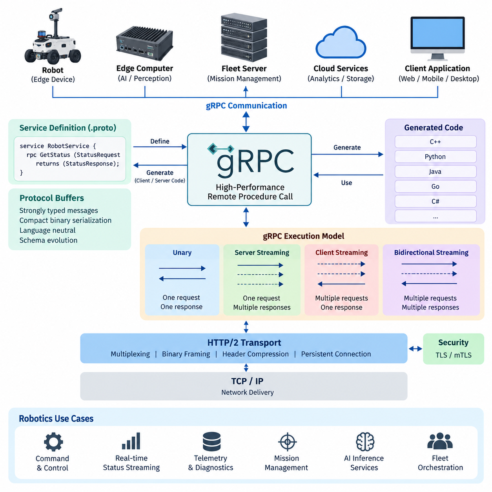{width="7.268055555555556in" height="7.268055555555556in"}

gRPC is a high-performance remote procedure call framework designed for communication between distributed software components. Instead of exposing resources through URLs in the style of REST, gRPC models communication as service methods that clients invoke remotely. This approach is particularly suitable for robotics systems where edge computers, fleet servers, AI services, and cloud components exchange structured data with low latency.

The architecture of gRPC is based on an explicit service contract shared between clients and servers. A service defines callable operations, while messages define the information exchanged through those operations. From an application perspective, a remote operation can therefore appear similar to calling a local function, although network transport, serialization, connection management, failures, and distributed execution remain important architectural concerns.

Protocol Buffers, commonly called Protobuf, provide the Interface Definition Language and binary serialization mechanism normally used by gRPC. Developers describe services, methods, request messages, and response messages in .proto definitions. These definitions form a language-neutral contract from which tools can generate client and server code for languages such as C++, Python, Java, Go, C#, and others used across heterogeneous robot software environments.

A Protobuf message consists of strongly typed fields identified by stable numeric field numbers. Instead of repeatedly transmitting textual field names as JSON normally does, the binary representation encodes data compactly using these identifiers and efficient primitive representations. This can reduce payload size and serialization overhead, which becomes valuable when robots continuously exchange state, localization results, diagnostics, mission information, perception metadata, or AI inference results.

Schema evolution is another important property of Protocol Buffers. Existing field numbers should remain stable, while new fields can normally be introduced without forcing every component to upgrade simultaneously. Unknown fields can be handled without requiring older software to understand their meaning. This enables gradual deployment across robot fleets, edge computers, servers, and cloud services, provided developers follow compatibility rules and avoid unsafe reuse of previously assigned field numbers.

The transport foundation of conventional gRPC is HTTP/2. HTTP/2 maintains a connection while allowing multiple independent streams to operate concurrently over it. Consequently, several RPC operations can share one TCP connection rather than requiring a separate connection for every transaction. This multiplexing model is useful when a robot simultaneously communicates command requests, status information, diagnostics, configuration data, mission progress, and other service traffic.

HTTP/2 also introduces binary framing and stream-level organization beneath the gRPC programming model. Requests and responses are divided into frames that can be interleaved across streams while remaining logically independent. Header compression reduces repeated metadata overhead, and persistent connections avoid unnecessary connection establishment. gRPC uses these transport capabilities to provide an efficient communication substrate without requiring application developers to directly manipulate HTTP/2 frames.

The gRPC execution model supports more than conventional request-response communication. Unary RPC performs one request followed by one response, while server streaming allows one request to produce a sequence of responses. Client streaming allows multiple client messages to produce a response, and bidirectional streaming permits both endpoints to exchange message sequences independently. These patterns provide a unified foundation for many robot communication requirements.

In a robotics architecture, unary RPC can handle configuration queries, command submission, health checks, or AI inference requests whose inputs and outputs are bounded. Server streaming can distribute continuously changing robot status or mission progress, while client streaming can transfer sequences of measurements or accumulated observations. Bidirectional streaming can support interactive coordination where commands, acknowledgements, state transitions, and operational feedback must coexist within a persistent session.

Generated stubs are central to the gRPC programming model. On the client side, generated code exposes service methods through a strongly defined API and converts application objects into serialized Protobuf messages. The server receives those messages, reconstructs the corresponding data structures, invokes the implemented service logic, and serializes the response. This generated interface removes much repetitive networking code while preserving an explicit machine-readable contract.

The overall architecture can therefore be understood as several cooperating layers. Application logic interacts with generated client or server interfaces; Protobuf defines the service contract and encodes structured messages; the gRPC runtime manages RPC semantics, metadata, deadlines, streaming, and status handling; HTTP/2 provides multiplexed transport; and TCP and IP provide the underlying network delivery. Security can additionally be applied through TLS or mutual TLS according to deployment requirements.

For robot systems, this separation is useful because communication contracts can remain stable while implementations evolve independently. A perception service running on an edge GPU, a mission manager on an industrial computer, and a fleet orchestration service on an on-premise server can use different programming languages and deployment environments while sharing the same Protobuf definitions. The contract becomes a controlled boundary between independently developed software components.

gRPC should nevertheless be treated as distributed communication rather than as a transparent replacement for local function calls. Remote calls experience latency, connection failures, unavailable services, partial execution, congestion, and timeout conditions that do not exist in ordinary in-process calls. Robot software must therefore define appropriate deadlines, cancellation behavior, retry policies, idempotency assumptions, error handling, and failure containment according to the criticality of each operation.

Within the communication architecture of a modern robot, gRPC is especially effective for structured machine-to-machine interfaces requiring efficient serialization, strong contracts, and streaming capabilities. Protocol Buffers provide the shared data and service model, HTTP/2 supplies the multiplexed transport foundation, and the gRPC runtime integrates them into a consistent RPC abstraction. Together, these mechanisms support scalable communication among robots, edge systems, fleet platforms, AI services, and cloud infrastructure.

## 02.02 Protobuf Message Definition and Code Generation [w/Code]

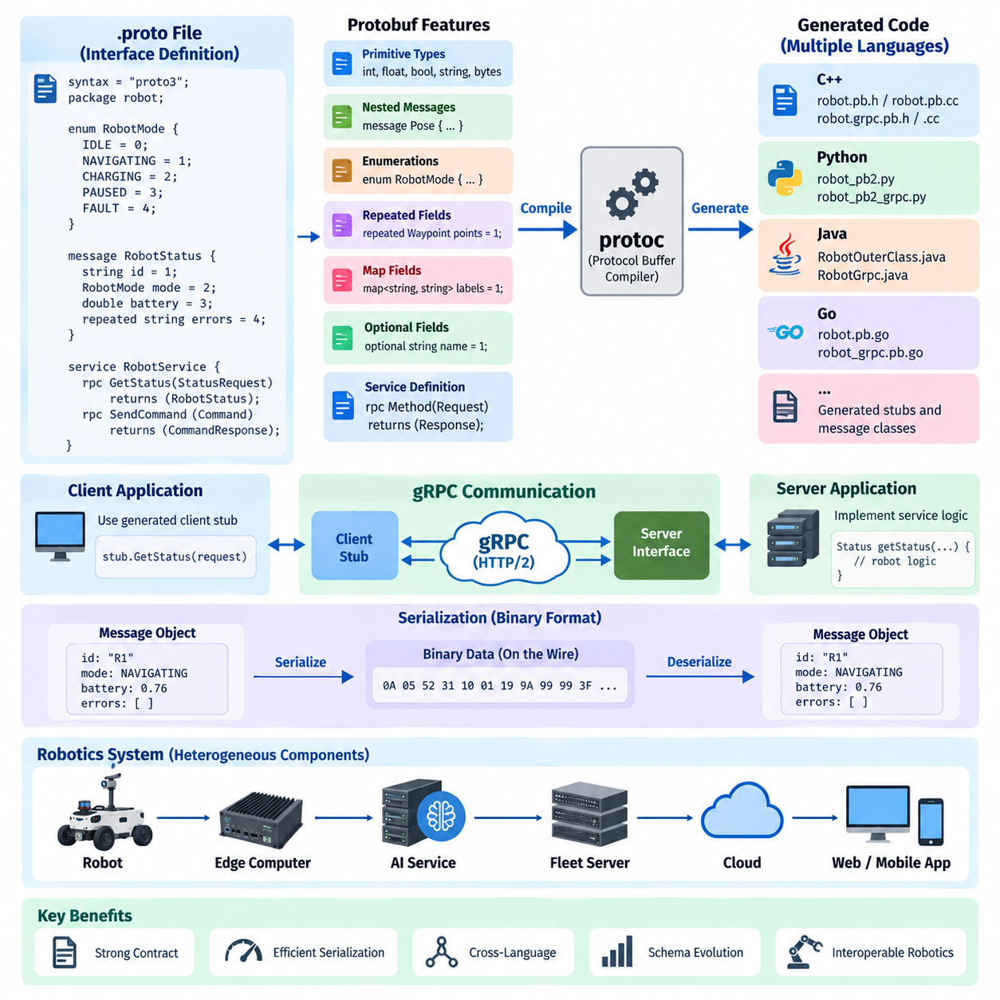{width="7.268055555555556in" height="7.268055555555556in"}

Protocol Buffers, commonly abbreviated as Protobuf, provide the schema and serialization foundation used by gRPC to define structured communication between distributed components. Instead of describing exchanged data informally in application code, developers create explicit message definitions in .proto files. These definitions establish a shared contract that can be used consistently by robots, edge computers, fleet servers, AI services, and cloud applications.

A .proto file describes the structure of messages independently from the programming language used to implement the communicating applications. Each message contains named fields with explicitly declared data types and unique numeric identifiers. Primitive types include integers, floating-point values, Boolean values, strings, and byte sequences, while developers can also compose complex structures by embedding other message types or defining repeated collections.

The numeric identifier assigned to each Protobuf field is fundamental to its binary representation. During serialization, the field number rather than the textual field name identifies information on the wire. Consequently, field numbers become part of the persistent communication contract and should not be casually changed or reused. Careful field-number management is therefore essential when robot software must remain compatible across multiple deployed versions.

Protobuf supports nested messages, enumerations, repeated fields, maps, optional fields, and references to message types defined elsewhere. These mechanisms allow developers to represent sophisticated robot information without depending on language-specific classes. Robot pose, velocity, battery state, sensor health, mission status, navigation commands, diagnostic events, and AI inference results can all be modeled as structured messages with clearly defined semantics.

Enumerations are useful when a field represents one value from a controlled set of states. A robot operating mode, for example, may represent idle, navigating, charging, paused, or fault conditions through symbolic enumeration values rather than arbitrary strings. This reduces ambiguity between independently developed components and allows generated source code to expose these values through native language constructs.

Repeated fields represent zero or more occurrences of the same data type and are useful for collections such as detected objects, waypoints, diagnostic records, or fleet members. Map fields represent key-value relationships, while nested message definitions allow logically related structures to remain grouped. These constructs make Protobuf suitable for both compact telemetry messages and more elaborate mission or perception data models.

Service definitions can be placed in the same .proto contract as message definitions. A service declares RPC methods and specifies the request and response message type associated with each operation. For example, a robot service can define methods for retrieving status, submitting a mission, cancelling an operation, or requesting diagnostics. The contract describes the interface without embedding the actual business or control logic.

The Protobuf compiler, protoc, transforms .proto definitions into programming-language-specific source code. Developers select the required language and appropriate plugins, and the compiler generates classes or structures representing messages. In a gRPC workflow, additional generated code provides client stubs and server interfaces corresponding to the declared RPC services, creating a direct connection between the interface definition and application implementation.

Generated message classes provide serialization and deserialization functionality without requiring developers to manually encode binary packets. Application software creates a generated message object, assigns values to its fields, and passes the object to the communication layer. The Protobuf runtime serializes it into the wire representation, while the receiving application reconstructs the corresponding generated object from the received bytes.

Generated gRPC client code typically provides a stub through which an application invokes remote service methods. The developer works with typed request and response objects rather than manually constructing HTTP messages or binary frames. On the server side, generated interfaces define methods that application developers implement with actual robot, fleet, AI, or cloud logic. This separation reduces repetitive communication code and keeps interfaces synchronized with the schema.

One important advantage of code generation is consistent cross-language communication. A robot controller implemented in C++ can communicate with a Python AI inference service, a Go fleet backend, or a Java enterprise application using the same .proto definition. Each component receives language-appropriate generated types while the serialized wire format remains consistent, allowing heterogeneous software stacks to share one communication contract.

Schema evolution must be considered from the beginning of Protobuf interface design. New fields can generally be added using previously unused field numbers while older components continue processing fields they recognize. Fields that are removed should not have their numeric identifiers reused for unrelated meanings. Reserved field numbers and names can be used to prevent accidental reuse and preserve long-term compatibility across evolving robot software releases.

Compatibility becomes particularly important for fleets because robots are rarely upgraded simultaneously. Some units may temporarily run older software while servers or edge services have already moved to newer versions. A carefully evolved Protobuf schema allows these versions to coexist during staged deployment. This reduces the operational risk associated with software updates and enables gradual migration across distributed robotic infrastructure.

Protobuf definitions should therefore be treated as managed interface assets rather than temporary serialization files. Changes should be reviewed, version controlled, tested for compatibility, and coordinated with generated artifacts and dependent services. In large robotics platforms, automated build pipelines can regenerate language bindings whenever approved schemas change and verify that clients and servers continue to compile against the intended contract.

For robotics, effective message design also requires attention to semantics rather than only binary efficiency. Units, coordinate frames, timestamps, identifiers, validity conditions, and state meanings should be unambiguous. A technically valid message containing an unspecified coordinate frame or unclear timestamp origin can still produce dangerous integration errors. The schema should therefore express stable interface meaning while application documentation defines operational interpretation where necessary.

Protobuf and its code-generation workflow ultimately create a common communication language across distributed robot software. The .proto schema defines structured messages and RPC interfaces, protoc converts those definitions into language-specific representations, and generated code handles much of the serialization and communication plumbing. This contract-first approach provides a scalable foundation for interoperable robot, edge, fleet, AI, and cloud services.

## 02.03 gRPC Unary, Server, Client, Bidirectional Streaming [w/Code]

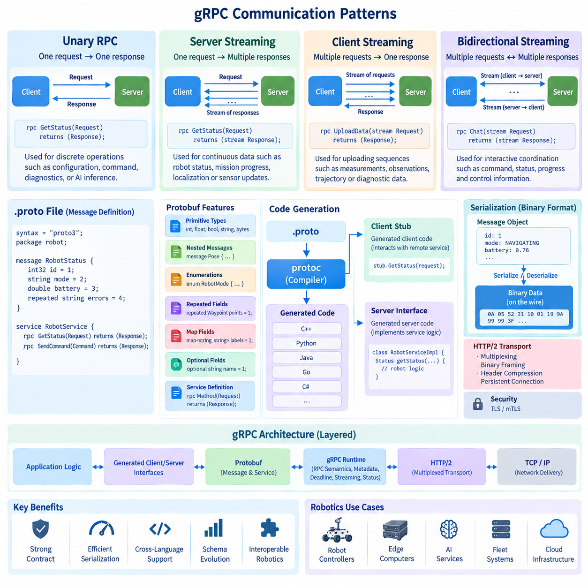{width="7.268055555555556in" height="7.268055555555556in"}

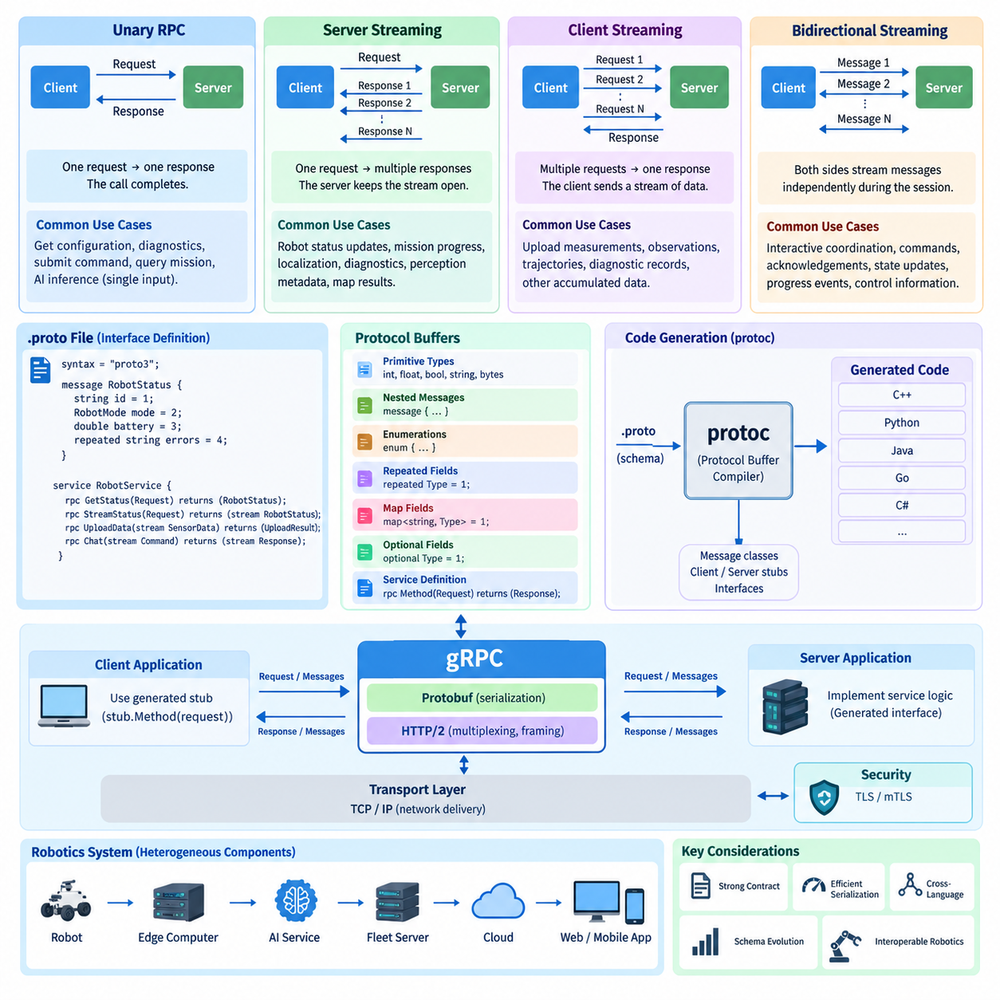{width="7.268055555555556in" height="7.268055555555556in"}

gRPC provides four fundamental communication patterns that determine how requests and responses flow between a client and a server: unary RPC, server streaming, client streaming, and bidirectional streaming. These models share the same Protocol Buffers and HTTP/2 foundation but provide different interaction semantics. Selecting the appropriate pattern allows robot communication interfaces to match the timing, direction, and volume of actual operational data.

Unary RPC is the simplest communication model and most closely resembles a conventional function call. The client sends one request message, the server processes that request, and exactly one response message is returned. The RPC then completes. This model is appropriate when an operation has a clearly bounded input and output, making it straightforward to understand, implement, test, monitor, and recover when communication failures occur.

In robotics, unary RPC is suitable for operations such as requesting the current robot configuration, retrieving a diagnostic snapshot, submitting a discrete command, querying mission information, or invoking an AI inference service for a single input. A fleet manager might send a mission request and receive an acknowledgement containing a mission identifier, while subsequent progress information can be delivered through another communication mechanism.

Server streaming extends the request-response model by allowing a single client request to produce multiple response messages over time. After receiving the initial request, the server keeps the RPC stream open and sends a sequence of messages until processing finishes, the client cancels the operation, a deadline expires, or an error terminates the stream. The client therefore consumes responses incrementally instead of waiting for one complete result.

This model is particularly useful when a robot or server continuously produces information requested by another component. A monitoring application can request robot status updates and receive new state messages as they become available. Similar patterns can distribute mission progress, localization updates, diagnostic events, perception metadata, map-processing results, or other evolving information without requiring the client to repeatedly issue polling requests.

Client streaming reverses the direction of the streaming relationship. The client opens an RPC and transmits multiple request messages while the server receives and processes the sequence. After the client finishes sending data, the server normally returns a single response. This model is appropriate when information is naturally accumulated or generated incrementally on the client side but the server needs to produce one final result for the complete sequence.

A robot can use client streaming to upload a sequence of measurements, observations, trajectory samples, diagnostic records, or other structured data to an edge or server application. Instead of constructing one very large request, data can be transmitted progressively through the stream. The server may process incoming messages incrementally and return a summary, acknowledgement, aggregated result, or final processing status when transmission has completed.

Bidirectional streaming provides the most flexible gRPC interaction model. Both the client and server operate with message streams, allowing each side to send multiple messages independently during the lifetime of the RPC. A message sent in one direction does not necessarily require an immediate corresponding message in the opposite direction. This enables asynchronous conversational communication while retaining a strongly defined Protobuf service contract.

For robotic systems, bidirectional streaming can support interactive coordination between a robot and a fleet controller, edge intelligence service, or remote operation system. Commands, acknowledgements, state updates, progress events, and control information can coexist within a persistent communication session. The two endpoints can react to incoming information while continuing to produce their own outgoing messages according to application logic and operating conditions.

The four communication patterns are declared directly in the gRPC service definition. A unary method uses one request and one response type without stream modifiers. Server streaming marks the response as a stream, client streaming marks the request as a stream, and bidirectional streaming marks both sides as streams. The generated client and server interfaces then expose programming constructs appropriate to the declared communication pattern.

HTTP/2 provides the transport capabilities that make these streaming models practical. Multiple gRPC calls can operate concurrently as independent HTTP/2 streams over a persistent connection. Binary framing separates logical streams while allowing their frames to share the underlying connection. This means a robot can maintain several RPC interactions for different services without requiring an independent TCP connection for every logical communication flow.

Streaming does not mean that every robot data path should automatically use a long-lived gRPC stream. Unary RPC is often preferable for discrete operations because its lifecycle and failure semantics are simpler. Streaming becomes valuable when information naturally arrives as a sequence, when repeated polling would introduce unnecessary overhead, or when both endpoints require continuing interaction. Interface design should therefore follow communication semantics rather than selecting streaming only for performance.

Flow control is especially important in streaming applications because producers and consumers may operate at different rates. A robot can generate telemetry or perception results faster than a remote service can process them, while network bandwidth can also vary during operation. gRPC and HTTP/2 provide transport-level flow-control mechanisms, but application design must still consider buffering, queue limits, message frequency, data reduction, and behavior under sustained overload.

Deadlines, cancellation, and error handling also require careful treatment. A client may specify how long an RPC is allowed to remain active, and either endpoint may encounter conditions that require the stream to terminate. Robot applications should distinguish normal completion from cancellation, network interruption, server failure, and application-level faults. Long-lived streams additionally require reconnection and state-recovery strategies when communication is interrupted.

Streaming interfaces should not be confused with deterministic real-time control buses. Although gRPC can provide efficient low-latency communication between robot computers, edge services, and servers, its behavior depends on operating systems, TCP, HTTP/2, scheduling, and network conditions. Safety-critical motor loops and tightly bounded hard real-time control generally require communication mechanisms designed specifically for deterministic execution rather than ordinary network RPC.

A practical robotics architecture can combine all four gRPC models according to service requirements. Unary calls can handle configuration and discrete commands, server streams can distribute status and mission progress, client streams can upload accumulated observations, and bidirectional streams can support persistent coordination. This combination allows one service framework to represent different communication behaviors while preserving common schemas, generated interfaces, security mechanisms, and operational tooling.

The primary architectural advantage of gRPC streaming is therefore not simply continuous data transfer, but the ability to express communication direction and lifecycle explicitly in the service contract. Unary, server-streaming, client-streaming, and bidirectional methods give designers precise abstractions for different robot interactions. When combined with Protocol Buffers and HTTP/2, they provide a structured foundation for scalable communication among robots, edge computers, AI services, fleet systems, and cloud infrastructure.

## 02.04 gRPC Interceptors: Auth, Logging, Metrics [w/Code]

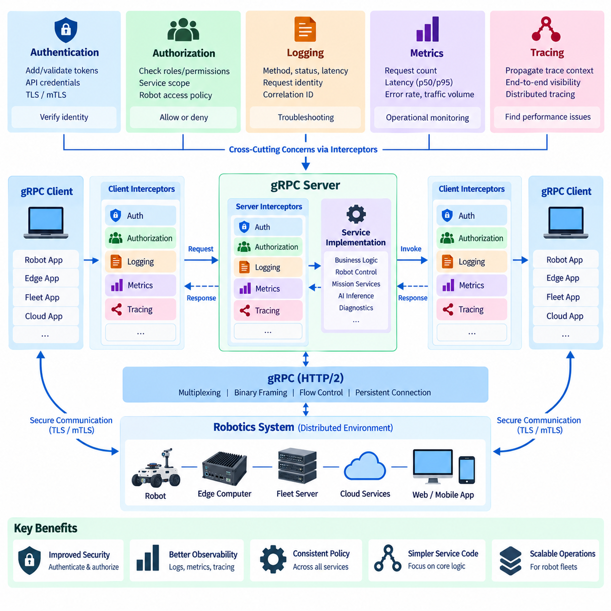{width="7.268055555555556in" height="7.268055555555556in"}

gRPC interceptors provide a structured mechanism for executing common logic before or after Remote Procedure Call processing without embedding that logic directly inside every service method. They operate around the RPC invocation path and can observe, modify, accept, reject, or record communication activities. In distributed robotics systems, interceptors are particularly useful for implementing authentication, logging, metrics, tracing, policy enforcement, and other cross-cutting concerns consistently across services.

An interceptor can be conceptually understood as middleware positioned between application code and the gRPC runtime. On the client side, it can execute before an outgoing RPC is transmitted or after its result becomes available. On the server side, it can inspect an incoming call before application service logic executes and process information after execution. This creates a reusable control point around RPC traffic without modifying the fundamental Protobuf service contract.

Client interceptors are useful when common metadata or operational behavior must be applied to many outgoing requests. Instead of requiring every call site to attach authentication credentials, correlation identifiers, tracing information, or diagnostic metadata manually, an interceptor can perform the operation automatically. This reduces duplicated code and helps ensure that communication policies are applied consistently across robot, edge, fleet, and cloud applications.

Server interceptors provide a corresponding mechanism for controlling incoming RPC operations. Before forwarding a request to the actual service implementation, an interceptor can inspect metadata, validate credentials, establish request context, record timing information, or reject unauthorized operations. After service execution, it can capture completion status and latency. This separation allows service methods to concentrate primarily on robot or application functionality.

Authentication is one of the most important interceptor applications. A client interceptor can attach an access token, API credential, or other authentication metadata to an outgoing RPC. A server interceptor can extract this information, validate it, determine the identity associated with the request, and decide whether processing should continue. Transport security such as TLS or mutual TLS can operate alongside these application-level identity mechanisms.

Authentication and authorization should remain conceptually distinct. Authentication determines who or what is making a request, whereas authorization determines whether that authenticated identity is permitted to perform a specific operation. After validating identity, an interceptor or associated policy layer can evaluate roles, permissions, robot identifiers, service scopes, or operational policies before allowing access to commands, mission functions, diagnostics, or administrative interfaces.

For robotic fleets, centralized authorization behavior can reduce the risk of inconsistent access checks across individual service implementations. A maintenance application may be permitted to read diagnostics but not issue navigation commands, while a fleet controller may require permission to assign missions to a defined group of robots. Interceptors provide a common enforcement point where identity and RPC method information can be evaluated before operational logic executes.

Logging is another major use of interceptors because distributed robot systems generate interactions across many processes and computers. An interceptor can record the RPC service and method, request identity, start time, completion time, status code, and other relevant metadata. Centralized logging produces a more uniform record than independently implemented logging inside every service method and simplifies troubleshooting across distributed communication paths.

Logging design must avoid indiscriminately recording complete request and response payloads. Robot messages can contain large sensor data, proprietary information, credentials, tokens, or other sensitive content. Logging policies should therefore distinguish operational metadata from payload data and apply filtering, redaction, sampling, or size limits where appropriate. The objective is useful observability without creating excessive storage, performance overhead, or security exposure.

Correlation identifiers are especially valuable when one operation passes through several distributed services. A mission request might travel from a fleet application to a mission service, then to an edge computer and eventually to a robot control component. By propagating a request or trace identifier through gRPC metadata, logs produced by different services can be associated with the same logical operation, greatly improving end-to-end fault investigation.

Metrics interceptors transform RPC activity into quantitative operational measurements. Typical measurements include request counts, successful and failed calls, response latency, active streams, transferred message volume, and status-code distributions. Because interceptors observe calls at a common boundary, these metrics can be collected systematically across many services without requiring each business function to implement its own measurement logic.

Latency metrics are particularly important in robotics because communication performance can directly affect mission responsiveness and distributed coordination. Average latency alone is insufficient because occasional slow calls may be hidden by the mean. Operational monitoring commonly examines latency distributions and percentiles together with error rates and request volume. These measurements help identify overloaded services, network degradation, resource contention, or abnormal communication behavior.

Streaming RPCs require different observability considerations from unary calls. A unary RPC has a relatively simple start and completion boundary, while server, client, and bidirectional streams can remain active for long periods and exchange many messages. Metrics may therefore track stream duration, active stream count, messages sent and received, termination reasons, and reconnection behavior rather than treating the entire stream as equivalent to a short request-response transaction.

Interceptors can also support distributed tracing by creating or propagating trace context through gRPC metadata. Each service involved in an operation can contribute timing and execution information to the same distributed trace. When robot commands pass through fleet, edge, AI, and control services, tracing helps engineers determine where time was spent and where failures occurred. This complements logs and metrics rather than replacing them.

Interceptor ordering must be designed carefully when several cross-cutting functions are combined. Authentication may need to execute before application-specific logging, while tracing context may need to be established early enough to cover authorization and service processing. Metrics should capture both successful and rejected calls when operationally relevant. A clearly defined interceptor chain makes this behavior predictable and avoids hidden dependencies among middleware functions.

Interceptors should remain lightweight because every RPC passing through them can inherit their computational cost. Expensive synchronous logging, remote database access, complex policy evaluation, or excessive payload inspection can increase latency and reduce throughput. Robot communication infrastructure should therefore keep frequently executed interceptor logic bounded and efficient while moving expensive processing to asynchronous pipelines or specialized observability systems when possible.

A well-designed gRPC service architecture uses interceptors as a common operational layer surrounding generated service interfaces and application logic. Authentication establishes identity, authorization controls permitted actions, logging records important events, metrics quantify behavior, and tracing connects distributed operations. Together, these mechanisms improve security and observability while allowing robot, edge, fleet, AI, and cloud service implementations to remain focused on their primary functional responsibilities.

## 02.05 gRPC Error Handling and Status Codes [w/Code]

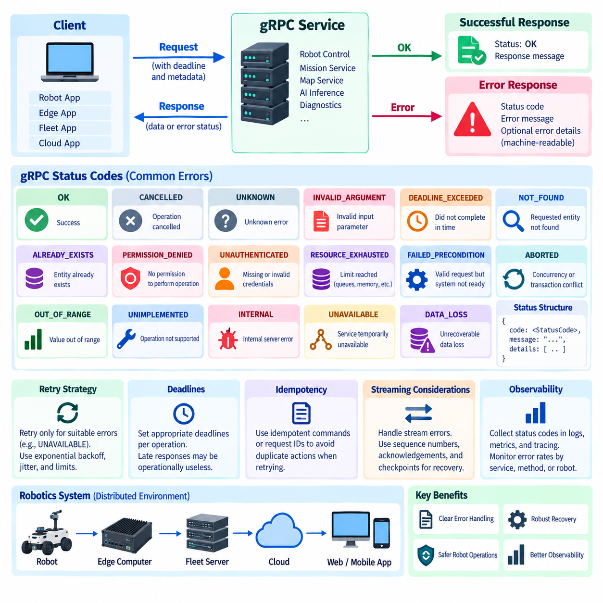{width="7.268055555555556in" height="7.268055555555556in"}

gRPC error handling provides a standardized mechanism for communicating whether a Remote Procedure Call completed successfully or failed and why. Instead of relying only on application-specific error strings, gRPC defines a common status model that can be interpreted consistently across different programming languages and distributed services. This is important in robotics, where failures may originate from clients, servers, networks, edge computers, fleet systems, or application logic.

Every completed gRPC operation has a status representing the outcome of the RPC. Successful execution is represented by OK, while failures are expressed through predefined status codes together with optional descriptive information. This separates transport and service-level failure reporting from the normal response message and allows generated client libraries to expose errors through language-appropriate exceptions, status objects, callbacks, or return mechanisms.

The status code UNKNOWN represents an error whose precise classification cannot be determined, while INTERNAL indicates an internal failure in the service or underlying processing. These codes should not replace more specific errors when the cause is known. In robot systems, meaningful classification is important because a fleet manager must distinguish an invalid command from a temporarily unavailable robot or a failure inside a remote service.

INVALID_ARGUMENT indicates that the client supplied an argument that is invalid regardless of the current system state. For example, a negative velocity limit, malformed coordinate value, unsupported operating parameter, or structurally invalid mission request may produce this status. FAILED_PRECONDITION is different because the request may be valid in itself but cannot be executed because the system is currently in an unsuitable state.

FAILED_PRECONDITION is particularly relevant to physical robot operations. A request to begin navigation may be structurally correct but impossible because localization has not converged, an emergency condition is active, required sensors are unavailable, or the robot has not entered the appropriate operating mode. Separating invalid input from an unmet operational condition helps clients determine whether to correct the request or wait for system state to change.

NOT_FOUND indicates that a requested entity does not exist, while ALREADY_EXISTS indicates that an entity the client attempted to create already exists. These statuses can represent missing robot identifiers, mission records, maps, configuration profiles, or resources managed by fleet services. Consistent use of these codes makes service behavior easier to understand and avoids creating different application-specific error conventions for similar conditions.

PERMISSION_DENIED indicates that the caller has been identified but does not have permission to perform the requested operation. UNAUTHENTICATED indicates that valid authentication credentials are absent or cannot establish the caller\'s identity. Maintaining this distinction is important for secure robot APIs because authentication failures and authorization failures represent different security conditions and may require different operational responses.

RESOURCE_EXHAUSTED represents situations in which a required resource limit has been reached. A service may be unable to accept additional requests because of queue capacity, memory pressure, processing quotas, connection limits, or another bounded resource. In a fleet environment, this status can indicate temporary saturation rather than a permanent application failure, allowing clients and monitoring systems to recognize capacity-related problems.

UNAVAILABLE normally represents a service that cannot currently process the request but may become available later. It can occur during service restart, temporary network disruption, load-balancer transition, or loss of connectivity to a dependent component. Because the condition may be transient, clients sometimes retry such calls. Retries must nevertheless be designed carefully to avoid duplicate physical actions, excessive traffic, or synchronized retry storms.

DEADLINE_EXCEEDED indicates that an RPC did not complete within its allowed deadline. Deadlines are important because a response that arrives too late can be operationally useless even if the server eventually completes its work. Robot clients should therefore define deadlines according to the semantics of each operation rather than using one universal timeout for configuration queries, mission requests, AI inference, diagnostics, and interactive control.

CANCELLED indicates that the operation was cancelled, commonly because the client no longer requires the result or the surrounding task has been terminated. Cancellation can propagate through distributed service chains so downstream work does not continue unnecessarily. In robotics, this is useful when a mission is replaced, an operator aborts an operation, or a higher-level planner invalidates a request that is still being processed.

ABORTED is generally associated with an operation that cannot complete because of concurrency or transaction-like conflicts, while OUT_OF_RANGE indicates that an operation was attempted outside an allowed range. UNIMPLEMENTED indicates that an operation or functionality is not supported by the service. DATA_LOSS represents unrecoverable loss or corruption of data and should be treated as a serious condition rather than an ordinary transient communication failure.

Error handling should combine standardized gRPC status codes with meaningful application context. A status such as FAILED_PRECONDITION tells the client the general failure category, while additional error details can explain that localization is unavailable, the safety state prevents motion, or charging must complete first. Machine-readable details are preferable when clients must automatically determine recovery actions, while human-readable descriptions remain valuable for diagnostics.

Retry behavior should be based on error semantics rather than applied uniformly to every failed RPC. INVALID_ARGUMENT, PERMISSION_DENIED, or UNAUTHENTICATED generally require correction or intervention rather than immediate repetition. UNAVAILABLE or certain resource-related failures may justify controlled retries. Exponential backoff, jitter, retry limits, and deadlines help prevent repeated requests from increasing load during an already degraded condition.

Idempotency becomes critical when retries involve commands that can change the physical world. If a client loses the response after sending a command, it may not know whether the server executed the operation before communication failed. Repeating a non-idempotent request could create duplicate missions or actions. Command identifiers, request deduplication, explicit state checks, and carefully designed idempotent APIs can reduce this risk.

Streaming RPCs introduce additional failure considerations because an error may occur after many messages have already been exchanged. When a stream terminates, applications must determine which information was successfully processed and whether reconnection should resume, restart, or abandon the operation. Sequence numbers, acknowledgements, checkpoints, and application-level state can be necessary when reliable recovery from interrupted robot telemetry or coordination streams is required.

Error handling should also integrate with observability. Status codes can be recorded by interceptors and aggregated into metrics showing failure rates by service, method, robot, or error category. Logs can preserve relevant context, while distributed tracing can identify where a failure originated across fleet, edge, AI, and cloud services. A sudden increase in UNAVAILABLE or DEADLINE_EXCEEDED responses can therefore become an operational signal rather than isolated application errors.

In a robust robotics architecture, gRPC status codes form a common failure language between distributed components. Standardized categories identify the nature of failures, deadlines constrain how long operations remain useful, cancellation prevents unnecessary work, retry policies address selected transient conditions, and application-specific details explain operational causes. Combined with idempotent command design and observability, these mechanisms support predictable recovery across robot, edge, fleet, AI, and cloud services.

## 02.06 gRPC Load Balancing and Service Discovery [w/Code]

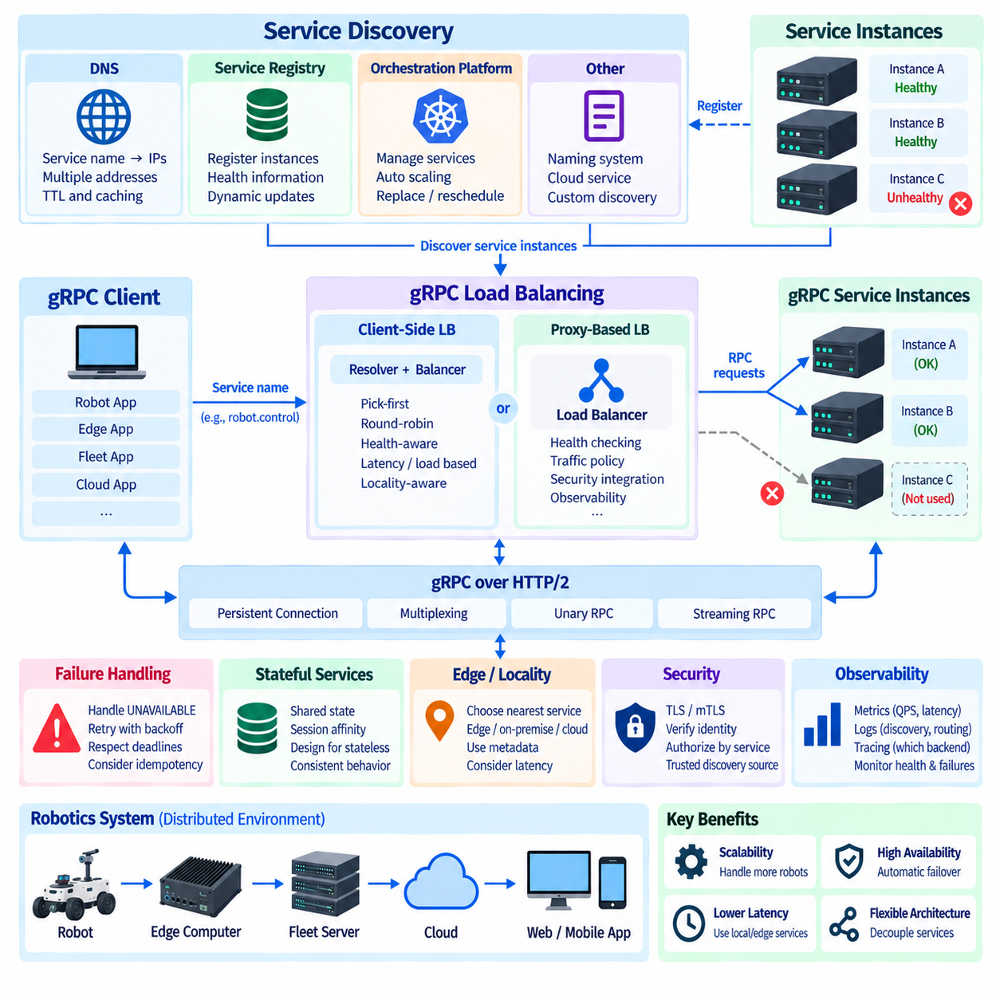{width="7.268055555555556in" height="7.268055555555556in"}

As gRPC-based systems grow from a single client and server into distributed deployments, multiple instances of the same service are often required for scalability and availability. Load balancing distributes RPC traffic among these instances, while service discovery determines which instances are currently available and where they can be reached. Together, these mechanisms allow robot, edge, fleet, AI, and cloud services to operate without depending on one fixed server endpoint.

A simple gRPC deployment may configure a client with a static server address. This approach is practical for small systems but becomes difficult to manage when services are replicated, restarted, relocated, or dynamically scaled. In larger robotics platforms, clients need a mechanism that resolves a logical service identity into one or more reachable endpoints and continuously adapts as the set of healthy service instances changes.

Service discovery provides this dynamic mapping between a service name and its active network locations. A discovery mechanism may obtain endpoints through DNS, a service registry, an orchestration platform, or another naming system. Instead of embedding individual server addresses into robot applications, the client can reference a stable logical service name while infrastructure determines the current addresses of the service instances that implement it.

DNS-based discovery is one of the simplest approaches. Multiple addresses can be associated with a service name, allowing clients or supporting infrastructure to discover several backend instances. This works well when endpoint changes are relatively manageable, but designers must consider DNS caching, record update delays, time-to-live settings, and how quickly failed or newly created service instances become visible to clients.

A service registry provides more explicit discovery behavior. Service instances register their network location and related metadata, while clients or infrastructure query the registry to determine available endpoints. Registries can be combined with health information so that failed instances are removed from the usable endpoint set. This model is useful in dynamic environments where edge services, fleet backends, and AI inference workers may be created or removed during operation.

Container orchestration platforms can integrate service discovery directly into deployment infrastructure. When gRPC services run as replicated containers, the orchestration environment can maintain logical service identities and map them to currently running instances. This allows application-level interfaces to remain stable even when individual containers are replaced, rescheduled, or scaled, which is particularly valuable for on-premise fleet servers and cloud robotics backends.

Load balancing determines how requests are distributed after multiple service endpoints have been discovered. One common approach is proxy-based load balancing, in which clients connect to an intermediate load balancer that selects a backend server. The proxy centralizes routing decisions and can provide health checking, traffic policy, security integration, and observability, but it also introduces an additional network hop and infrastructure component into the communication path.

Client-side load balancing moves endpoint selection into the gRPC client or its supporting resolver and balancing components. The client discovers multiple backend addresses and chooses an appropriate instance for each RPC according to a configured policy. This avoids routing every request through a centralized application proxy and can provide efficient communication, but clients must receive accurate endpoint and health information to make effective decisions.

A basic selection strategy is pick-first, where the client attempts to use one suitable endpoint from the resolved address set and continues using it while the connection remains usable. Another common strategy is round-robin, which distributes calls across multiple available backends. More advanced infrastructure may consider backend load, locality, health, latency, capacity, or traffic-management policies when selecting destinations.

Health checking is essential because discovery alone does not guarantee that a discovered endpoint can successfully process requests. A process may exist but be unable to reach a database, AI accelerator, robot gateway, or other required dependency. Health mechanisms should therefore distinguish basic process availability from service readiness where appropriate, preventing traffic from being routed to an instance that is running but not operationally ready.

gRPC connections are persistent, which affects load-balancing behavior. HTTP/2 allows many RPCs to share a single connection, so simply placing a conventional connection-level load balancer in front of multiple servers does not always produce even RPC distribution. A long-lived client connection may continue sending many calls through the same backend. Load-balancing architecture should therefore consider RPC-level behavior rather than assuming that TCP connection distribution automatically provides balanced application traffic.

Streaming RPCs require additional consideration because a long-lived stream is normally associated with a particular backend for its lifetime. Moving an active bidirectional or server stream between service instances is fundamentally different from routing independent unary calls. If a backend fails, the application may need to reconnect, rediscover endpoints, recreate the stream, and restore application state rather than expecting transparent migration of an existing stream.

Stateful services also complicate load balancing. If a service keeps mission context, robot session state, or stream-specific information only in local memory, sending subsequent requests to another instance may produce inconsistent behavior. Distributed robotics systems can address this through externalized shared state, explicit session ownership, affinity mechanisms, or APIs designed so that service instances remain sufficiently stateless for flexible routing.

Failure handling connects service discovery and load balancing with gRPC status semantics. When an endpoint becomes unavailable, clients may receive errors such as UNAVAILABLE and attempt another healthy endpoint when retry policy and operation semantics permit. Endpoint failover must still respect deadlines and idempotency because automatically repeating a physical robot command can be unsafe if the original server executed the command before the connection failed.

Load balancing should also account for locality in edge robotics. A robot may have access to a local edge AI service, an on-premise server, and a remote cloud service providing similar capabilities but with very different latency and connectivity characteristics. Discovery metadata and routing policy can help select services according to site, network zone, hardware capability, or deployment tier instead of treating every endpoint as operationally equivalent.

Observability is necessary to verify that traffic distribution works as intended. Metrics can track request volume, active connections, RPC latency, error rates, backend utilization, endpoint health, and failover events. Distributed tracing can reveal which backend processed each request, while logs can record discovery changes and balancing decisions. These signals help identify overloaded instances, unhealthy endpoints, uneven traffic, and repeated reconnection behavior.

Security must remain consistent when endpoints change dynamically. Service discovery should not cause clients to bypass identity verification simply because backend addresses are temporary. TLS or mutual TLS can authenticate communication endpoints, while service identities and authorization policies should remain associated with logical services rather than fragile IP addresses. Discovery information itself should also come from trusted infrastructure to prevent traffic from being redirected to unauthorized services.

In a large robot fleet, these mechanisms allow communication infrastructure to evolve independently from individual robots. Fleet APIs, mission services, map servers, diagnostics services, and AI inference backends can be replicated for capacity and resilience. Clients continue addressing logical services while discovery identifies available instances and load balancing distributes RPCs across them, reducing dependence on manually configured server addresses.

A robust gRPC architecture therefore treats load balancing and service discovery as coordinated capabilities. Discovery maintains an accurate view of available service endpoints, health mechanisms determine which endpoints are ready, and balancing policies select appropriate destinations for RPC traffic. Combined with deadlines, retries, security, state management, and observability, these mechanisms support scalable and resilient communication across distributed robot, edge, fleet, AI, and cloud systems.

## 02.07 gRPC Web: Browser-Based Robot Interface [w/Code]

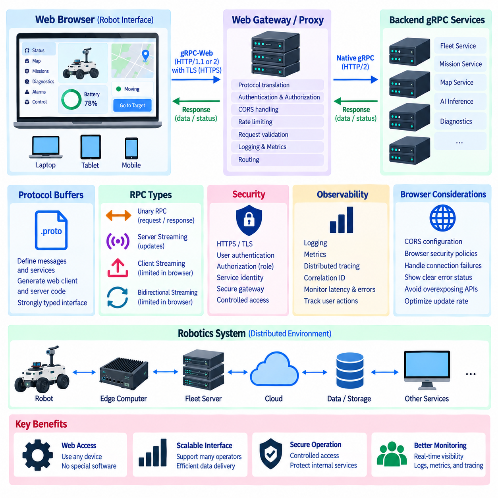{width="7.268055555555556in" height="7.268055555555556in"}

Web browsers are increasingly used as operator interfaces for robots because they provide platform-independent access without requiring dedicated desktop software. A browser-based interface can display robot status, mission progress, diagnostics, maps, alarms, and control functions from laptops, tablets, or industrial terminals. However, conventional native gRPC communication cannot normally be used directly from browser JavaScript in the same manner as a native gRPC client.

The limitation originates from differences between the browser networking environment and the transport behavior expected by native gRPC. Standard gRPC relies on HTTP/2 features and framing that browsers do not expose directly to JavaScript applications. A browser application therefore requires a browser-compatible communication mechanism that preserves the service-oriented advantages of gRPC while adapting transport behavior to restrictions imposed by the web platform.

gRPC-Web provides this compatibility layer for browser-based applications. It allows web clients to communicate with backend services using interfaces derived from Protocol Buffers while adapting gRPC communication to browser-supported HTTP mechanisms. From the application developer\'s perspective, the browser can continue working with strongly defined messages and generated service interfaces instead of manually constructing loosely structured network requests.

A typical architecture places the web browser on one side and native gRPC services on the other, with a compatible proxy or gateway between them when required by the deployment. The browser sends gRPC-Web requests, while the intermediary translates or forwards them toward backend gRPC services. This allows existing robot, edge, fleet, or cloud services to remain based on native gRPC while browser applications use an appropriate web-compatible interface.

Protocol Buffers remain important in this architecture because the same conceptual service contract can be shared across backend and frontend components. Developers define request messages, response messages, and RPC methods in .proto files and generate appropriate client code for the web application. The browser application can therefore use typed objects and predefined service methods while backend implementations use generated interfaces for their own programming languages.

A browser-based robot interface can use unary RPC for many common operator functions. The interface may request the current robot configuration, retrieve mission information, submit a high-level command, acknowledge an alarm, or request a diagnostic snapshot. Each browser action produces a structured request and receives a structured response, making the interaction easier to validate and maintain than an interface based on undocumented message formats.

Server-originated updates are also important because robot interfaces frequently display information that changes continuously. Mission state, battery level, navigation progress, health information, and event notifications may need to appear without repeated manual refreshes. Depending on the gRPC-Web implementation and surrounding architecture, supported streaming mechanisms can deliver sequences of server responses, although browser-oriented streaming capabilities are not identical to unrestricted native gRPC streaming.

This distinction becomes especially important for client streaming and bidirectional streaming. Native gRPC supports both patterns directly, but browser-based gRPC-Web environments can impose limitations depending on the implementation and transport mode. Applications requiring continuous two-way interaction may therefore combine gRPC-Web with another browser-compatible mechanism or redesign the interface so that browser commands use discrete RPC calls while server updates use supported streaming behavior.

The browser interface should normally operate at the supervisory or mission level rather than directly closing safety-critical real-time control loops. An operator can request navigation to a destination, pause a mission, select an operating mode, or inspect diagnostics through the web interface. Low-level motor control, emergency stopping logic, deterministic safety functions, and tightly bounded control loops should remain within robot controllers and communication systems designed for their timing and safety requirements.

Authentication is essential because a browser interface can expose operational capabilities beyond simple monitoring. The application may need to establish user identity and attach authentication information to service requests. Backend services or gateways can then apply authorization policies according to user role, robot identity, site, mission, or requested method. Read-only monitoring functions can therefore be separated from commands that modify robot behavior.

Transport security should protect communication between browsers and service infrastructure. HTTPS and TLS provide confidentiality and server authentication, while deployment architecture may use additional identity mechanisms between gateways and internal gRPC services. Security boundaries should be designed so that exposing a browser interface does not require directly exposing every internal robot service to external networks or untrusted client environments.

Cross-origin resource sharing, commonly called CORS, must also be considered when the browser application and gRPC-Web endpoint are served from different origins. Browsers enforce origin-based security policies that native gRPC clients do not encounter in the same way. The gateway or service infrastructure must therefore provide appropriate CORS configuration while avoiding overly broad policies that unnecessarily expose robot APIs to unauthorized web origins.

A gateway can provide more than protocol translation. It can centralize authentication checks, authorization, rate limiting, request validation, logging, metrics, and routing before browser traffic reaches internal robot services. This creates a controlled boundary between the web-facing environment and operational infrastructure. Internal services can remain focused on robot functions while the gateway manages concerns associated with browser access and external communication.

Observability is especially valuable for operator interfaces because a user action can traverse several distributed components before affecting a robot. A command may travel from the browser through a gateway to a fleet service, then to an edge computer and finally to the robot. Correlation identifiers and distributed tracing can connect these stages, while logs and metrics reveal request latency, failures, authorization decisions, and backend service behavior.

Connection failures and temporary service unavailability must be visible to the browser application rather than being hidden behind a graphical interface. The user interface should distinguish confirmed robot state from stale or unavailable information and should avoid presenting a command as successfully executed merely because the browser transmitted it. gRPC status information can help the application represent rejected requests, deadlines, unavailable services, and other failures explicitly.

Scalability becomes important when many operators or browser sessions monitor a large fleet simultaneously. Repeated high-frequency requests from every browser can create unnecessary load on fleet and robot services. Backend aggregation, controlled update rates, caching, streaming where appropriate, and selective subscriptions can reduce traffic. The web interface should receive the information needed for operational awareness without reproducing every internal robot data stream.

A practical robot web architecture therefore separates presentation, communication, orchestration, and physical control responsibilities. The browser provides visualization and operator interaction, gRPC-Web exposes structured service access, gateways manage browser-facing communication and security, native gRPC connects distributed backend services, and robot controllers execute operational behavior. This separation allows each layer to evolve without forcing browser technologies into low-level robot control.

gRPC-Web ultimately extends contract-based gRPC service design into browser-accessible robot applications. Protocol Buffers preserve structured interfaces, generated clients reduce manual communication code, gateways bridge browser and backend environments, and security and observability mechanisms provide controlled operational access. Used at the appropriate architectural level, this approach enables scalable web dashboards and supervisory interfaces across robots, edge systems, fleet platforms, and cloud infrastructure.

## 02.08 gRPC vs REST Performance Comparison: Robot Scenario

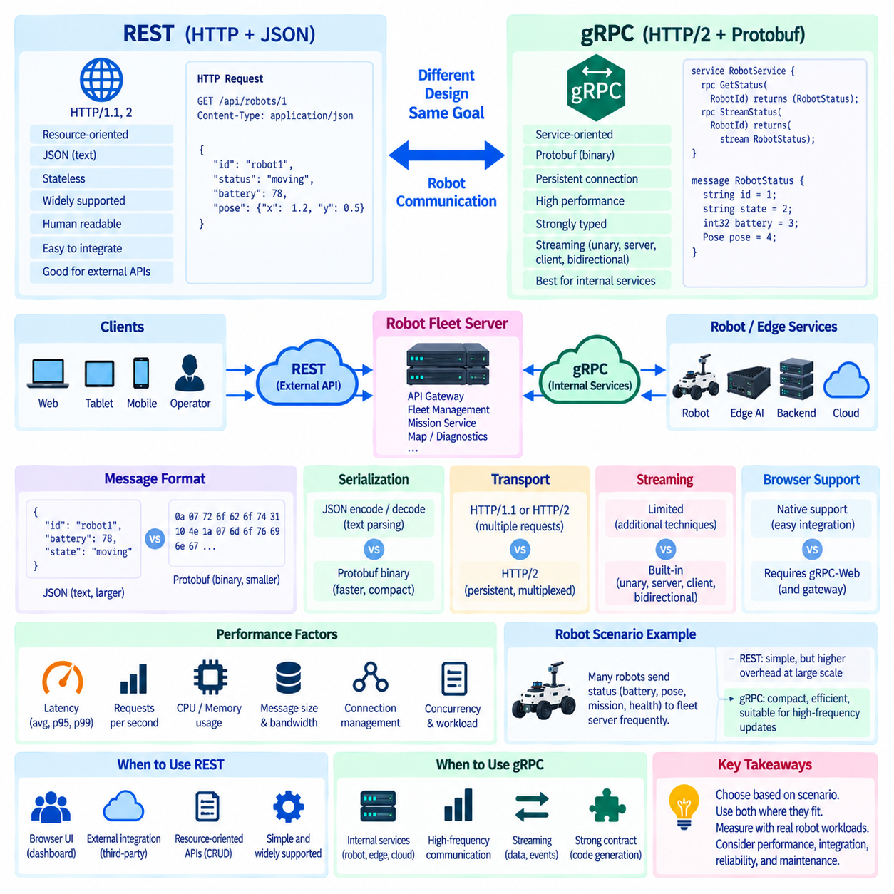{width="7.268055555555556in" height="7.268055555555556in"}

gRPC and REST are both widely applicable to synchronous communication in distributed robot systems, but they represent different interface and transport design philosophies. REST commonly exposes resource-oriented APIs using HTTP and JSON, whereas gRPC defines callable services and strongly typed messages through Protocol Buffers. The chapter structure positions both technologies as important communication mechanisms rather than treating one as a universal replacement for the other.

REST is attractive for robot interfaces because HTTP-based APIs are broadly supported by browsers, enterprise systems, development tools, and cloud platforms. JSON messages are human-readable and convenient during integration and debugging. A fleet application can expose resources such as robots, missions, maps, alarms, or configurations through conventional endpoints, making REST especially practical when interoperability and external accessibility are major requirements.

gRPC emphasizes efficient machine-to-machine communication. Protocol Buffers encode structured information in a compact binary representation, while generated client and server interfaces enforce the contract defined in .proto schemas. HTTP/2 provides persistent connections and multiplexed streams. These characteristics make gRPC particularly suitable for communication among robot computers, edge AI services, fleet servers, and internal backend services where structured high-frequency interaction is required.

Payload representation is one source of performance difference. JSON includes textual representations of field names and values, which makes messages readable but can increase transmitted size and parsing work. Protobuf identifies fields using numeric tags and encodes values in binary form. For repeated robot status, mission state, localization metadata, or AI inference messages, this compact representation can reduce communication overhead compared with equivalent verbose JSON structures.

Serialization cost also affects system behavior. REST applications using JSON must convert application objects into textual JSON and parse received text back into internal structures. Protobuf implementations use generated message representations and binary serialization. Actual performance depends on language, library, message structure, hardware, and workload, so a valid comparison should measure the real robot scenario rather than assuming a universal numerical improvement.

Transport behavior creates another important distinction. REST deployments may use HTTP/1.1, HTTP/2, or newer HTTP infrastructure depending on the implementation, while conventional gRPC is closely associated with HTTP/2. HTTP/2 multiplexing allows multiple logical RPC streams to share a persistent connection. This is valuable when one robot or edge computer simultaneously communicates with mission, diagnostics, perception, configuration, and AI services.

Streaming provides a substantial architectural difference. REST is naturally suited to discrete request-response interactions, although streaming can be implemented using additional HTTP techniques. gRPC directly defines unary, server-streaming, client-streaming, and bidirectional-streaming methods in its service model. For continuously changing robot state or persistent service coordination, this explicit streaming abstraction can reduce the need to design separate polling or custom communication conventions.

Consider a robot fleet scenario in which many autonomous mobile robots periodically report battery level, pose, velocity, mission state, health information, and diagnostic events to an on-premise fleet server. A REST implementation can send repeated HTTP requests containing JSON documents. This approach is simple and transparent, but increasing robot count and update frequency can amplify serialization, payload, request-processing, and connection-management overhead.

A gRPC implementation can represent the same robot state using Protobuf messages and maintain efficient RPC communication over HTTP/2. Status information may be transferred through unary calls or suitable streaming methods depending on the application architecture. As update frequency and concurrent service interactions increase, compact serialization and persistent multiplexed communication can become increasingly valuable, particularly within controlled robot-to-edge or service-to-service networks.

The comparison changes when the interface is intended for a browser-based operator dashboard. REST integrates naturally with browser HTTP APIs and allows developers to inspect JSON directly. Native gRPC cannot normally be invoked from browser JavaScript in the same way, requiring gRPC-Web and potentially a gateway or proxy. REST may therefore provide lower integration complexity even when gRPC offers advantages for internal machine communication.

Command semantics also influence protocol selection. A fleet management system may use REST to create, retrieve, update, or cancel mission resources because these operations map naturally to resource-oriented APIs. Internal execution services can then use gRPC to transmit structured mission commands, request AI processing, exchange status, or coordinate distributed components. A practical robot architecture can therefore use both technologies at different boundaries.

Performance should be evaluated using several measurements rather than a single latency number. End-to-end latency, requests per second, CPU utilization, memory consumption, serialized message size, network bandwidth, connection count, and behavior under concurrency can all affect the result. For streaming workloads, message rate, stream duration, reconnection behavior, and backpressure should also be measured to capture characteristics that a simple request-response benchmark may miss.

Message size strongly affects the relevance of serialization efficiency. When requests are small and infrequent, the practical difference between JSON and Protobuf may be insignificant compared with network delay, application processing, database access, or robot control logic. When many robots exchange frequent structured messages, however, small per-message savings can accumulate across thousands or millions of transactions and materially affect bandwidth and processing requirements.

Latency measurements should distinguish average behavior from tail behavior. A system with acceptable mean latency may still experience occasional slow responses that affect mission coordination. Percentile measurements such as p95 or p99 can reveal these delays. Tests should also separate serialization time, network transport, server processing, queueing, and application execution so that an observed performance difference is not incorrectly attributed only to REST or gRPC.

Benchmark conditions must be controlled if the comparison is intended to guide architecture. Both implementations should represent equivalent application semantics, security settings, payload information, server logic, network conditions, and concurrency. Comparing an optimized gRPC implementation with an unoptimized REST server would measure implementation quality rather than protocol characteristics. Warm connections and cold connection establishment should also be examined separately when operationally relevant.

Reliability and maintainability are part of the engineering comparison even though they are not pure throughput metrics. REST benefits from a mature HTTP ecosystem, straightforward inspection, and broad interoperability. gRPC provides strongly defined contracts, generated code, standardized status handling, and explicit streaming models. These characteristics can reduce certain classes of integration errors, which may be more important than small benchmark differences in long-lived robot platforms.

A hybrid architecture is therefore often appropriate for a distributed robotics platform. REST can serve browser applications, enterprise integration, public-facing management APIs, and resource-oriented operations, while gRPC can connect internal services requiring compact structured messages, lower communication overhead, or streaming. Gateways can bridge boundaries where necessary, allowing external accessibility and internal efficiency to coexist within the same system architecture.

The meaningful gRPC-versus-REST comparison is ultimately scenario dependent. Robot count, message frequency, payload size, browser requirements, network quality, streaming needs, development ecosystem, and operational constraints determine which characteristics matter most. Rather than selecting a protocol from generic benchmark claims, robotics engineers should benchmark representative workloads and assign REST and gRPC to the communication boundaries where their respective properties best match system requirements.

## 02.09 Robot Fleet Control gRPC API Design Case [w/Code]

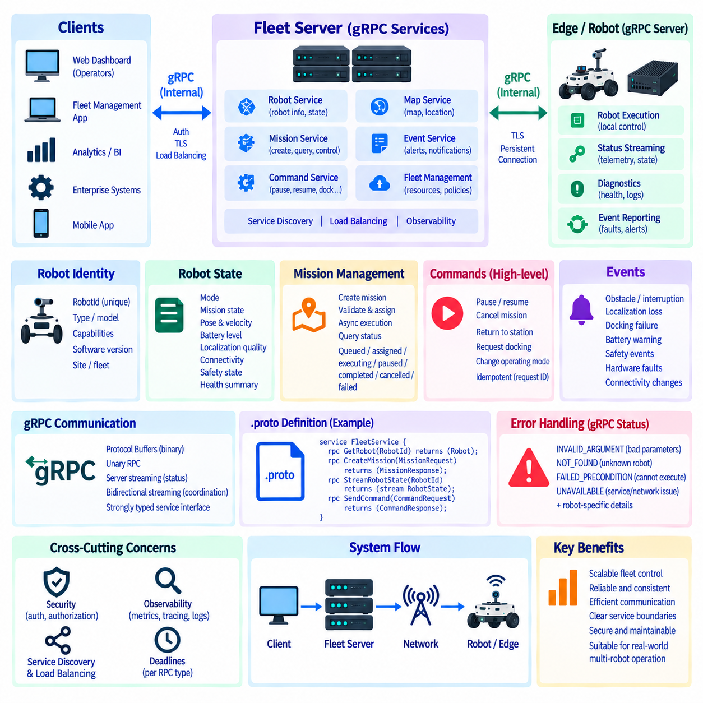{width="7.268055555555556in" height="7.268055555555556in"}

A robot fleet control system coordinates many autonomous robots through a common communication and orchestration layer. Its gRPC API must represent robot identity, operational state, missions, commands, events, diagnostics, and fleet-level coordination through stable service contracts. Rather than exposing internal implementation details, the API should define clear boundaries between fleet management, robot execution, monitoring, and supporting services.

A practical architecture separates fleet-level services from robot-level services. The fleet server maintains the global view of robots, missions, maps, resources, and operational policies, while each robot or edge computer exposes functions required for local execution. gRPC provides strongly typed service interfaces between these components, allowing fleet software and robot software to evolve independently while retaining a shared Protobuf contract.

Robot identity should be explicit in the API because every command, status update, and mission must be associated with the correct physical system. A RobotId or equivalent identifier can be included in requests and state messages, while additional metadata describes robot type, capabilities, software version, operational site, or assigned fleet. Stable identifiers prevent network addresses from becoming permanent application identities.

Robot state messages should describe the information required for fleet decisions without unnecessarily exposing every internal sensor signal. Typical fields can represent operating mode, mission state, pose, velocity, battery condition, localization quality, connectivity, safety state, and health summary. Detailed perception or controller data can remain behind specialized interfaces so that routine fleet communication remains compact and semantically stable.

Mission management is a central API responsibility. A mission service can accept structured mission requests containing the target robot, mission identifier, task description, destination, priority, and required parameters. The server validates the request, checks operational constraints, records the mission, and returns an acknowledgement. Mission execution can then proceed asynchronously rather than forcing the original RPC to remain active until physical completion.

Mission status should therefore be separated from mission submission. After accepting a mission, the fleet system can expose status through query methods or server-streaming updates. States such as queued, assigned, executing, paused, completed, cancelled, and failed allow clients to follow the mission lifecycle. Additional fields can report progress, timestamps, failure causes, or the current execution stage without changing the original mission request.

Command APIs should distinguish high-level operational intent from low-level actuator control. Fleet services may expose commands such as pause, resume, cancel mission, return to station, request docking, or change an approved operating mode. Direct wheel velocity, motor torque, emergency safety logic, and other tightly timed control functions should remain inside robot control systems rather than being executed through ordinary fleet-level gRPC calls.

Idempotency is particularly important for fleet commands because network failures can leave clients uncertain about whether a request was executed. Each state-changing request can carry a unique command or request identifier that the server records. If the same identifier arrives again, the service can return the previous result instead of repeating the physical action. This prevents retries from unintentionally creating duplicate missions or commands.

Status distribution is well suited to server streaming when fleet applications need continuing robot updates. A client can subscribe to one robot, a group, or the entire fleet and receive structured state messages as changes occur. Update rates should be controlled according to operational need because forwarding every internal control-cycle value would create unnecessary network and processing load. Fleet telemetry should represent useful supervisory information.

Bidirectional streaming can be used where a persistent coordination session is justified. A robot and fleet service may exchange state transitions, acknowledgements, events, and coordination information over a long-lived stream. The design must nevertheless define reconnection behavior, sequence handling, session ownership, and state recovery. A persistent stream should not become an undocumented channel carrying unrelated messages without clear semantics.

Fleet event APIs can represent asynchronous conditions that require attention but are not ordinary state variables. Examples include obstacle-related mission interruption, localization loss, docking failure, battery warnings, safety events, hardware faults, or changes in connectivity. Events should contain identifiers, timestamps, severity or category information, source information, and structured details that allow monitoring and automation systems to interpret them consistently.

Time information requires careful design because fleet decisions may combine observations from multiple robots and computers. Messages should clearly define timestamp origin and meaning, such as measurement time, event occurrence time, server receipt time, or command creation time. Where coordinated timing is important, the architecture should define clock synchronization assumptions rather than treating all timestamps from distributed devices as automatically equivalent.

Error handling should use standard gRPC status codes together with robot-specific structured details. INVALID_ARGUMENT can identify malformed mission parameters, NOT_FOUND can indicate an unknown robot, FAILED_PRECONDITION can represent a robot that cannot currently execute a mission, and UNAVAILABLE can indicate temporary loss of a required service. Application details can then describe the operational reason without inventing incompatible error conventions for every method.

Deadlines should reflect the expected lifetime of each RPC. A robot information query may require a short deadline, while mission acceptance may permit more processing time. The deadline for accepting a command should not be confused with the time required for the robot to physically complete that command. Long physical operations should normally be represented as asynchronous state transitions rather than RPC calls that remain blocked for their entire duration.

Authentication and authorization should be integrated at the service boundary. Robot identities, fleet services, operators, and maintenance applications may require different credentials and permissions. Interceptors can validate authentication metadata and enforce method-level policies before requests reach application logic. For example, a monitoring client may read fleet status while only an authorized orchestration service can assign or cancel missions.

Service discovery and load balancing become relevant when fleet backend services are replicated. Clients should address logical service identities rather than fixed server addresses, while discovery mechanisms identify available instances. Stateless or externally coordinated backend services can then distribute unary RPC traffic across replicas. Stateful streams and robot sessions require explicit ownership and recovery strategies because an active connection cannot simply migrate without application context.

Observability should be designed into the API rather than added after deployment. RPC metadata can propagate correlation and trace identifiers across fleet, edge, AI, and robot services. Interceptors can collect request counts, status codes, latency, stream duration, and authentication results. Logs should associate important operations with robot, mission, and command identifiers so that engineers can reconstruct how a fleet-level request propagated through the system.

A scalable fleet API should also avoid coupling every consumer directly to every robot. Operator dashboards, analytics systems, enterprise applications, and external services can communicate with fleet-level APIs, while the fleet backend manages communication with robots and edge services. This hierarchical structure reduces connection complexity, protects internal robot interfaces, and creates a controlled location for aggregation, authorization, routing, and operational policy.

The resulting gRPC API becomes a contract between fleet intelligence and distributed robot execution. Protobuf defines stable messages, unary RPC handles bounded operations, streaming distributes evolving state, status codes communicate failures, and security controls service access. Combined with idempotent commands, explicit mission lifecycles, observability, discovery, and recovery mechanisms, this design provides a scalable foundation for coordinated multi-robot fleet operation.

## 02.10 gRPC Debugging Tools: grpcurl / grpc.gateway

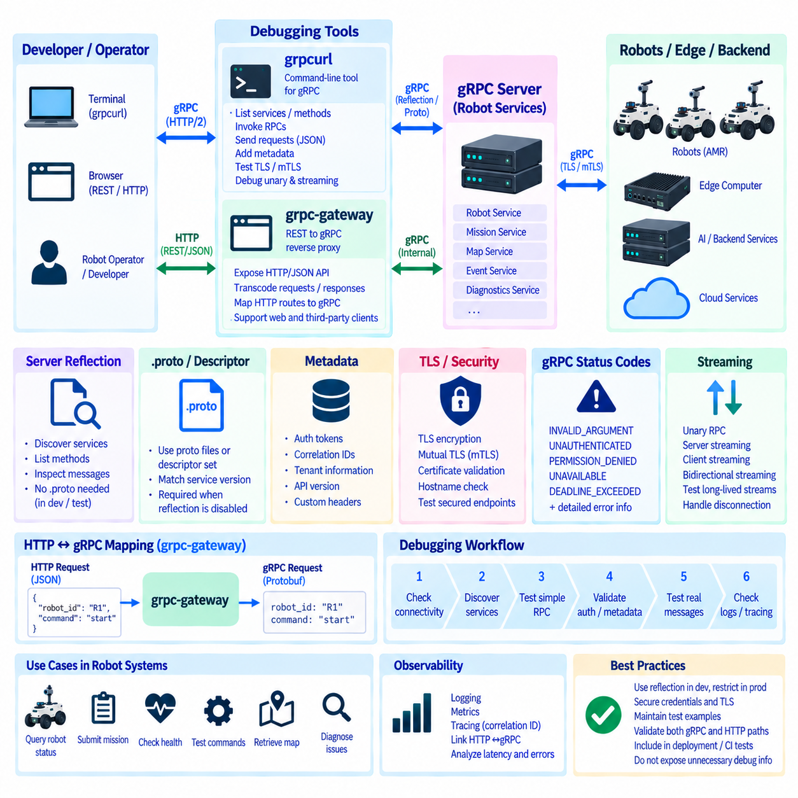{width="7.268055555555556in" height="7.268055555555556in"}

Debugging gRPC services requires visibility into service definitions, request messages, metadata, status codes, transport security, and streaming behavior. In a distributed robot system, failures may occur between robots, edge computers, fleet servers, AI services, or cloud components. Tools such as grpcurl and grpc-gateway help engineers inspect these interfaces without building a dedicated diagnostic client for every service.

grpcurl is a command-line tool designed for interacting with gRPC servers in a manner conceptually similar to using curl with HTTP services. It allows an engineer to invoke RPC methods directly from a terminal, provide request data, inspect responses, attach metadata, and test secured endpoints. This makes it useful during development, system integration, deployment verification, and field troubleshooting of robot communication services.

A gRPC server can expose reflection information that allows grpcurl to discover available services and methods dynamically. When server reflection is enabled, engineers can inspect the API without manually locating every .proto file. They can list services, examine method definitions, and understand message structures. Reflection is particularly convenient in development and controlled diagnostic environments where rapid inspection is more important than minimizing exposed interface information.

When reflection is unavailable, grpcurl can work with Protocol Buffer source files or compiled descriptor sets. This approach is useful when production systems intentionally disable reflection or when engineers need to test a specific version of an API contract. The debugging client must then use schema information that matches the deployed service, making API version management and descriptor traceability important parts of the diagnostic process.

Unary RPC testing is one of the simplest grpcurl workflows. An engineer can construct a structured request, invoke a method, and inspect the returned message and gRPC status. For a robot fleet service, this may involve querying a RobotId, retrieving mission information, requesting diagnostics, or testing a command-validation method. Such direct calls help separate server-side problems from defects in the normal fleet application or operator interface.

Metadata inspection is important because many gRPC problems are not caused by the Protobuf payload itself. Authentication tokens, correlation identifiers, tenant information, API versions, or other contextual values may travel as RPC metadata. grpcurl can attach appropriate metadata to test requests, allowing engineers to determine whether failures originate from authentication, authorization, routing, application validation, or the requested operation itself.

TLS configuration is another common debugging boundary. Robot and fleet services may use encrypted TLS connections or mutual TLS in which both endpoints present credentials. Diagnostic testing must therefore distinguish certificate verification failures, hostname problems, unavailable trust roots, authentication rejection, and application-level RPC errors. Temporarily bypassing verification may assist controlled diagnosis, but it should not become the normal production configuration.

gRPC status codes provide structured information when an invocation fails. INVALID_ARGUMENT may indicate malformed request data, UNAUTHENTICATED can reveal missing or invalid credentials, PERMISSION_DENIED can identify insufficient authorization, and UNAVAILABLE can indicate a service or network problem. DEADLINE_EXCEEDED can expose timing or load issues. Debugging should interpret these codes together with server logs and structured error details.

Streaming RPCs require additional attention because a successful connection does not guarantee that the stream will remain healthy. Engineers may need to observe whether server-streaming methods deliver updates continuously, whether a stream terminates with an error, and whether deadlines or network interruptions affect the session. Long-lived robot telemetry and fleet-state streams should therefore be tested under both normal operation and communication failure conditions.

grpc-gateway addresses a different but complementary problem. It can generate a reverse-proxy layer that translates REST-style HTTP requests into gRPC calls according to API definitions and HTTP mapping rules. External applications can therefore interact through familiar HTTP/JSON interfaces while internal backend services retain strongly typed gRPC APIs. This is useful when a robotics platform must support both internal service communication and conventional web integration.

The gateway can be positioned between browser, enterprise, or third-party clients and internal robot services. An HTTP request received by the gateway is mapped to a corresponding gRPC method, JSON data is translated into Protobuf-compatible messages, and the gRPC response is transformed back for the HTTP client. This creates a controlled protocol boundary rather than requiring every internal robot service to implement separate REST and gRPC business logic.

Debugging a gateway architecture requires checking both sides of this translation boundary. An engineer should determine whether a failed operation originated in the HTTP client, gateway routing, JSON-to-Protobuf conversion, metadata propagation, gRPC backend, or robot application. Testing the backend directly with grpcurl and then testing the corresponding HTTP endpoint helps isolate whether the fault exists in the native service or the gateway integration layer.

HTTP mapping must be designed carefully because RPC methods and REST resources do not always have identical semantics. A mission creation RPC may map naturally to an HTTP POST operation, while robot state retrieval can map to GET. More complex streaming or bidirectional interactions may not translate cleanly into conventional REST behavior. The gateway should therefore expose mappings that preserve meaningful application semantics rather than mechanically converting every RPC.

Logging and tracing become especially valuable when requests cross a gateway. A correlation or trace identifier can follow an HTTP request through the gateway into the gRPC backend and downstream robot services. Engineers can then associate client-visible errors with gateway logs, RPC status codes, service latency, and robot-side events. Without consistent identifiers, diagnosing a single operation across several distributed components becomes significantly more difficult.

A systematic debugging workflow should begin with connectivity and service discovery before moving toward application semantics. Engineers can confirm that the server is reachable, inspect the expected service, invoke a minimal RPC, validate authentication, and then test realistic messages. When a gateway is present, the same logical operation can be exercised through both native gRPC and HTTP paths to identify the layer where behavior begins to diverge.

Development and production environments may require different debugging policies. Reflection, verbose logs, diagnostic endpoints, and relaxed test credentials can accelerate development but may reveal unnecessary information if exposed publicly. Production environments should restrict diagnostic access, protect credentials, sanitize logs, and maintain appropriate TLS verification. Debugging capability should be intentionally designed rather than created by weakening operational security controls.

Robot fleet operations benefit from repeatable diagnostic commands and known test requests. Teams can maintain approved examples for robot status queries, mission submission, health checks, and service verification so that developers and operators test identical API behavior. These tests can also be incorporated into deployment validation or continuous integration, allowing communication problems to be detected before a new service version reaches an operational robot fleet.

grpcurl and grpc-gateway therefore serve different roles within the same gRPC engineering workflow. grpcurl provides direct visibility into native gRPC services for inspection, invocation, and troubleshooting, while grpc-gateway exposes selected gRPC functionality through HTTP/JSON interfaces. Used with reflection or descriptors, structured status handling, TLS, logging, tracing, and repeatable tests, they create a practical debugging and integration environment for distributed robot APIs.
