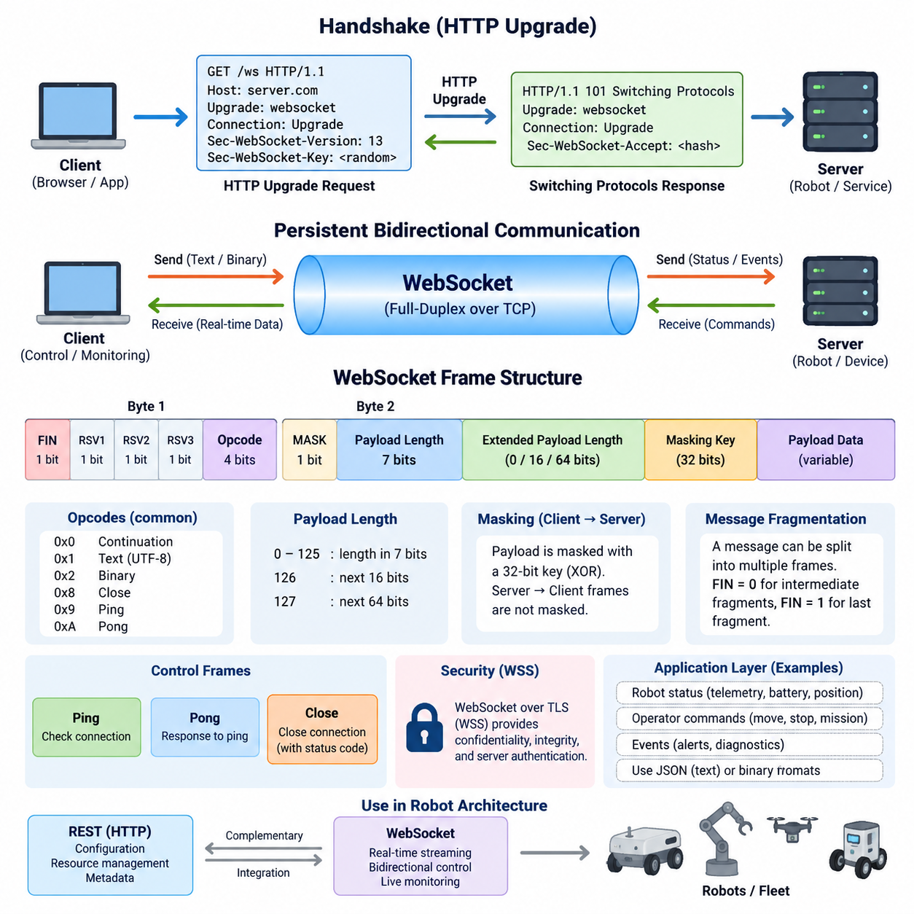
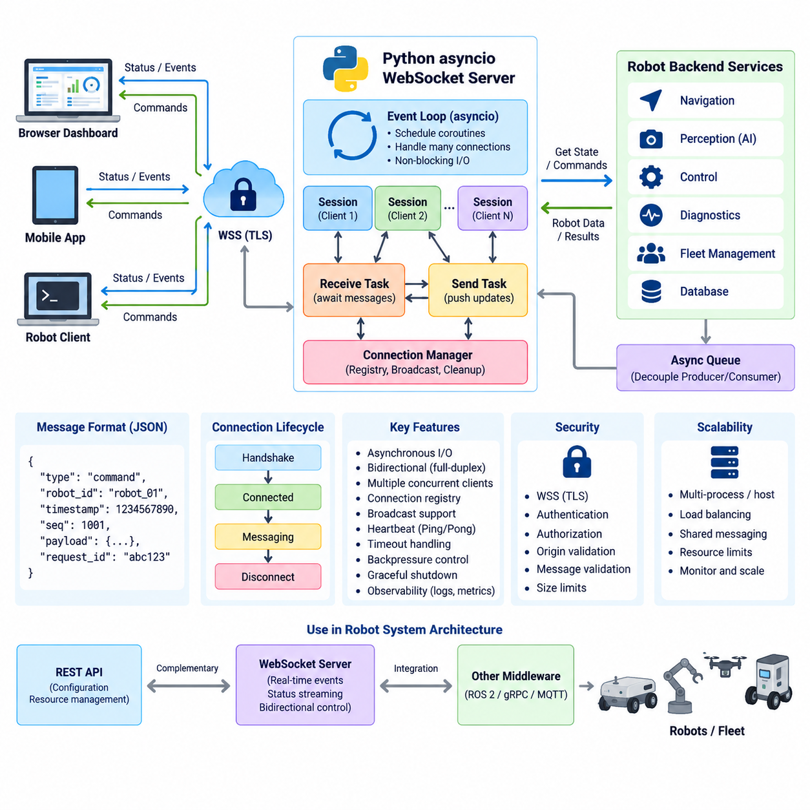
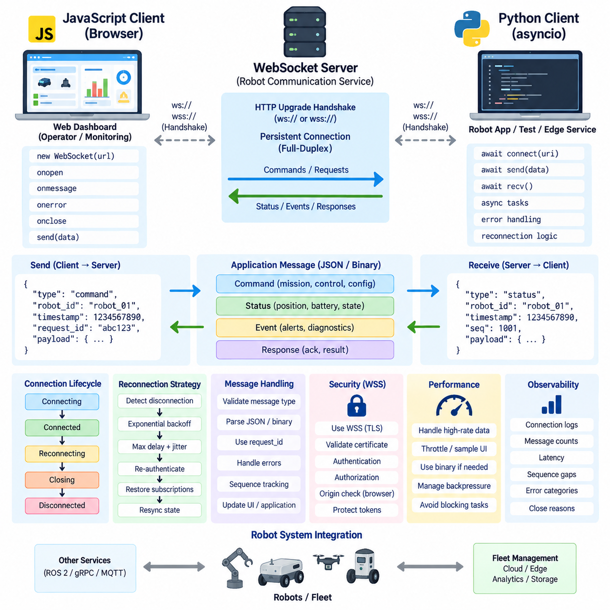
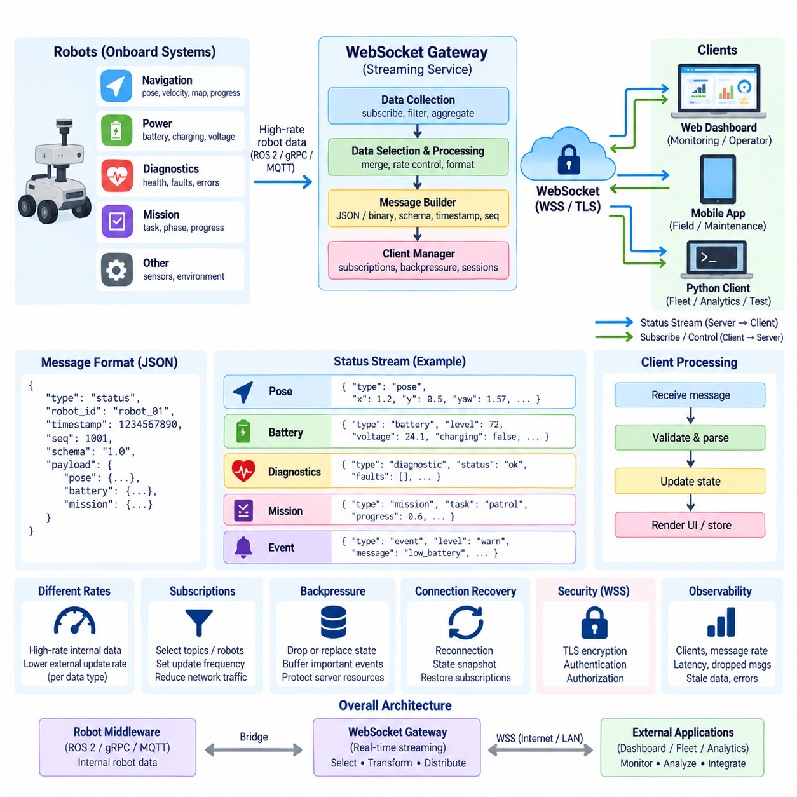
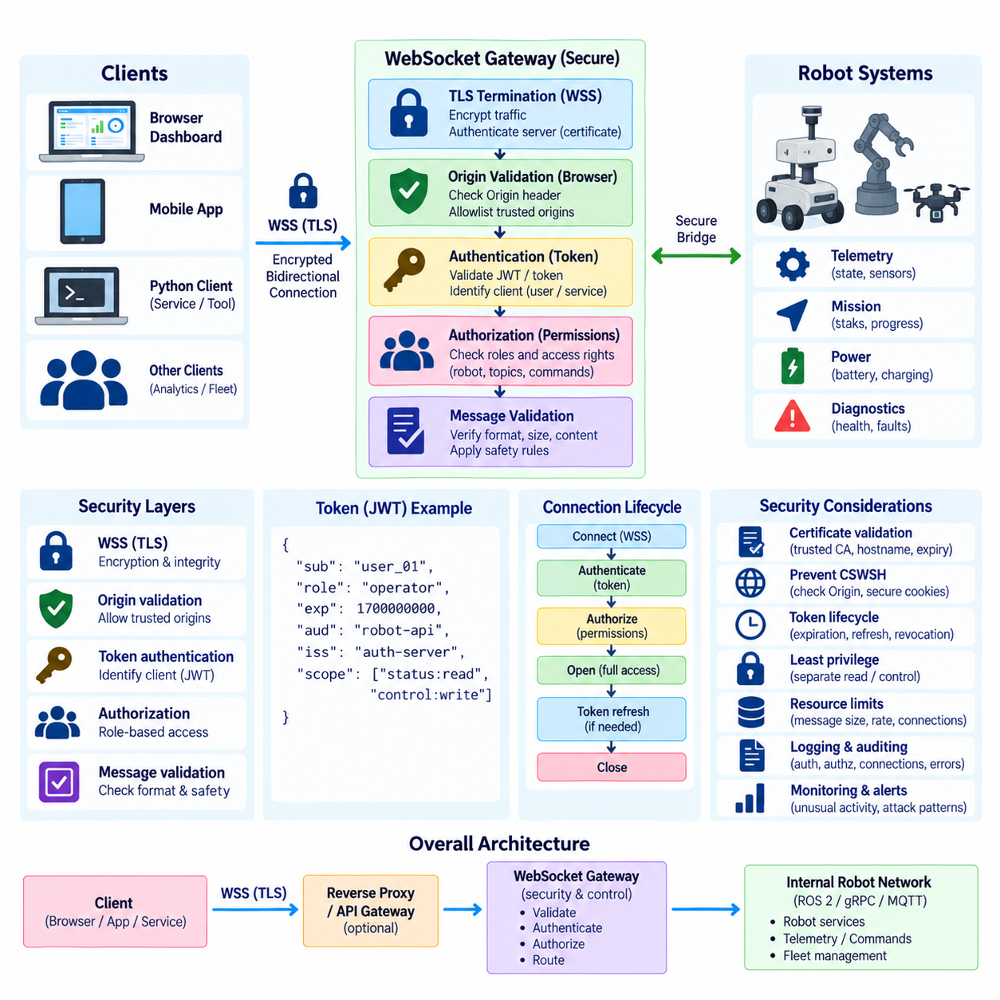
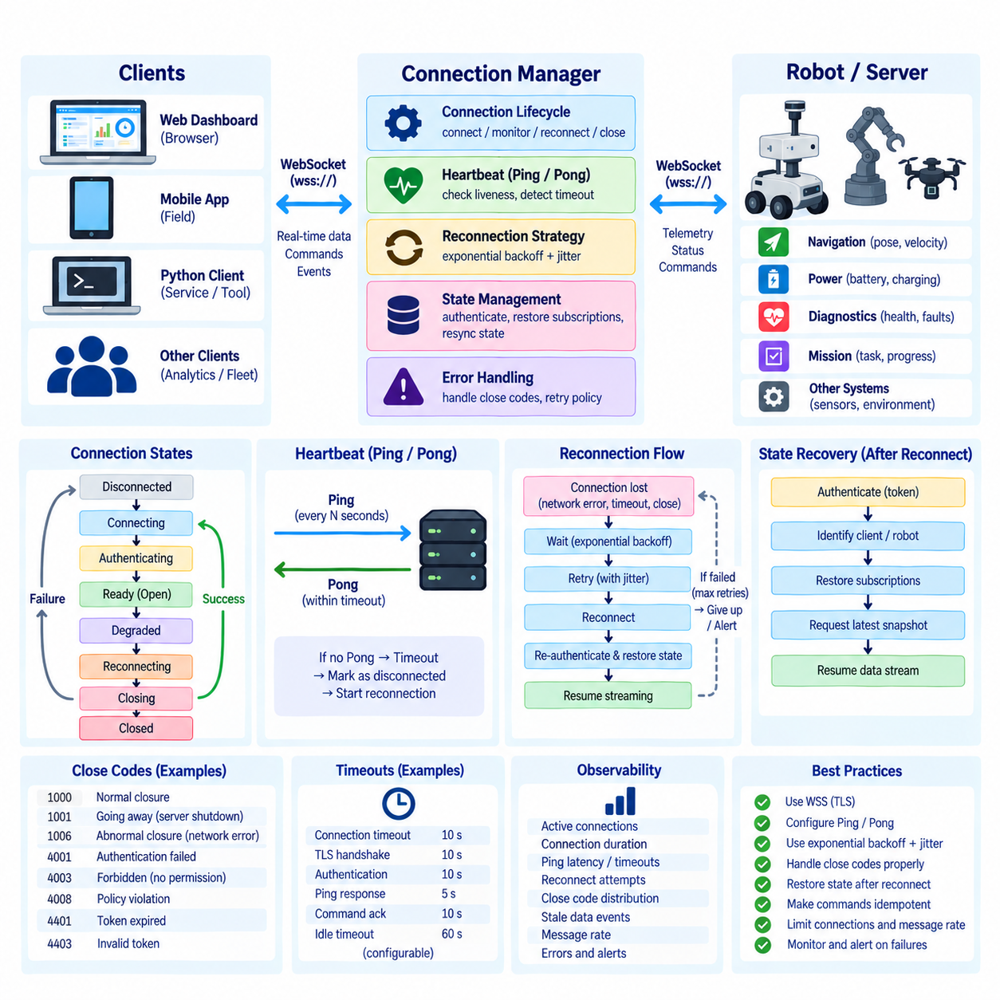
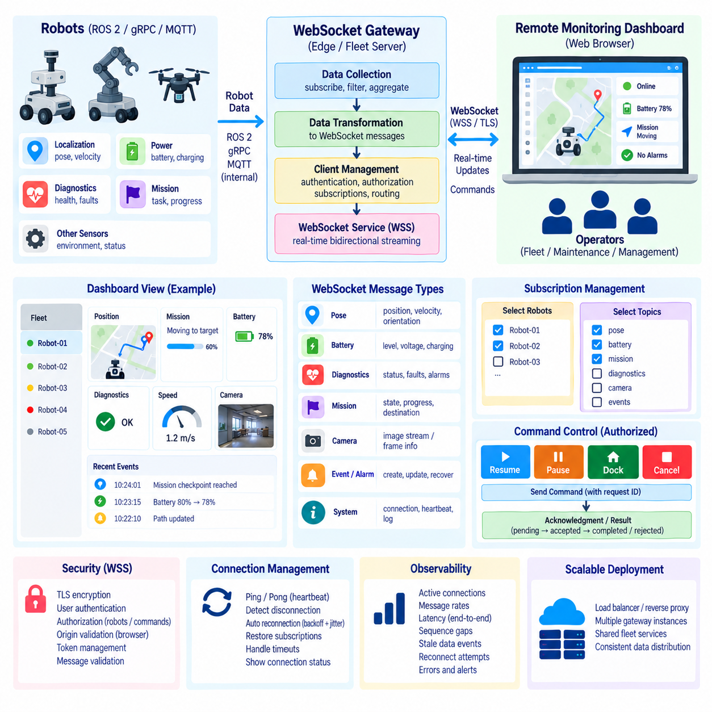
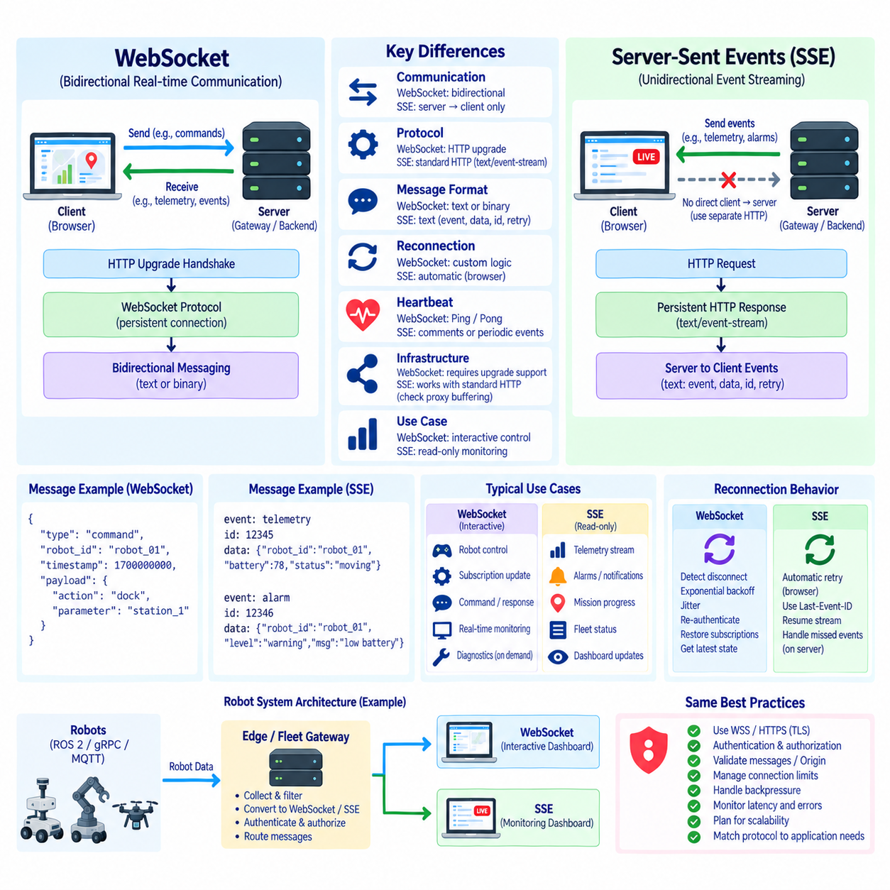
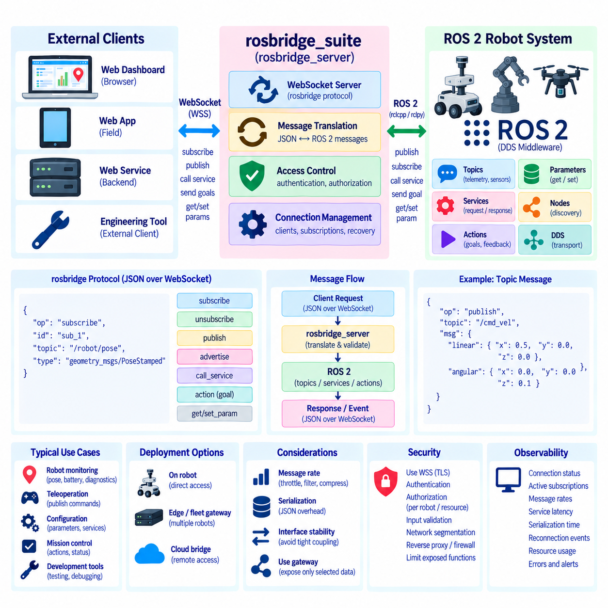
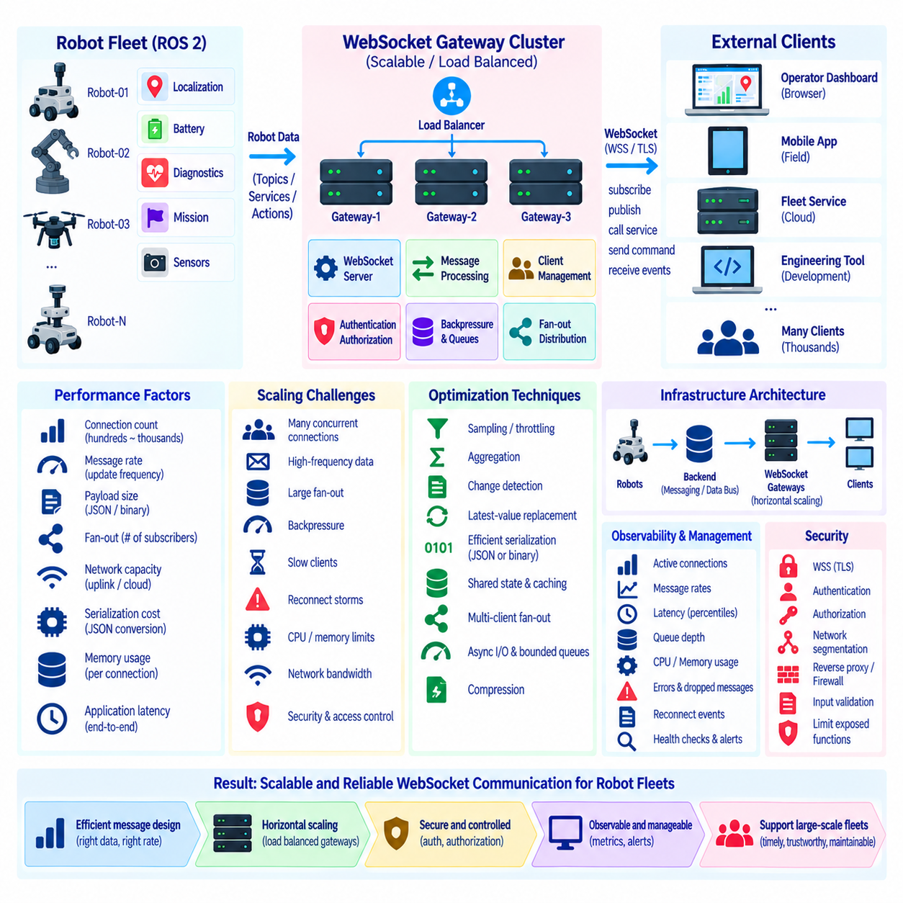

**Volume 06 Robot Communication and APIs**


# 03. WebSocket

##  

## 03.01 WebSocket Protocol: Handshake / Frame Structure

{width="7.268055555555556in" height="7.268055555555556in"}

WebSocket is a persistent, full-duplex communication protocol designed to support continuous bidirectional data exchange between a client and a server over a single connection. Within the communication architecture of a robot system, it complements REST and gRPC by providing an efficient channel for rapidly changing information such as robot status, telemetry, alarms, mission progress, and operator commands.

Unlike conventional HTTP request-response communication, WebSocket allows either endpoint to transmit data whenever necessary after the connection has been established. The server therefore does not need to wait for a new client request before delivering updated information. This property is especially useful for robot monitoring interfaces where position, velocity, battery state, navigation progress, sensor summaries, and operational events may change continuously.

A WebSocket connection begins with an HTTP-based opening handshake. The client initially sends an HTTP GET request containing an Upgrade header that requests a protocol transition from HTTP to WebSocket. The request normally includes Connection: Upgrade, Sec-WebSocket-Version, and Sec-WebSocket-Key fields. This design allows WebSocket connections to begin through infrastructure that already understands HTTP before switching to persistent bidirectional communication.

The Sec-WebSocket-Key is a randomly generated Base64-encoded value supplied by the client during the handshake. The server combines this value with the WebSocket protocol\'s defined GUID, computes a SHA-1 hash, and Base64-encodes the result to produce Sec-WebSocket-Accept. The client verifies this response to confirm that the server understood the WebSocket upgrade rather than returning an unrelated HTTP response.

When the server accepts the upgrade, it returns an HTTP 101 Switching Protocols response with appropriate Upgrade and Connection headers. At this point, the HTTP transaction has completed and the underlying TCP connection becomes a WebSocket communication channel. Subsequent application data is no longer represented as ordinary HTTP requests and responses but is exchanged using the WebSocket framing mechanism.

WebSocket framing provides boundaries around individual units of transmitted information. Each frame begins with a compact header containing control information followed by optional extended payload length information, a masking key when required, and the payload itself. This framing model enables multiple messages to travel efficiently over the same persistent TCP connection without repeatedly transmitting HTTP headers for every application-level update.

The first frame-header byte contains several important fields. FIN indicates whether the frame completes a message, while RSV1, RSV2, and RSV3 are reserved primarily for negotiated protocol extensions. The four-bit opcode identifies the meaning of the frame. Common opcodes distinguish continuation frames, UTF-8 text data, binary data, connection-close requests, Ping messages, and Pong responses used for connection management.

The second header byte contains the MASK bit and the initial seven-bit payload-length field. Payload lengths from 0 through 125 can be represented directly. A value of 126 indicates that the actual length is stored in the following 16 bits, while 127 indicates an additional 64-bit length field. This variable representation keeps small robot status messages compact while still permitting substantially larger application payloads.

Client-to-server WebSocket frames are masked using a 32-bit masking key, and the receiver reconstructs the original payload by applying the defined XOR operation. Server-to-client frames are normally not masked. Masking is a protocol requirement intended to prevent WebSocket traffic generated by clients from being interpreted as predictable byte sequences by vulnerable network intermediaries; it is not a substitute for encryption or authentication.

WebSocket supports both text and binary application data. Text messages must contain valid UTF-8 data and are frequently used with JSON because browser applications and robot dashboards can process them conveniently. Binary frames can carry compact serialized structures, encoded sensor information, or application-specific formats where bandwidth and serialization overhead are important. The protocol itself does not prescribe the semantic structure of these payloads.

A WebSocket message does not necessarily correspond to exactly one frame. Large messages may be fragmented into an initial text or binary frame followed by one or more continuation frames. FIN remains clear while additional fragments are expected and is set on the final fragment. Fragmentation allows implementations to transmit data progressively and provides opportunities for intermediaries or endpoints to process messages without buffering an entire large payload.

Control frames perform protocol-level connection management independently of application messages. Ping frames can be transmitted to verify that the remote endpoint remains responsive, and Pong frames provide the corresponding response mechanism. These frames are particularly important in long-running robot connections because network interruption, device failure, wireless roaming, or idle connection termination may otherwise leave applications with stale connection state.

The Close control frame provides an orderly mechanism for terminating a WebSocket session. An endpoint sending a Close frame may include a status code and a short reason, after which the peer normally responds with its own Close frame before the TCP connection is terminated. Applications should distinguish intentional closure from unexpected network loss because robot dashboards and fleet systems may need different reconnection, alarm, and state-recovery behavior.

Because WebSocket runs over TCP, it inherits reliable, ordered byte delivery from the transport layer. This simplifies many robot monitoring applications because messages are not arbitrarily reordered or silently discarded by the transport. However, TCP reliability does not guarantee application-level timeliness. Congestion, retransmission, slow consumers, oversized queues, and network interruptions can still cause old telemetry to arrive after it has lost operational value.

For secure deployments, WebSocket is commonly transported using WSS, which places the WebSocket connection over TLS. TLS protects confidentiality and integrity while authenticating the server through certificates and, where required, supporting stronger identity architectures. Authentication and authorization remain application responsibilities, so robot systems must still determine which users, services, or fleet components may observe telemetry or issue operational commands.

WebSocket should therefore be understood as a transport mechanism for persistent application interaction rather than a complete robot communication architecture. Message schemas, timestamps, robot identifiers, sequence numbers, command acknowledgments, authorization rules, error semantics, timeout policies, and reconnection behavior must be defined above the protocol. These contracts determine whether a WebSocket interface remains predictable as the robot fleet and application ecosystem grow.

In a practical robot architecture, an HTTP or REST interface can perform configuration and resource-oriented operations while WebSocket maintains the live operational channel. A dashboard might retrieve robot metadata through REST and then subscribe to position, battery, navigation, diagnostics, and mission events through WebSocket. Operator commands can travel in the opposite direction over the same connection when the application contract permits bidirectional control.

The handshake and frame structure together explain the principal efficiency advantage of WebSocket. HTTP compatibility is retained during connection establishment, while repeated request-response overhead is avoided after the upgrade. Compact frames then support continuous bidirectional exchange through one connection, making WebSocket particularly suitable for interactive robot dashboards, edge interfaces, remote monitoring, fleet visualization, and event-oriented operational applications.

웹소켓(WebSocket)은 하나의 연결을 통해 클라이언트(Client)와 서버(Server) 사이에서 지속적인 양방향 데이터 교환을 지원하도록 설계된 전이중 통신 프로토콜(Full-Duplex Communication Protocol)이다. 로봇 시스템의 통신 아키텍처(Communication Architecture)에서는 REST 및 gRPC를 보완하면서 로봇 상태, 텔레메트리(Telemetry), 경보, 임무 진행 상태, 운영자 명령처럼 빠르게 변화하는 정보를 효율적으로 전달하는 통신 채널을 제공한다.

기존의 HTTP 요청-응답 통신(Request-Response Communication)과 달리 웹소켓(WebSocket)은 연결이 설정된 이후 어느 엔드포인트(Endpoint)에서든 필요한 시점에 데이터를 전송할 수 있다. 따라서 서버(Server)는 갱신된 정보를 전달하기 위해 클라이언트(Client)의 새로운 요청을 기다릴 필요가 없다. 이러한 특성은 위치, 속도, 배터리 상태, 내비게이션 진행 상황, 센서 요약 정보, 운영 이벤트가 지속적으로 변화하는 로봇 모니터링 인터페이스(Robot Monitoring Interface)에 특히 유용하다.

웹소켓 연결(WebSocket Connection)은 HTTP 기반의 개방 핸드셰이크(Opening Handshake)로 시작된다. 클라이언트(Client)는 먼저 HTTP GET 요청을 전송하며, 이 요청에는 HTTP에서 웹소켓(WebSocket)으로 프로토콜 전환을 요청하는 업그레이드 헤더(Upgrade Header)가 포함된다. 일반적으로 요청에는 Connection: Upgrade, Sec-WebSocket-Version, Sec-WebSocket-Key 필드가 포함되며, 이를 통해 기존 HTTP 인프라를 거쳐 지속적인 양방향 통신으로 전환할 수 있다.

Sec-WebSocket-Key는 핸드셰이크(Handshake) 과정에서 클라이언트(Client)가 제공하는 무작위 생성 Base64 인코딩 값이다. 서버(Server)는 이 값을 웹소켓 프로토콜(WebSocket Protocol)에 정의된 GUID와 결합하고 SHA-1 해시(Hash)를 계산한 후 결과를 Base64로 인코딩하여 Sec-WebSocket-Accept를 생성한다. 클라이언트는 이 응답을 검증함으로써 서버가 웹소켓 업그레이드(WebSocket Upgrade)를 올바르게 처리했는지 확인한다.

서버(Server)가 업그레이드를 승인하면 적절한 Upgrade 및 Connection 헤더와 함께 HTTP 101 프로토콜 전환(Switching Protocols) 응답을 반환한다. 이 시점에서 HTTP 트랜잭션(Transaction)은 완료되고, 기존 TCP 연결은 웹소켓 통신 채널(WebSocket Communication Channel)로 전환된다. 이후 애플리케이션 데이터는 일반적인 HTTP 요청과 응답이 아니라 웹소켓 프레이밍 메커니즘(WebSocket Framing Mechanism)을 통해 교환된다.

웹소켓 프레이밍(WebSocket Framing)은 전송되는 각각의 정보 단위에 명확한 경계를 제공한다. 각 프레임(Frame)은 제어 정보를 포함하는 작은 헤더(Header)로 시작하고, 필요한 경우 확장 페이로드 길이(Extended Payload Length), 마스킹 키(Masking Key), 실제 페이로드(Payload)가 뒤따른다. 이를 통해 동일한 지속 연결에서 각 애플리케이션 갱신마다 반복적인 HTTP 헤더를 전송하지 않고 여러 메시지를 효율적으로 교환할 수 있다.

첫 번째 프레임 헤더 바이트(Frame Header Byte)에는 여러 중요한 필드가 포함된다. FIN은 해당 프레임이 메시지를 완료하는지를 나타내며, RSV1, RSV2, RSV3는 주로 협상된 프로토콜 확장(Protocol Extension)을 위해 예약된다. 4비트 연산 코드(Opcode)는 프레임의 의미를 식별하며, 연속 프레임(Continuation Frame), UTF-8 텍스트 데이터, 바이너리 데이터(Binary Data), 연결 종료 요청, Ping 메시지 및 Pong 응답 등을 구분한다.

두 번째 헤더 바이트(Header Byte)는 MASK 비트와 초기 7비트 페이로드 길이(Payload Length) 필드를 포함한다. 0부터 125까지의 페이로드 길이는 직접 표현할 수 있다. 값이 126이면 실제 길이가 다음 16비트에 저장되고, 127이면 추가적인 64비트 길이 필드를 사용한다. 이러한 가변 표현 방식은 작은 로봇 상태 메시지를 간결하게 유지하면서도 훨씬 큰 애플리케이션 페이로드를 전송할 수 있게 한다.

클라이언트에서 서버로 전송되는 웹소켓 프레임(WebSocket Frame)은 32비트 마스킹 키(Masking Key)를 사용하여 마스킹되며, 수신 측은 정의된 XOR 연산을 적용하여 원래 페이로드를 복원한다. 서버에서 클라이언트로 전송되는 프레임은 일반적으로 마스킹되지 않는다. 마스킹은 취약한 네트워크 중간 장치(Network Intermediary)가 클라이언트의 웹소켓 트래픽을 예측 가능한 바이트 시퀀스로 잘못 처리하는 것을 방지하기 위한 프로토콜 요구사항이며 암호화나 인증을 대체하지 않는다.

웹소켓(WebSocket)은 텍스트(Text)와 바이너리(Binary) 애플리케이션 데이터를 모두 지원한다. 텍스트 메시지는 유효한 UTF-8 데이터를 포함해야 하며, 브라우저 애플리케이션과 로봇 대시보드에서 쉽게 처리할 수 있기 때문에 JSON과 함께 자주 사용된다. 바이너리 프레임은 대역폭과 직렬화 오버헤드(Serialization Overhead)가 중요한 환경에서 압축된 직렬화 구조, 인코딩된 센서 정보 또는 애플리케이션별 데이터 형식을 전달하는 데 사용할 수 있다.

하나의 웹소켓 메시지(WebSocket Message)가 반드시 하나의 프레임(Frame)에 대응하는 것은 아니다. 큰 메시지는 초기 텍스트 또는 바이너리 프레임과 하나 이상의 연속 프레임(Continuation Frame)으로 분할될 수 있다. 추가 조각(Fragment)이 남아 있는 동안 FIN은 설정되지 않으며 마지막 조각에서 설정된다. 프래그먼테이션(Fragmentation)을 이용하면 전체 대용량 페이로드를 한꺼번에 버퍼링하지 않고 데이터를 점진적으로 전송하고 처리할 수 있다.

제어 프레임(Control Frame)은 애플리케이션 메시지와 독립적으로 프로토콜 수준의 연결 관리를 수행한다. Ping 프레임은 원격 엔드포인트(Remote Endpoint)가 정상적으로 응답하는지 확인하기 위해 전송할 수 있으며, Pong 프레임은 이에 대한 응답 메커니즘을 제공한다. 이러한 프레임은 네트워크 단절, 장치 장애, 무선 로밍(Wireless Roaming), 유휴 연결 종료 등이 발생할 수 있는 장시간 로봇 연결에서 특히 중요하다.

종료 제어 프레임(Close Control Frame)은 웹소켓 세션(WebSocket Session)을 정상적으로 종료하기 위한 메커니즘을 제공한다. 엔드포인트는 종료 프레임을 전송하면서 상태 코드(Status Code)와 짧은 이유를 포함할 수 있으며, 상대방은 일반적으로 자신의 종료 프레임으로 응답한 후 TCP 연결을 종료한다. 로봇 대시보드와 플릿 시스템(Fleet System)은 재연결, 경보, 상태 복구 정책이 달라질 수 있으므로 정상 종료와 예상하지 못한 네트워크 손실을 구분해야 한다.

웹소켓(WebSocket)은 TCP 위에서 동작하므로 전송 계층(Transport Layer)의 신뢰성 있는 순차 바이트 전달(Reliable Ordered Byte Delivery) 특성을 상속한다. 따라서 메시지가 임의로 순서가 바뀌거나 전송 계층에서 조용히 폐기되지 않아 많은 로봇 모니터링 애플리케이션을 단순화할 수 있다. 그러나 TCP의 신뢰성이 애플리케이션 수준의 적시성(Timeliness)을 보장하는 것은 아니며, 혼잡, 재전송, 느린 소비자, 과도한 큐, 네트워크 장애로 인해 이미 운영 가치가 낮아진 오래된 텔레메트리가 늦게 도착할 수도 있다.

보안 배포(Secure Deployment)에서는 일반적으로 웹소켓을 WSS를 통해 전송하며, 이는 웹소켓 연결을 TLS 위에서 동작하도록 구성한다. TLS는 기밀성(Confidentiality)과 무결성(Integrity)을 보호하고 인증서를 통해 서버를 인증하며 필요한 경우 더욱 강력한 신원 인증 구조를 지원한다. 그러나 인증(Authentication)과 권한 부여(Authorization)는 여전히 애플리케이션의 책임이므로 어떤 사용자, 서비스 또는 플릿 구성 요소가 텔레메트리를 조회하거나 운영 명령을 전송할 수 있는지 별도로 결정해야 한다.

따라서 웹소켓(WebSocket)은 완전한 로봇 통신 아키텍처 자체라기보다 지속적인 애플리케이션 상호작용(Persistent Application Interaction)을 위한 전송 메커니즘으로 이해해야 한다. 메시지 스키마(Message Schema), 타임스탬프(Timestamp), 로봇 식별자(Robot Identifier), 시퀀스 번호(Sequence Number), 명령 확인 응답, 권한 규칙, 오류 의미 체계, 타임아웃 정책, 재연결 동작 등은 프로토콜 상위 계층에서 정의되어야 한다. 이러한 계약이 로봇 플릿과 애플리케이션 생태계가 확장될 때 인터페이스의 예측 가능성을 결정한다.

실제 로봇 아키텍처(Robot Architecture)에서는 HTTP 또는 REST 인터페이스가 설정 및 리소스 중심 작업(Resource-Oriented Operation)을 수행하고 웹소켓(WebSocket)이 실시간 운영 채널을 유지하도록 구성할 수 있다. 예를 들어 대시보드는 REST를 통해 로봇 메타데이터를 가져온 후 웹소켓을 이용해 위치, 배터리, 내비게이션, 진단, 임무 이벤트를 지속적으로 수신할 수 있다. 애플리케이션 계약이 허용한다면 운영자 명령도 동일한 연결을 통해 반대 방향으로 전달할 수 있다.

핸드셰이크(Handshake)와 프레임 구조(Frame Structure)를 함께 이해하면 웹소켓(WebSocket)의 핵심적인 효율성 이점을 명확하게 파악할 수 있다. 연결 설정 단계에서는 HTTP 호환성을 유지하면서 업그레이드 이후 반복적인 요청-응답 오버헤드를 제거하고, 간결한 프레임을 통해 하나의 연결에서 지속적인 양방향 데이터 교환을 수행한다. 따라서 웹소켓은 대화형 로봇 대시보드, 엣지 인터페이스(Edge Interface), 원격 모니터링, 플릿 시각화(Fleet Visualization), 이벤트 중심 운영 애플리케이션(Event-Oriented Operational Application)에 특히 적합하다.

##  

## 03.02 WebSocket Server Implementation: Python asyncio [w/Code]

{width="7.268055555555556in" height="7.268055555555556in"}

Python provides a natural environment for implementing WebSocket servers because its asynchronous programming model can manage many long-lived network connections without assigning a dedicated operating-system thread to every client. In robotics, this is valuable for dashboards, edge services, fleet interfaces, and monitoring systems that must maintain simultaneous connections while continuously exchanging status, telemetry, events, and commands.

The asyncio framework is Python's standard foundation for asynchronous I/O. It organizes execution around an event loop that schedules coroutines and resumes them when asynchronous operations become ready. Instead of blocking a thread while waiting for network data, a coroutine can yield control with await. The event loop can then process another WebSocket connection, timer, queue, or application task until the original operation can continue.

A WebSocket server built with asyncio normally exposes an asynchronous connection handler. When a client completes the WebSocket handshake, the server creates a logical session and invokes this handler for the connection. The handler can receive messages, process application commands, generate responses, and observe connection termination. Because each session is represented by asynchronous work, many connected robot clients or browser dashboards can coexist within one event-driven server process.

The server implementation should separate connection management from robot application logic. The WebSocket layer is responsible for accepting connections, receiving frames, sending messages, handling closure, and detecting communication failures. Robot-specific services interpret commands, retrieve telemetry, validate operational state, and interact with navigation or fleet components. This separation prevents transport details from becoming tightly coupled with control and mission behavior.

An asynchronous receive loop typically waits for incoming WebSocket messages using await. While one client has no data available, the coroutine remains suspended rather than occupying the processor with repeated polling. When a message arrives, the event loop resumes the appropriate handler. This behavior makes asyncio particularly effective when a server manages numerous mostly idle connections interrupted by relatively short bursts of robot status updates or operator activity.

Outgoing communication can follow a similar asynchronous pattern. A robot monitoring server may periodically publish position, battery level, navigation state, diagnostic information, or mission progress without waiting for the client to request each update. The application can maintain a producer task that obtains new state and asynchronously sends it through the WebSocket connection, allowing reception and transmission to proceed logically at the same time.

For bidirectional applications, receive and transmit responsibilities are often implemented as independent coroutines. One coroutine processes incoming operator requests while another publishes robot events or telemetry. asyncio tasks allow these activities to execute concurrently within the same event loop. This structure reflects the full-duplex nature of WebSocket and avoids designing the server as a rigid sequence in which every transmitted message requires a preceding received message.

JSON is commonly used as an application message format because it is easy to generate in Python and directly consumable by browser-based clients. A message can contain fields such as message type, robot identifier, timestamp, sequence number, payload, and request identifier. However, the WebSocket protocol does not define these semantics. A production robot server should establish an explicit message contract so clients can reliably distinguish commands, state updates, events, acknowledgments, and errors.

Message processing should avoid long synchronous operations inside the event loop. CPU-intensive AI inference, image processing, blocking database operations, or synchronous hardware access can prevent other WebSocket connections from being serviced promptly. Such workloads should be delegated to suitable worker threads, processes, asynchronous services, or separate computation components. The event loop should remain responsive enough to handle network traffic and connection lifecycle events predictably.

Shared robot state introduces another design consideration. Multiple WebSocket clients may observe or modify information associated with the same robot or fleet. Even though asyncio commonly executes coroutines cooperatively in one thread, state changes can still be interleaved around await points. Server logic should therefore define clear ownership, synchronization, queues, or immutable message flows rather than assuming asynchronous execution automatically eliminates concurrency problems.

Connection registries are useful when the server must broadcast information to multiple clients. A registry can associate active WebSocket sessions with robot identifiers, users, subscriptions, or operational groups. When a robot generates a new event, the server can determine which sessions should receive it. The registry must also remove disconnected clients reliably so that stale connection objects do not accumulate and consume memory or generate repeated transmission errors.

Queues provide an effective boundary between robot data producers and WebSocket consumers. Navigation, diagnostics, perception, or fleet services can place events into asynchronous queues while WebSocket tasks consume and transmit them independently. This decouples the rate at which robot information is generated from immediate network operations. Queue limits are important because an indefinitely growing backlog can exhaust memory when clients become slow or network bandwidth decreases.

Backpressure must therefore be treated as an architectural concern rather than merely a networking detail. If telemetry is produced faster than a client can consume it, the server must decide whether to buffer, discard, aggregate, or replace older information. For rapidly changing robot pose or velocity, transmitting the newest state may be more valuable than preserving every historical update, while alarms and mission transitions may require reliable application-level processing.

Connection failures are normal in mobile and distributed robot environments. Wireless roaming, temporary network loss, browser suspension, service restart, and edge-device failure can interrupt otherwise valid sessions. The asynchronous handler should catch expected connection-closure conditions, release session resources, cancel associated tasks, and update the connection registry. Cleanup should execute consistently whether the connection closes normally or fails unexpectedly.

Ping and Pong mechanisms can help detect connections that remain technically allocated but no longer provide useful communication. WebSocket libraries may provide configurable heartbeat behavior, while applications can also maintain their own liveness semantics when necessary. Robot systems should distinguish transport-level connectivity from application health because a successful WebSocket heartbeat proves that endpoints can communicate but does not prove that navigation, perception, control, or mission services are functioning correctly.

Timeouts are important for preventing asynchronous tasks from waiting indefinitely. A server may impose limits on authentication, command processing, acknowledgments, or application heartbeat intervals. asyncio provides mechanisms for applying time constraints around awaited operations. Timeout behavior should be defined according to message semantics, because losing a telemetry update has different consequences from failing to acknowledge a safety-related operational request or mission command.

Security should be integrated into the server architecture from the beginning. Production WebSocket services normally use WSS so that communication is protected by TLS. The server should authenticate clients, validate authorization before exposing robot information or accepting commands, restrict message sizes, validate message schemas, and reject malformed input. Browser-facing deployments should additionally consider origin validation and secure handling of credentials or authentication tokens.

Graceful shutdown is another important asynchronous server behavior. When the service is intentionally stopped, it should stop accepting new clients, notify or close existing sessions where appropriate, cancel background tasks, flush critical state, and release network resources. Abruptly terminating an event loop can leave clients uncertain about server state and may complicate reconnection behavior in fleet monitoring systems or persistent robot user interfaces.

Observability should cover both networking and application behavior. Useful measurements include active connections, connection duration, message rates, transmitted and received bytes, queue depth, dropped updates, processing latency, exceptions, reconnect frequency, and authentication failures. Structured logs containing robot and session identifiers make it easier to trace communication problems across WebSocket servers, edge services, robot software, and fleet-management infrastructure.

Scalability eventually extends beyond the efficiency of asyncio itself. A single event loop can manage many I/O-bound connections, but CPU capacity, memory, serialization cost, TLS processing, telemetry frequency, and downstream services impose practical limits. Larger deployments may distribute WebSocket connections across multiple server processes or hosts and use shared messaging infrastructure so that robot events can reach clients regardless of which server instance owns their connection.

Within the broader robot communication architecture, a Python asyncio WebSocket server is most effective as a responsive real-time gateway rather than as the location for every robot function. REST can handle configuration and resource-oriented operations, while WebSocket maintains continuous event and status channels. Internal ROS 2, gRPC, MQTT, or other communication components can feed the gateway, allowing browser and external applications to interact with robots through a controlled asynchronous interface.

파이썬(Python)은 비동기 프로그래밍 모델(Asynchronous Programming Model)을 통해 각 클라이언트마다 전용 운영체제 스레드(Operating-System Thread)를 할당하지 않고도 다수의 장시간 네트워크 연결을 관리할 수 있으므로 웹소켓 서버(WebSocket Server) 구현에 매우 적합하다. 로보틱스(Robotics)에서는 상태, 텔레메트리(Telemetry), 이벤트, 명령을 지속적으로 교환하면서 여러 연결을 동시에 유지해야 하는 대시보드, 엣지 서비스(Edge Service), 플릿 인터페이스(Fleet Interface), 모니터링 시스템에서 특히 유용하다.

asyncio 프레임워크(Framework)는 파이썬(Python)의 표준 비동기 입출력(Asynchronous I/O) 기반이다. 이벤트 루프(Event Loop)를 중심으로 코루틴(Coroutine)의 실행을 스케줄링하고 비동기 작업이 준비되면 다시 실행한다. 네트워크 데이터를 기다리는 동안 스레드를 차단하는 대신 코루틴은 await를 통해 제어권을 반환할 수 있다. 이벤트 루프는 원래 작업을 계속할 수 있을 때까지 다른 웹소켓 연결, 타이머, 큐(Queue), 애플리케이션 작업을 처리한다.

asyncio를 기반으로 구축된 웹소켓 서버(WebSocket Server)는 일반적으로 비동기 연결 핸들러(Asynchronous Connection Handler)를 제공한다. 클라이언트가 웹소켓 핸드셰이크(WebSocket Handshake)를 완료하면 서버는 논리적인 세션(Session)을 생성하고 해당 연결을 위한 핸들러를 실행한다. 핸들러는 메시지를 수신하고 애플리케이션 명령을 처리하며 응답을 생성하고 연결 종료를 감지할 수 있다. 각 세션이 비동기 작업으로 표현되므로 하나의 이벤트 기반 서버 프로세스에서 다수의 로봇 클라이언트와 브라우저 대시보드를 동시에 처리할 수 있다.

서버 구현에서는 연결 관리(Connection Management)와 로봇 애플리케이션 로직(Robot Application Logic)을 분리해야 한다. 웹소켓 계층(WebSocket Layer)은 연결 수락, 프레임 수신, 메시지 전송, 연결 종료, 통신 장애 감지를 담당한다. 로봇 전용 서비스는 명령을 해석하고 텔레메트리를 가져오며 운영 상태를 검증하고 내비게이션 또는 플릿 구성 요소와 상호작용한다. 이러한 분리는 전송 계층의 세부 사항이 제어 및 임무 동작과 강하게 결합되는 것을 방지한다.

비동기 수신 루프(Asynchronous Receive Loop)는 일반적으로 await를 사용하여 들어오는 웹소켓 메시지를 기다린다. 특정 클라이언트에서 수신할 데이터가 없으면 코루틴은 반복적인 폴링(Polling)으로 프로세서를 점유하지 않고 일시 중단된다. 메시지가 도착하면 이벤트 루프가 해당 핸들러를 다시 실행한다. 이러한 특성은 대부분 유휴 상태이지만 간헐적으로 로봇 상태 갱신이나 운영자 활동이 발생하는 다수의 연결을 관리할 때 asyncio를 특히 효과적으로 만든다.

송신 통신도 유사한 비동기 패턴(Asynchronous Pattern)을 사용할 수 있다. 로봇 모니터링 서버는 클라이언트가 각각의 갱신을 요청할 때까지 기다리지 않고 위치, 배터리 수준, 내비게이션 상태, 진단 정보 또는 임무 진행 상태를 주기적으로 전송할 수 있다. 애플리케이션은 새로운 상태를 가져와 웹소켓 연결을 통해 비동기적으로 전송하는 프로듀서 작업(Producer Task)을 유지할 수 있으며, 이를 통해 수신과 송신이 논리적으로 동시에 진행된다.

양방향 애플리케이션(Bidirectional Application)에서는 수신과 송신 역할을 독립적인 코루틴(Coroutine)으로 구현하는 경우가 많다. 하나의 코루틴은 운영자의 요청을 처리하고 다른 코루틴은 로봇 이벤트 또는 텔레메트리를 전송한다. asyncio 태스크(Task)를 이용하면 이러한 작업을 동일한 이벤트 루프 안에서 동시에 수행할 수 있다. 이러한 구조는 웹소켓의 전이중(Full-Duplex) 특성을 반영하며 모든 송신 메시지 전에 반드시 수신 메시지가 있어야 하는 경직된 서버 구조를 피할 수 있다.

JSON은 파이썬(Python)에서 쉽게 생성할 수 있고 브라우저 기반 클라이언트가 직접 처리할 수 있기 때문에 애플리케이션 메시지 형식(Application Message Format)으로 널리 사용된다. 메시지는 메시지 유형, 로봇 식별자, 타임스탬프(Timestamp), 시퀀스 번호(Sequence Number), 페이로드(Payload), 요청 식별자 등의 필드를 포함할 수 있다. 그러나 웹소켓 프로토콜 자체는 이러한 의미 체계를 정의하지 않으므로 실제 로봇 서버에서는 명령, 상태 갱신, 이벤트, 확인 응답, 오류를 명확하게 구분할 수 있는 메시지 계약(Message Contract)을 정의해야 한다.

메시지 처리 과정에서는 이벤트 루프(Event Loop) 내부에서 장시간 수행되는 동기 작업(Synchronous Operation)을 피해야 한다. CPU 집약적인 AI 추론(AI Inference), 이미지 처리, 블로킹 데이터베이스 작업(Blocking Database Operation), 동기식 하드웨어 접근은 다른 웹소켓 연결이 신속하게 처리되는 것을 방해할 수 있다. 이러한 작업은 적절한 워커 스레드(Worker Thread), 프로세스, 비동기 서비스 또는 별도의 계산 구성 요소에 위임하여 이벤트 루프가 네트워크 트래픽과 연결 수명주기를 안정적으로 처리하도록 해야 한다.

공유 로봇 상태(Shared Robot State)는 또 다른 설계 고려사항이다. 여러 웹소켓 클라이언트가 동일한 로봇이나 플릿에 관련된 정보를 조회하거나 수정할 수 있다. asyncio가 일반적으로 하나의 스레드에서 코루틴을 협력적으로 실행하더라도 상태 변경은 await 지점을 중심으로 서로 교차될 수 있다. 따라서 비동기 실행이 동시성 문제를 자동으로 제거한다고 가정하기보다 명확한 소유권, 동기화, 큐 또는 불변 메시지 흐름(Immutable Message Flow)을 정의해야 한다.

서버가 여러 클라이언트에 정보를 브로드캐스트(Broadcast)해야 한다면 연결 레지스트리(Connection Registry)가 유용하다. 레지스트리는 활성 웹소켓 세션을 로봇 식별자, 사용자, 구독 정보 또는 운영 그룹과 연결할 수 있다. 로봇에서 새로운 이벤트가 발생하면 서버는 어떤 세션이 해당 정보를 수신해야 하는지 판단할 수 있다. 연결이 종료된 클라이언트는 레지스트리에서 확실하게 제거하여 오래된 연결 객체가 누적되거나 반복적인 전송 오류를 발생시키지 않도록 해야 한다.

큐(Queue)는 로봇 데이터 생산자와 웹소켓 소비자 사이의 효과적인 경계를 제공한다. 내비게이션, 진단, 인식(Perception), 플릿 서비스는 이벤트를 비동기 큐(Asynchronous Queue)에 저장하고 웹소켓 태스크가 이를 독립적으로 소비하여 전송할 수 있다. 이를 통해 로봇 정보가 생성되는 속도와 실제 네트워크 전송을 분리할 수 있다. 클라이언트가 느려지거나 네트워크 대역폭이 감소할 경우 무제한으로 증가하는 대기열이 메모리를 고갈시킬 수 있으므로 큐 크기 제한이 중요하다.

따라서 백프레셔(Backpressure)는 단순한 네트워크 세부사항이 아니라 아키텍처 수준의 문제로 다루어야 한다. 텔레메트리가 클라이언트의 처리 속도보다 빠르게 생성되면 서버는 데이터를 버퍼링할지, 폐기할지, 집계할지 또는 오래된 정보를 최신 정보로 대체할지를 결정해야 한다. 빠르게 변화하는 로봇 위치나 속도에서는 모든 과거 데이터를 보존하는 것보다 최신 상태를 전달하는 것이 중요할 수 있지만, 경보와 임무 상태 전환은 애플리케이션 수준에서 신뢰성 있게 처리해야 할 수 있다.

모바일 및 분산 로봇 환경에서는 연결 장애(Connection Failure)가 정상적으로 발생할 수 있는 상황으로 간주되어야 한다. 무선 로밍, 일시적인 네트워크 손실, 브라우저 일시 중단, 서비스 재시작, 엣지 장치 장애 등이 정상적인 세션을 중단할 수 있다. 비동기 핸들러는 예상되는 연결 종료 상황을 처리하고 세션 리소스를 해제하며 관련 태스크를 취소하고 연결 레지스트리를 갱신해야 한다. 정상 종료와 비정상 장애 모두에서 일관된 정리 작업(Cleanup)이 수행되어야 한다.

Ping 및 Pong 메커니즘은 연결이 논리적으로 남아 있지만 실제로는 유효한 통신을 제공하지 못하는 상황을 감지하는 데 도움을 준다. 웹소켓 라이브러리(WebSocket Library)는 설정 가능한 하트비트(Heartbeat) 기능을 제공할 수 있으며 필요하면 애플리케이션 자체의 생존 확인 방식도 사용할 수 있다. 웹소켓 하트비트 성공은 엔드포인트 간 통신 가능성을 나타낼 뿐 내비게이션, 인식, 제어, 임무 서비스가 정상적으로 작동한다는 의미는 아니므로 이를 구분해야 한다.

타임아웃(Timeout)은 비동기 태스크가 무기한 대기하는 것을 방지하는 데 중요하다. 서버는 인증, 명령 처리, 확인 응답 또는 애플리케이션 하트비트 간격에 시간 제한을 적용할 수 있다. asyncio는 대기 중인 작업에 시간 제약을 적용할 수 있는 메커니즘을 제공한다. 텔레메트리 갱신 하나를 잃는 것과 안전 관련 운영 요청이나 임무 명령의 확인 응답 실패는 의미가 다르므로 메시지 특성에 따라 타임아웃 동작을 정의해야 한다.

보안(Security)은 초기 서버 아키텍처부터 통합되어야 한다. 실제 운영 환경의 웹소켓 서비스는 일반적으로 TLS로 통신을 보호하는 WSS를 사용한다. 서버는 클라이언트를 인증하고 로봇 정보 제공 또는 명령 수락 전에 권한을 검증하며 메시지 크기를 제한하고 메시지 스키마(Message Schema)를 검증하며 잘못된 입력을 거부해야 한다. 브라우저 대상 시스템에서는 오리진 검증(Origin Validation)과 인증 정보 또는 인증 토큰의 안전한 처리도 고려해야 한다.

정상 종료(Graceful Shutdown) 역시 중요한 비동기 서버 동작이다. 서비스를 의도적으로 종료할 때는 새로운 클라이언트 연결 수락을 중단하고 필요한 경우 기존 세션에 종료를 알리거나 연결을 닫으며 백그라운드 태스크를 취소하고 중요한 상태를 처리한 뒤 네트워크 리소스를 해제해야 한다. 이벤트 루프를 갑자기 종료하면 클라이언트가 서버 상태를 판단하기 어려워지고 플릿 모니터링 시스템이나 지속적인 로봇 사용자 인터페이스의 재연결 동작이 복잡해질 수 있다.

관측 가능성(Observability)은 네트워크 동작과 애플리케이션 동작을 모두 포함해야 한다. 활성 연결 수, 연결 지속 시간, 메시지 전송률, 송수신 바이트, 큐 깊이, 폐기된 갱신 정보, 처리 지연시간, 예외, 재연결 빈도, 인증 실패 등이 유용한 측정 항목이다. 로봇 및 세션 식별자를 포함한 구조화 로그(Structured Log)는 웹소켓 서버, 엣지 서비스, 로봇 소프트웨어, 플릿 관리 인프라 전반의 통신 문제를 추적하는 데 도움이 된다.

확장성(Scalability)은 결국 asyncio 자체의 효율성을 넘어선다. 하나의 이벤트 루프가 많은 입출력 중심 연결을 관리할 수 있지만 CPU 용량, 메모리, 직렬화 비용, TLS 처리, 텔레메트리 주기, 하위 서비스가 실질적인 한계를 결정한다. 대규모 배포에서는 여러 서버 프로세스 또는 호스트에 웹소켓 연결을 분산하고 공유 메시징 인프라(Shared Messaging Infrastructure)를 사용하여 어떤 서버 인스턴스가 연결을 담당하더라도 필요한 로봇 이벤트를 클라이언트에 전달하도록 구성할 수 있다.

전체 로봇 통신 아키텍처(Robot Communication Architecture)에서 파이썬 asyncio 웹소켓 서버는 모든 로봇 기능을 직접 수행하는 위치보다는 응답성이 높은 실시간 게이트웨이(Real-Time Gateway)로 사용하는 것이 효과적이다. REST는 설정과 리소스 중심 작업을 담당하고 웹소켓(WebSocket)은 지속적인 이벤트 및 상태 채널을 유지할 수 있다. 내부 ROS 2, gRPC, MQTT 등의 통신 구성 요소가 게이트웨이에 데이터를 제공하면 브라우저와 외부 애플리케이션은 통제된 비동기 인터페이스를 통해 로봇과 상호작용할 수 있다.

##  

## 03.03 WebSocket Client Implementation: JS / Python [w/Code]

{width="7.268055555555556in" height="7.268055555555556in"}

A WebSocket client is the endpoint that initiates a persistent connection to a WebSocket server and participates in bidirectional communication after the HTTP upgrade handshake succeeds. In robot systems, clients may include browser dashboards, operator consoles, edge applications, fleet-management software, diagnostic tools, or robot-side processes that continuously exchange commands, telemetry, mission status, alarms, and operational events.

JavaScript provides native WebSocket support in modern web browsers, making it particularly suitable for real-time robot dashboards. A browser application creates a WebSocket object with a ws:// or secure wss:// endpoint and then reacts to connection lifecycle events. The API is event-driven, so the application does not repeatedly poll the server. Instead, callbacks process connection establishment, incoming messages, errors, and connection closure as they occur.

The JavaScript client normally begins its application-level communication after the open event confirms that the WebSocket handshake has completed. Sending data before the connection reaches the OPEN state can cause errors or lost application operations. Once connected, the send() operation can transmit text or binary data, allowing operator commands, configuration requests, acknowledgments, subscription messages, or other application-defined information to reach the robot communication service.

Incoming data is handled through the message event. A browser dashboard can decode JSON payloads and immediately update robot position, battery status, navigation state, mission progress, diagnostics, or alerts. Because the server can push information without waiting for another HTTP request, the interface can represent changing robot conditions with substantially less application-level polling logic. The client must nevertheless validate received message types and payload fields before using them.

Python WebSocket clients serve a different but complementary role. They are useful for robot-side applications, automated test programs, fleet services, edge gateways, data collectors, simulation tools, and command-line diagnostics. Python implementations can use asynchronous libraries so that network communication cooperates with other tasks rather than blocking program execution while waiting for messages from the server.

An asynchronous Python client commonly creates a connection within an asyncio event loop and awaits send and receive operations. While the client is waiting for network data, the event loop can execute timers, process queues, interact with other asynchronous services, or manage additional WebSocket connections. This architecture is useful when one edge application communicates with several robots or when a test system simultaneously observes multiple communication endpoints.

Both JavaScript and Python clients benefit from a well-defined application message model. JSON messages can contain fields such as type, robot_id, timestamp, sequence, request_id, and payload. A command message might request a mission operation, while a status message reports current robot state. Explicit message types allow the same WebSocket connection to carry multiple logical interactions without confusing commands, responses, events, acknowledgments, and errors.

Request identifiers are particularly useful because WebSocket does not inherently associate a transmitted application message with a later response. When a client sends a command, it can attach a unique request_id, and the server can return that identifier in the corresponding acknowledgment or result. Sequence numbers can additionally help detect duplicated, missing, delayed, or reordered application-level information when reconnecting or processing streams across distributed robot services.

A robust client should treat connection state as an explicit part of its architecture. Typical states include connecting, connected, reconnecting, closing, and disconnected. User interfaces should avoid presenting stale connectivity as healthy operation, while robot-side software should prevent commands from being silently accepted into an unusable communication path. State transitions should therefore be exposed to application logic rather than hidden entirely inside the networking component.

Disconnection handling is essential because WebSocket connections may be interrupted by Wi-Fi roaming, mobile network changes, server restart, proxy timeout, browser suspension, or robot power transitions. A client can detect the close event or a connection exception and initiate reconnection when appropriate. Reconnection logic should avoid extremely rapid retries because many clients repeatedly reconnecting at once can overload a recovering server or network infrastructure.

Exponential backoff is commonly used to control repeated reconnection attempts. The client initially waits for a short interval and progressively increases the delay after successive failures, normally applying a maximum delay and sometimes randomized jitter. After a successful connection, the retry state can be reset. In robot fleets, this approach reduces synchronized reconnection storms when a shared server, access point, or network service temporarily becomes unavailable.

Reconnection alone does not restore application state. After establishing a new WebSocket session, the client may need to authenticate again, restore subscriptions, identify its robot or user context, retrieve the latest state, and reconcile commands that were pending when the previous connection failed. Applications should explicitly determine whether unsent commands are discarded, retried, or confirmed through another mechanism because blindly repeating robot commands can create unsafe or unintended behavior.

Heartbeat mechanisms help clients determine whether a connection remains operational. Protocol-level Ping and Pong frames may be handled by WebSocket libraries, while applications can also exchange their own heartbeat or status messages. A live TCP or WebSocket connection indicates communication availability but does not prove that the robot application is healthy. Clients should therefore distinguish network connectivity from navigation, control, perception, mission, and safety-service health.

Message frequency can become important when a dashboard receives high-rate robot telemetry. Updating the browser interface for every incoming pose or sensor message may consume unnecessary CPU resources even when the network can carry the traffic. The client can aggregate, sample, or throttle visual updates while retaining important alarms and state transitions. This separates the rate of communication from the rate at which information must actually be rendered or processed.

Binary WebSocket messages are useful when JSON serialization becomes inefficient. Python and JavaScript clients can process binary payloads representing compact telemetry structures or other application-specific data. Binary communication can reduce message size and parsing overhead, but it requires a clearly specified schema and versioning strategy. Human-readable JSON is often preferable during early development, diagnostics, and integration when maximum transmission efficiency is not required.

Security considerations differ slightly between browser and non-browser clients but share the same foundation. Production communication should normally use WSS so TLS protects data confidentiality and integrity. Clients must validate the server certificate appropriately and participate in the application authentication scheme. Authentication tokens should be handled carefully, and authorization must still be enforced by the server rather than trusting commands merely because they arrived through an encrypted connection.

Browser clients introduce origin and credential constraints that must be considered during interface design. JavaScript applications operate within browser security rules, and WebSocket authentication cannot always be structured exactly like a conventional REST request. Systems may establish authenticated sessions through HTTPS, use appropriately designed tokens, or apply other controlled mechanisms. Credentials should not be exposed unnecessarily in URLs, logs, browser history, or client-side diagnostic output.

Python clients often operate as trusted service components, but they should not automatically be treated as secure simply because they run on robot or edge computers. Certificates, tokens, and robot identities should be protected, communication endpoints should be verified, and message permissions should follow least-privilege principles. A diagnostic client may require read-only telemetry access, whereas an authorized control application may be permitted to transmit mission commands.

Error handling should separate transport failures from application errors. A broken connection, TLS failure, timeout, malformed frame, invalid JSON document, rejected command, and robot execution failure represent different conditions and should not be collapsed into one generic error. Clear error categories allow JavaScript interfaces to present meaningful operator feedback and allow Python clients to decide whether to reconnect, retry, report, or terminate an operation.

Client-side observability is valuable when diagnosing distributed robot communication. Connection timestamps, reconnect attempts, message counts, latency measurements, sequence gaps, parsing failures, command acknowledgments, and close reasons can reveal problems that server logs alone cannot explain. Correlation identifiers shared between client and server make it easier to trace one command from an operator interface through the communication gateway to downstream robot services.

JavaScript and Python WebSocket clients ultimately provide two complementary access patterns to the same real-time communication architecture. JavaScript enables interactive browser-based visualization and control, while Python supports automation, edge integration, testing, and robot-side services. When combined with explicit message contracts, secure WSS transport, controlled reconnection, state recovery, validation, and observability, both can form reliable client interfaces for real-time robot and fleet systems.

웹소켓 클라이언트(WebSocket Client)는 웹소켓 서버(WebSocket Server)에 지속적인 연결을 시작하고 HTTP 업그레이드 핸드셰이크(HTTP Upgrade Handshake)가 성공한 이후 양방향 통신에 참여하는 엔드포인트(Endpoint)이다. 로봇 시스템에서 클라이언트는 브라우저 대시보드, 운영자 콘솔, 엣지 애플리케이션(Edge Application), 플릿 관리 소프트웨어(Fleet-Management Software), 진단 도구 또는 로봇 측 프로세스가 될 수 있으며 명령, 텔레메트리(Telemetry), 임무 상태, 경보 및 운영 이벤트를 지속적으로 교환한다.

자바스크립트(JavaScript)는 최신 웹 브라우저에서 기본적인 웹소켓(WebSocket) 지원 기능을 제공하므로 실시간 로봇 대시보드 구현에 특히 적합하다. 브라우저 애플리케이션은 ws:// 또는 보안 연결인 wss:// 엔드포인트를 이용하여 WebSocket 객체를 생성하고 연결 수명주기(Connection Lifecycle) 이벤트에 반응한다. API는 이벤트 기반(Event-Driven)으로 동작하므로 서버를 반복적으로 폴링하지 않고 연결 설정, 메시지 수신, 오류 및 연결 종료가 발생할 때 콜백(Callback)을 통해 처리한다.

자바스크립트 클라이언트(JavaScript Client)는 일반적으로 open 이벤트를 통해 웹소켓 핸드셰이크(WebSocket Handshake)가 완료된 것을 확인한 이후 애플리케이션 수준의 통신을 시작한다. 연결이 OPEN 상태에 도달하기 전에 데이터를 전송하면 오류 또는 애플리케이션 작업 손실이 발생할 수 있다. 연결된 이후에는 send() 연산을 통해 텍스트 또는 바이너리 데이터를 전송하여 운영자 명령, 설정 요청, 확인 응답, 구독 메시지 등의 정보를 로봇 통신 서비스에 전달할 수 있다.

수신 데이터는 message 이벤트를 통해 처리된다. 브라우저 대시보드는 JSON 페이로드(Payload)를 해석하여 로봇 위치, 배터리 상태, 내비게이션 상태, 임무 진행 상황, 진단 정보 또는 경보를 즉시 갱신할 수 있다. 서버가 새로운 HTTP 요청을 기다리지 않고 정보를 푸시(Push)할 수 있으므로 변화하는 로봇 상태를 반복적인 애플리케이션 수준 폴링 없이 표현할 수 있다. 그러나 클라이언트는 수신된 메시지를 사용하기 전에 메시지 유형과 페이로드 필드를 검증해야 한다.

파이썬 웹소켓 클라이언트(Python WebSocket Client)는 이와 다르면서도 상호 보완적인 역할을 수행한다. 로봇 측 애플리케이션, 자동화 테스트 프로그램, 플릿 서비스, 엣지 게이트웨이(Edge Gateway), 데이터 수집기, 시뮬레이션 도구 및 명령줄 진단 프로그램 등에 활용할 수 있다. 파이썬 구현에서는 비동기 라이브러리(Asynchronous Library)를 사용하여 서버 메시지를 기다리는 동안 프로그램 전체 실행을 차단하지 않고 다른 작업과 네트워크 통신을 함께 수행할 수 있다.

비동기 파이썬 클라이언트(Asynchronous Python Client)는 일반적으로 asyncio 이벤트 루프(Event Loop) 내부에서 연결을 생성하고 송신 및 수신 작업을 await한다. 클라이언트가 네트워크 데이터를 기다리는 동안 이벤트 루프는 타이머를 실행하고 큐(Queue)를 처리하며 다른 비동기 서비스와 상호작용하거나 추가적인 웹소켓 연결을 관리할 수 있다. 이러한 구조는 하나의 엣지 애플리케이션이 여러 로봇과 통신하거나 테스트 시스템이 여러 통신 엔드포인트를 동시에 관찰하는 경우에 유용하다.

자바스크립트(JavaScript)와 파이썬(Python) 클라이언트 모두 명확하게 정의된 애플리케이션 메시지 모델(Application Message Model)을 사용하는 것이 좋다. JSON 메시지는 type, robot_id, timestamp, sequence, request_id, payload 등의 필드를 포함할 수 있다. 명령 메시지는 임무 작업을 요청하고 상태 메시지는 현재 로봇 상태를 보고할 수 있다. 명시적인 메시지 유형을 사용하면 하나의 웹소켓 연결에서 명령, 응답, 이벤트, 확인 응답 및 오류를 혼동하지 않고 여러 논리적 상호작용을 처리할 수 있다.

요청 식별자(Request Identifier)는 웹소켓 자체가 전송된 애플리케이션 메시지와 이후 수신되는 응답 사이의 관계를 자동으로 연결하지 않기 때문에 특히 유용하다. 클라이언트는 명령을 전송할 때 고유한 request_id를 추가하고 서버는 해당 확인 응답 또는 결과에 동일한 식별자를 포함할 수 있다. 시퀀스 번호(Sequence Number)를 추가하면 재연결 또는 분산 로봇 서비스의 스트림 처리 과정에서 중복, 누락, 지연 또는 순서 이상 정보를 감지하는 데 도움이 된다.

견고한 클라이언트는 연결 상태(Connection State)를 아키텍처의 명시적인 요소로 관리해야 한다. 일반적인 상태에는 연결 중(Connecting), 연결됨(Connected), 재연결 중(Reconnecting), 종료 중(Closing), 연결 해제됨(Disconnected)이 포함된다. 사용자 인터페이스는 오래된 연결 상태를 정상 상태처럼 표시하지 않아야 하며, 로봇 측 소프트웨어 역시 사용할 수 없는 통신 경로로 명령이 조용히 전달되는 것을 방지해야 한다. 따라서 상태 전환은 네트워크 구성 요소 내부에 완전히 숨기기보다 애플리케이션 로직에 제공되어야 한다.

웹소켓 연결은 와이파이 로밍(Wi-Fi Roaming), 모바일 네트워크 변경, 서버 재시작, 프록시 타임아웃(Proxy Timeout), 브라우저 일시 중단 또는 로봇 전원 상태 변화로 인해 중단될 수 있으므로 연결 해제 처리(Disconnection Handling)가 필수적이다. 클라이언트는 close 이벤트 또는 연결 예외를 감지하고 적절한 경우 재연결을 시작할 수 있다. 많은 클라이언트가 동시에 빠른 재연결을 반복하면 복구 중인 서버나 네트워크 인프라에 과도한 부하를 줄 수 있으므로 지나치게 짧은 재시도는 피해야 한다.

지수 백오프(Exponential Backoff)는 반복되는 재연결 시도를 제어하기 위해 일반적으로 사용된다. 클라이언트는 처음에는 짧은 시간 동안 대기하고 연속적인 연결 실패가 발생하면 대기 시간을 점진적으로 증가시키며, 일반적으로 최대 지연시간과 무작위 지터(Randomized Jitter)를 적용할 수 있다. 연결이 성공하면 재시도 상태를 초기화한다. 로봇 플릿(Robot Fleet)에서는 공유 서버, 액세스 포인트 또는 네트워크 서비스가 일시적으로 중단된 후 발생할 수 있는 동기화된 재연결 폭주(Reconnection Storm)를 줄일 수 있다.

단순히 재연결에 성공했다고 해서 애플리케이션 상태(Application State)가 자동으로 복구되는 것은 아니다. 새로운 웹소켓 세션을 설정한 이후 클라이언트는 다시 인증하고 구독을 복구하며 로봇 또는 사용자 컨텍스트(Context)를 식별하고 최신 상태를 가져오며 이전 연결이 끊어졌을 때 처리 중이던 명령을 조정해야 할 수 있다. 로봇 명령을 무조건 반복하면 안전하지 않거나 의도하지 않은 동작이 발생할 수 있으므로 미전송 또는 미확인 명령을 폐기할지, 재시도할지, 다른 메커니즘으로 확인할지를 명확하게 정의해야 한다.

하트비트 메커니즘(Heartbeat Mechanism)은 클라이언트가 연결이 계속 정상적으로 동작하는지를 판단하는 데 도움을 준다. 프로토콜 수준의 Ping 및 Pong 프레임은 웹소켓 라이브러리가 처리할 수 있으며 애플리케이션 자체적으로 하트비트 또는 상태 메시지를 교환할 수도 있다. TCP 또는 웹소켓 연결이 유지되고 있다는 것은 통신 가능성을 의미할 뿐 로봇 애플리케이션의 정상 동작을 보장하지 않으므로 네트워크 연결 상태와 내비게이션, 제어, 인식, 임무 및 안전 서비스 상태를 구분해야 한다.

대시보드가 높은 주기의 로봇 텔레메트리를 수신하는 경우 메시지 주기(Message Frequency)도 중요한 요소가 된다. 네트워크가 모든 트래픽을 처리할 수 있더라도 수신되는 모든 위치 또는 센서 메시지마다 브라우저 화면을 갱신하면 불필요한 CPU 자원을 소비할 수 있다. 클라이언트는 중요한 경보와 상태 전환은 유지하면서 시각적 갱신을 집계(Aggregation), 샘플링(Sampling) 또는 스로틀링(Throttling)할 수 있으며 이를 통해 통신 주기와 실제 화면 갱신 주기를 분리할 수 있다.

JSON 직렬화(Serialization)의 효율성이 부족해지는 경우 바이너리 웹소켓 메시지(Binary WebSocket Message)를 사용할 수 있다. 파이썬과 자바스크립트 클라이언트는 압축된 텔레메트리 구조 또는 애플리케이션별 데이터를 표현하는 바이너리 페이로드를 처리할 수 있다. 바이너리 통신은 메시지 크기와 파싱 오버헤드(Parsing Overhead)를 줄일 수 있지만 명확한 스키마와 버전 관리 전략이 필요하다. 최대 전송 효율이 필요하지 않은 초기 개발, 진단 및 통합 단계에서는 사람이 읽을 수 있는 JSON이 더 적합할 수 있다.

보안 고려사항(Security Consideration)은 브라우저와 비브라우저 클라이언트에서 일부 차이가 있지만 기본 원칙은 동일하다. 실제 운영 통신에서는 일반적으로 WSS를 사용하여 TLS가 데이터의 기밀성(Confidentiality)과 무결성(Integrity)을 보호하도록 해야 한다. 클라이언트는 서버 인증서를 적절하게 검증하고 애플리케이션 인증 체계에 참여해야 한다. 인증 토큰(Authentication Token)은 안전하게 관리해야 하며 암호화된 연결을 통해 명령이 도착했다는 이유만으로 신뢰해서는 안 되고 서버에서 권한 부여(Authorization)를 수행해야 한다.

브라우저 클라이언트(Browser Client)는 인터페이스 설계에서 고려해야 할 오리진(Origin) 및 자격 증명(Credential) 제약을 가진다. 자바스크립트 애플리케이션은 브라우저 보안 규칙 내부에서 실행되며 웹소켓 인증은 일반적인 REST 요청과 완전히 동일한 방식으로 구성하기 어려울 수 있다. 시스템은 HTTPS를 통해 인증된 세션을 생성하거나 적절하게 설계된 토큰 또는 다른 통제된 메커니즘을 사용할 수 있으며 자격 증명이 URL, 로그, 브라우저 기록 또는 클라이언트 진단 출력에 불필요하게 노출되지 않도록 해야 한다.

파이썬 클라이언트(Python Client)는 신뢰할 수 있는 서비스 구성 요소로 동작하는 경우가 많지만 로봇이나 엣지 컴퓨터에서 실행된다는 이유만으로 자동으로 안전하다고 간주해서는 안 된다. 인증서, 토큰 및 로봇 신원(Robot Identity)을 보호하고 통신 엔드포인트를 검증하며 메시지 권한에는 최소 권한 원칙(Least-Privilege Principle)을 적용해야 한다. 진단 클라이언트에는 읽기 전용 텔레메트리 접근 권한만 제공하고 승인된 제어 애플리케이션에는 임무 명령 전송 권한을 제공하는 방식으로 구분할 수 있다.

오류 처리(Error Handling)에서는 전송 계층 장애(Transport Failure)와 애플리케이션 오류(Application Error)를 구분해야 한다. 연결 단절, TLS 실패, 타임아웃, 잘못된 프레임, 유효하지 않은 JSON 문서, 거부된 명령, 로봇 실행 실패는 서로 다른 조건이며 하나의 일반적인 오류로 처리해서는 안 된다. 명확한 오류 분류를 사용하면 자바스크립트 인터페이스는 운영자에게 의미 있는 정보를 제공하고 파이썬 클라이언트는 재연결, 재시도, 보고 또는 작업 종료 여부를 적절하게 결정할 수 있다.

클라이언트 측 관측 가능성(Client-Side Observability)은 분산 로봇 통신 문제를 진단하는 데 중요하다. 연결 타임스탬프, 재연결 시도, 메시지 수, 지연시간 측정, 시퀀스 누락, 파싱 실패, 명령 확인 응답, 연결 종료 이유 등을 기록하면 서버 로그만으로 설명하기 어려운 문제를 파악할 수 있다. 클라이언트와 서버가 공유하는 상관 식별자(Correlation Identifier)를 사용하면 운영자 인터페이스에서 통신 게이트웨이를 거쳐 하위 로봇 서비스까지 하나의 명령 흐름을 추적하기 쉬워진다.

자바스크립트(JavaScript)와 파이썬(Python) 웹소켓 클라이언트는 궁극적으로 동일한 실시간 통신 아키텍처(Real-Time Communication Architecture)에 대해 서로 보완적인 두 가지 접근 방식을 제공한다. 자바스크립트는 대화형 브라우저 기반 시각화와 제어에 적합하고 파이썬은 자동화, 엣지 통합, 테스트 및 로봇 측 서비스에 적합하다. 명확한 메시지 계약, 안전한 WSS 전송, 제어된 재연결, 상태 복구, 검증 및 관측 가능성을 함께 적용하면 두 방식 모두 실시간 로봇 및 플릿 시스템을 위한 신뢰성 높은 클라이언트 인터페이스를 구성할 수 있다.

##  

## 03.04 Robot Real-Time Status Streaming: WebSocket [w/Code]

{width="7.268055555555556in" height="7.268055555555556in"}

Real-time robot status streaming is a communication pattern in which continuously changing operational information is delivered from a robot or fleet service to connected applications as soon as new state becomes available. WebSocket is well suited to this pattern because a persistent full-duplex connection allows servers to push updates without requiring clients to repeatedly issue HTTP requests. This reduces polling overhead and improves responsiveness for monitoring interfaces.

A robot status stream typically combines information generated by several subsystems. Navigation may provide pose, velocity, localization confidence, and route progress, while power management supplies battery level, charging state, voltage, and estimated remaining runtime. Diagnostics can contribute health indicators and fault codes, and mission management can publish current task, execution phase, completion percentage, and operational transitions.

The streaming architecture should separate internal robot data rates from external WebSocket update rates. Sensors and control loops may operate at tens, hundreds, or thousands of hertz, but remote dashboards rarely require every internal sample. A streaming gateway can therefore collect high-rate state, select relevant fields, aggregate information, and publish a lower-rate representation appropriate for operators, fleet services, or external applications.

An event-driven architecture is particularly effective for this purpose. Robot components publish state changes or events to an internal communication layer, and a WebSocket gateway consumes the information required by external clients. The gateway then transforms internal representations into stable application messages. This prevents browser interfaces from depending directly on ROS 2 topics, hardware-specific structures, or implementation details that may change during robot development.

Status messages should use an explicit schema rather than an arbitrary collection of values. A typical envelope can contain message type, robot identifier, timestamp, sequence number, schema version, and payload. The payload then carries domain-specific information such as pose, battery, navigation, diagnostics, or mission state. A consistent envelope simplifies routing, validation, logging, version management, and processing across different robot models.

Timestamps are essential because real-time status has value only when its age is understood. A message should indicate when the underlying state was measured or generated rather than relying solely on the time at which a dashboard received it. In distributed robot systems, synchronized clocks improve interpretation of events across sensors, edge computers, fleet servers, and monitoring applications, especially when diagnosing latency or reconstructing operational sequences.

Sequence numbers complement timestamps by exposing continuity in a status stream. A client that receives sequence numbers 510, 511, and 514 can recognize that intermediate updates were not observed. This does not necessarily mean that the robot entered an unsafe condition, because some high-rate status updates may intentionally be dropped or replaced. However, sequence tracking provides useful evidence for detecting congestion, reconnection gaps, or overloaded consumers.

Different status categories require different delivery policies. Robot pose and velocity are rapidly changing values for which the newest state is generally more useful than an old backlog. Battery state can usually be transmitted less frequently, while faults, safety events, mission transitions, and emergency conditions should be delivered promptly and handled as discrete events. A single fixed streaming rate is therefore rarely optimal for every type of robot information.

Subscription mechanisms can reduce unnecessary network traffic. Instead of sending every available status field to every connected client, the WebSocket application can allow clients to request selected channels, robot identifiers, or update frequencies. A fleet overview may require compact status from hundreds of robots, while a diagnostic interface examining one robot may request detailed navigation, power, and fault information at a higher frequency.

The server should maintain subscription state for each active WebSocket session. When new robot information arrives, it determines which clients are interested in that data and produces the appropriate outgoing messages. This model allows browser dashboards, maintenance tools, fleet applications, and analytics services to share the same WebSocket infrastructure while receiving different views of the underlying robot state according to their operational needs.

Backpressure becomes important when the server produces updates faster than a client can receive or process them. An unlimited outgoing queue can consume increasing amounts of memory and eventually destabilize the streaming service. For replaceable state such as pose, the server can retain only the newest value. For important events such as faults or mission transitions, bounded buffering, acknowledgments, persistence, or a separate reliable event mechanism may be required.

The distinction between state and event data is fundamental. State describes the latest condition of the robot and can often replace an older value, while an event represents something that happened and may need to be preserved. A battery percentage update from 71 percent to 70 percent is normally replaceable state, whereas a localization failure, emergency stop, mission completion, or safety transition represents an event whose occurrence may remain important after newer data arrives.

Client applications should also control their rendering rate. A WebSocket connection might receive robot pose updates at 20 Hz, while a browser map may only need to redraw the visual representation at 10 Hz. Decoupling message reception from user-interface rendering reduces CPU and graphics workload. Critical alarms can still bypass this throttling and appear immediately, preserving responsiveness where operational significance is greater than visual smoothness.

Connection interruptions require explicit state recovery. After reconnecting, a client should not assume that the next incremental update provides a complete representation of the robot. The server can send a state snapshot after connection establishment or subscription restoration, followed by incremental updates. This snapshot-plus-stream pattern enables the client to reconstruct a coherent current view without depending on messages that may have been lost while disconnected.

A status snapshot should contain sufficient information to establish the current operational context, including relevant robot mode, mission state, navigation condition, power state, and active faults. Subsequent messages can contain only changed fields when bandwidth efficiency is important. Whether full-state or delta updates are used, the protocol should make the distinction explicit so that clients do not incorrectly interpret partial data as a complete robot state.

Heartbeat and freshness monitoring help identify stale status. Even when the WebSocket transport remains connected, an internal robot service may stop producing data because of a software fault or subsystem failure. The gateway or client can track the age of important fields and mark them stale when expected updates stop arriving. This is more informative than treating the WebSocket connection itself as proof that every robot subsystem is healthy.

Real-time streaming latency should be measured end to end rather than only at the network layer. Relevant stages include robot state generation, internal middleware transport, gateway processing, serialization, network transmission, client parsing, and user-interface rendering. Timestamping important boundaries allows developers to determine whether excessive delay originates inside the robot, at the WebSocket gateway, across the network, or within the monitoring application.

JSON is convenient for status streaming because it supports rapid development, readable diagnostics, and direct browser integration. For high-rate or bandwidth-sensitive applications, binary serialization can reduce payload size and processing overhead. The choice should reflect actual system requirements rather than assuming that binary encoding is always necessary. Stable schemas and predictable semantics are generally more important than premature optimization of message representation.

Security is particularly important because real-time robot status can reveal operational location, mission activity, faults, and infrastructure information. Production systems should normally use WSS with TLS, authenticate clients, and authorize subscriptions according to identity and role. A monitoring user may be permitted to receive status without receiving command privileges, while service components may have access only to specific robots or data categories.

Observability should measure the streaming pipeline itself. Useful metrics include connected clients, active subscriptions, messages per second, bytes transmitted, queue depth, dropped or replaced updates, serialization time, end-to-end latency, stale-data occurrences, reconnect frequency, and errors. These measurements allow operators to distinguish robot faults from communication congestion and help engineers determine when the WebSocket infrastructure requires scaling.

In a fleet architecture, WebSocket status streaming forms a real-time presentation and integration layer rather than replacing internal robot middleware. ROS 2, gRPC, MQTT, or other services can carry data among robot and edge components, while a gateway exposes selected information through a stable external WebSocket contract. This architecture allows dashboards and fleet applications to observe many heterogeneous robots without becoming dependent on their internal software structures.

A well-designed WebSocket status service therefore combines persistent communication with data selection, explicit schemas, timestamps, sequence tracking, subscriptions, backpressure control, state recovery, security, and observability. The objective is not simply to transmit robot data as quickly as possible, but to deliver sufficiently fresh, meaningful, and trustworthy operational information so that users and higher-level systems can understand the current state of robots and fleets.

실시간 로봇 상태 스트리밍(Real-Time Robot Status Streaming)은 지속적으로 변화하는 운영 정보를 새로운 상태가 생성되는 즉시 로봇 또는 플릿 서비스(Fleet Service)에서 연결된 애플리케이션으로 전달하는 통신 방식이다. 웹소켓(WebSocket)은 지속적인 전이중 연결(Full-Duplex Connection)을 통해 클라이언트가 반복적으로 HTTP 요청을 전송하지 않아도 서버가 상태 갱신을 푸시(Push)할 수 있으므로 이러한 구조에 적합하다. 이를 통해 폴링 오버헤드(Polling Overhead)를 줄이고 모니터링 인터페이스의 응답성을 향상시킬 수 있다.

로봇 상태 스트림(Robot Status Stream)은 일반적으로 여러 서브시스템(Subsystem)에서 생성되는 정보를 결합한다. 내비게이션(Navigation)은 위치 자세(Pose), 속도, 위치추정 신뢰도(Localization Confidence), 경로 진행 상태를 제공하고 전력 관리(Power Management)는 배터리 수준, 충전 상태, 전압 및 예상 잔여 운용 시간을 제공할 수 있다. 진단 시스템은 상태 지표와 오류 코드를 제공하며 임무 관리(Mission Management)는 현재 작업, 실행 단계, 완료율 및 운영 상태 전환을 전달할 수 있다.

스트리밍 아키텍처(Streaming Architecture)는 로봇 내부 데이터 주기와 외부 웹소켓 갱신 주기를 분리해야 한다. 센서와 제어 루프(Control Loop)는 수십, 수백 또는 수천 헤르츠로 동작할 수 있지만 원격 대시보드는 모든 내부 샘플을 필요로 하지 않는다. 따라서 스트리밍 게이트웨이(Streaming Gateway)는 높은 주기의 상태를 수집하고 필요한 필드를 선택하거나 집계하여 운영자, 플릿 서비스 또는 외부 애플리케이션에 적합한 낮은 주기의 정보로 전송할 수 있다.

이러한 목적에는 이벤트 기반 아키텍처(Event-Driven Architecture)가 특히 효과적이다. 로봇 구성 요소는 내부 통신 계층에 상태 변화나 이벤트를 게시하고 웹소켓 게이트웨이(WebSocket Gateway)는 외부 클라이언트에 필요한 정보를 소비한다. 이후 게이트웨이는 내부 데이터 표현을 안정적인 애플리케이션 메시지로 변환한다. 이를 통해 브라우저 인터페이스가 ROS 2 토픽(Topic), 하드웨어별 데이터 구조 또는 개발 과정에서 변경될 수 있는 내부 구현에 직접 의존하는 것을 방지할 수 있다.

상태 메시지(Status Message)는 임의의 값 집합보다 명확하게 정의된 스키마(Schema)를 사용해야 한다. 일반적인 메시지 봉투(Message Envelope)는 메시지 유형, 로봇 식별자, 타임스탬프(Timestamp), 시퀀스 번호(Sequence Number), 스키마 버전(Schema Version), 페이로드(Payload)를 포함할 수 있다. 페이로드에는 위치 자세, 배터리, 내비게이션, 진단 또는 임무 상태와 같은 도메인별 정보가 포함된다. 일관된 메시지 구조는 다양한 로봇 모델에서 라우팅, 검증, 로깅, 버전 관리 및 처리를 단순화한다.

타임스탬프(Timestamp)는 실시간 상태 정보의 가치를 판단하려면 해당 정보의 시간적 경과를 알아야 하므로 필수적이다. 메시지는 대시보드가 데이터를 수신한 시간에만 의존하지 않고 실제 상태가 측정되거나 생성된 시점을 나타내야 한다. 분산 로봇 시스템에서는 동기화된 시계(Synchronized Clock)를 사용하면 센서, 엣지 컴퓨터, 플릿 서버 및 모니터링 애플리케이션 전체에서 이벤트를 정확하게 해석할 수 있으며 지연시간 분석이나 운영 순서 재구성에도 도움이 된다.

시퀀스 번호(Sequence Number)는 상태 스트림의 연속성을 확인할 수 있도록 타임스탬프를 보완한다. 클라이언트가 시퀀스 번호 510, 511, 514를 수신하면 중간 갱신 정보가 관찰되지 않았다는 사실을 확인할 수 있다. 일부 높은 주기의 상태 정보는 의도적으로 폐기되거나 대체될 수 있으므로 이것이 반드시 로봇의 위험 상태를 의미하는 것은 아니다. 그러나 시퀀스 추적은 네트워크 혼잡, 재연결 과정의 누락 또는 과부하된 소비자를 탐지하는 데 유용하다.

서로 다른 상태 범주(Status Category)는 서로 다른 전달 정책(Delivery Policy)을 필요로 한다. 로봇 위치 자세와 속도는 빠르게 변화하기 때문에 오래된 데이터의 누적보다 가장 최신 상태가 일반적으로 더 중요하다. 배터리 상태는 상대적으로 낮은 주기로 전송할 수 있지만 오류, 안전 이벤트, 임무 상태 전환 및 비상 상황은 신속하게 전달되고 개별 이벤트로 처리되어야 한다. 따라서 모든 로봇 정보에 하나의 고정된 스트리밍 주기를 적용하는 방식은 적절하지 않을 수 있다.

구독 메커니즘(Subscription Mechanism)을 사용하면 불필요한 네트워크 트래픽을 줄일 수 있다. 모든 클라이언트에 사용 가능한 모든 상태 필드를 전송하는 대신 웹소켓 애플리케이션은 클라이언트가 특정 채널, 로봇 식별자 또는 갱신 주기를 요청하도록 할 수 있다. 플릿 전체 화면은 수백 대 로봇의 간략한 상태만 필요할 수 있지만 특정 로봇을 분석하는 진단 인터페이스는 높은 주기의 상세 내비게이션, 전력 및 오류 정보를 요구할 수 있다.

서버는 각각의 활성 웹소켓 세션(WebSocket Session)에 대해 구독 상태(Subscription State)를 유지해야 한다. 새로운 로봇 정보가 도착하면 서버는 어떤 클라이언트가 해당 데이터에 관심이 있는지 판단하고 적절한 송신 메시지를 생성한다. 이를 통해 브라우저 대시보드, 유지보수 도구, 플릿 애플리케이션 및 분석 서비스가 동일한 웹소켓 인프라를 공유하면서 각자의 운영 요구사항에 맞는 로봇 상태 정보를 받을 수 있다.

서버가 클라이언트의 수신 또는 처리 속도보다 빠르게 상태를 생성하면 백프레셔(Backpressure)가 중요해진다. 무제한 송신 큐(Outgoing Queue)는 지속적으로 메모리를 소비하여 결국 스트리밍 서비스를 불안정하게 만들 수 있다. 위치 자세처럼 대체 가능한 상태는 최신 값만 유지할 수 있다. 반면 오류나 임무 상태 전환과 같은 중요한 이벤트에는 제한된 버퍼링(Bounded Buffering), 확인 응답, 영속화(Persistence) 또는 별도의 신뢰성 높은 이벤트 전달 메커니즘이 필요할 수 있다.

상태 데이터(State Data)와 이벤트 데이터(Event Data)의 구분은 매우 중요하다. 상태는 로봇의 최신 조건을 설명하며 이전 값을 새로운 값으로 대체할 수 있는 경우가 많지만 이벤트는 실제로 발생한 사건을 나타내므로 보존이 필요할 수 있다. 배터리 잔량이 71%에서 70%로 변경된 것은 일반적으로 대체 가능한 상태이지만 위치추정 실패, 비상 정지(Emergency Stop), 임무 완료 또는 안전 상태 전환은 새로운 데이터가 도착한 이후에도 발생 사실 자체가 중요한 이벤트이다.

클라이언트 애플리케이션(Client Application)은 화면 렌더링 주기(Rendering Rate)도 제어해야 한다. 웹소켓 연결이 초당 20회의 로봇 위치 갱신을 수신하더라도 브라우저 지도는 초당 10회 정도만 화면을 다시 그려도 충분할 수 있다. 메시지 수신과 사용자 인터페이스 렌더링을 분리하면 CPU와 그래픽 처리 부하를 줄일 수 있다. 반면 중요한 경보는 이러한 스로틀링(Throttling)을 우회하여 즉시 표시하도록 구성할 수 있다.

연결 중단(Connection Interruption)이 발생하면 명확한 상태 복구(State Recovery)가 필요하다. 재연결 이후 클라이언트는 다음에 수신되는 증분 갱신(Incremental Update)이 로봇의 완전한 상태를 나타낸다고 가정해서는 안 된다. 서버는 연결 설정 또는 구독 복구 이후 상태 스냅샷(State Snapshot)을 먼저 전송하고 그 이후 증분 갱신을 전달할 수 있다. 이러한 스냅샷-스트림 패턴(Snapshot-Plus-Stream Pattern)을 사용하면 연결이 끊어진 동안 손실된 메시지에 의존하지 않고 현재 상태를 일관성 있게 재구성할 수 있다.

상태 스냅샷(State Snapshot)은 현재 운영 컨텍스트를 구성하는 데 충분한 정보를 포함해야 하며 관련 로봇 모드, 임무 상태, 내비게이션 조건, 전력 상태 및 활성 오류 등이 포함될 수 있다. 이후 메시지는 대역폭 효율성이 중요한 경우 변경된 필드만 포함할 수 있다. 전체 상태(Full-State) 또는 델타 갱신(Delta Update) 중 어떤 방식을 사용하더라도 프로토콜에서 이를 명확하게 구분하여 클라이언트가 부분 데이터를 완전한 로봇 상태로 잘못 해석하지 않도록 해야 한다.

하트비트(Heartbeat)와 데이터 신선도 모니터링(Freshness Monitoring)은 오래된 상태 정보를 탐지하는 데 도움을 준다. 웹소켓 전송 연결이 유지되고 있더라도 내부 로봇 서비스가 소프트웨어 오류나 서브시스템 장애로 인해 데이터 생성을 중단할 수 있다. 게이트웨이나 클라이언트는 중요한 필드의 데이터 생성 후 경과 시간을 추적하고 예상된 갱신이 중단되면 오래된 상태(Stale State)로 표시할 수 있다. 이는 웹소켓 연결 자체를 모든 로봇 서브시스템의 정상 동작 증거로 간주하는 것보다 정확하다.

실시간 스트리밍 지연시간(Real-Time Streaming Latency)은 네트워크 계층만이 아니라 종단 간(End-to-End)으로 측정해야 한다. 관련 단계에는 로봇 상태 생성, 내부 미들웨어 전송, 게이트웨이 처리, 직렬화(Serialization), 네트워크 전송, 클라이언트 파싱(Parsing), 사용자 인터페이스 렌더링이 포함된다. 주요 경계에 타임스탬프를 기록하면 과도한 지연이 로봇 내부, 웹소켓 게이트웨이, 네트워크 또는 모니터링 애플리케이션 중 어디에서 발생하는지 판단할 수 있다.

JSON은 빠른 개발, 사람이 읽을 수 있는 진단 정보 및 브라우저 직접 통합을 지원하기 때문에 상태 스트리밍에 편리하다. 높은 주기 또는 대역폭에 민감한 애플리케이션에서는 바이너리 직렬화(Binary Serialization)를 사용하여 페이로드 크기와 처리 오버헤드를 줄일 수 있다. 데이터 표현 방식은 실제 시스템 요구사항에 따라 선택해야 하며 바이너리 인코딩이 항상 필요한 것은 아니다. 안정적인 스키마와 예측 가능한 의미 체계가 성급한 메시지 최적화보다 일반적으로 더 중요하다.

실시간 로봇 상태에는 운영 위치, 임무 활동, 오류 및 인프라 정보가 포함될 수 있으므로 보안(Security)이 특히 중요하다. 실제 운영 시스템에서는 일반적으로 TLS가 적용된 WSS를 사용하고 클라이언트를 인증하며 신원과 역할에 따라 구독 권한을 부여해야 한다. 모니터링 사용자는 상태 정보만 수신하도록 허용하고 명령 권한은 제한할 수 있으며 서비스 구성 요소도 특정 로봇이나 데이터 범주에 대해서만 접근할 수 있도록 구성할 수 있다.

관측 가능성(Observability)은 스트리밍 파이프라인 자체를 측정해야 한다. 유용한 지표에는 연결된 클라이언트 수, 활성 구독 수, 초당 메시지 수, 전송 바이트, 큐 깊이, 폐기되거나 대체된 갱신 정보, 직렬화 시간, 종단 간 지연시간, 오래된 데이터 발생, 재연결 빈도 및 오류 등이 포함된다. 이러한 측정을 통해 운영자는 로봇 장애와 통신 혼잡을 구분할 수 있고 엔지니어는 웹소켓 인프라의 확장이 필요한 시점을 판단할 수 있다.

플릿 아키텍처(Fleet Architecture)에서 웹소켓 상태 스트리밍(WebSocket Status Streaming)은 로봇 내부 미들웨어를 대체하는 것이 아니라 실시간 표현 및 통합 계층(Real-Time Presentation and Integration Layer)을 구성한다. ROS 2, gRPC, MQTT 등의 서비스는 로봇과 엣지 구성 요소 사이에서 데이터를 전달하고 게이트웨이는 선택된 정보를 안정적인 외부 웹소켓 계약으로 제공할 수 있다. 이를 통해 대시보드와 플릿 애플리케이션은 서로 다른 내부 소프트웨어 구조에 직접 의존하지 않고 다양한 로봇을 관찰할 수 있다.

잘 설계된 웹소켓 상태 서비스(WebSocket Status Service)는 지속적인 통신뿐만 아니라 데이터 선택, 명확한 스키마, 타임스탬프, 시퀀스 추적, 구독, 백프레셔 제어, 상태 복구, 보안 및 관측 가능성을 함께 구성한다. 목표는 단순히 로봇 데이터를 가능한 한 빠르게 전송하는 것이 아니라 충분히 최신이며 의미 있고 신뢰할 수 있는 운영 정보를 제공하여 사용자와 상위 시스템이 현재 로봇 및 플릿의 상태를 정확하게 이해할 수 있도록 하는 것이다.

##  

## 03.05 WebSocket Security: WSS, Origin Validation, Token [w/Code]

{width="7.268055555555556in" height="7.268055555555556in"}

WebSocket security must protect a communication channel that can remain open for long periods and carry continuous bidirectional traffic. In robot systems, the same connection may expose telemetry, diagnostics, mission information, and operational commands. Security therefore cannot stop at the initial handshake. Confidentiality, endpoint authentication, client identity, authorization, message validation, and connection lifecycle controls must remain effective throughout the session.

The secure form of WebSocket is WSS, which transports WebSocket communication over TLS. A client connecting to a wss:// endpoint first establishes a protected TLS session before completing the WebSocket upgrade. TLS encrypts traffic traveling between endpoints and provides integrity protection against unauthorized modification. It also allows the client to authenticate the server through its digital certificate, reducing the risk of connecting to an impersonated robot or gateway.

Certificate validation is fundamental to WSS security. A client should verify that the server certificate is issued by a trusted certificate authority, remains within its validity period, and corresponds to the expected hostname. Disabling certificate verification may appear convenient during development but removes an important authentication property. Production robot systems should establish controlled certificate issuance, renewal, revocation, and trust-store management across robots, edge computers, gateways, and fleet services.

TLS protects the communication path but does not determine whether an application user is allowed to access a robot. WebSocket authentication must therefore establish the identity of the connecting client independently of transport encryption. Depending on the architecture, identity may represent a human operator, browser session, robot, edge service, fleet controller, maintenance application, or automated service account. Authentication should occur before privileged WebSocket operations become available.

Browser-based WebSocket clients introduce an important security consideration through the Origin header. During the opening handshake, browsers normally include an Origin value indicating the origin that initiated the connection. A server can validate this value against an explicit allowlist of trusted application origins. This helps prevent an attacker-controlled website from using a victim\'s browser and existing credentials to establish unauthorized WebSocket interactions with a robot service.

Origin validation should not be confused with user authentication. An allowed origin identifies the expected web application context but does not prove the identity or permissions of the individual user. Likewise, a valid user credential does not automatically mean that every originating website should be trusted. Secure browser deployments should therefore combine origin checking with authentication and authorization rather than treating any one of these mechanisms as sufficient protection.

Cross-Site WebSocket Hijacking can become possible when a WebSocket endpoint relies on browser cookies or existing authenticated sessions but fails to validate the requesting origin appropriately. A malicious web page may attempt to create a connection from the user\'s browser and exploit credentials that the browser supplies automatically. Explicit origin policies, appropriate cookie controls, session protection, and server-side authorization reduce exposure to this class of attack.

Token-based authentication is commonly used when WebSocket communication must integrate with modern API security architectures. A client first obtains an authentication token through an approved login or identity process and then presents evidence of that identity when establishing or initializing the WebSocket session. Tokens can represent users or services and can carry or reference information required by the server to determine which operations and robot resources are permitted.

JSON Web Tokens, or JWTs, are frequently used because they can contain signed claims such as subject, issuer, audience, expiration time, roles, and other authorization context. A WebSocket server receiving a JWT must verify its signature and validate relevant claims rather than merely decoding the token. Expired tokens, unexpected issuers, incorrect audiences, invalid signatures, and tokens that are not yet valid should be rejected according to the system\'s authentication policy.

Token transport requires careful design, particularly in browser environments. The browser WebSocket API does not provide the same arbitrary request-header control available to many non-browser HTTP clients. Systems may therefore use authenticated HTTPS sessions, secure cookies, protocol-specific negotiation, or an application-level authentication message after connection establishment. Long-lived credentials should not be placed casually in URLs because URLs can appear in logs, monitoring systems, or diagnostic records.

When authentication occurs after the WebSocket handshake, the connection should initially remain in an unauthenticated state with very limited capabilities. The server can require an authentication message within a short timeout and close the connection if valid credentials are not supplied. Robot telemetry subscriptions and command interfaces should remain inaccessible until identity verification succeeds, preventing an unauthenticated connection from becoming an unintended path to operational information.

Authentication answers who the client is, while authorization determines what that identity may do. A fleet administrator, maintenance engineer, monitoring dashboard, robot, and external analytics service should not automatically receive identical privileges. Authorization rules can restrict access according to robot identifier, fleet, message category, command type, operational role, or environment. This allows status observation to be separated from potentially higher-risk control permissions.

Least privilege is particularly important for robot WebSocket interfaces because bidirectional communication can combine monitoring and command functionality on the same connection. A read-only dashboard may need battery, pose, and diagnostic information without permission to start or cancel missions. A maintenance application may require diagnostic commands but not navigation control. The server should enforce these distinctions for every protected operation instead of relying on the client interface to hide unavailable functions.

Message validation remains necessary even after a client has been authenticated and authorized. Every received application message should be checked for expected structure, field types, acceptable values, identifiers, and size. Command messages should additionally be validated against current robot state and application safety rules. Authentication establishes trust in identity, not trust in every byte or command produced by that identity\'s software.

Resource limits protect the server from accidental or malicious exhaustion. WebSocket endpoints can impose maximum message sizes, connection limits, message-rate limits, queue bounds, authentication timeouts, and idle-session policies. Without such controls, oversized messages, excessive connections, or high-rate traffic can consume memory, CPU, bandwidth, or file descriptors. Robot communication services should define limits according to expected operational behavior and monitor when those limits are approached.

Long-lived WebSocket sessions create token lifecycle challenges because an authentication credential may expire while the underlying connection remains active. The system must define whether authorization remains valid until disconnection, whether tokens are refreshed, or whether periodic reauthentication is required. Security-sensitive robot environments should avoid assuming that successful authentication at connection time grants indefinite access regardless of later account, role, or credential changes.

Revocation is related but distinct from expiration. An operator account may be disabled, a robot credential may be compromised, or a service permission may be withdrawn while WebSocket sessions remain established. Architectures requiring rapid security response should provide a mechanism for reevaluating authorization or terminating affected sessions. Otherwise, revoking credentials for future connections may leave existing persistent connections operational longer than intended.

Connection identifiers and security context should be associated throughout the session. The server should know which authenticated identity owns each connection, which roles or permissions apply, which robots are accessible, and which subscriptions have been authorized. When authorization changes or a session closes, the corresponding connection registry and subscription state must be updated consistently so that stale permissions do not remain attached to reusable application objects.

Logging and auditing are essential for security investigations and operational accountability. Relevant records include successful and failed authentication, rejected origins, authorization failures, connection and disconnection events, unusual message rates, invalid message formats, privileged commands, and security-related closure reasons. Logs should include useful correlation identifiers while avoiding unnecessary exposure of passwords, access tokens, private keys, or other secrets.

Security monitoring should look beyond individual failures and identify patterns. Repeated authentication attempts, connections from unexpected origins, abnormal command rates, sudden increases in rejected messages, or many connections associated with one identity can indicate misconfiguration or hostile activity. Metrics and alerts can complement application logs, allowing fleet operators to detect changes in communication behavior before they develop into broader operational problems.

Network architecture can provide another layer of protection. WebSocket gateways may be placed behind reverse proxies, API gateways, firewalls, or segmented industrial networks. External clients do not necessarily need direct access to robot computers or internal ROS 2 communication. A controlled gateway can terminate TLS, enforce connection policies, authenticate clients, filter traffic, and expose only the application functions required outside the robot or trusted edge environment.

WSS, origin validation, and token authentication therefore solve different parts of the WebSocket security problem. WSS protects communication in transit and authenticates the server, origin validation constrains browser connection contexts, and tokens establish application identities that can be mapped to permissions. Combined with authorization, validation, resource controls, credential lifecycle management, auditing, and network segmentation, they form a layered security architecture suitable for persistent robot communication.

웹소켓 보안(WebSocket Security)은 장시간 연결 상태를 유지하면서 지속적인 양방향 트래픽을 전달하는 통신 채널을 보호해야 한다. 로봇 시스템에서는 동일한 연결을 통해 텔레메트리(Telemetry), 진단 정보, 임무 정보 및 운영 명령이 전달될 수 있다. 따라서 보안은 초기 핸드셰이크(Handshake)에만 국한될 수 없으며, 기밀성(Confidentiality), 엔드포인트 인증(Endpoint Authentication), 클라이언트 신원, 권한 부여(Authorization), 메시지 검증 및 연결 수명주기 제어가 전체 세션에서 지속적으로 유지되어야 한다.

웹소켓(WebSocket)의 보안 형태는 WSS이며, 웹소켓 통신을 TLS 위에서 전송한다. 클라이언트가 wss:// 엔드포인트에 연결하면 웹소켓 업그레이드(WebSocket Upgrade)를 완료하기 전에 보호된 TLS 세션을 먼저 설정한다. TLS는 엔드포인트 사이를 이동하는 트래픽을 암호화하고 무단 변경으로부터 무결성(Integrity)을 보호한다. 또한 디지털 인증서(Digital Certificate)를 통해 클라이언트가 서버를 인증할 수 있도록 하여 위장된 로봇이나 게이트웨이에 연결될 위험을 줄인다.

인증서 검증(Certificate Validation)은 WSS 보안의 기본 요소이다. 클라이언트는 서버 인증서가 신뢰할 수 있는 인증 기관(Certificate Authority)에 의해 발급되었는지, 유효기간 내에 있는지, 예상된 호스트 이름과 일치하는지를 검증해야 한다. 개발 과정에서 인증서 검증을 비활성화하면 편리할 수 있지만 중요한 인증 기능이 제거된다. 실제 로봇 시스템에서는 로봇, 엣지 컴퓨터, 게이트웨이 및 플릿 서비스 전반에 걸쳐 통제된 인증서 발급, 갱신, 폐기 및 신뢰 저장소(Trust Store) 관리 체계를 구축해야 한다.

TLS는 통신 경로를 보호하지만 애플리케이션 사용자가 특정 로봇에 접근할 수 있는지를 결정하지는 않는다. 따라서 웹소켓 인증(WebSocket Authentication)은 전송 암호화와 별개로 연결 클라이언트의 신원을 확인해야 한다. 아키텍처에 따라 신원은 운영자, 브라우저 세션, 로봇, 엣지 서비스, 플릿 제어기(Fleet Controller), 유지보수 애플리케이션 또는 자동화된 서비스 계정 등을 나타낼 수 있다. 권한이 필요한 웹소켓 기능을 제공하기 전에 인증을 완료해야 한다.

브라우저 기반 웹소켓 클라이언트(Browser-Based WebSocket Client)는 오리진 헤더(Origin Header)와 관련된 중요한 보안 고려사항을 가진다. 브라우저는 개방 핸드셰이크(Opening Handshake) 과정에서 일반적으로 연결을 시작한 출처를 나타내는 Origin 값을 포함한다. 서버는 이 값을 신뢰할 수 있는 애플리케이션 출처의 명시적인 허용 목록(Allowlist)과 비교하여 검증할 수 있다. 이를 통해 공격자가 제어하는 웹사이트가 사용자의 브라우저와 기존 자격 증명을 이용하여 로봇 서비스에 무단 웹소켓 연결을 설정하는 것을 방지하는 데 도움이 된다.

오리진 검증(Origin Validation)을 사용자 인증(User Authentication)과 혼동해서는 안 된다. 허용된 오리진은 예상된 웹 애플리케이션 컨텍스트를 식별하지만 개별 사용자의 신원이나 권한을 증명하지는 않는다. 마찬가지로 유효한 사용자 자격 증명이 있다고 해서 모든 웹사이트 출처를 신뢰해야 하는 것도 아니다. 따라서 안전한 브라우저 배포에서는 하나의 메커니즘만으로 충분하다고 판단하지 않고 오리진 검사, 인증 및 권한 부여를 함께 적용해야 한다.

사이트 간 웹소켓 하이재킹(Cross-Site WebSocket Hijacking)은 웹소켓 엔드포인트가 브라우저 쿠키 또는 기존 인증 세션에 의존하면서 요청 오리진을 적절하게 검증하지 않을 때 발생할 수 있다. 악성 웹페이지가 사용자의 브라우저를 이용하여 연결을 생성하고 브라우저가 자동으로 제공하는 자격 증명을 악용할 수 있다. 명시적인 오리진 정책, 적절한 쿠키 제어, 세션 보호 및 서버 측 권한 부여를 적용하면 이러한 공격에 대한 노출을 줄일 수 있다.

토큰 기반 인증(Token-Based Authentication)은 웹소켓 통신을 현대적인 API 보안 아키텍처와 통합해야 할 때 널리 사용된다. 클라이언트는 승인된 로그인 또는 신원 확인 과정을 통해 인증 토큰(Authentication Token)을 먼저 획득하고 웹소켓 세션을 설정하거나 초기화할 때 해당 신원을 증명하는 정보를 제공한다. 토큰은 사용자 또는 서비스를 나타낼 수 있으며 서버가 어떤 작업과 로봇 리소스에 대한 접근을 허용할지 결정하는 데 필요한 정보를 포함하거나 참조할 수 있다.

JSON 웹 토큰(JSON Web Token, JWT)은 주체(Subject), 발급자(Issuer), 대상(Audience), 만료 시간(Expiration Time), 역할(Role) 및 기타 권한 관련 컨텍스트를 서명된 클레임(Claim)으로 포함할 수 있어 자주 사용된다. 웹소켓 서버가 JWT를 수신하면 단순히 토큰을 디코딩하는 것이 아니라 서명을 검증하고 관련 클레임을 확인해야 한다. 만료된 토큰, 예상하지 않은 발급자, 잘못된 대상, 유효하지 않은 서명 및 아직 유효하지 않은 토큰은 시스템의 인증 정책에 따라 거부해야 한다.

특히 브라우저 환경에서는 토큰 전달(Token Transport)을 신중하게 설계해야 한다. 브라우저 웹소켓 API는 많은 비브라우저 HTTP 클라이언트에서 가능한 임의의 요청 헤더 제어 기능을 동일하게 제공하지 않는다. 따라서 시스템은 인증된 HTTPS 세션, 보안 쿠키(Secure Cookie), 프로토콜별 협상 또는 연결 설정 이후 애플리케이션 수준의 인증 메시지를 사용할 수 있다. 장기간 사용되는 자격 증명을 URL에 무분별하게 포함하면 로그, 모니터링 시스템 또는 진단 기록에 노출될 수 있으므로 피해야 한다.

웹소켓 핸드셰이크 이후 인증을 수행한다면 연결은 처음에 매우 제한된 기능만 가진 미인증 상태(Unauthenticated State)로 유지되어야 한다. 서버는 짧은 타임아웃 내에 인증 메시지를 요구하고 유효한 자격 증명이 제공되지 않으면 연결을 종료할 수 있다. 신원 검증이 성공하기 전까지 로봇 텔레메트리 구독과 명령 인터페이스에 접근할 수 없도록 하여 미인증 연결이 운영 정보에 접근하는 의도하지 않은 경로가 되는 것을 방지해야 한다.

인증(Authentication)은 클라이언트가 누구인지를 확인하고 권한 부여(Authorization)는 해당 신원이 무엇을 할 수 있는지를 결정한다. 플릿 관리자, 유지보수 엔지니어, 모니터링 대시보드, 로봇 및 외부 분석 서비스가 모두 동일한 권한을 가져서는 안 된다. 권한 규칙은 로봇 식별자, 플릿, 메시지 범주, 명령 유형, 운영 역할 또는 환경을 기준으로 접근을 제한할 수 있다. 이를 통해 상태 모니터링 권한과 상대적으로 위험성이 높은 제어 권한을 분리할 수 있다.

최소 권한 원칙(Least Privilege)은 양방향 통신을 통해 모니터링과 명령 기능이 하나의 연결에 결합될 수 있는 로봇 웹소켓 인터페이스에서 특히 중요하다. 읽기 전용 대시보드는 배터리, 위치 자세(Pose), 진단 정보를 확인할 수 있지만 임무 시작이나 취소 권한은 필요하지 않을 수 있다. 유지보수 애플리케이션은 진단 명령 권한이 필요하지만 내비게이션 제어 권한은 필요하지 않을 수 있다. 서버는 클라이언트 인터페이스에서 기능을 숨기는 것에 의존하지 않고 보호된 각각의 작업에 대해 이러한 권한을 직접 적용해야 한다.

클라이언트가 인증되고 권한을 부여받은 이후에도 메시지 검증(Message Validation)은 필요하다. 수신되는 모든 애플리케이션 메시지는 예상된 구조, 필드 유형, 허용 가능한 값, 식별자 및 크기를 검사해야 한다. 명령 메시지는 현재 로봇 상태 및 애플리케이션 안전 규칙(Application Safety Rule)에 대해서도 추가로 검증해야 한다. 인증은 신원의 신뢰성을 확인하는 것이며 해당 신원의 소프트웨어가 생성하는 모든 데이터나 명령을 자동으로 신뢰할 수 있다는 의미는 아니다.

리소스 제한(Resource Limit)은 우발적 또는 악의적인 자원 고갈로부터 서버를 보호한다. 웹소켓 엔드포인트는 최대 메시지 크기, 연결 수, 메시지 전송률, 큐 크기, 인증 타임아웃 및 유휴 세션 정책을 제한할 수 있다. 이러한 제어가 없으면 지나치게 큰 메시지, 과도한 연결 또는 높은 주기의 트래픽이 메모리, CPU, 대역폭 또는 파일 디스크립터(File Descriptor)를 소모할 수 있다. 로봇 통신 서비스는 예상되는 운영 특성에 따라 제한을 정의하고 해당 한계에 접근하는 상황을 모니터링해야 한다.

장시간 유지되는 웹소켓 세션(Long-Lived WebSocket Session)은 기본 인증 자격 증명이 만료되더라도 연결이 계속 활성화될 수 있기 때문에 토큰 수명주기(Token Lifecycle) 문제를 발생시킨다. 시스템은 연결이 종료될 때까지 기존 권한을 유지할지, 토큰을 갱신할지 또는 주기적인 재인증(Reauthentication)을 요구할지를 정의해야 한다. 보안이 중요한 로봇 환경에서는 연결 시점의 인증 성공만으로 이후 계정, 역할 또는 자격 증명의 변경과 관계없이 무기한 접근을 허용해서는 안 된다.

폐기(Revocation)는 만료(Expiration)와 관련되지만 서로 다른 문제이다. 운영자 계정이 비활성화되거나 로봇 자격 증명이 유출되거나 서비스 권한이 철회되더라도 기존 웹소켓 세션은 계속 유지될 수 있다. 빠른 보안 대응이 필요한 아키텍처에서는 권한을 다시 평가하거나 영향을 받는 세션을 종료하는 메커니즘을 제공해야 한다. 그렇지 않으면 향후 연결을 위한 자격 증명을 폐기하더라도 이미 설정된 지속 연결이 예상보다 오랫동안 동작할 수 있다.

연결 식별자(Connection Identifier)와 보안 컨텍스트(Security Context)는 전체 세션에서 연계되어야 한다. 서버는 각각의 연결을 소유한 인증된 신원, 적용되는 역할 또는 권한, 접근 가능한 로봇 및 승인된 구독 정보를 알고 있어야 한다. 권한이 변경되거나 세션이 종료되면 해당 연결 레지스트리(Connection Registry)와 구독 상태도 일관성 있게 갱신하여 오래된 권한이 재사용 가능한 애플리케이션 객체에 남지 않도록 해야 한다.

로깅(Logging)과 감사(Auditing)는 보안 사고 조사와 운영 책임 추적에 필수적이다. 관련 기록에는 성공 및 실패한 인증, 거부된 오리진, 권한 부여 실패, 연결 및 연결 종료 이벤트, 비정상적인 메시지 전송률, 유효하지 않은 메시지 형식, 권한이 필요한 명령 및 보안 관련 종료 사유 등이 포함된다. 로그에는 유용한 상관 식별자(Correlation Identifier)를 포함하되 비밀번호, 액세스 토큰, 개인 키(Private Key) 또는 기타 비밀 정보가 불필요하게 노출되지 않도록 해야 한다.

보안 모니터링(Security Monitoring)은 개별 실패뿐만 아니라 전체적인 패턴도 탐지해야 한다. 반복적인 인증 시도, 예상하지 않은 오리진에서의 연결, 비정상적인 명령 전송률, 거부된 메시지의 급격한 증가 또는 하나의 신원과 연결된 과도한 연결 수는 잘못된 설정이나 악의적인 활동을 나타낼 수 있다. 메트릭(Metric)과 경보를 애플리케이션 로그와 함께 활용하면 플릿 운영자가 통신 동작의 변화를 조기에 탐지할 수 있다.

네트워크 아키텍처(Network Architecture)는 추가적인 보호 계층을 제공할 수 있다. 웹소켓 게이트웨이는 리버스 프록시(Reverse Proxy), API 게이트웨이(API Gateway), 방화벽 또는 분할된 산업용 네트워크 뒤에 배치할 수 있다. 외부 클라이언트가 로봇 컴퓨터나 내부 ROS 2 통신에 직접 접근할 필요는 없다. 통제된 게이트웨이가 TLS를 종료하고 연결 정책을 적용하며 클라이언트를 인증하고 트래픽을 필터링하여 로봇 또는 신뢰할 수 있는 엣지 환경 외부에는 필요한 애플리케이션 기능만 노출할 수 있다.

따라서 WSS, 오리진 검증(Origin Validation), 토큰 인증(Token Authentication)은 웹소켓 보안 문제의 서로 다른 영역을 해결한다. WSS는 전송 중 통신을 보호하고 서버를 인증하며, 오리진 검증은 브라우저 연결 컨텍스트를 제한하고, 토큰은 권한과 연결할 수 있는 애플리케이션 신원을 확립한다. 여기에 권한 부여, 메시지 검증, 리소스 제어, 자격 증명 수명주기 관리, 감사 및 네트워크 분할(Network Segmentation)을 결합하면 지속적인 로봇 통신에 적합한 계층형 보안 아키텍처(Layered Security Architecture)를 구성할 수 있다.

##  

## 03.06 WebSocket Connection Management: Reconnect / Ping.Pong [w/Code]

{width="7.268055555555556in" height="7.268055555555556in"}

WebSocket connection management is responsible for keeping a persistent communication channel usable throughout changing network and application conditions. In robot systems, a connection may remain active for hours while carrying telemetry, mission events, diagnostics, and commands. Reliable operation therefore requires more than opening a socket; the system must detect failures, verify liveness, reconnect safely, restore state, and close connections predictably.

A WebSocket connection normally progresses through several logical states, including connecting, open, closing, and closed. Robot applications often extend this model with application states such as authenticating, ready, degraded, disconnected, and reconnecting. Making these states explicit allows dashboards and robot services to distinguish a fully operational communication channel from one that is technically connected but not yet authenticated, synchronized, or ready for normal traffic.

Connection establishment begins with the HTTP upgrade handshake and, for secure deployments, a preceding TLS negotiation. After the protocol connection opens, the application may still need to authenticate the client, establish permissions, register robot identifiers, and restore subscriptions. The connection should not be considered operational until these initialization steps succeed. This prevents application messages from entering a session whose security or state context is incomplete.

Persistent connections inevitably encounter interruptions. Wi-Fi roaming, access-point transitions, temporary packet loss, server restart, proxy timeout, edge-computer reboot, browser suspension, and network reconfiguration can all terminate or invalidate a WebSocket session. Robot software should treat such failures as expected distributed-system events rather than exceptional situations that require a complete application restart.

A client should detect disconnection through WebSocket close events, network exceptions, failed transmissions, heartbeat timeout, or application-level freshness checks. These mechanisms identify different failure conditions. A clean Close frame indicates an orderly shutdown, while a missing heartbeat may indicate an unreachable peer or broken path. Distinguishing these cases helps the application determine whether to reconnect immediately, wait, report an error, or require operator intervention.

Automatic reconnection is useful when temporary network failures are common, but reconnection should be controlled. Repeatedly attempting a connection with no delay can overload a recovering server, wireless network, or authentication service. A reconnect manager should schedule attempts according to an explicit policy and maintain information such as attempt count, elapsed disconnected time, previous close reason, and whether reconnection is currently permitted by the application.

Exponential backoff is widely used for reconnection scheduling. After the first failure, the client waits for a short interval, then progressively increases the delay after subsequent failures until reaching a configured maximum. Randomized jitter can be added so that hundreds of robots or dashboards do not reconnect simultaneously after a shared service outage. Once a stable connection is restored, the retry counter and backoff interval can normally be reset.

Not every disconnection should trigger automatic reconnection. Authentication rejection, revoked credentials, incompatible protocol versions, explicit administrative shutdown, or a permanently invalid endpoint may require different handling. Reconnecting indefinitely in these situations wastes resources and can hide configuration problems. Close codes and application error information should therefore be interpreted as part of the reconnection decision rather than treating every closure identically.

WebSocket Ping and Pong control frames provide a protocol-level mechanism for testing connection liveness. One endpoint sends a Ping frame and the peer responds with a Pong frame. Many WebSocket libraries implement this behavior automatically and allow applications to configure ping intervals and response timeouts. Regular heartbeat traffic helps detect connections that remain allocated locally even though the remote endpoint or network path is no longer reachable.

The heartbeat interval should reflect network characteristics and operational requirements. Very frequent Ping messages increase unnecessary traffic and processing, particularly when thousands of clients are connected. Very long intervals delay failure detection. A robot monitoring system requiring rapid awareness of communication loss may use shorter intervals than a low-priority analytics service. Timeout values should also tolerate realistic wireless delay and transient congestion.

Ping and Pong confirm transport-level responsiveness but do not prove that the robot application is healthy. A WebSocket process may respond correctly while navigation, perception, mission management, or hardware interfaces have stopped functioning. For this reason, robot systems often complement protocol heartbeats with application-level health messages containing service status, timestamps, robot mode, or freshness indicators. Transport liveness and robot operational health should remain separate concepts.

Application-level heartbeat messages can also verify that data is progressing through the complete software path. A gateway may be connected to a dashboard while its internal ROS 2 or robot service connection has failed. If the dashboard only observes WebSocket Ping and Pong, it may incorrectly assume that robot data is healthy. Tracking the age of telemetry and subsystem updates allows the client to identify stale data even when the WebSocket transport remains active.

Timeout management should cover several stages of the connection lifecycle. Systems may define limits for initial connection, TLS negotiation, authentication, subscription restoration, Ping response, command acknowledgment, and idle operation. A timeout should produce a meaningful state transition and cleanup action rather than leaving an asynchronous task waiting indefinitely. Different operations require different limits according to their expected latency and operational importance.

Reconnection must be followed by state restoration. A newly established WebSocket session does not automatically recover subscriptions, authentication context, pending requests, or the latest robot state from the previous connection. The client may need to authenticate again, identify itself, restore selected status channels, request a current snapshot, and resume streaming. This sequence should be deterministic so that both endpoints agree when the recovered session becomes ready.

Pending commands require especially careful treatment during reconnection. If a client transmitted a mission command immediately before the connection failed, it may not know whether the server received or executed it. Blindly resending the command can create duplicate or unintended robot actions. Request identifiers, acknowledgments, idempotent operations, command-status queries, or transaction records can help determine whether an uncertain operation should be retried.

State streams and event streams may use different recovery strategies. Replaceable state such as robot pose, velocity, or battery level can normally be recovered by requesting the newest snapshot. Events such as alarms, mission transitions, or safety notifications may require sequence tracking or persistent history to determine what occurred during disconnection. The reconnection protocol should therefore reflect the semantics of each data category rather than applying one universal recovery rule.

Server-side connection management is equally important. The server should maintain a registry of active sessions and associate each connection with authenticated identity, robot access permissions, subscriptions, timestamps, and health information. When a connection closes, the server must remove the corresponding session and release queues, background tasks, subscriptions, and other resources. Incomplete cleanup can gradually produce memory leaks and stale communication state.

Duplicate connections require an explicit policy when one robot or client identity establishes multiple sessions. Some applications permit several simultaneous dashboards, while a robot control channel may require a single authoritative connection. The server may allow, reject, replace, or prioritize connections according to identity and role. Such behavior should be defined deliberately because accidental duplicate control sessions can create ambiguous ownership of robot operations.

Graceful closure allows endpoints to terminate a session in a controlled manner. A WebSocket Close frame can communicate a status code and optional reason before the underlying TCP connection is released. During planned shutdown, the application can stop accepting new work, complete or cancel pending operations, notify the peer, close the WebSocket session, and release resources. This provides clearer behavior than abruptly terminating the network process.

Observability is essential for evaluating connection reliability. Useful metrics include active connections, connection duration, successful and failed handshakes, heartbeat latency, Ping timeouts, close codes, reconnect attempts, reconnect duration, stale-data events, restored subscriptions, and abnormal termination rates. Correlating these measurements with robot identifiers and network locations can reveal whether instability originates from clients, wireless infrastructure, gateways, or server services.

Connection management should also protect system capacity. Maximum connection counts, per-client queue limits, idle timeouts, heartbeat policies, message-rate limits, and authentication deadlines prevent abandoned or malicious sessions from consuming resources indefinitely. Large robot fleets should test reconnection behavior under shared outages because thousands of simultaneous retries can create more disruption than the original network failure if backoff and jitter are not applied.

A robust WebSocket connection manager therefore combines lifecycle states, controlled reconnection, exponential backoff, Ping/Pong heartbeats, application health monitoring, timeout policies, deterministic state restoration, safe command recovery, cleanup, and observability. In robot communication systems, these mechanisms transform WebSocket from a persistent transport connection into a manageable real-time channel capable of surviving the routine failures and transitions of distributed physical systems.

웹소켓 연결 관리(WebSocket Connection Management)는 변화하는 네트워크 및 애플리케이션 환경에서도 지속적인 통신 채널을 정상적으로 사용할 수 있도록 유지하는 역할을 한다. 로봇 시스템에서는 하나의 연결이 수 시간 동안 유지되면서 텔레메트리(Telemetry), 임무 이벤트, 진단 정보 및 명령을 전달할 수 있다. 따라서 안정적인 운영을 위해서는 단순히 소켓을 여는 것뿐만 아니라 장애 탐지, 연결 활성 상태 확인, 안전한 재연결, 상태 복구 및 예측 가능한 연결 종료가 필요하다.

웹소켓 연결(WebSocket Connection)은 일반적으로 연결 중(Connecting), 연결됨(Open), 종료 중(Closing), 종료됨(Closed)과 같은 여러 논리적 상태를 거친다. 로봇 애플리케이션에서는 여기에 인증 중(Authenticating), 준비 완료(Ready), 성능 저하(Degraded), 연결 끊김(Disconnected), 재연결 중(Reconnecting) 등의 애플리케이션 상태를 추가할 수 있다. 이러한 상태를 명확하게 정의하면 대시보드와 로봇 서비스가 단순히 연결된 상태와 인증, 동기화 및 정상 통신 준비까지 완료된 상태를 구분할 수 있다.

연결 설정(Connection Establishment)은 HTTP 업그레이드 핸드셰이크(HTTP Upgrade Handshake)로 시작하며 보안 환경에서는 그 이전에 TLS 협상(TLS Negotiation)이 수행된다. 프로토콜 연결이 설정된 이후에도 애플리케이션은 클라이언트 인증, 권한 설정, 로봇 식별자 등록 및 구독 복구를 수행해야 할 수 있다. 이러한 초기화 단계가 성공하기 전까지는 연결을 정상 운영 상태로 간주해서는 안 된다. 이를 통해 보안 또는 상태 컨텍스트가 완성되지 않은 세션으로 애플리케이션 메시지가 전달되는 것을 방지할 수 있다.

지속 연결(Persistent Connection)은 필연적으로 다양한 연결 중단 상황을 경험한다. 와이파이 로밍(Wi-Fi Roaming), 액세스 포인트 전환, 일시적인 패킷 손실, 서버 재시작, 프록시 타임아웃, 엣지 컴퓨터 재부팅, 브라우저 일시 중지 및 네트워크 재구성 등이 웹소켓 세션을 종료하거나 무효화할 수 있다. 로봇 소프트웨어는 이러한 장애를 애플리케이션 전체를 다시 시작해야 하는 예외 상황이 아니라 분산 시스템에서 일반적으로 발생할 수 있는 이벤트로 처리해야 한다.

클라이언트는 웹소켓 종료 이벤트(WebSocket Close Event), 네트워크 예외, 전송 실패, 하트비트 타임아웃(Heartbeat Timeout) 또는 애플리케이션 수준의 데이터 신선도 검사(Freshness Check)를 통해 연결 중단을 탐지해야 한다. 각각의 메커니즘은 서로 다른 장애 상황을 식별한다. 정상적인 종료 프레임(Close Frame)은 순차적인 종료를 나타내지만 하트비트가 사라지면 상대 엔드포인트 또는 네트워크 경로에 접근할 수 없음을 의미할 수 있다. 이러한 상황을 구분하면 즉시 재연결할지, 대기할지, 오류를 보고할지 또는 운영자 개입을 요구할지를 결정할 수 있다.

일시적인 네트워크 장애가 자주 발생하는 환경에서는 자동 재연결(Automatic Reconnection)이 유용하지만 재연결 과정은 통제되어야 한다. 지연 없이 반복적으로 연결을 시도하면 복구 중인 서버, 무선 네트워크 또는 인증 서비스에 추가적인 부하를 발생시킬 수 있다. 재연결 관리자(Reconnect Manager)는 명확한 정책에 따라 연결 시도를 예약하고 시도 횟수, 연결이 끊어진 시간, 이전 종료 사유 및 애플리케이션에서 현재 재연결을 허용하는지 등의 정보를 관리해야 한다.

지수 백오프(Exponential Backoff)는 재연결 시도 간격을 조정하는 대표적인 방법이다. 첫 번째 연결 실패 이후 짧은 시간 동안 대기하고 이후 실패가 반복될수록 대기 시간을 점진적으로 증가시키며 설정된 최대값에 도달하도록 한다. 무작위 지터(Randomized Jitter)를 추가하면 공통 서비스 장애 이후 수백 대의 로봇이나 대시보드가 동시에 재연결을 시도하는 현상을 방지할 수 있다. 안정적인 연결이 복구되면 일반적으로 재시도 횟수와 백오프 간격을 초기화할 수 있다.

모든 연결 종료가 자동 재연결로 이어져야 하는 것은 아니다. 인증 거부, 폐기된 자격 증명, 호환되지 않는 프로토콜 버전, 명시적인 관리 종료 또는 영구적으로 잘못된 엔드포인트는 서로 다른 처리가 필요할 수 있다. 이러한 상황에서 무한정 재연결을 반복하면 리소스를 낭비하고 설정상의 문제를 숨길 수 있다. 따라서 모든 종료를 동일하게 처리하지 않고 종료 코드(Close Code)와 애플리케이션 오류 정보를 재연결 판단 과정에 반영해야 한다.

웹소켓 핑 및 퐁(WebSocket Ping and Pong) 제어 프레임은 연결 활성 상태(Connection Liveness)를 확인하기 위한 프로토콜 수준의 메커니즘을 제공한다. 한쪽 엔드포인트가 핑(Ping) 프레임을 전송하면 상대방은 퐁(Pong) 프레임으로 응답한다. 많은 웹소켓 라이브러리는 이 동작을 자동으로 구현하며 애플리케이션에서 핑 주기와 응답 타임아웃을 설정할 수 있도록 한다. 주기적인 하트비트 트래픽은 로컬에서는 연결이 유지된 것으로 보이지만 원격 엔드포인트나 네트워크 경로에는 더 이상 접근할 수 없는 연결을 탐지하는 데 도움이 된다.

하트비트 주기(Heartbeat Interval)는 네트워크 특성과 운영 요구사항을 반영해야 한다. 지나치게 빈번한 핑 메시지는 특히 수천 개의 클라이언트가 연결된 환경에서 불필요한 트래픽과 처리 부하를 증가시킨다. 반대로 주기가 지나치게 길면 장애 탐지가 늦어진다. 통신 손실을 빠르게 인식해야 하는 로봇 모니터링 시스템은 우선순위가 낮은 분석 서비스보다 짧은 주기를 사용할 수 있다. 타임아웃 값 역시 실제 무선 네트워크의 지연과 일시적인 혼잡을 허용할 수 있어야 한다.

핑과 퐁(Ping and Pong)은 전송 계층의 응답성을 확인하지만 로봇 애플리케이션이 정상적으로 동작하고 있다는 것을 보장하지는 않는다. 웹소켓 프로세스가 정상적으로 응답하더라도 내비게이션, 인식(Perception), 임무 관리 또는 하드웨어 인터페이스가 동작을 중단했을 수 있다. 따라서 로봇 시스템은 프로토콜 하트비트와 함께 서비스 상태, 타임스탬프, 로봇 모드 또는 데이터 신선도 지표를 포함하는 애플리케이션 수준의 상태 메시지를 사용할 수 있다. 전송 연결 활성 상태와 로봇 운영 상태는 서로 다른 개념으로 관리해야 한다.

애플리케이션 수준 하트비트(Application-Level Heartbeat)는 전체 소프트웨어 경로를 통해 데이터가 정상적으로 전달되고 있는지도 확인할 수 있다. 게이트웨이는 대시보드와 연결되어 있지만 내부 ROS 2 또는 로봇 서비스와의 연결이 끊어진 상태일 수 있다. 대시보드가 웹소켓 핑과 퐁만 확인한다면 로봇 데이터가 정상이라고 잘못 판단할 수 있다. 텔레메트리와 서브시스템 갱신 정보의 경과 시간을 추적하면 웹소켓 전송 연결이 유지되는 상황에서도 오래된 데이터(Stale Data)를 식별할 수 있다.

타임아웃 관리(Timeout Management)는 연결 수명주기의 여러 단계에 적용되어야 한다. 시스템은 초기 연결, TLS 협상, 인증, 구독 복구, 핑 응답, 명령 확인 응답(Command Acknowledgment) 및 유휴 동작에 각각 제한 시간을 정의할 수 있다. 타임아웃이 발생하면 비동기 작업이 무기한 대기하도록 두는 것이 아니라 의미 있는 상태 전환과 정리 작업(Cleanup)을 수행해야 한다. 각 작업에는 예상 지연시간과 운영 중요도에 따라 서로 다른 제한 시간이 필요하다.

재연결 이후에는 상태 복구(State Restoration)가 수행되어야 한다. 새롭게 설정된 웹소켓 세션은 이전 연결의 구독, 인증 컨텍스트, 대기 중인 요청 또는 최신 로봇 상태를 자동으로 복구하지 않는다. 클라이언트는 다시 인증하고 자신의 신원을 확인시키며 선택한 상태 채널을 다시 구독하고 현재 상태 스냅샷(State Snapshot)을 요청한 뒤 스트리밍을 재개해야 할 수 있다. 양쪽 엔드포인트가 복구된 세션이 언제 준비 상태가 되는지 동일하게 판단할 수 있도록 이 과정은 결정론적(Deterministic)으로 구성해야 한다.

대기 중인 명령(Pending Command)은 재연결 과정에서 특히 신중하게 처리해야 한다. 클라이언트가 임무 명령을 전송한 직후 연결이 끊어지면 서버가 해당 명령을 수신하거나 실행했는지 알 수 없을 수 있다. 이러한 명령을 무조건 다시 전송하면 중복되거나 의도하지 않은 로봇 동작이 발생할 수 있다. 요청 식별자(Request Identifier), 확인 응답(Acknowledgment), 멱등 연산(Idempotent Operation), 명령 상태 조회 또는 트랜잭션 기록(Transaction Record)을 이용하면 불확실한 작업을 다시 시도해야 하는지 판단할 수 있다.

상태 스트림(State Stream)과 이벤트 스트림(Event Stream)은 서로 다른 복구 전략을 사용할 수 있다. 로봇 위치 자세, 속도 또는 배터리 수준처럼 대체 가능한 상태는 일반적으로 최신 스냅샷을 요청하여 복구할 수 있다. 반면 경보, 임무 상태 전환 또는 안전 알림과 같은 이벤트는 연결이 끊어진 동안 발생한 내용을 확인하기 위해 시퀀스 추적(Sequence Tracking)이나 영속적인 이력(Persistent History)이 필요할 수 있다. 따라서 재연결 프로토콜은 모든 데이터에 하나의 복구 규칙을 적용하지 않고 각각의 데이터 의미를 반영해야 한다.

서버 측 연결 관리(Server-Side Connection Management)도 동일하게 중요하다. 서버는 활성 세션 레지스트리(Active Session Registry)를 유지하고 각각의 연결을 인증된 신원, 로봇 접근 권한, 구독 정보, 타임스탬프 및 상태 정보와 연계해야 한다. 연결이 종료되면 해당 세션을 제거하고 큐, 백그라운드 작업, 구독 및 기타 리소스를 해제해야 한다. 정리 작업이 완전하지 않으면 시간이 지나면서 메모리 누수(Memory Leak)와 오래된 통신 상태가 누적될 수 있다.

하나의 로봇이나 클라이언트 신원이 여러 세션을 설정하는 경우에는 중복 연결(Duplicate Connection)에 대한 명확한 정책이 필요하다. 일부 애플리케이션은 여러 대시보드의 동시 연결을 허용하지만 로봇 제어 채널은 하나의 권한 있는 연결만 허용해야 할 수 있다. 서버는 신원과 역할에 따라 연결을 허용하거나 거부하고 기존 연결을 대체하거나 우선순위를 설정할 수 있다. 의도하지 않은 중복 제어 세션은 로봇 운영 주체를 불명확하게 만들 수 있으므로 이러한 동작은 명확하게 정의되어야 한다.

정상 종료(Graceful Closure)를 사용하면 엔드포인트가 통제된 방식으로 세션을 종료할 수 있다. 웹소켓 종료 프레임(WebSocket Close Frame)은 기본 TCP 연결을 해제하기 전에 상태 코드와 선택적인 종료 사유를 전달할 수 있다. 계획된 종료 과정에서는 새로운 작업 수신을 중단하고 대기 중인 작업을 완료하거나 취소하며 상대방에게 종료 사실을 알리고 웹소켓 세션을 종료한 뒤 리소스를 해제할 수 있다. 이는 네트워크 프로세스를 갑자기 종료하는 것보다 명확한 동작을 제공한다.

관측 가능성(Observability)은 연결 신뢰성을 평가하는 데 필수적이다. 유용한 지표에는 활성 연결 수, 연결 지속 시간, 성공 및 실패한 핸드셰이크, 하트비트 지연시간, 핑 타임아웃, 종료 코드, 재연결 시도 횟수, 재연결 소요 시간, 오래된 데이터 발생, 복구된 구독 및 비정상 종료율 등이 포함된다. 이러한 측정값을 로봇 식별자 및 네트워크 위치와 연계하면 불안정성이 클라이언트, 무선 인프라, 게이트웨이 또는 서버 서비스 중 어디에서 발생하는지 파악할 수 있다.

연결 관리(Connection Management)는 시스템의 처리 용량도 보호해야 한다. 최대 연결 수, 클라이언트별 큐 제한, 유휴 타임아웃, 하트비트 정책, 메시지 전송률 제한 및 인증 제한 시간을 적용하면 방치되거나 악의적인 세션이 시스템 리소스를 무기한 소비하는 것을 방지할 수 있다. 대규모 로봇 플릿은 공통 장애 상황에서의 재연결 동작을 시험해야 한다. 백오프와 지터가 적용되지 않으면 수천 개의 동시 재시도가 원래의 네트워크 장애보다 더 큰 부하를 발생시킬 수 있기 때문이다.

견고한 웹소켓 연결 관리자(WebSocket Connection Manager)는 연결 수명주기 상태, 통제된 재연결, 지수 백오프, 핑/퐁 하트비트(Ping/Pong Heartbeat), 애플리케이션 상태 모니터링, 타임아웃 정책, 결정론적인 상태 복구, 안전한 명령 복구, 리소스 정리 및 관측 가능성을 결합한다. 로봇 통신 시스템에서 이러한 메커니즘은 웹소켓을 단순한 지속 전송 연결에서 분산 피지컬 시스템(Distributed Physical System)의 일상적인 장애와 상태 전환을 견딜 수 있는 관리 가능한 실시간 통신 채널로 발전시킨다.

##  

## 03.07 Robot Remote Monitoring Dashboard: WebSocket [w/Code]

{width="7.268055555555556in" height="7.268055555555556in"}

A robot remote monitoring dashboard provides operators with a continuously updated view of robot and fleet conditions without requiring direct access to onboard software. WebSocket is well suited to this interface because the server can push telemetry, mission changes, alarms, and diagnostics immediately over a persistent connection. The dashboard therefore becomes a real-time operational surface rather than a collection of periodically refreshed web pages.

The dashboard architecture typically separates the browser user interface from robot communication infrastructure. Robots publish internal information through ROS 2, gRPC, MQTT, or platform-specific services, while an edge or fleet gateway selects information intended for remote users. The gateway converts these internal representations into stable WebSocket messages and distributes them to authenticated dashboard sessions according to robot identity and subscription settings.

A remote dashboard should present operational information rather than simply expose every available sensor value. Important views commonly include robot connectivity, operating mode, position, velocity, battery condition, mission status, navigation progress, active faults, safety state, and subsystem health. The objective is to transform distributed machine data into a concise representation that allows an operator to understand what each robot is doing and whether intervention may be required.

WebSocket enables the dashboard to receive changes as events occur. Instead of repeatedly polling an HTTP endpoint for the latest robot status, the browser establishes one connection and listens for incoming messages. This reduces repetitive request overhead and can shorten the delay between a robot state change and its appearance on the screen. Conventional REST APIs can still complement WebSocket for configuration, historical queries, reports, or other request-oriented operations.

A consistent message envelope simplifies dashboard processing. Messages can include a type, robot identifier, timestamp, sequence number, schema version, and payload. The type may identify pose, battery, mission, diagnostic, alert, or connection information. The browser can route each message to the corresponding state model and visual component instead of implementing separate network logic for every widget displayed on the dashboard.

Robot position is often one of the most frequently updated dashboard values. A WebSocket stream can deliver pose and velocity data to a map component, allowing the interface to display robot movement, orientation, route progress, and current destination. The visualization rate should not necessarily equal the robot localization rate. High-frequency internal localization data can be sampled or aggregated before transmission, and browser rendering can be throttled independently.

Mission information provides the operational context required to interpret movement. A dashboard can show whether a robot is idle, assigned, navigating, waiting, charging, paused, completing a task, or reporting a mission failure. Progress values, task identifiers, destination information, and timestamps can be streamed as the mission changes. This allows an operator to correlate physical robot motion with the higher-level task being executed.

Power monitoring is particularly important for autonomous mobile robots operating over long periods. Battery percentage, voltage, charging condition, estimated remaining runtime, and charging-station status can be delivered at a lower rate than position data because these values usually change more slowly. The dashboard can update power indicators when new messages arrive while generating prominent warnings when thresholds or charging abnormalities require attention.

Diagnostics and alarms should be visually and logically separated from ordinary telemetry. Routine status can often replace older values, whereas an alarm represents an occurrence that may require acknowledgment or investigation. WebSocket messages can immediately deliver fault creation, severity changes, recovery events, emergency conditions, or subsystem failures. The dashboard should preserve sufficient event context even after subsequent status updates have arrived.

Fleet dashboards must scale beyond the detailed view of one robot. An overview may display dozens or hundreds of robots using compact indicators for connectivity, mission, battery, location, and fault state. Selecting a robot can activate a more detailed subscription containing higher-rate or subsystem-specific data. This hierarchical approach reduces unnecessary traffic and rendering work while still allowing operators to investigate individual machines when required.

Subscription management allows the dashboard to request only the information relevant to the current view. A fleet overview may subscribe to low-rate summary channels for all robots, while a diagnostic page subscribes to detailed data from one selected robot. When the user changes pages or selections, the client can modify its subscriptions. The server should validate every subscription against the authenticated user\'s access permissions before sending protected information.

The browser should maintain a local state model rather than allowing individual interface components to interpret raw WebSocket messages independently. Incoming messages are validated, parsed, and applied to a centralized representation of current robot state. Maps, gauges, tables, status cards, and alarm panels then render from that model. This separation makes the interface easier to maintain and prevents inconsistent interpretations of the same robot information across different components.

Rendering performance becomes important when many high-rate streams are displayed simultaneously. Updating the Document Object Model or graphics layer for every incoming telemetry message can overload the browser even when the network connection remains healthy. The client can receive data continuously while updating visual components at controlled intervals. Latest-value buffering, sampling, aggregation, and selective rendering help maintain a responsive interface during high message rates.

The dashboard must clearly represent communication freshness. A robot should not continue to appear healthy simply because its last received status looked normal. Each important state can carry a timestamp, allowing the browser to calculate how old the information is. When updates stop arriving beyond an expected interval, the interface can mark the robot or subsystem as stale, disconnected, or unknown rather than continuing to display outdated information as current.

WebSocket Ping/Pong provides transport-level connection monitoring, while application-level timestamps provide robot-data freshness. These mechanisms should be treated separately. A dashboard may still have a healthy WebSocket connection to the fleet gateway while the gateway has lost communication with a robot. Displaying gateway connectivity and robot connectivity as distinct states prevents operators from interpreting a functioning browser connection as evidence that the physical robot is reachable.

Reconnection handling is necessary because browser networks, wireless links, gateways, and backend services can temporarily fail. When a WebSocket session closes unexpectedly, the dashboard can reconnect using exponential backoff and jitter. After reconnection, it should authenticate again when necessary, restore subscriptions, and request a current state snapshot. The interface should indicate that information is being recovered instead of silently presenting old values during this process.

Remote control functions require stricter treatment than monitoring. A dashboard may provide actions such as pause mission, resume operation, request docking, or acknowledge an alarm, but these actions should be authorized independently from read access. Command controls should communicate their pending, accepted, rejected, and completed states. The interface must not imply successful robot execution merely because a command was transmitted through the WebSocket connection.

Command correlation can be implemented with unique request identifiers. When the dashboard sends an operation request, the server returns acknowledgments or results containing the corresponding identifier. This allows the interface to associate asynchronous responses with the correct user action. If the connection fails before confirmation arrives, the client should determine command status after reconnection rather than automatically repeating potentially non-idempotent robot operations.

Security should be integrated into the dashboard architecture from the beginning. Production connections should normally use WSS with TLS, while the server authenticates the user or service and authorizes access to robots, subscriptions, and commands. Browser Origin validation, secure credential handling, session expiration, token lifecycle management, message validation, and resource limits provide additional protection for an interface that may expose operationally sensitive robot information.

Observability should cover both the dashboard and the communication service. Useful measurements include active WebSocket sessions, subscribed robots, incoming and outgoing message rates, end-to-end latency, sequence gaps, stale-data occurrences, reconnect attempts, rendering delay, command acknowledgment time, and error rates. These metrics help determine whether a poor operator experience originates from the robot, network, gateway, backend, or browser.

A scalable deployment can place the WebSocket gateway behind a reverse proxy or load-balancing layer and connect it to shared fleet services or messaging infrastructure. When multiple gateway instances are used, robot status must be distributed consistently so that clients receive the required data regardless of which instance accepts their connection. Session, subscription, authentication, and message-routing strategies therefore become part of the overall fleet architecture.

A well-designed remote monitoring dashboard combines WebSocket streaming with structured robot state, selective subscriptions, controlled rendering, freshness detection, reconnection, secure access, command correlation, and operational observability. In this role, WebSocket becomes the real-time bridge between robot intelligence and human supervision, enabling a browser-based interface to present current fleet conditions while remaining decoupled from the detailed internal architecture of each robot.

로봇 원격 모니터링 대시보드(Robot Remote Monitoring Dashboard)는 운영자가 로봇 내부 소프트웨어에 직접 접근하지 않고도 로봇 및 플릿 상태를 지속적으로 갱신하여 확인할 수 있도록 한다. 웹소켓(WebSocket)은 지속 연결을 통해 서버가 텔레메트리(Telemetry), 임무 변경, 경보 및 진단 정보를 즉시 푸시(Push)할 수 있으므로 이러한 인터페이스에 적합하다. 따라서 대시보드는 주기적으로 새로 고침되는 웹페이지가 아니라 실시간 운영 인터페이스(Real-Time Operational Surface)로 기능할 수 있다.

대시보드 아키텍처(Dashboard Architecture)는 일반적으로 브라우저 사용자 인터페이스와 로봇 통신 인프라를 분리한다. 로봇은 ROS 2, gRPC, MQTT 또는 플랫폼별 서비스를 통해 내부 정보를 게시하고 엣지 또는 플릿 게이트웨이(Fleet Gateway)는 원격 사용자에게 필요한 정보를 선택한다. 게이트웨이는 내부 데이터 표현을 안정적인 웹소켓 메시지로 변환하고 로봇 식별자와 구독 설정에 따라 인증된 대시보드 세션으로 배포한다.

원격 대시보드는 사용 가능한 모든 센서 값을 단순히 노출하는 것이 아니라 운영에 필요한 정보를 제공해야 한다. 주요 화면에는 일반적으로 로봇 연결 상태, 운영 모드, 위치, 속도, 배터리 상태, 임무 상태, 내비게이션 진행 상황, 활성 오류, 안전 상태 및 서브시스템 상태가 포함된다. 목표는 분산된 기계 데이터를 간결한 정보로 변환하여 운영자가 각 로봇이 무엇을 수행하고 있으며 개입이 필요한지를 이해할 수 있도록 하는 것이다.

웹소켓(WebSocket)을 사용하면 이벤트가 발생하는 즉시 대시보드가 변경된 정보를 수신할 수 있다. 브라우저는 최신 로봇 상태를 확인하기 위해 HTTP 엔드포인트를 반복적으로 폴링(Polling)하는 대신 하나의 연결을 설정하고 수신 메시지를 지속적으로 기다린다. 이를 통해 반복적인 요청 오버헤드를 줄이고 로봇 상태 변화가 화면에 표시되기까지의 지연을 단축할 수 있다. 설정, 이력 조회, 보고서 또는 요청 중심 작업에는 기존 REST API를 웹소켓과 함께 사용할 수 있다.

일관된 메시지 봉투(Message Envelope)를 사용하면 대시보드의 데이터 처리를 단순화할 수 있다. 메시지는 유형, 로봇 식별자, 타임스탬프(Timestamp), 시퀀스 번호(Sequence Number), 스키마 버전(Schema Version) 및 페이로드(Payload)를 포함할 수 있다. 메시지 유형은 위치 자세(Pose), 배터리, 임무, 진단, 경보 또는 연결 정보를 나타낼 수 있다. 브라우저는 화면의 각 위젯마다 별도의 네트워크 로직을 구현하는 대신 메시지를 해당 상태 모델과 시각적 구성 요소로 전달할 수 있다.

로봇 위치는 대시보드에서 가장 빈번하게 갱신되는 값 중 하나이다. 웹소켓 스트림(WebSocket Stream)은 위치 자세와 속도 데이터를 지도 구성 요소에 전달하여 로봇의 이동, 방향, 경로 진행 상황 및 현재 목적지를 표시할 수 있다. 시각화 주기(Visualization Rate)가 반드시 로봇 위치추정 주기와 같을 필요는 없다. 높은 주기의 내부 위치추정 데이터는 전송 전에 샘플링하거나 집계할 수 있으며 브라우저 렌더링도 독립적으로 스로틀링(Throttling)할 수 있다.

임무 정보(Mission Information)는 로봇의 이동을 해석하는 데 필요한 운영 컨텍스트를 제공한다. 대시보드는 로봇이 유휴 상태인지, 임무가 할당되었는지, 주행 중인지, 대기 중인지, 충전 중인지, 일시 정지되었는지, 작업을 완료하고 있는지 또는 임무 실패를 보고하고 있는지를 표시할 수 있다. 임무가 변경되면 진행률, 작업 식별자, 목적지 정보 및 타임스탬프를 스트리밍할 수 있다. 이를 통해 운영자는 실제 로봇 움직임과 수행 중인 상위 수준 작업을 연계하여 파악할 수 있다.

전력 모니터링(Power Monitoring)은 장시간 운용되는 자율이동로봇(Autonomous Mobile Robot)에서 특히 중요하다. 배터리 비율, 전압, 충전 상태, 예상 잔여 운용 시간 및 충전 스테이션 상태는 일반적으로 위치 정보보다 천천히 변화하므로 상대적으로 낮은 주기로 전달할 수 있다. 대시보드는 새로운 메시지가 도착할 때 전력 상태 표시를 갱신하고 임계값 도달이나 비정상적인 충전 상태가 발생하면 눈에 잘 띄는 경고를 생성할 수 있다.

진단(Diagnostics)과 경보(Alarm)는 일반 텔레메트리와 시각적·논리적으로 구분해야 한다. 일반적인 상태 정보는 이전 값을 새로운 값으로 대체할 수 있는 경우가 많지만 경보는 확인이나 조사가 필요할 수 있는 사건을 나타낸다. 웹소켓 메시지는 오류 발생, 심각도 변화, 복구 이벤트, 비상 상황 또는 서브시스템 장애를 즉시 전달할 수 있다. 대시보드는 이후 새로운 상태 정보가 도착하더라도 필요한 이벤트 컨텍스트를 유지해야 한다.

플릿 대시보드(Fleet Dashboard)는 하나의 로봇에 대한 상세 화면을 넘어 확장될 수 있어야 한다. 전체 화면에서는 수십 또는 수백 대의 로봇에 대해 연결 상태, 임무, 배터리, 위치 및 오류 상태를 간결한 지표로 표시할 수 있다. 특정 로봇을 선택하면 높은 주기 또는 서브시스템별 상세 데이터를 제공하는 구독을 활성화할 수 있다. 이러한 계층적 접근 방식은 불필요한 트래픽과 렌더링 작업을 줄이면서 필요한 경우 개별 로봇을 상세하게 분석할 수 있도록 한다.

구독 관리(Subscription Management)를 사용하면 대시보드가 현재 화면에 필요한 정보만 요청할 수 있다. 플릿 전체 화면에서는 모든 로봇에 대한 낮은 주기의 요약 채널을 구독하고 진단 페이지에서는 선택한 하나의 로봇에 대한 상세 데이터를 구독할 수 있다. 사용자가 페이지나 선택 대상을 변경하면 클라이언트가 구독을 변경할 수 있다. 서버는 보호된 정보를 전송하기 전에 모든 구독 요청을 인증된 사용자의 접근 권한과 비교하여 검증해야 한다.

브라우저는 개별 인터페이스 구성 요소가 원시 웹소켓 메시지를 독립적으로 해석하도록 하는 대신 로컬 상태 모델(Local State Model)을 유지해야 한다. 수신 메시지는 검증 및 파싱(Parsing)된 후 현재 로봇 상태의 중앙화된 표현에 적용된다. 지도, 게이지, 테이블, 상태 카드 및 경보 패널은 이 모델을 기반으로 렌더링된다. 이러한 분리는 인터페이스 유지보수를 용이하게 하고 서로 다른 구성 요소가 동일한 로봇 정보를 서로 다르게 해석하는 문제를 방지한다.

많은 고주기 스트림을 동시에 표시하면 렌더링 성능(Rendering Performance)이 중요해진다. 수신되는 모든 텔레메트리 메시지마다 문서 객체 모델(Document Object Model)이나 그래픽 계층을 갱신하면 네트워크 연결이 정상이어도 브라우저에 과부하가 발생할 수 있다. 클라이언트는 데이터를 지속적으로 수신하면서 시각적 구성 요소는 제어된 주기로 갱신할 수 있다. 최신값 버퍼링(Latest-Value Buffering), 샘플링, 집계 및 선택적 렌더링을 사용하면 높은 메시지 전송률에서도 반응성이 높은 인터페이스를 유지할 수 있다.

대시보드는 통신 데이터의 신선도(Communication Freshness)를 명확하게 표현해야 한다. 마지막으로 수신한 상태가 정상이라는 이유만으로 로봇을 계속 정상 상태로 표시해서는 안 된다. 각각의 중요한 상태에 타임스탬프를 포함하면 브라우저가 정보의 경과 시간을 계산할 수 있다. 예상된 시간 이상으로 갱신이 도착하지 않으면 오래된 정보를 현재 상태처럼 계속 표시하는 대신 로봇이나 서브시스템을 데이터 오래됨(Stale), 연결 끊김(Disconnected) 또는 알 수 없음(Unknown) 상태로 표시할 수 있다.

웹소켓 핑/퐁(WebSocket Ping/Pong)은 전송 계층의 연결 상태를 모니터링하고 애플리케이션 수준의 타임스탬프는 로봇 데이터의 신선도를 확인한다. 이 두 메커니즘은 별도로 다루어야 한다. 대시보드와 플릿 게이트웨이 사이의 웹소켓 연결이 정상이어도 게이트웨이와 로봇 사이의 통신은 끊어질 수 있다. 게이트웨이 연결 상태와 로봇 연결 상태를 구분하여 표시하면 운영자가 정상적인 브라우저 연결을 실제 로봇의 접근 가능 상태로 잘못 해석하는 것을 방지할 수 있다.

브라우저 네트워크, 무선 연결, 게이트웨이 및 백엔드 서비스는 일시적으로 장애가 발생할 수 있으므로 재연결 처리(Reconnection Handling)가 필요하다. 웹소켓 세션이 예상하지 못하게 종료되면 대시보드는 지수 백오프(Exponential Backoff)와 지터(Jitter)를 사용하여 재연결할 수 있다. 재연결 이후에는 필요에 따라 다시 인증하고 구독을 복구하며 현재 상태 스냅샷(State Snapshot)을 요청해야 한다. 이 과정에서 오래된 값을 그대로 보여주기보다 정보가 복구되고 있음을 인터페이스에 표시해야 한다.

원격 제어 기능(Remote Control Function)은 모니터링보다 엄격하게 처리해야 한다. 대시보드는 임무 일시 정지, 운용 재개, 도킹 요청 또는 경보 확인 등의 기능을 제공할 수 있지만 이러한 작업은 읽기 권한과 독립적으로 권한을 부여해야 한다. 명령 제어 인터페이스는 대기 중(Pending), 승인됨(Accepted), 거부됨(Rejected), 완료됨(Completed) 등의 상태를 전달해야 한다. 웹소켓을 통해 명령이 전송되었다는 사실만으로 로봇이 해당 명령을 성공적으로 실행했다고 표시해서는 안 된다.

명령 상관관계(Command Correlation)는 고유한 요청 식별자(Request Identifier)를 사용하여 구현할 수 있다. 대시보드가 작업 요청을 전송하면 서버는 해당 식별자를 포함한 확인 응답 또는 결과를 반환한다. 이를 통해 인터페이스는 비동기 응답을 올바른 사용자 작업과 연결할 수 있다. 확인 메시지가 도착하기 전에 연결이 끊어진 경우 클라이언트는 잠재적으로 비멱등적인(Non-Idempotent) 로봇 작업을 자동으로 반복하지 않고 재연결 이후 명령 상태를 확인해야 한다.

보안(Security)은 처음부터 대시보드 아키텍처에 통합되어야 한다. 실제 운영 연결에서는 일반적으로 TLS가 적용된 WSS를 사용하고 서버는 사용자 또는 서비스를 인증하며 로봇, 구독 및 명령에 대한 접근 권한을 부여한다. 브라우저 오리진 검증(Origin Validation), 안전한 자격 증명 관리, 세션 만료, 토큰 수명주기(Token Lifecycle) 관리, 메시지 검증 및 리소스 제한을 적용하면 운영상 민감한 로봇 정보를 제공하는 인터페이스를 추가적으로 보호할 수 있다.

관측 가능성(Observability)은 대시보드와 통신 서비스 모두를 포함해야 한다. 유용한 측정 항목에는 활성 웹소켓 세션, 구독 중인 로봇 수, 수신 및 송신 메시지 전송률, 종단 간 지연시간(End-to-End Latency), 시퀀스 누락, 오래된 데이터 발생, 재연결 시도, 렌더링 지연, 명령 확인 응답 시간 및 오류율 등이 포함된다. 이러한 지표를 이용하면 운영 환경의 문제가 로봇, 네트워크, 게이트웨이, 백엔드 또는 브라우저 중 어디에서 발생하는지 판단할 수 있다.

확장 가능한 배포(Scalable Deployment)에서는 웹소켓 게이트웨이를 리버스 프록시(Reverse Proxy) 또는 로드 밸런싱 계층(Load-Balancing Layer) 뒤에 배치하고 공유 플릿 서비스나 메시징 인프라에 연결할 수 있다. 여러 게이트웨이 인스턴스를 사용하는 경우 어떤 인스턴스가 클라이언트 연결을 수락하더라도 필요한 로봇 상태를 수신할 수 있도록 상태 정보를 일관성 있게 분배해야 한다. 따라서 세션, 구독, 인증 및 메시지 라우팅 전략은 전체 플릿 아키텍처의 일부로 설계되어야 한다.

잘 설계된 원격 모니터링 대시보드(Remote Monitoring Dashboard)는 웹소켓 스트리밍(WebSocket Streaming)에 구조화된 로봇 상태, 선택적 구독, 제어된 렌더링, 데이터 신선도 탐지, 재연결, 안전한 접근, 명령 상관관계 및 운영 관측 가능성을 결합한다. 이러한 구조에서 웹소켓은 로봇 지능(Robot Intelligence)과 사람의 감독(Human Supervision)을 연결하는 실시간 브리지(Real-Time Bridge)로 기능하며, 브라우저 기반 인터페이스가 각 로봇의 세부 내부 아키텍처와 분리된 상태에서도 현재 플릿의 운영 상황을 효과적으로 제공할 수 있도록 한다.

##  

## 03.08 WebSocket vs SSE (Server-Sent Events) Comparison

{width="7.268055555555556in" height="7.268055555555556in"}

Server-Sent Events, commonly abbreviated as SSE, and WebSocket both support real-time communication between networked applications, but they are designed around different communication models. WebSocket establishes a persistent bidirectional channel in which either endpoint can transmit application messages at any time. SSE establishes a persistent HTTP response primarily intended for continuous server-to-client event delivery, making its communication direction fundamentally simpler.

A WebSocket session begins with an HTTP upgrade handshake and then transitions from HTTP semantics to the WebSocket protocol. After the upgrade succeeds, the client and server exchange WebSocket frames over the persistent connection. SSE remains within the HTTP model. A client issues an HTTP request and the server keeps the response open while transmitting a sequence of text events using the text/event-stream media type.

The most important architectural difference is communication direction. WebSocket provides full-duplex communication, allowing a robot dashboard to receive telemetry while also sending commands, subscription changes, acknowledgments, or other messages through the same connection. SSE is unidirectional from server to client. When an SSE application needs to send information back to the server, it normally uses a separate HTTP request or another communication mechanism.

This distinction strongly influences robot-system design. A remote monitoring page that only receives robot status, alarms, mission progress, or fleet notifications can fit naturally into the SSE model. An interactive robot-control dashboard that continuously exchanges status, commands, subscription updates, and responses is generally aligned with WebSocket. The correct protocol therefore depends more on interaction semantics than on whether an application is simply described as real time.

SSE provides a straightforward browser programming model through the EventSource interface. The browser opens an event stream and processes messages as they arrive. Because SSE is based on ordinary HTTP behavior, it can integrate naturally with many existing web infrastructures. The server formats each event according to the SSE stream structure, while the browser handles the persistent response as a continuous sequence of application events.

WebSocket requires a somewhat richer connection lifecycle. Applications commonly manage open, message, error, and close events as well as authentication, heartbeat behavior, reconnection, subscriptions, and application state restoration. This additional complexity supports a more flexible communication channel. In robotics, that flexibility becomes valuable when one connection must support both continuous observation and interactive operational behavior.

SSE events are text-oriented and can contain fields such as event, data, id, and retry. The data field may contain JSON text when structured robot information is required. The event field can distinguish categories such as status, battery, mission, diagnostic, or alarm. An event identifier can help the client and server reason about stream continuity, while retry information can influence reconnection behavior supported by the browser.

WebSocket supports both text and binary messages. JSON is commonly used for readable robot telemetry and command messages, while binary representations can be selected when message size, serialization overhead, or higher-rate data makes them beneficial. SSE is primarily designed for UTF-8 text streams. Binary information must therefore be transformed into a text-compatible representation or delivered through another mechanism, which can introduce additional overhead.

Reconnection behavior is another significant difference. Browser EventSource implementations provide built-in reconnection behavior when an SSE connection is interrupted. An application can also use event identifiers to assist continuation of the stream. WebSocket clients generally require more explicit reconnection logic, commonly including disconnect detection, exponential backoff, jitter, reauthentication, subscription restoration, and retrieval of the latest application state.

Automatic SSE reconnection can simplify applications that primarily consume notifications or changing state. However, reconnection alone does not guarantee complete application recovery. The server and client must still define what happens to events generated while the connection was unavailable. Robot systems should distinguish replaceable state, such as current battery level, from significant events, such as a safety alarm or mission transition, that may require history or persistence.

WebSocket faces the same semantic recovery problem but usually exposes it more directly to application design. After reconnection, a robot dashboard may authenticate again, restore subscriptions, request a state snapshot, and then resume incremental streaming. Pending commands require additional handling because the client may not know whether a command transmitted before disconnection was executed. SSE normally avoids this particular ambiguity because commands are not sent through the event stream itself.

Heartbeat and liveness management also differ. WebSocket defines Ping and Pong control frames that can be used to verify transport responsiveness, although browser APIs may hide some protocol-level details from application code. SSE servers can periodically send comments or lightweight events to keep a stream active and help prevent intermediaries from considering the connection idle. Application-level freshness monitoring remains important with either technology.

Network intermediaries can influence both protocols. Reverse proxies, gateways, firewalls, load balancers, and idle-timeout policies must be configured for long-lived connections. SSE uses conventional HTTP streaming and can fit naturally into HTTP-oriented infrastructure, but proxy buffering must not delay events that should be delivered immediately. WebSocket requires infrastructure that correctly supports protocol upgrades and persistent WebSocket connections.

Scalability depends on application behavior rather than protocol labels alone. Thousands of mostly idle SSE clients receiving occasional notifications may be efficient, while thousands of WebSocket clients exchanging frequent bidirectional messages create different CPU, memory, and bandwidth demands. Connection count, message frequency, payload size, fan-out patterns, buffering, authentication, and backend distribution must therefore be evaluated together when designing a large robot fleet service.

Backpressure requires careful consideration in either architecture. A server may generate robot updates faster than a browser can process them. WebSocket applications can implement bounded queues, latest-value replacement, rate control, or explicit application acknowledgments. SSE applications can similarly reduce update rates, aggregate state, or avoid building large queues. Real-time robot monitoring usually benefits from prioritizing the newest state rather than transmitting an obsolete backlog.

Security principles are largely shared. Production communication should use encrypted transport, meaning WSS for WebSocket and HTTPS for SSE. Both architectures require authentication, authorization, input validation for client-originated requests, credential lifecycle management, resource limits, logging, and network protection. WebSocket additionally requires careful authorization of messages sent through its bidirectional channel because monitoring and control may coexist within one persistent session.

Browser security behavior also affects implementation choices. WebSocket connections provide an Origin header that servers can validate, while SSE operates through the browser\'s HTTP security environment and may involve cross-origin resource sharing policies depending on deployment. Neither transport mechanism should be treated as an authorization system. Server-side access control must still determine which users or services may observe particular robots, fleets, events, or operational information.

A hybrid architecture can use both protocols instead of forcing every communication requirement into one mechanism. SSE can distribute server-generated fleet notifications, alarms, progress updates, or read-only status to simple browser clients. REST can handle configuration and discrete commands, while WebSocket can support highly interactive dashboards requiring bidirectional real-time exchange. Protocol selection can therefore be performed independently for different application interfaces.

For example, a fleet overview that displays robot availability, battery state, mission progress, and alarms may require only server-to-browser updates and can be implemented effectively with SSE. A maintenance console that changes subscriptions dynamically, requests diagnostics, sends operational commands, and receives asynchronous acknowledgments may benefit from WebSocket. Both applications can still consume the same underlying robot and fleet services through different gateway interfaces.

Latency differences between WebSocket and SSE should not be judged only from protocol structure. Both can deliver events quickly over persistent connections when correctly implemented. End-to-end latency is also affected by robot middleware, gateway processing, serialization, network conditions, proxy configuration, browser scheduling, and rendering. Measurements under realistic workload conditions are more useful than assuming that one protocol is universally faster.

Operational observability should therefore use comparable metrics for both approaches. Connection count, connection duration, event or message rate, bytes transferred, queue depth, dropped updates, reconnect frequency, stale-data occurrences, end-to-end latency, authentication failures, and server resource consumption provide evidence for architecture decisions. Testing should reproduce expected robot counts, update frequencies, network interruptions, and client behavior.

The central comparison is consequently not that WebSocket is an advanced replacement for SSE or that SSE is merely a simplified WebSocket. They represent different communication abstractions. WebSocket provides a general persistent bidirectional message channel, while SSE provides a focused server-to-client event stream built on HTTP. Understanding this distinction allows robot software architects to select the simplest mechanism that still satisfies the required interaction pattern.

In robot communication architectures, SSE is especially appropriate for read-oriented monitoring, notifications, alarms, progress information, and other server-pushed events, while WebSocket is appropriate when real-time interaction must flow in both directions. Combining either approach with REST, ROS 2, gRPC, MQTT, or fleet middleware allows external interfaces to remain decoupled from robot internals while matching each application to an appropriate communication model.

서버 전송 이벤트(Server-Sent Events, SSE)와 웹소켓(WebSocket)은 모두 네트워크 애플리케이션 사이의 실시간 통신(Real-Time Communication)을 지원하지만 서로 다른 통신 모델을 기반으로 설계되었다. 웹소켓은 어느 엔드포인트에서든 언제든지 애플리케이션 메시지를 전송할 수 있는 지속적인 양방향 채널(Bidirectional Channel)을 설정한다. 반면 SSE는 서버에서 클라이언트로 이벤트를 지속적으로 전달하는 것을 주목적으로 하는 HTTP 응답을 유지하므로 통신 방향이 기본적으로 더 단순하다.

웹소켓 세션(WebSocket Session)은 HTTP 업그레이드 핸드셰이크(HTTP Upgrade Handshake)로 시작한 후 HTTP의 통신 의미 체계에서 웹소켓 프로토콜로 전환된다. 업그레이드가 성공하면 클라이언트와 서버는 지속 연결을 통해 웹소켓 프레임(WebSocket Frame)을 교환한다. 반면 SSE는 HTTP 모델을 그대로 유지한다. 클라이언트가 HTTP 요청을 보내면 서버는 응답을 열린 상태로 유지하면서 text/event-stream 미디어 유형을 사용하여 연속적인 텍스트 이벤트를 전송한다.

가장 중요한 아키텍처 차이는 통신 방향(Communication Direction)이다. 웹소켓은 전이중 통신(Full-Duplex Communication)을 제공하므로 로봇 대시보드가 텔레메트리를 수신하면서 동일한 연결을 통해 명령, 구독 변경, 확인 응답 또는 기타 메시지를 전송할 수 있다. SSE는 서버에서 클라이언트로만 전달되는 단방향 통신(Unidirectional Communication)이다. SSE 애플리케이션이 서버로 정보를 전송해야 할 경우에는 일반적으로 별도의 HTTP 요청이나 다른 통신 메커니즘을 사용한다.

이러한 차이는 로봇 시스템 설계에 큰 영향을 준다. 로봇 상태, 경보, 임무 진행 상황 또는 플릿 알림만 수신하는 원격 모니터링 페이지는 SSE 모델에 자연스럽게 적용될 수 있다. 반면 상태, 명령, 구독 갱신 및 응답을 지속적으로 양방향 교환하는 대화형 로봇 제어 대시보드는 일반적으로 웹소켓에 더 적합하다. 따라서 적절한 프로토콜은 애플리케이션이 단순히 실시간 시스템으로 분류되는지보다 실제 상호작용 의미 체계(Interaction Semantics)에 따라 결정되어야 한다.

SSE는 이벤트소스(EventSource) 인터페이스를 통해 간단한 브라우저 프로그래밍 모델을 제공한다. 브라우저는 이벤트 스트림(Event Stream)을 열고 메시지가 도착할 때마다 처리한다. SSE는 일반적인 HTTP 동작을 기반으로 하므로 기존 웹 인프라와 자연스럽게 통합할 수 있다. 서버는 SSE 스트림 구조에 따라 각각의 이벤트를 구성하고 브라우저는 지속적인 응답을 연속적인 애플리케이션 이벤트로 처리한다.

웹소켓은 상대적으로 더 복잡한 연결 수명주기(Connection Lifecycle)를 필요로 한다. 애플리케이션은 일반적으로 연결 열림(Open), 메시지(Message), 오류(Error), 연결 종료(Close) 이벤트뿐만 아니라 인증, 하트비트(Heartbeat), 재연결, 구독 및 애플리케이션 상태 복구를 관리한다. 이러한 추가적인 복잡성은 보다 유연한 통신 채널을 제공하며 하나의 연결에서 지속적인 모니터링과 대화형 운영 기능을 모두 지원해야 하는 로봇 시스템에서 특히 유용하다.

SSE 이벤트는 텍스트 중심으로 구성되며 이벤트(Event), 데이터(Data), 식별자(Id), 재시도(Retry) 등의 필드를 포함할 수 있다. 구조화된 로봇 정보가 필요한 경우 데이터 필드에 JSON 텍스트를 포함할 수 있다. 이벤트 필드는 상태, 배터리, 임무, 진단 또는 경보와 같은 범주를 구분할 수 있다. 이벤트 식별자는 클라이언트와 서버가 스트림의 연속성을 판단하는 데 사용될 수 있으며 재시도 정보는 브라우저가 지원하는 재연결 동작에 영향을 줄 수 있다.

웹소켓은 텍스트 메시지와 바이너리 메시지(Binary Message)를 모두 지원한다. JSON은 사람이 읽기 쉬운 로봇 텔레메트리와 명령 메시지에 일반적으로 사용되며 메시지 크기, 직렬화 오버헤드 또는 높은 데이터 전송률이 중요한 경우에는 바이너리 표현을 선택할 수 있다. SSE는 기본적으로 UTF-8 텍스트 스트림을 위해 설계되었다. 따라서 바이너리 정보는 텍스트와 호환되는 형태로 변환하거나 별도의 메커니즘을 통해 전달해야 하며 이 과정에서 추가적인 오버헤드가 발생할 수 있다.

재연결 동작(Reconnection Behavior)은 또 다른 중요한 차이이다. 브라우저 이벤트소스(EventSource) 구현은 SSE 연결이 중단되었을 때 기본적인 자동 재연결 기능을 제공한다. 애플리케이션은 이벤트 식별자를 이용하여 스트림의 연속적인 처리를 지원할 수도 있다. 반면 웹소켓 클라이언트는 일반적으로 연결 중단 탐지, 지수 백오프(Exponential Backoff), 지터(Jitter), 재인증, 구독 복구 및 최신 애플리케이션 상태 획득 등을 포함하는 보다 명시적인 재연결 로직을 필요로 한다.

SSE의 자동 재연결 기능은 알림이나 변화하는 상태를 주로 수신하는 애플리케이션을 단순화할 수 있다. 그러나 재연결 자체가 완전한 애플리케이션 복구(Application Recovery)를 보장하지는 않는다. 서버와 클라이언트는 연결이 끊어진 동안 생성된 이벤트를 어떻게 처리할 것인지 정의해야 한다. 로봇 시스템에서는 현재 배터리 수준과 같이 대체 가능한 상태와 안전 경보 또는 임무 상태 전환처럼 이력이나 영속화가 필요한 중요한 이벤트를 구분해야 한다.

웹소켓도 동일한 의미적 복구 문제를 가지지만 일반적으로 이를 애플리케이션 설계에서 더욱 명시적으로 처리한다. 재연결 이후 로봇 대시보드는 다시 인증하고 구독을 복구하며 상태 스냅샷(State Snapshot)을 요청한 다음 증분 스트리밍(Incremental Streaming)을 재개할 수 있다. 연결이 끊어지기 직전에 전송된 명령이 실제로 실행되었는지 클라이언트가 알 수 없는 경우가 있으므로 대기 중인 명령에는 추가적인 처리가 필요하다. SSE는 명령 자체를 이벤트 스트림을 통해 전송하지 않으므로 일반적으로 이러한 종류의 모호성을 피할 수 있다.

하트비트 및 연결 활성 상태 관리(Heartbeat and Liveness Management)에도 차이가 있다. 웹소켓은 전송 계층의 응답성을 확인하기 위해 사용할 수 있는 핑 및 퐁(Ping and Pong) 제어 프레임을 정의하지만 브라우저 API에서는 일부 프로토콜 수준의 세부 기능이 애플리케이션 코드에 직접 노출되지 않을 수 있다. SSE 서버는 스트림이 활성 상태임을 유지하고 중간 네트워크 장비가 연결을 유휴 상태로 판단하지 않도록 주기적으로 주석(Comment)이나 간단한 이벤트를 전송할 수 있다. 두 기술 모두 애플리케이션 수준의 데이터 신선도 모니터링(Freshness Monitoring)은 여전히 중요하다.

네트워크 중간 장비(Network Intermediary)는 두 프로토콜 모두에 영향을 줄 수 있다. 리버스 프록시(Reverse Proxy), 게이트웨이, 방화벽, 로드 밸런서 및 유휴 타임아웃 정책은 장시간 연결을 지원하도록 설정되어야 한다. SSE는 일반적인 HTTP 스트리밍을 사용하므로 HTTP 중심 인프라와 자연스럽게 통합될 수 있지만 즉시 전달되어야 하는 이벤트가 프록시 버퍼링(Proxy Buffering) 때문에 지연되지 않도록 해야 한다. 웹소켓은 프로토콜 업그레이드와 지속적인 웹소켓 연결을 올바르게 지원하는 인프라가 필요하다.

확장성(Scalability)은 단순한 프로토콜 명칭보다 실제 애플리케이션 동작에 의해 결정된다. 가끔 알림만 수신하는 수천 개의 SSE 클라이언트는 효율적으로 운영될 수 있지만 빈번한 양방향 메시지를 교환하는 수천 개의 웹소켓 클라이언트는 CPU, 메모리 및 대역폭 측면에서 다른 부하 특성을 나타낸다. 따라서 대규모 로봇 플릿 서비스를 설계할 때는 연결 수, 메시지 주기, 페이로드 크기, 팬아웃 패턴(Fan-Out Pattern), 버퍼링, 인증 및 백엔드 분산을 함께 평가해야 한다.

백프레셔(Backpressure)는 두 아키텍처 모두에서 신중하게 고려해야 한다. 서버가 브라우저의 처리 속도보다 빠르게 로봇 상태를 생성할 수 있기 때문이다. 웹소켓 애플리케이션은 제한된 큐(Bounded Queue), 최신값 대체, 전송률 제어 또는 명시적인 애플리케이션 확인 응답을 구현할 수 있다. SSE 애플리케이션도 마찬가지로 갱신 주기를 줄이거나 상태를 집계하고 대규모 큐가 생성되지 않도록 할 수 있다. 실시간 로봇 모니터링에서는 오래된 데이터를 누적하여 전송하기보다 최신 상태를 우선하는 것이 일반적으로 효과적이다.

보안 원칙(Security Principle)은 두 방식에서 대부분 공통적으로 적용된다. 실제 운영 통신에서는 암호화된 전송을 사용해야 하며 웹소켓에서는 WSS, SSE에서는 HTTPS를 사용한다. 두 아키텍처 모두 인증(Authentication), 권한 부여(Authorization), 클라이언트에서 시작된 요청에 대한 입력 검증, 자격 증명 수명주기 관리, 리소스 제한, 로깅 및 네트워크 보호가 필요하다. 웹소켓은 하나의 양방향 세션에서 모니터링과 제어가 함께 이루어질 수 있으므로 특히 클라이언트가 전송하는 메시지에 대한 세밀한 권한 검증이 필요하다.

브라우저 보안 동작(Browser Security Behavior) 역시 구현 방식에 영향을 준다. 웹소켓 연결은 서버가 검증할 수 있는 오리진 헤더(Origin Header)를 제공하며 SSE는 브라우저의 HTTP 보안 환경에서 동작하므로 배포 구성에 따라 교차 출처 리소스 공유(Cross-Origin Resource Sharing, CORS) 정책이 관련될 수 있다. 어느 전송 메커니즘도 자체적으로 권한 부여 시스템으로 간주해서는 안 된다. 서버 측 접근 제어를 통해 어떤 사용자나 서비스가 특정 로봇, 플릿, 이벤트 또는 운영 정보를 확인할 수 있는지 결정해야 한다.

하이브리드 아키텍처(Hybrid Architecture)는 모든 통신 요구사항을 하나의 메커니즘에 강제로 적용하는 대신 두 프로토콜을 함께 사용할 수 있다. SSE는 서버에서 생성되는 플릿 알림, 경보, 진행 상황 또는 읽기 전용 상태를 단순한 브라우저 클라이언트에 배포할 수 있다. REST는 설정과 개별 명령을 처리하고 웹소켓은 양방향 실시간 교환이 필요한 대화형 대시보드를 지원할 수 있다. 따라서 서로 다른 애플리케이션 인터페이스에 대해 독립적으로 적절한 프로토콜을 선택할 수 있다.

예를 들어 로봇 가용성, 배터리 상태, 임무 진행 상황 및 경보를 표시하는 플릿 개요 화면은 서버에서 브라우저 방향으로의 갱신만 필요하므로 SSE를 효과적으로 사용할 수 있다. 반면 구독을 동적으로 변경하고 진단 정보를 요청하며 운영 명령을 전송하고 비동기 확인 응답을 수신하는 유지보수 콘솔(Maintenance Console)은 웹소켓을 활용하는 것이 적합할 수 있다. 두 애플리케이션은 서로 다른 게이트웨이 인터페이스를 사용하면서 동일한 기본 로봇 및 플릿 서비스를 공유할 수 있다.

웹소켓과 SSE 사이의 지연시간(Latency) 차이를 프로토콜 구조만으로 판단해서는 안 된다. 두 방식 모두 올바르게 구현하면 지속 연결을 통해 이벤트를 빠르게 전달할 수 있다. 종단 간 지연시간(End-to-End Latency)은 로봇 미들웨어, 게이트웨이 처리, 직렬화(Serialization), 네트워크 상태, 프록시 설정, 브라우저 스케줄링 및 렌더링에도 영향을 받는다. 따라서 한 프로토콜이 항상 더 빠르다고 가정하기보다 실제 작업 부하 조건에서 측정하는 것이 중요하다.

운영 관측 가능성(Operational Observability)은 두 방식에 대해 비교 가능한 지표를 사용해야 한다. 연결 수, 연결 지속 시간, 이벤트 또는 메시지 전송률, 전송 바이트, 큐 깊이, 폐기된 갱신 정보, 재연결 빈도, 오래된 데이터 발생, 종단 간 지연시간, 인증 실패 및 서버 리소스 소비량은 아키텍처 결정에 필요한 근거를 제공한다. 시험 환경에서는 예상 로봇 수, 갱신 주기, 네트워크 연결 중단 및 클라이언트 동작을 실제 운영 환경과 유사하게 재현해야 한다.

따라서 핵심적인 비교는 웹소켓이 SSE의 고급 대체 기술이라거나 SSE가 단순화된 웹소켓이라는 관점이 아니다. 두 기술은 서로 다른 통신 추상화(Communication Abstraction)를 제공한다. 웹소켓은 범용적인 지속 양방향 메시지 채널을 제공하고 SSE는 HTTP를 기반으로 하는 서버-클라이언트 이벤트 스트림(Server-to-Client Event Stream)을 제공한다. 이러한 차이를 이해하면 로봇 소프트웨어 아키텍트가 필요한 상호작용 패턴을 만족하면서도 가장 단순한 통신 메커니즘을 선택할 수 있다.

로봇 통신 아키텍처(Robot Communication Architecture)에서 SSE는 읽기 중심 모니터링, 알림, 경보, 진행 정보 및 기타 서버 푸시 이벤트에 특히 적합하며 웹소켓은 실시간 상호작용이 양방향으로 이루어져야 하는 경우에 적합하다. 두 방식 중 하나를 REST, ROS 2, gRPC, MQTT 또는 플릿 미들웨어(Fleet Middleware)와 결합하면 외부 인터페이스를 로봇 내부 구조로부터 분리하면서 각각의 애플리케이션에 적절한 통신 모델을 적용할 수 있다.

##  

## 03.09 ROS2 WebSocket Bridge: rosbridge.suite [w/Code]

{width="7.268055555555556in" height="7.268055555555556in"}

rosbridge_suite provides a bridge between ROS 2 communication and applications that do not run as native ROS 2 nodes. Its best-known component, rosbridge_server, exposes ROS capabilities through a WebSocket-based interface using the rosbridge protocol. This allows browser applications, remote dashboards, web services, and lightweight external clients to interact with selected ROS 2 resources without directly implementing DDS or the ROS 2 client libraries.

The bridge occupies an integration boundary rather than replacing ROS 2 middleware. Inside the robot, ROS 2 nodes continue to communicate through topics, services, actions, parameters, and DDS-based discovery and transport. At the external boundary, rosbridge translates WebSocket messages into ROS operations and converts ROS messages back into a representation that remote applications can process. This separation preserves the internal ROS architecture while enabling web-oriented access.

A typical deployment runs rosbridge_server on a robot computer, edge computer, or gateway that has access to the required ROS 2 graph. The server listens for WebSocket connections from external clients and interprets rosbridge protocol messages. A browser dashboard can therefore connect to a WebSocket endpoint, subscribe to robot topics, publish selected messages, call services, or perform other supported operations without installing a complete ROS 2 environment in the browser.

The rosbridge protocol defines application-level operations exchanged over the WebSocket connection. Messages are commonly represented using JSON objects containing an operation field and additional parameters. An operation can request a topic subscription, remove a subscription, publish data, advertise a topic, call a service, or manage other supported ROS interactions. The bridge interprets these messages and maps them to corresponding ROS 2 communication behavior.

Topic subscription is one of the most useful capabilities for robot monitoring. A browser can request a subscription to a ROS 2 topic containing localization, battery, diagnostics, mission, or sensor information. rosbridge then receives ROS messages from that topic and forwards them through the WebSocket connection. The web application processes the resulting data and updates maps, status panels, charts, alarms, or other user-interface elements.

Publishing works in the opposite direction. An authorized external application can send a rosbridge publish operation containing a topic name and message data. The bridge converts the received representation into the corresponding ROS message and publishes it into the ROS 2 graph. This capability can support user-interface interactions, configuration requests, or selected operational commands, but it also creates a security-sensitive path into the robot.

ROS services can also be exposed through the bridge. A client sends a service request describing the target service and required arguments, and rosbridge performs the corresponding ROS operation before returning the result. This request-response behavior is useful for operations that do not naturally fit continuous topic streaming, such as requesting information, triggering a defined function, or retrieving a particular system state.

ROS 2 actions require richer semantics because they represent longer-running operations with goals, feedback, status, and results. Depending on the rosbridge and client capabilities used in a deployment, action-related interaction can be represented through the available bridge interfaces or through application-specific gateway logic. For robot applications, long-running mission commands should preserve clear identifiers and execution states rather than being treated as simple fire-and-forget messages.

JavaScript applications frequently use roslibjs with rosbridge. roslibjs provides browser-oriented abstractions for establishing a ROS connection and interacting with topics, services, parameters, and other ROS concepts supported by the library and bridge. This allows web developers to work with familiar JavaScript objects and callbacks while rosbridge performs the translation between browser WebSocket communication and the underlying ROS environment.

For a remote robot dashboard, this architecture can significantly reduce development effort. Localization data can feed a map, battery information can update gauges, diagnostics can populate fault panels, and mission information can drive task displays. The browser remains independent of DDS implementation details and native ROS 2 libraries. The WebSocket connection effectively becomes an accessible presentation interface to selected portions of the ROS graph.

However, exposing the ROS graph directly to remote clients should be approached carefully. Internal topic names, message structures, service interfaces, and node organization are implementation details that may evolve during robot development. If a production dashboard depends directly on many internal ROS resources, changes to the robot software can force corresponding changes in every external application. The bridge can therefore create architectural coupling if it is used without an interface boundary.

An application-specific gateway can reduce this coupling. Instead of exposing the entire ROS graph, the gateway subscribes to internal ROS 2 data, converts it into stable external schemas, and publishes only the information required by remote clients. Commands arriving through WebSocket are validated and translated into controlled ROS operations. rosbridge can still be valuable for development, diagnostics, engineering tools, or carefully constrained interfaces while production APIs remain deliberately designed.

Message rates must also be considered. Camera streams, point clouds, high-frequency localization, and dense sensor topics can generate substantially more data than a browser or network connection should receive. Forwarding every ROS message directly through WebSocket may create excessive serialization, bandwidth, memory, and rendering load. Topic throttling, compression, filtering, aggregation, or lower-rate derived data can make the external interface more appropriate for remote monitoring.

Serialization introduces another boundary between ROS and web applications. ROS messages have strongly defined types, while browser clients commonly consume JSON-compatible representations. Translation makes the information accessible but can increase payload size and CPU overhead compared with native binary middleware. For high-rate data, architects should evaluate whether rosbridge is the appropriate path or whether dedicated streaming, binary transport, or specialized media protocols are more suitable.

Connection management remains important because the bridge operates over persistent WebSocket sessions. Clients should detect disconnection, reconnect using controlled backoff, restore required subscriptions, and determine whether displayed robot information remains fresh. A restored WebSocket connection does not automatically mean that every previously observed ROS state is still current. Applications may need to wait for new messages or request a current state snapshot.

Security is a major architectural consideration. A rosbridge endpoint can potentially provide access to powerful ROS capabilities, including publication and service invocation, depending on its configuration and surrounding system. Production deployments should avoid treating network reachability as authorization. WSS, authentication, authorization, network segmentation, reverse proxies, firewalls, and carefully restricted exposed functionality should be considered when the bridge is reachable beyond a trusted development network.

Authorization should operate at a meaningful application level. A monitoring user may need permission to subscribe to battery, pose, and diagnostic information without permission to publish navigation commands. Maintenance tools may require specific service calls but not unrestricted topic publication. Restricting access according to identity, robot, resource, and operation reduces the risk associated with exposing a general bridge between external applications and the ROS 2 graph.

Input validation is equally important. Even an authenticated client can send malformed, oversized, unexpected, or semantically invalid messages. External commands should therefore be checked before they influence robot behavior. For safety-related operations, application logic must validate current robot mode, command parameters, permissions, and operational constraints. rosbridge provides communication integration, but it should not be interpreted as a substitute for robot safety control.

A fleet environment introduces additional architectural choices. Running a bridge independently on every robot can provide direct access but may increase connection management, security exposure, and network complexity. An edge or fleet gateway can instead aggregate selected ROS information from multiple robots and expose a consolidated external interface. The appropriate arrangement depends on network topology, robot autonomy, diagnostic requirements, latency, and trust boundaries.

Observability should cover both sides of the bridge. Useful information includes WebSocket connection state, active subscriptions, message rates, serialization time, ROS topic freshness, service-call latency, rejected requests, reconnect events, and resource consumption. Monitoring these values helps determine whether a problem originates in the browser, WebSocket transport, rosbridge process, ROS 2 graph, DDS communication, or an individual robot subsystem.

rosbridge_suite is therefore most valuable when treated as an interoperability layer between ROS 2 and web-oriented software rather than as a replacement for a deliberately designed robot API. It provides a practical path from WebSocket clients to ROS topics, services, and related capabilities, enabling rapid dashboards and engineering tools. Its flexibility should be balanced with interface stability, traffic control, security, validation, and clear architectural boundaries.

Within a complete robot communication architecture, ROS 2 can remain responsible for internal distributed robotics communication while rosbridge connects selected capabilities to browsers and external applications. A carefully designed deployment combines ROS 2 semantics, WebSocket accessibility, controlled exposure, connection management, and security. This creates a useful bridge from the robot software graph to human-facing and web-based systems without requiring those systems to become native ROS 2 participants.

로스브리지 스위트(rosbridge_suite)는 ROS 2 통신과 네이티브 ROS 2 노드로 동작하지 않는 애플리케이션 사이에 브리지(Bridge)를 제공한다. 가장 대표적인 구성 요소인 로스브리지 서버(rosbridge_server)는 로스브리지 프로토콜(rosbridge protocol)을 사용하여 웹소켓(WebSocket) 기반 인터페이스를 통해 ROS 기능을 외부에 제공한다. 이를 통해 브라우저 애플리케이션, 원격 대시보드, 웹 서비스 및 경량 외부 클라이언트가 DDS 또는 ROS 2 클라이언트 라이브러리를 직접 구현하지 않고도 선택된 ROS 2 리소스와 상호작용할 수 있다.

이 브리지는 ROS 2 미들웨어를 대체하는 것이 아니라 통합 경계(Integration Boundary)에 위치한다. 로봇 내부에서는 ROS 2 노드가 토픽(Topic), 서비스(Service), 액션(Action), 파라미터(Parameter), DDS 기반 디스커버리(Discovery) 및 전송 기능을 통해 계속 통신한다. 외부 경계에서는 로스브리지가 웹소켓 메시지를 ROS 연산으로 변환하고 ROS 메시지를 다시 원격 애플리케이션이 처리할 수 있는 형태로 변환한다. 이러한 분리는 내부 ROS 아키텍처를 유지하면서 웹 기반 접근을 가능하게 한다.

일반적인 배포에서는 필요한 ROS 2 그래프(Graph)에 접근할 수 있는 로봇 컴퓨터, 엣지 컴퓨터 또는 게이트웨이에서 로스브리지 서버(rosbridge_server)를 실행한다. 서버는 외부 클라이언트의 웹소켓 연결을 수신하고 로스브리지 프로토콜 메시지를 해석한다. 따라서 브라우저 대시보드는 완전한 ROS 2 환경을 브라우저에 설치하지 않고도 웹소켓 엔드포인트에 연결하여 로봇 토픽을 구독하고, 선택된 메시지를 게시하며, 서비스를 호출하거나 기타 지원되는 작업을 수행할 수 있다.

로스브리지 프로토콜(rosbridge protocol)은 웹소켓 연결을 통해 교환되는 애플리케이션 수준의 연산을 정의한다. 메시지는 일반적으로 연산 필드(Operation Field)와 추가 파라미터를 포함하는 JSON 객체로 표현된다. 연산은 토픽 구독 요청, 구독 해제, 데이터 게시, 토픽 광고(Advertise), 서비스 호출 또는 기타 지원되는 ROS 상호작용을 요청할 수 있다. 브리지는 이러한 메시지를 해석하고 해당 ROS 2 통신 동작으로 매핑한다.

토픽 구독(Topic Subscription)은 로봇 모니터링에서 가장 유용한 기능 중 하나이다. 브라우저는 위치추정(Localization), 배터리, 진단, 임무 또는 센서 정보를 포함하는 ROS 2 토픽에 대한 구독을 요청할 수 있다. 로스브리지는 해당 토픽에서 ROS 메시지를 수신한 후 웹소켓 연결을 통해 전달한다. 웹 애플리케이션은 수신 데이터를 처리하여 지도, 상태 패널, 차트, 경보 또는 기타 사용자 인터페이스 요소를 갱신한다.

게시(Publishing)는 반대 방향으로 동작한다. 권한이 부여된 외부 애플리케이션은 토픽 이름과 메시지 데이터를 포함하는 로스브리지 게시 연산을 전송할 수 있다. 브리지는 수신된 표현을 해당 ROS 메시지로 변환하여 ROS 2 그래프에 게시한다. 이러한 기능은 사용자 인터페이스 상호작용, 설정 요청 또는 선택된 운영 명령을 지원할 수 있지만 동시에 로봇 내부로 연결되는 보안상 민감한 경로를 생성한다.

ROS 서비스(ROS Services) 역시 브리지를 통해 외부에 제공할 수 있다. 클라이언트가 대상 서비스와 필요한 인자를 지정하는 서비스 요청을 전송하면 로스브리지는 해당 ROS 연산을 수행한 후 결과를 반환한다. 이러한 요청-응답(Request-Response) 방식은 정보 요청, 정의된 기능 실행 또는 특정 시스템 상태 조회와 같이 지속적인 토픽 스트리밍에 자연스럽게 적합하지 않은 작업에 유용하다.

ROS 2 액션(ROS 2 Actions)은 목표(Goal), 피드백(Feedback), 상태(Status), 결과(Result)를 포함하는 장시간 실행 작업을 나타내기 때문에 더욱 복잡한 의미 체계를 필요로 한다. 배포 환경에서 사용하는 로스브리지와 클라이언트의 기능에 따라 액션 관련 상호작용은 사용 가능한 브리지 인터페이스 또는 애플리케이션별 게이트웨이 로직을 통해 표현할 수 있다. 로봇 애플리케이션의 장시간 임무 명령은 단순한 전송 후 무시(Fire-and-Forget) 메시지가 아니라 명확한 식별자와 실행 상태를 유지해야 한다.

자바스크립트(JavaScript) 애플리케이션에서는 로스브리지와 함께 roslibjs를 자주 사용한다. roslibjs는 ROS 연결을 설정하고 라이브러리와 브리지가 지원하는 토픽, 서비스, 파라미터 및 기타 ROS 개념과 상호작용할 수 있는 브라우저 중심의 추상화(Abstraction)를 제공한다. 이를 통해 웹 개발자는 익숙한 자바스크립트 객체와 콜백(Callback)을 사용하면서 로스브리지가 브라우저 웹소켓 통신과 기본 ROS 환경 사이의 변환을 수행하도록 할 수 있다.

원격 로봇 대시보드(Remote Robot Dashboard)에서는 이러한 아키텍처를 통해 개발 작업을 크게 줄일 수 있다. 위치추정 데이터는 지도에 제공하고, 배터리 정보는 게이지를 갱신하며, 진단 정보는 오류 패널을 구성하고, 임무 정보는 작업 화면을 갱신하는 데 사용할 수 있다. 브라우저는 DDS 구현 세부사항과 네이티브 ROS 2 라이브러리로부터 독립적으로 유지된다. 웹소켓 연결은 실질적으로 ROS 그래프의 선택된 영역에 접근할 수 있는 표현 인터페이스(Presentation Interface)가 된다.

그러나 ROS 그래프를 원격 클라이언트에 직접 노출하는 방식은 신중하게 접근해야 한다. 내부 토픽 이름, 메시지 구조, 서비스 인터페이스 및 노드 구성은 로봇 개발 과정에서 변경될 수 있는 구현 세부사항이다. 실제 운영 대시보드가 많은 내부 ROS 리소스에 직접 의존하면 로봇 소프트웨어의 변경이 모든 외부 애플리케이션의 변경으로 이어질 수 있다. 따라서 명확한 인터페이스 경계 없이 브리지를 사용하면 아키텍처 결합도(Architectural Coupling)가 증가할 수 있다.

애플리케이션별 게이트웨이(Application-Specific Gateway)를 사용하면 이러한 결합도를 줄일 수 있다. 전체 ROS 그래프를 외부에 노출하는 대신 게이트웨이가 내부 ROS 2 데이터를 구독하고 안정적인 외부 스키마(External Schema)로 변환하여 원격 클라이언트에 필요한 정보만 제공한다. 웹소켓을 통해 수신되는 명령은 검증된 후 통제된 ROS 연산으로 변환된다. 로스브리지는 개발, 진단, 엔지니어링 도구 또는 제한된 인터페이스에 활용하면서 실제 운영 API는 의도적으로 별도 설계할 수 있다.

메시지 전송률(Message Rate)도 고려해야 한다. 카메라 스트림, 포인트 클라우드(Point Cloud), 높은 주기의 위치추정 및 고밀도 센서 토픽은 브라우저나 네트워크 연결이 처리하기에 지나치게 많은 데이터를 생성할 수 있다. 모든 ROS 메시지를 웹소켓으로 직접 전달하면 직렬화(Serialization), 대역폭, 메모리 및 렌더링 부하가 과도하게 증가할 수 있다. 토픽 스로틀링(Topic Throttling), 압축, 필터링, 집계 또는 낮은 주기의 파생 데이터를 사용하면 원격 모니터링에 더 적합한 외부 인터페이스를 구성할 수 있다.

직렬화(Serialization)는 ROS와 웹 애플리케이션 사이에 또 다른 경계를 형성한다. ROS 메시지는 명확하게 정의된 타입을 가지는 반면 브라우저 클라이언트는 일반적으로 JSON과 호환되는 표현을 사용한다. 이러한 변환은 정보 접근성을 높이지만 네이티브 바이너리 미들웨어와 비교하면 페이로드 크기와 CPU 오버헤드가 증가할 수 있다. 높은 주기의 데이터에서는 로스브리지가 적절한 전달 경로인지 또는 전용 스트리밍, 바이너리 전송이나 특수 미디어 프로토콜이 더 적합한지를 평가해야 한다.

브리지는 지속적인 웹소켓 세션을 기반으로 동작하므로 연결 관리(Connection Management) 역시 중요하다. 클라이언트는 연결 중단을 탐지하고 통제된 백오프(Backoff)를 사용하여 재연결하며 필요한 구독을 복구하고 표시 중인 로봇 정보가 여전히 최신 상태인지 판단해야 한다. 웹소켓 연결이 복구되었다고 해서 이전에 관찰했던 모든 ROS 상태가 자동으로 최신 상태가 되는 것은 아니다. 애플리케이션은 새로운 메시지를 기다리거나 현재 상태 스냅샷(State Snapshot)을 요청해야 할 수 있다.

보안(Security)은 중요한 아키텍처 고려사항이다. 로스브리지 엔드포인트는 구성과 주변 시스템에 따라 게시 및 서비스 호출을 포함한 강력한 ROS 기능에 접근할 수 있는 경로를 제공할 수 있다. 실제 운영 배포에서는 단순한 네트워크 접근 가능성을 권한 부여로 간주해서는 안 된다. 신뢰할 수 있는 개발 네트워크 외부에서 브리지에 접근할 수 있다면 WSS, 인증(Authentication), 권한 부여(Authorization), 네트워크 분할(Network Segmentation), 리버스 프록시(Reverse Proxy), 방화벽 및 엄격하게 제한된 기능 노출을 고려해야 한다.

권한 부여(Authorization)는 의미 있는 애플리케이션 수준에서 적용되어야 한다. 모니터링 사용자는 배터리, 위치 자세(Pose), 진단 정보에 대한 구독 권한은 필요하지만 내비게이션 명령을 게시할 권한은 필요하지 않을 수 있다. 유지보수 도구는 특정 서비스 호출이 필요하지만 제한 없는 토픽 게시 권한은 필요하지 않을 수 있다. 신원, 로봇, 리소스 및 연산을 기준으로 접근을 제한하면 외부 애플리케이션과 ROS 2 그래프 사이의 범용 브리지를 노출할 때 발생하는 위험을 줄일 수 있다.

입력 검증(Input Validation)도 동일하게 중요하다. 인증된 클라이언트라 하더라도 잘못된 형식, 과도한 크기, 예상하지 않은 내용 또는 의미적으로 유효하지 않은 메시지를 전송할 수 있다. 따라서 외부 명령은 로봇 동작에 영향을 주기 전에 검증되어야 한다. 안전 관련 작업에서는 애플리케이션 로직이 현재 로봇 모드, 명령 파라미터, 권한 및 운영 제약조건을 확인해야 한다. 로스브리지는 통신 통합 기능을 제공하지만 로봇 안전 제어(Robot Safety Control)를 대체하는 수단으로 해석해서는 안 된다.

플릿 환경(Fleet Environment)에서는 추가적인 아키텍처 선택이 필요하다. 각각의 로봇에서 독립적으로 브리지를 실행하면 직접적인 접근성을 제공할 수 있지만 연결 관리, 보안 노출 및 네트워크 복잡성이 증가할 수 있다. 대신 엣지 또는 플릿 게이트웨이가 여러 로봇의 선택된 ROS 정보를 집계하여 통합된 외부 인터페이스를 제공할 수 있다. 적절한 구성은 네트워크 토폴로지(Network Topology), 로봇 자율성, 진단 요구사항, 지연시간 및 신뢰 경계(Trust Boundary)에 따라 결정된다.

관측 가능성(Observability)은 브리지의 양쪽 영역을 모두 포함해야 한다. 유용한 정보에는 웹소켓 연결 상태, 활성 구독, 메시지 전송률, 직렬화 시간, ROS 토픽 데이터 신선도, 서비스 호출 지연시간, 거부된 요청, 재연결 이벤트 및 리소스 사용량 등이 포함된다. 이러한 값을 모니터링하면 문제가 브라우저, 웹소켓 전송, 로스브리지 프로세스, ROS 2 그래프, DDS 통신 또는 개별 로봇 서브시스템 중 어디에서 발생하는지 판단하는 데 도움이 된다.

따라서 로스브리지 스위트(rosbridge_suite)는 의도적으로 설계된 로봇 API를 대체하는 기술이라기보다 ROS 2와 웹 기반 소프트웨어 사이의 상호운용성 계층(Interoperability Layer)으로 사용할 때 가장 큰 가치를 제공한다. 웹소켓 클라이언트에서 ROS 토픽, 서비스 및 관련 기능으로 연결되는 실용적인 경로를 제공하여 대시보드와 엔지니어링 도구를 빠르게 구현할 수 있다. 이러한 유연성은 인터페이스 안정성, 트래픽 제어, 보안, 검증 및 명확한 아키텍처 경계와 함께 고려되어야 한다.

완전한 로봇 통신 아키텍처(Robot Communication Architecture)에서 ROS 2는 내부 분산 로봇 통신을 담당하고 로스브리지는 선택된 기능을 브라우저 및 외부 애플리케이션과 연결할 수 있다. 신중하게 설계된 배포 구조는 ROS 2의 통신 의미 체계, 웹소켓 접근성, 통제된 기능 노출, 연결 관리 및 보안을 결합한다. 이를 통해 사람 중심 및 웹 기반 시스템이 네이티브 ROS 2 참여자(Native ROS 2 Participant)가 되지 않더라도 로봇 소프트웨어 그래프와 효과적으로 연결될 수 있다.

##  

## 03.10 WebSocket Performance Limits and Large-Scale Management

{width="7.268055555555556in" height="7.268055555555556in"}

Large-scale WebSocket operation requires more than measuring how quickly a single client can exchange messages with a server. A production robot platform may maintain hundreds or thousands of persistent sessions while continuously delivering telemetry, alarms, mission events, and control responses. Performance therefore depends on connection count, message frequency, payload size, fan-out behavior, network capacity, serialization cost, memory usage, and application processing latency.

A persistent WebSocket connection consumes resources even when little application data is transmitted. The operating system maintains socket state and buffers, while the server maintains connection objects, authentication context, subscriptions, queues, timers, and application metadata. Individually these costs may be small, but they become significant when multiplied across a large fleet. Capacity planning must therefore consider both active traffic and the baseline cost of every connected client.

Connection count is not determined only by the number of robots. Each robot may have connections from operator dashboards, maintenance tools, fleet services, mobile applications, engineering consoles, and automated monitoring systems. A fleet of several hundred robots can consequently create thousands of concurrent sessions. Architects should model expected, peak, and abnormal connection counts rather than assuming a simple one-to-one relationship between robots and WebSocket connections.

Message rate is often a more important scaling factor than connection count. A thousand mostly idle connections may require fewer resources than one hundred connections carrying high-frequency telemetry. Robot pose, velocity, diagnostics, battery data, mission events, and sensor summaries have different update characteristics. Each data category should therefore have an intentional publication rate based on operational value instead of forwarding every internal robot update directly to remote clients.

High-frequency robot middleware can easily generate more data than remote interfaces require. Localization may run at tens or hundreds of updates per second, while a browser map may need only several visual updates per second. Sending every internal update wastes bandwidth, serialization capacity, and browser processing time. Sampling, throttling, aggregation, change detection, and latest-value replacement can substantially reduce WebSocket load without reducing useful operator awareness.

Payload size also influences scalability. JSON is convenient because it is readable and widely supported, but repeated field names and textual number representations increase message size. Binary formats can reduce bandwidth and serialization overhead for high-rate or structured data, although they introduce additional schema and debugging complexity. The appropriate representation should be selected according to message frequency, data size, interoperability requirements, and operational maintainability.

Serialization and deserialization consume CPU on both server and client. A gateway that receives ROS 2 messages, converts them into application objects, serializes them to JSON, and distributes them to hundreds of clients may perform the same transformation repeatedly. Where practical, shared serialization, reusable encoded messages, efficient schemas, and carefully designed fan-out paths can reduce duplicated work. Performance measurements should include conversion costs rather than measuring network transmission alone.

Fan-out becomes a central issue in fleet monitoring. One robot status update may need to reach many dashboards or services simultaneously. If every connection independently requests and transforms identical data, backend work can grow rapidly. A scalable architecture can separate robot-data ingestion from client distribution, maintain shared state, and distribute one processed update to multiple authorized subscribers. This reduces repeated access to robot-side services and improves consistency among clients.

Backpressure occurs when messages are produced faster than a connection can transmit or a client can consume them. Without explicit control, outgoing queues can continue growing, increasing memory usage and delivering increasingly obsolete robot states. Bounded queues prevent unlimited accumulation. For replaceable telemetry such as pose or battery state, replacing older queued values with the newest value is often more useful than preserving every intermediate update.

Events and commands require different queue semantics from replaceable telemetry. A sequence of safety alarms, mission transitions, or command acknowledgments may need reliable ordering and should not simply be overwritten by newer information. Large-scale WebSocket systems should therefore classify data according to delivery semantics. Latest-state channels, important event streams, command responses, and bulk data may require different buffering, persistence, retry, and loss-handling policies.

Slow clients must not degrade service for healthy clients. A browser on a congested wireless network may consume messages much more slowly than other connected systems. If server processing waits synchronously for that client, one connection can delay broader distribution. Asynchronous I/O, independent connection queues, bounded buffers, timeout policies, and slow-consumer detection allow the server to isolate problematic sessions and preserve overall service responsiveness.

Memory limits should be considered together with queue policies. Per-connection buffers that appear harmless at small scale can consume large amounts of memory when thousands of sessions are active. Maximum message size, queue depth, subscription count, and pending request count should therefore be explicitly constrained. Capacity tests should observe not only average memory consumption but also behavior during network slowdown, reconnect storms, and sudden bursts of fleet events.

CPU saturation can emerge from encryption, authentication, JSON processing, compression, logging, routing, and application logic rather than from WebSocket framing itself. Performance analysis should identify where processing time is actually spent. Excessive logging or repeated schema conversion can become a bottleneck even when network bandwidth remains available. Profiling under representative fleet workloads provides more useful evidence than isolated protocol benchmarks.

TLS adds computational work but is normally required for production WebSocket deployments through WSS. Connection establishment can be more expensive than steady-state encrypted traffic, making reconnect storms particularly important. When many clients reconnect after a gateway restart or network outage, TLS negotiation, authentication, subscription restoration, and state synchronization may occur simultaneously. Backoff and jitter help distribute this recovery load over time.

Heartbeat configuration also affects large deployments. Ping/Pong traffic from thousands of connections can create a measurable background workload if intervals are unnecessarily short. However, excessively long intervals delay detection of dead connections and allow abandoned resources to remain allocated. Heartbeat intervals and timeouts should reflect operational requirements, intermediary timeout behavior, expected network quality, and fleet scale rather than being copied unchanged from small development systems.

Horizontal scaling allows WebSocket capacity to be distributed across multiple server instances. A load balancer or reverse proxy can route new connections to available gateways, while each gateway maintains its own persistent sessions. Because a WebSocket connection remains associated with the server that accepted it, backend architecture must ensure that required robot information can reach that instance throughout the session.

Shared messaging infrastructure can decouple robot-data ingestion from WebSocket gateways. Robot or fleet services publish updates to a common backend, and gateway instances consume the information required by their connected clients. This architecture allows connection handling and robot communication to scale independently. It also avoids requiring every WebSocket server to maintain direct communication with every robot in a large deployment.

Session and subscription state require deliberate management in a distributed gateway architecture. Some information can remain local to the gateway that owns the connection, while authentication, fleet permissions, robot state, or event history may need access to shared services. Architects should avoid unnecessary centralized state while ensuring that another instance can support reconnection and state recovery when a client is routed to a different gateway.

Load balancing policies must support long-lived connections and WebSocket protocol upgrades. Connection distribution should consider not only the number of sessions but also traffic intensity because two servers with equal connection counts may have very different workloads. Health checks should identify instances that are alive but overloaded or unable to reach required backend services. Planned draining allows existing sessions to close or migrate through reconnection before an instance is removed.

Large-scale reconnection behavior should be tested as a system-level failure scenario. If thousands of robots and dashboards lose connectivity simultaneously, immediate retries can create a thundering-herd effect. Exponential backoff, randomized jitter, retry limits, staged recovery, and server-side admission controls reduce this risk. Recovery testing should measure how quickly useful fleet visibility returns without overwhelming authentication, gateways, databases, or robot services.

Network bandwidth must be evaluated end to end. A gateway may have sufficient local capacity while a site uplink, VPN, cellular connection, or cloud ingress path becomes the actual bottleneck. Multiplying message size by update rate and subscriber count provides a useful first estimate, but real measurements should include protocol overhead, encryption, retransmission, bursts, and duplicated fan-out traffic. Bandwidth planning should also reserve capacity for critical operational events.

Observability is essential for managing performance limits. Useful metrics include active connections, connection establishment rate, messages and bytes per second, queue depth, dropped or replaced updates, serialization latency, event-loop delay, CPU and memory utilization, network throughput, heartbeat timeout rate, reconnect frequency, and end-to-end message latency. Percentile measurements are especially useful because averages can hide a smaller group of severely delayed clients.

Performance limits should be established through progressive load testing rather than discovered during fleet deployment. Tests can increase connections, subscriptions, message frequency, payload size, and fan-out while monitoring latency and resource consumption. Failure tests should introduce slow clients, network interruptions, backend delays, gateway restarts, and reconnect storms. The objective is to identify safe operating envelopes and degradation behavior before the system reaches uncontrolled saturation.

A large-scale WebSocket architecture therefore combines efficient message design, controlled update rates, backpressure, bounded resources, asynchronous processing, horizontal scaling, shared backend distribution, secure connection management, and detailed observability. For robot fleets, scalability is not simply the maximum number of sockets a server can open. It is the ability to preserve timely, trustworthy, and manageable communication as robots, users, data rates, and failure conditions grow together.

대규모 웹소켓(WebSocket) 운영에서는 단일 클라이언트가 서버와 얼마나 빠르게 메시지를 교환할 수 있는지만 측정해서는 충분하지 않다. 실제 운영 로봇 플랫폼은 수백 또는 수천 개의 지속 세션(Persistent Session)을 유지하면서 텔레메트리, 경보, 임무 이벤트 및 제어 응답을 지속적으로 전달할 수 있다. 따라서 성능은 연결 수, 메시지 빈도, 페이로드 크기, 팬아웃(Fan-Out) 동작, 네트워크 용량, 직렬화 비용, 메모리 사용량 및 애플리케이션 처리 지연시간에 의해 결정된다.

지속적인 웹소켓 연결(Persistent WebSocket Connection)은 애플리케이션 데이터가 거의 전송되지 않는 경우에도 리소스를 소비한다. 운영체제는 소켓 상태와 버퍼를 유지하고 서버는 연결 객체, 인증 컨텍스트(Authentication Context), 구독, 큐, 타이머 및 애플리케이션 메타데이터를 관리한다. 각각의 비용은 작을 수 있지만 대규모 플릿 전체의 연결 수만큼 누적되면 상당한 규모가 된다. 따라서 용량 계획(Capacity Planning)에서는 실제 트래픽뿐 아니라 연결된 모든 클라이언트의 기본 리소스 비용도 고려해야 한다.

연결 수(Connection Count)는 단순히 로봇 수만으로 결정되지 않는다. 각 로봇에는 운영자 대시보드, 유지보수 도구, 플릿 서비스, 모바일 애플리케이션, 엔지니어링 콘솔 및 자동 모니터링 시스템 등이 연결될 수 있다. 따라서 수백 대의 로봇으로 구성된 플릿에서도 수천 개의 동시 세션(Concurrent Session)이 발생할 수 있다. 아키텍트는 로봇과 웹소켓 연결이 단순한 일대일 관계라고 가정하지 말고 예상 연결 수, 최대 연결 수 및 비정상 상황에서의 연결 수를 모델링해야 한다.

메시지 전송률(Message Rate)은 연결 수보다 더 중요한 확장성 요소가 되는 경우가 많다. 대부분 유휴 상태인 1,000개의 연결은 고주기 텔레메트리를 전달하는 100개의 연결보다 적은 리소스를 사용할 수 있다. 로봇 위치 자세(Pose), 속도, 진단, 배터리 데이터, 임무 이벤트 및 센서 요약 정보는 서로 다른 갱신 특성을 가진다. 따라서 내부 로봇의 모든 갱신을 원격 클라이언트로 직접 전달하기보다 운영 가치에 따라 각 데이터 범주에 적절한 게시 주기(Publication Rate)를 설정해야 한다.

고주기 로봇 미들웨어(High-Frequency Robot Middleware)는 원격 인터페이스가 실제로 필요로 하는 것보다 훨씬 많은 데이터를 쉽게 생성할 수 있다. 위치추정(Localization)은 초당 수십 회 또는 수백 회 수행될 수 있지만 브라우저 지도는 초당 몇 차례의 시각적 갱신만 필요할 수 있다. 모든 내부 갱신을 전송하면 대역폭, 직렬화 처리 능력 및 브라우저 처리 시간을 낭비하게 된다. 샘플링(Sampling), 스로틀링(Throttling), 집계(Aggregation), 변경 탐지(Change Detection), 최신값 대체(Latest-Value Replacement)를 사용하면 운영자가 필요로 하는 정보 수준을 유지하면서 웹소켓 부하를 크게 줄일 수 있다.

페이로드 크기(Payload Size) 역시 확장성에 영향을 준다. JSON은 사람이 읽을 수 있고 광범위하게 지원되기 때문에 편리하지만 반복되는 필드 이름과 텍스트 기반 숫자 표현으로 인해 메시지 크기가 증가한다. 바이너리 형식(Binary Format)은 고주기 또는 구조화된 데이터에서 대역폭과 직렬화 오버헤드를 줄일 수 있지만 추가적인 스키마 관리 및 디버깅 복잡성을 발생시킨다. 적절한 표현 방식은 메시지 빈도, 데이터 크기, 상호운용성 요구사항 및 운영 유지보수성을 기준으로 선택해야 한다.

직렬화 및 역직렬화(Serialization and Deserialization)는 서버와 클라이언트 모두에서 CPU를 소비한다. ROS 2 메시지를 수신하여 애플리케이션 객체로 변환하고 JSON으로 직렬화한 후 수백 개의 클라이언트에 배포하는 게이트웨이는 동일한 변환 작업을 반복적으로 수행할 수 있다. 가능한 경우 공유 직렬화(Shared Serialization), 재사용 가능한 인코딩 메시지, 효율적인 스키마 및 신중하게 설계된 팬아웃 경로를 사용하여 중복 작업을 줄일 수 있다. 성능 측정에는 네트워크 전송뿐 아니라 이러한 변환 비용도 포함해야 한다.

팬아웃(Fan-Out)은 플릿 모니터링에서 핵심적인 문제가 된다. 하나의 로봇 상태 갱신을 여러 대시보드나 서비스에 동시에 전달해야 할 수 있다. 모든 연결이 동일한 데이터를 개별적으로 요청하고 변환하면 백엔드 작업량이 빠르게 증가할 수 있다. 확장 가능한 아키텍처는 로봇 데이터 수집과 클라이언트 배포를 분리하고 공유 상태(Shared State)를 유지하며 한 번 처리된 갱신 정보를 여러 권한 있는 구독자에게 배포할 수 있다. 이를 통해 로봇 측 서비스에 대한 반복적인 접근을 줄이고 클라이언트 사이의 데이터 일관성을 높일 수 있다.

백프레셔(Backpressure)는 연결이 전송하거나 클라이언트가 처리할 수 있는 속도보다 빠르게 메시지가 생성될 때 발생한다. 명시적인 제어가 없으면 송신 큐가 계속 증가하여 메모리 사용량이 커지고 점점 더 오래된 로봇 상태가 전달된다. 제한된 큐(Bounded Queue)는 무제한 데이터 누적을 방지한다. 위치 자세나 배터리 상태처럼 대체 가능한 텔레메트리에서는 모든 중간 갱신을 보존하는 것보다 큐에 존재하는 이전 값을 최신값으로 대체하는 것이 일반적으로 더 유용하다.

이벤트와 명령은 대체 가능한 텔레메트리와 다른 큐 의미 체계(Queue Semantics)를 필요로 한다. 안전 경보, 임무 상태 전환 또는 명령 확인 응답의 연속적인 기록은 신뢰할 수 있는 순서를 유지해야 하며 새로운 정보가 발생했다고 단순히 이전 데이터를 덮어써서는 안 된다. 따라서 대규모 웹소켓 시스템에서는 전달 의미 체계(Delivery Semantics)에 따라 데이터를 분류해야 한다. 최신 상태 채널, 중요 이벤트 스트림, 명령 응답 및 대용량 데이터에는 서로 다른 버퍼링, 영속화, 재시도 및 손실 처리 정책이 필요할 수 있다.

느린 클라이언트(Slow Client)가 정상적인 클라이언트의 서비스를 저하시켜서는 안 된다. 혼잡한 무선 네트워크에 연결된 브라우저는 다른 시스템보다 훨씬 느리게 메시지를 처리할 수 있다. 서버 처리가 해당 클라이언트를 동기적으로 기다린다면 하나의 연결이 전체 데이터 배포를 지연시킬 수 있다. 비동기 입출력(Asynchronous I/O), 독립적인 연결 큐, 제한된 버퍼, 타임아웃 정책 및 느린 소비자 탐지(Slow-Consumer Detection)를 사용하면 문제가 있는 세션을 격리하고 전체 서비스의 응답성을 유지할 수 있다.

메모리 제한(Memory Limit)은 큐 정책과 함께 고려해야 한다. 소규모 환경에서는 문제가 없어 보이는 연결별 버퍼도 수천 개의 세션이 활성화되면 상당한 메모리를 소비할 수 있다. 따라서 최대 메시지 크기, 큐 깊이, 구독 수 및 대기 중인 요청 수를 명확하게 제한해야 한다. 용량 시험(Capacity Test)에서는 평균 메모리 사용량뿐 아니라 네트워크 속도 저하, 재연결 폭증(Reconnect Storm) 및 플릿 이벤트의 갑작스러운 증가 상황에서 시스템이 어떻게 동작하는지도 관찰해야 한다.

CPU 포화(CPU Saturation)는 웹소켓 프레이밍 자체보다 암호화, 인증, JSON 처리, 압축, 로깅, 라우팅 및 애플리케이션 로직에서 발생할 수 있다. 성능 분석에서는 실제 처리 시간이 어느 영역에서 소비되는지를 파악해야 한다. 네트워크 대역폭에 여유가 있더라도 과도한 로깅이나 반복적인 스키마 변환이 병목(Bottleneck)이 될 수 있다. 실제 플릿 작업 부하를 반영한 프로파일링(Profiling)은 단순한 프로토콜 벤치마크보다 더 유용한 근거를 제공한다.

TLS는 추가적인 연산을 요구하지만 실제 운영 웹소켓 배포에서는 일반적으로 WSS를 통해 반드시 적용해야 한다. 연결 설정(Connection Establishment)은 정상적인 지속 암호화 통신보다 상대적으로 높은 비용을 요구할 수 있으므로 재연결 폭증 상황이 특히 중요하다. 게이트웨이 재시작이나 네트워크 장애 이후 많은 클라이언트가 동시에 재연결하면 TLS 협상, 인증, 구독 복구 및 상태 동기화가 동시에 발생할 수 있다. 백오프(Backoff)와 지터(Jitter)는 이러한 복구 부하를 시간적으로 분산시키는 데 도움이 된다.

하트비트 설정(Heartbeat Configuration) 역시 대규모 배포에 영향을 준다. 수천 개의 연결에서 핑/퐁(Ping/Pong) 트래픽이 지나치게 짧은 간격으로 발생하면 측정 가능한 수준의 지속적인 백그라운드 부하가 발생할 수 있다. 반대로 간격이 지나치게 길면 끊어진 연결을 탐지하는 시간이 증가하고 사용되지 않는 리소스가 계속 할당될 수 있다. 따라서 하트비트 주기와 타임아웃은 소규모 개발 시스템의 설정을 그대로 사용하는 것이 아니라 운영 요구사항, 중간 네트워크 장비의 타임아웃 동작, 예상 네트워크 품질 및 플릿 규모에 따라 결정해야 한다.

수평 확장(Horizontal Scaling)을 사용하면 웹소켓 처리 용량을 여러 서버 인스턴스로 분산할 수 있다. 로드 밸런서(Load Balancer) 또는 리버스 프록시(Reverse Proxy)는 새로운 연결을 사용 가능한 게이트웨이로 전달하고 각 게이트웨이는 자체적인 지속 세션을 관리한다. 웹소켓 연결은 연결을 처음 수락한 서버와 계속 연관되므로 백엔드 아키텍처는 해당 세션이 유지되는 동안 필요한 로봇 정보가 해당 서버 인스턴스에 지속적으로 전달될 수 있도록 구성해야 한다.

공유 메시징 인프라(Shared Messaging Infrastructure)는 로봇 데이터 수집과 웹소켓 게이트웨이를 분리할 수 있다. 로봇 또는 플릿 서비스가 공통 백엔드에 갱신 정보를 게시하고 각 게이트웨이 인스턴스는 자신에게 연결된 클라이언트가 필요로 하는 정보를 소비한다. 이러한 아키텍처에서는 연결 처리와 로봇 통신을 독립적으로 확장할 수 있다. 또한 모든 웹소켓 서버가 대규모 배포 환경의 모든 로봇과 직접 통신해야 하는 구조를 피할 수 있다.

분산 게이트웨이 아키텍처(Distributed Gateway Architecture)에서는 세션 및 구독 상태(Session and Subscription State)를 의도적으로 관리해야 한다. 일부 정보는 연결을 소유한 게이트웨이에 로컬 상태로 유지할 수 있지만 인증, 플릿 접근 권한, 로봇 상태 또는 이벤트 이력은 공유 서비스에 접근해야 할 수 있다. 아키텍트는 불필요한 중앙 집중 상태를 피하면서도 클라이언트가 다른 게이트웨이로 연결되었을 때 재연결 및 상태 복구를 지원할 수 있도록 설계해야 한다.

로드 밸런싱 정책(Load Balancing Policy)은 장시간 연결과 웹소켓 프로토콜 업그레이드를 지원해야 한다. 연결 분산에서는 단순한 세션 수뿐 아니라 트래픽 강도도 고려해야 한다. 동일한 수의 연결을 가진 두 서버라도 실제 작업 부하는 크게 다를 수 있기 때문이다. 상태 점검(Health Check)은 서버가 단순히 실행 중인지뿐 아니라 과부하 상태인지 또는 필요한 백엔드 서비스에 접근할 수 없는지도 식별해야 한다. 계획된 드레이닝(Planned Draining)을 사용하면 서버 인스턴스를 제거하기 전에 기존 세션을 정상 종료하거나 재연결을 통해 다른 서버로 이동시킬 수 있다.

대규모 재연결 동작(Reconnection Behavior)은 시스템 수준의 장애 시나리오로 시험해야 한다. 수천 대의 로봇과 대시보드가 동시에 연결을 잃으면 즉각적인 재시도가 썬더링 허드 효과(Thundering-Herd Effect)를 발생시킬 수 있다. 지수 백오프(Exponential Backoff), 무작위 지터(Randomized Jitter), 재시도 제한, 단계적 복구(Staged Recovery) 및 서버 측 수용 제어(Admission Control)를 통해 이러한 위험을 줄일 수 있다. 복구 시험에서는 인증 시스템, 게이트웨이, 데이터베이스 또는 로봇 서비스를 과부하시키지 않으면서 플릿 가시성이 얼마나 빠르게 정상화되는지를 측정해야 한다.

네트워크 대역폭(Network Bandwidth)은 종단 간(End-to-End) 관점에서 평가해야 한다. 게이트웨이 자체에는 충분한 로컬 용량이 있더라도 사이트 업링크, VPN, 셀룰러 연결 또는 클라우드 인그레스(Cloud Ingress) 경로가 실제 병목이 될 수 있다. 메시지 크기에 갱신 주기와 구독자 수를 곱하면 기본적인 대역폭 요구량을 추정할 수 있지만 실제 측정에서는 프로토콜 오버헤드, 암호화, 재전송, 순간적인 버스트 및 중복 팬아웃 트래픽도 포함해야 한다. 또한 중요한 운영 이벤트를 위해 충분한 대역폭을 별도로 확보해야 한다.

관측 가능성(Observability)은 성능 한계를 관리하기 위해 필수적이다. 유용한 지표에는 활성 연결 수, 연결 생성률, 초당 메시지 및 바이트 수, 큐 깊이, 폐기되거나 대체된 갱신 수, 직렬화 지연시간, 이벤트 루프 지연(Event-Loop Delay), CPU 및 메모리 사용률, 네트워크 처리량, 하트비트 타임아웃 비율, 재연결 빈도 및 종단 간 메시지 지연시간이 포함된다. 특히 백분위수 측정(Percentile Measurement)은 평균값만으로는 드러나지 않는 일부 클라이언트의 심각한 지연 문제를 확인하는 데 유용하다.

성능 한계(Performance Limit)는 실제 플릿 배포 과정에서 발견하는 것이 아니라 점진적인 부하 시험(Progressive Load Testing)을 통해 사전에 설정해야 한다. 시험에서는 연결 수, 구독 수, 메시지 빈도, 페이로드 크기 및 팬아웃을 단계적으로 증가시키면서 지연시간과 리소스 소비를 모니터링할 수 있다. 장애 시험에서는 느린 클라이언트, 네트워크 중단, 백엔드 지연, 게이트웨이 재시작 및 재연결 폭증을 발생시켜야 한다. 목표는 시스템이 통제되지 않은 포화 상태에 도달하기 전에 안전한 운영 범위(Safe Operating Envelope)와 성능 저하 동작을 파악하는 것이다.

따라서 대규모 웹소켓 아키텍처(Large-Scale WebSocket Architecture)는 효율적인 메시지 설계, 통제된 갱신 주기, 백프레셔, 제한된 리소스, 비동기 처리, 수평 확장, 공유 백엔드 배포, 안전한 연결 관리 및 상세한 관측 가능성을 결합해야 한다. 로봇 플릿에서 확장성이란 단순히 하나의 서버가 열 수 있는 최대 소켓 수를 의미하지 않는다. 로봇 수, 사용자 수, 데이터 전송률 및 장애 조건이 함께 증가하더라도 적시성(Timeliness), 신뢰성(Trustworthiness) 및 관리 가능성(Manageability)을 갖춘 통신을 지속적으로 유지할 수 있는 능력을 의미한다.
