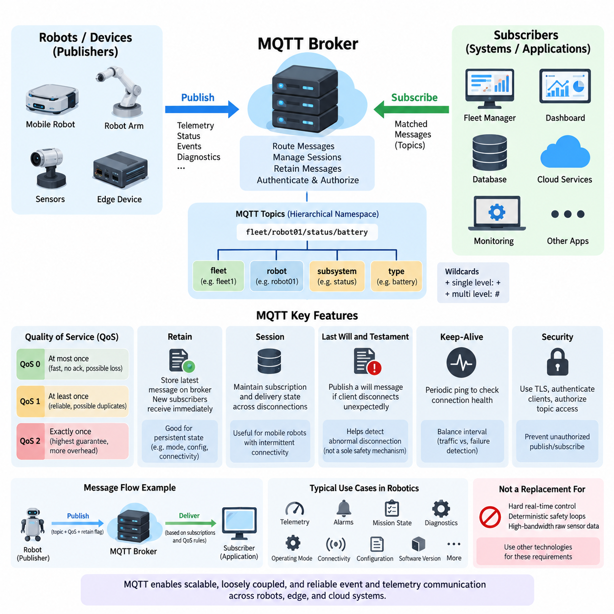
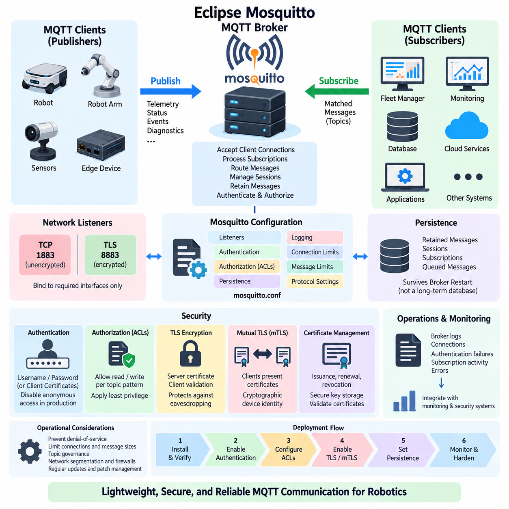
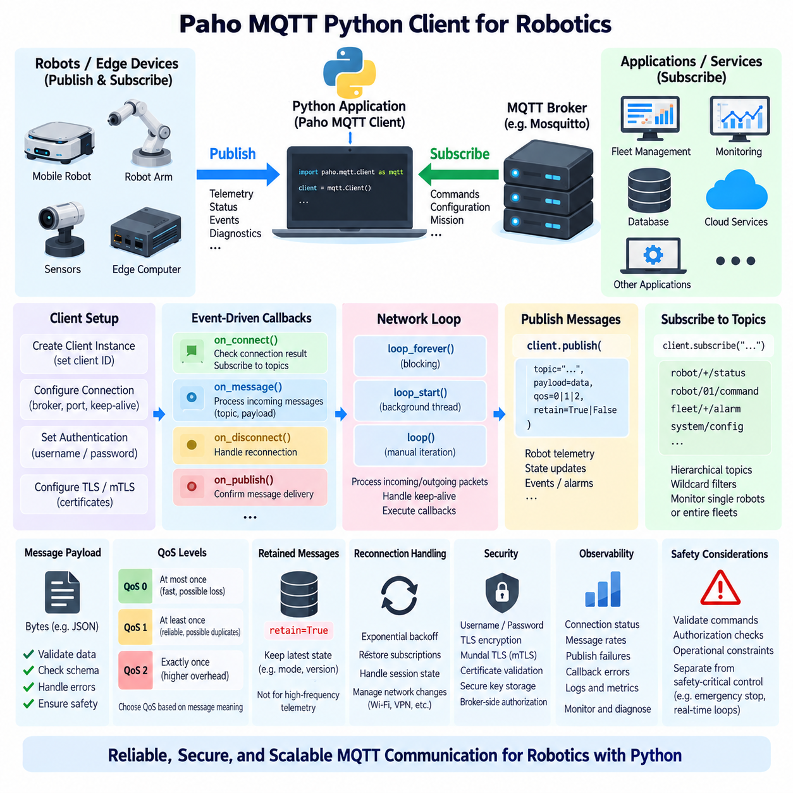
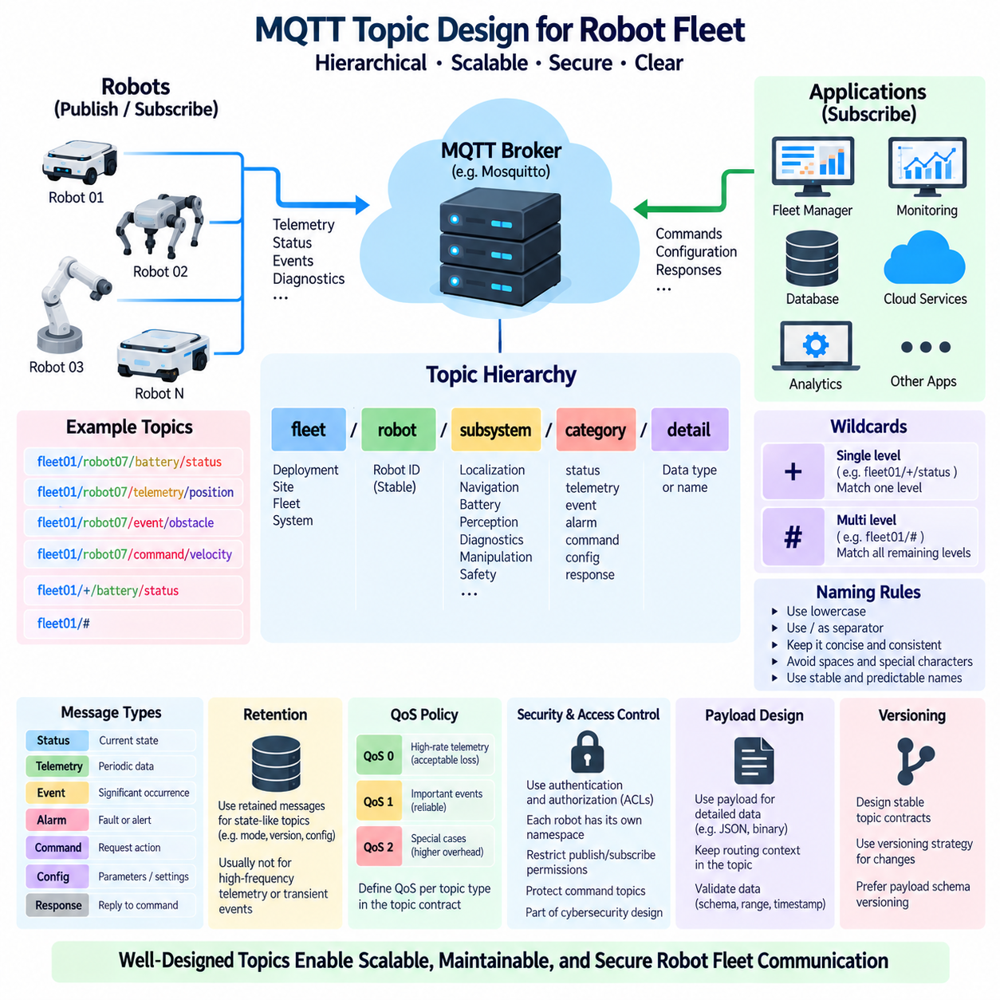
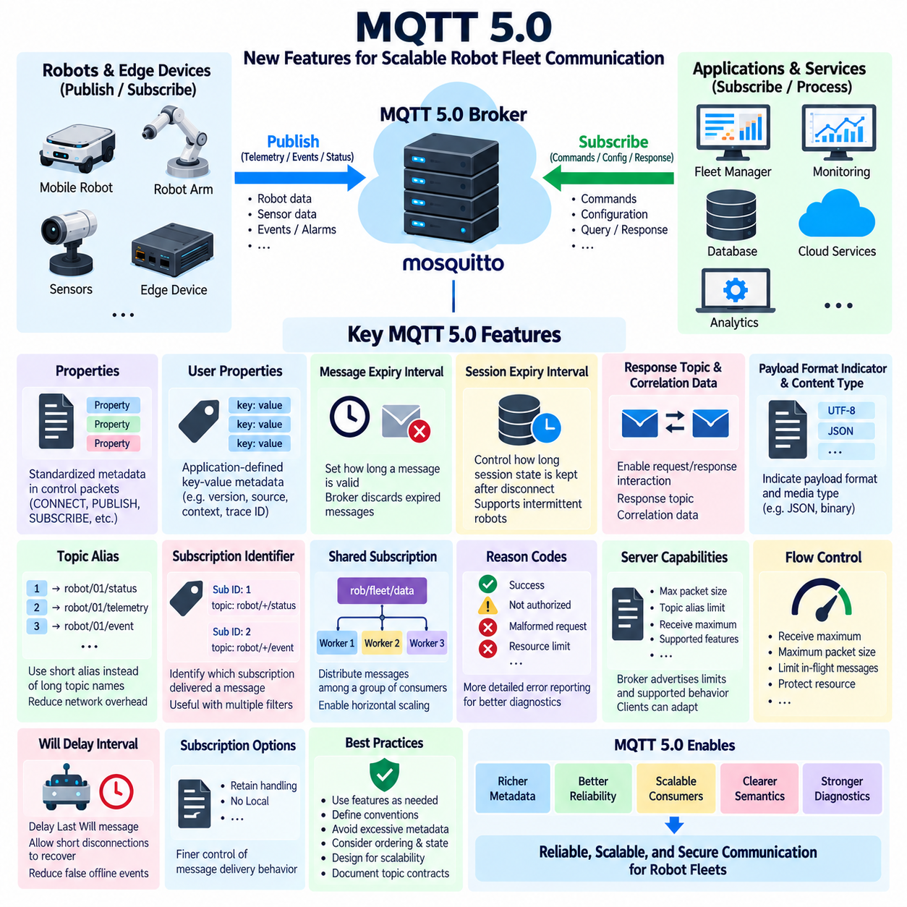
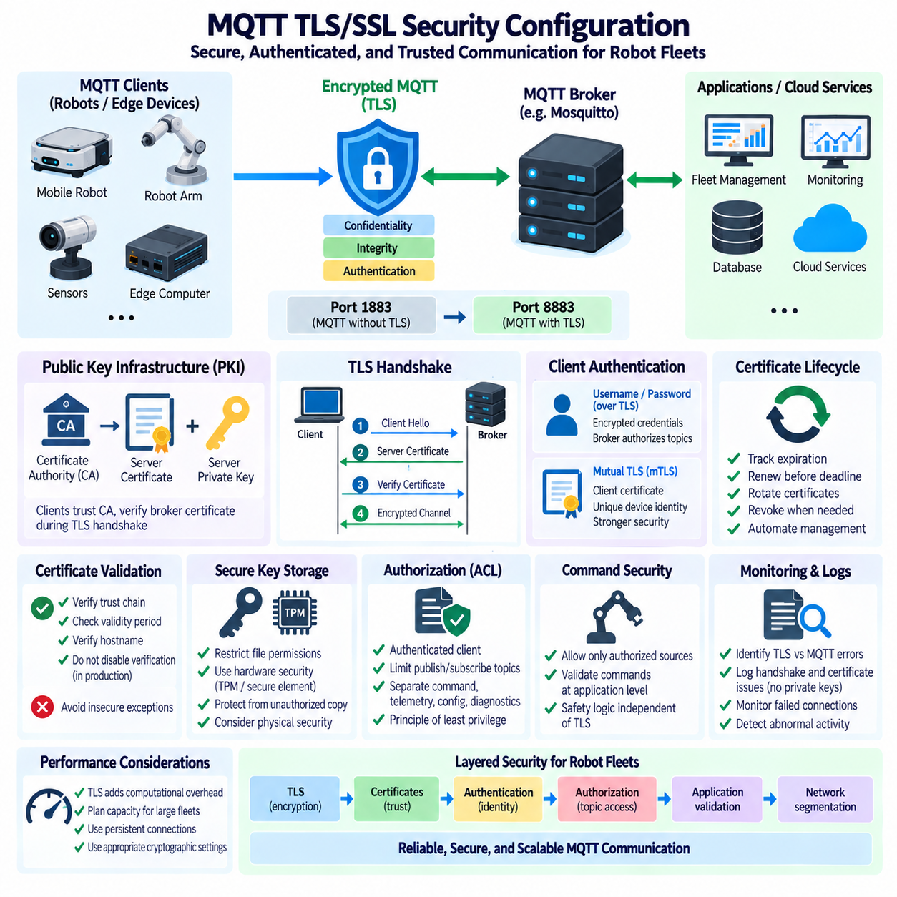
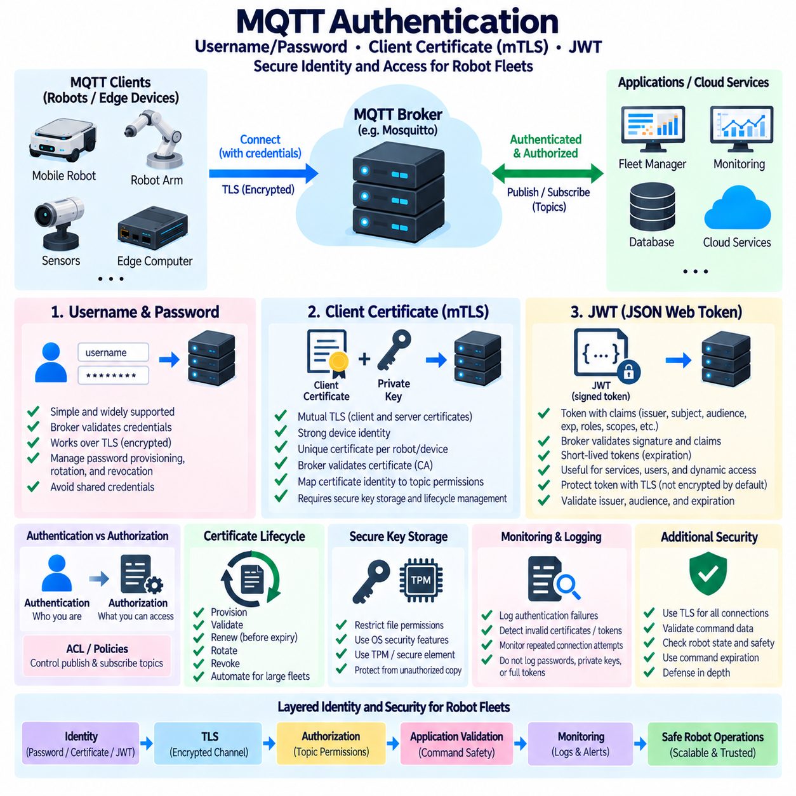
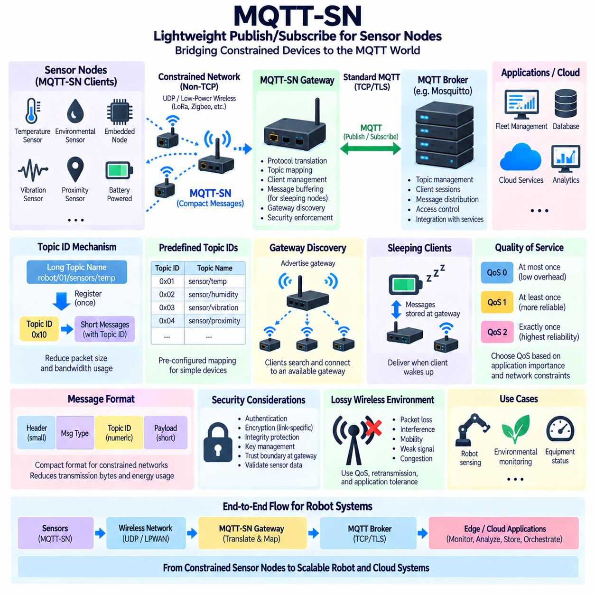
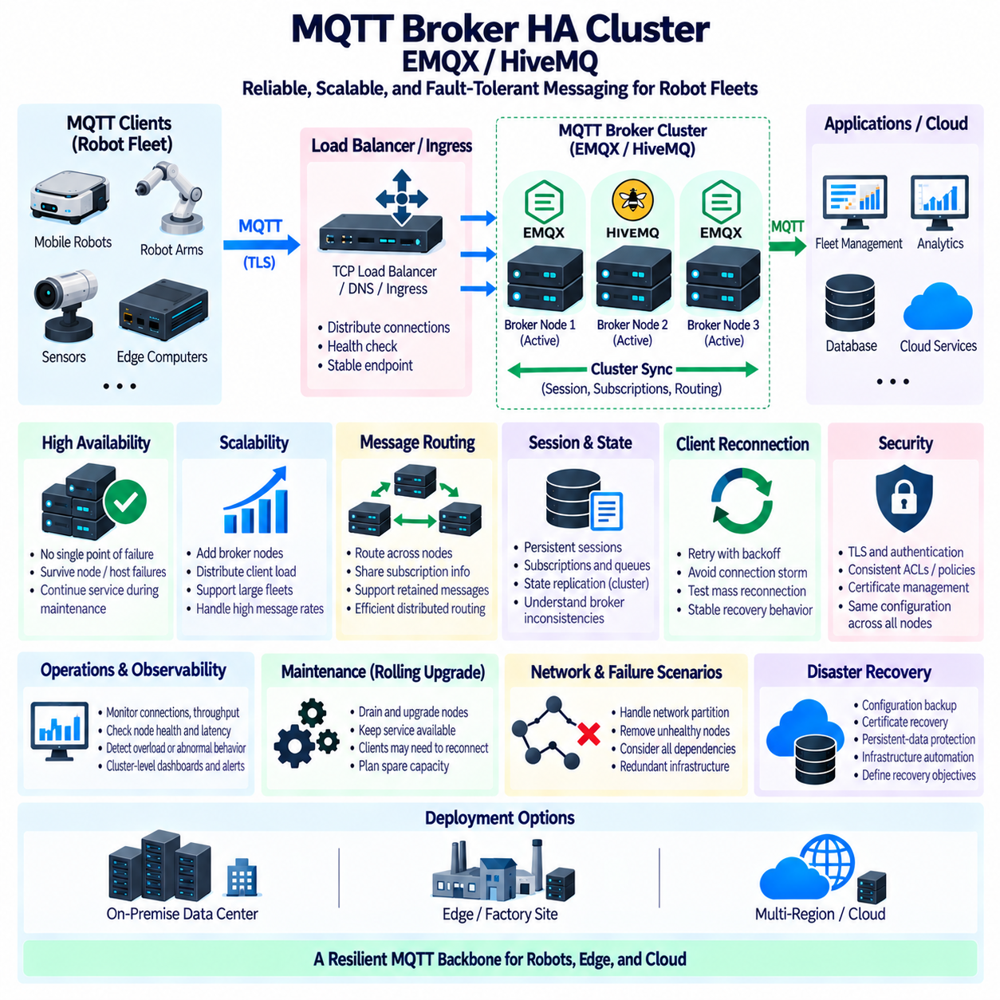
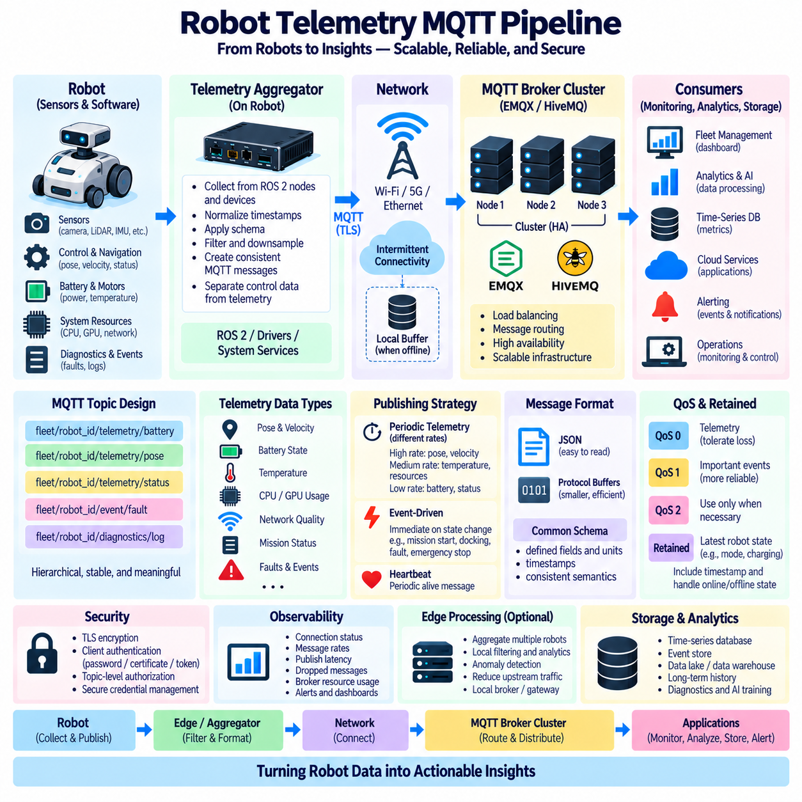

**Volume 06 Robot Communication and APIs**


# 04. MQTT

##  

## 04.01 MQTT Protocol Deep Dive: Broker, QoS, Retain

{width="7.268055555555556in" height="7.268055555555556in"}

MQTT is a lightweight publish/subscribe messaging protocol designed for efficient communication across networks where bandwidth, processing power, connection stability, or energy may be constrained. In robotics, it is particularly useful for telemetry, fleet events, device status, diagnostics, and edge-to-cloud communication. Instead of establishing direct application-to-application dependencies, MQTT introduces a broker that mediates message delivery between publishers and subscribers.

The publish/subscribe model separates message producers from message consumers in space, time, and implementation. A robot may publish battery state, localization quality, mission progress, or diagnostic events without knowing which systems consume them. Fleet managers, dashboards, databases, cloud services, and monitoring applications independently subscribe to relevant topics. This decoupling allows communication architectures to evolve without continuously modifying every robot application.

The MQTT broker is the central routing component of the protocol. Clients establish connections to the broker and may act as publishers, subscribers, or both simultaneously. When a publisher sends a message, the broker examines its topic and distributes the message to clients whose subscriptions match that topic. The broker can additionally manage sessions, retained messages, authentication, authorization, delivery state, and other communication metadata required by the MQTT deployment.

MQTT topics provide a hierarchical namespace for organizing messages. A robotics system might conceptually separate information according to fleet, robot, subsystem, and data type, allowing subscribers to consume narrowly selected information or broader groups of related events. Topic filters support single-level and multi-level wildcards, enabling scalable subscription patterns. Careful topic architecture becomes increasingly important as deployments grow from individual robots to heterogeneous fleets and distributed infrastructure.

Quality of Service, or QoS, defines the delivery guarantees applied to MQTT messages. QoS 0 provides an at-most-once delivery model and does not require acknowledgment of each published message. It minimizes protocol overhead and latency but allows messages to disappear when packets are lost or connections fail. High-frequency robot telemetry such as rapidly refreshed sensor summaries may tolerate this behavior when the newest sample is substantially more important than recovering an older one.

QoS 1 provides at-least-once delivery. The sender retains responsibility for the message until receiving the corresponding acknowledgment, and retransmission may occur when confirmation is unavailable. This improves reliability but means that duplicate delivery is possible. Applications consuming QoS 1 data should therefore tolerate duplicates or implement idempotent processing. Robot alarms, mission-state changes, and operational events often require this stronger reliability model.

QoS 2 provides the highest MQTT delivery guarantee and is intended to achieve exactly-once delivery through a multi-step exchange between communication peers. Additional protocol packets and stored state make it more expensive than QoS 0 or QoS 1. It should therefore not automatically be selected merely because it offers the strongest guarantee. Robotics architects must balance delivery semantics against latency, bandwidth, broker load, client resources, and the consequences of duplicate processing.

The effective QoS of message delivery depends on both publication and subscription behavior. A publisher can request a particular QoS when transmitting a message, while subscribers establish maximum QoS requirements through their subscriptions. The broker applies MQTT delivery rules when forwarding the publication. Consequently, QoS should be designed as part of the end-to-end message contract rather than treated as a simple global reliability switch applied uniformly to every topic.

Retained messages solve a different problem from QoS. When a publication is marked as retained, the broker stores the latest retained message for that topic. A new matching subscriber can therefore receive the most recently retained value immediately rather than waiting for the publisher to transmit again. This behavior is valuable for relatively persistent robot information such as operating mode, connectivity state, configuration summaries, software version, or the latest known availability state.

Retained messages must be distinguished from historical storage. A broker normally retains the latest retained publication associated with a topic rather than functioning as a complete telemetry database. Continuous localization trajectories, sensor histories, maintenance records, or long-term performance measurements should therefore be transferred into suitable persistent storage or streaming infrastructure. MQTT provides communication semantics, while databases and data platforms provide historical information management.

MQTT also supports session-oriented communication. Depending on protocol version and session configuration, a client may preserve subscription and delivery-related state across temporary disconnections. This is important for mobile robots that move between wireless coverage regions or experience intermittent connectivity. Combined with appropriate QoS policies, persistent session behavior can reduce information loss while avoiding the assumption that every robot maintains an uninterrupted connection to the communication infrastructure.

Another important mechanism is the Last Will and Testament. A client can register a will message with the broker when establishing its MQTT connection. If the connection later terminates unexpectedly under conditions defined by the protocol, the broker publishes that message on the client\'s behalf. Fleet infrastructure can use this mechanism as one input for detecting abnormal robot disconnection, although safety-critical availability decisions should not depend solely on network messaging or broker observations.

MQTT control packets keep the protocol comparatively compact. Connection establishment, publication, subscription management, acknowledgment, keep-alive operation, and disconnection are represented through defined packet types with relatively small protocol overhead. The compact design makes MQTT suitable for embedded and edge devices, but application payload efficiency still matters. Excessively large JSON documents or unnecessarily frequent publications can eliminate much of the bandwidth advantage provided by the underlying protocol.

Keep-alive behavior helps the broker and client recognize communication failures. During otherwise idle periods, MQTT can use lightweight control exchanges to demonstrate that the connection remains operational. The appropriate interval depends on network characteristics and application requirements. Very aggressive intervals increase traffic and processing, whereas excessively long intervals delay failure detection. Robot fleet systems therefore coordinate keep-alive settings with application-level heartbeat and health-monitoring policies.

MQTT\'s broker-centric architecture provides strong decoupling but also creates infrastructure responsibilities. Broker availability, capacity, security, persistence behavior, and network placement can directly influence fleet communication. Production systems therefore require monitoring of connection counts, message rates, queue growth, dropped messages, subscription behavior, resource consumption, and end-to-end latency. High-availability broker architectures become particularly relevant when communication serves many robots or multiple operational sites.

Security must surround the protocol architecture rather than being assumed from MQTT itself. Production robot systems commonly protect broker connections with TLS, authenticate clients using suitable credentials or certificates, and restrict publish and subscribe operations through authorization policies. Robot identity should be mapped carefully to permitted topic namespaces so that a compromised or misconfigured device cannot publish commands or consume information outside its intended scope.

For robotic systems, MQTT is best viewed as an asynchronous event and telemetry transport rather than a replacement for every communication mechanism. Hard real-time motor control, deterministic safety loops, and high-bandwidth raw sensor transport generally require other technologies. MQTT instead fits naturally between robots, edge computers, fleet services, dashboards, and cloud systems where scalable distribution, loose coupling, intermittent-network tolerance, and configurable delivery reliability are more important than deterministic microsecond-level timing.

MQTT는 대역폭(Bandwidth), 처리 능력(Processing Power), 연결 안정성(Connection Stability), 에너지(Energy) 등이 제한될 수 있는 네트워크에서도 효율적인 통신이 가능하도록 설계된 경량 발행/구독(Publish/Subscribe) 메시징 프로토콜(Messaging Protocol)이다. 로보틱스(Robotics)에서는 텔레메트리(Telemetry), 플릿 이벤트(Fleet Event), 장치 상태(Device Status), 진단(Diagnostics), 엣지-클라우드 통신(Edge-to-Cloud Communication)에 특히 유용하다. 직접적인 애플리케이션 간 연결 대신 메시지 전달을 중개하는 브로커(Broker)를 사용한다.

발행/구독 모델(Publish/Subscribe Model)은 메시지 생산자(Message Producer)와 메시지 소비자(Message Consumer)를 공간, 시간 및 구현 측면에서 분리한다. 로봇은 어떤 시스템이 데이터를 사용하는지 알지 못해도 배터리 상태(Battery State), 위치추정 품질(Localization Quality), 임무 진행 상태(Mission Progress), 진단 이벤트(Diagnostic Event)를 발행할 수 있다. 플릿 관리자(Fleet Manager), 대시보드(Dashboard), 데이터베이스(Database), 클라우드 서비스(Cloud Service)는 필요한 토픽(Topic)을 독립적으로 구독한다.

MQTT 브로커(MQTT Broker)는 프로토콜의 중앙 라우팅 구성요소(Central Routing Component)이다. 클라이언트(Client)는 브로커와 연결을 설정하고 발행자(Publisher), 구독자(Subscriber), 또는 두 역할을 동시에 수행할 수 있다. 발행자가 메시지를 전송하면 브로커는 해당 토픽을 확인하고 일치하는 토픽을 구독한 클라이언트에게 메시지를 전달한다. 또한 세션(Session), 보존 메시지(Retained Message), 인증(Authentication), 권한부여(Authorization), 전달 상태(Delivery State) 등을 관리할 수 있다.

MQTT 토픽(MQTT Topic)은 메시지를 구성하기 위한 계층적 이름공간(Hierarchical Namespace)을 제공한다. 로봇 시스템에서는 플릿(Fleet), 로봇(Robot), 서브시스템(Subsystem), 데이터 유형(Data Type)에 따라 정보를 구분하여 구독자가 특정 정보 또는 관련 이벤트 그룹을 선택적으로 수신하도록 구성할 수 있다. 토픽 필터(Topic Filter)는 단일 수준 및 다중 수준 와일드카드(Wildcard)를 지원하므로 개별 로봇에서 대규모 이기종 플릿(Heterogeneous Fleet)으로 확장될수록 체계적인 토픽 설계가 중요해진다.

서비스 품질(Quality of Service, QoS)은 MQTT 메시지에 적용되는 전달 보장 수준(Delivery Guarantee)을 정의한다. QoS 0은 최대 한 번 전달(At-Most-Once Delivery) 방식이며 각 발행 메시지에 대한 확인응답(Acknowledgment)을 요구하지 않는다. 프로토콜 오버헤드(Protocol Overhead)와 지연시간(Latency)은 최소화되지만 패킷 손실이나 연결 장애가 발생하면 메시지가 유실될 수 있다. 최신 데이터가 과거 데이터 복구보다 중요한 고주기 로봇 텔레메트리(High-Frequency Robot Telemetry)에 적합할 수 있다.

QoS 1은 최소 한 번 전달(At-Least-Once Delivery)을 제공한다. 송신자는 해당 확인응답을 받을 때까지 메시지에 대한 책임을 유지하며 확인이 이루어지지 않으면 재전송(Retransmission)이 발생할 수 있다. 전달 신뢰성(Reliability)은 향상되지만 동일 메시지가 중복 전달될 가능성이 있다. 따라서 QoS 1 데이터를 처리하는 애플리케이션은 중복 메시지를 허용하거나 멱등 처리(Idempotent Processing)를 구현해야 하며 로봇 경보, 임무 상태 변경, 운용 이벤트 등에 활용할 수 있다.

QoS 2는 MQTT에서 가장 높은 메시지 전달 보장 수준을 제공하며 통신 상대 간의 다단계 교환(Multi-Step Exchange)을 통해 정확히 한 번 전달(Exactly-Once Delivery)을 달성하도록 설계된다. 추가 프로토콜 패킷과 상태 저장이 필요하므로 QoS 0이나 QoS 1보다 비용이 크다. 따라서 가장 강력한 보장 수준이라는 이유만으로 항상 선택해서는 안 되며 지연시간, 대역폭, 브로커 부하(Broker Load), 클라이언트 자원(Client Resource), 중복 처리의 영향을 함께 고려해야 한다.

메시지 전달의 실질적인 서비스 품질(QoS)은 발행 및 구독 동작 모두의 영향을 받는다. 발행자(Publisher)는 메시지를 전송할 때 특정 QoS를 요청할 수 있으며 구독자(Subscriber)는 구독을 설정하면서 최대 QoS 요구사항을 정의한다. 브로커는 메시지를 전달할 때 MQTT의 전달 규칙(Delivery Rules)을 적용한다. 따라서 QoS는 모든 토픽에 동일하게 적용하는 단순한 신뢰성 스위치가 아니라 종단간 메시지 계약(End-to-End Message Contract)의 일부로 설계해야 한다.

보존 메시지(Retained Message)는 QoS와는 다른 문제를 해결한다. 메시지가 보존 상태(Retained)로 발행되면 브로커는 해당 토픽의 최신 보존 메시지를 저장한다. 이후 새로운 구독자가 해당 토픽을 구독하면 발행자의 다음 전송을 기다리지 않고 최신 값을 즉시 받을 수 있다. 이러한 특성은 로봇의 운용 모드(Operating Mode), 연결 상태(Connectivity State), 구성 정보(Configuration Summary), 소프트웨어 버전(Software Version), 최신 가용 상태(Availability State)와 같이 비교적 지속적인 상태 정보에 유용하다.

보존 메시지(Retained Message)는 이력 저장(Historical Storage)과 구분해야 한다. 브로커는 일반적으로 토픽과 연결된 최신 보존 메시지를 유지할 뿐 완전한 텔레메트리 데이터베이스(Telemetry Database) 역할을 수행하지 않는다. 연속적인 위치 궤적(Localization Trajectory), 센서 이력(Sensor History), 유지보수 기록(Maintenance Record), 장기간 성능 데이터는 적절한 영구 저장소(Persistent Storage)나 스트리밍 인프라(Streaming Infrastructure)로 전달해야 한다. MQTT는 통신 의미체계를 제공하고 데이터 플랫폼은 장기 데이터 관리를 담당한다.

MQTT는 세션 기반 통신(Session-Oriented Communication)도 지원한다. 프로토콜 버전과 세션 설정에 따라 클라이언트는 일시적인 연결 해제 이후에도 구독 및 메시지 전달과 관련된 상태를 유지할 수 있다. 이는 무선 통신 음영 지역을 이동하거나 간헐적인 네트워크 장애를 경험하는 이동 로봇(Mobile Robot)에 중요하다. 적절한 QoS 정책과 지속 세션(Persistent Session)을 결합하면 모든 로봇이 항상 네트워크에 연결되어 있다고 가정하지 않고도 정보 손실을 줄일 수 있다.

또 다른 중요한 기능은 유언 메시지(Last Will and Testament, LWT)이다. 클라이언트는 MQTT 연결을 설정할 때 브로커에 유언 메시지를 등록할 수 있다. 이후 프로토콜이 정의한 조건에서 연결이 비정상적으로 종료되면 브로커가 해당 클라이언트를 대신하여 이 메시지를 발행한다. 플릿 인프라(Fleet Infrastructure)는 이를 비정상적인 로봇 연결 해제를 감지하는 수단 중 하나로 사용할 수 있지만 안전 필수 가용성 판단(Safety-Critical Availability Decision)을 브로커의 네트워크 관찰에만 의존해서는 안 된다.

MQTT 제어 패킷(Control Packet)은 프로토콜을 비교적 간결하게 유지한다. 연결 설정(Connection Establishment), 발행(Publication), 구독 관리(Subscription Management), 확인응답(Acknowledgment), 연결 유지(Keep-Alive), 연결 종료(Disconnection)가 작은 프로토콜 오버헤드로 정의된다. 이러한 경량 설계는 임베디드 및 엣지 장치(Embedded and Edge Device)에 적합하지만 애플리케이션 페이로드(Application Payload)의 효율성도 중요하다. 지나치게 큰 JSON 문서나 과도하게 빈번한 발행은 MQTT의 대역폭 장점을 감소시킬 수 있다.

연결 유지(Keep-Alive) 기능은 브로커와 클라이언트가 통신 장애를 인식하도록 지원한다. 데이터 교환이 없는 유휴 상태에서도 MQTT는 경량 제어 메시지 교환을 통해 연결 상태를 확인할 수 있다. 적절한 주기는 네트워크 특성과 애플리케이션 요구사항에 따라 결정해야 한다. 지나치게 짧은 주기는 트래픽과 처리 부하를 증가시키고 너무 긴 주기는 장애 감지를 지연시키므로 로봇 플릿에서는 애플리케이션 수준 하트비트(Heartbeat) 및 상태 모니터링(Health Monitoring) 정책과 함께 설계해야 한다.

MQTT의 브로커 중심 아키텍처(Broker-Centric Architecture)는 강력한 결합도 완화(Decoupling)를 제공하지만 동시에 인프라 운영 책임을 발생시킨다. 브로커의 가용성(Availability), 처리 용량(Capacity), 보안(Security), 영속성(Persistence), 네트워크 배치는 전체 플릿 통신에 직접적인 영향을 줄 수 있다. 따라서 실제 운영 시스템에서는 연결 수, 메시지 전송률, 큐 증가(Queue Growth), 메시지 손실, 구독 동작, 자원 사용량, 종단간 지연시간을 모니터링해야 하며 대규모 시스템에서는 고가용성 브로커 아키텍처(High-Availability Broker Architecture)가 중요해진다.

보안(Security)은 MQTT 자체에 내재되어 있다고 가정하기보다 프로토콜 아키텍처 전체를 둘러싸도록 구성해야 한다. 실제 로봇 시스템에서는 일반적으로 전송 계층 보안(Transport Layer Security, TLS)을 사용하여 브로커 연결을 보호하고 적절한 자격증명(Credential)이나 인증서(Certificate)를 이용하여 클라이언트를 인증한다. 또한 접근제어 정책(Authorization Policy)을 통해 발행 및 구독 권한을 제한하여 손상되거나 잘못 구성된 로봇이 허가되지 않은 명령을 발행하거나 다른 시스템의 정보를 구독하지 못하도록 해야 한다.

로봇 시스템에서 MQTT는 모든 통신 방식을 대체하는 기술이라기보다 비동기 이벤트 및 텔레메트리 전송(Asynchronous Event and Telemetry Transport) 기술로 이해하는 것이 적절하다. 하드 실시간 모터 제어(Hard Real-Time Motor Control), 결정론적 안전 루프(Deterministic Safety Loop), 고대역폭 원시 센서 전송(High-Bandwidth Raw Sensor Transport)은 일반적으로 다른 기술이 필요하다. MQTT는 확장 가능한 메시지 분배, 느슨한 결합(Loose Coupling), 간헐적 네트워크 대응, 선택 가능한 전달 신뢰성이 중요한 로봇, 엣지 컴퓨터, 플릿 서비스, 대시보드 및 클라우드 시스템 사이의 통신에 특히 적합하다.

##  

## 04.02 Eclipse Mosquitto Broker Install and Security [w/Code]

{width="7.268055555555556in" height="7.268055555555556in"}

Eclipse Mosquitto is a lightweight open-source MQTT broker designed to implement the publish/subscribe communication model with relatively low computing and memory requirements. Within the robot communication architecture, it can operate between robots, edge computers, fleet services, monitoring systems, and cloud applications. Its compact implementation makes it suitable for development computers, embedded gateways, industrial edge servers, and production fleet infrastructure.

A Mosquitto installation normally consists of the broker service, configuration files, persistence storage when enabled, logging facilities, and MQTT client utilities. The broker accepts client connections, processes subscriptions, receives published messages, and routes those messages to matching subscribers. Command-line tools such as mosquitto_pub and mosquitto_sub are particularly useful during installation because they allow communication behavior to be verified before robot applications are connected.

On Linux systems, Mosquitto can typically operate as a system service after installation, allowing the broker to start automatically with the operating system and run independently of interactive user sessions. Administrators should verify the service state, listening interfaces, ports, configuration path, and log output before integrating robots. A minimal local configuration is useful for initial testing, but production deployment requires explicit network and security settings.

Listener configuration determines where and how clients can reach the broker. Standard MQTT commonly uses TCP port 1883 for unencrypted communication, while MQTT protected by TLS commonly uses port 8883. A broker may expose multiple listeners with different security requirements, but every exposed interface increases the attack surface. Production robot networks should therefore bind only to required interfaces and avoid unnecessarily exposing MQTT services to external networks.

Mosquitto configuration should be treated as part of the robot communication infrastructure rather than as a collection of temporary development settings. Important parameters include listeners, authentication methods, authorization rules, persistence, logging, connection limits, message limits, and protocol behavior. Configuration files should be version controlled where appropriate, reviewed during deployment, and separated between development, testing, and production environments to prevent insecure laboratory settings from reaching operational systems.

Anonymous access is convenient during isolated development because clients can connect without presenting an identity, but it is generally inappropriate for operational robot systems. When anonymous access is disabled, clients must authenticate before using the broker. A straightforward Mosquitto deployment can use username and password credentials maintained through a password file. Passwords should never be stored as plain text in robot source code, configuration repositories, container images, or deployment scripts.

Authentication answers the question of who a client is, while authorization determines what that authenticated client is permitted to do. Mosquitto can enforce topic-level access control so that a robot identity publishes and subscribes only within approved namespaces. For example, a telemetry producer should not automatically receive permission to publish mission commands. Separating read and write privileges limits the consequences of software defects, credential leakage, and compromised devices.

Access Control Lists, commonly called ACLs, provide a practical mechanism for implementing MQTT authorization. Rules can associate users or identities with permitted topic patterns and specify whether they may read, write, or perform both operations. In a fleet architecture, ACL design should reflect robot identity, fleet membership, subsystem responsibility, and application role. Broad wildcard permissions should be minimized because they can unintentionally provide access to unrelated robots or operational services.

Transport Layer Security, or TLS, protects MQTT traffic against passive observation and network manipulation by providing encryption and server authentication. The broker is configured with a server certificate and corresponding private key, while clients validate the certificate against an appropriate trusted Certificate Authority. This is especially important when MQTT traffic crosses shared Wi-Fi, industrial Ethernet segments, remote access networks, or edge-to-cloud communication paths.

Certificate validation is only useful when clients correctly verify the broker identity. Disabling certificate verification may simplify temporary experiments, but it defeats an important security property of TLS and should not become a production configuration. Certificates also require lifecycle management, including secure private-key storage, controlled issuance, renewal before expiration, revocation procedures, and replacement when credentials or devices are suspected of compromise.

Mutual TLS, or mTLS, extends TLS by requiring clients to present their own certificates in addition to validating the broker certificate. This enables cryptographic device identity and can be valuable for robot fleets where each robot or edge computer requires independently managed credentials. Compared with shared passwords, individual certificates can improve isolation and revocation control, although they introduce additional Public Key Infrastructure and certificate lifecycle responsibilities.

Broker persistence determines whether selected MQTT state can survive broker restarts. Depending on configuration and protocol behavior, persistence can protect information associated with retained messages, sessions, subscriptions, and queued delivery state. This is useful for fleet infrastructure that must tolerate maintenance or unexpected service interruption. Persistence should nevertheless be distinguished from application databases because an MQTT broker is not intended to replace long-term telemetry or event storage.

Logging is essential for both operations and security. Mosquitto logs can provide evidence about broker startup, client connections, disconnections, authentication failures, subscription behavior, and communication errors. During development, detailed logging simplifies troubleshooting, while production systems should balance diagnostic value against storage volume and exposure of sensitive information. Broker logs can also feed centralized observability and security-monitoring systems for fleet-wide analysis.

Security configuration should follow a defense-in-depth approach. TLS protects communication channels, authentication establishes client identity, and ACLs restrict operations after authentication. Network segmentation, firewalls, operating-system permissions, secure certificate storage, patch management, monitoring, and service hardening provide additional layers. No single mechanism is sufficient because a secure MQTT deployment depends on the combined behavior of the broker, host system, network, credentials, and client applications.

Robot deployments must also consider denial-of-service and resource exhaustion. Excessive connections, rapidly repeated subscriptions, oversized payloads, uncontrolled retained messages, or abnormal publication rates can consume broker memory, CPU, bandwidth, and storage. Appropriate connection policies, message-size constraints, topic governance, monitoring, and network-level controls help prevent individual malfunctioning or compromised clients from degrading communication for the entire robot fleet.

A practical deployment process progresses from local broker verification to authenticated communication, topic authorization, encrypted transport, persistence, monitoring, and operational hardening. Each stage should be tested independently so that failures can be attributed to networking, authentication, authorization, certificates, or MQTT behavior. Robot applications should also be tested for reconnection, certificate expiration, broker restart, credential rejection, network interruption, and restoration of normal service.

In production robotics, Mosquitto is most effective when the broker is treated as managed infrastructure with explicitly defined trust boundaries. Robots should receive unique identities where practical, topic permissions should follow least-privilege principles, external connections should use protected channels, and configuration changes should be auditable. These practices allow MQTT to remain lightweight while providing a communication foundation suitable for secure robot telemetry, events, diagnostics, fleet coordination, and edge-to-cloud integration.

Eclipse Mosquitto는 비교적 적은 컴퓨팅 및 메모리 자원으로 발행/구독(Publish/Subscribe) 통신 모델을 구현하도록 설계된 경량 오픈소스 MQTT 브로커(MQTT Broker)이다. 로봇 통신 아키텍처(Robot Communication Architecture)에서는 로봇, 엣지 컴퓨터(Edge Computer), 플릿 서비스(Fleet Service), 모니터링 시스템(Monitoring System), 클라우드 애플리케이션(Cloud Application) 사이에서 동작할 수 있다. 이러한 경량 구현 특성으로 개발용 컴퓨터부터 산업용 엣지 서버까지 다양한 환경에 적용할 수 있다.

Mosquitto 설치 환경은 일반적으로 브로커 서비스(Broker Service), 구성 파일(Configuration File), 활성화된 경우의 영속성 저장소(Persistence Storage), 로깅 기능(Logging Facility), MQTT 클라이언트 유틸리티(Client Utility)로 구성된다. 브로커는 클라이언트 연결을 수락하고 구독을 처리하며 발행된 메시지를 수신하여 일치하는 구독자에게 전달한다. mosquitto_pub 및 mosquitto_sub와 같은 명령줄 도구(Command-Line Tool)는 로봇 애플리케이션을 연결하기 전에 통신 동작을 검증하는 데 특히 유용하다.

리눅스(Linux) 시스템에서 Mosquitto는 설치 후 시스템 서비스(System Service)로 동작하도록 구성할 수 있으므로 운영체제와 함께 자동으로 시작되고 대화형 사용자 세션과 독립적으로 실행될 수 있다. 관리자는 로봇을 통합하기 전에 서비스 상태(Service State), 수신 인터페이스(Listening Interface), 포트(Port), 구성 파일 경로(Configuration Path), 로그 출력(Log Output)을 확인해야 한다. 초기 시험에는 최소 구성이 유용하지만 실제 운영에는 명시적인 네트워크 및 보안 설정이 필요하다.

리스너 구성(Listener Configuration)은 클라이언트가 브로커에 어디에서 어떤 방식으로 접근할 수 있는지를 결정한다. 표준 MQTT는 일반적으로 암호화되지 않은 통신에 TCP 포트 1883을 사용하고, 전송 계층 보안(TLS)으로 보호되는 MQTT는 일반적으로 포트 8883을 사용한다. 브로커는 서로 다른 보안 요구사항을 가진 여러 리스너를 제공할 수 있지만 노출된 인터페이스가 증가할수록 공격 표면(Attack Surface)도 증가하므로 실제 로봇 네트워크에서는 필요한 인터페이스만 활성화하는 것이 적절하다.

Mosquitto 구성(Configuration)은 임시 개발 설정의 집합이 아니라 로봇 통신 인프라(Robot Communication Infrastructure)의 일부로 관리해야 한다. 중요한 설정에는 리스너(Listener), 인증 방식(Authentication Method), 권한부여 규칙(Authorization Rule), 영속성(Persistence), 로깅(Logging), 연결 제한(Connection Limit), 메시지 제한(Message Limit), 프로토콜 동작(Protocol Behavior)이 포함된다. 구성 파일은 필요한 경우 버전 관리하고 개발, 시험, 운영 환경을 분리하여 실험실의 취약한 설정이 실제 시스템으로 전달되는 것을 방지해야 한다.

익명 접근(Anonymous Access)은 클라이언트가 별도의 신원정보 없이 연결할 수 있으므로 격리된 개발 환경에서는 편리하지만 실제 운용 로봇 시스템에는 일반적으로 적합하지 않다. 익명 접근을 비활성화하면 클라이언트는 브로커를 사용하기 전에 인증(Authentication)을 수행해야 한다. 기본적인 Mosquitto 환경에서는 비밀번호 파일(Password File)을 이용한 사용자 이름과 비밀번호 인증을 사용할 수 있다. 비밀번호를 로봇 소스 코드, 구성 저장소, 컨테이너 이미지(Container Image), 배포 스크립트(Deployment Script)에 평문으로 저장해서는 안 된다.

인증(Authentication)은 클라이언트가 누구인지를 확인하고, 권한부여(Authorization)는 인증된 클라이언트가 무엇을 수행할 수 있는지를 결정한다. Mosquitto는 토픽 수준 접근제어(Topic-Level Access Control)를 적용하여 로봇 신원이 허가된 이름공간(Namespace) 내에서만 발행하고 구독하도록 제한할 수 있다. 예를 들어 텔레메트리 생산자(Telemetry Producer)에게 임무 명령(Mission Command)을 발행할 권한까지 자동으로 제공해서는 안 된다. 읽기와 쓰기 권한을 분리하면 소프트웨어 오류나 자격증명 유출의 영향을 제한할 수 있다.

접근제어목록(Access Control List, ACL)은 MQTT 권한부여를 구현하는 실용적인 방법을 제공한다. 규칙을 통해 사용자 또는 신원(Identity)을 허용된 토픽 패턴(Topic Pattern)에 연결하고 읽기(Read), 쓰기(Write), 또는 두 작업 모두에 대한 권한을 정의할 수 있다. 플릿 아키텍처에서는 로봇 신원(Robot Identity), 플릿 소속(Fleet Membership), 서브시스템 책임(Subsystem Responsibility), 애플리케이션 역할(Application Role)을 반영하여 ACL을 설계해야 한다. 광범위한 와일드카드 권한(Wildcard Permission)은 관련 없는 로봇이나 서비스에 대한 접근을 허용할 수 있으므로 최소화해야 한다.

전송 계층 보안(Transport Layer Security, TLS)은 암호화(Encryption)와 서버 인증(Server Authentication)을 제공하여 MQTT 트래픽을 수동적인 도청과 네트워크 조작으로부터 보호한다. 브로커에는 서버 인증서(Server Certificate)와 이에 대응하는 개인키(Private Key)를 구성하며 클라이언트는 적절한 신뢰 인증기관(Certificate Authority, CA)을 통해 인증서를 검증한다. 이는 MQTT 트래픽이 공유 와이파이(Wi-Fi), 산업용 이더넷(Industrial Ethernet), 원격 접속 네트워크 또는 엣지-클라우드 통신 경로를 통과하는 경우 특히 중요하다.

인증서 검증(Certificate Validation)은 클라이언트가 브로커의 신원을 올바르게 검증할 때만 의미가 있다. 인증서 검증을 비활성화하면 임시 실험은 간단해질 수 있지만 TLS의 핵심 보안 특성을 훼손하므로 운영 환경 설정으로 사용해서는 안 된다. 인증서에는 안전한 개인키 저장(Secure Private-Key Storage), 통제된 발급(Controlled Issuance), 만료 전 갱신(Renewal), 폐기(Revocation), 자격증명 또는 장치 손상이 의심되는 경우의 교체 절차를 포함하는 수명주기 관리(Lifecycle Management)가 필요하다.

상호 전송 계층 보안(Mutual TLS, mTLS)은 클라이언트가 브로커 인증서를 검증하는 것뿐만 아니라 자신의 클라이언트 인증서(Client Certificate)도 제시하도록 TLS를 확장한다. 이를 통해 암호학적 장치 신원(Cryptographic Device Identity)을 구현할 수 있으며 각 로봇이나 엣지 컴퓨터에 독립적인 자격증명이 필요한 로봇 플릿에서 유용하다. 개별 인증서는 공유 비밀번호보다 격리 및 폐기 제어를 향상시킬 수 있지만 공개키 기반구조(Public Key Infrastructure, PKI)와 인증서 수명주기 관리가 추가로 필요하다.

브로커 영속성(Broker Persistence)은 선택된 MQTT 상태가 브로커 재시작 이후에도 유지될 수 있는지를 결정한다. 구성과 프로토콜 동작에 따라 보존 메시지(Retained Message), 세션(Session), 구독(Subscription), 대기 중인 메시지 전달 상태(Queued Delivery State)와 관련된 정보를 보호할 수 있다. 이는 유지보수나 예상하지 못한 서비스 중단을 견뎌야 하는 플릿 인프라에 유용하다. 그러나 MQTT 브로커는 장기간의 텔레메트리 또는 이벤트 저장을 위한 애플리케이션 데이터베이스를 대체하는 시스템은 아니다.

로깅(Logging)은 운영과 보안 모두에서 필수적이다. Mosquitto 로그는 브로커 시작, 클라이언트 연결 및 연결 해제, 인증 실패, 구독 동작, 통신 오류 등에 대한 정보를 제공할 수 있다. 개발 환경에서는 상세한 로그가 문제 해결에 유용하지만 운영 환경에서는 진단 가치와 저장 공간 및 민감정보 노출 위험 사이의 균형을 고려해야 한다. 브로커 로그를 중앙 관측성 시스템(Centralized Observability System)이나 보안 모니터링 시스템(Security Monitoring System)으로 전달하여 플릿 전체를 분석할 수도 있다.

보안 구성(Security Configuration)은 심층 방어(Defense-in-Depth) 방식으로 설계해야 한다. TLS는 통신 채널을 보호하고 인증은 클라이언트 신원을 확인하며 ACL은 인증 이후 허용되는 작업을 제한한다. 네트워크 분할(Network Segmentation), 방화벽(Firewall), 운영체제 권한, 안전한 인증서 저장, 패치 관리(Patch Management), 모니터링, 서비스 강화(Service Hardening)는 추가적인 방어 계층을 제공한다. 안전한 MQTT 배포는 브로커뿐 아니라 호스트 시스템, 네트워크, 자격증명, 클라이언트 애플리케이션의 결합된 보안에 의해 결정된다.

로봇 시스템에서는 서비스 거부(Denial-of-Service) 및 자원 고갈(Resource Exhaustion) 문제도 고려해야 한다. 과도한 연결, 반복적인 구독 요청, 지나치게 큰 페이로드(Payload), 통제되지 않은 보존 메시지, 비정상적인 발행 빈도는 브로커의 메모리, CPU, 대역폭 및 저장 공간을 소비할 수 있다. 적절한 연결 정책(Connection Policy), 메시지 크기 제한, 토픽 관리(Topic Governance), 모니터링, 네트워크 수준 제어를 적용하면 하나의 오작동하거나 침해된 클라이언트가 전체 로봇 플릿의 통신을 저하시키는 위험을 줄일 수 있다.

실용적인 배포 과정(Deployment Process)은 로컬 브로커 검증에서 시작하여 인증된 통신, 토픽 권한부여, 암호화 전송, 영속성, 모니터링, 운영 환경 강화(Operational Hardening)로 발전한다. 각 단계는 독립적으로 시험하여 장애의 원인이 네트워크, 인증, 권한부여, 인증서 또는 MQTT 동작 중 어디에 있는지를 구분할 수 있어야 한다. 로봇 애플리케이션은 재연결(Reconnection), 인증서 만료, 브로커 재시작, 자격증명 거부, 네트워크 단절 및 정상 서비스 복구 상황도 함께 시험해야 한다.

실제 로보틱스(Robotics) 환경에서 Mosquitto는 브로커를 명확하게 정의된 신뢰 경계(Trust Boundary)를 가진 관리형 인프라(Managed Infrastructure)로 취급할 때 가장 효과적이다. 가능한 경우 각 로봇에 고유한 신원(Unique Identity)을 부여하고 토픽 권한에는 최소 권한 원칙(Least-Privilege Principle)을 적용하며 외부 연결은 보호된 통신 채널을 사용해야 한다. 또한 구성 변경은 감사 가능해야 한다. 이러한 원칙을 적용하면 MQTT의 경량성을 유지하면서 안전한 로봇 텔레메트리, 이벤트, 진단, 플릿 조정 및 엣지-클라우드 통합을 위한 통신 기반을 구축할 수 있다.

##  

## 04.03 MQTT Client Implementation: paho.mqtt Python [w/Code]

{width="7.268055555555556in" height="7.268055555555556in"}

The Paho MQTT Python client provides a practical interface for implementing MQTT communication in robot software without requiring applications to handle MQTT packet encoding, socket management, acknowledgments, and protocol state directly. A Python process can operate as a publisher, subscriber, or both, allowing robots and edge applications to exchange telemetry, status, events, diagnostics, and commands through an MQTT broker.

A typical implementation begins by importing the Paho MQTT client library and creating a client instance representing the application within the MQTT environment. The client should have an identity appropriate for the deployment, particularly when persistent sessions or broker-side access policies are used. In robot fleets, client identities should normally correspond to individual robots, gateways, services, or application roles rather than being reused indiscriminately across unrelated devices.

The client connects to a configured MQTT broker using a hostname or IP address and a listener port. Connection parameters also include keep-alive behavior and may include authentication or TLS settings. Development systems may initially connect to a broker on the local network, while operational deployments commonly communicate with an edge, on-premise, or cloud broker. Connection establishment should be treated as a managed application state rather than assumed to succeed permanently.

Paho MQTT follows an event-driven programming model in which callback functions process important communication events. A connection callback can determine whether broker access succeeded and initiate subscriptions after successful connection. A message callback processes incoming publications, while additional callbacks can report disconnection or publication completion. This structure separates application logic from asynchronous network activity and is well suited to continuously operating robot processes.

Subscription logic associates the client with one or more MQTT topic filters. A robot monitoring application might subscribe to status, alarm, or mission topics, while a robot itself may subscribe to command or configuration topics intended for its identity. Hierarchical topic structures and wildcard filters make one client capable of monitoring individual devices, selected subsystems, or entire fleets without establishing separate network connections for every data source.

When a subscribed publication arrives, the message callback receives information including the topic and payload. MQTT payloads are fundamentally byte sequences, so the application must interpret them according to an agreed data contract. Text, JSON, binary structures, or serialized application messages may be transported. Robot applications should validate incoming data before using it because successful MQTT delivery does not guarantee that the payload contains semantically valid or safe information.

Publishing uses the client interface to associate application data with a destination topic and selected Quality of Service. Robot telemetry may be generated periodically from localization, battery, temperature, or health information, while events may be published only when state changes occur. Applications should avoid publishing every internal variable at uncontrolled rates because unnecessary traffic increases wireless bandwidth consumption, broker workload, processing overhead, and downstream storage requirements.

QoS selection should reflect the meaning of each message. Frequently refreshed telemetry may use QoS 0 when occasional loss is acceptable, while alarms or important state transitions may justify QoS 1. QoS 2 introduces additional protocol exchanges and should be reserved for cases where its delivery semantics are actually required. Paho manages the corresponding MQTT acknowledgment flows, but the application still determines which reliability level is appropriate for each topic.

The retained flag can be specified when publishing information that should remain immediately available to future subscribers. A robot can retain selected state such as operating mode, availability, software version, or current configuration summary. Retention should not be enabled indiscriminately for high-frequency telemetry because retained publications represent the latest broker-held state of a topic rather than a historical stream. Topic semantics should clearly indicate whether retained behavior is expected.

Network processing is essential because MQTT communication is asynchronous. Paho provides network-loop mechanisms that process incoming packets, outgoing packets, acknowledgments, keep-alive traffic, and callback execution. The loop can operate continuously in the foreground, in a background thread, or through application-controlled iterations depending on the software architecture. Robot developers must ensure that lengthy computation does not unintentionally prevent MQTT network processing.

Background network-loop operation is convenient when MQTT communication is only one component of a larger robot application. Sensor processing, AI inference, mission execution, database operations, and MQTT messaging may then proceed concurrently. However, shared application state accessed from callbacks and other threads must be designed carefully. Message callbacks should generally remain short and transfer expensive processing to queues, workers, or other application components rather than blocking network handling.

Reliable robot clients must handle disconnections as normal operational events. Wireless roaming, broker restart, access-point failure, cable interruption, VPN changes, and edge-server maintenance can all temporarily break an MQTT connection. Reconnection logic should use controlled retry behavior rather than an aggressive tight loop. After reconnection, the application must also understand whether subscriptions, queued messages, and session state were preserved or need to be reconstructed.

Authentication can be configured before establishing the broker connection, commonly using a username and password or deployment-specific security mechanisms. Credentials should be supplied through protected configuration or secret-management mechanisms rather than embedded directly in Python source files. Authentication alone does not protect network traffic, so production clients communicating over untrusted or shared networks should normally combine identity verification with encrypted transport and broker-side authorization.

TLS configuration enables the Python client to establish encrypted MQTT communication and verify the broker certificate against a trusted Certificate Authority. Mutual TLS can additionally provide a client certificate and private key so that the broker verifies the robot or edge-device identity cryptographically. Certificate verification should remain enabled in production, and private keys require protection because possession of a valid client key may allow another system to impersonate the corresponding robot.

Application-level message handling should include validation, error management, and observability. JSON payloads, for example, should be checked for required fields, expected data types, valid ranges, timestamps, robot identifiers, and supported schema versions before affecting application state. Parsing failures and unexpected topics should be logged without crashing the communication process. Metrics for connection state, publish failures, message rates, callback errors, and reconnection attempts improve operational diagnosis.

MQTT communication should also be separated from safety-critical control paths. Receiving a syntactically valid command through Paho does not mean that the command is safe to execute. Robot software should pass remote requests through authorization, state validation, operational constraints, and appropriate safety-control mechanisms. Emergency stopping, deterministic motor loops, and other hard real-time functions should remain independent of ordinary broker-based messaging.

A well-designed Paho MQTT client therefore combines protocol communication with disciplined application architecture. Client identity, topic structure, QoS, retained state, callbacks, network loops, reconnection, authentication, TLS, validation, and monitoring should be designed together. With these mechanisms properly integrated, Python-based robot applications can use MQTT as a lightweight and scalable communication layer connecting individual robots with edge computers, fleet management systems, monitoring services, and cloud infrastructure.

Paho MQTT 파이썬 클라이언트(Paho MQTT Python Client)는 애플리케이션이 MQTT 패킷 인코딩(MQTT Packet Encoding), 소켓 관리(Socket Management), 확인응답(Acknowledgment), 프로토콜 상태(Protocol State)를 직접 처리하지 않고도 로봇 소프트웨어에 MQTT 통신을 구현할 수 있는 실용적인 인터페이스를 제공한다. 파이썬 프로세스(Python Process)는 발행자(Publisher), 구독자(Subscriber), 또는 두 역할을 동시에 수행하면서 MQTT 브로커를 통해 텔레메트리, 상태, 이벤트, 진단 및 명령을 교환할 수 있다.

일반적인 구현은 Paho MQTT 클라이언트 라이브러리(Client Library)를 불러오고 MQTT 환경에서 애플리케이션을 나타내는 클라이언트 인스턴스(Client Instance)를 생성하는 것에서 시작한다. 특히 지속 세션(Persistent Session)이나 브로커 측 접근 정책(Broker-Side Access Policy)을 사용하는 경우 클라이언트는 배포 환경에 적합한 신원(Identity)을 가져야 한다. 로봇 플릿에서는 일반적으로 개별 로봇, 게이트웨이, 서비스 또는 애플리케이션 역할에 대응하는 클라이언트 신원을 사용하는 것이 적절하다.

클라이언트는 호스트 이름(Hostname) 또는 IP 주소와 리스너 포트(Listener Port)를 이용하여 설정된 MQTT 브로커에 연결한다. 연결 매개변수(Connection Parameter)에는 연결 유지(Keep-Alive) 동작이 포함되며 인증(Authentication)이나 전송 계층 보안(TLS) 설정도 포함할 수 있다. 개발 시스템은 로컬 네트워크의 브로커에 연결할 수 있지만 실제 운영 환경에서는 엣지(Edge), 온프레미스(On-Premise), 클라우드(Cloud) 브로커와 통신하는 경우가 많다. 연결 성공을 영구적으로 가정하지 않고 관리되는 애플리케이션 상태로 처리해야 한다.

Paho MQTT는 중요한 통신 이벤트를 콜백 함수(Callback Function)가 처리하는 이벤트 구동 프로그래밍 모델(Event-Driven Programming Model)을 따른다. 연결 콜백(Connection Callback)은 브로커 접속 성공 여부를 확인하고 연결이 성공하면 구독을 시작할 수 있다. 메시지 콜백(Message Callback)은 수신된 발행 메시지를 처리하며 추가 콜백을 통해 연결 해제나 발행 완료 상태를 확인할 수 있다. 이러한 구조는 애플리케이션 로직을 비동기 네트워크 동작(Asynchronous Network Activity)과 분리한다.

구독 로직(Subscription Logic)은 클라이언트를 하나 이상의 MQTT 토픽 필터(Topic Filter)와 연결한다. 로봇 모니터링 애플리케이션은 상태, 경보 또는 임무 토픽을 구독할 수 있으며 로봇 자체는 자신의 신원에 할당된 명령이나 구성 토픽을 구독할 수 있다. 계층적 토픽 구조(Hierarchical Topic Structure)와 와일드카드 필터(Wildcard Filter)를 이용하면 데이터 소스마다 별도의 네트워크 연결을 생성하지 않고도 하나의 클라이언트가 개별 장치, 특정 서브시스템 또는 전체 플릿을 모니터링할 수 있다.

구독된 메시지가 도착하면 메시지 콜백(Message Callback)은 토픽과 페이로드(Payload)를 포함한 정보를 전달받는다. MQTT 페이로드는 기본적으로 바이트 시퀀스(Byte Sequence)이므로 애플리케이션은 합의된 데이터 계약(Data Contract)에 따라 이를 해석해야 한다. 텍스트, JSON, 바이너리 구조(Binary Structure), 직렬화된 애플리케이션 메시지(Serialized Application Message) 등을 전송할 수 있다. MQTT 전달에 성공했다고 해서 데이터의 의미적 유효성이나 안전성이 보장되는 것은 아니므로 수신 데이터를 검증해야 한다.

발행(Publishing)은 클라이언트 인터페이스를 이용하여 애플리케이션 데이터를 목적지 토픽과 선택된 서비스 품질(Quality of Service, QoS)에 연결한다. 로봇 텔레메트리는 위치추정(Localization), 배터리, 온도, 상태 정보 등을 기반으로 주기적으로 생성할 수 있으며 이벤트는 상태 변화가 발생했을 때만 발행할 수 있다. 모든 내부 변수를 통제되지 않은 빈도로 발행하면 무선 대역폭, 브로커 부하, 처리 오버헤드 및 후단 저장 요구량이 증가하므로 피해야 한다.

QoS 선택은 각 메시지의 의미를 반영해야 한다. 자주 갱신되는 텔레메트리는 일부 메시지 손실이 허용된다면 QoS 0을 사용할 수 있으며 경보나 중요한 상태 전환에는 QoS 1이 적합할 수 있다. QoS 2는 추가적인 프로토콜 교환을 발생시키므로 해당 전달 의미체계가 실제로 필요한 경우에 사용해야 한다. Paho는 관련 MQTT 확인응답 흐름(Acknowledgment Flow)을 관리하지만 각 토픽에 적합한 신뢰성 수준을 결정하는 것은 애플리케이션의 책임이다.

향후 구독자가 즉시 확인해야 하는 정보를 발행할 때는 보존 플래그(Retained Flag)를 지정할 수 있다. 로봇은 운용 모드(Operating Mode), 가용 상태(Availability), 소프트웨어 버전(Software Version), 현재 구성 요약(Configuration Summary) 등의 선택된 상태를 보존할 수 있다. 보존 메시지는 토픽의 최신 상태를 브로커가 유지하는 기능이지 과거 데이터를 저장하는 스트림이 아니므로 고주기 텔레메트리에 무분별하게 적용해서는 안 된다.

MQTT 통신은 비동기 방식으로 동작하므로 네트워크 처리(Network Processing)가 필수적이다. Paho는 수신 패킷, 송신 패킷, 확인응답, 연결 유지 트래픽(Keep-Alive Traffic), 콜백 실행을 처리하는 네트워크 루프(Network Loop)를 제공한다. 소프트웨어 아키텍처에 따라 루프를 포그라운드(Foreground)에서 지속적으로 실행하거나 백그라운드 스레드(Background Thread) 또는 애플리케이션이 제어하는 반복 방식으로 실행할 수 있다. 장시간의 연산이 MQTT 네트워크 처리를 방해하지 않도록 설계해야 한다.

백그라운드 네트워크 루프(Background Network Loop)는 MQTT 통신이 더 큰 로봇 애플리케이션의 한 구성요소일 때 편리하다. 센서 처리(Sensor Processing), AI 추론(AI Inference), 임무 실행(Mission Execution), 데이터베이스 작업, MQTT 메시징을 동시에 진행할 수 있다. 그러나 콜백과 다른 스레드가 공유 애플리케이션 상태(Shared Application State)에 접근한다면 주의가 필요하다. 메시지 콜백은 가능한 짧게 유지하고 시간이 많이 필요한 작업은 큐(Queue), 작업자(Worker), 다른 애플리케이션 구성요소로 전달하는 것이 적절하다.

신뢰할 수 있는 로봇 클라이언트는 연결 해제(Disconnection)를 정상적인 운용 상황의 하나로 처리해야 한다. 무선 로밍(Wireless Roaming), 브로커 재시작, 액세스 포인트 장애, 케이블 단절, VPN 변경, 엣지 서버 유지보수 등은 MQTT 연결을 일시적으로 중단시킬 수 있다. 재연결 로직(Reconnection Logic)은 과도하게 반복되는 재시도 대신 제어된 재시도 정책을 사용해야 한다. 재연결 이후에는 구독, 대기 메시지, 세션 상태가 유지되었는지 또는 다시 구성해야 하는지도 확인해야 한다.

브로커 연결을 설정하기 전에 일반적으로 사용자 이름과 비밀번호 또는 배포 환경에 적합한 보안 메커니즘을 이용하여 인증(Authentication)을 구성할 수 있다. 자격증명(Credential)은 파이썬 소스 파일에 직접 포함하지 않고 보호된 구성이나 비밀정보 관리(Secret Management) 방식을 통해 제공해야 한다. 인증만으로 네트워크 트래픽이 보호되는 것은 아니므로 공유되거나 신뢰할 수 없는 네트워크를 사용하는 운영 클라이언트는 암호화 전송과 브로커 측 권한부여(Authorization)를 함께 적용하는 것이 적절하다.

TLS 구성(TLS Configuration)을 사용하면 파이썬 클라이언트가 암호화된 MQTT 통신을 설정하고 신뢰할 수 있는 인증기관(Certificate Authority, CA)을 통해 브로커 인증서를 검증할 수 있다. 상호 전송 계층 보안(Mutual TLS, mTLS)은 클라이언트 인증서(Client Certificate)와 개인키(Private Key)를 추가하여 브로커가 로봇 또는 엣지 장치의 신원을 암호학적으로 검증하도록 한다. 운영 환경에서는 인증서 검증을 활성화해야 하며 유효한 개인키를 탈취당하면 해당 로봇으로 위장할 수 있으므로 개인키를 안전하게 보호해야 한다.

애플리케이션 수준 메시지 처리(Application-Level Message Handling)에는 검증(Validation), 오류 관리(Error Management), 관측성(Observability)이 포함되어야 한다. 예를 들어 JSON 페이로드는 애플리케이션 상태에 영향을 주기 전에 필수 필드, 예상 데이터 유형, 유효 범위, 타임스탬프(Timestamp), 로봇 식별자(Robot Identifier), 지원되는 스키마 버전(Schema Version)을 확인해야 한다. 파싱 실패나 예상하지 못한 토픽은 통신 프로세스를 중단시키지 않고 기록해야 하며 연결 상태, 발행 실패, 메시지 비율, 콜백 오류, 재연결 시도에 대한 지표도 운영 진단에 유용하다.

MQTT 통신은 안전 필수 제어 경로(Safety-Critical Control Path)와도 분리해야 한다. Paho를 통해 문법적으로 유효한 명령을 수신했다고 해서 해당 명령이 실행하기에 안전하다는 의미는 아니다. 로봇 소프트웨어는 원격 요청을 권한 확인, 상태 검증(State Validation), 운용 제약조건(Operational Constraint), 적절한 안전 제어 메커니즘(Safety-Control Mechanism)을 통해 처리해야 한다. 비상 정지(Emergency Stop), 결정론적 모터 루프(Deterministic Motor Loop), 하드 실시간 기능(Hard Real-Time Function)은 일반적인 브로커 기반 메시징과 독립적으로 유지해야 한다.

따라서 잘 설계된 Paho MQTT 클라이언트는 프로토콜 통신과 체계적인 애플리케이션 아키텍처(Application Architecture)를 결합한다. 클라이언트 신원, 토픽 구조, QoS, 보존 상태(Retained State), 콜백, 네트워크 루프, 재연결, 인증, TLS, 검증, 모니터링을 하나의 통합된 구조로 설계해야 한다. 이러한 메커니즘이 적절하게 통합되면 파이썬 기반 로봇 애플리케이션은 MQTT를 개별 로봇과 엣지 컴퓨터, 플릿 관리 시스템, 모니터링 서비스 및 클라우드 인프라를 연결하는 경량의 확장 가능한 통신 계층으로 활용할 수 있다.

##  

## 04.04 MQTT Topic Design Principles: Robot Fleet Hierarchy [w/Code]

{width="7.268055555555556in" height="7.268055555555556in"}

MQTT topic design defines the logical information structure through which publishers and subscribers communicate inside a robot fleet. A topic is not merely an address for transporting messages; it represents operational context such as fleet identity, robot identity, subsystem, message category, and data type. A disciplined hierarchy allows communication to remain understandable as a deployment expands from several robots to hundreds or thousands of distributed devices.

MQTT topics are hierarchical strings composed of multiple levels separated by forward slashes. A fleet-oriented structure may follow a pattern such as \`fleet/robot/subsystem/message\`, where each level progressively narrows the communication context. For example, \`fleet01/robot07/battery/status\` identifies both the physical robot and the meaning of the publication. Consistent hierarchy enables applications to determine message purpose without relying entirely on payload inspection.

The highest topic levels should represent stable organizational boundaries rather than rapidly changing operational values. Deployment, site, fleet, or system identifiers can provide useful roots when one broker supports multiple environments. Lower levels can identify robots, devices, subsystems, and message categories. Designing from broad context toward specific information creates predictable navigation through the namespace and simplifies subscriptions, access control, monitoring, and troubleshooting.

Robot identity is one of the most important hierarchy elements. Every independently addressable robot should have a stable identifier that does not change when its mission, location, network address, or temporary operational role changes. Embedding IP addresses or transient state into topic identities creates unnecessary coupling between messaging and network configuration. Stable robot identifiers allow fleet services to maintain subscriptions even when robots reconnect through different networks.

Subsystem levels organize communication according to functional components such as localization, navigation, battery management, perception, diagnostics, manipulation, or safety supervision. This separation prevents unrelated data from accumulating under ambiguous generic topics. It also enables subsystem-specific applications to subscribe only to information they require, reducing message processing overhead and making communication responsibilities easier to understand during system integration.

Message categories should distinguish different semantic roles instead of treating every publication as generic data. Status, telemetry, events, alarms, commands, configuration, and responses have different operational meanings and often require different QoS, retention, security, and processing policies. Explicitly representing these meanings in the hierarchy allows brokers and applications to apply appropriate communication behavior without repeatedly interpreting complex payload structures.

Topic names should remain concise, predictable, and machine friendly. Consistent lowercase naming and stable separators reduce ambiguity across software written in Python, C++, JavaScript, embedded environments, and cloud services. Spaces, unnecessary punctuation, inconsistent capitalization, and dynamically constructed names should generally be avoided. A naming convention becomes especially valuable when MQTT interfaces are shared among robot vendors, fleet systems, edge services, and external applications.

Single-level wildcards allow subscribers to match one topic level without knowing its exact value. The \`+\` wildcard can therefore be used to observe the same information across multiple robots. A monitoring service subscribing to a pattern conceptually similar to \`fleet01/+/battery/status\` can receive battery status from every matching robot in the fleet. This mechanism provides scalable aggregation while preserving individual robot identities in the actual topics.

The multi-level wildcard \`#\` matches all remaining levels below a selected hierarchy point. It can be useful for diagnostic tools, data collectors, or temporary system analysis because one subscription can observe an entire subtree. However, broad subscriptions may generate substantial traffic and processing load in large fleets. Production applications should therefore subscribe to the narrowest topic scope that satisfies their functional requirements rather than routinely consuming complete namespaces.

Topic design directly influences broker-side authorization. If each robot owns a clearly defined namespace, Access Control Lists can restrict that robot to publishing its own telemetry and subscribing only to approved command or configuration topics. Fleet managers may receive broader permissions, while monitoring applications can be granted read-only access. A well-designed hierarchy therefore becomes part of the cybersecurity architecture rather than merely an organizational convenience.

Command topics require particularly careful design because they can cause physical actions. A robot should not accept commands from arbitrary general-purpose topics, and command namespaces should be protected through authentication and authorization. Commands should include sufficient application-level context to support validation, correlation, expiration, and rejection when inappropriate. MQTT topic delivery alone must never be interpreted as authorization to perform a physical action.

Telemetry and event topics should also be distinguished. Telemetry normally represents continuously or periodically refreshed measurements such as battery percentage, temperature, position summaries, CPU load, or communication quality. Events represent meaningful occurrences such as mission completion, obstacle detection, charging start, fault activation, or mode transition. Separating these concepts allows downstream consumers to process continuous measurements differently from discrete operational changes.

Retained-message behavior should be aligned with topic semantics. State-like topics representing current mode, availability, software version, or configuration may benefit from retained publication because new subscribers immediately obtain the latest known value. Transient events and continuously changing measurements usually require different treatment. A topic convention should make retained-state expectations clear so that subscribers understand whether an initial message represents current state or a newly occurring event.

QoS policy can similarly be associated with topic categories. High-rate telemetry may tolerate QoS 0, important operational events may use QoS 1, and exceptional workflows may justify stronger delivery semantics. Defining expected QoS behavior as part of the topic contract prevents individual applications from choosing inconsistent reliability settings. Topic name, payload schema, QoS, retention, authorization, and publication rate together form the complete messaging interface.

Payload design should complement rather than duplicate the topic hierarchy. Information needed for efficient routing and subscription belongs naturally in the topic, while detailed measurements and structured application data normally belong in the payload. Placing every field into topic levels creates excessively deep namespaces, whereas placing all routing context inside JSON forces subscribers to receive and decode irrelevant messages. Effective MQTT architecture balances these two responsibilities.

Versioning must also be considered when topic structures become external or long-lived interfaces. Changing a hierarchy used by deployed robots, fleet servers, dashboards, databases, and cloud applications can break multiple systems simultaneously. Stable topic contracts should therefore evolve deliberately, with compatibility strategies when structural changes are unavoidable. Payload schema versioning can often absorb data evolution without requiring frequent changes to the fundamental topic namespace.

Large robot fleets benefit from documenting the MQTT namespace as an explicit communication contract. Documentation should define hierarchy patterns, identifier rules, publishers, subscribers, payload schemas, expected rates, QoS, retained behavior, and access permissions. Automated validation can further prevent applications from publishing malformed or unauthorized topic structures. This transforms topic design from an informal naming practice into a governed interface shared across the robotics platform.

A scalable robot fleet hierarchy ultimately connects communication architecture with operational organization. Site and fleet levels establish deployment scope, robot identifiers isolate individual machines, subsystem levels separate functional domains, and message categories describe communication intent. When these principles are applied consistently, MQTT topics provide a structured foundation for telemetry, events, commands, diagnostics, monitoring, fleet orchestration, and secure edge-to-cloud integration.

MQTT 토픽 설계(MQTT Topic Design)는 로봇 플릿(Robot Fleet) 내부에서 발행자(Publisher)와 구독자(Subscriber)가 통신하는 논리적 정보 구조를 정의한다. 토픽(Topic)은 단순히 메시지를 전달하기 위한 주소가 아니라 플릿 식별자(Fleet Identity), 로봇 식별자(Robot Identity), 서브시스템(Subsystem), 메시지 범주(Message Category), 데이터 유형(Data Type) 등의 운용 맥락을 표현한다. 체계적인 계층 구조는 시스템이 수 대에서 수백 또는 수천 대의 분산 장치로 확장되어도 통신 구조를 명확하게 유지할 수 있게 한다.

MQTT 토픽(MQTT Topic)은 슬래시(Forward Slash)로 구분되는 여러 수준(Level)의 계층적 문자열(Hierarchical String)로 구성된다. 플릿 중심 구조는 \`fleet/robot/subsystem/message\`와 같은 패턴을 사용할 수 있으며 각 수준이 통신 맥락을 점진적으로 구체화한다. 예를 들어 \`fleet01/robot07/battery/status\`는 물리적인 로봇뿐만 아니라 발행된 정보의 의미도 식별한다. 일관된 계층 구조를 사용하면 애플리케이션이 페이로드(Payload)를 모두 분석하지 않고도 메시지의 목적을 파악할 수 있다.

토픽의 최상위 수준(Highest Topic Level)은 빠르게 변화하는 운용 값보다는 안정적인 조직적 경계(Organizational Boundary)를 나타내야 한다. 하나의 브로커(Broker)가 여러 환경을 지원한다면 배포(Deployment), 사이트(Site), 플릿(Fleet), 시스템(System) 식별자를 루트(Root)로 사용할 수 있다. 하위 수준에서는 로봇, 장치, 서브시스템, 메시지 범주를 식별한다. 넓은 맥락에서 구체적인 정보로 계층을 구성하면 구독, 접근제어, 모니터링 및 문제 해결이 단순해진다.

로봇 식별자(Robot Identity)는 계층 구조에서 가장 중요한 요소 중 하나이다. 독립적으로 주소를 지정할 수 있는 모든 로봇은 임무, 위치, 네트워크 주소 또는 일시적인 운용 역할이 변경되어도 유지되는 안정적인 식별자(Stable Identifier)를 가져야 한다. IP 주소나 일시적인 상태를 토픽 식별자로 사용하면 메시징과 네트워크 구성 사이에 불필요한 결합(Coupling)이 발생한다. 안정적인 로봇 식별자를 사용하면 로봇이 다른 네트워크를 통해 재연결되더라도 플릿 서비스가 기존 구독 구조를 유지할 수 있다.

서브시스템 수준(Subsystem Level)은 위치추정(Localization), 내비게이션(Navigation), 배터리 관리(Battery Management), 인지(Perception), 진단(Diagnostics), 조작(Manipulation), 안전 감독(Safety Supervision)과 같은 기능적 구성요소를 기준으로 통신을 구성한다. 이러한 분리는 서로 관련 없는 데이터가 모호한 일반 토픽 아래에 축적되는 것을 방지한다. 또한 서브시스템별 애플리케이션이 필요한 정보만 구독하도록 하여 메시지 처리 오버헤드를 줄이고 시스템 통합 과정에서 통신 책임을 명확하게 한다.

메시지 범주(Message Category)는 모든 발행 정보를 단순한 일반 데이터로 처리하지 않고 서로 다른 의미적 역할(Semantic Role)을 구분해야 한다. 상태(Status), 텔레메트리(Telemetry), 이벤트(Event), 경보(Alarm), 명령(Command), 구성(Configuration), 응답(Response)은 서로 다른 운용 의미를 가지며 QoS, 보존(Retention), 보안(Security), 처리 정책도 달라질 수 있다. 이러한 의미를 계층 구조에 명시하면 브로커와 애플리케이션이 복잡한 페이로드를 반복적으로 분석하지 않고도 적절한 통신 정책을 적용할 수 있다.

토픽 이름(Topic Name)은 간결하고 예측 가능하며 기계 처리에 적합해야 한다. 일관된 소문자 명명(Lowercase Naming)과 안정적인 구분자를 사용하면 파이썬(Python), C++, 자바스크립트(JavaScript), 임베디드 환경(Embedded Environment), 클라우드 서비스(Cloud Service) 등 서로 다른 소프트웨어 사이의 모호성을 줄일 수 있다. 공백, 불필요한 문장부호, 일관되지 않은 대소문자, 동적으로 생성되는 이름은 일반적으로 피하는 것이 좋다. 여러 로봇 업체와 플릿 시스템이 MQTT 인터페이스를 공유할수록 명명 규칙(Naming Convention)의 중요성은 증가한다.

단일 수준 와일드카드(Single-Level Wildcard)는 정확한 값을 알지 못해도 하나의 토픽 수준을 일치시킬 수 있도록 한다. 따라서 \`+\` 와일드카드를 사용하면 여러 로봇에서 동일한 종류의 정보를 수신할 수 있다. 예를 들어 \`fleet01/+/battery/status\`와 유사한 패턴을 구독하는 모니터링 서비스는 플릿에 포함된 모든 일치 로봇의 배터리 상태를 수신할 수 있다. 이러한 방식은 실제 토픽에 개별 로봇 식별자를 유지하면서 확장 가능한 데이터 집계(Data Aggregation)를 가능하게 한다.

다중 수준 와일드카드(Multi-Level Wildcard) \`#\`은 선택한 계층 위치 아래의 나머지 모든 수준을 일치시킨다. 하나의 구독으로 전체 하위 트리(Subtree)를 관찰할 수 있으므로 진단 도구(Diagnostic Tool), 데이터 수집기(Data Collector), 임시 시스템 분석 등에 유용하다. 그러나 대규모 플릿에서는 광범위한 구독이 상당한 트래픽과 처리 부하를 발생시킬 수 있다. 따라서 운영 애플리케이션은 전체 이름공간을 무조건 구독하기보다 기능 요구사항을 만족하는 가장 좁은 범위의 토픽을 구독하는 것이 적절하다.

토픽 설계는 브로커 측 권한부여(Broker-Side Authorization)에 직접적인 영향을 준다. 각 로봇이 명확하게 정의된 이름공간(Namespace)을 소유하면 접근제어목록(Access Control List, ACL)을 이용하여 해당 로봇이 자신의 텔레메트리만 발행하고 허용된 명령이나 구성 토픽만 구독하도록 제한할 수 있다. 플릿 관리자(Fleet Manager)에는 더 넓은 권한을 제공하고 모니터링 애플리케이션에는 읽기 전용(Read-Only) 접근만 허용할 수 있다. 따라서 체계적인 토픽 계층은 단순한 정보 정리 방법이 아니라 사이버보안 아키텍처(Cybersecurity Architecture)의 일부가 된다.

명령 토픽(Command Topic)은 물리적인 동작을 발생시킬 수 있으므로 특히 신중하게 설계해야 한다. 로봇은 임의의 범용 토픽에서 전달되는 명령을 수락해서는 안 되며 명령 이름공간(Command Namespace)은 인증(Authentication)과 권한부여를 통해 보호해야 한다. 명령에는 검증(Validation), 상관관계 확인(Correlation), 만료(Expiration), 부적절한 상황에서의 거부를 지원할 수 있는 충분한 애플리케이션 수준 정보를 포함해야 한다. MQTT 토픽을 통해 메시지가 전달되었다는 사실 자체를 물리적 동작 실행 권한으로 해석해서는 안 된다.

텔레메트리 토픽(Telemetry Topic)과 이벤트 토픽(Event Topic)도 구분해야 한다. 텔레메트리는 일반적으로 배터리 비율, 온도, 위치 요약, CPU 부하, 통신 품질과 같이 지속적 또는 주기적으로 갱신되는 측정값을 나타낸다. 이벤트는 임무 완료, 장애물 감지, 충전 시작, 고장 활성화, 모드 전환과 같은 의미 있는 발생 상황을 표현한다. 두 개념을 분리하면 후단 소비자(Downstream Consumer)가 연속적인 측정 데이터와 개별적인 운용 변화를 서로 다른 방식으로 처리할 수 있다.

보존 메시지(Retained Message) 동작은 토픽의 의미체계(Topic Semantics)와 일치하도록 설계해야 한다. 현재 모드, 가용성(Availability), 소프트웨어 버전, 구성 정보와 같이 현재 상태를 나타내는 토픽은 보존 발행을 사용하면 새로운 구독자가 최신 값을 즉시 받을 수 있다. 일시적인 이벤트와 지속적으로 변하는 측정값에는 일반적으로 다른 처리가 필요하다. 토픽 규칙을 통해 보존 상태의 사용 여부를 명확하게 정의하면 구독자가 최초 수신 메시지를 현재 상태인지 새롭게 발생한 이벤트인지 올바르게 해석할 수 있다.

QoS 정책(QoS Policy) 역시 토픽 범주와 연결하여 설계할 수 있다. 높은 빈도의 텔레메트리는 QoS 0을 사용할 수 있고 중요한 운용 이벤트에는 QoS 1을 적용할 수 있으며 예외적인 작업 흐름에는 더 강력한 전달 의미체계(Delivery Semantics)가 필요할 수 있다. 예상 QoS 동작을 토픽 계약(Topic Contract)의 일부로 정의하면 개별 애플리케이션이 서로 다른 신뢰성 설정을 임의로 선택하는 것을 방지할 수 있다. 토픽 이름, 페이로드 스키마(Payload Schema), QoS, 보존, 권한, 발행 주기가 함께 완전한 메시징 인터페이스(Messaging Interface)를 구성한다.

페이로드 설계(Payload Design)는 토픽 계층을 단순히 반복하는 것이 아니라 상호 보완해야 한다. 효율적인 라우팅과 구독에 필요한 정보는 토픽에 배치하고 상세 측정값과 구조화된 애플리케이션 데이터는 일반적으로 페이로드에 배치한다. 모든 필드를 토픽 수준으로 구성하면 지나치게 깊은 이름공간이 생성되고 모든 라우팅 정보를 JSON 내부에 넣으면 구독자가 불필요한 메시지까지 수신하고 해석해야 한다. 효과적인 MQTT 아키텍처는 토픽과 페이로드 사이의 역할을 균형 있게 분리한다.

토픽 구조가 외부 또는 장기간 사용되는 인터페이스가 되면 버전 관리(Versioning)도 고려해야 한다. 이미 배포된 로봇, 플릿 서버, 대시보드, 데이터베이스, 클라우드 애플리케이션이 사용하는 계층 구조를 변경하면 여러 시스템이 동시에 동작하지 않을 수 있다. 따라서 안정적인 토픽 계약은 신중하게 발전시켜야 하며 구조 변경이 불가피한 경우에는 호환성 전략(Compatibility Strategy)이 필요하다. 데이터 변경은 기본 토픽 이름공간을 자주 변경하기보다 페이로드 스키마 버전 관리(Payload Schema Versioning)를 통해 처리할 수 있다.

대규모 로봇 플릿에서는 MQTT 이름공간(MQTT Namespace)을 명시적인 통신 계약(Communication Contract)으로 문서화하는 것이 중요하다. 문서에는 계층 패턴(Hierarchy Pattern), 식별자 규칙, 발행자, 구독자, 페이로드 스키마, 예상 발행률, QoS, 보존 동작, 접근 권한 등을 정의해야 한다. 자동 검증(Automated Validation)을 적용하면 애플리케이션이 잘못되거나 허가되지 않은 토픽 구조를 발행하는 것도 방지할 수 있다. 이를 통해 토픽 설계는 단순한 명명 방식에서 로보틱스 플랫폼 전체가 공유하는 관리형 인터페이스(Governed Interface)로 발전한다.

확장 가능한 로봇 플릿 계층 구조(Scalable Robot Fleet Hierarchy)는 궁극적으로 통신 아키텍처와 실제 운용 조직을 연결한다. 사이트와 플릿 수준은 배포 범위를 정의하고 로봇 식별자는 개별 장비를 분리하며 서브시스템 수준은 기능 영역을 구분하고 메시지 범주는 통신 의도를 나타낸다. 이러한 원칙을 일관되게 적용하면 MQTT 토픽은 텔레메트리, 이벤트, 명령, 진단, 모니터링, 플릿 오케스트레이션(Fleet Orchestration), 안전한 엣지-클라우드 통합(Edge-to-Cloud Integration)을 위한 구조화된 통신 기반을 제공한다.

##  

## 04.05 MQTT 5.0 New Features: Properties / Shared Sub [w/Code]

{width="7.268055555555556in" height="7.268055555555556in"}

MQTT 5.0 extends the lightweight publish/subscribe model of earlier MQTT versions with richer metadata, improved error reporting, better session control, scalable subscription mechanisms, and more explicit communication semantics. These additions are particularly useful for robot fleets where many robots, edge computers, fleet services, and cloud applications must exchange messages while preserving the protocol's relatively small communication overhead.

One of the most important MQTT 5.0 additions is the property mechanism. Properties attach standardized metadata to MQTT control packets without forcing applications to place all communication information inside the payload. Connection, publication, subscription, acknowledgment, and disconnection operations can therefore carry additional context. This makes MQTT behavior more expressive while allowing application payloads to remain focused on robot-specific data.

User Properties provide application-defined key-value metadata associated with MQTT packets. A robotics platform can use them to carry information such as application version, data source, processing stage, deployment context, or tracing identifiers without modifying the primary payload schema. Because User Properties are metadata rather than unrestricted application storage, their use should follow a documented convention to avoid unnecessary packet growth and inconsistent interpretation.

Message Expiry Interval allows a publisher to specify how long a message remains useful. This is highly relevant to robotics because many messages lose operational value quickly. A navigation update, temporary command, or short-lived alert may become dangerous or meaningless if delivered long after publication. Expiry information enables the broker to discard obsolete messages instead of delivering stale data after network interruptions or delayed client reconnections.

Session Expiry Interval provides more explicit control over how long broker-side session state should remain after a client disconnects. A mobile robot experiencing temporary wireless loss may benefit from preserving subscriptions and appropriate delivery state, while an ephemeral monitoring process may require no persistent session. Separating session lifetime from connection lifetime makes MQTT 5.0 better suited to intermittently connected robots and dynamically deployed edge applications.

MQTT 5.0 improves request/response interaction through Response Topic and Correlation Data properties. A requester can publish a message that identifies where the corresponding response should be sent, while correlation information allows the response to be associated with the original request. This does not transform MQTT into a synchronous RPC protocol, but it provides a standardized mechanism for command acknowledgments, configuration queries, diagnostic requests, and service interactions.

Payload Format Indicator and Content Type provide additional information about message representation. A publisher can indicate whether a payload should be interpreted as UTF-8 encoded text and can describe its media or application type. Robot systems exchanging JSON, binary telemetry, serialized structures, or other representations can use this metadata to reduce ambiguity. Consumers must still validate schemas and data semantics before using received information.

Topic Alias can reduce repeated transmission of long topic names. After an alias relationship is established for a connection, subsequent publications may reference a compact numeric alias rather than repeatedly transmitting the complete topic string. This can reduce communication overhead when robots publish frequently to long hierarchical topic names, which is useful on constrained wireless links or high-rate telemetry paths where repeated topic bytes accumulate significantly.

Subscription Identifiers allow subscriptions to carry identifiers that can later accompany matching publications. A client with multiple overlapping subscriptions can therefore determine which subscription caused a message to be delivered. This capability is useful for fleet gateways, monitoring systems, and routing services that maintain many topic filters. It reduces the need to reproduce complex subscription-matching logic entirely within the receiving application.

Shared Subscriptions address horizontal scaling of MQTT consumers. Instead of every subscriber in a group receiving every matching publication, clients join a shared subscription group and the broker distributes matching messages among members of that group. Multiple processing workers can therefore consume a workload collectively. This is valuable for fleet telemetry processing, event analysis, logging pipelines, AI preprocessing, and other services that need scalable parallel consumption.

A shared subscription conceptually uses a shared group together with an ordinary topic filter. Several backend workers subscribing through the same group can process different messages from the matching stream rather than duplicating all processing. Adding workers increases available consumer capacity without changing robot publishers. However, applications must consider ordering, state ownership, failure recovery, and idempotency because successive messages may be processed by different members of the shared group.

MQTT 5.0 introduces more informative Reason Codes across many protocol operations. Earlier implementations could provide limited information about why a connection, subscription, publication, or other operation failed. MQTT 5.0 enables brokers and clients to communicate more specific outcomes. Robot software can therefore distinguish conditions such as authorization failure, unsupported behavior, malformed requests, or resource limitations and respond with more appropriate diagnostics and recovery strategies.

Server capabilities can also be communicated more explicitly. MQTT 5.0 allows the broker to advertise limits and supported behavior such as maximum packet size, topic alias limits, receive constraints, and other operational properties. Clients can adapt to these capabilities instead of assuming every broker has identical resources or configuration. This is useful when the same robot software operates across development brokers, industrial edge infrastructure, and cloud environments.

Flow control is improved through mechanisms such as Receive Maximum and Maximum Packet Size. These properties help limit the number of QoS messages in flight and constrain packet sizes that communication peers are prepared to handle. Robot gateways and embedded systems can use these controls to protect limited memory and processing resources. They also reduce the risk that a fast producer overwhelms a slower receiver through excessive outstanding traffic.

Will messages also gain richer control in MQTT 5.0. Will Delay Interval can postpone publication of a Last Will message after an unexpected disconnection, allowing short communication interruptions to recover without immediately declaring a robot unavailable. Combined with session behavior and appropriate fleet-level heartbeat logic, this can reduce false offline events caused by brief wireless disturbances. Safety-critical decisions, however, should still rely on dedicated safety mechanisms.

MQTT 5.0 provides enhanced subscription options, including controls related to retained-message delivery and local publication behavior. A subscriber can influence whether retained messages are delivered under specific subscription conditions, while No Local can prevent a client from receiving publications that it originally sent when applicable. These mechanisms help applications avoid unnecessary processing and provide finer control over message behavior in complex gateways and multi-role clients.

The richer protocol features introduce additional design responsibility. Properties, aliases, shared subscriptions, expiry intervals, and advanced session behavior should not be enabled simply because they are available. Each mechanism should correspond to a documented operational requirement. Excessive metadata increases packet size, poorly selected expiry values can discard useful information, and inappropriate shared-subscription design can introduce unexpected ordering or state-management problems.

For robot fleet architectures, MQTT 5.0 is therefore an evolution from simple lightweight messaging toward a more controllable distributed communication framework. Properties provide metadata, expiry mechanisms control stale information, request/response properties improve asynchronous interactions, aliases reduce repeated overhead, shared subscriptions support scalable consumers, and reason codes improve diagnostics. Together these capabilities strengthen MQTT for large edge, fleet, and cloud-connected robotic systems.

MQTT 5.0은 이전 MQTT 버전의 경량 발행/구독(Publish/Subscribe) 모델을 기반으로 더욱 풍부한 메타데이터(Metadata), 향상된 오류 보고(Error Reporting), 개선된 세션 제어(Session Control), 확장 가능한 구독 메커니즘(Subscription Mechanism), 더욱 명확한 통신 의미체계(Communication Semantics)를 제공한다. 이러한 기능은 많은 로봇, 엣지 컴퓨터(Edge Computer), 플릿 서비스(Fleet Service), 클라우드 애플리케이션(Cloud Application)이 비교적 작은 통신 오버헤드를 유지하면서 메시지를 교환해야 하는 로봇 플릿에서 특히 유용하다.

MQTT 5.0에서 가장 중요한 추가 기능 중 하나는 속성 메커니즘(Property Mechanism)이다. 속성(Property)은 모든 통신 정보를 페이로드(Payload)에 포함하지 않고 MQTT 제어 패킷(Control Packet)에 표준화된 메타데이터를 추가할 수 있도록 한다. 연결(Connection), 발행(Publication), 구독(Subscription), 확인응답(Acknowledgment), 연결 해제(Disconnection) 작업에 추가적인 맥락 정보를 포함할 수 있다. 이를 통해 로봇 데이터 중심의 페이로드를 유지하면서 MQTT 동작을 더욱 명확하게 표현할 수 있다.

사용자 속성(User Properties)은 MQTT 패킷과 연결된 애플리케이션 정의 키-값 메타데이터(Application-Defined Key-Value Metadata)를 제공한다. 로보틱스 플랫폼에서는 기본 페이로드 스키마(Payload Schema)를 변경하지 않고 애플리케이션 버전, 데이터 출처(Data Source), 처리 단계(Processing Stage), 배포 환경(Deployment Context), 추적 식별자(Tracing Identifier) 등의 정보를 전달할 수 있다. 사용자 속성은 무제한 데이터 저장 공간이 아니므로 불필요한 패킷 증가와 일관성 없는 해석을 방지하기 위한 명확한 규칙이 필요하다.

메시지 만료 간격(Message Expiry Interval)은 발행자가 메시지가 유효한 시간을 지정할 수 있도록 한다. 많은 로봇 메시지는 시간이 지나면 운용 가치가 빠르게 감소하기 때문에 이 기능은 로보틱스에서 중요하다. 내비게이션 업데이트, 임시 명령 또는 단기 경보는 발행 후 오랜 시간이 지나 전달되면 의미가 없거나 위험할 수 있다. 만료 정보를 사용하면 네트워크 단절이나 클라이언트 재연결 지연 이후 오래된 데이터(Stale Data)가 전달되는 대신 브로커가 이를 폐기할 수 있다.

세션 만료 간격(Session Expiry Interval)은 클라이언트 연결이 해제된 이후 브로커 측 세션 상태(Broker-Side Session State)를 얼마나 오래 유지할 것인지 명확하게 제어한다. 일시적인 무선 연결 장애를 경험하는 이동 로봇은 구독과 필요한 메시지 전달 상태를 유지하는 것이 유용하지만 일시적인 모니터링 프로세스에는 지속 세션이 필요하지 않을 수 있다. 세션 수명(Session Lifetime)을 연결 수명(Connection Lifetime)과 분리함으로써 간헐적으로 연결되는 로봇과 동적 엣지 애플리케이션에 적합한 통신을 구현할 수 있다.

MQTT 5.0은 응답 토픽(Response Topic)과 상관관계 데이터(Correlation Data) 속성을 통해 요청/응답(Request/Response) 상호작용을 개선한다. 요청자는 메시지를 발행하면서 응답이 전달되어야 할 위치를 지정할 수 있으며 상관관계 정보를 통해 응답을 원래 요청과 연결할 수 있다. MQTT가 동기식 원격 프로시저 호출(Synchronous RPC) 프로토콜로 변경되는 것은 아니지만 명령 확인, 구성 조회, 진단 요청, 서비스 상호작용을 구현하기 위한 표준화된 방법을 제공한다.

페이로드 형식 표시자(Payload Format Indicator)와 콘텐츠 유형(Content Type)은 메시지 표현 방식에 관한 추가 정보를 제공한다. 발행자는 페이로드가 UTF-8 인코딩 텍스트로 해석되어야 하는지를 나타내고 미디어 또는 애플리케이션 데이터 유형을 설명할 수 있다. JSON, 바이너리 텔레메트리(Binary Telemetry), 직렬화 구조(Serialized Structure) 등을 교환하는 로봇 시스템은 이러한 메타데이터를 이용하여 데이터 해석의 모호성을 줄일 수 있다. 그러나 소비자는 수신 데이터를 사용하기 전에 여전히 스키마와 의미적 유효성을 검증해야 한다.

토픽 별칭(Topic Alias)은 긴 토픽 이름을 반복적으로 전송하는 비용을 줄일 수 있다. 연결 과정에서 별칭 관계가 설정된 이후에는 전체 토픽 문자열을 계속 전송하는 대신 작은 숫자 형태의 별칭을 참조할 수 있다. 로봇이 긴 계층형 토픽(Hierarchical Topic)을 높은 빈도로 발행하는 경우 반복되는 토픽 문자열에 따른 통신 오버헤드를 줄일 수 있다. 따라서 제한된 무선 통신이나 고주기 텔레메트리 경로에서 특히 유용하다.

구독 식별자(Subscription Identifier)는 구독에 식별자를 지정하고 이후 해당 구독과 일치하여 전달되는 메시지에 그 정보를 포함할 수 있도록 한다. 여러 개의 중첩된 구독(Overlapping Subscription)을 사용하는 클라이언트는 어떤 구독에 의해 특정 메시지가 전달되었는지 확인할 수 있다. 이 기능은 많은 토픽 필터를 관리하는 플릿 게이트웨이(Fleet Gateway), 모니터링 시스템, 라우팅 서비스(Routing Service)에 유용하며 수신 애플리케이션이 복잡한 구독 일치 로직을 다시 구현해야 하는 필요성을 줄여준다.

공유 구독(Shared Subscription)은 MQTT 소비자의 수평 확장(Horizontal Scaling)을 지원한다. 하나의 그룹에 포함된 모든 구독자가 동일한 메시지를 각각 수신하는 대신 공유 구독 그룹(Shared Subscription Group)에 참여한 클라이언트 사이에 일치하는 메시지를 브로커가 분산한다. 따라서 여러 처리 작업자(Processing Worker)가 하나의 작업 부하를 공동으로 처리할 수 있다. 이는 플릿 텔레메트리 처리, 이벤트 분석, 로깅 파이프라인(Logging Pipeline), AI 전처리(AI Preprocessing) 등 병렬 처리가 필요한 서비스에 유용하다.

공유 구독은 개념적으로 공유 그룹(Shared Group)과 일반적인 토픽 필터(Topic Filter)를 결합한다. 동일한 그룹을 통해 구독하는 여러 백엔드 작업자(Backend Worker)는 모든 메시지를 중복 처리하는 대신 일치하는 메시지 스트림을 분담하여 처리할 수 있다. 작업자를 추가하면 로봇 발행자를 변경하지 않고도 소비자 처리 용량을 증가시킬 수 있다. 그러나 연속된 메시지가 서로 다른 그룹 구성원에게 전달될 수 있으므로 메시지 순서(Ordering), 상태 소유권(State Ownership), 장애 복구(Failure Recovery), 멱등성(Idempotency)을 고려해야 한다.

MQTT 5.0은 다양한 프로토콜 동작에 더욱 구체적인 이유 코드(Reason Code)를 제공한다. 이전 구현에서는 연결, 구독, 발행 또는 다른 작업이 실패한 이유에 대한 정보가 제한적일 수 있었다. MQTT 5.0에서는 브로커와 클라이언트가 더욱 구체적인 처리 결과를 전달할 수 있다. 따라서 로봇 소프트웨어는 권한부여 실패(Authorization Failure), 지원되지 않는 동작, 잘못된 요청(Malformed Request), 자원 제한(Resource Limitation) 등을 구분하여 적절한 진단 및 복구 전략을 적용할 수 있다.

서버 기능(Server Capability)도 더욱 명확하게 전달할 수 있다. MQTT 5.0에서는 브로커가 최대 패킷 크기(Maximum Packet Size), 토픽 별칭 제한(Topic Alias Limit), 수신 제약조건(Receive Constraint) 등의 운용 능력과 제한을 클라이언트에 알릴 수 있다. 따라서 클라이언트는 모든 브로커가 동일한 자원과 구성을 가지고 있다고 가정하지 않고 실제 기능에 맞게 동작할 수 있다. 이는 동일한 로봇 소프트웨어를 개발용 브로커, 산업용 엣지 인프라, 클라우드 환경에서 운영할 때 유용하다.

수신 최대값(Receive Maximum)과 최대 패킷 크기(Maximum Packet Size) 등의 메커니즘을 통해 흐름 제어(Flow Control)도 개선되었다. 이러한 속성은 동시에 전송 중인 QoS 메시지 수를 제한하고 통신 상대가 처리할 수 있는 패킷 크기를 제어하는 데 도움을 준다. 로봇 게이트웨이와 임베디드 시스템(Embedded System)은 이를 이용하여 제한된 메모리와 처리 자원을 보호할 수 있다. 또한 빠른 생산자(Producer)가 과도한 미처리 트래픽을 생성하여 느린 수신자를 압도하는 위험을 줄일 수 있다.

유언 메시지(Will Message) 역시 MQTT 5.0에서 더욱 세밀하게 제어할 수 있다. 유언 지연 간격(Will Delay Interval)은 예기치 않은 연결 해제 이후 유언 메시지 발행을 일정 시간 지연하여 짧은 통신 장애가 복구될 기회를 제공한다. 이를 세션 동작 및 적절한 플릿 수준 하트비트(Heartbeat) 로직과 결합하면 일시적인 무선 통신 장애로 인해 로봇을 즉시 오프라인으로 판단하는 오류를 줄일 수 있다. 그러나 안전 필수 판단(Safety-Critical Decision)은 여전히 전용 안전 메커니즘을 사용해야 한다.

MQTT 5.0은 보존 메시지 전달(Retained-Message Delivery)과 로컬 발행 동작(Local Publication Behavior)을 제어하는 향상된 구독 옵션(Subscription Option)도 제공한다. 구독자는 특정 구독 조건에서 보존 메시지를 전달받을지 제어할 수 있으며 로컬 수신 금지(No Local)를 이용하면 적용 가능한 경우 자신이 발행한 메시지를 다시 수신하지 않도록 할 수 있다. 이러한 기능은 복잡한 게이트웨이나 발행과 구독을 동시에 수행하는 다중 역할 클라이언트(Multi-Role Client)의 불필요한 처리를 줄이고 메시지 동작을 세밀하게 제어한다.

풍부해진 프로토콜 기능은 그만큼 추가적인 설계 책임도 요구한다. 속성, 별칭, 공유 구독, 만료 간격, 고급 세션 동작은 기능이 제공된다는 이유만으로 모두 활성화해서는 안 된다. 각 메커니즘은 문서화된 운용 요구사항(Operational Requirement)에 대응하도록 사용해야 한다. 과도한 메타데이터는 패킷 크기를 증가시키고 잘못된 만료 설정은 필요한 정보를 제거할 수 있으며 부적절한 공유 구독 설계는 예상하지 못한 메시지 순서나 상태 관리 문제를 발생시킬 수 있다.

따라서 로봇 플릿 아키텍처(Robot Fleet Architecture)에서 MQTT 5.0은 단순한 경량 메시징에서 보다 세밀하게 제어할 수 있는 분산 통신 프레임워크(Distributed Communication Framework)로 발전한 것으로 이해할 수 있다. 속성(Properties)은 메타데이터를 제공하고 만료 메커니즘은 오래된 정보를 제어하며 요청/응답 속성은 비동기 상호작용을 개선한다. 토픽 별칭은 반복 오버헤드를 줄이고 공유 구독은 확장 가능한 소비자 구조를 지원하며 이유 코드는 진단 능력을 향상시킨다. 이러한 기능은 대규모 엣지, 플릿 및 클라우드 연결 로봇 시스템에서 MQTT의 활용성을 더욱 강화한다.

##  

## 04.06 MQTT TLS/SSL Security Configuration [w/Code]

{width="7.268055555555556in" height="7.268055555555556in"}

Transport Layer Security, or TLS, provides the primary cryptographic protection for MQTT communication when messages travel across networks that cannot be assumed to be trusted. Although the term SSL is still commonly used in configuration discussions, modern deployments should use TLS rather than obsolete SSL protocols. In robotics, TLS protects telemetry, commands, diagnostics, configuration data, and fleet events exchanged among robots, brokers, edge systems, and cloud services.

Without TLS, standard MQTT traffic transported over TCP can potentially be observed or modified by an attacker who gains access to the communication path. Usernames, passwords, topic names, payloads, and operational information may otherwise be exposed depending on the authentication mechanism and network configuration. TLS establishes an encrypted channel that provides confidentiality, integrity protection, and authenticated communication between MQTT clients and the broker.

MQTT commonly uses TCP port 1883 for communication without TLS and port 8883 for MQTT protected by TLS, although deployments may configure different ports. The port number itself does not provide security; protection depends on the listener configuration and successful TLS negotiation. Production brokers should expose only the listeners required by the system architecture, while firewalls and network segmentation should restrict unnecessary access to MQTT services.

A TLS deployment normally relies on a Public Key Infrastructure, or PKI, containing a Certificate Authority, server certificate, and corresponding private key. The Certificate Authority establishes the trust relationship used by clients to validate the broker certificate. The broker presents its certificate during the TLS handshake, and the client verifies that the certificate chains to a trusted authority and represents the server it intended to contact.

The server private key is one of the most sensitive assets in the broker environment because it proves possession of the broker identity associated with the certificate. It should be readable only by the required broker process or tightly controlled administrative accounts. Private keys should never be copied into source repositories, ordinary shared directories, application logs, or unprotected deployment packages. File permissions and secret-management procedures should therefore be included in broker hardening.

Certificate validation must include more than checking whether a certificate file exists. MQTT clients should verify the trust chain, validity period, and expected broker identity according to the TLS configuration. Disabling hostname or certificate verification may make laboratory troubleshooting easier, but it removes important protection against impersonation and man-in-the-middle attacks. Such insecure exceptions should not become permanent production settings.

A Mosquitto broker can configure a TLS-enabled listener with references to the trusted CA certificate, server certificate, and server private key. Once the secure listener is active, MQTT clients must establish TLS before normal MQTT protocol communication proceeds. Configuration should be tested carefully because incorrect certificate paths, permissions, certificate chains, names, or cryptographic parameters can prevent clients from establishing connections even when ordinary network connectivity is functioning correctly.

Server-authenticated TLS verifies the broker to the client but does not necessarily provide cryptographic client identity. Client authentication may still use MQTT usernames and passwords over the encrypted TLS channel. This combination is substantially stronger than sending credentials over an unencrypted connection because TLS protects the authentication exchange from passive network observation. Broker authorization rules should then determine which topics each authenticated identity may access.

Mutual TLS, or mTLS, extends the trust model by requiring the client to present a certificate that the broker can validate. Each robot, edge computer, gateway, or service can therefore receive a unique cryptographic identity. The broker validates the client certificate against an approved trust chain before accepting the connection. This approach is valuable for managed robot fleets because individual device credentials can be controlled independently rather than sharing one password across many machines.

Unique client certificates improve isolation and credential revocation. If one robot is decommissioned or its credentials are suspected of compromise, its certificate can be replaced or invalidated without necessarily changing credentials for the entire fleet. However, mTLS introduces operational complexity because certificates and private keys must be provisioned, stored, renewed, rotated, and eventually revoked across potentially hundreds or thousands of devices.

Certificate lifecycle management is therefore as important as the initial TLS configuration. Every certificate has a validity period, and an expired certificate can interrupt robot communication even when all application software is functioning correctly. Fleet operations should track certificate expiration, renew credentials before deadlines, and support controlled rotation. Automated certificate management becomes increasingly valuable as deployments scale and manual replacement becomes operationally impractical.

Private keys stored on robots require protection appropriate to the threat model. File permissions provide a basic software-level defense, while stronger deployments may use hardware-backed key storage, Trusted Platform Modules, secure elements, or platform-specific credential protection. The objective is to prevent another process or attacker from copying a robot identity and using it elsewhere. Security architecture should consider both network attacks and physical access to deployed machines.

TLS protects messages while they are transported, but it does not replace MQTT authorization. A client with a valid encrypted connection should not automatically receive permission to publish or subscribe to every topic. Authentication establishes identity, while Access Control Lists or equivalent authorization policies restrict permitted operations. Combining TLS, client identity, and topic-level authorization creates a stronger trust boundary around command, telemetry, configuration, and diagnostic namespaces.

Command channels deserve stricter protection because compromised commands may produce physical consequences. A robot should verify that commands originate through an authorized communication path and should apply application-level validation after MQTT delivery. TLS can protect the channel from interception and modification, but it cannot determine whether a requested velocity, mission, or actuator action is safe in the robot\'s current physical state. Safety logic must remain independent.

TLS also introduces computational and communication overhead. Certificate validation, key exchange, encryption, and integrity processing consume CPU resources and increase connection establishment cost. For modern edge computers this overhead is usually manageable, but constrained embedded clients and large fleets reconnecting simultaneously require careful capacity planning. Persistent connections, controlled reconnection backoff, and appropriate cryptographic configurations can reduce unnecessary repeated handshake load.

Operational monitoring should distinguish TLS failures from MQTT protocol failures. Certificate expiration, unknown Certificate Authorities, hostname mismatch, unsupported cryptographic parameters, invalid client certificates, and inaccessible private keys can all prevent a secure connection before MQTT authentication or subscription begins. Broker and client logs should therefore preserve enough diagnostic information to identify the security layer at which communication failed without exposing private credentials.

A production security test should verify both successful and intentionally rejected connections. Valid clients should connect through the expected secure listener, while unknown certificates, invalid credentials, unauthorized topics, expired certificates, and incorrect trust chains should be rejected as designed. Testing negative cases demonstrates that security controls are actually enforced rather than merely configured. Reconnection and certificate rotation scenarios should also be validated before deployment.

For robot fleets, MQTT TLS security is best implemented as a layered architecture rather than a single encryption option. TLS secures the transport channel, certificates establish cryptographic trust, authentication identifies communication participants, authorization limits topic access, and application validation controls how received information affects robot behavior. Together with secure key storage, lifecycle management, logging, network segmentation, and safety separation, these mechanisms provide a practical security foundation for MQTT-based robotic communication.

전송 계층 보안(Transport Layer Security, TLS)은 신뢰할 수 있다고 가정할 수 없는 네트워크를 통해 MQTT 메시지가 전달될 때 주요 암호학적 보호(Cryptographic Protection)를 제공한다. SSL이라는 용어가 구성 설명에서 여전히 흔히 사용되지만 현대적인 배포 환경에서는 더 이상 사용되지 않는 SSL 프로토콜 대신 TLS를 사용해야 한다. 로보틱스에서는 TLS를 통해 로봇, 브로커, 엣지 시스템(Edge System), 클라우드 서비스 사이에서 교환되는 텔레메트리, 명령, 진단, 구성 데이터 및 플릿 이벤트를 보호한다.

TLS가 없다면 TCP를 통해 전달되는 표준 MQTT 트래픽은 통신 경로에 접근한 공격자에 의해 관찰되거나 변경될 가능성이 있다. 인증 메커니즘(Authentication Mechanism)과 네트워크 구성에 따라 사용자 이름, 비밀번호, 토픽 이름, 페이로드(Payload), 운용 정보 등이 노출될 수 있다. TLS는 기밀성(Confidentiality), 무결성 보호(Integrity Protection), 인증된 통신(Authenticated Communication)을 제공하는 암호화 채널(Encrypted Channel)을 MQTT 클라이언트와 브로커 사이에 설정한다.

MQTT는 일반적으로 TLS가 없는 통신에 TCP 포트 1883을 사용하고 TLS로 보호되는 MQTT에는 포트 8883을 사용하지만 배포 환경에 따라 다른 포트를 설정할 수도 있다. 포트 번호 자체가 보안을 제공하는 것은 아니며 실제 보호는 리스너 구성(Listener Configuration)과 성공적인 TLS 협상(TLS Negotiation)에 의해 결정된다. 운영 브로커는 시스템 아키텍처에 필요한 리스너만 노출해야 하며 방화벽(Firewall)과 네트워크 분할(Network Segmentation)을 통해 불필요한 MQTT 서비스 접근을 제한해야 한다.

TLS 배포는 일반적으로 인증기관(Certificate Authority, CA), 서버 인증서(Server Certificate), 해당 개인키(Private Key)를 포함하는 공개키 기반구조(Public Key Infrastructure, PKI)를 사용한다. 인증기관은 클라이언트가 브로커 인증서를 검증하는 데 필요한 신뢰 관계(Trust Relationship)를 형성한다. TLS 핸드셰이크(TLS Handshake) 과정에서 브로커가 인증서를 제시하면 클라이언트는 해당 인증서가 신뢰할 수 있는 인증기관으로 연결되는지와 접속하려는 서버를 올바르게 나타내는지를 검증한다.

서버 개인키(Server Private Key)는 인증서와 연결된 브로커 신원을 증명하기 때문에 브로커 환경에서 가장 민감한 자산 중 하나이다. 필요한 브로커 프로세스나 엄격하게 통제되는 관리자 계정만 개인키를 읽을 수 있어야 한다. 개인키를 소스 저장소(Source Repository), 일반 공유 디렉터리, 애플리케이션 로그 또는 보호되지 않은 배포 패키지에 복사해서는 안 된다. 따라서 파일 권한(File Permission)과 비밀정보 관리(Secret Management) 절차를 브로커 보안 강화에 포함해야 한다.

인증서 검증(Certificate Validation)은 단순히 인증서 파일의 존재 여부를 확인하는 것 이상이어야 한다. MQTT 클라이언트는 TLS 구성에 따라 신뢰 체인(Trust Chain), 유효 기간(Validity Period), 예상되는 브로커 신원(Broker Identity)을 검증해야 한다. 호스트 이름이나 인증서 검증을 비활성화하면 실험실에서의 문제 해결은 간단해질 수 있지만 서버 위장(Impersonation) 및 중간자 공격(Man-in-the-Middle Attack)에 대한 중요한 보호 기능이 제거된다. 이러한 안전하지 않은 예외 설정을 실제 운영 환경에 지속적으로 적용해서는 안 된다.

Mosquitto 브로커(Mosquitto Broker)는 신뢰할 수 있는 CA 인증서, 서버 인증서, 서버 개인키를 참조하도록 TLS 리스너(TLS-Enabled Listener)를 구성할 수 있다. 보안 리스너가 활성화되면 MQTT 클라이언트는 일반적인 MQTT 프로토콜 통신을 시작하기 전에 TLS 연결을 설정해야 한다. 인증서 경로, 파일 권한, 인증서 체인, 이름 또는 암호학적 매개변수(Cryptographic Parameter)가 잘못되면 일반 네트워크 연결이 정상인 경우에도 클라이언트 연결이 실패할 수 있으므로 구성을 세심하게 시험해야 한다.

서버 인증 TLS(Server-Authenticated TLS)는 클라이언트가 브로커의 신원을 검증하지만 반드시 암호학적인 클라이언트 신원까지 제공하는 것은 아니다. 클라이언트 인증에는 암호화된 TLS 채널을 통해 MQTT 사용자 이름과 비밀번호를 사용할 수도 있다. TLS가 인증 정보를 수동적인 네트워크 도청으로부터 보호하므로 암호화되지 않은 연결에서 자격증명을 전송하는 것보다 훨씬 안전하다. 이후 브로커의 권한부여 규칙(Authorization Rule)을 통해 인증된 각 신원이 접근할 수 있는 토픽을 결정해야 한다.

상호 전송 계층 보안(Mutual TLS, mTLS)은 클라이언트가 브로커에서 검증할 수 있는 인증서를 제시하도록 요구하여 신뢰 모델(Trust Model)을 확장한다. 따라서 각 로봇, 엣지 컴퓨터, 게이트웨이 또는 서비스에 고유한 암호학적 신원(Cryptographic Identity)을 부여할 수 있다. 브로커는 연결을 허용하기 전에 승인된 신뢰 체인을 기준으로 클라이언트 인증서를 검증한다. 여러 장치가 하나의 비밀번호를 공유하는 대신 개별 장치의 자격증명을 독립적으로 관리할 수 있으므로 관리형 로봇 플릿에 유용하다.

고유한 클라이언트 인증서(Unique Client Certificate)는 격리(Isolation)와 자격증명 폐기(Credential Revocation)를 개선한다. 특정 로봇이 폐기되거나 자격증명이 침해된 것으로 의심되면 전체 플릿의 자격증명을 변경하지 않고 해당 인증서만 교체하거나 무효화할 수 있다. 그러나 mTLS는 수백 또는 수천 대의 장치에서 인증서와 개인키를 프로비저닝(Provisioning), 저장, 갱신, 교체 및 폐기해야 하므로 추가적인 운영 복잡성을 발생시킨다.

따라서 인증서 수명주기 관리(Certificate Lifecycle Management)는 초기 TLS 구성만큼 중요하다. 모든 인증서에는 유효 기간이 있으며 인증서가 만료되면 애플리케이션 소프트웨어가 정상적으로 동작하더라도 로봇 통신이 중단될 수 있다. 플릿 운영 시스템은 인증서 만료 시점을 추적하고 기한 전에 자격증명을 갱신하며 통제된 인증서 교체(Rotation)를 지원해야 한다. 배포 규모가 증가하여 수동 교체가 현실적으로 어려워질수록 자동화된 인증서 관리(Automated Certificate Management)의 중요성이 높아진다.

로봇에 저장되는 개인키는 예상되는 위협 모델(Threat Model)에 적합한 수준으로 보호해야 한다. 파일 권한은 기본적인 소프트웨어 수준 방어를 제공하며 더욱 강력한 환경에서는 하드웨어 기반 키 저장(Hardware-Backed Key Storage), 신뢰 플랫폼 모듈(Trusted Platform Module, TPM), 보안 요소(Secure Element), 플랫폼별 자격증명 보호 기능을 사용할 수 있다. 목적은 다른 프로세스나 공격자가 로봇 신원을 복사하여 다른 시스템에서 사용하는 것을 방지하는 것이며 네트워크 공격뿐 아니라 배치된 로봇에 대한 물리적 접근도 고려해야 한다.

TLS는 전송 중인 메시지를 보호하지만 MQTT 권한부여(Authorization)를 대체하지는 않는다. 유효한 암호화 연결을 가진 클라이언트라고 해서 모든 토픽에 대한 발행 및 구독 권한을 자동으로 받아서는 안 된다. 인증(Authentication)은 신원을 확인하고 접근제어목록(Access Control List, ACL) 또는 이에 상응하는 권한부여 정책은 허용되는 작업을 제한한다. TLS, 클라이언트 신원, 토픽 수준 권한부여(Topic-Level Authorization)를 결합하면 명령, 텔레메트리, 구성 및 진단 이름공간을 더욱 강력하게 보호할 수 있다.

명령 채널(Command Channel)은 침해된 명령이 실제 물리적 결과를 발생시킬 수 있으므로 더욱 엄격한 보호가 필요하다. 로봇은 명령이 승인된 통신 경로를 통해 전달되었는지 확인해야 하며 MQTT 전달 이후에도 애플리케이션 수준 검증(Application-Level Validation)을 수행해야 한다. TLS는 통신 채널의 도청이나 변조를 방지할 수 있지만 요청된 속도, 임무 또는 액추에이터 동작이 현재 로봇의 물리적 상태에서 안전한지는 판단할 수 없다. 따라서 안전 로직(Safety Logic)은 독립적으로 유지되어야 한다.

TLS는 추가적인 계산 및 통신 오버헤드(Overhead)도 발생시킨다. 인증서 검증, 키 교환(Key Exchange), 암호화(Encryption), 무결성 처리는 CPU 자원을 사용하며 연결 설정 비용을 증가시킨다. 현대적인 엣지 컴퓨터에서는 일반적으로 이러한 부하를 충분히 처리할 수 있지만 제한된 임베디드 클라이언트나 대규모 플릿이 동시에 재연결되는 상황에서는 용량 계획(Capacity Planning)이 필요하다. 지속 연결(Persistent Connection), 제어된 재연결 백오프(Reconnection Backoff), 적절한 암호학적 구성을 통해 반복적인 핸드셰이크 부하를 줄일 수 있다.

운영 모니터링(Operational Monitoring)에서는 TLS 장애와 MQTT 프로토콜 장애를 구분할 수 있어야 한다. 인증서 만료, 알 수 없는 인증기관, 호스트 이름 불일치(Hostname Mismatch), 지원되지 않는 암호학적 매개변수, 잘못된 클라이언트 인증서, 접근할 수 없는 개인키 등은 MQTT 인증이나 구독이 시작되기 전에 보안 연결을 실패하게 만들 수 있다. 따라서 브로커와 클라이언트 로그는 개인 자격증명을 노출하지 않으면서 어느 보안 계층에서 통신 장애가 발생했는지 식별할 수 있는 충분한 진단 정보를 제공해야 한다.

운영 환경 보안 시험(Production Security Test)은 정상적으로 성공하는 연결뿐 아니라 의도적으로 거부되어야 하는 연결도 검증해야 한다. 정상 클라이언트는 예상된 보안 리스너를 통해 연결되어야 하며 알 수 없는 인증서, 잘못된 자격증명, 허가되지 않은 토픽, 만료된 인증서, 잘못된 신뢰 체인은 설계대로 거부되어야 한다. 부정 시험(Negative Test)을 수행하면 보안 기능이 단순히 설정되어 있는 것이 아니라 실제로 강제되고 있음을 확인할 수 있다. 재연결 및 인증서 교체 시나리오도 배포 전에 검증해야 한다.

로봇 플릿에서 MQTT TLS 보안은 단일 암호화 옵션이 아니라 계층형 보안 아키텍처(Layered Security Architecture)로 구현하는 것이 적절하다. TLS는 전송 채널을 보호하고 인증서는 암호학적 신뢰를 형성하며 인증은 통신 참여자의 신원을 확인하고 권한부여는 토픽 접근을 제한한다. 여기에 애플리케이션 검증, 안전한 키 저장, 수명주기 관리, 로깅, 네트워크 분할, 안전 기능 분리(Safety Separation)를 결합하면 MQTT 기반 로봇 통신을 위한 실용적인 보안 기반을 구축할 수 있다.

##  

## 04.07 MQTT Authentication: Client Cert / JWT [w/Code]

{width="7.268055555555556in" height="7.268055555555556in"}

MQTT authentication establishes the identity of clients before they are allowed to participate in broker-mediated communication. In robot fleets, authenticated clients may include mobile robots, manipulators, sensors, edge computers, fleet managers, monitoring services, and cloud applications. Authentication must therefore scale beyond simple connectivity and provide reliable identity management across heterogeneous devices, networks, and operational environments.

The simplest MQTT authentication model uses a username and password presented by the client during connection establishment. The broker validates these credentials before accepting the session and can associate the authenticated identity with authorization rules. This approach is practical for development and smaller deployments, but passwords require secure provisioning, storage, rotation, and revocation. Shared credentials across many robots should generally be avoided because compromise of one device can affect the entire fleet.

Authentication and authorization must remain conceptually separate. Authentication determines who the client is, while authorization determines which MQTT resources that identity may access. After successful authentication, broker policies or Access Control Lists can restrict publication and subscription permissions. A robot may publish its own telemetry while subscribing to approved command topics, whereas monitoring services may receive read-only access to fleet-wide status information.

Client certificate authentication provides stronger cryptographic device identity through mutual TLS. In this model, the broker presents its server certificate and the MQTT client also presents a client certificate during the TLS handshake. The broker validates the client certificate against a trusted Certificate Authority. Successful validation demonstrates possession of the private key associated with an approved certificate, allowing the certificate identity to participate in MQTT access decisions.

Unique client certificates are particularly useful for robot fleets because each robot, gateway, or service can receive an independently managed identity. If one device is compromised, retired, replaced, or transferred to another operational domain, its credential can be revoked or replaced without changing credentials for unrelated systems. This provides better isolation than a fleet-wide shared secret and creates a stronger foundation for device-level auditing and accountability.

Certificate identity can be mapped to MQTT authorization policies using certificate attributes or broker-specific authentication mechanisms. The authenticated certificate identity may determine which topic hierarchy a robot is permitted to access. For example, a robot identity can be restricted to publishing telemetry under its own namespace while receiving commands only from explicitly authorized topics. This connects Public Key Infrastructure directly with MQTT topic-level security.

Private-key protection is critical because the security of certificate authentication depends on exclusive possession of the corresponding key. Robot private keys should not be embedded in source code, copied into public software images, or stored in broadly accessible directories. Depending on platform capability, keys can be protected through restricted file permissions, operating-system credential facilities, Trusted Platform Modules, secure elements, or other hardware-backed security mechanisms.

Certificate authentication introduces a lifecycle that must be managed throughout the operational life of the robot. Certificates must be provisioned during manufacturing or deployment, validated during operation, renewed before expiration, rotated when security policies require it, and revoked when devices are compromised or decommissioned. Large fleets benefit from automated certificate management because manually maintaining credentials across hundreds or thousands of robots quickly becomes impractical.

JSON Web Tokens, or JWTs, provide a different authentication model based on signed tokens containing structured claims. A token commonly identifies a subject and may include issuer, audience, issue time, expiration time, and application-specific claims. The MQTT broker or an integrated authentication service validates the token signature and relevant claims before accepting the client identity. JWTs are especially useful when MQTT participates in a broader identity and service architecture.

A JWT consists conceptually of a header, payload, and cryptographic signature. The payload contains claims describing the authenticated context, while the signature allows the receiver to verify that the token was issued by a trusted authority and was not modified. JWT contents are encoded rather than inherently encrypted, so sensitive information should not be placed in token claims unless additional protection is provided. TLS should still protect the communication channel carrying the token.

Token expiration is an important security property of JWT-based authentication. Unlike long-lived static passwords, access tokens can be configured with relatively short validity periods, limiting the useful lifetime of a stolen credential. Robot and edge applications must therefore support token acquisition or renewal before expiration. Token refresh behavior should tolerate temporary network failures without encouraging excessively long-lived credentials that weaken the intended security model.

JWT validation must verify more than the cryptographic signature. The receiving system should validate the expected issuer, intended audience, expiration time, and other required claims before trusting the token. A correctly signed token intended for another service should not automatically authorize access to an MQTT broker. Claim validation therefore establishes the security context in which the signed identity is accepted and prevents overly broad reuse of valid tokens.

JWT claims can also contribute to authorization decisions. A token may contain roles, device identifiers, tenant information, or approved scopes that an authentication layer maps to MQTT permissions. This enables dynamic authorization models in which access rights are derived from centrally managed identity services rather than static broker accounts alone. However, token claims and broker ACL rules must be designed consistently so that dynamic identity does not unintentionally grant excessive topic access.

Client certificates and JWTs solve related but different identity-management problems. Certificates are well suited to durable device identity and cryptographic authentication of robots or gateways, while JWTs are effective for temporary application sessions, services, users, or dynamically issued permissions. A production architecture may combine them rather than selecting only one mechanism. A robot can establish trusted device identity through mTLS while an application service uses short-lived tokens for service-level access.

Layered authentication can also connect device identity with application identity. An edge gateway may authenticate itself to the broker using a client certificate while obtaining JWTs for individual software services operating behind that gateway. This allows infrastructure trust and application authorization to be managed independently. Such separation becomes increasingly useful when robots host containers, AI services, diagnostic agents, and fleet applications with different communication privileges.

Credential rotation must be designed so that security maintenance does not unnecessarily interrupt robot operations. Certificate replacement may require overlapping validity periods, while JWT systems require reliable token renewal and clock synchronization. Robots with intermittent connectivity need strategies for handling credential expiration during network outages. At the same time, excessively permissive fallback behavior should be avoided because it can undermine revocation and expiration controls.

Authentication failures should be observable without exposing secrets. Broker and client logs can record rejected identities, certificate validation failures, expired tokens, invalid issuers, authorization failures, and repeated connection attempts. Security monitoring systems can correlate these events across a fleet to identify configuration problems or suspicious behavior. Passwords, private keys, complete tokens, and other reusable credentials should never be written into ordinary diagnostic logs.

No authentication mechanism alone guarantees safe robot behavior. A successfully authenticated client may still send an inappropriate command because of software failure, compromised credentials, or incorrect application logic. MQTT commands should therefore pass through topic authorization, schema validation, state checks, command expiration, operational constraints, and independent safety mechanisms before affecting actuators. Identity establishes trust boundaries but does not replace physical safety controls.

A scalable MQTT security architecture combines authentication methods according to the identities being protected. Passwords may remain useful for controlled environments, client certificates provide durable device identity, and JWTs support dynamic service and application authentication. When integrated with TLS, secure key storage, credential lifecycle management, topic-level authorization, logging, and application validation, these mechanisms provide a flexible identity foundation for secure robot fleet communication.

MQTT 인증(MQTT Authentication)은 클라이언트가 브로커(Broker)를 통한 통신에 참여하도록 허용되기 전에 해당 클라이언트의 신원(Identity)을 확인하는 과정이다. 로봇 플릿(Robot Fleet)에서 인증 대상 클라이언트에는 이동 로봇(Mobile Robot), 매니퓰레이터(Manipulator), 센서(Sensor), 엣지 컴퓨터(Edge Computer), 플릿 관리자(Fleet Manager), 모니터링 서비스(Monitoring Service), 클라우드 애플리케이션(Cloud Application) 등이 포함될 수 있다. 따라서 인증은 단순한 연결 허용을 넘어 이기종 장치와 네트워크 및 운용 환경 전반에서 신뢰할 수 있는 신원 관리를 제공해야 한다.

가장 단순한 MQTT 인증 모델은 클라이언트가 연결 설정 과정에서 사용자 이름(Username)과 비밀번호(Password)를 제시하는 방식이다. 브로커는 세션을 허용하기 전에 이러한 자격증명(Credential)을 검증하고 인증된 신원을 권한부여 규칙(Authorization Rule)과 연결할 수 있다. 이 방식은 개발 환경과 소규모 배포에서는 실용적이지만 비밀번호의 안전한 프로비저닝(Provisioning), 저장, 교체(Rotation), 폐기(Revocation)가 필요하다. 하나의 장치 침해가 전체 플릿에 영향을 줄 수 있으므로 여러 로봇이 동일한 자격증명을 공유하는 방식은 일반적으로 피해야 한다.

인증(Authentication)과 권한부여(Authorization)는 개념적으로 분리하여 이해해야 한다. 인증은 클라이언트가 누구인지를 결정하고 권한부여는 해당 신원이 어떤 MQTT 자원(Resource)에 접근할 수 있는지를 결정한다. 인증이 성공하면 브로커 정책(Broker Policy) 또는 접근제어목록(Access Control List, ACL)을 이용하여 발행 및 구독 권한을 제한할 수 있다. 로봇은 자신의 텔레메트리를 발행하면서 승인된 명령 토픽만 구독할 수 있고 모니터링 서비스에는 플릿 전체 상태 정보에 대한 읽기 전용(Read-Only) 접근을 제공할 수 있다.

클라이언트 인증서 인증(Client Certificate Authentication)은 상호 전송 계층 보안(Mutual TLS, mTLS)을 통해 더욱 강력한 암호학적 장치 신원(Cryptographic Device Identity)을 제공한다. 이 모델에서는 브로커가 서버 인증서(Server Certificate)를 제시하고 MQTT 클라이언트도 TLS 핸드셰이크(TLS Handshake) 과정에서 클라이언트 인증서를 제시한다. 브로커는 신뢰할 수 있는 인증기관(Certificate Authority, CA)을 기준으로 클라이언트 인증서를 검증한다. 검증에 성공하면 승인된 인증서에 대응하는 개인키(Private Key)를 실제로 보유하고 있음을 증명하여 MQTT 접근 결정에 해당 인증서 신원을 활용할 수 있다.

고유 클라이언트 인증서(Unique Client Certificate)는 각 로봇, 게이트웨이(Gateway), 서비스에 독립적으로 관리할 수 있는 신원을 부여할 수 있기 때문에 로봇 플릿에서 특히 유용하다. 특정 장치가 침해되거나 폐기, 교체 또는 다른 운용 영역으로 이동되면 관련 없는 시스템의 자격증명을 변경하지 않고 해당 장치의 자격증명만 폐기하거나 교체할 수 있다. 이는 플릿 전체가 하나의 공유 비밀정보(Shared Secret)를 사용하는 방식보다 뛰어난 격리(Isolation)를 제공하며 장치 수준 감사(Auditing)와 책임 추적(Accountability)을 위한 강력한 기반을 형성한다.

인증서 신원(Certificate Identity)은 인증서 속성(Certificate Attribute) 또는 브로커별 인증 메커니즘을 이용하여 MQTT 권한부여 정책에 연결할 수 있다. 인증된 인증서 신원에 따라 로봇이 접근할 수 있는 토픽 계층(Topic Hierarchy)을 결정할 수 있다. 예를 들어 특정 로봇의 신원을 자신의 이름공간(Namespace) 아래에서 텔레메트리를 발행하고 명시적으로 허가된 토픽에서만 명령을 수신하도록 제한할 수 있다. 이러한 구조는 공개키 기반구조(Public Key Infrastructure, PKI)를 MQTT 토픽 수준 보안(Topic-Level Security)과 직접 연결한다.

인증서 인증의 보안은 해당 개인키를 독점적으로 보유하는 것에 의존하기 때문에 개인키 보호(Private-Key Protection)는 매우 중요하다. 로봇의 개인키를 소스 코드에 포함하거나 공개 소프트웨어 이미지에 복사하거나 광범위하게 접근 가능한 디렉터리에 저장해서는 안 된다. 플랫폼 기능에 따라 제한된 파일 권한(File Permission), 운영체제 자격증명 기능, 신뢰 플랫폼 모듈(Trusted Platform Module, TPM), 보안 요소(Secure Element), 기타 하드웨어 기반 보안 메커니즘(Hardware-Backed Security Mechanism)을 통해 키를 보호할 수 있다.

인증서 기반 인증은 로봇의 전체 운용 수명 동안 관리해야 하는 수명주기(Lifecycle)를 발생시킨다. 인증서는 제조 또는 배포 과정에서 프로비저닝되고 운용 중에 검증되며 만료 전에 갱신되고 보안 정책에 따라 교체되며 장치가 침해되거나 폐기되면 폐기되어야 한다. 대규모 플릿에서는 수백 또는 수천 대 로봇의 자격증명을 수동으로 관리하는 것이 빠르게 비현실적으로 변하기 때문에 자동화된 인증서 관리(Automated Certificate Management)가 중요하다.

JSON 웹 토큰(JSON Web Token, JWT)은 구조화된 클레임(Claim)을 포함하는 서명된 토큰(Signed Token)을 기반으로 하는 또 다른 인증 모델을 제공한다. 토큰은 일반적으로 주체(Subject)를 식별하며 발급자(Issuer), 대상(Audience), 발급 시간(Issue Time), 만료 시간(Expiration Time), 애플리케이션별 클레임(Application-Specific Claim)을 포함할 수 있다. MQTT 브로커 또는 통합 인증 서비스(Integrated Authentication Service)는 클라이언트 신원을 허용하기 전에 토큰 서명과 관련 클레임을 검증한다. JWT는 MQTT가 더 광범위한 신원 및 서비스 아키텍처에 통합될 때 특히 유용하다.

JWT는 개념적으로 헤더(Header), 페이로드(Payload), 암호학적 서명(Cryptographic Signature)으로 구성된다. 페이로드에는 인증 맥락을 설명하는 클레임이 포함되고 서명을 통해 수신자는 해당 토큰이 신뢰할 수 있는 기관에 의해 발급되었으며 변경되지 않았음을 확인할 수 있다. JWT의 내용은 기본적으로 암호화된 것이 아니라 인코딩(Encoding)된 것이므로 별도의 보호가 없다면 민감한 정보를 토큰 클레임에 포함해서는 안 된다. 토큰을 전달하는 통신 채널 역시 TLS를 통해 보호해야 한다.

토큰 만료(Token Expiration)는 JWT 기반 인증의 중요한 보안 특성이다. 장기간 유지되는 정적 비밀번호(Static Password)와 달리 접근 토큰(Access Token)은 비교적 짧은 유효 기간을 갖도록 설정하여 탈취된 자격증명이 유용하게 사용될 수 있는 시간을 제한할 수 있다. 따라서 로봇 및 엣지 애플리케이션은 토큰이 만료되기 전에 새로운 토큰을 획득하거나 갱신할 수 있어야 한다. 토큰 갱신(Token Refresh)은 일시적인 네트워크 장애를 견딜 수 있어야 하지만 보안 모델을 약화시키는 지나치게 긴 유효 기간을 사용해서는 안 된다.

JWT 검증(JWT Validation)은 암호학적 서명만 확인하는 것으로 충분하지 않다. 수신 시스템은 토큰을 신뢰하기 전에 예상되는 발급자, 의도된 대상, 만료 시간 및 기타 필수 클레임을 검증해야 한다. 다른 서비스를 위해 발급된 정상적인 서명 토큰이 MQTT 브로커 접근까지 자동으로 허용해서는 안 된다. 따라서 클레임 검증(Claim Validation)은 서명된 신원이 허용되는 보안 맥락(Security Context)을 정의하고 유효한 토큰이 지나치게 광범위하게 재사용되는 것을 방지한다.

JWT 클레임은 권한부여 결정(Authorization Decision)에도 활용할 수 있다. 토큰에는 역할(Role), 장치 식별자(Device Identifier), 테넌트 정보(Tenant Information), 승인된 범위(Scope) 등이 포함될 수 있으며 인증 계층(Authentication Layer)은 이를 MQTT 권한에 연결할 수 있다. 이를 통해 정적인 브로커 계정만 사용하는 대신 중앙에서 관리되는 신원 서비스(Identity Service)를 기반으로 접근 권한을 결정하는 동적 권한부여 모델(Dynamic Authorization Model)을 구현할 수 있다. 그러나 과도한 토픽 접근을 방지하기 위해 토큰 클레임과 브로커 ACL 규칙을 일관되게 설계해야 한다.

클라이언트 인증서(Client Certificate)와 JWT는 서로 관련되어 있지만 서로 다른 신원 관리 문제를 해결한다. 인증서는 로봇이나 게이트웨이의 지속적인 장치 신원(Durable Device Identity)과 암호학적 인증에 적합하며 JWT는 일시적인 애플리케이션 세션(Application Session), 서비스, 사용자 또는 동적으로 발급되는 권한에 효과적이다. 실제 운영 아키텍처에서는 하나만 선택하는 대신 두 방식을 결합할 수 있다. 로봇은 mTLS를 통해 신뢰할 수 있는 장치 신원을 설정하고 애플리케이션 서비스는 단기 토큰(Short-Lived Token)을 이용하여 서비스 수준 접근을 수행할 수 있다.

계층형 인증(Layered Authentication)은 장치 신원(Device Identity)과 애플리케이션 신원(Application Identity)을 연결할 수도 있다. 엣지 게이트웨이는 클라이언트 인증서를 이용하여 브로커에 자신을 인증하면서 해당 게이트웨이 뒤에서 동작하는 개별 소프트웨어 서비스에는 JWT를 사용할 수 있다. 이를 통해 인프라 신뢰(Infrastructure Trust)와 애플리케이션 권한부여(Application Authorization)를 독립적으로 관리할 수 있다. 이러한 분리는 로봇이 서로 다른 통신 권한을 가진 컨테이너(Container), AI 서비스, 진단 에이전트(Diagnostic Agent), 플릿 애플리케이션을 호스팅할 때 더욱 유용하다.

자격증명 교체(Credential Rotation)는 보안 유지보수가 로봇 운용을 불필요하게 중단시키지 않도록 설계해야 한다. 인증서 교체에는 기존 인증서와 새로운 인증서의 유효 기간을 일정 시간 중첩하는 방법이 필요할 수 있으며 JWT 시스템에서는 안정적인 토큰 갱신과 시간 동기화(Clock Synchronization)가 필요하다. 간헐적인 연결 환경의 로봇은 네트워크 단절 중 자격증명이 만료되는 상황을 처리할 수 있어야 한다. 동시에 지나치게 허용적인 대체 동작은 폐기 및 만료 제어를 무력화할 수 있으므로 피해야 한다.

인증 실패(Authentication Failure)는 비밀정보를 노출하지 않으면서 관측 가능해야 한다. 브로커와 클라이언트 로그에는 거부된 신원, 인증서 검증 실패, 만료된 토큰, 잘못된 발급자, 권한부여 실패, 반복적인 연결 시도 등을 기록할 수 있다. 보안 모니터링 시스템(Security Monitoring System)은 플릿 전체의 이러한 이벤트를 연계하여 구성 오류나 의심스러운 동작을 식별할 수 있다. 비밀번호, 개인키, 전체 토큰 및 재사용 가능한 자격증명은 일반적인 진단 로그에 기록해서는 안 된다.

어떠한 인증 메커니즘도 그 자체만으로 로봇의 안전한 동작을 보장하지 않는다. 정상적으로 인증된 클라이언트도 소프트웨어 장애, 자격증명 침해 또는 잘못된 애플리케이션 로직으로 인해 부적절한 명령을 전송할 수 있다. 따라서 MQTT 명령은 액추에이터(Actuator)에 영향을 주기 전에 토픽 권한부여, 스키마 검증(Schema Validation), 상태 확인(State Check), 명령 만료(Command Expiration), 운용 제약조건(Operational Constraint), 독립적인 안전 메커니즘(Safety Mechanism)을 거쳐야 한다. 신원은 신뢰 경계(Trust Boundary)를 형성하지만 물리적 안전 제어(Physical Safety Control)를 대체하지 않는다.

확장 가능한 MQTT 보안 아키텍처(Scalable MQTT Security Architecture)는 보호해야 하는 신원의 특성에 따라 여러 인증 방식을 결합한다. 비밀번호는 통제된 환경에서 유용할 수 있고 클라이언트 인증서는 지속적인 장치 신원을 제공하며 JWT는 동적인 서비스 및 애플리케이션 인증을 지원한다. 이러한 메커니즘을 TLS, 안전한 키 저장(Secure Key Storage), 자격증명 수명주기 관리(Credential Lifecycle Management), 토픽 수준 권한부여, 로깅, 애플리케이션 검증과 통합하면 안전한 로봇 플릿 통신을 위한 유연한 신원 관리 기반을 구축할 수 있다.

##  

## 04.08 MQTT.SN: Lightweight Sensor Node Protocol

{width="7.268055555555556in" height="7.268055555555556in"}

MQTT-SN, originally named MQTT for Sensor Networks, adapts the MQTT publish/subscribe communication model for constrained sensor nodes and networks where conventional TCP-based MQTT may introduce excessive overhead. It is designed for devices with limited memory, processing capability, energy, and communication bandwidth. In robotics, it can connect lightweight sensors and embedded nodes to broader MQTT-based robot, edge, and fleet infrastructures.

Unlike conventional MQTT, which normally operates over TCP/IP, MQTT-SN is designed to work over connectionless or lightweight transports and non-TCP networks. This allows implementations to use technologies such as UDP or specialized low-power wireless links. Removing the dependency on a persistent TCP connection can reduce protocol overhead and energy consumption, making MQTT-SN suitable for battery-powered or deeply embedded sensing devices.

The MQTT-SN architecture introduces a gateway between constrained MQTT-SN clients and the conventional MQTT infrastructure. Sensor nodes communicate using MQTT-SN, while the gateway translates or maps their communication toward an MQTT broker. This gateway allows low-resource devices to participate in publish/subscribe systems without requiring every sensor node to implement a complete TCP/IP and standard MQTT communication stack.

An MQTT-SN gateway performs more than simple packet forwarding. It manages protocol differences between MQTT-SN clients and MQTT brokers, maintains client-related state, processes topic mappings, and supports message delivery across different network technologies. Depending on the deployment, a gateway may be integrated into an edge computer, robot controller, embedded gateway, or dedicated communication device positioned between sensor networks and the main robot communication infrastructure.

Gateway discovery is an important MQTT-SN capability because constrained nodes may not always be configured with a fixed gateway address. Gateways can advertise their availability, and clients can search for an accessible gateway before establishing communication. This behavior is useful in wireless sensor environments where nodes may be deployed dynamically or where multiple gateways provide access to the wider messaging infrastructure.

MQTT-SN reduces topic-name overhead through Topic IDs. Standard MQTT publications normally carry topic names as strings, and repeatedly transmitting long hierarchical names can consume significant bandwidth on constrained links. MQTT-SN allows a topic name to be registered and associated with a compact numeric identifier. Subsequent messages can use the shorter Topic ID, reducing packet size and transmission cost for frequently published sensor information.

Topic registration creates a mapping between the application-level topic name and the compact Topic ID used across the constrained network. Once the client and gateway understand this mapping, sensor publications can avoid repeatedly transmitting the full topic string. For robot systems with numerous low-rate environmental, proximity, temperature, vibration, or equipment-monitoring sensors, this mechanism can improve communication efficiency while preserving integration with the MQTT topic hierarchy.

MQTT-SN also supports predefined topic identifiers. In this approach, topic mappings can be configured in advance so that a device does not need to perform dynamic topic registration before communication begins. This is useful for highly constrained embedded nodes with fixed functions and predictable data interfaces. A simple sensor can therefore publish measurements using a known numeric identifier with minimal runtime negotiation and message overhead.

The protocol retains the familiar publish/subscribe concept of MQTT. A sensor node can publish measurements without directly knowing which applications consume them, while monitoring systems and services subscribe through the MQTT infrastructure. This decoupling is valuable in robotics because sensing devices can remain simple while edge computers, fleet services, databases, analytics pipelines, or cloud applications independently process the resulting information.

Quality of Service remains relevant in MQTT-SN, but constrained networks require careful selection of reliability levels. Higher delivery guarantees may increase acknowledgments, retransmissions, radio activity, and energy consumption. Frequently refreshed sensor measurements may tolerate lower delivery guarantees, whereas significant alarms or state transitions may justify additional reliability. QoS policy should therefore reflect both application importance and the physical limitations of the sensor network.

One distinctive MQTT-SN feature is support for sleeping clients. Battery-powered sensor nodes may enter a low-power sleep state instead of maintaining continuous network activity. The gateway can retain appropriate messages while the client sleeps and provide them when the device becomes active again. This behavior allows MQTT-style messaging to support devices whose energy budget makes permanent connectivity impractical.

Sleeping-node operation requires coordination between communication behavior and application timing. A sensor that sleeps for long periods cannot be treated like an always-connected robot controller. Commands, configuration updates, or queued information may be delayed until the node wakes. Designers must therefore distinguish between data that can tolerate delayed delivery and functions requiring immediate response. Safety-critical control should not depend on a sleeping MQTT-SN node.

MQTT-SN message formats are designed to remain compact. Small headers, numeric topic identifiers, and reduced dependence on verbose network mechanisms help minimize transmitted bytes. This matters because radio transmission can consume substantial energy compared with local computation on small embedded devices. Reducing communication size can therefore improve battery life, decrease channel occupancy, and support larger numbers of sensing nodes within the same constrained network.

Lossy wireless environments introduce additional design challenges. Packets may be dropped because of interference, mobility, weak signal strength, congestion, or temporary gateway unavailability. MQTT-SN implementations must combine appropriate QoS behavior, retransmission policies, gateway discovery, and application-level tolerance for missing or delayed information. Robot applications should avoid assuming that every sensor measurement will arrive at precise and deterministic intervals.

Security must be designed according to the underlying transport and deployment environment because MQTT-SN does not automatically inherit the TCP/TLS security model commonly associated with conventional MQTT deployments. Authentication, encryption, integrity protection, key management, and device authorization may depend on lower-layer network security or implementation-specific mechanisms. The gateway should also enforce a clear trust boundary between constrained sensor networks and the broader MQTT infrastructure.

The MQTT-SN gateway is therefore a security-sensitive component. A compromised gateway may affect many sensor nodes or introduce false information into the robot messaging system. Gateway access should be restricted, software should be maintained and monitored, and mappings between sensor identities and MQTT topics should follow least-privilege principles. Data received from constrained nodes should still undergo validation before influencing robot decisions or operational services.

MQTT-SN is especially appropriate when a robot or industrial site contains many lightweight sensing nodes that do not justify full MQTT over TCP. Environmental sensors, distributed condition-monitoring devices, low-power wireless detectors, simple equipment-status nodes, and remote battery-powered sensors can communicate through MQTT-SN gateways. More capable robot computers can continue using conventional MQTT, allowing both communication models to coexist within one layered architecture.

A practical robot architecture can therefore place MQTT-SN at the sensor-network edge and conventional MQTT above the gateway. Lightweight nodes generate physical-world measurements, the MQTT-SN gateway performs protocol adaptation and topic mapping, the MQTT broker distributes information, and edge or fleet applications perform monitoring, analytics, storage, and orchestration. This layered approach extends publish/subscribe communication from highly constrained sensor nodes to scalable robot and cloud systems.

MQTT-SN은 원래 센서 네트워크용 MQTT(MQTT for Sensor Networks)라는 이름으로 개발되었으며 기존 TCP 기반 MQTT가 과도한 오버헤드(Overhead)를 발생시킬 수 있는 제한된 센서 노드(Constrained Sensor Node)와 네트워크를 위해 MQTT의 발행/구독(Publish/Subscribe) 통신 모델을 적용한 프로토콜이다. 제한된 메모리, 처리 능력, 에너지, 통신 대역폭을 가진 장치를 대상으로 설계되었다. 로보틱스에서는 경량 센서와 임베디드 노드(Embedded Node)를 보다 광범위한 MQTT 기반 로봇, 엣지(Edge), 플릿(Fleet) 인프라와 연결하는 데 사용할 수 있다.

일반적으로 TCP/IP 위에서 동작하는 기존 MQTT와 달리 MQTT-SN은 비연결형(Connectionless) 또는 경량 전송 방식과 비-TCP 네트워크(Non-TCP Network)에서 동작하도록 설계되었다. 이를 통해 UDP 또는 특수한 저전력 무선 링크(Low-Power Wireless Link)와 같은 기술을 사용할 수 있다. 지속적인 TCP 연결에 대한 의존성을 제거하면 프로토콜 오버헤드와 에너지 소비를 줄일 수 있으므로 MQTT-SN은 배터리 기반 또는 자원이 매우 제한된 임베디드 센싱 장치에 적합하다.

MQTT-SN 아키텍처(MQTT-SN Architecture)는 제한된 MQTT-SN 클라이언트와 기존 MQTT 인프라 사이에 게이트웨이(Gateway)를 도입한다. 센서 노드는 MQTT-SN을 사용하여 통신하고 게이트웨이는 해당 통신을 MQTT 브로커(MQTT Broker) 방향으로 변환하거나 매핑(Mapping)한다. 이를 통해 모든 센서 노드가 완전한 TCP/IP 및 표준 MQTT 통신 스택(Communication Stack)을 구현하지 않아도 저자원 장치가 발행/구독 시스템에 참여할 수 있다.

MQTT-SN 게이트웨이는 단순한 패킷 전달(Packet Forwarding) 이상의 기능을 수행한다. MQTT-SN 클라이언트와 MQTT 브로커 사이의 프로토콜 차이를 관리하고 클라이언트 관련 상태를 유지하며 토픽 매핑(Topic Mapping)을 처리하고 서로 다른 네트워크 기술 사이에서 메시지 전달을 지원한다. 배포 환경에 따라 게이트웨이는 엣지 컴퓨터, 로봇 제어기(Robot Controller), 임베디드 게이트웨이 또는 센서 네트워크와 주요 로봇 통신 인프라 사이에 위치하는 전용 통신 장치에 통합될 수 있다.

게이트웨이 탐색(Gateway Discovery)은 제한된 노드에 항상 고정된 게이트웨이 주소가 설정되어 있지 않을 수 있기 때문에 중요한 MQTT-SN 기능이다. 게이트웨이는 자신의 가용성(Availability)을 알릴 수 있으며 클라이언트는 통신을 설정하기 전에 접근 가능한 게이트웨이를 탐색할 수 있다. 이러한 동작은 노드가 동적으로 배치되거나 여러 게이트웨이가 보다 광범위한 메시징 인프라에 대한 접근을 제공하는 무선 센서 환경(Wireless Sensor Environment)에서 유용하다.

MQTT-SN은 토픽 식별자(Topic ID)를 통해 토픽 이름에 따른 오버헤드를 줄인다. 표준 MQTT 발행은 일반적으로 토픽 이름을 문자열로 전달하므로 긴 계층적 이름을 반복적으로 전송하면 제한된 통신 링크에서 상당한 대역폭을 소비할 수 있다. MQTT-SN에서는 토픽 이름을 등록하고 작은 숫자 식별자(Numeric Identifier)와 연결할 수 있다. 이후 메시지는 짧은 토픽 식별자를 사용하여 자주 발행되는 센서 정보의 패킷 크기와 전송 비용을 줄일 수 있다.

토픽 등록(Topic Registration)은 애플리케이션 수준 토픽 이름(Application-Level Topic Name)과 제한된 네트워크에서 사용되는 작은 토픽 식별자 사이의 매핑을 생성한다. 클라이언트와 게이트웨이가 이 매핑을 이해하면 센서가 메시지를 발행할 때마다 전체 토픽 문자열을 반복해서 전송할 필요가 없다. 다수의 저속 환경 센서, 근접 센서(Proximity Sensor), 온도 센서, 진동 센서 또는 장비 모니터링 센서를 사용하는 로봇 시스템에서는 MQTT 토픽 계층과의 통합을 유지하면서 통신 효율을 향상시킬 수 있다.

MQTT-SN은 사전 정의 토픽 식별자(Predefined Topic Identifier)도 지원한다. 이 방식에서는 토픽 매핑을 미리 구성하여 장치가 통신을 시작하기 전에 동적인 토픽 등록을 수행할 필요가 없도록 할 수 있다. 이는 기능과 데이터 인터페이스가 고정된 매우 제한적인 임베디드 노드에 유용하다. 따라서 단순한 센서는 런타임 협상(Runtime Negotiation)과 메시지 오버헤드를 최소화하면서 미리 정의된 숫자 식별자를 이용하여 측정값을 발행할 수 있다.

MQTT-SN은 MQTT의 익숙한 발행/구독 개념(Publish/Subscribe Concept)을 유지한다. 센서 노드는 어떤 애플리케이션이 데이터를 사용하는지 직접 알지 못한 상태에서도 측정값을 발행할 수 있으며 모니터링 시스템과 서비스는 MQTT 인프라를 통해 해당 데이터를 구독할 수 있다. 이러한 결합도 완화(Decoupling)는 센싱 장치를 단순하게 유지하면서 엣지 컴퓨터, 플릿 서비스, 데이터베이스, 분석 파이프라인(Analytics Pipeline), 클라우드 애플리케이션이 결과 정보를 독립적으로 처리할 수 있다는 점에서 로보틱스에 유용하다.

서비스 품질(Quality of Service, QoS)은 MQTT-SN에서도 중요하지만 제한된 네트워크에서는 신뢰성 수준을 신중하게 선택해야 한다. 높은 전달 보장 수준은 확인응답(Acknowledgment), 재전송(Retransmission), 무선 통신 활동, 에너지 소비를 증가시킬 수 있다. 자주 갱신되는 센서 측정값은 낮은 전달 보장 수준을 허용할 수 있지만 중요한 경보나 상태 전환에는 추가적인 신뢰성이 필요할 수 있다. 따라서 QoS 정책은 애플리케이션의 중요도와 센서 네트워크의 물리적 한계를 함께 고려해야 한다.

MQTT-SN의 특징적인 기능 중 하나는 휴면 클라이언트(Sleeping Client)를 지원한다는 것이다. 배터리 기반 센서 노드는 지속적인 네트워크 활동을 유지하는 대신 저전력 휴면 상태(Low-Power Sleep State)로 진입할 수 있다. 게이트웨이는 클라이언트가 휴면 상태인 동안 필요한 메시지를 보관하고 장치가 다시 활성화되면 이를 전달할 수 있다. 이러한 동작을 통해 MQTT 방식의 메시징을 지속적인 연결을 유지하기 어려운 에너지 제약 장치에서도 사용할 수 있다.

휴면 노드 동작(Sleeping-Node Operation)은 통신 동작과 애플리케이션 타이밍(Application Timing)을 함께 조정해야 한다. 장시간 휴면하는 센서는 항상 연결된 로봇 제어기와 동일하게 취급할 수 없다. 명령, 구성 업데이트 또는 대기 중인 정보는 노드가 깨어날 때까지 전달이 지연될 수 있다. 따라서 설계자는 지연 전달을 허용할 수 있는 데이터와 즉각적인 응답이 필요한 기능을 구분해야 한다. 안전 필수 제어(Safety-Critical Control)는 휴면 MQTT-SN 노드에 의존해서는 안 된다.

MQTT-SN 메시지 형식(Message Format)은 작은 크기를 유지하도록 설계되었다. 작은 헤더(Header), 숫자 토픽 식별자, 복잡한 네트워크 메커니즘에 대한 의존성 감소를 통해 전송되는 바이트 수를 최소화한다. 소형 임베디드 장치에서는 무선 전송이 로컬 연산(Local Computation)보다 상당한 에너지를 소비할 수 있으므로 이러한 특성이 중요하다. 통신 크기를 줄이면 배터리 수명을 향상시키고 채널 점유(Channel Occupancy)를 감소시키며 동일한 제한 네트워크에서 더 많은 센서 노드를 지원할 수 있다.

손실이 발생하기 쉬운 무선 환경(Lossy Wireless Environment)은 추가적인 설계 문제를 발생시킨다. 간섭(Interference), 이동성(Mobility), 약한 신호 강도, 혼잡(Congestion), 일시적인 게이트웨이 장애로 인해 패킷이 손실될 수 있다. MQTT-SN 구현은 적절한 QoS 동작, 재전송 정책, 게이트웨이 탐색, 누락되거나 지연된 정보에 대한 애플리케이션 수준 허용성(Application-Level Tolerance)을 결합해야 한다. 로봇 애플리케이션은 모든 센서 측정값이 정확하고 결정론적인 간격으로 도착한다고 가정해서는 안 된다.

MQTT-SN은 기존 MQTT 배포에서 일반적으로 사용하는 TCP/TLS 보안 모델을 자동으로 상속하지 않기 때문에 기본 전송 방식과 배포 환경에 따라 보안(Security)을 설계해야 한다. 인증(Authentication), 암호화(Encryption), 무결성 보호(Integrity Protection), 키 관리(Key Management), 장치 권한부여(Device Authorization)는 하위 계층 네트워크 보안 또는 구현별 보안 메커니즘에 의존할 수 있다. 또한 게이트웨이는 제한된 센서 네트워크와 보다 광범위한 MQTT 인프라 사이에서 명확한 신뢰 경계(Trust Boundary)를 적용해야 한다.

따라서 MQTT-SN 게이트웨이는 보안에 민감한 구성요소(Security-Sensitive Component)이다. 게이트웨이가 침해되면 다수의 센서 노드에 영향을 주거나 잘못된 정보를 로봇 메시징 시스템에 주입할 수 있다. 게이트웨이 접근을 제한하고 소프트웨어를 유지보수 및 모니터링하며 센서 신원(Sensor Identity)과 MQTT 토픽 사이의 매핑에는 최소 권한 원칙(Least-Privilege Principle)을 적용해야 한다. 제한된 노드에서 수신된 데이터도 로봇의 의사결정이나 운용 서비스에 영향을 주기 전에 검증되어야 한다.

MQTT-SN은 로봇 또는 산업 현장에 TCP 기반의 완전한 MQTT를 적용할 필요가 없는 다수의 경량 센싱 노드(Lightweight Sensing Node)가 존재할 때 특히 적합하다. 환경 센서, 분산 상태 모니터링 장치(Distributed Condition-Monitoring Device), 저전력 무선 검출기, 단순 장비 상태 노드, 원격 배터리 기반 센서 등을 MQTT-SN 게이트웨이를 통해 연결할 수 있다. 더 높은 처리 능력을 가진 로봇 컴퓨터는 기존 MQTT를 계속 사용할 수 있으므로 두 통신 모델을 하나의 계층형 아키텍처(Layered Architecture) 안에서 함께 운영할 수 있다.

따라서 실용적인 로봇 아키텍처에서는 센서 네트워크 엣지(Sensor-Network Edge)에 MQTT-SN을 배치하고 게이트웨이 상위에는 기존 MQTT를 구성할 수 있다. 경량 노드는 물리 세계의 측정값을 생성하고 MQTT-SN 게이트웨이는 프로토콜 변환(Protocol Adaptation)과 토픽 매핑을 수행하며 MQTT 브로커는 정보를 분배한다. 이후 엣지 또는 플릿 애플리케이션이 모니터링, 분석, 저장, 오케스트레이션(Orchestration)을 수행한다. 이러한 계층적 접근은 고도로 제한된 센서 노드에서 확장 가능한 로봇 및 클라우드 시스템까지 발행/구독 통신을 확장한다.

##  

## 04.09 MQTT Broker HA Cluster: EMQX / HiveMQ [w/Code]

{width="7.268055555555556in" height="7.268055555555556in"}

MQTT broker high availability is an architectural approach that prevents a single broker failure from interrupting communication across a robot fleet. Instead of relying on one broker process or server, multiple broker nodes cooperate as a cluster or distributed service. Platforms such as EMQX and HiveMQ provide clustering mechanisms designed for large numbers of MQTT clients, enabling robots, edge computers, fleet services, and cloud applications to maintain communication during failures or maintenance.

A single MQTT broker creates a potential single point of failure. If the broker process crashes, the operating system fails, the host loses power, or network connectivity is interrupted, connected robots and applications may lose their messaging path simultaneously. High availability reduces this dependency by distributing broker functionality across multiple nodes. Clients can reconnect to another healthy endpoint while the overall MQTT service continues operating.

A broker cluster consists of multiple MQTT broker nodes that cooperate to provide a logically unified messaging service. Each node can accept client connections, process subscriptions, receive publications, and participate in message routing. Depending on the broker implementation, cluster members exchange information required to locate subscribers and maintain distributed state. Applications interact with the cluster as a service rather than treating individual broker machines as independent messaging islands.

Load balancing is normally placed in front of the broker cluster to distribute incoming MQTT connections among available nodes. A TCP load balancer, network load balancer, DNS mechanism, or platform-specific ingress layer can provide a stable endpoint for clients. The load-balancing strategy should consider long-lived MQTT connections because MQTT traffic differs from short HTTP transactions. Once established, a client connection may remain attached to one broker node for hours or days.

Health checking allows the infrastructure to determine whether individual broker nodes are available to accept new connections. A failed or unhealthy node should be removed from the active load-balancing pool so that new clients are directed toward healthy nodes. Existing clients connected to a failed node must reconnect through their configured recovery mechanism. High availability therefore depends on both cluster infrastructure and correctly implemented MQTT client reconnection behavior.

Client reconnection should use controlled retry and backoff policies rather than aggressive continuous connection attempts. When hundreds or thousands of robots lose access to one broker simultaneously, immediate reconnection attempts can create a connection storm that overloads the remaining nodes. Randomized or exponential backoff distributes reconnection traffic over time. Fleet systems should test mass-reconnection scenarios because recovery behavior can create more load than normal steady-state operation.

Session state is an important consideration in clustered MQTT deployments. MQTT clients may depend on persistent sessions, subscriptions, queued QoS messages, and other protocol state that must remain meaningful after reconnecting through another node. Cluster implementations differ in how distributed state is represented and replicated. Architects should therefore understand which MQTT states survive node failure and which states depend on broker configuration, session settings, persistence, or external storage.

Message routing across nodes allows a publication received by one broker to reach a subscriber connected to another broker. The cluster must know enough about distributed subscriptions to forward messages toward the appropriate destination. Efficient routing becomes increasingly important as the number of clients, topics, subscriptions, and publication rates grow. Poorly designed topic structures or extremely broad wildcard subscriptions can increase routing and processing pressure across the cluster.

EMQX is an MQTT platform designed around distributed broker operation and large-scale client connectivity. Its clustering capabilities allow multiple nodes to participate in one MQTT service while supporting message routing and operational management across the deployment. In robot fleet architectures, EMQX can be positioned at an on-premise data center, industrial edge layer, or cloud environment where many robots and applications require a common messaging backbone.

HiveMQ also provides MQTT infrastructure intended for scalable and highly available deployments. Clustered HiveMQ nodes can serve large client populations while presenting a common MQTT service to applications. Its architecture is suited to enterprise and industrial systems where availability, operational management, security integration, and horizontal scalability are important. Robot fleets can use such a broker layer to decouple individual machines from backend services and analytics systems.

Horizontal scaling adds broker nodes to increase connection and processing capacity rather than relying only on a larger single server. As a robot fleet grows, additional nodes can distribute client connections and messaging workloads. Scaling decisions should consider not only the number of connected robots but also messages per second, payload size, subscription patterns, QoS levels, retained messages, persistent sessions, TLS processing, and integration workloads.

High availability and scalability are related but not identical. A cluster may contain enough nodes to survive failures without necessarily having sufficient capacity for major traffic growth. Conversely, a large cluster can provide high throughput while still containing architectural dependencies that reduce availability. Capacity planning should therefore include normal utilization, peak traffic, failure conditions, maintenance states, and the additional load that remaining nodes must absorb when one or more nodes become unavailable.

The cluster itself should not become the only reliability boundary. Load balancers, DNS services, authentication systems, certificate services, storage, network switches, and external databases may each introduce additional failure points. A production MQTT architecture should identify these dependencies and determine whether redundancy is required. Providing three broker nodes offers limited value if all of them depend on one nonredundant network path or authentication service.

Network partitioning creates a more difficult failure scenario than a simple node shutdown. Cluster members may remain operational but temporarily lose communication with one another. Distributed systems must determine how routing, state, and client connections behave during such conditions. The expected behavior should be understood from the selected broker architecture and tested under realistic network failures rather than assuming that clustering automatically guarantees uninterrupted or perfectly consistent operation.

Security policies must remain consistent across all broker nodes. Authentication methods, TLS certificates, trusted Certificate Authorities, Access Control Lists, authorization rules, plugins, and topic policies should be deployed through controlled configuration management. A client should not gain different permissions simply because a load balancer directs it to another cluster member. Configuration drift between nodes can create both operational failures and serious security vulnerabilities.

Observability is essential for operating a broker cluster. Administrators should monitor active connections, connection rates, subscriptions, message throughput, dropped messages, queue depth, latency, CPU utilization, memory usage, network traffic, authentication failures, and node health. Cluster-level dashboards should distinguish normal workload variation from conditions indicating overloaded nodes, network problems, reconnection storms, or abnormal client behavior.

Maintenance should be designed around rolling operations whenever the broker platform and deployment architecture support them. Individual nodes can be drained, upgraded, restarted, or replaced while other nodes continue serving MQTT clients. Clients connected to the affected node may still need to reconnect, so maintenance is not automatically invisible. Controlled connection migration, sufficient spare capacity, and tested reconnection behavior reduce the operational impact of rolling upgrades.

Geographic redundancy extends availability beyond a single server room or site. Robot deployments distributed across factories, campuses, cities, or regions may use local broker services combined with higher-level messaging or replication mechanisms. The architecture must account for wide-area network latency and intermittent connectivity. Local edge brokers can preserve site-level operation while selected information is forwarded to central fleet or cloud services.

Disaster recovery addresses failures that exceed the normal tolerance of an active cluster. Configuration backups, certificate recovery, persistent-data protection, infrastructure automation, and documented restoration procedures are necessary when an entire cluster or site becomes unavailable. Recovery objectives should define which MQTT state must be restored and which information can be reconstructed from robot clients, databases, or downstream event storage.

For robot fleets, an MQTT HA architecture therefore combines clustered brokers, load balancing, health checking, controlled client reconnection, distributed message routing, security consistency, observability, and capacity planning. EMQX and HiveMQ represent broker platforms capable of supporting such clustered deployments. The objective is not simply to keep broker processes running, but to preserve a dependable messaging backbone connecting robots, edge infrastructure, fleet intelligence, and cloud services during failures, scaling, and maintenance.

MQTT 브로커 고가용성(MQTT Broker High Availability, HA)은 단일 브로커 장애로 인해 전체 로봇 플릿(Robot Fleet)의 통신이 중단되는 것을 방지하기 위한 아키텍처 접근 방식이다. 하나의 브로커 프로세스나 서버에 의존하는 대신 여러 브로커 노드(Broker Node)가 클러스터(Cluster) 또는 분산 서비스(Distributed Service) 형태로 협력한다. EMQX와 HiveMQ 같은 플랫폼은 대규모 MQTT 클라이언트를 위한 클러스터링 메커니즘(Clustering Mechanism)을 제공하여 장애나 유지보수 중에도 로봇, 엣지 컴퓨터(Edge Computer), 플릿 서비스(Fleet Service), 클라우드 애플리케이션(Cloud Application)이 통신을 유지할 수 있도록 한다.

단일 MQTT 브로커(Single MQTT Broker)는 잠재적인 단일 장애점(Single Point of Failure, SPOF)을 형성한다. 브로커 프로세스가 비정상 종료되거나 운영체제에 장애가 발생하고 호스트의 전원이 차단되거나 네트워크 연결이 중단되면 연결된 로봇과 애플리케이션이 동시에 메시징 경로(Messaging Path)를 잃을 수 있다. 고가용성은 브로커 기능을 여러 노드에 분산함으로써 이러한 의존성을 감소시킨다. 클라이언트는 다른 정상 엔드포인트(Healthy Endpoint)로 재연결할 수 있으며 전체 MQTT 서비스는 계속 운영될 수 있다.

브로커 클러스터(Broker Cluster)는 논리적으로 통합된 메시징 서비스(Messaging Service)를 제공하기 위해 협력하는 여러 MQTT 브로커 노드로 구성된다. 각 노드는 클라이언트 연결을 수락하고 구독을 처리하며 발행 메시지를 수신하고 메시지 라우팅(Message Routing)에 참여할 수 있다. 브로커 구현에 따라 클러스터 구성원은 구독자를 찾고 분산 상태(Distributed State)를 유지하는 데 필요한 정보를 서로 교환한다. 애플리케이션은 개별 브로커 서버를 독립적인 메시징 영역으로 취급하는 대신 전체 클러스터를 하나의 서비스로 사용한다.

부하 분산(Load Balancing)은 일반적으로 브로커 클러스터 앞에 배치되어 들어오는 MQTT 연결을 사용 가능한 노드에 분산한다. TCP 로드 밸런서(TCP Load Balancer), 네트워크 로드 밸런서(Network Load Balancer), DNS 메커니즘 또는 플랫폼별 인그레스 계층(Ingress Layer)을 이용하여 클라이언트에 안정적인 엔드포인트를 제공할 수 있다. MQTT 트래픽은 짧은 HTTP 트랜잭션과 달리 장시간 연결(Long-Lived Connection)을 사용하므로 부하 분산 전략은 이러한 특성을 고려해야 한다. 한번 설정된 클라이언트 연결은 하나의 브로커 노드에 수 시간 또는 수일 동안 유지될 수 있다.

상태 확인(Health Checking)을 통해 인프라는 개별 브로커 노드가 새로운 연결을 수락할 수 있는 상태인지 판단한다. 장애가 발생했거나 정상적이지 않은 노드는 활성 부하 분산 풀(Load-Balancing Pool)에서 제거하여 새로운 클라이언트가 정상 노드로 연결되도록 해야 한다. 장애 노드에 기존 연결을 유지하던 클라이언트는 구성된 복구 메커니즘(Recovery Mechanism)을 통해 다시 연결해야 한다. 따라서 고가용성은 클러스터 인프라뿐만 아니라 MQTT 클라이언트의 올바른 재연결(Reconnection) 동작에도 의존한다.

클라이언트 재연결(Client Reconnection)은 공격적으로 연결을 계속 반복하는 방식보다 제어된 재시도(Retry)와 백오프(Backoff) 정책을 사용해야 한다. 수백 또는 수천 대의 로봇이 하나의 브로커에 대한 연결을 동시에 잃으면 즉각적인 재연결 시도가 연결 폭주(Connection Storm)를 발생시켜 나머지 정상 노드까지 과부하시킬 수 있다. 무작위 또는 지수 백오프(Exponential Backoff)를 사용하면 재연결 트래픽을 시간적으로 분산할 수 있다. 플릿 시스템에서는 복구 과정이 정상 상태보다 더 큰 부하를 발생시킬 수 있으므로 대규모 동시 재연결 시나리오를 시험해야 한다.

세션 상태(Session State)는 클러스터형 MQTT 배포에서 중요한 고려사항이다. MQTT 클라이언트는 지속 세션(Persistent Session), 구독(Subscription), 대기 중인 QoS 메시지(Queued QoS Message), 기타 프로토콜 상태에 의존할 수 있으며 다른 노드를 통해 재연결한 이후에도 이러한 상태가 의미 있게 유지되어야 할 수 있다. 분산 상태를 표현하고 복제하는 방법은 클러스터 구현에 따라 다르므로 어떤 MQTT 상태가 노드 장애 이후에도 유지되고 어떤 상태가 브로커 구성, 세션 설정, 영속성(Persistence), 외부 저장소(External Storage)에 의존하는지를 이해해야 한다.

노드 간 메시지 라우팅(Message Routing Across Nodes)을 통해 하나의 브로커에서 수신된 발행 메시지가 다른 브로커에 연결된 구독자에게 전달될 수 있다. 클러스터는 메시지를 적절한 목적지로 전달할 수 있도록 분산된 구독 정보(Distributed Subscription Information)를 충분히 파악해야 한다. 클라이언트, 토픽, 구독 및 메시지 발행률이 증가할수록 효율적인 라우팅이 중요해진다. 잘못 설계된 토픽 구조나 지나치게 광범위한 와일드카드 구독(Wildcard Subscription)은 클러스터 전체의 라우팅 및 처리 부하를 증가시킬 수 있다.

EMQX는 분산 브로커 운영(Distributed Broker Operation)과 대규모 클라이언트 연결을 중심으로 설계된 MQTT 플랫폼이다. 클러스터링 기능을 통해 여러 노드가 하나의 MQTT 서비스에 참여하면서 전체 배포 환경에서 메시지 라우팅과 운영 관리를 지원할 수 있다. 로봇 플릿 아키텍처에서는 다수의 로봇과 애플리케이션이 공통 메시징 백본(Messaging Backbone)을 필요로 하는 온프레미스 데이터센터(On-Premise Data Center), 산업용 엣지 계층(Industrial Edge Layer), 클라우드 환경 등에 EMQX를 배치할 수 있다.

HiveMQ 역시 확장 가능하고 고가용성이 요구되는 배포 환경을 위한 MQTT 인프라를 제공한다. 클러스터형 HiveMQ 노드는 대규모 클라이언트 집단을 처리하면서 애플리케이션에는 하나의 공통 MQTT 서비스를 제공할 수 있다. 이러한 아키텍처는 가용성, 운영 관리, 보안 통합(Security Integration), 수평 확장성(Horizontal Scalability)이 중요한 기업 및 산업 시스템에 적합하다. 로봇 플릿은 이러한 브로커 계층을 이용하여 개별 로봇을 백엔드 서비스(Backend Service)와 분석 시스템(Analytics System)으로부터 분리할 수 있다.

수평 확장(Horizontal Scaling)은 하나의 서버 크기만 증가시키는 대신 브로커 노드를 추가하여 연결 및 처리 용량을 증가시키는 방식이다. 로봇 플릿 규모가 증가하면 추가 노드를 이용하여 클라이언트 연결과 메시징 작업 부하를 분산할 수 있다. 확장 여부는 연결된 로봇 수뿐만 아니라 초당 메시지 수(Messages per Second), 페이로드 크기(Payload Size), 구독 패턴, QoS 수준, 보존 메시지(Retained Message), 지속 세션, TLS 처리, 통합 작업 부하 등을 함께 고려하여 결정해야 한다.

고가용성(High Availability)과 확장성(Scalability)은 서로 관련되어 있지만 동일한 개념은 아니다. 클러스터가 장애를 견딜 수 있는 충분한 노드를 가지고 있더라도 대규모 트래픽 증가를 처리할 용량이 부족할 수 있다. 반대로 대규모 클러스터가 높은 처리량(Throughput)을 제공하더라도 특정 아키텍처 의존성 때문에 가용성이 저하될 수 있다. 따라서 용량 계획(Capacity Planning)에서는 정상 이용률, 최대 트래픽(Peak Traffic), 장애 상황, 유지보수 상태, 하나 이상의 노드가 사용 불가능해졌을 때 나머지 노드가 추가로 처리해야 하는 부하를 함께 고려해야 한다.

클러스터 자체가 유일한 신뢰성 경계(Reliability Boundary)가 되어서는 안 된다. 로드 밸런서, DNS 서비스, 인증 시스템(Authentication System), 인증서 서비스(Certificate Service), 저장소(Storage), 네트워크 스위치(Network Switch), 외부 데이터베이스(External Database) 각각이 추가적인 장애점을 형성할 수 있다. 운영용 MQTT 아키텍처는 이러한 의존성을 식별하고 중복성(Redundancy)이 필요한지 결정해야 한다. 세 개의 브로커 노드를 구성하더라도 모두 하나의 비중복 네트워크 경로나 인증 서비스에 의존한다면 실제 고가용성 효과는 제한될 수 있다.

네트워크 분할(Network Partition)은 단순한 노드 종료보다 더 복잡한 장애 시나리오를 발생시킨다. 클러스터 구성원 자체는 정상적으로 동작하지만 서로 간의 통신이 일시적으로 끊어질 수 있다. 분산 시스템(Distributed System)은 이러한 상황에서 라우팅, 상태 및 클라이언트 연결을 어떻게 처리할 것인지 결정해야 한다. 클러스터링이 자동으로 중단 없는 동작이나 완벽한 일관성(Consistency)을 보장한다고 가정해서는 안 되며 선택한 브로커 아키텍처의 예상 동작을 이해하고 실제적인 네트워크 장애 조건에서 시험해야 한다.

보안 정책(Security Policy)은 모든 브로커 노드에서 일관되게 유지되어야 한다. 인증 방식, TLS 인증서, 신뢰할 수 있는 인증기관(Certificate Authority), 접근제어목록(Access Control List, ACL), 권한부여 규칙, 플러그인(Plugin), 토픽 정책을 통제된 구성 관리(Configuration Management)를 통해 배포해야 한다. 로드 밸런서가 클라이언트를 다른 클러스터 구성원으로 연결했다는 이유만으로 접근 권한이 달라져서는 안 된다. 노드 간 구성 드리프트(Configuration Drift)는 운용 장애뿐 아니라 심각한 보안 취약점을 발생시킬 수 있다.

관측성(Observability)은 브로커 클러스터를 운영하는 데 필수적이다. 관리자는 활성 연결(Active Connection), 연결률(Connection Rate), 구독, 메시지 처리량(Message Throughput), 손실 메시지(Dropped Message), 큐 깊이(Queue Depth), 지연시간(Latency), CPU 사용률, 메모리 사용량, 네트워크 트래픽, 인증 실패, 노드 상태를 모니터링해야 한다. 클러스터 수준 대시보드는 정상적인 작업 부하 변화와 노드 과부하, 네트워크 문제, 재연결 폭주 또는 비정상적인 클라이언트 동작을 나타내는 상황을 구분할 수 있어야 한다.

브로커 플랫폼과 배포 아키텍처가 지원하는 경우 유지보수(Maintenance)는 롤링 운영(Rolling Operation)을 중심으로 설계해야 한다. 다른 노드가 MQTT 클라이언트 서비스를 계속 제공하는 동안 개별 노드의 연결을 단계적으로 제거하고 업그레이드, 재시작 또는 교체할 수 있다. 영향을 받는 노드에 연결된 클라이언트는 여전히 재연결해야 할 수 있으므로 유지보수가 자동으로 완전히 투명해지는 것은 아니다. 통제된 연결 이동(Connection Migration), 충분한 예비 용량(Spare Capacity), 검증된 재연결 동작을 통해 롤링 업그레이드의 운용 영향을 줄일 수 있다.

지리적 중복성(Geographic Redundancy)은 하나의 서버실이나 사이트를 넘어 가용성을 확장한다. 공장, 캠퍼스, 도시 또는 여러 지역에 분산된 로봇 배포에서는 로컬 브로커 서비스(Local Broker Service)를 상위 메시징 또는 복제 메커니즘(Replication Mechanism)과 결합할 수 있다. 이러한 아키텍처에서는 광역 네트워크(Wide-Area Network, WAN)의 지연시간과 간헐적 연결을 고려해야 한다. 로컬 엣지 브로커(Local Edge Broker)는 중앙 플릿 또는 클라우드 서비스와의 연결이 제한되더라도 사이트 수준의 운용을 유지할 수 있다.

재해 복구(Disaster Recovery)는 활성 클러스터의 일반적인 장애 허용 범위를 초과하는 장애를 다룬다. 전체 클러스터나 사이트를 사용할 수 없게 되는 상황에 대비하여 구성 백업(Configuration Backup), 인증서 복구(Certificate Recovery), 영속 데이터 보호(Persistent-Data Protection), 인프라 자동화(Infrastructure Automation), 문서화된 복구 절차(Restoration Procedure)가 필요하다. 복구 목표(Recovery Objective)는 어떤 MQTT 상태를 반드시 복원해야 하고 어떤 정보는 로봇 클라이언트, 데이터베이스 또는 후단 이벤트 저장소(Downstream Event Storage)에서 다시 구성할 수 있는지를 정의해야 한다.

따라서 로봇 플릿을 위한 MQTT 고가용성 아키텍처(MQTT HA Architecture)는 클러스터형 브로커(Clustered Broker), 부하 분산, 상태 확인, 통제된 클라이언트 재연결, 분산 메시지 라우팅, 일관된 보안, 관측성 및 용량 계획을 통합하여 구성한다. EMQX와 HiveMQ는 이러한 클러스터 배포를 지원할 수 있는 브로커 플랫폼의 대표적인 예이다. 궁극적인 목적은 단순히 브로커 프로세스를 계속 실행하는 것이 아니라 장애, 확장 및 유지보수 상황에서도 로봇, 엣지 인프라, 플릿 지능(Fleet Intelligence), 클라우드 서비스를 연결하는 신뢰성 높은 메시징 백본을 유지하는 것이다.

##  

## 04.10 Robot Telemetry MQTT Pipeline Design Case [w/Code]

{width="7.268055555555556in" height="7.268055555555556in"}

Robot telemetry is the continuous flow of operational information from robots to monitoring, analytics, fleet-management, and storage systems. An MQTT telemetry pipeline provides a publish/subscribe architecture that separates robot-side data producers from backend consumers. This separation allows sensors, controllers, edge computers, fleet services, databases, and cloud applications to evolve independently while exchanging information through a common messaging layer.

A practical telemetry pipeline begins inside the robot with data generated by sensors, control software, diagnostics, navigation modules, and computing resources. Typical telemetry includes pose, velocity, battery state, motor temperature, CPU and GPU utilization, network quality, localization confidence, mission status, and fault information. These signals have different rates and priorities, so they should not automatically be transmitted using identical policies.

Robot-side telemetry collection should separate real-time control data from information intended for remote observation. High-frequency control loops for motors, steering, stabilization, or collision avoidance should remain within deterministic local communication paths. MQTT is better suited to asynchronous telemetry, events, diagnostics, commands, and fleet-level information. This separation prevents cloud or network conditions from becoming dependencies of safety-critical robot control.

A telemetry aggregator can collect information from ROS 2 nodes, device drivers, system services, and application processes before publishing it through MQTT. Instead of allowing every component to independently manage external connections, the aggregator can normalize timestamps, apply schemas, filter unnecessary fields, reduce update rates, and organize data into consistent messages. This creates a controlled boundary between internal robot communication and external fleet communication.

Topic design should represent stable information semantics rather than temporary software implementation details. A hierarchy such as \`fleet/robot_id/telemetry/battery\`, \`fleet/robot_id/telemetry/pose\`, and \`fleet/robot_id/event/fault\` allows consumers to subscribe at different levels. Stable robot identifiers and predictable namespaces simplify fleet-wide monitoring, authorization, logging, debugging, and integration with downstream systems.

Telemetry frequency should be selected according to the operational value of each signal. Robot pose may require updates several times per second for fleet visualization, while battery health may change slowly enough for lower-frequency publication. Temperature, resource utilization, and network metrics can use moderate rates, whereas faults and safety-related events should normally be transmitted immediately when state changes occur. Rate control prevents unnecessary bandwidth and broker load.

Event-driven publishing complements periodic telemetry. Continuously sending an unchanged fault state or operating mode wastes bandwidth and processing resources. State transitions such as mission start, docking completion, localization loss, emergency stop activation, sensor failure, or low-battery warning can instead generate immediate event messages. Periodic heartbeat information can then confirm that the robot remains alive even when no significant event occurs.

Payload design should balance readability, bandwidth, and processing efficiency. JSON is convenient for development, debugging, and heterogeneous integrations because messages can be inspected easily. Binary formats such as Protocol Buffers may reduce message size and improve structured serialization for larger deployments. Regardless of encoding, each payload should have a defined schema so that producers and consumers interpret units, fields, timestamps, and status values consistently.

Timestamps are essential when telemetry passes through networks, brokers, queues, and storage systems. A message should normally contain the time associated with the original measurement or event rather than relying only on the time at which a backend service receives it. Clock synchronization across robots and infrastructure improves correlation between sensor observations, mission events, logs, and faults, particularly when multiple robots participate in coordinated operations.

Quality of Service should be assigned according to message semantics rather than applying the highest level to every topic. Frequently refreshed pose or resource telemetry may tolerate occasional loss and can often use QoS 0. Important alarms, mission transitions, or diagnostic events may justify QoS 1. QoS 2 introduces additional protocol exchanges and should be reserved for situations where its exactly-once delivery semantics provide sufficient value to justify the added overhead.

Retained messages can provide the latest known value for selected robot states. A newly connected dashboard may need the current operating mode, charging state, or availability without waiting for the next periodic update. Retention should be used carefully because stale state can become misleading after a robot disconnects. Timestamp information, Last Will messages, heartbeat monitoring, and explicit online/offline state handling help consumers interpret retained telemetry correctly.

Connectivity loss must be treated as a normal operating condition for mobile robots. Wireless coverage can degrade as robots move between access points, buildings, outdoor areas, or network zones. The telemetry pipeline should define which data can be discarded, which events should be buffered locally, and how much history should be retained during disconnection. After reconnection, backlog transmission should be rate-limited so that stored data does not overwhelm the broker or network.

An edge computer can provide an intermediate telemetry-processing layer between robots and centralized infrastructure. Edge services can aggregate multiple robot streams, perform local filtering, detect anomalies, compress information, and preserve selected data during WAN outages. This reduces unnecessary upstream traffic and allows site-level monitoring to continue even when cloud connectivity is unavailable. The edge layer can also provide a local MQTT broker or gateway when required.

The MQTT broker forms the distribution backbone of the telemetry pipeline. It receives publications from robots or edge gateways and routes them to authorized subscribers such as fleet managers, dashboards, alerting services, databases, analytics pipelines, and cloud applications. High-availability broker clusters can reduce single points of failure, while load balancing and capacity planning allow the messaging infrastructure to scale as robot count and telemetry volume increase.

Telemetry storage should distinguish between operational state and long-term historical data. MQTT brokers are messaging infrastructure rather than general-purpose historical databases. Subscriber services can transform MQTT messages into time-series databases, event stores, data lakes, or relational systems according to analytical requirements. This allows live dashboards to consume current information while engineering and AI pipelines retain selected history for diagnostics, optimization, and model development.

Security should be applied throughout the pipeline. TLS protects MQTT traffic in transit, while passwords, client certificates, or token-based authentication establish client identity. Topic-level authorization should ensure that each robot publishes only within approved namespaces and that applications subscribe only to required information. Credentials, private keys, and tokens require secure storage and lifecycle management, particularly when the fleet contains large numbers of independently deployed robots.

Observability should include both robot health and the telemetry infrastructure itself. Operators need visibility into connection status, message rates, publish latency, dropped messages, queue depth, reconnect frequency, broker resource utilization, and authentication failures. Monitoring these indicators makes it possible to distinguish an actual robot malfunction from a wireless problem, overloaded broker, storage delay, malformed payload, or backend service failure.

A representative pipeline can therefore flow from robot sensors and software through a telemetry aggregator, MQTT client, network, broker cluster, and multiple backend consumers. Local filtering controls data volume, topic namespaces organize information, QoS and retention express delivery behavior, security protects communication, and observability measures pipeline health. Edge processing and local buffering provide additional resilience when connectivity is intermittent.

The resulting architecture transforms raw robot signals into a scalable operational information stream. Robots remain responsible for immediate control and safety, while MQTT transports telemetry and events toward fleet-level intelligence. By combining structured topics, controlled publication rates, timestamps, schemas, buffering, broker high availability, secure identity, storage integration, and monitoring, the telemetry pipeline can support both individual robot diagnostics and large-scale fleet operations.

로봇 텔레메트리(Robot Telemetry)는 로봇에서 모니터링(Monitoring), 분석(Analytics), 플릿 관리(Fleet Management), 저장 시스템(Storage System)으로 지속적으로 전달되는 운용 정보의 흐름이다. MQTT 텔레메트리 파이프라인(MQTT Telemetry Pipeline)은 로봇 측 데이터 생산자(Data Producer)와 백엔드 소비자(Backend Consumer)를 분리하는 발행/구독(Publish/Subscribe) 아키텍처를 제공한다. 이러한 분리를 통해 센서, 제어기, 엣지 컴퓨터(Edge Computer), 플릿 서비스, 데이터베이스, 클라우드 애플리케이션이 공통 메시징 계층(Common Messaging Layer)을 통해 정보를 교환하면서도 독립적으로 발전할 수 있다.

실용적인 텔레메트리 파이프라인은 로봇 내부의 센서, 제어 소프트웨어(Control Software), 진단 시스템(Diagnostics), 내비게이션 모듈(Navigation Module), 컴퓨팅 자원(Computing Resource)에서 생성되는 데이터로 시작한다. 일반적인 텔레메트리에는 자세 및 위치(Pose), 속도(Velocity), 배터리 상태(Battery State), 모터 온도, CPU 및 GPU 사용률, 네트워크 품질, 위치추정 신뢰도(Localization Confidence), 임무 상태(Mission Status), 장애 정보(Fault Information) 등이 포함된다. 이러한 신호는 서로 다른 데이터 발생률과 중요도를 가지므로 모두 동일한 정책으로 전송해서는 안 된다.

로봇 측 텔레메트리 수집(Robot-Side Telemetry Collection)은 실시간 제어 데이터(Real-Time Control Data)와 원격 관측(Remote Observation)을 위한 정보를 분리해야 한다. 모터, 조향, 안정화 또는 충돌 회피를 위한 고주파 제어 루프(High-Frequency Control Loop)는 결정론적 로컬 통신 경로(Deterministic Local Communication Path) 내부에 유지되어야 한다. MQTT는 비동기 텔레메트리(Asynchronous Telemetry), 이벤트(Event), 진단, 명령(Command), 플릿 수준 정보에 더 적합하다. 이러한 분리는 클라우드나 네트워크 상태가 안전 필수 로봇 제어(Safety-Critical Robot Control)의 의존 요소가 되는 것을 방지한다.

텔레메트리 집계기(Telemetry Aggregator)는 MQTT를 통해 데이터를 발행하기 전에 ROS 2 노드(Node), 장치 드라이버(Device Driver), 시스템 서비스(System Service), 애플리케이션 프로세스(Application Process)에서 정보를 수집할 수 있다. 모든 구성요소가 개별적으로 외부 연결을 관리하도록 하는 대신 집계기는 타임스탬프(Timestamp)를 정규화하고 스키마(Schema)를 적용하며 불필요한 필드를 필터링하고 업데이트 주기를 낮추며 데이터를 일관된 메시지 형태로 구성할 수 있다. 이를 통해 로봇 내부 통신과 외부 플릿 통신 사이에 통제된 경계(Controlled Boundary)를 형성할 수 있다.

토픽 설계(Topic Design)는 일시적인 소프트웨어 구현 세부사항보다 안정적인 정보 의미 구조(Information Semantics)를 표현해야 한다. \`fleet/robot_id/telemetry/battery\`, \`fleet/robot_id/telemetry/pose\`, \`fleet/robot_id/event/fault\`와 같은 계층 구조를 사용하면 소비자가 서로 다른 수준에서 정보를 구독할 수 있다. 안정적인 로봇 식별자(Robot Identifier)와 예측 가능한 이름공간(Namespace)은 플릿 전체의 모니터링, 권한부여(Authorization), 로깅(Logging), 디버깅(Debugging), 후단 시스템(Downstream System) 통합을 단순화한다.

텔레메트리 주기(Telemetry Frequency)는 각 신호의 운용 가치에 따라 선택해야 한다. 로봇의 위치 및 자세는 플릿 시각화(Fleet Visualization)를 위해 초당 여러 번 갱신해야 할 수 있지만 배터리 상태는 비교적 천천히 변화하므로 낮은 주기로 발행할 수 있다. 온도, 자원 사용률, 네트워크 지표는 중간 수준의 주기를 사용할 수 있으며 장애 및 안전 관련 이벤트는 일반적으로 상태 변화가 발생하는 즉시 전송해야 한다. 전송률 제어(Rate Control)는 불필요한 대역폭 사용과 브로커 부하를 방지한다.

이벤트 기반 발행(Event-Driven Publishing)은 주기적 텔레메트리를 보완한다. 변화하지 않는 장애 상태나 운용 모드를 계속 전송하는 것은 대역폭과 처리 자원을 낭비한다. 임무 시작, 도킹 완료, 위치추정 손실(Localization Loss), 비상정지 활성화(Emergency Stop Activation), 센서 장애, 저전력 경고와 같은 상태 전환(State Transition)이 발생하면 즉시 이벤트 메시지를 생성할 수 있다. 반면 중요한 이벤트가 발생하지 않는 동안에는 주기적인 하트비트(Heartbeat) 정보를 통해 로봇이 정상적으로 동작하고 있음을 확인할 수 있다.

페이로드 설계(Payload Design)는 가독성, 대역폭, 처리 효율 사이의 균형을 고려해야 한다. JSON은 메시지 내용을 쉽게 확인할 수 있으므로 개발, 디버깅, 이기종 시스템 통합에 편리하다. 프로토콜 버퍼(Protocol Buffers)와 같은 바이너리 형식(Binary Format)은 대규모 배포에서 메시지 크기를 줄이고 구조화된 직렬화(Structured Serialization)의 효율성을 높일 수 있다. 인코딩 방식과 관계없이 각 페이로드에는 정의된 스키마가 있어야 생산자와 소비자가 단위, 필드, 타임스탬프, 상태 값을 일관되게 해석할 수 있다.

타임스탬프(Timestamp)는 텔레메트리가 네트워크, 브로커, 큐(Queue), 저장 시스템을 통과할 때 필수적이다. 메시지는 일반적으로 백엔드 서비스가 메시지를 수신한 시간만 사용하는 대신 원래 측정 또는 이벤트가 발생한 시간을 포함해야 한다. 로봇과 인프라 전체의 시간 동기화(Clock Synchronization)는 센서 관측, 임무 이벤트, 로그, 장애 정보 사이의 상관관계 분석을 향상시키며 여러 로봇이 협력 운용(Coordinated Operation)에 참여할 때 특히 중요하다.

서비스 품질(Quality of Service, QoS)은 모든 토픽에 가장 높은 수준을 적용하는 대신 메시지의 의미에 따라 설정해야 한다. 자주 갱신되는 위치 또는 자원 텔레메트리는 일부 손실을 허용할 수 있으므로 QoS 0을 사용할 수 있다. 중요한 경보, 임무 상태 전환 또는 진단 이벤트에는 QoS 1이 적합할 수 있다. QoS 2는 추가적인 프로토콜 교환을 발생시키므로 정확히 한 번(Exactly Once) 전달 의미가 추가 오버헤드를 감수할 만큼 충분한 가치가 있는 상황에 제한적으로 사용하는 것이 적절하다.

보존 메시지(Retained Message)는 선택된 로봇 상태의 최신 값을 제공하는 데 사용할 수 있다. 새롭게 연결된 대시보드(Dashboard)는 다음 주기 업데이트를 기다리지 않고 현재 운용 모드, 충전 상태 또는 가용 상태를 확인해야 할 수 있다. 그러나 로봇 연결이 끊어진 후 오래된 상태가 잘못된 정보를 제공할 수 있으므로 보존 기능은 신중하게 사용해야 한다. 타임스탬프, 유언 메시지(Last Will Message), 하트비트 모니터링, 명시적인 온라인/오프라인 상태 처리를 통해 소비자가 보존된 텔레메트리를 올바르게 해석하도록 해야 한다.

연결 손실(Connectivity Loss)은 이동 로봇에서 정상적으로 발생할 수 있는 운용 조건으로 취급해야 한다. 로봇이 액세스 포인트(Access Point), 건물, 실외 공간 또는 네트워크 영역 사이를 이동하면 무선 통신 품질이 저하될 수 있다. 텔레메트리 파이프라인은 어떤 데이터를 폐기할 수 있는지, 어떤 이벤트를 로컬에 버퍼링(Buffering)해야 하는지, 연결 중단 중 어느 정도의 이력을 유지해야 하는지를 정의해야 한다. 재연결 후에는 저장된 데이터가 브로커나 네트워크를 과부하시키지 않도록 백로그 전송(Backlog Transmission)의 속도를 제한해야 한다.

엣지 컴퓨터(Edge Computer)는 로봇과 중앙 인프라 사이에서 중간 텔레메트리 처리 계층(Intermediate Telemetry-Processing Layer)을 제공할 수 있다. 엣지 서비스는 여러 로봇의 데이터 스트림을 집계하고 로컬 필터링(Local Filtering), 이상 탐지(Anomaly Detection), 정보 압축, WAN 장애 중 선택된 데이터 보존 등을 수행할 수 있다. 이를 통해 불필요한 상위 네트워크 트래픽을 줄이고 클라우드 연결이 불가능한 상황에서도 사이트 수준 모니터링(Site-Level Monitoring)을 유지할 수 있다. 필요한 경우 엣지 계층에 로컬 MQTT 브로커(Local MQTT Broker) 또는 게이트웨이(Gateway)를 구성할 수도 있다.

MQTT 브로커(MQTT Broker)는 텔레메트리 파이프라인의 분배 백본(Distribution Backbone)을 형성한다. 로봇 또는 엣지 게이트웨이에서 발행된 메시지를 수신하여 플릿 관리자, 대시보드, 경보 서비스(Alerting Service), 데이터베이스, 분석 파이프라인, 클라우드 애플리케이션과 같은 승인된 구독자에게 전달한다. 고가용성 브로커 클러스터(High-Availability Broker Cluster)는 단일 장애점을 줄일 수 있으며 부하 분산(Load Balancing)과 용량 계획(Capacity Planning)을 통해 로봇 수와 텔레메트리 데이터 양이 증가함에 따라 메시징 인프라를 확장할 수 있다.

텔레메트리 저장(Telemetry Storage)은 운용 상태(Operational State)와 장기간 이력 데이터(Long-Term Historical Data)를 구분해야 한다. MQTT 브로커는 범용 이력 데이터베이스가 아니라 메시징 인프라이다. 구독자 서비스(Subscriber Service)는 분석 요구사항에 따라 MQTT 메시지를 시계열 데이터베이스(Time-Series Database), 이벤트 저장소(Event Store), 데이터 레이크(Data Lake), 관계형 시스템(Relational System)으로 변환하여 저장할 수 있다. 이를 통해 실시간 대시보드는 현재 정보를 사용하고 엔지니어링 및 AI 파이프라인은 진단, 최적화, 모델 개발을 위한 선택된 이력 데이터를 유지할 수 있다.

보안(Security)은 전체 파이프라인에 적용되어야 한다. TLS는 전송 중인 MQTT 트래픽을 보호하며 비밀번호, 클라이언트 인증서(Client Certificate), 토큰 기반 인증(Token-Based Authentication)을 이용하여 클라이언트 신원을 설정할 수 있다. 토픽 수준 권한부여(Topic-Level Authorization)를 통해 각 로봇이 승인된 이름공간에서만 데이터를 발행하고 애플리케이션은 필요한 정보만 구독하도록 해야 한다. 자격증명(Credential), 개인키(Private Key), 토큰(Token)은 특히 다수의 로봇이 독립적으로 배포되는 플릿 환경에서 안전한 저장과 수명주기 관리(Lifecycle Management)가 필요하다.

관측성(Observability)은 로봇 상태뿐만 아니라 텔레메트리 인프라 자체도 포함해야 한다. 운영자는 연결 상태(Connection Status), 메시지 전송률(Message Rate), 발행 지연시간(Publish Latency), 손실 메시지(Dropped Message), 큐 깊이(Queue Depth), 재연결 빈도(Reconnect Frequency), 브로커 자원 사용률, 인증 실패 등을 확인할 수 있어야 한다. 이러한 지표를 모니터링하면 실제 로봇 장애와 무선 네트워크 문제, 브로커 과부하, 저장 지연, 잘못된 페이로드(Malformed Payload), 백엔드 서비스 장애를 구분할 수 있다.

대표적인 파이프라인은 로봇 센서와 소프트웨어에서 시작하여 텔레메트리 집계기, MQTT 클라이언트, 네트워크, 브로커 클러스터, 여러 백엔드 소비자로 이어질 수 있다. 로컬 필터링은 데이터 양을 제어하고 토픽 이름공간은 정보를 구조화하며 QoS와 보존 기능은 전달 동작을 정의한다. 보안은 통신을 보호하고 관측성은 파이프라인 상태를 측정한다. 엣지 처리(Edge Processing)와 로컬 버퍼링(Local Buffering)은 연결이 불안정한 환경에서 추가적인 복원력(Resilience)을 제공한다.

이러한 아키텍처는 원시 로봇 신호(Raw Robot Signal)를 확장 가능한 운용 정보 스트림(Operational Information Stream)으로 변환한다. 로봇은 즉각적인 제어와 안전을 담당하고 MQTT는 텔레메트리와 이벤트를 플릿 수준 지능(Fleet-Level Intelligence)으로 전달한다. 구조화된 토픽, 제어된 발행 주기, 타임스탬프, 스키마, 버퍼링, 브로커 고가용성(Broker High Availability), 안전한 신원 관리(Secure Identity), 저장 시스템 통합, 모니터링을 결합함으로써 개별 로봇 진단부터 대규모 플릿 운영까지 지원하는 텔레메트리 파이프라인을 구축할 수 있다.
