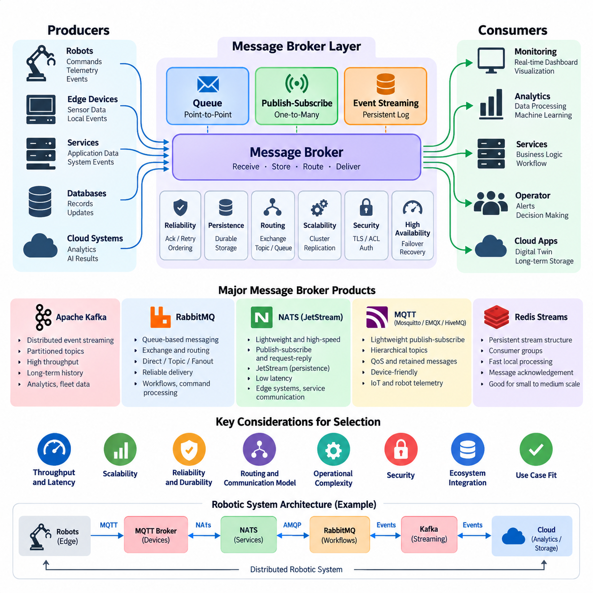
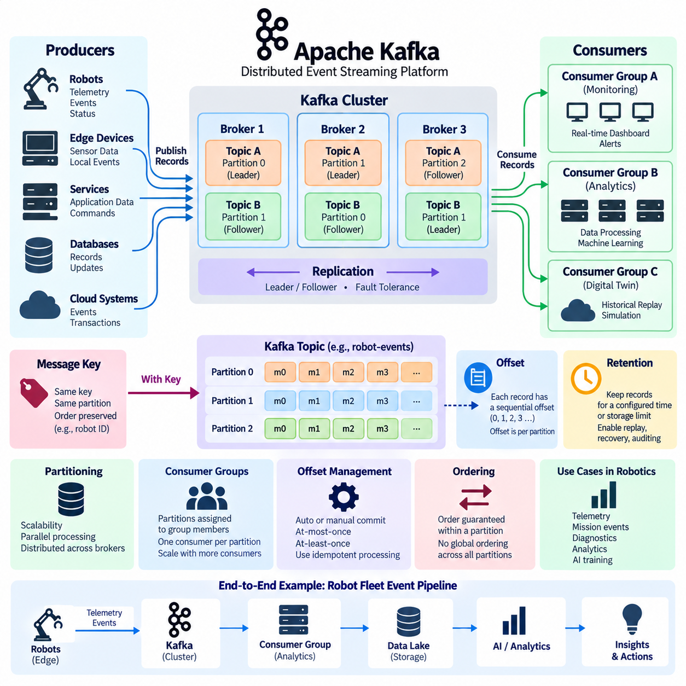
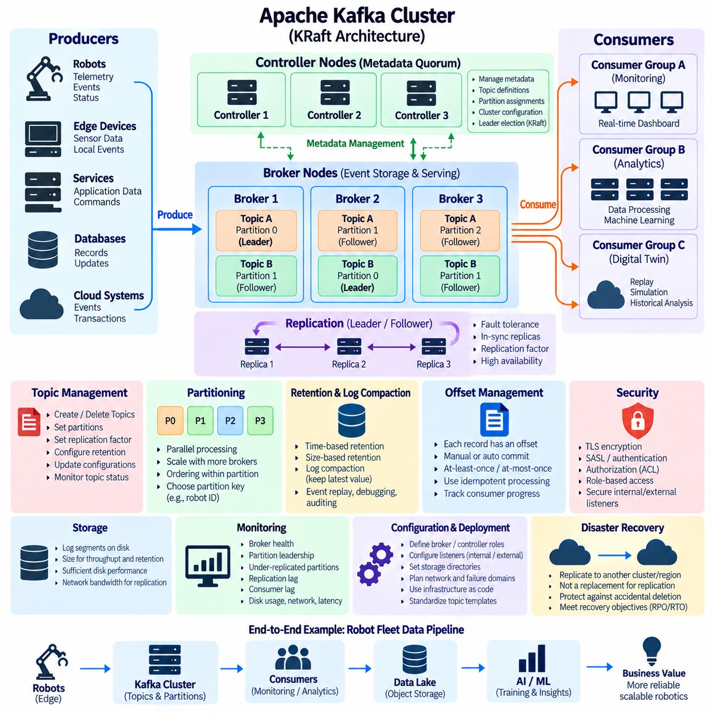
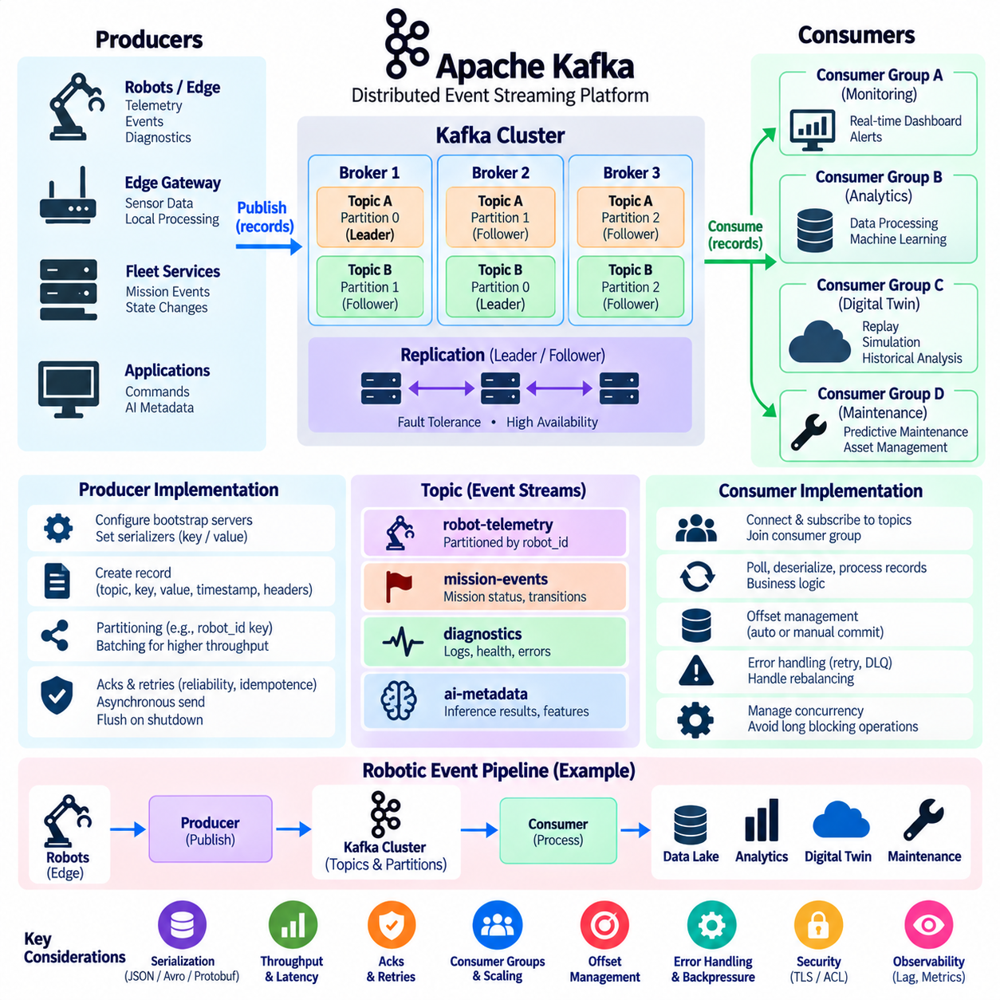
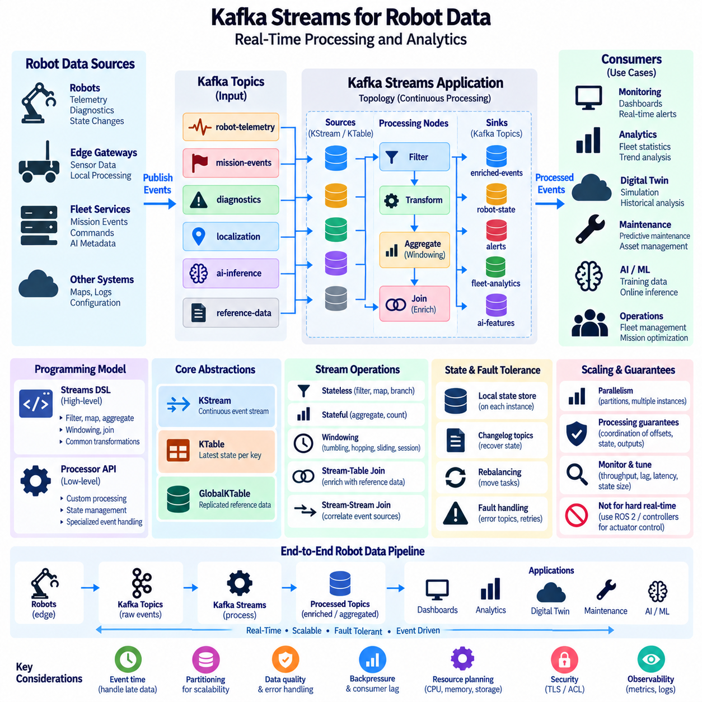
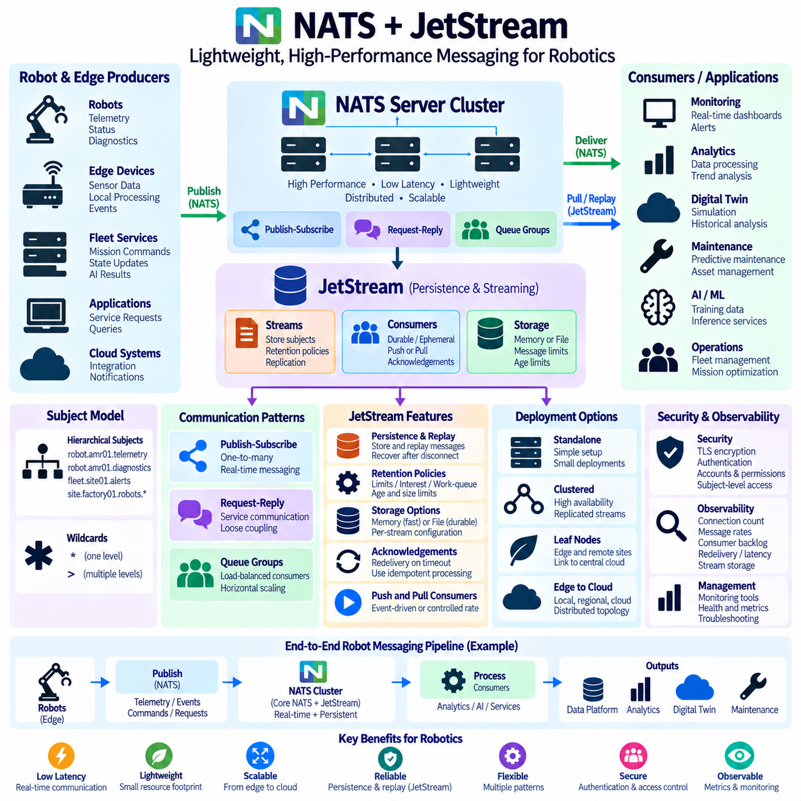
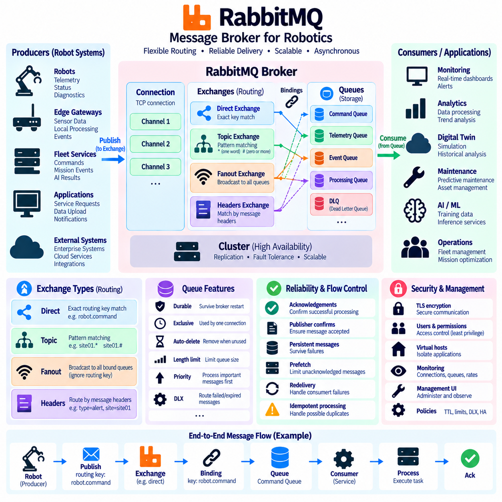
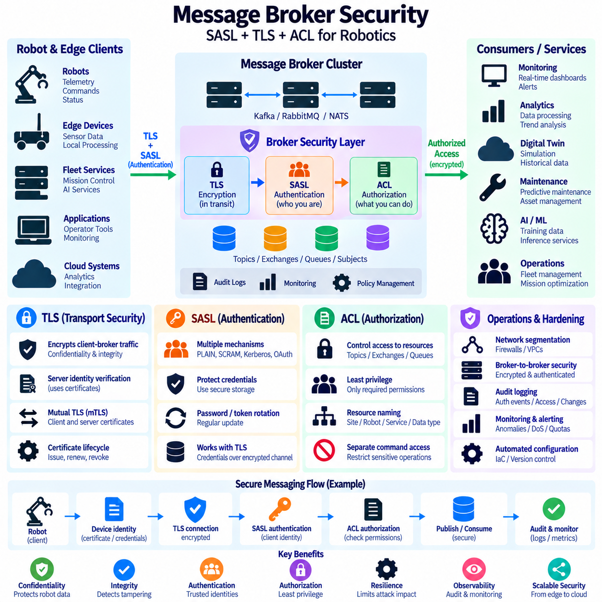
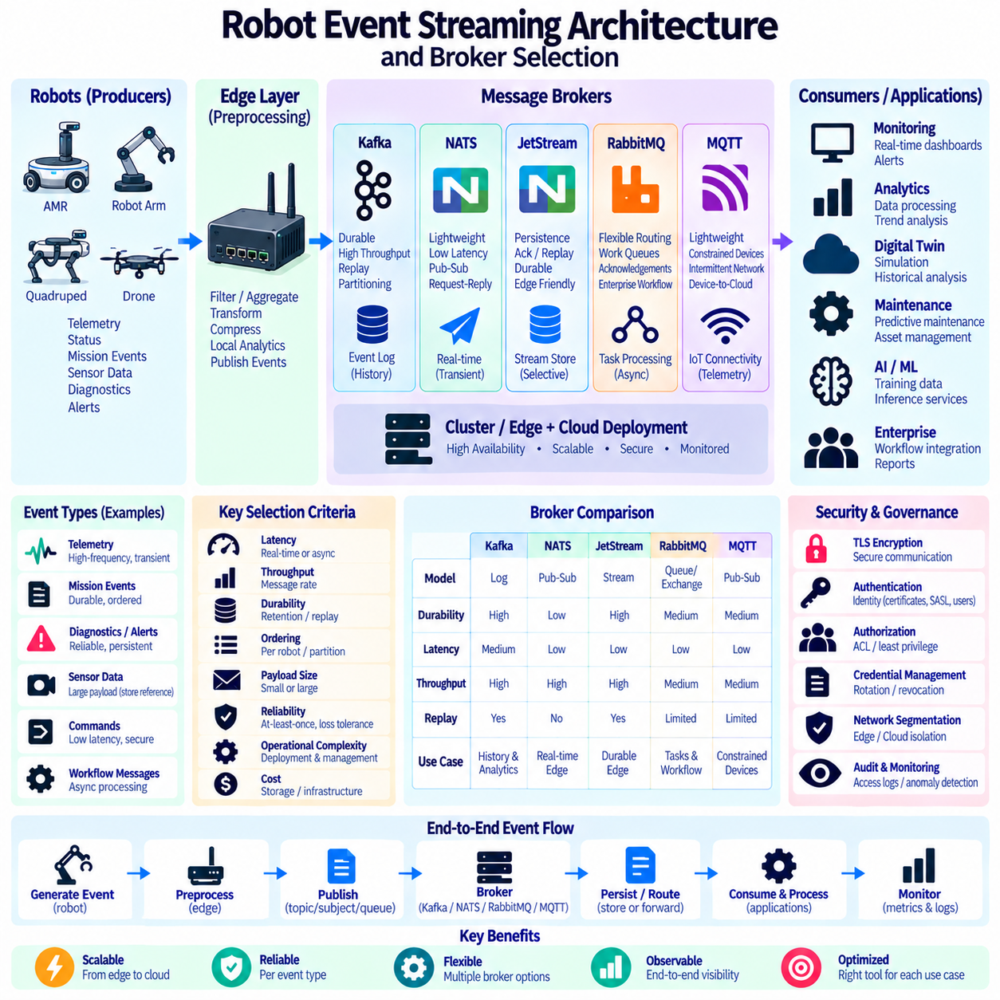
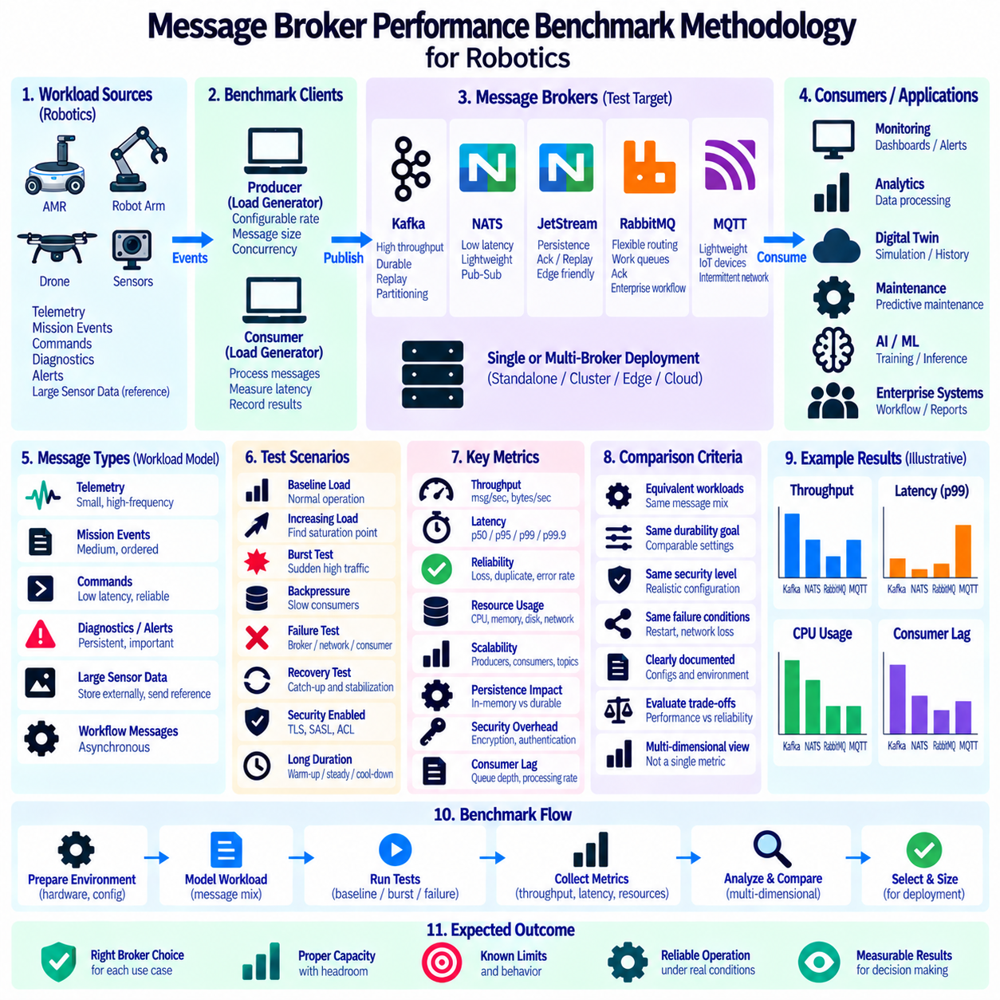

**Volume 06 Robot Communication and APIs**

# 05. Message Brokers

## 05.01 Message Broker Concepts and Major Product Comparison

{width="7.268055555555556in" height="7.268055555555556in"}

A message broker is middleware that receives messages from producers, manages their delivery, and forwards them to one or more consumers. Instead of requiring every robot, service, database, and application to communicate directly, the broker creates an intermediary communication layer. This reduces point-to-point dependencies and allows distributed robotic systems to evolve without tightly coupling every component.

The fundamental broker model separates message production from message consumption. A producer publishes commands, telemetry, events, alarms, or application data without needing detailed knowledge of the receiving application. Consumers independently subscribe to or retrieve the information they require. This temporal and structural decoupling is especially useful when robots, edge computers, fleet servers, and cloud services operate at different processing rates.

Message brokers commonly implement queue-based messaging, publish-subscribe messaging, or persistent event streaming. A queue normally distributes messages among competing consumers, while publish-subscribe systems deliver information to multiple interested subscribers. Event-streaming platforms retain ordered records so consumers can process or replay them independently. These patterns may coexist within a modern robotic communication architecture.

Reliability depends on how a broker handles acknowledgement, persistence, retry, ordering, duplication, and failure recovery. Some applications prioritize extremely low latency and accept limited durability, while others require messages to survive process or server failures. Robot telemetry may tolerate occasional loss, whereas mission transitions, safety-related events, maintenance records, and operational transactions often require stronger delivery guarantees and durable storage.

Apache Kafka is designed primarily as a distributed event-streaming platform rather than a traditional transient message queue. Messages are stored as ordered records within partitioned topics, and consumers maintain offsets describing their processing position. This architecture supports high throughput, horizontal scalability, replay, and long-lived event histories, making Kafka attractive for fleet telemetry, analytics pipelines, digital twins, and large-scale robot data platforms.

RabbitMQ follows a messaging-oriented architecture centered on queues, exchanges, bindings, acknowledgements, and routing rules. Producers can publish messages to exchanges that route them toward appropriate queues using direct, topic, fanout, or header-based mechanisms. Its flexible routing and mature delivery semantics make RabbitMQ suitable for enterprise workflows, job distribution, command processing, backend integration, and applications requiring explicit queue behavior.

NATS emphasizes lightweight operation, simple communication semantics, and very low messaging overhead. Core NATS provides high-performance publish-subscribe and request-reply communication, while JetStream adds persistence, message replay, acknowledgements, consumer state, and stream management. This combination is useful for edge systems and distributed robotics where fast service communication is required but selected data must also be stored reliably.

MQTT brokers such as Eclipse Mosquitto, EMQX, and HiveMQ focus on lightweight publish-subscribe communication using hierarchical topics. MQTT provides QoS levels, retained messages, persistent sessions, and mechanisms appropriate for intermittently connected devices. In robotics, MQTT is particularly effective for telemetry, device state, fleet monitoring, IoT integration, and communication across constrained or unreliable wireless networks.

Redis Streams provides another approach by extending an in-memory data platform with persistent stream structures, consumer groups, message identifiers, and acknowledgement mechanisms. It can be effective when applications already depend heavily on Redis and require fast local event processing. However, architectural decisions should distinguish Redis Streams from dedicated large-scale streaming systems because their operational models, persistence strategies, and scaling characteristics differ.

The products therefore address overlapping but different design priorities. Kafka emphasizes durable distributed event logs and large-scale streaming, RabbitMQ emphasizes queues and sophisticated message routing, NATS emphasizes lightweight high-speed messaging with optional persistence through JetStream, and MQTT brokers emphasize efficient device-oriented publish-subscribe communication. Selecting among them should begin with communication semantics rather than product popularity.

Throughput and latency must also be interpreted according to workload characteristics. Kafka can achieve very high aggregate throughput by batching records and distributing partitions across brokers, but its architecture is not intended to replace every low-latency control channel. NATS can provide efficient messaging for small, frequent messages, while RabbitMQ offers rich routing at additional processing cost. MQTT minimizes protocol overhead for device and telemetry communication.

Scalability involves more than increasing message rate. Engineers must consider partitioning, clustering, replication, consumer scaling, connection counts, message size, retention periods, network bandwidth, and failure domains. A broker supporting millions of small telemetry messages may behave differently when carrying large sensor payloads. Cameras, LiDAR point clouds, and large AI artifacts are therefore often stored externally while brokers transport metadata, references, and events.

Robotic systems also require careful separation between messaging and deterministic control. A message broker is well suited to mission events, telemetry, fleet coordination, diagnostics, cloud synchronization, and asynchronous workflows, but it should not automatically become the transport for hard real-time motor or safety loops. Such loops usually require deterministic buses, real-time middleware, shared-memory mechanisms, or other communication paths with bounded timing behavior.

Security becomes critical because a broker can connect many robots and services through a common infrastructure. Production systems should therefore consider TLS encryption, mutual authentication, credentials, access-control lists, topic or queue authorization, network segmentation, audit logging, and credential rotation. Broker permissions should follow least-privilege principles so that telemetry publishers cannot automatically obtain authority to publish commands or modify operational streams.

High availability introduces additional architectural decisions. Broker clusters may replicate data and distribute clients across multiple nodes, but replication alone does not guarantee continuous service. Applications must define reconnection behavior, retry policies, duplicate handling, idempotent processing, backpressure, and degraded-operation strategies. Edge robots should also define what happens when the central broker or network becomes temporarily unavailable.

Backpressure is particularly important in physical systems because data generation can exceed downstream processing capacity. A fleet of robots may continuously produce localization, battery, perception, diagnostic, and mission events even when analytics services are overloaded. Brokers can buffer or retain data, but retention is finite. Systems therefore need explicit policies for prioritization, sampling, expiration, aggregation, and controlled dropping of noncritical information.

A practical robot architecture may use several messaging technologies simultaneously. MQTT can connect robots and IoT devices to fleet infrastructure, NATS can support lightweight internal service communication, RabbitMQ can coordinate enterprise workflows, and Kafka can collect durable operational events for analytics and historical processing. This is not necessarily unnecessary duplication when each broker serves a clearly defined communication plane and operational requirement.

Broker selection should consequently evaluate delivery semantics, persistence, ordering, replay, routing flexibility, latency, throughput, connection scale, operational complexity, ecosystem integration, security, and failure recovery together. The correct question is not which broker is universally fastest or most powerful, but which messaging model best matches each robot communication path. A disciplined selection process creates a scalable event backbone without placing inappropriate requirements on a single technology.

## 05.02 Apache Kafka Architecture: Partitions, Offsets, Consumer Groups

{width="7.268055555555556in" height="7.268055555555556in"}

Apache Kafka is a distributed event-streaming platform designed to move, store, and process large volumes of ordered event data across scalable clusters. Unlike conventional message queues that often remove messages after successful consumption, Kafka maintains events in durable append-only logs. This model allows multiple applications to consume the same data independently and enables historical events to be replayed when processing must be repeated.

Kafka organizes event records into named logical streams called topics. A topic may represent robot telemetry, mission events, diagnostics, localization updates, fleet commands, or application transactions. Producers publish records to a topic without needing to know which consumers will process them. Consumers independently subscribe to topics, creating loose coupling between data-generating robot systems and downstream analytics, monitoring, storage, or control applications.

A Kafka topic is divided into one or more partitions, which are fundamental units of storage and parallelism. Each partition is an ordered, immutable sequence of records that continuously grows as producers append new events. Partitioning allows a topic to be distributed across multiple Kafka brokers, enabling storage capacity and processing workload to scale horizontally rather than being limited to a single server.

Every record written to a partition receives a sequential numerical position called an offset. The offset identifies a record\'s location within that specific partition and increases as new records are appended. Offsets are therefore local to partitions rather than globally unique across an entire topic. A consumer uses these offsets to track how far it has progressed through each partition and determine which records should be processed next.

Offsets provide Kafka with an important separation between message storage and message consumption. Reading a record does not normally delete it from the partition. Instead, Kafka retains records according to configured retention policies, while consumers maintain their own logical processing positions. Consequently, several consumers can read the same event history at different speeds without interfering with one another or changing the underlying stored log.

Kafka can retain records for a configured time period or according to storage limits, independent of whether consumers have already processed them. This behavior enables event replay, recovery, auditing, debugging, and reconstruction of downstream application state. A robot analytics service can process current telemetry while another application later starts from an earlier offset to rebuild historical statistics or reproduce the sequence surrounding a system failure.

Partitioning is also the basis of Kafka\'s parallel processing model. Different partitions of the same topic can be consumed simultaneously, allowing processing capacity to increase as additional consumers are deployed. For a large robot fleet, records can be distributed across partitions according to robot identifiers, site identifiers, mission identifiers, or other keys so that processing workloads can be divided while preserving meaningful ordering relationships.

When a producer supplies a message key, Kafka can use that key to determine the target partition. Records associated with the same key can therefore be directed consistently to the same partition under a stable partitioning scheme. For robotics, using a robot ID as the key can preserve the order of events generated by an individual robot while still distributing different robots across multiple partitions for scalable fleet-wide processing.

Ordering guarantees in Kafka are fundamentally partition-scoped. Kafka preserves the sequence of records within an individual partition, but it does not provide one universal ordering across all partitions of a topic. System designers must therefore determine which events require relative ordering and select partition keys accordingly. Excessively broad ordering requirements can reduce parallelism, while inappropriate partitioning may separate events whose sequence has operational significance.

Kafka consumers read records from partitions and normally operate as members of consumer groups. A consumer group represents a logical application whose members cooperate to process a topic. Kafka assigns partitions among the consumers in that group so that a partition is processed by only one group member at a time. This model distributes processing workload while preventing multiple members of the same application from unnecessarily processing identical partition data.

Consumer groups enable horizontal scaling of downstream services. If a topic has multiple partitions, additional consumer instances can be added to the same group and partitions can be distributed among them. However, the useful degree of parallelism is bounded by the number of partitions. If a topic has eight partitions and a group contains more than eight active consumers, some consumers cannot receive a partition assignment for that topic.

Different consumer groups can independently consume the same Kafka topic. A fleet-monitoring service, predictive-maintenance pipeline, digital-twin service, and long-term analytics platform may each use a separate consumer group while reading identical robot events. Each group maintains its own progress, allowing applications to process the same event stream independently without requiring producers to duplicate and transmit the data separately for every downstream system.

When consumers join, leave, fail, or change their subscriptions, Kafka may redistribute partition assignments among the remaining group members. This process is known as consumer-group rebalancing. Rebalancing supports dynamic scaling and failure recovery, but it can temporarily interrupt processing and therefore becomes an important operational consideration for latency-sensitive applications. Stable membership and appropriate consumer configuration help reduce unnecessary redistribution.

Consumer offset management determines when Kafka considers records successfully processed. Consumers can periodically commit their current offsets automatically, or applications can control offset commits explicitly. Committing too early can cause records to be skipped after a processing failure, while committing after processing can cause some records to be processed again if failure occurs before the updated offset is committed. Applications must therefore align offset strategy with required processing semantics.

These behaviors lead to common delivery models such as at-most-once and at-least-once processing, while stronger processing guarantees require coordinated design across producers, consumers, and downstream state. In robotic systems, duplicate processing can be particularly important when events trigger commands, mission transitions, database updates, or external actions. Consumers should therefore use idempotent operations or deduplication mechanisms whenever repeated processing could produce undesirable physical or operational effects.

Kafka brokers form a cluster that stores topic partitions and serves producer and consumer requests. Partitions can be replicated across brokers to improve fault tolerance. One replica acts as the current leader for a partition, while other replicas maintain copies according to Kafka\'s replication mechanisms. If the broker hosting a leader becomes unavailable, an eligible replica can take over, allowing the cluster to continue serving the partition after leadership changes.

Partition count, replication configuration, record size, retention, producer batching, acknowledgement settings, and consumer processing speed jointly determine Kafka system behavior. Increasing partitions can improve parallelism but also increases metadata, replication, and operational overhead. Similarly, long retention periods improve replay capability but require greater storage capacity. Kafka architecture therefore requires capacity planning based on actual event rates, failure requirements, and processing patterns.

For robot fleets, Kafka is especially effective as a durable event backbone between operational systems and data-intensive services. Robots or edge gateways can publish normalized telemetry and events, while independent consumer groups feed monitoring systems, data lakes, digital twins, AI training pipelines, and maintenance analytics. Large binary sensor payloads are often better stored in object storage, with Kafka carrying timestamps, metadata, event descriptors, and references to the stored objects.

Kafka should not be interpreted as a replacement for deterministic robot-control communication. Its partitions, offsets, consumer groups, retention, and replay capabilities are optimized for scalable event movement and processing rather than hard real-time actuator loops. A robust robotics architecture can therefore use ROS 2, real-time middleware, or field-level networks for immediate control while Kafka provides the durable asynchronous event layer connecting fleets, edge infrastructure, on-premise systems, and cloud analytics.

## 05.03 Kafka Cluster Setup and Topic Management [w/Code]

{width="7.268055555555556in" height="7.268055555555556in"}

A Kafka cluster is a group of broker processes that cooperate to store, replicate, and serve event streams. Production deployments normally use multiple brokers so topic partitions can be distributed across machines and replicated for fault tolerance. Cluster design should begin with expected event throughput, retention volume, partition count, replication requirements, network capacity, and failure scenarios rather than simply selecting a fixed number of servers.

Modern Kafka deployments use KRaft, the Kafka Raft metadata architecture, to manage cluster metadata without requiring a separate ZooKeeper ensemble. Controller nodes participate in a metadata quorum that records broker registrations, topic definitions, partition assignments, configuration changes, and leadership information. Separating metadata coordination from ordinary event processing provides a clearer operational model and enables Kafka itself to manage the cluster control plane.

Before starting a cluster, each broker requires a defined identity, network listeners, storage directories, and role configuration. Administrators must determine which nodes operate as brokers, controllers, or combined broker-controller nodes. Development environments may combine roles for simplicity, whereas production architectures generally require careful controller placement, independent failure domains, predictable storage, and explicit network configuration to avoid creating unnecessary single points of failure.

Kafka listeners determine how brokers accept connections from clients and other cluster components. Listener configuration must account for internal broker communication, controller communication, local applications, external clients, encryption, and authentication. Incorrect advertised listener settings are a common source of connectivity problems because clients initially contact one broker and then use broker addresses returned through Kafka metadata to establish subsequent connections.

Storage planning is equally important because Kafka continuously writes partition logs to disk. Each partition is represented by log segments containing event records and associated indexes. Required capacity depends on incoming data rate, retention duration, replication factor, and operational headroom. High-throughput systems also require sufficient sequential disk performance and network bandwidth so replication and consumer traffic do not compete excessively with producer writes.

After the cluster is operational, topics define the logical event streams used by applications. Topic creation normally specifies a topic name, partition count, and replication factor, together with optional topic-level configurations. A robotics platform might create separate topics for fleet telemetry, mission events, diagnostics, alarms, robot state changes, or AI inference metadata rather than mixing unrelated event classes into a single undifferentiated stream.

The number of partitions influences both scalability and ordering. More partitions allow producer traffic and consumer processing to be distributed across more brokers and consumer instances, but they also increase metadata, open files, replication work, and administrative complexity. Partition counts should therefore reflect expected throughput and consumer parallelism. They should not be increased arbitrarily simply because partitioning is Kafka\'s primary scaling mechanism.

Replication determines how many copies of each partition are maintained across brokers. A replication factor greater than one allows another replica to preserve partition data if a broker becomes unavailable. One replica acts as the partition leader and handles normal reads and writes, while follower replicas synchronize with it. Production clusters commonly distribute replicas across brokers or failure domains so a single machine failure does not eliminate all copies of important event data.

Kafka tracks replicas that are sufficiently synchronized with the leader through the in-sync replica concept. Producer acknowledgement requirements and minimum in-sync replica settings can be combined to define stronger durability behavior. Stronger settings reduce the probability of acknowledged records being lost during failures, although they can also reduce availability when too few replicas remain synchronized. Robotics platforms should select this tradeoff according to event criticality.

Topic management extends beyond initial creation. Administrators need to inspect topic configurations, partition assignments, replication state, leader distribution, retention settings, and consumer behavior throughout system operation. Topic definitions should be treated as managed infrastructure rather than temporary application details. Naming conventions and ownership policies become increasingly important as a robot fleet grows and many teams begin publishing independent event streams.

Retention policies control how long Kafka keeps event records. Time-based retention can preserve records for a specified duration, while size-based limits can restrict the amount of storage consumed by a partition. Retention should reflect the purpose of each topic. High-frequency diagnostic data may require relatively short retention, whereas mission history or operational events may need longer periods to support analytics, debugging, incident investigation, and replay.

Kafka also supports log compaction for topics representing changing state rather than purely chronological history. Compaction attempts to retain the latest value associated with each message key while older superseded values can eventually be removed. This model can be useful for robot configuration, device metadata, fleet membership, or latest known state where reconstructing the most recent value for each entity is more important than preserving every intermediate update indefinitely.

Topic configuration should account for message size as well as retention. Large camera frames, LiDAR scans, maps, and AI artifacts can create excessive broker storage, network, replication, and consumer overhead when transported directly through Kafka. A more scalable robotics architecture commonly places large binary objects in object storage or specialized data stores and publishes compact Kafka records containing identifiers, timestamps, metadata, checksums, and storage references.

Partition keys require deliberate management because they determine data distribution and ordering boundaries. A robot identifier can keep events from one robot in the same partition, preserving their relative order, while distributing different robots across the cluster. However, an uneven key distribution can create hot partitions if one robot, site, or workload generates disproportionately large traffic. Partition strategy should therefore consider both semantic ordering and load balance.

Operational monitoring should observe broker availability, partition leadership, under-replicated partitions, replication lag, disk utilization, request latency, network throughput, controller health, and consumer lag. These metrics reveal different failure modes and capacity limitations. For example, healthy brokers do not necessarily imply healthy applications if consumers are falling behind continuously or if one partition receives substantially more traffic than others.

Topic changes should be managed cautiously in production. Increasing a topic\'s partition count can improve parallelism, but it can also change key-to-partition mapping and therefore affect assumptions about record ordering. Partition counts cannot simply be reduced as an ordinary configuration operation. Major changes to partitioning, retention, or data contracts should consequently be planned together with producers, consumers, schemas, and operational migration procedures.

Security configuration belongs to cluster setup rather than being added only after deployment. Kafka can protect connections using TLS and authenticate clients through mechanisms such as SASL or certificate-based authentication. Authorization policies can restrict which applications may create topics, publish records, consume data, or perform administrative operations. Robot identities, fleet services, analytics applications, and administrators should receive only the permissions required for their roles.

Backup and disaster-recovery planning must distinguish Kafka replication from independent recovery copies. Replication protects against broker failures within the designed cluster topology, but it does not automatically protect against accidental deletion, destructive configuration changes, site-wide failures, or operational mistakes. Critical robotics deployments may therefore replicate selected event streams to another cluster, region, or long-term storage system according to recovery objectives.

Automation becomes increasingly valuable as clusters and topic counts grow. Infrastructure-as-code, configuration management, deployment pipelines, and controlled topic provisioning can make cluster configuration reproducible and auditable. Rather than allowing every application to create arbitrary topics, organizations can define templates for partition counts, replication, retention, security, naming, and ownership, reducing configuration drift across development, testing, edge, on-premise, and cloud environments.

In a robot fleet architecture, a well-managed Kafka cluster becomes a durable asynchronous data backbone rather than a simple message server. Edge gateways and fleet services publish structured events, Kafka distributes and retains them, and independent consumers support monitoring, digital twins, predictive maintenance, data lakes, and AI pipelines. Correct cluster setup and disciplined topic management ensure that this event layer remains scalable, recoverable, observable, and operationally predictable as the robotic system expands.

## 05.04 Kafka Producer / Consumer Implementation [w/Code]

{width="7.268055555555556in" height="7.268055555555556in"}

A Kafka producer is an application component that creates event records and publishes them to Kafka topics, while a consumer retrieves those records for processing. Together they form the primary application-facing data path of Kafka. In robotics, producers may run on edge gateways, fleet services, or backend applications, while consumers may implement monitoring, analytics, digital twins, maintenance, and AI data pipelines.

Producer implementation begins by defining the Kafka bootstrap servers and configuring serialization for message keys and values. Bootstrap servers provide the initial addresses used to discover the Kafka cluster rather than defining every broker permanently. The producer obtains cluster metadata after connecting and learns which brokers currently lead the partitions of the target topics, allowing records to be sent directly to appropriate partition leaders.

Before transmission, application data must be converted into a byte representation through serialization. Robot events are commonly represented using JSON, Protocol Buffers, Avro, or another structured schema format. Keys also require serialization when they are used for partition selection. A consistent serialization contract is essential because consumers must deserialize the same records correctly and interpret fields according to compatible data definitions.

A producer record typically contains a topic, optional partition, optional key, value, timestamp, and headers. Applications normally specify the topic and data while allowing Kafka\'s producer logic to select the partition. Headers can carry additional metadata such as schema versions, trace identifiers, source information, or processing context without embedding every transport-related property directly inside the application payload.

Partition selection affects both scalability and ordering. When a key is provided, records with the same key can be routed consistently to the same partition under a stable partitioning strategy. A robot fleet may therefore use robot_id as the key so events from one robot preserve their relative ordering. Records from different robots can simultaneously be distributed across other partitions, enabling parallel processing throughout the Kafka cluster.

Kafka producers improve throughput by buffering records and transmitting them in batches rather than performing an independent network operation for every event. Batch size and waiting time influence the tradeoff between throughput and latency. Larger batches can use network and broker resources more efficiently, while excessive waiting can increase event delivery delay. Robot applications should tune batching according to telemetry frequency and latency requirements.

Producer acknowledgement configuration determines how much confirmation is required before a send is considered successful. Stronger acknowledgement settings can require confirmation that records have reached the partition leader and appropriate replicas, improving durability during broker failures. This protection introduces additional coordination and potentially greater latency, so telemetry streams and critical operational events may reasonably use different reliability configurations.

Retries are necessary because temporary network failures, broker transitions, and transient cluster conditions can interrupt publishing. A robust producer should distinguish retryable failures from permanent errors and apply bounded retry and timeout policies. Idempotent producer capabilities can further reduce duplicate records caused by retries, which is important when the same event could otherwise trigger duplicate database changes, mission transitions, or downstream actions.

Asynchronous sending is generally preferred for high-throughput Kafka producers. The application submits records while the producer performs batching and network transmission in the background, and completion callbacks report success or failure. This prevents the robot application from blocking on every event. However, shutdown procedures must flush outstanding records so buffered events are not unintentionally discarded when a process terminates.

A Kafka consumer begins by connecting to bootstrap servers, subscribing to one or more topics, and normally joining a consumer group. Kafka then assigns topic partitions among active members of that group. Each consumer repeatedly polls for records, deserializes their keys and values, executes application logic, and advances its processing position. This poll-processing cycle forms the fundamental consumer implementation pattern.

Consumer groups allow multiple application instances to cooperate on the same workload. If a telemetry topic contains several partitions, several analytics consumers can join one group and process different partitions concurrently. Adding consumers can increase throughput until the available partitions are fully assigned. Additional consumers beyond the useful partition parallelism remain idle for that topic unless the partition structure or subscription changes.

Deserialization converts Kafka byte records back into application-level objects. Consumers must use formats compatible with producer serialization and should handle schema evolution carefully. When robot software is upgraded gradually across a fleet, old and new event versions may temporarily coexist. Versioned schemas and backward-compatible changes help consumers continue operating while producers are updated at different times across edge and backend environments.

Offset management determines the point from which a consumer resumes after restart or failure. Kafka records the committed processing position for consumer groups, allowing a restarted consumer to continue near the last confirmed point. Automatic offset commits simplify implementation but can separate message processing from progress recording. Manual commits provide greater control when applications need to coordinate offset advancement with successful business processing.

The timing of an offset commit affects delivery behavior. If an offset is committed before application processing completes, a crash can cause an unprocessed event to be skipped after restart. If the offset is committed only after successful processing, a crash before the commit may cause the event to be processed again. Consumers should therefore combine commit strategy with idempotent processing when repeated events cannot be safely ignored.

Consumer polling must be designed so processing does not block the group for excessive periods. Long AI inference, database transactions, file operations, or external API calls can delay polling and may cause Kafka to consider a consumer unhealthy. Heavy workloads can be separated from record retrieval through controlled worker processing, but applications must carefully manage ordering, offset commits, queue capacity, and backpressure when introducing additional concurrency.

Rebalancing occurs when consumers join or leave a group, fail, or change subscriptions. Kafka may then reassign partitions among available consumers. Applications should expect temporary ownership changes and ensure that partition-specific resources are initialized and released correctly. Frequent rebalances can reduce throughput and increase latency, making stable consumer membership and appropriate timeout configuration important for continuously operating robot services.

Error handling should separate malformed data, temporary processing failures, unavailable dependencies, and unrecoverable application errors. Repeatedly retrying a permanently invalid event can stop progress on a partition. Production pipelines therefore often use bounded retries, error topics, or dead-letter processing patterns so problematic records can be isolated for diagnosis while normal event processing continues according to defined operational policies.

Backpressure becomes important when consumers process data more slowly than producers generate it. Kafka can retain records while consumers fall behind, but consumer lag will continue increasing if processing capacity remains insufficient. Monitoring lag by topic, partition, and consumer group helps operators identify this condition. Additional consumers, more partitions, optimized processing, or reduced event volume may be required depending on the bottleneck.

Graceful lifecycle management is essential for both sides of the pipeline. Producers should stop accepting new work, flush pending records, and close network resources cleanly. Consumers should stop polling in a controlled manner, complete or safely abandon in-progress work, commit appropriate offsets, and leave the group. Predictable startup and shutdown behavior reduces duplicate processing, message loss, and unnecessary consumer-group rebalancing.

In a robotic event pipeline, producers and consumers should remain independent of hard real-time control loops. An edge gateway can publish telemetry, mission events, diagnostics, and AI metadata to Kafka while local ROS 2 or real-time control continues independently. Consumer groups can then feed monitoring, predictive maintenance, digital twins, data lakes, and AI training systems without coupling those services directly to individual robots.

A reliable Kafka producer-consumer implementation therefore combines serialization contracts, partition keys, batching, acknowledgements, retries, idempotence, consumer groups, offset management, error handling, backpressure, security, and observability. The objective is not merely to send and receive messages, but to create a predictable event-processing path that remains scalable and recoverable as robot counts, data rates, and downstream applications increase.

## 05.05 Kafka Streams: Robot Data Real-Time Processing [w/Code]

{width="7.268055555555556in" height="7.268055555555556in"}

Kafka Streams is a client-side stream-processing library for building applications that continuously transform and analyze data stored in Kafka topics. Instead of moving robot events into a separate processing platform, applications can consume, process, aggregate, join, and republish Kafka records directly. This architecture is useful for robot fleets that continuously generate telemetry, diagnostics, mission events, localization updates, and AI inference results.

A Kafka Streams application represents continuous processing as a topology composed of sources, processing nodes, and sinks. Source processors read records from Kafka topics, intermediate processors perform operations such as filtering, mapping, aggregation, or joining, and sink processors publish results to destination topics. The topology therefore describes how raw robot events become operational information while remaining inside an event-driven Kafka architecture.

Kafka Streams provides two major programming abstractions: the Streams DSL and the Processor API. The Streams DSL offers high-level operations for common transformations, filtering, grouping, aggregation, windowing, and joins. The Processor API provides lower-level control over record processing and state. Robotics applications can use the DSL for standard telemetry pipelines while adopting lower-level processing when specialized event handling or state management is required.

A KStream represents a continuously evolving sequence of independent event records. Robot telemetry naturally fits this abstraction because every battery update, position measurement, diagnostic event, or mission transition can be treated as a new event. Operations can filter irrelevant records, transform measurement units, enrich metadata, or route specific event classes into new topics without modifying the original event stream.

A KTable represents a continuously updated view of the latest state associated with each key. If robot_id is used as the key, a table can represent the most recent battery level, operating mode, mission state, or health condition for every robot. New events update the corresponding key\'s current value, making KTable useful for fleet-state views where the latest known condition is more important than every historical update.

GlobalKTable provides a replicated table abstraction in which each application instance can maintain a local copy of the complete reference dataset. This can be useful when robot events need to be enriched using relatively small reference information such as robot configuration, site definitions, device capabilities, or fleet metadata. Local availability of reference data can reduce repeated remote lookups during continuous event processing.

Stateless transformations process each event without requiring information from previous records. Filtering can remove unnecessary telemetry, mapping can convert event structures, and branching can route alarms or diagnostics toward different processing paths. Stateless operations are relatively simple to scale because processing depends primarily on the current record rather than maintaining a historical context for each robot or event key.

Stateful processing maintains information across multiple records and enables more sophisticated robot analytics. Aggregations can calculate counts, averages, minimums, maximums, or other accumulated values for each key. A fleet application might continuously calculate average battery consumption, mission completion counts, repeated fault occurrences, or utilization statistics while new events arrive from robots and edge gateways.

Windowing adds time boundaries to stateful stream operations. Tumbling, hopping, sliding, or session-oriented windows can group events occurring within defined temporal intervals. A monitoring service might calculate the number of localization failures during the last minute, average motor temperature over a short interval, or repeated obstacle detections within a moving time window to identify conditions requiring further analysis.

Event time is especially important for robotic data because the time an event physically occurred may differ from the time Kafka receives or processes it. Wireless delays, intermittent connectivity, buffering, and edge processing can cause records to arrive late or out of order. Stream-processing logic should therefore use meaningful timestamps and define how late-arriving events are handled when performing time-windowed calculations.

Stream-table joins allow dynamic robot events to be combined with relatively stable reference state. A telemetry event containing robot_id can be joined with a table containing robot model, site, payload class, or configuration information. The enriched event can then be analyzed without requiring every producer to duplicate static metadata in each message, reducing payload size and centralizing reference-data management.

Stream-stream joins can correlate two continuously changing event sources within a defined time relationship. Mission events can be correlated with robot alarms, localization changes with obstacle detections, or charging commands with battery-state updates. Such correlations allow higher-level operational events to be derived from multiple independent data sources while maintaining the asynchronous characteristics of a distributed robotic system.

Kafka Streams supports local state stores for stateful operations. Aggregations, tables, windows, and joins may maintain state on the application instance responsible for the relevant partitions. Kafka-backed changelog topics can preserve state changes so another instance can reconstruct the required state after a failure or partition reassignment. This mechanism combines local processing efficiency with distributed recovery capability.

Parallelism follows Kafka\'s partitioning model. Multiple instances of the same Kafka Streams application can run simultaneously, and Kafka partitions are distributed among processing tasks. Increasing application instances can therefore increase processing capacity until available partition parallelism is exhausted. Choosing appropriate topic partition counts remains important because partition design influences both event ordering and achievable processing scalability.

Kafka Streams applications participate in Kafka consumer-group coordination, allowing processing tasks to move when instances start, stop, or fail. Rebalancing redistributes partitions and associated processing responsibilities across available instances. Stateful applications may require state restoration after reassignment, so deployment architecture should consider local storage performance, changelog volume, restart behavior, and recovery time.

Processing guarantees are important when stream results update operational systems. Kafka Streams can coordinate input offsets, state-store updates, and output records to provide stronger processing semantics when configured appropriately. Nevertheless, external side effects such as database updates, robot commands, or third-party API calls require additional application design because transaction guarantees inside Kafka do not automatically make external physical actions exactly once.

Real-time robot analytics should distinguish operational event processing from hard real-time control. Kafka Streams can detect trends, correlate events, calculate fleet statistics, identify abnormal patterns, and generate alerts with low processing delay, but it is not intended to replace deterministic motor-control or safety loops. Immediate actuator control should remain in ROS 2, real-time middleware, embedded controllers, or field-level networks.

A practical fleet pipeline may begin with edge gateways publishing robot telemetry to Kafka. Kafka Streams can normalize records, remove invalid measurements, enrich events with fleet metadata, aggregate values over time windows, and detect threshold conditions. Processed topics can then feed dashboards, maintenance systems, digital twins, data lakes, or AI pipelines without forcing each downstream application to independently repeat the same transformations.

Backpressure and consumer lag still require monitoring even though Kafka Streams manages much of the consumer coordination internally. If processing becomes slower than incoming event generation, records accumulate in Kafka and processing delay increases. Operators should monitor task throughput, consumer lag, processing latency, state-store size, restore duration, exceptions, and broker conditions to understand whether the streaming application can sustain fleet data rates.

Scaling should be based on partition distribution, event rate, state size, processing complexity, and required latency rather than application-instance count alone. CPU-intensive transformations, large joins, long windows, or extensive state stores may require more compute and storage resources. Increasing instances provides limited benefit if the source topics contain too few partitions or if a downstream dependency remains the dominant bottleneck.

Fault handling should prevent a malformed event from unnecessarily stopping an entire robot-data pipeline. Applications need policies for serialization failures, invalid schemas, unexpected values, processing exceptions, and unavailable dependencies. Problematic records can be isolated into dedicated error topics for later diagnosis while valid events continue through the topology, provided the operational requirements permit such separation.

For Physical AI and autonomous robot fleets, Kafka Streams can serve as the real-time transformation layer between raw operational events and higher-level intelligence. It can convert distributed robot observations into normalized state, temporal aggregates, correlated events, alerts, and AI-ready data streams. Combined with Kafka topics and durable event storage, this creates a scalable processing backbone connecting edge robots with fleet management, analytics, digital twins, and learning systems.

## 05.06 NATS JetStream: Lightweight High-Performance Messaging [w/Code]

{width="7.268055555555556in" height="7.268055555555556in"}

NATS is a lightweight, high-performance messaging system designed for distributed applications that require simple communication, low latency, and efficient resource usage. It supports publish-subscribe, request-reply, and queue-based communication through a compact protocol and lightweight server architecture. In robotics, NATS can connect robot services, edge computers, fleet applications, AI components, and cloud systems without introducing a heavy messaging infrastructure.

The basic communication model of NATS is organized around subjects rather than traditional queues or complex routing exchanges. Publishers send messages to named subjects, and subscribers express interest in those subjects. A subject can represent robot telemetry, mission commands, diagnostics, localization events, or service requests. Publishers and subscribers remain logically decoupled, allowing individual components to be added, removed, restarted, or scaled independently.

NATS subjects can be organized hierarchically using dot-separated names such as robot.amr01.telemetry or fleet.site01.alerts. Subscribers can use wildcard patterns to receive groups of related subjects without explicitly subscribing to every individual stream. This hierarchical naming model is particularly useful for robot fleets because subjects can naturally represent sites, robot identifiers, subsystems, sensors, missions, and event categories.

Core NATS provides extremely lightweight publish-subscribe messaging intended for applications where speed and simplicity are primary requirements. Messages are normally delivered to currently connected subscribers without being stored as a durable historical log. If a subscriber is unavailable when a Core NATS message is published, that subscriber generally cannot retrieve the earlier message later. This behavior makes Core NATS suitable for transient real-time information.

Request-reply communication extends the publish-subscribe model by allowing one service to send a request and receive a response from another service. NATS implements this pattern efficiently using reply subjects rather than requiring a separate protocol. A fleet controller can request robot status, an edge service can request AI inference, or a diagnostic application can query another service while maintaining loose coupling between communicating components.

Queue groups provide load-balanced message distribution among multiple subscribers. Several service instances can subscribe to the same subject using a shared queue group, and NATS distributes messages among the available members rather than sending every message to every instance. This model enables horizontal scaling of stateless robot services such as event processors, command validators, telemetry transformers, and inference gateways.

JetStream extends NATS with persistence, replay, acknowledgement, retention, and durable consumer capabilities. Instead of treating every message as transient, JetStream can store selected subject traffic inside persistent streams. Consumers can then process stored messages immediately or later, recover after disconnection, and replay earlier events. This allows one NATS deployment to support both lightweight transient communication and durable event processing.

A JetStream stream defines which NATS subjects should be captured and how their messages should be retained. For example, a stream can store robot telemetry, mission events, safety alerts, or diagnostic records while ordinary service discovery traffic remains transient. Stream configuration can specify storage type, retention behavior, replication, message limits, age limits, and other policies according to operational requirements.

JetStream supports memory and file storage depending on performance and durability requirements. Memory storage provides very fast access but is primarily appropriate when persistence across process or host failures is not required at the same level. File-backed storage preserves messages on disk and is more suitable for durable operational data. Robotics architectures can select storage policies independently for different event categories.

Consumers represent applications that retrieve messages from JetStream streams. A consumer maintains delivery and acknowledgement state so processing can continue from an appropriate position after restart or disconnection. Durable consumers preserve their identity and progress across sessions, making them suitable for monitoring, analytics, maintenance, or integration services that must reliably process robot events over extended periods.

JetStream supports both push-based and pull-based consumption models. Push consumers receive messages as the server delivers them, which can simplify event-driven applications requiring immediate delivery. Pull consumers explicitly request available messages and can control processing rate more directly. Pull-based processing is useful when robot analytics or AI services need to regulate workloads according to available CPU, GPU, memory, or downstream capacity.

Acknowledgements allow consumers to indicate whether delivered messages have been processed successfully. If acknowledgement is not received according to the configured policy, JetStream can make messages available for redelivery. Applications must therefore expect possible duplicate delivery and should use idempotent processing where repeated events could cause undesirable database changes, duplicate commands, or repeated operational actions.

Retention policies determine when messages can be removed from a stream. JetStream can retain messages according to limits, interest, or work-queue-oriented semantics depending on the intended processing model. Age, message count, and storage limits can further constrain retained data. These mechanisms allow short-lived edge event buffers and more durable operational streams to be implemented within the same messaging technology.

Message replay is valuable for debugging, recovery, testing, and reconstruction of robot behavior. A service can begin consuming from newly arriving messages, from an earlier sequence position, or according to available historical data. Recorded mission events or diagnostics can therefore be reprocessed after an application update, while a digital-twin or analytics service can reconstruct selected historical operating sequences.

JetStream can replicate stream data across multiple NATS servers to improve availability and fault tolerance. A clustered deployment distributes messaging services and can preserve durable data when individual nodes become unavailable. Replication introduces additional storage and network costs, so the number of replicas should reflect the importance of the stream, expected failure conditions, and required balance between durability and operational efficiency.

NATS is particularly attractive at the edge because the server and client architecture is relatively lightweight. A small robot site or edge computer can operate messaging services without requiring the resource footprint associated with larger data-streaming platforms. NATS servers can also be connected through distributed topologies, enabling communication across local edge environments, regional infrastructure, and centralized systems.

Leaf nodes provide a mechanism for extending a NATS system into remote or edge locations while preserving local communication. Robots and local services can communicate through a nearby server, while selected traffic is exchanged with an upstream NATS infrastructure. This architecture can reduce dependence on continuous wide-area connectivity and is useful for factories, hospitals, warehouses, campuses, and outdoor robot deployments.

Subject design should follow clear naming and authorization boundaries. A fleet may organize subjects according to site, robot, subsystem, and event type, while separating command subjects from telemetry subjects. Consistent naming improves routing, observability, security, and operational management. Excessively dynamic or ambiguous subject structures can make authorization policies and fleet-wide monitoring significantly more difficult.

Security can be applied through encrypted connections, authentication, accounts, users, credentials, and subject-level permissions. Production robotics systems should restrict which components can publish commands, consume sensitive diagnostics, or access fleet-wide information. Separating robot, edge, fleet, and administrative permissions helps prevent a compromised or incorrectly configured service from obtaining unnecessary messaging authority.

Observability should include connection counts, message rates, subscription behavior, stream storage, consumer acknowledgement status, pending messages, redelivery, and processing delay. JetStream consumer backlog can indicate that downstream services are unable to keep pace with incoming robot events. Monitoring these signals allows operators to distinguish network problems, consumer bottlenecks, storage pressure, and abnormal event-generation rates.

NATS and JetStream should not replace deterministic field-level or hard real-time robot communication. They are appropriate for service communication, telemetry, commands at supervisory levels, fleet coordination, event distribution, and asynchronous processing, but motor-control and safety-critical loops generally require bounded real-time mechanisms. A layered architecture can therefore combine real-time control locally with NATS-based distributed service messaging.

For a Physical AI robot fleet, Core NATS can provide fast communication among edge services while JetStream preserves selected telemetry, mission events, diagnostics, and AI results. Consumers can feed fleet monitoring, predictive maintenance, digital twins, data platforms, and AI pipelines. This combination creates a lightweight messaging backbone that can begin at the robot edge and expand toward distributed on-premise and cloud infrastructure.

## 05.07 RabbitMQ Architecture and Exchange Types [w/Code]

{width="7.268055555555556in" height="7.268055555555556in"}

RabbitMQ is a message broker designed to receive messages from producers, route them according to defined rules, and deliver them through queues to consumers. Its architecture emphasizes flexible routing, reliable delivery, acknowledgement, and workload distribution. In robotics, RabbitMQ can connect robot gateways, fleet services, enterprise applications, monitoring systems, maintenance platforms, and asynchronous backend processes.

The RabbitMQ messaging model separates producers from consumers through exchanges and queues. Producers normally publish messages to an exchange rather than directly selecting a consumer. The exchange evaluates routing rules and determines which queue or queues should receive each message. Consumers then retrieve messages from those queues, allowing message generation, routing, buffering, and processing to evolve independently.

A connection represents a long-lived TCP communication path between an application and RabbitMQ. Applications typically create multiple lightweight channels inside one connection instead of opening a separate network connection for every operation. Channels provide logical communication sessions for publishing, consuming, acknowledgements, and administrative operations while reducing the resource overhead associated with large numbers of TCP connections.

An exchange is the routing component that receives published messages and determines their destinations. RabbitMQ supports several exchange types whose behavior is defined by routing rules. The most important built-in types are direct, topic, fanout, and headers exchanges. Selecting an exchange type determines whether messages are routed by exact keys, patterns, broadcast behavior, or message-header attributes.

A queue stores messages until they can be delivered to consumers according to the configured messaging behavior. Queues can buffer temporary differences between producer and consumer processing rates, allowing a robot event producer to continue publishing while downstream services process messages independently. Queue properties can control durability, exclusivity, expiration, size limits, priorities, and other operational characteristics.

Bindings connect exchanges to queues and define the conditions under which messages are routed between them. A binding can include a routing key or other arguments depending on the exchange type. Because exchanges, queues, and bindings are independent objects, RabbitMQ can implement complex communication topologies without requiring producers to know the addresses or identities of individual consumers.

A direct exchange routes a message to queues whose binding key exactly matches the message routing key. This provides predictable one-to-one or selective one-to-many routing. A robotics system might publish messages using keys such as robot.command, robot.diagnostics, or maintenance.request, while queues bind only to the exact categories required by their corresponding backend services.

Direct exchanges are useful when message categories are clearly defined and exact routing behavior is preferred over pattern matching. For example, separate queues can receive charging commands, mission requests, or maintenance jobs. Multiple queues may use the same binding key when several independent services require identical message categories, while competing consumers can share one queue when workload distribution is required.

A topic exchange extends routing by interpreting routing keys as dot-separated words and matching them against binding patterns. The asterisk wildcard matches one word, while the hash wildcard can match zero or more words. A fleet architecture can therefore use routing keys such as site01.amr07.telemetry or site02.amr15.alert and allow services to subscribe to meaningful groups of robot events.

Topic exchanges are particularly suitable for hierarchical robot event classification. A monitoring service could receive events from every robot at one site, while a diagnostic service could receive diagnostic events from all sites. This allows routing policies to follow site, robot, subsystem, mission, or event type without requiring a separate exchange for every combination of communication requirements.

A fanout exchange ignores routing keys and distributes every published message to all queues bound to that exchange. It therefore implements broadcast-style communication. In robotics, fanout routing can distribute common configuration notifications, fleet-wide state changes, service announcements, or operational events to several independent systems that must each receive their own copy of the same message.

Fanout exchanges should be distinguished from multiple consumers attached to one queue. When several consumers share a single queue, messages are normally distributed among those consumers as competing workers. When several queues are bound to a fanout exchange, each queue receives a copy of the published message. This distinction determines whether the architecture implements workload balancing or independent broadcast delivery.

A headers exchange routes messages using attributes stored in message headers instead of relying primarily on routing keys. Bindings can specify header values and matching rules, enabling decisions based on properties such as robot type, site, priority, mission class, or event category. Headers exchanges can be useful when routing conditions do not fit naturally into a single hierarchical routing-key structure.

Header-based routing provides flexibility but can introduce additional complexity compared with direct or topic exchanges. If robot events can be represented clearly using stable routing keys, simpler exchange types are often easier to operate and observe. Headers exchanges become more valuable when routing requires combinations of independent attributes and when those attributes already form part of the message metadata.

The default exchange is a special built-in direct exchange that provides straightforward routing to queues using queue names as routing keys. It simplifies basic messaging because applications can address a queue without explicitly creating a custom exchange. However, larger robotic systems generally benefit from deliberately designed exchanges and bindings that separate producers from specific queue names and support future topology changes.

Consumer acknowledgements allow RabbitMQ to determine whether a delivered message has been processed successfully. With manual acknowledgements, a consumer confirms completion after processing. If the consumer fails before acknowledgement, RabbitMQ can make the message available for redelivery. This mechanism improves reliability but requires applications to expect duplicates and design idempotent processing where repeated operations could have undesirable effects.

Publisher confirms provide reliability on the publishing side by allowing RabbitMQ to acknowledge that messages have been accepted by the broker according to the applicable configuration. They help producers distinguish successfully accepted messages from uncertain transmissions caused by connection failures. Robot gateways and backend services can combine publisher confirms with retry policies to reduce the risk of silently losing important operational events.

Message durability depends on several related settings rather than a single option. Durable queues and durable exchanges can survive broker restarts, while persistent message handling can improve the ability of messages to survive failures. Reliability requirements should therefore be designed across publishers, exchanges, queues, acknowledgements, storage, and cluster configuration instead of assuming that one durability flag guarantees complete protection.

RabbitMQ can distribute work among multiple consumers connected to the same queue. Prefetch configuration controls how many unacknowledged messages may be delivered to a consumer, helping prevent one worker from receiving excessive work while others remain available. This is useful for robot backend tasks such as image-processing jobs, report generation, mission validation, database operations, or asynchronous AI processing.

Dead-letter exchanges provide a controlled destination for messages that cannot remain in their original queues. Messages may be dead-lettered after rejection, expiration, queue-length conditions, or other configured situations. A robotics platform can route failed commands or malformed events to dedicated diagnostic queues where operators or recovery services inspect them without blocking normal message processing.

RabbitMQ clustering and replicated queue technologies can improve availability when individual broker nodes fail. Production design must consider node placement, storage, network reliability, queue replication, client reconnection, and failure domains. High availability does not eliminate application-level responsibilities such as retry handling, duplicate detection, acknowledgement strategy, and graceful behavior during temporary broker unavailability.

Security should be integrated into the messaging architecture through TLS, authentication, virtual hosts, users, and permissions. Virtual hosts can isolate applications or environments, while access controls determine which resources a user may configure, publish to, or consume from. Robot command paths should generally receive stricter permissions than ordinary telemetry or monitoring paths to enforce least-privilege communication.

RabbitMQ observability should cover connections, channels, exchanges, queues, message rates, acknowledgements, unacknowledged messages, consumer counts, queue depth, memory, disk usage, and node health. Growing queue depth may indicate that consumers cannot keep pace with producers, while repeated redelivery can reveal processing failures. Monitoring these signals is essential for maintaining predictable robot backend services.

In a Physical AI robot architecture, RabbitMQ is particularly useful for command workflows, task distribution, enterprise integration, and asynchronous service coordination where flexible routing is important. Direct exchanges can route explicit commands, topic exchanges can classify fleet events, fanout exchanges can broadcast shared notifications, and headers exchanges can implement attribute-based routing, creating a flexible messaging layer between robots and backend services.

## 05.08 Message Broker Security: SASL, TLS, ACL [w/Code]

{width="7.268055555555556in" height="7.268055555555556in"}

Message broker security must protect communication among robots, edge systems, backend services, and cloud applications without disrupting the reliability and performance expected from distributed messaging. A secure architecture normally combines transport encryption, client authentication, authorization, credential management, auditing, and network isolation. SASL, TLS, and ACL mechanisms address different parts of this security model and should be designed as complementary controls.

Transport Layer Security, or TLS, protects network communication between messaging clients and brokers. Encryption prevents an observer on the network from easily reading telemetry, commands, credentials, or operational events while they are transmitted. TLS also provides integrity protection, helping detect modification of protected traffic. For robot fleets operating across Wi-Fi, Ethernet, cellular, or external networks, encrypted broker connections should be treated as a fundamental security requirement.

TLS depends on digital certificates and trusted certificate authorities to establish server identity. A client verifies the certificate presented by the broker before establishing a protected session, reducing the risk of connecting to an unauthorized endpoint. Certificate validation should include the appropriate trust chain and broker identity. Disabling certificate verification for convenience can undermine the protection that TLS is intended to provide.

Mutual TLS, commonly called mTLS, extends certificate authentication to both sides of the connection. The broker presents its certificate to the client, while the client also presents a certificate that identifies the connecting application or device. This approach is useful for robot fleets because individual robots, gateways, or services can receive distinct identities without relying entirely on shared usernames and passwords.

Certificate lifecycle management becomes important when hundreds or thousands of robots participate in the messaging infrastructure. Certificates require secure issuance, distribution, storage, renewal, rotation, and revocation. Long-lived credentials increase exposure when a robot or edge computer is compromised. Automated certificate management can reduce operational errors while allowing compromised or retired devices to lose access without changing credentials for the entire fleet.

Simple Authentication and Security Layer, or SASL, provides a framework for authentication between clients and messaging services. SASL does not define one universal authentication algorithm; instead, it supports multiple mechanisms that can be selected according to platform requirements. Message brokers such as Kafka can combine SASL authentication with TLS so that credentials and authentication exchanges occur through an encrypted communication channel.

Username-and-password mechanisms are relatively easy to deploy but require careful protection of stored secrets. Credentials should not be embedded directly in application source code, container images, or configuration repositories. Robot applications should obtain secrets from protected configuration or secret-management systems where practical. Password rotation, account separation, and strong access policies reduce the impact of leaked or reused credentials.

SASL mechanisms can also support stronger identity systems than static passwords. Depending on the broker and deployment environment, authentication may use mechanisms based on challenge-response credentials, tokens, Kerberos, or OAuth-oriented identity flows. The appropriate mechanism depends on infrastructure, device capabilities, identity providers, and operational complexity. Authentication design should remain consistent with the broader enterprise identity architecture.

Authentication establishes who a client is, but it does not determine what that client is allowed to do. Authorization must therefore be applied after identity verification. Access Control Lists, or ACLs, define permissions for messaging resources and operations. An authenticated robot might be allowed to publish its own telemetry while being prohibited from publishing commands to other robots or reading fleet-wide administrative events.

ACL design should follow the principle of least privilege. Each robot, edge service, analytics process, and operator application should receive only the permissions required for its intended function. Broad wildcard permissions may simplify initial deployment but can significantly increase the impact of compromised credentials. Security policies should therefore distinguish telemetry publishing, command consumption, administrative operations, and access to sensitive event streams.

Resource naming is closely related to authorization. Kafka topics, RabbitMQ exchanges and queues, and NATS subjects should use consistent naming structures that allow security policies to be expressed clearly. Names can represent sites, robot identifiers, subsystems, applications, or data classifications. A predictable hierarchy makes it easier to restrict one robot to its own communication namespace while allowing authorized fleet services to operate across multiple robots.

Command channels require particularly strict authorization because unauthorized publication can influence physical robot behavior. A telemetry producer generally should not possess permission to publish motion commands, mission instructions, charging requests, or safety-related control messages. Command publishers should use dedicated identities and narrowly defined permissions. Critical commands may also require validation by an independent application layer before execution.

Broker administrative privileges should be separated from ordinary messaging privileges. Applications that publish or consume operational data rarely require permission to create users, modify security policies, delete topics, alter queues, or change broker configuration. Dedicated administrative identities reduce the possibility that compromise of a robot application becomes compromise of the entire messaging infrastructure.

Network segmentation provides another security boundary around message brokers. Robot networks, edge servers, management systems, and external cloud connections can be separated through firewalls, virtual networks, or other network controls. Only required broker ports and approved communication paths should be exposed. Authentication and ACLs remain necessary because network location alone should not be considered sufficient proof that a client is trustworthy.

Security should also protect broker-to-broker communication. Kafka clusters, RabbitMQ clusters, NATS clusters, gateways, and distributed edge deployments may exchange messages and metadata across multiple nodes. Internal traffic can contain sensitive operational information and control data. Encryption and authenticated node identities help prevent unauthorized systems from joining the messaging infrastructure or intercepting inter-node communication.

Credential storage on robots requires special attention because physical devices may operate outside tightly controlled data centers. Private keys, passwords, and tokens should be protected using operating-system permissions, secure storage, hardware-backed security where available, or dedicated secret-management mechanisms. Diagnostic logs should avoid exposing credentials, tokens, certificate private keys, or complete authentication information.

Credential rotation should be designed before deployment rather than added after credentials expire or become compromised. Systems need procedures for introducing new certificates, passwords, or tokens while maintaining service continuity. Overlapping validity periods can support controlled transitions. Emergency revocation procedures are equally important because a stolen robot, compromised gateway, or leaked credential may require immediate access termination.

Audit logging provides evidence of security-relevant broker activity. Useful records include authentication successes and failures, authorization denials, administrative changes, unusual connection attempts, and access to sensitive messaging resources. Audit events should include sufficient identity and timing information for investigation while avoiding unnecessary exposure of secrets. Centralized analysis can correlate broker activity with robot and infrastructure events.

Monitoring can identify behavior that is technically authenticated but operationally abnormal. Examples include a robot suddenly accessing unexpected topics, a service generating unusually high message rates, repeated authorization failures, or connections originating from unexpected network locations. Security monitoring should therefore combine broker metrics, audit logs, network observations, and application context instead of relying only on successful authentication.

Denial-of-service resistance is also part of broker security. A compromised or malfunctioning client can consume broker resources by creating excessive connections, publishing messages at abnormal rates, or generating oversized payloads. Connection limits, message-size limits, quotas, rate controls, queue limits, and resource monitoring can reduce the effect of such behavior and prevent one component from degrading fleet-wide messaging.

Security configuration should be automated and version controlled where appropriate. Infrastructure-as-code and configuration-management practices can define TLS settings, authentication mechanisms, ACL policies, broker listeners, and network rules consistently across development, test, and production environments. Automated validation can detect accidental anonymous access, overly broad permissions, expired certificates, or insecure protocol settings before deployment.

Different message brokers implement these concepts through different mechanisms. Kafka commonly combines TLS, SASL, and resource ACLs; RabbitMQ provides TLS, users, permissions, and virtual-host isolation; NATS supports TLS, accounts, users, credentials, and subject permissions. The syntax differs, but the architectural objective remains consistent: establish trusted identities, encrypt communication, and authorize only required messaging operations.

For Physical AI systems, broker security should be integrated from robot identity to edge infrastructure and centralized fleet services. A practical security chain is device identity, encrypted TLS communication, authenticated broker access, least-privilege authorization, protected credentials, and continuous auditing. This layered approach allows messaging platforms to support distributed robotic intelligence while limiting the ability of compromised components to affect other robots or critical services.

## 05.09 Robot Event Streaming Architecture: Broker Selection

{width="7.268055555555556in" height="7.268055555555556in"}

Robot event streaming architecture provides a continuous communication backbone for transferring operational events from robots and edge systems to fleet services, analytics platforms, storage systems, and AI pipelines. Unlike simple request-response communication, event streaming treats robot activity as an ongoing sequence of events. Telemetry, mission transitions, diagnostics, localization updates, alerts, and AI inference results can therefore be processed independently by multiple downstream applications.

A practical architecture begins by classifying robot data according to communication behavior rather than sending every message through one mechanism. High-frequency transient status, durable operational events, commands, large sensor data, and enterprise workflow messages have different requirements. Event rate, payload size, ordering, retention, replay, latency, reliability, and consumer behavior should therefore be identified before selecting a message broker.

Robot and edge systems form the producer layer of the event architecture. Individual robots can generate navigation status, battery information, sensor health, mission events, safety alerts, and perception results, while edge gateways aggregate or transform selected information. Local preprocessing can reduce unnecessary traffic by filtering repetitive events, calculating summaries, compressing data, or publishing references to externally stored large sensor objects.

The broker layer separates event producers from downstream consumers. Producers publish according to topics, subjects, routing keys, or other broker-specific addressing models without needing to know which applications will eventually process the events. Monitoring, maintenance, digital twins, AI pipelines, and data platforms can then subscribe independently, allowing new consumers to be introduced without redesigning robot-side software.

Durability requirements strongly influence broker selection. Some events are useful only while they represent the current robot state, whereas mission transitions, faults, safety events, and maintenance records may need persistent storage and later replay. A streaming architecture should explicitly determine which events may be discarded after delivery, which require temporary buffering, and which must remain available for historical processing or recovery.

Ordering is another important architectural requirement. Many robot events are meaningful only when their sequence is preserved, but global ordering across an entire fleet is rarely necessary. Partitioning events by robot identifier, mission identifier, or another stable key can preserve relevant local ordering while allowing parallel processing. The selected broker should provide an ordering model that matches the actual operational dependency of the event stream.

Kafka is well suited to durable, high-throughput event streams that require retention, replay, partition-based scalability, and multiple independent consumer groups. A fleet can retain telemetry, mission events, diagnostics, and AI metadata as an operational history while monitoring, analytics, maintenance, and machine-learning services consume the same streams independently. Kafka is therefore particularly useful as a centralized or regional event backbone.

Kafka becomes especially valuable when robot data must be reprocessed after the original event occurred. Historical streams can support algorithm updates, fleet analytics, incident investigation, digital-twin reconstruction, or AI dataset generation. Its partitioned log architecture supports large event volumes, but cluster operation, storage planning, partition management, and consumer-lag monitoring introduce more infrastructure complexity than lightweight messaging systems.

NATS is attractive when lightweight deployment, low latency, simple subject-based communication, and efficient edge operation are major requirements. Core NATS supports transient publish-subscribe, request-reply, and queue-group communication with a small operational footprint. It can therefore connect robot services and edge applications where immediate communication is more important than maintaining a long historical event log.

JetStream extends NATS when persistence, acknowledgement, replay, and durable consumption are required. This allows an architecture to use Core NATS for transient service communication while selected operational events are stored by JetStream. Leaf-node and distributed deployment patterns can also connect remote robot sites to regional or centralized infrastructure, making NATS particularly useful for edge-oriented distributed robot systems.

RabbitMQ is strong when event delivery depends on flexible routing, work queues, acknowledgements, and enterprise-style asynchronous workflows. Direct, topic, fanout, and headers exchanges allow messages to be routed according to application-specific rules. Robot commands, maintenance jobs, integration requests, report-generation tasks, and backend processing workloads can therefore be distributed to appropriate services without requiring a persistent event-log model.

RabbitMQ is often more natural for task-oriented messaging than for retaining very large historical event streams. Competing consumers can distribute work from queues, publisher confirms improve publishing reliability, and dead-letter mechanisms can isolate failed messages. These capabilities are useful when robot events initiate discrete backend actions rather than becoming a long-lived replayable record consumed repeatedly by independent analytical applications.

MQTT brokers are appropriate when constrained devices, intermittent networks, lightweight telemetry, and device-to-cloud communication dominate the architecture. Topic-based publish-subscribe, quality-of-service levels, retained messages, and persistent-session features can support distributed IoT-style robot connectivity. MQTT is frequently useful at device or gateway boundaries, although large-scale historical stream processing usually requires additional backend infrastructure.

Broker selection should not be reduced to a single throughput benchmark. Latency distribution, message rate, payload size, connection count, persistence cost, recovery behavior, ordering guarantees, consumer scalability, operational complexity, security, observability, and deployment footprint all affect suitability. The same broker can perform very differently depending on acknowledgement policy, replication, storage configuration, network conditions, and message size.

Large camera images, LiDAR point clouds, video, maps, and other sensor payloads should generally be evaluated separately from ordinary broker messages. Repeatedly transporting very large binary objects through a broker can consume network, memory, and storage resources needed for operational events. A common design stores large objects in object or file storage and publishes metadata, timestamps, robot identifiers, checksums, and object references through the event stream.

Edge and centralized brokers can be combined instead of forcing every robot to communicate directly with one remote cluster. A local broker can support low-latency robot and site communication while selected events are forwarded to regional or cloud infrastructure. This architecture can continue local operation during temporary WAN disruption and reduce external bandwidth by filtering, aggregating, or prioritizing events before upstream transmission.

A multi-broker architecture may be appropriate when communication requirements are fundamentally different. NATS can provide lightweight edge service messaging, Kafka can maintain durable fleet-wide event history, RabbitMQ can coordinate enterprise workflows, and MQTT can connect constrained devices. The advantage is functional specialization, but additional brokers increase integration, security, monitoring, schema-management, and operational complexity.

Event schemas should remain consistent regardless of broker technology. Robot identifiers, timestamps, event types, schema versions, correlation identifiers, mission context, and payload metadata should follow defined conventions. Schema evolution must allow producers and consumers to change independently without breaking the event pipeline. Protobuf, Avro, JSON, or other serialization formats can be selected according to interoperability and performance requirements.

Backpressure must be considered whenever consumers can process events more slowly than producers generate them. Durable brokers may accumulate backlog, while transient systems may drop or delay messages depending on their design and configuration. Monitoring queue depth, consumer lag, acknowledgement delay, storage growth, and message rate helps identify overload before it affects fleet services or consumes excessive infrastructure resources.

Reliability requirements should be defined per event class. A periodic battery update may tolerate loss because another update will soon replace it, while a safety alert, mission completion event, or maintenance fault may require durable delivery and acknowledgement. Applying maximum durability to every message increases cost and latency unnecessarily, whereas treating all messages as transient can cause important operational information to disappear during failures.

Security requirements also affect broker placement and selection. Robot identity, TLS encryption, authentication, least-privilege authorization, credential rotation, and audit logging should extend across edge and centralized messaging layers. Command channels require stricter controls than ordinary telemetry. Broker technologies should therefore be evaluated not only for performance but also for their ability to express and operate the required security boundaries.

Observability should provide an end-to-end view from event generation to final consumption. Operators need to understand broker health, connection status, event rates, partition or queue backlog, consumer lag, failed deliveries, redelivery, storage utilization, and processing latency. Correlation identifiers and consistent timestamps allow one robot event to be traced across gateways, brokers, processing services, and downstream applications.

Broker evaluation should use representative robot workloads rather than generic synthetic tests alone. Test scenarios should reproduce expected event rates, burst behavior, message sizes, consumer counts, retention policies, replication, network delays, and failure conditions. Measurements should include normal operation, broker restart, consumer failure, network interruption, recovery, and backlog processing so architectural decisions reflect actual fleet behavior.

For Physical AI systems, broker selection is therefore an architectural mapping problem rather than a search for one universally superior product. Transient edge communication, durable fleet event history, asynchronous business workflows, and constrained device connectivity may require different mechanisms. A well-designed robot event architecture assigns each event class to an appropriate messaging path while maintaining common schemas, security, observability, and governance across the complete fleet.

## 05.10 Message Broker Performance Benchmark Methodology

{width="7.268055555555556in" height="7.268055555555556in"}

Message broker performance benchmarking should reproduce the communication conditions expected in the target robot system rather than measure only the maximum message rate of an isolated broker. Robotics workloads combine periodic telemetry, burst events, commands, diagnostics, and asynchronous processing. A useful methodology therefore evaluates throughput, latency, reliability, resource usage, scalability, and recovery under representative operating conditions.

The benchmark environment must be documented before measurements begin. Broker version, operating system, CPU, memory, storage, network interface, virtualization, container configuration, and client hardware can significantly affect results. Broker configuration should also record replication, persistence, acknowledgement, compression, batching, queue or partition settings, and security options so that measurements can be reproduced and compared fairly.

Workload modeling begins with the actual message classes generated by robots. A test can include frequent small telemetry messages, medium-sized mission and diagnostic events, command traffic, and occasional references to large sensor objects. Message-size distributions should represent real operation instead of relying on one fixed payload size, because serialization, network transfer, storage, and memory behavior change substantially as payload size increases.

Message rate should be tested across multiple operating regions. A baseline load represents normal fleet activity, while progressively higher rates reveal the point at which latency, queue depth, or consumer lag begins to increase. Burst tests are also important because many robots can simultaneously generate events after a mission transition, network recovery, emergency condition, software restart, or synchronized operational schedule.

Throughput measures how much useful messaging work the system completes during a defined interval. It can be expressed as messages per second, bytes per second, or both. Producer throughput alone is insufficient because a broker may accept messages faster than consumers can process them. End-to-end throughput should therefore confirm that messages pass through producers, brokers, and consumers without uncontrolled backlog accumulation.

Latency should be measured as a distribution rather than represented only by an average value. Median latency describes typical behavior, while higher percentiles such as p95, p99, and p99.9 expose slow events that may affect operational responsiveness. Robot systems can be sensitive to tail latency because an occasional delayed command, alert, or mission event may matter more than a small improvement in average message delivery time.

End-to-end latency should include the complete path from producer publication to consumer reception or processing completion. Broker-only latency can still be measured for diagnosis, but it does not represent application experience. Timestamps should identify publication, broker interaction, reception, and processing stages. When measurements span multiple machines, synchronized clocks are necessary to prevent clock error from being interpreted as communication delay.

Benchmark clients can themselves become performance bottlenecks. Producer and consumer machines must have sufficient CPU, memory, network bandwidth, and concurrency to generate and process the intended load. Client-side serialization, logging, disk access, thread scheduling, or application code can limit measured throughput before the broker reaches capacity. Client resource metrics should therefore be collected together with broker metrics.

Persistence changes benchmark behavior significantly. In-memory or transient messaging should not be compared directly with durable storage without identifying the difference. Kafka replication and acknowledgement policies, JetStream file storage, RabbitMQ durable queues and persistent messages, or MQTT persistence mechanisms introduce different storage and reliability costs. Benchmark reports should associate every performance result with the corresponding durability configuration.

Acknowledgement settings create another important tradeoff between latency and delivery assurance. Waiting for stronger confirmation can increase message delivery time but reduce uncertainty during failures. Tests should evaluate the acknowledgement mode intended for production rather than selecting the fastest setting solely to improve benchmark numbers. Reliability and performance should be measured as linked properties instead of independent characteristics.

Scalability testing determines how performance changes as system size increases. Tests can vary the number of producers, consumers, robot identities, topics, subjects, queues, partitions, connections, or broker nodes. A scalable architecture should increase capacity predictably without causing disproportionate latency or coordination overhead. Scaling limits may originate from storage, networking, broker metadata, partitioning, consumers, or application design.

Consumer scalability requires separate analysis because increasing broker capacity does not guarantee faster downstream processing. Kafka consumers are influenced by partition count, RabbitMQ workers by queue and prefetch behavior, and NATS or JetStream consumers by subscription and delivery configuration. Tests should measure consumer lag, pending messages, acknowledgement delay, and processing throughput while the number of consumer instances changes.

Backpressure tests intentionally create situations where consumers process data more slowly than producers generate it. The objective is to observe how queues, logs, or streams accumulate pending data and how the system behaves as backlog grows. Measurements should include storage growth, memory use, latency, message rejection, flow control, and recovery time. This reveals whether overload remains controlled or propagates into other robot services.

Resource utilization should be recorded throughout every benchmark phase. CPU usage, memory consumption, disk throughput, disk latency, network bandwidth, connection count, thread activity, and storage growth help explain why performance changes. A broker reaching high throughput with permanently saturated resources may provide little operational safety margin for bursts, failover, maintenance activity, or future fleet expansion.

Network conditions should reflect the intended deployment topology. Local data-center tests may underestimate latency and loss experienced by robots communicating through Wi-Fi, 5G, VPNs, WAN links, or remote edge sites. Controlled experiments can introduce delay, jitter, bandwidth limits, packet loss, and temporary disconnections. Edge-to-cloud messaging should be evaluated under both normal connectivity and degraded network conditions.

Failure testing is essential because benchmark results from steady-state operation describe only part of system behavior. Broker processes can be restarted, nodes can be removed, consumers can fail, storage can become slow, or network paths can be interrupted. The benchmark should measure message loss, duplicate delivery, failover time, unavailable duration, backlog growth, and recovery behavior while the configured reliability mechanisms respond to these failures.

Recovery performance should be measured separately from failure detection. After connectivity or broker service returns, accumulated messages may create a large replay workload. The system must process this backlog while simultaneously accepting new robot events. Recovery tests should measure catch-up throughput, consumer lag reduction, resource saturation, and the time required to return to normal operating latency without destabilizing other services.

Security features should remain enabled when they will be used in production. TLS encryption, SASL authentication, ACL checks, certificate validation, and encrypted broker-to-broker traffic consume computational and network resources. Benchmarking an unsecured configuration and applying security only afterward can produce unrealistic capacity estimates. Secure and insecure tests may be compared for analysis, but production sizing should use the secured configuration.

Large sensor payloads require dedicated experiments. Camera frames, point clouds, video segments, and maps can distort ordinary messaging benchmarks because they consume substantial bandwidth and memory. Tests should compare direct broker transport with an architecture that stores large objects externally and publishes references through the broker. This helps determine payload thresholds beyond which object storage becomes more efficient.

Benchmark duration should be long enough to expose behavior that short tests can hide. Brief measurements may emphasize cache effects or temporary buffering while failing to reveal storage growth, memory pressure, garbage collection, log maintenance, consumer lag, or thermal throttling. Warm-up, steady-state, overload, recovery, and cool-down phases should be separated so that transient startup effects are not confused with sustainable performance.

Comparing Kafka, NATS, JetStream, RabbitMQ, and MQTT requires equivalent application-level requirements rather than superficially identical configuration values. Each technology has different messaging semantics and architectural strengths. Tests should normalize workload, durability objectives, consumer behavior, security, and failure expectations as closely as practical while documenting unavoidable differences instead of declaring a winner from one synthetic metric.

Performance results should be presented with both measurements and configuration context. Throughput, latency percentiles, error rates, message loss, duplicate delivery, consumer lag, resource utilization, and recovery time can be combined into a multidimensional profile. Capacity planning should then include operational headroom rather than sizing the production system exactly at the highest load achieved during laboratory testing.

For Physical AI robot fleets, the most useful benchmark is an end-to-end scenario that resembles actual deployment. Robots or realistic generators publish mixed event traffic through edge and centralized brokers while multiple services consume, store, analyze, and replay data. By testing normal load, bursts, backpressure, failures, security, and recovery together, engineers can select and size messaging infrastructure according to measurable fleet requirements rather than isolated headline performance.
