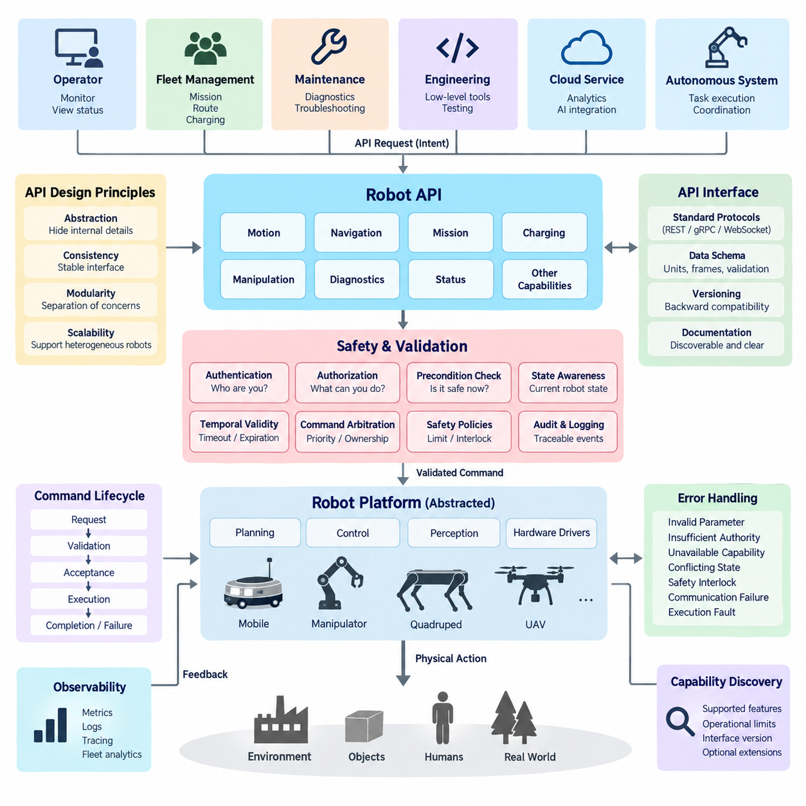
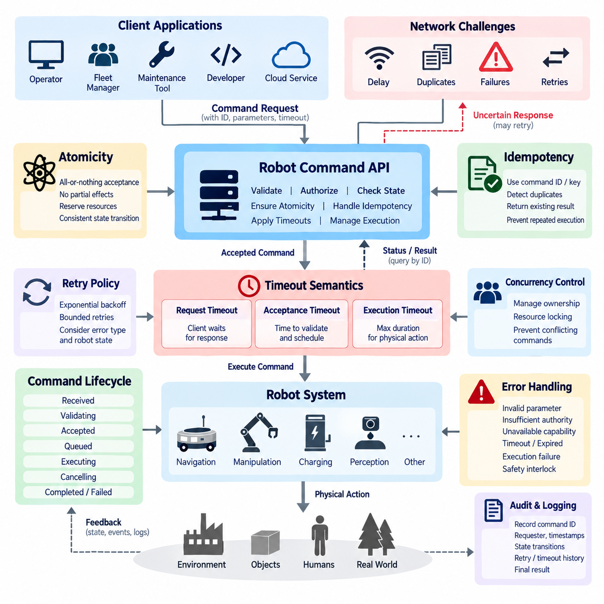
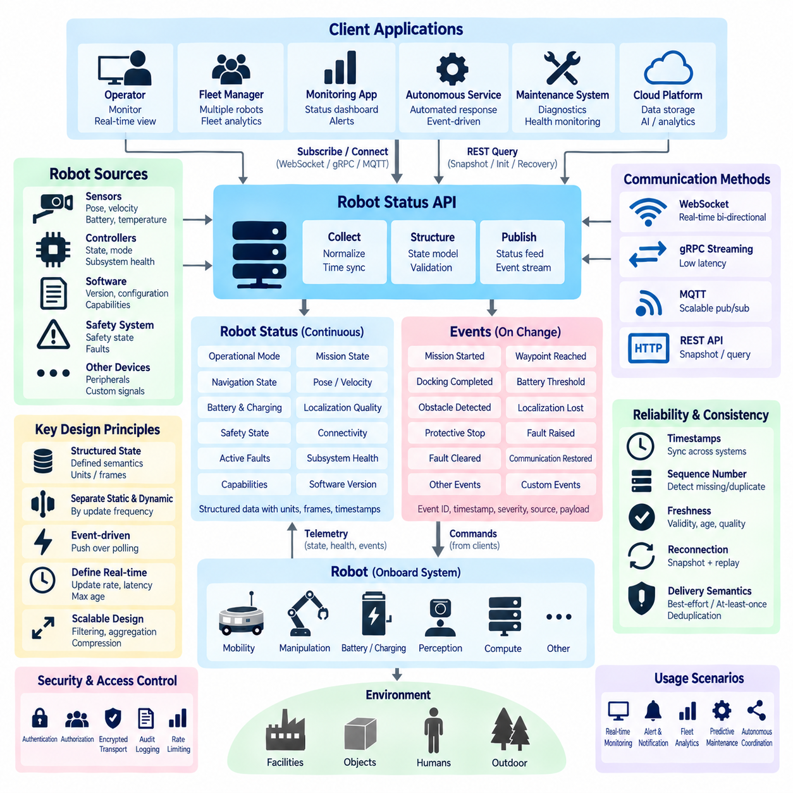
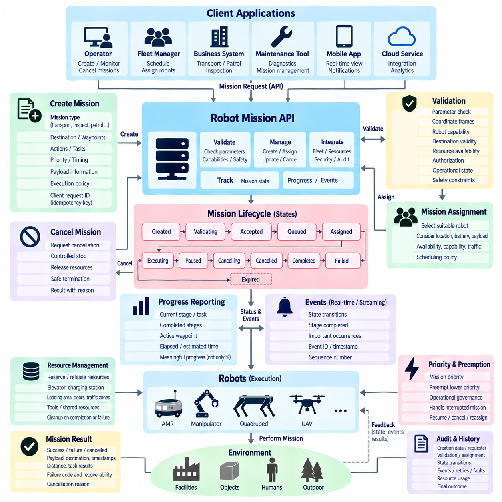
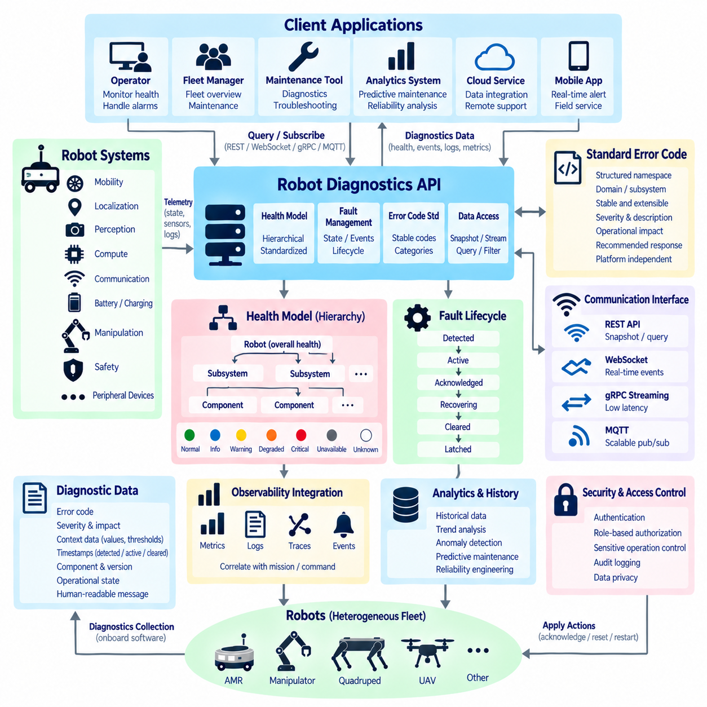
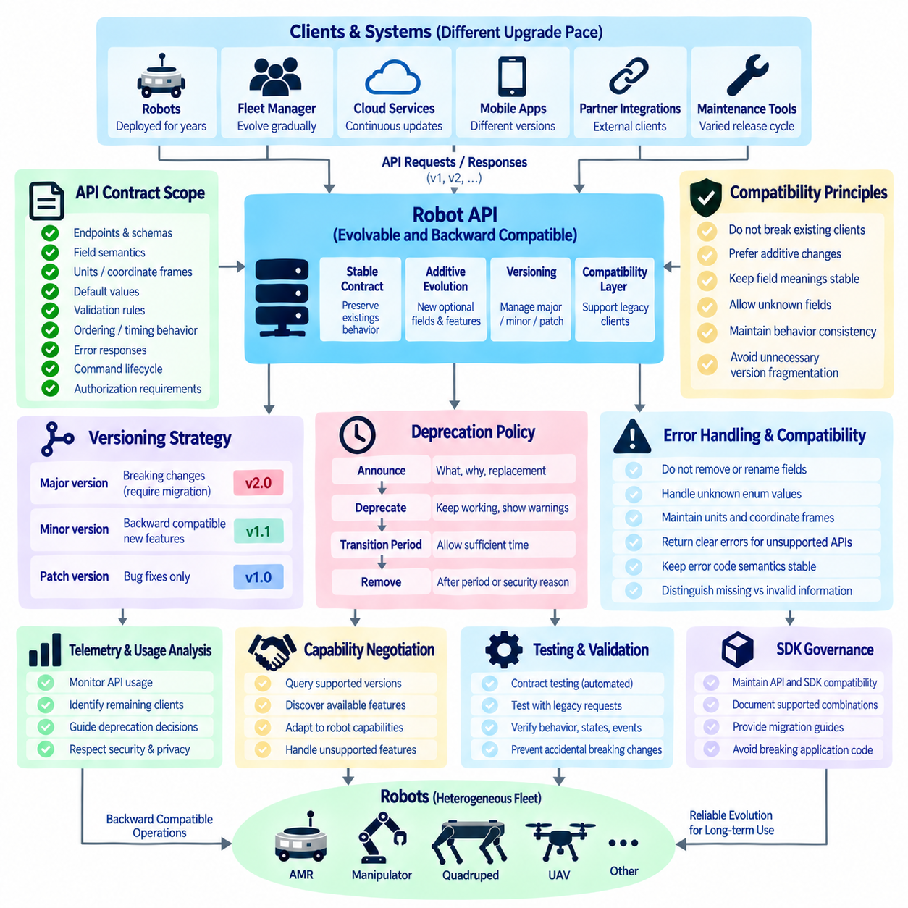
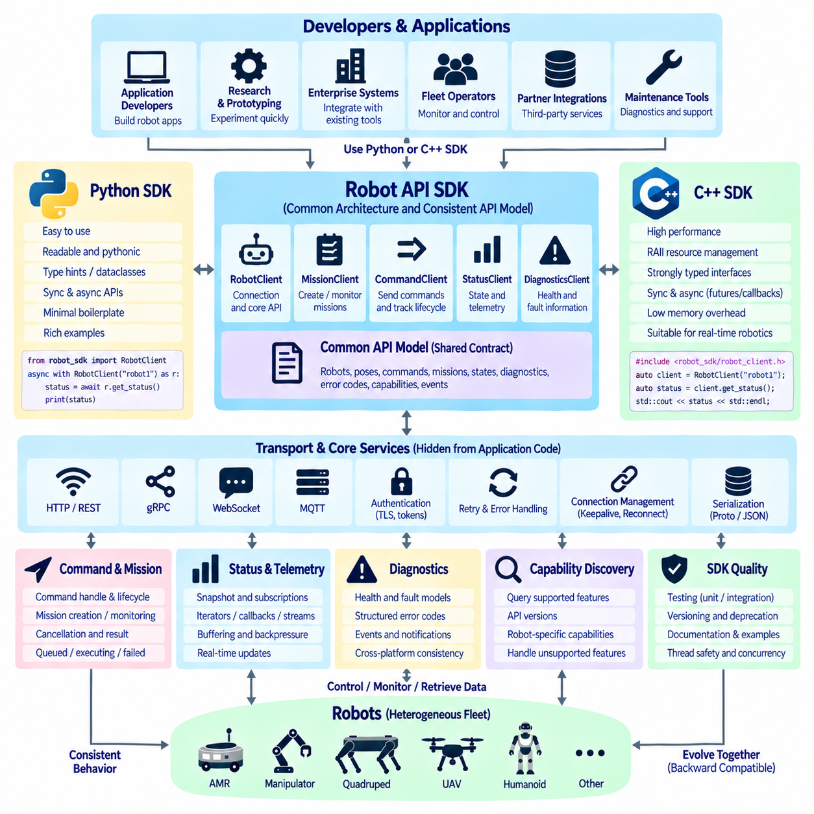
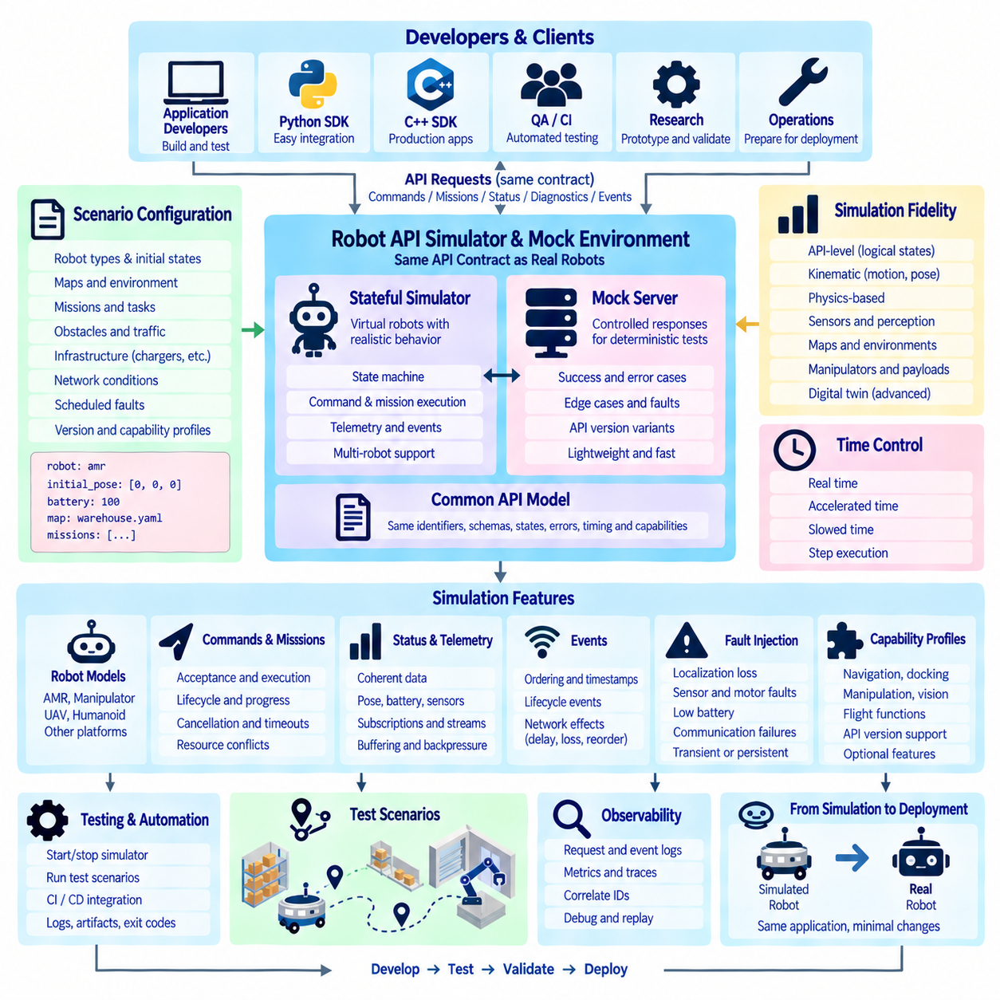
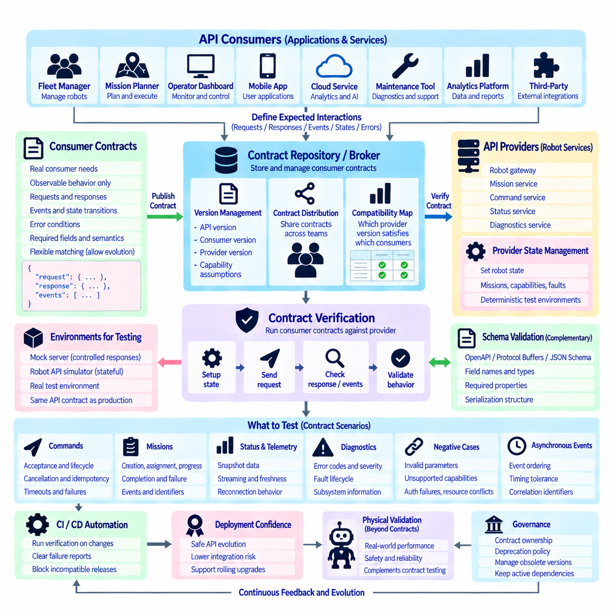
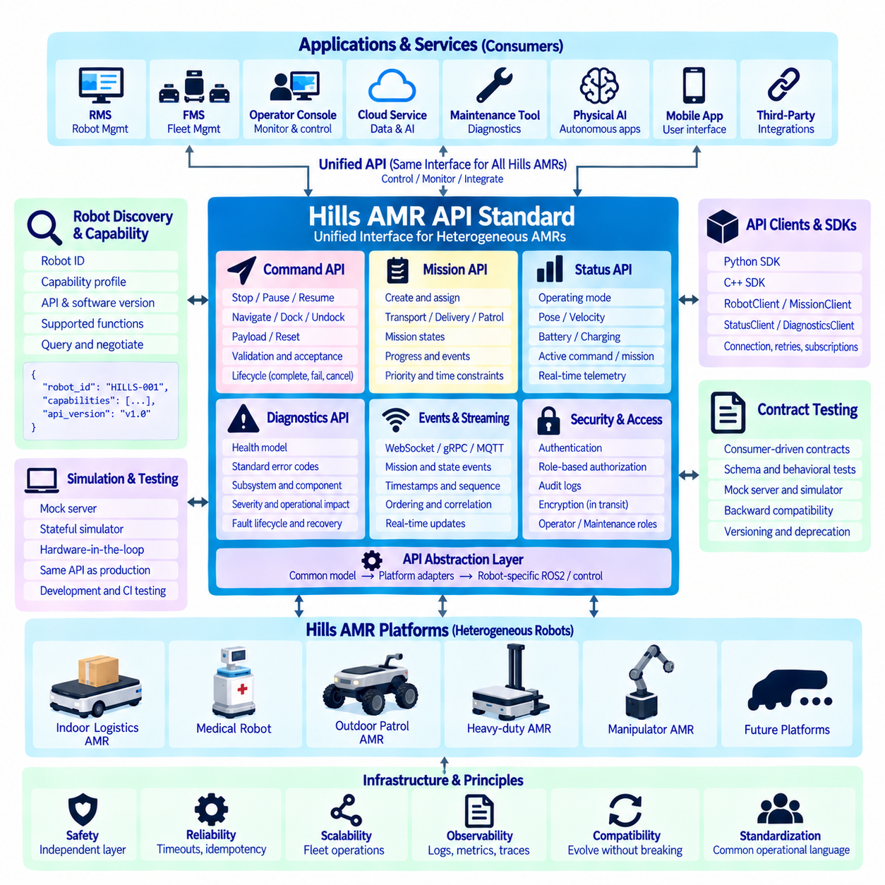

**Volume 06 Robot Communication and APIs**

# 06. Robot API Design

## 06.01 Robot API Design Principles: Abstraction / Safety

{width="7.268055555555556in" height="7.268055555555556in"}

A robot API should present robot capabilities through stable abstractions rather than expose the internal implementation of motors, sensors, controllers, middleware nodes, or hardware drivers. Applications should interact with concepts such as motion, navigation, mission execution, charging, manipulation, and diagnostics. This separation allows robot hardware and software components to evolve without forcing every external client to change.

Abstraction begins by defining the API around operational intent. A client should normally request "navigate to this destination" rather than calculate wheel velocities, actuator currents, or low-level steering commands. The robot platform remains responsible for translating high-level intent into planning and control operations. This boundary reduces coupling and creates a consistent interface across robots with different locomotion mechanisms or computing architectures.

The abstraction level must nevertheless match the authority of the client. Fleet management systems usually require mission, route, charging, and operational-state interfaces, while engineering or maintenance tools may require lower-level diagnostic functions. Direct actuator control should therefore be isolated from ordinary application APIs. Separating mission, capability, diagnostic, and engineering interfaces prevents convenience functions from accidentally becoming unrestricted control channels.

Robot APIs differ from conventional information-service APIs because commands can produce physical consequences. A malformed database query may damage data, but an inappropriate robot command can cause motion, collision, equipment damage, or human injury. Safety must therefore be treated as an architectural property of the API contract. Authentication alone is insufficient because an authenticated client may still issue commands that are invalid for the robot's current state.

Every command should be evaluated against explicit preconditions before execution. A motion request may require the robot to be operational, localized, free of critical faults, and permitted to move within the current safety state. A manipulation command may require a valid tool configuration and acceptable workspace conditions. APIs should report failed preconditions clearly instead of silently modifying requests or allowing unsafe commands to propagate toward lower control layers.

Command authority should follow the principle of least privilege. Monitoring clients may receive read-only access, fleet systems may obtain mission-level command privileges, maintenance applications may access diagnostics, and specialized engineering tools may receive restricted low-level control authority. Authorization should therefore describe what an identity may command, not merely whether that identity is allowed to connect to the robot.

State awareness is equally important because robot commands are meaningful only in context. The API should expose sufficient operational state for clients to understand whether the robot is idle, executing, paused, charging, degraded, faulted, or under emergency restrictions. Command acceptance should be tied to defined state transitions so that contradictory requests cannot arbitrarily modify physical behavior. This makes the API part of the robot's operational state machine.

Robot operations also require explicit handling of asynchronous execution. Navigation, docking, inspection, and manipulation may take seconds or minutes, so API acceptance must not be confused with physical completion. A well-designed interface distinguishes command receipt, validation, acceptance, execution, completion, cancellation, timeout, and failure. Clients can then reason about the lifecycle of an operation without repeatedly guessing from raw telemetry.

Failure semantics should be designed as carefully as successful operations. Errors should distinguish invalid parameters, failed authentication, insufficient authority, unavailable capabilities, conflicting robot states, safety interlocks, communication failures, and execution faults. Machine-readable error identifiers should remain stable even when human-readable explanations change. This enables fleet controllers and automation systems to implement deterministic recovery behavior.

Safety-critical commands require stronger treatment than ordinary requests. Emergency stop, protective stop, motion enable, safety reset, or manual override should not be modeled as casual equivalents of business-service API operations. Software APIs may request or report safety-related actions, but certified safety functions generally remain enforced by dedicated safety controllers, circuits, or safety-rated communication paths. The API must never create an architectural assumption that network software replaces those mechanisms.

Temporal validity is another important design concern. A robot command that was reasonable several seconds ago may become unsafe after localization changes, obstacles appear, connectivity is interrupted, or another controller assumes authority. Commands should therefore support appropriate expiration, timeout, cancellation, and freshness semantics. Systems must also define what happens when a client disconnects while an operation is active instead of leaving behavior dependent on implementation accidents.

Concurrency requires explicit ownership rules. A robot may simultaneously receive requests from a fleet manager, local operator interface, maintenance terminal, cloud service, or autonomous AI component. The API architecture should establish priorities, leases, command ownership, arbitration, and preemption policies. Without these rules, individually valid commands can conflict and create unpredictable motion even when every client behaves correctly.

Capability discovery helps maintain abstraction across heterogeneous robot fleets. Rather than assuming that every robot supports identical functions, clients can query supported capabilities, operational limits, interface versions, and optional features. An AMR, mobile manipulator, quadruped, or UAV can then participate in a common API ecosystem while exposing platform-specific extensions only where necessary. This supports the broader heterogeneous fleet structure represented in the software architecture.

API schemas should use explicit units, coordinate frames, reference systems, and constraints. A position without a coordinate frame or a velocity without a unit is ambiguous and potentially dangerous. Fields should clearly identify meters, radians, seconds, timestamps, map identifiers, frame identifiers, tolerances, and allowable ranges. Validation should occur at the API boundary so malformed physical parameters are rejected before reaching planners or controllers.

Observability should be incorporated into the contract rather than added only during debugging. Important commands should carry correlation identifiers and produce traceable events covering requester identity, command parameters, validation results, state transitions, execution outcome, and relevant fault information. These records support diagnostics, incident investigation, fleet analytics, and system verification while preserving a causal relationship between external requests and robot behavior.

A robust robot API ultimately acts as a controlled boundary between digital intent and physical action. Abstraction protects clients from unnecessary implementation detail, while safety rules prevent that abstraction from becoming unrestricted authority. Stable capability models, state-aware validation, explicit lifecycle semantics, authorization, temporal constraints, arbitration, and observability together create interfaces that can scale from a single robot to heterogeneous fleets without sacrificing predictable physical behavior.

## 06.02 Robot Command API: Atomicity, Idempotency, Timeout [w/Code]

{width="7.268055555555556in" height="7.268055555555556in"}

A robot command API is the boundary through which digital requests become physical actions, making command semantics more critical than in ordinary information services. Network delays, retries, duplicated messages, partial failures, and concurrent requests must never cause uncontrolled repetition of motion or manipulation. Atomicity, idempotency, and timeout semantics therefore form fundamental properties of reliable robot command execution.

Atomicity means that a command is treated as one logically consistent operation from the perspective of the requesting client. The command should either be accepted into a valid execution state or rejected without leaving unintended partial effects. For example, a docking request should not update the mission state to "docking" while failing to establish the control resources required to perform the maneuver. Internal implementation may involve many steps, but the external contract must expose consistent transitions.

Physical actions complicate traditional transaction concepts because robot motion cannot always be rolled back. A database transaction can restore previous data, whereas a robot that has moved two meters cannot simply erase that physical history. Robot API atomicity should therefore focus on command acceptance, resource reservation, state transition, and execution ownership rather than assuming perfect physical rollback. Compensation or safe recovery actions are often more realistic than conventional transactional reversal.

Command validation should occur before execution authority is committed. Parameters, coordinate frames, operational state, safety conditions, required capabilities, resource availability, and authorization should be checked as one acceptance process. If any mandatory condition fails, the command should be rejected before irreversible physical activity begins whenever possible. This approach creates a clear boundary between a request that merely arrived and a command that the robot has formally accepted.

Idempotency addresses another common distributed-system problem: clients cannot always determine whether a request was received. A network connection may fail after the robot accepts a command but before the acknowledgment reaches the client. If the client retries the same request and the API interprets it as a new command, the robot could execute the action twice. For physical systems, duplicate execution can be significantly more dangerous than duplicate data processing.

An idempotent command interface allows repeated submission of the same logical request without creating multiple independent executions. Clients can provide an idempotency key, command identifier, or request identifier that uniquely represents the intended operation. The robot service records this identity and associates it with the command lifecycle. When the same identifier appears again, the service returns the existing command state or result instead of automatically initiating another physical action.

Idempotency does not mean that every robot operation naturally produces the same physical result when repeated. Commands such as "move forward one meter" are inherently different from state-oriented requests such as "navigate to pose X." Repeating the former can move the robot additional distance, while repeating the latter may refer to the same desired goal. API designers should therefore distinguish naturally idempotent operations from commands that require explicit duplicate suppression.

Command identifiers should remain valid for a defined retention period. If duplicate-detection records disappear too quickly, a delayed retry may accidentally become a new operation. If they remain indefinitely, storage and identifier management become unnecessarily complex. The retention policy should reflect expected network disruption, client retry behavior, mission duration, and operational risk. The API contract should also specify whether identifiers may ever be reused.

Timeout semantics define how long different phases of a command remain valid. A request timeout may limit how long the client waits for an API response, while an acceptance timeout may limit how long the server can validate and schedule the command. An execution timeout defines the permitted duration of the physical operation. These concepts should not be represented by one ambiguous timeout value because each governs a different part of the command lifecycle.

A client-side timeout must not automatically imply that the robot stopped executing the command. The client may stop waiting while the server continues navigation, docking, or manipulation. This distinction is essential because blindly retrying after a communication timeout can create conflicting operations. After an uncertain response, the client should query the command by its stable identifier to determine whether it was rejected, accepted, executing, completed, cancelled, or failed.

Execution timeout behavior must also be explicit. When a navigation command exceeds its allowed duration, the system must define whether the robot cancels the operation, transitions to a safe stop, enters a recoverable failure state, or continues under another supervisory policy. Timeout handling should cooperate with the motion controller, mission manager, safety system, and resource manager rather than simply terminate an API handler while physical execution continues invisibly.

Cancellation is closely related to timeout but should remain a distinct operation. A cancellation request asks the system to terminate an existing command, yet physical cancellation may require controlled deceleration, manipulator stabilization, resource release, or transition to a safe state. The API should therefore distinguish "cancellation requested" from "cancelled." This prevents external applications from assuming that physical activity ceased immediately when the cancellation message was received.

Concurrency introduces additional atomicity requirements when multiple clients issue commands simultaneously. Two valid commands may compete for the same mobility subsystem, manipulator, charging interface, or mission resource. Command acceptance should therefore coordinate ownership and locking at an appropriate abstraction level. The API must prevent situations where independent requests are individually accepted but cannot safely coexist during execution.

Retries should follow explicit policies rather than unrestricted repetition. Temporary communication failures may justify exponential backoff and bounded retries, but execution failures often require state evaluation before another attempt. A robot that failed to dock because the station is occupied should not necessarily repeat the maneuver immediately. Retry policy should consider error classification, command identity, robot state, safety conditions, and whether the original execution produced partial physical effects.

Command status models provide the information required to combine atomicity, idempotency, and timeout behavior. A practical lifecycle may distinguish received, validating, accepted, queued, executing, cancelling, completed, failed, rejected, expired, and cancelled states. Not every implementation requires identical names, but transitions should be deterministic and externally understandable. Terminal states should remain queryable long enough for clients to resolve uncertain communication outcomes.

Reliable command APIs also require persistent auditability. Each command should retain its identifier, requester identity, timestamps, parameters, validation outcome, state transitions, retry relationships, timeout events, cancellation history, and final result. These records make it possible to reconstruct whether an unexpected physical action originated from a new request, duplicate delivery, delayed network message, recovery procedure, or internal execution failure.

In a fleet environment, these principles become even more important because commands may pass through fleet managers, gateways, message brokers, edge computers, and robot-local services. End-to-end command identity should survive these boundaries whenever practical. Transport-level message delivery guarantees alone cannot establish physical exactly-once execution. The application layer must combine unique command identity, duplicate detection, state management, and controlled execution ownership.

A robust robot command API therefore treats atomicity, idempotency, and timeout as interconnected safety and reliability mechanisms. Atomicity protects command-state consistency, idempotency prevents accidental duplicate execution, and timeout semantics constrain temporal validity without confusing communication failure with physical termination. Combined with explicit cancellation, concurrency control, persistent command status, and audit logging, these mechanisms create predictable behavior even when networks and distributed components fail.

## 06.03 Robot Status API: Real-Time Feed / Event Design [w/Code]

{width="7.268055555555556in" height="7.268055555555556in"}

A robot status API provides external systems with a continuously interpretable representation of the robot's operational condition. Unlike command APIs, which express requested actions, status interfaces describe what the robot is currently doing, what resources are available, and whether abnormal conditions exist. The design should support operators, fleet managers, monitoring applications, and autonomous services without exposing unnecessary internal implementation details.

Robot status should be modeled as structured state rather than an unorganized collection of sensor values. Typical information includes operational mode, mission state, navigation state, localization quality, battery condition, charging state, velocity, pose, safety state, connectivity, active faults, and subsystem health. Each field should have defined semantics, units, coordinate frames, timestamps, and validity conditions so that clients interpret identical data consistently.

A useful design separates relatively persistent state from rapidly changing telemetry. Robot identity, capability, software version, operating mode, and current mission may change infrequently, while pose, velocity, battery current, localization confidence, or sensor health can change continuously. Mixing every field into one high-frequency message wastes bandwidth and processing resources. Status information should therefore be partitioned according to update frequency, importance, and consumer requirements.

Real-time status delivery is usually better implemented through push-based communication than continuous polling. WebSocket, gRPC streaming, MQTT, or another event-oriented transport can maintain a live feed from robots or edge services to interested consumers. REST endpoints can remain useful for snapshots, initialization, recovery, and administrative queries. Combining snapshot APIs with streaming interfaces allows clients to establish a known state and then consume incremental changes efficiently.

The meaning of "real time" must be defined according to operational requirements rather than assumed to mean instantaneous communication. Fleet dashboards may tolerate updates every second, while motion supervision or safety-related monitoring may require substantially shorter intervals and deterministic local mechanisms. API designers should specify expected update periods, maximum acceptable age, latency targets, and behavior under congestion. Safety-critical control should not depend solely on ordinary cloud-oriented status feeds.

Events differ from periodic status because they represent meaningful changes or occurrences. Examples include mission started, waypoint reached, docking completed, battery threshold crossed, obstacle detected, localization lost, protective stop activated, communication restored, or fault raised. Event-driven design reduces unnecessary traffic and allows consumers to react to important transitions without repeatedly comparing successive status snapshots.

Each event should contain enough context to be independently useful. A practical event envelope can include an event identifier, event type, robot identifier, timestamp, sequence number, severity, source subsystem, related command or mission identifier, and structured payload. Stable event types and schemas allow monitoring, analytics, fleet orchestration, and incident-management systems to process events automatically without depending on fragile interpretation of human-readable messages.

Timestamps are especially important in distributed robotic systems. The time at which an event physically occurred may differ from the time it was detected, transmitted, received, or stored. Status and event APIs should clearly define timestamp provenance and use synchronized clocks where temporal correlation matters. When robots, sensors, edge computers, and fleet servers exchange information, consistent time references make it possible to reconstruct causal sequences across multiple components.

Sequence numbers complement timestamps by helping clients identify missing, duplicated, or reordered updates. Networks may reconnect, brokers may redeliver messages, and buffered data may arrive after newer information. A monotonically increasing sequence or stream-specific revision allows consumers to detect gaps and decide whether to request a fresh snapshot. This is particularly valuable when incremental status updates are used instead of repeatedly transmitting complete robot state.

Status freshness should be explicit. A field can remain syntactically valid while its underlying information has become stale because a sensor stopped updating or communication was interrupted. APIs should therefore distinguish the value itself from its freshness or validity. Timestamps, age limits, validity flags, quality indicators, and stale-state markers help clients avoid treating old localization, battery, safety, or mission information as current robot state.

Event delivery semantics must also be defined. Some consumers may tolerate best-effort delivery for visualization data, while operational events may require acknowledgment, persistence, replay, or at-least-once delivery. When duplicate delivery is possible, event identifiers enable consumers to perform deduplication. Attempting to guarantee exactly-once behavior throughout a distributed fleet can be expensive, so application-level identity and idempotent processing are often more practical.

Reconnection behavior is a fundamental part of real-time feed design. After losing connectivity, a client cannot safely assume that its previous local state remains accurate. A robust pattern is to reconnect, obtain a current status snapshot, establish the latest stream position or sequence number, and then resume event consumption. Where event replay is supported, the client may request events generated during the disconnected interval before returning to normal live processing.

Bandwidth management becomes increasingly important as fleet size grows. Hundreds of robots transmitting high-frequency complete status objects can overwhelm gateways, brokers, wireless networks, and dashboards. APIs can reduce this load through configurable update rates, field selection, subscriptions, delta updates, event filtering, aggregation, compression, and priority classes. Critical operational information should remain available even when less important telemetry is throttled.

Subscription models allow each consumer to receive only the information it needs. A fleet scheduler may subscribe to mission, availability, and battery events, while a maintenance system may require temperatures, device health, and fault transitions. A visualization client may need pose updates at a higher frequency. Topic structures, stream filters, or subscription parameters should preserve consistent semantics while preventing every consumer from receiving every available robot signal.

Fault and health reporting should distinguish current conditions from historical events. An active fault represents a condition that presently affects the robot, whereas a fault-raised event records when the condition appeared and a fault-cleared event records its resolution. This separation prevents ambiguity when clients reconnect or restart. A snapshot can reveal what is wrong now, while the event stream explains how and when the robot reached its current condition.

Status APIs should also expose hierarchical health information rather than reducing the entire robot to a single Boolean value. Overall availability may depend on localization, mobility, perception, communication, compute, battery, manipulation, or safety subsystems. A degraded robot may still perform restricted missions even though one optional capability is unavailable. Structured subsystem health allows fleet orchestration software to make capability-aware decisions instead of treating every nonideal condition as complete failure.

Security and authorization remain necessary even for read-oriented status interfaces. Robot location, mission information, camera-derived events, operational schedules, and diagnostics can reveal sensitive operational information. Clients should receive only the status fields and event streams appropriate to their roles. Authentication, authorization, encrypted transport, subscription controls, audit logging, and rate limiting should therefore be applied without unnecessarily increasing latency or disrupting continuous monitoring.

A well-designed robot status API ultimately combines snapshots, real-time feeds, and events into one coherent state-observation model. Snapshots establish authoritative current state, streaming updates maintain timely awareness, and events communicate meaningful transitions. With explicit timestamps, sequence numbers, freshness semantics, reconnection rules, scalable subscriptions, structured health information, and secure access, the interface can support reliable monitoring from a single robot to large heterogeneous fleets.

## 06.04 Robot Mission API: Create, Cancel, Progress [w/Code]

{width="7.268055555555556in" height="7.268055555555556in"}

A robot mission API provides a higher-level interface for expressing complete operational objectives rather than individual actuator or motion commands. A mission may represent transporting material, visiting inspection points, performing a patrol, docking for charging, or executing a sequence of manipulation tasks. The API should translate these objectives into controlled robot activities while preserving a clear lifecycle from creation through completion, cancellation, or failure.

Mission creation begins with a structured definition of intent. A request may contain a mission identifier, mission type, target robot or robot group, destination, waypoints, actions, priorities, timing constraints, payload information, and execution policies. The interface should describe what must be accomplished without forcing external applications to understand internal planners, controllers, ROS2 nodes, hardware drivers, or platform-specific implementation details.

Validation should occur before a newly created mission becomes executable. The system must verify required parameters, coordinate frames, robot capabilities, destination validity, resource availability, authorization, operational state, and relevant safety constraints. A syntactically correct mission may still be operationally impossible. The API should therefore distinguish malformed requests from missions that are valid in structure but cannot currently be accepted for execution.

Mission creation should return a stable mission identifier that remains associated with the operation throughout its lifecycle. This identifier allows clients to retrieve status, correlate events, request cancellation, inspect errors, and obtain the final result. Client-generated request identifiers or idempotency keys can additionally prevent duplicate mission creation when network failures cause uncertain responses and clients need to retry a submission.

A mission lifecycle should use explicit states rather than ambiguous text descriptions. Typical states may include created, validating, accepted, queued, assigned, executing, paused, cancelling, cancelled, completed, failed, and expired. The exact vocabulary may differ between implementations, but transitions should be deterministic. Clients should be able to determine whether a mission is waiting for resources, physically executing, terminating, or already in a terminal state.

Mission assignment is distinct from mission creation in fleet environments. A warehouse or hospital system may create a transport mission before a particular AMR has been selected. A fleet manager can subsequently choose a suitable robot according to location, battery level, payload capacity, availability, capability, traffic conditions, or scheduling policy. Separating mission intent from robot assignment enables flexible orchestration across heterogeneous fleets and changing operational conditions.

Complex missions are often decomposed into stages, tasks, or actions. A transport mission might contain navigation to a pickup point, payload confirmation, travel to a destination, delivery confirmation, and return or standby behavior. Each stage can maintain its own state while contributing to the overall mission state. Hierarchical representation allows clients to understand progress without exposing every low-level trajectory, controller command, or internal execution detail.

Progress reporting should communicate meaningful operational advancement rather than only a percentage value. Percentage completion can be useful when the work is naturally measurable, but many robot missions contain tasks with unequal duration and uncertain execution time. A stronger progress model can expose the current stage, completed stages, active waypoint, remaining tasks, elapsed time, estimated remaining time when available, and significant execution events.

Mission progress can be delivered through both query and streaming interfaces. REST-style requests are useful for retrieving an authoritative snapshot, while WebSocket, gRPC streaming, MQTT, or event feeds can provide continuous updates. A client may initially query the current mission representation and then subscribe to changes. This hybrid approach supports dashboards, fleet managers, workflow systems, and mobile applications without requiring aggressive polling.

Progress updates should include timestamps and sequence information so clients can identify stale, missing, duplicated, or reordered data. When communication is interrupted, the client should not assume that the mission stopped progressing. After reconnection, it can retrieve the authoritative mission state and then resume streaming from an appropriate position. Event replay may additionally recover important transitions that occurred during the disconnected period.

Mission cancellation requires more than deleting a record or changing a database flag. A robot may already be moving, carrying a payload, manipulating an object, entering an elevator, or docking when cancellation arrives. The mission API should treat cancellation as a controlled request that coordinates with planners, controllers, resource managers, and safety mechanisms to bring the current operation to an appropriate termination state.

The API should distinguish a cancellation request from completed cancellation. A mission may transition from executing to cancelling while the robot performs controlled deceleration, releases reservations, stabilizes a manipulator, clears traffic resources, or reaches a safe intermediate state. Only after these procedures are complete should the mission become cancelled. This distinction prevents clients from assuming that physical activity stopped immediately when the cancellation request was accepted.

Cancellation policies may depend on mission context. Some actions can stop immediately, while others require completion of an atomic or safety-critical section before termination. A robot inside an elevator, carrying an unstable object, or performing a docking maneuver may need specialized behavior. The API should expose whether cancellation is accepted, deferred, rejected, or already completed and provide a machine-readable reason when immediate termination is not possible.

Mission failure should remain distinct from cancellation. Cancellation normally originates from an intentional external or supervisory decision, whereas failure indicates that execution could not satisfy the mission objective. Localization loss, blocked routes, depleted battery, payload problems, subsystem faults, unavailable infrastructure, or exceeded execution limits may cause failure. Preserving this distinction allows fleet systems to apply appropriate recovery, reassignment, escalation, or retry policies.

Recovery behavior should be represented explicitly rather than hidden inside an indefinitely executing mission. Temporary obstacles may trigger replanning, communication loss may trigger waiting, and a docking failure may permit a bounded retry. The mission API can report recovery states or recovery events while retaining the original mission identity. Clients can then distinguish productive recovery from a mission that has stopped making meaningful progress.

Resource management is closely connected to mission execution. Missions may reserve elevators, charging stations, loading areas, doors, traffic zones, tools, or shared manipulation resources. Reservations should be associated with mission identity and released reliably after completion, cancellation, expiration, or failure. Otherwise, abandoned resources can block later missions even though the robot that originally reserved them is no longer using them.

Priority and preemption policies become important when multiple missions compete for robots and infrastructure. An urgent inspection, safety response, or charging requirement may need to interrupt lower-priority work. The API should represent priority without allowing arbitrary clients to override operational governance. If preemption occurs, the affected mission should transition through defined states so its later continuation, cancellation, or reassignment remains understandable.

Mission results should contain more than a final success Boolean. A completed transport mission may report delivered payload information, destination, completion timestamp, distance traveled, or relevant task results. Failed missions should provide structured failure codes, the stage where execution stopped, and recoverability information. Cancelled missions should record who or what requested cancellation and the final termination condition when operationally appropriate.

Auditability is essential because missions can produce long sequences of physical actions. The system should preserve mission creation data, requester identity, validation outcome, robot assignment, state transitions, commands or tasks generated, progress events, retries, cancellation requests, faults, resource usage, and final outcome. Correlation identifiers allow information from fleet services, robot software, message brokers, and monitoring systems to be reconstructed as one operational history.

A robust robot mission API therefore treats create, cancel, and progress functions as parts of one persistent mission lifecycle rather than independent endpoints. Creation establishes validated operational intent, progress reporting exposes meaningful execution state, and cancellation provides controlled termination of physical activity. Stable identities, deterministic states, structured events, resource coordination, recovery semantics, and audit records enable reliable mission orchestration from individual robots to large heterogeneous fleets.

## 06.05 Robot Diagnostics API: Health / Error Code Standard [w/Code]

{width="7.268055555555556in" height="7.268055555555556in"}

A robot diagnostics API provides a standardized interface for observing robot health, identifying faults, and supporting maintenance decisions without exposing every internal implementation detail. Unlike a general status API, diagnostics focuses on whether components and subsystems are operating correctly, why degradation has occurred, and what technical evidence is available. A consistent diagnostic model becomes especially important when many robot types share one fleet platform.

Robot health should be represented hierarchically rather than reduced to a single healthy or unhealthy flag. Overall robot health may depend on mobility, localization, perception, compute, communication, battery, charging, manipulation, safety, and peripheral subsystems. Each subsystem can contain individual components with their own condition. This hierarchy allows applications to identify where degradation originates and whether the robot can continue limited operation.

Health states should use clearly defined semantics that remain stable across software versions and robot platforms. A practical model may distinguish normal, informational, warning, degraded, critical, unavailable, and unknown conditions. These states should indicate operational impact rather than merely mirror internal log severity. For example, a failed optional camera may produce degraded perception capability without making the entire mobile robot unavailable.

Diagnostics should separate health state from fault events. Health describes the current condition of a component or subsystem, while a fault event records a particular abnormal occurrence and its lifecycle. A motor controller can remain degraded while multiple diagnostic events are generated during troubleshooting. Separating these concepts enables monitoring applications to answer both "What is wrong now?" and "What happened previously?" without confusing persistent conditions with historical events.

Standardized error codes are fundamental to machine-readable diagnostics. Human-readable messages are useful for technicians but are unreliable identifiers because wording may change with language, software version, or implementation. Each fault should therefore have a stable error code associated with a defined category, source, severity, description, operational impact, and recommended response. External systems can then automate filtering, escalation, recovery, and maintenance workflows.

An error-code namespace should prevent collisions as the robot platform grows. Codes can be organized according to domain and subsystem, such as mobility, navigation, localization, perception, compute, communication, power, charging, manipulation, safety, and infrastructure. Additional fields can identify the originating component and detailed failure type. The coding structure should remain extensible so new hardware and software modules can be introduced without redefining existing meanings.

Error codes should not directly encode every implementation-specific detail into one permanent numeric value. Excessively rigid schemes become difficult to maintain as hardware generations and software architectures evolve. A stronger diagnostic contract combines a stable high-level fault identifier with structured metadata describing component, instance, firmware version, measured values, thresholds, and vendor-specific details. This preserves interoperability while retaining sufficient engineering information.

Severity and operational impact should also be modeled separately. A diagnostic condition may be technically severe but isolated by redundancy, while another apparently minor failure may prevent a mission because a required capability is unavailable. The API can therefore expose both fault severity and robot-level consequence, such as no impact, reduced capability, mission restricted, stop required, or service required. This supports more intelligent fleet decisions.

Diagnostic records should include contextual measurements whenever they improve troubleshooting. A battery overtemperature fault becomes more useful when accompanied by measured temperature, threshold, voltage, current, operating mode, and timestamp. A localization failure may include confidence, sensor availability, map identifier, and recent quality metrics. Structured context reduces dependence on separate log searches and accelerates automated root-cause analysis.

Timestamps are essential for correlating failures across distributed robot components. Diagnostic data should distinguish when a condition was detected, when it became active, when it was reported, and when it was cleared when these times differ. Synchronized clocks allow motor faults, communication interruptions, localization degradation, and mission failures to be reconstructed in causal order. Sequence numbers can additionally help identify missing or reordered diagnostic events.

Fault lifecycle management should explicitly represent transitions such as detected, active, acknowledged, recovering, cleared, and latched where appropriate. A cleared fault should not simply disappear from history because maintenance systems may need to understand recurring conditions. Latched faults may require inspection or authorized reset even after the original physical condition disappears. The API should clearly distinguish current active faults from historical diagnostic records.

Acknowledgment should not be confused with fault resolution. An operator acknowledging an alarm only confirms that the condition has been seen or accepted for handling; it does not prove that the underlying problem has disappeared. Similarly, resetting an error code should not erase evidence required for engineering analysis. Diagnostic APIs should preserve these distinctions so dashboards and automated systems do not incorrectly classify acknowledged faults as healthy conditions.

Recovery information can make diagnostics actionable. A fault definition may indicate whether automatic recovery is allowed, whether retry is appropriate, whether a subsystem restart is possible, or whether human maintenance is required. However, the diagnostics API should not allow arbitrary clients to trigger unrestricted recovery actions. Read-only diagnostics, acknowledgment, reset, calibration, restart, and service functions should be separated according to authorization and operational risk.

Health aggregation requires explicit rules. Overall robot health should not simply equal the highest severity reported by any component because optional devices and redundant subsystems may fail without preventing operation. Aggregation should consider capability dependency, redundancy, mission requirements, and safety relevance. The resulting robot-level health can therefore represent whether the platform is fully available, degraded but usable, restricted, or unavailable for operation.

Diagnostics should support both snapshots and event-driven feeds. A snapshot allows a client to retrieve current robot health, active faults, subsystem conditions, and relevant measurements. Streaming mechanisms such as WebSocket, gRPC, or MQTT can distribute fault-raised, fault-updated, fault-acknowledged, recovery-started, and fault-cleared events. Combining both approaches supports initial synchronization, continuous monitoring, reconnection, and historical reconstruction.

Fleet-scale diagnostics require consistent semantics across heterogeneous robots. An AMR, manipulator, quadruped, or UAV may contain very different hardware, yet fleet applications should still understand common concepts such as power degradation, communication loss, localization problems, compute overload, or safety restrictions. Platform-specific extensions can provide detailed information while common health categories and error semantics preserve cross-platform interoperability.

Diagnostic APIs should also integrate with observability systems. Metrics reveal trends such as rising temperature or increasing communication latency, logs provide detailed software context, traces connect distributed service interactions, and diagnostic events identify operationally significant conditions. Correlation identifiers can connect these sources with missions and commands, allowing engineers to move from a fleet-level alarm to the detailed technical evidence that explains the failure.

Historical diagnostic data enables predictive maintenance and reliability engineering in addition to immediate troubleshooting. Repeated motor overcurrent events, battery temperature excursions, sensor dropouts, compute throttling, or charging failures can reveal degradation before complete failure occurs. Standardized diagnostic records make these patterns suitable for statistical analysis, anomaly detection, remaining-life estimation, and maintenance scheduling across large fleets.

Security is particularly important because diagnostic interfaces can reveal hardware configuration, software versions, network conditions, faults, and internal system structure. Authentication and role-based authorization should limit detailed engineering information to appropriate users and services. Sensitive operations such as fault reset, subsystem restart, calibration, or maintenance-mode activation require stronger privileges, audit logging, and validation than ordinary health queries.

A robust robot diagnostics API ultimately creates a common language for robot health across components, software layers, and fleet systems. Hierarchical health models describe present condition, standardized error codes identify abnormal situations, structured context explains technical evidence, and lifecycle events preserve operational history. Combined with consistent severity, impact, recovery, security, and observability semantics, this architecture supports reliable maintenance from individual robots to heterogeneous fleets.

## 06.06 API Backward Compatibility: Deprecation Policy

{width="7.268055555555556in" height="7.268055555555556in"}

API backward compatibility is the ability to evolve an interface without unexpectedly breaking existing clients, robot software, fleet services, or operational workflows. In robotics, this requirement is particularly important because deployed robots may remain in service for many years while cloud platforms, fleet managers, mobile applications, and onboard software evolve at different rates. Compatibility must therefore be treated as an architectural contract rather than a temporary development convenience.

A backward-compatible API allows a client written for an earlier contract to continue operating correctly when communicating with a newer compatible server. Compatibility does not require every internal implementation to remain unchanged. The server may replace algorithms, middleware, databases, or hardware integrations as long as the externally observable contract preserves the meanings and behaviors that existing clients depend upon.

API contracts include more than endpoint names or message schemas. They also include field semantics, units, coordinate frames, default values, validation rules, ordering assumptions, timing behavior, error responses, command lifecycle semantics, and authorization requirements. Changing a field from meters to millimeters without changing its name can be more destructive than removing the field itself. Compatibility reviews must therefore examine behavior as well as syntax.

Additive evolution is generally the safest approach. New optional fields, endpoints, event types, capabilities, and query parameters can often be introduced without affecting existing clients when old behavior remains valid. Clients should be designed to tolerate unknown fields whenever the serialization technology permits it. Servers should similarly distinguish missing optional information from invalid information so older clients are not rejected merely because they do not know newer features.

Removing or renaming existing fields is normally a breaking change because compiled applications, scripts, dashboards, or integrations may still reference them. Changing a required field to optional may appear harmless but can alter assumptions inside downstream software, while making an optional field required can immediately reject older requests. Schema evolution rules should explicitly classify additions, removals, type changes, requirement changes, and semantic changes according to compatibility impact.

Enumeration values require special attention because adding a new value can break clients that assume the known set is exhaustive. Robot states, mission states, fault categories, and capability types frequently expand as platforms evolve. Clients should include an unknown or unsupported handling path instead of failing when an unfamiliar value appears. Servers should avoid silently redefining an existing enumeration value because its original meaning may already be embedded in operational logic.

Versioning provides a controlled mechanism for introducing changes that cannot remain backward compatible. Versions may be represented in URL paths, headers, media types, service definitions, package namespaces, or protocol schemas depending on the API technology. The important requirement is not the version notation itself but the ability to determine which contract is being used and to maintain predictable behavior throughout its supported lifetime.

Major and minor version concepts can help communicate compatibility expectations. A minor evolution can introduce compatible capabilities while preserving existing behavior, whereas a major version can intentionally change contracts that require client migration. Patch-level updates should normally correct implementation defects without redefining public semantics. The organization should document these meanings so version numbers communicate operational expectations rather than functioning merely as release labels.

Robot APIs should avoid unnecessary version fragmentation. Maintaining many active API versions increases testing, documentation, security, deployment, and support costs, especially across heterogeneous fleets. A better strategy is to maintain a small number of well-defined contracts and evolve them additively whenever practical. Major versions should be introduced when architectural benefits justify the migration cost rather than whenever an internal software component changes.

Deprecation is the controlled process of announcing that an API feature remains temporarily available but should no longer be used for new development. A deprecated endpoint, field, event, command, or behavior should continue to operate according to its documented contract during the announced transition period. Deprecation is therefore different from removal. Immediate removal converts a migration problem into an operational failure for clients that have not yet been upgraded.

A deprecation notice should clearly identify what is deprecated, why the change is occurring, what replacement should be used, when deprecation begins, and when support is expected to end. Migration guidance should explain differences in parameters, responses, states, events, and error handling where applicable. Providing only a warning such as "this API is deprecated" is insufficient because client developers still need a deterministic path toward the replacement interface.

The deprecation period should reflect the deployment realities of robotic systems. Updating a web service may take minutes, while upgrading hundreds of robots across factories, hospitals, campuses, or remote sites may require staged validation and physical access. Safety certification, customer acceptance, maintenance windows, and network limitations may further delay deployment. Deprecation timelines should therefore be based on realistic migration capability rather than only software release cadence.

Deprecation information should be visible through multiple channels. API documentation, schema annotations, SDK warnings, release notes, developer portals, and runtime telemetry can all communicate that an interface is approaching end of support. Runtime warnings should remain controlled so they do not flood logs or communication networks. Machine-readable deprecation metadata can additionally allow development tools and fleet-management systems to identify obsolete dependencies automatically.

Usage telemetry can improve deprecation decisions by showing which clients, robots, services, or software versions still depend on an old interface. Before removal, maintainers can determine whether deprecated endpoints are still receiving traffic and whether critical customers remain dependent on them. Telemetry should be collected with appropriate security and privacy controls, but operational evidence is generally more reliable than assuming that all users migrated because documentation requested it.

A compatibility layer can reduce migration risk when old and new contracts must coexist. An adapter may translate legacy requests into the current internal model and convert responses back into the legacy representation. This isolates obsolete semantics from core robot software while giving clients additional migration time. Compatibility layers should remain explicitly managed because temporary adapters can otherwise become permanent architectural dependencies that are difficult to remove.

Capability negotiation is valuable when clients interact with robots running different software generations. Instead of assuming that every robot supports the newest interface, a client can query API version, supported features, command types, event schemas, and optional capabilities. The application can then select compatible behavior or report that a requested function is unavailable. This approach is especially useful during rolling upgrades of large heterogeneous fleets.

Contract testing should verify backward compatibility continuously rather than only before major releases. Stored schemas, representative legacy requests, SDK tests, consumer-driven contracts, and recorded interaction scenarios can be executed against new server versions. Tests should examine successful operations, validation behavior, errors, state transitions, and events. Automated compatibility checks make accidental breaking changes visible before software reaches deployed robots or customer integrations.

SDKs require their own compatibility policy because developers may depend on classes, methods, exceptions, and data models that wrap the underlying API. A server can remain protocol-compatible while an SDK update breaks application source code. SDK release policies should therefore distinguish API compatibility from source and binary compatibility. Migration documentation should coordinate server versions, SDK versions, and supported combinations so clients can upgrade predictably.

Security changes occasionally require compatibility to be broken. A vulnerable authentication mechanism, unsafe command behavior, or exposed diagnostic operation should not be preserved indefinitely merely because legacy clients depend on it. The policy should define an emergency path that permits accelerated deprecation or immediate disablement when safety or security risk exceeds compatibility cost. Such exceptions should be documented, communicated, audited, and limited to justified cases.

Removal should occur only after the defined deprecation process has been completed or an approved emergency exception applies. Before removal, teams should verify migration documentation, replacement availability, usage telemetry, compatibility tests, customer dependencies, and operational readiness. After removal, unsupported requests should return clear and stable errors rather than unpredictable behavior, allowing remaining legacy clients to identify the cause and required migration action.

A mature backward compatibility and deprecation policy ultimately creates predictable evolution across the robot software ecosystem. Stable contracts protect deployed systems, additive changes reduce unnecessary migrations, explicit versioning isolates unavoidable breaking changes, and structured deprecation provides time and guidance for transition. Combined with telemetry, capability negotiation, compatibility testing, SDK governance, and controlled removal, the policy allows robot APIs to evolve without sacrificing operational reliability.

## 06.07 Robot API SDK Design: Python / C++ Wrappers [w/Code]

{width="7.268055555555556in" height="7.268055555555556in"}

A robot API SDK provides a developer-oriented software layer that converts low-level protocol operations into convenient programming interfaces. Instead of requiring applications to manually construct HTTP requests, gRPC messages, WebSocket sessions, or MQTT topics, the SDK exposes robot-oriented objects and methods. Python and C++ wrappers should represent the same underlying API contract while following the conventions and expectations of each programming language.

The SDK architecture should separate the public developer interface from transport and serialization details. Application code may interact with objects such as RobotClient, MissionClient, CommandClient, StatusClient, and DiagnosticsClient, while internal modules manage authentication, connection establishment, request encoding, response decoding, retries, and protocol errors. This separation allows transport technologies to evolve without forcing major changes into user applications.

A common API model should remain the source of truth for both Python and C++ implementations. Robot identifiers, poses, commands, mission states, diagnostic records, error codes, capabilities, and event definitions should preserve equivalent semantics across languages. The wrappers may use different syntax, memory models, and concurrency mechanisms, but they should not redefine the meaning of the underlying robot operations merely to appear more natural in one language.

Python wrappers should emphasize readability, rapid integration, and productive experimentation. A Python developer should be able to connect to a robot, inspect status, create a mission, subscribe to events, or request diagnostics with minimal boilerplate. Type hints, dataclasses or structured models, context managers, iterators, and clear exceptions can make the interface easier to understand while still preserving the validation and behavioral rules defined by the robot API contract.

C++ wrappers should provide equivalent functionality while respecting deterministic resource management and performance-sensitive robotics environments. RAII-based connection objects, strongly typed identifiers, explicit result types, smart pointers where ownership is shared, and move semantics can reduce ambiguity around lifetime and ownership. The SDK should avoid unnecessary allocation and copying in high-frequency paths while keeping the public interface understandable for application developers.

Synchronous and asynchronous operation models should be designed deliberately. Simple status queries may benefit from blocking calls, while mission execution, command completion, event subscriptions, and telemetry streams naturally require asynchronous behavior. Python may expose async and await interfaces alongside synchronous convenience methods, while C++ can use futures, callbacks, coroutines, or executor-based mechanisms according to the supported language standard and runtime architecture.

Command wrappers should preserve command identity and lifecycle semantics rather than returning only immediate success values. A call such as sending a navigation command may return a command handle containing the command identifier and methods for retrieving state, waiting for completion, requesting cancellation, or inspecting failure information. This prevents the SDK from hiding the distinction between request acceptance and completion of the corresponding physical robot action.

Mission wrappers can provide higher-level abstractions around mission creation, progress monitoring, cancellation, and results. A mission handle may expose its current state, active stage, progress information, events, and terminal result while preserving the stable mission identifier used by the server. Convenience functions should reduce repetitive application code without concealing important states such as queued, executing, cancelling, failed, or completed.

Status and telemetry wrappers require careful treatment because continuously changing data differs from ordinary request-response operations. The SDK may provide snapshot methods for authoritative current state and subscription interfaces for continuous updates. Iterators, callbacks, asynchronous generators, or observer patterns can represent streams depending on the language. Buffering and backpressure policies should be documented so slow consumers do not silently accumulate unbounded data.

Diagnostic wrappers should convert structured health and fault information into consistent language-level models. Applications should be able to retrieve overall health, inspect subsystem conditions, query active faults, and subscribe to diagnostic events without parsing vendor-specific payloads manually. Stable error-code objects can contain category, severity, operational impact, context, and recommended response while retaining optional platform-specific diagnostic metadata.

Error handling should distinguish communication failures from API rejections and physical execution failures. A network timeout, authentication failure, invalid parameter, unsupported capability, rejected command, and failed mission represent fundamentally different conditions. Python can map these categories to a documented exception hierarchy, while C++ may use exceptions, expected-style result objects, or status objects according to the SDK design policy. Equivalent conditions should remain recognizable across both languages.

Retries should be implemented only where API semantics make them safe. The SDK may automatically retry transient read operations or idempotent requests, but it should not blindly repeat physical commands whose execution status is uncertain. Command identifiers, mission identifiers, and idempotency keys should be propagated through retry logic. When the outcome is ambiguous, the SDK should query the authoritative server state rather than creating another potentially duplicated physical action.

Connection management should hide routine complexity without making connectivity invisible. SDK clients can manage endpoint configuration, authentication tokens, TLS, keepalive, reconnection, and connection pools internally. However, applications should still be able to observe connection state and receive meaningful notifications when communication becomes unavailable or recovers. Reconnection should restore subscriptions and synchronize state according to clearly documented policies.

Capability discovery should be integrated into the wrapper design so applications can operate across heterogeneous robots. A client can query supported API versions, mission types, commands, sensors, payload functions, or optional capabilities before invoking them. Convenience methods may check capability availability automatically, but unsupported functions should return explicit results rather than failing unpredictably. This enables common applications to work across AMRs, manipulators, quadrupeds, UAVs, and specialized platforms.

Thread safety and concurrency behavior must be documented explicitly. C++ applications may access one client from several worker threads, while Python applications may combine threads, asynchronous event loops, and background callbacks. The SDK should define which objects are thread-safe, whether callbacks execute on internal or user executors, and how shutdown interacts with active requests. Undefined concurrency assumptions can produce intermittent failures that are extremely difficult to diagnose.

Generated code can reduce inconsistency between Python and C++ SDKs when the underlying API uses formal schemas such as Protocol Buffers or OpenAPI. Generated transport models, serialization logic, and basic service stubs can provide a common foundation. However, generated code alone rarely forms a high-quality robotics SDK. A curated wrapper layer should provide robot-domain abstractions, validation, lifecycle handling, error translation, documentation, and safe defaults above the generated protocol layer.

SDK versioning should be coordinated with server API compatibility. Each release should document supported API versions, minimum server requirements, deprecated methods, and migration guidance. New SDK versions should preserve source compatibility whenever practical, particularly for commonly used client objects and data models. When breaking changes are unavoidable, they should follow the same controlled versioning and deprecation principles applied to the underlying robot API.

Testing should cover the wrapper behavior independently from real hardware. Unit tests can validate data models, error translation, retries, serialization boundaries, and lifecycle handling, while mock servers and robot simulators can exercise complete interactions. The same contract scenarios should be executed against Python and C++ implementations to confirm semantic equivalence. Integration tests with actual robots can then focus on transport timing, physical behavior, and deployment-specific conditions.

Documentation should be designed around developer workflows rather than simply listing generated methods. Examples should demonstrate connecting to a robot, checking capabilities, creating and cancelling missions, sending commands, monitoring progress, subscribing to status, handling faults, and shutting down cleanly. Equivalent Python and C++ examples make language differences visible while reinforcing that both wrappers implement the same robot API semantics and operational safety rules.

A well-designed Python and C++ robot API SDK ultimately acts as a stable boundary between application developers and the complexity of distributed robotic systems. Shared contracts preserve cross-language consistency, language-native wrappers improve usability, and explicit lifecycle, concurrency, retry, streaming, and error semantics protect physical operations. This architecture allows applications to evolve independently while maintaining predictable interaction with individual robots and heterogeneous fleets.

## 06.08 Robot API Simulator Mock Environment [w/Code]

{width="7.268055555555556in" height="7.268055555555556in"}

A robot API simulator provides a software environment in which applications can interact with virtual robots through the same API contract used by physical systems. Its primary purpose is not to reproduce every physical phenomenon, but to reproduce externally observable API behavior with sufficient fidelity for development and testing. Developers can create missions, send commands, query status, receive events, and inspect diagnostics before real hardware is available.

The simulator should preserve the same identifiers, message schemas, lifecycle states, error semantics, timing rules, and capability models defined by the production robot API. An application should require little or no modification when its endpoint changes from a simulated robot to a physical robot. This contract equivalence allows application logic to be developed independently from hardware availability and prevents simulation-specific interfaces from becoming separate software dependencies.

A mock environment is related to simulation but serves a different purpose. A mock usually returns controlled responses designed for deterministic software tests, while a simulator maintains evolving robot state and produces behavior over time. Mock objects are valuable for testing individual client methods and exceptional conditions, whereas a stateful simulator is more appropriate for testing missions, command lifecycles, telemetry streams, recovery procedures, and interactions among multiple services.

Simulation fidelity should be selected according to the testing objective. API-level simulation may model only logical states and approximate timing, while a kinematic simulator can reproduce robot motion, pose, velocity, and navigation progress. More advanced environments may integrate physics engines, sensor simulation, maps, traffic, manipulators, or digital twins. The API layer should remain consistent across these fidelity levels so applications can move between environments without architectural changes.

Virtual robot state should be governed by an explicit state machine rather than arbitrary scripted responses. A robot may transition through idle, ready, executing, paused, charging, degraded, faulted, emergency, or unavailable conditions according to defined rules. Commands and missions should be accepted or rejected based on these states. This allows developers to verify that applications respond correctly to realistic operational constraints instead of assuming every request always succeeds.

Command simulation should reproduce acceptance and execution as separate phases. When a client submits a navigation or manipulation command, the simulator can validate the request, assign a command identifier, transition through queued and executing states, publish progress, and eventually report completion or failure. Cancellation, timeout, idempotency, duplicate requests, and resource conflicts should follow the same semantics expected from the production API.

Mission simulation should support complete mission lifecycles rather than immediately returning successful results. A transport mission may include assignment, navigation to pickup, loading confirmation, travel, delivery, and completion. Configurable delays and outcomes can represent realistic execution behavior. Applications can therefore test progress visualization, cancellation, mission reassignment, recovery, and terminal-result processing without requiring a physical robot to repeatedly perform the scenario.

Status and telemetry simulation should produce coherent data rather than independent random values. Pose should evolve consistently with velocity, battery level should change according to operation, charging should increase energy state, and mission status should correspond to active execution. Relationships among fields are important because application bugs often appear when several status variables interact. Deterministic models are generally preferable to uncontrolled randomness for repeatable testing.

Event streams should reproduce ordering, timestamps, sequence numbers, and lifecycle transitions defined by the real API. The simulator may generate events such as command accepted, mission started, waypoint reached, charging started, fault raised, recovery started, and mission completed. Configurable network effects can additionally introduce delay, duplication, reordering, or temporary disconnection to test whether clients correctly handle distributed-system behavior.

Fault injection is one of the most valuable capabilities of a robot API simulator because many important failures are difficult or unsafe to reproduce on physical hardware. Test scenarios can introduce localization loss, obstacle blockage, low battery, motor faults, sensor failure, communication interruption, compute overload, charging failure, or unavailable infrastructure. Each injected condition should produce standardized health states, error codes, events, and operational consequences.

Fault scenarios should support both transient and persistent conditions. A temporary communication loss may recover automatically after a defined period, while a simulated motor controller failure may remain active until a maintenance action is performed. Faults can also be scheduled at specific mission stages or triggered by conditions such as battery threshold or location. Deterministic triggering enables developers to reproduce failures reliably during automated regression testing.

Time control can make simulation substantially more useful for automated development. The environment may operate in real time, accelerated time, slowed time, or step-controlled execution depending on the scenario. Long charging operations or extended missions can be compressed, while race conditions can be examined with controlled progression. Simulated time must be clearly distinguished from wall-clock time so timestamps, timeouts, and client behavior remain interpretable.

Scenario configuration should allow developers to describe the environment without rewriting simulator code. A scenario can define robot types, initial poses, battery levels, capabilities, maps, missions, obstacles, infrastructure resources, network characteristics, and scheduled faults. Machine-readable configuration enables scenarios to be stored in version control, reviewed with source code, and executed repeatedly in local development, continuous integration, and release validation.

Multi-robot simulation is important for fleet applications because many API problems emerge only when resources are shared. Virtual robots can compete for missions, traffic zones, elevators, chargers, loading stations, or other infrastructure. The environment can reproduce queueing, reservation conflicts, priority changes, and reassignment. Even a simplified fleet simulator can expose orchestration defects that would be expensive to discover during deployment at a customer site.

Mock servers should make edge cases easy to generate without requiring a complete simulated world. Tests may configure a server to return authentication failures, malformed responses, unsupported capabilities, stale status, rate limits, timeouts, or specific HTTP and gRPC errors. This approach allows SDK and application developers to exercise defensive code paths systematically. The mock layer should still use production schemas so tests remain connected to the real contract.

The simulator should support capability profiles for heterogeneous robots. An AMR may expose navigation and docking, a manipulator may expose joint or task capabilities, and a UAV may provide flight-specific functions. Applications can discover these capabilities through the same mechanism used in production. Different API versions and optional features can also be represented, enabling compatibility tests across mixed software generations before rolling upgrades reach deployed fleets.

Integration with SDKs should be straightforward. Python and C++ clients should connect to simulated endpoints using the same RobotClient, MissionClient, CommandClient, StatusClient, and DiagnosticsClient abstractions used with real robots. Authentication may be simplified for local development, but production-like security modes should also be testable. This creates a continuous development path from unit tests to simulation, hardware-in-the-loop, staging, and physical deployment.

Automation interfaces are essential for continuous integration and continuous delivery. Tests should be able to start the simulator, load a scenario, wait for readiness, execute client interactions, inspect results, and terminate the environment without manual intervention. Exit codes, structured logs, event records, and test artifacts should make failures diagnosable. Containerized simulator instances can provide isolated and reproducible environments for parallel CI jobs.

Observability should be built into the simulator so developers can understand why a scenario behaved as it did. Logs can record API requests and state transitions, metrics can expose simulated timing and load, and traces can connect client calls with internal simulator processing. Scenario identifiers, robot identifiers, command identifiers, and mission identifiers should be correlated across these records, making failed automated tests easier to reproduce and analyze.

A simulator must also document its limitations. Successful execution in an API mock environment does not prove that localization, perception, control, networking, or mechanical systems will behave correctly on a physical robot. Higher-fidelity simulation and hardware-in-the-loop testing reduce some of this gap, but physical validation remains necessary. The simulator should therefore be positioned as one layer of a broader verification strategy rather than a replacement for real-world testing.

A well-designed robot API simulator and mock environment ultimately creates a reproducible bridge between API design, application development, and physical deployment. Contract-equivalent interfaces validate integration, stateful simulation exercises lifecycle behavior, mocks isolate edge cases, and fault injection exposes recovery logic. Combined with scenario control, heterogeneous robot profiles, CI automation, and observability, the environment enables safer and faster evolution of robot software before changes reach real machines.

## 06.09 Robot API Contract Testing: Consumer-Driven [w/Code]

{width="7.268055555555556in" height="7.268055555555556in"}

Consumer-driven contract testing verifies a robot API from the perspective of the applications and services that actually depend on it. Instead of testing only whether a provider conforms to its own specification, consumers describe the requests, responses, events, states, and error behaviors they require. These expectations become executable contracts that can be checked whenever robot API services, SDKs, fleet systems, or supporting components change.

In a robot software ecosystem, consumers may include fleet managers, mission planners, operator dashboards, mobile applications, cloud services, maintenance tools, analytics platforms, and third-party integrations. The provider may be a robot gateway, mission service, command service, status service, or diagnostics service. Consumer-driven testing connects these independently evolving components through explicit expectations rather than assumptions hidden inside application code.

A contract should describe observable interactions rather than internal implementation details. A consumer may require that creating a mission returns a stable mission identifier, that an invalid destination produces a defined error, or that cancellation generates a predictable lifecycle transition. It should not require a particular database, ROS2 node structure, planning algorithm, or internal class unless that implementation detail is intentionally part of the public interface.

Contract tests complement rather than replace API schema validation. OpenAPI, Protocol Buffers, or JSON Schema can verify field names, types, required properties, and serialization structure, but many compatibility failures involve behavior. A response may be syntactically valid while returning an unexpected state, changing error semantics, omitting a lifecycle event, or altering timeout behavior. Contract testing therefore validates both structural and behavioral expectations.

Consumer contracts are typically created from representative interaction scenarios. A mission-management application may specify the request used to create a transport mission and the minimum response fields it requires. A monitoring service may define expected status and diagnostic events. Each contract should contain only behavior the consumer genuinely depends upon. Excessively broad contracts unnecessarily restrict provider evolution and make harmless changes appear incompatible.

Provider verification executes consumer contracts against the API implementation or a controlled provider environment. For every interaction, the provider establishes the required initial state, receives the defined request, and verifies that its response or event satisfies the consumer expectation. If a new server release changes behavior required by an existing consumer, verification fails before deployment, providing early evidence of a potentially breaking integration change.

Provider state management is particularly important for robotics contracts. Testing mission cancellation requires the simulated robot to have an active mission, while testing a low-battery rejection requires a known battery condition. Contract frameworks should therefore support deterministic setup of robot state, capabilities, faults, mission state, and resource availability. Reliable provider states prevent tests from depending on unpredictable physical conditions.

Robot command contracts should test more than immediate request acceptance. Consumers may depend on command identifiers, validation results, lifecycle states, cancellation behavior, idempotency, timeout semantics, and structured failure information. A contract can verify that duplicate requests using the same idempotency key do not create multiple logical commands. These tests protect application assumptions that are critical when API requests can cause physical actions.

Mission API contracts can verify creation, assignment, progress, cancellation, completion, and failure semantics. A consumer may require specific terminal states or progress fields without requiring every optional server field. Event-oriented contracts can additionally verify that significant transitions produce defined event types with mission identifiers, timestamps, and sequence information. This protects workflow integrations while still allowing the provider to extend mission metadata.

Status and telemetry contracts should focus on information required by consumers and on the semantics of freshness and streaming. A dashboard may require battery level, operating mode, active mission, and connectivity state, while another service may depend on pose updates and timestamps. Tests can verify snapshot structures, event subscriptions, stale-data indicators, and reconnection behavior without attempting to validate every high-frequency telemetry sample.

Diagnostic contracts can protect standardized health and error semantics across software releases. Maintenance applications may depend on stable error codes, severity, operational impact, subsystem identifiers, and fault lifecycle states. Provider verification can ensure that existing codes are not silently redefined and that fault-raised and fault-cleared events retain expected structures. This is especially valuable when multiple robot platforms share one maintenance system.

Consumer-driven contracts should tolerate compatible API evolution. If a consumer requires three response fields, the provider should normally be free to add a fourth optional field without failing verification. Matching rules can describe acceptable values, types, patterns, ranges, or subsets instead of requiring byte-for-byte equality. Flexible matching prevents contract tests from becoming brittle while still protecting the semantics that applications genuinely require.

Versioning becomes important when consumer expectations legitimately diverge. Contracts should identify the API version, consumer version, provider version, and relevant capability assumptions. During migration, the provider may verify contracts for both legacy and current consumers. This provides evidence that a rolling upgrade remains safe while robots, fleet services, SDKs, and customer applications temporarily operate with different software generations.

A contract repository or broker can coordinate contracts across multiple development teams. Consumers publish their expectations, providers retrieve applicable contracts, and verification results record which provider versions satisfy which consumer versions. This creates a compatibility map that is more useful than relying only on release documentation. Deployment pipelines can use verification results to determine whether a candidate API build is compatible with known consumers.

Continuous integration should execute contract verification whenever changes affect API behavior. A consumer change can publish an updated contract, while a provider change can trigger verification against all relevant consumer expectations. Contract failures should identify the affected interaction and expected behavior clearly. This short feedback loop allows integration problems to be discovered during development rather than after deployment to robots or customer environments.

Contract testing should also cover negative and exceptional interactions. Invalid parameters, unsupported capabilities, authentication failures, resource conflicts, stale requests, duplicate commands, timeouts, unavailable infrastructure, and fault conditions may be more important than successful cases. Explicit contracts for these situations ensure that consumers can implement deterministic recovery instead of depending on undocumented error messages or accidental provider behavior.

Asynchronous APIs require contracts for events as well as request-response messages. A consumer may depend on a command-accepted event followed by execution and completion events, or on a fault event containing a stable correlation identifier. Testing asynchronous interactions requires deterministic event generation, ordering rules, timing tolerances, and correlation. The objective is to verify meaningful event semantics without making tests dependent on unrealistic exact timing.

Mocks and simulators can be generated or configured from consumer contracts to accelerate application development. A consumer team can test against a mock provider before the real robot API implementation is complete, while the provider later verifies the same contract against its implementation. Robot API simulators can extend this approach by maintaining state, executing mission lifecycles, and generating telemetry and faults while preserving the contract expected by clients.

Contract tests should remain separate from full end-to-end physical validation. They can prove that two software components agree on observable API behavior, but they cannot prove that a robot stops within a required distance, localizes accurately, grasps an object correctly, or safely navigates a crowded environment. Contract verification should therefore sit between unit testing and broader integration, simulation, hardware-in-the-loop, and physical system testing.

Governance is necessary as the number of consumers grows. Teams should define who owns contracts, how obsolete consumer versions are retired, how breaking expectations are reviewed, and how deprecated API behavior is removed. Contracts should represent active dependencies rather than accumulate indefinitely. Linking contract governance with API versioning and deprecation policies prevents historical tests from blocking justified architectural evolution.

A mature consumer-driven contract testing strategy creates an executable compatibility boundary between robot API providers and their consumers. Consumer expectations capture real dependencies, provider verification detects incompatible changes, flexible matching permits additive evolution, and CI automation continuously checks compatibility. Combined with deterministic simulator states, version governance, asynchronous event testing, and physical validation, this approach enables robot APIs to evolve with substantially lower integration risk.

## 06.10 Robot API Design Case: AMR API Standard

{width="7.268055555555556in" height="7.268055555555556in"}

The Hills AMR API Standard defines a unified software interface for controlling, monitoring, and integrating heterogeneous autonomous mobile robots across indoor and outdoor environments. Its purpose is to separate applications from robot-specific hardware, ROS2 nodes, controllers, and vendor implementations. Fleet services interact with stable robot, command, mission, status, diagnostics, and capability interfaces instead of directly depending on individual platform software.

The architecture places an API abstraction layer between Hills AMR platforms and higher-level applications such as RMS, FMS, operator consoles, cloud services, maintenance tools, and Physical AI systems. Indoor logistics robots, medical robots, outdoor patrol AMRs, and future heavy-duty platforms may use different sensors and controllers, but the external API presents consistent operational concepts. Platform adapters translate these common concepts into robot-specific ROS2 interfaces and control functions.

Every robot is represented by a persistent robot identifier and a capability profile. The profile describes supported navigation, docking, charging, payload, sensing, communication, manipulation, and mission functions together with API and software versions. Applications query capabilities instead of assuming that all Hills robots provide identical functions. This enables one management platform to coordinate multiple robot generations while safely rejecting operations unsupported by a particular platform.

The command API represents bounded robot actions such as stop, pause, resume, navigate, dock, undock, reset an authorized subsystem, or activate a supported payload function. Each request receives a unique command identifier and passes validation before execution. Acceptance means that the request has been recognized and admitted for processing, not that the physical action has finished. Applications follow the command lifecycle until completion, failure, cancellation, rejection, or expiration.

Command execution follows explicit atomicity, idempotency, timeout, and ownership rules. Idempotency keys prevent uncertain network retries from creating duplicate logical actions, while resource ownership prevents conflicting clients from controlling the same motion function simultaneously. Request timeout and physical execution timeout remain separate concepts. If communication is interrupted after acceptance, the client retrieves the authoritative command state instead of blindly transmitting another motion request.

The mission API provides a higher-level interface for operational objectives such as material transport, medicine delivery, patrol, inspection, charging, or return-to-base. A mission contains a stable identifier, mission type, target robot or capability requirements, priority, parameters, and optional time constraints. Mission execution progresses through defined states such as created, validated, queued, assigned, executing, cancelling, completed, failed, or cancelled, allowing RMS and FMS applications to coordinate work consistently.

Mission progress is represented by meaningful operational stages rather than relying only on a percentage value. A transport mission may report navigation to pickup, arrival, loading, travel to destination, unloading, and completion. An outdoor inspection mission may expose route segment, waypoint, inspection task, and return progress. Progress events include mission identifiers and timestamps so dashboards, analytics systems, and autonomous supervisors can reconstruct execution without continuously polling the robot.

The status API provides an authoritative snapshot together with real-time feeds for information that changes continuously. Common fields include operating mode, pose, velocity, localization quality, battery state, charging state, connectivity, active command, active mission, safety state, and overall health. High-frequency telemetry can be delivered separately from persistent operational state so monitoring applications obtain useful information without forcing every consumer to process unnecessary sensor-rate traffic.

Real-time communication may use WebSocket, gRPC streaming, or MQTT depending on deployment architecture, while REST or gRPC request-response interfaces can provide snapshots and management operations. Events represent meaningful transitions such as mission started, waypoint reached, docking completed, charging started, command failed, or fault raised. Timestamps, sequence numbers, robot identifiers, command identifiers, and mission identifiers provide ordering and correlation across distributed services.

The diagnostics API defines a common health model across Hills platforms. Health can be evaluated at robot, subsystem, and component levels for mobility, localization, perception, compute, communication, battery, charging, safety, and optional payload systems. Standardized error codes identify stable fault meanings, while structured metadata provides measured values, thresholds, component instances, and vendor-specific details. This structure supports both human troubleshooting and automated maintenance processing.

Operational impact is separated from technical severity. A failed optional sensor may produce degraded perception while allowing restricted operation, whereas loss of a required localization capability may prevent autonomous navigation entirely. Diagnostic records therefore indicate severity, affected capability, operational consequence, fault lifecycle, and recommended recovery category. This enables RMS and maintenance systems to determine whether a robot can continue its mission, should return for service, or must stop.

Safety remains below and independent from ordinary application control. The API can request motion or operational transitions, but it does not replace certified emergency stops, safety controllers, protective fields, collision prevention, or hardware interlocks. Before accepting a command, the robot gateway checks operational state, authorization, capability availability, resource ownership, and relevant safety preconditions. Safety-related rejection is reported explicitly rather than hidden behind generic communication errors.

Security is based on authenticated identities and role-based authorization. Fleet services may create missions and monitor robots, operators may perform approved operational actions, and maintenance personnel may access deeper diagnostics or authorized reset functions. Sensitive actions are separated from read-only monitoring and recorded through audit logs. Transport encryption and credential management protect communication across robot, edge, on-premise, and cloud environments.

The Hills standard should support both Python and C++ SDKs derived from the same API contract. RobotClient, CommandClient, MissionClient, StatusClient, and DiagnosticsClient abstractions provide language-native access while preserving equivalent semantics. SDKs manage serialization, authentication, connection handling, retries, subscriptions, and error translation, but they do not conceal command or mission lifecycles. Developers can therefore build applications without directly managing transport-specific protocol details.

Simulation is treated as part of the API architecture rather than as a separate development interface. The same SDK can connect to a mock server, stateful robot API simulator, hardware-in-the-loop environment, or physical AMR. Simulated robots reproduce command lifecycles, missions, status, telemetry, diagnostics, and fault events using the production contract. This allows application development and regression testing to proceed before physical robots or customer sites are continuously available.

Consumer-driven contract testing protects integrations among robot APIs, RMS/FMS services, SDKs, dashboards, and external applications. Consumers define the observable interactions they depend upon, and provider verification confirms that new API implementations continue to satisfy those expectations. Schema validation checks message structure while behavioral contracts verify lifecycle states, errors, events, idempotency, cancellation, and other semantics that cannot be protected by schema definitions alone.

Backward compatibility allows deployed Hills robots and management software to evolve at different rates. Compatible changes should preferably add optional fields or capabilities without redefining existing semantics. Breaking changes require explicit versioning, migration guidance, and controlled deprecation. Capability negotiation allows clients to determine which functions and API versions each robot supports, which is particularly important when a fleet contains multiple hardware generations and software releases.

At fleet scale, the standard creates a common operational language across indoor and outdoor Hills AMRs. RMS or FMS applications can discover robots, assign missions, monitor progress, observe health, manage charging, and respond to faults through consistent contracts while platform adapters handle hardware differences. This reduces duplicated integration logic and allows new robot types to enter the ecosystem without requiring every application to implement another vendor-specific control path.

Observability connects API behavior with robot operation through correlated logs, metrics, traces, commands, missions, and diagnostic events. A mission identifier can link a fleet request to command execution, navigation activity, subsystem warnings, and the final result. This traceability supports field debugging, performance analysis, reliability engineering, and predictive maintenance while providing evidence for API regression tests and operational incident analysis.

The Hills AMR API Standard ultimately establishes a stable digital boundary between Physical AI applications and heterogeneous robotic machines. Unified contracts for capability discovery, commands, missions, status, events, diagnostics, security, SDKs, simulation, testing, and compatibility allow software and hardware to evolve independently. The resulting architecture supports scalable fleet integration while preserving explicit control semantics, operational traceability, safety boundaries, and predictable physical behavior.
