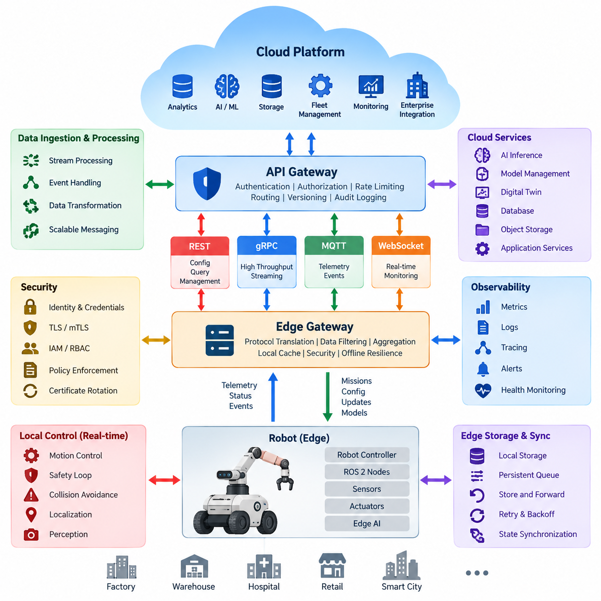
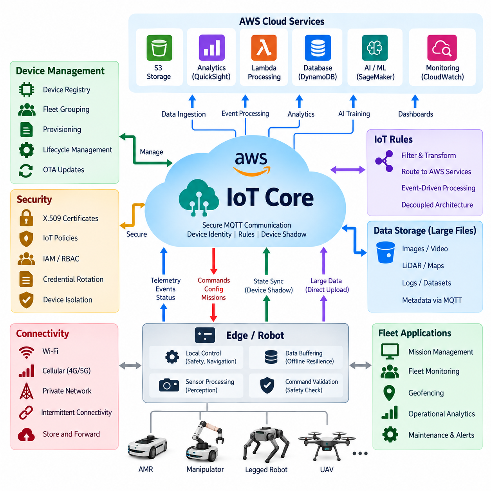
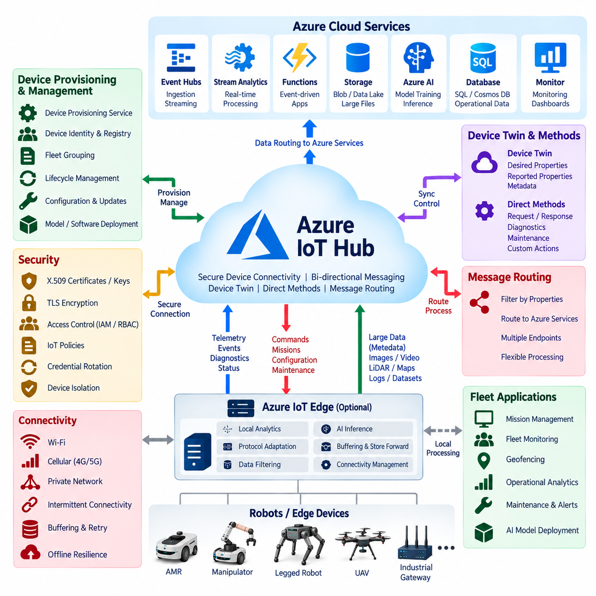
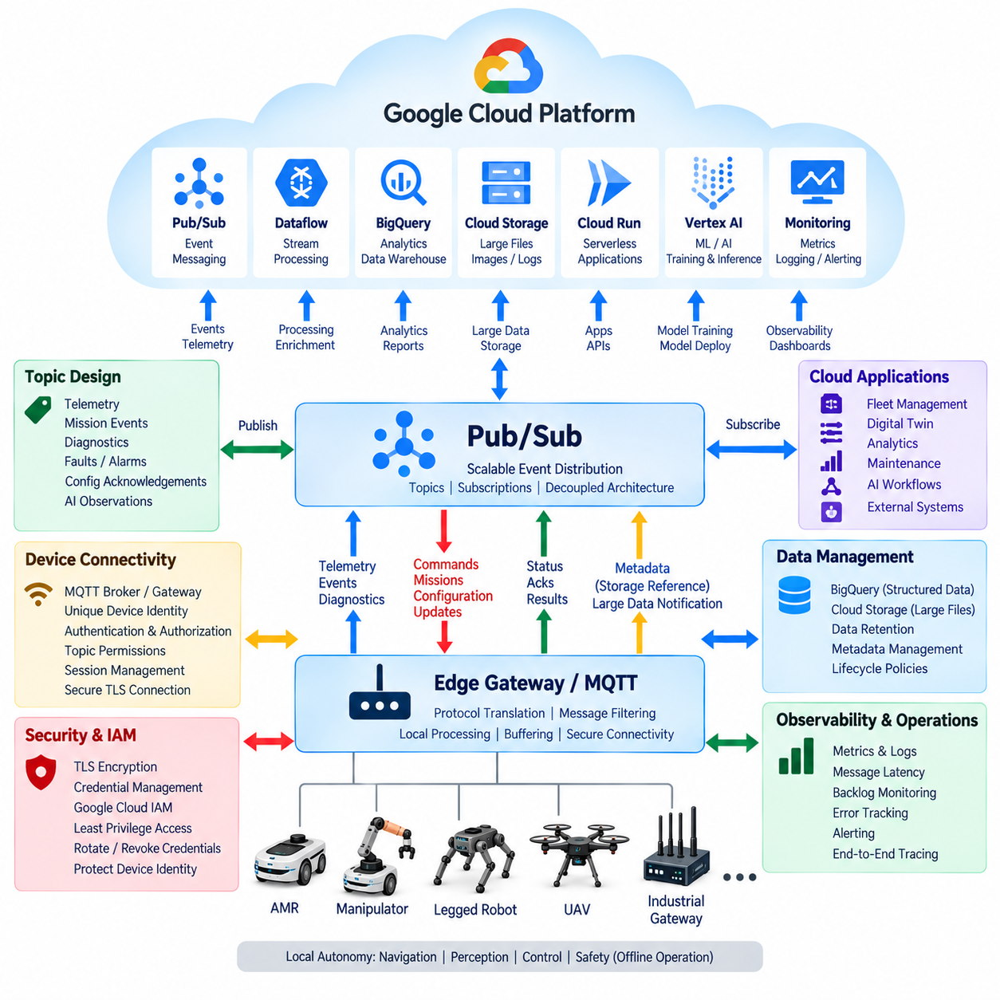
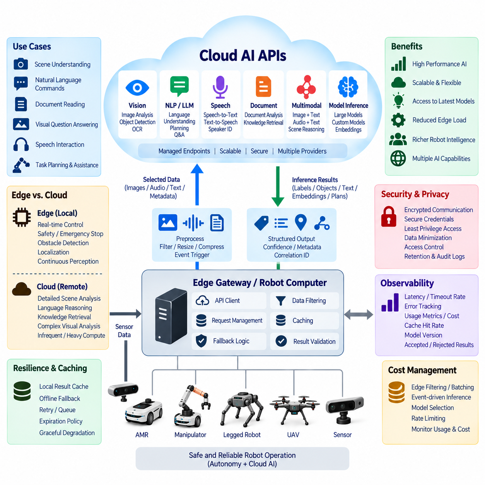
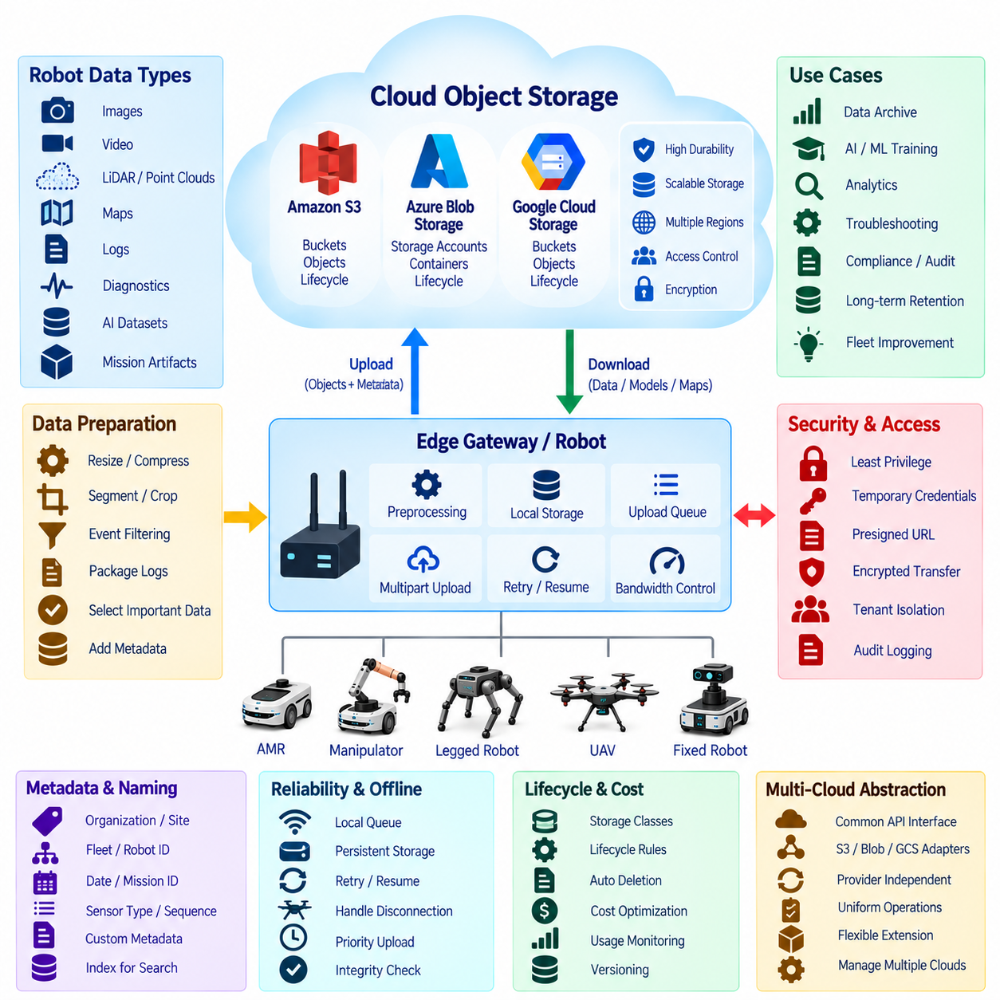
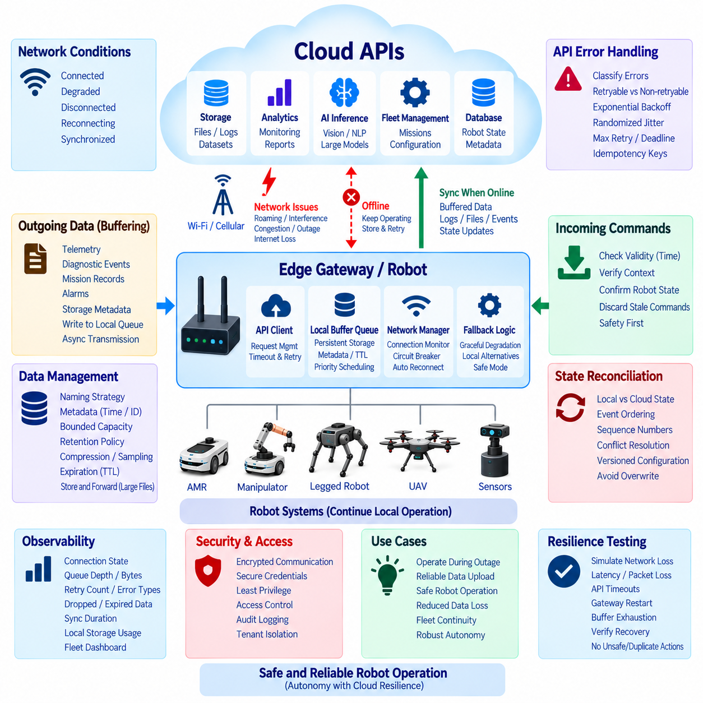
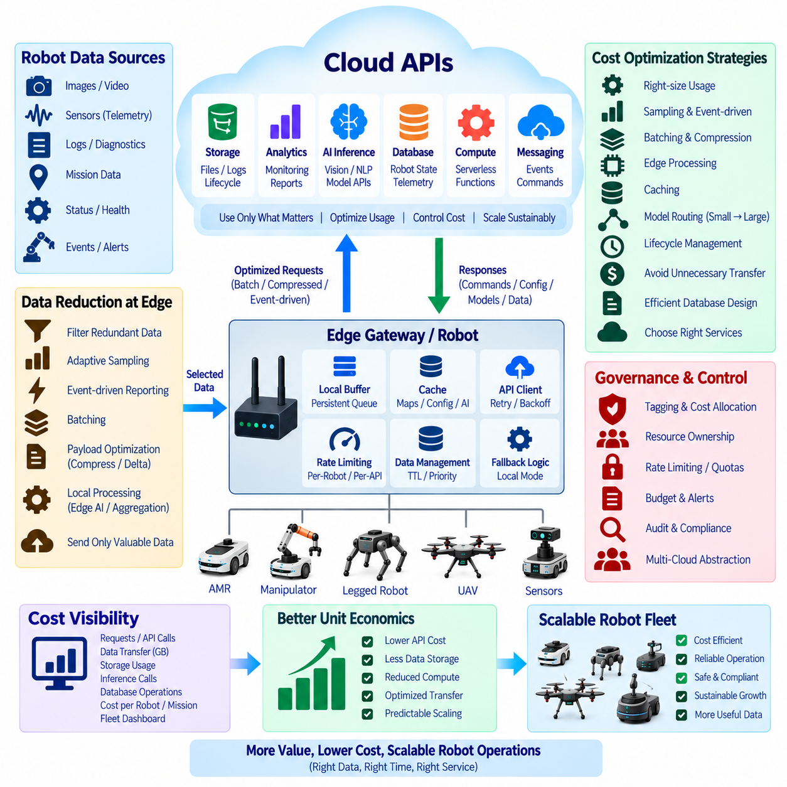
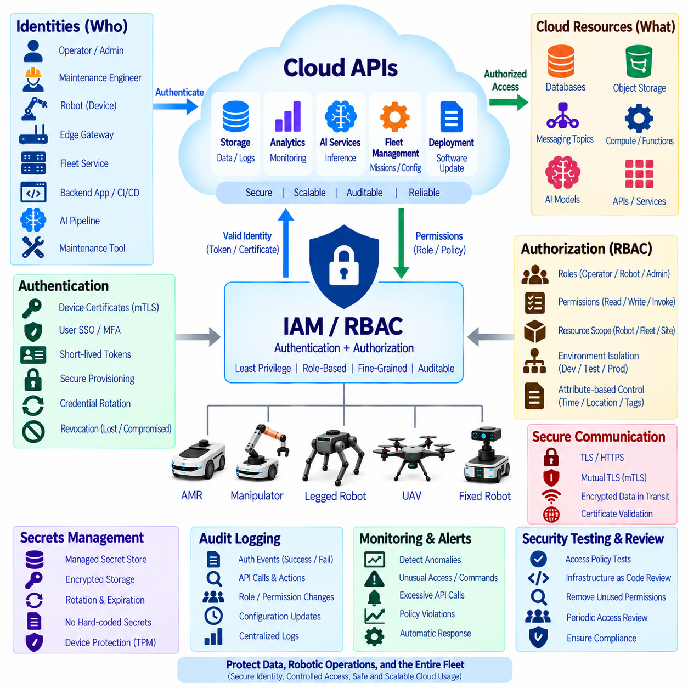
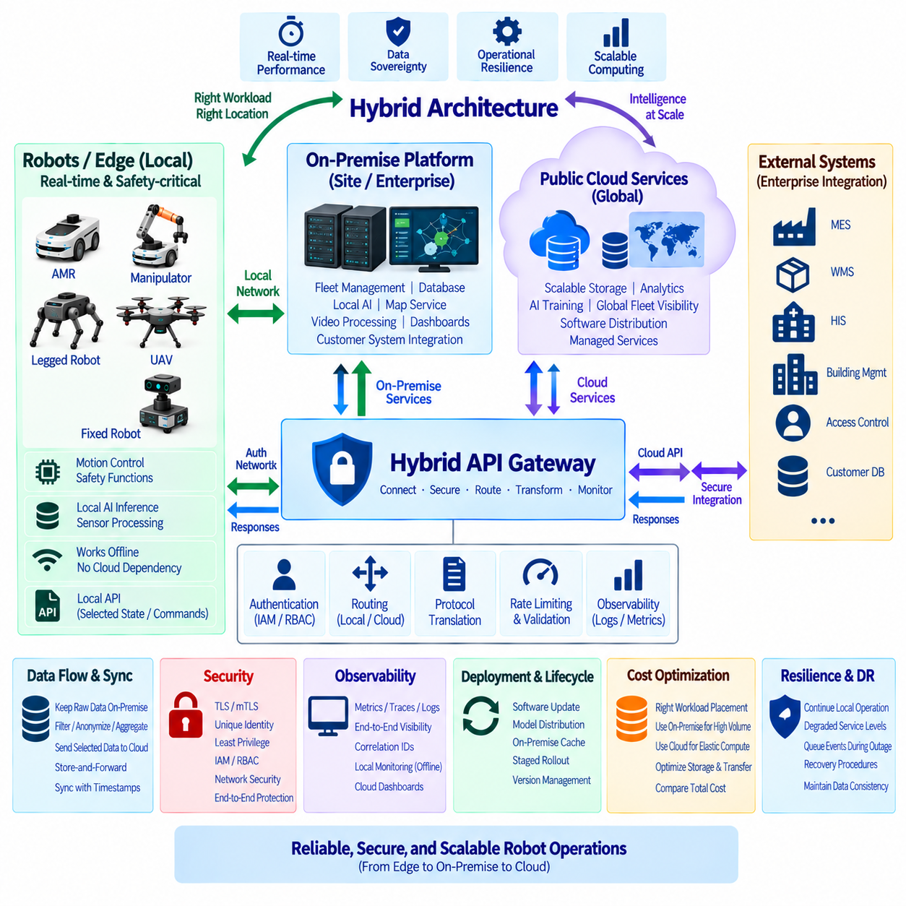

**Volume 06 Robot Communication and APIs**

# 07. Cloud APIs

## 07.01 Cloud API Integration Architecture: Edge to Cloud

{width="7.268055555555556in" height="7.268055555555556in"}

Cloud API integration in robotics establishes a controlled communication boundary between autonomous machines operating in the physical world and scalable computing services hosted remotely. The edge system remains responsible for deterministic control, safety, perception, and immediate decision making, while cloud APIs expose services for fleet coordination, analytics, storage, model management, monitoring, and enterprise integration. This separation prevents network availability from becoming a prerequisite for basic robot operation.

An edge-to-cloud architecture is therefore usually organized as several cooperating layers rather than a direct connection between robot software and arbitrary cloud endpoints. Robot controllers and ROS 2 nodes generate commands, state, sensor observations, diagnostics, and mission events. An edge gateway translates selected information into externally consumable API contracts, applies security and filtering policies, and communicates with cloud gateways or ingestion services using protocols appropriate to each workload.

The edge gateway is a critical abstraction boundary because internal robot interfaces often have different timing, reliability, and data semantics from cloud services. High-frequency control messages may use ROS 2 or local gRPC communication, while telemetry can be transformed into MQTT events, REST resources, or streaming messages. The gateway hides hardware-specific details and provides a stable external representation of robot identity, operational state, mission progress, alarms, capabilities, and software configuration.

Communication should be divided according to latency and criticality. Safety loops, motor control, collision avoidance, localization updates, and other time-sensitive functions must normally remain at the robot or local edge. Cloud communication is more appropriate for fleet-level optimization, historical analytics, large-scale AI processing, map distribution, software deployment, and long-term data storage. This division creates a latency boundary that prevents unpredictable Internet delays from propagating into physical control loops.

Telemetry represents one of the dominant edge-to-cloud data flows. Robots continuously generate battery state, pose, velocity, temperatures, component health, mission status, network quality, perception statistics, and application-specific measurements. Sending every raw sample is inefficient, so the edge commonly performs aggregation, compression, sampling, event detection, and prioritization. Critical faults can be transmitted immediately, while routine measurements may be buffered and uploaded periodically or in batches.

Cloud-to-edge traffic requires stricter control because it can influence physical behavior. Mission assignments, configuration changes, map updates, model deployments, and remote operational requests should pass through authorization, validation, and policy enforcement before reaching robot subsystems. A cloud request should normally represent high-level intent rather than direct actuator commands. The edge converts that intent into locally validated actions while preserving robot-side safety constraints and operational authority.

Reliable integration must assume intermittent connectivity rather than treating disconnection as an exceptional failure. Wireless networks may experience packet loss, handovers, congestion, limited coverage, or complete outages. Edge software therefore needs persistent queues, retry policies, exponential backoff, acknowledgement tracking, message expiration, and store-and-forward mechanisms. When connectivity returns, synchronization logic must determine which buffered events remain valid and how local and cloud state should be reconciled.

State synchronization is more difficult than simply retransmitting messages because robot state changes continuously while disconnected. APIs should distinguish desired state, reported state, historical events, and transient commands. Version numbers, timestamps, sequence identifiers, correlation IDs, and idempotency keys help detect duplicated or outdated operations. Cloud systems can then reconstruct meaningful state without assuming that messages arrived exactly once, in chronological order, or without interruption.

Different API technologies serve different portions of this architecture. REST is suitable for configuration, resource management, queries, and administrative operations. gRPC provides efficient typed service communication and streaming where stronger contracts or higher throughput are required. MQTT supports lightweight publish-subscribe telemetry and event delivery across unreliable networks, while WebSocket can support interactive monitoring. A practical architecture combines these mechanisms instead of forcing every workload through one protocol.

Security must extend from individual robot identity to cloud-side authorization. Each robot should possess a verifiable identity, and communication should be protected with TLS or mutual TLS where appropriate. Credentials, certificates, and tokens require secure provisioning, rotation, expiration, and revocation. Cloud IAM and RBAC policies determine which services or users can access specific robots, fleets, data classes, and operations, while the edge independently enforces restrictions on commands capable of affecting physical behavior.

An API gateway provides a useful cloud-side enforcement point for authentication, authorization, request validation, rate limiting, routing, version control, and audit logging. Behind the gateway, robot-facing APIs can connect to telemetry ingestion, fleet services, databases, object storage, AI inference, digital twins, and enterprise systems. This prevents robots from maintaining direct dependencies on numerous cloud microservices and reduces the number of external interfaces that must remain compatible throughout the robot lifecycle.

Data architecture must also account for the large difference between telemetry and sensor payloads. Small structured events can travel continuously through messaging APIs, whereas camera frames, LiDAR point clouds, maps, logs, and training datasets are better handled through object-storage workflows. The robot may upload metadata first and transfer large objects separately using resumable or multipart mechanisms. Cloud APIs then associate these objects with robot identity, mission, timestamp, location context, and processing status.

Cloud AI services introduce another partitioning decision. Models requiring low latency or continuous operation should normally execute at the edge, whereas computationally expensive analysis, fleet-wide learning, large model inference, retraining, and dataset processing may execute remotely. Cloud-generated models or policies can subsequently be validated, versioned, and deployed back to edge systems. This creates a closed lifecycle in which robots produce operational data and the cloud returns improved software or intelligence artifacts.

Observability should span the entire communication path rather than stopping at either endpoint. Metrics should measure API latency, request rates, failures, queue depth, retry counts, synchronization delay, dropped messages, bandwidth consumption, authentication failures, and service availability. Distributed correlation identifiers allow a mission event to be traced from the robot through the edge gateway and cloud services. Such visibility is essential when diagnosing failures that appear to be robot problems but originate in networks or backend services.

Scalability changes the architecture when a deployment grows from several robots to hundreds or thousands. Cloud endpoints should avoid maintaining unnecessary per-robot synchronous state and instead rely on horizontally scalable gateways, brokers, ingestion pipelines, and storage systems. Robot identity and fleet hierarchy become primary routing dimensions. Load shedding and priority mechanisms should preserve alarms and operational events during traffic surges while allowing low-priority telemetry to be delayed, sampled, or discarded.

A well-designed edge-to-cloud architecture ultimately treats the cloud as an extension of robot intelligence and operations rather than as a remote controller required for autonomy. Local systems retain immediate control, safety, and graceful degradation, while cloud APIs provide scalable coordination, persistence, analytics, AI services, and lifecycle management. The resulting boundary supports both independent robot operation and collective fleet intelligence without allowing temporary network or cloud failures to compromise safe physical execution.

## 07.02 AWS IoT Core: Robot Fleet Integration [w/Code]

{width="7.268055555555556in" height="7.268055555555556in"}

AWS IoT Core provides a managed communication layer for connecting robots, edge computers, gateways, and fleet services to the AWS cloud. In a robot fleet architecture, each robot can be represented as an individually identifiable IoT device with authenticated communication channels. The service primarily handles secure message exchange and device connectivity, while navigation, safety control, perception, and other latency-sensitive functions remain on the robot or local edge.

Robot integration commonly begins with a unique device identity and an associated digital representation in the AWS IoT registry. Certificates and policies define which cloud resources and MQTT topics each robot may access. This identity-oriented architecture allows hundreds or thousands of robots to communicate through common cloud infrastructure while retaining individual authorization boundaries, operational metadata, software versions, hardware characteristics, and fleet membership information.

MQTT is particularly suitable for robot telemetry because it provides lightweight publish-subscribe communication with relatively small protocol overhead. A robot may publish battery level, pose, mission progress, diagnostics, network quality, temperature, and fault events through structured topic hierarchies. Cloud applications subscribe only to the information they require, allowing telemetry producers and consumers to evolve independently without creating direct point-to-point dependencies between every robot and backend service.

Topic design becomes important as fleet size increases. A hierarchical structure can encode organization, site, fleet, robot identity, and message category so that policies and subscribers operate at meaningful scopes. Separate topic branches can represent telemetry, events, commands, configuration, and acknowledgements. Consistent naming also simplifies filtering, monitoring, authorization, and integration with downstream processing systems while preventing every application from interpreting robot-specific topic conventions differently.

AWS IoT Device Shadow provides a mechanism for maintaining cloud-visible device state even when a robot is temporarily disconnected. Applications can express a desired state, while the robot reports its actual state after processing the requested change. This model is useful for configuration parameters, operational modes, software information, or other persistent properties. It should not replace deterministic control loops or safety mechanisms because shadow synchronization depends on network and cloud availability.

Cloud-to-robot commands require stronger semantics than ordinary telemetry. Mission assignments, configuration updates, maintenance requests, or operational instructions should contain identifiers, timestamps, validity periods, and acknowledgement information. The robot must independently validate whether a command is authorized, current, compatible with its present operating state, and safe to execute. AWS IoT Core therefore acts as a secure transport and messaging infrastructure rather than replacing the robot\'s local command validation and safety authority.

AWS IoT Rules can route incoming robot messages toward other AWS services without requiring every robot to understand the cloud backend architecture. Telemetry and events can be filtered or transformed and forwarded to databases, storage, analytics, serverless processing, or application services. This decoupling enables the robot-facing communication contract to remain comparatively stable while cloud-side data pipelines evolve according to operational, analytical, and AI requirements.

Large sensor payloads require a different path from lightweight MQTT telemetry. Images, video segments, LiDAR data, maps, diagnostic archives, and AI datasets can exceed practical message sizes and generate substantial bandwidth. The edge system can therefore transmit metadata and transfer status through IoT messaging while uploading larger objects to cloud storage through dedicated mechanisms. The resulting object references can then be associated with robot identity, mission context, timestamps, and processing workflows.

Offline resilience is essential because mobile robots frequently operate across Wi-Fi, private wireless, or cellular environments with variable connectivity. Edge software should buffer important events and telemetry when AWS connectivity is unavailable, preserve ordering information where necessary, and retry transmission after reconnection. Message expiration policies are equally important because stale commands or old high-frequency telemetry may no longer have operational value when communication is eventually restored.

Security begins with device authentication and should continue through every cloud service receiving robot information. X.509 certificates can provide device credentials for authenticated TLS communication, while AWS IoT policies restrict permitted operations and topic resources. Credentials should be provisioned securely and support controlled rotation and revocation. Cloud applications should additionally use AWS identity and access controls so that device connectivity permissions remain separated from administrative and backend service permissions.

A production fleet should avoid sharing one unrestricted identity across multiple robots. Per-device credentials provide better isolation and allow a compromised or retired robot to be disabled without interrupting the entire fleet. Fleet grouping can then organize devices by robot model, customer, deployment site, software release, or operational role. Such grouping becomes useful when managing configuration, monitoring health, performing staged deployment, or investigating failures affecting a particular population of robots.

Fleet provisioning becomes increasingly important when robot quantities move from prototypes to production volumes. Manually registering certificates and policies does not scale efficiently across hundreds of devices. Manufacturing or commissioning workflows should therefore automate identity creation, secure credential installation, registration, and assignment to appropriate groups. The provisioning process must also consider replacement controllers, factory resets, ownership changes, decommissioning, and recovery from lost or compromised credentials.

Robot fleet monitoring should combine communication health with application-level operational health. Useful indicators include connection state, message rate, rejected requests, authentication failures, telemetry delay, reconnect frequency, command acknowledgement latency, and abnormal traffic patterns. These cloud-side metrics should be correlated with robot diagnostics such as battery condition, sensor status, mission failures, localization quality, and compute utilization to distinguish communication problems from failures occurring within the robot itself.

A fleet management application can consume AWS IoT Core data to maintain a higher-level operational representation of all connected robots. Instead of controlling motors directly, the fleet service can assign missions, observe progress, coordinate charging, manage operational zones, and react to exceptions. Robot-side software translates these high-level requests into local navigation and control behaviors, preserving the architectural separation between cloud orchestration and deterministic physical execution.

AI workflows can also be connected to the same architecture. Robots may upload selected observations, difficult perception cases, failure events, or operational datasets for cloud analysis and model improvement. Updated models can subsequently pass through validation and deployment pipelines before being distributed back to selected robots. Device and fleet metadata make staged rollout possible, allowing new AI versions to be deployed to controlled groups before broader fleet adoption.

Scalability requires controlling both message volume and cloud resource consumption. High-frequency robot data should be filtered, aggregated, compressed, or sampled at the edge whenever raw resolution is unnecessary. Event-driven transmission is preferable for many diagnostic conditions because unchanged values need not be continuously uploaded. Topic structures, rule processing, storage retention, logging levels, and large-object transfer policies should therefore be designed together with performance and cost requirements.

The complete AWS IoT Core robot fleet architecture consequently forms a bidirectional bridge between autonomous edge systems and scalable cloud intelligence. Robots retain real-time control, perception, safety, and offline autonomy, while AWS IoT Core supplies secure identity, MQTT messaging, state synchronization, routing, and integration with broader cloud services. This separation allows the fleet to gain centralized visibility, analytics, data management, AI lifecycle support, and orchestration without making safe robot operation dependent on continuous cloud connectivity.

## 07.03 Azure IoT Hub Integration [w/Code]

{width="7.268055555555556in" height="7.268055555555556in"}

Azure IoT Hub provides a managed cloud communication service for securely connecting robots, edge gateways, embedded controllers, and large device fleets to Microsoft Azure. Within a robotic system, it forms the cloud-facing messaging boundary while local computers retain responsibility for navigation, perception, motion control, and safety. This separation allows cloud services to support fleet operations without placing deterministic physical control loops across an unpredictable network connection.

Each robot should be represented by a distinct device identity rather than sharing credentials across an entire fleet. Azure IoT Hub maintains device identities and authentication information that allow the cloud to recognize individual robots and control their permitted connections. Robot metadata such as model, deployment site, software version, operational role, and fleet membership can be associated with higher-level management systems, enabling cloud applications to organize heterogeneous robot populations consistently.

Device-to-cloud communication carries telemetry, operational events, diagnostics, and application data generated by robots. Typical information includes battery state, pose, velocity, mission progress, sensor health, compute utilization, network quality, temperatures, warnings, and fault events. Edge software should filter and aggregate these streams before transmission so that the cloud receives information appropriate for monitoring and analytics rather than unnecessarily transferring every high-frequency internal control or sensor sample.

Cloud-to-device communication provides the reverse path for mission requests, configuration changes, maintenance instructions, and other high-level operational commands. These messages should not bypass robot-side safety logic or directly manipulate actuators. The receiving edge software validates command identity, authorization, freshness, current robot state, and execution constraints before converting the cloud request into local actions. Cloud connectivity therefore extends orchestration capability while local software remains the final authority for safe physical execution.

Azure IoT Hub supports device twins for representing persistent cloud-visible information about connected devices. A device twin can contain desired properties requested by cloud applications, reported properties supplied by the robot, and metadata used for synchronization. This mechanism is useful for configuration, operating modes, software versions, feature settings, and deployment parameters. It is not intended to replace real-time state streaming or safety-critical control because synchronization may be delayed by network availability.

Direct methods provide another interaction model when a cloud application requires request-response behavior with a connected device. In robotics, they can support carefully bounded operations such as requesting diagnostics, initiating a maintenance procedure, or invoking a predefined device function. Because connectivity and execution time cannot always be guaranteed, applications should define timeouts and failure handling explicitly. Operations requiring deterministic timing should remain within local robot or edge processes.

Message routing allows telemetry entering Azure IoT Hub to be directed toward different downstream services according to message properties or operational requirements. Robot events can therefore feed stream-processing systems, storage platforms, databases, monitoring applications, serverless functions, or AI pipelines without requiring the robot to communicate separately with each service. This creates a decoupled architecture in which the robot-facing interface remains stable while backend processing can evolve independently.

Azure Event Hubs, Stream Analytics, Functions, storage services, databases, and other Azure components can participate in downstream robot-data processing. A fleet may route critical alarms toward immediate event processing while sending routine telemetry to historical analytics and long-term storage. Different retention and processing policies can consequently be applied according to data value. This is especially useful when thousands of robots produce different classes of operational information at different frequencies.

Large robotic data objects should generally be separated from lightweight telemetry. Camera images, video, LiDAR point clouds, maps, diagnostic archives, and training datasets can consume substantial bandwidth and are not naturally suited to ordinary device messaging. Edge applications can transmit descriptive metadata through IoT Hub while transferring large payloads to object storage. Cloud workflows then associate stored objects with robot identity, timestamps, missions, locations, faults, or AI processing jobs.

Azure IoT Edge can extend cloud-oriented services toward computers located near the robot. Edge modules may perform protocol adaptation, filtering, local analytics, AI inference, preprocessing, and connectivity management before information reaches IoT Hub. This architecture is useful when a robot contains multiple internal subsystems or when several machines communicate through an industrial gateway. It also reduces unnecessary cloud traffic by processing high-volume data near its physical source.

Offline operation must be considered a normal condition for mobile robotics. Wi-Fi roaming, cellular coverage changes, private-network handovers, congestion, and infrastructure failures can temporarily interrupt Azure connectivity. Edge components should therefore provide buffering, persistent queues, retry strategies, message expiration, and store-and-forward behavior. When connectivity returns, synchronization mechanisms must prevent stale commands, duplicate operations, or outdated configuration from being interpreted as current instructions.

Security should be designed around unique identities, encrypted transport, restricted permissions, and controlled credential lifecycle management. Depending on the deployment model, authentication can use mechanisms such as X.509 certificates or symmetric keys, while communication is protected using TLS. Credentials must be securely provisioned, rotated, revoked, and replaced. Backend applications should use Azure identity and authorization mechanisms separately from robot device credentials to preserve clear trust boundaries.

Device Provisioning Service can automate the onboarding of robots into an Azure IoT environment. Instead of manually configuring every production robot, provisioning workflows can establish device identity and direct devices toward the appropriate IoT Hub configuration. This becomes important when manufacturing or deploying hundreds of systems across multiple customers and sites. Provisioning design should also address controller replacement, factory reset, device retirement, ownership transfer, and credential recovery.

Fleet monitoring requires more than observing whether a robot is connected. Useful cloud indicators include telemetry latency, message throughput, connection changes, authentication failures, command response time, synchronization status, routing errors, and abnormal communication patterns. These measurements should be correlated with robot-level diagnostics such as battery condition, localization quality, mission failures, sensor availability, and processor utilization to provide meaningful operational visibility across the fleet.

A fleet management platform can use IoT Hub as a communication foundation while maintaining higher-level concepts such as missions, robot availability, charging schedules, operational zones, maintenance state, and exception handling. The cloud fleet service determines what should be accomplished, whereas robot-side autonomy determines how the requested objective can be safely executed. This distinction prevents cloud fleet orchestration from becoming tightly coupled to individual motion-control implementations.

AI and machine-learning workflows can also be connected to the Azure-based architecture. Robots can upload selected operational observations, difficult perception examples, fault cases, and performance statistics for centralized analysis or model improvement. Updated AI models can subsequently be validated, versioned, and distributed through controlled deployment workflows. Fleet grouping and device metadata make staged deployment possible so that new software or models can be evaluated on selected robots before broader release.

Scalability and cost should be treated as architectural requirements rather than later optimizations. Edge filtering, aggregation, compression, adaptive sampling, and event-driven reporting can substantially reduce unnecessary cloud traffic. Critical alarms may require immediate delivery, while repetitive telemetry can tolerate lower frequencies or batching. Message routing, storage retention, monitoring detail, large-file transfers, and downstream processing should therefore be designed according to operational value as well as technical capacity.

An Azure IoT Hub robot integration architecture ultimately establishes a secure bidirectional bridge between autonomous edge systems and cloud-scale fleet intelligence. Robots preserve real-time control, safety, perception, and offline autonomy, while Azure services provide device connectivity, state synchronization, data routing, fleet visibility, analytics, storage, AI integration, and lifecycle support. The resulting architecture allows centralized intelligence to scale across many robots without making continuous cloud availability a prerequisite for safe autonomous operation.

## 07.04 GCP Cloud IoT and PubSub Usage [w/Code]

{width="7.268055555555556in" height="7.268055555555556in"}

Google Cloud Platform can support robot fleet connectivity by combining edge gateways, messaging services, data-processing pipelines, storage, analytics, and AI services. Because Google Cloud IoT Core was retired, a current architecture should not treat it as an available managed device-connectivity service. Instead, robots typically connect through an edge or partner-managed MQTT layer, while Google Cloud Pub/Sub provides scalable asynchronous messaging between ingestion components and cloud applications.

The robot or edge gateway forms the first integration boundary. Navigation, localization, perception, motion control, collision avoidance, and safety functions remain local because they require predictable latency and continued operation during network outages. The gateway selects operational information for cloud transmission, transforms internal ROS 2 or device messages into cloud-oriented schemas, and separates high-frequency physical control from fleet-level communication.

Device connectivity can be implemented through an MQTT broker or gateway deployed at the edge, on Google Cloud infrastructure, or through an external managed platform. Each robot should maintain a unique identity and credentials rather than sharing a common fleet account. The connectivity layer authenticates robots, applies topic permissions, manages sessions, and forwards selected messages toward Google Cloud services while shielding internal robot interfaces from direct Internet exposure.

Pub/Sub becomes the central event-distribution layer after robot data enters Google Cloud. Publishers send messages to topics, while independent subscribers consume them through subscriptions. Robot telemetry, mission events, diagnostics, alarms, maintenance information, and AI-related observations can therefore be distributed to multiple backend services without creating direct dependencies between the robot and every application that needs its data.

A scalable topic architecture should reflect information purpose rather than reproduce every internal robot topic. Separate logical streams may represent telemetry, mission events, faults, diagnostics, configuration acknowledgements, and AI observations. Attributes such as robot ID, fleet ID, site, message type, software version, and priority can accompany messages, allowing subscribers to filter and route information according to operational requirements.

Pub/Sub decouples data producers from consumers in both time and implementation. A robot does not need to know whether its telemetry will eventually be processed by monitoring software, analytics pipelines, databases, digital twins, or AI services. Backend applications can be added or replaced without modifying robot communication logic. This property is particularly valuable when a fleet platform evolves continuously while deployed robots must maintain stable software interfaces.

Cloud-to-robot communication requires a controlled reverse path because cloud requests can influence physical behavior. Fleet services may generate mission assignments, configuration changes, maintenance requests, map notifications, or software deployment instructions. An edge gateway receives these requests and validates identity, authorization, freshness, compatibility, and operating conditions before forwarding them to local robot software. Safety-critical actuator commands should remain under local control.

Pub/Sub delivery semantics require applications to tolerate duplicate or delayed messages. Robot messages should therefore contain identifiers, timestamps, sequence information, schema versions, and correlation data where appropriate. Consumers can use these fields to recognize duplicate events and reconstruct meaningful state. Command-processing systems should additionally use idempotent operations so that retransmission does not accidentally create duplicate missions or repeated physical actions.

Offline resilience is essential for mobile robots operating through Wi-Fi, private networks, or cellular communication. When cloud connectivity is unavailable, the edge gateway should buffer important telemetry and events using persistent local storage. Retry and exponential-backoff policies can resume transmission after connectivity returns. Expiration rules should prevent obsolete telemetry or stale commands from being processed after a long interruption.

Dataflow can process robot event streams originating from Pub/Sub and perform transformations, enrichment, aggregation, windowing, and routing. For example, telemetry from many robots can be normalized into a common fleet schema before being stored or analyzed. Streaming pipelines can also calculate operational indicators such as mission duration, utilization, charging behavior, fault frequency, or communication quality without requiring individual robots to perform fleet-wide analysis.

BigQuery provides a useful analytical destination for structured historical robot data. Telemetry, mission records, diagnostic events, maintenance history, and fleet-performance information can be organized for large-scale querying and reporting. Engineers can compare robot models, deployment sites, software versions, or operating periods to identify patterns that are difficult to observe from individual machines. High-volume raw sensor data should normally follow a different storage path.

Cloud Storage is more appropriate for large objects such as camera images, video segments, LiDAR point clouds, maps, log archives, and AI datasets. Instead of embedding these objects directly inside Pub/Sub messages, the edge can upload the files separately and publish metadata containing storage references. Cloud processing services can then retrieve the required object while preserving associations with robot identity, mission context, timestamps, and processing status.

Cloud Run and serverless processing components can implement robot-facing backend services without requiring permanently allocated application servers. Event-driven services may process alarms, update fleet state, trigger workflows, transform messages, or expose REST APIs to external systems. Stateless service design allows instances to scale according to workload, although robot applications must still account for network latency, retries, timeouts, and temporary service unavailability.

Google Cloud AI and Vertex AI can extend the architecture into centralized robot-learning workflows. Selected field observations, difficult perception cases, failure examples, and operational datasets can be collected for model evaluation or training. Updated models can then pass through validation and deployment pipelines before being distributed to selected edge devices. Real-time safety inference should remain local when cloud latency or availability cannot satisfy operational requirements.

Security must span robot identity, transport protection, cloud permissions, and backend service access. TLS should protect communications between gateways and cloud endpoints, while credentials must be securely provisioned, rotated, revoked, and replaced. Google Cloud IAM can restrict access among Pub/Sub, storage, analytics, AI, and application services. Least-privilege design reduces the consequences of compromised devices or backend components.

Observability should trace data from the physical robot through the connectivity gateway, Pub/Sub, processing services, and final storage or application endpoint. Useful measurements include message rates, delivery latency, backlog depth, processing errors, retry counts, dropped events, authentication failures, and service availability. Correlation identifiers help engineers distinguish robot failures from connectivity, messaging, processing, or cloud-service problems.

Scalability depends on controlling the amount of data generated before it reaches cloud infrastructure. Edge filtering, aggregation, compression, adaptive sampling, and event-driven reporting can substantially reduce bandwidth and processing cost. Critical alarms may require immediate transmission, while repetitive telemetry can be sampled or batched. Storage retention and logging policies should similarly reflect operational value instead of preserving every signal indefinitely.

A modern GCP robot integration architecture therefore separates device connectivity from cloud event distribution. An MQTT-capable edge or gateway layer handles robot-facing communication, while Pub/Sub provides scalable messaging among cloud services and Dataflow, BigQuery, Cloud Storage, Cloud Run, and AI platforms provide processing and intelligence. This architecture preserves local robot autonomy while enabling centralized fleet visibility, analytics, data management, and AI lifecycle integration.

## 07.05 Cloud AI API Integration: Vision, NLP, Robot Inference [w/Code]

{width="7.268055555555556in" height="7.268055555555556in"}

Cloud AI APIs allow robots to access computational capabilities that may be impractical to execute entirely on embedded hardware. Vision recognition, language understanding, speech processing, document analysis, multimodal reasoning, and large-model inference can be exposed through managed cloud endpoints. The robot sends selected input data and receives structured inference results while retaining local responsibility for real-time control, safety, and immediate physical interaction.

Cloud AI integration should begin by defining a clear boundary between edge inference and remote inference. Tasks such as obstacle detection, emergency stopping, localization, and high-frequency perception require predictable latency and should normally remain local. Cloud inference is more appropriate for computationally expensive, semantically rich, or infrequent tasks where additional latency can be tolerated, including detailed scene interpretation, language reasoning, knowledge retrieval, and complex visual analysis.

A robot vision pipeline can selectively forward images or image regions to a cloud vision API after local preprocessing. Instead of continuously uploading raw camera streams, the edge may resize images, crop regions of interest, remove redundant frames, compress data, or trigger requests only when unusual events occur. The cloud service can return labels, detected objects, text, semantic descriptions, embeddings, or other structured results that the robot application can consume.

This hybrid approach reduces bandwidth consumption while preserving access to larger cloud models. Local models can perform continuous detection and tracking, while cloud models analyze uncertain or complex observations. For example, an edge detector may identify an unknown object and request richer cloud interpretation only when classification confidence is insufficient. The returned information becomes supplementary semantic context rather than a replacement for the robot\'s immediate perception and safety pipeline.

Natural language processing APIs provide another interface between robots and cloud intelligence. Spoken or typed instructions can be converted into intents, entities, parameters, summaries, or structured task descriptions. A service robot might receive a natural-language request, send the linguistic content to a cloud model, and obtain a high-level mission representation. Local mission software must then determine whether that requested operation is supported, permitted, and physically safe.

Large language models can extend this process from simple intent recognition toward planning assistance, question answering, dialogue, knowledge retrieval, and task decomposition. However, generated language should not be interpreted directly as actuator-level commands. A robot architecture should place a deterministic validation layer between AI-generated outputs and executable actions. Only predefined, authorized, and contextually valid operations should be converted into robot missions or control objectives.

Multimodal AI APIs can combine images, text, audio, and contextual metadata within a single inference request. This is valuable when a robot must interpret a physical scene together with human instructions or operational information. A robot could provide an image, a user request, current mission state, and selected sensor metadata, allowing the cloud model to produce a richer semantic interpretation. The result should still pass through local policy and safety validation before affecting behavior.

API request design strongly influences reliability and cost. Each inference request should contain only the information required for the task and should include identifiers that connect the result to a robot, mission, sensor observation, and timestamp. Correlation IDs are particularly useful when several asynchronous cloud requests are active simultaneously. Schema versions also help prevent updated cloud responses from silently breaking older robot software deployed in the field.

Latency must be measured end to end rather than considering only model execution time. Robot-to-cloud inference includes sensor acquisition, preprocessing, encoding, network transmission, API gateway processing, queueing, model execution, response transmission, decoding, and application consumption. A model that executes quickly in the cloud may still produce an operationally late result if communication or queueing dominates the total response time.

Timeouts are therefore essential. Every cloud inference request should have an application-defined deadline based on how long its result remains useful. When the deadline expires, the robot should continue using local capabilities rather than waiting indefinitely. Different AI functions may require different deadlines: conversational responses can tolerate longer delays than navigation-related semantic observations, while background analytics may operate asynchronously without blocking robot behavior.

Network failures require explicit fallback behavior. If cloud AI becomes unavailable, the robot should degrade gracefully to local inference, cached information, simplified behavior, or a safe operational mode. Requests that fail during disconnection may be discarded, retried, or queued depending on their purpose. Real-time observations usually lose value quickly, whereas diagnostic images or datasets intended for later analysis can be stored locally and uploaded after connectivity returns.

Caching can reduce repeated cloud inference for stable or recurring information. Results associated with maps, known objects, documents, frequently asked questions, or static environmental features may be stored locally with appropriate expiration and version information. Before issuing a new cloud request, the edge can determine whether an equivalent valid result already exists. This approach reduces latency, bandwidth usage, API calls, and operational cost.

Privacy and data governance become important when robots capture people, workplaces, hospitals, factories, or customer environments. The edge should minimize transmitted information and remove unnecessary sensitive content whenever possible. Policies should define which image, audio, text, and metadata categories may leave the robot or site. Encryption, access control, retention limits, audit logs, and regional data-processing requirements should be considered as part of the API architecture.

Authentication should use securely managed machine credentials rather than embedding permanent secrets directly in robot application code. Communication with cloud AI endpoints should use encrypted transport, and permissions should follow least-privilege principles. An inference client should receive access only to the models and resources required for its role. Credential rotation, revocation, expiration, and secure provisioning must be supported across the robot lifecycle.

Cloud AI responses must be treated as untrusted computational outputs rather than guaranteed facts. Vision models can misclassify objects, language models can produce incorrect interpretations, and multimodal systems can generate plausible but unsupported conclusions. Robot software should therefore apply confidence thresholds, schema validation, policy checks, contextual consistency tests, and deterministic safety constraints before using AI results in mission decisions.

Observability should capture both API performance and inference behavior. Useful metrics include request count, response latency, timeout rate, network failures, model errors, token or data usage, cache hit rate, fallback frequency, and estimated cost. Application-level monitoring can additionally record which model version generated each result and whether the output was accepted, rejected, or overridden by local validation.

Cost management becomes significant when many robots repeatedly invoke cloud models. Continuous image uploads or unrestricted language-model calls can scale rapidly with fleet size. Edge filtering, request batching, image resizing, event-triggered inference, caching, model selection, and rate limiting can control consumption. Less expensive models may handle routine tasks, while larger models are reserved for observations requiring deeper semantic reasoning.

A mature cloud AI architecture can also combine multiple providers or model classes behind an internal inference gateway. Robot applications call a stable organizational API rather than depending directly on one external model endpoint. The gateway can perform authentication, routing, request normalization, model selection, logging, quota control, fallback, and version management. This abstraction makes it easier to replace or upgrade AI services without modifying every deployed robot.

Cloud AI APIs ultimately extend robot intelligence without transferring physical authority to the cloud. Vision, NLP, speech, multimodal models, and large-scale inference can enrich perception and reasoning, while the edge preserves deterministic control, safety, connectivity resilience, and immediate autonomy. The resulting hybrid architecture uses cloud intelligence where semantic capability and computational scale provide value while ensuring that safe robot operation remains possible when cloud inference is delayed, unavailable, or incorrect.

## 07.06 Cloud Storage API: S3 / Blob / GCS Robot Data [w/Code]

{width="7.268055555555556in" height="7.268055555555556in"}

Cloud storage APIs provide scalable object-storage interfaces for the large volumes of data generated by modern robots. Services such as Amazon S3, Azure Blob Storage, and Google Cloud Storage allow robots and edge gateways to persist images, video, LiDAR point clouds, maps, logs, diagnostic archives, AI datasets, and mission artifacts without requiring the robot itself to maintain large long-term storage infrastructure.

Object storage differs fundamentally from ordinary robot telemetry messaging. MQTT, REST events, or streaming systems are appropriate for relatively small status messages, while sensor recordings can range from megabytes to terabytes over extended operation. Instead of transmitting large binary payloads through messaging channels, the edge stores them as objects and exchanges compact metadata containing object identifiers, timestamps, robot IDs, mission information, and storage locations.

Amazon S3 organizes objects inside buckets, Azure Blob Storage uses storage accounts and containers, and Google Cloud Storage similarly organizes objects within buckets. Although terminology and API details differ, the architectural model is comparable. Robot software identifies a logical storage destination, assigns an object key or path, attaches useful metadata, uploads the payload, and later retrieves, processes, archives, or deletes the object according to lifecycle policies.

A consistent object naming strategy becomes essential when thousands or millions of robot files accumulate. Paths can incorporate organization, site, fleet, robot ID, date, mission ID, sensor type, and file sequence. For example, camera images and LiDAR recordings from the same mission should be discoverable without relying on arbitrary local filenames. Predictable naming also simplifies automated processing, dataset generation, retention management, auditing, and troubleshooting.

Metadata provides the semantic connection between raw storage objects and robot operations. Useful metadata may include robot identity, sensor name, acquisition timestamp, coordinate frame, mission identifier, software version, calibration version, geographic or map context, data type, compression format, and processing state. Metadata can be stored with the object and also indexed separately in databases when large-scale search or analytical queries are required.

Robot edge systems should normally perform preprocessing before cloud upload. Images can be resized or compressed, video can be segmented, LiDAR streams can be divided into manageable files, and logs can be packaged into archives. Event detection can determine which data deserves permanent retention. Uploading every raw sensor sample continuously may consume excessive network bandwidth and storage, so data selection should reflect engineering, operational, and AI requirements.

Large-object transfers require mechanisms that tolerate unreliable connectivity. Multipart or resumable upload techniques divide a large file into smaller transfer units so that a network interruption does not require restarting the entire upload. The edge gateway should maintain upload state, track completed parts, retry failed transfers, and verify successful completion. This behavior is especially important for mobile robots operating through Wi-Fi roaming, cellular networks, or intermittent industrial coverage.

A local upload queue separates robot operation from cloud-transfer performance. Sensor or application processes write selected files into local persistent storage, while an independent synchronization service uploads them asynchronously. If cloud connectivity becomes unavailable, robot operation can continue while files remain queued. When connectivity returns, the synchronization service resumes transfer according to priority, available bandwidth, file age, and storage capacity.

Priority policies prevent background data transfer from interfering with operational communication. Critical diagnostic snapshots, safety events, or mission failure records may receive higher upload priority than routine sensor archives. Large training datasets can be transferred during charging or low-utilization periods. Bandwidth throttling allows the storage client to limit upload rates so that cloud synchronization does not degrade navigation, fleet communication, remote monitoring, or other network-sensitive functions.

Integrity verification is required because a successful network request does not automatically guarantee that the correct robot data was stored. File size, checksums, hashes, object metadata, or service-supported integrity mechanisms can verify uploads. The edge should mark a local object as safely synchronized only after cloud completion has been confirmed. Local deletion policies can then remove transferred files when storage pressure requires space while retaining important records according to operational policy.

Security begins with preventing robots from receiving unrestricted cloud-storage credentials. Access should follow least-privilege principles so that a robot can upload or retrieve only the objects required for its role. Temporary credentials, scoped identities, signed requests, or time-limited upload URLs can reduce exposure. Communication must use encrypted transport, while server-side or client-side encryption can protect stored data according to organizational security requirements.

Presigned URLs or equivalent delegated-access mechanisms are useful when robot applications should transfer objects without possessing broad storage permissions. A trusted backend can authorize a specific upload or download and provide a time-limited URL. The robot then communicates directly with object storage for the approved operation. This pattern separates authorization decisions from bulk data transfer and reduces the need to embed powerful long-lived credentials in deployed robots.

Access control becomes more complex when storage contains data from multiple customers, sites, or robot fleets. Bucket, container, object, project, and identity policies should preserve tenant boundaries and prevent accidental cross-access. Production data, development datasets, personal information, safety records, and AI training data may require different permissions. Audit logging should record significant storage operations so that administrators can investigate who accessed or modified sensitive robot information.

Lifecycle management controls how long robot data remains in expensive high-performance storage. Recent mission data may require immediate access, while older sensor archives can move to lower-cost storage classes. Eventually, objects may be automatically deleted when retention requirements expire. Lifecycle rules are particularly important for robotics because continuous camera, LiDAR, and logging workloads can create extremely large datasets even from relatively small fleets.

Storage classes should be selected according to access frequency rather than treating every robot object equally. Frequently accessed operational data benefits from standard online storage, whereas historical logs, completed mission recordings, or old training datasets may tolerate slower retrieval. Automated tiering or lifecycle transitions can reduce long-term cost. Engineers must nevertheless consider retrieval charges, restoration delays, and minimum storage periods when designing archival strategies.

Cloud storage also forms a major component of AI and machine-learning pipelines. Selected robot observations can become training, validation, and test datasets after quality control and annotation. Dataset manifests can reference objects rather than physically duplicating every file. Model-training systems then read images, point clouds, audio, or other sensor data directly from cloud storage, while metadata preserves the relationship between each sample and its original robot operating context.

Versioning is useful when maps, configuration artifacts, datasets, or processed sensor products evolve over time. Object versioning can preserve earlier copies after modification or replacement, reducing the risk of accidental data loss. However, unrestricted version retention can increase storage consumption significantly. Version policies should therefore distinguish operational artifacts requiring rollback from temporary or reproducible data that does not need indefinite historical copies.

Cross-region replication or redundant storage may be required when robot data has high operational or business value. Replication can improve disaster recovery and geographic availability, but it also increases cost and may introduce regulatory considerations. Data residency requirements can restrict where customer, medical, industrial, or personally identifiable information may be stored. Storage architecture must therefore align replication strategy with governance and compliance requirements.

Observability should cover the complete robot-to-storage pipeline. Useful metrics include queued file count, pending bytes, upload throughput, transfer latency, retry frequency, failed uploads, storage consumption, API request rates, retrieval activity, and lifecycle transitions. Alerts can detect situations such as a growing edge backlog, exhausted local storage, repeated authentication failures, abnormal download activity, or unexpected increases in cloud-storage cost.

A multi-cloud abstraction can reduce direct dependency on one storage provider when robots may operate across AWS, Azure, and Google Cloud environments. An internal storage interface can expose common operations such as upload, download, list, metadata access, and deletion while provider adapters implement S3, Blob Storage, or GCS APIs. Provider-specific capabilities can still be exposed selectively, but the core robot application remains independent from cloud-specific storage semantics.

The complete robot cloud-storage architecture therefore separates high-rate physical data generation from scalable long-term persistence. Edge systems select, preprocess, buffer, prioritize, and securely transfer valuable data, while S3, Azure Blob Storage, or Google Cloud Storage provide durable object management and integration with analytics and AI pipelines. This design allows robot fleets to accumulate large operational datasets without making continuous cloud connectivity or unlimited local storage a requirement for autonomous operation.

## 07.07 Cloud API Offline Resilience: Error Buffering [w/Code]

{width="7.268055555555556in" height="7.268055555555556in"}

Cloud API offline resilience is a fundamental requirement for robots because autonomous systems frequently operate across wireless networks whose availability cannot be guaranteed. Wi-Fi roaming, cellular handovers, interference, congestion, gateway failures, cloud outages, and temporary Internet loss can interrupt communication at any time. A robot architecture must therefore treat disconnection as a normal operating condition rather than an exceptional software failure.

The first design principle is to separate physical autonomy from cloud availability. Navigation, localization, obstacle avoidance, motion control, emergency stopping, and other safety-critical functions must continue locally when external APIs become unreachable. Cloud services may provide fleet coordination, analytics, storage, AI inference, configuration, and monitoring, but loss of these services should not immediately prevent the robot from maintaining a safe operational state.

Connectivity management should explicitly represent network conditions instead of relying only on individual API failures. An edge gateway can maintain states such as connected, degraded, disconnected, reconnecting, and synchronized. Robot applications can use this state to select appropriate behavior. For example, nonessential cloud requests may be suspended during degraded connectivity while critical local operations continue without waiting for remote responses.

Outgoing robot data should pass through a buffering layer before transmission whenever loss cannot be tolerated. Telemetry, diagnostic events, mission records, alarms, and storage metadata can first be written into a local queue and then transmitted asynchronously. This decouples robot software from network timing because producers do not need to block while waiting for the cloud. The communication subsystem independently manages delivery according to connectivity and priority.

Persistent buffering is preferable to memory-only queues for information that must survive application crashes, controller restarts, or power interruptions. A lightweight database, journal, file queue, or embedded message store can preserve unsent records on local storage. Each buffered entry should contain the payload together with metadata such as creation time, destination, priority, retry count, expiration time, message type, and synchronization status.

Buffer capacity must be bounded because a disconnected robot can continue generating data much faster than it can eventually upload. Storage limits should therefore be defined according to expected outage duration and data generation rates. When capacity approaches its limit, retention policies can discard low-value repetitive telemetry, reduce sampling frequency, compress records, or preserve only important events. Safety and diagnostic evidence should normally receive higher retention priority.

Not every buffered message remains valuable indefinitely. A battery measurement generated several hours earlier may be useful for historical analysis but unsuitable as current fleet state, while an old navigation command may be dangerous if executed after reconnection. Time-to-live policies should classify data according to operational validity. Expired commands should be discarded, whereas historical events may still be uploaded with their original timestamps for later analysis.

Retry behavior must avoid overwhelming either the network or the cloud service. Immediate continuous retries can amplify failures and consume bandwidth, processor time, battery energy, and API quotas. Exponential backoff increases the interval between repeated attempts, while randomized jitter prevents many robots from reconnecting simultaneously after a shared outage. Maximum retry limits or deadline policies can terminate requests that no longer provide operational value.

API errors should be classified before retry decisions are made. Temporary network failures, timeouts, rate limiting, or transient server errors may justify another attempt, whereas malformed requests, authentication failures, invalid parameters, or forbidden operations usually require correction rather than repetition. Error classification prevents the robot from repeatedly sending requests that cannot succeed and provides clearer diagnostic information to maintenance and fleet systems.

Idempotency is essential when the robot cannot determine whether a request succeeded before the connection failed. A cloud service may have completed an operation even though its acknowledgement never reached the robot. Retrying the same request without protection could create duplicate missions, database entries, uploads, or transactions. Unique operation identifiers and idempotency keys allow the cloud to recognize repeated requests and return the previous result safely.

Sequence numbers and timestamps help reconstruct event ordering after connectivity returns. Messages may be delivered later than their creation time or retried in a different order from the original sequence. Cloud applications should distinguish event time from arrival time and avoid assuming that newly received data represents the robot\'s newest state. Sequence information also allows missing records, duplicated messages, and synchronization gaps to be identified.

Cloud-to-robot commands require particularly careful offline handling. Commands generated while a robot is disconnected should include creation time, validity duration, mission context, and expected robot state. After reconnection, the edge must verify that each command is still relevant before execution. A stale command should never be applied simply because it remained in a cloud queue. Current local state and safety constraints always take precedence.

State reconciliation determines how local and cloud representations are synchronized after an outage. During disconnection, the robot may complete missions, change location, consume battery, encounter faults, or modify configuration locally. When connectivity returns, simply applying the cloud\'s old state can overwrite newer physical reality. Synchronization protocols should therefore distinguish desired state, reported state, immutable events, commands, and versioned configuration.

Conflict resolution rules should be defined before deployment rather than improvised during failures. Some information has a clear authority: physical sensor state belongs to the robot, while centrally managed configuration may belong to the fleet service. Other values require version comparison, timestamps, or explicit reconciliation logic. Establishing ownership for each state category prevents ambiguous synchronization and reduces the risk of cloud data unintentionally overriding valid local information.

Store-and-forward architecture is especially useful for large files such as images, video segments, LiDAR recordings, maps, and diagnostic archives. These objects can remain in local storage while lightweight metadata records enter an upload queue. Resumable or multipart transfer allows interrupted uploads to continue from completed portions. File integrity should be verified before local copies are deleted or marked as successfully synchronized.

Priority scheduling ensures that recovery traffic does not overwhelm the network when connectivity returns. If several hours of telemetry and sensor data are waiting, uploading everything immediately may interfere with current fleet commands or monitoring. Critical alarms, current state, command acknowledgements, and recent mission events should be synchronized first, while historical telemetry and large files can be transferred gradually using available background bandwidth.

Circuit breaker patterns can protect robot applications when a cloud API repeatedly fails. After a defined number of failures, the circuit opens and temporarily prevents additional requests to the unavailable service. The robot uses fallback behavior during this period and periodically tests whether the service has recovered. Once successful communication is confirmed, normal requests resume, preventing repeated failures from consuming resources throughout the robot software stack.

Fallback behavior should be defined separately for each cloud capability. Loss of cloud storage may cause data to remain buffered locally, while loss of analytics may have almost no immediate effect on robot behavior. Loss of remote AI inference may require switching to a smaller local model or simplified functionality. Loss of fleet coordination may restrict new mission assignment while allowing an already validated mission to finish according to local policy.

Observability must include offline behavior rather than measuring only successful cloud communication. Important metrics include connection state, outage duration, queue depth, buffered bytes, oldest pending message, retry counts, error categories, dropped records, expired commands, synchronization duration, and local storage utilization. Fleet dashboards can use these indicators to distinguish ordinary short disconnections from conditions requiring operational intervention.

Testing resilience requires deliberate failure injection rather than waiting for real network problems. Engineers should disconnect Wi-Fi, introduce latency and packet loss, block DNS resolution, simulate API timeouts, restart gateways, exhaust local buffers, and interrupt uploads. Recovery behavior should then be verified under realistic robot workloads. Testing should confirm not only that communication resumes, but also that no unsafe stale commands or duplicate operations are executed.

A robust offline-resilient cloud API architecture ultimately makes network uncertainty an explicit part of robot system design. Persistent buffering, bounded queues, expiration, retry with backoff, idempotency, state reconciliation, priority recovery, circuit breakers, and local fallback allow robots to continue operating safely during communication failures. Cloud connectivity then enhances robot capability when available without becoming a single point of failure for autonomous physical operation.

## 07.08 Cloud API Cost Optimization Strategy

{width="7.268055555555556in" height="7.268055555555556in"}

Cloud API cost optimization is an architectural discipline rather than a final billing exercise. A robot fleet can generate millions of API calls, telemetry messages, storage operations, AI inference requests, and data transfers during continuous operation. Costs that appear insignificant for one prototype can become substantial when multiplied across hundreds or thousands of robots. Cost behavior should therefore be modeled during API and fleet architecture design.

The first step is to understand the complete cost path of each cloud interaction. A single robot operation may generate an API gateway request, authentication transaction, database query, message publication, serverless function execution, object-storage write, monitoring event, and network transfer. Evaluating only the visible API price can underestimate the actual cost. Engineers should map each robot workflow to every cloud resource that participates in processing it.

Robot data should be classified according to operational value before deciding what reaches the cloud. Safety events, mission results, faults, and important diagnostic information may justify immediate transmission, while repetitive sensor measurements or unchanged status values may not. Edge filtering can suppress redundant information and transmit meaningful changes instead. This reduces API calls, message volume, storage consumption, processing load, and network costs simultaneously.

Sampling frequency has a direct relationship with fleet-scale cost. A telemetry signal transmitted ten times per second generates one hundred times more messages than the same signal transmitted once every ten seconds. Not every parameter requires the same reporting interval. Robot pose, battery state, temperature, utilization, diagnostics, and environmental sensors should therefore use rates appropriate to their operational importance rather than one uniform high-frequency policy.

Event-driven communication can further reduce unnecessary cloud traffic. Instead of continuously sending complete robot state, the edge can publish information when values change beyond defined thresholds or when meaningful events occur. Battery warnings, mission transitions, localization failures, abnormal temperatures, safety events, and maintenance indicators can trigger immediate reports, while stable information remains local until a periodic summary or heartbeat is required.

Batching combines multiple small records into fewer cloud requests. Telemetry generated over several seconds can be packaged into one payload when immediate delivery is unnecessary. This reduces per-request overhead, authentication processing, API gateway transactions, and protocol headers. However, batch size must balance cost against latency and reliability because excessively large batches can delay important information or increase the amount of data affected by a failed transmission.

Payload optimization reduces both processing and data-transfer costs. Robot APIs should avoid repeatedly transmitting fields that are unnecessary for the receiving service. Compact schemas, binary serialization, compression, delta updates, and references to previously stored objects can reduce payload size. Large images, video, point clouds, and diagnostic archives should generally use object storage rather than being embedded directly inside ordinary API or messaging requests.

Edge computing can replace expensive cloud processing for repetitive tasks. Local filtering, aggregation, image resizing, feature extraction, anomaly detection, and lightweight AI inference can determine whether cloud processing is actually required. A robot may perform routine perception with an embedded model and invoke a larger cloud model only when local confidence is low or deeper semantic analysis is needed. This creates a cost-aware edge-to-cloud inference hierarchy.

Caching is particularly effective for requests whose answers change slowly or are repeatedly requested by many robots. Maps, configuration files, software metadata, static facility information, frequently used knowledge, and selected AI results can be cached at the robot, site gateway, or regional service. Cache expiration and versioning policies ensure that reused information remains valid while reducing repeated API requests, database queries, downloads, and inference operations.

Cloud AI services require explicit cost controls because model inference may be priced according to requests, tokens, images, audio duration, compute time, or model size. Routine classification should not automatically use the largest available model. A routing layer can select lightweight models for common tasks and reserve more expensive models for uncertain or complex cases. Request limits and mission-specific AI budgets can prevent uncontrolled inference consumption.

Storage cost optimization must consider more than total stored capacity. Robot data produces object writes, reads, metadata operations, replication, retrieval, and lifecycle transitions in addition to capacity charges. Recent operational data may remain in frequently accessible storage while historical sensor recordings move to lower-cost archival tiers. Retention policies should automatically delete temporary files, duplicated artifacts, intermediate processing results, and expired datasets when they no longer provide value.

Data transfer can become a significant cost when large robot datasets move between regions, cloud providers, sites, or external applications. Architectures should avoid unnecessary cross-region and cross-cloud movement of images, video, LiDAR, and AI datasets. Processing data near its primary storage location can reduce transfer. Dataset replication should be intentional, and applications should exchange compact metadata or references when copying the underlying object is unnecessary.

Serverless computing can be economical for intermittent robot events because resources are consumed only when functions execute. However, high-frequency telemetry can trigger enormous numbers of short executions if every message invokes a separate function. Aggregation, stream processing, batching, and appropriate service selection may be more efficient at fleet scale. Cost optimization therefore requires matching execution architecture to workload frequency, duration, and computational intensity.

Database design also influences API operating cost. Writing every sensor update as an independent database transaction can create unnecessary consumption. Time-series aggregation, buffered writes, appropriate indexing, data expiration, and separation between current robot state and historical telemetry can reduce database operations. Frequently requested fleet summaries may be precomputed instead of repeatedly scanning large historical datasets for every dashboard request.

Rate limiting provides both technical protection and financial control. Per-robot, per-site, per-API, and per-service quotas can prevent software defects from generating uncontrolled traffic. A malfunctioning loop that sends thousands of requests per second should be contained before it produces a large cloud bill. Limits should distinguish critical operations from optional analytics so that cost protection does not block safety-related or operationally necessary communication.

Fleet-level budgets should be translated into measurable unit economics. Instead of monitoring only the monthly cloud invoice, organizations can calculate cost per robot, operating hour, mission, kilometer, API category, gigabyte, or AI inference. These normalized indicators reveal whether cloud consumption grows proportionally with useful robot activity. They also make comparisons possible between robot models, customer sites, software releases, and alternative architectural approaches.

Cost allocation requires consistent tagging and resource ownership. Cloud resources, storage objects, workloads, and API services should be associated with environments, products, fleets, customers, sites, or development teams where practical. This allows billing data to be traced back to the systems that generated it. Without attribution, engineers may recognize that cloud spending increased but remain unable to identify which robot behavior or software component caused the change.

Observability should combine operational metrics with financial metrics. Dashboards can correlate request rates, transmitted bytes, stored capacity, inference calls, database operations, and fleet activity with estimated cost. Sudden cost increases can then be investigated together with software deployments or changes in robot behavior. Budget alerts and anomaly detection can identify abnormal consumption before it develops into a significant recurring expense.

Cost optimization must not reduce reliability or safety merely to minimize cloud spending. Critical alarms, security events, diagnostic evidence, command acknowledgements, and information required for safe fleet operation should retain appropriate priority. Optimization should primarily remove redundant communication, unnecessary precision, inefficient service usage, excessive retention, and avoidable computation. The objective is efficient cloud utilization rather than simply minimizing the number of cloud interactions.

Architectural abstraction also improves long-term cost control. An internal API or cloud-service gateway can isolate robot applications from individual storage, AI, messaging, and compute providers. This allows routing policies, caching, quotas, model selection, and provider-specific optimizations to evolve centrally. Where technically and commercially appropriate, workloads can be moved or redesigned without requiring every deployed robot application to understand the billing model of each provider.

A mature cloud API cost strategy continuously connects robot behavior, technical architecture, and financial outcomes. Edge filtering, adaptive sampling, event-driven transmission, batching, caching, data lifecycle management, model routing, quotas, and cost observability work together to control consumption. The goal is a scalable fleet architecture in which cloud expenditure grows predictably with useful robot operations rather than with redundant messages, uncontrolled data accumulation, or unnecessary computation.

## 07.09 Cloud API Security: IAM / RBAC

{width="7.268055555555556in" height="7.268055555555556in"}

Cloud API security is a fundamental part of robot system architecture because cloud interfaces can expose telemetry, mission control, configuration, storage, AI services, fleet management, and software deployment functions. A compromised identity or excessive permission can therefore affect both digital resources and physical robot behavior. Security must be designed around explicit identities, controlled authorization, encrypted communication, auditable actions, and continuous credential management.

Identity and Access Management, or IAM, provides the framework for determining who or what may access cloud resources. In robotics, identities include not only human operators and administrators but also robots, edge gateways, fleet services, backend applications, CI/CD systems, AI pipelines, and maintenance tools. Each entity should receive a distinguishable identity so that permissions, authentication events, and API activities can be traced to the actual system responsible.

Robots should normally use machine identities rather than shared usernames or credentials embedded directly in application source code. A unique robot identity allows compromised credentials to be revoked without affecting the entire fleet. Identity can also be associated with robot serial numbers, fleet membership, customer sites, deployment environments, or device certificates. This creates a manageable security boundary around each deployed physical system.

Authentication proves that an API client possesses a valid identity, while authorization determines what that authenticated identity is allowed to do. These responsibilities should remain conceptually separate. A robot may successfully authenticate to the cloud but still be prohibited from modifying fleet configuration or accessing another robot\'s data. Strong authentication alone is insufficient when authorization policies grant unnecessary privileges.

Role-Based Access Control, or RBAC, simplifies authorization by assigning permissions to roles instead of individually configuring every user or robot. Roles can represent operational responsibilities such as robot device, fleet operator, maintenance engineer, data analyst, security administrator, or deployment service. Identities are assigned appropriate roles, and those roles receive permissions required for their responsibilities. This makes access policy easier to understand and maintain as the fleet grows.

The principle of least privilege should guide every IAM and RBAC decision. A telemetry publisher requires permission to send telemetry but may not need permission to delete stored datasets. A maintenance application may read diagnostic logs without receiving mission-control authority. A robot that downloads its own configuration should not automatically access configuration belonging to every fleet. Limiting permissions reduces the impact of compromised credentials and software defects.

Permission design should consider both actions and resources. Policies should specify operations such as read, write, publish, subscribe, invoke, upload, download, update, or delete together with the resources on which those actions are allowed. Resource boundaries may include a particular robot, fleet, customer, storage path, message topic, API endpoint, AI model, or deployment environment. Fine-grained scope prevents broad permissions from becoming unintended security shortcuts.

Cloud environments commonly contain development, testing, staging, and production resources. IAM policies should maintain clear separation between these environments. Credentials used by developers or test robots should not automatically provide access to production fleet services. Environment isolation limits accidental changes and prevents experimental software from interacting with operational robots. Separate accounts, projects, subscriptions, namespaces, or resource groups can reinforce these boundaries.

Human access requires different controls from machine access. Operators and engineers may authenticate through organizational identity providers, single sign-on, and multi-factor authentication, while robots use device certificates, workload identities, or temporary machine credentials. Human roles should reflect job responsibilities and administrative authority. Highly privileged operations should require stronger controls because they may modify security policies, software deployments, or fleet-wide configuration.

Long-lived static secrets are particularly risky in deployed robots because physical devices may remain in operation for years and may be accessible to maintenance personnel or attackers. API keys, passwords, and tokens should not be permanently hard-coded into binaries or configuration files. Secure provisioning should establish initial trust, after which short-lived credentials or renewable tokens can be obtained through protected mechanisms whenever the platform supports them.

Credential rotation limits the time during which stolen credentials remain useful. Robot security architecture should define how certificates, keys, tokens, and other credentials are renewed without requiring manual servicing of every device. Rotation must also tolerate temporary disconnection because robots may not always be online at renewal time. Expiration windows, overlap periods, secure time synchronization, and recovery procedures should be planned before large fleet deployment.

Revocation is equally important when a robot is lost, decommissioned, transferred, compromised, or removed from service. Administrators should be able to disable the affected identity without changing credentials for unrelated robots. Backend systems should stop accepting revoked certificates or tokens within an appropriate period. Decommissioning procedures should also remove obsolete permissions, stored secrets, device registrations, and unnecessary access relationships.

Transport security protects API traffic while it moves between robots, gateways, and cloud services. TLS should normally protect external API communication, and mutual TLS can authenticate both sides where stronger machine trust is required. Certificate validation must not be disabled merely to simplify deployment. Secure transport protects credentials, telemetry, commands, and sensitive payloads from interception or modification while traversing untrusted networks.

Authorization becomes especially important for cloud-to-robot command APIs because these interfaces can influence physical behavior. A service permitted to view telemetry should not automatically be allowed to issue movement or mission commands. Command authority can be separated by robot group, mission type, site, operational mode, or user role. The robot should additionally validate received commands locally before converting authorized cloud requests into executable physical actions.

RBAC may be combined with contextual or attribute-based controls when roles alone are too broad. Authorization decisions can consider robot ID, customer, site, network zone, time, device state, resource tags, or mission context. For example, a maintenance engineer may receive diagnostic access only to robots assigned to a specific site. Such constraints provide finer security boundaries while RBAC continues to represent the primary organizational responsibility.

Service-to-service communication should also follow zero-trust principles rather than assuming that traffic inside the cloud is automatically trustworthy. Fleet management, storage, analytics, AI inference, databases, and deployment services should authenticate one another and receive only required permissions. A compromised analytics component should not gain mission-control authority simply because both services operate within the same virtual network or cloud account.

Secrets management should centralize storage and controlled retrieval of sensitive credentials used by backend applications. Secrets should not be scattered through source repositories, container images, scripts, or deployment files. Managed secret stores can support encryption, access logging, rotation, and policy enforcement. Robot-side secrets require equivalent protection through secure hardware, trusted execution capabilities, protected filesystems, or device-specific credential stores where available.

Audit logging provides evidence of authentication and authorization activity. Security records should capture successful and failed logins, token issuance, permission changes, role assignments, sensitive API calls, configuration updates, command requests, credential rotation, and administrative actions. Logs should identify the actor, resource, action, result, and timestamp. Centralized audit information allows security teams to reconstruct events across robots and cloud services after an incident.

Monitoring should detect patterns that indicate credential misuse or policy errors. Examples include repeated authentication failures, access from unexpected environments, sudden increases in privileged API calls, one robot attempting to access another robot\'s resources, or unusual command activity. Alerts can trigger investigation, credential revocation, session termination, or temporary access restriction. IAM therefore becomes an active security control rather than only a static permission database.

Security policies should be tested continuously as software and infrastructure evolve. Automated tests can verify that expected operations succeed while prohibited operations fail. Infrastructure-as-code reviews can detect overly broad permissions, wildcard resources, public endpoints, or accidental administrative roles. Periodic access reviews should remove permissions that are no longer required as employees, services, robot assignments, and operational responsibilities change.

A scalable robot-cloud security architecture ultimately combines unique machine identity, strong authentication, least privilege, RBAC, scoped resources, temporary credentials, secure transport, credential rotation, revocation, secrets management, audit logging, and local command validation. These controls allow cloud APIs to support large robot fleets without treating every authenticated component as fully trusted, preserving both digital security and safe physical operation as the system expands.

## 07.10 On-Premise / Cloud Hybrid API Architecture Case

{width="7.268055555555556in" height="7.268055555555556in"}

A hybrid API architecture combines on-premise infrastructure, edge computing, and public cloud services so that robot systems can balance real-time performance, data sovereignty, operational resilience, and scalable computing. Instead of forcing every workload into one environment, the architecture assigns functions according to latency, security, connectivity, computational demand, and business requirements. APIs provide the controlled interfaces that connect these distributed execution domains.

The robot represents the lowest and most time-critical layer of the architecture. Motion control, emergency stopping, obstacle avoidance, localization, sensor synchronization, and other deterministic functions remain on the robot or its immediate edge computer. These functions must not depend on Internet connectivity or remote cloud response times. Local APIs expose selected robot state and commands while preserving a strict boundary around safety-critical control.

An on-premise platform provides computing resources physically located within a factory, hospital, warehouse, campus, or enterprise data center. It can host fleet management, databases, local AI inference, map services, video processing, operational dashboards, and integration with customer systems. Because communication remains inside the site network, on-premise services can provide predictable latency and continue operating even when external Internet connectivity becomes unavailable.

Public cloud services complement the on-premise environment by providing elastic storage, large-scale analytics, centralized fleet visibility, AI training, managed databases, software distribution, and global service integration. These capabilities are particularly useful when data from many sites must be aggregated or computational workloads vary significantly over time. The cloud becomes a scalable coordination and intelligence layer rather than the sole execution environment for robot operations.

The hybrid API gateway forms the logical boundary between robots, on-premise services, and public cloud resources. It can authenticate clients, authorize requests, route traffic, translate protocols, enforce rate limits, validate schemas, and collect observability data. Robot applications communicate through stable interfaces while routing policies determine whether a request is processed locally, forwarded to an on-premise service, or sent to a cloud endpoint.

API routing decisions should reflect the operational characteristics of each workload. A local map query or mission command may remain within the site, while historical analytics can be forwarded to the cloud. AI requests can be routed to an on-premise GPU when sensitive data must remain local and to a cloud model when larger computational capacity is required. Routing therefore becomes a policy decision rather than a fixed network path.

Data sovereignty is one of the strongest reasons for adopting an on-premise and cloud hybrid model. Hospitals, factories, government facilities, and enterprise customers may restrict images, audio, production records, personal information, or operational data from leaving the site. APIs can separate sensitive raw data from permitted metadata, summaries, anonymized features, or aggregated statistics that are allowed to move to external cloud services.

A practical data pipeline can therefore maintain raw sensor information on-premise while transmitting selected derived information to the cloud. Camera streams, LiDAR recordings, detailed maps, or customer-sensitive logs may remain inside local storage. The edge or on-premise platform can perform filtering, anonymization, feature extraction, compression, and aggregation before publishing approved outputs. This reduces bandwidth consumption while strengthening governance.

Hybrid AI inference follows a similar hierarchy. Lightweight and latency-sensitive models can execute directly on the robot, larger site-specific models can run on on-premise GPU servers, and computationally intensive foundation models or specialized cloud AI services can be invoked selectively. An inference gateway can route requests according to latency limits, model availability, data sensitivity, confidence requirements, and cost without exposing these decisions to every robot application.

The on-premise environment also provides an important resilience layer when cloud connectivity fails. Robots can continue communicating with local fleet management, maps, mission services, databases, and AI systems over the site network. Cloud-bound events can be stored in persistent queues until connectivity returns. The architecture therefore supports multiple degradation levels instead of switching directly from full cloud operation to complete service loss.

Store-and-forward mechanisms synchronize information between on-premise and cloud environments. Telemetry, diagnostic events, mission history, AI datasets, and files can first be written to local persistent storage and uploaded asynchronously. Each record should preserve timestamps, identifiers, sequence information, and synchronization state. When the connection recovers, priority scheduling determines which information is transferred first without overwhelming the restored network connection.

State synchronization requires clear ownership rules. The robot is authoritative for immediate physical state, while the on-premise fleet platform may control active site missions and the cloud may maintain global configuration or long-term records. Desired state, reported state, commands, events, and configuration versions should be represented separately. This prevents outdated cloud information from overwriting newer local state after a period of disconnection.

API contracts should remain consistent across deployment environments whenever possible. A robot application should not require completely different logic depending on whether a service runs on-premise or in the cloud. Common schemas, versioning rules, authentication interfaces, error models, and service discovery mechanisms allow implementations to move between environments. This abstraction reduces software coupling and makes future infrastructure changes easier.

Security must extend continuously across robot, edge, on-premise, and cloud boundaries. Each service and device should have a unique identity and receive only the permissions required for its role. TLS or mutual TLS can protect communication, while IAM and RBAC policies control access to APIs and resources. Network location alone should not establish trust because compromised systems may exist inside an otherwise protected enterprise network.

Enterprise integration often occurs primarily through the on-premise layer. Robot services may need to exchange information with manufacturing execution systems, warehouse management systems, hospital information systems, building management platforms, access-control systems, or customer databases. Local adapters can translate enterprise protocols and schemas into stable robot APIs while limiting the amount of internal customer information exposed to external cloud environments.

Observability should provide a unified view across all three execution domains. Metrics and traces should identify whether latency occurred on the robot, site network, on-premise server, Internet connection, API gateway, or cloud service. Logs should include correlation identifiers that connect one robot request across distributed components. Local monitoring must remain available during cloud outages, while selected operational summaries can synchronize to centralized cloud dashboards.

Deployment and software lifecycle management also benefit from the hybrid architecture. Cloud systems can maintain approved software packages, container images, models, and configuration versions, while on-premise repositories cache validated artifacts for local distribution. Robots can download updates from the site rather than repeatedly accessing the public cloud. Staged deployment allows updates to be tested on selected robots before broader fleet rollout.

Cost optimization becomes another routing consideration. Continuous high-volume sensor processing may be cheaper on existing on-premise infrastructure, while temporary large-scale computation may benefit from elastic cloud resources. Storage can also be divided between local high-volume retention and cloud archival or analytics. The architecture should compare infrastructure utilization, network transfer, API usage, maintenance effort, and operational requirements rather than assuming one environment is always less expensive.

Disaster recovery should account for failures in individual layers. If one robot computer fails, another service should not automatically inherit unsafe control authority. If the on-premise platform fails, robots may enter a defined local-autonomy mode or use limited cloud services when policy permits. If the public cloud becomes unavailable, site operations should continue locally. Recovery procedures must preserve identity, configuration integrity, mission state, and data consistency.

A multi-site deployment extends the same pattern across factories, hospitals, warehouses, or campuses. Each site can operate its own on-premise robot services while a central cloud platform provides organization-wide fleet visibility, analytics, model management, and software governance. Site-specific data and policies remain local where required, while standardized APIs allow the organization to manage heterogeneous robot deployments through a common architectural framework.

A mature on-premise and cloud hybrid API architecture therefore distributes intelligence according to operational responsibility. Robots preserve immediate autonomy and safety, on-premise systems provide low-latency site intelligence and data control, and public cloud services deliver global scale, advanced computing, and centralized management. Stable APIs, policy-based routing, synchronization, security, and observability connect these layers into a resilient architecture that remains functional even when one infrastructure domain becomes unavailable.
