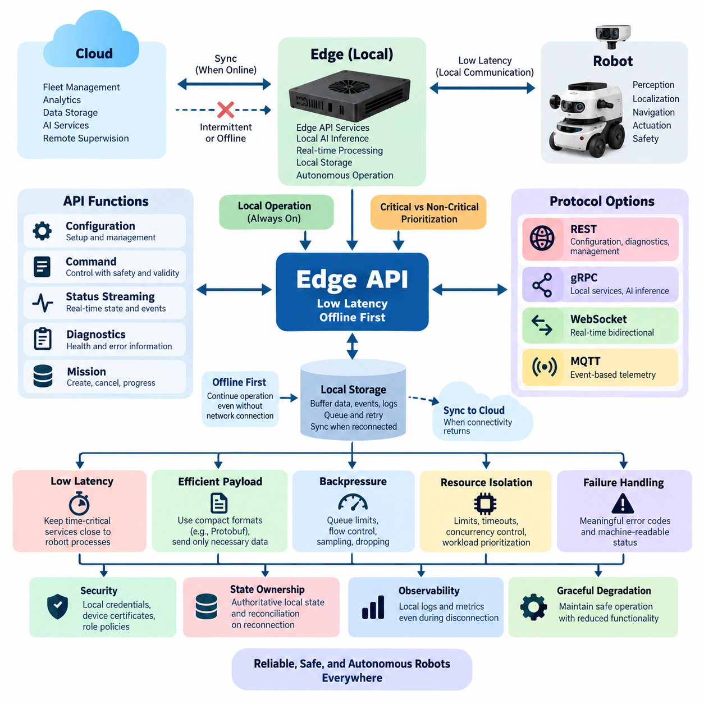
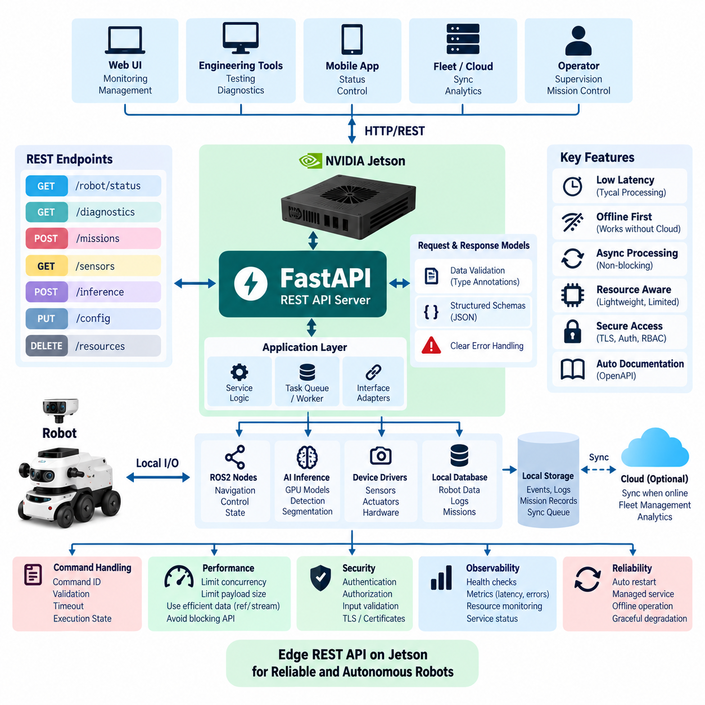
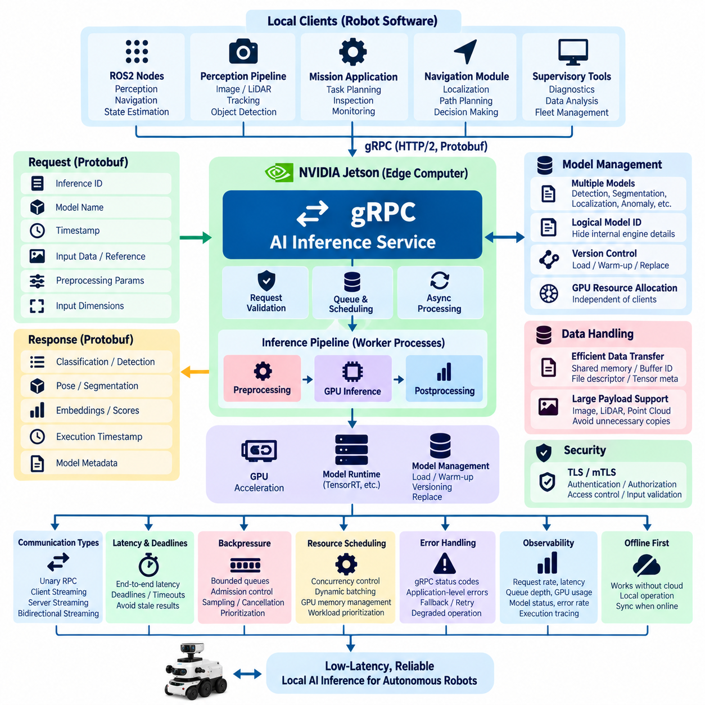
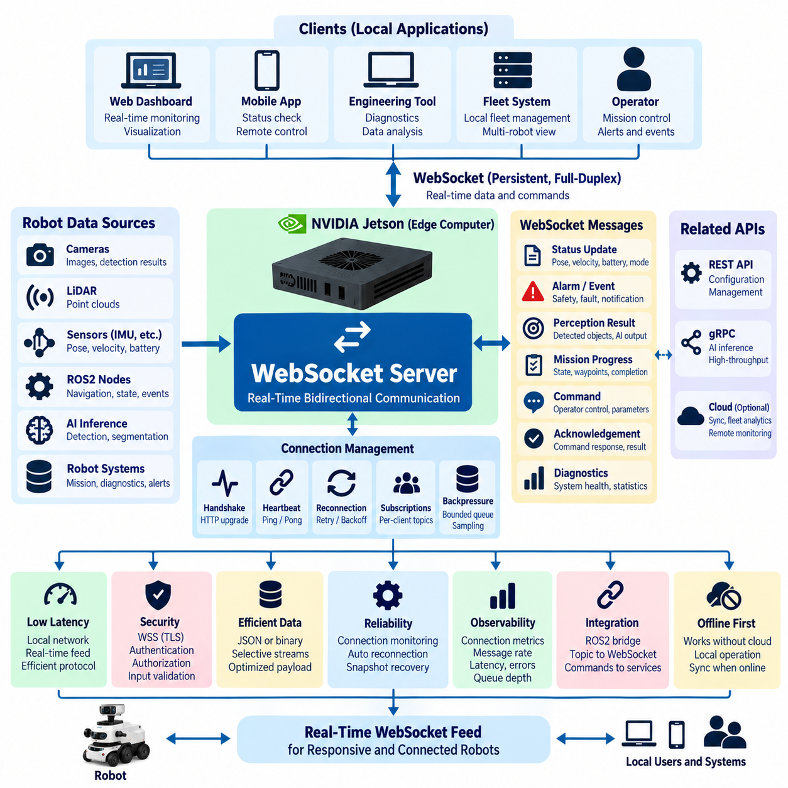
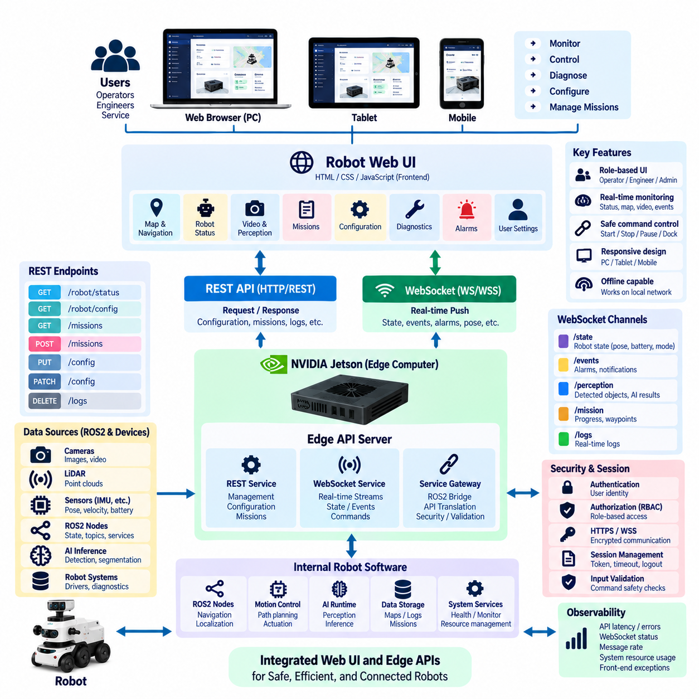
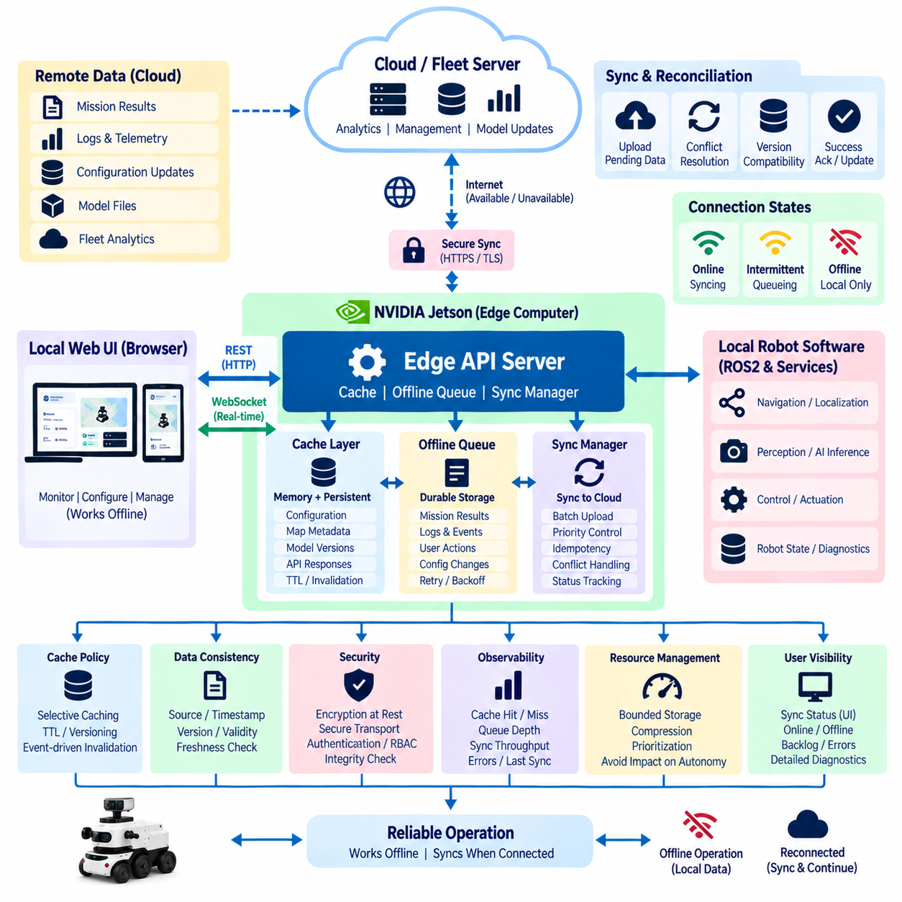
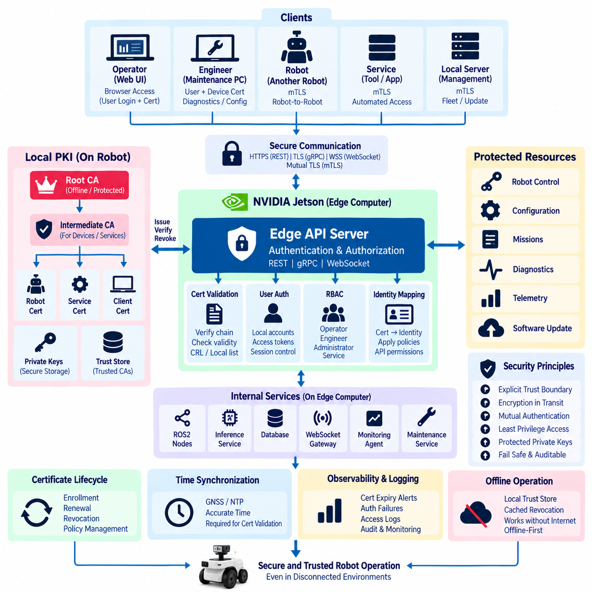
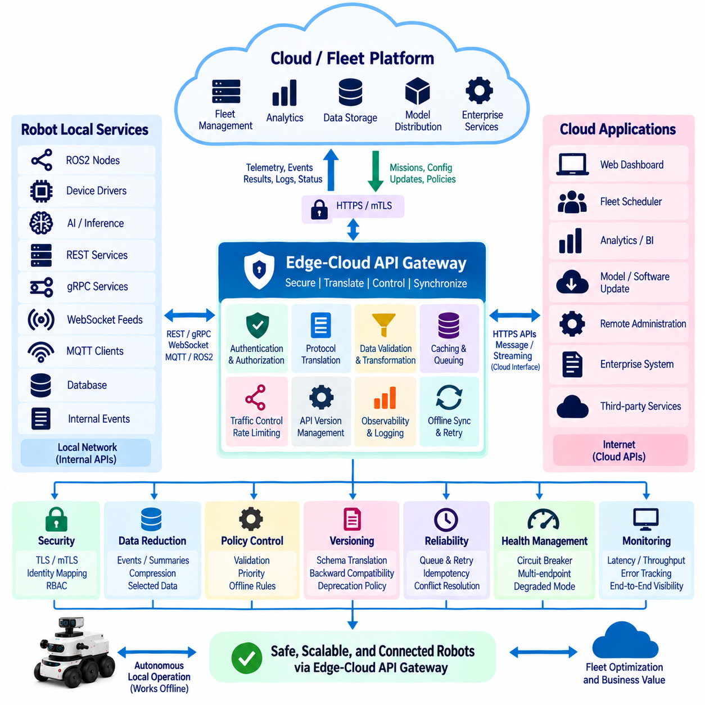
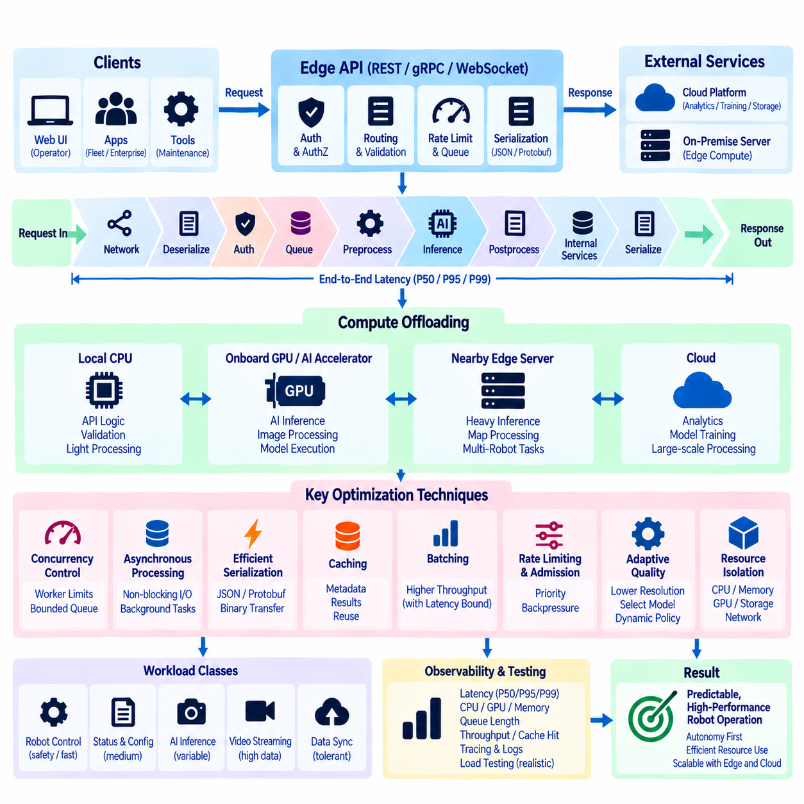
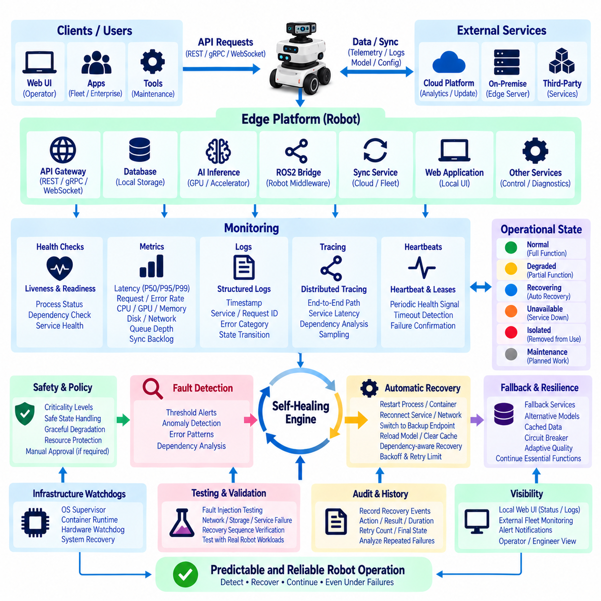

**Volume 06 Robot Communication and APIs**


# 08. Edge APIs

##  

## 08.01 Edge API Design Principles: Low Latency / Offline First

{width="7.268055555555556in" height="7.268055555555556in"}

Edge APIs in robotics are designed around a fundamentally different operating assumption from conventional cloud APIs: the robot must continue to function safely and predictably even when external connectivity is slow, intermittent, or completely unavailable. The API therefore becomes part of the robot's local operational infrastructure rather than merely an interface to a remote service. Low latency, deterministic behavior, bounded resource consumption, and offline autonomy become primary architectural requirements.

Low-latency design begins by placing time-critical API services physically and logically close to the processes that consume them. Perception results, localization estimates, navigation commands, actuator requests, safety states, and local AI inference should normally remain inside the robot or nearby edge computer. Sending these interactions through a remote cloud introduces network delay, jitter, packet loss, and dependency on external infrastructure that cannot be assumed to remain available during physical operation.

An edge API should distinguish hard operational paths from supervisory and informational paths. A command affecting motion or immediate robot behavior may require millisecond-scale processing, while mission history, diagnostics, analytics, or configuration synchronization can tolerate substantially greater delay. Treating all API traffic identically wastes resources and can allow noncritical workloads to interfere with control-related communication. Priority separation therefore becomes an architectural property rather than simply a network optimization.

Offline-first design assumes disconnection before it assumes connectivity. Instead of considering network failure an exceptional state, the system treats cloud access as an intermittently available capability. Essential robot functions, including local navigation, safety supervision, mission execution, state estimation, and selected inference services, should continue without cloud APIs. This principle aligns edge communication with the broader cloud-edge architecture while clearly separating local operational authority from remote services.

Local persistence is essential to this model. When an edge application produces telemetry, events, diagnostic records, mission updates, or inspection results while disconnected, the information should be written to durable local storage rather than discarded. A synchronization component can later forward the buffered information when connectivity returns. The API architecture therefore requires explicit policies for queues, storage limits, expiration, retry intervals, ordering, deduplication, and recovery from partially completed transfers.

Commands require more careful treatment than telemetry because replaying an old command can create physical consequences. Edge APIs should attach identifiers, timestamps, validity intervals, sequence information, and execution state to operational requests. Idempotent operations should be preferred wherever practical so that retransmission does not unintentionally repeat an action. Commands that are no longer valid after reconnection must expire locally rather than being executed merely because they eventually reached the robot.

State ownership must also be explicit. The edge should maintain an authoritative representation of operational state required for immediate robot behavior, while cloud and fleet systems may maintain synchronized representations for supervision and coordination. During disconnection these representations naturally diverge. Reconnection therefore requires reconciliation rules based on version numbers, timestamps, sequence counters, state-machine transitions, or domain-specific conflict policies rather than assuming that the newest network message is automatically correct.

Protocol selection should reflect the communication pattern rather than enforce one technology everywhere. REST is convenient for configuration, diagnostics, management, and resource-oriented operations. gRPC provides compact strongly typed communication suitable for local services and AI inference interfaces. WebSocket supports continuous bidirectional status exchange, while MQTT is effective for event-oriented telemetry and asynchronous messaging. A practical edge platform can expose several protocols behind a consistent domain model instead of forcing one protocol onto every workload.

Serialization and payload design directly influence latency on constrained edge computers. Large JSON structures, repeated metadata, unnecessary image encoding, and excessive object conversion increase CPU load, memory allocation, bandwidth consumption, and tail latency. Binary formats such as Protocol Buffers can reduce overhead for high-frequency internal interfaces, while human-readable JSON remains useful for administration and debugging. Payloads should carry only information required by the consumer and should avoid repeatedly transmitting unchanged state.

Edge APIs must incorporate backpressure because sensors and AI pipelines can generate information faster than consumers can process it. Camera detections, LiDAR-derived objects, localization updates, and diagnostic events may arrive at very different rates. Without bounded queues and flow control, temporary overload can evolve into memory exhaustion and system instability. APIs should define queue capacities, sampling policies, message dropping rules, aggregation behavior, and consumer acknowledgement according to the operational importance of each data stream.

Resource isolation is equally important because an edge computer commonly executes perception, localization, planning, inference, logging, networking, and API services simultaneously. An API request should not be allowed to consume unlimited CPU time, GPU memory, RAM, threads, file descriptors, or storage bandwidth. Timeouts, concurrency limits, request-size limits, process isolation, and workload prioritization help ensure that management traffic or an expensive inference request cannot degrade navigation or safety-critical functions.

Failure handling should expose meaningful operational semantics instead of returning only generic communication errors. Clients need to distinguish unavailable hardware, stale sensor information, overloaded inference services, rejected commands, expired requests, degraded localization, disconnected cloud services, and safety-related inhibition. Structured error codes and machine-readable status information allow local applications to choose appropriate recovery behavior without depending on fragile interpretation of textual error messages.

Security must remain effective without permanent access to a remote identity provider. Edge systems may therefore require locally verifiable credentials, cached authorization information, device certificates, protected keys, and local role policies. Authentication failure must not force unsafe behavior, but disconnection must also not silently disable authorization. Security design should establish which operations remain available offline, which require stronger credentials, and which must wait until trusted infrastructure becomes reachable again.

Observability should also operate locally. Request latency, timeout frequency, queue depth, dropped messages, synchronization backlog, CPU and memory pressure, storage consumption, service health, and connectivity state should be measurable even during a network outage. Local logs and metrics can later be synchronized to fleet or cloud platforms, preserving evidence about events that occurred while the robot was isolated and enabling reconstruction of failures after connectivity is restored.

Graceful degradation connects these principles into an operational strategy. Loss of cloud connectivity should first remove cloud-dependent enhancements rather than immediately stopping the robot. Loss of a nonessential edge service may reduce perception quality or analytics capability while preserving safe motion. Failure of a service required for safe operation, however, should trigger a defined degraded or safe state. The API contract must communicate these capability transitions clearly to every dependent component.

The resulting edge API architecture is therefore not simply a smaller cloud API deployed on a robot. It is a local autonomy boundary designed around physical consequences, uncertain networks, constrained computation, persistent state, and predictable recovery. Low latency determines where computation and communication occur, while offline-first design determines how state and services survive disconnection. Together they allow the robot to remain operational locally while still participating in cloud, fleet, and enterprise systems whenever connectivity is available.

로봇공학(Robotics)의 엣지 API(Edge API)는 기존 클라우드 API(Cloud API)와 근본적으로 다른 운영 가정을 기반으로 설계된다. 로봇은 외부 연결이 느리거나 간헐적이거나 완전히 사용할 수 없는 상황에서도 안전하고 예측 가능하게 계속 동작해야 한다. 따라서 API는 단순한 원격 서비스 인터페이스가 아니라 로봇의 로컬 운영 인프라(Local Operational Infrastructure)의 일부가 된다. 낮은 지연시간(Low Latency), 결정론적 동작(Deterministic Behavior), 제한된 자원 소비(Bounded Resource Consumption), 오프라인 자율성(Offline Autonomy)이 핵심 설계 요구사항이 된다.

낮은 지연시간 설계(Low-Latency Design)는 시간에 민감한 API 서비스를 이를 사용하는 프로세스와 물리적·논리적으로 가까운 위치에 배치하는 것에서 시작한다. 인식 결과(Perception Results), 위치추정 값(Localization Estimates), 내비게이션 명령(Navigation Commands), 액추에이터 요청(Actuator Requests), 안전 상태(Safety States), 로컬 AI 추론(Local AI Inference)은 일반적으로 로봇 또는 인접 엣지 컴퓨터(Edge Computer) 내부에서 처리되어야 한다. 이러한 상호작용을 원격 클라우드를 통해 처리하면 네트워크 지연(Network Delay), 지터(Jitter), 패킷 손실(Packet Loss), 외부 인프라 의존성이 발생할 수 있다.

엣지 API(Edge API)는 핵심 운영 경로(Hard Operational Path)와 감독·정보 경로(Supervisory and Informational Path)를 구분해야 한다. 모션(Motion)이나 즉각적인 로봇 동작에 영향을 미치는 명령은 밀리초 단위의 처리가 필요할 수 있지만, 임무 이력(Mission History), 진단(Diagnostics), 분석(Analytics), 구성 동기화(Configuration Synchronization)는 훨씬 큰 지연을 허용할 수 있다. 모든 API 트래픽을 동일하게 처리하면 자원이 낭비되고 비핵심 워크로드(Noncritical Workload)가 제어 관련 통신을 방해할 수 있으므로 우선순위 분리(Priority Separation)는 중요한 아키텍처 특성이 된다.

오프라인 우선 설계(Offline-First Design)는 연결성을 먼저 가정하는 대신 연결 단절(Disconnection)을 기본적인 운영 조건으로 고려한다. 네트워크 장애(Network Failure)를 예외적인 상태로 취급하지 않고 클라우드 접근(Cloud Access)을 간헐적으로 사용할 수 있는 기능으로 취급한다. 로컬 내비게이션(Local Navigation), 안전 감독(Safety Supervision), 임무 실행(Mission Execution), 상태 추정(State Estimation), 일부 추론 서비스(Inference Services)를 포함한 필수 로봇 기능은 클라우드 API가 없어도 계속 동작해야 한다. 이를 통해 로컬 운영 권한(Local Operational Authority)과 원격 서비스(Remote Services)를 명확하게 분리할 수 있다.

로컬 영속성(Local Persistence)은 이러한 모델의 핵심 요소이다. 엣지 애플리케이션(Edge Application)이 연결되지 않은 상태에서 텔레메트리(Telemetry), 이벤트(Event), 진단 기록(Diagnostic Records), 임무 업데이트(Mission Updates), 검사 결과(Inspection Results)를 생성하면 해당 정보를 폐기하지 않고 내구성 있는 로컬 저장소(Durable Local Storage)에 기록해야 한다. 이후 연결이 복구되면 동기화 구성요소(Synchronization Component)가 버퍼링된 정보를 전송한다. 따라서 API 아키텍처에는 큐(Queue), 저장 한도(Storage Limit), 만료(Expiration), 재시도 간격(Retry Interval), 순서 보장(Ordering), 중복 제거(Deduplication), 부분 전송 복구(Partial Transfer Recovery)에 대한 명확한 정책이 필요하다.

명령(Command)은 텔레메트리보다 신중하게 처리해야 한다. 오래된 명령이 재실행되면 실제 물리적 결과(Physical Consequence)가 발생할 수 있기 때문이다. 엣지 API는 운영 요청에 식별자(Identifier), 타임스탬프(Timestamp), 유효 기간(Validity Interval), 시퀀스 정보(Sequence Information), 실행 상태(Execution State)를 포함해야 한다. 가능한 경우 멱등 연산(Idempotent Operation)을 사용하여 재전송이 의도하지 않은 반복 동작을 발생시키지 않도록 해야 한다. 재연결 이후 더 이상 유효하지 않은 명령은 로봇에 늦게 도착했다는 이유만으로 실행되지 않고 로컬에서 만료되어야 한다.

상태 소유권(State Ownership) 역시 명확하게 정의해야 한다. 엣지(Edge)는 즉각적인 로봇 동작에 필요한 운영 상태(Operational State)의 권위 있는 표현(Authoritative Representation)을 유지하고, 클라우드 및 플릿 시스템(Fleet System)은 감독과 협업을 위한 동기화된 상태를 유지할 수 있다. 연결이 끊어지면 이러한 상태 표현은 자연스럽게 서로 달라진다. 따라서 재연결 시 단순히 가장 최근에 수신된 메시지를 사용하는 것이 아니라 버전 번호(Version Number), 타임스탬프(Timestamp), 시퀀스 카운터(Sequence Counter), 상태 머신 전이(State-Machine Transition), 도메인별 충돌 정책(Domain-Specific Conflict Policy)을 기반으로 상태를 조정해야 한다.

프로토콜 선택(Protocol Selection)은 하나의 기술을 모든 통신에 강제하기보다 통신 패턴(Communication Pattern)에 따라 결정해야 한다. REST는 구성(Configuration), 진단(Diagnostics), 관리(Management), 자원 중심 연산(Resource-Oriented Operation)에 적합하다. gRPC는 로컬 서비스(Local Service)와 AI 추론 인터페이스(AI Inference Interface)에 적합한 간결하고 강타입(Strongly Typed) 기반의 통신을 제공한다. 웹소켓(WebSocket)은 지속적인 양방향 상태 교환을 지원하며, MQTT는 이벤트 중심 텔레메트리(Event-Oriented Telemetry)와 비동기 메시징(Asynchronous Messaging)에 효과적이다. 실용적인 엣지 플랫폼은 일관된 도메인 모델(Domain Model)을 기반으로 여러 프로토콜을 함께 제공할 수 있다.

직렬화(Serialization)와 페이로드 설계(Payload Design)는 자원이 제한된 엣지 컴퓨터에서 지연시간에 직접적인 영향을 미친다. 대규모 JSON 구조, 반복되는 메타데이터(Metadata), 불필요한 이미지 인코딩(Image Encoding), 과도한 객체 변환(Object Conversion)은 CPU 부하, 메모리 할당, 대역폭 사용량, 꼬리 지연시간(Tail Latency)을 증가시킨다. 프로토콜 버퍼(Protocol Buffers)와 같은 바이너리 형식(Binary Format)은 고주파 내부 인터페이스의 오버헤드를 줄일 수 있으며, 사람이 읽을 수 있는 JSON은 관리와 디버깅(Debugging)에 유용하다. 페이로드는 소비자가 실제로 필요로 하는 정보만 포함하고 변경되지 않은 상태의 반복 전송을 최소화해야 한다.

엣지 API에는 역압(Backpressure) 처리가 필요하다. 센서와 AI 파이프라인(AI Pipeline)이 소비자가 처리할 수 있는 속도보다 빠르게 정보를 생성할 수 있기 때문이다. 카메라 검출(Camera Detection), 라이다 기반 객체(LiDAR-Derived Object), 위치추정 업데이트(Localization Update), 진단 이벤트(Diagnostic Event)는 서로 매우 다른 주기로 발생한다. 제한된 큐(Bounded Queue)와 흐름 제어(Flow Control)가 없다면 일시적인 과부하가 메모리 고갈과 시스템 불안정으로 발전할 수 있다. 따라서 API는 데이터 스트림의 운영 중요도에 따라 큐 용량, 샘플링 정책(Sampling Policy), 메시지 폐기 규칙(Message Dropping Rule), 집계 방식(Aggregation), 소비자 승인(Consumer Acknowledgement)을 정의해야 한다.

자원 격리(Resource Isolation) 역시 중요하다. 하나의 엣지 컴퓨터에서 인식(Perception), 위치추정(Localization), 계획(Planning), 추론(Inference), 로깅(Logging), 네트워킹(Networking), API 서비스가 동시에 실행되는 경우가 많기 때문이다. 하나의 API 요청이 CPU 시간, GPU 메모리, RAM, 스레드(Thread), 파일 디스크립터(File Descriptor), 저장장치 대역폭을 무제한으로 소비해서는 안 된다. 타임아웃(Timeout), 동시성 제한(Concurrency Limit), 요청 크기 제한(Request-Size Limit), 프로세스 격리(Process Isolation), 워크로드 우선순위(Workload Prioritization)를 적용하여 관리 트래픽이나 고비용 추론 요청이 내비게이션 또는 안전 핵심 기능을 저하시키지 않도록 해야 한다.

장애 처리(Failure Handling)는 일반적인 통신 오류만 반환하는 대신 의미 있는 운영 시맨틱(Operational Semantics)을 제공해야 한다. 클라이언트는 사용할 수 없는 하드웨어(Unavailable Hardware), 오래된 센서 정보(Stale Sensor Information), 과부하된 추론 서비스(Overloaded Inference Service), 거부된 명령(Rejected Command), 만료된 요청(Expired Request), 저하된 위치추정(Degraded Localization), 클라우드 연결 단절(Disconnected Cloud Service), 안전 관련 동작 억제(Safety-Related Inhibition)를 구별할 수 있어야 한다. 구조화된 오류 코드(Structured Error Code)와 기계 판독형 상태 정보(Machine-Readable Status Information)는 로컬 애플리케이션이 텍스트 오류 해석에 의존하지 않고 적절한 복구 동작을 선택하도록 한다.

보안(Security)은 원격 신원 제공자(Remote Identity Provider)에 지속적으로 접근할 수 없는 상황에서도 유지되어야 한다. 따라서 엣지 시스템은 로컬에서 검증 가능한 자격 증명(Locally Verifiable Credentials), 캐시된 권한 정보(Cached Authorization Information), 장치 인증서(Device Certificate), 보호된 키(Protected Key), 로컬 역할 정책(Local Role Policy)을 필요로 할 수 있다. 인증 실패(Authentication Failure)가 위험한 동작을 유발해서는 안 되지만, 연결 단절이 권한 부여(Authorization)를 자동으로 비활성화해서도 안 된다. 오프라인에서 허용되는 작업, 강화된 자격 증명이 필요한 작업, 신뢰할 수 있는 인프라가 복구될 때까지 대기해야 하는 작업을 명확하게 정의해야 한다.

관측 가능성(Observability) 역시 로컬에서 동작해야 한다. 요청 지연시간(Request Latency), 타임아웃 빈도(Timeout Frequency), 큐 깊이(Queue Depth), 폐기 메시지(Dropped Messages), 동기화 백로그(Synchronization Backlog), CPU 및 메모리 압력(Resource Pressure), 저장공간 사용량(Storage Consumption), 서비스 상태(Service Health), 연결 상태(Connectivity State)는 네트워크 장애 중에도 측정할 수 있어야 한다. 로컬 로그(Local Log)와 메트릭(Metric)은 이후 플릿 또는 클라우드 플랫폼으로 동기화하여 연결이 끊어진 동안 발생한 이벤트의 증거를 보존하고 장애 원인을 재구성할 수 있도록 한다.

점진적 성능 저하(Graceful Degradation)는 이러한 원칙들을 하나의 운영 전략으로 연결한다. 클라우드 연결이 손실되면 로봇 전체를 즉시 정지시키는 대신 먼저 클라우드 의존형 부가 기능(Cloud-Dependent Enhancement)을 제거해야 한다. 중요하지 않은 엣지 서비스가 손실되면 안전한 이동을 유지하면서 인식 품질이나 분석 기능을 제한할 수 있다. 반대로 안전한 운영에 필수적인 서비스가 실패하면 정의된 저하 상태(Degraded State) 또는 안전 상태(Safe State)로 전환해야 한다. API 계약(API Contract)은 이러한 기능 상태 전이(Capability Transition)를 모든 종속 구성요소에 명확하게 전달해야 한다.

결과적으로 엣지 API 아키텍처(Edge API Architecture)는 단순히 클라우드 API를 축소하여 로봇에 배치한 구조가 아니다. 이는 물리적 결과(Physical Consequences), 불확실한 네트워크(Uncertain Networks), 제한된 컴퓨팅 자원(Constrained Computation), 영속 상태(Persistent State), 예측 가능한 복구(Predictable Recovery)를 중심으로 설계된 로컬 자율성 경계(Local Autonomy Boundary)이다. 낮은 지연시간(Low Latency)은 계산과 통신이 어디에서 수행되어야 하는지를 결정하고, 오프라인 우선 설계(Offline-First Design)는 연결 단절 중 상태와 서비스가 어떻게 유지되어야 하는지를 결정한다. 두 원칙을 결합하면 로봇은 로컬에서 독립적으로 운영되면서 연결이 가능한 경우 클라우드, 플릿(Fleet), 엔터프라이즈 시스템(Enterprise System)과 지속적으로 협력할 수 있다.

##  

## 08.02 Edge REST API Server: FastAPI on Jetson [w/Code]

{width="7.268055555555556in" height="7.268055555555556in"}

FastAPI provides a practical framework for implementing REST API services directly on NVIDIA Jetson edge computers. In a robotics system, the Jetson commonly hosts perception, AI inference, navigation support, diagnostics, and device-management processes while operating close to sensors and actuators. A FastAPI server can expose these capabilities through structured HTTP endpoints, allowing local applications, robot controllers, engineering tools, and supervisory systems to interact with edge services through a consistent interface.

The primary architectural advantage of running the REST server on the Jetson is locality. Requests for robot status, configuration, diagnostics, sensor metadata, or AI inference can be processed without traversing a cloud network. This reduces communication latency and allows the API to remain available when external connectivity is degraded or unavailable. The design therefore extends the low-latency and offline-first principles of edge APIs by placing the service endpoint inside the robot's local computing environment.

A typical architecture separates the FastAPI layer from the underlying robotics functions. HTTP endpoints should not directly contain complex perception, control, or inference logic. Instead, the API layer validates requests, invokes application services, and converts internal results into stable response models. The application layer can communicate with ROS2 nodes, inference engines, local databases, device drivers, or dedicated processes while FastAPI remains responsible for external API semantics and HTTP communication.

FastAPI uses Python type annotations and data models to define request and response structures explicitly. Robot commands can therefore specify parameters such as command identifiers, target devices, requested actions, timestamps, and optional execution constraints. Status responses can represent operating modes, battery state, localization status, sensor availability, and service health. Explicit schemas reduce ambiguity between clients and edge services and make malformed requests easier to reject before they reach operational robot components.

Endpoint design should reflect robot resources and operations rather than expose implementation details. Paths such as \`/robot/status\`, \`/diagnostics\`, \`/missions\`, \`/sensors\`, or \`/inference\` provide meaningful resource boundaries. Read operations can use GET, creation or execution requests can use POST, modifications can use PUT or PATCH where appropriate, and DELETE can represent removal of suitable resources. Physical commands, however, require stronger semantics than ordinary web resources because retries or duplicated requests may cause real-world actions.

Command endpoints should consequently incorporate command identity, validation, timeout, and execution-state tracking. A request accepted by the FastAPI server does not necessarily mean that the physical action has completed. The server may return an accepted state and provide a separate status resource through which the client observes queued, running, completed, rejected, expired, or failed execution. Idempotency mechanisms are particularly valuable when clients may retry requests after temporary network interruptions without knowing whether the original command was received.

Asynchronous processing is useful because many edge operations involve waiting for other services rather than continuously executing Python code. FastAPI supports asynchronous endpoint handlers that can efficiently manage network communication, database access, message exchange, and other I/O-oriented tasks. However, computationally intensive AI inference, image processing, or numerical operations should not block the API event loop. Such workloads are better delegated to worker processes, inference services, ROS2 components, or GPU execution pipelines.

Jetson systems require explicit resource awareness because CPU cores, GPU capacity, memory, storage bandwidth, and thermal headroom are shared among multiple robotics workloads. The API server should remain lightweight relative to perception and control processes. Request concurrency, payload sizes, connection counts, timeouts, and worker configuration should therefore be bounded. Large camera frames or point clouds should not automatically be transferred through ordinary REST responses when references, compressed representations, streaming interfaces, or dedicated data channels can provide more efficient alternatives.

AI inference is a common edge API use case. A FastAPI endpoint may receive an image reference, region of interest, model identifier, or inference parameters and then invoke a local GPU-backed inference service. The response can return detected objects, classifications, poses, confidence values, segmentation metadata, or task-specific results. Separating the REST interface from the inference engine allows models and acceleration frameworks to evolve without forcing external clients to change whenever the internal implementation is modified.

REST is especially appropriate for management-oriented interactions, but it should not replace every communication mechanism inside the robot. High-frequency sensor streams and continuous control loops are generally better handled through ROS2, shared memory, gRPC streaming, WebSocket, or other real-time-oriented channels. FastAPI can instead expose configuration, snapshots, health information, mission operations, inference requests, and administrative functions. This division prevents convenient HTTP interfaces from becoming bottlenecks in time-critical data paths.

Local persistence supports reliable operation when the Jetson becomes disconnected from fleet or cloud infrastructure. API-generated events, mission records, diagnostic information, and synchronization metadata can be written to a local database or durable queue. When connectivity returns, a synchronization process can forward selected records upstream. The FastAPI server can expose synchronization state without making local robot functionality dependent on successful cloud communication, preserving the offline-first behavior expected from an edge architecture.

Error handling should distinguish HTTP transport semantics from robot operational semantics. Invalid input may produce an appropriate client error, while unavailable internal services, overloaded inference engines, missing sensors, expired commands, or unsafe robot states should be represented with structured application-level error information. Responses should include stable error identifiers and enough machine-readable context for clients to decide whether to retry, wait, request diagnostics, or stop an operation rather than relying only on human-readable messages.

Security remains necessary even when the REST API is intended primarily for a local network. The server should authenticate clients, authorize operations according to roles or capabilities, validate all external input, and protect sensitive endpoints. TLS can protect communication, while certificates, tokens, or locally managed credentials can establish identity. Particularly sensitive operations such as motion commands, configuration changes, software updates, or safety-related actions should receive stronger authorization controls than read-only telemetry and health queries.

FastAPI also supports automatic API documentation derived from declared routes and schemas, which is valuable during robot integration and testing. Developers can inspect available endpoints, understand request formats, and exercise selected operations without maintaining an entirely separate description of the interface. In production systems, however, documentation exposure and interactive testing capabilities should be controlled according to deployment policy so that engineering convenience does not unintentionally increase the accessible attack surface.

Deployment on Jetson should treat the API as a managed service rather than an manually launched development process. The FastAPI application can run behind an ASGI server and be supervised by the operating system, a container runtime, or another service manager. Startup dependencies, restart policies, health checks, logs, environment configuration, and model or device availability should be defined explicitly. The service should recover predictably after reboot or failure without requiring manual intervention from an operator.

Health and observability endpoints provide visibility into both the API and the services behind it. A basic liveness check can indicate whether the server process is running, while readiness checks can verify dependencies such as ROS2 interfaces, local databases, sensors, or inference services. Metrics for request latency, error rates, active connections, queue depth, CPU and memory consumption, and inference duration help determine whether the Jetson is approaching resource limits or experiencing degraded operation.

The resulting FastAPI-on-Jetson architecture creates a clean boundary between local robot capabilities and applications that need to access them. FastAPI supplies structured REST semantics, schema validation, asynchronous request handling, and API documentation, while the Jetson provides proximity to sensors, robot software, and accelerated AI computation. When combined with bounded resources, local persistence, secure access, explicit failure handling, and separation of time-critical communication paths, this approach provides a practical foundation for maintainable edge robot services.

FastAPI는 NVIDIA 젯슨(Jetson) 엣지 컴퓨터(Edge Computer)에서 직접 REST API 서비스를 구현하기 위한 실용적인 프레임워크(Framework)를 제공한다. 로봇 시스템에서 젯슨은 일반적으로 인식(Perception), AI 추론(AI Inference), 내비게이션 지원(Navigation Support), 진단(Diagnostics), 장치 관리(Device Management) 프로세스를 센서와 액추에이터 가까이에서 실행한다. FastAPI 서버는 이러한 기능을 구조화된 HTTP 엔드포인트(Endpoint)로 제공하여 로컬 애플리케이션, 로봇 컨트롤러, 엔지니어링 도구 및 감독 시스템이 일관된 인터페이스를 통해 엣지 서비스와 상호작용하도록 한다.

젯슨에서 REST 서버를 실행하는 주요 아키텍처적 장점은 로컬성(Locality)이다. 로봇 상태, 구성(Configuration), 진단, 센서 메타데이터(Sensor Metadata), AI 추론에 대한 요청을 클라우드 네트워크를 거치지 않고 처리할 수 있다. 이는 통신 지연시간(Communication Latency)을 줄이고 외부 연결이 저하되거나 사용할 수 없는 경우에도 API를 유지할 수 있게 한다. 따라서 이 설계는 서비스 엔드포인트를 로봇의 로컬 컴퓨팅 환경에 배치함으로써 엣지 API의 낮은 지연시간(Low Latency) 및 오프라인 우선(Offline-First) 원칙을 확장한다.

일반적인 아키텍처에서는 FastAPI 계층(Layer)과 기반 로봇 기능을 분리한다. HTTP 엔드포인트 내부에 복잡한 인식, 제어(Control), 추론 로직을 직접 포함해서는 안 된다. 대신 API 계층은 요청을 검증하고 애플리케이션 서비스(Application Service)를 호출한 후 내부 결과를 안정적인 응답 모델(Response Model)로 변환한다. 애플리케이션 계층은 ROS2 노드(Node), 추론 엔진(Inference Engine), 로컬 데이터베이스(Local Database), 장치 드라이버(Device Driver), 전용 프로세스와 통신하고 FastAPI는 외부 API 시맨틱(API Semantics)과 HTTP 통신을 담당한다.

FastAPI는 파이썬 타입 어노테이션(Python Type Annotation)과 데이터 모델(Data Model)을 사용하여 요청 및 응답 구조를 명시적으로 정의한다. 따라서 로봇 명령에는 명령 식별자(Command Identifier), 대상 장치(Target Device), 요청 동작(Requested Action), 타임스탬프(Timestamp), 선택적인 실행 제약조건(Execution Constraint) 등의 매개변수를 지정할 수 있다. 상태 응답은 운영 모드(Operating Mode), 배터리 상태, 위치추정 상태(Localization Status), 센서 가용성(Sensor Availability), 서비스 상태(Service Health)를 표현할 수 있다. 명시적인 스키마(Schema)는 클라이언트와 엣지 서비스 사이의 모호성을 줄이고 잘못된 요청이 실제 로봇 구성요소에 도달하기 전에 거부할 수 있도록 한다.

엔드포인트 설계(Endpoint Design)는 내부 구현 세부사항을 노출하기보다 로봇의 자원(Resource)과 동작(Operation)을 반영해야 한다. \`/robot/status\`, \`/diagnostics\`, \`/missions\`, \`/sensors\`, \`/inference\`와 같은 경로는 의미 있는 자원 경계를 제공한다. 조회 작업은 GET, 생성 또는 실행 요청은 POST, 수정은 상황에 따라 PUT 또는 PATCH를 사용할 수 있으며 DELETE는 적절한 자원의 제거를 나타낼 수 있다. 그러나 물리적 명령(Physical Command)은 요청 재시도나 중복이 실제 동작을 발생시킬 수 있으므로 일반적인 웹 자원보다 강력한 시맨틱이 필요하다.

따라서 명령 엔드포인트(Command Endpoint)는 명령 식별성(Command Identity), 검증(Validation), 타임아웃(Timeout), 실행 상태 추적(Execution-State Tracking)을 포함해야 한다. FastAPI 서버가 요청을 수락했다고 해서 실제 물리적 동작이 완료되었다는 의미는 아니다. 서버는 수락 상태(Accepted State)를 반환한 후 별도의 상태 자원을 통해 클라이언트가 대기(Queued), 실행 중(Running), 완료(Completed), 거부(Rejected), 만료(Expired), 실패(Failed) 상태를 확인하도록 할 수 있다. 멱등성(Idempotency) 메커니즘은 클라이언트가 최초 명령의 수신 여부를 알 수 없는 일시적인 네트워크 장애 이후 요청을 재시도할 때 특히 중요하다.

비동기 처리(Asynchronous Processing)는 많은 엣지 작업이 파이썬 코드를 지속적으로 실행하기보다 다른 서비스의 응답을 기다리는 과정과 관련되므로 유용하다. FastAPI는 네트워크 통신, 데이터베이스 접근, 메시지 교환 및 기타 입출력 중심 작업(I/O-Oriented Task)을 효율적으로 처리할 수 있는 비동기 엔드포인트 핸들러(Asynchronous Endpoint Handler)를 지원한다. 그러나 계산 집약적인 AI 추론, 이미지 처리(Image Processing), 수치 연산(Numerical Operation)이 API 이벤트 루프(Event Loop)를 차단해서는 안 된다. 이러한 워크로드는 워커 프로세스(Worker Process), 추론 서비스, ROS2 구성요소 또는 GPU 실행 파이프라인으로 위임하는 것이 적절하다.

젯슨 시스템에서는 CPU 코어, GPU 용량, 메모리, 저장장치 대역폭(Storage Bandwidth), 열적 여유(Thermal Headroom)를 여러 로봇 워크로드가 공유하므로 명시적인 자원 관리(Resource Awareness)가 필요하다. API 서버는 인식 및 제어 프로세스에 비해 가볍게 유지되어야 한다. 따라서 요청 동시성(Request Concurrency), 페이로드 크기(Payload Size), 연결 수(Connection Count), 타임아웃, 워커 설정(Worker Configuration)을 제한해야 한다. 대규모 카메라 프레임이나 포인트 클라우드(Point Cloud)는 참조 정보, 압축 표현(Compressed Representation), 스트리밍 인터페이스 또는 전용 데이터 채널이 더 효율적일 경우 일반적인 REST 응답을 통해 직접 전송하지 않는 것이 바람직하다.

AI 추론은 대표적인 엣지 API 활용 사례이다. FastAPI 엔드포인트는 이미지 참조(Image Reference), 관심 영역(Region of Interest), 모델 식별자(Model Identifier), 추론 매개변수(Inference Parameter)를 입력받아 로컬 GPU 기반 추론 서비스(GPU-Backed Inference Service)를 호출할 수 있다. 응답은 검출 객체(Detected Object), 분류(Classification), 자세(Pose), 신뢰도(Confidence), 세그멘테이션 메타데이터(Segmentation Metadata) 또는 작업별 결과를 반환할 수 있다. REST 인터페이스와 추론 엔진을 분리하면 내부 구현이 변경되더라도 외부 클라이언트 변경을 최소화하면서 모델과 가속 프레임워크(Acceleration Framework)를 발전시킬 수 있다.

REST는 특히 관리 중심 상호작용(Management-Oriented Interaction)에 적합하지만 로봇 내부의 모든 통신 메커니즘을 대체해서는 안 된다. 고주파 센서 스트림(High-Frequency Sensor Stream)과 연속 제어 루프(Continuous Control Loop)는 일반적으로 ROS2, 공유 메모리(Shared Memory), gRPC 스트리밍(gRPC Streaming), 웹소켓(WebSocket) 또는 다른 실시간 지향 채널을 통해 처리하는 것이 적절하다. FastAPI는 구성, 스냅샷(Snapshot), 상태 정보, 임무 작업(Mission Operation), 추론 요청 및 관리 기능을 제공할 수 있다. 이러한 역할 분리는 편리한 HTTP 인터페이스가 시간에 민감한 데이터 경로의 병목(Bottleneck)이 되는 것을 방지한다.

로컬 영속성(Local Persistence)은 젯슨이 플릿(Fleet) 또는 클라우드 인프라와 연결되지 않았을 때에도 안정적인 운영을 지원한다. API에서 생성된 이벤트, 임무 기록(Mission Record), 진단 정보, 동기화 메타데이터(Synchronization Metadata)를 로컬 데이터베이스나 내구성 있는 큐(Durable Queue)에 기록할 수 있다. 연결이 복구되면 동기화 프로세스(Synchronization Process)가 선택된 기록을 상위 시스템으로 전달할 수 있다. FastAPI 서버는 로컬 로봇 기능이 성공적인 클라우드 통신에 종속되지 않도록 하면서 동기화 상태를 제공함으로써 엣지 아키텍처에서 요구되는 오프라인 우선 동작을 유지할 수 있다.

오류 처리(Error Handling)는 HTTP 전송 시맨틱(Transport Semantics)과 로봇 운영 시맨틱(Operational Semantics)을 구분해야 한다. 잘못된 입력은 적절한 클라이언트 오류(Client Error)를 발생시킬 수 있으며, 사용할 수 없는 내부 서비스, 과부하된 추론 엔진, 누락된 센서, 만료된 명령 또는 안전하지 않은 로봇 상태는 구조화된 애플리케이션 수준 오류 정보(Application-Level Error Information)로 표현해야 한다. 응답에는 안정적인 오류 식별자(Error Identifier)와 기계 판독형 컨텍스트(Machine-Readable Context)를 포함하여 클라이언트가 단순한 사람이 읽는 메시지에 의존하지 않고 재시도, 대기, 진단 요청 또는 동작 중지 여부를 결정하도록 해야 한다.

REST API가 주로 로컬 네트워크(Local Network)를 대상으로 하더라도 보안(Security)은 반드시 필요하다. 서버는 클라이언트를 인증(Authentication)하고 역할(Role)이나 권한(Capability)에 따라 작업을 인가(Authorization)하며 모든 외부 입력을 검증하고 민감한 엔드포인트를 보호해야 한다. TLS를 통해 통신을 보호할 수 있으며 인증서(Certificate), 토큰(Token), 로컬 관리 자격 증명(Locally Managed Credential)을 사용하여 신원을 확인할 수 있다. 모션 명령(Motion Command), 구성 변경, 소프트웨어 업데이트 또는 안전 관련 작업과 같은 민감한 기능에는 읽기 전용 텔레메트리나 상태 조회보다 강화된 인가 제어가 적용되어야 한다.

FastAPI는 선언된 라우트(Route)와 스키마에서 자동으로 생성되는 API 문서화(Automatic API Documentation)도 지원하며 이는 로봇 통합 및 테스트 과정에서 유용하다. 개발자는 별도의 인터페이스 설명서를 완전히 독립적으로 관리하지 않고도 사용 가능한 엔드포인트를 확인하고 요청 형식을 이해하며 선택한 작업을 시험할 수 있다. 그러나 운영 시스템(Production System)에서는 엔지니어링 편의성이 의도하지 않게 공격 표면(Attack Surface)을 확대하지 않도록 배포 정책에 따라 문서 공개와 대화형 테스트(Interactive Testing) 기능을 제어해야 한다.

젯슨에서의 배포(Deployment)는 API를 개발자가 수동으로 실행하는 프로세스가 아니라 관리되는 서비스(Managed Service)로 취급해야 한다. FastAPI 애플리케이션은 ASGI 서버를 기반으로 실행하고 운영체제, 컨테이너 런타임(Container Runtime) 또는 다른 서비스 관리자(Service Manager)를 통해 감독할 수 있다. 시작 의존성(Startup Dependency), 재시작 정책(Restart Policy), 상태 확인(Health Check), 로그, 환경 구성(Environment Configuration), 모델 및 장치 가용성을 명확하게 정의해야 한다. 재부팅이나 장애 이후에도 운영자의 수동 개입 없이 서비스가 예측 가능한 방식으로 복구되어야 한다.

상태 확인 및 관측 가능성 엔드포인트(Health and Observability Endpoint)는 API 자체뿐만 아니라 API 뒤에서 실행되는 서비스의 상태도 확인할 수 있게 한다. 기본 생존성 확인(Liveness Check)은 서버 프로세스가 실행 중인지 나타내며, 준비 상태 확인(Readiness Check)은 ROS2 인터페이스, 로컬 데이터베이스, 센서 또는 추론 서비스와 같은 의존성을 검증할 수 있다. 요청 지연시간, 오류율(Error Rate), 활성 연결(Active Connection), 큐 깊이(Queue Depth), CPU 및 메모리 사용량, 추론 시간을 측정하면 젯슨이 자원 한계에 접근하고 있는지 또는 성능 저하 상태에 있는지를 판단할 수 있다.

결과적으로 젯슨 기반 FastAPI(FastAPI-on-Jetson) 아키텍처는 로컬 로봇 기능과 이를 사용해야 하는 애플리케이션 사이에 명확한 경계(Boundary)를 형성한다. FastAPI는 구조화된 REST 시맨틱, 스키마 검증(Schema Validation), 비동기 요청 처리, API 문서화를 제공하고 젯슨은 센서, 로봇 소프트웨어 및 가속 AI 연산(Accelerated AI Computation)에 대한 물리적 근접성을 제공한다. 제한된 자원 관리, 로컬 영속성, 안전한 접근(Secure Access), 명시적인 장애 처리, 시간 핵심 통신 경로의 분리를 함께 적용하면 유지보수 가능한 엣지 로봇 서비스(Edge Robot Service)를 구축하기 위한 실용적인 기반을 제공할 수 있다.

##  

## 08.03 Edge gRPC Service: Local AI Inference API [w/Code]

{width="7.268055555555556in" height="7.268055555555556in"}

gRPC is well suited to local AI inference services on edge robots because it provides strongly typed interfaces, compact Protocol Buffers serialization, HTTP/2 transport, and efficient request-response or streaming communication. Instead of embedding every AI model directly inside perception, navigation, or application processes, an edge computer can expose inference as an independent local service. Robot software then accesses GPU-accelerated intelligence through a stable API contract while model implementation remains isolated behind the service boundary.

A typical architecture places the gRPC inference server on the robot's Jetson or another GPU-equipped edge computer. Local clients may include ROS2 nodes, perception pipelines, mission applications, navigation components, or supervisory processes. These clients submit structured inference requests over the local network or loopback interface, and the server executes models using the available accelerator. Keeping this communication local avoids cloud round trips and supports predictable operation when external connectivity is unavailable.

The service contract is normally defined using Protocol Buffers. A request message can contain an inference identifier, model name, timestamp, input dimensions, preprocessing parameters, and either embedded data or a reference to locally accessible data. Response messages can represent classifications, detected objects, poses, segmentation results, embeddings, confidence scores, execution timestamps, and model metadata. Explicit schemas establish a language-independent interface between AI services and robot applications.

Unary RPC is appropriate when one request produces one inference result, such as object classification, image detection, pose estimation, or semantic analysis of a single frame. The client sends a request and receives one response after processing completes. This simple interaction model works particularly well for event-triggered inference, inspection tasks, diagnostic analysis, and application-level AI operations where requests occur independently rather than as a continuous high-frequency stream.

Streaming RPC becomes useful when inference operates continuously. A client-streaming interface can deliver successive inputs to a persistent inference service, while server streaming can return a sequence of results or intermediate updates. Bidirectional streaming allows inputs and inference outputs to flow concurrently over a long-lived connection. This avoids repeatedly establishing request context and can reduce communication overhead for camera perception, tracking, multimodal processing, or continuously updated robot intelligence.

Large sensor payloads require careful design even when Protocol Buffers are efficient. Continuously copying full-resolution camera frames, LiDAR point clouds, or multidimensional tensors through serialized RPC messages can consume substantial CPU time and memory bandwidth. For processes located on the same edge computer, the gRPC message may instead carry shared-memory references, buffer identifiers, file descriptors, tensor metadata, or other handles while the large underlying data follows an optimized local transport path.

AI inference should be separated from the gRPC communication thread so that expensive GPU execution does not block unrelated requests. The server can validate incoming messages, place accepted work into bounded queues, schedule inference according to model and priority, and return results asynchronously. Worker processes or dedicated inference runtimes can perform preprocessing, GPU execution, and postprocessing. This architecture keeps communication responsive even when individual models require substantial computational resources.

Model lifecycle management is an important part of the inference API. Edge systems may host several models for detection, segmentation, localization assistance, anomaly recognition, manipulation, or other Physical AI workloads. Requests should identify the required model or logical capability without forcing clients to know internal engine details. The service can map logical model identifiers to optimized implementations and manage loading, warm-up, version selection, GPU allocation, and controlled replacement independently of client applications.

Latency should be measured across the complete inference path rather than only GPU execution. Relevant stages include request serialization, transport, queue waiting, preprocessing, host-to-device transfer, inference, device-to-host transfer, postprocessing, response serialization, and return transport. A model that executes rapidly on the GPU can still produce poor API latency when queue contention or data movement dominates. Edge optimization therefore requires end-to-end measurements, including percentile and tail latency rather than averages alone.

Deadlines and timeouts are essential because inference results often have limited operational value. A detection result required for immediate navigation may become stale before a heavily loaded server finishes processing it. gRPC clients can provide deadlines, and the service should avoid spending scarce GPU resources on requests whose useful lifetime has already expired. Application-specific validity windows can complement transport deadlines so robot software can distinguish technically successful responses from results that arrived too late for operational use.

Backpressure prevents inference demand from overwhelming the edge computer. Camera pipelines may generate frames faster than a GPU can process them, especially when multiple models share the accelerator. The service should use bounded queues, admission control, sampling, request cancellation, and workload prioritization rather than accumulating unlimited pending work. For real-time perception, processing the most recent useful observation may be preferable to completing every historical request after it has become stale.

Resource scheduling becomes increasingly important when several clients share one inference service. Navigation perception may require higher priority than background inspection analytics, while safety-related detection may require protected compute capacity. The server can control concurrency, batching, model residency, GPU memory allocation, and request priority according to workload classes. Dynamic batching may improve throughput, but batch formation must remain bounded because waiting for additional inputs can increase latency for time-sensitive robot functions.

Failure semantics should clearly distinguish communication failures from AI execution failures. A gRPC status may indicate unavailable services, invalid requests, exceeded deadlines, resource exhaustion, or internal errors, while application-level response fields can describe unsupported models, invalid tensors, preprocessing failures, low-confidence results, or unavailable accelerators. Stable machine-readable error information allows robot clients to retry, select fallback models, reduce request rates, or enter degraded operation according to defined policies.

Security remains relevant even for local gRPC communication because edge computers may contain multiple applications, containers, network interfaces, and remotely managed services. TLS or mutual TLS can establish protected channels and service identities where required. Authentication and authorization policies should restrict access to expensive models or operationally sensitive inference capabilities. Request validation must also enforce message sizes, tensor dimensions, model identifiers, and other constraints before untrusted inputs reach inference runtimes.

Observability should expose both RPC behavior and AI execution behavior. Useful metrics include request rate, active streams, queue depth, deadline violations, serialization time, preprocessing latency, inference duration, GPU utilization, GPU memory consumption, model loading state, error rate, and response latency. Correlating request identifiers with model execution traces allows developers to determine whether degraded performance originates from communication, queueing, data preparation, GPU execution, or downstream processing.

The inference service should continue operating independently of cloud connectivity whenever required models and resources are available locally. Cloud systems may distribute models, collect metrics, aggregate inference results, or provide fleet-level management, but the local robot should not require a cloud round trip for immediate perception or decision-support inference. Model versions and configuration can be synchronized when connectivity exists while the active local service maintains the offline-first behavior expected from an edge architecture.

A local gRPC AI inference API ultimately creates a stable abstraction between robot applications and rapidly evolving AI implementations. ROS2 nodes and other clients interact with typed service contracts rather than directly managing GPU frameworks, model files, preprocessing pipelines, or accelerator resources. Combined with streaming, deadlines, bounded queues, optimized data transfer, resource scheduling, security, and observability, this architecture provides an efficient foundation for low-latency AI services within edge and Physical AI robot systems.

gRPC는 강타입 인터페이스(Strongly Typed Interface), 간결한 프로토콜 버퍼(Protocol Buffers) 직렬화, HTTP/2 전송, 효율적인 요청-응답(Request-Response) 및 스트리밍 통신(Streaming Communication)을 제공하므로 엣지 로봇(Edge Robot)의 로컬 AI 추론 서비스(Local AI Inference Service)에 매우 적합하다. 모든 AI 모델을 인식, 내비게이션 또는 애플리케이션 프로세스 내부에 직접 포함하는 대신 엣지 컴퓨터는 추론 기능을 독립적인 로컬 서비스로 제공할 수 있다. 이를 통해 로봇 소프트웨어는 안정적인 API 계약(API Contract)을 통해 GPU 가속 지능(GPU-Accelerated Intelligence)을 사용하고 모델 구현은 서비스 경계(Service Boundary) 내부에서 독립적으로 관리된다.

일반적인 아키텍처에서는 gRPC 추론 서버(Inference Server)를 로봇의 젯슨(Jetson) 또는 다른 GPU 기반 엣지 컴퓨터에 배치한다. 로컬 클라이언트(Local Client)는 ROS2 노드(Node), 인식 파이프라인(Perception Pipeline), 임무 애플리케이션(Mission Application), 내비게이션 구성요소 또는 감독 프로세스(Supervisory Process)가 될 수 있다. 이러한 클라이언트는 로컬 네트워크나 루프백 인터페이스(Loopback Interface)를 통해 구조화된 추론 요청을 전송하고 서버는 사용 가능한 가속기(Accelerator)를 이용하여 모델을 실행한다. 통신을 로컬에 유지하면 클라우드 왕복 통신을 제거하고 외부 연결이 없어도 예측 가능한 운영을 지원할 수 있다.

서비스 계약(Service Contract)은 일반적으로 프로토콜 버퍼(Protocol Buffers)를 사용하여 정의한다. 요청 메시지에는 추론 식별자(Inference Identifier), 모델 이름(Model Name), 타임스탬프(Timestamp), 입력 크기(Input Dimensions), 전처리 매개변수(Preprocessing Parameters), 내장 데이터(Embedded Data) 또는 로컬에서 접근할 수 있는 데이터 참조(Data Reference)를 포함할 수 있다. 응답 메시지는 분류(Classification), 검출 객체(Detected Object), 자세(Pose), 세그멘테이션 결과(Segmentation Result), 임베딩(Embedding), 신뢰도 점수(Confidence Score), 실행 타임스탬프, 모델 메타데이터(Model Metadata)를 표현할 수 있다. 명시적인 스키마(Schema)는 AI 서비스와 로봇 애플리케이션 사이에 언어 독립적인 인터페이스(Language-Independent Interface)를 형성한다.

단항 RPC(Unary RPC)는 하나의 요청이 하나의 추론 결과를 생성하는 경우에 적합하다. 대표적으로 객체 분류(Object Classification), 이미지 검출(Image Detection), 자세 추정(Pose Estimation), 단일 프레임의 의미 분석(Semantic Analysis)이 있다. 클라이언트는 하나의 요청을 전송하고 처리가 완료되면 하나의 응답을 수신한다. 이러한 단순한 상호작용 모델은 이벤트 기반 추론(Event-Triggered Inference), 검사 작업(Inspection Task), 진단 분석(Diagnostic Analysis), 개별적으로 발생하는 애플리케이션 수준 AI 작업에 특히 적합하다.

스트리밍 RPC(Streaming RPC)는 추론이 연속적으로 수행될 때 유용하다. 클라이언트 스트리밍(Client Streaming)은 연속적인 입력을 지속적인 추론 서비스로 전달하고, 서버 스트리밍(Server Streaming)은 일련의 결과 또는 중간 업데이트를 반환할 수 있다. 양방향 스트리밍(Bidirectional Streaming)은 장시간 유지되는 연결에서 입력과 추론 출력을 동시에 전송할 수 있도록 한다. 이를 통해 요청 컨텍스트(Request Context)를 반복적으로 설정하는 과정을 줄이고 카메라 인식, 추적(Tracking), 멀티모달 처리(Multimodal Processing), 지속적으로 갱신되는 로봇 지능에서 통신 오버헤드를 감소시킬 수 있다.

프로토콜 버퍼가 효율적이더라도 대용량 센서 페이로드(Large Sensor Payload)는 신중하게 설계해야 한다. 고해상도 카메라 프레임, 라이다 포인트 클라우드(LiDAR Point Cloud), 다차원 텐서(Multidimensional Tensor)를 직렬화된 RPC 메시지로 지속적으로 복사하면 상당한 CPU 시간과 메모리 대역폭을 소비할 수 있다. 동일한 엣지 컴퓨터에서 실행되는 프로세스라면 gRPC 메시지는 공유 메모리 참조(Shared-Memory Reference), 버퍼 식별자(Buffer Identifier), 파일 디스크립터(File Descriptor), 텐서 메타데이터(Tensor Metadata) 또는 기타 핸들(Handle)만 전달하고 실제 대용량 데이터는 최적화된 로컬 전송 경로를 이용할 수 있다.

AI 추론은 비용이 높은 GPU 실행이 다른 요청을 차단하지 않도록 gRPC 통신 스레드(Communication Thread)와 분리해야 한다. 서버는 수신 메시지를 검증하고 승인된 작업을 제한된 큐(Bounded Queue)에 배치하며 모델과 우선순위에 따라 추론을 스케줄링(Scheduling)하고 결과를 비동기적으로 반환할 수 있다. 워커 프로세스(Worker Process) 또는 전용 추론 런타임(Inference Runtime)이 전처리, GPU 실행, 후처리(Postprocessing)를 수행할 수 있다. 이러한 구조는 개별 모델이 상당한 계산 자원을 요구하더라도 통신 응답성을 유지하도록 한다.

모델 수명주기 관리(Model Lifecycle Management)는 추론 API의 중요한 부분이다. 엣지 시스템에는 검출, 세그멘테이션, 위치추정 지원(Localization Assistance), 이상 탐지(Anomaly Recognition), 조작(Manipulation) 또는 기타 피지컬 AI(Physical AI) 워크로드를 위한 여러 모델이 존재할 수 있다. 요청은 클라이언트가 내부 엔진의 세부사항을 알 필요 없이 필요한 모델이나 논리적 기능(Logical Capability)을 지정할 수 있어야 한다. 서비스는 논리적 모델 식별자를 최적화된 구현과 연결하고 모델 로딩(Loading), 워밍업(Warm-Up), 버전 선택, GPU 할당, 제어된 교체를 클라이언트 애플리케이션과 독립적으로 관리할 수 있다.

지연시간(Latency)은 GPU 실행 시간만이 아니라 전체 추론 경로(End-to-End Inference Path)를 대상으로 측정해야 한다. 주요 단계에는 요청 직렬화(Request Serialization), 전송, 큐 대기(Queue Waiting), 전처리, 호스트-장치 전송(Host-to-Device Transfer), 추론, 장치-호스트 전송(Device-to-Host Transfer), 후처리, 응답 직렬화(Response Serialization), 반환 전송이 포함된다. GPU에서 빠르게 실행되는 모델이라도 큐 경합(Queue Contention)이나 데이터 이동이 지배적인 경우 API 지연시간은 크게 증가할 수 있다. 따라서 엣지 최적화에서는 평균값뿐만 아니라 백분위 지연시간(Percentile Latency)과 꼬리 지연시간(Tail Latency)을 포함한 종단간 측정이 필요하다.

데드라인(Deadline)과 타임아웃(Timeout)은 추론 결과의 운영적 가치가 제한된 시간 동안만 유지되는 경우가 많으므로 필수적이다. 즉각적인 내비게이션에 필요한 검출 결과는 과부하된 서버가 처리를 완료하기 전에 이미 오래된 정보가 될 수 있다. gRPC 클라이언트는 데드라인을 지정할 수 있으며 서비스는 유효 수명이 이미 종료된 요청에 제한된 GPU 자원을 소비하지 않도록 해야 한다. 애플리케이션별 유효 시간(Validity Window)을 전송 데드라인과 함께 사용하면 로봇 소프트웨어가 기술적으로 성공한 응답과 운영적으로 너무 늦게 도착한 결과를 구별할 수 있다.

역압(Backpressure)은 추론 요청이 엣지 컴퓨터의 처리 능력을 초과하는 것을 방지한다. 특히 여러 모델이 동일한 가속기를 공유하는 경우 카메라 파이프라인이 GPU가 처리할 수 있는 속도보다 빠르게 프레임을 생성할 수 있다. 서비스는 무제한으로 대기 작업을 누적하는 대신 제한된 큐, 승인 제어(Admission Control), 샘플링(Sampling), 요청 취소(Request Cancellation), 워크로드 우선순위(Workload Prioritization)를 사용해야 한다. 실시간 인식에서는 이미 오래된 모든 요청을 순서대로 처리하는 것보다 가장 최근의 유효한 관측 정보를 처리하는 것이 더 적절할 수 있다.

여러 클라이언트가 하나의 추론 서비스를 공유하면 자원 스케줄링(Resource Scheduling)의 중요성이 더욱 커진다. 내비게이션 인식은 백그라운드 검사 분석(Background Inspection Analytics)보다 높은 우선순위가 필요할 수 있으며 안전 관련 검출(Safety-Related Detection)은 보호된 연산 자원을 필요로 할 수 있다. 서버는 워크로드 클래스(Workload Class)에 따라 동시성(Concurrency), 배칭(Batching), 모델 상주(Model Residency), GPU 메모리 할당, 요청 우선순위를 제어할 수 있다. 동적 배칭(Dynamic Batching)은 처리량을 향상시킬 수 있지만 추가 입력을 기다리는 과정이 시간에 민감한 로봇 기능의 지연시간을 증가시키지 않도록 제한되어야 한다.

장애 시맨틱(Failure Semantics)은 통신 장애와 AI 실행 장애를 명확하게 구분해야 한다. gRPC 상태(Status)는 사용할 수 없는 서비스, 잘못된 요청, 데드라인 초과(Exceeded Deadline), 자원 고갈(Resource Exhaustion), 내부 오류(Internal Error)를 나타낼 수 있으며 애플리케이션 수준 응답 필드는 지원되지 않는 모델, 잘못된 텐서, 전처리 실패, 낮은 신뢰도 결과, 사용할 수 없는 가속기를 표현할 수 있다. 안정적인 기계 판독형 오류 정보(Machine-Readable Error Information)를 통해 로봇 클라이언트는 정의된 정책에 따라 재시도, 대체 모델(Fallback Model) 선택, 요청 빈도 감소 또는 성능 저하 운영(Degraded Operation)을 수행할 수 있다.

로컬 gRPC 통신에서도 보안(Security)은 중요하다. 엣지 컴퓨터에는 여러 애플리케이션, 컨테이너(Container), 네트워크 인터페이스, 원격 관리 서비스가 존재할 수 있기 때문이다. 필요한 경우 TLS 또는 상호 TLS(Mutual TLS, mTLS)를 사용하여 보호된 채널과 서비스 신원(Service Identity)을 설정할 수 있다. 인증(Authentication)과 인가(Authorization) 정책은 고비용 모델이나 운영적으로 민감한 추론 기능에 대한 접근을 제한해야 한다. 또한 신뢰할 수 없는 입력이 추론 런타임에 도달하기 전에 메시지 크기, 텐서 차원, 모델 식별자 및 기타 제약조건을 검증해야 한다.

관측 가능성(Observability)은 RPC 동작과 AI 실행 동작을 모두 확인할 수 있도록 해야 한다. 유용한 메트릭(Metric)에는 요청률(Request Rate), 활성 스트림(Active Stream), 큐 깊이(Queue Depth), 데드라인 위반(Deadline Violation), 직렬화 시간, 전처리 지연시간, 추론 시간, GPU 사용률, GPU 메모리 사용량, 모델 로딩 상태(Model Loading State), 오류율(Error Rate), 응답 지연시간(Response Latency)이 포함된다. 요청 식별자를 모델 실행 추적(Model Execution Trace)과 연결하면 성능 저하가 통신, 큐 대기, 데이터 준비, GPU 실행 또는 후속 처리 중 어느 단계에서 발생하는지 파악할 수 있다.

필요한 모델과 자원이 로컬에서 사용 가능한 경우 추론 서비스는 클라우드 연결과 독립적으로 계속 동작해야 한다. 클라우드 시스템은 모델 배포(Model Distribution), 메트릭 수집, 추론 결과 집계(Aggregation), 플릿 수준 관리(Fleet-Level Management)를 수행할 수 있지만 로컬 로봇이 즉각적인 인식이나 의사결정 지원 추론을 위해 클라우드 왕복 통신에 의존해서는 안 된다. 연결이 가능한 경우 모델 버전과 구성을 동기화하면서 활성 로컬 서비스는 엣지 아키텍처에서 요구되는 오프라인 우선(Offline-First) 동작을 지속적으로 유지할 수 있다.

결과적으로 로컬 gRPC AI 추론 API(Local gRPC AI Inference API)는 로봇 애플리케이션과 빠르게 발전하는 AI 구현 사이에 안정적인 추상화 계층(Abstraction Layer)을 형성한다. ROS2 노드와 기타 클라이언트는 GPU 프레임워크, 모델 파일, 전처리 파이프라인 또는 가속기 자원을 직접 관리하는 대신 강타입 서비스 계약(Typed Service Contract)을 통해 AI 기능을 사용한다. 스트리밍, 데드라인, 제한된 큐, 최적화된 데이터 전송, 자원 스케줄링, 보안 및 관측 가능성을 결합하면 엣지 및 피지컬 AI 로봇 시스템(Physical AI Robot System)을 위한 효율적인 저지연 AI 서비스 기반을 구축할 수 있다.

##  

## 08.04 Edge WebSocket Real-Time Feed [w/Code]

{width="7.268055555555556in" height="7.268055555555556in"}

WebSocket provides a persistent, full-duplex communication channel that is particularly useful for real-time data feeds between edge robots and local applications. Unlike conventional REST interactions that repeatedly create independent request-response exchanges, a WebSocket connection remains open after the initial handshake. Robot status, events, alerts, perception summaries, mission progress, and operator commands can therefore move continuously in both directions with relatively low communication overhead.

In an edge robotics architecture, the WebSocket server is commonly deployed on a Jetson, industrial PC, or robot controller close to ROS2 nodes and local services. Browser dashboards, mobile applications, engineering tools, or nearby fleet systems connect directly to this endpoint. Because messages remain within the local network, real-time monitoring does not depend on a cloud round trip, reducing latency and allowing operational interfaces to remain functional when Internet connectivity is unavailable.

The WebSocket connection begins as an HTTP request and is upgraded through the WebSocket handshake. After the upgrade succeeds, the client and server exchange frames over the same persistent connection without repeating normal HTTP headers for every interaction. This persistent channel is advantageous when robot state changes frequently because connection establishment and protocol overhead are amortized across many messages rather than repeated for every status update.

Real-time feeds should expose meaningful robot information instead of indiscriminately forwarding every internal message. Useful streams may include robot pose, velocity, battery state, navigation mode, mission progress, safety status, active alarms, sensor health, detected objects, and selected AI inference results. The edge service acts as an abstraction boundary that converts internal ROS2 or application data into stable external messages appropriate for monitoring and operational applications.

A clear message envelope helps clients interpret heterogeneous data arriving over one connection. Each message can include a message type, schema version, robot identifier, timestamp, sequence number, payload, and optional correlation identifier. Status updates, alarms, mission events, commands, acknowledgements, and diagnostic messages can then share a common transport while retaining distinct semantics. Explicit versioning also allows the message format to evolve without immediately breaking existing clients.

WebSocket communication can use text or binary frames depending on workload requirements. JSON is convenient for dashboards, debugging, and moderate-rate status feeds because developers can inspect messages easily. Binary serialization can reduce payload size and processing overhead when update rates or message volumes become large. Large camera images, point clouds, and raw sensor streams should generally use dedicated transport mechanisms unless there is a specific reason to carry them through the WebSocket channel.

Publishing frequency should be designed according to the operational value of each signal. Robot pose may require frequent updates for smooth visualization, while battery information may change slowly and need far fewer transmissions. Alarm events should normally be delivered immediately rather than waiting for a periodic status cycle. Separating periodic state, event-driven notifications, and high-priority alerts reduces unnecessary traffic and allows clients to respond appropriately to different information classes.

Subscription mechanisms can prevent every connected client from receiving every available stream. A dashboard may request pose, battery, and mission progress, while an engineering application may additionally subscribe to diagnostics and inference statistics. The edge server can maintain per-client subscriptions and publish only relevant messages. This reduces bandwidth, serialization work, browser processing, and memory consumption, particularly when several applications simultaneously monitor the same robot.

Backpressure is essential when producers generate messages faster than a client can consume them. A slow browser, unstable Wi-Fi connection, or overloaded application should not cause an unlimited server-side queue to accumulate. Bounded buffers, message coalescing, sampling, priority queues, and selective dropping can maintain stability. For rapidly changing state such as robot pose, replacing an old unsent value with the newest value is often more useful than preserving every historical update.

Connection health must be actively monitored because a TCP connection can appear established even after the remote endpoint has become unreachable. WebSocket ping and pong frames provide a mechanism for detecting inactive or broken connections. The server can track heartbeat intervals and close connections that exceed defined thresholds. Clients should similarly detect missing heartbeats or prolonged silence and initiate controlled reconnection rather than assuming that an apparently open socket remains operational.

Reconnection logic should account for temporary wireless interruptions that commonly occur in mobile robotics. Clients can use bounded retry intervals and exponential backoff to avoid generating excessive connection attempts. After reconnection, the application may require a fresh state snapshot because events or updates could have been missed while disconnected. The server can combine snapshot recovery with sequence numbers or event identifiers so clients can determine whether their local representation remains synchronized.

Commands transmitted through WebSocket require stronger safeguards than ordinary visualization data because they can affect physical robot behavior. Command messages should include identifiers, timestamps, validity periods, and acknowledgement semantics. The server should validate authorization, robot state, parameters, and command freshness before forwarding requests to operational components. Duplicate or delayed commands should not be executed simply because the persistent connection eventually delivered them.

The WebSocket layer should remain separated from hard real-time robot control. Motor control loops, safety interlocks, localization fusion, and other deterministic internal functions should continue through ROS2, real-time middleware, shared memory, fieldbus, or dedicated control interfaces. WebSocket is better suited to human-machine interfaces, monitoring, mission interaction, notifications, and supervisory commands where low latency is valuable but strict deterministic timing is not required.

Integration with ROS2 commonly involves an adapter or gateway that subscribes to selected ROS2 topics and converts them into WebSocket messages. Incoming WebSocket commands can similarly be validated and translated into ROS2 services, actions, or application-level requests. This gateway prevents external clients from depending directly on the complete internal ROS2 graph and allows the robot software architecture to evolve while preserving a stable external communication interface.

Security should be applied even when the WebSocket endpoint primarily serves local applications. Secure WebSocket communication using WSS protects data in transit, while authentication establishes client identity and authorization determines which feeds or commands each client may access. Origin validation, token expiration, connection limits, payload-size restrictions, schema validation, and rate limiting further reduce exposure to unauthorized or malformed traffic.

Observability should cover both connection behavior and application-level messaging. Useful measurements include active connection count, connection duration, reconnect frequency, message rate, outgoing queue depth, dropped updates, heartbeat failures, serialization latency, transmission latency, and command acknowledgement time. These metrics help engineers distinguish robot application problems from network congestion, slow clients, excessive publishing rates, or WebSocket service overload.

Offline-first operation is naturally supported when the WebSocket service resides on the robot or local edge computer. Local dashboards and engineering tools can continue communicating with the robot even when the cloud connection disappears, provided the local network remains available. Cloud synchronization, fleet analytics, and remote monitoring can resume later without interrupting essential local status feeds, diagnostics, mission supervision, or permitted control interactions.

A well-designed edge WebSocket service therefore becomes the real-time presentation and interaction layer between robot software and local operational applications. Persistent bidirectional communication provides efficient state updates and event delivery, while subscriptions, bounded queues, heartbeat monitoring, reconnection, security, and observability make the service resilient. Combined with REST for management and gRPC or ROS2 for specialized internal communication, WebSocket forms an effective real-time component of a broader edge robot API architecture.

웹소켓(WebSocket)은 엣지 로봇(Edge Robot)과 로컬 애플리케이션(Local Application) 사이에서 실시간 데이터 피드(Real-Time Data Feed)를 제공하는 데 특히 유용한 지속형 전이중 통신 채널(Persistent Full-Duplex Communication Channel)을 제공한다. 독립적인 요청-응답(Request-Response)을 반복적으로 생성하는 일반적인 REST 통신과 달리 웹소켓 연결은 초기 핸드셰이크(Handshake) 이후에도 계속 유지된다. 따라서 로봇 상태, 이벤트, 경고, 인식 결과 요약, 임무 진행 상태 및 운영자 명령을 비교적 낮은 통신 오버헤드로 양방향에서 지속적으로 전달할 수 있다.

엣지 로보틱스 아키텍처(Edge Robotics Architecture)에서 웹소켓 서버(WebSocket Server)는 일반적으로 ROS2 노드(Node) 및 로컬 서비스와 가까운 젯슨(Jetson), 산업용 PC(Industrial PC) 또는 로봇 컨트롤러(Robot Controller)에 배치된다. 브라우저 대시보드(Browser Dashboard), 모바일 애플리케이션, 엔지니어링 도구 또는 인접한 플릿 시스템(Fleet System)이 이 엔드포인트에 직접 연결된다. 메시지가 로컬 네트워크 내부에서 전달되므로 실시간 모니터링이 클라우드 왕복 통신에 의존하지 않으며 지연시간을 줄이고 인터넷 연결이 없는 상황에서도 운영 인터페이스를 유지할 수 있다.

웹소켓 연결은 HTTP 요청으로 시작되며 웹소켓 핸드셰이크(WebSocket Handshake)를 통해 프로토콜 업그레이드(Protocol Upgrade)가 수행된다. 업그레이드가 성공하면 클라이언트와 서버는 동일한 지속형 연결을 통해 프레임(Frame)을 교환하며 각각의 상호작용마다 일반적인 HTTP 헤더(Header)를 반복해서 전송할 필요가 없다. 이러한 지속형 채널은 로봇 상태가 빈번하게 변경되는 환경에서 특히 유리하며 연결 설정 및 프로토콜 오버헤드를 모든 상태 업데이트마다 반복하지 않고 다수의 메시지에 분산할 수 있다.

실시간 피드는 모든 내부 메시지를 무분별하게 전달하는 대신 의미 있는 로봇 정보를 제공해야 한다. 유용한 스트림(Stream)에는 로봇 자세(Robot Pose), 속도(Velocity), 배터리 상태, 내비게이션 모드(Navigation Mode), 임무 진행 상태(Mission Progress), 안전 상태(Safety Status), 활성 경고(Active Alarm), 센서 상태(Sensor Health), 검출 객체(Detected Object), 선택된 AI 추론 결과(AI Inference Result) 등이 포함될 수 있다. 엣지 서비스는 내부 ROS2 또는 애플리케이션 데이터를 모니터링 및 운영 애플리케이션에 적합한 안정적인 외부 메시지로 변환하는 추상화 경계(Abstraction Boundary)의 역할을 수행한다.

명확한 메시지 엔벌로프(Message Envelope)를 사용하면 클라이언트가 하나의 연결을 통해 전달되는 서로 다른 종류의 데이터를 해석할 수 있다. 각 메시지는 메시지 유형(Message Type), 스키마 버전(Schema Version), 로봇 식별자(Robot Identifier), 타임스탬프(Timestamp), 시퀀스 번호(Sequence Number), 페이로드(Payload), 선택적인 상관관계 식별자(Correlation Identifier)를 포함할 수 있다. 상태 업데이트, 경고, 임무 이벤트, 명령, 승인 응답(Acknowledgement), 진단 메시지는 공통 전송 채널을 사용하면서 서로 다른 의미를 유지할 수 있다. 명시적인 버전 관리(Versioning)는 기존 클라이언트를 즉시 중단시키지 않고 메시지 형식을 발전시킬 수 있도록 한다.

웹소켓 통신은 워크로드 요구사항에 따라 텍스트 프레임(Text Frame) 또는 바이너리 프레임(Binary Frame)을 사용할 수 있다. JSON은 메시지를 쉽게 확인할 수 있으므로 대시보드, 디버깅(Debugging), 중간 수준의 상태 업데이트에 편리하다. 업데이트 빈도나 메시지 양이 증가하면 바이너리 직렬화(Binary Serialization)를 사용하여 페이로드 크기와 처리 오버헤드를 줄일 수 있다. 대용량 카메라 이미지, 포인트 클라우드(Point Cloud), 원시 센서 스트림(Raw Sensor Stream)은 특별한 이유가 없는 한 웹소켓 채널 대신 전용 전송 메커니즘(Dedicated Transport Mechanism)을 사용하는 것이 일반적으로 적합하다.

발행 주기(Publishing Frequency)는 각 신호의 운영적 가치에 따라 설계해야 한다. 로봇 자세는 부드러운 시각화를 위해 빈번한 업데이트가 필요할 수 있지만 배터리 정보는 천천히 변화하므로 훨씬 낮은 전송 빈도로도 충분하다. 경고 이벤트(Alarm Event)는 일반적인 주기 상태 전송을 기다리는 대신 즉시 전달하는 것이 적절하다. 주기적 상태(Periodic State), 이벤트 기반 알림(Event-Driven Notification), 높은 우선순위 경고(High-Priority Alert)를 구분하면 불필요한 트래픽을 줄이고 클라이언트가 각 정보 유형에 적절하게 대응할 수 있다.

구독 메커니즘(Subscription Mechanism)을 사용하면 연결된 모든 클라이언트가 모든 데이터 스트림을 수신하는 것을 방지할 수 있다. 대시보드는 로봇 자세, 배터리 및 임무 진행 상태만 요청할 수 있고 엔지니어링 애플리케이션은 추가적으로 진단 정보와 추론 통계(Inference Statistics)를 구독할 수 있다. 엣지 서버는 클라이언트별 구독 상태(Per-Client Subscription)를 관리하고 필요한 메시지만 발행할 수 있다. 이를 통해 여러 애플리케이션이 동일한 로봇을 동시에 모니터링하는 경우 대역폭, 직렬화 작업, 브라우저 처리량 및 메모리 사용량을 줄일 수 있다.

생산자(Producer)가 클라이언트의 처리 속도보다 빠르게 메시지를 생성하는 경우 역압(Backpressure) 처리가 필수적이다. 느린 브라우저, 불안정한 Wi-Fi 연결 또는 과부하된 애플리케이션 때문에 서버 측 큐(Server-Side Queue)가 무제한으로 증가해서는 안 된다. 제한된 버퍼(Bounded Buffer), 메시지 병합(Message Coalescing), 샘플링(Sampling), 우선순위 큐(Priority Queue), 선택적 폐기(Selective Dropping)를 사용하여 시스템 안정성을 유지할 수 있다. 빠르게 변하는 로봇 자세와 같은 상태는 과거의 모든 업데이트를 보존하는 것보다 전송되지 않은 이전 값을 가장 최신 값으로 대체하는 것이 더 유용한 경우가 많다.

TCP 연결은 원격 엔드포인트가 접근 불가능해진 이후에도 연결된 것처럼 보일 수 있으므로 연결 상태(Connection Health)를 능동적으로 감시해야 한다. 웹소켓 핑 및 퐁 프레임(Ping and Pong Frame)은 비활성 또는 끊어진 연결을 감지하는 메커니즘을 제공한다. 서버는 하트비트 주기(Heartbeat Interval)를 추적하고 정의된 임계시간을 초과한 연결을 종료할 수 있다. 클라이언트 역시 누락된 하트비트나 장시간의 통신 중단을 감지하고 겉으로 연결된 소켓이 정상이라고 가정하는 대신 제어된 재연결(Controlled Reconnection)을 수행해야 한다.

재연결 로직(Reconnection Logic)은 이동 로봇에서 일반적으로 발생할 수 있는 일시적인 무선 통신 장애를 고려해야 한다. 클라이언트는 제한된 재시도 간격(Bounded Retry Interval)과 지수 백오프(Exponential Backoff)를 사용하여 과도한 연결 요청이 발생하지 않도록 할 수 있다. 연결이 복구된 이후에는 단절된 동안 일부 이벤트나 업데이트가 누락되었을 수 있으므로 애플리케이션에 새로운 상태 스냅샷(State Snapshot)이 필요할 수 있다. 서버는 스냅샷 복구(Snapshot Recovery)를 시퀀스 번호나 이벤트 식별자와 결합하여 클라이언트가 자신의 로컬 상태가 여전히 동기화되어 있는지를 판단하도록 할 수 있다.

웹소켓을 통해 전달되는 명령(Command)은 실제 로봇 동작에 영향을 줄 수 있으므로 일반적인 시각화 데이터보다 강력한 안전장치가 필요하다. 명령 메시지에는 식별자(Identifier), 타임스탬프, 유효 기간(Validity Period), 승인 응답 시맨틱(Acknowledgement Semantics)을 포함해야 한다. 서버는 운영 구성요소로 요청을 전달하기 전에 인가(Authorization), 로봇 상태, 매개변수 및 명령의 최신성(Command Freshness)을 검증해야 한다. 중복되거나 지연된 명령이 지속형 연결을 통해 뒤늦게 전달되었다는 이유만으로 실행되어서는 안 된다.

웹소켓 계층(WebSocket Layer)은 하드 실시간 로봇 제어(Hard Real-Time Robot Control)와 분리되어야 한다. 모터 제어 루프(Motor Control Loop), 안전 인터록(Safety Interlock), 위치추정 융합(Localization Fusion), 기타 결정론적 내부 기능은 ROS2, 실시간 미들웨어(Real-Time Middleware), 공유 메모리(Shared Memory), 필드버스(Fieldbus) 또는 전용 제어 인터페이스를 통해 계속 처리하는 것이 적절하다. 웹소켓은 낮은 지연시간이 중요하지만 엄격한 결정론적 타이밍이 필요하지 않은 인간-기계 인터페이스(Human-Machine Interface), 모니터링, 임무 상호작용, 알림 및 감독 명령에 더 적합하다.

ROS2와의 통합은 일반적으로 선택된 ROS2 토픽(Topic)을 구독하고 이를 웹소켓 메시지로 변환하는 어댑터(Adapter) 또는 게이트웨이(Gateway)를 통해 구현할 수 있다. 수신된 웹소켓 명령 역시 검증 과정을 거쳐 ROS2 서비스(Service), 액션(Action) 또는 애플리케이션 수준 요청으로 변환할 수 있다. 이러한 게이트웨이는 외부 클라이언트가 전체 내부 ROS2 그래프(Graph)에 직접 의존하는 것을 방지하고 로봇 소프트웨어 아키텍처가 변경되더라도 안정적인 외부 통신 인터페이스를 유지하도록 한다.

웹소켓 엔드포인트가 주로 로컬 애플리케이션을 대상으로 하더라도 보안(Security)을 적용해야 한다. 보안 웹소켓(Secure WebSocket, WSS)을 사용하면 전송 중 데이터를 보호할 수 있으며 인증(Authentication)은 클라이언트의 신원을 확인하고 인가(Authorization)는 각 클라이언트가 접근할 수 있는 데이터 피드와 명령을 결정한다. 오리진 검증(Origin Validation), 토큰 만료(Token Expiration), 연결 수 제한(Connection Limit), 페이로드 크기 제한(Payload-Size Restriction), 스키마 검증(Schema Validation), 속도 제한(Rate Limiting)을 적용하면 비인가 또는 비정상 트래픽에 대한 노출을 더욱 줄일 수 있다.

관측 가능성(Observability)은 연결 동작과 애플리케이션 수준 메시징(Application-Level Messaging)을 모두 포함해야 한다. 유용한 측정 항목에는 활성 연결 수(Active Connection Count), 연결 지속시간(Connection Duration), 재연결 빈도(Reconnect Frequency), 메시지 전송률(Message Rate), 송신 큐 깊이(Outgoing Queue Depth), 폐기된 업데이트(Dropped Update), 하트비트 실패(Heartbeat Failure), 직렬화 지연시간(Serialization Latency), 전송 지연시간(Transmission Latency), 명령 승인 응답 시간(Command Acknowledgement Time)이 포함된다. 이러한 메트릭(Metric)을 사용하면 로봇 애플리케이션 문제를 네트워크 혼잡, 느린 클라이언트, 과도한 발행 빈도 또는 웹소켓 서비스 과부하와 구분할 수 있다.

웹소켓 서비스가 로봇 또는 로컬 엣지 컴퓨터에 배치되면 오프라인 우선 운영(Offline-First Operation)을 자연스럽게 지원할 수 있다. 로컬 네트워크가 유지되는 한 클라우드 연결이 사라지더라도 로컬 대시보드와 엔지니어링 도구는 로봇과 계속 통신할 수 있다. 클라우드 동기화(Cloud Synchronization), 플릿 분석(Fleet Analytics), 원격 모니터링(Remote Monitoring)은 이후 연결이 복구되면 다시 시작할 수 있으며 필수적인 로컬 상태 피드, 진단, 임무 감독 또는 허용된 제어 상호작용을 중단시킬 필요가 없다.

결과적으로 잘 설계된 엣지 웹소켓 서비스(Edge WebSocket Service)는 로봇 소프트웨어와 로컬 운영 애플리케이션 사이의 실시간 표현 및 상호작용 계층(Real-Time Presentation and Interaction Layer)이 된다. 지속적인 양방향 통신은 효율적인 상태 업데이트와 이벤트 전달을 제공하며 구독, 제한된 큐, 하트비트 모니터링, 재연결, 보안 및 관측 가능성은 서비스의 복원력(Resilience)을 향상시킨다. 관리 기능을 위한 REST, 특화된 내부 통신을 위한 gRPC 또는 ROS2와 결합하면 웹소켓은 보다 광범위한 엣지 로봇 API 아키텍처(Edge Robot API Architecture)를 구성하는 효과적인 실시간 통신 요소가 된다.

##  

## 08.05 Local Robot Web UI and Edge API Integration [w/Code]

{width="7.268055555555556in" height="7.268055555555556in"}

A local robot Web UI provides operators, engineers, and service personnel with direct access to robot functions through a browser without requiring a dedicated desktop application or permanent cloud connection. When the interface is hosted on the robot or its edge computer, users connected to the local network can inspect status, diagnostics, missions, sensors, and configuration through standard web technologies. The Web UI therefore becomes a practical human-facing layer above the Edge API architecture.

The architecture should separate presentation from robot functionality. HTML, CSS, and JavaScript or a modern frontend framework implement visualization and user interaction, while Edge APIs expose stable interfaces to robot services. The browser should not communicate directly with device drivers, ROS2 nodes, or AI runtimes. Instead, REST, WebSocket, and specialized service gateways create controlled boundaries between the user interface and internal robot software.

REST APIs are appropriate for operations that follow a request-response pattern. The Web UI can retrieve robot configuration, diagnostic summaries, mission information, sensor metadata, software versions, or historical records through GET requests. POST, PUT, or PATCH operations can submit missions, modify permitted configuration, acknowledge alarms, or initiate maintenance procedures. Stable resource-oriented endpoints allow the frontend to evolve independently from internal robot implementations.

WebSocket complements REST by delivering continuously changing information without requiring the browser to poll the server repeatedly. Robot pose, velocity, battery level, mission progress, active alarms, navigation state, and selected perception results can be pushed to the interface as soon as they change. A persistent connection reduces repeated HTTP overhead and provides the responsive behavior expected from dashboards used to supervise moving robots in real time.

A useful integration pattern combines an initial REST snapshot with subsequent WebSocket updates. When a dashboard opens, REST requests retrieve the current robot configuration and complete operational state. The browser then subscribes to relevant WebSocket channels and applies incremental changes to its local state. If the WebSocket connection is interrupted, the client can reconnect and obtain another authoritative snapshot before resuming real-time updates, preventing long-term divergence.

The UI should organize information according to operational tasks rather than mirror the internal software architecture. Operators may need a mission view, map, robot state, alarms, and basic controls, while maintenance engineers may require sensor diagnostics, network status, CPU or GPU utilization, logs, and service health. Role-oriented screens reduce unnecessary complexity and prevent users from depending on implementation-specific concepts that may change as robot software evolves.

Command controls require deliberate safety design because a browser action can produce physical motion. Start, stop, pause, resume, docking, mission cancellation, or manual movement requests should pass through validated Edge API endpoints rather than directly triggering actuators. The server should verify authentication, authorization, robot mode, command parameters, timestamps, and safety conditions before accepting a request. High-impact actions may additionally require explicit confirmation or appropriate operating modes.

The interface must distinguish between a command being submitted and the physical operation being completed. After a user requests an action, the API can return a command or mission identifier and the Web UI can display its execution state. Queued, accepted, running, completed, rejected, cancelled, expired, and failed states provide clearer feedback than assuming that an HTTP success response means the robot has already completed the requested physical behavior.

Map-based visualization is especially valuable for mobile robots. The Web UI can display robot position, orientation, planned path, mission waypoints, restricted areas, charging stations, and selected detected obstacles using information supplied by Edge APIs. High-rate raw localization or sensor data should generally remain within ROS2 or specialized pipelines, while the browser receives downsampled or application-oriented representations suitable for visualization without consuming excessive network and rendering resources.

Camera and perception information also require bandwidth-aware integration. A dashboard may display compressed snapshots, selected video feeds, bounding boxes, segmentation overlays, or detected-object metadata rather than transferring every raw image used by the perception pipeline. AI inference can remain inside the Jetson or edge computer, while the Web UI receives only results needed for supervision. This separation reduces browser workload and protects GPU and network resources required by autonomous operation.

Frontend state management becomes important as information arrives from multiple APIs. Configuration may originate from REST, live state from WebSocket, and long-running operations from mission or command services. The browser should maintain a coherent local state model and associate updates with timestamps, sequence numbers, or resource versions. Stale messages should not overwrite newer information, particularly after temporary connection failures or when several UI components observe the same robot resource.

Connection status should always be visible to the user. A dashboard that displays old data as though it were current can create operational risk. The interface should recognize WebSocket disconnection, REST timeout, missing heartbeat, and stale timestamps and clearly represent degraded connectivity. When communication returns, the UI should resynchronize with authoritative edge state instead of simply continuing from its previous local representation.

Offline-first design allows the Web UI to remain useful when Internet access or fleet-cloud connectivity disappears. Static frontend assets can be hosted directly on the edge computer, while REST and WebSocket endpoints remain reachable through the local robot network. Essential monitoring, diagnostics, mission supervision, and permitted maintenance functions can therefore continue locally. Cloud-dependent analytics or remote services can be marked unavailable without disabling the entire user interface.

Security should treat the browser as an external client even when it operates on a trusted local network. Authentication establishes user identity, while role-based access control limits functions according to operator, engineer, administrator, or service responsibilities. HTTPS and secure WebSocket connections protect traffic, and the server should validate every command independently of frontend controls. Hiding a button in the browser is never a substitute for server-side authorization.

Session management must account for unattended terminals and mobile engineering devices. Authentication tokens should have controlled lifetimes, sensitive operations may require renewed authorization, and logout should invalidate or remove appropriate session state. Cross-origin policies, request validation, content security controls, rate limiting, and protection against common web attacks remain relevant because the robot Web UI combines conventional web technologies with access to physically consequential systems.

The edge computer must prioritize autonomous robot workloads over user-interface convenience. Complex dashboards, excessive polling, high-resolution video, large log downloads, or many simultaneous browser sessions can consume CPU, memory, storage bandwidth, and network capacity. API rate limits, WebSocket subscription controls, compressed assets, bounded data feeds, caching, and resource monitoring help prevent the Web UI from interfering with perception, localization, planning, control, or AI inference.

Observability should extend across both frontend and backend components. The system can monitor REST latency, WebSocket connection state, message rates, API errors, authentication failures, frontend exceptions, stale-data events, and edge resource utilization. Correlation identifiers can connect a browser action to an API request and subsequent robot event, allowing engineers to trace a mission command from the user interaction through Edge API processing to its final execution state.

A well-integrated local Robot Web UI ultimately acts as the human-machine interface of the Edge API platform rather than as an independent control system. REST supplies structured management and transactional operations, WebSocket delivers real-time state and events, while ROS2 and specialized internal services continue handling time-critical robot functions. This layered approach creates a responsive, secure, offline-capable interface without exposing internal robot complexity directly to browser clients.

로컬 로봇 웹 UI(Local Robot Web UI)는 전용 데스크톱 애플리케이션이나 지속적인 클라우드 연결 없이도 운영자, 엔지니어 및 서비스 담당자가 브라우저를 통해 로봇 기능에 직접 접근할 수 있도록 한다. 인터페이스가 로봇 또는 엣지 컴퓨터(Edge Computer)에 호스팅되면 로컬 네트워크에 연결된 사용자는 표준 웹 기술을 통해 상태, 진단(Diagnostics), 임무(Mission), 센서 및 구성(Configuration)을 확인할 수 있다. 따라서 웹 UI는 엣지 API 아키텍처(Edge API Architecture) 상위에서 사용자와 직접 연결되는 실용적인 계층이 된다.

아키텍처는 프레젠테이션(Presentation)과 로봇 기능을 분리해야 한다. HTML, CSS, JavaScript 또는 최신 프론트엔드 프레임워크(Frontend Framework)가 시각화와 사용자 상호작용을 구현하고 엣지 API는 로봇 서비스에 대한 안정적인 인터페이스를 제공한다. 브라우저가 장치 드라이버(Device Driver), ROS2 노드(Node), AI 런타임(Runtime)과 직접 통신해서는 안 된다. 대신 REST, 웹소켓(WebSocket), 특화된 서비스 게이트웨이(Service Gateway)가 사용자 인터페이스와 내부 로봇 소프트웨어 사이에 제어된 경계를 형성한다.

REST API는 요청-응답(Request-Response) 패턴을 따르는 작업에 적합하다. 웹 UI는 GET 요청을 통해 로봇 구성, 진단 요약, 임무 정보, 센서 메타데이터(Sensor Metadata), 소프트웨어 버전 또는 과거 기록을 조회할 수 있다. POST, PUT 또는 PATCH 작업은 임무 제출, 허용된 구성 변경, 경고 확인 또는 유지보수 절차 시작에 사용할 수 있다. 안정적인 자원 중심 엔드포인트(Resource-Oriented Endpoint)를 사용하면 프론트엔드를 내부 로봇 구현과 독립적으로 발전시킬 수 있다.

웹소켓은 브라우저가 서버를 반복적으로 폴링(Polling)하지 않고도 지속적으로 변화하는 정보를 전달함으로써 REST를 보완한다. 로봇 자세(Robot Pose), 속도, 배터리 수준, 임무 진행 상태, 활성 경고(Active Alarm), 내비게이션 상태 및 선택된 인식 결과를 변경 즉시 인터페이스로 푸시(Push)할 수 있다. 지속형 연결(Persistent Connection)은 반복적인 HTTP 오버헤드를 줄이고 이동 로봇을 실시간으로 감독하는 대시보드(Dashboard)에 필요한 빠른 응답성을 제공한다.

유용한 통합 패턴(Integration Pattern)은 초기 REST 스냅샷(Snapshot)과 이후의 웹소켓 업데이트를 결합하는 것이다. 대시보드를 열면 REST 요청을 통해 현재 로봇 구성과 전체 운영 상태를 가져온다. 이후 브라우저는 필요한 웹소켓 채널을 구독하고 변경된 정보를 자신의 로컬 상태에 반영한다. 웹소켓 연결이 중단되면 클라이언트는 재연결한 후 새로운 권위 상태 스냅샷(Authoritative State Snapshot)을 획득하고 실시간 업데이트를 재개함으로써 장기적인 상태 불일치를 방지할 수 있다.

UI는 내부 소프트웨어 아키텍처를 그대로 반영하기보다 운영 작업(Operational Task)을 중심으로 정보를 구성해야 한다. 운영자는 임무 화면, 지도, 로봇 상태, 경고 및 기본 제어 기능이 필요할 수 있으며 유지보수 엔지니어는 센서 진단, 네트워크 상태, CPU 또는 GPU 사용률, 로그 및 서비스 상태가 필요할 수 있다. 역할 중심 화면(Role-Oriented Screen)은 불필요한 복잡성을 줄이고 로봇 소프트웨어가 발전하면서 변경될 수 있는 구현 세부 개념에 사용자가 의존하는 것을 방지한다.

브라우저에서 수행한 작업이 실제 물리적 움직임을 발생시킬 수 있으므로 명령 제어(Command Control)에는 신중한 안전 설계가 필요하다. 시작(Start), 정지(Stop), 일시정지(Pause), 재개(Resume), 도킹(Docking), 임무 취소 또는 수동 이동 요청은 액추에이터를 직접 구동하지 않고 검증된 엣지 API 엔드포인트를 통과해야 한다. 서버는 요청을 수락하기 전에 인증(Authentication), 인가(Authorization), 로봇 모드, 명령 매개변수, 타임스탬프 및 안전 조건을 검증해야 한다. 영향이 큰 작업에는 명시적인 확인이나 적절한 운영 모드가 추가로 요구될 수 있다.

인터페이스는 명령 제출(Command Submission)과 실제 물리적 작업 완료를 명확하게 구분해야 한다. 사용자가 작업을 요청하면 API는 명령 또는 임무 식별자를 반환하고 웹 UI는 해당 작업의 실행 상태(Execution State)를 표시할 수 있다. 대기(Queued), 수락(Accepted), 실행 중(Running), 완료(Completed), 거부(Rejected), 취소(Cancelled), 만료(Expired), 실패(Failed) 상태를 제공하면 HTTP 성공 응답이 실제 로봇 작업의 완료를 의미한다고 잘못 판단하는 문제를 방지할 수 있다.

지도 기반 시각화(Map-Based Visualization)는 이동 로봇에서 특히 유용하다. 웹 UI는 엣지 API에서 제공하는 정보를 사용하여 로봇 위치, 방향, 계획 경로(Planned Path), 임무 웨이포인트(Mission Waypoint), 제한 영역(Restricted Area), 충전소 및 선택된 검출 장애물을 표시할 수 있다. 고주파 원시 위치추정(Localization) 또는 센서 데이터는 일반적으로 ROS2나 특화된 파이프라인 내부에 유지하고 브라우저에는 네트워크 및 렌더링 자원을 과도하게 소비하지 않는 다운샘플링(Downsampling) 또는 애플리케이션 중심 표현을 제공하는 것이 적절하다.

카메라와 인식 정보 역시 대역폭을 고려하여 통합해야 한다. 대시보드는 인식 파이프라인에서 사용하는 모든 원시 이미지를 전송하는 대신 압축 스냅샷(Compressed Snapshot), 선택된 비디오 피드(Video Feed), 바운딩 박스(Bounding Box), 세그멘테이션 오버레이(Segmentation Overlay), 검출 객체 메타데이터를 표시할 수 있다. AI 추론은 젯슨(Jetson) 또는 엣지 컴퓨터 내부에서 유지하고 웹 UI에는 감독에 필요한 결과만 전달할 수 있다. 이러한 분리는 브라우저 워크로드를 줄이고 자율주행에 필요한 GPU 및 네트워크 자원을 보호한다.

여러 API에서 정보가 전달되면 프론트엔드 상태 관리(Frontend State Management)가 중요해진다. 구성 정보는 REST에서, 실시간 상태는 웹소켓에서, 장시간 실행되는 작업은 임무 또는 명령 서비스에서 제공될 수 있다. 브라우저는 일관된 로컬 상태 모델(Local State Model)을 유지하고 업데이트를 타임스탬프, 시퀀스 번호(Sequence Number) 또는 자원 버전(Resource Version)과 연결해야 한다. 특히 일시적인 연결 장애 이후 또는 여러 UI 구성요소가 동일한 로봇 자원을 관찰하는 경우 오래된 메시지가 새로운 정보를 덮어쓰지 않도록 해야 한다.

연결 상태(Connection Status)는 항상 사용자에게 명확하게 표시되어야 한다. 오래된 데이터를 현재 데이터처럼 표시하는 대시보드는 운영 위험을 발생시킬 수 있다. 인터페이스는 웹소켓 연결 단절, REST 타임아웃(Timeout), 누락된 하트비트(Heartbeat), 오래된 타임스탬프를 감지하고 연결 성능 저하(Degraded Connectivity)를 명확하게 표현해야 한다. 통신이 복구되면 UI는 이전 로컬 상태에서 단순히 계속 동작하는 대신 권위 있는 엣지 상태(Authoritative Edge State)와 다시 동기화해야 한다.

오프라인 우선 설계(Offline-First Design)를 적용하면 인터넷 또는 플릿-클라우드(Fleet-Cloud) 연결이 사라져도 웹 UI를 계속 사용할 수 있다. 정적 프론트엔드 자원(Static Frontend Asset)은 엣지 컴퓨터에서 직접 호스팅하고 REST 및 웹소켓 엔드포인트는 로컬 로봇 네트워크를 통해 계속 접근할 수 있다. 따라서 필수 모니터링, 진단, 임무 감독 및 허용된 유지보수 기능을 로컬에서 계속 수행할 수 있다. 클라우드 의존형 분석 또는 원격 서비스만 사용할 수 없는 상태로 표시하고 전체 사용자 인터페이스를 중단할 필요는 없다.

브라우저가 신뢰할 수 있는 로컬 네트워크에서 실행되더라도 외부 클라이언트(External Client)로 취급하여 보안(Security)을 적용해야 한다. 인증은 사용자 신원을 확인하고 역할 기반 접근 제어(Role-Based Access Control, RBAC)는 운영자, 엔지니어, 관리자 또는 서비스 담당자의 역할에 따라 사용할 수 있는 기능을 제한한다. HTTPS와 보안 웹소켓(Secure WebSocket)은 통신을 보호하며 서버는 프론트엔드 제어와 독립적으로 모든 명령을 검증해야 한다. 브라우저에서 버튼을 숨기는 것은 서버 측 인가(Server-Side Authorization)를 대체할 수 없다.

세션 관리(Session Management)는 무인 단말(Unattended Terminal)과 모바일 엔지니어링 장치를 고려해야 한다. 인증 토큰(Authentication Token)은 제한된 유효기간을 가져야 하며 민감한 작업에는 재인증(Renewed Authorization)을 요구할 수 있고 로그아웃 시 적절한 세션 상태를 무효화하거나 제거해야 한다. 교차 출처 정책(Cross-Origin Policy), 요청 검증(Request Validation), 콘텐츠 보안 제어(Content Security Control), 속도 제한(Rate Limiting), 일반적인 웹 공격에 대한 보호도 중요하다. 로봇 웹 UI는 일반 웹 기술과 물리적 결과를 발생시킬 수 있는 시스템 접근 권한을 결합하기 때문이다.

엣지 컴퓨터는 사용자 인터페이스의 편의성보다 자율 로봇 워크로드(Autonomous Robot Workload)를 우선해야 한다. 복잡한 대시보드, 과도한 폴링, 고해상도 비디오, 대용량 로그 다운로드 또는 많은 동시 브라우저 세션은 CPU, 메모리, 저장장치 대역폭 및 네트워크 용량을 소비할 수 있다. API 속도 제한, 웹소켓 구독 제어(Subscription Control), 압축 자원(Compressed Asset), 제한된 데이터 피드(Bounded Data Feed), 캐싱(Caching), 자원 모니터링을 적용하면 웹 UI가 인식, 위치추정, 계획, 제어 또는 AI 추론을 방해하는 것을 방지할 수 있다.

관측 가능성(Observability)은 프론트엔드와 백엔드 구성요소 모두에 적용되어야 한다. 시스템은 REST 지연시간, 웹소켓 연결 상태, 메시지 전송률, API 오류, 인증 실패, 프론트엔드 예외(Frontend Exception), 오래된 데이터 이벤트(Stale-Data Event), 엣지 자원 사용량을 모니터링할 수 있다. 상관관계 식별자(Correlation Identifier)를 사용하면 브라우저 작업을 API 요청 및 이후의 로봇 이벤트와 연결하여 사용자의 임무 명령이 엣지 API 처리를 거쳐 최종 실행 상태에 도달하기까지 전체 과정을 추적할 수 있다.

결과적으로 잘 통합된 로컬 로봇 웹 UI(Local Robot Web UI)는 독립적인 제어 시스템이 아니라 엣지 API 플랫폼(Edge API Platform)의 인간-기계 인터페이스(Human-Machine Interface, HMI) 역할을 수행한다. REST는 구조화된 관리 및 트랜잭션 작업(Transactional Operation)을 제공하고 웹소켓은 실시간 상태와 이벤트를 전달하며 ROS2 및 특화된 내부 서비스는 시간에 민감한 로봇 기능을 계속 처리한다. 이러한 계층형 접근 방식(Layered Approach)을 사용하면 내부 로봇의 복잡성을 브라우저 클라이언트에 직접 노출하지 않으면서 응답성이 높고 안전하며 오프라인에서도 사용할 수 있는 사용자 인터페이스를 구축할 수 있다.

##  

## 08.06 Edge API Cache and Offline Sync Design [w/Code]

{width="7.268055555555556in" height="7.268055555555556in"}

Edge API cache and offline synchronization design enables a robot to continue operating when cloud or enterprise connectivity becomes slow, intermittent, or unavailable. Instead of treating remote services as permanently reachable, the edge system maintains locally accessible copies of important configuration, operational data, mission information, and selected service responses. This local data layer reduces dependency on network availability and supports predictable robot behavior during disconnected operation.

Caching should be applied selectively because not every API resource has the same consistency or freshness requirements. Relatively stable information such as robot configuration, map metadata, device capabilities, model versions, and permitted mission templates can often remain cached for longer periods. Rapidly changing information such as robot pose, safety state, active alarms, or current command execution requires stricter freshness rules and should normally originate from authoritative local runtime services.

The architecture should distinguish cache data from authoritative operational state. A cached value is a reusable representation of previously obtained information, whereas authoritative state represents the current value owned by the responsible local service. Confusing these concepts can cause stale information to influence robot behavior. The API layer should therefore identify the source, timestamp, version, freshness, and validity of cached records so clients can determine whether information is suitable for their intended operation.

Cache placement depends on data access patterns and persistence requirements. Frequently accessed temporary values can reside in memory for minimal latency, while configuration, mission records, synchronization metadata, and important API responses may require persistent local storage. Embedded databases, key-value stores, files, or durable queues can support different workloads. A layered approach can combine memory caching for speed with persistent storage for recovery after process restart or robot reboot.

Cache keys should uniquely represent the resource and context associated with stored data. A key may include robot identity, resource type, version, model identifier, mission identifier, or relevant request parameters. Poorly designed keys can return data generated for a different configuration or operating context. Cache entries should also contain metadata such as creation time, expiration time, source version, synchronization status, and integrity information to support reliable lifecycle management.

Expiration policies determine how long cached information can be trusted. Time-to-live rules are useful for data whose acceptable freshness can be expressed as a duration, while version-based invalidation is more appropriate when configuration or resources change explicitly. Event-driven invalidation can remove or refresh entries when ROS2 services, local applications, or remote systems report updates. Critical robot data should never depend only on arbitrary expiration intervals when a stronger validity signal is available.

Offline writes require a different mechanism from ordinary read caching. When a robot generates mission results, inspection records, telemetry summaries, diagnostic events, user actions, or configuration changes while disconnected, these records should be written to durable local storage. Each pending operation can be represented as a synchronization item containing a unique identifier, timestamp, operation type, target resource, payload, version information, retry state, and synchronization status.

A durable synchronization queue protects data against application crashes, power cycles, and extended network outages. Queue entries should remain available until they are successfully synchronized, explicitly discarded according to policy, or moved into an error state requiring intervention. Storage capacity must be bounded, however, because robots may remain disconnected for long periods. Retention, compression, aggregation, prioritization, and deletion policies are therefore necessary to prevent offline data from exhausting local storage.

Connectivity recovery should trigger controlled synchronization rather than immediately transmitting every queued record. A synchronization manager can verify network availability, authenticate with the remote service, evaluate queue priority, and send data in manageable batches. Safety events, mission completion records, and important diagnostics may receive higher priority than routine telemetry. Rate limiting prevents synchronization traffic from consuming bandwidth needed for active robot operations after the network becomes available again.

Retry logic must distinguish temporary failures from permanent failures. Network timeouts, temporary service unavailability, and server overload may justify retries using exponential backoff and bounded intervals. Invalid payloads, rejected authorization, incompatible schema versions, or permanently removed resources may require a different error path. Repeatedly retrying an unrecoverable operation wastes network, CPU, storage, and power resources while potentially blocking newer synchronization work.

Idempotency is fundamental because connectivity can disappear after the remote server processes a request but before the robot receives the acknowledgement. The edge system may therefore resend an operation without knowing whether it was already completed. Unique operation identifiers and idempotency keys allow the remote service to recognize duplicates and return the previous result instead of creating duplicate mission records, events, configuration changes, or other side effects.

Ordering requirements should be defined according to data semantics. Some telemetry events can be synchronized independently, while configuration updates or mission state transitions may require strict sequence preservation. Sequence numbers, logical clocks, resource versions, or dependency identifiers can express ordering relationships. The synchronization engine should avoid imposing expensive global ordering on all data when only selected resource types require ordered delivery.

Conflict resolution becomes necessary when both edge and remote systems can modify the same resource during disconnection. Simply selecting the most recently received value may be unsafe because timestamps can differ and the latest update may not represent the correct operational authority. Policies can use resource ownership, version vectors, revision numbers, server authority, edge authority, or domain-specific merge rules. Safety-critical configuration should normally require explicit and conservative conflict handling.

Data synchronization should preserve schema compatibility across software versions. A robot may remain offline while cloud APIs, fleet services, or data models are upgraded. Synchronization records should therefore include schema or API version information, and migration logic may be required before old queued data can be uploaded. Version-aware synchronization prevents a long-disconnected robot from blindly submitting outdated payload structures to a newer remote service.

Security applies to both cached information and synchronization queues. Sensitive configuration, credentials, mission information, diagnostic records, or operational data may require encryption at rest and controlled access. Integrity checks can detect corrupted records, while authentication and secure transport protect synchronization with remote systems. Credentials required for reconnection should be stored securely and should not depend on unrestricted plaintext configuration files.

Observability is essential because offline synchronization problems may remain hidden for long periods. Useful metrics include cache hit and miss rates, entry age, storage utilization, pending queue depth, oldest unsynchronized record, synchronization throughput, retry count, conflict count, discarded records, and last successful synchronization time. These measurements allow operators to determine whether the robot is operating normally offline or accumulating a backlog that requires attention.

The local Web UI and Edge APIs should expose synchronization state without overwhelming users with implementation details. Operators may need simple indicators such as online, offline, synchronizing, backlog present, or synchronization error. Engineers can access more detailed diagnostics showing queue depth, storage pressure, failed records, and remote-service status. This layered visibility allows the same synchronization architecture to support operational simplicity and engineering-level troubleshooting.

Cache and offline synchronization should remain subordinate to local robot autonomy. Navigation, safety, immediate perception, control, and other time-sensitive functions should rely on authoritative local services rather than waiting for cloud consistency. Remote synchronization supports fleet coordination, analytics, reporting, model distribution, and enterprise integration, but temporary disagreement between local and remote representations must not prevent the robot from performing permitted local operations safely.

A robust Edge API cache and offline synchronization architecture therefore combines selective caching, durable queues, explicit freshness, versioning, idempotency, ordered delivery, conflict policies, retries, security, and observability. The edge system remains responsive using locally available information while disconnected data is preserved for later exchange. When connectivity returns, controlled reconciliation restores coordination with cloud and fleet services without making network availability a prerequisite for continuous robot operation.

엣지 API 캐시 및 오프라인 동기화 설계(Edge API Cache and Offline Synchronization Design)는 클라우드 또는 엔터프라이즈 연결(Enterprise Connectivity)이 느려지거나 간헐적이거나 완전히 사용할 수 없는 상황에서도 로봇이 계속 동작할 수 있도록 한다. 원격 서비스를 항상 사용할 수 있다고 가정하는 대신 엣지 시스템은 중요한 구성(Configuration), 운영 데이터(Operational Data), 임무 정보(Mission Information), 선택된 서비스 응답의 로컬 복사본(Local Copy)을 유지한다. 이러한 로컬 데이터 계층(Local Data Layer)은 네트워크 가용성에 대한 의존성을 줄이고 연결이 끊어진 상황에서도 예측 가능한 로봇 동작을 지원한다.

모든 API 자원이 동일한 일관성(Consistency)이나 최신성(Freshness)을 요구하는 것은 아니므로 캐싱(Caching)은 선택적으로 적용해야 한다. 로봇 구성, 지도 메타데이터(Map Metadata), 장치 기능(Device Capability), 모델 버전(Model Version), 허용된 임무 템플릿(Mission Template)과 같이 비교적 안정적인 정보는 더 오랫동안 캐시에 유지할 수 있다. 반면 로봇 자세(Robot Pose), 안전 상태(Safety State), 활성 경고(Active Alarm), 현재 명령 실행 상태처럼 빠르게 변화하는 정보에는 더욱 엄격한 최신성 규칙이 필요하며 일반적으로 권위 있는 로컬 런타임 서비스(Authoritative Local Runtime Service)에서 제공되어야 한다.

아키텍처는 캐시 데이터(Cache Data)와 권위 있는 운영 상태(Authoritative Operational State)를 구분해야 한다. 캐시된 값은 이전에 획득한 정보를 재사용할 수 있도록 저장한 표현인 반면 권위 있는 상태는 해당 로컬 서비스가 소유하고 있는 현재 값을 의미한다. 이 두 개념을 혼동하면 오래된 정보가 로봇 동작에 영향을 줄 수 있다. 따라서 API 계층은 캐시 레코드(Cache Record)의 출처(Source), 타임스탬프(Timestamp), 버전(Version), 최신성, 유효성(Validity)을 식별하여 클라이언트가 해당 정보가 목적에 적합한지 판단할 수 있도록 해야 한다.

캐시 배치(Cache Placement)는 데이터 접근 패턴(Data Access Pattern)과 영속성 요구사항(Persistence Requirement)에 따라 결정된다. 자주 접근하는 임시 값은 최소 지연시간을 위해 메모리에 저장할 수 있으며 구성, 임무 기록, 동기화 메타데이터(Synchronization Metadata), 중요한 API 응답은 영속적인 로컬 저장소(Persistent Local Storage)가 필요할 수 있다. 임베디드 데이터베이스(Embedded Database), 키-값 저장소(Key-Value Store), 파일 또는 내구성 있는 큐(Durable Queue)를 다양한 워크로드에 사용할 수 있다. 속도를 위한 메모리 캐싱과 프로세스 재시작 또는 로봇 재부팅 이후 복구를 위한 영속 저장소를 결합한 계층형 접근 방식(Layered Approach)을 적용할 수 있다.

캐시 키(Cache Key)는 저장된 데이터와 관련된 자원 및 컨텍스트(Context)를 고유하게 표현해야 한다. 키에는 로봇 식별 정보(Robot Identity), 자원 유형(Resource Type), 버전, 모델 식별자(Model Identifier), 임무 식별자(Mission Identifier) 또는 관련 요청 매개변수가 포함될 수 있다. 잘못 설계된 키는 다른 구성이나 운영 컨텍스트에서 생성된 데이터를 반환할 수 있다. 또한 캐시 엔트리(Cache Entry)에는 생성 시간(Creation Time), 만료 시간(Expiration Time), 소스 버전(Source Version), 동기화 상태(Synchronization Status), 무결성 정보(Integrity Information)와 같은 메타데이터를 포함하여 안정적인 수명주기 관리(Lifecycle Management)를 지원해야 한다.

만료 정책(Expiration Policy)은 캐시된 정보를 얼마나 오랫동안 신뢰할 수 있는지를 결정한다. 허용 가능한 최신성을 시간으로 표현할 수 있는 데이터에는 유효시간(Time-to-Live, TTL) 규칙이 유용하며 구성이나 자원이 명시적으로 변경되는 경우에는 버전 기반 무효화(Version-Based Invalidation)가 더 적합하다. 이벤트 기반 무효화(Event-Driven Invalidation)는 ROS2 서비스, 로컬 애플리케이션 또는 원격 시스템에서 업데이트가 보고될 때 엔트리를 제거하거나 갱신할 수 있다. 더 강력한 유효성 신호가 존재한다면 중요한 로봇 데이터는 임의의 만료 시간에만 의존해서는 안 된다.

오프라인 쓰기(Offline Write)는 일반적인 읽기 캐싱(Read Caching)과 다른 메커니즘을 필요로 한다. 연결이 끊어진 동안 로봇이 임무 결과(Mission Result), 검사 기록(Inspection Record), 텔레메트리 요약(Telemetry Summary), 진단 이벤트(Diagnostic Event), 사용자 작업(User Action), 구성 변경(Configuration Change)을 생성하면 이러한 레코드를 내구성 있는 로컬 저장소에 기록해야 한다. 각각의 대기 작업(Pending Operation)은 고유 식별자, 타임스탬프, 작업 유형(Operation Type), 대상 자원(Target Resource), 페이로드(Payload), 버전 정보, 재시도 상태(Retry State), 동기화 상태를 포함하는 동기화 항목(Synchronization Item)으로 표현할 수 있다.

내구성 있는 동기화 큐(Durable Synchronization Queue)는 애플리케이션 충돌(Application Crash), 전원 재시작(Power Cycle), 장시간 네트워크 장애로부터 데이터를 보호한다. 큐 엔트리(Queue Entry)는 성공적으로 동기화되거나 정책에 따라 명시적으로 폐기되거나 개입이 필요한 오류 상태(Error State)로 이동할 때까지 유지되어야 한다. 그러나 로봇이 장시간 연결되지 않을 수 있으므로 저장 용량은 제한되어야 한다. 따라서 오프라인 데이터가 로컬 저장소를 모두 소진하지 않도록 보존(Retention), 압축(Compression), 집계(Aggregation), 우선순위 지정(Prioritization), 삭제 정책(Deletion Policy)이 필요하다.

연결 복구(Connectivity Recovery)가 이루어지면 대기 중인 모든 레코드를 즉시 전송하는 대신 제어된 동기화(Controlled Synchronization)를 수행해야 한다. 동기화 관리자(Synchronization Manager)는 네트워크 가용성을 확인하고 원격 서비스에 인증한 후 큐 우선순위를 평가하여 관리 가능한 배치(Batch) 단위로 데이터를 전송할 수 있다. 안전 이벤트(Safety Event), 임무 완료 기록, 중요한 진단 정보는 일반 텔레메트리보다 높은 우선순위를 받을 수 있다. 속도 제한(Rate Limiting)은 네트워크 복구 직후 동기화 트래픽이 현재 로봇 운영에 필요한 대역폭을 과도하게 소비하는 것을 방지한다.

재시도 로직(Retry Logic)은 일시적인 장애(Temporary Failure)와 영구적인 장애(Permanent Failure)를 구분해야 한다. 네트워크 타임아웃(Network Timeout), 일시적인 서비스 비가용성(Service Unavailability), 서버 과부하는 지수 백오프(Exponential Backoff)와 제한된 간격을 사용하는 재시도를 적용할 수 있다. 잘못된 페이로드, 거부된 인가(Rejected Authorization), 호환되지 않는 스키마 버전(Schema Version), 영구적으로 제거된 자원은 다른 오류 처리 경로가 필요할 수 있다. 복구할 수 없는 작업을 반복해서 재시도하면 네트워크, CPU, 저장장치 및 전력 자원을 낭비하고 새로운 동기화 작업까지 지연시킬 수 있다.

멱등성(Idempotency)은 연결이 원격 서버의 요청 처리 이후 로봇이 승인 응답(Acknowledgement)을 받기 전에 끊어질 수 있기 때문에 매우 중요하다. 이 경우 엣지 시스템은 해당 작업이 이미 완료되었는지 알지 못한 상태에서 작업을 다시 전송할 수 있다. 고유 작업 식별자(Unique Operation Identifier)와 멱등성 키(Idempotency Key)를 사용하면 원격 서비스가 중복 요청을 인식하여 임무 기록, 이벤트, 구성 변경 또는 기타 부수 효과(Side Effect)를 중복 생성하는 대신 이전 처리 결과를 반환할 수 있다.

순서 요구사항(Ordering Requirement)은 데이터의 의미에 따라 정의해야 한다. 일부 텔레메트리 이벤트는 서로 독립적으로 동기화할 수 있지만 구성 업데이트나 임무 상태 전이(Mission State Transition)는 엄격한 순서 보존(Sequence Preservation)이 필요할 수 있다. 시퀀스 번호(Sequence Number), 논리 시계(Logical Clock), 자원 버전(Resource Version), 의존성 식별자(Dependency Identifier)를 사용하여 순서 관계를 표현할 수 있다. 동기화 엔진(Synchronization Engine)은 특정 자원 유형에만 순서 전달이 필요한 경우 모든 데이터에 비용이 높은 전역 순서(Global Ordering)를 강제하지 않아야 한다.

연결 단절 중 엣지와 원격 시스템이 동일한 자원을 모두 수정할 수 있다면 충돌 해결(Conflict Resolution)이 필요하다. 단순히 가장 최근에 수신된 값을 선택하는 것은 타임스탬프가 서로 다를 수 있고 최신 업데이트가 올바른 운영 권한(Operational Authority)을 나타낸다고 보장할 수 없으므로 위험할 수 있다. 정책은 자원 소유권(Resource Ownership), 버전 벡터(Version Vector), 리비전 번호(Revision Number), 서버 권한(Server Authority), 엣지 권한(Edge Authority), 도메인별 병합 규칙(Domain-Specific Merge Rule)을 사용할 수 있다. 안전 핵심 구성(Safety-Critical Configuration)은 일반적으로 명시적이고 보수적인 충돌 처리가 필요하다.

데이터 동기화는 소프트웨어 버전 간의 스키마 호환성(Schema Compatibility)을 유지해야 한다. 로봇이 오프라인 상태로 유지되는 동안 클라우드 API, 플릿 서비스(Fleet Service), 데이터 모델(Data Model)이 업그레이드될 수 있다. 따라서 동기화 레코드에는 스키마 또는 API 버전 정보를 포함해야 하며 오래된 대기 데이터를 업로드하기 전에 마이그레이션 로직(Migration Logic)이 필요할 수 있다. 버전을 인식하는 동기화(Version-Aware Synchronization)는 장시간 연결되지 않았던 로봇이 오래된 페이로드 구조를 새로운 원격 서비스에 무분별하게 전송하는 것을 방지한다.

보안(Security)은 캐시된 정보와 동기화 큐 모두에 적용된다. 민감한 구성, 자격 증명(Credential), 임무 정보, 진단 기록 또는 운영 데이터에는 저장 데이터 암호화(Encryption at Rest)와 접근 제어가 필요할 수 있다. 무결성 검사(Integrity Check)를 통해 손상된 레코드를 감지할 수 있으며 인증과 보안 전송(Secure Transport)을 통해 원격 시스템과의 동기화를 보호할 수 있다. 재연결에 필요한 자격 증명은 안전하게 저장되어야 하며 제한되지 않은 평문 구성 파일(Plaintext Configuration File)에 의존해서는 안 된다.

오프라인 동기화 문제는 장기간 발견되지 않을 수 있으므로 관측 가능성(Observability)이 필수적이다. 유용한 메트릭(Metric)에는 캐시 적중률 및 실패율(Cache Hit and Miss Rate), 엔트리 경과 시간(Entry Age), 저장소 사용량(Storage Utilization), 대기 큐 깊이(Pending Queue Depth), 가장 오래된 미동기화 레코드, 동기화 처리량(Synchronization Throughput), 재시도 횟수, 충돌 횟수, 폐기된 레코드, 마지막 성공 동기화 시간이 포함된다. 이러한 측정을 통해 운영자는 로봇이 정상적으로 오프라인 동작 중인지 또는 주의가 필요한 백로그(Backlog)가 누적되고 있는지를 판단할 수 있다.

로컬 웹 UI(Local Web UI)와 엣지 API는 구현 세부사항으로 사용자를 과도하게 복잡하게 만들지 않으면서 동기화 상태를 제공해야 한다. 운영자는 온라인(Online), 오프라인(Offline), 동기화 중(Synchronizing), 백로그 존재(Backlog Present), 동기화 오류(Synchronization Error)와 같은 단순한 상태 표시가 필요할 수 있다. 엔지니어는 큐 깊이, 저장공간 압력(Storage Pressure), 실패한 레코드, 원격 서비스 상태를 포함한 더욱 상세한 진단 정보에 접근할 수 있다. 이러한 계층형 가시성(Layered Visibility)을 통해 동일한 동기화 아키텍처가 운영 편의성과 엔지니어링 수준의 문제 해결을 모두 지원할 수 있다.

캐시 및 오프라인 동기화(Cache and Offline Synchronization)는 로컬 로봇 자율성(Local Robot Autonomy)보다 우선해서는 안 된다. 내비게이션, 안전, 즉각적인 인식, 제어 및 기타 시간에 민감한 기능은 클라우드 일관성(Cloud Consistency)을 기다리지 않고 권위 있는 로컬 서비스에 의존해야 한다. 원격 동기화는 플릿 협업(Fleet Coordination), 분석(Analytics), 보고(Reporting), 모델 배포(Model Distribution), 엔터프라이즈 통합(Enterprise Integration)을 지원하지만 로컬과 원격 표현 사이의 일시적인 불일치가 허용된 로컬 작업을 로봇이 안전하게 수행하는 것을 방해해서는 안 된다.

결과적으로 견고한 엣지 API 캐시 및 오프라인 동기화 아키텍처(Edge API Cache and Offline Synchronization Architecture)는 선택적 캐싱(Selective Caching), 내구성 있는 큐, 명시적인 최신성, 버전 관리(Versioning), 멱등성, 순서 전달(Ordered Delivery), 충돌 정책(Conflict Policy), 재시도, 보안 및 관측 가능성을 결합한다. 엣지 시스템은 연결이 끊어진 동안 로컬에서 사용할 수 있는 정보를 기반으로 높은 응답성을 유지하고 생성된 데이터는 이후 교환을 위해 안전하게 보존한다. 연결이 복구되면 제어된 조정 및 동기화(Controlled Reconciliation and Synchronization)를 통해 클라우드 및 플릿 서비스와의 협업을 복구하면서 네트워크 가용성을 지속적인 로봇 운영의 필수 조건으로 만들지 않는다.

##  

## 08.07 Edge API Authentication: Local PKI [w/Code]

{width="7.268055555555556in" height="7.268055555555556in"}

Edge API authentication establishes trusted identities for users, robots, services, and engineering tools that communicate with a robot through local network interfaces. A Local Public Key Infrastructure, or Local PKI, provides a practical foundation for this trust by issuing and validating digital certificates within the robot environment. Authentication can therefore continue even when the robot has no Internet or cloud connection, supporting the offline-first principles required by autonomous edge systems.

The fundamental purpose of Local PKI is to replace implicit network trust with cryptographically verifiable identity. A device should not be considered trustworthy simply because it is connected to the robot LAN, maintenance Wi-Fi, or internal Ethernet network. Instead, clients and services present certificates whose signatures can be verified against trusted certificate authorities. This approach establishes an explicit trust boundary around Edge APIs and reduces dependence on network location as a security mechanism.

A typical Local PKI contains a root Certificate Authority, one or more intermediate Certificate Authorities, device and service certificates, private keys, trust stores, and certificate lifecycle policies. The root CA represents the highest trust anchor and should normally be protected from routine operational use. Intermediate CAs can issue certificates for robots, edge computers, maintenance devices, API services, or specific deployment environments without exposing the root signing key during daily operations.

Each robot can receive a unique cryptographic identity during manufacturing, provisioning, commissioning, or deployment. The certificate may identify the robot, edge computer, API server, fleet, product family, or deployment domain according to the organization's certificate policy. Private keys should be generated and stored securely so that copying configuration files alone cannot duplicate a robot identity. Hardware-backed key storage can provide stronger protection when supported by the edge platform.

Edge API services can use Transport Layer Security to protect REST, gRPC, and WebSocket communications. HTTPS secures REST endpoints, TLS protects gRPC channels, and WSS provides encrypted WebSocket sessions. Server certificates allow clients to verify that they are communicating with the intended Edge API service rather than an unauthorized endpoint. Encryption also protects credentials, commands, telemetry, configuration data, and diagnostic information from passive network observation.

Mutual TLS extends this model by authenticating both sides of a connection. The Edge API server presents its certificate to the client, while the client also presents a certificate that the server validates. This is especially useful for robot-to-robot, robot-to-edge, engineering-tool-to-robot, and edge-to-local-server communication. Mutual authentication reduces reliance on shared passwords and provides strong machine identity for automated service connections.

Human authentication should remain distinct from machine authentication. A certificate may prove that a trusted maintenance laptop is connecting to the robot, but it does not necessarily prove which engineer is currently using that laptop. Local Web UI access can therefore combine secure device identity with user credentials, short-lived access tokens, or another user authentication mechanism. Separating device trust from user identity allows authorization decisions to reflect both the endpoint and the individual operator.

Authentication and authorization should also remain separate concepts. Authentication determines who or what is making the request, while authorization determines which operations that identity may perform. After certificate or user validation, the Edge API can apply Role-Based Access Control to distinguish operators, maintenance engineers, administrators, automated services, and diagnostic clients. A successfully authenticated identity should not automatically receive unrestricted access to every robot function.

Certificate issuance requires a controlled enrollment process. During provisioning, a robot or device can generate a key pair and create a Certificate Signing Request containing its identity information and public key. An authorized registration process verifies the requesting device before a CA signs the certificate. Automated enrollment can simplify large robot fleets, but the initial bootstrap identity must itself be protected so that an unauthorized device cannot obtain a legitimate certificate by pretending to be a new robot.

Certificate renewal is necessary because certificates should have limited validity periods. Long-lived certificates reduce operational maintenance but increase exposure if a private key is compromised, while very short-lived certificates require reliable renewal mechanisms. Edge systems should therefore select validity periods according to deployment risk and connectivity conditions. Renewal should preferably occur before expiration and should tolerate temporary cloud disconnection without unexpectedly disabling essential local robot interfaces.

Offline operation makes certificate validation more challenging because remote revocation services may be unavailable. The robot should maintain sufficient local trust information to validate certificates without continuously contacting an external authority. Locally cached revocation information, certificate validity periods, managed trust lists, and deployment-specific policies can support disconnected operation. The design must balance revocation responsiveness with the requirement that legitimate robots continue operating during network outages.

Certificate revocation is required when a private key is suspected of compromise, a maintenance device is lost, an employee's access changes, or a robot is removed from service. A Local PKI design should define how revoked identities are distributed to robots and edge systems. When connectivity is available, updated revocation information can be synchronized from fleet management. Local administrative procedures may also be required for isolated environments where central distribution cannot be reached.

Trust-store management is as important as certificate issuance. Edge devices should maintain an explicit set of trusted root and intermediate authorities rather than accepting arbitrary certificates. Trust anchors must be protected against unauthorized modification because adding a malicious CA could allow fraudulent certificates to appear legitimate. Updates to trust stores should therefore be authenticated, versioned, auditable, and recoverable if a deployment introduces an incorrect certificate chain.

Private-key protection is a critical security requirement. Keys stored as unrestricted plaintext files can be copied and reused by an attacker who gains filesystem access. Where available, Trusted Platform Modules, secure elements, hardware security modules, or protected operating-system key stores can make extraction more difficult. File permissions, encrypted storage, process isolation, and least-privilege access remain important even when dedicated security hardware is unavailable.

Certificate identity should map cleanly into API authorization policies. A certificate subject, Subject Alternative Name, device identifier, or other validated attribute can be translated into an internal service identity. The authorization layer can then determine whether that identity may read diagnostics, publish telemetry, modify configuration, upload software, submit missions, or invoke maintenance operations. This mapping should be explicit and centrally manageable rather than scattered across individual API handlers.

Local PKI must also support service-to-service communication inside the edge computer. A robot may run REST servers, gRPC inference services, WebSocket gateways, databases, monitoring agents, ROS2 bridges, and maintenance services as separate processes or containers. Internal network placement alone should not imply unlimited trust. Service certificates and workload identities can establish authenticated communication boundaries and reduce the impact of one compromised component on the rest of the edge software stack.

Certificate and authentication failures should fail safely and produce understandable diagnostics. Expired certificates, unknown issuers, hostname mismatches, invalid signatures, rejected client certificates, and authorization failures should be distinguishable in logs and monitoring. However, diagnostic messages returned to untrusted clients should avoid exposing unnecessary security details. Operators need actionable information, while attackers should not receive detailed clues about internal trust configuration.

Observability should include certificate expiration dates, renewal status, authentication failures, rejected identities, trust-store versions, TLS negotiation errors, and unusual connection patterns. Alerts can be generated before certificates expire so maintenance can occur without service interruption. Authentication events should include timestamps and correlation identifiers that allow security activity to be associated with API requests, configuration changes, mission commands, and other operational events.

Time synchronization deserves special consideration because certificate validity depends on time. A robot with an incorrect system clock may reject valid certificates as not yet valid or expired, or incorrectly accept credentials outside their intended validity interval. GNSS time, secure network time, hardware clocks, or controlled local time sources can support reliable validation. Systems should define safe behavior when trusted time is temporarily unavailable rather than silently bypassing certificate checks.

A robust Edge API authentication architecture therefore combines Local PKI, TLS, mutual authentication, protected private keys, certificate lifecycle management, explicit trust stores, user authentication, and role-based authorization. The objective is not merely encrypted communication but verifiable identity across local robot interfaces. By maintaining these trust mechanisms at the edge, robots can securely expose REST, gRPC, WebSocket, and internal services while preserving essential authentication capabilities during disconnected and offline operation.

엣지 API 인증(Edge API Authentication)은 로컬 네트워크 인터페이스(Local Network Interface)를 통해 로봇과 통신하는 사용자, 로봇, 서비스 및 엔지니어링 도구(Engineering Tool)에 신뢰할 수 있는 신원(Trusted Identity)을 설정한다. 로컬 공개키 기반구조(Local Public Key Infrastructure, Local PKI)는 로봇 환경 내부에서 디지털 인증서(Digital Certificate)를 발급하고 검증함으로써 이러한 신뢰를 구축하는 실용적인 기반을 제공한다. 따라서 로봇이 인터넷이나 클라우드에 연결되지 않은 상황에서도 인증을 계속 수행할 수 있으며 자율 엣지 시스템(Autonomous Edge System)에 필요한 오프라인 우선(Offline-First) 원칙을 지원한다.

로컬 PKI(Local PKI)의 기본 목적은 암묵적인 네트워크 신뢰(Implicit Network Trust)를 암호학적으로 검증 가능한 신원(Cryptographically Verifiable Identity)으로 대체하는 것이다. 장치가 로봇 LAN, 유지보수 Wi-Fi 또는 내부 이더넷 네트워크에 연결되어 있다는 이유만으로 신뢰할 수 있다고 판단해서는 안 된다. 대신 클라이언트와 서비스는 신뢰할 수 있는 인증기관(Certificate Authority)을 기준으로 서명을 검증할 수 있는 인증서를 제시한다. 이러한 방식은 엣지 API 주변에 명시적인 신뢰 경계(Trust Boundary)를 형성하고 보안 메커니즘으로서 네트워크 위치에 의존하는 것을 줄인다.

일반적인 로컬 PKI는 루트 인증기관(Root Certificate Authority), 하나 이상의 중간 인증기관(Intermediate Certificate Authority), 장치 및 서비스 인증서(Device and Service Certificate), 개인키(Private Key), 신뢰 저장소(Trust Store), 인증서 수명주기 정책(Certificate Lifecycle Policy)으로 구성된다. 루트 CA(Root CA)는 가장 높은 수준의 신뢰 앵커(Trust Anchor)를 의미하며 일반적인 운영 과정에서 사용되지 않도록 보호하는 것이 바람직하다. 중간 CA(Intermediate CA)는 일상적인 운영에서 루트 서명키(Root Signing Key)를 노출하지 않고 로봇, 엣지 컴퓨터, 유지보수 장치, API 서비스 또는 특정 배포 환경에 인증서를 발급할 수 있다.

각 로봇은 제조, 프로비저닝(Provisioning), 시운전(Commissioning) 또는 배포 과정에서 고유한 암호학적 신원(Cryptographic Identity)을 부여받을 수 있다. 인증서는 조직의 인증서 정책에 따라 로봇, 엣지 컴퓨터, API 서버, 플릿(Fleet), 제품군(Product Family) 또는 배포 도메인(Deployment Domain)을 식별할 수 있다. 개인키는 단순히 구성 파일을 복사하는 것만으로 로봇 신원을 복제할 수 없도록 안전하게 생성하고 저장해야 한다. 엣지 플랫폼에서 지원하는 경우 하드웨어 기반 키 저장소(Hardware-Backed Key Storage)를 통해 더욱 강력한 보호 기능을 제공할 수 있다.

엣지 API 서비스는 전송 계층 보안(Transport Layer Security, TLS)을 사용하여 REST, gRPC 및 웹소켓(WebSocket) 통신을 보호할 수 있다. HTTPS는 REST 엔드포인트를 보호하고 TLS는 gRPC 채널을 보호하며 WSS는 암호화된 웹소켓 세션(WebSocket Session)을 제공한다. 서버 인증서(Server Certificate)를 사용하면 클라이언트가 비인가 엔드포인트가 아니라 의도된 엣지 API 서비스와 통신하고 있는지 검증할 수 있다. 암호화는 자격 증명(Credential), 명령, 텔레메트리(Telemetry), 구성 데이터 및 진단 정보가 수동적인 네트워크 감청(Network Observation)에 노출되는 것도 방지한다.

상호 TLS(Mutual TLS, mTLS)는 연결 양측을 모두 인증함으로써 이러한 모델을 확장한다. 엣지 API 서버가 클라이언트에 자신의 인증서를 제시하는 동시에 클라이언트도 서버가 검증할 인증서를 제시한다. 이러한 방식은 로봇 간(Robot-to-Robot), 로봇과 엣지 간(Robot-to-Edge), 엔지니어링 도구와 로봇 간(Engineering-Tool-to-Robot), 엣지와 로컬 서버 간(Edge-to-Local-Server) 통신에 특히 유용하다. 상호 인증(Mutual Authentication)은 공유 비밀번호(Shared Password)에 대한 의존성을 줄이고 자동화된 서비스 연결에 강력한 머신 신원(Machine Identity)을 제공한다.

사용자 인증(Human Authentication)은 머신 인증(Machine Authentication)과 구분되어야 한다. 인증서는 신뢰할 수 있는 유지보수 노트북이 로봇에 연결하고 있다는 사실을 증명할 수 있지만 현재 해당 노트북을 사용하고 있는 엔지니어가 누구인지를 반드시 증명하는 것은 아니다. 따라서 로컬 웹 UI(Local Web UI)는 안전한 장치 신원(Device Identity)을 사용자 자격 증명(User Credential), 단기 액세스 토큰(Short-Lived Access Token) 또는 다른 사용자 인증 메커니즘과 결합할 수 있다. 장치 신뢰(Device Trust)와 사용자 신원을 분리하면 엔드포인트와 개별 운영자를 모두 반영하여 인가(Authorization)를 결정할 수 있다.

인증(Authentication)과 인가(Authorization) 역시 서로 다른 개념으로 유지해야 한다. 인증은 누가 또는 무엇이 요청을 수행하는지를 결정하고 인가는 해당 신원이 어떤 작업을 수행할 수 있는지를 결정한다. 인증서 또는 사용자의 검증이 완료된 이후 엣지 API는 역할 기반 접근 제어(Role-Based Access Control, RBAC)를 적용하여 운영자, 유지보수 엔지니어, 관리자, 자동화 서비스 및 진단 클라이언트(Diagnostic Client)를 구분할 수 있다. 성공적으로 인증된 신원이라고 해서 모든 로봇 기능에 제한 없이 접근할 수 있어서는 안 된다.

인증서 발급(Certificate Issuance)에는 제어된 등록 프로세스(Enrollment Process)가 필요하다. 프로비저닝 과정에서 로봇이나 장치는 키 쌍(Key Pair)을 생성하고 자신의 신원 정보와 공개키(Public Key)를 포함하는 인증서 서명 요청(Certificate Signing Request, CSR)을 생성할 수 있다. 승인된 등록 프로세스는 CA가 인증서에 서명하기 전에 요청 장치를 검증한다. 자동 등록(Automated Enrollment)은 대규모 로봇 플릿의 관리를 단순화할 수 있지만 비인가 장치가 새로운 로봇으로 위장하여 정상적인 인증서를 획득하지 못하도록 최초 부트스트랩 신원(Bootstrap Identity) 자체를 보호해야 한다.

인증서는 제한된 유효기간(Validity Period)을 가져야 하므로 인증서 갱신(Certificate Renewal)이 필요하다. 장기 인증서(Long-Lived Certificate)는 운영 유지보수 부담을 줄이지만 개인키가 유출되었을 때 위험 노출 기간을 증가시키며 매우 짧은 수명의 인증서는 신뢰할 수 있는 갱신 메커니즘을 필요로 한다. 따라서 엣지 시스템은 배포 위험과 연결 조건에 따라 적절한 유효기간을 선택해야 한다. 갱신은 만료 전에 수행하는 것이 바람직하며 일시적인 클라우드 연결 단절로 인해 필수적인 로컬 로봇 인터페이스가 예기치 않게 비활성화되지 않도록 설계해야 한다.

오프라인 동작(Offline Operation)은 원격 인증서 폐기 서비스(Remote Revocation Service)를 사용할 수 없을 수 있기 때문에 인증서 검증을 더욱 어렵게 만든다. 로봇은 외부 기관에 지속적으로 접속하지 않고도 인증서를 검증할 수 있도록 충분한 로컬 신뢰 정보(Local Trust Information)를 유지해야 한다. 로컬에 캐시된 폐기 정보(Cached Revocation Information), 인증서 유효기간, 관리형 신뢰 목록(Managed Trust List), 배포별 정책(Deployment-Specific Policy)을 통해 연결이 끊어진 환경에서도 동작할 수 있다. 설계에서는 폐기 정보의 신속한 반영과 네트워크 장애 중에도 정상적인 로봇이 계속 동작해야 한다는 요구사항 사이의 균형을 고려해야 한다.

개인키 유출이 의심되거나 유지보수 장치를 분실하거나 직원의 접근 권한이 변경되거나 로봇의 서비스가 종료되면 인증서 폐기(Certificate Revocation)가 필요하다. 로컬 PKI 설계는 폐기된 신원(Revoked Identity)을 로봇과 엣지 시스템에 배포하는 방법을 정의해야 한다. 연결이 가능한 경우 플릿 관리(Fleet Management) 시스템에서 갱신된 폐기 정보를 동기화할 수 있다. 중앙 배포 시스템에 접근할 수 없는 격리 환경(Isolated Environment)에서는 로컬 관리 절차(Local Administrative Procedure)가 추가로 필요할 수 있다.

신뢰 저장소 관리(Trust-Store Management)는 인증서 발급만큼 중요하다. 엣지 장치는 임의의 인증서를 허용하는 대신 명시적으로 신뢰하는 루트 및 중간 인증기관 집합을 유지해야 한다. 악의적인 CA를 추가하면 위조된 인증서가 정상적인 인증서처럼 인식될 수 있으므로 신뢰 앵커는 비인가 변경으로부터 보호해야 한다. 따라서 신뢰 저장소 업데이트(Trust-Store Update)는 인증되고 버전 관리되며 감사 가능(Auditable)해야 하고 잘못된 인증서 체인(Certificate Chain)이 배포되었을 경우 복구할 수 있어야 한다.

개인키 보호(Private-Key Protection)는 핵심적인 보안 요구사항이다. 제한되지 않은 평문 파일(Plaintext File)로 저장된 키는 파일시스템에 접근한 공격자가 복사하여 재사용할 수 있다. 사용 가능한 경우 신뢰 플랫폼 모듈(Trusted Platform Module, TPM), 보안 요소(Secure Element), 하드웨어 보안 모듈(Hardware Security Module, HSM) 또는 보호된 운영체제 키 저장소(Protected Operating-System Key Store)를 사용하면 키 추출을 더욱 어렵게 만들 수 있다. 전용 보안 하드웨어를 사용할 수 없는 환경에서도 파일 권한(File Permission), 암호화 저장소(Encrypted Storage), 프로세스 격리(Process Isolation), 최소 권한 접근(Least-Privilege Access)이 중요하다.

인증서 신원(Certificate Identity)은 API 인가 정책(API Authorization Policy)에 명확하게 매핑되어야 한다. 인증서 주체(Certificate Subject), 주체 대체 이름(Subject Alternative Name, SAN), 장치 식별자(Device Identifier) 또는 기타 검증된 속성을 내부 서비스 신원(Internal Service Identity)으로 변환할 수 있다. 이후 인가 계층은 해당 신원이 진단 정보를 읽거나 텔레메트리를 게시하거나 구성을 변경하거나 소프트웨어를 업로드하거나 임무를 제출하거나 유지보수 작업을 호출할 수 있는지 결정한다. 이러한 매핑은 개별 API 핸들러(API Handler)에 분산시키는 대신 명시적이고 중앙에서 관리할 수 있도록 설계해야 한다.

로컬 PKI는 엣지 컴퓨터 내부의 서비스 간 통신(Service-to-Service Communication)도 지원해야 한다. 로봇은 REST 서버, gRPC 추론 서비스(Inference Service), 웹소켓 게이트웨이(WebSocket Gateway), 데이터베이스, 모니터링 에이전트(Monitoring Agent), ROS2 브리지(ROS2 Bridge), 유지보수 서비스를 서로 다른 프로세스 또는 컨테이너(Container)로 실행할 수 있다. 내부 네트워크에 존재한다는 이유만으로 무제한 신뢰를 부여해서는 안 된다. 서비스 인증서(Service Certificate)와 워크로드 신원(Workload Identity)은 인증된 통신 경계를 형성하고 하나의 구성요소가 침해되었을 때 전체 엣지 소프트웨어 스택으로 영향이 확산되는 것을 줄일 수 있다.

인증서 및 인증 실패(Certificate and Authentication Failure)는 안전하게 실패(Fail Safely)하면서 이해할 수 있는 진단 정보를 제공해야 한다. 만료된 인증서, 알 수 없는 발급자(Unknown Issuer), 호스트명 불일치(Hostname Mismatch), 잘못된 서명(Invalid Signature), 거부된 클라이언트 인증서, 인가 실패를 로그와 모니터링에서 구분할 수 있어야 한다. 그러나 신뢰할 수 없는 클라이언트에 반환되는 진단 메시지는 불필요한 보안 세부정보를 노출하지 않아야 한다. 운영자에게는 조치 가능한 정보(Actionable Information)가 필요하지만 공격자에게 내부 신뢰 구성에 대한 상세한 단서를 제공해서는 안 된다.

관측 가능성(Observability)에는 인증서 만료 날짜, 갱신 상태, 인증 실패, 거부된 신원, 신뢰 저장소 버전, TLS 협상 오류(TLS Negotiation Error), 비정상적인 연결 패턴(Unusual Connection Pattern)이 포함되어야 한다. 인증서가 만료되기 전에 경고(Alert)를 생성하면 서비스 중단 없이 유지보수를 수행할 수 있다. 인증 이벤트(Authentication Event)에는 타임스탬프와 상관관계 식별자(Correlation Identifier)를 포함하여 보안 활동을 API 요청, 구성 변경, 임무 명령 및 기타 운영 이벤트와 연결할 수 있도록 해야 한다.

인증서 유효성은 시간에 의존하므로 시간 동기화(Time Synchronization)도 특별히 고려해야 한다. 시스템 시간이 잘못된 로봇은 정상적인 인증서를 아직 유효하지 않거나 이미 만료된 것으로 판단할 수 있으며 반대로 원래의 유효기간을 벗어난 자격 증명을 잘못 허용할 수도 있다. GNSS 시간(GNSS Time), 보안 네트워크 시간(Secure Network Time), 하드웨어 시계(Hardware Clock) 또는 제어된 로컬 시간 소스(Local Time Source)를 사용하여 신뢰할 수 있는 검증을 지원할 수 있다. 시스템은 신뢰할 수 있는 시간을 일시적으로 사용할 수 없는 경우 인증서 검사를 조용히 우회하는 대신 안전한 동작 방식을 명확하게 정의해야 한다.

결과적으로 견고한 엣지 API 인증 아키텍처(Edge API Authentication Architecture)는 로컬 PKI, TLS, 상호 인증(Mutual Authentication), 보호된 개인키, 인증서 수명주기 관리(Certificate Lifecycle Management), 명시적인 신뢰 저장소, 사용자 인증 및 역할 기반 인가(Role-Based Authorization)를 결합한다. 목표는 단순히 통신을 암호화하는 것이 아니라 로컬 로봇 인터페이스 전반에서 검증 가능한 신원을 확립하는 것이다. 이러한 신뢰 메커니즘을 엣지에서 유지하면 로봇은 연결이 끊어지거나 오프라인인 상황에서도 필수적인 인증 기능을 유지하면서 REST, gRPC, 웹소켓 및 내부 서비스를 안전하게 제공할 수 있다.

##  

## 08.08 Edge.Cloud API Gateway Pattern

{width="7.268055555555556in" height="7.268055555555556in"}

An Edge-Cloud API Gateway provides a controlled boundary between robot-local services and remote cloud or fleet platforms. Instead of allowing cloud applications to communicate directly with ROS2 nodes, device drivers, AI runtimes, or internal databases, the gateway exposes a stable set of external interfaces. This separation protects robot implementation details while allowing telemetry, missions, diagnostics, configuration, software management, and enterprise services to cross the edge-cloud boundary in a governed manner.

The gateway should be treated as an architectural boundary rather than merely as a network proxy. It can translate protocols, validate messages, authenticate identities, enforce authorization, control traffic rates, transform data, manage API versions, and observe communication health. Robot software can therefore evolve independently from cloud applications as long as the gateway maintains compatible contracts. This reduces tight coupling between rapidly changing robot internals and longer-lived fleet or enterprise systems.

A practical architecture separates local-facing and cloud-facing interfaces. On the robot side, the gateway may communicate with REST services, gRPC inference components, WebSocket feeds, MQTT clients, ROS2 bridges, databases, and internal event services. On the cloud side, it may expose HTTPS APIs, secure messaging, streaming connections, or managed IoT interfaces. Translation between these domains prevents every internal robot component from requiring its own cloud connectivity and security implementation.

Communication direction should reflect the semantics of each workload. Robot-to-cloud traffic commonly includes telemetry summaries, diagnostic events, mission results, health information, logs, selected perception metadata, and synchronization records. Cloud-to-robot traffic may contain mission assignments, approved configuration changes, software or model update instructions, fleet policies, and administrative requests. The gateway can classify these flows and apply different validation, priority, persistence, and security policies to each category.

The gateway should not place cloud connectivity in the critical control loop. Navigation, collision avoidance, localization, actuator control, safety monitoring, and immediate AI perception must continue through authoritative local services when the Internet is unavailable. Cloud APIs are better suited to supervisory functions such as fleet coordination, analytics, reporting, long-term storage, model distribution, and remote administration. This boundary preserves deterministic local autonomy while still enabling centralized management.

Asynchronous communication is particularly useful across unreliable edge-cloud networks. Instead of requiring a robot to keep a synchronous HTTP transaction open while a remote service processes information, the gateway can accept local events and place them into a durable outbound queue. When connectivity is available, queued messages are transmitted according to priority and policy. Temporary network failure therefore delays synchronization without forcing the originating robot application to fail or block.

Inbound cloud commands require equally careful handling. A remote mission request should not be translated directly into actuator commands. The gateway first authenticates the source, validates the schema, verifies authorization, checks freshness and replay protection, and forwards the request to an appropriate local mission or command service. The local robot system then evaluates current mode, safety conditions, resource availability, and operational constraints before accepting execution. Cloud authority therefore remains bounded by local safety authority.

Protocol translation allows each environment to use communication mechanisms appropriate to its characteristics. Internal gRPC may provide efficient typed service calls, ROS2 may support distributed robotic data flows, WebSocket may deliver local real-time status, and MQTT may support asynchronous event messaging. The gateway can expose a simpler cloud-facing contract without requiring remote applications to understand every robot-native protocol. Protocol conversion should preserve semantic meaning, identifiers, timestamps, and error states.

Data reduction is another important gateway responsibility because raw robot data can exceed practical network capacity. High-rate camera images, LiDAR point clouds, audio streams, and detailed inference outputs usually should not be continuously transmitted to the cloud. Edge processing can convert these sources into events, compressed summaries, selected snapshots, features, health metrics, or exception records. The gateway then transfers information that provides operational value while protecting bandwidth, storage, and cloud processing resources.

API version management prevents cloud and robot software releases from becoming tightly synchronized. A gateway can maintain versioned external contracts while adapting them to newer or older internal service representations. Schema transformation and compatibility logic allow mixed robot generations to participate in the same fleet platform. Deprecation policies should define how long older interfaces remain supported and provide a controlled migration path rather than abruptly breaking deployed robots after a cloud update.

Identity should be established independently on both sides of the gateway. Local services can use Local PKI, service certificates, workload identities, or protected credentials, while cloud communication can use device certificates, mutual TLS, signed tokens, or platform-specific identities. The gateway maps authenticated external identities into permitted local operations. This prevents a valid cloud connection from automatically becoming unrestricted access to every internal robot service.

Authorization policies should operate at resource and operation level. A fleet scheduler may be allowed to submit missions but not modify security settings, while a maintenance service may access diagnostics and approved configuration without controlling normal production missions. Software update services may require separate privileges and stronger approval policies. Centralizing these rules in the gateway and supporting local enforcement produces a clearer security boundary than distributing cloud permissions across many robot processes.

Traffic management protects the robot from excessive remote activity. Rate limiting, quotas, request-size limits, connection limits, backpressure, priority queues, and circuit breakers can prevent cloud clients or malfunctioning services from consuming edge resources. During CPU, GPU, memory, storage, or network pressure, low-priority uploads can be delayed while safety-related events and essential management traffic retain access. Gateway resource control should always prioritize autonomous robot workloads over remote convenience.

The gateway also provides a natural location for offline synchronization. Outbound data can be persisted when connectivity is unavailable, while inbound operations can be accepted only according to defined offline policies. After reconnection, synchronization should occur in controlled batches using idempotency keys, sequence information, version metadata, retry policies, and conflict-resolution rules. This integrates the gateway with the Edge API cache and offline synchronization architecture rather than creating an independent reliability mechanism.

Remote operations require protection against replay and stale commands. Gateway messages can include unique request identifiers, timestamps, expiration periods, sequence numbers, or cryptographic signatures. A command received long after its intended execution window should not automatically become valid simply because network connectivity has returned. Freshness validation is particularly important for motion-related missions, emergency actions, temporary permissions, and configuration operations whose context may have changed during disconnection.

Observability should cover the complete edge-cloud communication path. Useful measurements include connection status, request latency, message throughput, queue depth, retry rate, rejected requests, authentication failures, synchronization delay, dropped data, protocol translation errors, and cloud-service availability. Correlation identifiers can follow a request from the fleet platform through the gateway into a local service and back to the cloud, making distributed failures significantly easier to diagnose.

Health management should distinguish between gateway failure and external service failure. If the cloud is unavailable but the gateway and local services remain healthy, the robot should report a disconnected or degraded state rather than a complete system failure. Circuit breakers can temporarily stop requests to an unhealthy remote endpoint, while retry and backoff mechanisms avoid creating a continuous failure storm. Multiple cloud endpoints may also be supported where deployment requirements justify redundancy.

Deployment isolation can further protect robot workloads. The gateway may run as a dedicated process, container, or managed service with explicit CPU, memory, storage, and network limits. Internal interfaces should expose only the services required by the gateway, following least-privilege principles. Separating the gateway from perception, planning, control, and AI processes reduces the probability that malformed remote traffic or gateway resource exhaustion will directly destabilize autonomous functions.

The Edge-Cloud API Gateway ultimately acts as a policy-controlled bridge between two environments with different timing, reliability, security, and scalability characteristics. The robot side emphasizes local autonomy, bounded latency, safety, and offline operation, while the cloud side emphasizes fleet-scale coordination, analytics, storage, and centralized services. By combining protocol mediation, security, queuing, synchronization, data reduction, versioning, traffic control, and observability, the gateway allows both environments to cooperate without making either one structurally dependent on the other.

엣지-클라우드 API 게이트웨이(Edge-Cloud API Gateway)는 로봇의 로컬 서비스(Robot-Local Service)와 원격 클라우드 또는 플릿 플랫폼(Fleet Platform) 사이에 제어된 경계(Controlled Boundary)를 제공한다. 클라우드 애플리케이션이 ROS2 노드(Node), 장치 드라이버(Device Driver), AI 런타임(Runtime), 내부 데이터베이스와 직접 통신하도록 허용하는 대신 게이트웨이는 안정적인 외부 인터페이스(External Interface) 집합을 제공한다. 이러한 분리는 로봇 내부 구현 세부사항을 보호하면서 텔레메트리(Telemetry), 임무(Mission), 진단(Diagnostics), 구성(Configuration), 소프트웨어 관리 및 엔터프라이즈 서비스가 관리된 방식으로 엣지-클라우드 경계를 통과하도록 한다.

게이트웨이는 단순한 네트워크 프록시(Network Proxy)가 아니라 아키텍처 경계(Architectural Boundary)로 취급해야 한다. 게이트웨이는 프로토콜 변환(Protocol Translation), 메시지 검증(Message Validation), 신원 인증(Authentication), 인가(Authorization), 트래픽 속도 제어(Traffic Rate Control), 데이터 변환(Data Transformation), API 버전 관리(API Version Management), 통신 상태 관측을 수행할 수 있다. 따라서 게이트웨이가 호환 가능한 계약(Compatible Contract)을 유지하는 한 로봇 소프트웨어는 클라우드 애플리케이션과 독립적으로 발전할 수 있으며 빠르게 변화하는 로봇 내부 시스템과 장기간 유지되는 플릿 또는 엔터프라이즈 시스템 사이의 강한 결합(Tight Coupling)을 줄일 수 있다.

실용적인 아키텍처는 로컬 지향 인터페이스(Local-Facing Interface)와 클라우드 지향 인터페이스(Cloud-Facing Interface)를 분리한다. 로봇 측에서 게이트웨이는 REST 서비스, gRPC 추론 구성요소(Inference Component), 웹소켓(WebSocket) 피드, MQTT 클라이언트, ROS2 브리지(ROS2 Bridge), 데이터베이스 및 내부 이벤트 서비스와 통신할 수 있다. 클라우드 측에서는 HTTPS API, 보안 메시징(Secure Messaging), 스트리밍 연결(Streaming Connection) 또는 관리형 IoT 인터페이스(Managed IoT Interface)를 제공할 수 있다. 이러한 두 영역 사이의 변환을 통해 모든 내부 로봇 구성요소가 각각 별도의 클라우드 연결 및 보안 구현을 가질 필요가 없어진다.

통신 방향(Communication Direction)은 각 워크로드(Workload)의 의미에 따라 구성해야 한다. 로봇에서 클라우드로 전송되는 트래픽에는 일반적으로 텔레메트리 요약(Telemetry Summary), 진단 이벤트(Diagnostic Event), 임무 결과, 상태 정보(Health Information), 로그, 선택된 인식 메타데이터(Perception Metadata), 동기화 레코드(Synchronization Record)가 포함된다. 클라우드에서 로봇으로 전달되는 트래픽에는 임무 할당(Mission Assignment), 승인된 구성 변경, 소프트웨어 또는 모델 업데이트 지시, 플릿 정책(Fleet Policy), 관리 요청(Administrative Request)이 포함될 수 있다. 게이트웨이는 이러한 흐름을 분류하고 각 범주에 서로 다른 검증, 우선순위, 영속성(Persistence), 보안 정책을 적용할 수 있다.

게이트웨이는 클라우드 연결을 핵심 제어 루프(Critical Control Loop)에 포함해서는 안 된다. 내비게이션(Navigation), 충돌 회피(Collision Avoidance), 위치추정(Localization), 액추에이터 제어(Actuator Control), 안전 모니터링(Safety Monitoring), 즉각적인 AI 인식은 인터넷을 사용할 수 없는 경우에도 권위 있는 로컬 서비스(Authoritative Local Service)를 통해 계속 동작해야 한다. 클라우드 API는 플릿 협업(Fleet Coordination), 분석(Analytics), 보고(Reporting), 장기 저장(Long-Term Storage), 모델 배포(Model Distribution), 원격 관리와 같은 감독 기능(Supervisory Function)에 더 적합하다. 이러한 경계는 중앙 집중식 관리를 가능하게 하면서도 결정론적인 로컬 자율성(Deterministic Local Autonomy)을 유지한다.

비동기 통신(Asynchronous Communication)은 신뢰성이 낮은 엣지-클라우드 네트워크에서 특히 유용하다. 원격 서비스가 정보를 처리하는 동안 로봇이 동기식 HTTP 트랜잭션(Synchronous HTTP Transaction)을 계속 유지하도록 요구하는 대신 게이트웨이는 로컬 이벤트를 수신하여 내구성 있는 송신 큐(Durable Outbound Queue)에 저장할 수 있다. 연결이 가능해지면 큐에 저장된 메시지를 우선순위와 정책에 따라 전송한다. 따라서 일시적인 네트워크 장애는 동기화를 지연시킬 뿐 원래 데이터를 생성한 로봇 애플리케이션을 실패시키거나 차단하지 않는다.

클라우드에서 들어오는 명령(Inbound Cloud Command)도 동일하게 신중하게 처리해야 한다. 원격 임무 요청(Remote Mission Request)을 액추에이터 명령으로 직접 변환해서는 안 된다. 게이트웨이는 먼저 요청 출처를 인증하고 스키마(Schema)를 검증하며 인가를 확인하고 최신성(Freshness)과 재생 공격 방지(Replay Protection)를 검사한 후 적절한 로컬 임무 또는 명령 서비스로 요청을 전달한다. 이후 로컬 로봇 시스템은 현재 모드, 안전 조건, 자원 가용성(Resource Availability), 운영 제약조건을 평가한 후 실행 여부를 결정한다. 따라서 클라우드 권한(Cloud Authority)은 항상 로컬 안전 권한(Local Safety Authority)의 범위 내에서 제한된다.

프로토콜 변환(Protocol Translation)을 사용하면 각 환경에서 해당 특성에 적합한 통신 메커니즘을 사용할 수 있다. 내부 gRPC는 효율적인 타입 기반 서비스 호출(Typed Service Call)을 제공할 수 있고 ROS2는 분산 로봇 데이터 흐름을 지원하며 웹소켓은 로컬 실시간 상태를 전달하고 MQTT는 비동기 이벤트 메시징(Asynchronous Event Messaging)을 지원할 수 있다. 게이트웨이는 원격 애플리케이션이 모든 로봇 고유 프로토콜을 이해하지 않아도 되도록 보다 단순한 클라우드 지향 계약(Cloud-Facing Contract)을 제공할 수 있다. 프로토콜 변환 과정에서도 의미적 정보(Semantic Meaning), 식별자, 타임스탬프, 오류 상태가 유지되어야 한다.

원시 로봇 데이터(Raw Robot Data)는 실제 네트워크 용량을 초과할 수 있으므로 데이터 축소(Data Reduction)도 중요한 게이트웨이 역할이다. 고속 카메라 영상, LiDAR 포인트 클라우드(Point Cloud), 오디오 스트림(Audio Stream), 상세 추론 출력(Inference Output)은 일반적으로 클라우드에 지속적으로 전송해서는 안 된다. 엣지 처리(Edge Processing)를 통해 이러한 데이터를 이벤트, 압축된 요약(Compressed Summary), 선택된 스냅샷(Snapshot), 특징(Feature), 상태 메트릭(Health Metric), 예외 레코드(Exception Record)로 변환할 수 있다. 이후 게이트웨이는 운영 가치가 있는 정보만 전송하여 네트워크 대역폭, 저장공간 및 클라우드 처리 자원을 보호한다.

API 버전 관리(API Version Management)는 클라우드와 로봇 소프트웨어의 릴리스(Release)가 강하게 동기화되는 것을 방지한다. 게이트웨이는 버전이 지정된 외부 계약(Versioned External Contract)을 유지하면서 이를 더 새롭거나 오래된 내부 서비스 표현에 맞게 변환할 수 있다. 스키마 변환(Schema Transformation)과 호환성 로직(Compatibility Logic)을 통해 서로 다른 세대의 로봇이 동일한 플릿 플랫폼에 참여할 수 있다. 사용 중단 정책(Deprecation Policy)은 오래된 인터페이스를 얼마나 오랫동안 지원할 것인지 정의하고 클라우드 업데이트 이후 배포된 로봇을 갑자기 동작하지 않게 만드는 대신 제어된 마이그레이션 경로(Migration Path)를 제공해야 한다.

신원(Identity)은 게이트웨이 양측에서 독립적으로 확립되어야 한다. 로컬 서비스는 로컬 PKI(Local PKI), 서비스 인증서(Service Certificate), 워크로드 신원(Workload Identity), 보호된 자격 증명(Protected Credential)을 사용할 수 있으며 클라우드 통신은 장치 인증서(Device Certificate), 상호 TLS(Mutual TLS, mTLS), 서명된 토큰(Signed Token), 플랫폼별 신원(Platform-Specific Identity)을 사용할 수 있다. 게이트웨이는 인증된 외부 신원을 허용된 로컬 작업으로 매핑한다. 이를 통해 정상적인 클라우드 연결이 모든 내부 로봇 서비스에 대한 무제한 접근으로 자동 전환되는 것을 방지할 수 있다.

인가 정책(Authorization Policy)은 자원(Resource) 및 작업(Operation) 수준에서 적용되어야 한다. 플릿 스케줄러(Fleet Scheduler)는 임무 제출 권한은 가질 수 있지만 보안 설정을 변경할 권한은 없을 수 있으며 유지보수 서비스는 정상적인 생산 임무를 제어하지 않고 진단 및 승인된 구성 정보에 접근할 수 있다. 소프트웨어 업데이트 서비스(Software Update Service)는 별도의 권한과 더욱 강력한 승인 정책이 필요할 수 있다. 이러한 규칙을 게이트웨이에 중앙화하고 로컬 집행(Local Enforcement)을 지원하면 클라우드 권한을 여러 로봇 프로세스에 분산하는 것보다 명확한 보안 경계를 형성할 수 있다.

트래픽 관리(Traffic Management)는 과도한 원격 활동으로부터 로봇을 보호한다. 속도 제한(Rate Limiting), 할당량(Quota), 요청 크기 제한(Request-Size Limit), 연결 제한(Connection Limit), 백프레셔(Backpressure), 우선순위 큐(Priority Queue), 서킷 브레이커(Circuit Breaker)를 사용하여 클라우드 클라이언트나 오작동하는 서비스가 엣지 자원을 과도하게 소비하는 것을 방지할 수 있다. CPU, GPU, 메모리, 저장공간 또는 네트워크에 부하가 발생하면 낮은 우선순위 업로드는 지연시키고 안전 관련 이벤트 및 필수 관리 트래픽은 계속 처리할 수 있도록 해야 한다. 게이트웨이 자원 제어는 항상 원격 편의 기능보다 자율 로봇 워크로드를 우선해야 한다.

게이트웨이는 오프라인 동기화(Offline Synchronization)를 구현하기 위한 자연스러운 위치이기도 하다. 연결을 사용할 수 없는 경우 송신 데이터를 영속적으로 저장할 수 있으며 수신 작업은 정의된 오프라인 정책(Offline Policy)에 따라서만 허용할 수 있다. 재연결 이후에는 멱등성 키(Idempotency Key), 시퀀스 정보(Sequence Information), 버전 메타데이터(Version Metadata), 재시도 정책(Retry Policy), 충돌 해결 규칙(Conflict-Resolution Rule)을 사용하여 제어된 배치 단위로 동기화를 수행해야 한다. 이를 통해 게이트웨이는 독립적인 신뢰성 메커니즘을 만드는 대신 엣지 API 캐시 및 오프라인 동기화 아키텍처(Edge API Cache and Offline Synchronization Architecture)와 통합된다.

원격 작업(Remote Operation)은 재생 공격(Replay Attack)과 오래된 명령(Stale Command)으로부터 보호되어야 한다. 게이트웨이 메시지에는 고유 요청 식별자(Unique Request Identifier), 타임스탬프, 만료 기간(Expiration Period), 시퀀스 번호(Sequence Number), 암호학적 서명(Cryptographic Signature)을 포함할 수 있다. 의도된 실행 시간이 크게 지난 후 수신된 명령은 네트워크 연결이 복구되었다는 이유만으로 자동으로 유효한 명령이 되어서는 안 된다. 최신성 검증(Freshness Validation)은 이동 관련 임무, 비상 작업, 임시 권한 및 연결 단절 중 컨텍스트가 변경되었을 가능성이 있는 구성 작업에서 특히 중요하다.

관측 가능성(Observability)은 전체 엣지-클라우드 통신 경로를 포함해야 한다. 유용한 측정 항목에는 연결 상태, 요청 지연시간(Request Latency), 메시지 처리량(Message Throughput), 큐 깊이(Queue Depth), 재시도율(Retry Rate), 거부된 요청, 인증 실패, 동기화 지연(Synchronization Delay), 손실 데이터(Dropped Data), 프로토콜 변환 오류, 클라우드 서비스 가용성(Cloud-Service Availability)이 포함된다. 상관관계 식별자(Correlation Identifier)를 사용하면 플릿 플랫폼에서 시작된 요청을 게이트웨이와 로컬 서비스를 거쳐 다시 클라우드로 반환될 때까지 추적할 수 있어 분산 시스템 장애를 훨씬 쉽게 진단할 수 있다.

상태 관리(Health Management)는 게이트웨이 장애와 외부 서비스 장애를 구분해야 한다. 클라우드를 사용할 수 없지만 게이트웨이와 로컬 서비스가 정상적인 경우 로봇은 전체 시스템 장애가 아니라 연결 끊김(Disconnected) 또는 성능 저하 상태(Degraded State)를 보고해야 한다. 서킷 브레이커는 비정상 원격 엔드포인트에 대한 요청을 일시적으로 중지할 수 있으며 재시도 및 백오프(Retry and Backoff) 메커니즘은 지속적인 장애 요청 폭주(Failure Storm)를 방지한다. 배포 요구사항에 따라 이중화(Redundancy)가 필요한 경우 여러 클라우드 엔드포인트를 지원할 수도 있다.

배포 격리(Deployment Isolation)를 적용하면 로봇 워크로드를 더욱 안전하게 보호할 수 있다. 게이트웨이는 명시적인 CPU, 메모리, 저장공간 및 네트워크 제한을 가진 전용 프로세스(Dedicated Process), 컨테이너(Container) 또는 관리형 서비스(Managed Service)로 실행할 수 있다. 내부 인터페이스는 최소 권한 원칙(Least-Privilege Principle)에 따라 게이트웨이에 필요한 서비스만 노출해야 한다. 게이트웨이를 인식, 계획(Planning), 제어 및 AI 프로세스와 분리하면 잘못 구성된 원격 트래픽이나 게이트웨이 자원 고갈(Resource Exhaustion)이 자율 기능을 직접 불안정하게 만들 가능성을 줄일 수 있다.

결과적으로 엣지-클라우드 API 게이트웨이(Edge-Cloud API Gateway)는 서로 다른 시간 특성, 신뢰성, 보안 및 확장성(Scalability)을 가진 두 환경을 연결하는 정책 기반 브리지(Policy-Controlled Bridge) 역할을 한다. 로봇 측은 로컬 자율성(Local Autonomy), 제한된 지연시간(Bounded Latency), 안전 및 오프라인 동작을 중요하게 다루고 클라우드 측은 플릿 규모의 협업, 분석, 저장 및 중앙 집중식 서비스를 중요하게 다룬다. 프로토콜 중재(Protocol Mediation), 보안, 큐잉(Queuing), 동기화, 데이터 축소, 버전 관리, 트래픽 제어 및 관측 가능성을 결합함으로써 게이트웨이는 어느 한쪽 환경이 다른 환경에 구조적으로 종속되지 않으면서도 로봇과 클라우드가 안정적으로 협력할 수 있도록 한다.

##  

## 08.09 Edge API Performance Optimization: Compute Offloading

{width="7.268055555555556in" height="7.268055555555556in"}

Edge API performance optimization begins with understanding that API latency is only one part of the robot's complete execution path. A request may pass through network transport, serialization, authentication, middleware, application logic, ROS2 communication, AI inference, storage access, and response generation before reaching the client. Optimizing only the HTTP or gRPC server can therefore produce little practical improvement if the dominant delay exists in inference, queueing, memory transfer, or downstream robot services.

Performance requirements should be defined according to workload classes rather than applying one latency target to every API. Robot status queries, mission commands, configuration requests, diagnostic downloads, AI inference, video feeds, and cloud synchronization have very different timing characteristics. Safety-related and operational requests require predictable response behavior, while analytics uploads can tolerate longer delays. Classifying workloads allows the edge platform to allocate compute, memory, storage, and network resources according to operational importance.

End-to-end latency should be decomposed into measurable stages. Useful timing points include request arrival, authentication completion, queue entry, worker dispatch, preprocessing, accelerator submission, inference completion, postprocessing, internal service response, serialization, and final transmission. Percentile measurements such as P50, P95, and P99 reveal latency variation that averages can hide. This is particularly important because occasional long delays may be more disruptive to robot operation than a slightly higher but stable average latency.

Concurrency must be controlled because increasing the number of workers does not always increase performance. Too many API processes or asynchronous tasks can compete with localization, planning, perception, and control for CPU time, memory bandwidth, and I/O. Worker counts should therefore reflect available CPU cores, workload characteristics, and downstream capacity. Bounded queues and explicit concurrency limits prevent bursts of external requests from creating uncontrolled scheduling pressure inside the edge computer.

Asynchronous processing is useful when API operations involve network communication, database access, file operations, or other waiting periods. An asynchronous server can continue serving lightweight requests while slower operations are waiting, but asynchronous programming does not make CPU-intensive work free. Image processing, compression, large serialization jobs, and inference preparation may still consume substantial compute resources. Such workloads may require dedicated worker processes, thread pools, or accelerator-oriented execution services.

Compute offloading moves selected workloads away from the API process to the resource best suited to execute them. Lightweight validation and routing can remain on CPU, while neural inference can execute on GPU or dedicated AI accelerators. Image preprocessing may use GPU kernels when transfer overhead is justified, and long-running analytics may be moved to another local computer or cloud service. Offloading should reduce contention around the API layer rather than simply relocating the same bottleneck to another component.

The decision to offload should consider total execution cost rather than accelerator speed alone. Moving data to a GPU, another process, another edge computer, or the cloud introduces serialization, memory copying, communication, scheduling, and synchronization overhead. A computation that requires only a few milliseconds on the CPU may become slower after offloading. Engineers should therefore compare complete request latency and resource utilization before deciding where a workload should execute.

GPU inference services benefit from separation between API handling and model execution. REST or gRPC endpoints can validate requests and submit inference jobs to a dedicated inference service that owns model memory and accelerator resources. This avoids repeatedly loading models and prevents multiple API workers from independently consuming GPU memory. A centralized inference scheduler can manage priorities, concurrency, model selection, and admission control while presenting stable inference interfaces to other robot applications.

Batching can improve accelerator throughput when multiple compatible inference requests are available, but it introduces queueing delay while waiting for a batch to form. Dynamic batching can balance these effects by limiting both batch size and maximum waiting time. High-priority perception requests may bypass batching or use very short batching windows, while noncritical analytics can tolerate larger batches. Throughput optimization should never increase latency beyond the operational deadline of the consuming robot function.

Memory movement is often a hidden performance cost in edge AI pipelines. Camera frames may be copied from device drivers into ROS2 messages, then into API buffers, preprocessing arrays, GPU memory, and response structures. Repeated copying increases latency and memory bandwidth consumption. Shared memory, zero-copy transport, pinned memory, reusable buffers, and direct references to locally stored data can reduce unnecessary transfers when supported by the software and hardware architecture.

Serialization format also influences performance. JSON is convenient for configuration, management, and human-readable diagnostics but can become inefficient for large numerical arrays or high-frequency messages. Protocol Buffers and other binary representations reduce payload size and parsing overhead for structured machine-to-machine communication. Large images, point clouds, and model artifacts should often be transferred through dedicated binary channels or referenced by identifiers rather than embedded repeatedly inside general API messages.

Caching can remove repeated computation from frequently requested operations. Static robot capabilities, model metadata, map information, configuration summaries, and previously generated representations may be cached when their validity can be clearly determined. Expensive derived information can also be reused when input versions have not changed. Cache invalidation must remain explicit because returning a fast but outdated response can be more harmful than performing a slower authoritative computation.

Rate limiting and admission control protect finite edge resources. Requests can be assigned priorities according to identity, endpoint, workload type, robot mode, or current system pressure. When resources are constrained, the server may reject, defer, downsample, or queue low-priority work instead of allowing every request to compete equally. This preserves capacity for mission supervision, safety-related communication, essential diagnostics, and autonomous robot processes during periods of high external demand.

Adaptive quality can reduce compute requirements without completely disabling a service. Video feeds may lower resolution or frame rate, telemetry may reduce publication frequency, AI services may select a lighter model, and diagnostic collection may reduce sampling frequency when system utilization rises. Such degradation should follow explicit policies and remain observable. Adaptive behavior allows the platform to preserve essential functionality while protecting critical workloads from resource exhaustion.

Cloud offloading is appropriate primarily for workloads that tolerate network latency and temporary disconnection. Fleet analytics, large-scale historical analysis, model training, report generation, global optimization, and archival processing can often execute remotely. Immediate collision avoidance, local planning, safety decisions, and time-critical perception should remain on the robot. Hybrid applications can perform fast preliminary analysis at the edge and send selected results to the cloud for deeper processing.

Another edge computer can provide an intermediate offloading tier between the robot and cloud. A nearby on-premise server may execute heavier inference, map processing, multi-robot optimization, or data aggregation while maintaining lower latency and greater availability than a remote cloud service. The robot should still define fallback behavior if that server becomes unavailable. Compute placement therefore becomes a hierarchy spanning onboard CPU, onboard GPU, local edge server, on-premise infrastructure, and cloud resources.

Resource isolation prevents optimization of one API workload from degrading the rest of the robot. Containers, process priorities, CPU affinity, memory limits, GPU scheduling policies, storage quotas, and network shaping can establish resource boundaries. API gateways, Web UIs, log downloads, and synchronization processes should operate within controlled budgets. Localization, control, perception, and safety services should retain sufficient resources even when remote users generate unusually heavy API traffic.

Performance optimization should be driven by observability rather than assumptions. Metrics should include request latency, queue waiting time, active workers, CPU and GPU utilization, memory consumption, accelerator memory, network throughput, cache hit rate, serialization time, inference duration, batch size, rejected requests, and offloading success. Distributed tracing and correlation identifiers can connect an external API request with internal ROS2 calls, inference jobs, database operations, and downstream responses.

Load testing should reproduce realistic robot conditions instead of benchmarking the API on an otherwise idle computer. Tests should run while perception, localization, navigation, recording, Web UI monitoring, and other normal workloads are active. Burst traffic, multiple clients, degraded networks, storage pressure, and accelerator saturation should also be evaluated. This reveals whether an optimization improves isolated throughput while unintentionally reducing the stability of the complete robotic system.

A well-designed Edge API performance architecture therefore combines workload classification, bounded concurrency, asynchronous execution, caching, efficient serialization, controlled batching, resource isolation, and intelligent compute offloading. The objective is not simply to maximize requests per second but to preserve predictable robot behavior under changing workloads. CPU, GPU, nearby edge servers, and cloud resources should be treated as a coordinated compute hierarchy in which each task executes where latency, safety, availability, and resource cost are most appropriate.

엣지 API 성능 최적화(Edge API Performance Optimization)는 API 지연시간(API Latency)이 로봇 전체 실행 경로의 일부에 불과하다는 점을 이해하는 것에서 시작한다. 하나의 요청은 클라이언트에 응답이 도달하기 전에 네트워크 전송(Network Transport), 직렬화(Serialization), 인증(Authentication), 미들웨어(Middleware), 애플리케이션 로직(Application Logic), ROS2 통신, AI 추론(AI Inference), 저장소 접근(Storage Access), 응답 생성을 거칠 수 있다. 따라서 주요 지연이 추론, 큐잉(Queueing), 메모리 전송 또는 하위 로봇 서비스에 존재한다면 HTTP나 gRPC 서버만 최적화해도 실제 성능 향상은 제한적일 수 있다.

성능 요구사항(Performance Requirement)은 모든 API에 하나의 지연시간 목표를 적용하기보다 워크로드 클래스(Workload Class)에 따라 정의해야 한다. 로봇 상태 조회, 임무 명령, 구성 요청, 진단 다운로드, AI 추론, 비디오 피드(Video Feed), 클라우드 동기화는 서로 매우 다른 시간 특성을 가진다. 안전 관련 및 운영 요청은 예측 가능한 응답 특성이 필요하지만 분석 데이터 업로드는 더 긴 지연을 허용할 수 있다. 워크로드를 분류하면 운영 중요도에 따라 엣지 플랫폼의 연산, 메모리, 저장장치 및 네트워크 자원을 할당할 수 있다.

종단간 지연시간(End-to-End Latency)은 측정 가능한 여러 단계로 분해해야 한다. 유용한 측정 지점에는 요청 도착, 인증 완료, 큐 진입, 워커 할당(Worker Dispatch), 전처리(Preprocessing), 가속기 작업 제출(Accelerator Submission), 추론 완료, 후처리(Postprocessing), 내부 서비스 응답, 직렬화 및 최종 전송이 포함된다. P50, P95, P99와 같은 백분위수 측정(Percentile Measurement)은 평균값만으로는 확인하기 어려운 지연시간 변동을 보여준다. 간헐적인 긴 지연이 약간 높지만 안정적인 평균 지연보다 로봇 운영에 더 큰 영향을 줄 수 있기 때문에 이러한 측정은 특히 중요하다.

동시성(Concurrency)은 워커 수를 늘린다고 항상 성능이 향상되는 것은 아니므로 제어되어야 한다. 지나치게 많은 API 프로세스 또는 비동기 작업(Asynchronous Task)은 CPU 시간, 메모리 대역폭 및 입출력(I/O)을 두고 위치추정(Localization), 계획(Planning), 인식(Perception), 제어(Control)와 경쟁할 수 있다. 따라서 워커 수는 사용 가능한 CPU 코어, 워크로드 특성 및 하위 서비스 처리 용량을 고려하여 결정해야 한다. 제한된 큐(Bounded Queue)와 명시적인 동시성 제한은 외부 요청의 급증이 엣지 컴퓨터 내부에 통제되지 않는 스케줄링 부하를 발생시키는 것을 방지한다.

비동기 처리(Asynchronous Processing)는 API 작업이 네트워크 통신, 데이터베이스 접근, 파일 작업 또는 기타 대기 시간을 포함하는 경우 유용하다. 비동기 서버(Asynchronous Server)는 느린 작업이 대기하는 동안에도 가벼운 요청을 계속 처리할 수 있지만 비동기 프로그래밍이 CPU 집약적인 작업을 무료로 처리해 주는 것은 아니다. 이미지 처리, 압축, 대규모 직렬화 작업 및 추론 준비는 여전히 상당한 연산 자원을 소비할 수 있다. 이러한 워크로드에는 전용 워커 프로세스(Dedicated Worker Process), 스레드 풀(Thread Pool) 또는 가속기 중심 실행 서비스가 필요할 수 있다.

연산 오프로딩(Compute Offloading)은 선택된 워크로드를 API 프로세스에서 해당 작업을 수행하기에 가장 적합한 자원으로 이동시킨다. 가벼운 검증과 라우팅(Routing)은 CPU에 유지하면서 신경망 추론(Neural Inference)은 GPU 또는 전용 AI 가속기(AI Accelerator)에서 실행할 수 있다. 데이터 전송 오버헤드가 정당화되는 경우 이미지 전처리를 GPU 커널(GPU Kernel)에서 수행할 수 있으며 장시간 실행되는 분석 작업은 다른 로컬 컴퓨터 또는 클라우드 서비스로 이동할 수 있다. 오프로딩은 단순히 동일한 병목현상(Bottleneck)을 다른 구성요소로 이동시키는 것이 아니라 API 계층 주변의 자원 경쟁을 줄여야 한다.

오프로딩 여부는 가속기 속도만이 아니라 전체 실행 비용(Total Execution Cost)을 고려하여 결정해야 한다. 데이터를 GPU, 다른 프로세스, 다른 엣지 컴퓨터 또는 클라우드로 이동하면 직렬화, 메모리 복사(Memory Copy), 통신, 스케줄링 및 동기화(Synchronization) 오버헤드가 발생한다. CPU에서 몇 밀리초만 필요한 연산은 오프로딩한 이후 오히려 더 느려질 수 있다. 따라서 엔지니어는 워크로드를 어디에서 실행할지 결정하기 전에 전체 요청 지연시간과 자원 사용률(Resource Utilization)을 비교해야 한다.

GPU 추론 서비스(GPU Inference Service)는 API 처리와 모델 실행(Model Execution)을 분리함으로써 이점을 얻을 수 있다. REST 또는 gRPC 엔드포인트는 요청을 검증하고 모델 메모리와 가속기 자원을 소유하는 전용 추론 서비스에 추론 작업을 제출할 수 있다. 이를 통해 모델을 반복적으로 로딩하는 것을 방지하고 여러 API 워커가 독립적으로 GPU 메모리를 소비하는 것을 막을 수 있다. 중앙 집중식 추론 스케줄러(Centralized Inference Scheduler)는 우선순위, 동시성, 모델 선택 및 수락 제어(Admission Control)를 관리하면서 다른 로봇 애플리케이션에 안정적인 추론 인터페이스를 제공할 수 있다.

여러 개의 호환 가능한 추론 요청이 존재할 경우 배칭(Batching)은 가속기 처리량(Accelerator Throughput)을 향상시킬 수 있지만 배치를 구성하기 위해 기다리는 동안 큐잉 지연(Queueing Delay)이 발생한다. 동적 배칭(Dynamic Batching)은 배치 크기와 최대 대기시간을 모두 제한하여 이러한 영향을 조절할 수 있다. 높은 우선순위의 인식 요청은 배칭을 우회하거나 매우 짧은 배칭 구간을 사용할 수 있으며 중요도가 낮은 분석 작업은 더 큰 배치를 허용할 수 있다. 처리량 최적화가 로봇 기능을 사용하는 측의 운영 마감시간(Operational Deadline)을 초과하는 지연을 발생시켜서는 안 된다.

메모리 이동(Memory Movement)은 엣지 AI 파이프라인에서 흔히 숨겨진 성능 비용이다. 카메라 프레임은 장치 드라이버에서 ROS2 메시지로 복사되고 다시 API 버퍼(Buffer), 전처리 배열, GPU 메모리 및 응답 구조로 복사될 수 있다. 반복적인 복사는 지연시간과 메모리 대역폭 소비를 증가시킨다. 소프트웨어 및 하드웨어 아키텍처가 지원하는 경우 공유 메모리(Shared Memory), 제로카피 전송(Zero-Copy Transport), 고정 메모리(Pinned Memory), 재사용 가능한 버퍼(Reusable Buffer), 로컬 저장 데이터에 대한 직접 참조(Direct Reference)를 사용하여 불필요한 데이터 전송을 줄일 수 있다.

직렬화 형식(Serialization Format)도 성능에 영향을 준다. JSON은 구성, 관리 및 사람이 읽을 수 있는 진단 정보에 편리하지만 대규모 수치 배열이나 고주파 메시지에서는 비효율적일 수 있다. 프로토콜 버퍼(Protocol Buffers)는 구조화된 머신 간 통신(Machine-to-Machine Communication)에서 페이로드 크기와 파싱(Parsing) 오버헤드를 줄일 수 있다. 대용량 이미지, 포인트 클라우드(Point Cloud), 모델 아티팩트(Model Artifact)는 일반적인 API 메시지 내부에 반복적으로 포함하기보다 전용 바이너리 채널(Binary Channel)을 통해 전송하거나 식별자로 참조하는 것이 적절하다.

캐싱(Caching)은 자주 요청되는 작업에서 반복적인 연산을 제거할 수 있다. 정적인 로봇 기능 정보, 모델 메타데이터(Model Metadata), 지도 정보, 구성 요약 및 이전에 생성된 표현은 유효성을 명확하게 판단할 수 있는 경우 캐시에 저장할 수 있다. 입력 버전이 변경되지 않았다면 비용이 높은 파생 정보(Derived Information)도 재사용할 수 있다. 그러나 빠르지만 오래된 응답을 반환하는 것이 권위 있는 연산을 조금 더 느리게 수행하는 것보다 더 위험할 수 있으므로 캐시 무효화(Cache Invalidation)는 명시적으로 관리해야 한다.

속도 제한(Rate Limiting)과 수락 제어(Admission Control)는 제한된 엣지 자원을 보호한다. 요청에는 신원, 엔드포인트, 워크로드 유형, 로봇 모드 또는 현재 시스템 부하에 따라 우선순위를 지정할 수 있다. 자원이 제한되면 모든 요청이 동일하게 경쟁하도록 허용하는 대신 서버가 낮은 우선순위 작업을 거부, 지연, 다운샘플링(Downsampling) 또는 큐잉할 수 있다. 이를 통해 높은 외부 요청 부하에서도 임무 감독, 안전 관련 통신, 필수 진단 및 자율 로봇 프로세스에 필요한 처리 용량을 유지할 수 있다.

적응형 품질(Adaptive Quality)을 사용하면 서비스를 완전히 비활성화하지 않고도 연산 요구량을 줄일 수 있다. 시스템 사용률이 증가하면 비디오 피드는 해상도 또는 프레임률(Frame Rate)을 낮추고 텔레메트리는 발행 빈도를 줄이며 AI 서비스는 더 가벼운 모델(Lighter Model)을 선택하고 진단 수집은 샘플링 빈도(Sampling Frequency)를 낮출 수 있다. 이러한 성능 저하는 명시적인 정책을 따라야 하며 관측 가능해야 한다. 적응형 동작은 자원 고갈(Resource Exhaustion)로부터 핵심 워크로드를 보호하면서 필수 기능을 유지할 수 있도록 한다.

클라우드 오프로딩(Cloud Offloading)은 주로 네트워크 지연과 일시적인 연결 단절을 허용할 수 있는 워크로드에 적합하다. 플릿 분석(Fleet Analytics), 대규모 과거 데이터 분석, 모델 학습(Model Training), 보고서 생성, 전역 최적화(Global Optimization), 아카이브 처리(Archival Processing)는 원격에서 실행할 수 있다. 즉각적인 충돌 회피, 로컬 계획, 안전 판단 및 시간에 민감한 인식은 로봇에 유지해야 한다. 하이브리드 애플리케이션(Hybrid Application)은 엣지에서 빠른 예비 분석을 수행하고 선택된 결과만 클라우드로 전송하여 더욱 심층적으로 처리할 수 있다.

또 다른 엣지 컴퓨터는 로봇과 클라우드 사이에서 중간 오프로딩 계층(Intermediate Offloading Tier)을 제공할 수 있다. 인접한 온프레미스 서버(On-Premise Server)는 원격 클라우드보다 낮은 지연시간과 높은 가용성을 유지하면서 더 무거운 추론, 지도 처리, 다중 로봇 최적화(Multi-Robot Optimization), 데이터 집계(Data Aggregation)를 수행할 수 있다. 그러나 해당 서버를 사용할 수 없게 되는 경우에도 로봇은 대체 동작(Fallback Behavior)을 정의해야 한다. 따라서 연산 배치(Compute Placement)는 온보드 CPU, 온보드 GPU, 로컬 엣지 서버, 온프레미스 인프라(On-Premise Infrastructure), 클라우드 자원으로 이어지는 계층 구조가 된다.

자원 격리(Resource Isolation)는 하나의 API 워크로드 최적화가 로봇의 다른 기능을 저하시키는 것을 방지한다. 컨테이너(Container), 프로세스 우선순위(Process Priority), CPU 어피니티(CPU Affinity), 메모리 제한(Memory Limit), GPU 스케줄링 정책(GPU Scheduling Policy), 저장공간 할당량(Storage Quota), 네트워크 셰이핑(Network Shaping)을 사용하여 자원 경계를 설정할 수 있다. API 게이트웨이, 웹 UI(Web UI), 로그 다운로드, 동기화 프로세스는 제어된 자원 예산(Resource Budget) 내에서 동작해야 한다. 원격 사용자가 비정상적으로 많은 API 트래픽을 발생시키더라도 위치추정, 제어, 인식 및 안전 서비스에는 충분한 자원이 유지되어야 한다.

성능 최적화는 가정이 아니라 관측 가능성(Observability)을 기반으로 수행해야 한다. 측정 항목에는 요청 지연시간, 큐 대기시간(Queue Waiting Time), 활성 워커 수, CPU 및 GPU 사용률, 메모리 소비량, 가속기 메모리(Accelerator Memory), 네트워크 처리량(Network Throughput), 캐시 적중률(Cache Hit Rate), 직렬화 시간, 추론 시간, 배치 크기, 거부된 요청, 오프로딩 성공 여부가 포함되어야 한다. 분산 추적(Distributed Tracing)과 상관관계 식별자(Correlation Identifier)를 사용하면 외부 API 요청을 내부 ROS2 호출, 추론 작업, 데이터베이스 작업 및 하위 서비스 응답과 연결할 수 있다.

부하 시험(Load Testing)은 API를 유휴 상태의 컴퓨터에서만 벤치마킹하기보다 실제 로봇 운영 조건을 재현해야 한다. 인식, 위치추정, 내비게이션, 데이터 기록(Recording), 웹 UI 모니터링 및 기타 정상적인 워크로드가 실행되는 동안 시험을 수행해야 한다. 순간적인 트래픽 급증(Burst Traffic), 다중 클라이언트, 성능이 저하된 네트워크, 저장공간 압력(Storage Pressure), 가속기 포화(Accelerator Saturation)도 평가해야 한다. 이를 통해 특정 최적화가 독립적인 처리량만 향상시키면서 전체 로봇 시스템의 안정성을 의도하지 않게 저하시키는지를 확인할 수 있다.

결과적으로 잘 설계된 엣지 API 성능 아키텍처(Edge API Performance Architecture)는 워크로드 분류, 제한된 동시성(Bounded Concurrency), 비동기 실행(Asynchronous Execution), 캐싱, 효율적인 직렬화, 제어된 배칭, 자원 격리 및 지능형 연산 오프로딩(Intelligent Compute Offloading)을 결합한다. 목표는 단순히 초당 요청 수(Requests per Second)를 최대화하는 것이 아니라 변화하는 워크로드에서도 예측 가능한 로봇 동작을 유지하는 것이다. CPU, GPU, 인접 엣지 서버 및 클라우드 자원은 각 작업이 지연시간, 안전, 가용성 및 자원 비용에 가장 적합한 위치에서 실행되는 통합 연산 계층(Coordinated Compute Hierarchy)으로 다루어야 한다.

##  

## 08.10 Edge API Monitoring and Self-Healing Design

{width="7.268055555555556in" height="7.268055555555556in"}

Edge API monitoring and self-healing design enables a robot to detect communication and service degradation, determine whether recovery is possible, and restore functionality without unnecessary human intervention. Because an edge platform may host REST, gRPC, WebSocket, databases, AI inference, ROS2 bridges, synchronization services, and local Web applications simultaneously, monitoring must observe both individual components and the complete service path. The objective is not merely uptime, but predictable robot operation under faults.

Monitoring should begin with explicit health models for every important Edge API component. A service can expose lightweight liveness and readiness information indicating whether its process is running and whether it can actually accept useful work. Liveness answers whether the component is alive, while readiness evaluates dependencies such as databases, ROS2 services, model runtimes, storage, network interfaces, or security credentials. Separating these states prevents a running but unusable service from being incorrectly reported as healthy.

Health should be represented using meaningful operational states rather than a simple healthy-or-failed flag. Normal, degraded, recovering, unavailable, isolated, and maintenance states can communicate different levels of capability. A WebSocket gateway may remain operational while cloud synchronization is unavailable, or an inference service may continue using a fallback model after its preferred GPU path fails. Such state models allow the robot to preserve available functions instead of declaring complete failure whenever one dependency becomes impaired.

Metrics provide continuous quantitative evidence of system behavior. Important measurements include API request latency, P50/P95/P99 response time, request rate, error rate, timeout count, active connections, queue depth, retry count, cache performance, synchronization backlog, CPU and GPU utilization, memory pressure, disk usage, network throughput, and accelerator temperature. Thresholds should reflect operational requirements and hardware limits rather than arbitrary values copied from generic server environments.

Logs complement metrics by preserving detailed information about events and failures. Edge services should generate structured logs containing timestamps, severity, service identity, request or mission identifiers, error categories, and relevant state transitions. Correlation identifiers can connect a REST request with a gRPC inference call, ROS2 command, database operation, and final response. This makes it possible to reconstruct failures that span several processes instead of examining isolated log files independently.

Distributed tracing becomes useful when an API request crosses multiple internal services. A trace can record time spent in authentication, routing, queueing, preprocessing, inference, storage access, ROS2 interaction, and response generation. This reveals whether an apparent API slowdown originates in the gateway, network, AI service, database, or robot middleware. Sampling policies are important because recording every trace on a resource-constrained edge computer may itself consume excessive storage and processing capacity.

Heartbeat mechanisms can detect missing or unresponsive components. Services may periodically publish health signals or update local leases that expire when communication stops. The monitoring supervisor can distinguish a delayed heartbeat from a confirmed process failure by considering timing tolerance and system load. Heartbeats should not be so aggressive that temporary CPU scheduling delays trigger unnecessary recovery, but they must detect failures early enough to preserve required service availability.

Self-healing begins only after reliable fault detection. Automatic recovery actions may include restarting a process, recreating a container, reconnecting a network session, reopening a database, clearing a bounded temporary cache, reinitializing an API worker, switching to a backup endpoint, or reloading an AI service. Recovery should follow predefined policies rather than arbitrary scripts, because an incorrect automated action can convert a limited service fault into a wider robot-system failure.

Restart policies should include limits and backoff behavior. A service that crashes immediately after every restart should not enter an unlimited restart loop that consumes CPU, fills logs, or repeatedly accesses failing hardware. The supervisor can use exponential backoff, maximum retry counts, and recovery windows before escalating the fault. Repeated failure may transition the component from recovering to unavailable or isolated, allowing the rest of the robot to continue operating without continuous recovery pressure.

Dependency-aware recovery prevents unnecessary cascading restarts. If an API server fails because its database is unavailable, repeatedly restarting the API process may provide no benefit. The monitoring system should identify dependency relationships and recover the underlying service first when possible. Recovery graphs can represent dependencies among gateways, databases, inference engines, ROS2 bridges, local storage, network interfaces, and cloud connections, enabling more intelligent sequencing of recovery actions.

Circuit breakers provide another form of self-protection. When repeated calls to an unhealthy service fail, the caller can temporarily stop sending requests and return a controlled degraded response instead. After a defined interval, limited probe requests determine whether the dependency has recovered. This prevents failure storms in which many API workers repeatedly call the same unavailable service, increasing latency and resource consumption across the entire edge platform.

Fallback services allow useful operation to continue when preferred resources are unavailable. An AI API may switch from a high-performance GPU model to a smaller local model, a cloud-dependent function may use cached information, or a remote endpoint may be replaced by a local service. Telemetry can be buffered when connectivity disappears. Fallback behavior should be explicitly designed and tested so that degraded operation remains predictable rather than becoming an improvised response to failure.

Graceful degradation is especially important for robotic systems because not all functions have equal importance. High-resolution video streaming, historical log downloads, cloud analytics, or secondary dashboards can be reduced or disabled before navigation, safety monitoring, localization, mission control, or essential diagnostics are affected. Resource pressure policies can progressively restrict lower-priority API workloads as CPU, memory, storage, GPU, thermal, or network conditions approach critical limits.

Self-healing must respect safety boundaries. Restarting a Web UI or telemetry service may be relatively low risk, while restarting localization, motion-control interfaces, or safety-related components can affect physical behavior. Recovery policies should therefore classify services by operational criticality and define which actions may occur automatically. Safety-critical recovery may require transition to a safe state, stopping motion, preserving actuator constraints, or requesting operator confirmation before normal operation resumes.

Persistent state must survive recovery when required. Restarting an API process should not erase mission identifiers, pending synchronization records, security state, configuration revisions, or important diagnostic evidence. Durable databases and queues can separate service lifecycle from operational data lifecycle. Before destructive recovery actions, the system should determine whether state must be flushed, checkpointed, preserved, or reconstructed from an authoritative source.

Watchdog design can extend monitoring below application services. Operating-system supervisors, container runtimes, hardware watchdog timers, and external controllers can observe different failure layers. An application supervisor may restart a failed API worker, while a system service can restart the application supervisor itself. A hardware watchdog can reset the edge computer when the operating system becomes completely unresponsive. Layered watchdogs reduce dependence on a single recovery mechanism.

Network self-healing should distinguish local, on-premise, and cloud connectivity failures. A robot may lose Internet access while local REST, gRPC, ROS2, and WebSocket services remain fully functional. The system should preserve local autonomy, queue outbound data, and periodically attempt controlled reconnection rather than treating cloud loss as total failure. Alternative interfaces or endpoints may be tried when available, but recovery traffic should remain bounded to avoid network storms.

Monitoring information should remain available through both machine and human interfaces. Local Web UIs can display service state, resource pressure, synchronization backlog, recent recovery actions, and unresolved faults. External fleet systems can receive summarized health events when connectivity permits. Engineers may require deeper diagnostic endpoints, while operators should see concise operational states. This layered visibility supports troubleshooting without exposing unnecessary implementation complexity during normal operation.

Recovery events should be auditable. Each automated action should record the detected fault, triggering condition, affected component, recovery policy, action performed, result, duration, retry count, and final state. This history allows engineers to determine whether self-healing actually improves availability or merely hides recurring defects. Frequent successful restarts are still evidence of an underlying reliability problem and should not be interpreted as normal system behavior.

Testing should intentionally inject realistic faults. Processes can be terminated, network links interrupted, storage filled, services delayed, certificates expired, GPU resources exhausted, databases disconnected, and cloud endpoints made unavailable. Fault-injection testing verifies detection thresholds, recovery sequencing, fallback behavior, state preservation, and operator visibility. Testing under simultaneous robot workloads is necessary because recovery behavior observed on an idle development computer may differ significantly from behavior during navigation and AI inference.

A robust Edge API monitoring and self-healing architecture therefore combines health models, metrics, logs, traces, heartbeats, watchdogs, dependency awareness, bounded restart policies, circuit breakers, fallback services, graceful degradation, and auditable recovery. Automation should restore recoverable functions while protecting local autonomy and safety, not blindly restart everything. The result is an edge platform that can recognize degradation, contain faults, recover appropriate services, and continue delivering predictable robot capabilities even when individual software, hardware, network, or cloud components fail.

엣지 API 모니터링 및 자가 치유 설계(Edge API Monitoring and Self-Healing Design)는 로봇이 통신 및 서비스 성능 저하를 감지하고 복구 가능 여부를 판단하며 불필요한 사람의 개입 없이 기능을 복원할 수 있도록 한다. 엣지 플랫폼(Edge Platform)은 REST, gRPC, 웹소켓(WebSocket), 데이터베이스(Database), AI 추론(AI Inference), ROS2 브리지(ROS2 Bridge), 동기화 서비스(Synchronization Service), 로컬 웹 애플리케이션(Local Web Application)을 동시에 운영할 수 있으므로 모니터링은 개별 구성요소뿐만 아니라 전체 서비스 경로(Service Path)를 관찰해야 한다. 목표는 단순한 가동시간(Uptime)이 아니라 장애 상황에서도 예측 가능한 로봇 동작을 유지하는 것이다.

모니터링은 중요한 모든 엣지 API 구성요소에 대해 명시적인 상태 모델(Health Model)을 정의하는 것에서 시작해야 한다. 서비스는 프로세스가 실행 중인지와 실제로 유용한 작업을 수락할 수 있는지를 나타내는 가벼운 생존 상태(Liveness) 및 준비 상태(Readiness) 정보를 제공할 수 있다. 생존 상태는 구성요소가 살아 있는지를 나타내며 준비 상태는 데이터베이스, ROS2 서비스, 모델 런타임(Model Runtime), 저장장치, 네트워크 인터페이스 또는 보안 자격 증명(Security Credential)과 같은 의존성을 평가한다. 이러한 상태를 분리하면 실행 중이지만 실제로 사용할 수 없는 서비스를 정상 상태로 잘못 판단하는 것을 방지할 수 있다.

상태(Health)는 단순한 정상 또는 실패 플래그보다 의미 있는 운영 상태(Operational State)로 표현해야 한다. 정상(Normal), 성능 저하(Degraded), 복구 중(Recovering), 사용 불가(Unavailable), 격리(Isolated), 유지보수(Maintenance) 상태는 서로 다른 기능 수준을 나타낼 수 있다. 클라우드 동기화를 사용할 수 없는 상황에서도 웹소켓 게이트웨이는 계속 동작할 수 있으며 추론 서비스는 선호하는 GPU 경로가 실패한 이후 대체 모델(Fallback Model)을 사용하여 계속 동작할 수 있다. 이러한 상태 모델을 사용하면 하나의 의존성이 손상되었다는 이유만으로 전체 장애를 선언하지 않고 사용 가능한 기능을 유지할 수 있다.

메트릭(Metric)은 시스템 동작에 대한 지속적이고 정량적인 근거를 제공한다. 중요한 측정 항목에는 API 요청 지연시간, P50/P95/P99 응답시간, 요청률(Request Rate), 오류율(Error Rate), 타임아웃 횟수(Timeout Count), 활성 연결(Active Connection), 큐 깊이(Queue Depth), 재시도 횟수(Retry Count), 캐시 성능(Cache Performance), 동기화 백로그(Synchronization Backlog), CPU 및 GPU 사용률, 메모리 압력(Memory Pressure), 디스크 사용량, 네트워크 처리량(Network Throughput), 가속기 온도(Accelerator Temperature)가 포함된다. 임계값(Threshold)은 일반적인 서버 환경에서 임의로 가져온 값이 아니라 실제 운영 요구사항과 하드웨어 한계를 반영해야 한다.

로그(Log)는 이벤트와 장애에 대한 상세 정보를 보존함으로써 메트릭을 보완한다. 엣지 서비스는 타임스탬프(Timestamp), 심각도(Severity), 서비스 신원(Service Identity), 요청 또는 임무 식별자, 오류 범주(Error Category), 관련 상태 전이(State Transition)를 포함하는 구조화 로그(Structured Log)를 생성해야 한다. 상관관계 식별자(Correlation Identifier)를 사용하면 REST 요청을 gRPC 추론 호출, ROS2 명령, 데이터베이스 작업 및 최종 응답과 연결할 수 있다. 이를 통해 여러 프로세스에 걸쳐 발생한 장애를 각각의 로그 파일만 독립적으로 조사하지 않고 전체 흐름으로 재구성할 수 있다.

분산 추적(Distributed Tracing)은 하나의 API 요청이 여러 내부 서비스를 통과할 때 유용하다. 추적 정보(Trace)는 인증(Authentication), 라우팅(Routing), 큐잉(Queueing), 전처리(Preprocessing), 추론, 저장소 접근(Storage Access), ROS2 상호작용 및 응답 생성에 소요된 시간을 기록할 수 있다. 이를 통해 API 성능 저하가 게이트웨이, 네트워크, AI 서비스, 데이터베이스 또는 로봇 미들웨어(Robot Middleware) 중 어디에서 발생했는지 확인할 수 있다. 자원이 제한된 엣지 컴퓨터에서 모든 추적 정보를 기록하면 저장공간과 처리 자원을 과도하게 소비할 수 있으므로 샘플링 정책(Sampling Policy)이 중요하다.

하트비트 메커니즘(Heartbeat Mechanism)을 사용하면 누락되거나 응답하지 않는 구성요소를 감지할 수 있다. 서비스는 주기적으로 상태 신호(Health Signal)를 발행하거나 통신이 중단되면 만료되는 로컬 리스(Local Lease)를 갱신할 수 있다. 모니터링 감독기(Monitoring Supervisor)는 시간 허용 범위(Timing Tolerance)와 시스템 부하를 고려하여 지연된 하트비트와 확인된 프로세스 장애를 구분할 수 있다. 일시적인 CPU 스케줄링 지연으로 불필요한 복구가 발생할 정도로 하트비트를 공격적으로 설정해서는 안 되지만 필요한 서비스 가용성을 유지할 수 있을 만큼 빠르게 장애를 감지해야 한다.

자가 치유(Self-Healing)는 신뢰할 수 있는 장애 감지 이후에만 시작되어야 한다. 자동 복구 작업(Automatic Recovery Action)에는 프로세스 재시작, 컨테이너(Container) 재생성, 네트워크 세션 재연결, 데이터베이스 재개방, 제한된 임시 캐시(Temporary Cache) 정리, API 워커(Worker) 재초기화, 백업 엔드포인트(Backup Endpoint) 전환 또는 AI 서비스 재로딩이 포함될 수 있다. 잘못된 자동 작업은 제한적인 서비스 장애를 더 광범위한 로봇 시스템 장애로 확대할 수 있으므로 복구는 임의의 스크립트가 아니라 사전에 정의된 정책(Predefined Policy)에 따라 수행되어야 한다.

재시작 정책(Restart Policy)에는 제한과 백오프 동작(Backoff Behavior)이 포함되어야 한다. 재시작할 때마다 즉시 충돌하는 서비스가 무제한 재시작 루프(Restart Loop)에 들어가 CPU를 소비하고 로그를 가득 채우거나 장애가 발생한 하드웨어에 반복적으로 접근해서는 안 된다. 감독기(Supervisor)는 장애를 상위 단계로 전달하기 전에 지수 백오프(Exponential Backoff), 최대 재시도 횟수(Maximum Retry Count), 복구 시간 구간(Recovery Window)을 사용할 수 있다. 반복적인 장애가 발생하면 구성요소를 복구 중 상태에서 사용 불가 또는 격리 상태로 전환하여 나머지 로봇 시스템이 지속적인 복구 부하 없이 계속 동작하도록 할 수 있다.

의존성 인식 복구(Dependency-Aware Recovery)는 불필요한 연쇄 재시작(Cascading Restart)을 방지한다. API 서버가 데이터베이스를 사용할 수 없어 실패한 경우 API 프로세스를 반복적으로 재시작해도 효과가 없을 수 있다. 모니터링 시스템은 의존성 관계(Dependency Relationship)를 파악하고 가능한 경우 근본 원인이 되는 서비스를 먼저 복구해야 한다. 복구 그래프(Recovery Graph)는 게이트웨이, 데이터베이스, 추론 엔진(Inference Engine), ROS2 브리지, 로컬 저장소, 네트워크 인터페이스 및 클라우드 연결 사이의 의존성을 표현하여 보다 지능적인 복구 순서(Recovery Sequence)를 구성할 수 있다.

서킷 브레이커(Circuit Breaker)는 또 다른 형태의 자기 보호(Self-Protection)를 제공한다. 비정상 서비스에 대한 반복적인 호출이 실패하면 호출 측은 일정 시간 동안 요청 전송을 중지하고 대신 제어된 성능 저하 응답(Degraded Response)을 반환할 수 있다. 정의된 시간이 지난 후 제한적인 탐색 요청(Probe Request)을 전송하여 의존 서비스가 복구되었는지 확인한다. 이를 통해 많은 API 워커가 동일한 사용 불가능 서비스에 반복적으로 접근하면서 전체 엣지 플랫폼의 지연시간과 자원 소비를 증가시키는 장애 폭주(Failure Storm)를 방지할 수 있다.

대체 서비스(Fallback Service)는 선호하는 자원을 사용할 수 없는 경우에도 유용한 동작을 계속 수행할 수 있도록 한다. AI API는 고성능 GPU 모델에서 더 작은 로컬 모델로 전환할 수 있고 클라우드 의존 기능은 캐시된 정보(Cached Information)를 사용할 수 있으며 원격 엔드포인트는 로컬 서비스로 대체할 수 있다. 연결이 사라지면 텔레메트리를 버퍼링(Buffering)할 수도 있다. 성능 저하 상태에서도 예측 가능한 동작을 유지하려면 대체 동작(Fallback Behavior)을 장애 발생 이후 즉흥적으로 구성하는 것이 아니라 사전에 명확하게 설계하고 시험해야 한다.

점진적 성능 저하(Graceful Degradation)는 모든 기능이 동일한 중요도를 가지지 않는 로봇 시스템에서 특히 중요하다. 고해상도 비디오 스트리밍, 과거 로그 다운로드, 클라우드 분석 또는 보조 대시보드는 내비게이션, 안전 모니터링, 위치추정(Localization), 임무 제어(Mission Control), 필수 진단에 영향을 주기 전에 축소하거나 비활성화할 수 있다. 자원 압력 정책(Resource Pressure Policy)은 CPU, 메모리, 저장공간, GPU, 열 상태(Thermal Condition) 또는 네트워크 상태가 임계 수준에 접근함에 따라 낮은 우선순위 API 워크로드를 단계적으로 제한할 수 있다.

자가 치유는 안전 경계(Safety Boundary)를 준수해야 한다. 웹 UI 또는 텔레메트리 서비스를 재시작하는 것은 상대적으로 위험이 낮지만 위치추정, 모션 제어 인터페이스(Motion-Control Interface), 안전 관련 구성요소를 재시작하면 실제 물리적 동작에 영향을 줄 수 있다. 따라서 복구 정책은 서비스를 운영 중요도(Operational Criticality)에 따라 분류하고 자동으로 수행할 수 있는 작업을 정의해야 한다. 안전 핵심 복구(Safety-Critical Recovery)는 정상 운영을 재개하기 전에 안전 상태(Safe State)로의 전환, 이동 중지, 액추에이터 제약조건(Actuator Constraint) 유지 또는 운영자 확인을 요구할 수 있다.

필요한 경우 영속 상태(Persistent State)는 복구 이후에도 유지되어야 한다. API 프로세스를 재시작한다고 해서 임무 식별자, 대기 중인 동기화 레코드, 보안 상태(Security State), 구성 리비전(Configuration Revision), 중요한 진단 증거(Diagnostic Evidence)가 삭제되어서는 안 된다. 내구성 있는 데이터베이스(Durable Database)와 큐를 사용하면 서비스 수명주기(Service Lifecycle)와 운영 데이터 수명주기(Operational Data Lifecycle)를 분리할 수 있다. 파괴적인 복구 작업(Destructive Recovery Action)을 수행하기 전에 시스템은 상태를 플러시(Flush), 체크포인트(Checkpoint), 보존 또는 권위 있는 소스(Authoritative Source)로부터 재구성해야 하는지를 판단해야 한다.

워치독 설계(Watchdog Design)는 애플리케이션 서비스 아래 계층까지 모니터링 범위를 확장할 수 있다. 운영체제 감독기(Operating-System Supervisor), 컨테이너 런타임(Container Runtime), 하드웨어 워치독 타이머(Hardware Watchdog Timer), 외부 제어기(External Controller)는 서로 다른 장애 계층을 감시할 수 있다. 애플리케이션 감독기는 장애가 발생한 API 워커를 재시작할 수 있으며 시스템 서비스는 애플리케이션 감독기 자체를 재시작할 수 있다. 운영체제가 완전히 응답하지 않는 경우 하드웨어 워치독은 엣지 컴퓨터를 재설정할 수 있다. 이러한 계층형 워치독(Layered Watchdog)은 하나의 복구 메커니즘에 대한 의존성을 줄인다.

네트워크 자가 치유(Network Self-Healing)는 로컬, 온프레미스(On-Premise), 클라우드 연결 장애를 구분해야 한다. 로봇은 인터넷 연결을 잃더라도 로컬 REST, gRPC, ROS2 및 웹소켓 서비스를 완전히 정상적으로 유지할 수 있다. 시스템은 클라우드 연결 손실을 전체 장애로 처리하는 대신 로컬 자율성(Local Autonomy)을 유지하고 송신 데이터를 큐에 저장하며 제어된 방식으로 주기적인 재연결을 시도해야 한다. 사용 가능한 경우 대체 인터페이스 또는 엔드포인트를 시도할 수 있지만 네트워크 폭주(Network Storm)를 방지하기 위해 복구 트래픽은 제한되어야 한다.

모니터링 정보는 머신 인터페이스(Machine Interface)와 사용자 인터페이스(Human Interface)를 통해 모두 사용할 수 있어야 한다. 로컬 웹 UI(Local Web UI)는 서비스 상태, 자원 압력, 동기화 백로그, 최근 복구 작업, 해결되지 않은 장애를 표시할 수 있다. 연결이 가능한 경우 외부 플릿 시스템(External Fleet System)은 요약된 상태 이벤트(Health Event)를 수신할 수 있다. 엔지니어에게는 더욱 상세한 진단 엔드포인트(Diagnostic Endpoint)가 필요할 수 있지만 운영자에게는 간결한 운영 상태가 적합하다. 이러한 계층형 가시성(Layered Visibility)은 정상 운영 과정에서 불필요한 구현 복잡성을 노출하지 않으면서 문제 해결을 지원한다.

복구 이벤트(Recovery Event)는 감사 가능(Auditable)해야 한다. 각각의 자동화된 작업은 감지된 장애, 트리거 조건(Trigger Condition), 영향을 받은 구성요소, 복구 정책, 수행된 작업, 결과, 소요시간, 재시도 횟수 및 최종 상태를 기록해야 한다. 이러한 이력을 통해 엔지니어는 자가 치유가 실제로 가용성을 향상시키는지 또는 반복적으로 발생하는 결함을 단순히 숨기고 있는지를 판단할 수 있다. 재시작이 자주 성공한다 하더라도 이는 근본적인 신뢰성 문제(Reliability Problem)가 존재한다는 증거이며 정상적인 시스템 동작으로 간주해서는 안 된다.

시험(Testing)은 현실적인 장애를 의도적으로 주입해야 한다. 프로세스를 종료하고 네트워크 연결을 차단하며 저장공간을 가득 채우고 서비스를 지연시키며 인증서를 만료시키고 GPU 자원을 고갈시키거나 데이터베이스 연결을 끊고 클라우드 엔드포인트를 사용할 수 없도록 만들 수 있다. 장애 주입 시험(Fault-Injection Testing)은 감지 임계값, 복구 순서, 대체 동작, 상태 보존 및 운영자 가시성을 검증한다. 유휴 상태의 개발 컴퓨터에서 관찰된 복구 동작은 내비게이션 및 AI 추론이 실행되는 실제 상황과 크게 다를 수 있으므로 여러 로봇 워크로드가 동시에 실행되는 조건에서 시험해야 한다.

결과적으로 견고한 엣지 API 모니터링 및 자가 치유 아키텍처(Edge API Monitoring and Self-Healing Architecture)는 상태 모델, 메트릭, 로그, 추적(Trace), 하트비트, 워치독, 의존성 인식(Dependency Awareness), 제한된 재시작 정책(Bounded Restart Policy), 서킷 브레이커, 대체 서비스, 점진적 성능 저하 및 감사 가능한 복구(Auditable Recovery)를 결합한다. 자동화는 모든 것을 무조건 재시작하는 것이 아니라 로컬 자율성과 안전을 보호하면서 복구 가능한 기능을 복원해야 한다. 이를 통해 엣지 플랫폼은 개별 소프트웨어, 하드웨어, 네트워크 또는 클라우드 구성요소에 장애가 발생하더라도 성능 저하를 인식하고 장애를 격리하며 적절한 서비스를 복구하고 예측 가능한 로봇 기능을 지속적으로 제공할 수 있다.
