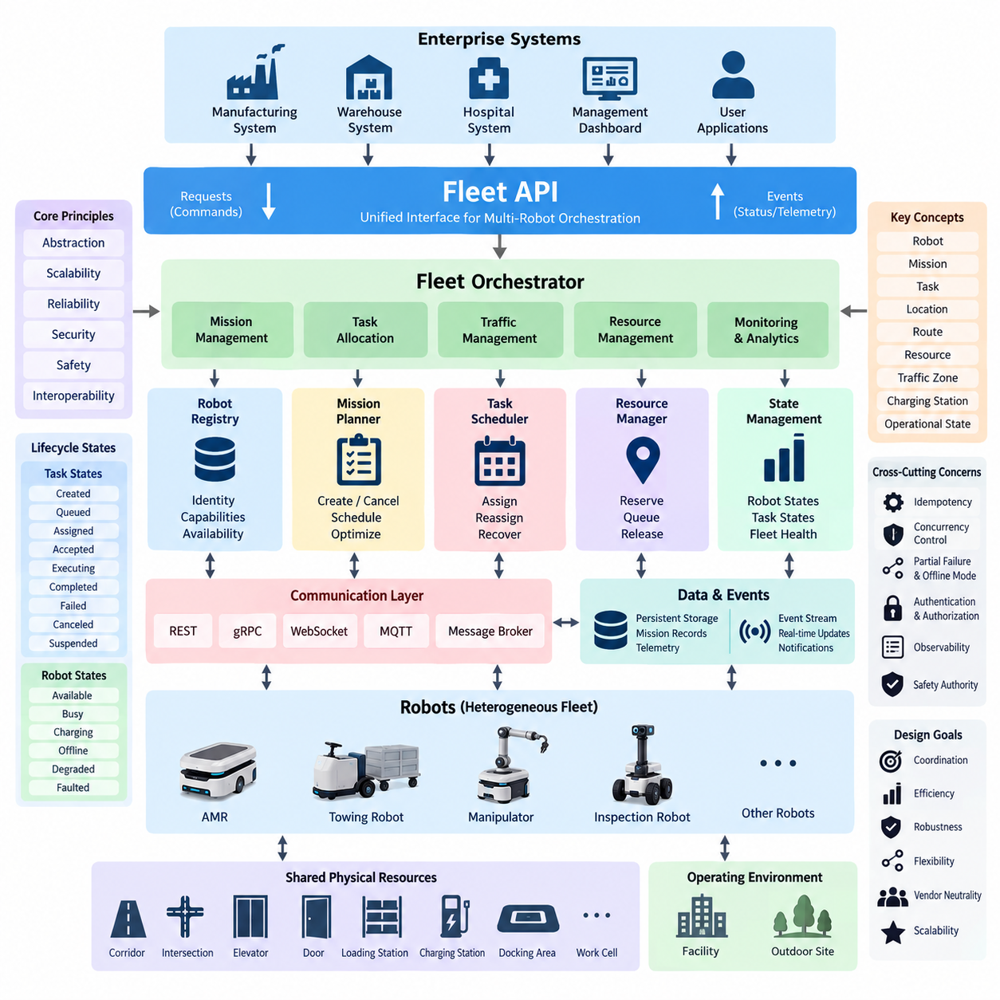
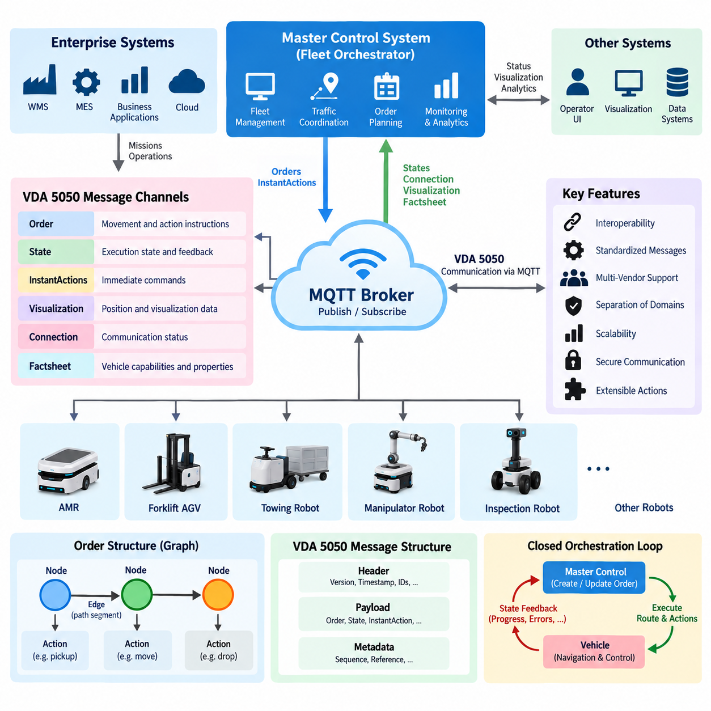
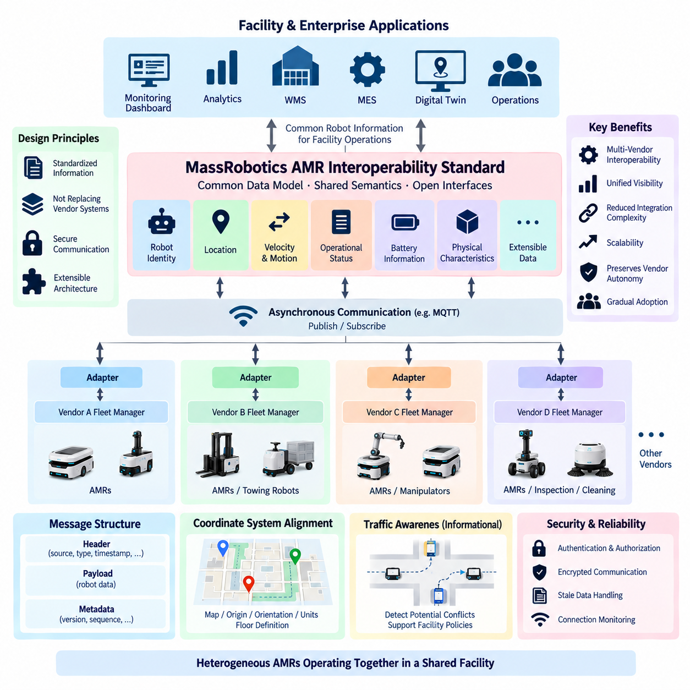
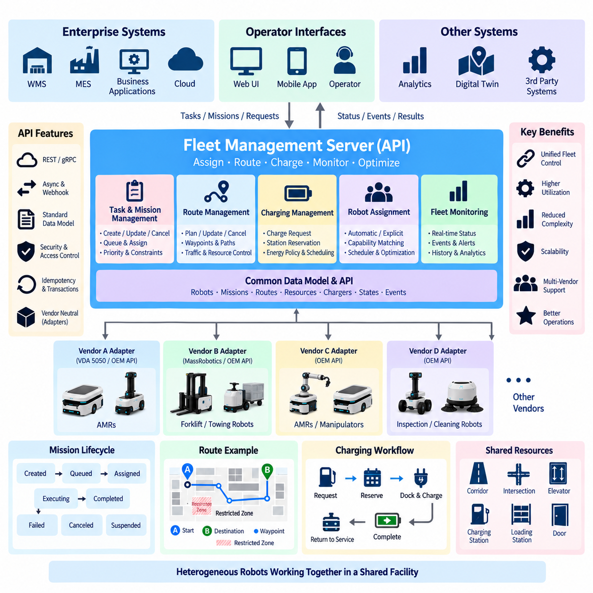
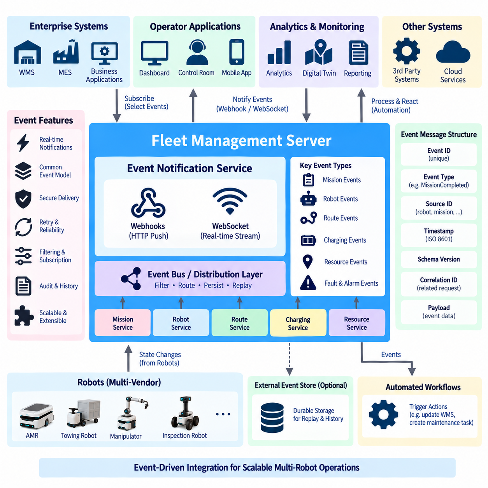
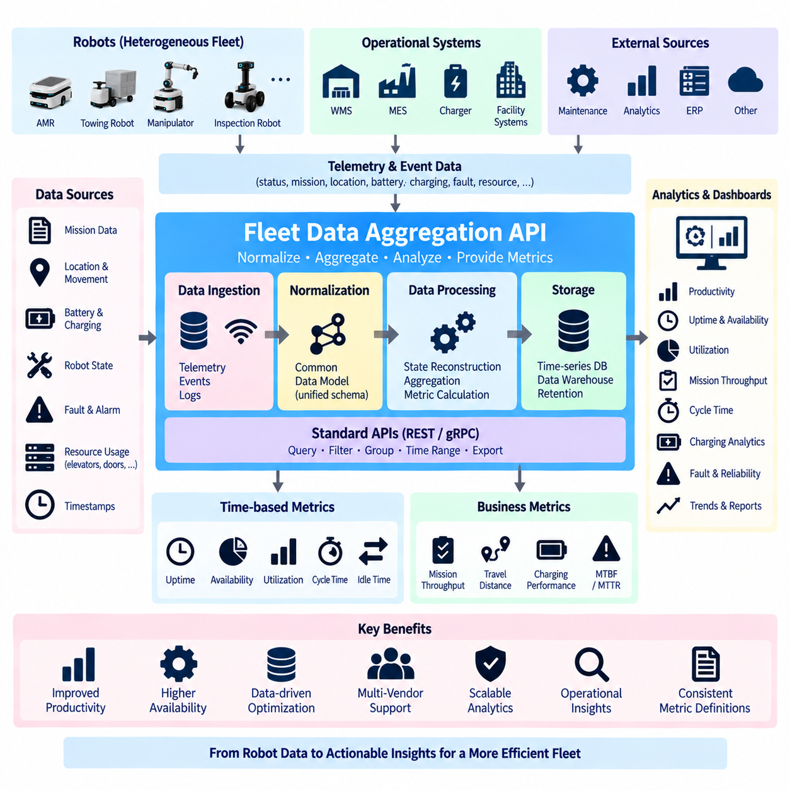
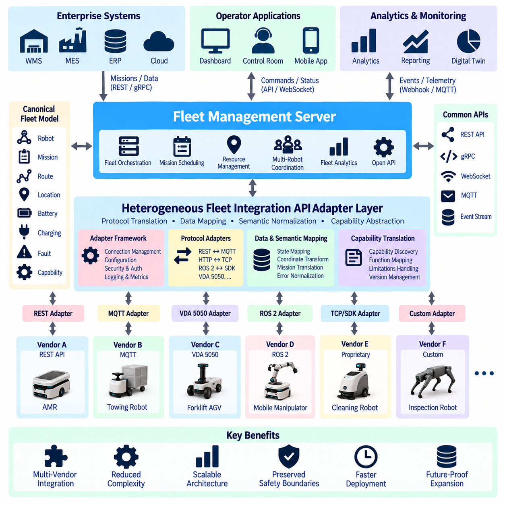
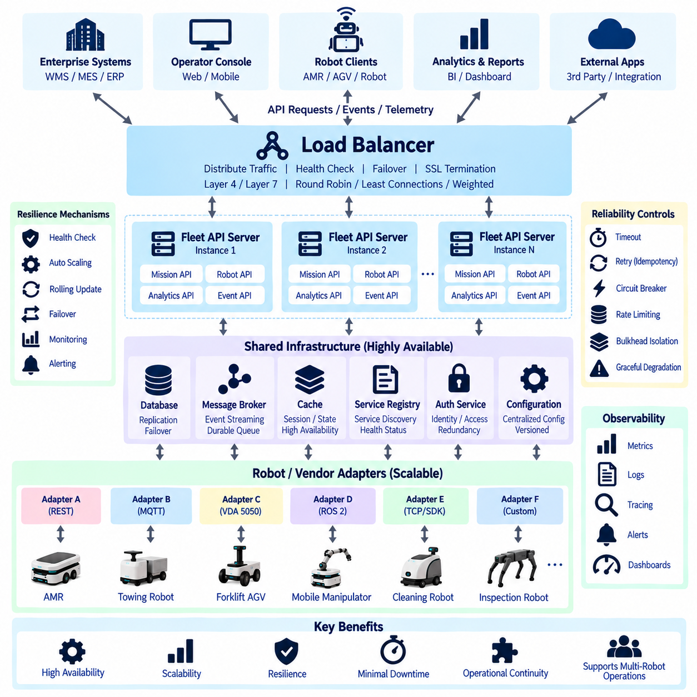
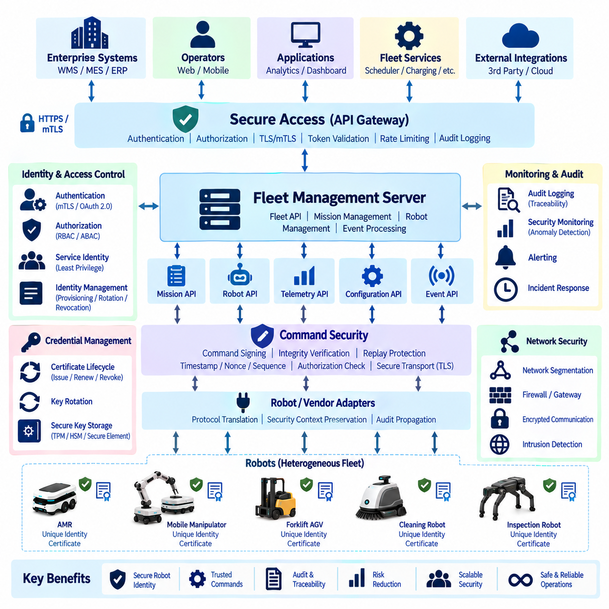
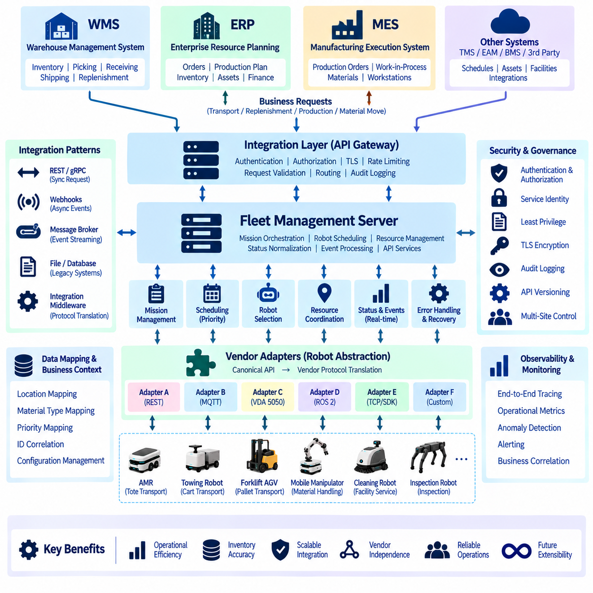

**Volume 06 Robot Communication and APIs**

# 09. Fleet APIs

## 09.01 Fleet API Design Principles: Multi-Robot Orchestration

{width="7.268055555555556in" height="7.268055555555556in"}

A fleet API transforms a collection of individually autonomous robots into a coordinated operational system. While a robot API exposes the capabilities, state, and commands of one machine, a fleet API represents shared resources, missions, traffic constraints, priorities, and operational policies across many robots. Its primary design objective is therefore orchestration rather than direct low-level control.

Multi-robot orchestration requires a clear separation between fleet-level intent and robot-level execution. The fleet management layer should specify what must be accomplished, such as transporting material between locations or performing an inspection route, while each robot retains responsibility for local navigation, obstacle avoidance, motion control, and immediate safety behavior. This separation reduces coupling between central services and heterogeneous robot implementations.

A useful fleet API is based on stable abstractions such as robot, mission, task, location, route, resource, traffic zone, charging station, and operational state. These abstractions create a common vocabulary between fleet management servers, warehouse systems, manufacturing systems, hospital applications, and robots. Hardware-specific concepts should remain behind adapters whenever possible so that applications are not tightly coupled to individual robot vendors or platforms.

Robot identity is the foundation of fleet orchestration. Every robot should have a persistent identifier associated with its type, capabilities, software configuration, current availability, and authorization scope. A fleet service can then discover which robots are eligible for a task without assuming that all machines are equivalent. Capability-based selection becomes especially important when AMRs, towing robots, manipulators, inspection robots, and other specialized platforms share one environment.

Mission APIs should express operational objectives rather than sequences of actuator commands. A mission may contain pickup, delivery, inspection, waiting, charging, docking, or interaction tasks connected by dependencies and execution constraints. The fleet orchestrator converts this mission into robot assignments and execution plans. This architecture allows scheduling algorithms to evolve independently from robot firmware and navigation software.

Task allocation should be treated as a dynamic decision rather than a permanent binding between a mission and a robot. Candidate selection may consider location, battery state, payload capacity, equipment, estimated travel time, current workload, maintenance condition, and mission priority. Because conditions change continuously, the API model should support reassignment, cancellation, suspension, retry, and recovery without corrupting the mission state.

Fleet APIs must explicitly represent lifecycle states. A task can progress through states such as created, queued, assigned, accepted, executing, completed, failed, canceled, or suspended. Robots likewise move through operational states including available, busy, charging, offline, degraded, or faulted. Explicit state transitions prevent external applications from interpreting ambiguous combinations of telemetry fields and make distributed behavior easier to audit.

Asynchronous operation is fundamental because physical missions may continue for seconds, minutes, or hours after an API request is accepted. A request to create a mission should therefore not imply immediate physical completion. The server can acknowledge the request, return a persistent mission identifier, and expose subsequent progress through status queries or event streams. This model separates command acceptance from execution outcome and avoids long-lived synchronous transactions.

Idempotency is particularly important when commands cross unreliable wireless networks. If an application retries a mission request after losing a response, the fleet system must distinguish a legitimate retry from a new mission. Idempotency keys, immutable command identifiers, sequence information, and persistent execution records can prevent duplicated transportation or repeated physical actions. Safe retry semantics should therefore be defined as part of the API contract.

Concurrency control becomes more difficult as fleet size increases because robots compete for shared physical resources. Corridors, intersections, elevators, doors, loading stations, chargers, work cells, and docking areas cannot always be used simultaneously. The fleet API should expose these resources as managed entities or constraints, allowing orchestration services to reserve, release, queue, and monitor access instead of embedding resource ownership assumptions inside individual robots.

Traffic orchestration should remain logically distinct from local collision avoidance. Fleet-level traffic management can coordinate routes, zone reservations, intersection access, and congestion reduction using knowledge of multiple robots. Local navigation must still react to unexpected people, objects, or hazards using onboard sensing. Maintaining both layers ensures that loss of fleet connectivity does not remove the robot\'s immediate ability to stop or behave safely.

A fleet API should also distinguish commands from events. Commands represent requested changes, such as assigning a mission or requesting charging, whereas events describe facts that have already occurred, such as a robot entering a zone, completing a task, or reporting a fault. Combining request-response APIs with event-driven communication allows enterprise applications to issue operations while dashboards and analytics systems consume fleet activity asynchronously.

Consistency requirements should reflect physical reality rather than forcing every data element into a strongly synchronized model. Mission ownership, resource reservations, and safety-critical coordination may require strict consistency, while telemetry, historical position data, utilization statistics, and dashboard information can tolerate bounded delay. Separating transactional fleet state from high-frequency observations improves scalability while preserving correctness where coordination depends on authoritative state.

The API should be designed for partial failure because fleet systems operate across robots, wireless networks, edge servers, brokers, databases, and enterprise services. A robot may become unreachable while continuing its current behavior, or a fleet server may restart while missions remain active. Heartbeats, leases, command timeouts, durable mission records, reconciliation procedures, and deterministic recovery rules allow the system to reconstruct operational state after communication or service failures.

Offline behavior must be defined before deployment rather than treated as an exceptional implementation detail. Each robot needs rules describing which operations may continue without fleet connectivity and which require renewed authorization. The fleet service similarly needs policies for temporarily unreachable robots so that it does not immediately reassign a task that may still be physically executing. Reconnection should trigger state reconciliation before normal orchestration resumes.

Heterogeneous fleets require capability-oriented APIs and adapter boundaries. Vendor-specific protocols can be translated into a normalized fleet model while preserving specialized features through controlled extensions. This approach allows a common orchestration service to manage robots with different navigation stacks, payload interfaces, charging mechanisms, and communication technologies. It also prepares the architecture for interoperability mechanisms addressed later in the fleet API structure.

Scalability depends more on communication patterns than on simply increasing server capacity. Continuously polling every robot for every attribute produces unnecessary traffic as fleet size grows. Event subscriptions, filtered telemetry, aggregation, batching, hierarchical gateways, and appropriate update frequencies reduce communication overhead. High-rate data should be transmitted only when operationally necessary, while slower fleet state can use lightweight periodic synchronization.

Observability should be incorporated into the API contract so that orchestration decisions can be reconstructed after an incident. Mission identifiers, robot identifiers, timestamps, command identifiers, correlation IDs, state transitions, reservation changes, and error information should propagate across services. These records support troubleshooting, performance analysis, safety investigation, and optimization without requiring engineers to infer behavior from unrelated logs distributed across multiple machines.

Security boundaries must follow operational authority. Authentication establishes the identity of robots and applications, while authorization determines which missions, robots, locations, or command classes each identity may access. Sensitive fleet operations should be protected against replay, tampering, and unauthorized execution. Security should therefore be designed around physical consequences rather than treating a robot fleet as an ordinary collection of web services.

Safety authority must remain clearly defined even when orchestration becomes increasingly intelligent. A fleet optimizer may choose assignments and routes, but it should not override onboard protective functions, emergency stops, certified motion limits, or local hazard responses. APIs should communicate safety-related states and restrictions while preserving the independence of mechanisms that must remain effective when cloud, fleet, or enterprise services become unavailable.

The resulting architecture forms a layered control hierarchy: enterprise systems express business demand, fleet services convert demand into coordinated missions, robot APIs translate assignments into platform operations, and onboard controllers execute motion under local safety constraints. This hierarchy connects the Fleet API chapter with the broader software architecture, communication, navigation, and multi-robot intelligence structure of the robotics software framework.

## 09.02 VDA 5050 Standard Deep Dive: Channels / Messages [w/Code]

{width="7.268055555555556in" height="7.268055555555556in"}

VDA 5050 is an interoperability specification designed to standardize communication between automated guided vehicles, autonomous mobile robots, and higher-level fleet control systems. Instead of requiring a master control system to implement a different proprietary interface for every vehicle manufacturer, VDA 5050 defines common message structures and communication conventions. This creates a standardized integration boundary between heterogeneous mobile robots and fleet orchestration systems.

The architecture separates the vehicle-specific control domain from the master control domain. A master control system creates transport orders, coordinates traffic, and supervises fleet operations, while each vehicle retains responsibility for executing supported actions and controlling its local motion. VDA 5050 therefore does not replace navigation, localization, obstacle avoidance, or safety controllers. It provides an interoperable communication layer through which operational intent and execution state can be exchanged.

Communication is organized around MQTT using a publish-and-subscribe model. Instead of establishing dedicated point-to-point connections between every system component, participants publish messages to predefined topics and subscribe to topics containing information they require. This approach provides asynchronous communication and reduces direct coupling between the master control system and vehicles, which is particularly useful when many mobile robots operate simultaneously within one industrial environment.

A VDA 5050 topic hierarchy identifies the communication context and the vehicle associated with a message. Topic structures include elements representing the interface namespace, protocol version, manufacturer, serial number, and message category. This organization allows an MQTT broker to route messages belonging to different vehicles independently while enabling a master control system to supervise many vehicles through a consistent communication pattern.

The order channel is one of the most important communication paths because it transfers movement and action instructions from the master control system to a vehicle. An order represents a structured mission rather than a stream of low-level velocity commands. It describes where the vehicle should travel, which path segments should be followed, and which actions should be performed at specific points. The vehicle interprets this information through its own navigation and control software.

An order is fundamentally represented as a graph consisting of nodes and edges. Nodes identify significant locations or operational points, while edges describe connections between nodes through which the vehicle can travel. Actions can be associated with nodes or edges depending on when they must be executed. This graph-oriented representation enables the master control system to describe both transportation intent and operational sequencing without directly controlling the vehicle\'s actuators.

Sequence identifiers are important because nodes and edges must form an unambiguous ordered structure. The vehicle uses these identifiers to determine how individual graph elements relate to the current order and execution progress. The master control system can consequently maintain a consistent representation of the intended route while receiving information about which parts have already been processed. This supports synchronization between planning and physical execution.

VDA 5050 distinguishes between released and unreleased portions of an order. Released graph elements are authorized for execution, whereas unreleased elements describe future planning information that is not yet executable. This mechanism enables a master control system to communicate a broader route while controlling how far the vehicle may proceed. It is particularly valuable for traffic coordination where several vehicles compete for intersections, corridors, or other shared resources.

The state channel provides the primary feedback path from a vehicle to the master control system. State messages communicate the vehicle\'s current execution condition and contain information associated with the active order, processed nodes and edges, operating mode, position-related information, battery condition, errors, action states, and other operational data. The master control system uses these updates to maintain a synchronized representation of the physical fleet.

Order and state messages therefore form a closed orchestration loop. The master control system publishes an order, the vehicle validates and executes the executable portion, and state messages report the resulting progress. Based on this feedback, the master control system may release additional route segments, coordinate other vehicles, or respond to exceptional conditions. The protocol consequently supports supervisory coordination while leaving real-time motion execution inside the vehicle.

The instantActions communication mechanism addresses commands that are not naturally represented as part of the normal node-and-edge order graph. Such actions can request operational behavior that must be considered independently of the current route progression. The vehicle reports the execution state of these actions through its state information, allowing the master control system to determine whether an action is waiting, executing, completed, or has encountered an error.

The visualization channel provides information intended primarily for visualization and monitoring purposes rather than authoritative mission execution. A vehicle can publish frequently changing information such as its current position and related visualization data. Separating visualization traffic from the main operational state helps systems handle different update frequencies and purposes. Monitoring applications can therefore display robot movement without requiring every graphical update to become part of mission-state processing.

The connection channel communicates information about the communication status of a vehicle. This becomes important because MQTT-based distributed systems must distinguish normal disconnection, unexpected communication loss, and active connectivity. Connection-related information helps supervisory systems understand whether a vehicle is currently reachable and supports operational responses when connectivity changes. Reliable connection awareness is essential when physical missions continue while network conditions fluctuate.

A factsheet channel can communicate relatively static information describing the vehicle and its supported capabilities. Unlike continuously changing state data, factsheet information characterizes properties that a master control system can use to understand the vehicle\'s interface and operational capabilities. This becomes particularly important in heterogeneous fleets because different vehicle types may support different actions, physical characteristics, localization functions, or operational features.

Header information provides context required to interpret individual VDA 5050 messages consistently. Messages use fields that support identification, sequencing, timestamps, protocol version handling, and vehicle association. Such metadata becomes critical in distributed environments because messages may be delayed, repeated, or observed at different times by multiple components. Explicit identification and sequencing allow communicating systems to determine how incoming information relates to previous exchanges.

Order identifiers and update identifiers support synchronization between the master control system and the vehicle. A master control system may need to modify or extend an existing order as execution progresses, rather than continuously creating unrelated missions. The vehicle must therefore distinguish a new order from an update to an existing one. Correct identifier handling prevents stale or duplicated messages from unintentionally replacing the currently valid execution context.

Actions provide an extensible mechanism for representing operational behavior beyond movement. Depending on vehicle capabilities, actions can describe activities such as loading, unloading, docking, waiting, interacting with equipment, or other application-specific operations. Action parameters provide additional execution information, while action states allow progress to be reported. Interoperability therefore depends not only on message syntax but also on shared understanding of action semantics.

Error reporting is another essential component of the state model. A vehicle must be able to communicate conditions that prevent or degrade execution, together with sufficient contextual information for the master control system to interpret the problem. The supervisory system can then decide whether to wait, replan, cancel an order, dispatch another vehicle, or request operator intervention. Standardized error communication reduces dependence on proprietary diagnostic conventions.

Message validation is critical because syntactically valid JSON does not automatically imply operationally valid robot behavior. Implementations should validate required fields, identifiers, graph relationships, supported actions, sequence consistency, and protocol versions before accepting commands. The receiving vehicle must also reject instructions that conflict with its capabilities or execution rules. Interface compliance therefore requires semantic validation in addition to serialization correctness.

The MQTT broker becomes an important infrastructure component in this architecture because it transports orders, states, connection information, visualization data, instant actions, and other protocol messages. Broker availability, authentication, authorization, topic permissions, retained-message behavior, quality-of-service configuration, and reconnect handling directly affect fleet communication reliability. Production deployments should therefore treat MQTT configuration as part of the fleet control architecture rather than as a simple transport detail.

VDA 5050 interoperability does not mean that every robot becomes functionally identical. Vehicles may differ substantially in kinematics, payload capacity, navigation technology, supported actions, charging methods, and safety behavior. The standard creates a common communication contract through which those differences can be exposed and managed. A fleet controller must still perform capability-aware orchestration and assign orders only to vehicles capable of executing them correctly.

The overall communication model can therefore be understood as a structured exchange between orchestration intent and physical execution. Orders and instant actions flow primarily toward vehicles, while state, connection, visualization, and capability-related information flow primarily toward supervisory systems. MQTT topics provide the transport structure, standardized messages provide semantic structure, and vehicle-specific adapters connect those messages to local navigation and control implementations.

Within a broader Fleet API architecture, VDA 5050 acts as an interoperability boundary rather than the complete fleet management system. Enterprise APIs can create business missions, fleet services can allocate robots and coordinate traffic, and a VDA 5050 interface can translate those decisions into standardized vehicle communication. This layered approach allows WMS, MES, or other enterprise systems to remain separated from individual robot implementations while supporting heterogeneous multi-vendor fleets.

## 09.03 MassRobotics AMR Interoperability Standard [w/Code]

{width="7.268055555555556in" height="7.268055555555556in"}

The MassRobotics AMR Interoperability Standard addresses a fundamental problem in modern mobile-robot deployments: robots from different manufacturers often operate as isolated systems even when they share the same facility. Each vendor may provide its own fleet manager, data model, terminology, and integration interface. The standard establishes a common approach for sharing essential operational information so heterogeneous autonomous mobile robots can coexist within a unified facility-level ecosystem.

The standard focuses primarily on interoperability through shared information rather than replacing each manufacturer\'s proprietary robot control system. Individual vendors can continue using their own navigation algorithms, fleet management logic, safety mechanisms, and robot-specific functions. A standardized interface exposes selected information outside those systems, allowing facility software and other authorized systems to obtain a consistent view of robots from multiple vendors.

This distinction creates an important architectural boundary. Robot vendors remain responsible for controlling their own vehicles, while interoperability services concentrate on exchanging operational data across vendor boundaries. The standard therefore does not attempt to define low-level motor commands, trajectory generation, localization algorithms, or safety control. Its purpose is to provide common semantics for information required to understand and coordinate heterogeneous AMRs operating in shared environments.

A typical architecture contains several robot fleets connected to a facility-level interoperability layer. Each vendor fleet may include its own robots and fleet management server, while adapters translate vendor-specific information into the standardized representation. Applications above this layer can consume common robot information without implementing separate integrations for every manufacturer. This adapter-oriented model provides a practical migration path for facilities that already contain proprietary robot systems.

Robot identity is essential because every participating mobile robot must be distinguishable across the shared environment. A standardized representation can associate each robot with identifiers and descriptive information that allow external systems to recognize its source and operational context. Stable identity also supports logging, monitoring, analytics, troubleshooting, and correlation of robot information when multiple fleets publish updates simultaneously.

Location information is one of the most valuable interoperability data elements. A shared system needs to understand where participating robots are located so that facility applications can visualize fleet activity and support higher-level coordination. Position information must be interpreted within a known reference context because coordinates are useful only when communicating systems understand the associated map or coordinate system. Consistent location semantics are therefore as important as the numeric position itself.

Velocity and motion-related information complement robot position by describing how a vehicle is moving. A facility-level system can use this information to build a more complete operational picture instead of relying only on periodic position samples. When robots from different vendors report comparable movement information, monitoring applications can observe traffic behavior, identify congestion patterns, and analyze interactions between independent fleets without accessing each vendor\'s internal motion controller.

Operational status provides another important common abstraction. External systems need to know whether a robot is active, idle, unavailable, paused, charging, experiencing a problem, or otherwise unable to perform normal operations. Vendor implementations may internally use much more detailed state machines, but interoperability requires a common representation that allows facility applications to interpret essential robot conditions consistently across multiple manufacturers.

Battery information provides useful context for fleet visibility and operational planning. A robot\'s energy condition can influence whether it is expected to continue working, seek charging infrastructure, or become temporarily unavailable. Standardized reporting allows facility-level monitoring systems to observe energy conditions across heterogeneous fleets without understanding every vendor\'s proprietary battery-management interface. Vendor-specific charging logic can remain under the control of the corresponding fleet manager.

The standard can also expose information describing the physical characteristics of robots. Dimensions and related properties matter because heterogeneous vehicles may occupy different amounts of space and interact differently with corridors, intersections, doors, elevators, and staging areas. A small AMR and a large towing platform cannot automatically be treated as equivalent simply because both are mobile robots. Physical information gives higher-level systems context for interpreting their presence within a shared facility.

The interoperability model is especially valuable for facility visualization. Instead of maintaining a separate monitoring dashboard for every vendor, an operator can potentially observe multiple robot fleets through a common application. Robot identity, position, movement, status, and other standardized information can be combined into a facility-wide operational view. This improves situational awareness while allowing the underlying robot fleets to remain independently managed.

Data exchange should be designed as asynchronous communication because robot state changes continuously and multiple consumers may require the same information. A publish-and-subscribe architecture is well suited to this environment. Robots or fleet adapters can publish standardized updates while authorized applications subscribe to the information they require. This reduces direct dependencies between individual producers and consumers and supports scalable distribution of operational data.

A common message envelope is important for interpreting information reliably. Messages should provide sufficient context to identify the source robot, understand the message type, determine when the information was generated, and interpret the associated payload. Timestamp information is particularly significant in robotics because a position or state observation becomes progressively less useful as it ages. Consumers must therefore distinguish current operational information from delayed or stale data.

Coordinate-system management becomes a major practical issue when integrating independent fleets. Two vendors may represent the same physical building using different map origins, orientations, units, floor definitions, or internal localization maps. Interoperability cannot be achieved merely by transmitting numeric x and y values. Facility integration must establish a meaningful relationship between robot coordinates and a shared spatial reference so information from different fleets can be interpreted together.

The standard\'s information-sharing orientation also influences traffic management. Knowing where robots are located does not automatically provide authority to command every robot or resolve every path conflict. Facility-level software may use shared information to detect potential interactions, define operational policies, or communicate with vendor fleet managers through additional interfaces. Actual motion execution and immediate collision avoidance remain responsibilities of the appropriate robot and fleet control systems.

This makes the MassRobotics approach different from an interface primarily centered on sending executable route orders to vehicles. Its core value lies in creating shared awareness across heterogeneous fleets. A deployment can therefore use interoperability data as a common informational foundation while separate APIs or fleet-control mechanisms handle mission assignment, traffic reservation, charging requests, and other active orchestration functions where required.

Security is essential because shared fleet information can reveal operationally sensitive details about a facility. Robot identities, positions, activity states, and movement patterns should be available only to authorized systems. Authentication, authorization, encrypted communication, credential management, and appropriate access boundaries should therefore accompany interoperability deployment. Standardizing data structures does not eliminate the responsibility to secure the infrastructure transporting and consuming those data.

Reliability must also account for temporary communication failures. A robot or vendor adapter may disconnect while the physical vehicle continues operating. Consumers should not assume that the last received state remains indefinitely valid. Timestamps, connectivity monitoring, update expectations, and stale-data handling policies allow facility systems to represent uncertainty explicitly rather than presenting outdated robot information as if it were current.

Extensibility is necessary because mobile robots perform increasingly diverse functions. Warehouse AMRs, hospital delivery robots, towing vehicles, inspection platforms, cleaning robots, and mobile manipulators may require additional information beyond a common baseline. A practical interoperability architecture should preserve a stable shared model while allowing specialized information to be added without forcing every consumer to understand every vendor-specific capability.

Adapters are therefore a central engineering pattern for real deployments. A vendor adapter can read information from a proprietary fleet API, transform identifiers and state representations, convert coordinate information where necessary, and publish the standardized model. This prevents enterprise and facility applications from becoming tightly coupled to vendor interfaces. When a robot platform changes, the integration impact can be concentrated within the corresponding adapter instead of propagating throughout the software ecosystem.

The resulting architecture supports gradual adoption. A facility does not need to replace existing robot fleets to introduce interoperability. Existing systems can remain operational while adapters expose standardized information to a common integration layer. New robot vendors can subsequently join the environment by implementing the same interoperability contract. This approach reduces integration complexity and helps organizations evolve from isolated vendor-specific fleets toward heterogeneous multi-robot operations.

Within the broader Fleet API architecture, the MassRobotics AMR Interoperability Standard can serve as a common information layer between vendor fleets and facility-level applications. Enterprise systems, dashboards, analytics platforms, digital twins, and orchestration services can consume standardized robot information while vendor fleet managers retain responsibility for platform-specific control. The result is a layered architecture that separates shared fleet visibility from proprietary execution.

For large-scale multi-robot environments, this separation is strategically important. Interoperability should not require every manufacturer to expose identical internal architectures or surrender control of its navigation stack. Instead, systems agree on a useful external representation of robot identity, location, motion, status, and related operational information. This common language provides the foundation for multi-vendor visibility, integration, and progressively more sophisticated fleet coordination.

## 09.04 Fleet Management Server API: Assign, Route, Charge [w/Code]

{width="7.268055555555556in" height="7.268055555555556in"}

A Fleet Management Server API provides the operational interface through which external applications create work, assign robots, manage routes, and coordinate charging across a multi-robot fleet. Unlike a single-robot API, the server maintains a global view of missions, robot availability, shared resources, traffic conditions, and energy status. The API therefore represents fleet-level intent while individual robots remain responsible for local navigation, motion control, obstacle avoidance, and safety execution.

Assignment begins when an external system submits a mission or task containing operational requirements rather than directly selecting actuator behavior. Typical information includes pickup and destination locations, required capabilities, payload constraints, priority, time requirements, and task-specific parameters. The fleet server validates the request and creates a persistent mission record so that assignment, execution, cancellation, recovery, and historical analysis can reference the same operational object.

Robot assignment may be explicit or automatic. In explicit assignment, a client requests that a specific robot execute a task. In automatic assignment, the fleet server evaluates available candidates and selects an appropriate robot according to scheduling policies. Candidate evaluation can consider current position, operating state, payload capability, battery level, estimated travel cost, workload, equipment compatibility, maintenance condition, and previously committed missions.

An assignment API should separate task creation from assignment whenever operational flexibility is required. A task may first enter a queued state and later become assigned when a suitable robot becomes available. This allows the scheduler to optimize the entire fleet rather than forcing clients to make robot-selection decisions independently. It also enables reassignment when a robot becomes unavailable, develops a fault, or can no longer satisfy the mission constraints.

Assignment must be treated as a state transition rather than a simple database update. The server may reserve the selected robot, verify that the mission is still valid, check required resources, and then issue execution information to the vehicle interface. If any stage fails, the operation should produce a deterministic outcome. Persistent task identifiers, assignment versions, idempotency keys, and transaction boundaries help prevent duplicated work when requests are retried after network failures.

Route management translates mission objectives into movement constraints that can be executed by robots. A route API may represent origins, destinations, waypoints, path segments, traffic zones, preferred paths, restricted regions, or other navigation-related information. The fleet server does not necessarily calculate every local trajectory. Instead, it provides route-level intent and constraints while the onboard navigation system generates safe motion according to the robot\'s local map, sensors, and controller.

Routes should be modeled independently from instantaneous robot positions because route planning and physical execution occur at different timescales. A planned route may change because of congestion, blocked corridors, temporary work zones, unavailable elevators, or higher-priority missions. The API should therefore support route creation, revision, cancellation, and versioning so that both the server and robot can determine which route definition is currently authoritative.

Shared resources make route coordination fundamentally different from single-robot navigation. Corridors, intersections, elevators, automatic doors, loading stations, docking points, and narrow passages may require reservation or sequencing. The fleet server can maintain resource ownership and grant access according to traffic policy. Route execution then becomes coordinated movement through a set of spatial and operational resources rather than merely following geometric waypoints.

Traffic management can use route information to reduce deadlocks and congestion before robots physically encounter one another. The server may reserve zones, delay departures, select alternative paths, or adjust mission priorities according to current fleet conditions. Local obstacle avoidance still remains active because centralized planning cannot predict every person or object. Fleet routing and onboard navigation consequently operate as complementary layers rather than competing control mechanisms.

Route updates require careful synchronization with executing robots. A new route should not silently replace an older route without identifying which mission and route version it belongs to. Sequence numbers, revision identifiers, timestamps, and acknowledgments allow both sides to determine whether an update is current. If communication is interrupted, the robot can continue according to an explicitly defined offline policy while the server marks route information as uncertain until synchronization is restored.

Charging is a fleet resource-management problem rather than simply a low-battery reaction. A charging API should represent robot energy state, charging requirements, charger availability, compatibility, reservation status, and charging progress. The fleet server can use this information to coordinate when and where robots recharge while maintaining enough operational capacity to execute pending missions. Charging decisions therefore become part of scheduling and fleet optimization.

A charge request may be initiated by a robot, an operator, a mission policy, or the fleet scheduler. The server evaluates whether charging is necessary and selects a compatible station according to availability and operational constraints. The resulting charging mission may include travel to the station, charger reservation, docking, charging initiation, progress monitoring, completion criteria, and release of the charging resource before the robot returns to normal availability.

Battery thresholds should support operational policies rather than rely on one universal percentage. A minimum reserve may protect the robot from becoming stranded, while a preferred charging threshold can trigger opportunistic charging during periods of low demand. The scheduler may also consider predicted mission energy consumption before assignment. A robot with sufficient energy for normal operation may still be rejected for a long mission if completing it would violate the required reserve margin.

Charger reservation is important when several robots share limited charging infrastructure. Without coordinated reservations, multiple robots may travel toward the same charger and create unnecessary waiting or congestion. The fleet server can treat each charging station as a managed resource with states such as available, reserved, occupied, unavailable, or faulted. Reservations should have ownership, expiration, cancellation, and recovery semantics so abandoned reservations do not permanently block capacity.

Charging workflows must account for physical failures. A robot may fail to dock, a charger may stop responding, power transfer may not begin, or charging may terminate unexpectedly. The API should expose these conditions as explicit states and errors rather than hiding them behind a generic mission failure. Recovery policies can then retry docking, select another charger, request operator assistance, or place the robot into a degraded operational state.

Assignment, routing, and charging are strongly interconnected. Assigning a robot changes its expected location and future energy state; selecting a route affects travel time and energy consumption; charging removes a robot from productive service while restoring future capacity. A fleet management server should therefore avoid treating these functions as independent endpoints with unrelated logic. They should operate over a shared model of robot state, missions, resources, traffic, and energy.

Asynchronous execution is essential because none of these operations completes when the HTTP or RPC request returns. An assignment may require minutes of travel, a route can remain active across multiple task stages, and charging may continue for hours. APIs should acknowledge accepted operations quickly and provide persistent identifiers. Clients can then obtain progress through status endpoints, WebSocket streams, MQTT events, webhooks, or other event-driven mechanisms.

A consistent lifecycle model simplifies integration. Missions and assignments can progress through created, queued, assigned, accepted, executing, completed, failed, canceled, or suspended states, while charging reservations and route plans have their own controlled transitions. External systems should react to these explicit states instead of inferring execution from raw telemetry. This makes WMS, MES, dashboards, and operator applications less dependent on robot-specific behavior.

Error handling should distinguish business rejection from infrastructure failure and physical execution failure. A mission may be rejected because no compatible robot exists, a route may be impossible because a required zone is unavailable, or charging may fail because no compatible station is operational. These conditions require different responses from temporary server errors or communication timeouts. Structured error codes and contextual information enable clients to choose appropriate recovery actions.

Concurrency control is necessary because several applications may attempt to modify the same mission or robot simultaneously. Optimistic version checks, leases, reservation tokens, or other ownership mechanisms can prevent conflicting assignment, route, and charging operations. Idempotent request handling is equally important so retries do not create duplicate missions, multiple charger reservations, or repeated route commands after a client loses the original response.

Security should reflect the physical authority represented by each API operation. Reading robot status is fundamentally different from assigning a mission, changing a route, or commanding a robot to enter a charging station. Authentication establishes client identity, while role- or policy-based authorization restricts permitted operations and resources. Sensitive commands should also be auditable so operators can determine who requested an action, when it was accepted, and how execution progressed.

Observability connects operational behavior with system-level diagnostics. Assignment decisions, route revisions, resource reservations, charging events, robot acknowledgments, failures, and recovery actions should share correlation identifiers and timestamps. Metrics can measure assignment latency, mission completion time, route delays, charger utilization, robot availability, and failed docking attempts. These records provide the foundation for troubleshooting and long-term fleet optimization.

In a heterogeneous fleet, the server-facing API should remain independent of individual vendor protocols. A common assignment, route, and charging model can be translated through adapters into vendor-specific interfaces or interoperability standards. This allows enterprise applications to interact with one stable fleet contract while underlying AMRs, towing robots, inspection platforms, or other vehicles retain their native control architectures and specialized capabilities.

The resulting Fleet Management Server API forms the operational bridge between enterprise demand and distributed physical execution. WMS, MES, hospital systems, manufacturing applications, or operator interfaces submit missions; the fleet server selects robots, coordinates routes and shared resources, manages charging, and observes execution; robot adapters translate those decisions into platform-specific commands. This layered structure provides scalable orchestration without transferring local safety and motion authority away from the robots.

## 09.05 Fleet Event Notification API: Webhook / WebSocket [w/Code]

{width="7.268055555555556in" height="7.268055555555556in"}

Fleet event notification APIs provide the asynchronous communication layer that informs external systems when meaningful changes occur across a robot fleet. Instead of requiring WMS, MES, dashboards, or monitoring services to repeatedly poll fleet endpoints, the fleet server publishes events when missions, robots, routes, resources, chargers, or faults change state. This event-driven model reduces unnecessary requests while improving responsiveness and scalability.

A fleet event represents a fact that has already occurred rather than a request for future action. Examples include a mission being assigned, a robot starting a task, a destination being reached, charging beginning, a fault being detected, or a shared resource becoming unavailable. Separating events from commands creates clearer semantics: commands express intent, while events provide immutable observations about the resulting operational state.

An event model should use a common envelope so consumers can process different event types consistently. Typical metadata includes an event identifier, event type, source identifier, timestamp, schema version, correlation identifier, and payload. The payload contains information specific to the event, while the envelope provides the context required for routing, validation, tracing, deduplication, and compatibility management across distributed fleet applications.

Event identifiers should be globally unique within the relevant fleet environment. A consumer may receive the same notification more than once because of retries, reconnects, or delivery guarantees. By recording processed event identifiers, the consumer can recognize duplicate notifications without repeating downstream actions. This makes event processing effectively idempotent even when the underlying communication mechanism provides at-least-once delivery rather than exactly-once delivery.

Event types should describe meaningful domain changes rather than every modification to an internal database field. MissionCreated, MissionAssigned, TaskStarted, TaskCompleted, RobotOffline, RobotFaulted, RouteChanged, ChargerReserved, and ChargingCompleted are examples of domain-oriented events. A stable event taxonomy allows enterprise applications to react to operational meaning without becoming dependent on implementation details inside the fleet management server.

Webhooks provide a server-to-server notification mechanism for applications that expose reachable HTTP endpoints. A subscriber registers a callback URL and selects the event categories it wants to receive. When a matching fleet event occurs, the fleet server sends an HTTP request containing the event payload to the registered endpoint. This approach is particularly suitable for enterprise systems that need discrete business notifications rather than continuous real-time data streams.

Webhook delivery should be treated as a reliable asynchronous process rather than a single HTTP attempt. The receiver may temporarily be unavailable, return an error, or exceed the configured timeout. The fleet server should therefore maintain delivery state and retry failed notifications according to a controlled policy. Exponential backoff, retry limits, delivery deadlines, and dead-letter handling prevent temporary failures from causing either immediate data loss or uncontrolled request storms.

A successful HTTP response confirms transport-level receipt but does not necessarily prove that every downstream business operation has completed. Webhook contracts should clearly define what acknowledgment means. In many systems, a successful response indicates that the receiver has accepted responsibility for processing the event. Long-running business logic should then continue asynchronously rather than keeping the webhook request open until all processing finishes.

Webhook ordering requires careful design because independent HTTP deliveries may arrive later than expected or be retried after newer events have already been processed. Timestamps, sequence numbers, entity versions, and correlation identifiers allow consumers to determine event relationships. Applications should avoid assuming that network arrival order always equals operational occurrence order, particularly when notifications are distributed across multiple fleet server instances.

Webhook security begins with transport encryption using HTTPS, but encryption alone does not authenticate the event source. The fleet server can sign notification payloads using a shared secret or asymmetric key, allowing receivers to verify message integrity and authenticity. Timestamps and unique event identifiers can also participate in replay protection so that previously captured valid notifications cannot simply be resent as new operational events.

Webhook subscriptions require lifecycle management. External applications should be able to register, inspect, update, disable, and delete subscriptions while defining filters for relevant event types, robots, facilities, or mission categories. Subscription identifiers provide stable management references. Administrators also need visibility into delivery failures, retry counts, disabled endpoints, and recent notification history so integration problems can be diagnosed without examining fleet internals.

WebSocket communication serves a different operational pattern. Rather than sending independent HTTP callbacks, a client establishes a persistent bidirectional connection to the fleet service. The server can then push events immediately over the existing connection. This model is well suited to operator dashboards, control-room interfaces, digital twins, and applications that require continuously changing fleet information with low notification latency.

A WebSocket client can subscribe to selected event streams after authentication. Filters may restrict information by robot, mission, facility zone, event category, or severity. Server-side filtering is important because transmitting every fleet event to every connected client becomes inefficient as the number of robots and applications increases. Subscription-aware routing ensures that each client receives only the operational information it requires.

WebSocket connections are inherently temporary even when applications intend them to remain continuously active. Wireless changes, proxies, server restarts, network interruptions, and client failures can terminate connections unexpectedly. Ping-pong heartbeats, connection timeouts, automatic reconnection, and session restoration mechanisms are therefore essential. A client should always assume that the connection may disappear and design recovery behavior accordingly.

Reconnection creates the possibility of missing events generated while a client was disconnected. A robust API can provide sequence numbers, stream offsets, resume tokens, or a REST-based event history endpoint. After reconnecting, the client identifies the last successfully processed event and requests subsequent information before resuming live streaming. This combines real-time delivery with recoverability instead of assuming permanent network connectivity.

Backpressure becomes important when the fleet produces events faster than a WebSocket client can process them. Unlimited buffering can exhaust server memory, while silently dropping important events can create an incorrect operational view. The API should therefore define queue limits and overflow behavior. Low-value telemetry may be sampled or coalesced, while mission transitions, faults, safety-related notifications, and resource changes may require durable delivery.

Webhooks and WebSockets should not be viewed as competing mechanisms because they address different integration patterns. Webhooks are effective for durable server-to-server business notifications where recipients do not need persistent connections. WebSockets are effective for interactive applications requiring continuous low-latency updates. A fleet platform can expose both mechanisms over the same underlying event model so consumers select transport according to their operational requirements.

The underlying event service should remain independent of notification transport. Mission, robot, traffic, charging, and resource services generate domain events, which are placed into an event distribution layer. Webhook dispatchers, WebSocket gateways, message brokers, audit services, and analytics pipelines can then consume the same events independently. This prevents mission logic from becoming directly coupled to every external notification mechanism.

Durable event storage improves recovery and auditability. Important events can be retained in an event log or broker so they remain available after process restarts and temporary consumer outages. Retention policies may differ by event category: high-frequency visualization information may require only short-term storage, while mission transitions, faults, charging records, and administrative changes may need longer retention for operational analysis and traceability.

Schema evolution must be controlled because event consumers often evolve independently from the fleet server. Event envelopes should include schema or API versions, and compatible changes should avoid unexpectedly removing or redefining existing fields. Consumers should generally tolerate unknown optional fields. Breaking changes may require a new event version or parallel schema so older enterprise integrations can continue operating during migration.

Authorization should be applied to subscriptions as well as ordinary API requests. A monitoring dashboard may be permitted to receive status events but not security-sensitive administrative information. A facility application may access only robots belonging to its site. Authentication identifies the subscriber, while authorization policies determine which event types, robot groups, facilities, and operational details can be delivered through webhook or WebSocket channels.

Observability is especially important because asynchronous notification failures can otherwise remain invisible. Metrics should track generated events, successful deliveries, failed webhooks, retry counts, WebSocket connections, reconnect frequency, queue depth, consumer lag, and delivery latency. Correlation identifiers allow an engineer to trace a mission request through assignment, robot execution, state transition, event generation, and final delivery to an enterprise application.

Fleet events can also support automation beyond visualization. A MissionCompleted event may trigger a WMS inventory update, a RobotFaulted event may create a maintenance workflow, and a ChargingCompleted event may return a robot to the scheduling pool. These reactions should remain loosely coupled to the fleet server. Event consumers decide how to respond, allowing new business workflows to be added without modifying the core robot execution logic.

In heterogeneous fleets, event normalization prevents every enterprise application from learning vendor-specific notification formats. Vendor adapters can translate proprietary robot and fleet events into a common event taxonomy before they enter the fleet event layer. External applications then receive consistent notifications regardless of whether the underlying platform communicates through proprietary APIs, VDA 5050, MassRobotics interoperability mechanisms, or another supported interface.

The resulting architecture forms a continuous operational feedback system. Enterprise applications submit missions through fleet APIs, robots execute them through vendor or standardized interfaces, and domain events describe what actually happens. Webhooks deliver reliable business notifications, while WebSockets provide live operational streams. Together, these mechanisms transform the Fleet Management Server from a request-response service into an event-driven orchestration platform capable of supporting scalable multi-robot operations.

## 09.06 Fleet Data Aggregation API: Productivity / Uptime [w/Code]

{width="7.268055555555556in" height="7.268055555555556in"}

Fleet data aggregation APIs transform distributed robot telemetry and operational records into fleet-level information that can be used to measure productivity, uptime, utilization, and operational efficiency. Individual robots continuously generate positions, mission states, battery values, faults, charging records, and timestamps. Aggregation converts these fragmented observations into consistent metrics that describe how effectively the entire fleet performs over defined periods.

The aggregation layer should remain logically separated from real-time robot control. Navigation, obstacle avoidance, mission execution, and safety functions require immediate operational decisions, whereas productivity analysis typically processes accumulated historical and near-real-time information. Separating these workloads prevents analytical queries from interfering with control traffic and allows each data path to use storage, retention, and processing technologies appropriate to its requirements.

A common fleet data model is essential because raw telemetry from different robots may use different identifiers, units, state names, sampling frequencies, and vendor-specific fields. Before meaningful aggregation can occur, incoming data should be normalized into shared concepts such as robot, mission, task, operating state, fault, charging session, location, and timestamp. Normalization allows fleet metrics to remain comparable even when heterogeneous robot platforms operate together.

Robot state aggregation provides the foundation for time-based performance metrics. Instead of examining individual status messages, the system reconstructs intervals during which each robot was working, idle, charging, unavailable, faulted, or offline. These state intervals can then be accumulated over a shift, day, week, or other reporting period. Accurate transition timestamps are critical because even small timing errors can become significant when aggregated across many robots.

Uptime represents the proportion of expected operational time during which a robot or fleet is available to perform its intended function. The exact definition should be explicitly documented because organizations may classify charging, planned maintenance, standby time, or communication loss differently. A useful API therefore exposes both calculated uptime and the underlying time categories so consumers can understand how the metric was derived rather than relying on an unexplained percentage.

Availability is closely related to uptime but can be defined around readiness for assignment. A robot may be powered and communicating yet temporarily unavailable because it is charging, undergoing maintenance, carrying an incompatible payload, or reserved for another task. Fleet analytics should therefore distinguish technical connectivity from operational availability. This distinction provides a more accurate picture of how much fleet capacity is actually available to scheduling services.

Productivity measures how effectively robot operating time produces useful work. Depending on the application, productive work may be represented by completed missions, transported loads, traveled productive distance, inspection coverage, serviced locations, or another business outcome. A productivity API should avoid assuming that one universal metric applies to every robot type. Instead, it should combine common time-based measures with configurable domain-specific output indicators.

Mission throughput is one of the most direct fleet productivity measurements. The aggregation service can count missions created, started, completed, canceled, and failed during a selected interval. Throughput can also be grouped by robot, robot type, facility zone, mission category, customer process, or shift. Combining counts with mission duration provides more information than completion totals alone because a high number of completed missions may still hide increasing execution delays.

Cycle time measures the elapsed time required to complete a defined operational cycle. For a transport robot, this may include assignment, travel to pickup, loading, travel to destination, unloading, and completion confirmation. Breaking total cycle time into stages helps identify whether delays originate from robot movement, traffic congestion, waiting for equipment, loading operations, elevators, doors, or external business processes rather than from the robot itself.

Utilization describes how much of the available fleet capacity is actively used. A basic calculation can compare productive execution time with available time, while more detailed models distinguish productive movement, empty travel, waiting, charging, blocked time, and idle time. These categories provide greater diagnostic value because two fleets with identical utilization percentages may have very different opportunities for improvement depending on how their nonproductive time is distributed.

Idle time should be interpreted carefully because it is not always evidence of poor performance. A robot may remain idle because demand is low, because the scheduler intentionally preserves reserve capacity, or because downstream equipment cannot accept additional material. Aggregation APIs should therefore retain operational context rather than presenting idle duration as an isolated negative metric. Correlating idle periods with mission queues and resource states helps explain their cause.

Travel data can be aggregated into productive distance and nonproductive distance. Productive distance represents movement directly associated with accomplishing assigned work, while empty or repositioning travel consumes time and energy without directly completing the business objective. Monitoring this ratio can reveal inefficient task allocation, poor staging locations, or route design problems. The interpretation should still consider the operational requirements of the facility.

Charging analytics connect energy management with fleet productivity. Useful measurements include charging frequency, charging duration, energy-related downtime, charger occupancy, waiting time for chargers, and the distribution of charging sessions across the operating schedule. These metrics can reveal whether insufficient charging infrastructure, poor charger placement, or scheduling policies are reducing robot availability. Energy analysis can also support future capacity planning as fleet size increases.

Fault aggregation provides a fleet-level view of reliability. Individual error events can be grouped by robot model, subsystem, severity, location, software version, or operating condition. Metrics such as fault frequency, downtime caused by faults, mean time between failures, and mean time to recovery help distinguish occasional incidents from systematic reliability problems. The underlying event history should remain accessible so aggregate values can be traced back to specific occurrences.

Mean Time Between Failures (MTBF) describes the average operating interval between relevant failures, while Mean Time To Repair or Recover (MTTR) describes the average time required to restore operation after failure. These metrics require consistent definitions of what qualifies as a failure and when recovery begins and ends. Without common rules, comparisons between robots or reporting periods may be misleading even when the mathematical calculations are correct.

Aggregation windows determine how raw events become analytical measurements. APIs may support fixed intervals such as hourly, daily, or monthly summaries, as well as user-defined time ranges. Near-real-time dashboards may use short rolling windows, while management reports may use shifts or calendar periods. The selected window should preserve enough detail to identify operational patterns without requiring clients to retrieve every raw telemetry record.

Time alignment is particularly important when data originate from robots, edge computers, fleet servers, chargers, and enterprise systems. Unsynchronized clocks can distort mission duration, fault recovery time, and utilization calculations. Systems should use consistent timestamps and appropriate clock synchronization mechanisms while retaining event-generation time separately from ingestion time when necessary. This enables analytics to distinguish operational delay from communication or processing delay.

The aggregation API should support dimensional filtering so clients can request metrics relevant to a specific operational question. Typical dimensions include robot identifier, robot type, fleet, site, zone, mission category, task type, shift, software version, and time interval. Filtering and grouping on the server reduce the amount of raw data transferred to dashboards and allow multiple applications to use a common analytical service.

Summary endpoints can expose fleet key performance indicators without forcing every client to reproduce the same calculations. A dashboard may request fleet availability, mission throughput, utilization, average cycle time, fault downtime, and charger utilization for a selected period. More detailed endpoints can then provide per-robot or per-mission breakdowns. Maintaining calculation logic centrally prevents different applications from displaying conflicting values for the same operational metric.

Metric definitions should be versioned because analytical formulas can evolve as operations mature. An organization may initially classify charging as unavailable time and later separate scheduled charging from unexpected downtime. If historical reports are recalculated using a new definition without clear versioning, comparisons become unreliable. A metric catalog containing names, formulas, units, dimensions, exclusions, and versions provides governance for fleet analytics.

Data quality directly affects the credibility of productivity and uptime measurements. Missing events, duplicated telemetry, delayed messages, invalid timestamps, and inconsistent state transitions can distort aggregated results. The processing layer should detect these conditions and apply documented validation rules. Quality indicators can accompany metrics so consumers know whether a result is based on complete data or contains gaps that reduce confidence.

Event-driven processing can update fleet metrics as operational events arrive. MissionCompleted can increment throughput, RobotFaulted can begin a downtime interval, RobotRecovered can close it, and ChargingStarted can update charger occupancy. Streaming aggregation enables dashboards to reflect fleet performance with low latency. Batch processing can subsequently reconcile these results against durable historical records to correct late or reordered events.

Historical aggregation supports trend analysis and capacity planning. Daily or weekly summaries can reveal whether mission throughput is increasing, whether charging demand is approaching infrastructure limits, or whether a particular robot model experiences increasing downtime. Long-term data can also support comparisons between shifts, facility layouts, software releases, and operational policies. These analyses transform telemetry from a monitoring artifact into an engineering and management resource.

Security and authorization remain necessary because aggregated operational data may reveal production volume, facility utilization, equipment availability, and business activity. Different users may require access to different sites, robot groups, or metric categories. Authentication identifies the requesting application, while authorization limits accessible dimensions and time ranges. Aggregated data should therefore be governed with the same discipline applied to operational fleet APIs.

The resulting architecture creates a continuous path from robot activity to operational intelligence. Robots and fleet services generate telemetry and domain events, normalization converts heterogeneous information into a common model, aggregation calculates time-based and business-oriented metrics, and APIs expose productivity, uptime, utilization, reliability, and charging performance. Dashboards, analytics systems, digital twins, and enterprise applications can then use a consistent fleet-level view to improve multi-robot operations.

## 09.07 Heterogeneous Fleet Integration API: Adapter [w/Code]

{width="7.268055555555556in" height="7.268055555555556in"}

A heterogeneous robot fleet combines mobile platforms that differ in manufacturer, hardware, navigation stack, communication protocol, data model, command semantics, and operational capability. One AMR may expose a REST API, another may communicate through MQTT, while another may use a proprietary TCP protocol or a standardized interface such as VDA 5050. The Heterogeneous Fleet Integration API Adapter provides an abstraction layer that allows these different systems to participate in a common fleet architecture without forcing every robot platform to implement the same internal software.

The fundamental purpose of the adapter is to isolate vendor-specific differences from fleet-level applications. A Fleet Management Server should not require detailed knowledge of every manufacturer\'s endpoint names, message formats, state machines, authentication mechanisms, or coordinate conventions. Instead, it communicates through a stable canonical fleet interface. Each adapter translates this common interface into the protocol and semantics expected by its corresponding robot or vendor fleet manager.

This architecture creates a clear separation between the canonical fleet domain and vendor integration domains. The canonical domain defines concepts such as robot identity, capability, state, mission, route, position, battery, charging, fault, and resource usage. Vendor domains may represent these concepts differently or may not expose direct equivalents. The adapter is responsible for mapping the available vendor information into the canonical representation while preserving the operational meaning of the original data.

Adapters must operate in both command and information directions. In the command direction, a fleet-level request such as AssignMission, CancelMission, SendRoute, PauseRobot, or RequestCharge is translated into the corresponding vendor operation. In the opposite direction, vendor status messages, telemetry, acknowledgments, faults, and mission progress are converted into normalized fleet events and states. Bidirectional translation allows orchestration and monitoring to use the same common architecture.

Protocol translation is one of the most visible adapter responsibilities. The canonical fleet API may use REST or gRPC for synchronous operations and WebSocket or a message broker for asynchronous events, while a robot platform may use MQTT topics, HTTP callbacks, ROS 2 services, proprietary sockets, or vendor SDK functions. The adapter terminates one protocol and produces another without exposing those transport differences to upstream fleet applications.

Protocol conversion alone is insufficient because syntactically different messages may also have different semantics. For example, one vendor may define a robot as READY, another as IDLE, and another as AVAILABLE. These values may appear similar but can imply different conditions regarding mission acceptance, charging, payload state, or safety restrictions. Semantic mapping must therefore define exactly how vendor-specific states correspond to the canonical fleet state model.

Capability normalization is equally important because heterogeneous robots cannot necessarily execute the same work. A small indoor AMR, towing robot, inspection platform, cleaning robot, and mobile manipulator may share a facility while providing fundamentally different capabilities. The adapter should expose normalized capability descriptors such as payload limits, supported mission types, docking functions, sensors, manipulation capability, operating zones, and charging compatibility.

Capability information allows the fleet scheduler to make decisions without embedding manufacturer-specific rules into its core logic. Instead of asking whether a particular vendor model supports a proprietary function, the scheduler asks whether a robot satisfies the capabilities required by a mission. Vendor adapters translate platform-specific specifications into these common descriptors, allowing new robot types to enter the fleet with limited changes to orchestration services.

Robot identity requires similar normalization. Vendor systems may identify robots using serial numbers, device IDs, hostnames, UUIDs, fleet-local names, or combinations of these values. The integration layer should assign or map them to stable fleet-wide identities. A registry can associate the canonical robot ID with manufacturer, model, vendor fleet, native identifier, adapter instance, software version, site, and other integration metadata.

Stable identity becomes especially important when events and commands pass through several distributed services. A mission created by an enterprise system may be assigned by the fleet scheduler, translated by an adapter, executed by a robot, and reported through an event service. All of these records must refer to the same logical robot. Consistent identifiers and correlation IDs make end-to-end tracing possible across otherwise independent vendor systems.

Position and coordinate translation are among the most difficult aspects of heterogeneous integration. Different robot platforms may use different map origins, orientations, units, floor identifiers, localization frames, or coordinate conventions. An adapter may therefore need to transform vendor coordinates into a facility-wide reference frame before publishing robot positions. The inverse transformation may also be required when a canonical destination is converted into a vendor-specific navigation target.

Coordinate conversion should be explicitly configured and validated rather than hidden as an undocumented offset. Transform definitions may include translation, rotation, scale, floor mapping, map identifiers, and version information. When facility maps change, coordinate transformations must also be versioned. Incorrect spatial conversion can make an otherwise valid mission unsafe or impossible, so transformation errors should be treated as operational faults rather than simple formatting problems.

Mission translation requires mapping high-level fleet intent into the execution model supported by each platform. The canonical mission may contain pickup, drop-off, inspection, wait, charge, or other task steps. One vendor may accept a complete multi-step mission, while another accepts only a destination at a time. The adapter can decompose the canonical mission into a sequence of supported operations while maintaining the relationship between vendor execution and the original fleet mission.

Route translation introduces additional complexity. Some robots accept explicit nodes and edges, some accept named locations, some require geometric waypoints, and others perform route planning entirely inside their own fleet manager. The common API should therefore express route intent without assuming that every robot uses the same navigation representation. The adapter determines how much route information can be translated and which decisions must remain with the native platform.

This principle is important for preserving safety boundaries. An integration adapter should not bypass the robot\'s certified or vendor-defined navigation and safety functions merely to achieve a uniform API. Local obstacle avoidance, emergency stopping, safety scanner processing, motor control, and other safety-critical behavior should remain under the authority of the robot platform. The fleet layer coordinates operational intent, while the robot retains responsibility for safe physical execution.

VDA 5050 can reduce some integration differences by defining standardized communication structures between master control systems and compatible AGVs or AMRs. An adapter can use VDA 5050 channels and messages when a robot platform supports them, while still presenting the same canonical fleet API used for non-VDA systems. This allows the fleet architecture to benefit from standardization without requiring every connected robot to use a single interoperability technology.

MassRobotics interoperability mechanisms can serve a different role by providing standardized operational information across heterogeneous mobile robots. An adapter may translate supported robot information into a shared interoperability representation for fleet visibility while another interface handles active mission control. The integration architecture can therefore combine information-oriented interoperability and command-oriented fleet control instead of treating one standard as a universal replacement for all vendor interfaces.

Adapters should expose capability differences rather than pretending that every robot supports every canonical function. If a platform cannot pause an active mission, reserve a charger, accept route revisions, or report detailed fault information, the adapter should explicitly describe that limitation. Capability discovery allows upstream services to determine which operations are valid before sending commands and prevents unsupported functionality from being represented as successful integration.

A canonical error model is necessary for similar reasons. Vendor systems may return numeric codes, textual messages, HTTP statuses, proprietary exceptions, or no detailed error information at all. The adapter should classify these outcomes into common categories such as invalid request, unsupported operation, robot unavailable, mission rejected, navigation failure, communication failure, authentication failure, timeout, or internal adapter error.

Normalization should not discard useful vendor-specific diagnostic information. A common error category allows fleet applications to implement portable recovery behavior, while an optional vendor detail field can retain the native code and message for troubleshooting. This two-level approach provides abstraction without eliminating engineering visibility when platform-specific investigation is required.

State synchronization becomes difficult because the adapter, fleet server, vendor fleet manager, and robot may temporarily disagree about the current state. Commands can be delayed, acknowledgments can be lost, and connections can fail during execution. The adapter should therefore distinguish requested state, acknowledged state, and observed state rather than assuming that sending a command immediately changes physical reality.

Sequence numbers, timestamps, mission versions, correlation identifiers, and acknowledgment states help maintain synchronization. After reconnection, an adapter should query or receive the current native state and reconcile it with the canonical fleet representation. Recovery logic must determine whether an interrupted mission is still executing, completed while disconnected, failed, or requires operator intervention before new commands are issued.

Offline resilience is essential because network connectivity cannot be assumed to remain continuous. When communication with a robot or vendor fleet manager is lost, the adapter should update connectivity state and prevent unsafe assumptions about robot availability. Depending on system policy, commands may be rejected, queued with expiration times, or retained for controlled retry. Stale telemetry must be marked so consumers do not mistake old information for current robot state.

Event normalization connects heterogeneous robots to the fleet event architecture. Vendor notifications such as task completion, low battery, docking failure, emergency stop, or localization loss can be transformed into common domain events. These events can then be distributed through WebSocket, webhook, MQTT, or other mechanisms without requiring each enterprise application to implement vendor-specific event parsers.

Event translation should preserve causality whenever possible. A completion event should identify the canonical mission and task that produced it, while a fault event should identify the robot, timestamp, severity, and relevant execution context. Correlation information allows downstream systems to reconstruct the sequence from mission request through adapter translation, robot execution, vendor response, normalized event generation, and business-system reaction.

Charging integration illustrates why adapters need both common semantics and vendor-specific intelligence. Robots may use different charger protocols, docking procedures, battery thresholds, and charging state models. The canonical fleet API can describe charging intent, charger identity, reservation, progress, and completion, while the adapter maps these concepts to the mechanisms available on the specific robot platform.

Shared infrastructure may require another integration boundary. Elevators, automatic doors, traffic lights, loading stations, chargers, and restricted zones can affect robots from multiple manufacturers. The fleet layer should represent these as common resources where practical, while adapters translate resource-related actions into vendor-compatible operations. This prevents each robot fleet from independently making conflicting assumptions about shared facility infrastructure.

Adapter architecture should favor modular connectors rather than a large monolithic integration service containing every vendor implementation. A common adapter framework can provide authentication, configuration, logging, metrics, retry handling, event publishing, health checks, and lifecycle management. Vendor-specific modules then implement protocol communication, data mapping, command translation, and platform-specific recovery behavior.

A standardized adapter interface also improves maintainability. Each adapter can implement operations such as connect, discover robots, read capabilities, submit mission, cancel mission, query state, translate event, and perform health checks. The fleet server depends on this interface rather than concrete vendor implementations. New robot vendors can therefore be introduced by adding adapter modules instead of modifying the central orchestration engine.

Adapter configuration should be externalized from application code. Endpoint addresses, credentials, robot mappings, coordinate transforms, capability overrides, timeouts, retry policies, and feature flags may vary by facility and deployment. Configuration management allows the same adapter software to operate in multiple sites while preserving controlled differences. Sensitive credentials should be stored through appropriate secret-management mechanisms rather than ordinary configuration files.

Version management is necessary because both canonical APIs and vendor APIs evolve. A vendor firmware update may introduce new states or remove an endpoint, while the common fleet model may gain new capabilities. The adapter provides a compatibility boundary where these changes can be absorbed. Explicit adapter versions, vendor API versions, schema versions, and compatibility matrices help operators determine which combinations have been validated.

Backward compatibility should be considered when changing canonical messages. Adding an optional field is usually easier to accommodate than redefining an existing state or command. Adapters should tolerate fields they do not require where possible and explicitly reject unsupported mandatory behavior. Controlled deprecation periods allow older adapters to remain operational while new implementations migrate toward updated fleet contracts.

Testing is especially important because adapter failures can appear only when real robot state and network behavior interact. Unit tests can verify field mapping and state conversion, while contract tests verify compliance with the canonical adapter interface. Robot simulators, mock vendor servers, recorded message playback, and hardware-in-the-loop environments can test mission execution, timeouts, malformed messages, reconnects, duplicated events, and fault recovery.

Conformance testing should verify semantic behavior rather than only API syntax. An adapter may return a correctly formatted response while mapping a vendor state incorrectly or acknowledging a command before the robot has actually accepted it. Test scenarios should therefore validate state transitions, command lifecycle, event ordering, coordinate transformation, capability enforcement, and failure recovery under realistic operational sequences.

Observability must extend across the adapter boundary. Logs should identify the canonical command, adapter instance, native vendor request, response, robot identifier, and correlation ID. Metrics can measure command latency, translation errors, reconnect frequency, event lag, failed requests, retry counts, and adapter availability. Distributed tracing can show where delays occur between enterprise requests, fleet orchestration, adapter processing, and robot execution.

Health monitoring should distinguish adapter software health from downstream robot connectivity. An adapter process may be running correctly while its vendor fleet manager is unreachable, or the vendor server may be reachable while one robot is offline. Separate health indicators for process, upstream fleet API, downstream vendor interface, and individual robot communication provide more useful diagnostics than a single binary healthy or unhealthy status.

Security must be enforced on both sides of the adapter. The fleet-facing interface may use OAuth, JWT, mTLS, or service identities, while the vendor side may use API keys, certificates, proprietary credentials, or local network authentication. The adapter terminates these security contexts and should avoid exposing native credentials to upstream applications. Least-privilege access should restrict each adapter to the robots and commands it actually requires.

Command authorization remains a fleet-level responsibility even when translation occurs inside the adapter. A successful vendor authentication should not imply that every caller may issue movement or charging commands. The canonical API should validate caller permissions before invoking the adapter, while the adapter can enforce additional robot-specific constraints. Audit logs should preserve the original requester as well as the translated native operation.

Deployment topology depends on latency, network boundaries, and facility architecture. Adapters may run centrally beside the Fleet Management Server, at an on-premise edge server, or close to vendor fleet controllers. Edge deployment can reduce latency and continue limited integration during cloud disconnection, while centralized deployment simplifies management. A hybrid design can place protocol-facing connectors locally and synchronize normalized state with central fleet services.

High availability becomes important when many robots depend on a single adapter service. Stateless adapter components can be replicated behind a service endpoint when the vendor protocol permits it, while stateful sessions may require leader election, shared session storage, or controlled failover. Duplicate command prevention is essential during failover so two adapter instances do not unintentionally issue the same physical operation.

Performance design should recognize that different information has different timing requirements. Mission creation and configuration requests may tolerate hundreds of milliseconds, while operational state updates may require much lower latency. High-frequency telemetry should not overload the same processing path used for critical commands. Rate limiting, batching, filtering, caching, and separate event channels can prevent noisy data sources from degrading command responsiveness.

Scalability should be evaluated by robot count, event rate, command rate, number of vendor integrations, and number of facilities rather than robot count alone. Ten robots producing high-frequency telemetry may generate more integration load than hundreds of robots reporting only state transitions. Adapter services should therefore expose performance metrics that allow capacity planning based on actual communication patterns.

The adapter pattern also reduces organizational coupling. Enterprise developers can work against a stable fleet API without needing detailed knowledge of every robot manufacturer, while robotics engineers can update vendor integration logic without requiring changes to WMS, MES, ERP, dashboards, or analytics applications. This separation creates a manageable contract between business systems and rapidly evolving physical automation technologies.

In a large deployment, the adapter registry can become a central architectural component. It can record which adapter owns each robot, which protocol and API version it supports, its current connectivity state, available capabilities, and deployment location. Fleet services can use this registry to route commands dynamically and discover integration capabilities instead of relying on hard-coded vendor relationships.

A heterogeneous integration architecture therefore forms several controlled layers: enterprise applications express business intent, the Fleet Management Server converts that intent into canonical fleet operations, the adapter layer translates canonical operations into vendor-specific semantics, and robot platforms perform physical execution. Status and events travel in the reverse direction through the same abstraction boundaries until normalized information reaches enterprise consumers.

The objective is not to make every robot internally identical. Different platforms should retain the navigation algorithms, hardware capabilities, safety systems, and specialized functions that distinguish them. The purpose of the Heterogeneous Fleet Integration API Adapter is to provide a stable external contract that hides unnecessary differences while explicitly exposing differences that matter for scheduling, safety, capability, and operations.

When designed correctly, the adapter becomes the compatibility layer that allows a robot fleet to evolve without repeatedly redesigning the enterprise integration architecture. New vendors, robot types, protocols, standards, and software versions can be incorporated behind a controlled canonical interface. This makes heterogeneous fleet integration an extensible platform capability rather than a collection of one-off point-to-point integrations, providing the foundation for scalable multi-vendor robot orchestration.

## 09.08 Fleet API Load Balancing and High Availability

{width="7.268055555555556in" height="7.268055555555556in"}

:::

Fleet API load balancing and high availability are architectural capabilities that keep multi-robot operations accessible when request volume increases or individual servers, processes, networks, or infrastructure components fail. In an industrial fleet, the API layer may simultaneously receive mission requests, robot state updates, telemetry, operator commands, WebSocket connections, and enterprise-system queries. The architecture must distribute these workloads while preventing a single component from becoming a critical point of failure.

Load balancing distributes incoming API traffic across multiple healthy service instances rather than directing every request to one server. When several Fleet Management Server API instances provide the same logical service, a load balancer can select an appropriate instance for each request. This improves throughput, supports horizontal scaling, and allows an unhealthy instance to be removed from active traffic without making the entire fleet API unavailable.

A fleet platform should distinguish load balancing from high availability. Load balancing primarily distributes workload, while high availability focuses on maintaining service when components fail. The two concepts complement each other but solve different problems. A perfectly balanced system can still fail if all instances depend on one database, message broker, authentication service, or network gateway. High availability therefore requires redundancy throughout the critical service path.

Stateless API services are generally easier to scale and recover than services that maintain client-specific state inside local memory. A stateless REST or gRPC service can process a request using external data stores and shared services without depending on previous requests reaching the same instance. If one server fails, another instance can continue processing subsequent requests because the essential fleet state exists outside the failed process.

Not every fleet service can be completely stateless. WebSocket sessions, protocol adapters, robot connections, distributed locks, mission execution contexts, and streaming subscriptions may maintain temporary or persistent state. These components require explicit state-management strategies. Session information can be stored in distributed systems, reconstructed after reconnection, or assigned to a controlled owner so failover does not create inconsistent robot commands.

Load-balancing algorithms should reflect the characteristics of fleet traffic. Round-robin distribution is simple and works well when instances have similar capacity and requests have comparable processing cost. Least-connections strategies can be useful when long-lived connections are involved. Weighted algorithms allow servers with greater CPU, memory, or network capacity to receive more traffic. Selection should be based on measured workload behavior rather than algorithm popularity.

HTTP-based Fleet APIs can usually be distributed through Layer 7 load balancing because requests contain application-level information such as paths, headers, authentication metadata, and service names. Routing rules can send mission requests, telemetry queries, administrative operations, or analytics traffic to different backend pools. This separation prevents high-volume analytical traffic from consuming resources needed by operational command interfaces.

Layer 4 load balancing may be appropriate when traffic needs to be distributed primarily according to network connections rather than application-level HTTP information. It can provide efficient forwarding for TCP-based protocols or services where the load balancer should not interpret the application payload. Fleet architectures may use Layer 4 and Layer 7 balancing together depending on the protocol and service boundary.

Health checks determine whether a service instance should receive traffic. A basic liveness check verifies that the process is running, but this does not prove that the service can perform useful fleet operations. Readiness checks should confirm that essential dependencies such as databases, message brokers, configuration services, or required downstream interfaces are sufficiently available before the instance is added to the active traffic pool.

Health checks should avoid becoming excessively strict. If an optional analytics dependency is unavailable, removing an otherwise functional mission API from service may unnecessarily reduce fleet availability. Dependency checks should therefore distinguish critical dependencies from degraded but noncritical capabilities. A service may report healthy, degraded, or unavailable states rather than representing every condition through a single binary status.

Automatic failure detection allows a load balancer or service orchestrator to stop sending new requests to an unhealthy instance. Existing operations must then be handled according to their execution semantics. Read-only queries can usually be retried safely, while robot commands require greater care because the client may not know whether a failed request reached the robot before the server connection disappeared.

Idempotency is therefore essential for reliable command APIs. A mission creation or charging request should include a stable request identifier or idempotency key. If the client retries after a timeout, the server can determine whether the operation has already been accepted instead of creating a duplicate mission. This is particularly important during load-balancer retries, process restarts, network failures, and active-instance failover.

Automatic retries should not be applied blindly to every operation. A GET request for robot status can normally be retried with little risk, while repeating a non-idempotent movement or resource-control command may create unsafe behavior. Retry policy should consider operation semantics, failure type, timeout stage, and acknowledgment state. Critical commands should use explicit command identifiers and state reconciliation instead of uncontrolled repetition.

Timeouts are another essential reliability mechanism. Without bounded connection and request timeouts, failed downstream services can consume threads, sockets, memory, and connection pools until healthy API instances also become unavailable. Fleet services should define connection, request, command acknowledgment, and downstream dependency timeouts appropriate to each operation rather than relying on one global timeout.

Circuit breakers protect the fleet API when a downstream dependency repeatedly fails. After a defined failure threshold, the circuit breaker temporarily stops forwarding requests to that dependency and returns a controlled failure or degraded response. This prevents repeated attempts from exhausting system resources. After a recovery interval, limited requests can test whether the dependency has returned to service before normal traffic resumes.

Bulkhead isolation further limits failure propagation by separating resources used by different workloads. Mission control, telemetry ingestion, analytics queries, event delivery, and administrative operations can use separate thread pools, queues, connection pools, or service instances. A sudden telemetry surge or expensive report query should not consume all resources required for robot mission commands. Isolation preserves critical fleet functions during abnormal load.

Rate limiting protects APIs from accidental or malicious request floods. Limits may be applied by client, tenant, endpoint, robot, facility, or operation type. High-frequency robot telemetry may require very different thresholds from mission creation or administrative configuration. Rate limits should therefore reflect expected operational behavior and should return clear responses that allow legitimate clients to reduce request frequency or apply controlled backoff.

Backpressure is necessary when incoming data arrives faster than downstream components can process it. Instead of accepting unlimited work until memory is exhausted, services can use bounded queues, flow control, message-broker retention, sampling, or producer throttling. Low-priority telemetry may be aggregated or dropped according to policy, while mission transitions, faults, and safety-relevant operational events should receive stronger delivery guarantees.

WebSocket connections require special load-balancing consideration because they remain open much longer than ordinary HTTP requests. Once established, a connection generally remains associated with the selected backend instance. Load balancers must support WebSocket upgrade and long-lived connections, while backend services need heartbeat, timeout, reconnect, and subscription recovery mechanisms for cases where the selected instance fails.

Sticky sessions can keep a client connected to the same backend when local session state is unavoidable, but excessive dependence on affinity reduces failover flexibility. A more resilient design stores important subscription or session information in shared infrastructure or allows it to be reconstructed after reconnect. The client can reconnect through the load balancer to another healthy instance and restore its subscriptions using a resume token or event offset.

Event delivery infrastructure should also be highly available. If webhook or WebSocket notifications depend on a single in-memory queue, server failure may lose events even though the API itself quickly recovers. Durable message brokers or event stores can decouple event production from delivery. Multiple notification workers can then process retained events, and failed deliveries can be retried without requiring the original Fleet Management Server instance to remain alive.

Message brokers themselves require redundancy when they are part of the critical fleet architecture. Replication, partitioning, persistent storage, and broker failover can prevent one broker node from becoming a single point of failure. The exact mechanism depends on the selected messaging technology, but the architectural principle remains consistent: critical mission and event information should not exist only inside one transient process.

Database availability is equally important because horizontally replicated API servers still depend on shared operational state. Mission records, robot registrations, resource reservations, charging assignments, and configuration may reside in databases. Replication and failover mechanisms can improve availability, but database consistency requirements must be defined carefully because conflicting mission or resource states can be more dangerous than temporarily rejecting new requests.

Strong consistency may be appropriate for operations such as exclusive resource reservation, mission ownership, or command deduplication. Other information, such as historical analytics or noncritical dashboard data, may tolerate eventual consistency. Treating every data item with the same consistency requirement can increase latency and complexity unnecessarily. Fleet architecture should classify state according to its operational consequences.

Distributed locking or ownership mechanisms may be required when only one service instance should control a particular robot, mission, or shared resource. Multiple API replicas must not independently believe they own the same exclusive operation. Leader election, leases, fencing tokens, database constraints, or distributed coordination services can establish controlled ownership while allowing another instance to take over after failure.

Fencing is especially important during failover because the previous owner may not actually be dead; it may only be temporarily disconnected from the coordination system. Without protection, both old and new owners could issue commands after a network partition. A monotonically increasing ownership token or equivalent mechanism allows downstream components to reject commands from an outdated owner and reduces split-brain risk.

Split-brain conditions occur when multiple nodes independently believe they are authoritative. In robot fleet control, this can lead to conflicting mission assignments, duplicate resource reservations, or contradictory robot commands. High-availability design should therefore prioritize correctness of ownership over uninterrupted command acceptance. Temporarily refusing a command can be preferable to allowing two controllers to control the same physical resource simultaneously.

Active-active architecture allows multiple service instances to process traffic concurrently. This model provides efficient resource utilization and can scale horizontally, particularly for stateless API services, telemetry processing, and read-heavy workloads. However, shared state and exclusive command ownership must be carefully coordinated so concurrent instances do not generate conflicting decisions.

Active-passive architecture maintains a standby instance or site that assumes responsibility when the active component fails. It can simplify ownership for stateful services but may provide lower infrastructure utilization and slower recovery than active-active designs. Fleet systems may combine both approaches, using active-active API gateways and stateless services while maintaining active-passive control for selected stateful components.

High availability should also consider failure domains beyond individual processes. Multiple service instances running on the same physical server do not protect against host failure. Instances should be distributed across independent hosts, virtual machines, availability zones, network paths, or power domains according to the required reliability level. Industrial on-premise deployments may use redundant edge servers rather than public-cloud availability zones.

Network architecture can itself contain single points of failure. Redundant switches, interfaces, gateways, and communication paths may be required for critical installations. However, API high availability cannot guarantee robot connectivity when the robot\'s wireless link is unavailable. The system should distinguish server-side service availability from communication availability to individual robots and represent these conditions separately.

On-premise and cloud components may be combined in a hybrid fleet architecture. Time-sensitive fleet control can remain on local edge infrastructure while cloud services provide analytics, historical storage, remote monitoring, or enterprise integration. If the WAN connection fails, the local system should continue the functions required for safe and useful operation rather than making every robot dependent on continuous cloud connectivity.

Graceful degradation defines which capabilities remain available during partial failures. If analytics storage becomes unavailable, mission execution may continue while reports are delayed. If an external ERP connection fails, already accepted robot missions may continue while new enterprise requests are queued or rejected. Explicit degradation policies prevent unrelated subsystem failures from unnecessarily stopping the complete fleet.

Recovery objectives should be defined according to business and operational requirements. Recovery Time Objective (RTO) describes how quickly a service should be restored after failure, while Recovery Point Objective (RPO) describes how much data loss can be tolerated. A mission-control database may require very small RPO, whereas historical analytics data may tolerate delayed replication or reconstruction from event logs.

State recovery after restart must be designed rather than assumed. A restarted Fleet Management Server should rebuild knowledge of active missions, robot states, reservations, charging sessions, and outstanding commands from durable storage and current robot observations. It should not assume that physical execution stopped simply because the server restarted. Reconciliation compares stored intent with observed reality before normal command processing resumes.

Rolling updates and maintenance should occur without stopping the entire API service. When multiple instances are available, one instance can be marked unready, allowed to drain existing connections, updated, validated, and returned to service before the next instance is processed. Connection draining is especially important for long-running requests and WebSocket sessions because abrupt termination can create unnecessary reconnect storms.

Blue-green or canary deployment strategies can further reduce software-update risk. A new version can receive a limited portion of traffic while metrics and errors are observed before broader rollout. In fleet control systems, deployment validation should include command semantics and state synchronization, not merely HTTP success rates. A technically responsive API can still be operationally incorrect if mission behavior changes unexpectedly.

Observability is required to determine whether load balancing and high availability are actually working. Useful metrics include request rate, latency percentiles, error rate, active connections, queue depth, retry count, circuit-breaker state, backend health, database replication status, broker lag, failover events, and robot communication state. These measurements should be correlated across the complete request path.

Distributed tracing can follow a mission request through an API gateway, load balancer, fleet service, database, adapter, message broker, and robot interface. Correlation IDs make it possible to distinguish application delay from network delay or downstream robot response time. During a failover incident, tracing can also reveal whether a request was processed before the original instance became unavailable.

Logging should preserve enough information for operational investigation without exposing credentials or sensitive tokens. Logs can record request identifiers, service instances, robot IDs, mission IDs, routing decisions, retries, failover actions, and error categories. Centralized log aggregation is important because requests may move between different service instances before and after failures.

Alerting should focus on conditions requiring operational attention rather than every transient error. A single failed request may recover automatically, while increasing latency, repeated failovers, growing queue depth, loss of database quorum, or a large percentage of disconnected robots may indicate systemic problems. Alerts should therefore combine thresholds, duration, and operational context to reduce unnecessary alarm fatigue.

Capacity planning is part of high availability because a redundant architecture is not truly resilient if remaining instances cannot handle the workload after one instance fails. An N-instance cluster operating near full capacity may overload immediately when one server is removed. Systems should maintain sufficient spare capacity so expected traffic remains serviceable during planned maintenance or representative failure scenarios.

Load testing should include normal traffic, peak traffic, and failure conditions. Testing only the maximum request rate on a healthy cluster does not demonstrate high availability. Engineers should deliberately terminate service instances, disconnect databases or brokers, introduce latency, interrupt network links, and reconnect WebSocket clients while observing whether the system continues to satisfy defined operational requirements.

Chaos and fault-injection testing can expose hidden dependencies that ordinary functional testing misses. Controlled experiments can simulate process crashes, delayed responses, packet loss, partial network partitions, unavailable adapters, and stale service discovery. These tests should be performed in appropriate environments with safety controls, especially when physical robots are involved, so resilience is validated without creating uncontrolled motion.

Security infrastructure must also be redundant. If every replicated Fleet API instance depends on one authentication server or certificate-validation service, failure of that component can make the entire API inaccessible. Identity, authorization, key management, and certificate services should be included in availability analysis while maintaining fail-closed behavior where security policy requires it.

Multi-site disaster recovery extends availability beyond local infrastructure failures. Critical fleet configuration, software artifacts, schemas, and selected operational records can be replicated to a secondary environment. Disaster recovery procedures should define how services are restored, how robot and facility ownership is transferred, and how stale commands are prevented from executing after recovery.

The fleet API should communicate degraded conditions clearly to clients. Standard health endpoints, error models, retry guidance, and service-status information allow WMS, MES, dashboards, and adapters to react appropriately. A client that receives a temporary unavailable response should behave differently from one receiving an invalid mission request or an unsupported robot capability error.

High availability should never be interpreted as permission to move safety-critical decisions into distributed cloud services. Emergency stopping, collision avoidance, protective sensing, and immediate motion safety should remain local to the robot or certified safety system. Fleet API redundancy protects orchestration and operational continuity, but it does not replace local functional safety mechanisms.

A robust architecture therefore uses several complementary layers. Load balancers distribute traffic among healthy API instances, service discovery identifies available components, stateless services scale horizontally, durable stores preserve operational state, message brokers decouple asynchronous workloads, and coordination mechanisms protect exclusive ownership. Health checks, retries, circuit breakers, bulkheads, and observability limit and expose failures.

The resulting Fleet API platform should continue useful operation when individual components fail, while avoiding duplicate commands, conflicting ownership, stale state, and uncontrolled retries. The objective is not simply maximum uptime of HTTP endpoints, but dependable continuity of multi-robot orchestration. Load balancing provides scalable traffic distribution, while high availability ensures that fleet services remain controlled, recoverable, and operationally consistent as the robot system grows.

## 09.09 Fleet API Security: Robot Identity / Command Signing

{width="7.268055555555556in" height="7.268055555555556in"}

Fleet API security begins with the assumption that every robot, service, operator, adapter, and enterprise application interacting with the fleet is a distinct security principal. A robot should not be trusted merely because it is connected to the facility network. Each participant requires a verifiable identity, defined permissions, and protected credentials so that the Fleet Management Server can determine who is communicating and what operations that entity is allowed to perform.

Robot identity provides a persistent digital representation of a physical robot. The identity should remain stable across network-address changes, software restarts, and normal maintenance while still supporting controlled replacement or revocation of credentials. A fleet-wide robot identifier can be associated with manufacturer, model, serial number, site, fleet membership, software version, capabilities, certificates, and authorization attributes without making network addresses the primary identity mechanism.

Identity and credentials should be treated as separate concepts. The robot identity describes which logical and physical asset is communicating, while credentials provide cryptographic evidence that the communicating device is authorized to claim that identity. Certificates, asymmetric key pairs, hardware-backed keys, or other managed credentials can therefore be rotated without changing the canonical robot identifier used by missions, telemetry, audit records, and fleet applications.

Provisioning establishes the initial trust relationship between a robot and the fleet platform. During manufacturing, commissioning, or site installation, the robot can receive a unique identity and cryptographic material through a controlled process. The Fleet Management Server or identity service records the corresponding trusted information. Secure provisioning should prevent duplicated identities, unauthorized enrollment, and accidental reuse of credentials across multiple physical robots.

Mutual TLS (mTLS) can provide strong machine-to-machine authentication between robots, adapters, gateways, and fleet services. Standard TLS protects confidentiality and server authentication, while mTLS additionally requires the client to present a valid certificate. The Fleet API can therefore verify the identity of a robot or service before accepting communication, and the robot can verify that it is communicating with an authorized fleet endpoint rather than an impersonating server.

Certificate validation should include more than checking whether a certificate is syntactically valid. The system should verify the issuing trust chain, validity period, intended usage, identity mapping, and revocation status according to the deployment policy. Certificate renewal should occur before expiration and preferably without taking the robot out of service. Automated lifecycle management becomes increasingly important as a fleet grows from a few robots to hundreds or thousands of devices.

Private keys require stronger protection than ordinary configuration values. Storing a long-lived private key in an easily readable file can allow an attacker who obtains filesystem access to impersonate the robot. Where hardware permits, cryptographic keys can be protected by a TPM, secure element, hardware security module, or other protected key store. The objective is to perform signing operations without unnecessarily exposing private key material to application software.

Fleet services also require identities. A scheduler, API gateway, telemetry service, adapter, charging service, and analytics application should not share one universal credential. Separate service identities allow authorization policies to restrict each component to the operations required for its role. If one service is compromised, least-privilege boundaries reduce the ability of that credential to issue unrelated commands or access unnecessary fleet information.

Authentication answers who is communicating, whereas authorization determines what that identity may do. A valid robot certificate should not automatically authorize administrative configuration changes, and an analytics service should not automatically receive permission to issue movement commands. Fleet APIs can enforce role-based access control (RBAC), attribute-based access control (ABAC), or combinations of both to associate identities with permitted resources and operations.

Authorization policies can consider robot identity, fleet, site, zone, command type, application role, and operational context. A maintenance application might be permitted to read diagnostics for a defined robot group while being prohibited from creating missions. A scheduler may assign missions but not change security configuration. Fine-grained authorization prevents broad credentials from becoming universal control keys for the entire robot fleet.

Command signing extends protection beyond authenticated transport by providing cryptographic evidence that a specific command was created or approved by an authorized entity and has not been modified. The sender calculates a digital signature or message authentication value over defined command fields. The receiving service verifies the signature before accepting the command, allowing command integrity to be checked independently of the communication channel.

A signed command should include the information necessary to bind the signature to its operational meaning. Typical signed fields can include command ID, command type, robot ID, mission ID, parameters, issuer identity, timestamp, sequence number, expiration time, and security context. Canonical serialization is important because the sender and verifier must calculate the cryptographic operation over exactly the same logical content.

Asymmetric digital signatures are useful when verification should occur without distributing the signing private key. The authorized command issuer signs using its private key, while robots or fleet services verify the result using the corresponding public key. This supports stronger separation between command creation and verification and can provide useful evidence for auditing when keys and identities are managed correctly.

Message authentication codes such as HMAC can also protect command integrity when both communicating parties securely share a secret. HMAC is computationally efficient but requires careful shared-key distribution and rotation. If many robots share the same secret, compromise of one device can weaken the entire trust domain. Unique or narrowly scoped secrets are therefore preferable when symmetric authentication is used.

Command signing does not replace TLS. TLS protects communication in transit, including confidentiality and channel integrity, while command signing protects the command object itself. A signed command can remain verifiable after passing through an API gateway, message broker, adapter, or persistent queue. Using both mechanisms provides layered security: the transport is protected and the operational instruction can be independently authenticated.

Replay protection is essential because a cryptographically valid command may still be dangerous if an attacker captures and retransmits it later. Command IDs, timestamps, expiration times, nonces, and monotonically increasing sequence numbers can help identify previously processed or stale commands. The receiver should maintain sufficient state to reject duplicates and commands that fall outside an acceptable validity window.

Time-based validation requires reliable clock management. If robot and server clocks differ significantly, legitimate commands may be rejected or expired commands may be accepted. Fleet deployments should therefore maintain appropriate time synchronization and define tolerances for clock drift. Where reliable time cannot be guaranteed, sequence numbers or challenge-response mechanisms can provide additional protection against replay attacks.

Command authorization should be evaluated after cryptographic identity has been verified. A command can have a mathematically correct signature while still being unauthorized for the requested robot or operation. The receiver should confirm that the signing identity is permitted to issue that command type, control the target robot, access the relevant site, and operate within any applicable policy constraints before execution proceeds.

High-impact commands can require stronger policies than ordinary operational requests. Emergency administrative overrides, safety-mode changes, credential updates, remote software actions, or commands affecting many robots may require additional authorization conditions. The API security model can apply different assurance levels according to command risk instead of treating a telemetry query and a fleet-wide control operation as equivalent security events.

Adapters are an important trust boundary in heterogeneous fleets. A vendor adapter may receive a strongly authenticated canonical Fleet API command and translate it into a proprietary robot protocol with different security capabilities. The adapter must preserve the authenticated requester, command ID, authorization result, and audit context even when the downstream protocol cannot represent all of those fields directly.

When a legacy robot protocol lacks modern authentication or signing, the adapter cannot create security properties that the native robot does not support. The architecture should explicitly document this limitation and compensate through network segmentation, gateway controls, restricted adapter permissions, physical network protection, and monitoring. Security abstraction should not falsely represent a weak downstream interface as cryptographically equivalent to a strongly authenticated one.

Robot-to-fleet communication should use encrypted channels to protect operational information from interception or modification. Telemetry can reveal robot location, facility layout, mission activity, battery state, faults, and operational schedules. Encryption in transit protects these data flows, while authorization determines which applications may access them. Sensitive stored credentials and security records may additionally require encryption at rest.

Network segmentation provides another defensive layer. Robots, fleet servers, enterprise systems, management interfaces, and external services do not necessarily need unrestricted connectivity to each other. Segmented networks and controlled gateways can limit communication to required protocols and endpoints. If one device becomes compromised, segmentation reduces the attacker\'s ability to move laterally across the complete automation environment.

API gateways can centralize important security controls for northbound Fleet API access. Authentication, token validation, TLS termination, rate limiting, request filtering, logging, and policy enforcement can be applied before traffic reaches internal services. However, internal services should not assume that all traffic behind the gateway is automatically trustworthy. Service-to-service identity and authorization remain important inside the fleet platform.

OAuth 2.0 and JWT-based access tokens can support user and application access to Fleet APIs when appropriate. Tokens can contain or reference scopes defining permitted operations and resources. Short token lifetimes reduce exposure if a token is stolen, while refresh and rotation mechanisms maintain usability. Token validation should verify issuer, audience, expiration, signature, and relevant authorization claims before accepting requests.

Robot identities often require a different lifecycle from human user accounts. Robots may operate continuously for years, undergo maintenance, change network locations, receive software updates, or move between facilities. Identity management must therefore support commissioning, certificate renewal, ownership changes, temporary suspension, decommissioning, and credential revocation throughout the complete robot lifecycle.

Revocation is essential when a robot, service, or credential can no longer be trusted. The fleet platform should be able to prevent a compromised identity from authenticating or issuing commands without requiring every other robot identity to be replaced. Certificate revocation mechanisms, trust-store updates, key disabling, or identity status checks can be used depending on the selected public-key infrastructure and deployment architecture.

Key rotation reduces the risk associated with long-lived cryptographic material. Rotation procedures should replace credentials before expiration or according to security policy while maintaining operational continuity. A transition period may allow both old and new verification keys to be recognized so robots can update without fleet-wide downtime. Rotation events should be auditable and protected against unauthorized key replacement.

Secure boot and software integrity can strengthen robot identity by increasing confidence that valid credentials are being used by approved software. If an attacker can replace robot software while retaining access to legitimate private keys, network authentication alone may not prove that the expected software is operating. Hardware-backed boot verification and signed software updates can therefore complement Fleet API identity mechanisms.

Audit logging provides traceability for security-sensitive operations. Records should identify the requesting principal, target robot, command type, command ID, authorization result, timestamp, API service, adapter, and execution outcome. When command signing is used, relevant signature or key identifiers can also be recorded. Audit records should be protected against unauthorized modification and retained according to operational and security requirements.

Correlation IDs allow security records to be connected with operational records across distributed services. A command may pass through an API gateway, authorization service, Fleet Management Server, message broker, adapter, and robot before producing a completion event. Consistent identifiers make it possible to reconstruct the complete path and determine who requested an action, how it was authorized, and what physical result followed.

Security monitoring should detect abnormal behavior rather than relying only on preventive controls. Repeated authentication failures, unexpected certificate changes, commands from unusual services, excessive rejected signatures, abnormal command frequency, repeated replay attempts, or access to unfamiliar robot groups can indicate configuration problems or malicious activity. These events can feed centralized monitoring and alerting systems.

Rate limiting also contributes to security. An authenticated client should not necessarily be allowed to generate unlimited mission requests, status queries, or command attempts. Limits based on identity, endpoint, robot, fleet, or operation type can reduce denial-of-service risk and contain malfunctioning applications. Security policies should distinguish expected high-frequency telemetry from unusually frequent control commands.

Availability must remain part of security design. Strong authentication is not useful if a single certificate service or authorization component can disable the entire fleet when it fails. Critical identity and policy services may require redundant deployment, cached validation information, and clearly defined failure behavior. However, availability mechanisms must not silently bypass authentication or authorization when security dependencies are unavailable.

Security failures should fail safely according to the type of operation. If command authenticity cannot be verified, the command should not be executed merely to preserve service availability. Read-only or noncritical services may support controlled degraded modes, but physical control operations require explicit trust decisions. The system should distinguish communication failure from authorization denial and security validation failure.

The Fleet API security architecture should ultimately create a chain of trust from enterprise applications and operators through fleet services and adapters to individual robots. Every important command should have an identifiable issuer, authenticated communication path, authorization decision, integrity protection, replay defense, and auditable execution history. Robot identity provides the anchor that connects digital security decisions to physical assets.

When robot identity, credential lifecycle management, encrypted communication, least-privilege authorization, command signing, replay protection, secure adapters, and auditing are designed together, Fleet API security becomes an architectural property rather than an isolated authentication feature. This layered model allows heterogeneous multi-robot systems to exchange commands and operational data while maintaining controlled trust boundaries as fleets expand across robots, vendors, facilities, and enterprise systems.

## 09.10 Industrial Fleet API Integration: WMS / ERP Case

{width="7.268055555555556in" height="7.268055555555556in"}

Industrial fleet API integration connects physical robot operations with the enterprise systems that create, prioritize, monitor, and record business work. In a warehouse or factory, robots rarely operate as isolated automation devices. Their missions originate from inventory movements, production orders, material requests, shipping schedules, or replenishment activities managed by WMS, ERP, MES, and related applications.

A Warehouse Management System (WMS) normally understands inventory, storage locations, picking tasks, receiving, shipping, and warehouse workflows, but it should not need to understand how individual robots navigate. The Fleet Management Server provides this abstraction. The WMS requests a material movement using business-oriented information, while the fleet platform determines which robot should execute the mission and how the physical operation should be performed.

An Enterprise Resource Planning (ERP) system operates at a broader business level and may manage purchasing, production planning, inventory accounting, orders, assets, and financial transactions. ERP information can create demand for physical logistics operations, but directly connecting ERP commands to individual robots creates excessive coupling. An integration layer translates enterprise intent into controlled fleet-level operations instead.

A practical architecture therefore separates business orchestration from robot orchestration. ERP, WMS, and MES determine what business operation is required, while the Fleet Management Server determines how available robots and infrastructure should execute it. Individual robots remain responsible for local navigation, obstacle avoidance, motion control, and safety. This separation prevents enterprise applications from depending on vendor-specific robot behavior.

Consider a warehouse replenishment case. The WMS detects that a picking location has fallen below its required inventory threshold and creates a replenishment request from reserve storage. Instead of selecting a particular AMR, the WMS sends a transport request to the Fleet API containing the pickup location, destination, load information, priority, required capability, and relevant business reference identifiers.

The Fleet Management Server validates the request and converts it into a canonical mission. It evaluates available robots according to location, capability, payload capacity, battery state, current workload, traffic conditions, and operational policy. The scheduler then assigns an appropriate robot or mission sequence without requiring the WMS to understand the internal characteristics of each robot vendor.

This architecture becomes especially important when several robot types share the same facility. An AMR may transport totes, a towing robot may move carts, and a forklift AGV may handle pallets. The enterprise system can describe the required logistics outcome, while the Fleet API uses capability information to determine which robot classes can perform the work. Vendor adapters translate canonical missions into robot-specific commands.

Enterprise requests should include stable business identifiers that remain associated with the corresponding fleet mission. An ERP production order, WMS transport order, warehouse task, container ID, pallet ID, or material request can be linked to a fleet mission ID. These references allow operational events generated by robots to be correlated with the business transaction that originally caused the physical movement.

Mission status should flow back toward enterprise systems throughout execution. A transport request may progress through accepted, scheduled, assigned, executing, completed, failed, or cancelled states. The Fleet API normalizes vendor-specific robot states into business-relevant mission states so that WMS or ERP applications do not need to interpret different status models for every robot platform.

Integration can combine synchronous APIs and asynchronous events. REST or gRPC interfaces are suitable when the WMS submits a mission and requires an immediate acknowledgment. Webhooks, WebSocket streams, or message brokers are more appropriate for later events such as mission start, pickup completion, delivery completion, failure, cancellation, or robot unavailability. This avoids continuous status polling from enterprise applications.

The initial API response should distinguish acceptance from physical completion. A successful HTTP response may indicate that the Fleet Management Server has validated and accepted the mission, not that the robot has already moved the material. Enterprise systems must therefore model long-running robot work as asynchronous operations whose final result is reported through subsequent status queries or events.

Idempotency is essential because enterprise networks and services can experience timeouts or temporary failures. If the WMS submits a transport request but does not receive the response, it may retry. A stable request ID or idempotency key allows the Fleet API to recognize the duplicate request and return the previously created mission rather than generating another robot movement for the same business operation.

The same principle applies when completion events are delivered toward WMS or ERP. Event consumers should tolerate duplicate notifications because distributed systems cannot always guarantee that a message is delivered exactly once. Event IDs, mission IDs, sequence numbers, and processing records allow the receiving application to recognize events it has already processed without duplicating inventory or accounting transactions.

Error handling should translate technical robot problems into meaningful integration states. A vendor-specific navigation error may be useful for maintenance engineers but insufficient for a WMS workflow. The Fleet API can expose a normalized failure category such as destination unavailable, robot unavailable, load handling failure, infrastructure failure, or mission timeout while preserving detailed vendor diagnostics for troubleshooting.

Not every failure should immediately terminate the business operation. If the assigned robot becomes unavailable before pickup, the Fleet Management Server may assign another compatible robot. If a charger, elevator, door, or traffic route is temporarily unavailable, the mission may wait or be replanned. The enterprise system should receive the operational status without having to manage low-level robot recovery logic.

Shared infrastructure must also be integrated into mission execution. Industrial robots may depend on automatic doors, elevators, conveyors, loading stations, chargers, or machine interfaces. The Fleet Management Server can represent these systems as managed resources and coordinate reservations with robot movement. WMS and ERP continue to work with business tasks rather than directly controlling each physical infrastructure component.

MES integration follows similar principles in production environments. A manufacturing operation may request raw materials, work-in-process containers, tools, or finished products to be transported between stations. The MES generates the production-related demand, while the Fleet API converts that demand into transport missions synchronized with production timing, workstation availability, and robot capacity.

Priority mapping is important because enterprise systems and robot fleets may express urgency differently. A WMS may classify an order as urgent, while the fleet scheduler uses numerical priorities or scheduling classes. The integration layer should define deterministic mapping rules so that business priorities influence mission scheduling without allowing every external application to arbitrarily override fleet-wide traffic and safety policies.

Cancellation also requires explicit semantics. An ERP or WMS may cancel a business task after the robot has already started execution. The Fleet API must determine whether the physical mission can still be cancelled safely, whether the robot should complete delivery to a safe location, or whether manual intervention is required. A cancellation request should therefore not be interpreted as proof that physical execution immediately stopped.

Inventory consistency is another critical concern. The WMS may logically reserve or transfer inventory while a robot performs the corresponding physical movement. The integration design should define when inventory states change: at mission acceptance, pickup confirmation, delivery confirmation, or another verified event. Clear transaction boundaries prevent business records from indicating that material moved when the physical transport actually failed.

A common integration pattern uses an API gateway between enterprise applications and fleet services. The gateway can provide authentication, authorization, TLS, rate limiting, request validation, routing, and audit logging. Internal Fleet APIs then handle mission orchestration, robot information, resources, events, and telemetry according to clearly defined service boundaries rather than exposing robot-specific interfaces directly to enterprise applications.

Authentication should identify the enterprise application or service submitting the request. Authorization can then restrict which facility, mission type, robot group, or API operation that application may access. A WMS responsible for one warehouse should not automatically receive control authority over robots at another site. Service identities and least-privilege policies provide controlled machine-to-machine integration.

Industrial environments often contain legacy enterprise systems that cannot directly use modern REST, gRPC, or event-streaming interfaces. Integration middleware can translate database records, file exchanges, SOAP services, message queues, or proprietary interfaces into the canonical Fleet API. This preserves a stable robot integration architecture while allowing older business systems to participate without embedding legacy behavior inside robot software.

Data mapping should be explicit and version controlled. Enterprise location identifiers may differ from robot map identifiers, and business names such as Receiving_Area_01 may need to map to a canonical fleet location or navigation target. Similar mappings may be required for material types, load carriers, priorities, mission types, facilities, and resource identifiers. Configuration should be maintained independently from application code where possible.

API versioning protects enterprise integrations as the robot platform evolves. New robot capabilities, mission parameters, or event fields should not unexpectedly break existing WMS or ERP clients. Versioned schemas, backward-compatible extensions, deprecation policies, and contract testing allow enterprise and robotics teams to upgrade their systems at different times while maintaining predictable interoperability.

Observability should span both business and physical execution layers. A transport request can be traced from an ERP order or WMS task through the API gateway, Fleet Management Server, scheduler, vendor adapter, and robot. Correlation IDs provide a common reference across these components, allowing engineers to determine whether delays originate from enterprise processing, fleet scheduling, network communication, or robot execution.

Operational metrics can combine enterprise and fleet information. Organizations can measure transport request latency, mission queue time, assignment delay, robot travel time, pickup duration, delivery duration, mission success rate, retry rate, and business-order completion time. These metrics reveal whether performance problems originate from robot capacity, warehouse workflow, scheduling rules, infrastructure constraints, or integration services.

High availability is important because enterprise logistics may depend continuously on the Fleet API. Multiple API instances, redundant databases, durable message brokers, health checks, controlled failover, and persistent mission state can prevent individual server failures from stopping warehouse operations. Recovery procedures should reconcile enterprise requests with current physical robot states before commands resume after a significant outage.

Temporary disconnection between enterprise and fleet systems should be handled deliberately. Existing robot missions may continue locally while new WMS requests are buffered, rejected, or queued according to policy. When connectivity returns, the systems should reconcile outstanding requests and completion events using stable identifiers rather than assuming that no physical work occurred during the communication interruption.

Security and safety remain separate but complementary responsibilities. Enterprise applications must be authenticated and authorized before issuing fleet commands, but successful API authorization does not replace local robot safety. Collision avoidance, emergency stopping, protective sensing, and motion limits remain enforced by robot or safety systems even when missions originate from trusted WMS, MES, or ERP applications.

A scalable industrial integration architecture therefore forms a hierarchy of responsibility. ERP and WMS express business demand, integration services convert that demand into standardized requests, the Fleet Management Server orchestrates missions and shared resources, adapters translate canonical operations into vendor protocols, and robots execute physical tasks while maintaining local control and safety.

The reverse information flow is equally important. Robots generate state and execution events, adapters normalize them, the Fleet Management Server converts them into mission-level information, and integration services deliver relevant results to WMS, MES, or ERP. This bidirectional structure creates a closed operational loop connecting digital business transactions with physical material movement.

The primary objective of industrial Fleet API integration is not simply to connect software systems through HTTP. It is to establish a stable contract between enterprise intent and physical automation. When canonical missions, identity, idempotency, asynchronous events, error normalization, resource coordination, security, observability, and recovery are designed together, WMS and ERP systems can use heterogeneous robot fleets as a dependable shared logistics capability.

Such an architecture allows robots and enterprise applications to evolve independently while preserving interoperability. New robot vendors can be introduced through adapters without redesigning WMS workflows, and enterprise systems can change without modifying every robot interface. The Fleet API becomes the controlled integration boundary that transforms individual robots into an extensible industrial fleet service supporting warehouse, manufacturing, and enterprise operations.
