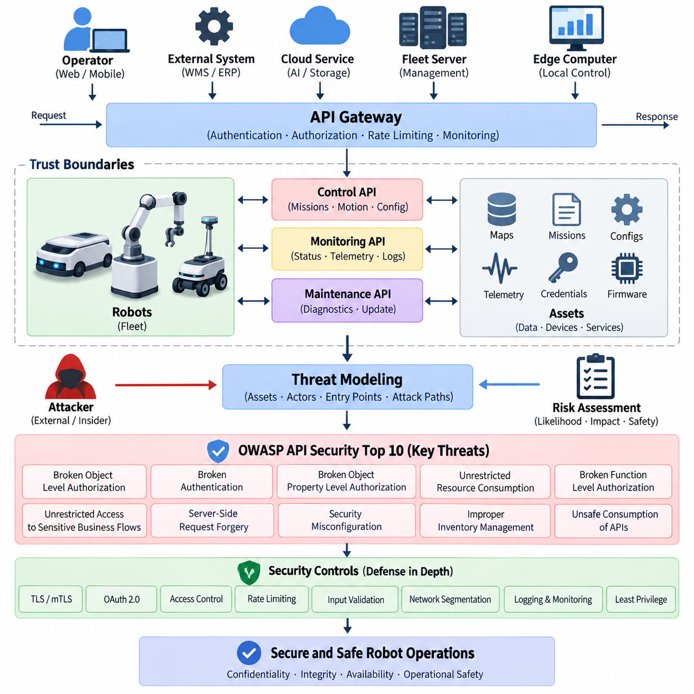
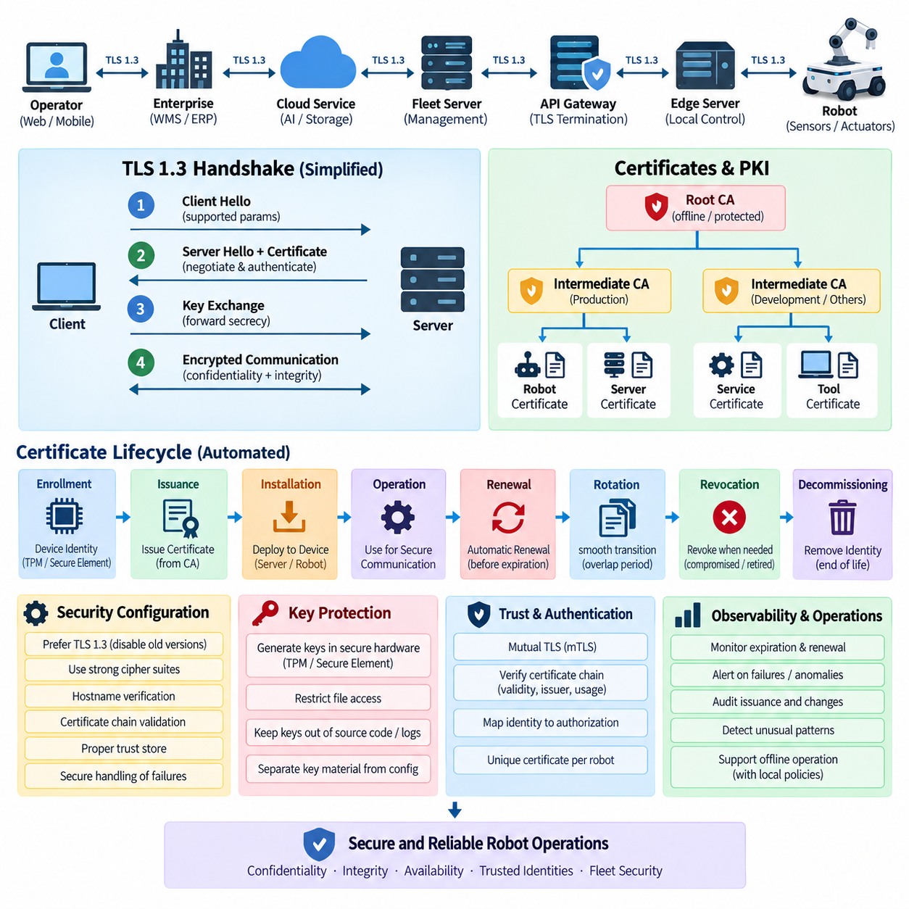
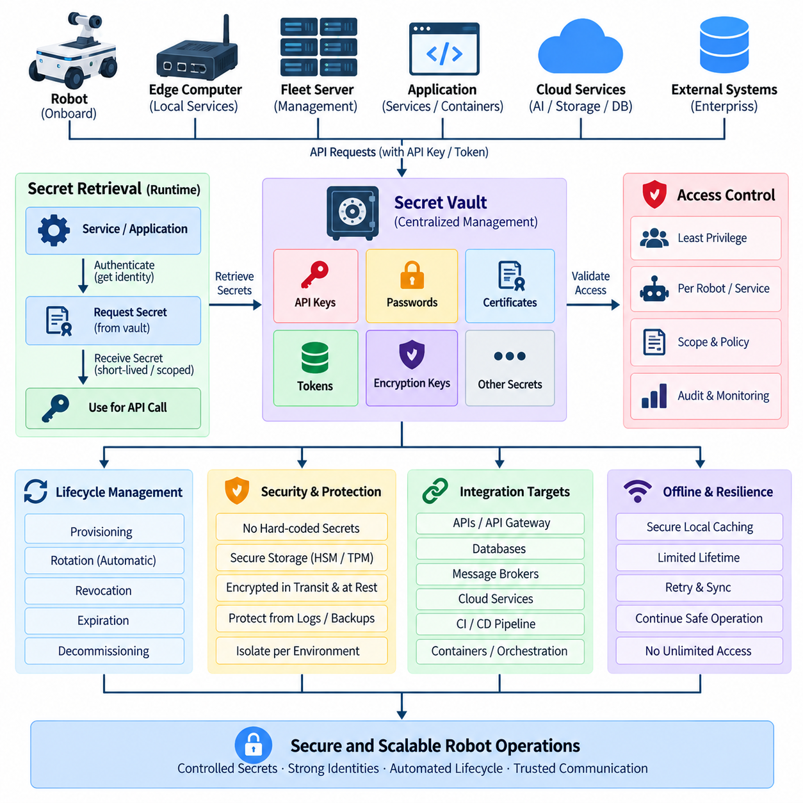
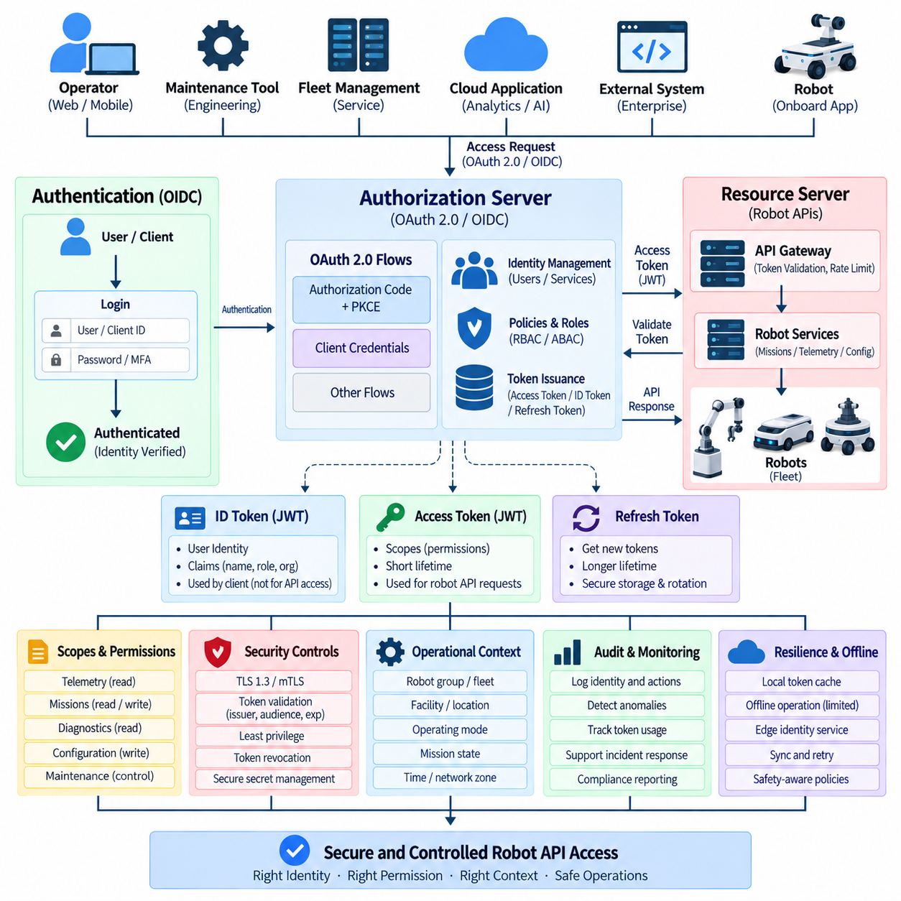
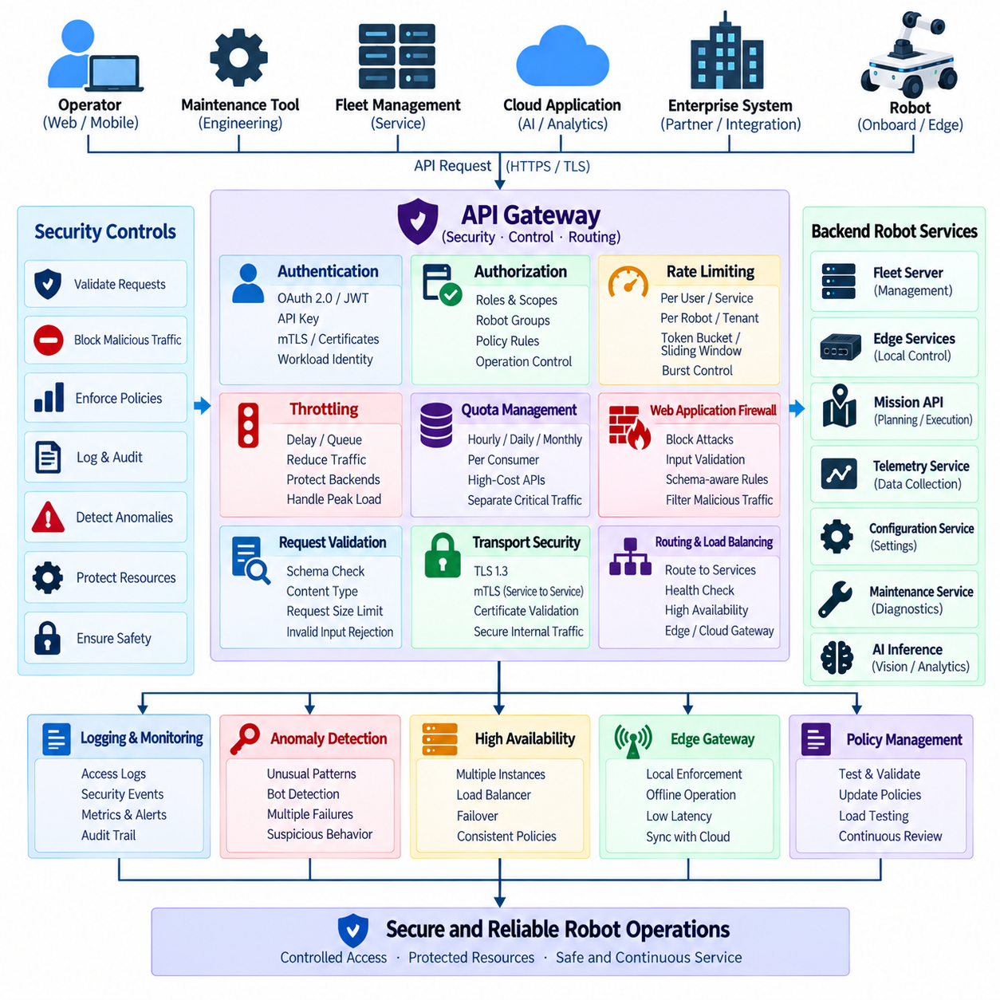
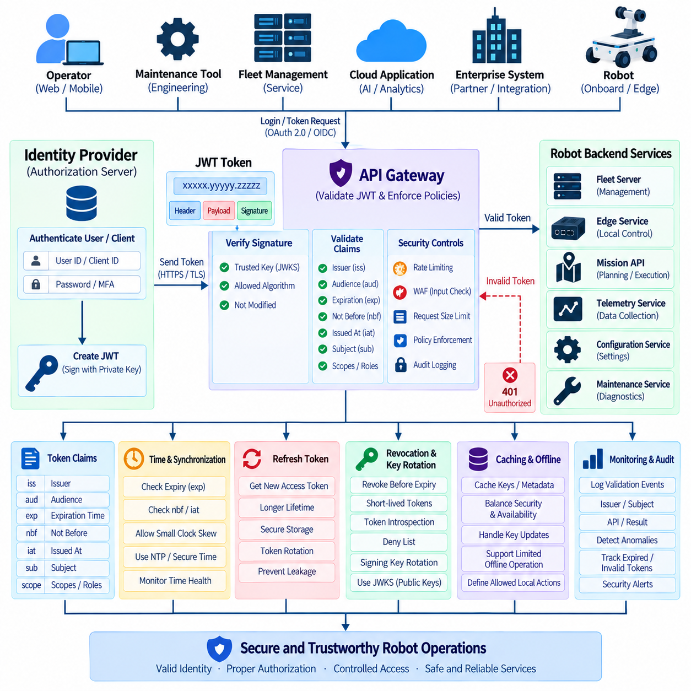
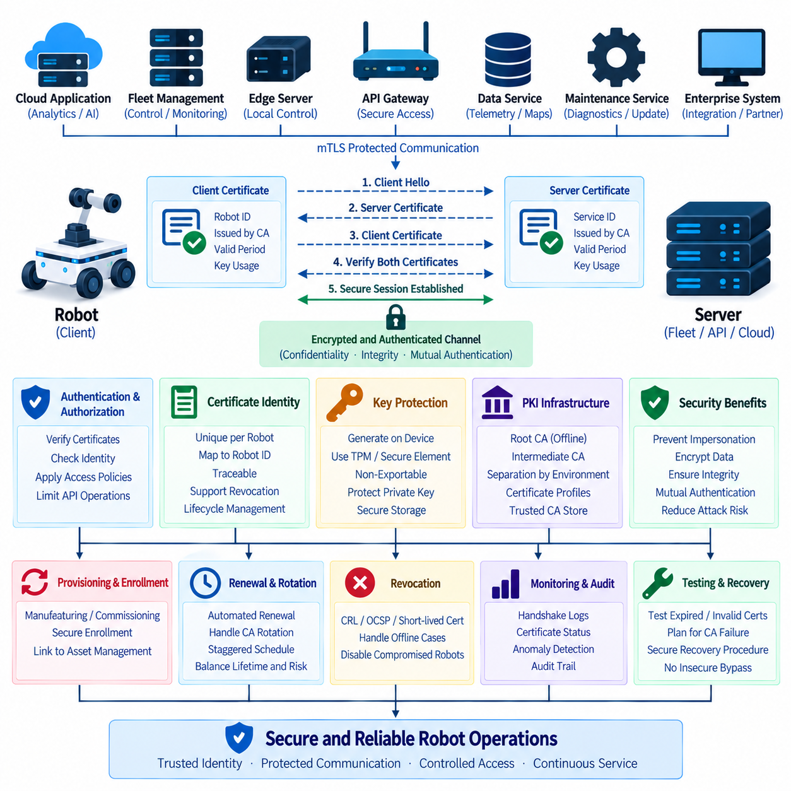
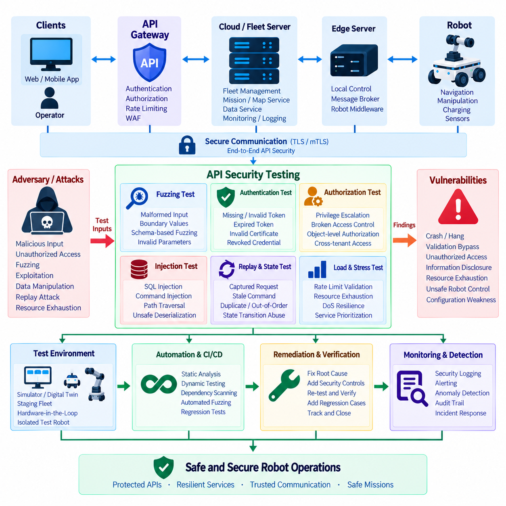
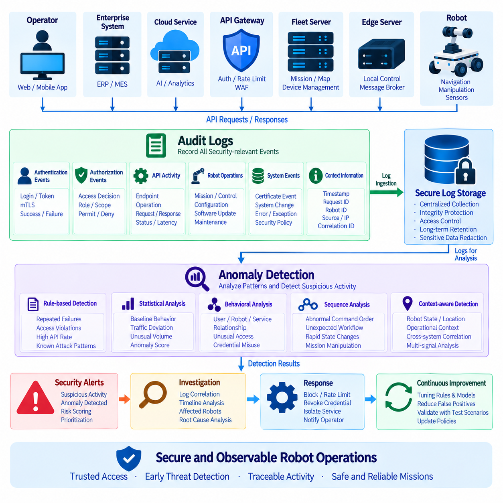
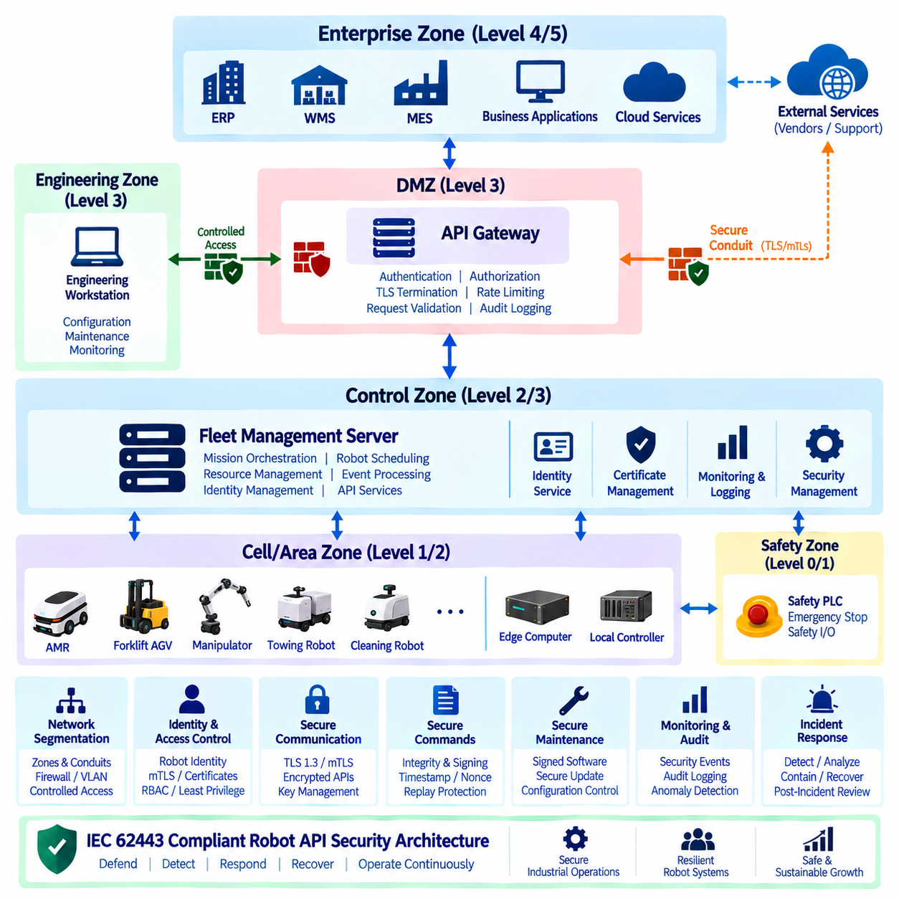

**Volume 06 Robot Communication and APIs**


# 10. API Security

##  

## 10.01 Robot API Threat Model: OWASP API Top 10

{width="7.268055555555556in" height="7.268055555555556in"}

Robot APIs form a security boundary between digital services and physical machines. Unlike conventional web APIs, a compromised robot interface can affect motion, navigation, manipulators, charging, sensors, or safety-related operations. Threat modeling must therefore examine not only confidentiality and data integrity but also whether an attacker could translate an API weakness into an unsafe physical action or loss of operational control.

A useful threat model begins by identifying assets, trust boundaries, actors, entry points, and possible attack paths. Robot identities, mission commands, maps, localization data, telemetry, credentials, firmware information, and fleet configurations are important assets. Trust boundaries commonly exist between robots, edge computers, fleet servers, cloud platforms, operator consoles, mobile applications, and external WMS or ERP systems.

The OWASP API Security Top 10 provides a practical framework for analyzing many of these attack paths. It should not be treated as a complete robot cybersecurity standard, but as a structured checklist for API-layer weaknesses. Robotics adds physical consequences to traditional API risks, so every identified vulnerability should be evaluated in terms of cyber impact, operational impact, and potential influence on robot behavior.

Broken Object Level Authorization becomes especially important when API resources represent individual robots, missions, maps, charging stations, or payloads. An endpoint such as \`/robots/{robot_id}/missions\` must verify that the authenticated principal is authorized to access the specified robot rather than merely checking that a valid token exists. Otherwise, changing an identifier could expose or modify another robot\'s resources.

Broken Authentication can allow an attacker to impersonate an operator, robot, fleet controller, or service. Weak passwords, improperly validated tokens, long-lived credentials, insecure API keys, or insufficient certificate validation can undermine the entire control architecture. Robot systems should establish strong identities for both human and machine clients and apply credential expiration, rotation, revocation, and secure storage throughout their lifecycle.

Broken Object Property Level Authorization occurs when clients can read or modify fields that should not be available to their role. A maintenance interface, for example, might legitimately expose diagnostic parameters while a normal fleet operator should see only operational status. Explicit request and response schemas, field-level authorization, input allowlists, and separation of administrative properties reduce accidental exposure and unauthorized modification.

Unrestricted Resource Consumption can become both a cybersecurity and availability problem. Repeated requests for camera frames, maps, AI inference, route calculation, logs, or high-frequency telemetry may exhaust CPU, GPU, memory, network bandwidth, storage, or battery resources. Rate limits should therefore consider robot-specific resources rather than request counts alone, with quotas and concurrency controls adapted to the computational cost of each operation.

Broken Function Level Authorization appears when users or services can invoke privileged functions simply because an endpoint is reachable. APIs for emergency state changes, remote driving, mission cancellation, map replacement, configuration, diagnostics, or software updates require stronger authorization than ordinary status queries. Roles and permissions should be enforced server-side, and high-impact commands may require additional policy or operational-state checks.

Unrestricted Access to Sensitive Business Flows concerns legitimate API functions that can be abused at scale or in an unintended sequence. In robotics, examples include repeatedly creating missions, reserving chargers, requesting expensive AI inference, dispatching robots, or triggering automated workflows. Protection requires understanding the business and operational meaning of API calls, not merely validating their syntax and authentication credentials.

Server-Side Request Forgery becomes relevant when robot or fleet services retrieve URLs supplied directly or indirectly by clients. Map downloads, firmware packages, diagnostic resources, webhook callbacks, AI models, and cloud storage objects may create such paths. Without destination restrictions, an attacker could attempt to reach internal services or protected network resources. URL validation, destination allowlists, network segmentation, and restricted egress reduce this exposure.

Security Misconfiguration includes unnecessary endpoints, default credentials, permissive cross-origin settings, verbose error messages, exposed debugging interfaces, weak TLS configurations, and incorrectly configured gateways. Robot deployments are particularly vulnerable to configuration drift because software may exist simultaneously on robots, edge devices, fleet servers, and cloud services. Secure baselines and automated configuration verification should therefore accompany deployment.

Improper Inventory Management emerges when organizations lose visibility of API versions, endpoints, test interfaces, deprecated services, or robot software generations. Long-lived fleets may contain different firmware and API versions operating simultaneously. An accurate inventory should connect every exposed interface with its owner, version, deployment location, authentication mechanism, supported robot generation, lifecycle status, and planned retirement date.

Unsafe Consumption of APIs addresses the assumption that data received from another API is trustworthy. Robots increasingly depend on cloud AI, mapping, traffic management, identity, warehouse, building, and third-party fleet services. Responses from these systems must still be authenticated, validated, bounded, and handled safely. A trusted provider does not eliminate risks caused by compromised accounts, malformed responses, integration errors, or upstream failures.

Robot threat modeling should extend these categories across the complete command path. A fleet instruction may travel from an operator application through an API gateway, cloud service, message broker, edge server, robot middleware, and finally a motion controller. Authentication at the first interface alone is insufficient. Identity, authorization, message integrity, freshness, command semantics, and trust transitions must be evaluated at each boundary.

Replay and command-manipulation threats deserve particular attention because apparently valid messages may still be dangerous. Command identifiers, timestamps, expiration periods, sequence numbers, nonces, or equivalent freshness mechanisms can help reject duplicated or stale requests. Idempotency rules are also important for mission and actuator-related operations, because network retries must not unintentionally cause the same physical action to be executed multiple times.

The threat model should distinguish monitoring APIs from control APIs. Telemetry disclosure can reveal maps, robot positions, operational schedules, facility layouts, or production activity, while compromise of a control interface may directly alter movement or missions. Separating read, command, configuration, maintenance, and software-update privileges enables more precise authorization and reduces the consequences of compromised credentials.

Defense in depth is essential because no single security mechanism can protect a distributed robotic system. TLS or mTLS can protect communication channels, OAuth 2.0 or comparable identity mechanisms can control access, and API gateways can enforce policies such as rate limiting and request validation. These controls should be complemented by network segmentation, least privilege, secure credential storage, audit logging, anomaly detection, and controlled key rotation.

Risk assessment should combine conventional cybersecurity criteria with physical and operational consequences. A vulnerability affecting a low-value telemetry field may have limited impact, whereas unauthorized modification of navigation constraints or safety-related parameters can create significant hazards. Threats should therefore be evaluated according to likelihood, technical impact, operational disruption, safety implications, recoverability, and the number of robots potentially affected.

A robot API threat model is not a one-time design document. New endpoints, cloud integrations, AI services, fleet functions, firmware releases, and third-party systems continuously modify the attack surface. Threat models should be revisited during architecture changes and supported by automated security testing, API schema validation, fuzzing, penetration testing, dependency monitoring, audit-log analysis, and periodic review of identities and privileges.

Ultimately, secure robot APIs require the OWASP API threat categories to be interpreted through the realities of physical systems. The objective is not simply to prevent unauthorized access to software resources, but to maintain trustworthy control from application to robot. A mature design assumes that components can fail or be compromised and ensures that authentication, authorization, validation, isolation, monitoring, and safety constraints limit the resulting consequences.

로봇 API(Robot API)는 디지털 서비스(Digital Service)와 물리적 기계(Physical Machine) 사이의 보안 경계(Security Boundary)를 형성한다. 일반적인 웹 API(Web API)와 달리 로봇 인터페이스(Robot Interface)가 침해되면 이동(Motion), 내비게이션(Navigation), 매니퓰레이터(Manipulator), 충전(Charging), 센서(Sensor), 안전 관련 동작(Safety-related Operation)에 직접적인 영향을 줄 수 있다. 따라서 위협 모델링(Threat Modeling)은 기밀성(Confidentiality)과 데이터 무결성(Data Integrity)뿐만 아니라 API 취약점(API Vulnerability)이 위험한 물리적 동작이나 운영 제어 상실로 이어질 가능성까지 분석해야 한다.

효과적인 위협 모델(Threat Model)은 자산(Asset), 신뢰 경계(Trust Boundary), 행위자(Actor), 진입점(Entry Point), 잠재적 공격 경로(Attack Path)를 식별하는 것에서 시작한다. 로봇 식별정보(Robot Identity), 임무 명령(Mission Command), 지도(Map), 위치추정 데이터(Localization Data), 텔레메트리(Telemetry), 인증정보(Credential), 펌웨어 정보(Firmware Information), 플릿 설정(Fleet Configuration)은 중요한 자산이다. 신뢰 경계는 일반적으로 로봇, 엣지 컴퓨터(Edge Computer), 플릿 서버(Fleet Server), 클라우드 플랫폼(Cloud Platform), 운영자 콘솔(Operator Console), 모바일 애플리케이션(Mobile Application), 외부 WMS 또는 ERP 시스템 사이에 존재한다.

OWASP API 보안 상위 10대 위험(OWASP API Security Top 10)은 이러한 공격 경로를 분석하기 위한 실용적인 프레임워크(Framework)를 제공한다. 이를 완전한 로봇 사이버보안 표준(Robot Cybersecurity Standard)으로 간주하기보다는 API 계층(API Layer)의 취약점을 체계적으로 검토하기 위한 점검 체계로 활용해야 한다. 로보틱스(Robotics)에서는 기존 API 위험에 물리적 결과가 추가되므로, 발견된 모든 취약점을 사이버 영향(Cyber Impact), 운영 영향(Operational Impact), 로봇 행동(Robot Behavior)에 미칠 잠재적 영향이라는 관점에서 평가해야 한다.

객체 수준 권한 부여 오류(Broken Object Level Authorization)는 API 자원이 개별 로봇, 임무(Mission), 지도, 충전소(Charging Station), 페이로드(Payload)를 나타낼 때 특히 중요하다. \`/robots/{robot_id}/missions\`와 같은 엔드포인트(Endpoint)는 단순히 유효한 토큰(Token)의 존재만 확인해서는 안 되며, 인증된 주체(Authenticated Principal)가 지정된 로봇에 접근할 권한이 있는지 검증해야 한다. 그렇지 않으면 식별자(Identifier)를 변경하는 것만으로 다른 로봇의 자원을 조회하거나 수정할 수 있다.

인증 오류(Broken Authentication)는 공격자가 운영자(Operator), 로봇, 플릿 컨트롤러(Fleet Controller), 서비스(Service)를 사칭할 수 있도록 한다. 취약한 비밀번호, 부적절하게 검증된 토큰, 장기간 유효한 인증정보, 안전하지 않은 API 키(API Key), 불충분한 인증서 검증(Certificate Validation)은 전체 제어 아키텍처(Control Architecture)를 약화시킬 수 있다. 로봇 시스템은 사람과 기계 클라이언트(Machine Client) 모두에 강력한 식별체계를 구축하고 인증정보의 만료(Expiration), 교체(Rotation), 폐기(Revocation), 안전한 저장(Secure Storage)을 전체 수명주기(Lifecycle)에 적용해야 한다.

객체 속성 수준 권한 부여 오류(Broken Object Property Level Authorization)는 클라이언트(Client)가 자신의 역할(Role)에 허용되지 않은 필드를 조회하거나 수정할 수 있을 때 발생한다. 예를 들어 유지보수 인터페이스(Maintenance Interface)는 진단 매개변수(Diagnostic Parameter)를 제공할 수 있지만 일반 플릿 운영자는 운영 상태만 확인하도록 제한할 수 있다. 명시적인 요청·응답 스키마(Request and Response Schema), 필드 수준 권한 부여(Field-level Authorization), 입력 허용목록(Input Allowlist), 관리 속성(Administrative Property)의 분리는 우발적인 정보 노출과 무단 변경을 줄인다.

무제한 자원 소비(Unrestricted Resource Consumption)는 사이버보안 문제인 동시에 가용성(Availability) 문제로 발전할 수 있다. 카메라 프레임(Camera Frame), 지도, AI 추론(AI Inference), 경로 계산(Route Calculation), 로그(Log), 고주파 텔레메트리를 반복적으로 요청하면 CPU, GPU, 메모리, 네트워크 대역폭(Network Bandwidth), 저장공간, 배터리 자원이 고갈될 수 있다. 따라서 속도 제한(Rate Limit)은 단순한 요청 횟수뿐 아니라 로봇의 실제 자원 소비량을 고려해야 하며, 각 작업의 계산 비용에 맞추어 할당량(Quota)과 동시성 제어(Concurrency Control)를 적용해야 한다.

기능 수준 권한 부여 오류(Broken Function Level Authorization)는 사용자나 서비스가 엔드포인트에 접근할 수 있다는 이유만으로 높은 권한의 기능을 실행할 수 있을 때 발생한다. 비상 상태 변경(Emergency State Change), 원격 주행(Remote Driving), 임무 취소(Mission Cancellation), 지도 교체(Map Replacement), 설정(Configuration), 진단(Diagnostics), 소프트웨어 업데이트(Software Update)를 위한 API는 일반적인 상태 조회보다 강력한 권한 검증이 필요하다. 역할과 권한은 서버 측(Server-side)에서 강제되어야 하며, 영향도가 높은 명령에는 추가 정책(Policy) 또는 운영 상태(Operation State) 검증을 적용할 수 있다.

민감한 비즈니스 흐름에 대한 무제한 접근(Unrestricted Access to Sensitive Business Flows)은 정상적인 API 기능이 대규모 또는 의도하지 않은 순서로 악용되는 문제를 의미한다. 로보틱스에서는 임무를 반복적으로 생성하거나, 충전기를 예약하거나, 비용이 높은 AI 추론을 지속적으로 요청하거나, 로봇을 반복 배차하거나, 자동화된 워크플로(Automated Workflow)를 비정상적으로 실행하는 사례가 포함될 수 있다. 이를 방어하려면 API 호출의 구문과 인증정보만 검사할 것이 아니라 해당 호출이 갖는 비즈니스 및 운영적 의미까지 이해해야 한다.

서버 측 요청 위조(Server-Side Request Forgery, SSRF)는 로봇 또는 플릿 서비스가 클라이언트가 직접 또는 간접적으로 제공한 URL을 가져올 때 중요해진다. 지도 다운로드(Map Download), 펌웨어 패키지(Firmware Package), 진단 자원(Diagnostic Resource), 웹훅 콜백(Webhook Callback), AI 모델(AI Model), 클라우드 저장 객체(Cloud Storage Object)가 이러한 경로를 만들 수 있다. 목적지 제한이 없다면 공격자는 내부 서비스나 보호된 네트워크 자원에 접근을 시도할 수 있으므로 URL 검증, 목적지 허용목록(Destination Allowlist), 네트워크 분할(Network Segmentation), 제한된 외부 통신(Restricted Egress)이 필요하다.

보안 설정 오류(Security Misconfiguration)에는 불필요한 엔드포인트, 기본 인증정보(Default Credential), 과도하게 허용적인 교차 출처 설정(Cross-Origin Setting), 상세한 오류 메시지, 노출된 디버깅 인터페이스(Debugging Interface), 취약한 TLS 설정 등이 포함된다. 로봇 소프트웨어는 로봇, 엣지 장치(Edge Device), 플릿 서버, 클라우드 서비스에 동시에 배포될 수 있어 설정 드리프트(Configuration Drift)에 특히 취약하다. 따라서 안전한 기준 설정(Secure Baseline)과 자동화된 설정 검증(Automated Configuration Verification)을 배포 과정에 포함해야 한다.

부적절한 인벤토리 관리(Improper Inventory Management)는 조직이 API 버전(API Version), 엔드포인트, 시험용 인터페이스(Test Interface), 폐기 예정 서비스(Deprecated Service), 로봇 소프트웨어 세대에 대한 가시성을 잃을 때 발생한다. 장기간 운영되는 플릿에는 서로 다른 펌웨어와 API 버전이 동시에 존재할 수 있다. 정확한 인벤토리(Inventory)는 모든 외부 노출 인터페이스를 담당자, 버전, 배포 위치, 인증 방식, 지원 로봇 세대, 수명주기 상태, 예정된 폐기 시점과 연결해야 한다.

안전하지 않은 API 사용(Unsafe Consumption of APIs)은 다른 API에서 전달받은 데이터를 신뢰할 수 있다고 가정하는 문제를 다룬다. 로봇은 점차 클라우드 AI(Cloud AI), 지도, 교통 관리(Traffic Management), 신원 관리(Identity), 창고 시스템(Warehouse System), 건물 시스템(Building System), 제3자 플릿 서비스(Third-party Fleet Service)에 의존하고 있다. 이러한 시스템에서 전달되는 응답 역시 인증되고 검증되어야 하며 허용 범위 내에서 안전하게 처리되어야 한다. 신뢰할 수 있는 공급자라고 하더라도 계정 침해, 비정상 응답, 통합 오류(Integration Error), 상위 시스템 장애(Upstream Failure)의 위험까지 제거되는 것은 아니다.

로봇 위협 모델링(Robot Threat Modeling)은 이러한 범주를 전체 명령 경로(Command Path)로 확장해야 한다. 하나의 플릿 명령은 운영자 애플리케이션에서 API 게이트웨이(API Gateway), 클라우드 서비스, 메시지 브로커(Message Broker), 엣지 서버, 로봇 미들웨어(Robot Middleware)를 거쳐 최종적으로 모션 컨트롤러(Motion Controller)에 전달될 수 있다. 최초 인터페이스에서의 인증만으로는 충분하지 않으며, 각 신뢰 경계에서 식별(Identity), 권한 부여(Authorization), 메시지 무결성(Message Integrity), 최신성(Freshness), 명령 의미론(Command Semantics), 신뢰 전환(Trust Transition)을 검증해야 한다.

재전송 공격(Replay Attack)과 명령 변조(Command Manipulation)는 겉으로는 유효해 보이는 메시지도 위험할 수 있기 때문에 특별한 주의가 필요하다. 명령 식별자(Command Identifier), 타임스탬프(Timestamp), 만료 시간(Expiration Period), 시퀀스 번호(Sequence Number), 논스(Nonce) 또는 이에 상응하는 최신성 검증 메커니즘을 활용하면 중복되거나 오래된 요청을 거부할 수 있다. 네트워크 재시도(Network Retry)가 동일한 물리적 동작을 의도치 않게 여러 번 실행해서는 안 되므로 임무 및 액추에이터 관련 작업에는 멱등성(Idempotency) 규칙도 중요하다.

위협 모델은 모니터링 API(Monitoring API)와 제어 API(Control API)를 구분해야 한다. 텔레메트리 정보 유출은 지도, 로봇 위치, 운영 일정, 시설 배치, 생산 활동을 노출할 수 있으며, 제어 인터페이스의 침해는 로봇의 이동이나 임무를 직접 변경할 수 있다. 읽기(Read), 명령(Command), 설정(Configuration), 유지보수(Maintenance), 소프트웨어 업데이트 권한을 분리하면 보다 정밀한 권한 부여가 가능하고 인증정보가 침해되었을 때의 피해 범위를 줄일 수 있다.

심층 방어(Defense in Depth)는 단일 보안 메커니즘만으로 분산 로봇 시스템(Distributed Robotic System)을 보호할 수 없기 때문에 필수적이다. TLS 또는 상호 TLS(mutual TLS, mTLS)는 통신 채널을 보호하고, OAuth 2.0 또는 이에 상응하는 신원 관리 메커니즘은 접근을 제어하며, API 게이트웨이는 속도 제한과 요청 검증 등의 정책을 적용할 수 있다. 여기에 네트워크 분할, 최소 권한(Least Privilege), 안전한 인증정보 저장, 감사 로그(Audit Logging), 이상 탐지(Anomaly Detection), 통제된 키 교체(Key Rotation)를 함께 적용해야 한다.

위험 평가(Risk Assessment)는 기존 사이버보안 기준과 물리적·운영적 결과를 결합해야 한다. 중요도가 낮은 텔레메트리 필드의 취약점은 제한적인 영향을 미칠 수 있지만, 내비게이션 제약조건(Navigation Constraint)이나 안전 관련 매개변수의 무단 변경은 중대한 위험을 발생시킬 수 있다. 따라서 위협은 발생 가능성(Likelihood), 기술적 영향(Technical Impact), 운영 중단(Operational Disruption), 안전 영향(Safety Implication), 복구 가능성(Recoverability), 잠재적으로 영향을 받는 로봇의 수를 기준으로 평가해야 한다.

로봇 API 위협 모델은 일회성 설계 문서가 아니다. 새로운 엔드포인트, 클라우드 통합(Cloud Integration), AI 서비스, 플릿 기능, 펌웨어 릴리스(Firmware Release), 제3자 시스템이 추가될 때마다 공격 표면(Attack Surface)은 지속적으로 변화한다. 따라서 아키텍처 변경 시 위협 모델을 다시 검토하고 자동화된 보안 시험(Automated Security Testing), API 스키마 검증, 퍼징(Fuzzing), 침투 시험(Penetration Testing), 의존성 모니터링(Dependency Monitoring), 감사 로그 분석, 식별정보와 권한에 대한 주기적인 검토를 수행해야 한다.

궁극적으로 안전한 로봇 API를 구축하려면 OWASP API 위협 범주를 물리적 시스템(Physical System)의 현실에 맞게 해석해야 한다. 목표는 단순히 소프트웨어 자원에 대한 무단 접근을 차단하는 것이 아니라 애플리케이션에서 로봇까지 이어지는 신뢰 가능한 제어(Trustworthy Control)를 유지하는 것이다. 성숙한 설계는 구성요소가 장애를 일으키거나 침해될 수 있음을 전제로 하며, 인증(Authentication), 권한 부여, 검증(Validation), 격리(Isolation), 모니터링(Monitoring), 안전 제약조건(Safety Constraint)을 통해 그 결과와 피해 범위를 제한해야 한다.

##  

## 10.02 TLS 1.3 Configuration and Cert Management Auto [w/Code]

{width="7.268055555555556in" height="7.268055555555556in"}

TLS 1.3 provides the transport-security foundation for robot APIs that exchange commands, telemetry, diagnostics, configuration data, and software-management information across untrusted or shared networks. Compared with earlier TLS generations, it simplifies protocol negotiation, removes obsolete cryptographic mechanisms, and reduces handshake overhead. In robotic systems, these properties help protect confidentiality and integrity without unnecessarily increasing communication latency.

A typical robot deployment contains multiple encrypted communication paths rather than a single TLS connection. Robots may communicate with edge servers, fleet-management systems, API gateways, cloud services, message brokers, maintenance tools, and external enterprise applications. Each connection crosses a different trust boundary and may require a different certificate policy. TLS configuration should therefore be designed as part of the overall robot communication architecture rather than added independently to individual APIs.

TLS 1.3 begins with a handshake in which the client and server negotiate supported parameters, establish shared cryptographic secrets, and authenticate the server through its certificate. Modern key-exchange mechanisms provide forward secrecy, meaning that later compromise of a long-term private key should not automatically expose previously captured sessions. After the handshake, application traffic is protected using authenticated encryption, providing both confidentiality and integrity for transmitted API messages.

Secure configuration should explicitly prefer TLS 1.3 while controlling compatibility with older clients according to deployment requirements. Obsolete SSL and early TLS versions should not remain enabled simply for convenience. Cipher configuration should follow the implementations supported by the selected TLS library and platform, while unnecessary legacy algorithms should be removed. Configuration must also include hostname verification, certificate-chain validation, appropriate trust stores, and secure handling of negotiation failures.

Certificates bind cryptographic identities to robots, servers, gateways, or services. In a large fleet, every robot should normally possess a unique machine identity instead of sharing one certificate and private key across all units. Unique identities enable individual authorization, auditing, certificate expiration, and revocation. If one robot is compromised, its credential can be disabled without forcing the organization to replace the credentials of every other robot in the fleet.

A public key infrastructure, or PKI, provides the trust framework required to issue and manage these certificates. A common architecture uses an offline or strongly protected root certificate authority and one or more intermediate certificate authorities for operational issuance. Separate intermediates may be assigned to production robots, development systems, backend services, or manufacturing environments, reducing the impact of a compromised issuing authority and supporting clearer lifecycle policies.

Certificate provisioning begins before a robot enters normal operation. During manufacturing, commissioning, or secure enrollment, the device establishes an initial identity and receives the credentials required to join the operational environment. Private keys should preferably be generated and retained inside protected hardware such as a TPM, secure element, or equivalent trusted key storage when available. Exportable private-key files should be minimized because copying them effectively duplicates the device identity.

Manual certificate management becomes impractical once a fleet grows beyond a small number of robots. Automated certificate management should therefore cover enrollment, issuance, installation, renewal, validation, rotation, revocation, and retirement. The automation service must maintain an authoritative relationship between certificate identity and robot identity so that a certificate cannot accidentally be issued to the wrong device or remain active after the corresponding robot has been decommissioned.

Automatic renewal reduces the operational risk created by expired certificates. Robots should begin renewal sufficiently before expiration and use retry mechanisms that tolerate temporary network outages or unavailable certificate services. Renewal schedules should avoid causing the entire fleet to request certificates simultaneously. Randomized renewal windows, staged operations, and local retry queues can prevent a certificate-management service from becoming overloaded when thousands of devices approach expiration.

Short-lived certificates can reduce the period during which stolen credentials remain useful, but certificate lifetime must reflect operational realities. Robots may remain offline for extended periods, operate on isolated industrial networks, or lose cloud connectivity while continuing local missions. Certificate policy must therefore balance security with availability. Edge-based enrollment services, local certificate authorities, or controlled grace strategies may be required for environments where continuous external connectivity cannot be assumed.

Mutual TLS, or mTLS, extends TLS by requiring both sides of a connection to authenticate with certificates. This is particularly useful for robot-to-server, edge-to-cloud, and service-to-service communication because the server can verify the identity of the connecting robot while the robot verifies the server. The authenticated certificate identity can then be mapped to authorization policies that define which APIs, robot groups, missions, or resources each machine is permitted to access.

Certificate validation must go beyond checking whether a certificate file exists. The receiving system should verify the certificate chain, validity period, expected issuer, identity attributes, intended usage, and revocation status where applicable. Server clients must also verify that the certificate corresponds to the expected service identity. Disabling certificate verification during development may simplify testing, but such exceptions must never silently migrate into production robot configurations.

Revocation is required when a private key is suspected of compromise, a robot is stolen, a service is retired, or an identity should no longer be trusted. Certificate revocation lists and online status mechanisms can support this process, although their suitability depends on network architecture and availability requirements. Short certificate lifetimes can complement revocation by limiting credential exposure, but they do not eliminate the need for an emergency mechanism to distrust a compromised identity.

Private-key protection is as important as certificate validation. Keys stored as ordinary files can be exposed through filesystem access, backups, diagnostic packages, container images, or incorrectly configured deployment scripts. Access permissions should be restrictive, secrets should not appear in source repositories or logs, and key material should be separated from application configuration. Hardware-backed storage further reduces the possibility of extracting a robot\'s long-term identity.

Certificate rotation should be designed so that communication remains available during credential transitions. Systems may temporarily accept both the current and replacement trust chains while certificates are updated across robots, gateways, and servers. This overlap must be controlled and time-bounded. Abrupt replacement of a certificate authority without coordinated trust-store updates can disconnect an entire fleet even when every individual component is functioning correctly.

Robots operating in offline-first architectures require special certificate-management logic. A robot should not immediately become unsafe or unusable merely because a remote certificate authority cannot be reached. Existing valid sessions and credentials can support continued local operation according to policy, while renewal requests are queued until connectivity returns. However, offline resilience must not become unlimited acceptance of expired or unverified credentials, especially for remote-control interfaces.

TLS termination must also be carefully located. An API gateway or reverse proxy may terminate an external TLS connection and establish another protected connection toward an internal service. If traffic becomes unencrypted after termination, the internal network becomes an implicit trust zone that attackers may exploit. Sensitive robot command paths should preserve encryption and authenticated identities across internal service boundaries, particularly between gateways, fleet servers, edge nodes, and robots.

Observability is necessary for reliable certificate automation. Monitoring systems should track certificate expiration, renewal failures, unknown issuers, handshake errors, rejected identities, unusual authentication patterns, and changes to trust stores. Alerts should be generated well before expiration becomes operationally critical. Audit records should identify which certificate was issued to which robot, when it was renewed or revoked, and which authority performed the operation.

Automation itself becomes a high-value security component because compromise of the certificate-management service could allow an attacker to create trusted identities. Enrollment services, certificate authorities, signing keys, automation credentials, and administrative interfaces therefore require strict access control and segmentation. High-value signing keys should receive stronger protection than ordinary application credentials, and certificate issuance events should be independently logged and monitored.

Testing should include more than confirming that HTTPS or another TLS-protected protocol successfully connects. Robot API validation should test expired certificates, unknown certificate authorities, incorrect service identities, revoked credentials, damaged certificate chains, clock errors, failed renewals, network interruptions, and certificate rotation. Fleet-scale testing should additionally verify that simultaneous or staged renewal operations do not overload gateways, enrollment services, or network infrastructure.

A mature TLS 1.3 architecture combines secure protocol configuration with automated identity lifecycle management. Encryption protects data in transit, certificates establish machine identities, PKI defines trust relationships, and automation keeps those relationships operational throughout deployment. For robotic systems, the objective is not merely to display a secure connection indicator, but to maintain authenticated and encrypted communication from robot commissioning through operation, maintenance, certificate rotation, and final decommissioning.

TLS 1.3은 신뢰할 수 없거나 공유된 네트워크를 통해 명령(Command), 텔레메트리(Telemetry), 진단(Diagnostics), 설정 데이터(Configuration Data), 소프트웨어 관리 정보(Software Management Information)를 교환하는 로봇 API(Robot API)의 전송 보안(Transport Security) 기반을 제공한다. 이전 TLS 세대와 비교하면 프로토콜 협상(Protocol Negotiation)을 단순화하고 오래된 암호화 메커니즘을 제거하며 핸드셰이크(Handshake) 오버헤드를 줄인다. 로봇 시스템에서는 이러한 특성을 통해 통신 지연을 불필요하게 증가시키지 않으면서 기밀성(Confidentiality)과 무결성(Integrity)을 보호할 수 있다.

일반적인 로봇 배포 환경(Robot Deployment Environment)에는 하나의 TLS 연결이 아니라 여러 개의 암호화된 통신 경로(Encrypted Communication Path)가 존재한다. 로봇은 엣지 서버(Edge Server), 플릿 관리 시스템(Fleet Management System), API 게이트웨이(API Gateway), 클라우드 서비스(Cloud Service), 메시지 브로커(Message Broker), 유지보수 도구(Maintenance Tool), 외부 기업 애플리케이션(Enterprise Application)과 통신할 수 있다. 각각의 연결은 서로 다른 신뢰 경계(Trust Boundary)를 통과하며 서로 다른 인증서 정책(Certificate Policy)이 필요할 수 있으므로, TLS 설정은 개별 API에 독립적으로 추가하기보다 전체 로봇 통신 아키텍처(Robot Communication Architecture)의 일부로 설계해야 한다.

TLS 1.3은 클라이언트(Client)와 서버(Server)가 지원되는 매개변수를 협상하고 공유 암호화 비밀정보(Shared Cryptographic Secret)를 설정하며 인증서(Certificate)를 통해 서버를 인증하는 핸드셰이크 과정으로 시작된다. 최신 키 교환 메커니즘(Key Exchange Mechanism)은 순방향 비밀성(Forward Secrecy)을 제공하므로 장기 개인 키(Long-term Private Key)가 이후에 침해되더라도 과거에 수집된 세션(Session)이 자동으로 노출되는 것을 방지할 수 있다. 핸드셰이크 이후 애플리케이션 트래픽(Application Traffic)은 인증된 암호화(Authenticated Encryption)를 통해 보호되어 API 메시지의 기밀성과 무결성을 동시에 확보한다.

안전한 설정(Secure Configuration)은 TLS 1.3을 명시적으로 우선 적용하면서 배포 요구사항에 따라 구형 클라이언트와의 호환성을 통제해야 한다. 오래된 SSL 및 초기 TLS 버전을 단순한 편의성을 위해 활성화해서는 안 된다. 암호 스위트 설정(Cipher Configuration)은 선택된 TLS 라이브러리와 플랫폼이 지원하는 구현 방식을 따라야 하며 불필요한 레거시 알고리즘(Legacy Algorithm)은 제거해야 한다. 또한 호스트 이름 검증(Hostname Verification), 인증서 체인 검증(Certificate-chain Validation), 적절한 신뢰 저장소(Trust Store), 협상 실패의 안전한 처리를 포함해야 한다.

인증서(Certificate)는 암호학적 신원(Cryptographic Identity)을 로봇, 서버, 게이트웨이 또는 서비스와 연결한다. 대규모 플릿(Fleet)에서는 모든 장치가 하나의 인증서와 개인 키를 공유하기보다 각각의 로봇이 고유한 기계 신원(Machine Identity)을 갖는 것이 일반적으로 바람직하다. 고유 신원을 사용하면 개별 권한 부여(Authorization), 감사(Auditing), 인증서 만료(Expiration), 폐기(Revocation)가 가능하다. 특정 로봇이 침해되더라도 전체 플릿의 인증정보를 교체하지 않고 해당 로봇의 인증정보만 비활성화할 수 있다.

공개 키 기반구조(Public Key Infrastructure, PKI)는 이러한 인증서를 발급하고 관리하는 데 필요한 신뢰 프레임워크(Trust Framework)를 제공한다. 일반적인 아키텍처에서는 오프라인(Offline) 상태이거나 강력하게 보호된 루트 인증기관(Root Certificate Authority)과 운영 인증서 발급을 위한 하나 이상의 중간 인증기관(Intermediate Certificate Authority)을 사용한다. 생산 로봇, 개발 시스템, 백엔드 서비스(Backend Service), 제조 환경(Manufacturing Environment)에 별도의 중간 인증기관을 할당하면 발급기관 침해의 영향을 줄이고 보다 명확한 수명주기 정책(Lifecycle Policy)을 적용할 수 있다.

인증서 프로비저닝(Certificate Provisioning)은 로봇이 정상적인 운영에 들어가기 전에 시작된다. 제조(Manufacturing), 커미셔닝(Commissioning) 또는 안전한 등록(Secure Enrollment) 과정에서 장치는 초기 신원(Initial Identity)을 설정하고 운영 환경에 참여하는 데 필요한 인증정보를 발급받는다. 가능하다면 개인 키는 TPM, 보안 요소(Secure Element) 또는 이에 상응하는 신뢰할 수 있는 키 저장소(Trusted Key Storage) 내부에서 생성하고 유지하는 것이 바람직하다. 개인 키 파일을 외부로 내보내는 방식은 키 복사가 사실상 장치 신원의 복제를 의미하므로 최소화해야 한다.

플릿 규모가 일정 수준 이상으로 증가하면 수동 인증서 관리(Manual Certificate Management)는 실용적이지 않다. 따라서 자동화된 인증서 관리(Automated Certificate Management)는 등록, 발급(Issuance), 설치(Installation), 갱신(Renewal), 검증(Validation), 교체(Rotation), 폐기, 최종 종료(Retirement)를 포괄해야 한다. 자동화 서비스는 인증서 신원과 로봇 신원 사이의 권위 있는 관계(Authoritative Relationship)를 유지하여 잘못된 장치에 인증서가 발급되거나 폐기된 로봇의 인증서가 계속 활성화되는 상황을 방지해야 한다.

자동 갱신(Automatic Renewal)은 인증서 만료로 발생하는 운영 위험(Operational Risk)을 감소시킨다. 로봇은 인증서가 만료되기 충분한 시간 전에 갱신을 시작하고 일시적인 네트워크 장애나 인증서 서비스 중단을 견딜 수 있는 재시도 메커니즘(Retry Mechanism)을 사용해야 한다. 전체 플릿이 동시에 인증서를 요청하지 않도록 갱신 일정을 분산해야 한다. 무작위화된 갱신 구간(Randomized Renewal Window), 단계적 운영(Staged Operation), 로컬 재시도 큐(Local Retry Queue)를 활용하면 수천 대의 장치가 비슷한 시점에 만료되더라도 인증서 관리 서비스의 과부하를 방지할 수 있다.

단기 인증서(Short-lived Certificate)는 탈취된 인증정보가 유효하게 사용될 수 있는 기간을 줄일 수 있지만, 인증서 수명은 실제 운영 환경을 고려해야 한다. 로봇은 장기간 오프라인으로 운영되거나 격리된 산업 네트워크(Isolated Industrial Network)에서 동작할 수 있으며, 클라우드 연결이 끊어진 상태에서도 로컬 임무(Local Mission)를 계속 수행할 수 있다. 따라서 인증서 정책은 보안(Security)과 가용성(Availability) 사이에서 균형을 유지해야 한다. 지속적인 외부 연결을 보장할 수 없는 환경에서는 엣지 기반 등록 서비스(Edge-based Enrollment Service), 로컬 인증기관(Local Certificate Authority), 통제된 유예 전략(Controlled Grace Strategy)이 필요할 수 있다.

상호 TLS(Mutual TLS, mTLS)는 연결의 양측 모두가 인증서를 이용하여 서로를 인증하도록 TLS를 확장한 방식이다. 서버가 연결하는 로봇의 신원을 검증하고 동시에 로봇도 서버의 신원을 검증할 수 있기 때문에 로봇-서버(Robot-to-Server), 엣지-클라우드(Edge-to-Cloud), 서비스 간(Service-to-Service) 통신에 특히 유용하다. 인증된 인증서 신원은 각 장치가 접근할 수 있는 API, 로봇 그룹, 임무 또는 자원을 정의하는 권한 정책(Authorization Policy)에 연결할 수 있다.

인증서 검증(Certificate Validation)은 단순히 인증서 파일의 존재 여부를 확인하는 것 이상이어야 한다. 수신 시스템은 인증서 체인(Certificate Chain), 유효기간(Validity Period), 예상 발급자(Expected Issuer), 신원 속성(Identity Attribute), 의도된 사용 목적(Intended Usage), 필요한 경우 폐기 상태(Revocation Status)를 검증해야 한다. 서버에 연결하는 클라이언트는 인증서가 예상된 서비스 신원(Service Identity)과 일치하는지도 확인해야 한다. 개발 과정에서 인증서 검증을 비활성화하면 시험은 간편해질 수 있지만 이러한 예외 설정이 운영 로봇 환경으로 그대로 이전되어서는 안 된다.

개인 키(Private Key)가 침해된 것으로 의심되거나 로봇이 도난당했거나 서비스가 폐기되었거나 특정 신원을 더 이상 신뢰해서는 안 되는 경우 인증서 폐기(Revocation)가 필요하다. 인증서 폐기 목록(Certificate Revocation List)과 온라인 상태 확인 메커니즘(Online Status Mechanism)을 활용할 수 있지만 적합성은 네트워크 아키텍처와 가용성 요구사항에 따라 달라진다. 짧은 인증서 수명은 인증정보 노출 기간을 제한하여 폐기 체계를 보완할 수 있지만, 침해된 신원을 긴급하게 신뢰 해제하는 메커니즘의 필요성을 제거하지는 않는다.

개인 키 보호(Private-key Protection)는 인증서 검증만큼 중요하다. 일반 파일 형태로 저장된 키는 파일시스템 접근, 백업(Backup), 진단 패키지(Diagnostic Package), 컨테이너 이미지(Container Image), 잘못 구성된 배포 스크립트(Deployment Script)를 통해 노출될 수 있다. 접근 권한은 엄격하게 제한하고 비밀정보(Secret)가 소스 저장소(Source Repository)나 로그에 포함되지 않도록 해야 하며 키 자료(Key Material)는 애플리케이션 설정과 분리해야 한다. 하드웨어 기반 저장소(Hardware-backed Storage)를 사용하면 로봇의 장기 신원이 추출될 가능성을 더욱 낮출 수 있다.

인증서 교체(Certificate Rotation)는 인증정보가 전환되는 동안에도 통신이 유지되도록 설계해야 한다. 로봇, 게이트웨이, 서버에서 인증서가 업데이트되는 동안 시스템은 현재 신뢰 체인(Current Trust Chain)과 새로운 신뢰 체인(Replacement Trust Chain)을 일시적으로 모두 허용할 수 있다. 그러나 이러한 중첩 기간(Overlap Period)은 통제되고 시간적으로 제한되어야 한다. 신뢰 저장소가 조정되지 않은 상태에서 인증기관을 갑자기 교체하면 개별 구성요소가 정상적으로 동작하더라도 전체 플릿의 연결이 끊어질 수 있다.

오프라인 우선 아키텍처(Offline-first Architecture)에서 운영되는 로봇에는 특별한 인증서 관리 로직(Certificate-management Logic)이 필요하다. 원격 인증기관에 접근할 수 없다는 이유만으로 로봇이 즉시 위험하거나 사용할 수 없는 상태가 되어서는 안 된다. 기존의 유효한 세션과 인증정보를 이용하여 정책에 따라 로컬 운영(Local Operation)을 계속 수행하면서 연결이 복구될 때까지 갱신 요청을 대기열에 저장할 수 있다. 그러나 오프라인 복원력(Offline Resilience)이 특히 원격 제어 인터페이스에서 만료되거나 검증되지 않은 인증정보를 무제한으로 허용하는 방식으로 구현되어서는 안 된다.

TLS 종료(TLS Termination)의 위치 역시 신중하게 결정해야 한다. API 게이트웨이 또는 리버스 프록시(Reverse Proxy)가 외부 TLS 연결을 종료하고 내부 서비스를 향해 새로운 보호 연결을 구성할 수 있다. TLS 종료 이후 트래픽이 암호화되지 않는다면 내부 네트워크가 공격자가 악용할 수 있는 암묵적인 신뢰 영역(Implicit Trust Zone)이 된다. 민감한 로봇 명령 경로는 특히 게이트웨이, 플릿 서버, 엣지 노드(Edge Node), 로봇 사이에서 내부 서비스 경계를 통과할 때도 암호화와 인증된 신원을 유지해야 한다.

신뢰할 수 있는 인증서 자동화를 위해서는 관측 가능성(Observability)이 필요하다. 모니터링 시스템은 인증서 만료, 갱신 실패, 알 수 없는 발급자(Unknown Issuer), 핸드셰이크 오류, 거부된 신원(Rejected Identity), 비정상 인증 패턴(Unusual Authentication Pattern), 신뢰 저장소 변경을 추적해야 한다. 인증서 만료가 운영상 심각한 문제가 되기 전에 경고(Alert)를 생성해야 한다. 감사 기록(Audit Record)은 어떤 인증서가 어떤 로봇에 발급되었는지, 언제 갱신 또는 폐기되었는지, 어떤 인증기관이 해당 작업을 수행했는지를 식별할 수 있어야 한다.

자동화 시스템 자체도 높은 가치의 보안 구성요소(High-value Security Component)가 된다. 인증서 관리 서비스가 침해되면 공격자가 신뢰할 수 있는 새로운 신원을 생성할 수 있기 때문이다. 따라서 등록 서비스, 인증기관, 서명 키(Signing Key), 자동화 인증정보(Automation Credential), 관리 인터페이스(Administrative Interface)에는 엄격한 접근 제어(Access Control)와 네트워크 분할(Network Segmentation)을 적용해야 한다. 중요도가 높은 서명 키는 일반 애플리케이션 인증정보보다 강력하게 보호해야 하며 인증서 발급 이벤트(Certificate Issuance Event)는 독립적으로 기록하고 모니터링해야 한다.

시험(Testing)은 HTTPS 또는 다른 TLS 보호 프로토콜이 정상적으로 연결되는지 확인하는 것에 그쳐서는 안 된다. 로봇 API 검증(Robot API Validation)에서는 만료된 인증서, 알 수 없는 인증기관, 잘못된 서비스 신원, 폐기된 인증정보, 손상된 인증서 체인, 시스템 시간 오류(Clock Error), 갱신 실패, 네트워크 중단, 인증서 교체 상황을 시험해야 한다. 플릿 규모 시험(Fleet-scale Testing)에서는 동시 또는 단계적 갱신 작업이 게이트웨이, 등록 서비스, 네트워크 인프라(Network Infrastructure)에 과부하를 발생시키지 않는지도 추가로 검증해야 한다.

성숙한 TLS 1.3 아키텍처(TLS 1.3 Architecture)는 안전한 프로토콜 설정과 자동화된 신원 수명주기 관리(Automated Identity Lifecycle Management)를 결합한다. 암호화(Encryption)는 전송 중 데이터(Data in Transit)를 보호하고, 인증서는 기계 신원을 확립하며, PKI는 신뢰 관계(Trust Relationship)를 정의하고, 자동화는 이러한 관계가 전체 배포 과정에서 지속적으로 유지되도록 한다. 로봇 시스템의 목표는 단순히 보안 연결 표시를 제공하는 것이 아니라 로봇 커미셔닝부터 운영, 유지보수, 인증서 교체, 최종 폐기(Decommissioning)에 이르기까지 인증되고 암호화된 통신(Authenticated and Encrypted Communication)을 지속적으로 유지하는 것이다.

##  

## 10.03 API Key Management and Secret Vault Integration [w/Code]

{width="7.268055555555556in" height="7.268055555555556in"}

API keys and secrets are fundamental credentials in robot communication architectures because they allow software components to authenticate when accessing APIs, cloud services, databases, message brokers, AI platforms, storage systems, and enterprise applications. In a distributed robot environment, these credentials may exist across robots, edge computers, fleet servers, API gateways, containers, and cloud workloads, making centralized lifecycle management essential.

An API key is typically a machine-readable credential associated with an application, service, robot, or integration rather than a human user. Although API keys are simple to implement, possession of a valid key may be sufficient to access protected resources. They should therefore be treated as sensitive secrets rather than ordinary configuration values, with explicit ownership, scope, expiration, rotation, revocation, and auditing policies throughout their operational lifecycle.

Robot systems should avoid sharing a single API key across an entire fleet. If hundreds of robots use the same credential, compromise of one device can expose every system using that key and make individual revocation difficult. Assigning credentials to specific robots, services, workloads, or deployment groups creates smaller security domains. This approach also improves traceability because API activity can be associated with a particular machine identity or software component.

Secrets should never be embedded directly in application source code, configuration templates, container images, firmware repositories, or deployment scripts. Hard-coded credentials can remain in version-control history even after the visible value has been removed. They may also propagate through backups, development machines, CI/CD artifacts, and copied software packages. Applications should instead obtain secrets dynamically from an authorized secret-management mechanism at runtime.

Environment variables are commonly used to separate secrets from source code, but they should not automatically be considered a complete secret-management solution. Environment values may become visible through debugging tools, process inspection, crash reports, container metadata, or incorrectly configured logs. They can provide a convenient delivery mechanism, but the authoritative secret should remain inside a controlled vault and be exposed to the application only when required.

A secret vault provides centralized storage and controlled distribution for API keys, passwords, database credentials, encryption keys, certificates, tokens, and other sensitive values. Instead of allowing each robot service to maintain independent credential files, applications authenticate to the vault and request only the secrets they are authorized to use. This architecture separates secret ownership from application configuration and enables consistent security policies across heterogeneous robot software.

Vault integration begins with the bootstrap identity used by an application to authenticate to the vault itself. Storing a permanent vault password beside the application simply moves the original problem to another location. Strong designs use machine identities, workload identities, certificates, hardware-backed credentials, or platform-provided identity mechanisms. The initial identity should provide only enough privilege to obtain the specific runtime credentials required by the workload.

Access control within the vault should follow the principle of least privilege. A navigation service requiring a map API credential should not automatically receive database administrator passwords or firmware-signing secrets. Policies should define which identity can read, create, update, rotate, or revoke each secret. Separating secrets by application, robot group, environment, and operational purpose limits lateral movement if one service or credential becomes compromised.

Dynamic secrets provide stronger protection than long-lived static credentials when supported by the target service. Instead of retrieving a permanent database password, an application may request a temporary credential created specifically for that session or workload. The vault can assign a short time-to-live, automatically revoke the credential after expiration, and generate a new one when required. This reduces the useful lifetime of credentials captured by an attacker.

Secret rotation is essential because credentials should not remain valid indefinitely. Rotation replaces an existing secret with a new value according to a scheduled policy or in response to a suspected compromise. Robot fleets require carefully coordinated rotation because devices may be temporarily offline. Systems should support controlled overlap, versioned secrets, retry logic, and staged deployment so that credential changes do not unexpectedly disconnect large numbers of robots.

Automatic rotation should distinguish between changing a value inside the vault and changing the actual credential accepted by the target system. Updating only the stored copy is insufficient if the old API key remains valid at the external service. A complete rotation workflow generates or activates the replacement credential, updates authorized consumers, verifies successful operation, and then disables the previous credential after an appropriate transition period.

Revocation provides an immediate response when a credential is exposed, a robot is stolen, an employee or service no longer requires access, or an integration is retired. Security teams should be able to identify all systems associated with the compromised secret and invalidate access without waiting for normal expiration. Unique credentials and centralized inventories make this process substantially easier than environments where keys have been manually copied between devices.

Robots operating with intermittent connectivity require an offline-aware secret strategy. A robot cannot depend on contacting a remote vault before every API operation if communication may disappear during a mission. Short-term caching may therefore be necessary, but cached secrets should be encrypted, access-controlled, and retained only for the required period. Security policy should distinguish functions that may continue offline from sensitive remote operations that require fresh authorization.

Hardware-backed security can strengthen secret protection on robots and edge devices. A trusted platform module, secure element, hardware security module, or equivalent protected execution capability can safeguard bootstrap keys and cryptographic identities. The application can use the protected key for authentication without directly exposing its raw value. This reduces the risk that filesystem compromise or copied storage media will reveal credentials that can be reused elsewhere.

Containerized robot services introduce additional secret-management concerns. Secrets should not be included in container images or image build arguments that may persist in build history. Orchestration platforms can inject secrets through controlled runtime mechanisms, while external vault integrations can provide short-lived credentials to individual workloads. Access should be based on workload identity rather than assuming that every container running on the same robot deserves identical privileges.

CI/CD pipelines also require vault integration because build, test, signing, deployment, and infrastructure automation frequently access sensitive credentials. Pipeline secrets should be retrieved only by authorized jobs and should not appear in command output, logs, test reports, or generated artifacts. Production credentials should be isolated from development and testing environments so that compromise of a developer account or test pipeline does not automatically provide production access.

Logging requires special attention because secrets can accidentally appear in HTTP headers, query parameters, exception traces, diagnostic dumps, or debug messages. API gateways and applications should redact sensitive fields before storing logs. Observability systems should record credential identifiers, access decisions, and relevant metadata without recording the secret value itself. This preserves forensic visibility while avoiding creation of a secondary repository containing exposed credentials.

Vault availability becomes an architectural concern because centralized secret management can create a dependency shared by many services. High availability, replication, secure backup, disaster recovery, and controlled local caching should therefore be considered. However, availability mechanisms must not weaken security by distributing unprotected master keys or creating uncontrolled replicas. Recovery procedures should be tested so that loss of a vault node does not permanently prevent fleet operation.

Auditability is one of the major advantages of centralized secret management. The organization should be able to determine which identity requested a secret, which resource was accessed, when the request occurred, and whether access was allowed. Repeated failures, unusual access locations, unexpected secret retrieval, or sudden increases in credential usage can indicate compromise and should feed security monitoring and anomaly-detection systems.

Secret inventory should cover the entire lifecycle from creation to retirement. Every production secret should have an owner, purpose, associated system, permitted consumers, creation time, expiration policy, rotation schedule, and revocation procedure. Unknown or ownerless credentials should be treated as security debt. Automated discovery and policy enforcement can help identify long-lived keys, duplicated secrets, excessive permissions, and credentials that remain active after services have been decommissioned.

A mature robot API security architecture combines unique identities, least-privilege authorization, centralized vault storage, dynamic credentials, automated rotation, rapid revocation, secure runtime delivery, and comprehensive auditing. The objective is to eliminate unmanaged secrets scattered throughout robots and infrastructure. When credential management becomes an automated lifecycle service, compromise can be contained to smaller trust domains while secure robot, edge, fleet, cloud, and enterprise communication remains maintainable at scale.

API 키(API Key)와 비밀정보(Secret)는 소프트웨어 구성요소가 API, 클라우드 서비스(Cloud Service), 데이터베이스(Database), 메시지 브로커(Message Broker), AI 플랫폼(AI Platform), 저장 시스템(Storage System), 기업 애플리케이션(Enterprise Application)에 접근할 때 인증을 수행하도록 하는 로봇 통신 아키텍처(Robot Communication Architecture)의 핵심 인증정보(Credential)이다. 분산 로봇 환경에서는 이러한 인증정보가 로봇, 엣지 컴퓨터(Edge Computer), 플릿 서버(Fleet Server), API 게이트웨이(API Gateway), 컨테이너(Container), 클라우드 워크로드(Cloud Workload)에 분산될 수 있으므로 중앙집중식 수명주기 관리(Centralized Lifecycle Management)가 필수적이다.

API 키는 일반적으로 사람 사용자가 아니라 애플리케이션(Application), 서비스(Service), 로봇 또는 통합 시스템(Integration)에 연결된 기계 판독형 인증정보(Machine-readable Credential)이다. API 키는 구현이 간단하지만 유효한 키를 보유하는 것만으로 보호된 자원에 접근할 수 있는 경우가 많다. 따라서 일반적인 설정값이 아닌 민감한 비밀정보(Sensitive Secret)로 취급하고 전체 운영 수명주기 동안 명확한 소유권(Ownership), 범위(Scope), 만료(Expiration), 교체(Rotation), 폐기(Revocation), 감사(Auditing) 정책을 적용해야 한다.

로봇 시스템에서는 전체 플릿(Fleet)이 하나의 API 키를 공유하는 방식을 피해야 한다. 수백 대의 로봇이 동일한 인증정보를 사용하는 경우 한 장치의 침해가 해당 키를 사용하는 모든 시스템의 노출로 이어질 수 있으며 개별적인 폐기도 어려워진다. 특정 로봇, 서비스, 워크로드(Workload), 배포 그룹(Deployment Group)에 인증정보를 각각 할당하면 더 작은 보안 영역(Security Domain)을 구성할 수 있다. 또한 API 활동을 특정 기계 신원(Machine Identity)이나 소프트웨어 구성요소와 연결할 수 있어 추적성(Traceability)이 향상된다.

비밀정보는 애플리케이션 소스 코드(Source Code), 설정 템플릿(Configuration Template), 컨테이너 이미지(Container Image), 펌웨어 저장소(Firmware Repository), 배포 스크립트(Deployment Script)에 직접 포함해서는 안 된다. 하드코딩된 인증정보(Hard-coded Credential)는 화면에서 값을 삭제한 이후에도 버전 관리 이력(Version-control History)에 남을 수 있다. 또한 백업, 개발자 컴퓨터, CI/CD 산출물(Artifact), 복사된 소프트웨어 패키지로 확산될 수 있다. 따라서 애플리케이션은 실행 시점(Runtime)에 승인된 비밀정보 관리 메커니즘(Secret-management Mechanism)을 통해 필요한 비밀정보를 동적으로 획득해야 한다.

환경 변수(Environment Variable)는 비밀정보를 소스 코드와 분리하는 데 널리 사용되지만 그 자체를 완전한 비밀정보 관리 솔루션(Secret-management Solution)으로 간주해서는 안 된다. 환경 변수 값은 디버깅 도구(Debugging Tool), 프로세스 검사(Process Inspection), 충돌 보고서(Crash Report), 컨테이너 메타데이터(Container Metadata), 잘못 설정된 로그를 통해 노출될 수 있다. 환경 변수는 편리한 전달 메커니즘으로 사용할 수 있지만 권위 있는 원본 비밀정보(Authoritative Secret)는 통제된 볼트(Vault)에 유지하고 애플리케이션이 필요할 때만 제공해야 한다.

비밀정보 볼트(Secret Vault)는 API 키, 비밀번호, 데이터베이스 인증정보, 암호화 키(Encryption Key), 인증서(Certificate), 토큰(Token) 및 기타 민감한 값을 중앙에서 저장하고 통제된 방식으로 배포한다. 각 로봇 서비스가 독립적인 인증정보 파일을 유지하는 대신 애플리케이션이 볼트에 인증한 후 사용 권한이 있는 비밀정보만 요청하도록 구성할 수 있다. 이러한 아키텍처는 비밀정보 소유권을 애플리케이션 설정과 분리하고 서로 다른 로봇 소프트웨어 전반에 일관된 보안 정책(Security Policy)을 적용할 수 있게 한다.

볼트 통합(Vault Integration)은 애플리케이션이 볼트 자체에 인증하기 위해 사용하는 초기 신원(Bootstrap Identity)에서 시작한다. 애플리케이션 옆에 영구적인 볼트 비밀번호를 저장한다면 기존 문제가 다른 위치로 이동할 뿐이다. 강력한 설계에서는 기계 신원, 워크로드 신원(Workload Identity), 인증서, 하드웨어 기반 인증정보(Hardware-backed Credential), 플랫폼 제공 신원 메커니즘(Platform-provided Identity Mechanism)을 사용한다. 초기 신원에는 워크로드가 실제 실행에 필요한 특정 인증정보를 획득할 수 있는 최소한의 권한만 부여해야 한다.

볼트 내부의 접근 제어(Access Control)는 최소 권한 원칙(Principle of Least Privilege)을 따라야 한다. 지도 API 인증정보가 필요한 내비게이션 서비스(Navigation Service)에 데이터베이스 관리자 비밀번호나 펌웨어 서명 비밀정보(Firmware-signing Secret)까지 제공할 필요는 없다. 정책은 각 신원이 어떤 비밀정보를 읽고, 생성하고, 업데이트하고, 교체하고, 폐기할 수 있는지를 정의해야 한다. 애플리케이션, 로봇 그룹, 환경(Environment), 운영 목적에 따라 비밀정보를 분리하면 하나의 서비스나 인증정보가 침해되었을 때 횡적 이동(Lateral Movement)을 제한할 수 있다.

동적 비밀정보(Dynamic Secret)는 대상 서비스가 이를 지원할 경우 장기간 유지되는 정적 인증정보(Static Credential)보다 강력한 보호 기능을 제공한다. 애플리케이션은 영구적인 데이터베이스 비밀번호를 가져오는 대신 특정 세션(Session)이나 워크로드를 위해 생성된 임시 인증정보(Temporary Credential)를 요청할 수 있다. 볼트는 짧은 유효시간(Time-to-Live, TTL)을 지정하고 만료 후 인증정보를 자동 폐기하며 필요한 경우 새로운 인증정보를 생성할 수 있다. 이를 통해 공격자가 탈취한 인증정보를 사용할 수 있는 유효 기간을 줄일 수 있다.

비밀정보 교체(Secret Rotation)는 인증정보가 무기한 유효해서는 안 되기 때문에 필수적이다. 교체는 정해진 정책에 따라 또는 침해가 의심되는 상황에서 기존 비밀정보를 새로운 값으로 변경한다. 로봇은 일시적으로 오프라인 상태일 수 있으므로 플릿 환경에서 인증정보 교체는 신중하게 조정해야 한다. 시스템은 통제된 중첩 기간(Controlled Overlap), 버전이 지정된 비밀정보(Versioned Secret), 재시도 로직(Retry Logic), 단계적 배포(Staged Deployment)를 지원하여 인증정보 변경으로 많은 로봇의 연결이 갑자기 중단되는 것을 방지해야 한다.

자동 교체(Automatic Rotation)는 볼트 내부의 값을 변경하는 작업과 대상 시스템이 실제로 허용하는 인증정보를 변경하는 작업을 구분해야 한다. 외부 서비스에서 기존 API 키가 계속 유효한 상태라면 볼트에 저장된 값만 변경하는 것으로는 충분하지 않다. 완전한 교체 워크플로(Rotation Workflow)는 새로운 인증정보를 생성하거나 활성화하고, 승인된 소비자(Authorized Consumer)를 업데이트하며, 정상 동작을 검증한 후 적절한 전환 기간이 지나면 기존 인증정보를 비활성화하는 과정까지 포함해야 한다.

폐기(Revocation)는 인증정보가 노출되거나 로봇이 도난당했거나 직원 또는 서비스에 더 이상 접근 권한이 필요하지 않거나 통합 시스템이 종료되었을 때 즉각적인 대응 방법을 제공한다. 보안 담당자는 정상적인 만료 시점을 기다리지 않고 침해된 비밀정보와 연결된 모든 시스템을 식별하여 접근 권한을 무효화할 수 있어야 한다. 고유한 인증정보(Unique Credential)와 중앙집중식 인벤토리(Centralized Inventory)를 사용하면 여러 장치에 키를 수동 복사하는 환경보다 이러한 작업을 훨씬 쉽게 수행할 수 있다.

간헐적인 연결(Intermittent Connectivity) 환경에서 동작하는 로봇에는 오프라인을 고려한 비밀정보 전략(Offline-aware Secret Strategy)이 필요하다. 임무 수행 중 통신이 끊길 수 있다면 로봇이 모든 API 작업 전에 원격 볼트에 접속하도록 의존할 수 없다. 따라서 단기간 캐싱(Short-term Caching)이 필요할 수 있지만 캐시된 비밀정보는 암호화하고 접근을 통제하며 필요한 기간 동안만 유지해야 한다. 보안 정책은 오프라인 상태에서도 계속 수행할 수 있는 기능과 새로운 권한 확인이 필요한 민감한 원격 작업을 구분해야 한다.

하드웨어 기반 보안(Hardware-backed Security)은 로봇과 엣지 장치의 비밀정보 보호를 강화할 수 있다. 신뢰 플랫폼 모듈(Trusted Platform Module, TPM), 보안 요소(Secure Element), 하드웨어 보안 모듈(Hardware Security Module, HSM) 또는 이에 상응하는 보호 실행 기능을 이용하여 초기 키(Bootstrap Key)와 암호학적 신원(Cryptographic Identity)을 보호할 수 있다. 애플리케이션은 원시 키 값(Raw Key Value)을 직접 노출하지 않고 보호된 키를 인증에 사용할 수 있다. 이를 통해 파일시스템 침해나 저장장치 복제로 인증정보가 유출되어 다른 시스템에서 재사용될 위험을 줄일 수 있다.

컨테이너화된 로봇 서비스(Containerized Robot Service)는 추가적인 비밀정보 관리 문제를 발생시킨다. 비밀정보는 컨테이너 이미지나 빌드 이력(Build History)에 남을 수 있는 이미지 빌드 인수(Build Argument)에 포함해서는 안 된다. 오케스트레이션 플랫폼(Orchestration Platform)은 통제된 런타임 메커니즘(Runtime Mechanism)을 통해 비밀정보를 주입할 수 있으며 외부 볼트 통합을 통해 개별 워크로드에 단기 인증정보를 제공할 수 있다. 접근 권한은 동일한 로봇에서 실행되는 모든 컨테이너가 동일한 권한을 가진다고 가정하기보다 워크로드 신원을 기반으로 결정해야 한다.

CI/CD 파이프라인(CI/CD Pipeline)도 빌드(Build), 시험(Test), 서명(Signing), 배포(Deployment), 인프라 자동화(Infrastructure Automation) 과정에서 민감한 인증정보에 접근하므로 볼트 통합이 필요하다. 파이프라인 비밀정보는 승인된 작업(Job)에서만 가져와야 하며 명령 출력, 로그, 시험 보고서, 생성된 산출물에 나타나서는 안 된다. 운영 인증정보(Production Credential)는 개발 및 시험 환경과 격리하여 개발자 계정이나 시험 파이프라인의 침해가 운영 환경 접근으로 직접 이어지지 않도록 해야 한다.

로깅(Logging)은 비밀정보가 HTTP 헤더(Header), 쿼리 매개변수(Query Parameter), 예외 추적(Exception Trace), 진단 덤프(Diagnostic Dump), 디버그 메시지(Debug Message)에 실수로 포함될 수 있으므로 특별한 주의가 필요하다. API 게이트웨이와 애플리케이션은 로그를 저장하기 전에 민감한 필드를 마스킹(Redaction)해야 한다. 관측 가능성 시스템(Observability System)은 비밀정보 자체의 값을 기록하지 않으면서 인증정보 식별자, 접근 결정, 관련 메타데이터를 기록해야 한다. 이를 통해 인증정보가 노출된 또 다른 저장소를 만들지 않으면서 포렌식 가시성(Forensic Visibility)을 유지할 수 있다.

볼트 가용성(Vault Availability)은 중앙집중식 비밀정보 관리가 많은 서비스가 공유하는 의존성(Dependency)을 만들 수 있기 때문에 중요한 아키텍처 요소가 된다. 따라서 고가용성(High Availability), 복제(Replication), 안전한 백업(Secure Backup), 재해 복구(Disaster Recovery), 통제된 로컬 캐싱을 고려해야 한다. 그러나 가용성을 확보한다는 이유로 보호되지 않은 마스터 키(Master Key)를 분산하거나 통제되지 않은 복제본을 만들어서는 안 된다. 볼트 노드(Vault Node)가 손실되더라도 플릿 운영이 영구적으로 중단되지 않도록 복구 절차를 실제로 시험해야 한다.

감사 가능성(Auditability)은 중앙집중식 비밀정보 관리의 주요 장점 중 하나이다. 조직은 어떤 신원이 비밀정보를 요청했는지, 어떤 자원에 접근했는지, 요청이 언제 발생했는지, 접근이 허용되었는지를 확인할 수 있어야 한다. 반복적인 실패, 비정상적인 접근 위치, 예상하지 못한 비밀정보 조회, 갑작스러운 인증정보 사용량 증가는 침해의 징후가 될 수 있으므로 보안 모니터링(Security Monitoring) 및 이상 탐지 시스템(Anomaly-detection System)에 전달해야 한다.

비밀정보 인벤토리(Secret Inventory)는 생성부터 최종 폐기까지 전체 수명주기를 포괄해야 한다. 모든 운영 비밀정보에는 소유자(Owner), 목적(Purpose), 관련 시스템, 허용된 소비자(Permitted Consumer), 생성 시점(Creation Time), 만료 정책(Expiration Policy), 교체 일정(Rotation Schedule), 폐기 절차가 정의되어야 한다. 소유자를 알 수 없거나 관리되지 않는 인증정보는 보안 부채(Security Debt)로 취급해야 한다. 자동 탐색(Automated Discovery)과 정책 적용(Policy Enforcement)을 통해 장기간 유지되는 키, 중복된 비밀정보, 과도한 권한, 서비스 폐기 후에도 활성화된 인증정보를 식별할 수 있다.

성숙한 로봇 API 보안 아키텍처(Robot API Security Architecture)는 고유 신원(Unique Identity), 최소 권한 기반 권한 부여(Least-privilege Authorization), 중앙집중식 볼트 저장(Centralized Vault Storage), 동적 인증정보(Dynamic Credential), 자동 교체, 신속한 폐기, 안전한 런타임 전달(Secure Runtime Delivery), 포괄적인 감사(Comprehensive Auditing)를 결합한다. 목표는 로봇과 인프라 전체에 흩어진 관리되지 않는 비밀정보(Unmanaged Secret)를 제거하는 것이다. 인증정보 관리가 자동화된 수명주기 서비스(Automated Lifecycle Service)로 구축되면 침해 영향을 더 작은 신뢰 영역(Trust Domain)으로 제한하면서 로봇, 엣지, 플릿, 클라우드, 기업 시스템 사이의 안전한 통신을 대규모 환경에서도 지속적으로 관리할 수 있다.

##  

## 10.04 OAuth 2.0 / OIDC-Based Robot API Auth [w/Code]

{width="7.268055555555556in" height="7.268055555555556in"}

OAuth 2.0 provides an authorization framework for controlling access to robot APIs without requiring applications to repeatedly exchange user passwords or permanent credentials. In robotic systems, it can govern access from operator consoles, mobile applications, fleet-management services, cloud platforms, maintenance tools, and external enterprise systems. Access is represented by limited tokens rather than unrestricted credentials, enabling more precise control over robot resources and operations.

OpenID Connect, commonly called OIDC, adds an identity layer on top of OAuth 2.0. OAuth primarily answers whether a client is authorized to access a resource, while OIDC provides information about the authenticated user\'s identity. Together they allow a robot platform to authenticate operators and applications, issue tokens through a trusted identity provider, and authorize API requests according to identity, role, scope, organization, robot group, and operational context.

A typical architecture separates the authorization server from the robot API resource server. The authorization server authenticates users or client applications and issues tokens, while the resource server protects robot APIs and validates the presented access token. This separation prevents every robot service from implementing its own login mechanism and establishes a common trust framework across fleet servers, API gateways, edge systems, and cloud services.

OAuth defines different authorization flows for different client types. Interactive operator applications commonly use the Authorization Code flow with Proof Key for Code Exchange, or PKCE, while machine-to-machine services can use the Client Credentials flow when no human user is involved. Selecting the correct flow is important because a browser application, backend fleet service, robot workload, and maintenance tool have different security characteristics and credential-protection capabilities.

In an Authorization Code with PKCE flow, the operator authenticates through the identity provider rather than directly supplying credentials to the robot application. The client creates a temporary code verifier and corresponding challenge, receives an authorization code after authentication, and exchanges the code together with the verifier for tokens. PKCE reduces the usefulness of intercepted authorization codes and is particularly important for public clients that cannot safely maintain a permanent client secret.

The Client Credentials flow is appropriate for trusted service-to-service communication where a workload acts on its own behalf. A fleet optimizer, cloud analytics service, or backend integration may authenticate using its assigned client identity and obtain an access token with restricted permissions. This flow should not be used to imitate a human operator, and each service should receive a unique identity so that permissions, auditing, rotation, and revocation can be managed independently.

Access tokens represent authorization granted to a client. They should have limited lifetimes and narrowly defined privileges so that theft does not provide indefinite access to robot functions. A token intended only to read telemetry should not authorize mission creation, remote driving, configuration changes, or software updates. Token design therefore connects authentication with the principle of least privilege and with the operational safety requirements of each robot API.

Scopes provide a practical mechanism for expressing API permissions. A robot platform might distinguish permissions conceptually as telemetry read, mission read, mission write, diagnostics read, configuration write, or maintenance control. Scopes should represent meaningful capabilities rather than broad unrestricted access. High-impact operations can additionally require roles, policies, robot-group restrictions, or contextual checks instead of relying on a single general-purpose scope.

OIDC introduces the ID token, which communicates authenticated identity information to the client. An ID token is different from an OAuth access token and should not automatically be used as a substitute for API authorization. The application uses identity claims to understand the authenticated subject, while protected robot APIs should validate the access token intended for them. Maintaining this distinction prevents identity information from being incorrectly treated as permission to execute robot commands.

JWT is frequently used as a format for access and ID tokens. A resource server can validate a signed JWT locally by checking its cryptographic signature and relevant claims. Important checks include the issuer, audience, expiration time, validity timing, token type, and authorized scopes. Accepting a correctly formatted JWT without verifying these properties can allow a token issued for another service or purpose to be incorrectly accepted by a robot API.

The issuer identifies the trusted authorization or identity system that created the token, while the audience identifies the service for which the token is intended. Robot APIs should reject tokens issued by unknown authorities or intended for different resources. This is particularly important when an organization operates multiple cloud applications, development environments, fleet systems, and external integrations that may use the same identity infrastructure but require different authorization boundaries.

Token expiration limits the period during which a stolen access token can be abused. Short-lived access tokens are generally preferable for sensitive robot operations, while refresh mechanisms can obtain new tokens without forcing repeated interactive authentication. Refresh tokens require stronger protection because they may enable longer-term access. Their use should be limited to appropriate client types and supported by rotation, expiration, revocation, and secure storage policies.

Robot APIs should distinguish human identities from machine identities. An operator may receive permissions based on organizational role and assigned fleet responsibilities, while a robot or backend service operates using a workload identity. Combining all activity under shared service accounts reduces accountability. Explicit identities allow audit systems to determine whether a command originated from a human operator, fleet controller, automated scheduler, maintenance application, or another robot service.

Role-based access control can complement OAuth scopes by grouping permissions according to operational responsibilities. A monitoring operator may view status and telemetry, a dispatcher may create or cancel missions, and an authorized maintenance engineer may access diagnostic or configuration functions. Role definitions should remain aligned with actual operational duties, while sensitive capabilities should be separated to prevent ordinary accounts from acquiring unnecessary control over physical robot behavior.

Attribute- and policy-based authorization can provide finer control when roles alone are insufficient. Authorization decisions may consider robot identity, fleet membership, facility, operating mode, mission state, network zone, time, or other trusted attributes. For example, possession of a valid maintenance scope does not necessarily mean that configuration changes should be permitted while a robot is executing a safety-critical mission. Authentication establishes identity, but operational policy determines whether an action is acceptable now.

API gateways are useful enforcement points for OAuth and OIDC because they can validate tokens before requests reach internal robot services. The gateway can verify issuer, audience, signature, expiration, scopes, and other claims, then apply rate limits and routing policies. Internal services should nevertheless preserve appropriate authorization checks, especially for high-impact commands, because relying entirely on a perimeter gateway creates a single security boundary around many sensitive components.

Distributed robot architectures must also address connectivity failures. Cloud-based identity services may become temporarily unreachable while robots and edge systems continue operating locally. Previously issued valid credentials may support limited operation according to policy, but offline behavior must be explicitly designed. Local authorization caches or edge identity services can improve resilience, while remote control and highly privileged actions may require stronger freshness guarantees than routine local telemetry processing.

Revocation becomes necessary when an account is compromised, a device is lost, a service is retired, or privileges must be removed immediately. Short token lifetimes reduce exposure but do not solve every revocation requirement. Systems may combine token expiration, refresh-token revocation, session termination, credential disabling, and centralized policy changes. The response mechanism should reflect how quickly a compromised identity could influence physical robot operations.

Transport security remains mandatory even when OAuth tokens are used. Access tokens are bearer credentials in many deployments, meaning that an attacker who obtains a token may be able to use it until expiration. TLS 1.3 protects tokens and API messages during transmission, while mTLS or sender-constrained mechanisms can provide stronger binding between credentials and communicating machines. OAuth authorization and transport-layer security therefore address complementary parts of the security architecture.

Audit logging should connect identity, authorization, and physical actions. Records should capture the authenticated subject, client application, requested robot, API operation, relevant scope or role, authorization result, timestamp, and resulting command status without unnecessarily exposing token contents. This enables incident investigation and anomaly detection, such as identifying an account that suddenly issues commands to unfamiliar robots or invokes maintenance functions outside its normal pattern.

A mature OAuth 2.0 and OIDC architecture establishes centralized identity while maintaining distributed enforcement close to robot resources. Operators authenticate through trusted identity providers, services receive dedicated machine identities, access tokens carry constrained authorization, and robot APIs validate both token legitimacy and operational permission. Combined with TLS, secure secret management, least privilege, auditing, and safety-aware policy enforcement, this creates scalable authentication and authorization for robot, edge, fleet, cloud, and enterprise APIs.

OAuth 2.0은 애플리케이션이 사용자 비밀번호나 영구 인증정보(Permanent Credential)를 반복적으로 교환하지 않고도 로봇 API(Robot API)에 대한 접근을 제어할 수 있도록 하는 권한 부여 프레임워크(Authorization Framework)를 제공한다. 로봇 시스템에서는 운영자 콘솔(Operator Console), 모바일 애플리케이션(Mobile Application), 플릿 관리 서비스(Fleet-management Service), 클라우드 플랫폼(Cloud Platform), 유지보수 도구(Maintenance Tool), 외부 기업 시스템(Enterprise System)의 접근을 관리할 수 있다. 접근 권한을 무제한 인증정보가 아닌 제한된 토큰(Token)으로 표현함으로써 로봇 자원과 동작을 보다 정밀하게 제어할 수 있다.

오픈아이디 커넥트(OpenID Connect, OIDC)는 OAuth 2.0 위에 신원 계층(Identity Layer)을 추가한다. OAuth는 주로 클라이언트(Client)가 특정 자원에 접근할 권한이 있는지를 다루는 반면, OIDC는 인증된 사용자의 신원 정보를 제공한다. 두 기술을 결합하면 로봇 플랫폼은 운영자와 애플리케이션을 인증하고 신뢰할 수 있는 신원 제공자(Identity Provider)를 통해 토큰을 발급하며 신원, 역할(Role), 범위(Scope), 조직, 로봇 그룹, 운영 상황(Operational Context)에 따라 API 요청을 승인할 수 있다.

일반적인 아키텍처에서는 권한 부여 서버(Authorization Server)와 로봇 API 자원 서버(Resource Server)를 분리한다. 권한 부여 서버는 사용자 또는 클라이언트 애플리케이션을 인증하고 토큰을 발급하며, 자원 서버는 로봇 API를 보호하고 전달된 액세스 토큰(Access Token)을 검증한다. 이러한 분리를 통해 각각의 로봇 서비스가 자체 로그인 메커니즘(Login Mechanism)을 구현하지 않아도 되며 플릿 서버(Fleet Server), API 게이트웨이(API Gateway), 엣지 시스템(Edge System), 클라우드 서비스 전반에 공통된 신뢰 프레임워크(Trust Framework)를 구축할 수 있다.

OAuth는 서로 다른 클라이언트 유형(Client Type)에 적합한 다양한 권한 부여 흐름(Authorization Flow)을 정의한다. 대화형 운영자 애플리케이션(Interactive Operator Application)은 일반적으로 코드 교환 증명(Proof Key for Code Exchange, PKCE)이 적용된 권한 부여 코드 흐름(Authorization Code Flow)을 사용하며, 사람이 개입하지 않는 기계 간 서비스(Machine-to-Machine Service)는 클라이언트 자격증명 흐름(Client Credentials Flow)을 사용할 수 있다. 브라우저 애플리케이션, 백엔드 플릿 서비스, 로봇 워크로드(Robot Workload), 유지보수 도구는 서로 다른 보안 특성과 인증정보 보호 능력을 가지므로 적절한 흐름을 선택하는 것이 중요하다.

PKCE를 적용한 권한 부여 코드 흐름에서는 운영자가 로봇 애플리케이션에 직접 인증정보를 제공하지 않고 신원 제공자를 통해 인증한다. 클라이언트는 임시 코드 검증자(Code Verifier)와 이에 대응하는 챌린지(Challenge)를 생성하고, 인증 후 권한 부여 코드(Authorization Code)를 받은 다음 해당 코드와 검증자를 함께 사용하여 토큰으로 교환한다. PKCE는 가로채기된 권한 부여 코드의 악용 가능성을 낮추며 영구적인 클라이언트 비밀정보(Client Secret)를 안전하게 보관할 수 없는 공개 클라이언트(Public Client)에서 특히 중요하다.

클라이언트 자격증명 흐름(Client Credentials Flow)은 워크로드가 자신을 대표하여 동작하는 신뢰된 서비스 간 통신(Service-to-Service Communication)에 적합하다. 플릿 최적화 서비스(Fleet Optimizer), 클라우드 분석 서비스(Cloud Analytics Service), 백엔드 통합 시스템(Backend Integration)은 할당된 클라이언트 신원을 이용해 인증하고 제한된 권한을 가진 액세스 토큰을 획득할 수 있다. 이 흐름을 사람 운영자를 가장하기 위해 사용해서는 안 되며, 각 서비스에 고유 신원을 부여하여 권한, 감사(Auditing), 교체(Rotation), 폐기(Revocation)를 독립적으로 관리해야 한다.

액세스 토큰은 클라이언트에 부여된 권한(Authorization)을 나타낸다. 토큰이 탈취되더라도 로봇 기능에 무기한 접근할 수 없도록 제한된 수명(Lifetime)과 세분화된 권한을 가져야 한다. 텔레메트리(Telemetry) 읽기만을 위한 토큰이 임무 생성(Mission Creation), 원격 주행(Remote Driving), 설정 변경(Configuration Change), 소프트웨어 업데이트(Software Update)까지 허용해서는 안 된다. 따라서 토큰 설계는 인증(Authentication)을 최소 권한 원칙(Principle of Least Privilege) 및 각 로봇 API의 운영 안전 요구사항(Operational Safety Requirement)과 연결해야 한다.

범위(Scope)는 API 권한을 표현하기 위한 실용적인 메커니즘을 제공한다. 로봇 플랫폼은 개념적으로 텔레메트리 읽기(Telemetry Read), 임무 읽기(Mission Read), 임무 쓰기(Mission Write), 진단 읽기(Diagnostics Read), 설정 쓰기(Configuration Write), 유지보수 제어(Maintenance Control)와 같은 권한을 구분할 수 있다. 범위는 광범위한 무제한 접근이 아니라 의미 있는 기능 단위를 나타내야 한다. 영향도가 높은 작업에는 하나의 범용 범위에만 의존하지 않고 역할, 정책(Policy), 로봇 그룹 제한 또는 상황 기반 검증(Contextual Check)을 추가로 적용할 수 있다.

OIDC는 인증된 신원 정보를 클라이언트에 전달하는 ID 토큰(ID Token)을 도입한다. ID 토큰은 OAuth 액세스 토큰과 다르며 API 권한 부여를 위한 대체 수단으로 자동 사용해서는 안 된다. 애플리케이션은 신원 클레임(Identity Claim)을 사용하여 인증된 주체(Subject)를 파악하고, 보호된 로봇 API는 자신을 대상으로 발급된 액세스 토큰을 검증해야 한다. 이러한 구분을 유지하면 신원 정보가 로봇 명령을 실행할 수 있는 권한으로 잘못 해석되는 것을 방지할 수 있다.

JSON 웹 토큰(JSON Web Token, JWT)은 액세스 토큰과 ID 토큰의 형식으로 자주 사용된다. 자원 서버는 암호학적 서명(Cryptographic Signature)과 관련 클레임을 확인하여 서명된 JWT를 로컬에서 검증할 수 있다. 중요한 검증 항목에는 발급자(Issuer), 대상(Audience), 만료 시간(Expiration Time), 유효 시점(Validity Timing), 토큰 유형(Token Type), 허용된 범위가 포함된다. 이러한 속성을 검증하지 않고 형식만 올바른 JWT를 허용하면 다른 서비스나 목적으로 발급된 토큰이 로봇 API에서 잘못 승인될 수 있다.

발급자(Issuer)는 토큰을 생성한 신뢰할 수 있는 권한 부여 또는 신원 시스템을 식별하며, 대상(Audience)은 토큰이 사용되도록 의도된 서비스를 식별한다. 로봇 API는 알 수 없는 기관이 발급했거나 다른 자원을 대상으로 발급된 토큰을 거부해야 한다. 하나의 조직에서 동일한 신원 인프라(Identity Infrastructure)를 사용하는 여러 클라우드 애플리케이션, 개발 환경, 플릿 시스템, 외부 통합 시스템을 운영하면서도 서로 다른 권한 경계(Authorization Boundary)를 유지해야 할 때 특히 중요하다.

토큰 만료(Token Expiration)는 탈취된 액세스 토큰이 악용될 수 있는 기간을 제한한다. 민감한 로봇 작업에는 일반적으로 짧은 수명의 액세스 토큰(Short-lived Access Token)이 적합하며, 갱신 메커니즘(Refresh Mechanism)을 이용하면 반복적인 대화형 인증 없이 새로운 토큰을 얻을 수 있다. 갱신 토큰(Refresh Token)은 장기간 접근을 가능하게 할 수 있으므로 더욱 강력한 보호가 필요하다. 적절한 클라이언트 유형에만 사용하고 교체, 만료, 폐기, 안전한 저장(Secure Storage) 정책을 적용해야 한다.

로봇 API는 사람 신원(Human Identity)과 기계 신원(Machine Identity)을 구분해야 한다. 운영자는 조직 내 역할과 담당 플릿에 따라 권한을 부여받을 수 있으며 로봇 또는 백엔드 서비스는 워크로드 신원을 이용하여 동작한다. 모든 활동을 공유 서비스 계정(Shared Service Account)으로 통합하면 책임 추적성(Accountability)이 감소한다. 명시적인 신원을 사용하면 감사 시스템이 명령의 출처가 사람 운영자, 플릿 컨트롤러(Fleet Controller), 자동 스케줄러(Automated Scheduler), 유지보수 애플리케이션 또는 다른 로봇 서비스인지 판단할 수 있다.

역할 기반 접근 제어(Role-Based Access Control, RBAC)는 운영 책임에 따라 권한을 그룹화함으로써 OAuth 범위를 보완할 수 있다. 모니터링 운영자는 상태와 텔레메트리를 확인하고, 디스패처(Dispatcher)는 임무를 생성하거나 취소하며, 승인된 유지보수 엔지니어(Maintenance Engineer)는 진단 또는 설정 기능에 접근하도록 구성할 수 있다. 역할 정의는 실제 운영 업무와 일치해야 하며 민감한 기능은 일반 계정이 물리적인 로봇 행동에 불필요한 제어 권한을 획득하지 않도록 분리해야 한다.

속성 및 정책 기반 권한 부여(Attribute- and Policy-based Authorization)는 역할만으로 충분하지 않은 경우 보다 세밀한 제어를 제공할 수 있다. 권한 결정에는 로봇 신원, 플릿 소속(Fleet Membership), 시설(Facility), 운영 모드(Operating Mode), 임무 상태(Mission State), 네트워크 영역(Network Zone), 시간 또는 기타 신뢰할 수 있는 속성을 사용할 수 있다. 예를 들어 유효한 유지보수 범위를 보유했다고 하더라도 로봇이 안전 중요 임무(Safety-critical Mission)를 수행하는 동안에는 설정 변경을 허용하지 않을 수 있다. 인증은 신원을 확립하지만 실제 작업을 현재 허용할 것인지는 운영 정책이 결정한다.

API 게이트웨이는 요청이 내부 로봇 서비스에 도달하기 전에 토큰을 검증할 수 있기 때문에 OAuth 및 OIDC의 효과적인 정책 집행 지점(Enforcement Point)이 된다. 게이트웨이는 발급자, 대상, 서명, 만료, 범위 및 기타 클레임을 검증하고 속도 제한(Rate Limit)과 라우팅 정책(Routing Policy)을 적용할 수 있다. 그러나 영향도가 높은 명령의 경우 내부 서비스에서도 적절한 권한 검증을 유지해야 한다. 경계의 게이트웨이에만 의존하면 여러 민감한 구성요소가 하나의 보안 경계에 의존하게 되기 때문이다.

분산 로봇 아키텍처(Distributed Robot Architecture)는 연결 장애(Connectivity Failure)도 고려해야 한다. 클라우드 기반 신원 서비스(Cloud-based Identity Service)에 일시적으로 접근할 수 없는 동안에도 로봇과 엣지 시스템은 로컬에서 계속 동작할 수 있다. 이전에 발급된 유효한 인증정보를 정책에 따라 제한적으로 사용할 수 있지만 오프라인 동작(Offline Behavior)은 명시적으로 설계해야 한다. 로컬 권한 캐시(Local Authorization Cache) 또는 엣지 신원 서비스(Edge Identity Service)는 복원력(Resilience)을 높일 수 있으며, 원격 제어나 높은 권한의 작업에는 일반적인 로컬 텔레메트리 처리보다 강력한 최신성 보장(Freshness Guarantee)이 필요할 수 있다.

계정이 침해되거나 장치를 분실하거나 서비스가 종료되거나 권한을 즉시 제거해야 하는 경우 폐기(Revocation)가 필요하다. 짧은 토큰 수명은 노출 위험을 줄이지만 모든 폐기 요구사항을 해결하지는 못한다. 시스템은 토큰 만료, 갱신 토큰 폐기(Refresh-token Revocation), 세션 종료(Session Termination), 인증정보 비활성화(Credential Disabling), 중앙집중식 정책 변경(Centralized Policy Change)을 조합할 수 있다. 대응 메커니즘은 침해된 신원이 물리적 로봇 운영에 얼마나 빠르게 영향을 줄 수 있는지를 고려하여 설계해야 한다.

OAuth 토큰을 사용하더라도 전송 보안(Transport Security)은 필수적이다. 많은 환경에서 액세스 토큰은 소유자 토큰(Bearer Credential)으로 동작하므로 공격자가 토큰을 획득하면 만료될 때까지 사용할 가능성이 있다. TLS 1.3은 전송 과정에서 토큰과 API 메시지를 보호하며, 상호 TLS(Mutual TLS, mTLS) 또는 송신자 제한 메커니즘(Sender-constrained Mechanism)은 인증정보와 통신하는 기계 사이의 결합을 강화할 수 있다. 따라서 OAuth 권한 부여와 전송 계층 보안(Transport-layer Security)은 보안 아키텍처의 서로 보완적인 영역을 담당한다.

감사 로깅(Audit Logging)은 신원, 권한 부여, 물리적 동작을 서로 연결해야 한다. 기록에는 토큰 내용을 불필요하게 노출하지 않으면서 인증된 주체, 클라이언트 애플리케이션, 요청 대상 로봇, API 작업, 관련 범위 또는 역할, 권한 결정 결과, 타임스탬프(Timestamp), 최종 명령 상태를 포함해야 한다. 이를 통해 익숙하지 않은 로봇에 갑자기 명령을 전송하거나 평소 패턴과 다른 유지보수 기능을 호출하는 계정을 탐지하는 등 사고 조사(Incident Investigation)와 이상 탐지(Anomaly Detection)를 수행할 수 있다.

성숙한 OAuth 2.0 및 OIDC 아키텍처는 중앙집중식 신원 관리(Centralized Identity)를 구축하면서 로봇 자원 가까이에서 분산된 정책 집행(Distributed Enforcement)을 유지한다. 운영자는 신뢰할 수 있는 신원 제공자를 통해 인증하고, 서비스에는 전용 기계 신원을 부여하며, 액세스 토큰은 제한된 권한을 전달하고, 로봇 API는 토큰의 유효성과 실제 운영 권한을 함께 검증한다. 이를 TLS, 안전한 비밀정보 관리(Secure Secret Management), 최소 권한, 감사, 안전을 고려한 정책 집행(Safety-aware Policy Enforcement)과 결합하면 로봇, 엣지, 플릿, 클라우드, 기업 API를 위한 확장 가능한 인증 및 권한 부여 구조를 구축할 수 있다.

##  

## 10.05 API Gateway Security: Rate Limit / WAF

{width="7.268055555555556in" height="7.268055555555556in"}

An API gateway provides a controlled entry point between API clients and distributed robot services. Instead of exposing fleet servers, edge services, telemetry endpoints, mission APIs, and maintenance interfaces directly, requests pass through a centralized enforcement layer. The gateway can authenticate clients, validate requests, apply traffic policies, route calls, and record security events before communication reaches operational robot resources.

In a robot architecture, API gateway security has consequences beyond protecting conventional web services. Excessive or malicious requests may consume edge CPU, network bandwidth, database capacity, AI inference resources, or communication channels required for robot operation. Requests targeting mission, navigation, configuration, or remote-control functions can also influence physical behavior. Gateway policies should therefore consider both cybersecurity risk and operational safety.

The gateway should authenticate every protected request before forwarding it to backend services. Depending on the architecture, authentication may use OAuth 2.0 access tokens, JWTs, API keys, mTLS certificates, or workload identities. Authentication verifies who is communicating, while authorization determines what that identity may perform. Invalid, expired, incorrectly signed, or improperly scoped credentials should be rejected before they enter the internal robot network.

Authorization policies should distinguish API operations according to their operational impact. Reading telemetry is fundamentally different from creating missions, changing navigation parameters, initiating maintenance functions, or commanding motion. The gateway can evaluate roles, scopes, robot groups, service identities, and other attributes before routing a request. Sensitive operations may require additional authorization checks inside the destination service to maintain defense in depth.

Rate limiting controls how frequently a client can invoke an API during a defined period. A simple policy may restrict requests per second or minute, but robot systems often require more contextual rules. Telemetry queries, map downloads, route calculations, AI inference requests, and motion-related commands have different resource costs and timing requirements. Limits should therefore be defined according to API function, client identity, robot group, and system capacity.

Several rate-limiting algorithms can support these policies. Fixed-window counters are simple but can create bursts around window boundaries, while sliding-window approaches provide smoother enforcement. Token-bucket algorithms allow controlled bursts while maintaining a long-term average rate, and leaky-bucket mechanisms can regulate traffic into a more consistent flow. The appropriate algorithm depends on whether the API prioritizes responsiveness, fairness, predictability, or protection of constrained resources.

Rate limits should normally be associated with authenticated identities rather than only source IP addresses. Multiple robots or users may legitimately share an address behind network address translation, while attackers can distribute requests across many addresses. Per-user, per-service, per-robot, per-token, or per-tenant limits provide more meaningful control. IP-based controls can remain useful as an additional signal, particularly for anonymous or suspicious traffic.

Throttling differs slightly from outright rejection because it controls the pace at which requests are processed. A gateway may delay, queue, or reduce traffic when a service approaches its capacity. This can protect fleet-management systems during temporary demand spikes. However, robot command APIs require careful treatment because delaying an old command may be more dangerous than rejecting it. Time-sensitive requests should include expiration or freshness semantics so stale commands are not executed later.

Quota management extends rate limiting across longer periods. External integrations, cloud applications, or third-party services may receive hourly, daily, or monthly usage allocations. Quotas can prevent one consumer from exhausting shared resources and can also control expensive operations such as cloud AI inference or high-volume data export. Internal safety-critical communication should be separated from lower-priority workloads so business traffic cannot starve essential robot services.

A Web Application Firewall, or WAF, examines HTTP traffic for suspicious patterns before requests reach protected APIs. It can detect or block classes of attacks such as injection attempts, malformed requests, protocol abuse, suspicious payloads, and known malicious signatures. In a robot API architecture, a WAF is most effective as one layer of defense rather than a replacement for secure API design, authentication, authorization, and application-level input validation.

WAF policies must be tuned to the actual robot API schema. Generic rules may identify common web attacks, but robot APIs contain domain-specific structures such as coordinates, velocities, mission identifiers, map references, robot IDs, configuration values, and diagnostic parameters. Schema-aware validation can reject unexpected fields, invalid content types, oversized payloads, malformed JSON, and values outside defined structural constraints before they consume backend resources.

Input validation should remain enforced by backend services even when a gateway or WAF validates requests. A gateway can verify syntax and general schema requirements, while the robot service understands operational semantics. For example, a request may contain syntactically valid velocity or destination values but still violate the robot\'s operational limits. Security validation and robot safety validation therefore operate at different layers and should reinforce each other.

Request-size limits protect gateways and backend services from oversized payloads that consume memory, processing time, or bandwidth. Different endpoints may require different limits because a small command API and a map-upload API have fundamentally different data characteristics. Header size, body size, multipart uploads, decompressed content, and nested JSON structures should be bounded according to legitimate operational requirements rather than accepting arbitrary input sizes.

API gateways can also enforce protocol and transport security. External connections should use TLS, while sensitive machine-to-machine communication may use mTLS to authenticate both endpoints. The gateway should reject insecure protocol versions and improperly validated certificates according to policy. If TLS terminates at the gateway, communication toward internal fleet and edge services should remain protected where the network cannot be assumed inherently trustworthy.

Bot detection and anomaly-based traffic controls can complement static WAF rules. Repeated authentication failures, rapidly changing robot identifiers, unusual request sequences, excessive mission creation, abnormal scanning behavior, or access from unexpected environments may indicate automated abuse. Detection systems can combine gateway logs, identity information, request patterns, and historical behavior to identify activity that individual requests would not reveal by themselves.

Responses to suspicious traffic should be proportional to risk. A gateway may reject a request, reduce its allowed rate, temporarily block a client, require stronger authentication, or generate a security alert. Automatic blocking should be designed carefully in industrial environments because false positives could interrupt legitimate robot operations. Policies should distinguish administrative, monitoring, business, and safety-related traffic so defensive actions do not unintentionally create operational hazards.

High availability is essential because a centralized API gateway can become both a security enforcement point and a potential single point of failure. Production robot systems may deploy multiple gateway instances behind load balancers with health checks and redundant network paths. Security policy and rate-limit state should remain sufficiently consistent across instances so clients cannot bypass controls simply by reaching another gateway node.

Distributed and edge robot deployments may use hierarchical gateways. A cloud gateway can protect external enterprise and Internet-facing APIs, while an edge gateway enforces local policies near robots. This architecture reduces latency and allows selected operations to continue when cloud connectivity is unavailable. Policies must clearly define which commands may be authorized locally and which require centralized identity, fresh authorization, or cloud-level approval.

Logging and observability allow gateway security controls to become part of continuous monitoring rather than static configuration. Useful records include client identity, endpoint, robot identifier, authorization result, request rate, WAF decision, response status, latency, and policy rule triggered. Sensitive credentials and confidential payloads should be redacted. Metrics can reveal increasing rejection rates, unusual traffic bursts, authentication failures, or attacks concentrated on particular APIs.

Security policies should be tested before deployment and continuously after changes. Testing should include excessive request rates, burst traffic, malformed payloads, invalid tokens, oversized requests, unsupported methods, injection patterns, expired certificates, unauthorized robot identifiers, and gateway failover. Load testing is especially important because aggressive security inspection can itself become a performance bottleneck when a large fleet simultaneously reports telemetry or reconnects after an outage.

A mature API gateway architecture combines authentication, authorization, rate limiting, throttling, quotas, WAF inspection, schema validation, transport security, monitoring, and high availability. The gateway reduces the exposed attack surface and provides consistent controls across robot, edge, fleet, cloud, and enterprise interfaces. Its purpose is not merely to block malicious web traffic, but to preserve predictable and trustworthy access to robot services while protecting computational resources and physical operations.

API 게이트웨이(API Gateway)는 API 클라이언트(API Client)와 분산된 로봇 서비스(Distributed Robot Service) 사이에 통제된 진입점(Controlled Entry Point)을 제공한다. 플릿 서버(Fleet Server), 엣지 서비스(Edge Service), 텔레메트리 엔드포인트(Telemetry Endpoint), 임무 API(Mission API), 유지보수 인터페이스(Maintenance Interface)를 직접 노출하는 대신 모든 요청이 중앙집중식 정책 집행 계층(Centralized Enforcement Layer)을 통과하도록 한다. 게이트웨이는 요청이 실제 로봇 자원에 도달하기 전에 클라이언트를 인증하고, 요청을 검증하며, 트래픽 정책(Traffic Policy)을 적용하고, 호출을 라우팅하며, 보안 이벤트(Security Event)를 기록할 수 있다.

로봇 아키텍처(Robot Architecture)에서 API 게이트웨이 보안(API Gateway Security)은 일반적인 웹 서비스를 보호하는 것 이상의 영향을 가진다. 과도하거나 악의적인 요청은 엣지 CPU, 네트워크 대역폭(Network Bandwidth), 데이터베이스 용량(Database Capacity), AI 추론 자원(AI Inference Resource), 로봇 운영에 필요한 통신 채널(Communication Channel)을 소모할 수 있다. 또한 임무, 내비게이션(Navigation), 설정(Configuration), 원격 제어(Remote Control) 기능을 대상으로 하는 요청은 실제 물리적 행동에 영향을 줄 수 있다. 따라서 게이트웨이 정책은 사이버보안 위험(Cybersecurity Risk)과 운영 안전(Operational Safety)을 함께 고려해야 한다.

게이트웨이는 보호된 요청을 백엔드 서비스(Backend Service)로 전달하기 전에 모든 요청을 인증해야 한다. 아키텍처에 따라 OAuth 2.0 액세스 토큰(Access Token), JWT, API 키(API Key), 상호 TLS(Mutual TLS, mTLS) 인증서 또는 워크로드 신원(Workload Identity)을 사용할 수 있다. 인증(Authentication)은 누가 통신하는지를 검증하고, 권한 부여(Authorization)는 해당 신원이 무엇을 수행할 수 있는지를 결정한다. 유효하지 않거나 만료되었거나 잘못 서명되었거나 적절한 범위(Scope)가 부여되지 않은 인증정보(Credential)는 내부 로봇 네트워크에 진입하기 전에 거부해야 한다.

권한 부여 정책(Authorization Policy)은 API 작업의 운영 영향(Operational Impact)에 따라 기능을 구분해야 한다. 텔레메트리를 읽는 것은 임무를 생성하거나 내비게이션 매개변수(Navigation Parameter)를 변경하거나 유지보수 기능을 시작하거나 로봇의 움직임을 명령하는 것과 근본적으로 다르다. 게이트웨이는 요청을 라우팅하기 전에 역할(Role), 범위, 로봇 그룹(Robot Group), 서비스 신원(Service Identity), 기타 속성을 평가할 수 있다. 민감한 작업에는 심층 방어(Defense in Depth)를 유지하기 위해 대상 서비스 내부에서 추가적인 권한 검증을 수행할 수 있다.

속도 제한(Rate Limiting)은 클라이언트가 정해진 시간 동안 API를 호출할 수 있는 빈도를 제어한다. 단순한 정책은 초당 또는 분당 요청 횟수를 제한할 수 있지만 로봇 시스템에서는 보다 상황에 맞는 규칙이 필요한 경우가 많다. 텔레메트리 조회, 지도 다운로드(Map Download), 경로 계산(Route Calculation), AI 추론 요청, 동작 관련 명령은 서로 다른 자원 비용(Resource Cost)과 시간 요구사항을 가진다. 따라서 제한값은 API 기능, 클라이언트 신원, 로봇 그룹, 시스템 처리 용량(System Capacity)에 따라 정의해야 한다.

이러한 정책을 지원하기 위해 여러 속도 제한 알고리즘(Rate-limiting Algorithm)을 사용할 수 있다. 고정 윈도우 카운터(Fixed-window Counter)는 단순하지만 윈도우 경계에서 순간적인 요청 폭증(Burst)이 발생할 수 있으며, 슬라이딩 윈도우(Sliding Window)는 보다 부드러운 제어를 제공한다. 토큰 버킷(Token Bucket)은 장기 평균 요청률을 유지하면서 제한된 순간 요청을 허용하고, 리키 버킷(Leaky Bucket)은 트래픽을 보다 일정한 흐름으로 조절할 수 있다. 적절한 알고리즘은 API가 응답성(Responsiveness), 공정성(Fairness), 예측 가능성(Predictability), 제한된 자원의 보호 중 무엇을 우선하는지에 따라 달라진다.

속도 제한은 일반적으로 출발지 IP 주소(Source IP Address)만이 아니라 인증된 신원(Authenticated Identity)을 기준으로 적용하는 것이 바람직하다. 여러 로봇이나 사용자가 네트워크 주소 변환(Network Address Translation, NAT)을 통해 하나의 주소를 정상적으로 공유할 수 있는 반면 공격자는 여러 주소에 요청을 분산할 수 있다. 사용자별(Per-user), 서비스별(Per-service), 로봇별(Per-robot), 토큰별(Per-token), 테넌트별(Per-tenant) 제한은 보다 의미 있는 제어를 제공한다. IP 기반 제어는 특히 익명 또는 의심스러운 트래픽에 대한 추가적인 신호로 활용할 수 있다.

스로틀링(Throttling)은 요청을 완전히 거부하기보다 요청이 처리되는 속도를 제어한다는 점에서 속도 제한과 다소 차이가 있다. 게이트웨이는 서비스가 처리 한계에 접근하면 트래픽을 지연시키거나 대기열(Queue)에 저장하거나 처리량을 줄일 수 있다. 이를 통해 일시적인 수요 급증 시 플릿 관리 시스템을 보호할 수 있다. 그러나 로봇 명령 API는 오래된 명령을 지연시켜 실행하는 것이 명령 자체를 거부하는 것보다 위험할 수 있으므로 신중하게 처리해야 한다. 시간에 민감한 요청에는 만료(Expiration) 또는 최신성(Freshness) 의미를 포함하여 오래된 명령이 나중에 실행되지 않도록 해야 한다.

할당량 관리(Quota Management)는 속도 제한을 보다 긴 시간 범위로 확장한다. 외부 통합 시스템(External Integration), 클라우드 애플리케이션, 제3자 서비스(Third-party Service)에 시간별, 일별 또는 월별 사용 할당량을 부여할 수 있다. 할당량은 특정 소비자(Consumer)가 공유 자원을 고갈시키는 것을 방지하고 클라우드 AI 추론이나 대용량 데이터 내보내기(Data Export)와 같은 비용이 높은 작업도 제어할 수 있다. 내부 안전 중요 통신(Safety-critical Communication)은 낮은 우선순위의 워크로드와 분리하여 일반 비즈니스 트래픽이 필수 로봇 서비스를 방해하지 않도록 해야 한다.

웹 애플리케이션 방화벽(Web Application Firewall, WAF)은 요청이 보호된 API에 도달하기 전에 HTTP 트래픽에서 의심스러운 패턴(Suspicious Pattern)을 검사한다. 인젝션 공격(Injection Attack), 비정상 요청(Malformed Request), 프로토콜 악용(Protocol Abuse), 의심스러운 페이로드(Suspicious Payload), 알려진 악성 시그니처(Malicious Signature) 등의 공격 유형을 탐지하거나 차단할 수 있다. 로봇 API 아키텍처에서 WAF는 안전한 API 설계, 인증, 권한 부여, 애플리케이션 수준 입력 검증(Application-level Input Validation)을 대체하는 것이 아니라 여러 방어 계층 중 하나로 사용할 때 가장 효과적이다.

WAF 정책은 실제 로봇 API 스키마(Robot API Schema)에 맞게 조정해야 한다. 일반적인 규칙은 대표적인 웹 공격을 탐지할 수 있지만 로봇 API에는 좌표(Coordinate), 속도(Velocity), 임무 식별자(Mission Identifier), 지도 참조(Map Reference), 로봇 ID, 설정값(Configuration Value), 진단 매개변수(Diagnostic Parameter)와 같은 도메인 특화 구조(Domain-specific Structure)가 포함된다. 스키마 인식 검증(Schema-aware Validation)을 사용하면 예상하지 않은 필드, 잘못된 콘텐츠 유형(Content Type), 과도한 크기의 페이로드, 비정상 JSON, 정의된 구조적 제약조건을 벗어난 값을 백엔드 자원을 소비하기 전에 거부할 수 있다.

게이트웨이 또는 WAF가 요청을 검증하더라도 백엔드 서비스는 입력 검증(Input Validation)을 계속 수행해야 한다. 게이트웨이는 구문(Syntax)과 일반적인 스키마 요구사항을 검증할 수 있지만 실제 운영 의미론(Operational Semantics)은 로봇 서비스가 이해한다. 예를 들어 요청에 포함된 속도 또는 목적지 값이 구문적으로 유효하더라도 로봇의 실제 운영 한계(Operational Limit)를 위반할 수 있다. 따라서 보안 검증(Security Validation)과 로봇 안전 검증(Robot Safety Validation)은 서로 다른 계층에서 수행되며 상호 보완적으로 작동해야 한다.

요청 크기 제한(Request-size Limit)은 과도한 페이로드가 메모리, 처리 시간, 네트워크 대역폭을 소모하는 것으로부터 게이트웨이와 백엔드 서비스를 보호한다. 작은 명령 API와 지도 업로드 API(Map-upload API)는 데이터 특성이 근본적으로 다르기 때문에 엔드포인트별로 서로 다른 제한이 필요할 수 있다. 헤더 크기(Header Size), 본문 크기(Body Size), 다중 부분 업로드(Multipart Upload), 압축 해제된 콘텐츠(Decompressed Content), 중첩된 JSON 구조(Nested JSON Structure)는 정상적인 운영 요구사항에 따라 제한해야 하며 임의의 크기를 무제한으로 허용해서는 안 된다.

API 게이트웨이는 프로토콜 및 전송 보안(Transport Security)도 강제할 수 있다. 외부 연결에는 TLS를 사용하고 민감한 기계 간 통신(Machine-to-Machine Communication)에는 양쪽 엔드포인트를 인증하기 위해 mTLS를 적용할 수 있다. 게이트웨이는 정책에 따라 안전하지 않은 프로토콜 버전이나 적절하게 검증되지 않은 인증서를 거부해야 한다. TLS가 게이트웨이에서 종료(TLS Termination)되더라도 내부 네트워크를 본질적으로 신뢰할 수 없는 경우에는 플릿 및 엣지 서비스 방향의 통신 역시 보호 상태를 유지해야 한다.

봇 탐지(Bot Detection)와 이상 기반 트래픽 제어(Anomaly-based Traffic Control)는 정적인 WAF 규칙을 보완할 수 있다. 반복되는 인증 실패, 빠르게 변경되는 로봇 식별자, 비정상적인 요청 순서, 과도한 임무 생성, 비정상적인 스캐닝 행동(Scanning Behavior), 예상하지 않은 환경에서의 접근은 자동화된 공격의 징후일 수 있다. 탐지 시스템은 게이트웨이 로그, 신원 정보, 요청 패턴, 과거 행동을 결합하여 개별 요청만으로는 식별하기 어려운 활동을 탐지할 수 있다.

의심스러운 트래픽에 대한 대응은 위험 수준에 비례해야 한다. 게이트웨이는 요청을 거부하거나 허용되는 요청 속도를 낮추거나 클라이언트를 일시적으로 차단하거나 더 강력한 인증을 요구하거나 보안 경고(Security Alert)를 생성할 수 있다. 산업 환경에서는 오탐(False Positive)이 정상적인 로봇 운영을 중단시킬 수 있으므로 자동 차단(Automatic Blocking)을 신중하게 설계해야 한다. 정책은 관리, 모니터링, 비즈니스, 안전 관련 트래픽을 구분하여 방어 조치 자체가 의도하지 않은 운영 위험을 발생시키지 않도록 해야 한다.

중앙집중식 API 게이트웨이는 보안 정책 집행 지점인 동시에 잠재적인 단일 장애점(Single Point of Failure)이 될 수 있으므로 고가용성(High Availability)이 필수적이다. 운영 로봇 시스템은 상태 점검(Health Check)과 이중화된 네트워크 경로(Redundant Network Path)를 갖춘 로드 밸런서(Load Balancer) 뒤에 여러 게이트웨이 인스턴스(Gateway Instance)를 배치할 수 있다. 보안 정책과 속도 제한 상태는 인스턴스 간에 충분한 일관성을 유지하여 클라이언트가 다른 게이트웨이 노드에 접근하는 방식으로 제어를 우회하지 못하도록 해야 한다.

분산 및 엣지 로봇 배포(Distributed and Edge Robot Deployment)에서는 계층형 게이트웨이(Hierarchical Gateway)를 사용할 수 있다. 클라우드 게이트웨이(Cloud Gateway)는 외부 기업 및 인터넷 노출 API를 보호하고, 엣지 게이트웨이(Edge Gateway)는 로봇 가까이에서 로컬 정책(Local Policy)을 집행할 수 있다. 이러한 아키텍처는 지연시간(Latency)을 줄이고 클라우드 연결이 불가능한 상황에서도 일부 작업을 계속 수행할 수 있도록 한다. 어떤 명령을 로컬에서 승인할 수 있고 어떤 명령에 중앙집중식 신원, 최신 권한 확인 또는 클라우드 수준 승인이 필요한지를 정책으로 명확하게 정의해야 한다.

로깅(Logging)과 관측 가능성(Observability)을 통해 게이트웨이 보안 제어를 정적인 설정이 아닌 지속적인 모니터링(Continuous Monitoring)의 일부로 운영할 수 있다. 유용한 기록에는 클라이언트 신원, 엔드포인트, 로봇 식별자, 권한 결정 결과, 요청 속도, WAF 판단 결과, 응답 상태(Response Status), 지연시간, 적용된 정책 규칙이 포함된다. 민감한 인증정보와 기밀 페이로드는 마스킹(Redaction)해야 한다. 메트릭(Metric)을 통해 거부율 증가, 비정상적인 트래픽 폭증, 인증 실패 또는 특정 API에 집중되는 공격을 식별할 수 있다.

보안 정책(Security Policy)은 배포 전에 시험하고 변경 이후에도 지속적으로 검증해야 한다. 시험에는 과도한 요청 속도, 순간적인 트래픽 폭증, 비정상 페이로드, 유효하지 않은 토큰, 과도한 크기의 요청, 지원하지 않는 메서드(Method), 인젝션 패턴, 만료된 인증서, 권한이 없는 로봇 식별자, 게이트웨이 장애조치(Gateway Failover)를 포함해야 한다. 대규모 플릿이 동시에 텔레메트리를 보고하거나 장애 후 다시 연결될 때 강도 높은 보안 검사가 그 자체로 성능 병목(Performance Bottleneck)이 될 수 있으므로 부하 시험(Load Testing)이 특히 중요하다.

성숙한 API 게이트웨이 아키텍처(API Gateway Architecture)는 인증, 권한 부여, 속도 제한, 스로틀링, 할당량, WAF 검사(WAF Inspection), 스키마 검증, 전송 보안, 모니터링, 고가용성을 결합한다. 게이트웨이는 외부에 노출되는 공격 표면(Attack Surface)을 줄이고 로봇, 엣지, 플릿, 클라우드, 기업 인터페이스 전반에 일관된 보안 제어를 제공한다. 목적은 단순히 악성 웹 트래픽을 차단하는 것이 아니라 컴퓨팅 자원(Computational Resource)과 물리적 운영(Physical Operation)을 보호하면서 로봇 서비스에 대한 예측 가능하고 신뢰할 수 있는 접근(Predictable and Trustworthy Access)을 유지하는 것이다.

##  

## 10.06 JWT Token Validation and Expiry Handling [w/Code]

{width="7.268055555555556in" height="7.268055555555556in"}

JWTs are widely used as compact security tokens for robot APIs because they allow authorization information to travel between identity systems, API gateways, fleet services, edge platforms, and protected robot applications. A JWT can contain claims describing the subject, issuer, audience, permissions, and validity period. However, receiving a syntactically correct token is not sufficient; every protected service must verify that the token is authentic, intended for that service, and currently valid.

A JWT consists of a header, payload, and cryptographic signature. The header normally identifies the token type and signing algorithm, while the payload contains claims describing identity and authorization context. The signature protects the header and payload from unauthorized modification. JWT contents are typically encoded rather than encrypted, so applications must not place passwords, private keys, or unnecessary confidential information inside ordinary token claims.

Token validation begins with cryptographic signature verification. The receiving API must verify the signature using a trusted key associated with the expected issuer and must never accept an unsigned token or an algorithm selected without policy control. The permitted signing algorithms should be explicitly configured. Successful signature verification demonstrates that the signed content has not been modified and that it was produced by an entity possessing the corresponding signing key.

Public-key-based signing is particularly useful in distributed robot architectures because authorization servers can retain private signing keys while gateways and robot services validate tokens using public keys. Public keys may be distributed through a controlled key set such as JWKS. Validators should obtain keys only from trusted locations, cache them appropriately, and handle key rotation without automatically trusting arbitrary key references supplied by an untrusted token.

The issuer claim, commonly represented as \`iss\`, identifies the authority that created the token. A robot API should accept tokens only from explicitly trusted issuers. Signature verification alone is insufficient if several systems use valid cryptographic keys for different environments or purposes. Development, testing, production, partner, and external identity domains should have clearly defined trust relationships so that a token from one environment cannot silently gain access to another.

The audience claim, represented as \`aud\`, defines the service or resource for which the token was issued. A fleet API should reject a token intended for an unrelated cloud application even when both systems trust the same identity provider. Audience validation prevents a legitimate token from being reused against a different service. Robot platforms should therefore define distinct resource identifiers for APIs with different security and operational responsibilities.

Expiration is normally represented by the \`exp\` claim and defines the time after which a token must no longer be accepted. Every protected robot API should validate expiration before executing the requested operation. Short-lived access tokens reduce the period during which stolen credentials remain useful. Highly privileged functions such as remote control, configuration modification, maintenance commands, or software deployment may justify shorter validity periods than ordinary monitoring operations.

The \`nbf\`, or not-before claim, specifies the earliest time at which a token may be accepted, while \`iat\` records when it was issued. These claims help services detect tokens used outside their intended temporal context. Validation should tolerate only a small, explicitly configured clock skew because robot, edge, gateway, and cloud clocks may differ slightly. Large tolerances weaken expiration controls and can unintentionally extend the usable lifetime of credentials.

Accurate time synchronization is therefore an important dependency of JWT validation. Robots and edge computers may use NTP, secure enterprise time services, GNSS-derived time, or another trusted synchronization mechanism depending on the architecture. A clock that is significantly incorrect can reject valid tokens or accept expired ones. Time-health monitoring should be considered part of security observability, particularly for disconnected robots that may operate for long periods without normal network synchronization.

Authorization claims must be validated after token authenticity and timing have been established. Scopes, roles, groups, or other claims can describe what the authenticated identity is permitted to perform. A valid token does not imply unrestricted API access. Telemetry reading, mission creation, configuration updates, diagnostics, maintenance, and remote motion control should be mapped to explicit permissions and checked against the requested endpoint and operation.

Token validation should also consider the identity represented by the subject claim, commonly \`sub\`, and the client responsible for obtaining the token. Human operators, backend services, robots, and automated schedulers should remain distinguishable whenever possible. This separation improves accountability and enables different authorization policies. A maintenance engineer and an autonomous fleet scheduler may both possess valid tokens while being permitted to perform fundamentally different actions.

Access tokens should normally be validated at the API gateway and again where necessary by sensitive backend services. Gateway validation provides centralized rejection of obviously invalid traffic, while service-level validation protects against internal routing mistakes or compromised infrastructure. High-impact robot commands should not depend exclusively on the assumption that every request arriving from an internal network has already been safely authorized elsewhere.

Expired access tokens should be rejected predictably rather than silently extended. The API can return an authentication-related error that allows an authorized client to obtain a replacement token through the appropriate mechanism. Backend services should not modify expiration values or create local exceptions simply to keep a session functioning. Consistent expiry behavior ensures that token lifetime remains a meaningful security boundary across gateway, cloud, edge, and robot components.

Refresh tokens can allow eligible clients to obtain new access tokens without requiring the user to authenticate again. Because refresh tokens may remain valid significantly longer than access tokens, they require stronger storage and lifecycle protection. They should be transmitted only to appropriate clients, protected from logs and application leakage, and subject to expiration, rotation, and revocation policies. Robot resource APIs generally consume access tokens rather than receiving refresh tokens directly.

Refresh-token rotation can reduce the impact of credential theft by issuing a replacement refresh token whenever the previous one is used. The authorization system can invalidate the older token and detect suspicious reuse. If a previously rotated token appears again, the event may indicate that credentials have been copied. Depending on policy, the associated session or token family can then be revoked and a new authentication process required.

Token revocation complements expiration when access must be removed before the normal lifetime ends. An operator account may be disabled, a robot may be stolen, a service identity may be compromised, or permissions may change during an active session. Short-lived access tokens reduce the revocation window, while centralized session controls, token introspection, deny lists, or other mechanisms can provide faster invalidation where the risk justifies the additional infrastructure.

Signing-key rotation must be handled without interrupting valid API traffic. During a controlled transition, validators may need to recognize both the retiring public key and the new public key while newly issued tokens use the replacement signing key. Token headers commonly contain a key identifier that helps select the appropriate validation key. Unknown identifiers should trigger controlled key refresh or rejection rather than causing the validator to trust an arbitrary external key source.

Caching improves JWT validation performance because gateways and services do not need to contact the authorization server for every API request. Public signing keys, discovery metadata, and selected authorization information may be cached according to policy. Cache lifetime must balance availability and security: excessively long caching can delay key or policy changes, while excessive remote validation creates latency and dependencies that may affect large robot fleets during connectivity problems.

Offline robot operation requires explicit expiry-handling rules. A robot that temporarily loses cloud connectivity may continue selected local functions using previously validated authorization state, but unlimited acceptance of expired tokens would defeat their security purpose. Systems should define which local operations may continue, for how long, and under which cached identity conditions. Privileged remote commands can require fresh credentials even when routine autonomous functions remain available.

Error handling should avoid revealing unnecessary security details. A client may need to know that authentication failed or that a new token is required, but external responses should not expose signing keys, internal policy structures, or sensitive validation logic. Detailed failure reasons can be retained in protected audit logs. Consistent error responses also make client behavior predictable when tokens are malformed, expired, incorrectly scoped, or issued for the wrong audience.

Monitoring should record token-validation events without storing complete bearer tokens. Useful information includes issuer, subject or pseudonymous identifier, client identity, audience, requested API, authorization result, expiration condition, key identifier, and validation failure category. Repeated expired tokens, unknown issuers, invalid signatures, unusual audiences, or excessive refresh activity can indicate configuration errors, attacks, or credential compromise and should feed anomaly-detection workflows.

A mature JWT architecture treats validation and expiry handling as a complete security lifecycle rather than a single signature check. Signature, issuer, audience, timing, identity, scope, key rotation, refresh, revocation, caching, logging, and offline behavior must work together consistently. For robot APIs, this ensures that only authentic, correctly targeted, sufficiently privileged, and currently valid credentials can reach functions capable of affecting fleet data, system configuration, missions, or physical robot behavior.

JWT(JSON Web Token)는 신원 시스템(Identity System), API 게이트웨이(API Gateway), 플릿 서비스(Fleet Service), 엣지 플랫폼(Edge Platform), 보호된 로봇 애플리케이션 사이에서 권한 정보를 전달할 수 있어 로봇 API에 널리 사용된다. JWT에는 주체(Subject), 발급자(Issuer), 대상(Audience), 권한(Permission), 유효기간(Validity Period) 등의 클레임(Claim)이 포함될 수 있다. 그러나 형식이 올바른 토큰을 받았다는 사실만으로는 충분하지 않으며, 각 서비스는 토큰의 진위성과 사용 대상, 현재 유효성을 반드시 검증해야 한다.

JWT는 헤더(Header), 페이로드(Payload), 암호학적 서명(Cryptographic Signature)으로 구성된다. 헤더는 일반적으로 토큰 유형과 서명 알고리즘(Signing Algorithm)을 나타내고, 페이로드는 신원 및 권한과 관련된 클레임을 포함한다. 서명은 헤더와 페이로드의 무단 변경을 방지한다. JWT 내용은 일반적으로 암호화(Encryption)가 아니라 인코딩(Encoding)되므로 비밀번호, 개인 키(Private Key), 불필요한 기밀정보를 일반적인 토큰 클레임에 저장해서는 안 된다.

토큰 검증(Token Validation)은 암호학적 서명 검증(Signature Verification)에서 시작한다. API는 예상된 발급자와 연결된 신뢰할 수 있는 키(Trusted Key)를 사용하여 서명을 검증해야 하며, 서명되지 않은 토큰이나 정책으로 허용하지 않은 알고리즘을 수용해서는 안 된다. 허용 가능한 서명 알고리즘을 명시적으로 설정해야 한다. 서명이 성공적으로 검증되면 서명 이후 내용이 변조되지 않았으며 해당 서명 키를 가진 주체가 토큰을 생성했다는 것을 확인할 수 있다.

공개 키 기반 서명(Public-key-based Signing)은 분산 로봇 아키텍처(Distributed Robot Architecture)에 특히 적합하다. 권한 부여 서버(Authorization Server)는 개인 서명 키(Private Signing Key)를 보관하고 게이트웨이와 로봇 서비스는 공개 키(Public Key)를 사용해 토큰을 검증할 수 있다. 공개 키는 JWKS(JSON Web Key Set)와 같은 통제된 키 집합을 통해 배포할 수 있다. 검증기는 신뢰할 수 있는 위치에서만 키를 가져오고 적절하게 캐싱(Caching)하며 임의의 키 참조를 신뢰하지 않으면서 키 교체(Key Rotation)를 처리해야 한다.

일반적으로 \`iss\`로 표현되는 발급자 클레임(Issuer Claim)은 토큰을 생성한 기관을 식별한다. 로봇 API는 명시적으로 신뢰하도록 설정된 발급자가 생성한 토큰만 허용해야 한다. 여러 시스템이 서로 다른 환경이나 목적으로 유효한 암호화 키를 사용하는 경우 서명 검증만으로는 충분하지 않다. 개발(Development), 시험(Test), 운영(Production), 파트너(Partner), 외부 신원 영역(External Identity Domain) 사이의 신뢰 관계를 명확하게 정의하여 한 환경의 토큰이 다른 환경에 접근하지 못하도록 해야 한다.

\`aud\`로 표현되는 대상 클레임(Audience Claim)은 토큰이 어떤 서비스 또는 자원을 위해 발급되었는지를 정의한다. 플릿 API는 동일한 신원 제공자(Identity Provider)를 신뢰하더라도 다른 클라우드 애플리케이션을 대상으로 발급된 토큰을 거부해야 한다. 대상 검증(Audience Validation)은 정상적인 토큰이 다른 서비스에서 재사용되는 것을 방지한다. 따라서 서로 다른 보안 및 운영 책임을 가진 API에는 별도의 자원 식별자(Resource Identifier)를 정의하는 것이 바람직하다.

만료(Expiration)는 일반적으로 \`exp\` 클레임으로 표현되며 토큰을 더 이상 허용해서는 안 되는 시점을 정의한다. 보호된 모든 로봇 API는 요청된 작업을 실행하기 전에 만료 여부를 확인해야 한다. 수명이 짧은 액세스 토큰(Short-lived Access Token)은 탈취된 인증정보가 악용될 수 있는 기간을 줄인다. 원격 제어(Remote Control), 설정 변경(Configuration Modification), 유지보수 명령(Maintenance Command), 소프트웨어 배포(Software Deployment)와 같이 높은 권한이 필요한 기능에는 일반 모니터링 작업보다 짧은 유효기간을 적용할 수 있다.

\`nbf\`(Not Before) 클레임은 토큰을 허용할 수 있는 가장 이른 시점을 지정하며, \`iat\`(Issued At)는 토큰이 발급된 시점을 기록한다. 이러한 클레임을 이용하면 서비스는 토큰이 의도된 시간 범위를 벗어나 사용되는지를 확인할 수 있다. 로봇, 엣지, 게이트웨이, 클라우드의 시스템 시간에는 작은 차이가 있을 수 있으므로 명시적으로 설정된 최소한의 클록 스큐(Clock Skew)만 허용해야 한다. 지나치게 큰 허용 범위는 만료 제어를 약화시킬 수 있다.

정확한 시간 동기화(Time Synchronization)는 JWT 검증의 중요한 기반 요소이다. 아키텍처에 따라 로봇과 엣지 컴퓨터는 NTP(Network Time Protocol), 보안 기업 시간 서비스(Secure Enterprise Time Service), GNSS 기반 시간(GNSS-derived Time) 또는 다른 신뢰할 수 있는 동기화 방식을 사용할 수 있다. 시스템 시간이 크게 잘못되면 유효한 토큰을 거부하거나 만료된 토큰을 허용할 수 있다. 특히 장기간 네트워크와 분리되어 동작하는 로봇에서는 시간 상태 모니터링(Time-health Monitoring)을 보안 관측 가능성(Security Observability)의 일부로 관리해야 한다.

토큰의 진위성과 시간적 유효성이 확인된 이후에는 권한 클레임(Authorization Claim)을 검증해야 한다. 범위(Scope), 역할(Role), 그룹(Group) 또는 기타 클레임을 통해 인증된 신원이 수행할 수 있는 작업을 표현할 수 있다. 유효한 토큰이라고 해서 모든 API에 접근할 수 있는 것은 아니다. 텔레메트리 읽기, 임무 생성, 설정 업데이트, 진단(Diagnostics), 유지보수, 원격 동작 제어는 명확한 권한에 연결하고 요청된 엔드포인트 및 작업과 비교하여 검증해야 한다.

토큰 검증에서는 일반적으로 \`sub\`로 표현되는 주체 클레임(Subject Claim)과 토큰을 획득한 클라이언트(Client)의 신원도 고려해야 한다. 사람 운영자(Human Operator), 백엔드 서비스(Backend Service), 로봇, 자동 스케줄러(Automated Scheduler)는 가능한 한 서로 구분해야 한다. 이러한 분리는 책임 추적성(Accountability)을 향상시키고 서로 다른 권한 정책을 적용할 수 있게 한다. 유지보수 엔지니어와 자율 플릿 스케줄러가 모두 유효한 토큰을 보유하더라도 수행 가능한 작업은 근본적으로 다를 수 있다.

액세스 토큰은 일반적으로 API 게이트웨이에서 검증하고 필요한 경우 민감한 백엔드 서비스에서도 다시 검증해야 한다. 게이트웨이 검증은 명백하게 유효하지 않은 트래픽을 중앙에서 차단하며, 서비스 수준 검증(Service-level Validation)은 내부 라우팅 오류나 인프라 침해에 대비한다. 특히 영향도가 높은 로봇 명령은 내부 네트워크에서 전달되었다는 이유만으로 이미 안전하게 권한이 확인되었다고 가정해서는 안 된다.

만료된 액세스 토큰은 임의로 유효기간을 연장하지 말고 일관된 방식으로 거부해야 한다. API는 승인된 클라이언트가 적절한 절차를 통해 새로운 토큰을 얻을 수 있도록 인증 관련 오류(Authentication Error)를 반환할 수 있다. 백엔드 서비스가 세션을 계속 유지하기 위해 자체적으로 만료 시간을 수정하거나 예외를 생성해서는 안 된다. 일관된 만료 처리(Expiry Handling)는 게이트웨이, 클라우드, 엣지, 로봇 전반에서 토큰 수명이 실질적인 보안 경계(Security Boundary)로 유지되도록 한다.

갱신 토큰(Refresh Token)은 적절한 클라이언트가 사용자를 다시 인증하지 않고 새로운 액세스 토큰을 획득할 수 있도록 한다. 갱신 토큰은 액세스 토큰보다 훨씬 오래 유효할 수 있으므로 더욱 강력한 저장 및 수명주기 보호가 필요하다. 적절한 클라이언트에만 전달하고 로그나 애플리케이션을 통한 노출을 방지하며 만료, 교체(Rotation), 폐기(Revocation), 안전한 저장(Secure Storage) 정책을 적용해야 한다. 일반적으로 로봇 자원 API는 갱신 토큰이 아니라 액세스 토큰을 직접 사용한다.

갱신 토큰 교체(Refresh-token Rotation)는 기존 갱신 토큰을 사용할 때마다 새로운 갱신 토큰을 발급하여 인증정보 탈취의 영향을 줄일 수 있다. 권한 부여 시스템은 이전 토큰을 무효화하고 이미 교체된 토큰이 다시 사용되는지를 탐지할 수 있다. 과거 토큰이 다시 나타난다면 인증정보가 복제되었을 가능성이 있다. 정책에 따라 관련 세션(Session)이나 토큰 패밀리(Token Family)를 폐기하고 새로운 인증 절차를 요구할 수 있다.

토큰 폐기(Token Revocation)는 정상적인 만료 시점 이전에 접근 권한을 제거해야 할 때 만료 정책을 보완한다. 운영자 계정이 비활성화되거나 로봇을 분실하거나 서비스 신원이 침해되거나 활성 세션 중 권한이 변경될 수 있다. 짧은 액세스 토큰 수명은 폐기까지의 노출 시간을 줄인다. 위험 수준에 따라 중앙집중식 세션 제어, 토큰 인트로스펙션(Token Introspection), 거부 목록(Deny List) 등의 방식을 이용하여 더욱 빠른 무효화를 구현할 수 있다.

서명 키 교체(Signing-key Rotation)는 정상적인 API 트래픽을 중단하지 않도록 처리해야 한다. 통제된 전환 기간에는 검증기가 기존 공개 키와 새로운 공개 키를 모두 인식하면서 새로 발급되는 토큰에는 새로운 서명 키를 사용할 수 있다. 토큰 헤더에는 적절한 검증 키를 선택하기 위한 키 식별자(Key Identifier)가 포함될 수 있다. 알 수 없는 식별자가 나타나면 임의의 외부 키를 신뢰하는 대신 통제된 키 갱신 또는 요청 거부 절차를 수행해야 한다.

캐싱은 게이트웨이와 서비스가 모든 API 요청마다 권한 부여 서버에 접근할 필요를 줄여 JWT 검증 성능을 향상시킨다. 공개 서명 키, 디스커버리 메타데이터(Discovery Metadata), 일부 권한 정보를 정책에 따라 캐싱할 수 있다. 캐시 수명(Cache Lifetime)은 가용성과 보안 사이에서 균형을 유지해야 한다. 지나치게 긴 캐싱은 키나 정책 변경의 적용을 지연시키고, 과도한 원격 검증은 연결 문제가 발생했을 때 대규모 로봇 플릿에 지연시간과 외부 의존성을 증가시킬 수 있다.

오프라인 로봇 운영(Offline Robot Operation)에는 명확한 만료 처리 규칙이 필요하다. 클라우드 연결이 일시적으로 끊긴 로봇은 이전에 검증된 권한 상태(Authorization State)를 이용하여 일부 로컬 기능을 계속 수행할 수 있지만 만료된 토큰을 무제한으로 허용하면 토큰 보안의 목적이 사라진다. 어떤 로컬 작업을 얼마 동안 어떤 캐시된 신원 조건에서 계속 수행할 수 있는지를 정의해야 한다. 일반 자율 기능은 계속 수행하더라도 높은 권한의 원격 명령에는 최신 인증정보(Fresh Credential)를 요구할 수 있다.

오류 처리(Error Handling)는 불필요한 보안 정보를 노출하지 않도록 설계해야 한다. 클라이언트는 인증 실패 또는 새로운 토큰이 필요하다는 사실을 알아야 할 수 있지만 외부 응답에 서명 키, 내부 정책 구조, 민감한 검증 로직을 공개해서는 안 된다. 상세한 실패 원인은 보호된 감사 로그(Audit Log)에 기록할 수 있다. 일관된 오류 응답을 사용하면 토큰의 형식 오류, 만료, 권한 부족, 잘못된 대상 등의 상황에서 클라이언트가 예측 가능한 방식으로 대응할 수 있다.

모니터링(Monitoring)은 완전한 소유자 토큰(Bearer Token)을 저장하지 않으면서 토큰 검증 이벤트(Token-validation Event)를 기록해야 한다. 유용한 정보에는 발급자, 주체 또는 가명 식별자(Pseudonymous Identifier), 클라이언트 신원, 대상, 요청된 API, 권한 결정 결과, 만료 상태, 키 식별자, 검증 실패 유형이 포함된다. 반복되는 만료 토큰, 알 수 없는 발급자, 잘못된 서명, 비정상적인 대상, 과도한 토큰 갱신은 설정 오류, 공격 또는 인증정보 침해의 징후가 될 수 있으므로 이상 탐지(Anomaly Detection)에 활용해야 한다.

성숙한 JWT 아키텍처(JWT Architecture)는 토큰 검증과 만료 처리를 단순한 서명 확인이 아니라 완전한 보안 수명주기(Security Lifecycle)로 다룬다. 서명, 발급자, 대상, 시간, 신원, 범위, 키 교체, 갱신, 폐기, 캐싱, 로깅, 오프라인 동작이 일관되게 연계되어야 한다. 이를 통해 로봇 API는 진위가 확인되고 올바른 서비스를 대상으로 하며 충분한 권한을 보유하고 현재 유효한 인증정보만 플릿 데이터, 시스템 설정, 임무 또는 물리적 로봇 동작에 영향을 미치는 기능에 접근하도록 보장할 수 있다.

##  

## 10.07 mTLS Mutual Auth: Robot.Server Communication [w/Code]

{width="7.268055555555556in" height="7.268055555555556in"}

Mutual TLS, commonly called mTLS, extends standard Transport Layer Security by requiring both communication endpoints to authenticate with digital certificates. In conventional TLS, the client normally verifies the server certificate while the server may authenticate the client through another mechanism. With mTLS, the robot and server each present a certificate and verify the identity of the opposite endpoint before protected application communication is established. This creates a bidirectional cryptographic trust relationship suitable for machine-to-machine robot communication.

Robot systems benefit from mutual authentication because communication increasingly occurs across distributed and partially untrusted infrastructure. A robot may communicate with fleet-management servers, edge computers, API gateways, telemetry services, mission planners, maintenance platforms, and cloud applications through Ethernet, Wi-Fi, private 5G, or public networks. Network connectivity alone should not imply trust. mTLS allows each connection to establish whether both endpoints possess identities issued by an approved trust infrastructure.

A typical robot-to-server mTLS connection begins when the robot opens a TLS session with a protected service. The server sends its certificate chain and proves possession of the corresponding private key. The robot validates the certificate against its trusted certificate authorities, checks the certificate lifetime and expected service identity, and confirms that the certificate is appropriate for server authentication. The server then requests a client certificate so that the robot must provide equivalent cryptographic evidence of its own identity.

After receiving the robot certificate, the server validates its chain, issuer, validity period, intended usage, and identity information. The robot also proves possession of the private key corresponding to the certificate rather than merely transmitting a copied public certificate. When both authentication procedures succeed, the TLS handshake derives shared session keys used to protect subsequent traffic. Application messages can then be exchanged through an encrypted and authenticated communication channel.

The security value of mTLS comes from combining confidentiality, integrity, and mutual identity verification. Encryption prevents observers from directly reading telemetry, commands, configuration data, diagnostic information, or credentials transmitted between the robot and server. Integrity protection detects unauthorized modification during transmission. Mutual certificate authentication reduces the possibility that a robot connects to an impersonated server or that an unauthorized device successfully presents itself as a legitimate production robot.

Each production robot should normally receive a unique certificate identity rather than sharing one certificate across the entire fleet. Shared certificates weaken traceability and make selective revocation difficult because compromise of one robot can expose credentials used by many others. Unique certificates allow the backend to identify individual robots, associate policies with specific devices, record their activities, revoke compromised identities, and maintain independent certificate lifecycles without replacing credentials across the complete fleet.

The certificate identity should map cleanly to the robot identity maintained by fleet-management and asset-management systems. A certificate may contain or reference a stable robot identifier, device identity, service identity, or other controlled naming scheme. The exact representation depends on the Public Key Infrastructure, or PKI, design. What matters is that the server can reliably translate the authenticated certificate identity into an application identity used for authorization, auditing, inventory, and lifecycle management.

Authentication and authorization must remain separate concepts. A valid robot certificate proves that the connecting device possesses an approved identity, but it does not automatically mean that the device should access every API or service. After mTLS authentication, the server should apply authorization policies that determine which telemetry topics, mission interfaces, configuration functions, software repositories, or maintenance operations the authenticated robot may access. The same principle applies when servers initiate communication toward robots.

PKI provides the trust foundation for mTLS. A root Certificate Authority establishes the highest trust anchor, while intermediate Certificate Authorities can issue operational certificates for robots, servers, gateways, and services. Keeping the root CA offline or strongly protected reduces exposure of the most important signing key. Intermediate CAs can separate production robots, development systems, backend infrastructure, manufacturing environments, geographic regions, or other trust domains according to organizational requirements.

Certificate profiles should clearly distinguish their intended purposes. A robot certificate intended for client authentication should contain the appropriate usage constraints, while server certificates should support server authentication and identify the expected service. Some systems may use certificates for both roles, but unrestricted certificate usage can make trust relationships unnecessarily broad. Explicit profiles help prevent a credential created for one component or environment from being accepted for an unrelated role.

Certificate provisioning begins before the robot performs normal production communication. During manufacturing, commissioning, or secure enrollment, the robot must establish an initial trusted identity and obtain an operational certificate. The bootstrap mechanism is security-sensitive because an attacker who can fraudulently enroll a device may obtain a certificate that appears legitimate. Enrollment therefore requires a trustworthy relationship among the physical robot, manufacturing records, fleet inventory, enrollment service, and certificate authority.

Private keys should preferably be generated directly on the robot and remain non-exportable whenever the hardware supports this approach. A Trusted Platform Module, secure element, Hardware Security Module, or equivalent protected key store can generate and use private keys without exposing their raw values to ordinary application software. The certificate contains the corresponding public key, while authentication operations prove possession of the protected private key. This reduces the risk of cloning a robot identity by copying files.

Software-only key storage may still be required on some robot platforms, but it should be protected carefully. Private-key files require restrictive permissions, encrypted storage where appropriate, controlled backup policies, and isolation from ordinary logs and diagnostic packages. Container images, source repositories, firmware packages, and deployment scripts must not contain production private keys. Copying a complete robot filesystem should not automatically provide a reusable production identity to another device.

Trust stores determine which certificate authorities an endpoint accepts. Robots should maintain a deliberately controlled set of trusted CAs rather than relying blindly on every public certificate authority available in a general-purpose operating system. Private robot infrastructure often benefits from a dedicated organizational PKI. Limiting the trust store reduces the number of authorities capable of creating identities that the robot or server would accept and makes the intended trust boundary easier to understand and audit.

Server identity verification remains essential even though the robot also authenticates itself. The robot should verify the complete server certificate chain and confirm that the certificate represents the service it intended to reach. Accepting any certificate signed by a trusted CA without checking the expected service identity can enable incorrect or malicious routing. DNS names, URI-based identities, service identifiers, or other controlled naming mechanisms can be used according to the deployment architecture.

Certificate expiration limits how long a credential remains usable without renewal. Shorter certificate lifetimes reduce the period during which stolen credentials can remain valid, but very short lifetimes create operational dependencies on enrollment and renewal infrastructure. Robot fleets may operate through intermittent networks or remain disconnected for extended periods. Certificate lifetime should therefore balance credential exposure, fleet connectivity, maintenance intervals, renewal reliability, and the consequences of authentication failure.

Automated certificate renewal becomes increasingly important as fleet size grows. Manually replacing certificates on hundreds or thousands of robots creates operational risk and can result in unexpected outages when certificates expire. Robots should begin renewal before expiration, retry safely after temporary failures, and distribute renewal activity across time. Randomized renewal windows prevent large numbers of robots commissioned on the same day from overwhelming enrollment services when their certificates approach expiration simultaneously.

Certificate rotation should support a controlled transition from an existing credential to a replacement credential. The new certificate can be installed and validated before the old certificate is retired. For CA rotation, endpoints may temporarily trust both the previous and replacement trust chains while the fleet migrates. This overlap must be carefully bounded. Removing an old CA too early can disconnect robots that have not yet migrated, while retaining obsolete trust indefinitely unnecessarily enlarges the security boundary.

Revocation is required when a robot identity should no longer be trusted before certificate expiration. A device may be stolen, decommissioned, compromised, transferred to another environment, or suspected of private-key exposure. The infrastructure must be able to associate the affected robot with its certificate and prevent continued authentication. Certificate Revocation Lists, online certificate-status mechanisms, short-lived certificates, gateway policy, or combinations of these techniques may be used depending on connectivity and operational requirements.

Revocation behavior is especially important for intermittently connected robot environments. A robot or edge server may not always be able to contact a central status service during authentication. A strict dependency on online revocation checking can reduce availability, while ignoring revocation can allow compromised identities to remain active. The architecture should explicitly define how recently revocation information must be refreshed, how cached information is handled, and which operations are permitted when certificate status cannot be confirmed.

mTLS can be terminated at an API gateway, load balancer, service mesh proxy, or directly at the destination robot service. Gateway termination simplifies centralized certificate validation and policy enforcement, but it creates a new trust boundary behind the gateway. If traffic becomes unauthenticated or unencrypted after termination, internal services may lose the original machine identity or become vulnerable to internal network attacks. Sensitive robot architectures should preserve authenticated identity across downstream service boundaries.

End-to-end mTLS can provide stronger isolation when robot commands or sensitive data cross multiple network segments. A robot may establish mTLS directly with a fleet service, or separate mutually authenticated channels may protect robot-to-edge, edge-to-gateway, and gateway-to-cloud communication. The appropriate design depends on routing, latency, service ownership, observability, and failure requirements. The essential principle is that crossing an internal network boundary should not automatically convert authenticated communication into implicit trust.

mTLS also complements OAuth 2.0, OIDC, JWT, and API-key mechanisms rather than necessarily replacing them. A certificate can establish the machine identity and protect the transport channel, while an OAuth access token can represent delegated application authorization. A server may therefore verify both the TLS client certificate and an access token before allowing a sensitive operation. This provides stronger separation between the identity of the communicating device and the permission associated with a particular application request.

Certificate-bound or sender-constrained access mechanisms can further reduce the risk of stolen bearer tokens. If an access token is cryptographically associated with the mTLS client identity, possession of the token alone is insufficient for successful use from another machine. An attacker would also require access to the corresponding private key. This approach can be valuable for high-impact robot APIs where remote motion commands, software deployment, configuration changes, or maintenance functions require stronger protection.

Robot communication patterns can include long-lived sessions, persistent streaming, WebSocket connections, message brokers, and continuous telemetry channels. Certificate expiration and rotation behavior must therefore consider connections that remain active for long periods. Policies should define whether an existing authenticated session can continue until normal reconnection, whether reauthentication is required periodically, and how replacement credentials are introduced without causing large-scale simultaneous disconnections.

Edge computing introduces another trust layer. An edge server may communicate with dozens or hundreds of local robots while maintaining separate secure connections to cloud or enterprise infrastructure. mTLS can authenticate each robot individually to the edge server and authenticate the edge platform toward central services. The edge system should not collapse all robot identities into one indistinguishable credential if backend authorization, incident investigation, or audit requirements depend on knowing which robot originated an action or message.

Service meshes can automate mTLS for containerized backend services by issuing workload identities, distributing certificates, and establishing encrypted service-to-service channels. This can reduce the amount of TLS logic implemented directly by each microservice. However, robot device identity and backend workload identity remain conceptually different. The architecture should preserve the relationship between the physical robot, gateway identity, service workload, and application authorization rather than treating every certificate as equivalent.

Performance must also be considered, particularly when thousands of robots reconnect after a network interruption. TLS handshakes require cryptographic computation and can create bursts of load on gateways, certificate-validation infrastructure, and backend services. Persistent connections, session resumption, connection pooling, distributed gateways, and staged reconnection strategies can reduce this load. Performance optimization must not disable certificate verification or weaken identity checks simply to increase connection throughput.

Failure handling should default to secure behavior while considering physical operational requirements. An invalid, expired, revoked, or untrusted certificate should normally cause the protected connection to fail. Applications should not silently fall back to plaintext communication or certificate verification bypass. At the same time, loss of a cloud mTLS connection should not necessarily stop every autonomous robot function. Local safety and mission policies should define what the robot may continue doing independently.

Observability is essential for managing mTLS at fleet scale. Security monitoring should capture successful and failed handshakes, certificate expiration status, unknown issuers, rejected identities, protocol versions, validation errors, renewal failures, and unusual authentication patterns. Logs should identify the relevant robot or service without exposing private keys or unnecessary sensitive certificate material. Alerts should be generated well before expiration and immediately for suspicious certificate failures or unexpected trust relationships.

Audit records should connect certificate identity with application activity. When a robot authenticates successfully and subsequently uploads telemetry, requests a map, downloads configuration, or receives a mission, the platform should be able to determine which certificate identity participated in the communication. This relationship improves forensic investigation and allows security teams to distinguish network connectivity from authenticated activity. Certificate issuance, renewal, rotation, revocation, and retirement should also be recorded.

Testing should cover much more than successful TLS connections. Robot-server communication should be evaluated with expired certificates, unknown CAs, incorrect service identities, revoked credentials, missing client certificates, damaged certificate chains, unsupported algorithms, clock errors, and interrupted renewal processes. Tests should also examine CA rotation, gateway failover, large-scale reconnection, intermittent networks, and certificate replacement while robots are operating. Negative testing verifies that invalid identities fail safely and predictably.

Operational recovery procedures are equally important. If a CA, enrollment service, or fleet-wide certificate policy is misconfigured, thousands of robots could lose connectivity simultaneously. Recovery mechanisms should be designed before such incidents occur and should avoid insecure emergency shortcuts such as globally disabling certificate verification. Controlled fallback trust bundles, secure local maintenance procedures, staged recovery, and independently protected administrative channels can provide safer methods for restoring communication.

Decommissioning completes the certificate lifecycle. When a robot leaves service, its identity should be disabled, relevant certificates revoked or allowed to expire according to policy, backend authorization removed, and private-key material securely erased where possible. Asset-management records should reflect the retirement so that the same identity cannot accidentally return to production. Similar procedures apply when an edge server, gateway, or backend service is permanently removed or repurposed.

A mature mTLS architecture therefore treats mutual authentication as an identity lifecycle rather than merely enabling a TLS configuration option. Unique robot certificates, protected private keys, controlled trust stores, PKI governance, automated enrollment and renewal, rotation, revocation, authorization, monitoring, testing, and decommissioning must operate together. The result is a communication architecture in which robots and servers establish explicit cryptographic trust before exchanging operational information.

For robot platforms, the ultimate purpose of mTLS is to ensure that network reachability never becomes equivalent to permission or trust. A device must prove that it is an authorized robot, and a robot must prove that it is communicating with an authorized service. When this mutual identity is combined with encrypted transport, fine-grained authorization, secure API gateways, token-based access control, and safety-aware application policies, robot-to-server communication can remain trustworthy across edge, fleet, cloud, and enterprise environments.

상호 TLS(Mutual TLS, mTLS)는 표준 전송 계층 보안(Transport Layer Security, TLS)을 확장하여 통신하는 양쪽 엔드포인트(Endpoint)가 모두 디지털 인증서(Digital Certificate)를 통해 자신의 신원을 인증하도록 하는 방식이다. 일반적인 TLS에서는 클라이언트가 서버 인증서를 검증하지만, mTLS에서는 로봇과 서버가 각각 인증서를 제시하고 상대방의 신원을 상호 검증한 후 통신을 시작한다.

로봇 시스템은 분산되고 부분적으로 신뢰할 수 없는 인프라를 통해 통신하므로 상호 인증(Mutual Authentication)이 중요하다. 로봇은 이더넷(Ethernet), Wi-Fi, 사설 5G(Private 5G), 공용 네트워크를 통해 플릿 관리 서버(Fleet Management Server), 엣지 컴퓨터(Edge Computer), API 게이트웨이(API Gateway), 텔레메트리 서비스(Telemetry Service), 클라우드 애플리케이션과 연결될 수 있다. 단순한 네트워크 연결 자체를 신뢰의 근거로 사용해서는 안 된다.

일반적인 로봇-서버 mTLS 연결은 로봇이 보호된 서비스에 TLS 세션(Session)을 요청하면서 시작된다. 서버는 자신의 인증서 체인(Certificate Chain)을 전달하고 해당 개인 키(Private Key)를 보유하고 있음을 증명한다. 로봇은 신뢰하는 인증 기관(Certificate Authority, CA)을 기준으로 인증서를 검증하고 인증서의 유효기간과 서버 신원을 확인한다.

이후 서버는 로봇에게 클라이언트 인증서(Client Certificate)를 요청한다. 서버는 로봇 인증서의 인증서 체인, 발급자(Issuer), 유효기간(Validity Period), 사용 목적(Key Usage), 신원 정보를 검증한다. 로봇 역시 단순히 공개 인증서를 전달하는 것이 아니라 인증서에 대응하는 개인 키를 실제로 소유하고 있음을 암호학적으로 증명해야 한다.

양쪽 인증 절차가 성공하면 TLS 핸드셰이크(TLS Handshake)는 이후 통신을 보호하기 위한 공유 세션 키(Shared Session Key)를 생성한다. 이후 애플리케이션 메시지는 암호화되고 인증된 통신 채널을 통해 교환된다. 따라서 로봇과 서버는 실제 운영 데이터를 전송하기 전에 상대방의 신원을 확인하고 안전한 통신 환경을 구성할 수 있다.

mTLS의 보안 가치는 기밀성(Confidentiality), 무결성(Integrity), 상호 신원 검증(Mutual Identity Verification)을 결합하는 데 있다. 암호화는 텔레메트리, 명령, 설정 데이터, 진단 정보, 인증정보를 제3자가 직접 읽는 것을 방지하며, 무결성 보호는 전송 중 데이터의 무단 변경을 탐지한다. 상호 인증은 로봇이 위조 서버에 접속하거나 비인가 장치가 정상 로봇으로 위장하는 위험을 감소시킨다.

각 운영 로봇(Production Robot)은 일반적으로 전체 플릿이 하나의 인증서를 공유하는 대신 고유한 인증서 신원(Certificate Identity)을 가져야 한다. 인증서를 공유하면 추적 가능성(Traceability)이 낮아지고 선택적 폐기(Selective Revocation)가 어려워진다. 하나의 로봇이 침해되었을 때 여러 로봇이 사용하는 인증정보까지 노출될 수 있기 때문이다.

고유 인증서를 사용하면 백엔드 시스템이 개별 로봇을 식별하고 특정 장치에 보안 정책을 연결할 수 있다. 또한 개별 로봇의 활동을 기록하고 침해된 신원만 선택적으로 폐기하며 각 로봇에 독립적인 인증서 수명주기(Certificate Lifecycle)를 적용할 수 있다. 따라서 전체 플릿의 인증정보를 동시에 교체하지 않고도 특정 로봇의 보안 상태를 관리할 수 있다.

인증서 신원은 플릿 관리 시스템(Fleet Management System)과 자산 관리 시스템(Asset Management System)이 관리하는 로봇 신원과 명확하게 연결되어야 한다. 인증서에는 안정적인 로봇 식별자(Robot Identifier), 장치 신원(Device Identity), 서비스 신원(Service Identity) 또는 통제된 명명 체계(Naming Scheme)를 포함하거나 참조할 수 있다.

정확한 표현 방식은 공개 키 기반 구조(Public Key Infrastructure, PKI)의 설계에 따라 달라질 수 있다. 중요한 것은 서버가 인증된 인증서 신원을 애플리케이션 수준의 로봇 신원으로 안정적으로 변환할 수 있어야 한다는 것이다. 이러한 신원은 권한 부여(Authorization), 감사(Audit), 자산 목록(Inventory), 수명주기 관리(Lifecycle Management)에 활용된다.

인증(Authentication)과 권한 부여(Authorization)는 서로 분리된 개념으로 유지해야 한다. 유효한 로봇 인증서는 접속 장치가 승인된 신원을 보유하고 있음을 증명하지만 모든 API와 서비스에 접근할 수 있다는 의미는 아니다. mTLS 인증이 완료된 이후에도 서버는 해당 로봇이 수행할 수 있는 작업을 별도의 권한 정책으로 결정해야 한다.

서버는 인증된 로봇이 접근할 수 있는 텔레메트리 토픽(Telemetry Topic), 임무 인터페이스(Mission Interface), 설정 기능(Configuration Function), 소프트웨어 저장소(Software Repository), 유지보수 기능(Maintenance Operation)을 제한할 수 있다. 서버에서 로봇 방향으로 통신을 시작하는 경우에도 동일한 원칙을 적용하여 인증된 서버의 실제 작업 권한을 별도로 확인해야 한다.

PKI는 mTLS의 신뢰 기반(Trust Foundation)을 제공한다. 루트 인증 기관(Root Certificate Authority, Root CA)은 최상위 신뢰 기준점(Trust Anchor)을 형성하고, 중간 인증 기관(Intermediate CA)은 로봇, 서버, 게이트웨이, 서비스에 운영 인증서를 발급할 수 있다. 가장 중요한 서명 키(Signing Key)의 노출을 줄이기 위해 루트 CA는 오프라인 또는 강력하게 보호된 환경에서 운영하는 것이 바람직하다.

중간 CA는 운영 로봇, 개발 시스템, 백엔드 인프라, 제조 환경, 지역별 시스템 등 서로 다른 신뢰 영역(Trust Domain)을 분리하는 데 사용할 수 있다. 이러한 구조를 통해 하나의 인증 기관이나 환경에서 문제가 발생했을 때 전체 로봇 시스템으로 보안 영향이 확산되는 것을 제한하고 조직의 운영 구조에 맞는 신뢰 체계를 구성할 수 있다.

인증서 프로파일(Certificate Profile)은 인증서의 사용 목적을 명확하게 구분해야 한다. 클라이언트 인증(Client Authentication)을 위한 로봇 인증서에는 적절한 사용 제한을 포함하고 서버 인증서(Server Certificate)는 서버 인증(Server Authentication)을 지원하면서 예상되는 서비스 신원을 표현해야 한다. 하나의 인증서에 지나치게 광범위한 용도를 허용하면 신뢰 관계가 불필요하게 확대될 수 있다.

인증서 프로비저닝(Certificate Provisioning)은 로봇이 정상적인 운영 통신을 시작하기 전에 수행된다. 제조(Manufacturing), 커미셔닝(Commissioning), 보안 등록(Secure Enrollment) 과정에서 로봇은 초기 신뢰 신원(Initial Trusted Identity)을 확보하고 운영 인증서를 발급받아야 한다. 이 초기 등록 단계가 침해되면 공격자가 정상 장치처럼 보이는 인증서를 획득할 수 있으므로 매우 중요한 보안 단계이다.

안전한 등록을 위해서는 물리적 로봇, 제조 기록(Manufacturing Record), 플릿 자산 목록(Fleet Inventory), 등록 서비스(Enrollment Service), 인증 기관 사이에 신뢰 가능한 관계가 형성되어야 한다. 시스템은 실제로 승인된 장치만 운영 인증서를 발급받을 수 있도록 제조 단계부터 장치 신원과 자산 정보를 연결하여 관리해야 한다.

개인 키는 가능한 경우 로봇 내부에서 직접 생성하고 외부로 추출할 수 없도록 하는 것이 바람직하다. 신뢰 플랫폼 모듈(Trusted Platform Module, TPM), 보안 요소(Secure Element), 하드웨어 보안 모듈(Hardware Security Module, HSM) 등의 보호된 키 저장소를 이용하면 일반 애플리케이션 소프트웨어에 개인 키 원본을 노출하지 않고 암호화 연산을 수행할 수 있다.

인증서에는 개인 키와 대응하는 공개 키(Public Key)가 포함되며, 인증 과정에서는 보호된 개인 키를 실제로 소유하고 있음을 증명한다. 이를 통해 단순히 파일을 복사하는 방법으로 다른 장치에 로봇 신원을 복제(Clone)하는 위험을 줄일 수 있다. 특히 대규모 로봇 플릿에서는 장치별 하드웨어 기반 키 보호가 신원 보안의 중요한 기반이 된다.

일부 로봇 플랫폼에서는 소프트웨어 기반 키 저장(Software-only Key Storage)이 필요할 수 있다. 이러한 경우 개인 키 파일에는 엄격한 접근 권한을 적용하고 필요한 경우 암호화된 저장소(Encrypted Storage)를 사용해야 한다. 또한 백업 정책을 통제하고 일반 로그, 진단 패키지, 컨테이너 이미지(Container Image), 소스 저장소(Source Repository), 펌웨어 패키지에 운영 개인 키가 포함되지 않도록 해야 한다.

신뢰 저장소(Trust Store)는 엔드포인트가 어떤 인증 기관을 신뢰할 것인지를 결정한다. 로봇은 범용 운영체제에 포함된 모든 공용 인증 기관(Public CA)을 무조건 신뢰하기보다 의도적으로 관리되는 CA 집합만 유지하는 것이 바람직하다. 사설 로봇 인프라에서는 전용 조직 PKI(Dedicated Organizational PKI)를 사용하는 것이 신뢰 범위를 명확하게 제한하는 데 효과적이다.

신뢰 저장소를 제한하면 로봇이나 서버가 허용할 수 있는 신원을 생성할 수 있는 인증 기관의 수를 줄일 수 있다. 또한 어떤 인증 기관이 어떤 로봇, 서비스, 환경에 대한 신뢰를 제공하는지 명확하게 이해하고 감사할 수 있다. 이는 개발 환경과 운영 환경의 인증서가 의도하지 않게 상호 사용되는 위험을 줄이는 데도 도움이 된다.

로봇이 자신의 신원을 인증하더라도 서버 신원 검증(Server Identity Verification)은 반드시 수행해야 한다. 로봇은 전체 서버 인증서 체인을 검증하고 해당 인증서가 자신이 접속하려는 서비스를 실제로 나타내는지 확인해야 한다. 신뢰하는 CA가 서명했다는 이유만으로 모든 서버 인증서를 허용하면 잘못된 라우팅이나 악성 서버 연결이 가능해질 수 있다.

서비스 신원 확인에는 DNS 이름, URI 기반 신원(URI-based Identity), 서비스 식별자(Service Identifier) 또는 배포 아키텍처에 적합한 통제된 명명 방식을 사용할 수 있다. 중요한 것은 인증서 서명 검증과 서비스 신원 확인을 동시에 수행하여 로봇이 단순히 신뢰된 인증서가 아니라 정확하게 의도한 서버와 통신하고 있음을 보장하는 것이다.

인증서 만료(Certificate Expiration)는 인증정보가 갱신 없이 사용할 수 있는 기간을 제한한다. 짧은 인증서 수명은 탈취된 인증정보가 유효하게 사용될 수 있는 기간을 줄이지만 지나치게 짧은 수명은 등록 및 갱신 인프라에 대한 운영 의존성을 증가시킨다. 로봇 플릿은 불안정한 네트워크를 사용하거나 장기간 오프라인 상태로 운영될 수 있으므로 적절한 균형이 필요하다.

인증서 수명은 인증정보 노출 위험, 플릿 연결성(Fleet Connectivity), 유지보수 주기(Maintenance Interval), 갱신 신뢰성(Renewal Reliability), 인증 실패가 운영에 미치는 영향을 함께 고려하여 결정해야 한다. 보안만을 고려하여 지나치게 짧은 수명을 적용하면 인증서 갱신 실패가 대규모 로봇 통신 장애로 이어질 수 있다.

플릿 규모가 커질수록 자동 인증서 갱신(Automated Certificate Renewal)이 중요해진다. 수백 또는 수천 대의 로봇 인증서를 수동으로 교체하면 운영 위험이 증가하고 인증서 만료로 예기치 않은 서비스 중단이 발생할 수 있다. 로봇은 인증서가 만료되기 전에 갱신을 시작하고 일시적인 실패가 발생하면 안전하게 재시도할 수 있어야 한다.

동일한 시점에 등록된 많은 로봇이 동시에 인증서 갱신을 요청하지 않도록 갱신 시점을 분산하는 것도 중요하다. 무작위 갱신 구간(Randomized Renewal Window)을 사용하면 특정 날짜에 등록 서비스와 인증 기관으로 요청이 집중되는 현상을 줄일 수 있다. 이러한 방식은 대규모 플릿에서 인증서 관리 인프라의 안정성을 높인다.

인증서 교체(Certificate Rotation)는 기존 인증정보에서 새로운 인증정보로 통제된 전환을 지원해야 한다. 새로운 인증서를 먼저 설치하고 검증한 후 기존 인증서를 폐기할 수 있다. CA 자체를 교체하는 경우에는 플릿이 새로운 신뢰 체계로 이동하는 동안 이전 인증서 체인과 새로운 인증서 체인을 일정 기간 동시에 신뢰할 수 있다.

이러한 중첩 기간(Overlap Period)은 제한적으로 관리해야 한다. 기존 CA를 너무 빨리 제거하면 아직 전환되지 않은 로봇이 서버와 연결할 수 없게 되며, 오래된 신뢰 체계를 무기한 유지하면 보안 경계가 불필요하게 확대된다. 따라서 인증서 및 CA 교체는 플릿 상태를 확인하면서 단계적으로 진행해야 한다.

인증서가 정상적으로 만료되기 전에 로봇 신뢰를 제거해야 하는 경우 인증서 폐기(Certificate Revocation)가 필요하다. 로봇이 도난되거나 폐기되거나 침해되었거나 다른 환경으로 이전되거나 개인 키 노출이 의심되는 상황이 이에 해당한다. 인프라는 해당 로봇과 인증서를 연결하고 이후 인증이 성공하지 못하도록 해야 한다.

인증서 폐기 목록(Certificate Revocation List, CRL), 온라인 인증서 상태 확인(Online Certificate Status), 단기 인증서(Short-lived Certificate), 게이트웨이 정책(Gateway Policy) 등을 연결 환경과 운영 요구사항에 따라 사용할 수 있다. 중요한 것은 인증서가 아직 유효기간 내에 있더라도 위험한 신원을 신속하게 차단할 수 있는 방법을 확보하는 것이다.

간헐적으로 연결되는 로봇 환경에서는 폐기 상태 확인 방식이 특히 중요하다. 로봇이나 엣지 서버가 인증 과정에서 중앙 상태 서비스에 항상 접근할 수 있는 것은 아니다. 온라인 폐기 확인을 엄격하게 요구하면 가용성(Availability)이 낮아질 수 있지만 폐기 정보를 무시하면 침해된 신원이 계속 사용될 위험이 있다.

따라서 아키텍처는 폐기 정보를 얼마나 자주 갱신해야 하는지, 캐시된 폐기 정보(Cached Revocation Information)를 어떻게 처리할지, 인증서 상태를 확인할 수 없을 때 어떤 작업까지 허용할지를 명시적으로 정의해야 한다. 이러한 정책은 사이버보안과 로봇 운영 연속성(Operational Continuity) 사이의 균형을 고려해야 한다.

mTLS는 API 게이트웨이, 로드 밸런서(Load Balancer), 서비스 메시 프록시(Service Mesh Proxy) 또는 최종 로봇 서비스에서 직접 종료될 수 있다. 게이트웨이에서 mTLS를 종료하면 인증서 검증과 정책 적용을 중앙집중화할 수 있지만 게이트웨이 이후에 새로운 신뢰 경계(Trust Boundary)가 형성된다.

TLS 종료(TLS Termination) 이후 트래픽이 인증되지 않거나 암호화되지 않은 상태가 되면 내부 서비스는 원래의 장치 신원을 잃거나 내부 네트워크 공격에 노출될 수 있다. 따라서 민감한 로봇 시스템에서는 게이트웨이 이후의 다운스트림 서비스(Downstream Service)에서도 인증된 신원과 암호화된 통신을 가능한 한 유지해야 한다.

종단 간 mTLS(End-to-end mTLS)는 로봇 명령이나 민감한 데이터가 여러 네트워크 구간을 통과할 때 더 강력한 격리를 제공할 수 있다. 로봇이 플릿 서비스와 직접 mTLS를 구성하거나 로봇-엣지, 엣지-게이트웨이, 게이트웨이-클라우드 구간마다 별도의 상호 인증 채널을 구성할 수 있다.

적절한 구조는 라우팅(Routing), 지연시간(Latency), 서비스 소유권(Service Ownership), 관측 가능성(Observability), 장애 요구사항에 따라 달라진다. 핵심 원칙은 내부 네트워크 경계를 통과했다는 이유만으로 인증된 통신을 암묵적 신뢰(Implicit Trust)로 전환해서는 안 된다는 것이다.

mTLS는 OAuth 2.0, OIDC(OpenID Connect), JWT(JSON Web Token), API 키(API Key) 방식을 반드시 대체하는 것이 아니라 상호 보완할 수 있다. 인증서는 통신 장치의 기계 신원(Machine Identity)을 증명하고 전송 채널을 보호하며, OAuth 액세스 토큰은 특정 애플리케이션 요청에 대한 위임된 권한(Delegated Authorization)을 표현할 수 있다.

따라서 서버는 민감한 작업을 허용하기 전에 TLS 클라이언트 인증서와 액세스 토큰을 모두 검증할 수 있다. 이러한 구조는 통신하는 물리적 장치의 신원과 개별 애플리케이션 요청에 부여된 권한을 분리한다. 특히 원격 제어, 설정 변경, 소프트웨어 배포와 같은 고위험 작업에서 보다 강력한 접근 통제를 구현할 수 있다.

인증서 바인딩(Certificate-bound) 또는 송신자 제한(Sender-constrained) 액세스 방식은 탈취된 소유자 토큰(Bearer Token)의 위험을 더욱 줄일 수 있다. 액세스 토큰을 mTLS 클라이언트 신원과 암호학적으로 연결하면 토큰만 탈취해서는 다른 장치에서 정상적으로 사용할 수 없다. 공격자는 토큰뿐 아니라 해당 인증서의 개인 키까지 확보해야 한다.

이러한 방식은 원격 동작 명령(Remote Motion Command), 소프트웨어 배포, 설정 변경, 유지보수 기능처럼 물리적 로봇 행동이나 시스템 상태에 큰 영향을 주는 API에 특히 유용하다. 기계 신원과 애플리케이션 권한을 동시에 검증함으로써 하나의 인증정보가 침해되더라도 공격 성공 가능성을 낮출 수 있다.

로봇 통신에는 장시간 유지되는 세션(Long-lived Session), 지속 스트리밍(Persistent Streaming), 웹소켓(WebSocket), 메시지 브로커(Message Broker), 연속 텔레메트리 채널이 포함될 수 있다. 따라서 인증서 만료와 교체 정책은 오랜 시간 활성 상태로 유지되는 연결을 고려해야 한다.

기존에 인증된 세션을 정상적인 재연결 시점까지 유지할 것인지, 주기적인 재인증(Reauthentication)을 요구할 것인지, 새로운 인증정보를 어떻게 적용할 것인지 정책으로 정의해야 한다. 인증서 교체 과정에서 전체 로봇이 동시에 연결을 종료하고 다시 접속하면 시스템 부하가 급증할 수 있으므로 단계적인 적용이 필요하다.

엣지 컴퓨팅(Edge Computing)은 또 하나의 신뢰 계층을 형성한다. 하나의 엣지 서버가 수십 또는 수백 대의 로컬 로봇과 통신하면서 동시에 클라우드 또는 기업 인프라와 별도의 보안 연결을 유지할 수 있다. mTLS를 이용하면 각 로봇을 엣지 서버에 개별적으로 인증하고 엣지 플랫폼 역시 중앙 서비스에 자신의 신원을 증명할 수 있다.

백엔드 권한 부여, 사고 조사(Incident Investigation), 감사 요구사항에서 개별 로봇의 신원이 필요하다면 엣지 시스템이 모든 로봇의 신원을 하나의 공통 인증정보로 통합해서는 안 된다. 어떤 메시지나 작업이 어떤 로봇에서 발생했는지 추적할 수 있도록 개별 장치 신원을 가능한 한 유지해야 한다.

서비스 메시(Service Mesh)는 컨테이너화된 백엔드 서비스(Containerized Backend Service)에 mTLS를 자동화할 수 있다. 워크로드 신원(Workload Identity)을 발급하고 인증서를 배포하며 서비스 간 암호화 채널을 자동으로 구성함으로써 각 마이크로서비스(Microservice)가 TLS 로직을 직접 구현해야 하는 부담을 줄일 수 있다.

그러나 로봇 장치 신원(Robot Device Identity)과 백엔드 워크로드 신원은 개념적으로 서로 다르다. 아키텍처는 모든 인증서를 동일한 의미로 취급하지 말고 물리적 로봇, 게이트웨이 신원, 서비스 워크로드, 애플리케이션 권한 사이의 관계를 유지해야 한다. 이를 통해 실제 장치에서 발생한 요청이 어떤 서비스 경로를 거쳤는지 추적할 수 있다.

수천 대의 로봇이 네트워크 장애 후 동시에 재연결할 수 있으므로 성능(Performance)도 고려해야 한다. TLS 핸드셰이크는 암호화 연산을 필요로 하며 게이트웨이, 인증서 검증 인프라, 백엔드 서비스에 순간적인 부하를 발생시킬 수 있다. 대규모 플릿에서는 이러한 재연결 폭증(Reconnection Burst)을 설계 단계에서 고려해야 한다.

지속 연결(Persistent Connection), 세션 재개(Session Resumption), 연결 풀링(Connection Pooling), 분산 게이트웨이(Distributed Gateway), 단계적 재연결(Staged Reconnection)을 이용하면 이러한 부하를 줄일 수 있다. 그러나 성능을 높이기 위해 인증서 검증을 비활성화하거나 신원 검사를 약화시키는 방식은 사용해서는 안 된다.

장애 처리(Failure Handling)는 물리적 운영 요구사항을 고려하면서 기본적으로 안전한 동작(Secure Behavior)을 유지해야 한다. 유효하지 않거나 만료되었거나 폐기되었거나 신뢰되지 않는 인증서는 정상적으로 보호 연결을 실패시켜야 한다. 애플리케이션이 자동으로 평문 통신(Plaintext Communication)으로 전환하거나 인증서 검증을 우회해서는 안 된다.

반면 클라우드와의 mTLS 연결이 끊어졌다고 해서 로봇의 모든 자율 기능을 반드시 중지해야 하는 것은 아니다. 로컬 안전 정책(Local Safety Policy)과 임무 정책(Mission Policy)을 통해 클라우드 연결이 없는 상황에서도 로봇이 어떤 기능을 독립적으로 계속 수행할 수 있는지를 정의해야 한다.

관측 가능성은 플릿 규모에서 mTLS를 관리하는 데 필수적이다. 보안 모니터링은 성공 및 실패한 핸드셰이크, 인증서 만료 상태, 알 수 없는 발급자, 거부된 신원, 프로토콜 버전, 검증 오류, 갱신 실패, 비정상적인 인증 패턴을 수집해야 한다. 로그에는 관련 로봇이나 서비스를 식별할 수 있는 정보가 포함되어야 한다.

그러나 개인 키나 불필요하게 민감한 인증서 정보가 로그에 노출되어서는 안 된다. 인증서 만료가 가까워지는 경우에는 충분히 사전에 경고(Alert)를 생성하고 의심스러운 인증서 실패나 예상하지 않은 신뢰 관계가 탐지되면 즉시 보안 경고를 발생시키는 것이 바람직하다.

감사 기록(Audit Record)은 인증서 신원과 실제 애플리케이션 활동을 연결해야 한다. 로봇이 성공적으로 인증한 이후 텔레메트리를 업로드하거나 지도를 요청하거나 설정을 다운로드하거나 임무를 수신했다면 플랫폼은 해당 통신에 어떤 인증서 신원이 참여했는지를 확인할 수 있어야 한다.

이러한 관계는 포렌식 조사(Forensic Investigation)를 개선하고 단순한 네트워크 연결과 실제 인증된 활동을 구분할 수 있게 한다. 인증서 발급(Issuance), 갱신, 교체, 폐기, 사용 종료(Retirement)와 같은 수명주기 이벤트 역시 감사 기록에 남겨야 한다.

시험(Testing)은 정상적인 TLS 연결 확인에만 제한되어서는 안 된다. 만료 인증서, 알 수 없는 CA, 잘못된 서비스 신원, 폐기된 인증정보, 누락된 클라이언트 인증서, 손상된 인증서 체인, 지원하지 않는 알고리즘, 시스템 시간 오류, 중단된 인증서 갱신 과정 등을 포함하여 다양한 실패 조건을 시험해야 한다.

또한 CA 교체, 게이트웨이 장애조치(Gateway Failover), 대규모 재연결, 불안정한 네트워크, 로봇 운영 중 인증서 교체 상황도 검증해야 한다. 부정 시험(Negative Testing)을 통해 잘못된 신원이 안전하고 예측 가능한 방식으로 거부되는지 확인해야 한다.

운영 복구 절차(Operational Recovery Procedure) 역시 중요하다. CA, 등록 서비스 또는 플릿 전체 인증서 정책이 잘못 설정되면 수천 대의 로봇이 동시에 연결을 잃을 수 있다. 이러한 사고가 실제로 발생하기 전에 복구 절차를 설계해야 하며 인증서 검증을 전체적으로 비활성화하는 것과 같은 위험한 긴급 우회 방법에 의존해서는 안 된다.

통제된 대체 신뢰 번들(Fallback Trust Bundle), 안전한 로컬 유지보수 절차(Secure Local Maintenance Procedure), 단계적 복구(Staged Recovery), 독립적으로 보호되는 관리 채널(Administrative Channel)을 준비하면 보안 수준을 유지하면서 통신을 복구할 수 있다.

폐기(Decommissioning)는 인증서 수명주기의 마지막 단계이다. 로봇이 서비스에서 제거되면 해당 신원을 비활성화하고 정책에 따라 인증서를 폐기하거나 만료시키며 백엔드 권한을 제거해야 한다. 가능한 경우 로봇에 저장된 개인 키 자료도 안전하게 삭제해야 한다.

자산 관리 기록에는 로봇의 폐기 상태를 반영하여 동일한 신원이 실수로 운영 환경에 다시 등장하지 않도록 해야 한다. 엣지 서버, 게이트웨이, 백엔드 서비스가 영구적으로 제거되거나 다른 목적으로 재사용되는 경우에도 동일한 수명주기 종료 절차를 적용해야 한다.

성숙한 mTLS 아키텍처(mTLS Architecture)는 상호 인증을 단순히 TLS 설정 옵션 하나를 활성화하는 것으로 다루지 않고 완전한 신원 수명주기(Identity Lifecycle)로 관리한다. 고유 로봇 인증서, 보호된 개인 키, 통제된 신뢰 저장소, PKI 거버넌스(PKI Governance), 자동 등록 및 갱신, 교체, 폐기, 권한 부여, 모니터링, 시험, 폐기가 함께 동작해야 한다.

이러한 요소들이 통합되면 로봇과 서버는 운영 정보를 교환하기 전에 명시적인 암호학적 신뢰(Explicit Cryptographic Trust)를 형성할 수 있다. 단순히 동일한 네트워크에 연결되어 있다는 이유가 아니라 각 엔드포인트가 검증된 인증서와 보호된 개인 키를 통해 자신의 신원을 증명한 이후에만 보호된 통신을 수행하게 된다.

로봇 플랫폼에서 mTLS의 궁극적인 목적은 네트워크 도달 가능성(Network Reachability)이 권한이나 신뢰와 동일한 의미를 갖지 않도록 하는 것이다. 장치는 자신이 승인된 로봇임을 증명해야 하며, 로봇 역시 자신이 승인된 서비스와 통신하고 있음을 확인해야 한다.

이러한 상호 신원을 암호화된 전송(Encrypted Transport), 세분화된 권한 부여(Fine-grained Authorization), 보안 API 게이트웨이(Secure API Gateway), 토큰 기반 접근 제어(Token-based Access Control), 안전 중심 애플리케이션 정책(Safety-aware Application Policy)과 결합하면 엣지, 플릿, 클라우드, 기업 환경 전체에서 신뢰할 수 있는 로봇-서버 통신(Robot-to-Server Communication)을 구축할 수 있다.

##  

## 10.08 API Security Testing: Fuzzing / Penetration Test

{width="7.268055555555556in" height="7.268055555555556in"}

API security testing for robotic systems verifies whether communication interfaces remain secure when they receive unexpected, malformed, unauthorized, or intentionally malicious inputs. Unlike conventional business APIs, robot APIs may control missions, navigation, motion, charging, payloads, configuration, diagnostics, and software updates. A security defect can therefore affect not only confidentiality or service availability but also physical equipment, operational continuity, and human safety.

A comprehensive testing strategy should cover the complete API communication path rather than examining individual endpoints in isolation. Requests may travel from operator applications through API gateways, cloud services, fleet servers, message brokers, edge computers, and robot middleware before reaching hardware control functions. Each transition creates a trust boundary where authentication, authorization, validation, encryption, and error handling should be independently verified.

Security testing should begin with an accurate API inventory. Testers need to understand exposed endpoints, HTTP methods, message topics, authentication mechanisms, authorization scopes, data schemas, network locations, software versions, and dependencies. Undocumented or obsolete APIs are especially important because they may remain reachable after normal applications stop using them. An incomplete inventory creates blind spots that automated scanners and penetration testers may never examine.

The test environment should resemble the production architecture while remaining sufficiently isolated to prevent unsafe physical behavior. A staging fleet, digital twin, simulator, hardware-in-the-loop environment, or dedicated test robot can reproduce realistic communication paths without placing production missions at unnecessary risk. Tests that may generate excessive traffic, malformed commands, resource exhaustion, or unexpected motion should not be executed directly against operational robots without explicit safeguards.

Automated API security testing can be integrated into development and CI/CD pipelines. Static analysis can identify insecure coding patterns, exposed credentials, weak cryptographic configurations, and unsafe dependency usage before software runs. Dynamic testing examines running services by sending requests and observing behavior. Software composition analysis can identify vulnerable third-party libraries, while configuration scanning can detect insecure gateway, container, cloud, or network settings.

Fuzz testing, or fuzzing, systematically sends unexpected or mutated inputs to an API to discover behavior that developers did not anticipate. A fuzzer may alter field types, lengths, encodings, numerical ranges, nesting depth, delimiters, headers, message order, or protocol structures. The objective is not simply to produce errors but to identify crashes, hangs, memory problems, validation failures, inconsistent state transitions, excessive resource consumption, or security controls that can be bypassed.

Schema-aware fuzzing is particularly effective for structured robot APIs. OpenAPI specifications, JSON Schema, Protocol Buffers, ROS interface definitions, or other machine-readable contracts can guide generation of both valid and deliberately invalid messages. The fuzzer can preserve enough structure to reach deeper application logic while selectively violating constraints. This approach is often more productive than sending completely random bytes to strongly structured interfaces.

Robot-specific fuzzing should test physical and operational parameters as well as conventional software inputs. Coordinates outside permitted maps, negative distances, impossible velocities, extreme acceleration values, invalid orientation data, duplicated mission identifiers, oversized trajectories, nonexistent robot IDs, contradictory states, or malformed safety parameters can expose weaknesses. A request may be syntactically valid while remaining physically impossible or operationally unsafe.

Boundary-value testing is important because many API defects occur near numerical or structural limits. Values such as zero, negative numbers, maximum integers, floating-point extremes, NaN, infinity, extremely long strings, empty arrays, deeply nested objects, and oversized payloads should be evaluated where applicable. Robot control services should reject or safely normalize values outside defined operating envelopes instead of forwarding them blindly toward motion or hardware layers.

Stateful fuzzing examines sequences of operations rather than individual messages. Robot APIs frequently implement workflows such as create mission, assign robot, start mission, pause, resume, cancel, and complete. Individually valid requests may create unsafe or inconsistent behavior when delivered in unexpected order. Tests should therefore attempt duplicated commands, repeated cancellation, rapid state transitions, delayed messages, stale commands, replayed requests, and conflicting operations from multiple clients.

Authentication testing verifies that protected APIs cannot be reached without valid credentials. Tests should include missing tokens, malformed JWTs, expired tokens, invalid signatures, unknown issuers, incorrect audiences, revoked credentials, invalid API keys, missing client certificates, untrusted certificate authorities, and certificates belonging to the wrong device. Services should fail securely and should never fall back to anonymous or weaker authentication simply because the preferred mechanism fails.

Authorization testing determines whether an authenticated identity can perform only the operations it has been granted. Testers should attempt horizontal privilege violations by accessing another robot, mission, map, tenant, or device using a valid identity. Vertical privilege tests attempt administrative or maintenance operations using ordinary user or robot permissions. Object identifiers should be changed systematically to identify broken object-level authorization or insecure direct access patterns.

Robot APIs require especially careful authorization testing because different operations have very different physical consequences. An account permitted to view telemetry should not automatically be able to cancel missions, modify speed limits, change navigation parameters, disable sensors, install software, or initiate remote motion. Tests should verify permissions at the API gateway and at sensitive backend services so that internal routing does not bypass application-level authorization.

Rate limiting and resource-consumption controls should also be tested under realistic load. Testers can generate bursts of telemetry queries, authentication attempts, map downloads, mission requests, AI inference calls, or repeated connection establishment to determine whether one client can exhaust shared resources. Testing should observe CPU, GPU, memory, database connections, message queues, network bandwidth, storage, and robot-side processing to identify denial-of-service conditions.

The goal of load-related security testing is not merely to determine maximum throughput. It should verify that essential robot services remain available when lower-priority APIs are abused or overloaded. Monitoring traffic, analytics requests, large data exports, or external integrations should not prevent safety-related control or critical fleet communication. Rate limits, quotas, backpressure, prioritization, and graceful degradation should therefore be evaluated together.

Web Application Firewall and API gateway policies should be tested rather than assumed to work because they are enabled. Test cases can include injection patterns, malformed JSON, unsupported HTTP methods, abnormal content types, oversized headers, suspicious encodings, path manipulation, unexpected parameters, and known malicious payload structures. The objective is to confirm that gateway controls reject dangerous traffic while allowing legitimate robot communication without excessive false positives.

Transport-security testing should verify TLS and mTLS configuration across robot, edge, gateway, and cloud connections. Tests should attempt obsolete protocol versions, weak cipher configurations where applicable, invalid certificate chains, expired certificates, incorrect host identities, unknown certificate authorities, missing client certificates, and revoked credentials. Applications must not bypass certificate validation or silently downgrade to insecure communication when secure negotiation fails.

Replay testing is especially important for robot commands. A captured request that was legitimate at one point should not necessarily remain executable indefinitely. Testers should resend mission commands, maintenance actions, configuration changes, and other sensitive requests to verify timestamp, nonce, sequence-number, token-expiry, or idempotency protections. Repeated delivery should not create duplicate missions or cause an old motion command to execute after its intended context has disappeared.

Injection testing should consider every interface that ultimately interacts with databases, operating systems, message brokers, scripts, file systems, or interpreters. Conventional SQL injection remains relevant, but command injection, path traversal, template injection, header injection, unsafe deserialization, and message manipulation may also appear in robotic platforms. Inputs received through trusted internal services should not automatically bypass validation because upstream components can also be compromised.

File-handling APIs require dedicated tests when robots upload logs, images, maps, diagnostic packages, or receive firmware and configuration files. Testers should examine file names, paths, extensions, archive structures, compressed sizes, signatures, metadata, and content validation. Archive bombs, path traversal, oversized files, malicious packages, or incorrectly signed software should be rejected before they can consume excessive resources or modify protected system areas.

Penetration testing combines automated discovery with human reasoning to simulate realistic attack paths. A penetration tester may begin with an exposed gateway, obtain limited credentials, enumerate APIs, identify authorization weaknesses, pivot toward fleet services, and determine whether access can reach sensitive robot operations. The objective is to understand how several individually modest weaknesses can be chained into a significant compromise rather than treating every vulnerability as an isolated defect.

Robot penetration tests should define clear rules of engagement before testing begins. Scope should identify permitted systems, network segments, robot models, APIs, credentials, test times, prohibited actions, and emergency stop procedures. Safety observers may be necessary when physical robots participate. Destructive techniques should be replaced with simulations or controlled demonstrations whenever possible, particularly where unexpected movement could damage equipment or create hazards.

Network segmentation should be evaluated during penetration testing. Compromise of a monitoring workstation, enterprise application, guest network, or external integration should not automatically provide unrestricted access to robot control networks. Testers can examine whether gateways, firewalls, service identities, mTLS policies, and access-control rules prevent lateral movement. Segmentation should be verified through actual connection attempts rather than inferred solely from architecture diagrams.

Secret management is another important testing area. Source repositories, container images, environment variables, configuration files, logs, crash dumps, diagnostic bundles, CI/CD pipelines, and robot storage should be inspected for exposed API keys, passwords, private keys, or tokens. Discovered credentials should be evaluated carefully to determine their scope and lifetime. A leaked secret becomes significantly more dangerous when it is shared across an entire robot fleet or never expires.

Error handling can unintentionally reveal useful information to attackers. Tests should intentionally trigger authentication failures, invalid parameters, missing objects, internal exceptions, and unsupported operations. External responses should provide enough information for legitimate clients without exposing stack traces, database structures, filesystem paths, cryptographic details, internal hostnames, or sensitive configuration. Detailed diagnostic information should remain in protected operational logs.

Logging and detection capabilities should be evaluated as part of the security test rather than after vulnerabilities are found. Testers should determine whether suspicious authentication failures, privilege violations, scanning behavior, fuzzing traffic, abnormal request rates, certificate failures, and repeated rejected commands generate useful records and alerts. A technically blocked attack that produces no observable evidence can still leave operators unable to recognize persistent hostile activity.

Testing should also verify that security logs do not create a secondary vulnerability. Bearer tokens, passwords, API keys, private keys, complete sensitive payloads, or personal information should not be copied unnecessarily into logs. Log injection and manipulation should be tested so that attacker-controlled strings cannot corrupt audit records. Time synchronization and stable robot identifiers are important because incident investigation depends on correlating events across gateways, servers, edge devices, and robots.

Vulnerability findings should be evaluated according to both cybersecurity severity and robot operational impact. A weakness that appears moderate in a conventional web application may become critical if it enables unauthorized motion, disables safety functions, changes navigation constraints, or interrupts an entire fleet. Risk assessment should therefore consider exploitability, required privileges, affected assets, fleet scale, physical consequences, recoverability, and the availability of compensating controls.

Remediation should address the underlying cause rather than only the specific test payload that exposed the problem. If fuzzing discovers that an oversized array crashes a mission service, simply blocking one array size at the gateway may leave similar defects elsewhere. Developers should improve schema validation, memory handling, resource limits, error recovery, and service architecture as appropriate. Security regression tests should then preserve the discovered case so that future releases cannot silently reintroduce it.

API security tests should become repeatable engineering assets. Test cases for authentication, authorization, malformed messages, rate limits, certificate validation, replay protection, and previously discovered vulnerabilities can run automatically during CI/CD. More intrusive fuzzing and penetration testing can occur in dedicated environments at defined milestones. This combination provides continuous coverage while reserving higher-risk techniques for controlled systems.

Release gates can connect security test results with deployment decisions. Critical authentication or authorization failures, exploitable command injection, unsafe certificate validation, or uncontrolled access to physical robot functions should prevent production release until corrected. Lower-risk findings can be tracked through formal remediation processes with owners and deadlines. Exceptions should be documented explicitly rather than becoming permanent undocumented weaknesses.

Testing must continue after deployment because robot APIs evolve with new missions, sensors, integrations, cloud services, and fleet-management features. New endpoints can introduce unexpected trust boundaries, while configuration changes may weaken previously validated protections. Periodic penetration tests, continuous vulnerability scanning, dependency monitoring, gateway policy review, certificate testing, and analysis of operational security events help ensure that protection remains effective throughout the product lifecycle.

A mature robot API security program combines automated scanning, schema-aware fuzzing, stateful fuzzing, authentication and authorization testing, resource-exhaustion testing, transport-security verification, penetration testing, monitoring validation, and regression testing. These activities should be connected to threat models and real operational consequences rather than performed only for compliance or checklist completion.

The ultimate objective is to demonstrate that robot APIs fail safely under hostile and abnormal conditions. Invalid identities should be rejected, unauthorized operations should remain inaccessible, malformed data should not destabilize services, excessive traffic should not starve critical functions, and compromised network positions should not automatically provide robot control. Through continuous fuzzing, penetration testing, monitoring, remediation, and regression verification, API security becomes an engineering discipline supporting trustworthy and safe robot operations.

로봇 시스템의 API 보안 시험(API Security Testing)은 엔드포인트(Endpoint)가 정상 요청을 올바르게 처리하는지만 확인해서는 안 된다. 로봇 API는 이동, 객체 조작, 화물 운송, 충전, 센서 데이터 수집, 사람과의 상호작용을 수행하는 기계와 소프트웨어 서비스를 연결한다. 따라서 취약점은 기밀성뿐 아니라 시스템 가용성, 임무 연속성, 장비 무결성, 물리적 안전에도 영향을 줄 수 있다.

보안 시험 범위는 전체 통신 체인(Communication Chain)을 따라 구성해야 한다. 운영자 애플리케이션의 요청은 API 게이트웨이(API Gateway), 클라우드 서비스, 플릿 관리 서버(Fleet Management Server), 메시지 브로커(Message Broker), 엣지 컴퓨터(Edge Computer), 로봇 미들웨어(Robot Middleware)를 거쳐 최종 제어 구성요소에 전달될 수 있다.

각 통신 전환 지점은 인증(Authentication), 권한 부여(Authorization), 암호화(Encryption), 입력 검증(Input Validation), 자원 제어(Resource Control), 오류 처리(Error Handling)가 실패할 수 있는 신뢰 경계(Trust Boundary)를 형성한다. 따라서 외부에 공개된 게이트웨이만 시험하면 신뢰된 내부 인터페이스에 존재하는 심각한 취약점을 발견하지 못할 수 있다.

정확한 API 목록(API Inventory)은 효과적인 보안 시험의 기반이다. 목록에는 엔드포인트, 메서드(Method), 프로토콜(Protocol), 메시지 토픽(Message Topic), 스키마(Schema), 인증 방식, 권한 범위, 네트워크 위치, 소프트웨어 버전, 종속 서비스(Dependent Service)를 포함해야 한다. 사용 중단된 API와 문서화되지 않은 API도 반드시 확인해야 한다.

특히 개발, 진단(Diagnostic), 유지보수(Maintenance) API는 정상 애플리케이션에서 더 이상 사용하지 않더라도 네트워크를 통해 접근 가능한 상태로 남아 있을 수 있다. 이러한 알려지지 않은 인터페이스는 보안 사각지대(Security Blind Spot)를 형성하며 자동화된 시험 도구가 전체 공격 표면(Attack Surface)을 정확하게 평가하는 것을 어렵게 한다.

시험은 실제 운영 환경과 유사하면서 물리적 위험을 충분히 격리할 수 있는 환경에서 수행하는 것이 바람직하다. 스테이징 플릿(Staging Fleet), 시뮬레이터(Simulator), 디지털 트윈(Digital Twin), 하드웨어 인 더 루프(Hardware-in-the-Loop, HIL), 전용 시험 로봇을 이용하면 실제 통신 경로와 운영 상태를 안전하게 재현할 수 있다.

비정상 동작 명령, 자원 고갈(Resource Exhaustion), 손상된 설정, 네트워크 장애, 공격적인 퍼징(Fuzzing)을 포함하는 시험은 특별한 주의가 필요하다. 명확한 안전장치와 복구 절차가 마련되지 않았다면 이러한 시험을 실제 운영 중인 로봇에서 직접 수행해서는 안 된다.

보안 시험은 출시 직전에 한 번 수행하는 절차가 아니라 소프트웨어 수명주기(Software Lifecycle) 전체에 통합해야 한다. 정적 애플리케이션 보안 시험(Static Application Security Testing)은 안전하지 않은 코딩 패턴, 포함된 인증정보, 취약한 암호화 사용, 위험한 데이터 처리 방식을 실행 전에 탐지할 수 있다.

동적 시험(Dynamic Testing)은 실행 중인 API를 외부 관점에서 검사한다. 종속성 분석(Dependency Analysis)과 소프트웨어 구성 분석(Software Composition Analysis)은 취약한 외부 라이브러리를 찾을 수 있으며, 인프라 및 설정 스캐닝(Configuration Scanning)은 안전하지 않은 게이트웨이, 컨테이너, 운영체제 또는 클라우드 설정을 식별할 수 있다.

퍼즈 시험(Fuzz Testing), 즉 퍼징(Fuzzing)은 예상하지 못하거나 변형되거나 비정상적이거나 극단적인 입력을 API에 전달하고 시스템의 반응을 관찰하는 시험 방식이다. 퍼저(Fuzzer)는 데이터 유형, 길이, 수치 범위, 인코딩, 헤더, 중첩 깊이, 필드 조합, 메시지 순서 또는 프로토콜 구조를 변경할 수 있다.

퍼징의 목적은 단순히 오류를 발생시키는 것이 아니라 일반적인 기능 시험에서 발견하기 어려운 문제를 찾는 것이다. 여기에는 충돌(Crash), 멈춤(Hang), 메모리 고갈, 예상하지 못한 예외(Exception), 검증 우회(Validation Bypass), 비정상적인 상태 전환, 통제되지 않는 자원 소비 등이 포함된다.

완전히 무작위적인 퍼징(Random Fuzzing)은 저수준 파서(Parser) 시험에 유용하지만 구조화된 로봇 API에는 스키마 인식 퍼징(Schema-aware Fuzzing)이 더 효과적일 수 있다. OpenAPI 정의, JSON 스키마(JSON Schema), 프로토콜 버퍼(Protocol Buffers), ROS 인터페이스와 같은 기계 판독 가능한 명세를 입력 생성에 활용할 수 있다.

퍼저는 초기 파싱(Parsing)을 통과할 수 있을 정도로 유효한 메시지를 생성하면서 선택된 제약조건을 의도적으로 위반할 수 있다. 이를 통해 단순한 입력 형식 검증을 넘어 비즈니스 로직(Business Logic), 임무 로직(Mission Logic), 내비게이션 로직(Navigation Logic), 로봇 제어 로직(Control Logic)까지 더 깊게 시험할 수 있다.

로봇 API에는 일반적인 웹 보안 시험 외에도 도메인 특화 퍼징(Domain-specific Fuzzing)이 필요하다. 좌표를 허용된 지도 영역 밖으로 설정하거나 속도를 운영 한계보다 높게 지정하고, 가속도에 음수 또는 극단적인 값을 입력하거나 잘못된 방향 정보(Orientation)를 전달할 수 있다.

또한 임무 식별자(Mission Identifier)를 중복시키거나 불가능한 궤적(Trajectory)을 생성하고, 로봇 ID, 충전기 ID, 지도 참조(Map Reference), 페이로드 상태(Payload State), 안전 매개변수(Safety Parameter)를 변경할 수 있다. 입력 데이터가 문법적으로 유효하더라도 물리적으로 불가능하거나 위험한 명령일 수 있다는 점을 시험해야 한다.

경계값 시험(Boundary-value Testing)은 수치 기반 로봇 인터페이스에서 특히 중요하다. 0, 음수, 최대 정수, 부동소수점 극단값, NaN, 무한대(Infinity), 지나치게 정밀한 소수, 빈 값, 대용량 배열, 매우 긴 문자열, 깊게 중첩된 구조 등을 적용 가능한 인터페이스에 시험해야 한다.

견고한 API는 정의된 운영 범위(Operating Envelope)를 벗어난 값을 거부하거나 안전하게 제한해야 한다. 이미 데이터가 안전하다고 가정하는 플래너(Planner), 컨트롤러(Controller), 액추에이터(Actuator), 하드웨어 드라이버(Hardware Driver) 계층으로 비정상 값을 그대로 전달해서는 안 된다.

상태 기반 퍼징(Stateful Fuzzing)은 개별 요청을 독립적으로 시험하는 대신 API 작업의 연속적인 순서를 검사한다. 로봇 워크플로에는 일반적으로 임무 생성, 할당, 시작, 일시 정지, 재개, 취소, 완료, 복구와 같은 상태 전환(State Transition)이 포함된다.

각각의 명령이 정상적이더라도 예상하지 못한 순서로 실행되면 문제가 발생할 수 있다. 반복 취소, 중복 시작, 빠른 일시 정지와 재개, 충돌하는 명령, 오래된 요청, 지연된 메시지, 순서가 변경된 작업, 여러 클라이언트가 동시에 전달하는 명령 등을 시험해야 한다.

재전송 공격(Replay Attack)은 로봇 명령이 시간적 의미를 가지기 때문에 특별히 중요하다. 과거에 정상적으로 승인된 요청이라도 원래의 상황이 종료된 이후에는 다시 실행되지 않아야 한다. 임무 명령, 원격 제어 요청, 유지보수 작업, 설정 업데이트, 소프트웨어 관련 요청을 캡처하여 다시 전송하는 방식으로 시험할 수 있다.

타임스탬프(Timestamp), 논스(Nonce), 시퀀스 번호(Sequence Number), 만료 시간(Expiration), 트랜잭션 식별자(Transaction Identifier), 멱등성(Idempotency) 메커니즘이 오래된 요청의 재실행을 방지하는지 확인해야 한다. 동일한 요청이 반복 전달되어 중복 임무나 의도하지 않은 동작이 발생해서는 안 된다.

인증 시험(Authentication Testing)은 유효한 인증정보 없이 보호된 인터페이스에 접근할 수 없는지를 검증한다. 누락된 인증정보, 비정상 JWT(JSON Web Token), 만료된 토큰, 잘못된 서명, 알 수 없는 발급자, 잘못된 대상(Audience), 폐기된 토큰, 잘못된 API 키(API Key) 등을 시험해야 한다.

또한 누락된 클라이언트 인증서(Client Certificate), 신뢰되지 않는 인증 기관(Certificate Authority), 만료된 인증서, 다른 장치에 할당된 인증서를 이용한 접근도 시험해야 한다. 인증 실패가 발생했을 때 시스템이 익명 접근, 평문 통신(Plaintext Communication), 약한 인증 방식으로 자동 전환해서는 안 된다.

권한 부여 시험(Authorization Testing)은 정상적인 인증이 완료된 이후 시작된다. 정상적인 신원을 가진 사용자는 명시적으로 허용된 작업만 수행할 수 있어야 한다. 수평 권한 상승(Horizontal Privilege Escalation)은 객체 식별자를 변경하여 다른 로봇, 임무, 지도, 플릿, 테넌트(Tenant), 장치에 접근을 시도하는 방식으로 시험한다.

수직 권한 상승(Vertical Privilege Escalation)은 낮은 권한의 인증정보를 사용하여 관리자, 설정, 유지보수, 제어 기능을 실행하려는 시험이다. 이를 통해 객체 수준 권한 부여(Object-level Authorization) 또는 기능 수준 권한 부여(Function-level Authorization)의 결함을 탐지할 수 있다.

로봇 시스템에서는 API 기능별 물리적 영향이 크게 다르므로 권한 부여가 특히 중요하다. 텔레메트리 읽기 권한이 임무 취소, 속도 제한 변경, 센서 비활성화, 내비게이션 설정 변경, 펌웨어 설치, 직접 동작 제어 권한으로 확장되어서는 안 된다.

권한 검증은 API 게이트웨이뿐 아니라 민감한 백엔드 서비스에서도 다시 수행해야 한다. 요청이 신뢰된 내부 네트워크 구성요소에서 전달되었다는 이유만으로 권한이 있다고 판단해서는 안 된다. 내부 서비스가 침해되거나 라우팅 오류가 발생하더라도 중요 로봇 기능을 보호할 수 있어야 한다.

API 키, OAuth 토큰, JWT, 인증서 등의 인증정보는 수명주기 취약점(Lifecycle Weakness)도 시험해야 한다. 만료, 갱신(Renewal), 교체(Rotation), 폐기(Revocation), 권한 범위 축소, 비활성 계정, 폐기된 로봇, 침해된 서비스 신원과 같은 상태 변화를 확인해야 한다.

무기한 유효하거나 관리자가 폐기한 이후에도 계속 작동하는 인증정보는 강력한 인증 체계를 무력화할 수 있다. 따라서 인증정보의 상태 변경이 API 게이트웨이, 캐시(Cache), 엣지 서버, 로봇 서비스 전체에 의도한 시간 내에 전파되는지 시험해야 한다.

속도 제한(Rate Limiting)과 자원 소비(Resource Consumption) 보호 기능도 현실적이고 적대적인 트래픽 환경에서 시험해야 한다. 반복 인증, 텔레메트리 조회, 지도 다운로드, 임무 생성, AI 추론 요청, 파일 업로드, 연결 생성, 진단 호출 등을 반복하여 시스템의 자원 한계를 확인할 수 있다.

이 과정에서는 CPU, GPU, 메모리, 네트워크 대역폭, 데이터베이스 연결, 메시지 큐(Message Queue), 저장공간 등을 관찰해야 한다. 하나의 신원, 로봇, 테넌트 또는 네트워크 출발지가 전체 플릿에 필요한 공유 자원을 독점할 수 있는지를 확인하는 것이 중요하다.

자원 고갈 시험은 서비스 우선순위(Service Prioritization)도 검증해야 한다. 대규모 분석 요청, 외부 시스템 통합, 대량 데이터 내보내기, 모니터링 트래픽 때문에 안전 관련 통신이나 핵심 로봇 제어가 중단되어서는 안 된다.

속도 제한, 할당량(Quota), 스로틀링(Throttling), 큐 제한(Queue Limit), 백프레셔(Backpressure), 워크로드 우선순위(Workload Prioritization), 점진적 성능 저하(Graceful Degradation)가 부하 상황에서 어떻게 상호작용하는지 확인해야 한다. 낮은 우선순위 API가 공격받더라도 핵심 기능은 유지되어야 한다.

API 게이트웨이와 웹 애플리케이션 방화벽(Web Application Firewall, WAF)은 단순히 활성화되어 있다는 이유만으로 안전하다고 가정해서는 안 된다. 비정상 JSON, 예상하지 못한 매개변수, 의심스러운 인코딩, 지원하지 않는 HTTP 메서드, 과도한 헤더, 비정상 콘텐츠 유형, 인젝션 패턴, 경로 조작 등을 실제로 전달하여 정책을 검증해야 한다.

시험에서는 보안성과 정상 사용성(Usability)을 함께 검증해야 한다. 지나치게 공격적인 WAF 규칙은 정상적인 로봇 통신까지 차단하여 운영 장애를 발생시킬 수 있다. 따라서 위험한 요청은 정확하게 차단하면서 정상적인 API 트래픽은 안정적으로 통과시키는지를 확인해야 한다.

전송 보안 시험(Transport Security Testing)은 로봇, 엣지, 게이트웨이, 플릿, 클라우드 전체의 TLS 및 상호 TLS(Mutual TLS, mTLS)를 검사해야 한다. 지원하지 않거나 오래된 프로토콜 버전, 잘못된 인증서 체인, 부정확한 서비스 신원, 알 수 없는 인증 기관, 만료 인증서 등을 이용한 연결을 시도해야 한다.

누락된 클라이언트 인증서나 폐기된 인증정보도 시험해야 한다. 애플리케이션은 안전하지 않은 연결을 예측 가능한 방식으로 거부해야 하며, 보안 협상(Secure Negotiation)에 실패했다고 해서 인증서 검증을 비활성화하거나 더 취약한 통신 방식으로 자동 다운그레이드(Downgrade)해서는 안 된다.

인젝션 시험(Injection Testing)은 로봇 인터페이스가 일반적인 웹사이트와 다르더라도 중요하다. API 값은 최종적으로 SQL 데이터베이스, 운영체제 명령, 스크립트, 메시지 브로커, 파일 경로, 템플릿(Template), 직렬화 프레임워크(Serialization Framework)로 전달될 수 있다.

SQL 인젝션(SQL Injection), 명령 인젝션(Command Injection), 경로 순회(Path Traversal), 헤더 조작(Header Manipulation), 템플릿 인젝션(Template Injection), 안전하지 않은 역직렬화(Unsafe Deserialization), 메시지 조작(Message Manipulation)을 시험해야 한다. 내부 서비스에서 전달된 입력도 항상 신뢰해서는 안 된다.

로봇이 로그, 센서 기록, 이미지, 지도, 진단 압축파일을 업로드하거나 소프트웨어와 설정 패키지를 다운로드하는 경우 파일 전송 인터페이스(File-transfer Interface)에 대한 별도의 보안 시험이 필요하다. 파일 이름, 확장자, 경로, 메타데이터, 서명, 압축 구조, 압축 전후 크기를 검사해야 한다.

경로 순회, 압축 폭탄(Archive Bomb), 비정상 패키지, 과도한 크기의 업로드, 예상하지 않은 파일 형식, 잘못 서명된 소프트웨어는 민감한 저장소나 실행 환경에 도달하기 전에 차단해야 한다. 파일 처리 기능은 일반 API와 다른 공격 표면을 형성하므로 독립적인 검증이 필요하다.

침투 시험(Penetration Testing)은 자동화 도구에 사람의 추론을 결합하여 실제적인 공격 경로(Attack Path)를 평가한다. 시험자는 외부 API 게이트웨이에서 시작하여 낮은 권한의 신원을 획득하고 API를 탐색한 뒤 권한 취약점을 발견하여 내부 서비스로 이동할 수 있다.

중요한 것은 개별 취약점의 존재 여부만이 아니라 여러 개의 작은 취약점이 결합되어 실제 로봇 운영에 영향을 주는 시스템 침해(System Compromise)로 발전할 수 있는지를 확인하는 것이다. 공격 체인(Attack Chain)의 관점에서 전체 시스템의 보안성을 평가해야 한다.

로봇 침투 시험에는 명확한 수행 규칙(Rules of Engagement)이 필요하다. 시험 대상 시스템, 네트워크 범위, 로봇 모델, API 엔드포인트, 시험용 인증정보, 시험 시간, 금지된 기법, 비상 정지 절차(Emergency Stop Procedure), 담당 인력을 사전에 정의해야 한다.

실제 로봇이 시험에 포함되는 경우 안전 감독자(Safety Observer)와 통제된 시험 환경이 필요할 수 있다. 파괴적인 공격 기법은 실제 운영 로봇에서 실행하기보다 시뮬레이터, 디지털 트윈, 시험 벤치(Test Bench), 격리된 하드웨어를 이용해 재현하는 것이 바람직하다.

네트워크 분할(Network Segmentation)은 실제 침투 시도를 통해 검증해야 한다. 기업용 워크스테이션, 모니터링 대시보드, 외부 파트너 인터페이스, 게스트 네트워크 또는 분석 서비스가 침해되더라도 로봇 제어 네트워크에 자동으로 접근할 수 있어서는 안 된다.

시험자는 방화벽(Firewall), 게이트웨이, 서비스 신원, mTLS, 라우팅 정책(Routing Policy), 접근 제어 규칙이 횡적 이동(Lateral Movement)을 실제로 차단하는지 확인해야 한다. 아키텍처 다이어그램에서는 분리되어 있더라도 잘못된 설정으로 실제 네트워크에서는 연결되어 있을 수 있다.

비밀정보 관리(Secret Management)도 침투 및 설정 시험에 포함해야 한다. 소스 저장소, 컨테이너 이미지, 배포 스크립트, 환경 변수(Environment Variable), 설정 파일, 로그, 크래시 덤프(Crash Dump), 진단 번들, CI/CD 시스템, 로봇 파일시스템에서 인증정보가 노출될 수 있다.

발견된 API 키, 비밀번호, 토큰, 개인 키는 적용 범위(Scope), 수명(Lifetime), 재사용 여부를 기준으로 평가해야 한다. 하나의 유출된 인증정보가 전체 로봇 플릿에서 공유되거나 만료되지 않는다면 제한된 단일 장치용 인증정보보다 훨씬 심각한 위험을 발생시킨다.

오류 처리(Error Handling)는 공격자에게 유용한 정보를 제공할 수 있으므로 의도적으로 시험해야 한다. 잘못된 매개변수, 인증 실패, 존재하지 않는 객체, 비정상 메시지, 지원하지 않는 메서드, 내부 예외를 발생시켜 외부 응답에 어떤 정보가 포함되는지 확인해야 한다.

외부 클라이언트에 스택 추적(Stack Trace), 데이터베이스 질의, 파일시스템 경로, 내부 호스트 이름, 암호화 자료, 상세 인프라 설정을 노출해서는 안 된다. 정상적인 클라이언트 처리에 필요한 정보만 반환하고 상세한 진단 정보는 보호된 운영 로그에 기록해야 한다.

보안 모니터링(Security Monitoring)은 공격 시험 과정에서 함께 평가해야 한다. 인증 실패, 권한 위반, 퍼징 패턴, 비정상적인 요청 빈도, 인증서 오류, 스캐닝 시도, 반복적인 잘못된 명령, 횡적 이동 시도가 의미 있는 보안 기록을 생성하는지 확인해야 한다.

필요한 경우 이러한 이벤트는 보안 경고(Security Alert)로 이어져야 한다. 게이트웨이가 악성 트래픽을 성공적으로 차단하더라도 운영자가 해당 공격을 인지할 수 없다면 지속적인 공격이나 설정 오류를 조사하기 어려워진다. 차단 능력과 탐지 능력을 함께 검증해야 한다.

로깅 시스템(Logging System) 자체도 보안 시험이 필요하다. 소유자 토큰(Bearer Token), 비밀번호, 개인 키, API 키, 전체 기밀 페이로드 또는 불필요한 개인정보가 로그에 기록되어서는 안 된다. 공격자가 제어하는 문자열을 이용해 감사 기록을 변조하는 로그 인젝션(Log Injection)도 시험해야 한다.

일관된 타임스탬프와 안정적인 로봇 식별자는 사고 조사에서 중요하다. API 게이트웨이, 플릿 서버, 엣지 시스템, 메시지 브로커, 로봇에서 발생한 이벤트를 하나의 시간 흐름으로 연결할 수 있어야 한다. 이를 위해 시스템 간 시간 동기화(Time Synchronization)와 신원 체계의 일관성이 필요하다.

발견된 취약점은 일반적인 사이버보안 심각도와 로봇 운영 영향(Robot Operational Impact)을 함께 고려하여 평가해야 한다. 일반 정보 시스템에서 중간 수준으로 보이는 취약점이라도 비인가 동작, 안전 기능 비활성화, 내비게이션 제약 변경, 충전 중단, 플릿 임무 손상으로 이어진다면 훨씬 심각할 수 있다.

위험 분석(Risk Analysis)은 공격 가능성(Exploitability), 필요한 권한, 영향을 받는 자산, 플릿 규모, 물리적 결과, 복구 난이도, 보완 통제(Compensating Control)를 함께 고려해야 한다. 동일한 기술적 취약점이라도 실제 로봇 시스템에서 발생할 수 있는 결과에 따라 위험 수준이 크게 달라질 수 있다.

개선 조치(Remediation)는 시험에서 사용된 특정 공격 페이로드만 차단하는 것이 아니라 근본 원인(Root Cause)을 수정해야 한다. 퍼징에서 대규모 임무 배열이 서비스를 충돌시켰다면 특정 배열 크기 하나를 게이트웨이에서 차단하는 것만으로는 유사한 취약점을 해결할 수 없다.

개발자는 스키마 검증, 자원 제한, 메모리 처리, 상태 관리(State Management), 권한 부여 아키텍처, 오류 복구(Error Recovery)를 함께 검토해야 한다. 취약점을 발생시킨 입력은 이후 영구적인 회귀 시험(Regression Test) 항목으로 추가하여 같은 문제가 다시 발생하지 않도록 해야 한다.

보안 회귀 시험(Security Regression Testing)은 발견된 취약점을 재사용 가능한 엔지니어링 지식으로 전환한다. 인증 실패, 권한 우회, 비정상 메시지, 재전송 사례, 속도 제한 위반, 인증서 오류, 이전에 성공했던 공격 입력을 자동화된 CI/CD 시험 항목으로 구성할 수 있다.

향후 소프트웨어 릴리스에서도 동일한 조건을 반복 검증하면 서비스 리팩터링(Refactoring), 종속성 변경, 신규 기능 추가 과정에서 수정된 취약점이 다시 나타나는 것을 방지할 수 있다. 보안 시험 결과가 일회성 보고서가 아니라 지속적으로 실행되는 품질 자산이 되어야 한다.

퍼징 역시 일회성 작업이 아니라 지속적인 시험(Continuous Testing)으로 운영할 수 있다. 일부 API 구성요소는 개발 과정에서 자동으로 퍼징하고, 장시간 퍼징 캠페인은 야간이나 전용 시험 인프라에서 수행할 수 있다. 발견된 충돌 입력과 비정상 상태 전환은 보존하고 최소화하여 재현 가능한 시험 사례로 관리해야 한다.

코드 커버리지(Coverage) 정보는 퍼징이 아직 도달하지 못한 코드 경로를 식별하는 데 사용할 수 있다. 이를 기반으로 엔지니어는 스키마, 시드 입력(Seed Input), 프로토콜 모델, 시험 시나리오를 개선하여 더 깊은 경로를 탐색할 수 있다. 이러한 반복 과정을 통해 퍼징의 품질과 취약점 탐지 능력을 지속적으로 높일 수 있다.

릴리스 게이트(Release Gate)는 보안 시험 결과를 실제 배포 결정과 연결할 수 있다. 심각한 인증 실패, 권한 우회, 명령 인젝션, 안전하지 않은 인증서 검증, 물리적 로봇 기능에 대한 통제되지 않은 접근이 발견되면 수정될 때까지 운영 배포를 중단해야 한다.

위험이 상대적으로 낮은 문제는 담당자, 수정 기한, 보완 통제를 포함하는 공식 개선 절차를 통해 관리할 수 있다. 수용하기로 결정한 위험(Accepted Risk)은 명확하게 문서화해야 하며, 임시 예외가 관리되지 않은 영구적인 보안 취약점으로 남지 않도록 해야 한다.

로봇 API는 지속적으로 변화하기 때문에 배포 이후에도 시험을 계속해야 한다. 새로운 센서, 임무 유형, AI 서비스, 클라우드 통합, 유지보수 기능, 고객 인터페이스, 플릿 기능이 추가되면 새로운 엔드포인트와 신뢰 관계가 생성된다. 애플리케이션 코드 변경 없이 설정 변경만으로 기존 보안 수준이 약화될 수도 있다.

따라서 정기적인 침투 시험, 취약점 스캐닝(Vulnerability Scanning), 종속성 모니터링(Dependency Monitoring), 게이트웨이 정책 검토, 인증서 시험, 운영 보안 이벤트 분석을 제품 수명주기(Product Lifecycle)의 일부로 수행해야 한다. 보안 시험은 개발 완료 시점에서 종료되는 활동이 아니다.

성숙한 로봇 API 보안 프로그램은 자동화 스캐닝(Automated Scanning), 스키마 인식 퍼징, 경계값 시험, 상태 기반 퍼징, 인증 시험, 권한 부여 시험, 재전송 시험, 자원 고갈 분석, 전송 보안 검증, 침투 시험, 모니터링 검증, 개선 조치, 회귀 시험을 통합한다.

이러한 활동은 단순한 체크리스트 완료가 아니라 시스템 위협 모델(Threat Model)과 연결되어야 한다. 실제로 가능한 공격 경로와 로봇 운영에 미치는 결과를 중심으로 시험 우선순위를 설정함으로써 제한된 시험 자원을 가장 중요한 보안 위험에 집중할 수 있다.

궁극적인 목적은 로봇 API가 비정상적이거나 적대적인 조건에서도 안전하게 실패(Fail Safely)한다는 것을 입증하는 것이다. 잘못된 신원은 거부되고 비인가 기능은 접근할 수 없어야 하며, 비정상 데이터가 서비스를 불안정하게 만들어서는 안 된다. 오래된 명령 역시 예상하지 못한 시점에 다시 실행되어서는 안 된다.

과도한 트래픽이 안전 중요 기능(Safety-critical Function)에 필요한 자원을 빼앗아서는 안 되며, 네트워크의 일부가 침해되었다고 해서 로봇 제어 권한까지 자동으로 획득할 수 있어서는 안 된다. 시스템은 공격 상황에서도 핵심 기능과 신뢰 경계를 유지할 수 있도록 설계되고 시험되어야 한다.

지속적인 보안 시험은 API 보호를 단순한 배포 시점의 설정이 아니라 하나의 엔지니어링 규율(Engineering Discipline)로 전환한다. 퍼징은 예상하지 못한 구현 동작을 발견하고, 침투 시험은 현실적인 공격 체인을 식별하며, 모니터링 시험은 이러한 공격을 실제 운영 환경에서 탐지할 수 있는지를 검증한다.

회귀 시험은 이미 수정된 취약점이 다시 발생하지 않도록 보장한다. 이러한 활동을 지속적으로 결합하면 로봇 통신 인터페이스가 개발, 배포, 운영, 유지보수, 시스템 진화(System Evolution)의 전체 과정에서 보안성, 예측 가능성, 복원력(Resilience), 안전성을 유지할 수 있다는 근거를 제공할 수 있다.

##  

## 10.09 API Security Audit Logs and Anomaly Detection

{width="7.268055555555556in" height="7.268055555555556in"}

API security audit logs provide a structured record of who accessed robot services, what operation was requested, which resource was targeted, when the activity occurred, and whether the request succeeded or failed. In robotic platforms, these records are especially important because API activity can influence missions, navigation, configuration, software deployment, maintenance, and physical motion. Logs therefore support both cybersecurity investigation and operational accountability.

Audit logging should cover the complete communication path rather than only the public API gateway. Relevant events may originate from operator applications, enterprise systems, cloud services, fleet servers, message brokers, edge computers, robot middleware, and individual robots. Correlating these distributed records allows investigators to reconstruct how a request moved through the architecture and determine which identity, service, and device participated in an operation.

Each security-relevant event should contain enough context to support investigation without unnecessarily exposing sensitive information. Useful fields include timestamp, request identifier, authenticated identity, robot identifier, endpoint, operation, source, authorization decision, response status, latency, and security policy result. For sensitive operations, mission identifiers, configuration categories, or affected resources may also be recorded while confidential payload contents remain protected.

Consistent timestamps are essential because robotic systems generate events across many distributed computers. API gateways, fleet servers, edge devices, robots, databases, and security platforms should maintain synchronized clocks using controlled time services. Without reliable time synchronization, investigators may struggle to determine whether authentication failures occurred before a configuration change, whether a command preceded robot motion, or whether several suspicious events formed a coordinated attack sequence.

Correlation identifiers help connect events belonging to the same transaction. A request identifier generated at the gateway can be propagated through cloud services, fleet management, message brokers, edge software, and robot services. Distributed tracing identifiers can provide additional visibility when requests cross microservices. This creates an end-to-end evidence chain that is more useful than isolated log entries generated independently by each component.

Authentication events should record successful and failed login or machine-authentication attempts. OAuth token validation failures, invalid JWT signatures, expired tokens, unknown issuers, incorrect audiences, rejected API keys, failed mTLS handshakes, untrusted certificates, and revoked identities are valuable security signals. Repeated failures from one identity, device, network location, or service may indicate misconfiguration, expired credentials, automated scanning, or an active attack.

Authorization decisions are equally important. Logs should show when authenticated identities attempt operations outside their permitted roles, scopes, robot groups, tenants, or resources. Repeated attempts to access different robot identifiers can indicate object-level authorization probing, while attempts to invoke administrative or maintenance functions may indicate privilege escalation. Successful high-impact authorization decisions should also be retained for accountability and later investigation.

Robot APIs require special attention to commands that can influence physical behavior. Mission creation, cancellation, route changes, speed configuration, remote-control requests, safety-related configuration, software deployment, sensor disabling, and maintenance actions should generate auditable records. The log should identify the authenticated requester, target robot, requested operation, authorization result, and execution outcome so that digital activity can later be related to observed robot behavior.

Audit logs must avoid becoming a secondary source of credential leakage. Passwords, private keys, complete bearer tokens, API keys, refresh tokens, session secrets, and unnecessary confidential payloads should never be written directly into logs. Token identifiers or carefully selected hashes may be used when correlation is necessary. Logging frameworks should include centralized redaction rules so that sensitive values are removed consistently across services.

Log integrity is essential because attackers may attempt to erase or modify evidence after compromising a system. Security records should be transferred to protected storage with access controls that prevent ordinary robot applications from rewriting historical events. Append-oriented storage, cryptographic integrity mechanisms, restricted administrative permissions, and centralized security logging can make unauthorized modification more difficult and improve confidence in forensic evidence.

Retention policies should reflect operational, security, regulatory, and storage requirements. High-frequency telemetry is different from security audit information and should not automatically use the same retention period. Authentication events, administrative changes, software deployment records, certificate lifecycle events, and high-impact robot commands may require longer retention because they provide evidence during investigations that occur weeks or months after an incident.

Centralized log collection allows events from large fleets to be analyzed together. Gateways, servers, edge systems, robots, identity services, certificate infrastructure, and network security components can forward selected security events to a central analytics platform or Security Information and Event Management system. Local buffering is necessary when robots or edge sites temporarily lose connectivity so that important events can be uploaded after communication is restored.

Anomaly detection extends audit logging from historical evidence into active security monitoring. Instead of examining only individual events, detection systems analyze patterns over time and identify behavior that differs from expected operation. A single API request may appear legitimate, while hundreds of similar requests across multiple robots, unusual access times, abnormal command sequences, or rapid identity changes may reveal suspicious activity.

Rule-based detection is useful when dangerous behavior can be described explicitly. Examples include repeated authentication failures, excessive authorization denials, requests from revoked certificates, unusually high API rates, repeated access to nonexistent robot IDs, or administrative commands from unexpected services. Rules are understandable and easy to audit, but they may miss novel attacks that do not match predefined signatures or thresholds.

Statistical anomaly detection establishes baselines for normal API behavior and identifies significant deviations. A robot may normally communicate with a small set of services at predictable rates and times. Sudden increases in request frequency, new destination services, unusual payload sizes, unexpected command types, or abnormal failure ratios can generate anomaly scores. Baselines should account for legitimate changes such as software releases, maintenance periods, or fleet expansion.

Behavioral analysis can model relationships among users, robots, services, and operations. An operator may normally manage one facility, a robot may usually receive missions from one fleet server, and an edge service may access only specific API groups. A request that is technically authenticated but violates these established relationships can be suspicious. This approach can identify credential misuse that conventional authentication controls may not detect.

Sequence-based anomaly detection is particularly relevant to robot systems because commands usually follow expected operational workflows. Mission creation may normally precede assignment and execution, while maintenance mode may be required before certain configuration changes. Unexpected command ordering, repeated state transitions, rapid cancellation and recreation, or remote-control actions outside normal workflows may indicate software faults, automation errors, or malicious manipulation.

Rate and volume anomalies can reveal resource-exhaustion attacks or compromised clients. Sudden bursts of map downloads, telemetry queries, authentication attempts, file uploads, AI inference calls, or mission creation requests may consume shared resources. Detection should consider identity, robot, tenant, endpoint, and service context because normal traffic levels differ substantially between monitoring APIs, control interfaces, data transfer services, and fleet-wide operations.

Physical context can improve anomaly detection beyond conventional IT monitoring. API events may be correlated with robot mode, location, mission state, charging status, maintenance condition, or safety state. A remote-motion command sent to a robot expected to remain charging, or a configuration change during an active mission, may deserve additional scrutiny even if the request is authenticated and structurally valid.

Anomaly detection should combine multiple signals rather than depend on one metric. Identity information, API endpoint, request rate, authorization result, robot state, network origin, certificate status, historical behavior, and command sequence can collectively provide stronger evidence. Multi-signal correlation reduces reliance on simple thresholds and helps distinguish malicious activity from legitimate operational changes that would otherwise produce false alarms.

False positives require careful management because excessive alerts can overwhelm security and operations teams. Thresholds should be tuned using realistic fleet behavior, and alerts should include sufficient context for rapid interpretation. Detection models should distinguish development, staging, maintenance, and production environments where normal behavior differs. Feedback from investigated alerts can improve rules and models over time.

Security alerts should be prioritized according to both cyber risk and possible physical consequence. A failed request to a low-impact telemetry endpoint is different from repeated attempts to modify speed limits, disable safety-related functions, or issue unauthorized motion commands. Alert severity can consider target API, requester privilege, robot state, number of affected devices, persistence, confidence, and potential operational impact.

Automated response can reduce reaction time but must be applied cautiously in robotic environments. The platform may temporarily block credentials, reduce API rates, isolate a service, revoke a certificate, require reauthentication, or notify operators. However, automatically disconnecting robots or blocking critical control traffic could create operational hazards. Response policies should therefore distinguish suspicious activity from actions required to maintain safe robot operation.

Audit and anomaly systems should integrate with incident response processes. When an alert is raised, investigators need access to correlated authentication, authorization, gateway, server, edge, robot, and network records. The system should support reconstruction of the timeline, identification of affected identities and robots, containment actions, credential rotation, configuration recovery, and verification that the threat has been removed.

Testing is necessary to verify that monitoring works before a real incident occurs. Security teams should generate controlled authentication failures, authorization violations, fuzzing traffic, replay attempts, certificate errors, unusual request bursts, and suspicious command sequences. They should confirm that the expected logs are created, sensitive information is redacted, correlation works correctly, alerts are generated, and response procedures reach the appropriate personnel.

Observability should also monitor the logging infrastructure itself. Missing events, delayed uploads, storage exhaustion, broken collectors, clock drift, parsing errors, and disabled agents can create monitoring blind spots. Robots or services that suddenly stop producing expected security records may themselves represent an anomaly. Health metrics for collectors, pipelines, storage, analytics services, and detection engines are therefore part of the security architecture.

A mature architecture combines distributed audit generation with centralized correlation and context-aware anomaly detection. Gateways enforce and record access decisions, identity systems provide authentication context, fleet servers contribute mission information, edge systems provide local activity, and robots contribute operational state. Together these sources create a security view that connects digital API behavior with actual robotic operations.

The ultimate objective is not to collect the largest possible quantity of logs, but to create trustworthy evidence and actionable detection. Security teams should be able to determine who performed an operation, which robot was affected, whether the action was authorized, what happened afterward, and whether similar activity is occurring elsewhere. Well-designed audit logging and anomaly detection transform robot API security from passive record keeping into continuous operational defense.

API 보안 감사 로그(API Security Audit Logs)는 누가 로봇 서비스에 접근했는지, 어떤 작업을 요청했는지, 어떤 자원을 대상으로 했는지, 활동이 언제 발생했는지, 그리고 요청이 성공했는지 실패했는지를 구조화된 형태로 기록한다. 로봇 플랫폼에서는 API 활동이 임무, 내비게이션, 설정, 소프트웨어 배포, 유지보수, 물리적 동작에 영향을 줄 수 있으므로 이러한 기록은 사이버보안 조사와 운영 책임 추적에 모두 중요하다.

감사 로깅(Audit Logging)은 공개 API 게이트웨이(API Gateway)만이 아니라 전체 통신 경로를 포괄해야 한다. 관련 이벤트는 운영자 애플리케이션, 엔터프라이즈 시스템(Enterprise System), 클라우드 서비스, 플릿 서버(Fleet Server), 메시지 브로커(Message Broker), 엣지 컴퓨터(Edge Computer), 로봇 미들웨어(Robot Middleware), 개별 로봇에서 발생할 수 있다. 이러한 분산 기록을 연계하면 요청이 아키텍처를 통해 어떻게 이동했는지 재구성할 수 있다.

각 보안 관련 이벤트(Security-relevant Event)는 민감한 정보를 불필요하게 노출하지 않으면서도 조사에 필요한 충분한 맥락(Context)을 포함해야 한다. 유용한 필드에는 타임스탬프(Timestamp), 요청 식별자(Request Identifier), 인증된 신원, 로봇 식별자, 엔드포인트(Endpoint), 작업, 출처, 권한 부여 결정, 응답 상태, 지연시간(Latency), 보안 정책 결과 등이 포함된다. 민감한 작업의 경우 기밀 페이로드를 보호하면서 임무 ID나 영향을 받은 자원을 기록할 수 있다.

로봇 시스템은 여러 분산 컴퓨터에서 이벤트를 생성하므로 일관된 타임스탬프(Timestamp)가 필수적이다. API 게이트웨이, 플릿 서버, 엣지 장치, 로봇, 데이터베이스, 보안 플랫폼은 관리되는 시간 서비스를 사용해 시계를 동기화해야 한다. 신뢰할 수 있는 시간 동기화(Time Synchronization)가 없다면 인증 실패와 설정 변경, 명령과 로봇 동작 사이의 시간 관계를 정확하게 판단하기 어렵다.

상관관계 식별자(Correlation Identifier)는 동일한 트랜잭션(Transaction)에 속하는 여러 이벤트를 연결하는 데 도움을 준다. 게이트웨이에서 생성된 요청 식별자(Request Identifier)를 클라우드 서비스, 플릿 관리, 메시지 브로커, 엣지 소프트웨어, 로봇 서비스까지 전달할 수 있다. 분산 추적 식별자(Distributed Tracing Identifier)를 함께 사용하면 마이크로서비스(Microservices)를 통과하는 요청의 흐름까지 추적할 수 있다.

인증 이벤트(Authentication Event)는 성공하거나 실패한 사용자 로그인 및 기계 인증 시도를 기록해야 한다. OAuth 토큰 검증 실패, 잘못된 JWT(JSON Web Token) 서명, 만료된 토큰, 알 수 없는 발급자(Issuer), 잘못된 대상(Audience), 거부된 API 키(API Key), 실패한 상호 TLS(Mutual TLS, mTLS) 핸드셰이크, 신뢰되지 않는 인증서, 폐기된 신원은 중요한 보안 신호(Security Signal)가 된다.

동일한 신원, 장치, 네트워크 위치 또는 서비스에서 인증 실패가 반복된다면 설정 오류, 만료된 인증정보, 자동화된 스캐닝(Automated Scanning), 또는 실제 공격을 의미할 수 있다. 개별 실패 이벤트만 보는 것이 아니라 시간에 따른 반복 패턴과 여러 시스템에 걸친 상관관계를 함께 분석해야 공격과 정상적인 운영 문제를 구분할 수 있다.

권한 부여 결정(Authorization Decision)도 동일하게 중요하다. 인증된 신원이 허용된 역할(Role), 범위(Scope), 로봇 그룹, 테넌트(Tenant), 자원의 범위를 벗어난 작업을 시도했을 때 이를 기록해야 한다. 여러 로봇 식별자에 반복적으로 접근하려는 행동은 객체 수준 권한 부여(Object-level Authorization) 탐색을 의미할 수 있으며, 관리 또는 유지보수 기능 호출은 권한 상승(Privilege Escalation) 시도를 나타낼 수 있다.

로봇 API에서는 물리적 동작에 영향을 줄 수 있는 명령에 특별한 주의가 필요하다. 임무 생성 및 취소, 경로 변경, 속도 설정, 원격 제어 요청, 안전 관련 설정, 소프트웨어 배포, 센서 비활성화, 유지보수 작업 등은 감사 가능한 기록(Auditable Record)을 생성해야 한다. 로그에는 인증된 요청자, 대상 로봇, 요청 작업, 권한 부여 결과, 실제 실행 결과가 포함되어야 한다.

감사 로그는 새로운 인증정보 유출 경로가 되어서는 안 된다. 비밀번호, 개인 키(Private Key), 전체 소유자 토큰(Bearer Token), API 키, 갱신 토큰(Refresh Token), 세션 비밀정보(Session Secret), 불필요한 기밀 페이로드를 로그에 직접 기록해서는 안 된다. 상관관계 분석이 필요한 경우 토큰 식별자나 적절하게 선택된 해시(Hash)를 사용할 수 있으며, 중앙 집중식 마스킹 규칙(Redaction Rule)을 적용하는 것이 바람직하다.

공격자는 시스템을 침해한 이후 증거를 삭제하거나 변경하려 할 수 있으므로 로그 무결성(Log Integrity)이 중요하다. 보안 기록은 일반적인 로봇 애플리케이션이 과거 이벤트를 수정할 수 없도록 접근 제어가 적용된 보호 저장소로 전송해야 한다. 추가 기록 중심 저장 방식(Append-oriented Storage), 암호학적 무결성 검증, 제한된 관리자 권한, 중앙 집중식 보안 로깅을 적용하면 증거의 신뢰성을 높일 수 있다.

보존 정책(Retention Policy)은 운영, 보안, 규제, 저장공간 요구사항을 반영해야 한다. 고주파 텔레메트리(High-frequency Telemetry)와 보안 감사 정보(Security Audit Information)는 성격이 다르므로 동일한 보존 기간을 적용할 필요가 없다. 인증 이벤트, 관리자 설정 변경, 소프트웨어 배포 기록, 인증서 수명주기 이벤트, 중요한 로봇 명령은 사고 발생 후 수주 또는 수개월이 지난 시점의 조사에도 필요할 수 있으므로 더 오래 보존할 수 있다.

중앙 집중식 로그 수집(Centralized Log Collection)을 사용하면 대규모 플릿에서 발생하는 이벤트를 통합하여 분석할 수 있다. 게이트웨이, 서버, 엣지 시스템, 로봇, 신원 서비스(Identity Service), 인증서 인프라(Certificate Infrastructure), 네트워크 보안 구성요소는 선택된 보안 이벤트를 중앙 분석 플랫폼이나 보안 정보 및 이벤트 관리(Security Information and Event Management, SIEM) 시스템으로 전달할 수 있다.

로봇이나 엣지 사이트가 일시적으로 네트워크 연결을 잃는 상황에 대비하여 로컬 버퍼링(Local Buffering)도 필요하다. 연결이 끊겼다고 해서 중요한 감사 이벤트가 손실되어서는 안 된다. 로컬에서 안전하게 이벤트를 보관하고 통신이 복구된 이후 중앙 시스템으로 업로드함으로써 감사 기록의 연속성을 유지해야 한다.

이상 탐지(Anomaly Detection)는 감사 로깅을 과거 증거 저장에서 능동적인 보안 모니터링(Active Security Monitoring)으로 확장한다. 개별 이벤트만 검사하는 것이 아니라 일정 시간 동안의 행동 패턴을 분석하고 정상적인 운영과 다른 활동을 찾아낸다. 하나의 API 요청은 정상적으로 보일 수 있지만 여러 로봇에 대한 반복 요청, 비정상적인 접근 시간, 이상한 명령 순서, 급격한 신원 변경은 의심스러운 활동을 나타낼 수 있다.

규칙 기반 탐지(Rule-based Detection)는 위험한 행동을 명확하게 정의할 수 있을 때 유용하다. 반복되는 인증 실패, 과도한 권한 거부, 폐기된 인증서를 이용한 요청, 비정상적으로 높은 API 호출률, 존재하지 않는 로봇 ID에 대한 반복 접근, 예상하지 못한 서비스에서 발생한 관리자 명령 등을 규칙으로 정의할 수 있다. 규칙은 이해와 감사가 쉽지만 미리 정의하지 않은 새로운 공격을 놓칠 수 있다.

통계적 이상 탐지(Statistical Anomaly Detection)는 정상적인 API 행동에 대한 기준선(Baseline)을 설정하고 큰 편차를 식별한다. 특정 로봇은 일반적으로 소수의 서비스와 일정한 속도 및 시간대에 통신할 수 있다. 요청 빈도의 급격한 증가, 새로운 대상 서비스, 비정상적인 페이로드 크기, 예상하지 못한 명령 유형, 비정상적인 실패 비율 등이 발생하면 이상 점수(Anomaly Score)를 생성할 수 있다.

정상 기준선은 고정된 값으로만 운영해서는 안 된다. 소프트웨어 릴리스(Software Release), 정기 유지보수, 플릿 확대, 신규 서비스 추가와 같은 정상적인 운영 변화도 트래픽 패턴을 크게 바꿀 수 있기 때문이다. 이상 탐지 시스템은 이러한 정상 변화를 반영하면서 실제 공격이나 오작동으로 인한 비정상 행동을 구분할 수 있도록 지속적으로 조정되어야 한다.

행동 분석(Behavioral Analysis)은 사용자, 로봇, 서비스, 작업 사이의 관계를 모델링할 수 있다. 특정 운영자는 일반적으로 하나의 시설만 관리하고, 특정 로봇은 하나의 플릿 서버에서 임무를 수신하며, 특정 엣지 서비스는 제한된 API 그룹만 사용할 수 있다. 기술적으로 정상 인증된 요청이라도 이러한 기존 관계를 벗어난다면 의심스러운 활동으로 판단할 수 있다.

이러한 방식은 기존 인증 제어만으로 탐지하기 어려운 인증정보 오용(Credential Misuse)을 발견하는 데 유용하다. 공격자가 정상적인 계정이나 인증서를 획득했다면 인증 자체는 성공할 수 있지만, 평소와 다른 로봇이나 서비스에 접근하거나 새로운 유형의 작업을 수행하는 행동은 이상 탐지 시스템에서 비정상 패턴으로 식별될 수 있다.

순서 기반 이상 탐지(Sequence-based Anomaly Detection)는 명령이 일반적으로 예상된 운영 워크플로(Operational Workflow)를 따르는 로봇 시스템에서 특히 중요하다. 예를 들어 임무 생성은 일반적으로 할당과 실행보다 먼저 발생하며, 일부 설정 변경은 유지보수 모드(Maintenance Mode)가 활성화된 이후에만 수행되어야 한다.

예상하지 못한 명령 순서, 반복적인 상태 전환, 빠른 취소와 재생성, 정상 워크플로 밖에서 발생하는 원격 제어 작업은 소프트웨어 결함, 자동화 오류, 또는 악의적인 조작을 의미할 수 있다. 따라서 개별 API 호출뿐 아니라 시간에 따른 명령 시퀀스(Command Sequence) 자체를 분석해야 한다.

호출률 및 트래픽 양 이상(Rate and Volume Anomaly)은 자원 고갈 공격(Resource Exhaustion Attack)이나 침해된 클라이언트를 탐지하는 데 사용할 수 있다. 지도 다운로드, 텔레메트리 조회, 인증 시도, 파일 업로드, AI 추론 요청, 임무 생성 요청이 갑자기 증가하면 공유 시스템 자원을 과도하게 소비할 수 있다.

탐지는 신원, 로봇, 테넌트, 엔드포인트, 서비스의 맥락을 함께 고려해야 한다. 모니터링 API, 제어 인터페이스, 데이터 전송 서비스, 플릿 전체 작업은 정상적인 트래픽 수준이 서로 크게 다르기 때문이다. 모든 API에 동일한 임계값(Threshold)을 적용하면 과도한 오탐(False Positive)이나 탐지 실패가 발생할 수 있다.

물리적 맥락(Physical Context)을 활용하면 기존 IT 모니터링보다 정교한 이상 탐지가 가능하다. API 이벤트를 로봇 모드, 위치, 임무 상태, 충전 상태, 유지보수 상태, 안전 상태와 연계할 수 있다. 충전 상태를 유지해야 하는 로봇에 원격 동작 명령이 전달되거나 활성 임무 수행 중 설정이 변경된다면 정상 인증된 요청이라도 추가적인 검토가 필요할 수 있다.

이상 탐지는 하나의 지표에만 의존하기보다 여러 신호를 결합해야 한다. 신원 정보, API 엔드포인트, 요청 빈도, 권한 부여 결과, 로봇 상태, 네트워크 출처, 인증서 상태, 과거 행동, 명령 순서를 함께 분석하면 더 강력한 판단 근거를 얻을 수 있다. 다중 신호 상관분석(Multi-signal Correlation)은 단순 임계값 의존성을 줄이고 정상적인 운영 변화와 공격을 구분하는 데 도움을 준다.

오탐(False Positive)이 지나치게 많으면 보안팀과 운영팀이 경고에 압도될 수 있으므로 신중하게 관리해야 한다. 임계값은 실제 플릿 행동을 기반으로 조정해야 하며, 경고에는 빠른 판단에 필요한 충분한 맥락이 포함되어야 한다. 개발, 스테이징, 유지보수, 운영 환경은 정상 행동이 서로 다르므로 탐지 모델에서도 이러한 차이를 고려해야 한다.

조사된 경고에 대한 피드백(Feedback)은 탐지 규칙과 모델을 지속적으로 개선하는 데 활용할 수 있다. 정상적인 운영 활동이 반복적으로 경고를 발생시킨다면 기준선과 정책을 조정해야 하며, 실제 공격이 탐지되지 않았다면 새로운 규칙이나 추가적인 데이터 신호를 도입해야 한다. 이상 탐지는 정적인 시스템이 아니라 지속적으로 학습하고 조정되는 운영 프로세스가 되어야 한다.

보안 경고(Security Alert)는 사이버 위험뿐 아니라 잠재적인 물리적 결과를 기준으로 우선순위를 설정해야 한다. 영향이 작은 텔레메트리 API에 대한 실패 요청과 속도 제한 변경, 안전 관련 기능 비활성화, 비인가 동작 명령을 반복적으로 시도하는 것은 동일한 수준으로 처리해서는 안 된다.

경고 심각도(Alert Severity)는 대상 API, 요청자의 권한, 로봇 상태, 영향을 받는 장치 수, 공격 지속성, 탐지 신뢰도, 예상되는 운영 영향을 함께 고려할 수 있다. 이를 통해 보안팀은 실제 로봇 안전과 서비스 연속성에 가장 큰 영향을 줄 수 있는 이벤트에 우선적으로 대응할 수 있다.

자동 대응(Automated Response)은 대응 시간을 단축할 수 있지만 로봇 환경에서는 신중하게 적용해야 한다. 플랫폼은 의심스러운 인증정보를 일시적으로 차단하거나 API 호출 속도를 제한하고, 서비스를 격리하거나 인증서를 폐기하며, 재인증(Reauthentication)을 요구하거나 운영자에게 경고할 수 있다.

그러나 로봇 연결을 자동으로 끊거나 핵심 제어 트래픽을 차단하는 행위 자체가 새로운 운영 위험을 만들 수 있다. 따라서 대응 정책(Response Policy)은 의심스러운 활동을 억제하는 것과 안전한 로봇 운영을 유지하기 위해 반드시 필요한 기능을 구분해야 한다. 사이버보안 대응이 물리적 안전을 악화시키지 않도록 설계해야 한다.

감사 및 이상 탐지 시스템은 사고 대응(Incident Response) 프로세스와 통합되어야 한다. 경고가 발생하면 조사자는 인증, 권한 부여, 게이트웨이, 서버, 엣지, 로봇, 네트워크 기록을 상호 연계하여 확인할 수 있어야 한다. 이를 통해 사고의 전체 시간 흐름을 재구성하고 영향을 받은 신원과 로봇을 식별할 수 있다.

조사 결과에 따라 격리(Containment), 인증정보 교체(Credential Rotation), 설정 복구(Configuration Recovery), 인증서 폐기, 서비스 차단 등의 대응을 수행할 수 있다. 이후에는 위협이 실제로 제거되었는지를 검증하고 동일한 공격 패턴이 다른 로봇이나 서비스에서도 발생했는지 확인해야 한다.

실제 사고가 발생하기 전에 모니터링 체계가 정상적으로 동작하는지 검증하기 위한 시험이 필요하다. 보안팀은 통제된 환경에서 인증 실패, 권한 위반, 퍼징 트래픽(Fuzzing Traffic), 재전송 공격, 인증서 오류, 비정상적인 요청 폭증, 의심스러운 명령 순서를 의도적으로 발생시킬 수 있다.

시험에서는 예상한 로그가 생성되는지, 민감한 정보가 적절하게 마스킹되는지, 이벤트 상관분석이 정확하게 동작하는지, 필요한 경고가 생성되는지 확인해야 한다. 또한 경고가 실제 대응 담당자에게 전달되고 사고 대응 절차가 정상적으로 시작되는지까지 검증해야 한다.

관측 가능성(Observability)은 로깅 인프라 자체도 감시해야 한다. 이벤트 누락, 업로드 지연, 저장공간 고갈, 수집기(Collector) 장애, 시계 편차(Clock Drift), 파싱 오류, 비활성화된 에이전트(Agent)는 보안 모니터링의 사각지대를 만들 수 있다.

정상적으로 보안 기록을 생성하던 로봇이나 서비스가 갑자기 로그를 전송하지 않는 현상 자체가 이상 징후가 될 수 있다. 따라서 수집기, 데이터 파이프라인(Data Pipeline), 저장소, 분석 서비스, 탐지 엔진(Detection Engine)의 상태와 성능 지표 역시 전체 보안 아키텍처에서 지속적으로 모니터링해야 한다.

성숙한 아키텍처는 분산 감사 이벤트 생성(Distributed Audit Generation), 중앙 집중식 상관분석(Centralized Correlation), 상황 인식형 이상 탐지(Context-aware Anomaly Detection)를 결합한다. 게이트웨이는 접근 결정을 시행하고 기록하며, 신원 시스템은 인증 정보를 제공하고, 플릿 서버는 임무 정보를 제공하며, 엣지 시스템은 로컬 활동 정보를 제공한다.

로봇은 실제 운영 상태와 물리적 맥락을 제공한다. 이러한 여러 데이터 소스를 결합하면 단순한 네트워크 또는 API 활동을 넘어 디지털 API 행동과 실제 로봇 운영을 연결하는 통합 보안 관점(Integrated Security View)을 구축할 수 있다.

궁극적인 목표는 가능한 한 많은 로그를 수집하는 것이 아니라 신뢰할 수 있는 증거(Trustworthy Evidence)와 실제 대응 가능한 탐지(Actionable Detection)를 구축하는 것이다. 보안팀은 누가 작업을 수행했는지, 어떤 로봇이 영향을 받았는지, 해당 작업이 승인되었는지, 이후 어떤 일이 발생했는지, 유사한 활동이 다른 시스템에서도 발생하고 있는지를 판단할 수 있어야 한다.

잘 설계된 감사 로깅(Audit Logging)과 이상 탐지(Anomaly Detection)는 로봇 API 보안을 단순한 수동 기록 보관(Passive Record Keeping)에서 지속적인 운영 방어(Continuous Operational Defense) 체계로 전환한다. 이를 통해 로봇 플릿의 디지털 활동과 물리적 행동을 연계하여 추적하고, 공격과 이상 상태를 조기에 발견하며, 신속한 조사와 대응을 지원할 수 있다.

##  

## 10.10 IEC 62443 Compliant Robot API Security Architecture

{width="7.268055555555556in" height="7.268055555555556in"}

The provided structure places this topic at the end of Chapter 10, following robot API threat modeling, TLS 1.3 and certificate management, API key and secret management, OAuth 2.0 and OIDC, API gateway security, JWT validation, mTLS, security testing, and audit logging. This sequence supports treating IEC 62443 as an architectural security framework that integrates these controls into a coherent industrial robot API security design.

An IEC 62443-oriented robot API architecture should begin with a clear separation of operational responsibilities and security boundaries. Robot controllers, edge computers, Fleet Management Servers, API gateways, enterprise applications, engineering workstations, and external services should not automatically share the same trust level. The architecture should define which components communicate, what information crosses each boundary, and which security controls protect every communication path.

Network segmentation is a fundamental architectural concept for industrial environments. Robot devices and their control services can be organized into appropriate security zones according to their function and risk. Fleet services, enterprise systems, engineering interfaces, and external connections can be separated so that compromise of one environment does not automatically provide unrestricted access to another. Communication between zones should pass through controlled conduits with explicitly defined protocols and security policies.

The API gateway can serve as an important security enforcement point between external applications and internal robot services. It can provide TLS termination where appropriate, authentication, authorization, request validation, rate limiting, logging, and routing. However, gateway protection should not become the only security layer. Internal services should continue to verify service identity and authorization because an attacker who reaches an internal network should not automatically become a trusted API client.

Robot identity should provide a stable relationship between a physical asset and its digital API identity. Each robot can have a unique identifier and associated cryptographic credentials, certificates, or hardware-protected keys. Identity provisioning, renewal, suspension, replacement, and revocation should be managed throughout the robot lifecycle. A network address, hostname, or temporary session should not be treated as the fundamental identity of the robot.

Authentication and authorization should remain separate controls. Authentication establishes whether a robot, service, operator, or application is genuinely the identity it claims to be. Authorization determines which resources and operations that identity is allowed to access. A telemetry service may be allowed to read robot status without being allowed to issue motion commands, while a fleet scheduler may create missions without being allowed to modify security configuration.

Command interfaces require stronger protection than ordinary informational APIs because they can influence physical behavior. A robot command should be authenticated, authorized, validated, and protected against tampering and replay. Command identifiers, timestamps, sequence numbers, expiration information, and appropriate integrity mechanisms can help ensure that an old or modified command cannot be accepted as a current authorized instruction.

TLS and mutual TLS can protect communication between robot services, fleet servers, adapters, and other trusted components. TLS provides encrypted communication and server authentication, while mTLS can additionally authenticate the connecting client. Certificate management must include controlled issuance, validation, renewal, rotation, and revocation. Private keys should receive appropriate protection, preferably through hardware-backed or otherwise protected storage when supported by the platform.

API credentials and secrets should not be embedded directly into robot application source code or unmanaged configuration files. Centralized secret-management mechanisms can control storage, access, rotation, and auditing of sensitive credentials. API keys should have limited scope and lifetime where practical, while service identities should follow least-privilege principles. Credential compromise should be containable without requiring an uncontrolled replacement of every robot identity in the environment.

IEC 62443-oriented security should also address system integrity and secure maintenance. Robot software, API services, configurations, certificates, and security policies should have controlled change processes. Signed software packages, secure update mechanisms, configuration baselines, access control, and audit trails can help establish confidence that authorized software and configuration are running. Maintenance interfaces should be restricted because engineering access can provide powerful control over operational systems.

Security monitoring and audit logging provide visibility after preventive controls are deployed. Security-relevant events can include authentication failures, certificate changes, authorization denials, command-signature failures, unusual API request rates, configuration changes, privileged operations, and repeated connection attempts. Logs should preserve sufficient context to correlate a user, service, robot, command, timestamp, and result while protecting credentials and other sensitive information.

The architecture should also define how security controls behave during failures. Loss of an authentication service, certificate authority, authorization service, or network connection should not automatically result in unrestricted access. Critical robot commands should fail safely when authenticity or authorization cannot be established. At the same time, noncritical monitoring functions may use controlled degraded operation where appropriate. Security availability and operational availability must therefore be designed together.

Finally, IEC 62443 alignment should be treated as an architectural and lifecycle activity rather than as a label applied to an API after implementation. Threat modeling, security zones and conduits, identity management, access control, encrypted communication, secure command handling, vulnerability testing, logging, incident response, recovery, and controlled maintenance should form one consistent security model. The resulting Robot API architecture can then provide a defensible industrial security boundary between enterprise software, fleet orchestration, robot platforms, and physical operations.

제공된 구조에서는 이 주제가 Chapter 10의 마지막 부분에 배치되어 있으며, 로봇 API 위협 모델링(Robot API Threat Modeling), TLS 1.3 및 인증서 관리(Certificate Management), API 키 및 시크릿 관리(API Key and Secret Management), OAuth 2.0 및 OIDC, API 게이트웨이 보안(API Gateway Security), JWT 검증(JWT Validation), mTLS, 보안 테스트(Security Testing), 감사 로깅(Audit Logging)에 이어진다. 이러한 구성은 IEC 62443을 개별적인 보안 기능의 집합이 아니라 이러한 제어 기능을 하나의 일관된 산업용 로봇 API 보안 아키텍처로 통합하는 보안 프레임워크(Security Framework)로 다루는 구조를 형성한다.

IEC 62443을 지향하는 로봇 API 아키텍처는 운영 책임과 보안 경계(Security Boundary)를 명확하게 분리하는 것에서 시작해야 한다. 로봇 컨트롤러, 엣지 컴퓨터, 플릿 관리 서버(Fleet Management Server), API 게이트웨이, 기업 애플리케이션, 엔지니어링 워크스테이션 및 외부 서비스가 동일한 신뢰 수준을 자동으로 공유해서는 안 된다. 어떤 구성요소가 서로 통신하는지, 각 경계를 통해 어떤 정보가 전달되는지, 그리고 각 통신 경로를 어떤 보안 제어(Security Control)가 보호하는지를 정의해야 한다.

네트워크 분할(Network Segmentation)은 산업 환경에서 기본적인 아키텍처 개념이다. 로봇 장치와 제어 서비스를 기능과 위험에 따라 적절한 보안 영역(Security Zone)으로 구성할 수 있다. 플릿 서비스, 기업 시스템, 엔지니어링 인터페이스 및 외부 연결을 서로 분리하여 하나의 환경이 침해되더라도 다른 환경에 자동으로 무제한 접근할 수 없도록 해야 한다. 영역 간 통신은 명확하게 정의된 프로토콜과 보안 정책을 적용하는 통제된 통신 경로(Conduit)를 통해 이루어져야 한다.

API 게이트웨이(API Gateway)는 외부 애플리케이션과 내부 로봇 서비스 사이에서 중요한 보안 집행 지점(Security Enforcement Point)으로 활용할 수 있다. 적절한 경우 TLS 종료(TLS Termination), 인증(Authentication), 인가(Authorization), 요청 검증(Request Validation), 속도 제한(Rate Limiting), 로깅(Logging) 및 라우팅(Routing)을 제공할 수 있다. 그러나 게이트웨이 보호가 유일한 보안 계층이 되어서는 안 된다. 내부 서비스도 서비스 신원(Service Identity)과 인가를 계속 검증해야 한다. 공격자가 내부 네트워크에 접근했다고 해서 자동으로 신뢰할 수 있는 API 클라이언트가 되어서는 안 된다.

로봇 신원(Robot Identity)은 물리적 자산과 디지털 API 신원 사이의 안정적인 관계를 제공해야 한다. 각 로봇에는 고유 식별자와 함께 암호화 자격 증명(Cryptographic Credential), 인증서 또는 하드웨어로 보호된 키(Hardware-Protected Key)를 연결할 수 있다. 신원 프로비저닝(Identity Provisioning), 갱신, 일시 정지, 교체 및 폐기는 로봇 전체 수명주기(Lifecycle)에 걸쳐 관리되어야 한다. 네트워크 주소, 호스트 이름 또는 임시 세션을 로봇의 근본적인 신원으로 취급해서는 안 된다.

인증(Authentication)과 인가(Authorization)는 서로 분리된 보안 제어로 유지해야 한다. 인증은 로봇, 서비스, 운영자 또는 애플리케이션이 자신이 주장하는 실제 신원인지를 확인한다. 인가는 해당 신원이 어떤 자원과 작업에 접근할 수 있는지를 결정한다. 텔레메트리 서비스는 로봇 상태를 읽을 수 있지만 이동 명령을 실행할 수 없도록 할 수 있으며, 플릿 스케줄러는 미션을 생성할 수 있지만 보안 설정을 변경하지 못하도록 할 수 있다.

명령 인터페이스(Command Interface)는 물리적 동작에 영향을 줄 수 있기 때문에 일반적인 정보 조회 API보다 강력한 보호가 필요하다. 로봇 명령은 인증되고, 인가되며, 검증되고, 변조와 재전송(Replay)으로부터 보호되어야 한다. 명령 식별자, 타임스탬프, 시퀀스 번호, 만료 정보 및 적절한 무결성 보호 메커니즘을 사용하면 오래되거나 변경된 명령이 현재의 승인된 명령으로 잘못 수락되는 것을 방지할 수 있다.

TLS와 상호 TLS(Mutual TLS, mTLS)는 로봇 서비스, 플릿 서버, 어댑터 및 기타 신뢰할 수 있는 구성요소 사이의 통신을 보호할 수 있다. TLS는 암호화된 통신과 서버 인증을 제공하며, mTLS는 연결하는 클라이언트까지 추가적으로 인증할 수 있다. 인증서 관리는 통제된 발급, 검증, 갱신, 교체 및 폐기(Revocation)를 포함해야 한다. 개인키(Private Key)는 적절하게 보호해야 하며, 플랫폼이 지원한다면 하드웨어 기반 또는 기타 보호된 저장소를 사용하는 것이 바람직하다.

API 자격 증명(API Credential)과 시크릿(Secret)은 로봇 애플리케이션의 소스 코드나 관리되지 않는 설정 파일에 직접 포함해서는 안 된다. 중앙 집중식 시크릿 관리(Centralized Secret Management) 메커니즘을 사용하여 민감한 자격 증명의 저장, 접근, 교체 및 감사를 통제할 수 있다. API 키는 가능한 경우 제한된 범위와 수명을 가져야 하며, 서비스 신원(Service Identity)은 최소 권한 원칙(Least Privilege Principle)을 따라야 한다. 자격 증명이 침해되더라도 환경에 존재하는 모든 로봇 신원을 통제되지 않은 방식으로 교체하지 않고 해당 침해 범위를 제한할 수 있어야 한다.

IEC 62443 지향 보안은 시스템 무결성(System Integrity)과 안전한 유지보수(Secure Maintenance)도 다루어야 한다. 로봇 소프트웨어, API 서비스, 설정, 인증서 및 보안 정책은 통제된 변경 프로세스(Change Process)를 거쳐야 한다. 서명된 소프트웨어 패키지(Signed Software Package), 안전한 업데이트 메커니즘(Secure Update Mechanism), 설정 기준선(Configuration Baseline), 접근 제어(Access Control) 및 감사 추적(Audit Trail)은 승인된 소프트웨어와 설정이 실제로 실행되고 있다는 신뢰를 높일 수 있다. 엔지니어링 접근은 운영 시스템에 강력한 제어 권한을 제공할 수 있기 때문에 제한적으로 관리해야 한다.

보안 모니터링(Security Monitoring)과 감사 로깅(Audit Logging)은 예방적 보안 제어가 배포된 이후에도 시스템에 대한 가시성을 제공한다. 보안과 관련된 이벤트에는 인증 실패, 인증서 변경, 인가 거부, 명령 서명 실패, 비정상적인 API 요청 빈도, 설정 변경, 권한이 높은 작업 및 반복적인 연결 시도가 포함될 수 있다. 로그에는 사용자, 서비스, 로봇, 명령, 타임스탬프 및 결과를 상관관계로 연결할 수 있는 충분한 컨텍스트(Context)를 유지하되 자격 증명과 기타 민감한 정보는 보호해야 한다.

아키텍처는 장애가 발생했을 때 보안 제어가 어떻게 동작하는지도 정의해야 한다. 인증 서비스, 인증기관(Certificate Authority), 인가 서비스 또는 네트워크 연결이 손실되었다고 해서 자동으로 무제한 접근이 허용되어서는 안 된다. 핵심 로봇 명령은 진위 또는 인가 여부를 확인할 수 없는 경우 안전하게 실패(Fail Safely)해야 한다. 동시에 중요도가 낮은 모니터링 기능은 적절한 경우 통제된 성능 저하 모드(Controlled Degraded Operation)를 사용할 수 있다. 따라서 보안 가용성(Security Availability)과 운영 가용성(Operational Availability)을 함께 설계해야 한다.

마지막으로 IEC 62443 준수(IEC 62443 Alignment)는 구현이 완료된 API에 사후적으로 부여하는 단순한 라벨이 아니라 아키텍처와 수명주기 전체에 걸쳐 수행되는 활동으로 다루어야 한다. 위협 모델링(Threat Modeling), 보안 영역과 통신 경로, 신원 관리(Identity Management), 접근 제어, 암호화 통신, 안전한 명령 처리, 취약점 테스트(Vulnerability Testing), 로깅, 사고 대응(Incident Response), 복구(Recovery) 및 통제된 유지보수가 하나의 일관된 보안 모델을 구성해야 한다. 이를 통해 완성된 로봇 API 아키텍처는 기업 소프트웨어, 플릿 오케스트레이션, 로봇 플랫폼 및 실제 물리적 운영 사이에 방어 가능한 산업용 보안 경계(Industrial Security Boundary)를 제공할 수 있다.
