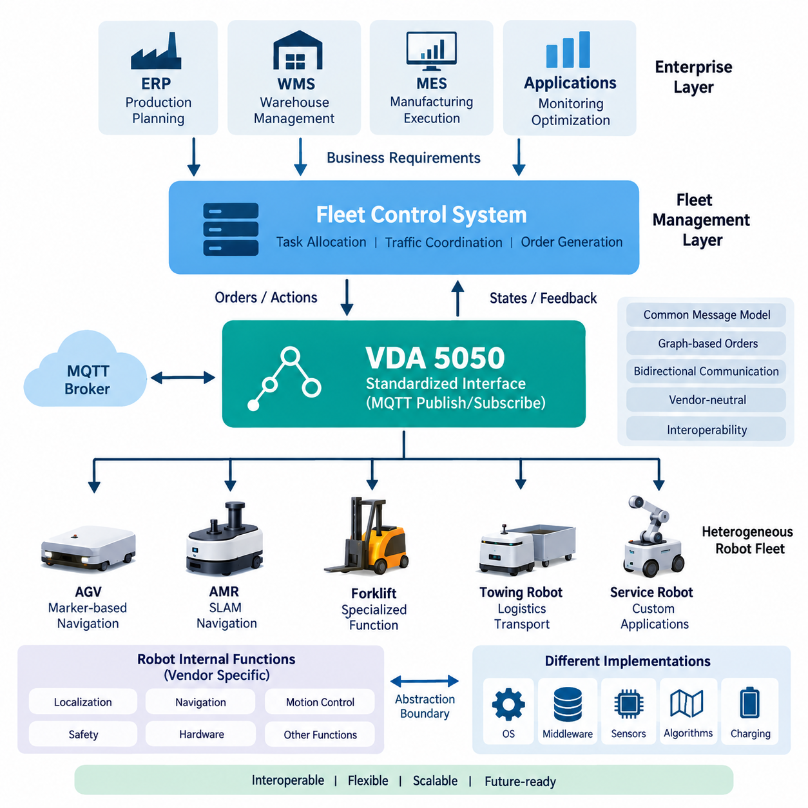
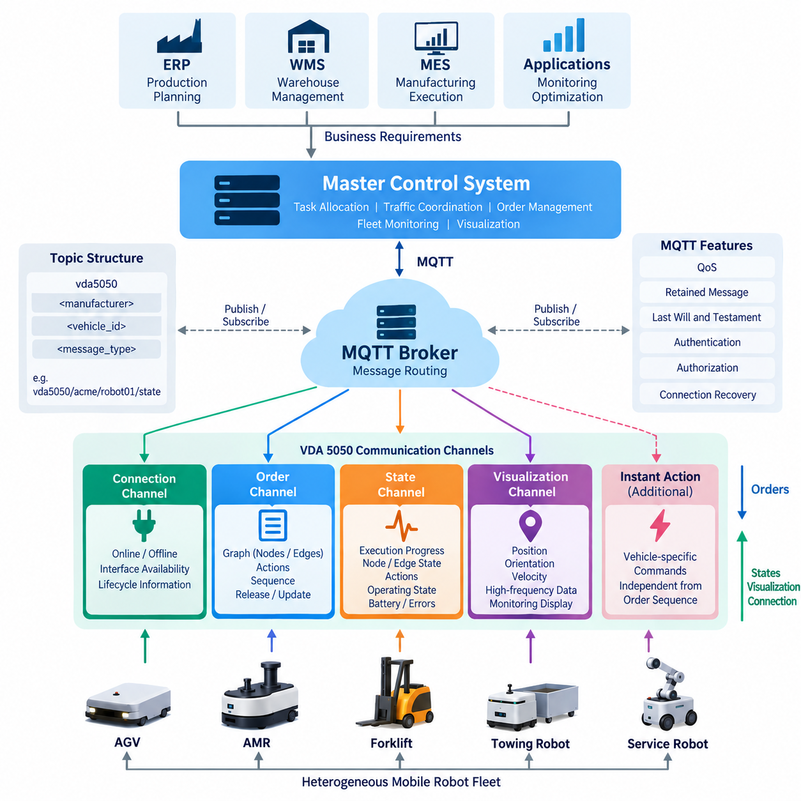
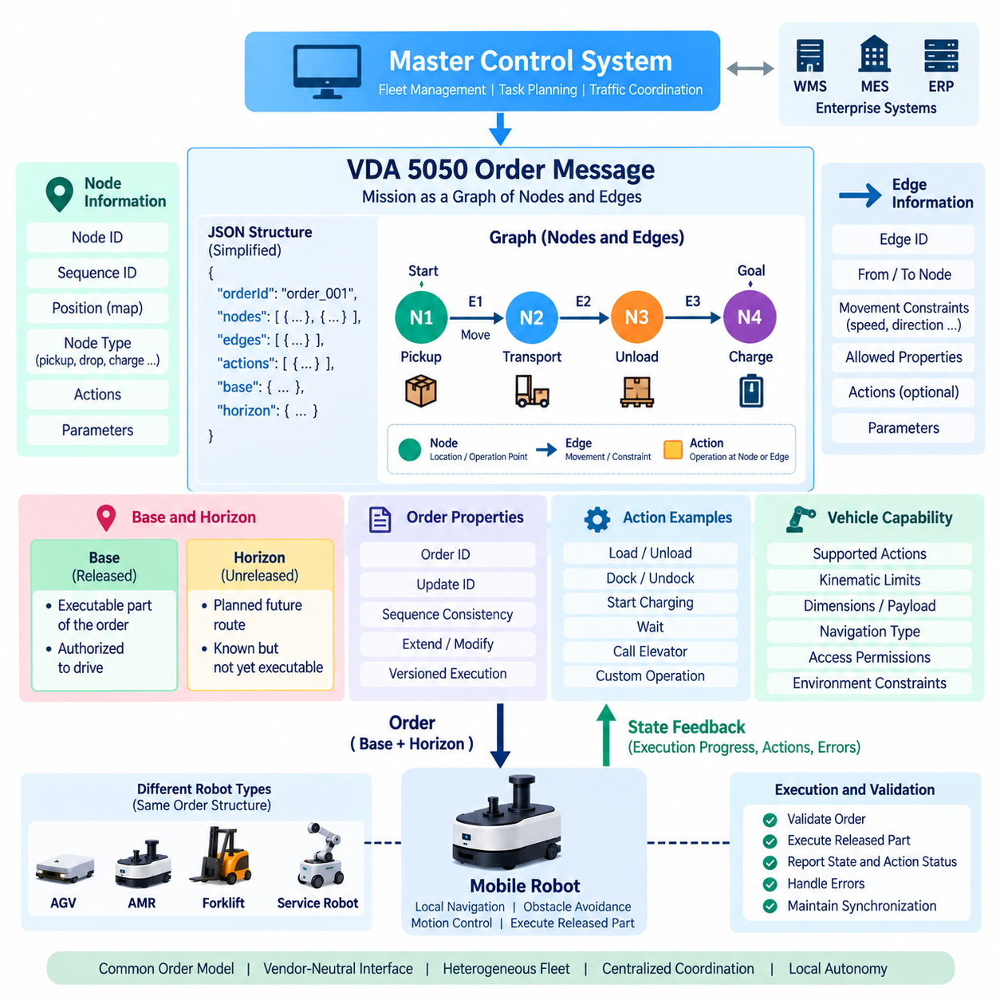
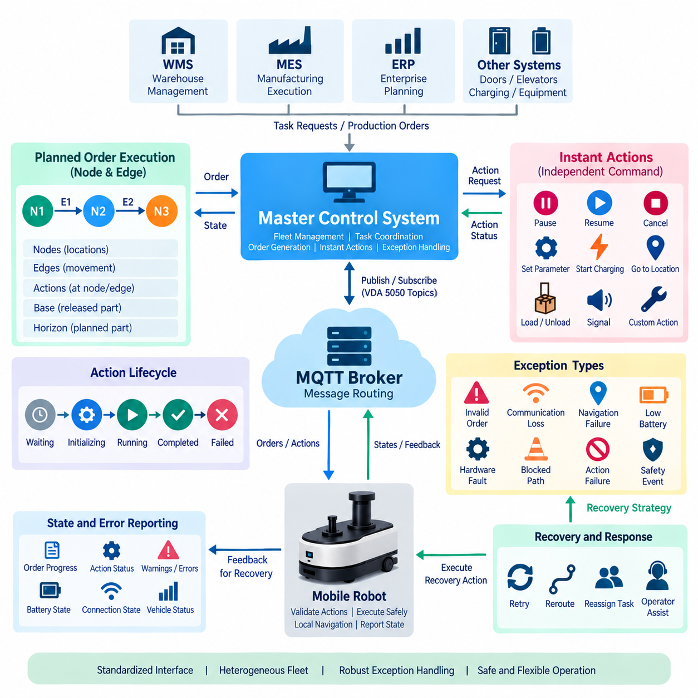
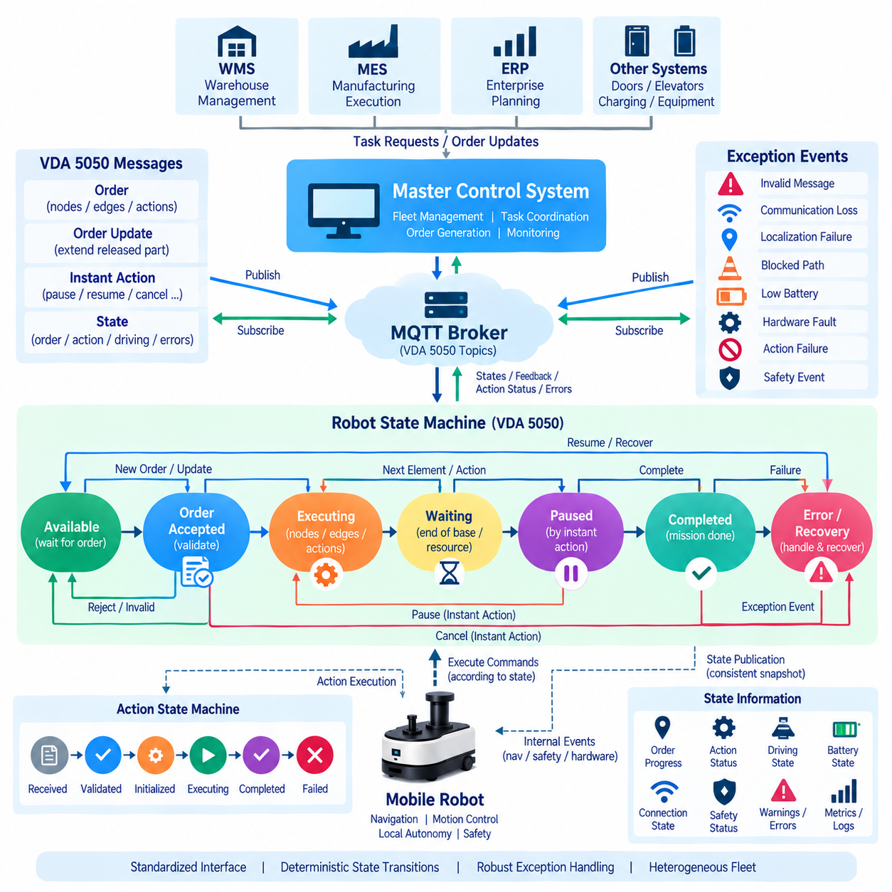
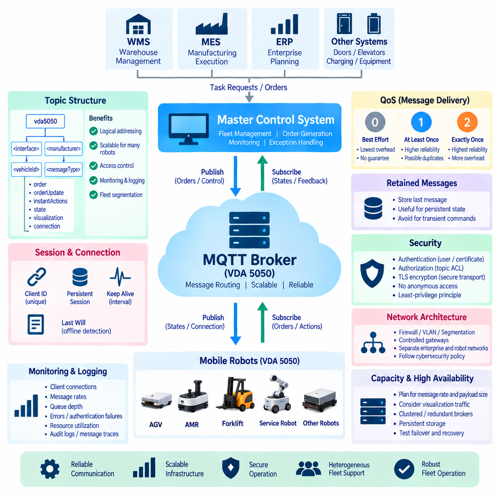
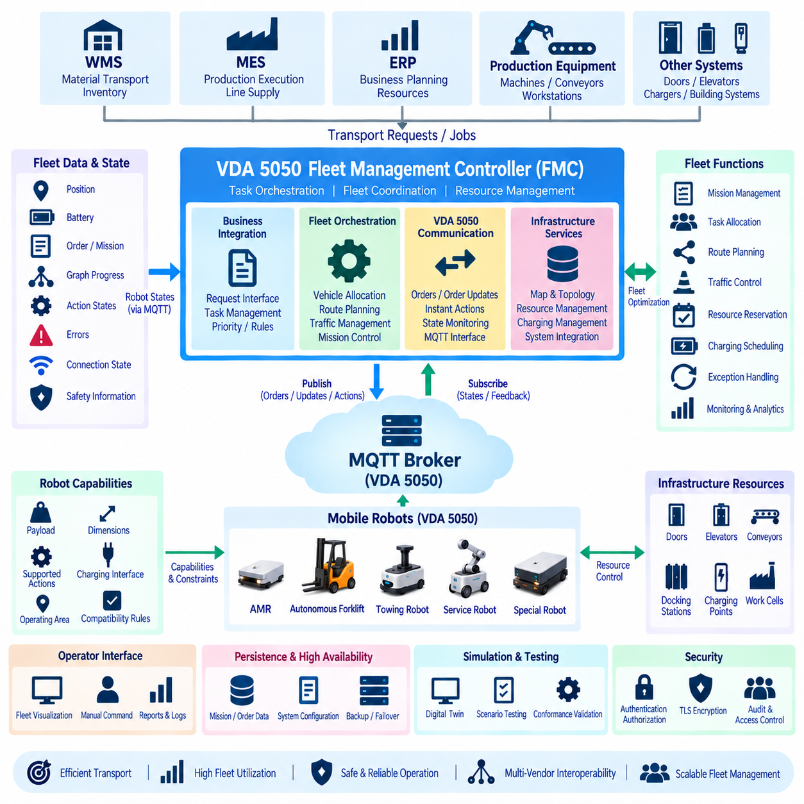
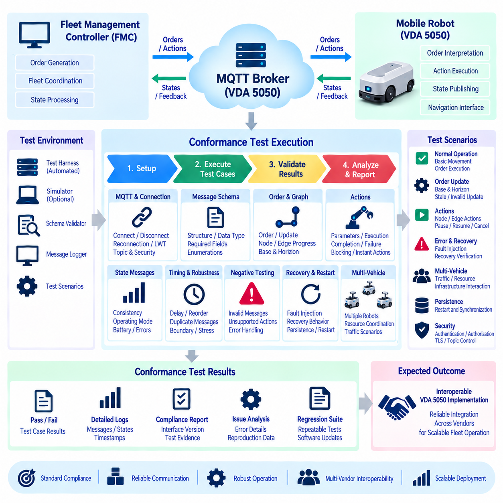
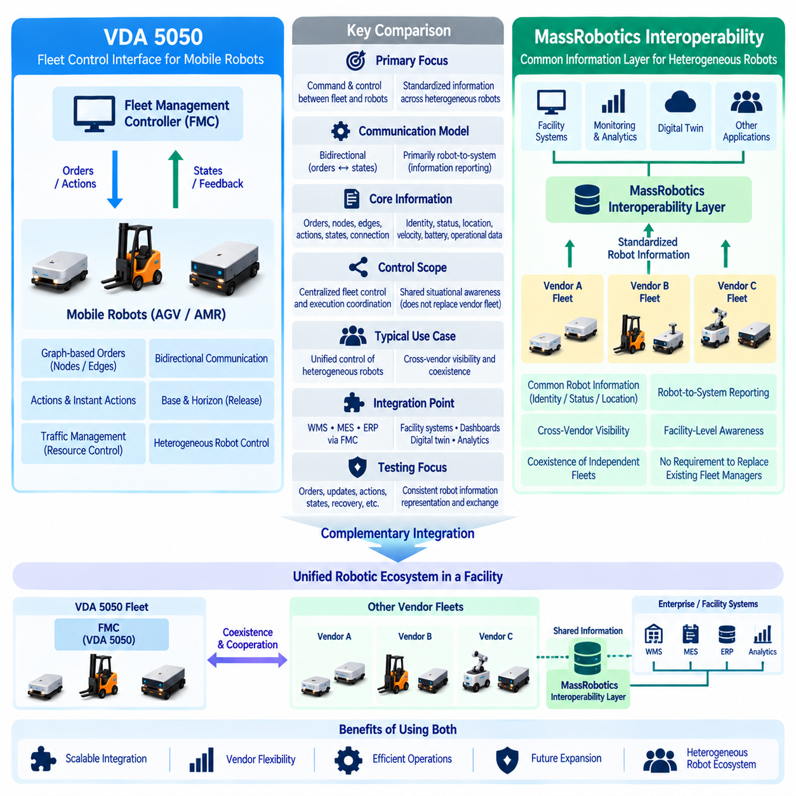
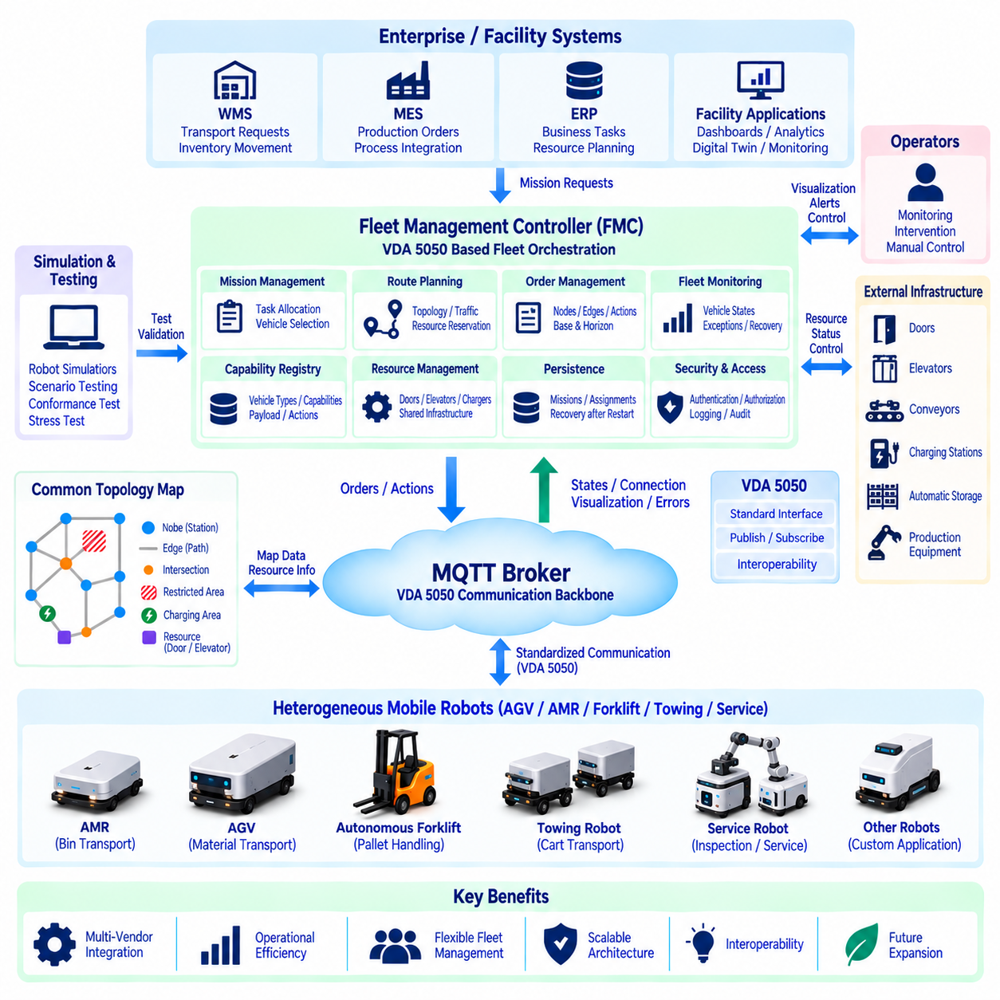

**Volume 06 Robot Communication and APIs**


# 11. VDA 5050 and Fleet Interoperability

##  

## 11.01 VDA 5050 Standard Background and Goals

{width="7.268055555555556in" height="7.268055555555556in"}

VDA 5050 emerged from a practical interoperability problem in industrial logistics: factories and warehouses increasingly operate automated guided vehicles and autonomous mobile robots from multiple manufacturers, yet each vendor traditionally supplies its own proprietary fleet control interface. This creates isolated automation islands in which higher-level production and logistics systems must integrate separately with every robot platform. VDA 5050 addresses this fragmentation by defining a common communication interface between mobile robots and a central fleet or master control system.

The specification was initiated in the German automotive and material-handling ecosystem, where large manufacturing sites frequently deploy transport systems from several suppliers over long equipment lifecycles. The German Association of the Automotive Industry, VDA, and the VDMA Materials Handling and Intralogistics Association cooperated with manufacturers, users, and technology providers to establish a vendor-neutral interface. The objective was not to standardize the internal construction of robots, but to make heterogeneous mobile transport systems accessible through a shared communication model.

This distinction is fundamental to understanding VDA 5050. A compliant interface does not require every robot to use the same navigation algorithm, localization technology, operating system, middleware, safety controller, or motion-control architecture. One vehicle may navigate using LiDAR SLAM, another may use reflectors or infrastructure-based localization, and another may combine cameras and multiple sensors. VDA 5050 creates an abstraction boundary above these implementation differences so that fleet-level software can exchange operational information using standardized concepts.

The primary goal is interoperability between a master control system and mobile robots supplied by different manufacturers. Instead of implementing a unique protocol for every vehicle type, the master control system can communicate through a standardized message structure. Orders, vehicle states, connection information, visualization data, and operational actions can therefore be represented consistently. This approach reduces the number of proprietary integration paths that must be developed and maintained as a heterogeneous robot fleet expands over time.

VDA 5050 is closely associated with MQTT-based publish/subscribe communication. Rather than requiring a persistent point-to-point command connection between every controller and robot, information is exchanged through defined topics and structured messages. This architecture fits distributed fleet environments because producers and consumers can be logically decoupled. A robot can publish its current state while the master control system publishes orders and actions, with an MQTT broker providing the messaging infrastructure between the participating systems.

The communication model also separates strategic fleet coordination from local vehicle execution. A master control system may decide which robot should perform a transport mission, coordinate traffic among vehicles, and generate an appropriate route through the shared environment. The individual robot remains responsible for safely executing the received instructions according to its own controller and capabilities. Consequently, VDA 5050 should be understood as a fleet interoperability interface rather than as a replacement for navigation, motion control, obstacle avoidance, functional safety, or embedded control software.

Orders are expressed through graph-oriented concepts that describe nodes and edges. Nodes represent relevant positions or operational points, while edges describe connections and movement between them. Actions can be associated with appropriate elements of the order to represent operations such as loading, unloading, docking, or other vehicle-specific functions. This representation provides enough structure for fleet coordination while avoiding unnecessary dependence on the internal trajectory-generation and actuator-control implementation of a particular robot manufacturer.

Bidirectional communication is equally important. Fleet interoperability cannot be achieved by sending commands alone; the master control system must understand whether a vehicle has accepted an order, where it is within the execution sequence, what actions are active, and whether errors or exceptional conditions have occurred. Standardized state information therefore provides a common operational vocabulary. This enables supervisory software to coordinate robots based on observable execution status instead of relying on proprietary status codes and vendor-specific telemetry semantics.

Another important goal is lifecycle flexibility. Industrial mobile robots may remain in operation for many years, while fleet management software, warehouse systems, manufacturing execution systems, and individual robot models evolve at different rates. A standardized interface reduces direct coupling between these lifecycles. Organizations can introduce new vehicle suppliers or upgrade fleet-level software without necessarily redesigning every surrounding integration, provided that compatibility, supported features, and implementation-specific constraints are carefully managed.

Interoperability, however, does not mean that every compliant robot automatically possesses identical capabilities. Robots can differ significantly in dimensions, payload, kinematics, charging behavior, supported actions, navigation constraints, and operating environments. A useful fleet architecture must therefore distinguish communication compatibility from functional compatibility. VDA 5050 provides a common language for interaction, while system integrators must still determine whether a particular vehicle can physically and functionally perform the requested mission within the intended facility.

This principle becomes particularly important when fleets include conventional AGVs, freely navigating AMRs, towing platforms, forklifts, service robots, or other specialized mobile systems. Modern interoperability must accommodate vehicles whose motion is not always adequately described by rigid infrastructure assumptions. The evolution of VDA 5050 therefore reflects a broader transition from relatively homogeneous automated transport installations toward heterogeneous and increasingly autonomous mobile robot ecosystems in which shared fleet coordination must coexist with diverse local autonomy.

VDA 5050 also provides an architectural bridge to enterprise logistics. Warehouse management systems, manufacturing execution systems, enterprise resource planning platforms, and production applications generally operate at a higher abstraction level than individual robots. A fleet controller can translate business-level transport requirements into coordinated robot assignments and VDA 5050 orders. The standard thus occupies an important interface layer between operational logistics orchestration and the vendor-specific software responsible for executing physical movement.

This layered role complements the broader API architecture of a robotic system. REST or gRPC interfaces may connect enterprise applications and fleet services, WebSocket interfaces may support dashboards, and internal ROS 2 or proprietary middleware may connect software components inside a robot. VDA 5050 addresses a different boundary: standardized fleet-to-vehicle communication across heterogeneous mobile robot platforms. It should therefore be integrated with these technologies rather than treated as a universal replacement for all robot communication mechanisms.

Standardization can also reduce long-term integration risk. Without a common interface, adding a new robot supplier may require new adapters, data models, error mappings, monitoring logic, and operational procedures. Each additional proprietary integration increases testing and maintenance complexity. A shared protocol establishes a more stable contract between fleet orchestration and vehicle implementations, allowing integration effort to focus on capabilities and operational behavior rather than repeatedly rebuilding the fundamental communication layer.

Nevertheless, conformance to message formats alone is insufficient for successful deployment. Real interoperability requires consistent interpretation of order updates, sequence identifiers, state transitions, action behavior, error conditions, connection recovery, and vehicle capabilities. Network reliability, MQTT broker configuration, cybersecurity, timing behavior, and failure handling also affect actual operation. For this reason, VDA 5050 implementation should be treated as a system-integration discipline involving protocol conformance, behavioral validation, and realistic multi-vendor testing.

The standard also supports an important architectural objective: preventing the fleet management layer from becoming tightly dependent on a single robot manufacturer. A well-designed system can place vendor-specific functions behind adapters or capability abstractions while preserving a common operational interface toward the master control layer. This separation improves replaceability and supports incremental fleet expansion, although proprietary extensions may still be necessary when specialized robot functions cannot be represented completely by the common interoperability model.

From a software architecture perspective, VDA 5050 is therefore best understood as a contract at the boundary between fleet intelligence and physical robot execution. Above the boundary are task allocation, traffic coordination, production scheduling, warehouse integration, monitoring, and fleet optimization. Below it are localization, perception, navigation, trajectory generation, safety functions, motor control, and hardware interfaces. The standard enables these layers to evolve with greater independence while maintaining a defined operational relationship.

The long-term significance of VDA 5050 extends beyond protocol standardization. As industrial sites deploy larger numbers of heterogeneous autonomous systems, interoperability becomes an architectural prerequisite for scalable automation. A common fleet interface allows robots to become replaceable and composable resources within a larger cyber-physical logistics system. This creates a foundation for multi-vendor orchestration, flexible manufacturing, fleet-level optimization, and future Physical AI environments in which increasingly intelligent robots must cooperate without requiring a single proprietary technology stack.

VDA 5050은 산업 물류(Industrial Logistics) 분야에서 발생한 실질적인 상호운용성(Interoperability) 문제를 해결하기 위해 등장했다. 공장과 창고에서는 여러 제조사의 무인운반차(Automated Guided Vehicle, AGV)와 자율이동로봇(Autonomous Mobile Robot, AMR)을 점차 함께 운영하고 있지만, 전통적으로 각 공급업체는 자체적인 전용 플릿 제어 인터페이스(Proprietary Fleet Control Interface)를 제공해 왔다. 이로 인해 상위 생산 및 물류 시스템이 각각의 로봇 플랫폼과 개별적으로 통합되어야 하는 자동화 고립 영역(Automation Island)이 형성된다. VDA 5050은 모바일 로봇(Mobile Robot)과 중앙 플릿 또는 마스터 제어 시스템(Central Fleet or Master Control System) 사이의 공통 통신 인터페이스(Common Communication Interface)를 정의함으로써 이러한 단절 문제를 해결한다.

이 규격은 대규모 제조 현장에서 서로 다른 공급업체의 운송 시스템을 장기간 함께 운영하는 경우가 많은 독일 자동차 및 자재 취급 생태계(German Automotive and Material-Handling Ecosystem)를 배경으로 시작되었다. 독일자동차산업협회(German Association of the Automotive Industry, VDA)와 독일기계산업협회 자재 취급 및 내부물류 부문(VDMA Materials Handling and Intralogistics Association)은 제조사, 사용자, 기술 공급업체와 협력하여 공급업체 중립적 인터페이스(Vendor-Neutral Interface)를 구축했다. 그 목적은 로봇 내부 구조를 표준화하는 것이 아니라, 이기종 모바일 운송 시스템(Heterogeneous Mobile Transport System)을 공통 통신 모델(Shared Communication Model)을 통해 사용할 수 있도록 하는 것이다.

이러한 구분은 VDA 5050을 이해하는 데 매우 중요하다. 규격을 준수하는 인터페이스(Compliant Interface)가 모든 로봇에 동일한 내비게이션 알고리즘(Navigation Algorithm), 위치추정 기술(Localization Technology), 운영체제(Operating System), 미들웨어(Middleware), 안전 제어기(Safety Controller), 모션 제어 아키텍처(Motion-Control Architecture)를 요구하는 것은 아니다. 어떤 차량은 라이다 동시적 위치추정 및 지도작성(LiDAR SLAM)을 사용할 수 있고, 다른 차량은 반사판(Reflector)이나 인프라 기반 위치추정(Infrastructure-Based Localization)을 사용할 수 있으며, 또 다른 차량은 카메라와 다중 센서를 결합할 수 있다. VDA 5050은 이러한 구현 차이보다 상위 계층에 추상화 경계(Abstraction Boundary)를 구성하여 플릿 수준 소프트웨어(Fleet-Level Software)가 표준화된 개념을 사용해 운영 정보를 교환하도록 한다.

주요 목표는 마스터 제어 시스템(Master Control System)과 서로 다른 제조사가 공급하는 모바일 로봇 사이의 상호운용성(Interoperability)을 확보하는 것이다. 각 차량 유형마다 별도의 프로토콜을 구현하는 대신 마스터 제어 시스템은 표준화된 메시지 구조(Standardized Message Structure)를 통해 통신할 수 있다. 따라서 주문(Order), 차량 상태(Vehicle State), 연결 정보(Connection Information), 시각화 데이터(Visualization Data), 운영 액션(Operational Action)을 일관된 방식으로 표현할 수 있다. 이러한 접근 방식은 이기종 로봇 플릿(Heterogeneous Robot Fleet)이 확대될 때 개발하고 유지해야 하는 전용 통합 경로(Proprietary Integration Path)의 수를 줄여준다.

VDA 5050은 MQTT 기반 발행/구독 통신(MQTT-Based Publish/Subscribe Communication)과 밀접하게 연관되어 있다. 모든 제어기와 로봇 사이에 지속적인 점대점 명령 연결(Point-to-Point Command Connection)을 요구하는 대신, 정의된 토픽(Topic)과 구조화된 메시지(Structured Message)를 통해 정보를 교환한다. 이러한 아키텍처는 정보 생산자(Producer)와 소비자(Consumer)를 논리적으로 분리할 수 있기 때문에 분산형 플릿 환경(Distributed Fleet Environment)에 적합하다. 로봇은 자신의 현재 상태를 발행하고 마스터 제어 시스템은 주문과 액션을 발행하며, MQTT 브로커(MQTT Broker)는 참여 시스템 사이에서 메시징 인프라(Messaging Infrastructure)를 제공한다.

통신 모델(Communication Model)은 전략적 플릿 조정(Strategic Fleet Coordination)과 로컬 차량 실행(Local Vehicle Execution)도 분리한다. 마스터 제어 시스템은 어떤 로봇이 운송 임무(Transport Mission)를 수행할 것인지 결정하고, 차량 간 교통을 조정하며, 공유 환경에서 적절한 경로를 생성할 수 있다. 개별 로봇은 자체 제어기와 기능에 따라 전달받은 명령을 안전하게 실행할 책임을 가진다. 따라서 VDA 5050은 내비게이션(Navigation), 모션 제어(Motion Control), 장애물 회피(Obstacle Avoidance), 기능 안전(Functional Safety), 임베디드 제어 소프트웨어(Embedded Control Software)를 대체하는 기술이 아니라 플릿 상호운용성 인터페이스(Fleet Interoperability Interface)로 이해해야 한다.

주문(Order)은 노드(Node)와 에지(Edge)를 사용하는 그래프 지향 개념(Graph-Oriented Concept)을 통해 표현된다. 노드는 주요 위치나 작업 지점(Operational Point)을 나타내고, 에지는 이러한 지점 사이의 연결과 이동을 나타낸다. 적재(Loading), 하역(Unloading), 도킹(Docking) 또는 기타 차량별 기능을 표현하기 위해 주문의 적절한 요소에 액션(Action)을 연결할 수 있다. 이러한 표현 방식은 특정 로봇 제조사의 내부 궤적 생성(Trajectory Generation)이나 액추에이터 제어(Actuator Control) 구현에 불필요하게 의존하지 않으면서 플릿 조정에 필요한 구조를 제공한다.

양방향 통신(Bidirectional Communication) 역시 중요하다. 단순히 명령을 전송하는 것만으로는 플릿 상호운용성을 구현할 수 없다. 마스터 제어 시스템은 차량이 주문을 수락했는지, 실행 순서의 어느 단계에 있는지, 어떤 액션이 활성화되어 있는지, 오류 또는 예외 상황(Exceptional Condition)이 발생했는지를 파악해야 한다. 따라서 표준화된 상태 정보(Standardized State Information)는 공통 운영 용어(Common Operational Vocabulary)를 제공한다. 이를 통해 감독 소프트웨어(Supervisory Software)는 공급업체별 상태 코드나 전용 텔레메트리 의미 체계(Proprietary Telemetry Semantics)에 의존하지 않고 관찰 가능한 실행 상태(Observable Execution Status)를 기반으로 로봇을 조정할 수 있다.

또 다른 중요한 목표는 수명주기 유연성(Lifecycle Flexibility)이다. 산업용 모바일 로봇은 수년간 운영될 수 있지만, 플릿 관리 소프트웨어(Fleet Management Software), 창고 시스템(Warehouse System), 제조실행시스템(Manufacturing Execution System), 개별 로봇 모델은 서로 다른 속도로 발전한다. 표준화된 인터페이스는 이러한 수명주기 사이의 직접적인 결합(Direct Coupling)을 줄여준다. 호환성(Compatibility), 지원 기능(Supported Feature), 구현별 제약조건(Implementation-Specific Constraint)을 적절하게 관리한다면 조직은 주변 통합 시스템 전체를 다시 설계하지 않고 새로운 차량 공급업체를 도입하거나 플릿 수준 소프트웨어를 업그레이드할 수 있다.

그러나 상호운용성(Interoperability)이 모든 규격 준수 로봇이 자동으로 동일한 기능을 갖는다는 의미는 아니다. 로봇은 크기(Dimensions), 적재하중(Payload), 운동학(Kinematics), 충전 방식(Charging Behavior), 지원 액션(Supported Action), 내비게이션 제약조건(Navigation Constraint), 운영 환경(Operating Environment)에서 상당한 차이를 가질 수 있다. 따라서 실용적인 플릿 아키텍처(Fleet Architecture)는 통신 호환성(Communication Compatibility)과 기능 호환성(Functional Compatibility)을 구분해야 한다. VDA 5050은 상호작용을 위한 공통 언어를 제공하지만, 특정 차량이 목표 시설에서 요청된 임무를 물리적·기능적으로 수행할 수 있는지는 시스템 통합 담당자(System Integrator)가 별도로 판단해야 한다.

이 원칙은 플릿에 기존 무인운반차(Conventional AGV), 자유주행형 자율이동로봇(Freely Navigating AMR), 견인 플랫폼(Towing Platform), 지게차(Forklift), 서비스 로봇(Service Robot) 또는 기타 특수 모바일 시스템이 포함될 때 특히 중요해진다. 현대적인 상호운용성은 고정된 인프라 중심의 가정만으로는 이동 특성을 충분히 설명할 수 없는 차량까지 수용해야 한다. 따라서 VDA 5050의 발전은 비교적 동질적인 자동 운송 시스템에서 이기종·고자율 모바일 로봇 생태계(Heterogeneous and Increasingly Autonomous Mobile Robot Ecosystem)로 전환되는 산업 흐름을 반영하며, 공통 플릿 조정(Shared Fleet Coordination)과 다양한 로컬 자율성(Local Autonomy)이 공존할 수 있도록 한다.

VDA 5050은 기업 물류(Enterprise Logistics)와 연결되는 아키텍처 브리지(Architectural Bridge)의 역할도 수행한다. 창고관리시스템(Warehouse Management System, WMS), 제조실행시스템(Manufacturing Execution System, MES), 전사적자원관리시스템(Enterprise Resource Planning, ERP), 생산 애플리케이션(Production Application)은 일반적으로 개별 로봇보다 높은 추상화 수준에서 동작한다. 플릿 제어기(Fleet Controller)는 비즈니스 수준의 운송 요구사항을 조정된 로봇 할당(Robot Assignment)과 VDA 5050 주문으로 변환할 수 있다. 따라서 이 규격은 운영 물류 오케스트레이션(Operational Logistics Orchestration)과 실제 물리적 이동을 실행하는 공급업체별 소프트웨어 사이의 중요한 인터페이스 계층(Interface Layer)에 위치한다.

이러한 계층적 역할은 로봇 시스템의 광범위한 API 아키텍처(API Architecture)를 보완한다. REST 또는 gRPC 인터페이스는 기업 애플리케이션과 플릿 서비스를 연결할 수 있고, WebSocket 인터페이스는 대시보드(Dashboard)를 지원할 수 있으며, 내부 ROS 2 또는 전용 미들웨어(Proprietary Middleware)는 로봇 내부의 소프트웨어 구성요소를 연결할 수 있다. VDA 5050은 이와 다른 경계, 즉 이기종 모바일 로봇 플랫폼과 플릿 사이의 표준화된 통신(Standardized Fleet-to-Vehicle Communication)을 담당한다. 따라서 모든 로봇 통신 기술을 대체하는 범용 기술이 아니라 기존 통신 기술들과 통합되어 사용되는 규격으로 이해해야 한다.

표준화(Standardization)는 장기적인 통합 위험(Long-Term Integration Risk)을 줄이는 데에도 기여할 수 있다. 공통 인터페이스가 없다면 새로운 로봇 공급업체를 추가할 때마다 새로운 어댑터(Adapter), 데이터 모델(Data Model), 오류 매핑(Error Mapping), 모니터링 로직(Monitoring Logic), 운영 절차(Operational Procedure)가 필요할 수 있다. 전용 통합이 하나씩 추가될 때마다 시험 및 유지보수 복잡성도 증가한다. 공통 프로토콜(Common Protocol)은 플릿 오케스트레이션과 차량 구현 사이에 보다 안정적인 계약(Stable Contract)을 형성하여 기본적인 통신 계층을 반복적으로 재구축하는 대신 기능과 운영 동작에 통합 노력을 집중할 수 있도록 한다.

그러나 메시지 형식(Message Format)을 준수하는 것만으로 성공적인 배포를 보장할 수는 없다. 실제 상호운용성(Real Interoperability)을 위해서는 주문 업데이트(Order Update), 시퀀스 식별자(Sequence Identifier), 상태 전이(State Transition), 액션 동작(Action Behavior), 오류 조건(Error Condition), 연결 복구(Connection Recovery), 차량 기능(Vehicle Capability)을 일관되게 해석해야 한다. 네트워크 신뢰성(Network Reliability), MQTT 브로커 구성(MQTT Broker Configuration), 사이버보안(Cybersecurity), 타이밍 동작(Timing Behavior), 장애 처리(Failure Handling) 역시 실제 운영에 영향을 준다. 따라서 VDA 5050 구현은 프로토콜 적합성(Protocol Conformance), 동작 검증(Behavioral Validation), 현실적인 다중 공급업체 시험(Multi-Vendor Testing)을 포함하는 시스템 통합 분야(System-Integration Discipline)로 접근해야 한다.

이 규격은 플릿 관리 계층(Fleet Management Layer)이 특정 로봇 제조사에 지나치게 종속되는 것을 방지하는 중요한 아키텍처 목표도 지원한다. 잘 설계된 시스템에서는 공급업체별 기능(Vendor-Specific Function)을 어댑터 또는 기능 추상화(Capability Abstraction) 뒤에 배치하면서 마스터 제어 계층에는 공통 운영 인터페이스(Common Operational Interface)를 유지할 수 있다. 이러한 분리는 교체 가능성(Replaceability)을 높이고 점진적인 플릿 확장(Incremental Fleet Expansion)을 지원한다. 다만 공통 상호운용성 모델만으로 특수한 로봇 기능을 완전히 표현할 수 없는 경우에는 전용 확장(Proprietary Extension)이 여전히 필요할 수 있다.

소프트웨어 아키텍처(Software Architecture)의 관점에서 VDA 5050은 플릿 지능(Fleet Intelligence)과 물리적 로봇 실행(Physical Robot Execution) 사이의 경계에 존재하는 계약(Contract)으로 이해하는 것이 적절하다. 이 경계의 상위에는 작업 할당(Task Allocation), 교통 조정(Traffic Coordination), 생산 일정계획(Production Scheduling), 창고 통합(Warehouse Integration), 모니터링(Monitoring), 플릿 최적화(Fleet Optimization)가 존재한다. 하위에는 위치추정(Localization), 인지(Perception), 내비게이션(Navigation), 궤적 생성(Trajectory Generation), 안전 기능(Safety Function), 모터 제어(Motor Control), 하드웨어 인터페이스(Hardware Interface)가 존재한다. 이 규격은 이러한 계층들이 정의된 운영 관계를 유지하면서 보다 독립적으로 발전할 수 있도록 한다.

VDA 5050의 장기적인 중요성은 단순한 프로토콜 표준화(Protocol Standardization)를 넘어선다. 산업 현장에 더 많은 이기종 자율 시스템(Heterogeneous Autonomous System)이 배치됨에 따라 상호운용성은 확장 가능한 자동화(Scalable Automation)를 위한 핵심 아키텍처 전제조건이 된다. 공통 플릿 인터페이스(Common Fleet Interface)는 로봇을 더 큰 사이버물리 물류 시스템(Cyber-Physical Logistics System) 내부에서 교체 가능하고 조합 가능한 자원(Replaceable and Composable Resource)으로 활용할 수 있게 한다. 이는 다중 공급업체 오케스트레이션(Multi-Vendor Orchestration), 유연 생산(Flexible Manufacturing), 플릿 수준 최적화(Fleet-Level Optimization), 그리고 점점 더 지능화되는 로봇들이 단일 전용 기술 스택(Proprietary Technology Stack)에 종속되지 않고 협력해야 하는 미래 피지컬 AI(Physical AI) 환경을 위한 기반을 형성한다.

##  

## 11.02 VDA 5050 Channel Structure: connection, order, state, viz [w/Code]

{width="7.268055555555556in" height="7.268055555555556in"}

VDA 5050 organizes communication between a master control system and mobile robots through a defined set of MQTT topics, often described as communication channels. Each channel has a distinct operational purpose and message schema, allowing commands, execution feedback, connectivity information, and visualization data to remain logically separated. The core structure centers on connection, order, state, and visualization communication, with additional channels supporting actions and vehicle-specific capabilities.

The topic hierarchy provides the addressing mechanism that allows an MQTT broker to route messages to the correct participants. A typical topic identifies the VDA 5050 interface context, manufacturer, vehicle identity, and message type. This organization becomes especially important in installations containing many robots from several vendors. The master control system can communicate with a specific vehicle while monitoring state information from the entire fleet through predictable subscription patterns.

The connection channel communicates whether a vehicle is logically connected to the messaging infrastructure and available from the perspective of the communication interface. It supports lifecycle awareness rather than mission execution itself. A master control system needs this information because the absence of state messages alone may not clearly distinguish temporary network delay, application shutdown, broker disconnection, or another communication failure affecting a robot.

MQTT mechanisms such as retained information and Last Will and Testament can support connection monitoring. When a robot establishes communication, it can publish information indicating its online status, while an unexpected loss of the MQTT session can cause the broker to publish a predefined offline indication. This allows other components to detect communication loss even when the robot application cannot explicitly transmit a final message because power, network connectivity, or software execution has failed unexpectedly.

The order channel carries mission execution information from the master control system toward a mobile robot. An order describes a graph composed primarily of nodes and edges, together with associated actions and sequence information. Nodes represent positions or operational points, while edges define movement between them. The vehicle interprets this graph according to its own navigation and motion-control architecture rather than receiving low-level actuator commands through VDA 5050.

Order communication is designed to support controlled modification as execution progresses. A master control system does not necessarily need to transmit an entire long mission as one immutable command. Instead, portions of a route can be released and subsequently extended or updated while maintaining identifiers and sequence consistency. This enables fleet-level traffic coordination to remain dynamic while the robot retains sufficient authorized route information for predictable local execution.

The distinction between released and unreleased portions of an order is particularly significant for coordinated traffic management. A released section represents the part that the robot is authorized to execute, whereas subsequent graph elements may describe a planned continuation that has not yet been released. The master control system can therefore regulate entry into shared areas, intersections, narrow passages, or other contested resources without continuously controlling the vehicle\'s individual motion commands.

Order identity and update information are essential because MQTT communication is asynchronous and messages can be delayed, duplicated, or observed after newer information has already been processed. The robot must determine whether an incoming order represents a new mission, a valid extension or modification, or information that should not replace its current execution context. Consistent handling of identifiers and sequence numbers therefore protects the logical integrity of distributed mission execution.

The state channel provides the primary feedback path from the vehicle to the master control system. While the order channel describes what the robot should execute, the state message describes what the robot currently understands and what has actually happened. It can report order progress, node and edge status, active or completed actions, operating mode, driving state, battery information, errors, safety-related conditions, and other operational information required for fleet supervision.

This feedback creates a closed communication loop between fleet planning and physical execution. The master control system sends an order, the robot validates and executes it, and state messages reveal the resulting progress. The controller can then determine whether additional route sections should be released, another task should be scheduled, traffic coordination should change, or an exception requires intervention. VDA 5050 therefore uses state synchronization rather than assuming that command transmission implies successful physical execution.

State information is also essential for heterogeneous fleet abstraction. Different manufacturers may use different internal state machines, diagnostic frameworks, battery management systems, and navigation software. The VDA 5050 state representation exposes selected operational information through a common external model. A fleet controller can consequently reason about multiple vehicle types without directly understanding every vendor\'s internal software architecture, although manufacturer-specific interpretation may still be required for specialized functions.

The visualization channel serves a different purpose from authoritative order and state communication. It provides frequently updated information useful for displaying the robot\'s movement and orientation in monitoring applications. Position, orientation, velocity, and related visualization information can be published so that a fleet dashboard or engineering tool can present the vehicle dynamically. This channel should not be confused with the control information required to determine mission execution or safety behavior.

Separating visualization traffic is architecturally useful because display data and operational state often have different timing and bandwidth requirements. A graphical interface may benefit from frequent position updates to produce smooth motion, while the master control system does not necessarily require every visualization sample for mission logic. Independent channels allow communication frequency and processing behavior to be selected according to purpose instead of forcing all information into one large telemetry message.

The direction of information flow clarifies the responsibilities of each component. Orders generally travel from the master control system to the vehicle, while state and visualization information travel primarily from the vehicle toward subscribed consumers. Connection information communicates interface availability, and additional command mechanisms can support immediate actions that are not naturally represented as part of the normal node-and-edge order sequence. Together, these channels form a structured bidirectional communication model.

Instant actions complement normal order execution by allowing commands whose relevance is not limited to a particular position in the planned graph. Depending on supported capabilities and specification behavior, such actions can address operational needs that must be initiated independently of the ordinary mission sequence. Keeping these mechanisms distinct from graph-based orders helps preserve clear semantics between planned transport execution and commands that modify or influence the current operational context.

In a practical deployment, the MQTT broker becomes the communication hub connecting one or more fleet-control services with many vehicles. Robots publish their state, visualization, and connection-related messages to appropriate topics, while subscribing to the topics through which they receive orders and other supported commands. The broker routes messages but does not make fleet decisions, calculate robot trajectories, or interpret mission semantics; these responsibilities remain with the communicating applications.

MQTT Quality of Service, retained-message behavior, session configuration, authentication, authorization, and connection recovery must be engineered carefully around this channel model. A technically correct message schema does not guarantee reliable fleet operation if stale commands can be mistaken for current ones or unauthorized clients can publish control messages. Topic-level access control should therefore restrict which components can publish or subscribe to operational channels according to their defined responsibilities.

The channel structure also improves observability and troubleshooting. Because orders, states, connection information, and visualization traffic are logically separated, engineers can inspect each communication flow independently. When a vehicle stops progressing, for example, diagnostics can determine whether the order was published, whether the robot remains connected, whether state messages report an error, and whether visualization data indicates physical movement. This separation provides a systematic basis for identifying integration failures.

At fleet scale, predictable topic naming and channel semantics allow one master control architecture to manage many heterogeneous vehicles without creating an individual communication design for each robot. Manufacturer and vehicle identifiers provide routing boundaries, while standardized message categories establish common behavior. Fleet software can subscribe selectively, aggregate states across vehicles, monitor connectivity, issue targeted orders, and feed visualization services through the same messaging infrastructure.

The connection, order, state, and visualization channels should therefore be viewed as complementary parts of one distributed control contract. Connection establishes communication awareness, order expresses intended mission execution, state reports authoritative operational progress, and visualization supplies high-frequency information for observation. Their separation reduces ambiguity while their coordinated use closes the loop between fleet-level planning, message transport, local autonomous execution, and supervisory monitoring.

This architecture illustrates why VDA 5050 is more than a collection of JSON messages transported over MQTT. The channel model defines information ownership, communication direction, operational semantics, and responsibility boundaries between fleet software and mobile robots. When implemented consistently, it provides a scalable communication foundation on which multi-vendor fleets can coordinate missions while allowing each robot manufacturer to retain independent navigation, control, safety, and hardware implementations.

VDA 5050은 마스터 제어 시스템(Master Control System)과 모바일 로봇(Mobile Robot) 사이의 통신을 정의된 MQTT 토픽(MQTT Topic) 집합을 통해 구성하며, 이를 통신 채널(Communication Channel)이라고 표현할 수 있다. 각 채널은 고유한 운영 목적과 메시지 스키마(Message Schema)를 가지므로 명령(Command), 실행 피드백(Execution Feedback), 연결 정보(Connectivity Information), 시각화 데이터(Visualization Data)를 논리적으로 분리할 수 있다. 핵심 구조는 연결(Connection), 주문(Order), 상태(State), 시각화(Visualization) 통신을 중심으로 하며, 추가 채널은 액션(Action)과 차량별 기능(Vehicle-Specific Capability)을 지원한다.

토픽 계층구조(Topic Hierarchy)는 MQTT 브로커(MQTT Broker)가 메시지를 올바른 참여 시스템에 전달할 수 있도록 하는 주소 지정 메커니즘(Addressing Mechanism)을 제공한다. 일반적인 토픽은 VDA 5050 인터페이스 환경, 제조사(Manufacturer), 차량 식별정보(Vehicle Identity), 메시지 유형(Message Type)을 식별한다. 이러한 구조는 여러 제조사의 많은 로봇이 함께 운영되는 환경에서 특히 중요하다. 마스터 제어 시스템은 예측 가능한 구독 패턴(Subscription Pattern)을 사용하여 전체 플릿의 상태 정보를 모니터링하면서 특정 차량과 개별적으로 통신할 수 있다.

연결 채널(Connection Channel)은 차량이 메시징 인프라(Messaging Infrastructure)에 논리적으로 연결되어 있는지, 그리고 통신 인터페이스 관점에서 사용 가능한 상태인지를 전달한다. 이 채널은 임무 실행(Mission Execution) 자체보다 수명주기 인지(Lifecycle Awareness)를 지원한다. 상태 메시지가 수신되지 않는다는 사실만으로는 일시적인 네트워크 지연(Network Delay), 애플리케이션 종료(Application Shutdown), 브로커 연결 해제(Broker Disconnection), 또는 로봇에 영향을 미치는 다른 통신 장애(Communication Failure)를 명확하게 구분하기 어렵기 때문에 마스터 제어 시스템에는 이러한 정보가 필요하다.

보존 정보(Retained Information)와 마지막 유언 및 유언장(Last Will and Testament, LWT) 같은 MQTT 메커니즘은 연결 상태 모니터링(Connection Monitoring)을 지원할 수 있다. 로봇이 통신을 시작하면 온라인 상태(Online Status)를 나타내는 정보를 발행할 수 있으며, MQTT 세션이 예상하지 못하게 끊어지면 브로커가 사전에 정의된 오프라인 상태(Offline Status)를 발행하도록 구성할 수 있다. 이를 통해 전원, 네트워크 연결 또는 소프트웨어 실행이 갑자기 중단되어 로봇 애플리케이션이 최종 메시지를 직접 전송하지 못하는 경우에도 다른 구성요소가 통신 손실을 감지할 수 있다.

주문 채널(Order Channel)은 마스터 제어 시스템에서 모바일 로봇 방향으로 임무 실행 정보를 전달한다. 주문(Order)은 주로 노드(Node)와 에지(Edge)로 구성된 그래프(Graph)를 액션(Action) 및 시퀀스 정보(Sequence Information)와 함께 기술한다. 노드는 위치 또는 작업 지점(Operational Point)을 나타내며, 에지는 이들 사이의 이동을 정의한다. 차량은 VDA 5050을 통해 저수준 액추에이터 명령(Low-Level Actuator Command)을 전달받는 것이 아니라 자체 내비게이션 및 모션 제어 아키텍처(Navigation and Motion-Control Architecture)에 따라 이 그래프를 해석한다.

주문 통신(Order Communication)은 실행이 진행되는 동안 제어된 변경(Controlled Modification)을 지원하도록 설계된다. 마스터 제어 시스템이 전체 장거리 임무를 하나의 변경 불가능한 명령(Immutable Command)으로 한 번에 전송할 필요는 없다. 대신 식별자(Identifier)와 시퀀스 일관성(Sequence Consistency)을 유지하면서 경로의 일부를 먼저 릴리스(Release)하고 이후 이를 확장하거나 업데이트할 수 있다. 이를 통해 로봇은 예측 가능한 로컬 실행에 필요한 충분한 승인 경로 정보를 유지하면서 플릿 수준 교통 조정(Fleet-Level Traffic Coordination)은 동적으로 이루어질 수 있다.

주문의 릴리스 구간(Released Portion)과 미릴리스 구간(Unreleased Portion)을 구분하는 것은 협조형 교통 관리(Coordinated Traffic Management)에서 특히 중요하다. 릴리스 구간은 로봇이 실행하도록 승인된 부분을 의미하고, 이후의 그래프 요소는 아직 릴리스되지 않은 계획 경로를 나타낼 수 있다. 따라서 마스터 제어 시스템은 차량의 개별 모션 명령을 지속적으로 제어하지 않으면서도 공유 영역(Shared Area), 교차로(Intersection), 좁은 통로(Narrow Passage), 또는 기타 경쟁 자원(Contested Resource)으로의 진입을 조절할 수 있다.

주문 식별정보(Order Identity)와 업데이트 정보(Update Information)는 MQTT 통신이 비동기식(Asynchronous)이며 메시지가 지연되거나 중복될 수 있고, 더 새로운 정보가 이미 처리된 이후 이전 정보가 관찰될 수도 있기 때문에 중요하다. 로봇은 수신된 주문이 새로운 임무인지, 유효한 확장 또는 수정인지, 아니면 현재 실행 컨텍스트(Execution Context)를 대체해서는 안 되는 정보인지를 판단해야 한다. 따라서 식별자와 시퀀스 번호(Sequence Number)를 일관되게 처리하는 것은 분산 임무 실행(Distributed Mission Execution)의 논리적 무결성(Logical Integrity)을 보호한다.

상태 채널(State Channel)은 차량에서 마스터 제어 시스템으로 전달되는 주요 피드백 경로(Feedback Path)를 제공한다. 주문 채널이 로봇이 무엇을 실행해야 하는지를 설명한다면, 상태 메시지(State Message)는 로봇이 현재 무엇을 인식하고 있으며 실제로 어떤 일이 발생했는지를 설명한다. 주문 진행 상태(Order Progress), 노드 및 에지 상태(Node and Edge Status), 활성 또는 완료된 액션(Active or Completed Action), 운영 모드(Operating Mode), 주행 상태(Driving State), 배터리 정보(Battery Information), 오류(Error), 안전 관련 상태(Safety-Related Condition) 등 플릿 감독(Fleet Supervision)에 필요한 운영 정보를 보고할 수 있다.

이러한 피드백은 플릿 계획(Fleet Planning)과 물리적 실행(Physical Execution) 사이에 폐쇄형 통신 루프(Closed Communication Loop)를 형성한다. 마스터 제어 시스템이 주문을 전송하면 로봇이 이를 검증하고 실행하며, 상태 메시지는 그 결과와 진행 상황을 전달한다. 이후 제어 시스템은 추가 경로 구간을 릴리스할지, 다른 작업을 스케줄링할지, 교통 조정을 변경할지, 또는 예외 상황에 대한 개입이 필요한지를 결정할 수 있다. 따라서 VDA 5050은 단순히 명령을 전송했다고 해서 물리적 실행이 성공했다고 가정하는 대신 상태 동기화(State Synchronization)를 활용한다.

상태 정보(State Information)는 이기종 플릿 추상화(Heterogeneous Fleet Abstraction)에도 필수적이다. 서로 다른 제조사는 각기 다른 내부 상태 머신(Internal State Machine), 진단 프레임워크(Diagnostic Framework), 배터리 관리 시스템(Battery Management System), 내비게이션 소프트웨어(Navigation Software)를 사용할 수 있다. VDA 5050 상태 표현(State Representation)은 선택된 운영 정보를 공통 외부 모델(Common External Model)을 통해 노출한다. 따라서 플릿 제어기는 각 공급업체의 내부 소프트웨어 아키텍처를 직접 이해하지 않고도 여러 차량 유형을 관리할 수 있지만, 특수 기능에는 제조사별 해석이 추가로 필요할 수 있다.

시각화 채널(Visualization Channel)은 권위 있는 주문 및 상태 통신(Authoritative Order and State Communication)과는 다른 목적을 가진다. 이 채널은 모니터링 애플리케이션(Monitoring Application)에서 로봇의 이동과 방향을 표시하는 데 유용한 고빈도 갱신 정보(Frequently Updated Information)를 제공한다. 위치(Position), 방향(Orientation), 속도(Velocity) 및 관련 시각화 정보를 발행하여 플릿 대시보드(Fleet Dashboard)나 엔지니어링 도구(Engineering Tool)가 차량의 움직임을 동적으로 표시할 수 있다. 이 채널을 임무 실행이나 안전 동작을 결정하는 데 필요한 제어 정보와 혼동해서는 안 된다.

시각화 트래픽(Visualization Traffic)을 분리하는 것은 표시 데이터(Display Data)와 운영 상태(Operational State)가 서로 다른 타이밍 및 대역폭 요구사항(Timing and Bandwidth Requirement)을 갖는 경우가 많기 때문에 아키텍처 측면에서 유용하다. 그래픽 인터페이스(Graphical Interface)는 부드러운 움직임을 표현하기 위해 빈번한 위치 업데이트를 활용할 수 있지만, 마스터 제어 시스템은 임무 로직을 위해 모든 시각화 샘플을 필요로 하지는 않는다. 독립적인 채널을 사용하면 모든 정보를 하나의 거대한 텔레메트리 메시지(Telemetry Message)에 포함시키지 않고 목적에 따라 통신 주기와 처리 방식을 선택할 수 있다.

정보 흐름의 방향(Direction of Information Flow)은 각 구성요소의 책임을 명확하게 한다. 주문은 일반적으로 마스터 제어 시스템에서 차량으로 전달되고, 상태 및 시각화 정보는 주로 차량에서 이를 구독하는 소비자(Subscriber) 방향으로 전달된다. 연결 정보는 인터페이스 가용성(Interface Availability)을 전달하며, 추가 명령 메커니즘(Command Mechanism)은 일반적인 노드 및 에지 주문 순서에 자연스럽게 포함되지 않는 즉시 액션(Instant Action)을 지원할 수 있다. 이러한 채널들이 결합되어 구조화된 양방향 통신 모델(Structured Bidirectional Communication Model)을 형성한다.

즉시 액션(Instant Action)은 계획된 그래프의 특정 위치에만 한정되지 않는 명령을 지원함으로써 일반적인 주문 실행을 보완한다. 지원되는 기능과 규격의 동작 방식에 따라 이러한 액션은 일반적인 임무 순서와 독립적으로 시작되어야 하는 운영 요구사항을 처리할 수 있다. 이러한 메커니즘을 그래프 기반 주문(Graph-Based Order)과 분리하면 계획된 운송 실행(Planned Transport Execution)과 현재 운영 컨텍스트를 수정하거나 영향을 주는 명령 사이의 의미를 명확하게 유지할 수 있다.

실제 배포 환경(Practical Deployment)에서는 MQTT 브로커가 하나 이상의 플릿 제어 서비스(Fleet-Control Service)와 다수의 차량을 연결하는 통신 허브(Communication Hub)가 된다. 로봇은 상태, 시각화 및 연결 관련 메시지를 적절한 토픽으로 발행하고, 주문과 기타 지원 명령을 수신하는 토픽을 구독한다. 브로커는 메시지를 전달하지만 플릿 의사결정(Fleet Decision)을 수행하거나 로봇 궤적을 계산하거나 임무 의미를 해석하지 않는다. 이러한 책임은 통신에 참여하는 애플리케이션에 남아 있다.

MQTT 서비스 품질(Quality of Service, QoS), 보존 메시지 동작(Retained-Message Behavior), 세션 구성(Session Configuration), 인증(Authentication), 권한부여(Authorization), 연결 복구(Connection Recovery)는 이러한 채널 모델을 중심으로 신중하게 설계해야 한다. 메시지 스키마가 기술적으로 정확하더라도 오래된 명령(Stale Command)이 현재 명령으로 잘못 처리되거나 승인되지 않은 클라이언트가 제어 메시지를 발행할 수 있다면 신뢰성 있는 플릿 운영을 보장할 수 없다. 따라서 토픽 수준 접근제어(Topic-Level Access Control)를 통해 각 구성요소가 정의된 책임에 따라 운영 채널을 발행하거나 구독하도록 제한해야 한다.

채널 구조(Channel Structure)는 관측 가능성(Observability)과 문제 해결(Troubleshooting)도 향상시킨다. 주문, 상태, 연결 정보, 시각화 트래픽이 논리적으로 분리되어 있으므로 엔지니어는 각각의 통신 흐름을 독립적으로 조사할 수 있다. 예를 들어 차량의 진행이 중단되면 주문이 발행되었는지, 로봇의 연결이 유지되는지, 상태 메시지가 오류를 보고하는지, 시각화 데이터가 실제 물리적 움직임을 나타내는지를 차례로 확인할 수 있다. 이러한 분리는 통합 장애(Integration Failure)를 체계적으로 식별하기 위한 기반을 제공한다.

대규모 플릿(Fleet Scale)에서는 예측 가능한 토픽 명명 규칙(Topic Naming)과 채널 의미 체계(Channel Semantics)를 통해 하나의 마스터 제어 아키텍처가 각 로봇마다 별도의 통신 설계를 만들지 않고도 다수의 이기종 차량을 관리할 수 있다. 제조사 및 차량 식별자(Manufacturer and Vehicle Identifier)는 라우팅 경계(Routing Boundary)를 제공하고, 표준화된 메시지 범주(Standardized Message Category)는 공통 동작을 정의한다. 플릿 소프트웨어는 동일한 메시징 인프라를 통해 선택적으로 구독하고, 여러 차량의 상태를 집계하며, 연결을 모니터링하고, 특정 차량에 주문을 전달하며, 시각화 서비스를 지원할 수 있다.

연결(Connection), 주문(Order), 상태(State), 시각화(Visualization) 채널은 하나의 분산 제어 계약(Distributed Control Contract)을 구성하는 상호보완적인 요소로 이해해야 한다. 연결은 통신 상태 인식(Communication Awareness)을 제공하고, 주문은 의도된 임무 실행(Intended Mission Execution)을 표현하며, 상태는 신뢰 가능한 운영 진행 상황(Authoritative Operational Progress)을 보고하고, 시각화는 관찰을 위한 고빈도 정보(High-Frequency Information)를 제공한다. 각 채널을 분리하면 모호성이 줄어들고, 이들을 함께 사용하면 플릿 수준 계획, 메시지 전달, 로컬 자율 실행(Local Autonomous Execution), 감독 모니터링(Supervisory Monitoring) 사이의 루프가 완성된다.

이러한 아키텍처는 VDA 5050이 단순히 MQTT를 통해 전달되는 JSON 메시지(JSON Message)의 집합 이상이라는 점을 보여준다. 채널 모델(Channel Model)은 플릿 소프트웨어와 모바일 로봇 사이의 정보 소유권(Information Ownership), 통신 방향(Communication Direction), 운영 의미 체계(Operational Semantics), 책임 경계(Responsibility Boundary)를 정의한다. 이를 일관되게 구현하면 각 로봇 제조사가 독립적인 내비게이션, 제어(Control), 안전(Safety), 하드웨어 구현을 유지하면서도 다중 공급업체 플릿(Multi-Vendor Fleet)이 임무를 조정할 수 있는 확장 가능한 통신 기반(Scalable Communication Foundation)을 구축할 수 있다.

##  

## 11.03 VDA 5050 Order Message Design: Nodes and Edges [w/Code]

{width="7.268055555555556in" height="7.268055555555556in"}

The VDA 5050 order message is the primary structure through which a master control system describes an intended transport mission to a mobile robot. Instead of transmitting low-level steering, velocity, or motor commands, the order represents the mission as an ordered graph of nodes and edges. This abstraction allows heterogeneous vehicles to receive a common mission description while retaining their own localization, navigation, trajectory generation, obstacle avoidance, and motion-control implementations.

A node represents a significant position or operational point within the environment. Depending on the application, it may correspond to a workstation, loading station, unloading location, charging point, waiting position, intersection, docking area, or intermediate route point. Nodes provide the discrete spatial references around which an order is constructed, but the vehicle remains responsible for converting these references into locally executable navigation and control behavior.

Each node requires information that allows the robot and master control system to identify its role within the order. A node identifier distinguishes the physical or logical location, while a sequence identifier establishes its position in the ordered graph. Position-related information can describe where the node is located in the relevant map or coordinate system. Additional parameters and actions may define what the vehicle is expected to do when it reaches that location.

Edges connect consecutive nodes and represent the movement that the robot should perform between them. If nodes answer the question of where important mission points are located, edges describe how those points are connected within the planned order. An edge can contain information relevant to route execution, including permitted movement characteristics or other constraints that the vehicle can interpret according to its capabilities and local navigation implementation.

Nodes and edges form an alternating sequence. A simplified mission may begin at Node A, continue through Edge A-B to Node B, and then proceed through Edge B-C to Node C. Sequence identifiers provide an explicit ordering relationship among these elements. This prevents the graph from being interpreted merely as an unordered collection of locations and connections and gives both communicating systems a shared representation of mission progression.

Sequence consistency is particularly important because order execution occurs across a distributed asynchronous system. MQTT messages may experience network delay, reconnection, retransmission, or different processing times at individual components. The vehicle must therefore determine whether received graph elements belong to the expected mission progression. Identifiers and sequence information provide the logical references needed to reject inconsistent updates and maintain synchronization with the master control system.

The order identifier distinguishes one order context from another, while an order update mechanism allows an existing order to be extended or modified according to the protocol rules. This distinction enables a master control system to continue an active mission without unnecessarily replacing the entire execution context. The robot can compare the received order identity and update information with its current state before accepting new graph elements for execution.

A central concept in VDA 5050 order design is the distinction between the base and the horizon. The base contains graph elements that have been released for execution, while the horizon represents planned elements that are known but not yet released. This allows the master control system to communicate future route intent without immediately authorizing the robot to traverse every part of the planned path.

This separation is useful for fleet traffic coordination. Consider two robots whose planned routes pass through the same narrow corridor. The master control system may provide both robots with information about their future routes while releasing the contested section to only one vehicle. The other vehicle can retain its planned continuation in the horizon but must not execute that unreleased section until the master control system updates the order and grants further progression.

The base-and-horizon mechanism therefore creates a boundary between executable authorization and future planning information. It enables the fleet controller to coordinate intersections, narrow passages, shared work cells, doors, elevators, and other constrained resources without directly controlling wheel motion. The robot autonomously executes released graph elements, while the master control system determines when additional parts of the planned mission become available for execution.

Actions extend the graph beyond pure movement. A node can contain actions associated with reaching or operating at a particular location, such as loading cargo, unloading material, docking, initiating charging, waiting, interacting with equipment, or performing another supported operation. By attaching an action to the graph, the order can describe both spatial movement and operational work as parts of the same mission execution context.

Actions can also be associated with edges when an operation is meaningful during movement between nodes. The precise supported action set depends on the vehicle and integration environment, because not every robot provides the same mechanical or application capabilities. A transport AMR, autonomous forklift, towing robot, and service robot may therefore share the VDA 5050 order model while exposing substantially different executable actions.

Action semantics require careful integration because a standardized communication mechanism does not make all vehicle functions identical. The master control system must understand which actions a particular vehicle supports, which parameters are required, and how those actions interact with movement. An unsupported or incorrectly parameterized action should not be treated as executable merely because its representation can be transmitted through the common order structure.

Order design must also consider the relationship between graph execution and action execution. Some operations can occur while the robot is moving, whereas others may require movement to stop before they begin. Loading, docking, or interaction with stationary equipment may impose different execution conditions from signaling or other nonblocking behavior. Correct integration therefore depends on interpreting the operational behavior associated with actions, not merely parsing their message fields.

The master control system should generate orders that reflect the physical and functional capabilities of the assigned vehicle. Graph connectivity alone does not guarantee feasibility. A route may be unsuitable because of robot dimensions, turning radius, kinematic constraints, payload, floor conditions, charging requirements, access permissions, or supported actions. Fleet interoperability consequently requires capability-aware order generation in addition to standardized message serialization.

The vehicle performs its own validation when an order is received. It must determine whether the order and its updates are logically consistent, whether referenced graph elements can be interpreted, and whether requested operations are supported. Once accepted, the released portion becomes part of the vehicle\'s executable mission context. Execution progress is then communicated back to the master control system through state messages, closing the control loop between planned order and physical behavior.

As the vehicle traverses an edge and reaches a node, its state reflects progress through the graph. Completed elements can be distinguished from elements still awaiting execution, and action states provide information about operational work. The master control system uses this feedback to decide whether the mission is progressing normally and whether additional horizon elements should be released as new base elements.

Order updates therefore form an incremental coordination process rather than a simple command-and-forget transaction. The master control system can initially release only the portion of the graph that is currently safe to execute, observe vehicle progress, evaluate traffic conditions, and subsequently extend the executable route. This architecture combines centralized fleet coordination with decentralized vehicle autonomy and avoids the need for the fleet controller to continuously generate low-level trajectories.

Error handling is inseparable from order processing. A vehicle may be unable to accept an order because of invalid graph relationships, inconsistent identifiers, unsupported actions, unavailable operating conditions, or other integration problems. During execution, physical obstacles or subsystem failures may also prevent completion. State and error information must therefore remain correlated with the active order so that the master control system can distinguish communication, planning, capability, and execution failures.

A robust implementation should treat an order as a versioned execution contract rather than merely as a JSON document. The master control system owns the fleet-level mission intent and route release decisions, while the vehicle owns local execution within the authorized graph. Order identifiers, update information, node and edge sequences, release states, and actions together establish the shared context required to maintain that contract across asynchronous communication.

This model scales naturally to heterogeneous fleets because the common graph representation does not prescribe how each vehicle physically follows an edge or reaches a node. An AGV may follow infrastructure-defined guidance, while an AMR may generate a local path using SLAM and obstacle avoidance. An autonomous forklift may additionally manage forks and pallet operations. Their internal implementations differ, yet each can interpret a fleet-level mission through the same node-and-edge abstraction.

The VDA 5050 order message therefore separates mission intent from robot implementation. Nodes define meaningful destinations, edges establish ordered connectivity, actions describe operational work, sequence information preserves graph consistency, and the base-and-horizon concept controls execution authorization. Together these mechanisms provide the structural foundation for coordinated multi-vendor fleet operation while preserving local autonomy inside each mobile robot.

VDA 5050 주문 메시지(Order Message)는 마스터 제어 시스템(Master Control System)이 모바일 로봇(Mobile Robot)에게 의도된 운송 임무(Transport Mission)를 설명하는 핵심 구조이다. 저수준 조향(Steering), 속도(Velocity), 모터 명령(Motor Command)을 직접 전송하는 대신 주문은 임무를 노드(Node)와 에지(Edge)의 순서화된 그래프(Ordered Graph)로 표현한다. 이러한 추상화(Abstraction)를 통해 이기종 차량은 공통 임무 설명(Common Mission Description)을 전달받으면서도 자체적인 위치추정(Localization), 내비게이션(Navigation), 궤적 생성(Trajectory Generation), 장애물 회피(Obstacle Avoidance), 모션 제어(Motion Control) 구현을 유지할 수 있다.

노드(Node)는 환경 내에서 중요한 위치 또는 작업 지점(Operational Point)을 나타낸다. 응용 환경에 따라 작업장(Workstation), 적재 스테이션(Loading Station), 하역 위치(Unloading Location), 충전 지점(Charging Point), 대기 위치(Waiting Position), 교차로(Intersection), 도킹 영역(Docking Area), 중간 경로 지점(Intermediate Route Point) 등이 될 수 있다. 노드는 주문이 구성되는 이산적인 공간 기준(Discrete Spatial Reference)을 제공하지만, 이러한 기준을 실제 실행 가능한 내비게이션 및 제어 동작으로 변환하는 것은 차량의 책임이다.

각 노드는 로봇과 마스터 제어 시스템이 주문 내에서 해당 노드의 역할을 식별할 수 있도록 하는 정보를 필요로 한다. 노드 식별자(Node Identifier)는 물리적 또는 논리적 위치를 구분하고, 시퀀스 식별자(Sequence Identifier)는 순서화된 그래프 내에서 해당 노드의 위치를 정의한다. 위치 관련 정보(Position-Related Information)는 관련 지도(Map) 또는 좌표계(Coordinate System)에서 노드가 어디에 있는지를 기술할 수 있다. 추가 매개변수(Parameter)와 액션(Action)은 차량이 해당 위치에 도달했을 때 수행해야 하는 작업을 정의할 수 있다.

에지(Edge)는 연속된 노드를 연결하며 로봇이 노드 사이에서 수행해야 하는 이동을 나타낸다. 노드가 중요한 임무 지점이 어디에 있는지에 대한 질문에 답한다면, 에지는 계획된 주문 내에서 그러한 지점들이 어떻게 연결되는지를 설명한다. 에지에는 허용되는 이동 특성(Permitted Movement Characteristic)이나 차량이 자체 기능과 로컬 내비게이션 구현에 따라 해석할 수 있는 기타 제약조건(Constraint)을 포함하여 경로 실행(Route Execution)에 필요한 정보를 포함할 수 있다.

노드와 에지는 교대로 나타나는 순서(Alternating Sequence)를 형성한다. 단순화된 임무는 노드 A(Node A)에서 시작하여 에지 A-B(Edge A-B)를 통해 노드 B(Node B)로 이동한 다음, 에지 B-C(Edge B-C)를 통해 노드 C(Node C)로 진행할 수 있다. 시퀀스 식별자는 이러한 요소 사이에 명시적인 순서 관계(Ordering Relationship)를 제공한다. 이를 통해 그래프가 단순한 위치와 연결의 무순서 집합으로 해석되는 것을 방지하고, 두 통신 시스템이 임무 진행(Mission Progression)에 대한 공통 표현을 공유할 수 있다.

주문 실행은 분산 비동기 시스템(Distributed Asynchronous System)에서 이루어지기 때문에 시퀀스 일관성(Sequence Consistency)이 특히 중요하다. MQTT 메시지는 네트워크 지연(Network Delay), 재연결(Reconnection), 재전송(Retransmission), 구성요소별 처리 시간 차이의 영향을 받을 수 있다. 따라서 차량은 수신된 그래프 요소가 예상되는 임무 진행 순서에 속하는지를 판단해야 한다. 식별자와 시퀀스 정보는 일관되지 않은 업데이트를 거부하고 마스터 제어 시스템과의 동기화(Synchronization)를 유지하는 데 필요한 논리적 기준을 제공한다.

주문 식별자(Order Identifier)는 하나의 주문 컨텍스트(Order Context)를 다른 주문과 구분하며, 주문 업데이트 메커니즘(Order Update Mechanism)은 프로토콜 규칙에 따라 기존 주문을 확장하거나 수정할 수 있도록 한다. 이러한 구분을 통해 마스터 제어 시스템은 전체 실행 컨텍스트를 불필요하게 교체하지 않고도 활성 임무(Active Mission)를 계속 확장할 수 있다. 로봇은 새로운 그래프 요소를 실행 대상으로 수락하기 전에 수신된 주문 식별정보와 업데이트 정보를 현재 상태와 비교할 수 있다.

VDA 5050 주문 설계에서 핵심적인 개념은 베이스(Base)와 호라이즌(Horizon)의 구분이다. 베이스는 실행이 허가된 그래프 요소(Graph Element)를 포함하고, 호라이즌은 계획되어 있지만 아직 실행이 허가되지 않은 요소를 나타낸다. 이를 통해 마스터 제어 시스템은 로봇에게 계획된 경로 전체를 즉시 주행하도록 승인하지 않으면서도 향후 경로 의도(Future Route Intent)를 미리 전달할 수 있다.

이러한 구분은 플릿 교통 조정(Fleet Traffic Coordination)에 유용하다. 예를 들어 두 로봇의 계획 경로가 동일한 좁은 통로(Narrow Corridor)를 통과한다고 가정할 수 있다. 마스터 제어 시스템은 두 로봇 모두에게 향후 경로에 대한 정보를 제공하면서 충돌 가능성이 있는 구간은 한 차량에만 릴리스(Release)할 수 있다. 다른 차량은 계획된 후속 경로를 호라이즌에 유지할 수 있지만, 마스터 제어 시스템이 주문을 업데이트하고 추가 진행을 승인하기 전에는 해당 미릴리스 구간(Unreleased Section)을 실행해서는 안 된다.

따라서 베이스 및 호라이즌 메커니즘(Base-and-Horizon Mechanism)은 실행 승인(Executable Authorization)과 미래 계획 정보(Future Planning Information) 사이에 경계를 형성한다. 이를 통해 플릿 제어기는 차량의 바퀴 움직임을 직접 제어하지 않으면서도 교차로(Intersection), 좁은 통로, 공유 작업 셀(Shared Work Cell), 문(Door), 엘리베이터(Elevator), 기타 제약 자원(Constrained Resource)을 조정할 수 있다. 로봇은 릴리스된 그래프 요소를 자율적으로 실행하고, 마스터 제어 시스템은 계획된 임무의 추가 부분을 언제 실행 가능하게 만들 것인지를 결정한다.

액션(Action)은 그래프를 단순한 이동 이상의 구조로 확장한다. 노드에는 특정 위치에 도달하거나 해당 위치에서 작업할 때 수행하는 액션을 포함할 수 있으며, 화물 적재(Loading Cargo), 자재 하역(Unloading Material), 도킹(Docking), 충전 시작(Initiating Charging), 대기(Waiting), 설비와의 상호작용(Equipment Interaction), 기타 지원 작업이 이에 해당할 수 있다. 액션을 그래프에 연결함으로써 주문은 공간적 이동(Spatial Movement)과 운영 작업(Operational Work)을 하나의 임무 실행 컨텍스트 안에서 함께 표현할 수 있다.

이동 중에 수행하는 것이 의미 있는 작업의 경우 액션을 에지와 연결할 수도 있다. 정확한 지원 액션 집합(Supported Action Set)은 차량과 통합 환경에 따라 달라지는데, 모든 로봇이 동일한 기계적 기능이나 응용 기능을 제공하지 않기 때문이다. 따라서 운송 자율이동로봇(Transport AMR), 자율 지게차(Autonomous Forklift), 견인 로봇(Towing Robot), 서비스 로봇(Service Robot)은 동일한 VDA 5050 주문 모델을 공유하면서도 서로 크게 다른 실행 가능한 액션(Executable Action)을 제공할 수 있다.

액션 의미 체계(Action Semantics)는 표준화된 통신 메커니즘이 모든 차량 기능을 동일하게 만드는 것은 아니므로 신중하게 통합해야 한다. 마스터 제어 시스템은 특정 차량이 어떤 액션을 지원하는지, 어떤 매개변수가 필요한지, 해당 액션이 이동과 어떻게 상호작용하는지를 이해해야 한다. 지원되지 않거나 잘못된 매개변수가 설정된 액션은 공통 주문 구조를 통해 전송할 수 있다는 이유만으로 실행 가능한 것으로 처리해서는 안 된다.

주문 설계에서는 그래프 실행(Graph Execution)과 액션 실행(Action Execution)의 관계도 고려해야 한다. 일부 작업은 로봇이 이동하는 동안 수행할 수 있지만, 다른 작업은 시작하기 전에 이동을 정지해야 할 수 있다. 적재, 도킹 또는 고정 설비와의 상호작용은 신호 출력(Signaling)이나 기타 비차단 동작(Nonblocking Behavior)과 서로 다른 실행 조건을 요구할 수 있다. 따라서 올바른 통합을 위해서는 단순히 메시지 필드를 해석하는 것을 넘어 액션과 연관된 실제 운영 동작을 이해해야 한다.

마스터 제어 시스템은 할당된 차량의 물리적 및 기능적 역량(Physical and Functional Capability)을 반영하여 주문을 생성해야 한다. 그래프가 연결되어 있다는 사실만으로 실제 실행 가능성(Feasibility)이 보장되는 것은 아니다. 로봇 크기(Robot Dimensions), 회전반경(Turning Radius), 운동학적 제약(Kinematic Constraint), 적재하중(Payload), 바닥 조건(Floor Condition), 충전 요구사항(Charging Requirement), 접근 권한(Access Permission), 지원 액션 등의 이유로 특정 경로가 부적합할 수 있다. 따라서 플릿 상호운용성(Fleet Interoperability)을 구현하려면 표준화된 메시지 직렬화(Standardized Message Serialization)뿐 아니라 차량 기능을 고려한 주문 생성(Capability-Aware Order Generation)이 필요하다.

차량은 주문을 수신하면 자체적인 검증(Validation)을 수행한다. 주문과 업데이트가 논리적으로 일관되는지, 참조된 그래프 요소를 해석할 수 있는지, 요청된 작업을 지원하는지 등을 판단해야 한다. 주문이 수락되면 릴리스된 부분은 차량의 실행 가능한 임무 컨텍스트(Executable Mission Context)의 일부가 된다. 이후 실행 진행 상황은 상태 메시지(State Message)를 통해 마스터 제어 시스템으로 전달되어 계획된 주문과 실제 물리적 동작 사이의 제어 루프(Control Loop)를 완성한다.

차량이 에지를 주행하고 노드에 도달하면 상태(State)는 그래프 내에서의 진행 상황을 반영한다. 완료된 요소는 아직 실행을 기다리는 요소와 구분할 수 있으며, 액션 상태(Action State)는 운영 작업의 진행 정보를 제공한다. 마스터 제어 시스템은 이러한 피드백을 이용하여 임무가 정상적으로 진행되고 있는지를 판단하고, 추가 호라이즌 요소를 새로운 베이스 요소로 릴리스해야 하는지를 결정한다.

따라서 주문 업데이트(Order Update)는 단순한 명령 전송 후 방치(Command-and-Forget) 방식이 아니라 점진적인 조정 프로세스(Incremental Coordination Process)를 형성한다. 마스터 제어 시스템은 현재 안전하게 실행할 수 있는 그래프 부분만 우선 릴리스하고, 차량 진행 상황을 관찰하며, 교통 조건(Traffic Condition)을 평가한 후 실행 가능한 경로를 추가로 확장할 수 있다. 이러한 아키텍처는 중앙집중형 플릿 조정(Centralized Fleet Coordination)과 분산형 차량 자율성(Decentralized Vehicle Autonomy)을 결합하며, 플릿 제어기가 저수준 궤적을 지속적으로 생성할 필요를 줄인다.

오류 처리(Error Handling)는 주문 처리와 분리할 수 없다. 차량은 잘못된 그래프 관계(Invalid Graph Relationship), 일관되지 않은 식별자(Inconsistent Identifier), 지원되지 않는 액션(Unsupported Action), 사용할 수 없는 운영 조건(Unavailable Operating Condition), 기타 통합 문제 때문에 주문을 수락하지 못할 수 있다. 실행 중에는 물리적 장애물이나 서브시스템 고장(Subsystem Failure)으로 완료하지 못할 수도 있다. 따라서 상태 및 오류 정보는 활성 주문(Active Order)과 연관된 상태로 유지되어야 하며, 이를 통해 마스터 제어 시스템이 통신, 계획, 기능, 실행 단계에서 발생하는 장애를 구분할 수 있어야 한다.

견고한 구현(Robust Implementation)에서는 주문을 단순한 JSON 문서(JSON Document)가 아니라 버전이 관리되는 실행 계약(Versioned Execution Contract)으로 취급해야 한다. 마스터 제어 시스템은 플릿 수준 임무 의도(Fleet-Level Mission Intent)와 경로 릴리스 결정을 담당하고, 차량은 승인된 그래프 내에서의 로컬 실행(Local Execution)을 담당한다. 주문 식별자, 업데이트 정보, 노드 및 에지 시퀀스, 릴리스 상태(Release State), 액션은 비동기 통신 환경에서도 이러한 계약을 유지하는 데 필요한 공유 컨텍스트(Shared Context)를 함께 구성한다.

이 모델은 공통 그래프 표현(Common Graph Representation)이 각 차량이 물리적으로 에지를 따라가거나 노드에 도달하는 방식을 규정하지 않기 때문에 이기종 플릿으로 자연스럽게 확장될 수 있다. 무인운반차(AGV)는 인프라에 정의된 유도 방식(Infrastructure-Defined Guidance)을 따를 수 있고, 자율이동로봇(AMR)은 동시적 위치추정 및 지도작성(SLAM)과 장애물 회피를 사용해 로컬 경로(Local Path)를 생성할 수 있다. 자율 지게차는 추가적으로 포크(Fork)와 팔레트(Pallet) 작업을 관리할 수 있다. 내부 구현은 서로 다르지만 모두 동일한 노드 및 에지 추상화(Node-and-Edge Abstraction)를 통해 플릿 수준 임무를 해석할 수 있다.

따라서 VDA 5050 주문 메시지는 임무 의도(Mission Intent)와 로봇 구현(Robot Implementation)을 분리한다. 노드는 의미 있는 목적지(Destination)를 정의하고, 에지는 순서화된 연결성(Ordered Connectivity)을 구성하며, 액션은 운영 작업을 설명하고, 시퀀스 정보는 그래프 일관성(Graph Consistency)을 유지하며, 베이스 및 호라이즌 개념은 실행 승인(Execution Authorization)을 제어한다. 이러한 메커니즘은 각 모바일 로봇 내부의 로컬 자율성(Local Autonomy)을 유지하면서도 다중 공급업체 플릿(Multi-Vendor Fleet)을 조정하여 운영하기 위한 구조적 기반을 제공한다.

##  

## 11.04 VDA 5050 Instant Actions and Exception Handling [w/Code]

{width="7.268055555555556in" height="7.268055555555556in"}

VDA 5050 separates planned mission execution from commands that may need to influence a vehicle independently of its normal node-and-edge sequence. Instant actions provide this second control path. While ordinary actions are associated with nodes or edges inside an order, an instant action can be transmitted independently of the current route structure. This allows the master control system to request operational behavior without rebuilding the active transport order.

This distinction is important because fleet operations frequently encounter situations that cannot be predicted when an order is initially generated. A robot may need to pause, resume, cancel an operation, modify a supported operating function, or respond to another supervisory request while executing an existing mission. Instant actions provide a standardized mechanism for expressing such requests while preserving the identity and execution context of the underlying order.

An instant action should not be interpreted as an unrestricted remote-control command. It remains a high-level request that the vehicle must validate and execute according to its supported capabilities, internal state, safety logic, and current operational conditions. VDA 5050 therefore preserves the same architectural boundary used for normal orders: the master control system expresses intent, while the vehicle determines how that intent can be safely realized through its local software and hardware.

Each action requires an identity so that its lifecycle can be tracked across asynchronous communication. The action definition describes the requested behavior and may include parameters needed for execution. When the vehicle receives the request, it evaluates whether the action type is supported, whether the supplied parameters are valid, and whether execution is permitted in the current state. Acceptance of the message does not automatically mean successful completion of the physical operation.

Action status provides the feedback needed to follow this lifecycle. An action can progress through states that indicate whether it is waiting, being initialized, running, completed, or failed according to the applicable protocol semantics. The master control system observes these transitions through vehicle state information. This creates an explicit relationship between the original request and its actual execution rather than forcing supervisory software to infer success from unrelated telemetry.

Instant actions can interact with an active order, so their semantics must be designed carefully. A request that changes vehicle behavior may affect movement, actions already in progress, or the continuation of the current route. The implementation must define how the robot resolves these interactions without creating contradictory execution states. The master control system must likewise understand that an instant action can influence the context in which subsequent order elements are executed.

The difference between operational interruption and emergency safety behavior is especially important. Fleet-level commands can request that normal mission execution be paused or otherwise changed, but functional safety must not depend exclusively on VDA 5050 messaging. Emergency stop circuits, certified safety controllers, protective sensors, safe motion functions, and other safety mechanisms remain within the vehicle or facility safety architecture and operate according to their applicable safety requirements.

Exception handling begins when actual execution diverges from the expected mission flow. Exceptions may originate from communication problems, invalid orders, unsupported actions, localization issues, blocked paths, battery conditions, hardware faults, safety events, or interactions with external equipment. A robust VDA 5050 integration must transform these conditions into understandable operational information so that the master control system can determine an appropriate fleet-level response.

Errors should provide more than a generic indication that something went wrong. Useful error reporting identifies the nature of the problem and supplies references that help correlate it with the relevant order, action, node, edge, or vehicle subsystem when applicable. Additional descriptive information can support diagnostics and operator interpretation. Structured errors allow fleet software to distinguish conditions that require automatic recovery from those that require human intervention.

Not every abnormal condition should produce the same system response. Some conditions are transient and may disappear without changing the mission, while others prevent the current route or action from continuing. The fleet architecture should therefore consider severity, persistence, operational impact, and recoverability. A temporary obstruction, for example, is fundamentally different from a localization failure or an actuator fault that makes continued autonomous movement impossible.

Warnings and errors should also be treated differently when the implementation exposes such distinctions. A warning may indicate degraded performance or a condition requiring observation while still allowing execution to continue. An error can indicate a condition that prevents expected operation or requires corrective action. Clear semantics are important because excessive undifferentiated alarms can overwhelm operators and make automated fleet recovery logic unreliable.

Communication failure is a particularly important exception because VDA 5050 operates across a distributed MQTT infrastructure. A robot may temporarily lose connectivity to the broker or master control system while remaining physically operational. Connection-state mechanisms, session behavior, and application-level timeout logic must therefore work together to identify loss of communication and determine what the vehicle should do according to the site\'s operational and safety policy.

Recovery after reconnection requires synchronization rather than simply continuing as though no interruption occurred. The master control system must understand the vehicle\'s current order context, execution progress, active actions, and errors before issuing further instructions. The vehicle must also avoid executing stale information that may have been retained or delayed during the communication interruption. Order identifiers, update information, action identities, and state feedback provide the references needed to restore a consistent shared context.

Order-related exceptions can occur before execution begins. A robot may reject an order because its graph is inconsistent, an update does not match the expected order context, required information is invalid, or requested functionality is unsupported. Such rejection should be visible to the master control system so that it can revise the mission, select another vehicle, correct the route, or escalate the problem rather than assuming that the transport task is progressing normally.

Exceptions can also emerge during physical execution. A released edge may become blocked, a docking operation may fail, a load-handling action may not complete, or the robot may enter a state that prevents further movement. In these cases, state and error reporting provide the fleet controller with evidence of the divergence. Recovery may involve waiting, retrying, rerouting, cancelling part of the mission, assigning another robot, or requesting operator assistance.

The master control system should implement exception handling as a stateful orchestration process rather than a collection of isolated error callbacks. It must correlate the vehicle identity, active order, graph position, action status, error information, and communication state before choosing the next valid operation. This contextual approach prevents recovery commands from being issued based on outdated assumptions about where the robot is or what it is currently executing.

Idempotency and duplicate handling are also relevant because distributed messaging can cause commands or updates to be observed more than once. An implementation should use identifiers and protocol state to determine whether a received request represents new work or information that has already been processed. Repeating a physical action merely because a message was retransmitted could produce serious operational consequences, particularly for loading, unloading, docking, or equipment interaction.

Timeouts require similar care. A master control system may expect an action or movement to complete within a certain operational window, but exceeding that expectation does not necessarily prove that execution has failed. Network delay, congestion, temporary obstacles, or slow external equipment can extend completion time. Timeout policies should therefore trigger controlled evaluation and recovery logic rather than automatically assuming that a physical operation can safely be repeated.

Exception handling becomes more complex in heterogeneous fleets because identical high-level failures may originate from very different internal implementations. One AMR may report navigation failure after its local planner cannot find a path, while another vehicle may encounter an infrastructure-guidance problem. VDA 5050 provides a common communication framework, but fleet software must preserve enough diagnostic context to support meaningful recovery without assuming identical internal causes.

Operational logging is essential for understanding these interactions. Orders, instant actions, action-state transitions, connection changes, errors, and recovery decisions should be recorded with consistent timestamps and correlation information. These records support troubleshooting, conformance testing, fleet performance analysis, and incident reconstruction. They also make it possible to determine whether a failure originated in mission planning, communication, vehicle execution, or external infrastructure.

A resilient architecture combines instant actions and exception handling with explicit responsibility boundaries. The master control system manages fleet-level intent, coordination, and recovery strategy, while the vehicle protects its local execution constraints and safety conditions. The MQTT infrastructure transports messages but does not resolve operational conflicts. External systems such as WMS, MES, doors, elevators, and charging equipment may contribute additional state that the fleet controller must consider.

Instant actions and exception handling therefore form the dynamic control layer around normal VDA 5050 order execution. Orders define planned movement and work through nodes, edges, and actions, while instant actions allow supervisory intervention outside that normal sequence. State, error, and connection information reveal what actually occurs. Together, these mechanisms enable a heterogeneous fleet to respond predictably to changing conditions without sacrificing local autonomy or safety responsibility.

VDA 5050은 계획된 임무 실행(Planned Mission Execution)과 일반적인 노드 및 에지(Node-and-Edge) 순서와 독립적으로 차량 동작에 영향을 줄 필요가 있는 명령을 구분한다. 즉시 액션(Instant Action)은 이러한 두 번째 제어 경로(Control Path)를 제공한다. 일반 액션(Ordinary Action)이 주문(Order) 내부의 노드 또는 에지와 연결되는 반면, 즉시 액션은 현재 경로 구조(Current Route Structure)와 독립적으로 전송될 수 있다. 이를 통해 마스터 제어 시스템(Master Control System)은 활성 운송 주문(Active Transport Order)을 다시 구성하지 않고도 운영 동작(Operational Behavior)을 요청할 수 있다.

이러한 구분은 플릿 운영(Fleet Operation)에서 주문이 처음 생성될 때 예측할 수 없는 상황이 빈번하게 발생하기 때문에 중요하다. 로봇은 기존 임무를 실행하는 동안 일시정지(Pause), 재개(Resume), 작업 취소(Cancel), 지원되는 운영 기능의 변경, 또는 다른 감독 명령(Supervisory Request)에 대응해야 할 수 있다. 즉시 액션은 기본 주문의 식별정보(Identity)와 실행 컨텍스트(Execution Context)를 유지하면서 이러한 요청을 표현하기 위한 표준화된 메커니즘(Standardized Mechanism)을 제공한다.

즉시 액션을 제한 없는 원격제어 명령(Unrestricted Remote-Control Command)으로 해석해서는 안 된다. 즉시 액션 역시 차량이 지원 기능(Supported Capability), 내부 상태(Internal State), 안전 로직(Safety Logic), 현재 운영 조건(Current Operational Condition)에 따라 검증하고 실행해야 하는 상위 수준 요청(High-Level Request)이다. 따라서 VDA 5050은 일반 주문과 동일한 아키텍처 경계(Architectural Boundary)를 유지한다. 마스터 제어 시스템은 의도(Intent)를 표현하고, 차량은 해당 의도를 로컬 소프트웨어와 하드웨어를 통해 어떻게 안전하게 구현할 수 있는지를 결정한다.

각 액션은 비동기 통신(Asynchronous Communication) 환경에서 해당 액션의 수명주기(Lifecycle)를 추적할 수 있도록 식별정보(Identity)를 필요로 한다. 액션 정의(Action Definition)는 요청된 동작을 설명하고 실행에 필요한 매개변수(Parameter)를 포함할 수 있다. 차량이 요청을 수신하면 해당 액션 유형(Action Type)이 지원되는지, 제공된 매개변수가 유효한지, 현재 상태에서 실행이 허용되는지를 평가한다. 메시지가 수락되었다고 해서 실제 물리적 작업(Physical Operation)이 성공적으로 완료되었다는 의미는 아니다.

액션 상태(Action Status)는 이러한 수명주기를 추적하는 데 필요한 피드백을 제공한다. 액션은 적용되는 프로토콜 의미 체계(Protocol Semantics)에 따라 대기(Waiting), 초기화(Initializing), 실행(Running), 완료(Completed), 실패(Failed) 등의 상태를 거칠 수 있다. 마스터 제어 시스템은 차량 상태 정보(Vehicle State Information)를 통해 이러한 전이를 관찰한다. 이를 통해 감독 소프트웨어가 관련 없는 텔레메트리(Telemetry)를 통해 성공 여부를 추론하는 대신 원래 요청과 실제 실행 결과 사이에 명시적인 관계를 형성할 수 있다.

즉시 액션은 활성 주문(Active Order)과 상호작용할 수 있으므로 그 의미 체계(Semantics)를 신중하게 설계해야 한다. 차량 동작을 변경하는 요청은 이동(Movement), 이미 실행 중인 액션, 또는 현재 경로의 후속 실행에 영향을 줄 수 있다. 구현 시스템은 서로 모순되는 실행 상태(Contradictory Execution State)가 발생하지 않도록 로봇이 이러한 상호작용을 처리하는 방법을 정의해야 한다. 마스터 제어 시스템 역시 즉시 액션이 이후 주문 요소가 실행되는 컨텍스트에 영향을 미칠 수 있음을 이해해야 한다.

운영상의 중단(Operational Interruption)과 비상 안전 동작(Emergency Safety Behavior)의 차이는 특히 중요하다. 플릿 수준 명령은 정상적인 임무 실행을 일시정지하거나 다른 방식으로 변경하도록 요청할 수 있지만, 기능 안전(Functional Safety)이 VDA 5050 메시징에만 의존해서는 안 된다. 비상정지 회로(Emergency Stop Circuit), 인증된 안전 제어기(Certified Safety Controller), 보호 센서(Protective Sensor), 안전 모션 기능(Safe Motion Function), 기타 안전 메커니즘은 차량 또는 시설의 안전 아키텍처(Safety Architecture) 내부에 유지되며 관련 안전 요구사항에 따라 동작한다.

예외 처리(Exception Handling)는 실제 실행이 예상된 임무 흐름(Expected Mission Flow)에서 벗어날 때 시작된다. 예외는 통신 문제(Communication Problem), 유효하지 않은 주문(Invalid Order), 지원되지 않는 액션(Unsupported Action), 위치추정 문제(Localization Issue), 경로 차단(Blocked Path), 배터리 상태(Battery Condition), 하드웨어 고장(Hardware Fault), 안전 이벤트(Safety Event), 외부 설비와의 상호작용 문제 등에서 발생할 수 있다. 견고한 VDA 5050 통합은 이러한 조건을 이해 가능한 운영 정보(Operational Information)로 변환하여 마스터 제어 시스템이 적절한 플릿 수준 대응을 결정할 수 있도록 해야 한다.

오류(Error)는 단순히 문제가 발생했다는 일반적인 표시보다 더 많은 정보를 제공해야 한다. 유용한 오류 보고(Error Reporting)는 문제의 특성을 식별하고, 가능한 경우 관련 주문, 액션, 노드, 에지 또는 차량 서브시스템(Vehicle Subsystem)과 연관시킬 수 있는 참조정보(Reference)를 제공한다. 추가적인 설명 정보(Descriptive Information)는 진단(Diagnostics)과 운영자의 상황 해석을 지원할 수 있다. 구조화된 오류(Structured Error)를 통해 플릿 소프트웨어는 자동 복구(Automatic Recovery)가 가능한 상태와 사람의 개입(Human Intervention)이 필요한 상태를 구분할 수 있다.

모든 비정상 상태(Abnormal Condition)에 동일한 시스템 대응을 적용해서는 안 된다. 일부 상태는 일시적(Transient)이며 임무를 변경하지 않고도 사라질 수 있지만, 다른 상태는 현재 경로나 액션을 계속 실행하지 못하게 할 수 있다. 따라서 플릿 아키텍처는 심각도(Severity), 지속성(Persistence), 운영 영향(Operational Impact), 복구 가능성(Recoverability)을 고려해야 한다. 예를 들어 일시적인 장애물(Temporary Obstruction)은 위치추정 실패(Localization Failure)나 지속적인 자율주행을 불가능하게 만드는 액추에이터 고장(Actuator Fault)과 근본적으로 다른 문제이다.

구현 시스템에서 이러한 구분을 제공하는 경우 경고(Warning)와 오류(Error) 역시 서로 다르게 처리해야 한다. 경고는 성능 저하(Degraded Performance)나 관찰이 필요한 상태를 나타내면서도 실행을 계속 허용할 수 있다. 반면 오류는 예상된 동작을 방해하거나 수정 조치(Corrective Action)가 필요한 상태를 나타낼 수 있다. 명확한 의미 체계는 구분되지 않은 과도한 알람이 운영자에게 부담을 주고 자동화된 플릿 복구 로직(Automated Fleet Recovery Logic)의 신뢰성을 저하시키는 것을 방지하는 데 중요하다.

통신 장애(Communication Failure)는 VDA 5050이 분산 MQTT 인프라(Distributed MQTT Infrastructure)에서 동작하기 때문에 특히 중요한 예외 상황이다. 로봇은 물리적으로 정상 동작하고 있는 상태에서도 MQTT 브로커나 마스터 제어 시스템과의 연결을 일시적으로 잃을 수 있다. 따라서 연결 상태 메커니즘(Connection-State Mechanism), 세션 동작(Session Behavior), 애플리케이션 수준 타임아웃 로직(Application-Level Timeout Logic)이 함께 작동하여 통신 손실을 식별하고, 현장의 운영 및 안전 정책에 따라 차량이 어떻게 대응해야 하는지를 결정해야 한다.

재연결(Reconnection) 이후의 복구에는 단순히 통신 장애가 없었던 것처럼 계속 실행하는 것이 아니라 동기화(Synchronization)가 필요하다. 마스터 제어 시스템은 추가 명령을 발행하기 전에 차량의 현재 주문 컨텍스트, 실행 진행 상황(Execution Progress), 활성 액션(Active Action), 오류 상태를 파악해야 한다. 차량 역시 통신 중단 중에 보존되거나 지연된 오래된 정보(Stale Information)를 실행하지 않아야 한다. 주문 식별자(Order Identifier), 업데이트 정보(Update Information), 액션 식별자(Action Identity), 상태 피드백(State Feedback)은 일관된 공유 컨텍스트(Consistent Shared Context)를 복원하는 데 필요한 기준을 제공한다.

주문 관련 예외(Order-Related Exception)는 실제 실행이 시작되기 전에도 발생할 수 있다. 그래프가 일관되지 않거나, 업데이트가 예상된 주문 컨텍스트와 일치하지 않거나, 필수 정보가 유효하지 않거나, 요청된 기능을 지원하지 않는 경우 로봇은 주문을 거부할 수 있다. 이러한 거부 상태는 마스터 제어 시스템에 명확하게 전달되어야 하며, 이를 통해 시스템은 운송 작업이 정상적으로 진행되고 있다고 잘못 가정하는 대신 임무를 수정하거나 다른 차량을 선택하고, 경로를 수정하거나 문제를 상위 단계로 전달할 수 있다.

예외는 물리적 실행(Physical Execution) 중에도 발생할 수 있다. 릴리스된 에지(Released Edge)가 차단되거나, 도킹 작업(Docking Operation)이 실패하거나, 화물 취급 액션(Load-Handling Action)이 완료되지 않거나, 로봇이 더 이상 이동할 수 없는 상태에 진입할 수 있다. 이러한 경우 상태 및 오류 보고는 플릿 제어기에 계획과 실제 실행 사이의 차이를 보여주는 정보를 제공한다. 복구 방법에는 대기(Waiting), 재시도(Retrying), 재경로 설정(Rerouting), 임무 일부 취소, 다른 로봇 할당, 운영자 지원 요청 등이 포함될 수 있다.

마스터 제어 시스템은 예외 처리를 개별적인 오류 콜백(Error Callback)의 집합이 아니라 상태 기반 오케스트레이션 프로세스(Stateful Orchestration Process)로 구현해야 한다. 다음에 수행할 유효한 작업을 결정하기 전에 차량 식별정보(Vehicle Identity), 활성 주문, 그래프 위치(Graph Position), 액션 상태, 오류 정보, 통신 상태를 서로 연관시켜야 한다. 이러한 컨텍스트 기반 접근(Contextual Approach)은 로봇의 현재 위치나 실행 중인 작업에 대한 오래된 가정을 기반으로 복구 명령이 발행되는 것을 방지한다.

멱등성(Idempotency)과 중복 처리(Duplicate Handling) 역시 분산 메시징 환경에서는 중요하다. 통신 과정에서 명령이나 업데이트가 두 번 이상 관찰될 수 있기 때문이다. 구현 시스템은 식별자와 프로토콜 상태(Protocol State)를 이용하여 수신된 요청이 새로운 작업인지 이미 처리된 정보인지를 판단해야 한다. 메시지가 재전송되었다는 이유만으로 물리적 액션을 반복하면 심각한 운영 문제가 발생할 수 있으며, 특히 적재, 하역, 도킹, 설비 상호작용(Equipment Interaction)과 같은 작업에서는 더욱 주의해야 한다.

타임아웃(Timeout) 역시 신중하게 처리해야 한다. 마스터 제어 시스템은 특정 액션이나 이동이 일정한 운영 시간 범위 내에 완료될 것으로 예상할 수 있지만, 예상 시간을 초과했다고 해서 반드시 실행 실패를 의미하는 것은 아니다. 네트워크 지연, 혼잡(Congestion), 일시적인 장애물, 느린 외부 설비 등으로 완료 시간이 증가할 수 있다. 따라서 타임아웃 정책(Timeout Policy)은 물리적 작업을 안전하게 반복할 수 있다고 자동으로 가정하는 대신 통제된 평가(Controlled Evaluation)와 복구 로직을 시작해야 한다.

이기종 플릿(Heterogeneous Fleet)에서는 동일한 상위 수준 장애가 서로 다른 내부 구현에서 발생할 수 있기 때문에 예외 처리가 더욱 복잡해진다. 한 자율이동로봇(AMR)은 로컬 플래너(Local Planner)가 경로를 찾지 못해 내비게이션 실패(Navigation Failure)를 보고할 수 있지만, 다른 차량에서는 인프라 기반 유도(Infrastructure Guidance) 문제로 유사한 장애가 발생할 수 있다. VDA 5050은 공통 통신 프레임워크(Common Communication Framework)를 제공하지만, 플릿 소프트웨어는 내부 원인이 동일하다고 가정하지 않으면서 의미 있는 복구를 지원할 수 있도록 충분한 진단 컨텍스트(Diagnostic Context)를 유지해야 한다.

운영 로그(Operational Logging)는 이러한 상호작용을 이해하는 데 필수적이다. 주문, 즉시 액션, 액션 상태 전이(Action-State Transition), 연결 상태 변화(Connection Change), 오류, 복구 결정(Recovery Decision)은 일관된 타임스탬프(Timestamp)와 상관관계 정보(Correlation Information)를 사용하여 기록해야 한다. 이러한 기록은 문제 해결(Troubleshooting), 적합성 시험(Conformance Testing), 플릿 성능 분석(Fleet Performance Analysis), 사고 재구성(Incident Reconstruction)을 지원한다. 또한 장애가 임무 계획, 통신, 차량 실행 또는 외부 인프라 중 어디에서 발생했는지를 판단할 수 있도록 한다.

회복탄력적인 아키텍처(Resilient Architecture)는 즉시 액션과 예외 처리를 명확한 책임 경계(Responsibility Boundary)와 결합한다. 마스터 제어 시스템은 플릿 수준 의도(Fleet-Level Intent), 조정(Coordination), 복구 전략(Recovery Strategy)을 관리하고, 차량은 로컬 실행 제약조건(Local Execution Constraint)과 안전 조건(Safety Condition)을 보호한다. MQTT 인프라는 메시지를 전달하지만 운영 충돌(Operational Conflict)을 해결하지 않는다. 창고관리시스템(WMS), 제조실행시스템(MES), 문(Door), 엘리베이터(Elevator), 충전 설비(Charging Equipment)와 같은 외부 시스템도 플릿 제어기가 고려해야 하는 추가 상태 정보를 제공할 수 있다.

따라서 즉시 액션(Instant Action)과 예외 처리(Exception Handling)는 일반적인 VDA 5050 주문 실행을 둘러싸는 동적 제어 계층(Dynamic Control Layer)을 형성한다. 주문은 노드, 에지, 액션을 통해 계획된 이동과 작업을 정의하고, 즉시 액션은 이러한 일반 순서 외부에서 감독 개입(Supervisory Intervention)을 가능하게 한다. 상태(State), 오류(Error), 연결 정보(Connection Information)는 실제로 발생한 상황을 보여준다. 이러한 메커니즘을 함께 사용하면 이기종 플릿이 로컬 자율성(Local Autonomy)과 안전 책임(Safety Responsibility)을 유지하면서 변화하는 조건에 예측 가능하게 대응할 수 있다.

##  

## 11.05 VDA 5050 State Machine Implementation [w/Code]

{width="7.268055555555556in" height="7.268055555555556in"}

A VDA 5050 state machine translates asynchronous fleet messages into deterministic vehicle behavior. The robot cannot treat every received order, action, or connection event as an isolated command because each request is meaningful only within the current execution context. A state-machine architecture provides explicit rules for accepting orders, executing released graph elements, processing actions, reporting progress, handling exceptions, and returning to a stable operational condition.

The implementation normally separates protocol state from the robot\'s low-level motion-control state. VDA 5050 determines whether an order is accepted, which node or edge is active, which actions may execute, and what information must be reported. Local navigation software independently manages path planning, localization, obstacle avoidance, velocity control, and actuators. This separation prevents communication logic from becoming tightly coupled to a particular robot hardware or navigation stack.

At the highest level, a vehicle can be considered to move through conditions such as available, order accepted, executing, waiting, paused, completed, and error or recovery. These conceptual states do not need to replace every internal controller state. Instead, they form an orchestration layer that maps VDA 5050 events onto existing robot functions and converts internal execution results back into standardized state information for the master control system.

The available condition represents a robot that can evaluate new work. When an order arrives, the implementation first validates identifiers, update information, node and edge sequences, release flags, required actions, and relevant capabilities. Validation should occur before physical execution begins. If the order is inconsistent or unsupported, the state machine preserves a safe execution context and reports appropriate information rather than partially starting an invalid mission.

After acceptance, the state machine identifies the first executable element within the released base of the order. If a node action must execute before movement, the action scheduler activates it according to its defined behavior. Otherwise, the navigation interface can begin processing the next released edge. The VDA 5050 layer supervises progression through these elements without replacing the navigation stack responsible for physically moving the vehicle.

Edge execution provides a clear example of hierarchical state-machine design. The protocol layer may consider an edge active while the navigation subsystem transitions through planning, path following, obstacle avoidance, and arrival detection. The VDA 5050 implementation does not need to expose all these internal navigation states. It only needs enough information to determine whether the edge is progressing, completed, temporarily blocked, cancelled, or failed.

When the robot reaches the next node, the state machine updates its graph position and evaluates actions associated with that node. Depending on action semantics, movement may remain blocked until required work is completed. Once the node and its required actions satisfy their completion conditions, the state machine determines whether another released edge is available. If so, execution continues; otherwise, the robot waits for an order update or mission completion.

The distinction between base and horizon directly influences state transitions. Released base elements are executable, whereas horizon elements represent future route information that cannot yet be executed. A robot reaching the end of its released base must therefore avoid automatically entering an unreleased edge. It remains in a controlled waiting condition until the master control system extends the released portion through a valid order update.

Order updates are events processed against the current state rather than replacements applied without context. The implementation verifies that the update belongs to the active order and that its sequencing is compatible with the graph already accepted or executed. Valid extensions can add newly released elements and allow execution to continue. Invalid or stale updates must not corrupt the current mission state, even if they are syntactically valid messages.

Action execution benefits from its own nested state machine. An action can be received, validated, prepared, initialized, executed, completed, or failed according to the supported semantics. The vehicle reports corresponding action status so that the master control system can correlate requested work with actual progress. Separating action state from overall order state is important because several actions and movement conditions may interact during one transport mission.

Action blocking behavior determines how actions interact with other execution activities. Some actions may allow movement or other actions to continue, while others require partial or complete serialization. The state-machine implementation must enforce these relationships consistently. A docking or load-transfer operation, for example, may require the robot to remain stationary, whereas another supported action may execute concurrently without preventing route progression.

Instant actions introduce asynchronous events that can arrive while an order or action is already active. The state machine must validate the request against the current context and determine whether it can execute immediately, must modify ongoing behavior, or must be rejected. Pause, resume, cancellation, or other supported supervisory operations therefore become controlled state transitions rather than arbitrary interruptions of the navigation or actuator software.

A pause operation illustrates this principle. The state machine records that execution has been suspended and coordinates with the appropriate local subsystem to stop or hold normal mission progression according to the implementation. The active order context should remain identifiable so that a valid resume operation can continue from a consistent state. Pausing should not be confused with an emergency stop, which belongs to the independent functional-safety architecture.

Cancellation requires similarly explicit semantics. Cancelling a mission may involve stopping progression, terminating or completing selected actions according to their behavior, clearing future graph elements, and reporting the resulting state. The implementation should avoid simply deleting the active order data before dependent operations have reached a known condition. Deterministic cancellation is especially important when the robot is interacting with loads, doors, chargers, elevators, or other equipment.

Exception events can originate from the VDA 5050 layer or from internal robot subsystems. Invalid messages, communication loss, localization failures, blocked navigation, actuator faults, low battery conditions, or action failures may all affect execution. The state machine maps these events to defined operational responses while preserving enough context to report what was being executed when the problem occurred.

Recoverable conditions should not necessarily destroy the active mission. A temporary obstacle may cause navigation to wait while the order and current edge remain valid. When the obstacle disappears, execution may continue from the same logical context. More serious faults may require the mission to stop and the master control system to issue a recovery decision. The state machine distinguishes these cases through explicit transition rules rather than ad hoc callbacks.

Communication loss requires special treatment because the robot\'s physical state can continue changing while the distributed control connection is unavailable. The implementation should retain sufficient local context to know the active order, current graph position, action states, and relevant errors. After reconnection, this information can be published so that the master control system reconstructs the shared execution context before further coordination occurs.

State publication is therefore an output of the state machine, not merely a periodic collection of unrelated telemetry fields. The reported order identity, node and edge information, action states, operating mode, driving condition, battery status, safety information, and errors should describe a logically consistent snapshot of vehicle execution. This consistency is essential because fleet decisions are made from the state reported by multiple robots.

Concurrency must be controlled carefully in software implementation. MQTT callbacks, navigation events, action completions, timers, safety notifications, and order updates may occur from different threads or asynchronous tasks. If these events directly modify shared execution data, race conditions can produce impossible states. A robust design serializes state-machine events through an event queue or equivalent synchronization mechanism before applying transitions.

Persistence can further improve resilience. Important execution context such as active order identifiers, accepted graph elements, completed sequence positions, and action progress can be stored when appropriate. After a software restart, the system can use persisted information together with current physical state to determine whether controlled recovery is possible. Persistence must be designed carefully because blindly restoring obsolete commands could itself create unsafe behavior.

State transitions should also generate structured logs and metrics. Recording the previous state, triggering event, resulting state, order identifier, sequence information, action identifier, and error context makes behavior reproducible during debugging. Metrics such as order execution time, waiting duration, recovery frequency, rejected updates, and action failures can reveal fleet integration problems that may not be visible from individual robot logs.

Testing should focus on transition behavior rather than only message parsing. Normal execution, incremental order updates, base-to-horizon waiting, duplicate messages, unsupported actions, pause and resume, cancellation, communication loss, reconnection, navigation failure, and recovery should all be exercised. Simulation and mock fleet controllers are particularly valuable because rare asynchronous event combinations can be reproduced without placing physical robots at unnecessary operational risk.

A well-designed VDA 5050 state machine ultimately acts as an adapter between standardized fleet intent and vendor-specific robot autonomy. The master control system observes predictable order and action progress, while the robot retains control of navigation, motion, hardware, and safety. Explicit states, validated transitions, synchronized events, persistent context, and structured feedback transform asynchronous MQTT messages into deterministic and maintainable fleet behavior.

VDA 5050 상태 머신(State Machine)은 비동기식 플릿 메시지(Asynchronous Fleet Message)를 결정론적인 차량 동작(Deterministic Vehicle Behavior)으로 변환한다. 로봇은 수신된 각각의 주문(Order), 액션(Action), 연결 이벤트(Connection Event)를 독립적인 명령으로 처리할 수 없는데, 각 요청은 현재 실행 컨텍스트(Execution Context) 안에서만 의미를 가지기 때문이다. 상태 머신 아키텍처(State-Machine Architecture)는 주문 수락, 릴리스된 그래프 요소(Released Graph Element) 실행, 액션 처리, 진행 상태 보고, 예외 처리(Exception Handling), 안정적인 운영 상태로의 복귀를 위한 명시적인 규칙을 제공한다.

구현에서는 일반적으로 프로토콜 상태(Protocol State)와 로봇의 저수준 모션 제어 상태(Low-Level Motion-Control State)를 분리한다. VDA 5050은 주문의 수락 여부, 활성화된 노드(Node) 또는 에지(Edge), 실행 가능한 액션, 보고해야 하는 정보를 결정한다. 로컬 내비게이션 소프트웨어(Local Navigation Software)는 독립적으로 경로 계획(Path Planning), 위치추정(Localization), 장애물 회피(Obstacle Avoidance), 속도 제어(Velocity Control), 액추에이터(Actuator)를 관리한다. 이러한 분리는 통신 로직(Communication Logic)이 특정 로봇 하드웨어나 내비게이션 스택(Navigation Stack)에 강하게 결합되는 것을 방지한다.

가장 상위 수준에서 차량은 가용(Available), 주문 수락(Order Accepted), 실행(Executing), 대기(Waiting), 일시정지(Paused), 완료(Completed), 오류 또는 복구(Error or Recovery)와 같은 상태를 거치는 것으로 볼 수 있다. 이러한 개념적 상태(Conceptual State)가 모든 내부 제어기 상태를 대체할 필요는 없다. 대신 기존 로봇 기능에 VDA 5050 이벤트를 매핑하고 내부 실행 결과를 마스터 제어 시스템(Master Control System)을 위한 표준화된 상태 정보(Standardized State Information)로 변환하는 오케스트레이션 계층(Orchestration Layer)을 형성한다.

가용 상태(Available Condition)는 새로운 작업을 평가할 수 있는 로봇을 나타낸다. 주문이 도착하면 구현 시스템은 먼저 식별자(Identifier), 업데이트 정보(Update Information), 노드 및 에지 시퀀스(Node and Edge Sequence), 릴리스 플래그(Release Flag), 필요한 액션, 관련 기능(Capability)을 검증한다. 검증은 물리적 실행이 시작되기 전에 수행되어야 한다. 주문이 일관되지 않거나 지원되지 않는 경우 상태 머신은 유효하지 않은 임무를 부분적으로 시작하는 대신 안전한 실행 컨텍스트를 유지하고 적절한 정보를 보고한다.

주문을 수락한 후 상태 머신은 주문의 릴리스된 베이스(Released Base)에서 첫 번째로 실행 가능한 요소를 식별한다. 이동 전에 노드 액션(Node Action)을 실행해야 한다면 액션 스케줄러(Action Scheduler)는 정의된 동작 방식에 따라 해당 액션을 활성화한다. 그렇지 않으면 내비게이션 인터페이스(Navigation Interface)가 다음 릴리스된 에지를 처리하기 시작할 수 있다. VDA 5050 계층은 차량을 물리적으로 이동시키는 내비게이션 스택을 대체하지 않고 이러한 요소를 통한 진행 과정을 감독한다.

에지 실행(Edge Execution)은 계층적 상태 머신 설계(Hierarchical State-Machine Design)를 명확하게 보여주는 사례이다. 프로토콜 계층(Protocol Layer)은 에지를 활성 상태로 판단하는 동안 내비게이션 서브시스템(Navigation Subsystem)은 계획(Planning), 경로 추종(Path Following), 장애물 회피, 도착 감지(Arrival Detection) 등의 상태를 거칠 수 있다. VDA 5050 구현에서 이러한 내부 내비게이션 상태를 모두 외부에 노출할 필요는 없다. 에지가 정상 진행 중인지, 완료되었는지, 일시적으로 차단되었는지, 취소되었는지 또는 실패했는지를 판단할 수 있는 충분한 정보만 필요하다.

로봇이 다음 노드에 도달하면 상태 머신은 그래프 위치(Graph Position)를 업데이트하고 해당 노드와 연결된 액션을 평가한다. 액션 의미 체계(Action Semantics)에 따라 필요한 작업이 완료될 때까지 이동이 제한될 수 있다. 노드와 필요한 액션이 완료 조건(Completion Condition)을 충족하면 상태 머신은 추가로 릴리스된 에지가 존재하는지를 확인한다. 존재하면 실행을 계속하고, 그렇지 않으면 주문 업데이트(Order Update)를 기다리거나 임무 완료(Mission Completion) 상태로 전환한다.

베이스(Base)와 호라이즌(Horizon)의 구분은 상태 전이(State Transition)에 직접적인 영향을 미친다. 릴리스된 베이스 요소는 실행할 수 있지만, 호라이즌 요소는 아직 실행할 수 없는 미래 경로 정보(Future Route Information)를 의미한다. 따라서 로봇이 릴리스된 베이스의 끝에 도달하면 미릴리스 에지(Unreleased Edge)로 자동 진입해서는 안 된다. 마스터 제어 시스템이 유효한 주문 업데이트를 통해 릴리스 영역을 확장할 때까지 통제된 대기 상태(Controlled Waiting Condition)를 유지한다.

주문 업데이트는 현재 상태를 고려하지 않고 적용되는 단순한 대체 정보가 아니라 현재 상태에 대해 처리되는 이벤트(Event)이다. 구현 시스템은 업데이트가 활성 주문(Active Order)에 속하는지, 그리고 해당 시퀀스가 이미 수락되었거나 실행된 그래프와 호환되는지를 검증한다. 유효한 확장은 새롭게 릴리스된 요소를 추가하고 실행을 계속할 수 있도록 한다. 오래되었거나 유효하지 않은 업데이트는 구문적으로 올바른 메시지라 하더라도 현재 임무 상태를 손상시켜서는 안 된다.

액션 실행(Action Execution)은 자체적인 중첩 상태 머신(Nested State Machine)을 사용하면 효과적이다. 지원되는 의미 체계에 따라 액션은 수신(Received), 검증(Validated), 준비(Prepared), 초기화(Initialized), 실행(Executed), 완료(Completed), 실패(Failed) 등의 상태를 거칠 수 있다. 차량은 이에 대응하는 액션 상태(Action Status)를 보고하여 마스터 제어 시스템이 요청된 작업과 실제 진행 상황을 연관시킬 수 있도록 한다. 하나의 운송 임무에서 여러 액션과 이동 조건이 상호작용할 수 있기 때문에 액션 상태를 전체 주문 상태와 분리하는 것이 중요하다.

액션 차단 동작(Action Blocking Behavior)은 액션이 다른 실행 활동과 어떻게 상호작용하는지를 결정한다. 일부 액션은 이동이나 다른 액션이 계속 진행되는 것을 허용할 수 있지만, 다른 액션은 부분적 또는 완전한 순차 실행(Serialization)을 요구한다. 상태 머신 구현은 이러한 관계를 일관되게 적용해야 한다. 예를 들어 도킹(Docking)이나 화물 전달(Load Transfer) 작업에서는 로봇이 정지 상태를 유지해야 할 수 있지만, 다른 지원 액션은 경로 진행을 방해하지 않고 동시에 실행될 수 있다.

즉시 액션(Instant Action)은 주문이나 액션이 이미 활성화된 상태에서도 도착할 수 있는 비동기 이벤트(Asynchronous Event)를 추가한다. 상태 머신은 현재 컨텍스트를 기준으로 요청을 검증하고, 즉시 실행할 수 있는지, 진행 중인 동작을 변경해야 하는지, 또는 거부해야 하는지를 결정해야 한다. 따라서 일시정지(Pause), 재개(Resume), 취소(Cancellation), 기타 지원되는 감독 작업(Supervisory Operation)은 내비게이션이나 액추에이터 소프트웨어를 임의로 중단하는 방식이 아니라 제어된 상태 전이(Controlled State Transition)로 구현된다.

일시정지 작업(Pause Operation)은 이러한 원칙을 잘 보여준다. 상태 머신은 실행이 중단되었음을 기록하고 구현 방식에 따라 적절한 로컬 서브시스템(Local Subsystem)과 연계하여 정상적인 임무 진행을 정지하거나 보류한다. 유효한 재개 작업(Resume Operation)이 일관된 상태에서 계속될 수 있도록 활성 주문 컨텍스트는 식별 가능한 상태로 유지되어야 한다. 일시정지는 독립적인 기능 안전 아키텍처(Functional-Safety Architecture)에 속하는 비상정지(Emergency Stop)와 혼동해서는 안 된다.

취소(Cancellation) 역시 명시적인 의미 체계를 필요로 한다. 임무 취소는 진행 중단, 동작 특성에 따른 특정 액션의 종료 또는 완료, 향후 그래프 요소 제거, 결과 상태 보고를 포함할 수 있다. 구현 시스템은 관련 작업이 확인 가능한 상태(Known Condition)에 도달하기 전에 활성 주문 데이터를 단순히 삭제하는 방식을 피해야 한다. 결정론적인 취소(Deterministic Cancellation)는 로봇이 화물, 문(Door), 충전기(Charger), 엘리베이터(Elevator), 기타 설비와 상호작용하는 경우 특히 중요하다.

예외 이벤트(Exception Event)는 VDA 5050 계층이나 로봇 내부 서브시스템에서 발생할 수 있다. 유효하지 않은 메시지(Invalid Message), 통신 손실(Communication Loss), 위치추정 실패(Localization Failure), 내비게이션 차단(Blocked Navigation), 액추에이터 고장(Actuator Fault), 배터리 부족(Low Battery Condition), 액션 실패(Action Failure) 등이 모두 실행에 영향을 줄 수 있다. 상태 머신은 이러한 이벤트를 정의된 운영 대응(Operational Response)에 매핑하면서 문제가 발생했을 당시 무엇을 실행하고 있었는지를 보고할 수 있도록 충분한 컨텍스트를 유지한다.

복구 가능한 상태(Recoverable Condition)가 반드시 활성 임무를 제거해야 하는 것은 아니다. 일시적인 장애물은 주문과 현재 에지를 유효하게 유지한 상태에서 내비게이션을 대기시킬 수 있다. 장애물이 사라지면 동일한 논리적 컨텍스트(Logical Context)에서 실행을 계속할 수 있다. 더 심각한 장애는 임무 중단과 마스터 제어 시스템의 복구 결정(Recovery Decision)을 요구할 수 있다. 상태 머신은 임시적인 콜백(Ad Hoc Callback)이 아니라 명시적인 전이 규칙(Explicit Transition Rule)을 통해 이러한 상황을 구분한다.

통신 손실은 분산 제어 연결(Distributed Control Connection)이 사용할 수 없는 동안에도 로봇의 물리적 상태가 계속 변할 수 있기 때문에 특별한 처리가 필요하다. 구현 시스템은 활성 주문 식별정보, 현재 그래프 위치, 액션 상태, 관련 오류 등 충분한 로컬 컨텍스트(Local Context)를 유지해야 한다. 재연결(Reconnection) 후에는 이러한 정보를 발행하여 추가적인 조정이 이루어지기 전에 마스터 제어 시스템이 공유 실행 컨텍스트(Shared Execution Context)를 재구성할 수 있도록 한다.

따라서 상태 발행(State Publication)은 서로 관련 없는 텔레메트리 필드를 주기적으로 수집하는 작업이 아니라 상태 머신의 출력(Output)으로 이해해야 한다. 보고되는 주문 식별정보, 노드 및 에지 정보, 액션 상태, 운영 모드(Operating Mode), 주행 상태(Driving Condition), 배터리 상태(Battery Status), 안전 정보(Safety Information), 오류는 차량 실행에 대한 논리적으로 일관된 스냅샷(Logically Consistent Snapshot)을 나타내야 한다. 플릿의 의사결정은 여러 로봇이 보고하는 상태를 기반으로 이루어지므로 이러한 일관성은 필수적이다.

소프트웨어 구현에서는 동시성(Concurrency)을 신중하게 제어해야 한다. MQTT 콜백(Callback), 내비게이션 이벤트, 액션 완료, 타이머(Timer), 안전 알림(Safety Notification), 주문 업데이트는 서로 다른 스레드(Thread)나 비동기 작업(Asynchronous Task)에서 발생할 수 있다. 이러한 이벤트가 공유 실행 데이터(Shared Execution Data)를 직접 수정하면 경쟁 상태(Race Condition)로 인해 논리적으로 불가능한 상태가 발생할 수 있다. 견고한 설계에서는 이벤트 큐(Event Queue) 또는 이에 상응하는 동기화 메커니즘(Synchronization Mechanism)을 통해 상태 머신 이벤트를 직렬화한 후 상태 전이를 적용한다.

영속성(Persistence)은 회복탄력성(Resilience)을 더욱 향상시킬 수 있다. 활성 주문 식별자, 수락된 그래프 요소, 완료된 시퀀스 위치(Completed Sequence Position), 액션 진행 상황과 같은 중요한 실행 컨텍스트를 필요한 경우 저장할 수 있다. 소프트웨어가 재시작된 후 시스템은 저장된 정보와 현재 물리적 상태를 함께 사용하여 통제된 복구(Controlled Recovery)가 가능한지를 판단할 수 있다. 다만 오래된 명령(Obsolete Command)을 무조건 복원하는 것 자체가 위험한 동작을 유발할 수 있으므로 영속성은 신중하게 설계해야 한다.

상태 전이는 구조화된 로그(Structured Log)와 메트릭(Metric)도 생성해야 한다. 이전 상태(Previous State), 트리거 이벤트(Triggering Event), 결과 상태(Resulting State), 주문 식별자, 시퀀스 정보, 액션 식별자, 오류 컨텍스트를 기록하면 디버깅(Debugging) 과정에서 동작을 재현할 수 있다. 주문 실행 시간(Order Execution Time), 대기 시간(Waiting Duration), 복구 빈도(Recovery Frequency), 거부된 업데이트(Rejected Update), 액션 실패와 같은 메트릭은 개별 로봇 로그만으로 확인하기 어려운 플릿 통합 문제를 발견하는 데 활용할 수 있다.

시험(Testing)은 단순한 메시지 파싱(Message Parsing)보다 상태 전이 동작(Transition Behavior)에 중점을 두어야 한다. 정상 실행, 점진적인 주문 업데이트(Incremental Order Update), 베이스에서 호라이즌으로의 대기, 중복 메시지(Duplicate Message), 지원되지 않는 액션, 일시정지 및 재개, 취소, 통신 손실, 재연결, 내비게이션 실패, 복구 등을 모두 시험해야 한다. 시뮬레이션(Simulation)과 모의 플릿 제어기(Mock Fleet Controller)는 실제 로봇을 불필요한 운영 위험에 노출하지 않고도 드물게 발생하는 비동기 이벤트 조합을 반복적으로 재현할 수 있기 때문에 특히 유용하다.

잘 설계된 VDA 5050 상태 머신은 궁극적으로 표준화된 플릿 의도(Standardized Fleet Intent)와 공급업체별 로봇 자율성(Vendor-Specific Robot Autonomy) 사이의 어댑터(Adapter) 역할을 수행한다. 마스터 제어 시스템은 예측 가능한 주문 및 액션 진행 상황을 관찰할 수 있고, 로봇은 내비게이션, 모션(Motion), 하드웨어, 안전(Safety)에 대한 제어권을 유지한다. 명시적인 상태(Explicit State), 검증된 전이(Validated Transition), 동기화된 이벤트(Synchronized Event), 영속적인 컨텍스트(Persistent Context), 구조화된 피드백(Structured Feedback)은 비동기 MQTT 메시지를 결정론적이고 유지보수 가능한 플릿 동작으로 변환한다.

##  

## 11.06 VDA 5050 MQTT Broker Configuration [w/Code]

{width="7.268055555555556in" height="7.268055555555556in"}

The MQTT broker is the messaging backbone of a VDA 5050 deployment, connecting the master control system with heterogeneous mobile robots through publish/subscribe communication. The broker does not decide routes, allocate missions, or control robot motion. Its responsibility is to receive messages from authorized publishers and distribute them to subscribed clients according to the configured topic structure, delivery policy, session behavior, and security rules.

A production configuration should begin with a clear separation between the broker and the applications using it. The master control system publishes orders and supported control messages while subscribing to robot state and connection information. Each vehicle performs the complementary communication functions required by the interface. This separation keeps fleet intelligence inside the control applications while allowing the MQTT infrastructure to remain a scalable and reusable message transport layer.

Topic configuration is fundamental because topics establish the logical addressing structure of the fleet. VDA 5050 communication identifies information according to interface context, manufacturer, vehicle identity, and message category. A consistent topic hierarchy allows the broker to route messages for many robots without requiring a dedicated network connection for every vehicle. It also provides a natural boundary for access control, monitoring, logging, and fleet segmentation.

Topic names should be generated systematically rather than assembled independently throughout application code. A shared configuration module can define the interface version, manufacturer identifier, serial number or vehicle identifier, and supported message channels. Centralized topic construction reduces typographical errors and prevents subtle incompatibilities between publishers and subscribers. It also simplifies migration when topic conventions or interface versions change.

Subscriptions should follow the principle of minimum necessary scope. A robot generally needs to receive messages intended for its own identity rather than commands for the entire fleet. A master control system may use broader subscription patterns to collect states from many vehicles, but wildcard subscriptions should be designed carefully. Excessively broad subscriptions increase processing load and can unintentionally expose information between systems that should remain isolated.

MQTT Quality of Service, or QoS, determines how message delivery is handled between a client and the broker. QoS 0 provides best-effort delivery, QoS 1 provides at-least-once delivery, and QoS 2 provides exactly-once delivery at the MQTT protocol level. Selecting a QoS level requires balancing reliability, network traffic, latency, broker workload, and the application semantics of each VDA 5050 message category.

Higher QoS does not eliminate the need for application-level consistency. At-least-once delivery can produce duplicate messages, while reconnection and queued traffic can expose information after its original transmission time. VDA 5050 implementations must therefore use order identifiers, update identifiers, sequence information, action identifiers, timestamps, and current state to determine whether a received message represents valid new work or information that has already been processed.

Retained messages require similar caution. MQTT can store the most recent retained publication for a topic and deliver it immediately to a new subscriber. This behavior is useful for information representing a persistent current condition, but it can be dangerous for transient control requests if an old command is interpreted as new. Retention policy should therefore be selected according to the semantics and lifecycle of each communication channel rather than applied uniformly.

The MQTT Last Will and Testament mechanism is especially useful for connection-state management. When a vehicle establishes its broker session, it can configure a predefined message that the broker publishes if the connection disappears unexpectedly. Combined with explicit online or connection messages, this mechanism allows the fleet infrastructure to distinguish normal availability from abrupt communication loss without requiring the disconnected robot to send a final message.

Keep-alive configuration determines how quickly inactive or failed connections can be detected. Very long intervals can delay detection of disconnected robots, while excessively short intervals create unnecessary network and broker traffic and may cause false disconnects on unstable networks. Appropriate values depend on fleet size, wireless network characteristics, expected mobility, operational response time, and the behavior required when communication becomes temporarily unavailable.

Client identifiers must be unique and stable enough for reliable session management. If two robots connect using the same MQTT client identifier, one connection may replace the other depending on broker behavior and protocol configuration. A fleet-wide naming strategy should therefore map each physical or logical communication endpoint to a unique identity. Client identity should also align with authentication and authorization policies so that devices cannot impersonate other vehicles.

Session configuration determines what happens to subscriptions and queued information when a client disconnects and later reconnects. Persistent sessions can improve continuity during temporary wireless interruptions, but queued messages must still be evaluated for freshness and operational relevance. A robot reconnecting after several minutes should not blindly execute accumulated control information without comparing it with its current physical state and active order context.

Broker authentication establishes who is allowed to connect. Depending on the deployment, this may use usernames and passwords, client certificates, or integration with an external identity service. Production fleets should avoid anonymous access because the MQTT infrastructure transports operational commands and detailed vehicle states. Each robot, fleet service, monitoring component, and administrative tool should have an identifiable and manageable security identity.

Authorization determines what an authenticated client is allowed to publish or subscribe to. Topic-level access-control lists can prevent a robot from publishing orders, prevent one vehicle from receiving another vehicle\'s control traffic, and restrict monitoring clients to read-only access. The master control system can receive broader permissions appropriate to its fleet role. Least-privilege authorization limits the operational impact of compromised credentials or incorrectly configured applications.

Transport security should protect MQTT traffic when it crosses networks that cannot be assumed to be trusted. TLS can provide encryption, server authentication, and, when mutual TLS is used, client authentication. Certificate lifecycle management then becomes part of fleet operations, including provisioning, renewal, revocation, and replacement. Security configuration must be planned for hundreds or thousands of devices rather than handled manually for each robot.

Network architecture should avoid treating the broker as an unrestricted bridge between every enterprise and robot network. Firewalls, network segmentation, dedicated VLANs, routing policies, and controlled gateway paths can limit communication to the services actually required. A robot fleet may span production networks, edge infrastructure, on-premise servers, and monitoring systems, but connectivity between these zones should follow explicit architectural and cybersecurity policies.

Broker capacity planning must account for more than the number of robots. Message frequency, payload size, visualization update rate, retained data, subscription fan-out, QoS level, persistent sessions, logging, and reconnect storms can all affect performance. Visualization traffic can be particularly frequent compared with order traffic. Load testing should therefore reproduce realistic fleet behavior instead of estimating capacity solely from the number of connected MQTT clients.

High availability becomes important when fleet operation depends on continuous broker communication. A single broker process or host can become a critical point of failure even when every robot and fleet application is redundant. Depending on operational requirements, deployments can use clustered brokers, redundant nodes, controlled failover, persistent storage, and health monitoring. The chosen architecture should be tested under actual disconnection and recovery scenarios.

Monitoring should expose broker health and communication behavior before failures become visible as stopped robots. Useful indicators include active client count, connection failures, message rates, subscription counts, queue depth, dropped messages, network throughput, authentication failures, and resource utilization. These metrics can be correlated with robot state and fleet events to distinguish broker problems from wireless, application, or vehicle-level failures.

Logging should provide enough information for operational investigation without unnecessarily storing sensitive or extremely high-frequency payloads. Connection and disconnection events, authentication failures, authorization violations, unusual publish rates, broker restarts, and configuration changes are particularly valuable. Message-level traces may be enabled selectively during integration testing or troubleshooting, but production logging should consider storage volume, privacy, security, and performance.

Configuration management should treat broker settings as controlled infrastructure rather than manual server adjustments. Version-controlled configuration files, documented topic permissions, reproducible deployment procedures, certificate policies, and automated validation reduce configuration drift between development, test, and production environments. Changes to QoS, access rules, persistence, limits, or security settings should be reviewed because they can directly alter fleet communication behavior.

Testing should include failure conditions as well as normal message exchange. Engineers should disconnect robots unexpectedly, restart brokers, interrupt wireless networks, duplicate messages, introduce delayed traffic, expire credentials, and test authorization violations. The objective is to verify not only that orders and states are exchanged during ideal operation, but that the entire fleet returns to a synchronized and controlled condition after realistic infrastructure failures.

A well-configured MQTT broker therefore provides far more than basic message forwarding. Topic design establishes addressing, QoS and session policies shape delivery behavior, retained messages and Last Will support lifecycle management, security controls protect operational channels, and monitoring reveals infrastructure health. Together these mechanisms create a reliable messaging foundation on which VDA 5050 can coordinate scalable, secure, and heterogeneous mobile robot fleets.

MQTT 브로커(MQTT Broker)는 VDA 5050 구축 환경의 메시징 백본(Messaging Backbone)으로서 발행/구독 통신(Publish/Subscribe Communication)을 통해 마스터 제어 시스템(Master Control System)과 이기종 모바일 로봇(Heterogeneous Mobile Robot)을 연결한다. 브로커 자체는 경로를 결정하거나 임무를 할당하고 로봇의 움직임을 제어하지 않는다.

브로커의 역할은 승인된 발행자(Authorized Publisher)로부터 메시지를 수신하고, 설정된 토픽 구조(Topic Structure), 전달 정책(Delivery Policy), 세션 동작(Session Behavior), 보안 규칙(Security Rule)에 따라 구독 클라이언트(Subscribed Client)에게 메시지를 전달하는 것이다.

실제 운영 환경의 구성은 브로커와 이를 사용하는 애플리케이션(Application)을 명확하게 분리하는 것에서 시작해야 한다. 마스터 제어 시스템은 주문(Order)과 지원되는 제어 메시지를 발행하고, 로봇 상태(Robot State)와 연결 정보(Connection Information)를 구독한다.

각 차량은 인터페이스에서 요구하는 상호보완적인 통신 기능을 수행한다. 이러한 역할 분리는 플릿 지능(Fleet Intelligence)을 제어 애플리케이션 내부에 유지하면서 MQTT 인프라를 확장 가능하고 재사용할 수 있는 메시지 전송 계층(Message Transport Layer)으로 활용할 수 있게 한다.

토픽 구성(Topic Configuration)은 플릿의 논리적인 주소 지정 구조(Logical Addressing Structure)를 결정하므로 매우 중요하다. VDA 5050 통신에서는 인터페이스 컨텍스트(Interface Context), 제조사(Manufacturer), 차량 식별정보(Vehicle Identity), 메시지 범주(Message Category)에 따라 정보를 식별한다.

일관된 토픽 계층구조(Topic Hierarchy)를 사용하면 각 차량마다 별도의 네트워크 연결을 구축하지 않고도 다수의 로봇에 메시지를 전달할 수 있다. 또한 이러한 구조는 접근제어(Access Control), 모니터링(Monitoring), 로깅(Logging), 플릿 분할(Fleet Segmentation)을 위한 자연스러운 관리 경계를 제공한다.

토픽 이름(Topic Name)은 애플리케이션 코드의 여러 위치에서 개별적으로 조합하기보다 체계적으로 생성해야 한다. 공통 구성 모듈(Shared Configuration Module)을 통해 인터페이스 버전, 제조사 식별자, 일련번호 또는 차량 식별자, 지원 메시지 채널을 정의할 수 있다.

중앙집중식 토픽 생성(Centralized Topic Construction)은 오타를 줄이고 발행자와 구독자 사이에서 발생할 수 있는 미묘한 비호환성을 방지한다. 또한 토픽 규칙이나 인터페이스 버전이 변경되는 경우 새로운 구조로 마이그레이션(Migration)하는 작업을 단순화할 수 있다.

구독(Subscription)은 필요한 최소 범위 원칙(Principle of Minimum Necessary Scope)을 따라야 한다. 일반적으로 로봇은 전체 플릿을 대상으로 하는 명령이 아니라 자신의 식별정보에 해당하는 메시지만 수신할 필요가 있다. 반면 마스터 제어 시스템은 여러 차량의 상태를 수집하기 위해 보다 넓은 구독 패턴을 사용할 수 있다.

와일드카드 구독(Wildcard Subscription)은 신중하게 설계해야 한다. 지나치게 광범위한 구독은 처리 부하(Processing Load)를 증가시키며, 원래 서로 격리되어야 하는 시스템 사이에서 의도하지 않은 정보 노출을 발생시킬 수 있기 때문이다.

MQTT 서비스 품질(Quality of Service, QoS)은 클라이언트와 브로커 사이에서 메시지 전달을 처리하는 방식을 결정한다. QoS 0은 최선형 전달(Best-Effort Delivery), QoS 1은 최소 한 번 전달(At-Least-Once Delivery), QoS 2는 MQTT 프로토콜 수준에서 정확히 한 번 전달(Exactly-Once Delivery)을 제공한다.

QoS 수준을 선택할 때는 신뢰성(Reliability)만 고려해서는 안 된다. 네트워크 트래픽(Network Traffic), 지연시간(Latency), 브로커 부하(Broker Workload), 그리고 각각의 VDA 5050 메시지 범주가 가지는 애플리케이션 의미(Application Semantics)를 함께 고려해야 한다.

높은 QoS를 사용한다고 해서 애플리케이션 수준의 일관성(Application-Level Consistency)이 자동으로 보장되는 것은 아니다. 최소 한 번 전달 방식에서는 중복 메시지(Duplicate Message)가 발생할 수 있으며, 재연결이나 큐에 저장된 트래픽으로 인해 원래 전송 시점보다 늦게 정보가 전달될 수도 있다.

따라서 VDA 5050 구현에서는 주문 식별자(Order Identifier), 업데이트 식별자(Update Identifier), 시퀀스 정보(Sequence Information), 액션 식별자(Action Identifier), 타임스탬프(Timestamp), 현재 상태(Current State)를 이용하여 수신된 메시지가 새로운 유효 작업인지 이미 처리된 정보인지를 판단해야 한다.

보존 메시지(Retained Message) 역시 주의해서 사용해야 한다. MQTT는 특정 토픽에서 마지막으로 발행된 보존 메시지를 저장하고 새로운 구독자에게 즉시 전달할 수 있다. 이러한 기능은 지속적으로 유지되는 현재 상태(Persistent Current Condition)를 표현하는 정보에는 유용하다.

반면 일시적인 제어 요청(Transient Control Request)에 보존 메시지를 사용하면 이전 명령이 새로운 명령으로 잘못 해석될 위험이 있다. 따라서 보존 정책(Retention Policy)은 모든 채널에 동일하게 적용하기보다 각 통신 채널의 의미와 수명주기(Lifecycle)에 따라 선택해야 한다.

MQTT의 마지막 유언 및 유언장(Last Will and Testament, LWT) 메커니즘은 연결 상태 관리(Connection-State Management)에 특히 유용하다. 차량은 브로커 세션을 시작할 때 연결이 예기치 않게 끊어질 경우 브로커가 자동으로 발행할 사전 정의 메시지를 설정할 수 있다.

명시적인 온라인 또는 연결 메시지와 LWT를 함께 사용하면 연결이 끊어진 로봇이 최종 메시지를 직접 전송하지 못하더라도 플릿 인프라가 정상적인 가용 상태(Normal Availability)와 갑작스러운 통신 손실(Communication Loss)을 구분할 수 있다.

연결 유지(Keep-Alive) 설정은 비활성 상태 또는 장애가 발생한 연결을 얼마나 빠르게 감지할지를 결정한다. 간격이 지나치게 길면 연결이 끊어진 로봇의 감지가 지연되고, 너무 짧으면 불필요한 네트워크 및 브로커 트래픽이 증가하며 불안정한 네트워크에서 잘못된 연결 해제가 발생할 수 있다.

적절한 연결 유지 값은 플릿 규모(Fleet Size), 무선 네트워크 특성(Wireless Network Characteristics), 예상 이동성(Mobility), 필요한 운영 대응 시간(Operational Response Time), 그리고 일시적인 통신 장애가 발생했을 때 요구되는 차량 동작을 고려하여 결정해야 한다.

클라이언트 식별자(Client Identifier)는 안정적인 세션 관리(Session Management)를 위해 고유해야 하며 충분한 지속성을 가져야 한다. 두 로봇이 동일한 MQTT 클라이언트 식별자를 사용하면 브로커 동작과 프로토콜 설정에 따라 한쪽 연결이 다른 연결을 대체할 수 있다.

따라서 플릿 전체의 명명 전략(Naming Strategy)을 통해 각각의 물리적 또는 논리적 통신 엔드포인트(Communication Endpoint)를 고유한 식별정보에 매핑해야 한다. 또한 클라이언트 식별정보는 인증(Authentication) 및 권한부여(Authorization) 정책과 연계하여 다른 차량을 사칭하지 못하도록 해야 한다.

세션 구성(Session Configuration)은 클라이언트의 연결이 끊어진 후 다시 연결되었을 때 구독 정보와 큐에 저장된 메시지를 어떻게 처리할지를 결정한다. 영속 세션(Persistent Session)은 일시적인 무선 연결 중단 상황에서 통신 연속성(Communication Continuity)을 향상시킬 수 있다.

그러나 큐에 저장된 메시지 역시 최신성(Freshness)과 운영상의 유효성(Operational Relevance)을 다시 평가해야 한다. 수분 동안 연결이 끊어졌던 로봇이 재접속했을 때 현재 물리적 상태와 활성 주문 컨텍스트를 확인하지 않고 누적된 제어 정보를 그대로 실행해서는 안 된다.

브로커 인증(Broker Authentication)은 누가 MQTT 인프라에 연결할 수 있는지를 결정한다. 구축 환경에 따라 사용자 이름과 암호, 클라이언트 인증서(Client Certificate), 외부 신원 서비스(External Identity Service)와의 통합 등을 사용할 수 있다.

실제 운영 플릿에서는 익명 접근(Anonymous Access)을 피해야 한다. MQTT 인프라는 운영 명령과 상세한 차량 상태를 전달하기 때문이다. 각 로봇, 플릿 서비스, 모니터링 구성요소, 관리 도구에는 식별하고 관리할 수 있는 독립적인 보안 신원(Security Identity)을 부여해야 한다.

권한부여(Authorization)는 인증된 클라이언트가 어떤 토픽에 발행하거나 구독할 수 있는지를 결정한다. 토픽 수준 접근제어 목록(Topic-Level Access-Control List)을 사용하면 로봇이 주문을 발행하거나 다른 차량의 제어 트래픽을 수신하는 것을 방지할 수 있다.

또한 모니터링 클라이언트(Monitoring Client)는 읽기 전용(Read-Only)으로 제한할 수 있으며, 마스터 제어 시스템에는 플릿 역할에 적합한 보다 넓은 권한을 부여할 수 있다. 최소 권한 원칙(Least-Privilege Principle)은 자격 증명 유출이나 잘못된 애플리케이션 설정으로 인한 운영 영향을 줄여준다.

신뢰할 수 있다고 가정할 수 없는 네트워크를 통해 MQTT 트래픽이 전달되는 경우 전송 보안(Transport Security)을 적용해야 한다. TLS는 암호화(Encryption), 서버 인증(Server Authentication), 그리고 상호 TLS(Mutual TLS)를 사용하는 경우 클라이언트 인증(Client Authentication)을 제공할 수 있다.

이 경우 인증서 수명주기 관리(Certificate Lifecycle Management)가 플릿 운영의 일부가 된다. 인증서 발급(Provisioning), 갱신(Renewal), 폐기(Revocation), 교체(Replacement)를 체계적으로 관리해야 하며, 수백 또는 수천 대의 장치를 고려한 확장 가능한 방식으로 설계해야 한다.

네트워크 아키텍처(Network Architecture)는 브로커를 모든 기업 네트워크와 로봇 네트워크를 자유롭게 연결하는 무제한 브리지(Unrestricted Bridge)로 사용해서는 안 된다. 방화벽(Firewall), 네트워크 분할(Network Segmentation), 전용 가상랜(VLAN), 라우팅 정책(Routing Policy), 제어된 게이트웨이 경로를 활용해야 한다.

로봇 플릿은 생산 네트워크(Production Network), 엣지 인프라(Edge Infrastructure), 온프레미스 서버(On-Premise Server), 모니터링 시스템에 걸쳐 구성될 수 있다. 그러나 이러한 영역 사이의 연결은 명확하게 정의된 시스템 아키텍처 및 사이버보안 정책(Cybersecurity Policy)을 따라야 한다.

브로커 용량 계획(Broker Capacity Planning)은 단순히 로봇 수만 계산해서는 안 된다. 메시지 주기(Message Frequency), 페이로드 크기(Payload Size), 시각화 업데이트 주기(Visualization Update Rate), 보존 데이터, 구독 확산(Subscription Fan-Out), QoS 수준, 영속 세션, 로깅, 재접속 폭주(Reconnect Storm) 등이 성능에 영향을 준다.

특히 시각화 트래픽(Visualization Traffic)은 주문 트래픽(Order Traffic)보다 훨씬 높은 빈도로 발생할 수 있다. 따라서 부하 시험(Load Testing)은 연결된 MQTT 클라이언트의 수만 기준으로 계산하는 대신 실제 플릿에서 발생할 수 있는 메시지 패턴과 통신 동작을 재현해야 한다.

플릿 운영이 지속적인 브로커 통신에 의존하는 경우 고가용성(High Availability)이 중요해진다. 모든 로봇과 플릿 애플리케이션이 이중화되어 있더라도 하나의 브로커 프로세스나 호스트만 사용하면 해당 브로커가 단일 장애점(Single Point of Failure)이 될 수 있다.

운영 요구사항에 따라 클러스터형 브로커(Clustered Broker), 이중화 노드(Redundant Node), 제어된 장애조치(Controlled Failover), 영속 저장소(Persistent Storage), 상태 모니터링(Health Monitoring)을 사용할 수 있다. 선택한 구조는 실제 연결 중단과 복구 시나리오를 통해 검증해야 한다.

모니터링은 로봇이 멈추는 현상으로 장애가 나타나기 전에 브로커 상태와 통신 동작을 확인할 수 있도록 해야 한다. 주요 지표에는 활성 클라이언트 수, 연결 실패, 메시지 전송률, 구독 수, 큐 깊이(Queue Depth), 손실 메시지(Dropped Message), 네트워크 처리량, 인증 실패, 자원 사용률(Resource Utilization) 등이 포함된다.

이러한 메트릭은 로봇 상태와 플릿 이벤트(Fleet Event)와 연계하여 분석할 수 있다. 이를 통해 장애의 원인이 MQTT 브로커 자체에 있는지, 무선 네트워크에 있는지, 애플리케이션 또는 개별 차량 수준에서 발생했는지를 보다 체계적으로 구분할 수 있다.

로깅(Logging)은 운영 조사에 충분한 정보를 제공하면서도 민감하거나 지나치게 높은 빈도의 페이로드를 불필요하게 저장하지 않도록 설계해야 한다. 연결 및 연결 해제, 인증 실패, 권한 위반, 비정상적인 발행 빈도, 브로커 재시작, 구성 변경(Configuration Change) 등의 이벤트는 특히 중요한 기록 대상이다.

메시지 수준 추적(Message-Level Trace)은 통합 시험이나 문제 해결 과정에서 선택적으로 활성화할 수 있다. 그러나 실제 운영 환경에서는 저장 용량(Storage Volume), 개인정보 보호(Privacy), 보안(Security), 시스템 성능(Performance)을 함께 고려하여 적절한 로깅 수준을 결정해야 한다.

구성 관리(Configuration Management)에서는 브로커 설정을 수동 서버 조정이 아니라 통제되는 인프라(Controlled Infrastructure)로 관리해야 한다. 버전 관리되는 구성 파일(Version-Controlled Configuration File), 문서화된 토픽 권한, 재현 가능한 배포 절차, 인증서 정책, 자동 검증(Automated Validation)을 활용하면 환경별 구성 편차(Configuration Drift)를 줄일 수 있다.

QoS, 접근 규칙, 영속성(Persistence), 시스템 제한값, 보안 설정의 변경은 플릿 통신 동작을 직접 변경할 수 있으므로 체계적인 검토가 필요하다. 개발(Development), 시험(Test), 실제 운영(Production) 환경 사이에서도 동일한 구성 관리 원칙을 유지하는 것이 중요하다.

시험에서는 정상적인 메시지 교환뿐 아니라 장애 조건(Failure Condition)도 포함해야 한다. 로봇의 비정상 연결 해제, 브로커 재시작, 무선 네트워크 중단, 메시지 중복, 지연된 트래픽, 자격 증명 만료(Credential Expiration), 권한 위반 등을 의도적으로 발생시켜 동작을 확인해야 한다.

시험의 목적은 이상적인 환경에서 주문과 상태가 정상적으로 교환되는지만 확인하는 것이 아니다. 실제 인프라 장애가 발생한 후 전체 플릿이 다시 동기화되고 통제 가능한 상태(Synchronized and Controlled Condition)로 복귀할 수 있는지를 검증하는 것이 핵심이다.

따라서 올바르게 구성된 MQTT 브로커는 단순한 메시지 전달 기능 이상의 역할을 수행한다. 토픽 설계는 주소 지정(Addressing)을 정의하고, QoS와 세션 정책은 전달 동작을 결정하며, 보존 메시지와 마지막 유언 및 유언장(LWT)은 연결 수명주기 관리를 지원한다.

여기에 보안 제어(Security Control)는 운영 채널을 보호하고, 모니터링은 인프라의 상태를 가시화한다. 이러한 메커니즘을 종합적으로 설계하면 VDA 5050을 기반으로 확장 가능하고 안전하며 신뢰성 있는 이기종 모바일 로봇 플릿(Heterogeneous Mobile Robot Fleet)을 운영하기 위한 메시징 기반을 구축할 수 있다.

##  

## 11.07 VDA 5050 Fleet Controller (FMC) Implementation [w/Code]

{width="7.268055555555556in" height="7.268055555555556in"}

A VDA 5050 Fleet Management Controller (FMC) is the orchestration layer that converts business-level transport requirements into coordinated missions for heterogeneous mobile robots. It sits between systems such as WMS, MES, ERP, production equipment, and the robot fleet. Rather than directly controlling motors or generating local trajectories, the FMC determines which vehicle should perform a task, which route should be assigned, and when each part of that route may be released for execution.

The FMC architecture should separate business integration, fleet orchestration, VDA 5050 communication, and infrastructure services. Business interfaces receive transport requests such as moving a pallet from one workstation to another or delivering material to a production line. The orchestration layer converts these requests into executable missions, while the VDA 5050 adapter translates mission decisions into orders, instant actions, and other standardized messages exchanged with individual vehicles.

A fundamental FMC responsibility is maintaining a consistent digital representation of the fleet. For every connected vehicle, the controller tracks identity, current position, operating state, active order, graph progress, action states, battery information, errors, safety-related information, and communication availability. This representation should be continuously synchronized from VDA 5050 state and connection messages rather than inferred only from commands previously transmitted by the controller.

Vehicle capability modeling is necessary because VDA 5050 interoperability does not mean that every robot is functionally identical. An AMR, autonomous forklift, towing vehicle, and service robot can expose the same communication framework while differing in payload, dimensions, kinematics, supported actions, docking mechanisms, charging interfaces, and environmental restrictions. The FMC therefore requires a capability registry describing what each vehicle can physically and operationally perform.

When a new transport request arrives, the FMC first converts it into a mission model independent of any specific robot. The mission may define pickup and delivery locations, required actions, payload characteristics, timing constraints, priorities, resource dependencies, and completion conditions. This separation allows task requirements to remain stable even when the vehicle selected for execution changes because of availability, failure, charging requirements, or traffic conditions.

Task allocation determines which eligible vehicle should execute a mission. The controller filters the fleet according to capabilities and operating conditions before comparing candidate vehicles. Relevant factors can include current location, travel distance, active workload, battery level, payload compatibility, robot dimensions, charging requirements, expected completion time, and access permissions. Allocation should therefore be treated as a constrained scheduling problem rather than simply assigning the nearest robot.

A practical FMC often combines rule-based filtering with optimization. Hard constraints first eliminate vehicles that cannot perform the task, such as a robot without the required load-handling action or one too large for the destination area. Remaining candidates can then be evaluated according to configurable operational objectives. This layered approach makes allocation behavior easier to explain and maintain while still allowing optimization algorithms to improve fleet utilization.

Route planning transforms the assigned mission into a sequence of navigable fleet-level nodes and edges. The FMC does not normally calculate every wheel-level trajectory. Instead, it reasons over a map or topology representing stations, intersections, corridors, elevators, doors, charging areas, and other operational resources. The selected route is then represented through VDA 5050 graph elements that the robot interprets using its local navigation system.

The fleet map should contain more than geometric connectivity. Edges and nodes may require attributes describing directionality, vehicle restrictions, maximum dimensions, access rules, speed policies, resource identifiers, or supported operations. A route that is geometrically short may be operationally invalid for a particular vehicle. Capability-aware graph search therefore prevents the controller from producing orders that are structurally valid but physically impossible to execute.

Traffic management is one of the most important reasons for implementing a centralized FMC. Multiple robots can request access to the same narrow corridor, intersection, doorway, elevator, docking station, or loading area. Without coordination, locally autonomous robots may block one another even though each individual navigation system behaves correctly. The controller therefore manages shared resources at a fleet level and determines which vehicle may enter contested regions.

The VDA 5050 base-and-horizon concept provides a useful mechanism for implementing this coordination. The FMC can communicate a planned route while releasing only the portion that the robot is currently authorized to execute. Future nodes and edges remain in the horizon until relevant resources become available. When traffic conditions permit further movement, the controller sends a valid order update that extends the released base.

This release strategy allows centralized traffic control without converting the FMC into a real-time motion controller. The vehicle retains responsibility for localization, obstacle avoidance, trajectory generation, velocity control, and safe physical movement. The FMC manages authorization at the route and resource level. This separation preserves robot autonomy while preventing several vehicles from being intentionally routed into the same controlled resource at incompatible times.

Resource management should be implemented independently from individual route objects. A resource manager can represent corridors, intersections, doors, elevators, work cells, docking stations, and charging points as reservable entities. Each reservation records the owning vehicle, requested interval, current status, and dependencies. The route planner and order-release logic then consult this resource state before allowing additional graph elements to become executable.

Deadlock prevention requires reasoning beyond simple collision avoidance. Two or more robots may reserve resources in an order that causes each vehicle to wait indefinitely for another. The FMC should therefore establish consistent reservation policies, detect circular waiting dependencies, and maintain escape or waiting locations where appropriate. Preventing deadlock before releasing route segments is generally more reliable than attempting recovery after several physical robots have blocked one another.

The order manager converts approved mission and route information into VDA 5050 order messages. It maintains order identifiers, update identifiers, node and edge sequence numbers, release flags, actions, and other required execution context. Once an order has been transmitted, the controller must retain its logical history because future state messages and order updates are interpreted relative to the previously accepted execution context.

Order generation should be deterministic. Given the same mission state, route, vehicle capability, and reservation state, the controller should produce a predictable order representation. Deterministic behavior simplifies debugging and prevents subtle inconsistencies between the controller\'s internal mission model and the graph understood by the vehicle. It also improves reproducibility during simulation, integration testing, and incident investigation.

The FMC must not assume that publishing an order means that the mission has started successfully. Vehicle state messages provide authoritative feedback about what the robot has accepted and how execution is progressing. The controller therefore correlates order identity, graph sequence information, node and edge states, action states, errors, and driving information with its internal mission record. This creates a closed feedback loop between fleet planning and physical execution.

Mission state can be modeled separately from protocol state. A business-level transport task may transition through states such as created, scheduled, assigned, dispatched, executing, waiting, completed, failed, or cancelled. The associated VDA 5050 order has its own identifiers and graph progression. Separating these two models prevents protocol details from leaking unnecessarily into WMS or MES integration while preserving precise execution information inside the fleet controller.

Action orchestration is another core FMC function. Loading, unloading, docking, charging, waiting, equipment interaction, or other supported operations may be associated with nodes or edges. The controller must verify that the assigned vehicle supports the requested action and generate appropriate parameters. It must then observe the reported action state before deciding whether dependent mission stages or additional route elements may proceed.

Instant actions provide a separate supervisory mechanism for operations that are not naturally represented as part of the normal node-and-edge sequence. The FMC may use supported instant actions to influence an active execution context, but these requests must be coordinated with the current mission state. The controller should track each instant action by identity and monitor its lifecycle rather than assuming that successful MQTT transmission means successful vehicle execution.

Exception handling should be integrated into the mission state machine. A blocked route, rejected order, failed action, communication loss, localization problem, low battery condition, infrastructure failure, or robot fault can require different recovery behavior. The FMC first determines whether the condition is temporary, locally recoverable, mission blocking, or fleet critical. It can then select an appropriate response without discarding valuable execution context.

For temporary conditions, the best response may simply be to wait while preserving the current order and resource reservations. Other situations may require releasing reservations, calculating an alternative route, updating the order, cancelling the mission, or assigning the remaining task to another vehicle. Recovery logic should be stateful because the correct response depends on where the robot is physically located and which actions or resource interactions are already in progress.

Communication management is typically implemented through a dedicated VDA 5050 gateway or adapter connected to the MQTT broker. This component handles topic construction, serialization, schema validation, subscriptions, publishing, connection monitoring, and protocol-specific message processing. Keeping this responsibility separate from task scheduling and routing allows the fleet algorithms to operate on internal domain objects instead of directly manipulating MQTT payloads.

Incoming MQTT events should be processed through controlled event pipelines. State messages, connection changes, errors, and action updates may arrive concurrently from many robots. Directly modifying shared mission data from MQTT callback threads can create race conditions and inconsistent fleet state. A robust FMC places incoming events into queues or streams and processes them through synchronized state transitions or transactional domain services.

Persistence is essential because fleet operation can continue for hours or days and controller processes may restart. The FMC should preserve business missions, vehicle assignments, active order identities, graph progress, resource reservations, action context, and relevant recovery information. Persistent information must be reconciled with live robot state after restart because the physical fleet may have changed while the controller was unavailable.

Startup recovery should therefore begin with synchronization rather than immediate command transmission. The controller reconstructs its persisted state, reconnects to the MQTT infrastructure, receives current vehicle information, and compares the reported execution context with its own records. Only after inconsistencies have been resolved should normal scheduling and order release resume. This prevents obsolete controller state from generating commands that conflict with the actual fleet.

Infrastructure integration is often required for doors, elevators, conveyors, chargers, automated storage systems, and production equipment. These systems may not communicate through VDA 5050 and therefore require separate adapters or service interfaces. The FMC coordinates their states with robot missions so that, for example, an elevator is available before a robot is authorized to enter or a workstation is ready before a delivery action begins.

Charging management should be treated as part of fleet scheduling rather than as an isolated battery alarm response. The controller monitors battery information, predicts operational demand, identifies available charging resources, and schedules charging without unnecessarily reducing fleet capacity. Different vehicle types may require different chargers or charging procedures, so energy management must also use the vehicle capability and infrastructure models.

Scalability requires careful separation of services and data ownership. A small fleet may operate with a single controller process, but larger deployments can separate task scheduling, vehicle registry, route planning, traffic management, VDA 5050 communication, infrastructure integration, monitoring, and persistence. Service boundaries should follow operational responsibilities rather than being divided arbitrarily, because excessive distribution can create unnecessary synchronization complexity.

High availability should be designed around ownership of active fleet decisions. Running multiple controller instances is not sufficient if two instances can simultaneously release conflicting routes or assign the same task. Leader election, distributed locking, transactional resource ownership, or another consistency mechanism may be required. Failover behavior should guarantee that a replacement controller reconstructs current fleet state before taking authority over mission execution.

Observability is essential for understanding why the FMC made a particular decision. Logs should correlate transport request identifiers, mission identifiers, vehicle identities, VDA 5050 order identifiers, graph sequences, actions, reservations, and errors. Metrics can measure allocation latency, mission duration, robot utilization, waiting time, blocked resources, charging time, order rejection, communication loss, and recovery frequency.

A fleet visualization interface can expose this internal state to operators without becoming the source of control truth. The interface may show robot positions, active missions, planned routes, released route segments, reserved resources, battery conditions, errors, and infrastructure status. Operator commands should pass through the same controlled orchestration logic as automated decisions so that manual intervention cannot bypass mission consistency or resource ownership rules.

Simulation is particularly valuable for FMC development because many fleet problems emerge only when several vehicles interact. A digital environment can reproduce congestion, simultaneous task requests, resource competition, communication delay, robot failure, blocked routes, and charging demand. The same VDA 5050 interfaces used with physical robots can be connected to simulated vehicles, allowing controller logic to be tested before deployment.

Conformance testing should be combined with scenario-based fleet testing. Message schemas may be correct while the overall system still behaves incorrectly during order updates, base-and-horizon transitions, duplicate messages, reconnection, action failure, or resource contention. Tests should therefore verify complete mission lifecycles and recovery sequences rather than checking only whether individual JSON messages conform to the interface definition.

Cybersecurity must be incorporated into FMC implementation because the controller has authority over fleet-level operations. Authentication identifies robots and external systems, authorization restricts permitted operations, and TLS protects MQTT and service communication where appropriate. Credentials, certificates, configuration changes, operator actions, and administrative interfaces require controlled lifecycle management and auditing.

The FMC should also maintain a clear boundary with functional safety. Fleet coordination can reduce traffic conflicts and prevent logically incompatible route releases, but it does not replace certified vehicle safety functions. Emergency stopping, protective field monitoring, safe speed control, collision protection, and other safety mechanisms remain responsibilities of the robot and facility safety architecture according to applicable requirements.

A mature FMC architecture therefore combines task orchestration, capability-aware allocation, route planning, traffic coordination, resource reservation, order management, action supervision, exception recovery, infrastructure integration, persistence, and observability. VDA 5050 provides the standardized communication contract connecting these fleet-level functions to heterogeneous mobile robots, while internal domain models provide the intelligence needed to operate the fleet.

The central implementation principle is to keep responsibility boundaries explicit. Enterprise systems define business demand, the FMC determines fleet-level execution intent, VDA 5050 communicates that intent and returns execution state, and each robot performs local autonomous movement within its authorized context. This layered architecture allows multi-vendor fleets to scale without forcing every robot to share the same navigation software, hardware platform, or internal control architecture.

When these elements are implemented consistently, the FMC becomes more than a message dispatcher. It acts as the operational coordinator of the robotic system, continuously reconciling business requests, robot capabilities, route availability, shared resources, infrastructure state, and physical execution feedback. The result is a fleet architecture in which standardized VDA 5050 communication supports coordinated, observable, recoverable, and scalable operation across heterogeneous autonomous mobile robots.

VDA 5050 플릿 관리 제어기(Fleet Management Controller, FMC)는 비즈니스 수준의 운송 요구사항을 이기종 모바일 로봇(Heterogeneous Mobile Robot)을 위한 조정된 임무(Coordinated Mission)로 변환하는 오케스트레이션 계층(Orchestration Layer)이다. FMC는 WMS, MES, ERP, 생산 설비와 로봇 플릿 사이에 위치하며 전체 운송 흐름을 조정한다.

FMC는 모터를 직접 제어하거나 로봇의 로컬 궤적(Local Trajectory)을 생성하지 않는다. 대신 어떤 차량이 작업을 수행할지, 어떤 경로(Route)를 할당할지, 그리고 경로의 어느 부분을 언제 실행하도록 릴리스(Release)할지를 결정한다. 이를 통해 플릿 수준의 의사결정과 개별 로봇의 자율주행 기능을 분리한다.

FMC 아키텍처(Architecture)는 비즈니스 통합(Business Integration), 플릿 오케스트레이션(Fleet Orchestration), VDA 5050 통신(Communication), 인프라 서비스(Infrastructure Service)를 분리하는 것이 바람직하다. 비즈니스 인터페이스는 팔레트 이동이나 생산라인 자재 공급과 같은 운송 요청(Transport Request)을 수신한다.

오케스트레이션 계층은 이러한 요청을 실행 가능한 임무로 변환하며, VDA 5050 어댑터(Adapter)는 임무 결정 결과를 주문(Order), 즉시 액션(Instant Action), 기타 표준화된 메시지(Standardized Message)로 변환하여 개별 차량과 교환한다. 이러한 계층 분리는 시스템의 확장성과 유지보수성을 높인다.

FMC의 핵심 책임 중 하나는 플릿의 일관된 디지털 표현(Digital Representation)을 유지하는 것이다. 각각의 연결된 차량에 대해 식별정보, 현재 위치, 운영 상태, 활성 주문, 그래프 진행 상황, 액션 상태, 배터리 정보, 오류, 안전 관련 정보, 통신 가용성(Communication Availability)을 지속적으로 관리한다.

이러한 차량 정보는 제어기가 이전에 전송한 명령만으로 추정해서는 안 된다. VDA 5050 상태 메시지(State Message)와 연결 메시지(Connection Message)로부터 지속적으로 동기화되어야 한다. 이를 통해 FMC 내부의 디지털 상태와 실제 로봇의 물리적 실행 상태 사이의 차이를 최소화할 수 있다.

차량 기능 모델링(Vehicle Capability Modeling)이 필요한 이유는 VDA 5050 상호운용성(Interoperability)이 모든 로봇의 기능이 동일하다는 것을 의미하지 않기 때문이다. AMR, 자율 지게차(Autonomous Forklift), 견인 차량(Towing Vehicle), 서비스 로봇(Service Robot)은 동일한 통신 프레임워크를 사용하면서도 서로 다른 특성을 가질 수 있다.

로봇마다 적재하중(Payload), 크기, 운동학(Kinematics), 지원 액션, 도킹 메커니즘(Docking Mechanism), 충전 인터페이스(Charging Interface), 운용 환경 제약(Environmental Restriction)이 다를 수 있다. 따라서 FMC는 각 차량이 물리적·운영상 수행할 수 있는 기능을 정의하는 기능 레지스트리(Capability Registry)를 관리해야 한다.

새로운 운송 요청이 도착하면 FMC는 먼저 특정 로봇에 종속되지 않는 임무 모델(Mission Model)로 변환한다. 임무에는 픽업 및 배송 위치, 필요한 액션, 화물 특성, 시간 제약, 우선순위(Priority), 자원 의존성(Resource Dependency), 완료 조건(Completion Condition) 등이 포함될 수 있다.

이러한 분리를 적용하면 가용성(Availability), 장애, 충전 요구, 교통 상황 등으로 실행 차량이 변경되더라도 작업 자체의 요구사항은 유지할 수 있다. 즉, 비즈니스 임무와 실제 차량 할당(Vehicle Assignment)을 분리함으로써 플릿 운영의 유연성을 확보할 수 있다.

작업 할당(Task Allocation)은 어떤 적격 차량이 임무를 수행할지를 결정한다. 제어기는 먼저 차량의 기능과 운영 조건을 기준으로 후보군을 필터링한다. 이후 현재 위치, 이동 거리, 작업 부하, 배터리 수준, 적재 호환성, 차량 크기, 충전 요구, 예상 완료시간, 접근 권한 등을 고려하여 후보 차량을 비교한다.

따라서 작업 할당은 단순히 가장 가까운 로봇을 선택하는 문제가 아니라 제약조건 기반 스케줄링(Constrained Scheduling) 문제로 다루어야 한다. 실제 FMC에서는 규칙 기반 필터링(Rule-Based Filtering)과 최적화(Optimization)를 결합하여 이러한 할당 문제를 처리하는 방식이 효과적이다.

먼저 필수 제약조건(Hard Constraint)을 적용하여 작업을 수행할 수 없는 차량을 제거한다. 예를 들어 필요한 화물 처리 액션을 지원하지 않거나 목적지 공간에 비해 크기가 지나치게 큰 로봇은 후보에서 제외한다. 이후 남은 차량을 구성 가능한 운영 목표(Operational Objective)에 따라 평가할 수 있다.

이러한 계층형 접근 방식(Layered Approach)은 작업 할당 과정을 설명하고 유지보수하기 쉽게 하면서도 최적화 알고리즘을 통해 플릿 활용률(Fleet Utilization)을 개선할 수 있다. 또한 새로운 로봇 유형이 추가되더라도 기능 모델과 제약조건을 확장하여 동일한 할당 체계에 통합할 수 있다.

경로 계획(Route Planning)은 할당된 임무를 플릿 수준의 노드(Node)와 에지(Edge) 시퀀스로 변환한다. FMC는 일반적으로 각 바퀴 수준의 세부 궤적을 계산하지 않는다. 대신 스테이션, 교차로, 복도, 엘리베이터, 문, 충전 영역 등의 운영 자원을 표현하는 맵(Map)이나 토폴로지(Topology)를 기반으로 경로를 계산한다.

선택된 경로는 VDA 5050 그래프 요소(Graph Element)로 표현되고, 로봇은 자체 로컬 내비게이션 시스템(Local Navigation System)을 이용하여 이를 실행한다. 따라서 FMC는 플릿 수준에서 이동 의도를 결정하고, 실제 물리적 이동 방법은 각 로봇의 자율주행 시스템에 맡기는 역할 분담이 이루어진다.

플릿 맵(Fleet Map)은 단순한 기하학적 연결 정보보다 많은 정보를 포함해야 한다. 에지와 노드에는 방향성(Directionality), 차량 제한, 최대 크기, 접근 규칙, 속도 정책, 자원 식별자(Resource Identifier), 지원 작업과 같은 속성을 정의할 수 있다.

기하학적으로 가장 짧은 경로라도 특정 차량에는 운영상 사용할 수 없는 경로일 수 있다. 따라서 기능 인식 그래프 탐색(Capability-Aware Graph Search)을 사용하면 구조적으로는 유효하지만 실제 차량이 물리적으로 실행할 수 없는 주문이 생성되는 것을 방지할 수 있다.

교통 관리(Traffic Management)는 중앙집중형 FMC를 구현하는 가장 중요한 이유 중 하나이다. 여러 로봇이 동일한 좁은 복도, 교차로, 출입문, 엘리베이터, 도킹 스테이션(Docking Station), 적재 영역에 동시에 접근하려 할 수 있다.

각 로봇의 로컬 내비게이션이 정상적으로 작동하더라도 플릿 수준의 조정이 없으면 로봇들이 서로를 차단할 수 있다. 따라서 FMC는 공유 자원(Shared Resource)을 플릿 수준에서 관리하고, 충돌 가능성이 있는 영역에 어떤 차량이 진입할 수 있는지를 결정한다.

VDA 5050의 베이스 및 호라이즌(Base and Horizon) 개념은 이러한 교통 조정을 구현하는 효과적인 수단을 제공한다. FMC는 계획된 경로 전체를 전달하면서도 현재 로봇이 실행하도록 승인된 부분만 릴리스할 수 있다. 향후 노드와 에지는 필요한 자원을 사용할 수 있을 때까지 호라이즌에 유지된다.

교통 상황이 추가 이동을 허용하면 제어기는 유효한 주문 업데이트(Order Update)를 전송하여 릴리스된 베이스를 확장한다. 이러한 방식으로 로봇에게 향후 경로 정보를 미리 제공하면서도 실제 진입 권한은 중앙의 교통 관리 정책에 따라 단계적으로 제어할 수 있다.

이러한 릴리스 전략(Release Strategy)은 FMC를 실시간 모션 제어기(Real-Time Motion Controller)로 만들지 않으면서 중앙집중형 교통 제어를 가능하게 한다. 차량은 위치추정(Localization), 장애물 회피, 궤적 생성, 속도 제어, 안전한 물리적 이동을 계속 담당한다.

반면 FMC는 경로와 공유 자원 수준에서 실행 권한(Execution Authorization)을 관리한다. 이러한 역할 분리는 개별 로봇의 자율성을 유지하면서 여러 차량이 서로 충돌하는 방식으로 동일한 제어 자원에 진입하도록 계획되는 것을 방지한다.

자원 관리(Resource Management)는 개별 경로 객체(Route Object)와 독립적으로 구현하는 것이 바람직하다. 자원 관리자(Resource Manager)는 복도, 교차로, 문, 엘리베이터, 작업 셀(Work Cell), 도킹 스테이션, 충전 지점을 예약 가능한 객체(Reservable Entity)로 표현할 수 있다.

각 예약(Reservation)은 해당 차량, 요청된 시간 구간, 현재 상태, 의존성을 기록한다. 경로 계획기(Route Planner)와 주문 릴리스 로직(Order Release Logic)은 추가 그래프 요소의 실행을 허용하기 전에 이러한 자원 상태를 확인한다.

교착상태 방지(Deadlock Prevention)는 단순한 충돌 회피보다 높은 수준의 판단을 요구한다. 두 대 이상의 로봇이 서로 다른 자원을 확보한 상태에서 상대방이 점유한 자원을 기다리면 모든 차량이 무기한 대기하는 상황이 발생할 수 있다.

따라서 FMC는 일관된 예약 정책(Reservation Policy)을 설정하고 순환 대기 의존성(Circular Waiting Dependency)을 탐지해야 한다. 필요한 경우 탈출 경로(Escape Route) 또는 대기 위치(Waiting Location)를 확보하여야 하며, 실제 로봇들이 서로 차단된 이후 복구하는 것보다 경로 릴리스 전에 교착상태를 예방하는 것이 효과적이다.

주문 관리자(Order Manager)는 승인된 임무와 경로 정보를 VDA 5050 주문 메시지로 변환한다. 주문 식별자(Order Identifier), 업데이트 식별자(Update Identifier), 노드 및 에지 시퀀스 번호, 릴리스 플래그(Release Flag), 액션, 기타 필요한 실행 컨텍스트를 관리한다.

주문이 전송된 이후에도 제어기는 해당 주문의 논리적 이력(Logical History)을 유지해야 한다. 이후 수신되는 상태 메시지와 주문 업데이트가 이전에 수락된 실행 컨텍스트를 기준으로 해석되기 때문이다. 따라서 주문 전송은 단순한 일회성 메시지 발행이 아니라 지속적인 상태 관리 과정이다.

주문 생성(Order Generation)은 결정론적(Deterministic)이어야 한다. 동일한 임무 상태, 경로, 차량 기능, 자원 예약 상태가 주어졌을 때 제어기는 예측 가능한 주문 표현을 생성해야 한다. 이는 제어기의 내부 임무 모델과 차량이 이해하는 그래프 사이의 불일치를 줄인다.

결정론적 동작은 디버깅(Debugging)을 단순화하고 시뮬레이션(Simulation), 통합 시험(Integration Testing), 장애 조사(Incident Investigation)에서 동일한 조건을 재현하기 쉽게 한다. 복잡한 다중 로봇 환경에서는 이러한 재현성이 문제의 원인을 추적하는 데 특히 중요하다.

FMC는 주문을 발행했다는 사실만으로 임무가 정상적으로 시작되었다고 가정해서는 안 된다. 차량 상태 메시지는 로봇이 실제로 무엇을 수락했으며 실행이 어떻게 진행되고 있는지를 나타내는 핵심 피드백(Feedback)을 제공한다.

제어기는 주문 식별정보, 그래프 시퀀스, 노드 및 에지 상태, 액션 상태, 오류, 주행 정보를 내부 임무 기록과 연계해야 한다. 이를 통해 플릿 계획(Fleet Planning)과 실제 물리적 실행(Physical Execution) 사이에 폐루프 피드백(Closed Feedback Loop)을 구축할 수 있다.

임무 상태(Mission State)는 프로토콜 상태(Protocol State)와 별도로 모델링할 수 있다. 비즈니스 수준의 운송 작업은 생성(Created), 스케줄됨(Scheduled), 할당됨(Assigned), 전달됨(Dispatched), 실행 중(Executing), 대기(Waiting), 완료(Completed), 실패(Failed), 취소(Cancelled) 등의 상태를 가질 수 있다.

이에 연결된 VDA 5050 주문은 자체적인 주문 식별자와 그래프 진행 상태를 가진다. 두 모델을 분리하면 WMS나 MES 통합 계층에 불필요한 프로토콜 세부사항이 노출되는 것을 방지하면서도 FMC 내부에서는 정확한 실행 정보를 유지할 수 있다.

액션 오케스트레이션(Action Orchestration) 역시 FMC의 핵심 기능이다. 적재(Loading), 하역(Unloading), 도킹(Docking), 충전(Charging), 대기, 설비 상호작용과 같은 작업은 노드나 에지에 연결될 수 있다. 제어기는 할당된 차량이 요청된 액션을 지원하는지 확인하고 적절한 매개변수(Parameter)를 생성해야 한다.

이후 FMC는 로봇이 보고하는 액션 상태(Action State)를 관찰하여 의존 관계가 있는 다음 임무 단계나 추가 경로 요소를 진행할 수 있는지를 판단한다. 따라서 액션 완료 여부는 단순한 시간 추정이 아니라 실제 로봇이 보고하는 실행 상태를 기준으로 관리하는 것이 중요하다.

즉시 액션(Instant Action)은 정상적인 노드와 에지 시퀀스로 표현하기 어려운 작업을 위한 별도의 감독 메커니즘(Supervisory Mechanism)을 제공한다. FMC는 지원되는 즉시 액션을 사용하여 활성 실행 컨텍스트에 영향을 줄 수 있지만, 이러한 요청 역시 현재 임무 상태와 조정되어야 한다.

제어기는 각각의 즉시 액션을 고유한 식별정보로 추적하고 전체 수명주기(Lifecycle)를 모니터링해야 한다. MQTT 메시지가 정상적으로 전송되었다는 사실만으로 차량에서 해당 액션이 성공적으로 수행되었다고 판단해서는 안 된다.

예외 처리(Exception Handling)는 임무 상태 머신(Mission State Machine)에 통합되어야 한다. 차단된 경로, 거부된 주문, 액션 실패, 통신 손실, 위치추정 문제, 배터리 부족, 인프라 장애, 로봇 고장 등은 서로 다른 복구 동작(Recovery Behavior)을 요구할 수 있다.

FMC는 먼저 문제가 일시적인지, 로컬에서 복구 가능한지, 임무 진행을 차단하는지, 또는 전체 플릿에 영향을 미치는지를 판단해야 한다. 이후 실행 컨텍스트를 불필요하게 삭제하지 않으면서 상황에 적합한 복구 전략을 선택할 수 있다.

일시적인 문제에서는 현재 주문과 자원 예약을 유지하면서 대기하는 것이 가장 적절할 수 있다. 다른 상황에서는 예약 해제, 대체 경로 계산, 주문 업데이트, 임무 취소 또는 남은 작업을 다른 차량에 재할당하는 과정이 필요할 수 있다.

복구 로직(Recovery Logic)은 상태 기반(Stateful)으로 설계해야 한다. 올바른 대응 방식은 로봇의 실제 위치, 현재 수행 중인 액션, 이미 진행된 자원 상호작용에 따라 달라지기 때문이다. 단순한 오류 코드만으로 복구 동작을 결정하는 것은 복잡한 플릿 환경에서 충분하지 않다.

통신 관리(Communication Management)는 일반적으로 MQTT 브로커와 연결되는 전용 VDA 5050 게이트웨이(Gateway) 또는 어댑터를 통해 구현한다. 이 구성요소는 토픽 생성, 직렬화(Serialization), 스키마 검증(Schema Validation), 구독, 발행, 연결 모니터링, 프로토콜별 메시지 처리를 담당한다.

이러한 통신 기능을 작업 스케줄링과 경로 계획에서 분리하면 플릿 알고리즘은 MQTT 페이로드(Payload)를 직접 조작하지 않고 내부 도메인 객체(Domain Object)를 기반으로 동작할 수 있다. 이는 프로토콜 변경의 영향을 줄이고 시스템 모듈 간 책임을 명확하게 한다.

수신되는 MQTT 이벤트는 통제된 이벤트 파이프라인(Event Pipeline)을 통해 처리해야 한다. 여러 로봇에서 상태 메시지, 연결 변경, 오류, 액션 업데이트가 동시에 발생할 수 있으며, MQTT 콜백 스레드가 공유 임무 데이터를 직접 수정하면 경쟁 상태(Race Condition)가 발생할 수 있다.

견고한 FMC는 수신 이벤트를 큐(Queue) 또는 스트림(Stream)에 저장한 후 동기화된 상태 전이(Synchronized State Transition)나 트랜잭션 기반 도메인 서비스(Transactional Domain Service)를 통해 처리한다. 이를 통해 플릿 전체의 내부 상태 일관성을 유지할 수 있다.

영속성(Persistence)은 플릿 운영이 수시간 또는 수일 동안 계속되고 제어기 프로세스가 재시작될 수 있기 때문에 필수적이다. FMC는 비즈니스 임무, 차량 할당, 활성 주문 식별정보, 그래프 진행 상황, 자원 예약, 액션 컨텍스트, 복구에 필요한 정보를 저장해야 한다.

하지만 저장된 정보는 제어기 재시작 후 실제 로봇 상태와 반드시 조정(Reconciliation)되어야 한다. 제어기가 중단된 동안에도 물리적 플릿의 상태는 변경되었을 수 있으므로, 저장된 데이터만으로 현재 상황을 판단해서는 안 된다.

따라서 시작 복구(Startup Recovery)는 즉시 명령을 전송하는 것이 아니라 동기화(Synchronization)에서 시작해야 한다. 제어기는 저장된 상태를 복원하고 MQTT 인프라에 다시 연결한 후 현재 차량 정보를 수신하여 내부 기록과 실제 실행 컨텍스트를 비교한다.

불일치가 해결된 이후에만 정상적인 스케줄링과 주문 릴리스를 다시 시작해야 한다. 이러한 절차는 오래된 제어기 상태(Obsolete Controller State)가 실제 플릿 상황과 충돌하는 명령을 생성하는 것을 방지한다.

문(Door), 엘리베이터(Elevator), 컨베이어(Conveyor), 충전기(Charger), 자동창고 시스템(Automated Storage System), 생산 설비 등과 연계하려면 인프라 통합(Infrastructure Integration)이 필요하다. 이러한 시스템은 VDA 5050을 사용하지 않을 수 있으므로 별도의 어댑터나 서비스 인터페이스가 필요하다.

FMC는 이러한 인프라 상태와 로봇 임무를 조정한다. 예를 들어 로봇의 엘리베이터 진입을 허용하기 전에 엘리베이터가 준비되었는지 확인하거나, 배송 액션을 시작하기 전에 작업 스테이션(Workstation)이 자재를 받을 준비가 되었는지를 확인할 수 있다.

충전 관리(Charging Management)는 단순한 배터리 경고 대응이 아니라 플릿 스케줄링의 일부로 다루어야 한다. 제어기는 배터리 정보를 모니터링하고 향후 운영 수요를 예측하며 사용 가능한 충전 자원을 확인하여 플릿 처리 능력을 불필요하게 낮추지 않도록 충전을 계획한다.

차량 유형에 따라 서로 다른 충전기나 충전 절차가 필요할 수 있으므로 에너지 관리(Energy Management) 역시 차량 기능 모델과 인프라 모델을 활용해야 한다. 이를 통해 임무 할당과 충전 계획을 하나의 플릿 운영 전략 안에서 조정할 수 있다.

확장성(Scalability)을 확보하려면 서비스와 데이터 소유권(Data Ownership)을 신중하게 분리해야 한다. 소규모 플릿은 하나의 제어기 프로세스로 운영할 수 있지만, 대규모 환경에서는 작업 스케줄링, 차량 레지스트리, 경로 계획, 교통 관리, VDA 5050 통신, 인프라 통합, 모니터링, 영속성을 분리할 수 있다.

그러나 서비스 경계(Service Boundary)는 임의로 나누기보다 운영 책임에 따라 정의해야 한다. 지나친 분산 구조는 오히려 불필요한 동기화 복잡성(Synchronization Complexity)을 발생시킬 수 있으므로 시스템 규모와 운영 요구사항에 적합한 수준의 분리가 필요하다.

고가용성(High Availability)은 활성 플릿 의사결정의 소유권(Ownership)을 중심으로 설계해야 한다. 여러 제어기 인스턴스를 실행하는 것만으로는 충분하지 않으며, 두 인스턴스가 동시에 충돌하는 경로를 릴리스하거나 동일한 작업을 서로 다른 차량에 할당해서는 안 된다.

리더 선출(Leader Election), 분산 잠금(Distributed Locking), 트랜잭션 기반 자원 소유권 또는 이에 상응하는 일관성 메커니즘이 필요할 수 있다. 장애조치(Failover) 이후 새로운 제어기는 임무 실행 권한을 획득하기 전에 현재 플릿 상태를 먼저 재구성해야 한다.

관측 가능성(Observability)은 FMC가 특정 결정을 내린 이유를 이해하는 데 필수적이다. 로그(Log)는 운송 요청 식별자, 임무 식별자, 차량 식별정보, VDA 5050 주문 식별자, 그래프 시퀀스, 액션, 자원 예약, 오류 정보를 서로 연계할 수 있어야 한다.

메트릭(Metric)을 통해 할당 지연시간(Allocation Latency), 임무 수행시간, 로봇 활용률, 대기시간, 차단된 자원, 충전시간, 주문 거부, 통신 손실, 복구 빈도 등을 측정할 수 있다. 이러한 정보는 플릿 운영 최적화와 장애 원인 분석에 활용된다.

플릿 시각화 인터페이스(Fleet Visualization Interface)는 내부 상태를 운영자에게 제공할 수 있지만 제어 진실의 원천(Source of Control Truth)이 되어서는 안 된다. 화면에서는 로봇 위치, 활성 임무, 계획 경로, 릴리스된 경로 구간, 예약 자원, 배터리 상태, 오류, 인프라 상태 등을 표시할 수 있다.

운영자의 수동 명령(Manual Command)도 자동화된 의사결정과 동일한 통제된 오케스트레이션 로직을 거쳐야 한다. 이를 통해 수동 개입이 임무 일관성(Mission Consistency)이나 자원 소유권 규칙(Resource Ownership Rule)을 우회하는 것을 방지할 수 있다.

시뮬레이션(Simulation)은 여러 차량이 상호작용할 때 발생하는 문제를 검증할 수 있기 때문에 FMC 개발에서 특히 중요하다. 디지털 환경에서 혼잡, 동시 작업 요청, 자원 경쟁, 통신 지연, 로봇 장애, 경로 차단, 충전 수요 등을 반복적으로 재현할 수 있다.

실제 로봇과 사용하는 동일한 VDA 5050 인터페이스를 시뮬레이션 차량에 연결하면 실제 배치 전에 제어기 로직을 검증할 수 있다. 이를 통해 물리적 로봇을 위험에 노출하지 않고 다양한 정상 및 비정상 플릿 시나리오를 시험할 수 있다.

적합성 시험(Conformance Testing)은 시나리오 기반 플릿 시험(Scenario-Based Fleet Testing)과 함께 수행해야 한다. 메시지 스키마가 올바르더라도 주문 업데이트, 베이스와 호라이즌 전환, 중복 메시지, 재연결, 액션 실패, 자원 경쟁 상황에서 전체 시스템이 잘못 동작할 수 있다.

따라서 시험은 개별 JSON 메시지가 인터페이스 정의에 부합하는지만 확인하는 것이 아니라 전체 임무 수명주기(Mission Lifecycle)와 복구 시퀀스(Recovery Sequence)를 검증해야 한다. 이는 실제 다중 로봇 환경에서 발생하는 복합적인 문제를 사전에 발견하는 데 중요하다.

사이버보안(Cybersecurity)은 FMC가 플릿 수준의 운영 권한을 가지므로 구현 초기부터 포함되어야 한다. 인증(Authentication)은 로봇과 외부 시스템의 신원을 확인하고, 권한부여(Authorization)는 허용되는 작업을 제한하며, TLS는 필요한 MQTT 및 서비스 통신을 보호한다.

자격 증명(Credential), 인증서(Certificate), 구성 변경, 운영자 작업, 관리자 인터페이스는 통제된 수명주기 관리와 감사(Audit)가 필요하다. FMC가 공격받거나 잘못 구성될 경우 전체 플릿에 영향을 줄 수 있으므로 일반적인 애플리케이션보다 높은 수준의 운영 보안 관리가 요구된다.

FMC는 기능 안전(Functional Safety)과의 경계도 명확하게 유지해야 한다. 플릿 조정은 교통 충돌 가능성을 줄이고 논리적으로 양립할 수 없는 경로 릴리스를 방지할 수 있지만, 인증된 차량 안전 기능(Certified Vehicle Safety Function)을 대체하지 않는다.

비상정지(Emergency Stop), 보호 영역 모니터링(Protective Field Monitoring), 안전 속도 제어(Safe Speed Control), 충돌 보호(Collision Protection) 등의 안전 기능은 관련 요구사항에 따라 로봇 및 시설 안전 아키텍처(Facility Safety Architecture)의 책임으로 유지되어야 한다.

성숙한 FMC 아키텍처는 작업 오케스트레이션, 기능 기반 할당(Capability-Aware Allocation), 경로 계획, 교통 조정, 자원 예약, 주문 관리, 액션 감독, 예외 복구, 인프라 통합, 영속성, 관측 가능성을 하나의 운영 체계로 결합한다.

VDA 5050은 이러한 플릿 수준 기능과 이기종 모바일 로봇을 연결하는 표준화된 통신 계약(Standardized Communication Contract)을 제공한다. 동시에 FMC 내부의 도메인 모델(Domain Model)은 실제 플릿을 효율적으로 운영하기 위해 필요한 의사결정 지능을 제공한다.

핵심 구현 원칙은 각 계층의 책임 경계(Responsibility Boundary)를 명확하게 유지하는 것이다. 기업 시스템(Enterprise System)은 비즈니스 요구를 정의하고, FMC는 플릿 수준의 실행 의도(Execution Intent)를 결정하며, VDA 5050은 그 의도를 로봇에 전달하고 실행 상태를 다시 반환한다.

각 로봇은 승인된 실행 컨텍스트 안에서 로컬 자율주행(Local Autonomous Navigation)을 수행한다. 이러한 계층형 아키텍처(Layered Architecture)를 사용하면 모든 로봇이 동일한 내비게이션 소프트웨어, 하드웨어 플랫폼 또는 내부 제어 아키텍처를 사용하지 않더라도 다중 공급업체 플릿(Multi-Vendor Fleet)을 확장할 수 있다.

이러한 요소들이 일관되게 구현되면 FMC는 단순한 메시지 디스패처(Message Dispatcher)를 넘어 로봇 시스템 전체의 운영 조정자(Operational Coordinator) 역할을 수행한다. FMC는 비즈니스 요청, 로봇 기능, 경로 가용성, 공유 자원, 인프라 상태, 실제 물리적 실행 피드백을 지속적으로 조정한다.

그 결과 표준화된 VDA 5050 통신을 기반으로 이기종 자율 모바일 로봇(Heterogeneous Autonomous Mobile Robot)을 통합할 수 있으며, 조정된 운영(Coordinated Operation), 관측 가능한 운영(Observable Operation), 복구 가능한 운영(Recoverable Operation), 확장 가능한 운영(Scalable Operation)을 지원하는 플릿 아키텍처를 구축할 수 있다.

##  

## 11.08 VDA 5050 Conformance Test Execution

{width="7.268055555555556in" height="7.268055555555556in"}

VDA 5050 conformance test execution is the systematic process of verifying that independently developed mobile robots, fleet management controllers, and communication adapters exchange information and coordinate behavior according to the same interface contract. The objective extends beyond checking whether MQTT messages can be transmitted. Testing must confirm that message structures, topics, orders, states, actions, identifiers, connection behavior, and exception handling remain mutually consistent throughout operation.

A conformance program should first define the System Under Test, or SUT, and establish its responsibility boundary. On the robot side, the SUT may include the VDA 5050 communication adapter, order interpreter, action manager, state publisher, and interfaces to navigation software. On the controller side, it may include order generation, state processing, MQTT communication, and fleet coordination. Clear boundaries prevent unrelated hardware or navigation defects from being incorrectly classified as protocol failures.

The test environment should reproduce the essential architecture of a real VDA 5050 deployment while remaining controllable and repeatable. A typical environment contains an MQTT broker, the SUT, a reference or simulated peer, message recording facilities, schema validators, and an automated test harness. Physical robots can be introduced for integration testing, while simulation is especially useful for reproducing abnormal communication, invalid commands, timing variations, and failure conditions without operational risk.

Before executing mission scenarios, the communication environment must be verified. The test should confirm that clients establish MQTT connections using expected identities and authentication mechanisms, subscribe to permitted topics, publish only where authorized, and respond correctly to disconnection. Topic construction is particularly important because a syntactically correct VDA 5050 payload delivered through the wrong topic hierarchy cannot provide reliable interoperability.

Message schema validation establishes the structural foundation of conformance testing. Every supported message category should be checked for required properties, correct data types, valid enumerations, nested object structures, arrays, identifiers, and other defined constraints. Automated validation can identify malformed messages efficiently, but schema validity alone is insufficient because a structurally valid message may still contradict the current order, action, or vehicle state.

Semantic validation therefore examines whether message content makes sense within the active execution context. An order update may be perfectly valid JSON but refer to an incorrect order, incompatible sequence, or obsolete execution state. Similarly, an action may use a valid structure while requesting behavior unsupported by the vehicle. Conformance execution must evaluate both structural correctness and contextual consistency to determine whether systems can safely interpret each other\'s information.

Header and identity behavior should be verified consistently across message categories. Vehicle identity, manufacturer information, message sequencing, timestamps, and other contextual information allow distributed components to associate messages with the correct source and execution context. Tests should introduce repeated, delayed, or reordered information to ensure that historical messages are not incorrectly interpreted as the newest state or as authorization for new physical activity.

Connection-state testing verifies whether the distributed system maintains an accurate understanding of vehicle availability. Scenarios should include normal connection establishment, intentional shutdown, unexpected network loss, broker interruption, client restart, and reconnection. Where MQTT Last Will and Testament and keep-alive mechanisms are configured, their behavior should also be observed to confirm that communication loss can be recognized without depending on a final message from the disconnected client.

Reconnection testing must go beyond proving that the MQTT session can be restored. During an interruption, the robot may continue local processing or remain physically at a different execution point than the controller expects. After communication returns, current order identity, graph position, action states, errors, and other relevant information should be synchronized before the controller makes new assumptions about mission progress.

Order conformance testing normally begins with a minimal valid graph and gradually introduces more complex combinations of nodes, edges, actions, and release states. The controller transmits an order and observes whether the vehicle validates it, accepts executable elements, begins execution, and publishes corresponding state changes. This verifies the complete relationship between command representation and reported physical progress rather than testing order parsing in isolation.

Node and edge progression should be evaluated throughout the mission lifecycle. When the vehicle traverses an edge and reaches a node, the controller must be able to determine which graph elements have been completed and which remain relevant. Tests should include several consecutive nodes and edges, waiting positions, action-bearing nodes, and realistic movement sequences so that graph progression is verified under representative operational conditions.

The base-and-horizon mechanism requires dedicated scenarios because it provides an important boundary between route planning and execution authorization. A test can send released base elements followed by unreleased horizon elements and verify that the robot executes only the released portion. The vehicle should not proceed into an unreleased graph segment simply because information describing that future segment is already available.

The controller can subsequently transmit an order update that extends the released base. Testing then verifies whether the vehicle correlates the update with the active order, accepts the newly released graph elements, and continues from the correct execution point. This scenario demonstrates whether planning information and execution authority remain correctly separated during incremental fleet coordination.

Order update testing should also deliberately introduce invalid or stale information. Updates may reference an incorrect order identity, incompatible update identifier, unexpected sequence relationship, or graph content inconsistent with previously accepted information. The implementation should respond predictably without corrupting the active graph, restarting completed work, or entering an ambiguous mission state.

Duplicate message handling is another important interoperability requirement. Network recovery, QoS behavior, application retries, or software restarts may cause logically identical information to appear more than once. Repeating an order, order update, or action-related message should not cause duplicate physical execution. The receiving system should use identifiers and execution context to distinguish new information from previously processed information.

Action conformance testing should cover every action that the robot declares or is configured to support. Parameter validation, initialization, execution, completion, and failure behavior should be observed. Actions attached to nodes or edges should be executed within their intended context, and the corresponding action state should provide sufficient information for the controller to determine whether dependent mission execution can continue.

Blocking behavior requires special attention because actions can influence movement and other concurrent activities. A blocking action should prevent the relevant execution progression until its required condition is satisfied, while a supported nonblocking action should not unnecessarily stop unrelated activity. Multiple simultaneous or sequential actions should also be tested because concurrency defects often appear only when several execution contexts overlap.

Instant actions should be introduced while normal order execution is active. Supported supervisory operations such as pause, resume, cancellation, or other implementation-specific capabilities can be transmitted and their effects observed. The receiving system should validate each request against its current context, associate it with the appropriate action identity, and report execution progress rather than treating successful message reception as successful completion.

Pause and resume scenarios should verify that mission context survives temporary suspension. The active order, graph position, unfinished actions, and relevant execution information should remain coherent while paused. When execution resumes, already completed work should not be repeated and unfinished work should not be skipped. Tests should inject pause requests at different execution points because behavior may differ during movement, actions, or waiting.

Cancellation scenarios should similarly be exercised at several mission stages. Cancellation before movement, during edge traversal, while executing an action, or shortly before completion may create different internal transitions. The resulting state should remain understandable to the controller, and graph elements that are no longer authorized should not continue executing after cancellation has become effective.

State-message conformance testing should evaluate the complete reported snapshot rather than validating fields independently. Order information, graph progress, action states, driving information, operating mode, battery data, safety-related information, and errors collectively describe the vehicle. Individually valid values can still form an inconsistent state combination, and such contradictions can lead the fleet controller to make incorrect operational decisions.

Error testing uses controlled fault injection to determine whether abnormal conditions are represented consistently. Scenarios may introduce unsupported actions, invalid orders, blocked navigation, localization problems, actuator failures, low battery conditions, communication loss, or infrastructure problems. The test should verify not only the presence of an error indication but also whether the surrounding mission, order, and action context remains interpretable.

Recovery testing should follow fault injection whenever the implementation supports continued operation. A blocked path may become available again, a communication link may recover, or an external resource may return to service. Testing should determine whether execution resumes from the correct context, remains waiting for controller intervention, or requires a revised order according to the intended system behavior.

Visualization communication should be evaluated separately from authoritative execution state. Visualization data can be published at a higher frequency to support operator displays and fleet monitoring, but it should not silently become the sole basis for determining mission completion. Tests should verify valid formatting and publication behavior while confirming that temporary visualization loss does not invalidate otherwise available execution-state information.

Asynchronous timing is a major source of integration defects and should be intentionally varied during testing. Messages may arrive later than expected, callbacks may be processed concurrently, and state transitions may occur while an order update or action request is being handled. Controlled delays, duplicates, connection interruptions, and event timing variations reveal race conditions that may remain hidden during ideal sequential demonstrations.

Negative testing deliberately provides information that a conforming implementation should reject or report as invalid. Examples include malformed payloads, missing mandatory content, unsupported actions, invalid identifiers, inconsistent graph sequences, unauthorized publications, and messages that conflict with the active execution state. The system should handle these conditions without crashing, corrupting persistent context, or initiating unintended robot movement.

Boundary and stress-oriented scenarios complement normal conformance cases. Large orders, extended graph sequences, numerous actions, frequent updates, rapid state publications, and high visualization rates can expose implementation limits. The purpose is not necessarily to perform a complete performance benchmark, but to verify that valid interface usage near expected operational boundaries does not cause incorrect protocol behavior.

Security-related conformance tests should confirm that communication controls support the intended operational architecture. Unauthorized clients should not be able to publish commands or access protected state information. Authentication failures, invalid credentials, topic authorization violations, and TLS-related configuration problems can be introduced systematically to verify that rejected communication does not alter the fleet execution context.

Multi-vehicle scenarios are essential when testing a Fleet Management Controller. Several simulated or physical robots can establish independent identities, publish state simultaneously, execute different orders, and experience connection changes at overlapping times. The controller must preserve strict separation between vehicle contexts so that a message from one robot cannot modify another robot\'s order, action, reservation, or recovery state.

Traffic coordination can extend testing from basic protocol conformance into fleet-level interoperability. Multiple robots may approach shared corridors, intersections, docking stations, elevators, or other constrained resources. The controller can use staged graph release and order updates while the test verifies that each vehicle receives a consistent executable route and that resource decisions remain aligned with reported vehicle progress.

Infrastructure interaction should be included whenever external systems participate in the deployed mission. Doors, elevators, conveyors, charging equipment, storage systems, and workstations may use protocols other than VDA 5050, yet their state can directly influence VDA 5050 orders and actions. End-to-end scenarios should verify that delays or failures in these systems result in understandable fleet and vehicle states.

Restart and persistence testing evaluates whether execution context survives software or infrastructure interruption. The robot adapter, fleet controller, broker, or supporting service can be restarted while a mission is active. After recovery, persisted information should be reconciled with current vehicle state before commands continue, preventing completed graph elements or actions from being repeated because a process lost volatile memory.

An automated test harness greatly improves repeatability. It can establish MQTT sessions, publish predefined orders and actions, subscribe to responses, validate schemas, evaluate state transitions, inject communication failures, introduce timing variations, and collect evidence. Each scenario should define preconditions, input events, expected observations, timeout criteria, and cleanup behavior so that results can be reproduced consistently.

Test automation should support deterministic replay wherever practical. When a failure occurs, engineers should be able to reproduce the same order, message sequence, timing pattern, and fault condition. This is especially important for asynchronous integration problems because an issue observed once in a large physical fleet may otherwise be difficult to recreate during debugging.

Traceability connects requirements, test scenarios, execution evidence, and results. A conformance report should identify the interface and software versions used, broker configuration, system under test, supported capabilities, scenario identifier, transmitted messages, observed responses, timestamps, state transitions, errors, and final result. Recording this evidence makes a pass or failure technically explainable rather than dependent on an operator\'s visual judgment.

Test results should distinguish mandatory conformance behavior from optional or implementation-specific capability. Different robots may support different actions and operational features while remaining interoperable within the common interface. The test plan should therefore identify which capabilities are declared by the implementation and verify those capabilities without incorrectly requiring every vehicle to provide identical mechanical or application functions.

Conformance testing must also remain separate from functional-safety validation. VDA 5050 testing can verify communication and observable execution behavior, but it does not certify emergency stopping, protective fields, safe speed monitoring, braking performance, or other safety functions. Test scenarios involving faults or interruptions should respect the robot\'s independent safety architecture rather than attempting to override it through fleet communication.

Similarly, successful conformance does not prove complete product quality. Navigation accuracy, localization performance, mechanical durability, wireless coverage, cybersecurity of every subsystem, and facility-specific operational suitability require additional verification processes. VDA 5050 conformance provides evidence that the standardized fleet interface behaves consistently within the scope actually tested.

Regression testing converts conformance from a one-time integration activity into an ongoing engineering discipline. Changes to navigation software, action implementations, MQTT libraries, fleet algorithms, security settings, or configuration can unintentionally alter interface behavior. A stable automated suite should therefore be executed repeatedly during development, system integration, and release preparation.

Previously discovered interoperability defects should become permanent regression scenarios whenever practical. If a duplicate order once caused repeated execution, or reconnection once produced an inconsistent graph state, the exact condition should be represented in the automated suite. This allows accumulated operational experience to improve the reliability of every later software release.

A mature test process can progress from schema validation to component testing, simulated integration, multi-vehicle scenarios, infrastructure interaction, physical robot validation, and regression execution. Each stage increases realism while retaining evidence from the previous level. This layered strategy reduces the cost of discovering simple protocol defects while still exposing complex problems that appear only in complete fleet operation.

The ultimate purpose of VDA 5050 conformance test execution is predictable interoperability between systems developed by different vendors or engineering teams. A robot should interpret valid fleet intent consistently and provide understandable execution feedback, while the fleet controller should generate coherent orders and correctly interpret the states returned by each vehicle.

When MQTT behavior, message schemas, identity, orders, graph progression, base and horizon, actions, state consistency, exceptions, recovery, security, persistence, timing, and multi-vehicle interaction are verified together, conformance testing becomes an end-to-end validation discipline. It transforms interoperability from a design assumption into repeatable engineering evidence that can support scalable heterogeneous robot fleet integration.

VDA 5050 적합성 시험 실행(Conformance Test Execution)은 서로 독립적으로 개발된 모바일 로봇(Mobile Robot), 플릿 관리 제어기(Fleet Management Controller), 통신 어댑터(Communication Adapter)가 동일한 인터페이스 계약(Interface Contract)에 따라 정보를 교환하고 동작을 조정하는지를 체계적으로 검증하는 과정이다. 단순히 MQTT 메시지가 전송되는지만 확인하는 것이 목적은 아니다.

시험에서는 메시지 구조(Message Structure), 토픽(Topic), 주문(Order), 상태(State), 액션(Action), 식별자(Identifier), 연결 동작(Connection Behavior), 예외 처리(Exception Handling)가 전체 운용 과정에서 서로 일관성을 유지하는지를 확인해야 한다. 이를 통해 서로 다른 공급업체 시스템 사이의 실제 상호운용성(Interoperability)을 검증할 수 있다.

적합성 시험 프로그램(Conformance Program)은 먼저 시험 대상 시스템(System Under Test, SUT)을 정의하고 책임 경계(Responsibility Boundary)를 설정해야 한다. 로봇 측 SUT에는 VDA 5050 통신 어댑터, 주문 해석기(Order Interpreter), 액션 관리자(Action Manager), 상태 발행기(State Publisher), 내비게이션 소프트웨어 인터페이스가 포함될 수 있다.

제어기 측 SUT에는 주문 생성(Order Generation), 상태 처리(State Processing), MQTT 통신, 플릿 조정(Fleet Coordination) 등이 포함될 수 있다. 이러한 경계를 명확하게 정의하면 VDA 5050 인터페이스와 직접 관련되지 않은 하드웨어나 내비게이션 장애가 프로토콜 적합성 실패(Protocol Failure)로 잘못 분류되는 것을 방지할 수 있다.

시험 환경(Test Environment)은 실제 VDA 5050 구축 환경의 핵심 아키텍처를 재현하면서도 제어 가능하고 반복 실행할 수 있어야 한다. 일반적으로 MQTT 브로커(MQTT Broker), 시험 대상 시스템, 기준 또는 시뮬레이션 통신 상대, 메시지 기록 기능, 스키마 검증기(Schema Validator), 자동 시험 하네스(Automated Test Harness)로 구성한다.

실물 로봇(Physical Robot)은 최종 통합 시험(Integration Testing)에 활용할 수 있지만, 많은 프로토콜 수준 시나리오는 먼저 시뮬레이션(Simulation) 환경에서 수행할 수 있다. 이를 통해 비정상 통신, 잘못된 명령, 타이밍 변화, 장애 조건을 실제 운영 위험 없이 안전하고 반복적으로 재현할 수 있다.

임무 시나리오(Mission Scenario)를 실행하기 전에 통신 환경을 먼저 검증해야 한다. 클라이언트가 예상된 식별정보와 인증 메커니즘(Authentication Mechanism)을 사용하여 MQTT에 연결되는지, 허용된 토픽을 구독하는지, 권한이 있는 영역에만 메시지를 발행하는지, 연결 해제에 정상적으로 대응하는지를 확인한다.

특히 토픽 구성(Topic Construction)은 중요하다. VDA 5050 메시지의 페이로드(Payload)가 구문적으로 완벽하더라도 잘못된 토픽 계층구조(Topic Hierarchy)를 통해 전달된다면 전체 통신 시스템의 관점에서는 신뢰할 수 있는 상호운용성을 제공할 수 없다.

메시지 스키마 검증(Message Schema Validation)은 적합성 시험의 구조적 기반을 제공한다. 지원되는 모든 메시지 범주에 대해 필수 속성, 데이터 형식(Data Type), 유효한 열거형(Enumeration), 중첩 객체 구조(Nested Object Structure), 배열(Array), 식별자 및 기타 정의된 제약조건을 확인해야 한다.

자동 검증(Automated Validation)을 사용하면 잘못 구성된 메시지를 효율적으로 탐지할 수 있다. 그러나 스키마가 올바르다는 것만으로는 충분하지 않다. 구조적으로 유효한 메시지라도 현재 주문, 액션 또는 차량 상태와 논리적으로 모순될 수 있기 때문이다.

따라서 의미적 검증(Semantic Validation)은 메시지 내용이 현재 실행 컨텍스트(Execution Context)에서 의미적으로 올바른지를 확인한다. 주문 업데이트(Order Update)가 올바른 JSON 구조를 가지고 있더라도 잘못된 주문이나 호환되지 않는 시퀀스, 오래된 실행 상태를 참조할 수 있다.

마찬가지로 액션 메시지가 올바른 구조를 가지고 있더라도 해당 차량이 지원하지 않는 동작을 요청할 수 있다. 따라서 적합성 시험은 구조적 정확성과 컨텍스트 일관성(Contextual Consistency)을 함께 평가하여 서로 다른 시스템이 상대방의 정보를 안전하게 해석할 수 있는지를 확인해야 한다.

헤더 및 식별정보(Header and Identity Information)는 모든 메시지 범주에서 일관되게 검증해야 한다. 차량 식별정보, 제조사 정보, 메시지 시퀀스(Message Sequence), 타임스탬프(Timestamp) 등의 정보는 분산 구성요소가 메시지를 올바른 출처와 실행 컨텍스트에 연결하도록 지원한다.

시험에서는 반복되거나 지연되거나 순서가 변경된 메시지도 의도적으로 입력해야 한다. 이를 통해 과거 메시지가 최신 상태로 잘못 해석되거나 새로운 물리적 동작을 허용하는 명령으로 오인되지 않는지를 검증할 수 있다.

연결 상태 시험(Connection-State Testing)은 분산 시스템이 차량 가용성(Vehicle Availability)을 정확하게 파악하는지를 확인한다. 정상 연결, 의도적인 종료, 예상하지 못한 네트워크 손실, 브로커 중단, 클라이언트 재시작, 재연결(Reconnection) 등의 시나리오를 포함해야 한다.

MQTT의 마지막 유언 및 유언장(Last Will and Testament, LWT)과 연결 유지(Keep-Alive) 메커니즘을 사용하는 경우 이러한 기능도 함께 검증해야 한다. 연결이 끊어진 클라이언트가 마지막 메시지를 직접 보내지 못하더라도 시스템이 통신 손실을 올바르게 인식할 수 있어야 한다.

재연결 시험은 MQTT 세션이 다시 연결되는지만 확인해서는 안 된다. 통신 중단 동안 로봇은 로컬 처리를 계속했거나 제어기가 예상한 위치와 다른 실행 지점에 있을 수 있다. 따라서 재연결 이후 현재 주문 식별정보, 그래프 위치(Graph Position), 액션 상태, 오류 및 관련 정보를 다시 동기화해야 한다.

새로운 운영 판단을 수행하기 전에 로봇과 플릿 제어기 사이에서 일관된 실행 컨텍스트를 재구성해야 한다. 이러한 동기화(Synchronization)는 통신 복구 이후 오래된 제어기 상태를 기반으로 잘못된 주문이나 액션을 실행하는 것을 방지한다.

주문 적합성 시험(Order Conformance Testing)은 일반적으로 최소한의 유효한 그래프(Valid Graph)에서 시작하여 점차 복잡한 노드(Node), 에지(Edge), 액션, 릴리스 상태(Release State)의 조합으로 확장한다. 제어기는 주문을 전송하고 차량이 이를 검증하고 실행 가능한 요소를 수락하는지를 관찰한다.

이후 실제 실행이 시작되고 대응하는 상태 변화가 발행되는지도 확인한다. 이를 통해 단순한 주문 파싱(Order Parsing)이 아니라 명령 표현(Command Representation)과 실제 물리적 진행 상황(Physical Progress) 사이의 전체적인 관계를 검증할 수 있다.

노드와 에지 진행(Node and Edge Progression)은 전체 임무 수명주기(Mission Lifecycle)에 걸쳐 평가해야 한다. 차량이 에지를 이동하여 노드에 도달했을 때 제어기는 어떤 그래프 요소가 완료되었고 어떤 요소가 아직 유효한지를 판단할 수 있어야 한다.

시험에는 여러 개의 연속된 노드와 에지, 대기 위치(Waiting Position), 액션을 포함한 노드, 현실적인 이동 시퀀스를 포함해야 한다. 이를 통해 단순한 두 지점 이동이 아니라 실제 운영 환경을 대표할 수 있는 조건에서 그래프 진행을 검증한다.

베이스 및 호라이즌(Base and Horizon) 메커니즘은 경로 계획(Route Planning)과 실행 권한(Execution Authorization)을 구분하는 중요한 경계이므로 별도의 시험 시나리오가 필요하다. 시험에서는 릴리스된 베이스 요소 뒤에 아직 릴리스되지 않은 호라이즌 요소를 포함한 경로를 전송할 수 있다.

이 경우 로봇이 릴리스된 구간까지만 실행하는지를 확인해야 한다. 미래의 그래프 구간에 대한 정보를 이미 가지고 있다는 이유만으로 미릴리스 그래프(Unreleased Graph) 구간으로 이동해서는 안 된다.

이후 제어기는 릴리스된 베이스를 확장하는 주문 업데이트를 전송할 수 있다. 시험에서는 차량이 해당 업데이트를 활성 주문과 올바르게 연결하고, 새롭게 릴리스된 그래프 요소를 수락하며, 정확한 실행 지점에서 작업을 계속하는지를 확인한다.

이러한 시험은 플릿 조정 과정에서 미래의 계획 정보(Planning Information)와 실제 실행 권한이 올바르게 분리되어 유지되는지를 검증한다. 이는 다수의 로봇을 중앙에서 교통 제어할 때 특히 중요한 기능이다.

주문 업데이트 시험에서는 유효한 정보뿐 아니라 잘못되거나 오래된 정보도 의도적으로 입력해야 한다. 잘못된 주문 식별정보, 호환되지 않는 업데이트 식별자(Update Identifier), 예상하지 못한 시퀀스 관계, 이전에 수락한 정보와 충돌하는 그래프 등을 시험할 수 있다.

구현 시스템은 이러한 잘못된 업데이트에 예측 가능한 방식으로 대응해야 한다. 활성 그래프를 손상시키거나 이미 완료된 작업을 다시 시작하거나 임무 상태를 모호하게 만드는 결과가 발생해서는 안 된다.

중복 메시지 처리(Duplicate Message Handling)도 중요한 상호운용성 요구사항이다. 네트워크 복구, QoS 동작, 애플리케이션 재시도(Application Retry), 소프트웨어 재시작으로 인해 논리적으로 동일한 정보가 두 번 이상 전달될 수 있다.

동일한 주문, 주문 업데이트 또는 액션 관련 메시지가 반복되어도 물리적인 작업이 중복 실행되어서는 안 된다. 수신 시스템은 식별정보와 현재 실행 컨텍스트를 이용하여 새로운 정보인지, 이미 처리된 정보인지, 또는 일관되지 않은 정보인지를 판단해야 한다.

액션 적합성 시험(Action Conformance Testing)은 로봇이 지원한다고 선언하거나 설정된 모든 액션을 대상으로 해야 한다. 매개변수 검증(Parameter Validation), 초기화(Initialization), 실행(Execution), 완료(Completion), 실패(Failure) 동작을 확인해야 한다.

노드나 에지에 연결된 액션은 원래 의도된 실행 컨텍스트에서 시험해야 한다. 보고되는 액션 상태(Action State)는 제어기가 이후의 종속 임무를 계속 진행할지, 대기할지, 예외 처리로 전환할지를 판단할 수 있을 만큼 충분한 정보를 제공해야 한다.

차단 동작(Blocking Behavior)은 액션이 이동이나 다른 동시 작업에 영향을 줄 수 있기 때문에 특별한 검증이 필요하다. 차단 액션(Blocking Action)은 필요한 조건이 충족될 때까지 관련 실행 진행을 중단해야 한다.

반면 지원되는 비차단 액션(Nonblocking Action)은 관련 없는 작업의 진행을 불필요하게 정지시켜서는 안 된다. 여러 액션을 동시에 또는 연속적으로 실행하는 경우도 시험해야 하는데, 동시성 문제(Concurrency Problem)는 각각의 액션을 개별적으로 시험할 때 발견되지 않을 수 있기 때문이다.

즉시 액션(Instant Action)은 정상 주문 실행이 활성화된 상태에서 시험해야 한다. 일시정지(Pause), 재개(Resume), 취소(Cancellation) 또는 구현에서 지원하는 기타 감독 기능(Supervisory Capability)을 전송하고 이에 따른 상태 변화를 관찰할 수 있다.

수신 시스템은 현재 컨텍스트에 따라 각각의 요청을 검증하고 적절한 액션 식별정보와 연결해야 한다. 단순히 메시지를 성공적으로 수신했다는 이유만으로 해당 액션이 성공적으로 완료되었다고 판단해서는 안 되며 전체 실행 수명주기를 보고해야 한다.

일시정지와 재개 시험(Pause and Resume Testing)은 임시 중단 중에도 임무 컨텍스트가 유지되는지를 검증한다. 활성 주문, 그래프 위치, 완료되지 않은 액션, 관련 실행 정보는 일시정지 동안에도 일관된 상태로 유지되어야 한다.

실행을 재개할 때 이미 완료된 작업을 다시 수행하거나 아직 완료되지 않은 작업을 건너뛰어서는 안 된다. 이동 중, 액션 실행 중, 대기 상태 등 서로 다른 실행 지점에서 일시정지를 발생시켜 각 상황에서 올바르게 동작하는지를 검증해야 한다.

취소 시험(Cancellation Testing)도 임무의 여러 단계에서 수행해야 한다. 이동 시작 전, 에지 이동 중, 액션 실행 중, 임무 완료 직전의 취소는 서로 다른 내부 상태 전이를 발생시킬 수 있다.

취소 이후의 상태는 제어기가 명확하게 이해할 수 있어야 하며, 더 이상 실행 권한이 없는 그래프 요소는 취소가 적용된 이후 계속 실행되어서는 안 된다. 이를 통해 임무 중단 이후에도 시스템 상태가 결정론적(Deterministic)으로 유지되는지를 확인한다.

상태 메시지 적합성 시험(State-Message Conformance Testing)은 각 필드를 독립적으로 검증하는 것보다 전체 상태 스냅샷(State Snapshot)의 일관성을 평가해야 한다. 주문 정보, 그래프 진행, 액션 상태, 주행 정보, 운영 모드, 배터리 정보, 안전 관련 정보, 오류가 함께 현재 차량 상황을 설명한다.

각각의 값이 개별적으로 유효하더라도 서로 조합했을 때 모순된 상태가 만들어질 수 있다. 이러한 불일치는 플릿 제어기가 잘못된 운영 판단을 내리게 할 수 있으므로 필드 간 논리적 일관성(Logical Consistency)을 함께 검증해야 한다.

오류 시험(Error Testing)은 제어된 장애 주입(Fault Injection)을 통해 비정상 상태가 일관되게 표현되는지를 확인한다. 지원되지 않는 액션, 잘못된 주문, 경로 차단, 위치추정 문제, 액추에이터 고장(Actuator Failure), 배터리 부족, 통신 손실, 인프라 문제 등을 시험할 수 있다.

시험에서는 오류 표시 자체만 확인해서는 안 된다. 오류가 발생한 상황에서도 주변의 임무, 주문, 액션 컨텍스트가 제어기에서 논리적으로 해석 가능한 상태를 유지하는지를 함께 확인해야 한다.

복구 시험(Recovery Testing)은 구현 시스템이 지속적인 운영을 지원하는 경우 장애 주입 이후에 수행해야 한다. 차단된 경로가 다시 열리거나 통신 연결이 복구되고 외부 자원이 다시 사용 가능한 상태가 되는 상황을 시험할 수 있다.

시스템이 정확한 실행 컨텍스트에서 작업을 재개하는지, 제어기의 개입을 기다리는지, 또는 설계된 동작에 따라 수정된 주문이 필요한지를 확인해야 한다. 복구 과정에서 로컬 안전 메커니즘(Local Safety Mechanism)이 우회되어서는 안 된다.

시각화 통신(Visualization Communication)은 권위 있는 실행 상태(Authoritative Execution State)와 분리하여 평가해야 한다. 시각화 데이터는 운영자 화면과 플릿 모니터링을 위해 더 높은 빈도로 발행될 수 있지만, 이것만으로 임무 완료 여부를 판단해서는 안 된다.

시험에서는 시각화 메시지의 형식과 발행 동작을 검증하는 동시에 시각화 트래픽이 일시적으로 손실되더라도 다른 실행 상태 정보가 정상적으로 제공되는 경우 임무 상태가 잘못 변경되지 않는지를 확인해야 한다.

비동기 타이밍(Asynchronous Timing)은 통합 장애의 주요 원인이므로 시험 과정에서 의도적으로 변화시켜야 한다. 메시지가 예상보다 늦게 도착하거나 콜백(Callback)이 동시에 처리되고, 주문 업데이트나 액션 요청을 처리하는 동안 다른 상태 전이가 발생할 수 있다.

제어된 지연(Controlled Delay), 중복 메시지, 연결 중단, 이벤트 타이밍 변화를 적용하면 이상적인 순차 실행에서는 발견하기 어려운 경쟁 상태(Race Condition)를 확인할 수 있다. 특히 주문 업데이트, 액션 완료, 재연결, 예외 복구 과정에서 이러한 시험이 중요하다.

부정 시험(Negative Testing)은 적합한 구현 시스템이 거부하거나 오류로 보고해야 하는 정보를 의도적으로 입력한다. 잘못된 페이로드, 필수 정보 누락, 지원되지 않는 액션, 잘못된 식별자, 모순된 그래프 시퀀스, 승인되지 않은 발행, 현재 상태와 충돌하는 메시지 등이 포함될 수 있다.

시스템은 이러한 조건에서 충돌(Crash)하거나 영속 컨텍스트(Persistent Context)를 손상시키거나 의도하지 않은 차량 이동을 시작해서는 안 된다. 잘못된 입력에 대해서도 예측 가능하고 통제된 동작을 유지하는 것이 중요하다.

경계 및 스트레스 지향 시나리오(Boundary and Stress-Oriented Scenario)는 일반적인 적합성 시험을 보완한다. 대규모 주문, 긴 그래프 시퀀스, 다수의 액션, 빈번한 업데이트, 빠른 상태 발행, 높은 시각화 데이터 전송률 등을 시험할 수 있다.

이러한 시험의 목적은 완전한 성능 벤치마크(Performance Benchmark)를 수행하는 것이 아니라 예상 운영 한계에 가까운 유효한 인터페이스 사용에서도 프로토콜 동작이 잘못되지 않는지를 확인하는 것이다.

보안 관련 적합성 시험(Security-Related Conformance Test)은 통신 제어가 의도된 운영 아키텍처를 지원하는지 확인해야 한다. 승인되지 않은 클라이언트가 운영 명령을 발행하거나 보호된 상태 정보를 구독할 수 없어야 한다.

인증 실패(Authentication Failure), 유효하지 않은 자격 증명(Invalid Credential), 토픽 권한 위반(Topic Authorization Violation), TLS 설정 문제를 체계적으로 발생시켜 거부된 통신이 플릿 실행 컨텍스트를 변경하지 않는지를 검증할 수 있다.

다중 차량 시나리오(Multi-Vehicle Scenario)는 플릿 관리 제어기 시험에서 필수적이다. 여러 대의 시뮬레이션 또는 실제 로봇이 독립적인 식별정보를 사용하여 동시에 상태를 발행하고 서로 다른 주문을 실행하며 중첩된 시점에 연결 상태를 변경하도록 구성할 수 있다.

제어기는 차량별 실행 컨텍스트를 엄격하게 분리해야 한다. 한 로봇의 메시지가 다른 로봇의 주문, 액션, 자원 예약(Resource Reservation), 복구 상태를 잘못 변경하는 상황이 발생해서는 안 된다.

교통 조정(Traffic Coordination) 시험은 기본적인 프로토콜 적합성에서 플릿 수준 상호운용성으로 검증 범위를 확장할 수 있다. 여러 로봇이 공유 복도, 교차로, 도킹 스테이션, 엘리베이터와 같은 제한된 자원에 접근하도록 시나리오를 구성할 수 있다.

제어기는 단계적 그래프 릴리스(Staged Graph Release)와 주문 업데이트를 사용하고, 시험에서는 각 차량이 일관된 실행 가능 경로를 수신하는지 확인한다. 또한 자원 관리 결정과 실제 차량이 보고하는 진행 상태가 지속적으로 일치하는지도 검증한다.

외부 시스템이 실제 임무에 참여한다면 인프라 상호작용(Infrastructure Interaction)도 시험에 포함해야 한다. 문, 엘리베이터, 컨베이어, 충전 설비, 저장 시스템, 작업 스테이션은 VDA 5050 이외의 프로토콜을 사용할 수 있지만 로봇의 주문과 액션 수명주기에 직접 영향을 줄 수 있다.

따라서 종단간 시험(End-to-End Test)을 통해 외부 인프라의 지연이나 장애가 발생했을 때도 플릿 제어기와 차량이 이해할 수 있는 명확한 상태로 표현되는지를 확인해야 한다.

재시작 및 영속성 시험(Restart and Persistence Testing)은 소프트웨어나 인프라 중단 이후 실행 컨텍스트가 유지되는지를 평가한다. 활성 임무 실행 중 로봇 어댑터, 플릿 제어기, MQTT 브로커 또는 지원 서비스를 재시작할 수 있다.

복구 후에는 저장된 정보와 현재 차량 상태를 조정한 다음 명령 실행을 계속해야 한다. 소프트웨어 프로세스가 휘발성 메모리(Volatile Memory)를 잃었다는 이유만으로 이미 완료된 그래프 요소나 액션이 다시 실행되어서는 안 된다.

자동 시험 하네스(Automated Test Harness)는 시험의 반복성을 크게 향상시킨다. MQTT 세션을 설정하고, 미리 정의된 주문과 액션을 발행하며, 응답을 구독하고, 스키마를 검증하며, 상태 전이를 평가하고, 통신 장애와 타이밍 변화를 주입하고, 시험 증거를 수집할 수 있다.

각 시험 시나리오는 사전조건(Precondition), 입력 이벤트(Input Event), 예상 관찰 결과(Expected Observation), 타임아웃 조건(Timeout Condition), 정리 절차(Cleanup Procedure)를 정의해야 한다. 이를 통해 동일한 조건에서 시험 결과를 반복적으로 재현할 수 있다.

시험 자동화(Test Automation)는 가능한 경우 결정론적 재실행(Deterministic Replay)을 지원해야 한다. 장애가 발생하면 엔지니어가 동일한 주문, 메시지 시퀀스, 타이밍 패턴, 장애 조건을 다시 재현할 수 있어야 한다.

특히 비동기 통합 문제(Asynchronous Integration Problem)는 대규모 실제 플릿에서 한 번 발생한 이후 개발 환경에서 다시 재현하기 어려울 수 있다. 결정론적인 시험 재실행 기능은 이러한 문제의 원인을 분석하는 데 매우 중요하다.

추적성(Traceability)은 요구사항, 시험 시나리오, 실행 증거, 결과를 서로 연결한다. 적합성 시험 보고서에는 사용된 인터페이스 및 소프트웨어 버전, 브로커 설정, 시험 대상 시스템, 지원 기능, 시나리오 식별자, 전송 메시지, 관찰된 응답, 타임스탬프, 상태 전이, 오류, 최종 결과를 기록해야 한다.

이러한 증거를 유지하면 합격(Pass) 또는 실패(Fail) 결과가 단순한 운영자의 시각적 판단에 의존하지 않고 기술적으로 설명 가능해진다. 또한 이후 동일한 환경이나 소프트웨어 버전에서 문제를 재현하고 비교하는 기반을 제공한다.

시험 결과에서는 필수 적합성 동작(Mandatory Conformance Behavior)과 선택적 또는 구현별 기능(Optional or Implementation-Specific Capability)을 구분해야 한다. 서로 다른 로봇은 공통 인터페이스 안에서도 서로 다른 액션과 운영 기능을 지원할 수 있다.

따라서 시험 계획(Test Plan)은 구현 시스템이 선언한 기능을 식별하고 해당 기능을 검증해야 한다. 모든 차량이 동일한 기계적 기능이나 애플리케이션 기능을 제공해야 한다고 잘못 요구해서는 안 된다.

적합성 시험은 기능 안전 검증(Functional-Safety Validation)과도 명확하게 분리되어야 한다. VDA 5050 시험은 통신과 관찰 가능한 실행 동작을 검증할 수 있지만 비상정지, 보호 영역, 안전 속도 감시, 제동 성능과 같은 안전 기능을 인증하지 않는다.

장애나 통신 중단을 포함하는 시험 시나리오에서도 로봇의 독립적인 안전 아키텍처(Safety Architecture)를 존중해야 한다. 플릿 통신을 통해 이러한 안전 기능을 우회하려는 방식으로 시험해서는 안 된다.

마찬가지로 적합성 시험에 성공했다고 해서 제품 전체의 품질이 검증되는 것은 아니다. 내비게이션 정확도, 위치추정 성능, 기계적 내구성, 무선 통신 범위, 전체 서브시스템의 사이버보안, 시설별 운영 적합성은 별도의 검증 및 확인(Verification and Validation) 과정이 필요하다.

VDA 5050 적합성은 실제 시험된 범위 안에서 표준화된 플릿 인터페이스가 일관되게 동작한다는 공학적 증거(Engineering Evidence)를 제공한다. 따라서 다른 제품 검증 활동을 대체하는 것이 아니라 이기종 시스템 통합을 위한 별도의 검증 영역으로 이해해야 한다.

회귀 시험(Regression Testing)은 적합성 검증을 일회성 통합 활동이 아니라 지속적인 엔지니어링 과정으로 만든다. 내비게이션 소프트웨어, 액션 구현, MQTT 라이브러리, 플릿 알고리즘, 보안 설정 또는 시스템 구성이 변경되면 기존 인터페이스 동작도 의도하지 않게 변경될 수 있다.

따라서 안정적인 자동 시험 세트(Automated Test Suite)를 개발 과정, 시스템 통합, 릴리스 준비 단계에서 반복적으로 실행해야 한다. 이를 통해 새로운 기능이나 수정사항이 기존의 VDA 5050 상호운용성을 손상시키는지를 조기에 발견할 수 있다.

이전에 발견된 상호운용성 결함(Interoperability Defect)은 가능한 경우 영구적인 회귀 시험 시나리오로 추가해야 한다. 예를 들어 중복 주문이 반복 실행을 발생시켰거나 재연결 이후 그래프 상태가 불일치했던 문제가 있었다면 동일한 조건을 자동 시험에 포함해야 한다.

이러한 방식으로 실제 운영 과정에서 축적된 문제와 해결 경험이 이후 소프트웨어 릴리스의 신뢰성을 지속적으로 향상시키는 자산이 된다. 회귀 시험은 단순한 반복 검증이 아니라 플릿 통합 경험을 시험 자산(Test Asset)으로 전환하는 과정이다.

성숙한 시험 프로세스(Test Process)는 스키마 검증에서 시작하여 구성요소 시험(Component Testing), 시뮬레이션 통합(Simulated Integration), 다중 차량 시나리오, 인프라 상호작용, 실제 로봇 검증(Physical Robot Validation), 회귀 시험으로 단계적으로 확장할 수 있다.

각 단계는 이전 단계에서 확보한 시험 증거를 유지하면서 현실성을 높인다. 이러한 계층형 시험 전략(Layered Test Strategy)은 단순한 프로토콜 오류를 낮은 비용으로 조기에 발견하면서도 완전한 플릿 운영에서만 나타나는 복잡한 문제까지 검증할 수 있도록 한다.

VDA 5050 적합성 시험 실행의 궁극적인 목적은 서로 다른 공급업체 또는 엔지니어링 조직에서 개발된 시스템 사이의 예측 가능한 상호운용성(Predictable Interoperability)을 확보하는 것이다. 로봇은 유효한 플릿 실행 의도(Fleet Intent)를 일관되게 해석하고 이해 가능한 실행 피드백을 제공해야 한다.

동시에 플릿 제어기는 일관된 주문을 생성하고 각 차량이 반환하는 상태를 올바르게 해석해야 한다. 이를 통해 로봇 내부 구현 방식이나 공급업체가 서로 다르더라도 공통된 VDA 5050 인터페이스를 중심으로 하나의 플릿 운영 체계를 구성할 수 있다.

MQTT 동작, 메시지 스키마, 식별정보, 주문, 그래프 진행, 베이스 및 호라이즌, 액션, 상태 일관성, 예외, 복구, 보안, 영속성, 타이밍, 다중 차량 상호작용을 함께 검증하면 적합성 시험은 종단간 검증 체계(End-to-End Validation Discipline)로 발전한다.

이러한 접근 방식은 상호운용성을 단순한 설계 가정(Design Assumption)에서 반복 가능한 공학적 증거로 전환한다. 결과적으로 특정 공급업체의 독자적인 가정이나 수동 시연에만 의존하지 않고 확장 가능한 이기종 로봇 플릿(Heterogeneous Robot Fleet)을 통합하고 운영할 수 있는 기술적 기반을 제공한다.

##  

## 11.09 MassRobotics Interoperability vs VDA 5050 Comparison

{width="7.268055555555556in" height="7.268055555555556in"}

MassRobotics Interoperability and VDA 5050 address the common challenge of integrating heterogeneous mobile robots, but they approach interoperability from different operational perspectives. Both reduce dependence on proprietary interfaces and make information exchange between systems more predictable. Their scopes, communication models, and intended relationships between robots and external systems, however, are fundamentally different.

VDA 5050 primarily defines communication between mobile robots and a fleet or master control system. Its architecture assumes that a higher-level controller coordinates missions and communicates execution intent to vehicles. Orders, nodes, edges, actions, state information, and connection information therefore form an operational control interface capable of supporting coordinated execution across heterogeneous vehicles.

MassRobotics Interoperability focuses more strongly on enabling robots from different vendors to expose standardized information to shared systems. The interoperability model emphasizes common robot information such as identity, status, location, velocity, battery condition, and operational data. This allows infrastructure and monitoring systems to obtain a consistent view of heterogeneous robots without requiring every vendor-specific interface to be understood.

This distinction creates an important architectural difference. VDA 5050 is closely associated with command-and-state interaction between a fleet controller and mobile robots, whereas MassRobotics interoperability is oriented toward shared situational awareness and information exchange. A system receiving MassRobotics-compatible data can understand important aspects of a robot\'s presence and condition without necessarily becoming the controller responsible for its navigation or mission execution.

The difference can also be understood through the direction of information flow. In VDA 5050, communication is strongly bidirectional. The master control system sends orders and actions toward the vehicle, while the vehicle continuously returns state, connection, error, and execution information. This feedback loop allows the controller to coordinate tasks, routes, shared resources, and mission progression across the fleet.

MassRobotics interoperability places greater emphasis on robot-to-system reporting. Robots publish standardized operational information that can be consumed by facility platforms, dashboards, traffic-awareness services, or other participating systems. The architecture is therefore useful when multiple independently controlled robot fleets must coexist and external systems need a common representation of their presence and operating conditions.

The representation of robot movement is another major difference. VDA 5050 models mission execution through graph-based orders composed of nodes and edges. Nodes represent significant positions or operational points, while edges describe movement relationships between them. Release information, including the base-and-horizon concept, allows a controller to progressively authorize route execution while retaining centralized traffic coordination.

MassRobotics interoperability does not center its architecture on this graph-order execution model. Location and motion information can describe where robots are and how they are moving, but the interoperability layer is not intended to replace each vendor\'s fleet manager with a universal graph-based order controller. Consequently, it is well suited to environments where several existing fleet systems continue to manage their own robots independently.

Action handling further illustrates the difference in control scope. VDA 5050 can associate actions with nodes and edges and can provide instant actions for supported supervisory operations. The controller can therefore coordinate movement with activities such as loading, unloading, docking, waiting, charging, or other vehicle-specific functions, provided that the robot declares and implements the required capability.

MassRobotics interoperability is less focused on standardizing detailed mission-action execution between a central controller and every robot. Its primary value lies in creating a common information layer across otherwise independent robotic systems. Vendor-specific fleet managers can continue handling detailed actions while standardized interoperability information is shared with higher-level facility or coordination applications.

Traffic management also reflects these architectural differences. A VDA 5050 Fleet Management Controller can calculate routes, reserve shared resources, control the release of graph segments, and coordinate multiple vehicles through order updates. The interface therefore supports a control architecture in which fleet-level traffic decisions can directly influence what portions of a route a vehicle is authorized to execute.

With MassRobotics interoperability, traffic coordination is more naturally based on shared awareness of robot position, motion, destination-related information, or other exposed operational states. A higher-level system may use this information to identify interactions between independently managed fleets, but detailed control can remain with the original vendor fleet systems. This supports coexistence without requiring immediate replacement of established fleet controllers.

The two approaches consequently address different forms of heterogeneity. VDA 5050 is especially relevant when heterogeneous AGVs and AMRs need to operate under a common fleet-control framework. The controller can reason about vehicle capabilities while using a standardized order and state interface. Differences in local navigation software remain hidden behind the vehicle-side VDA 5050 implementation.

MassRobotics interoperability is particularly relevant when heterogeneity also exists at the fleet-manager level. A facility may already contain robots from several vendors, each operating through its own fleet management software. Instead of migrating every vehicle into one controller, a common interoperability layer can expose standardized information across those fleets and support broader facility-level awareness.

Neither approach requires robots to share identical internal navigation technology. Localization, obstacle avoidance, trajectory generation, motor control, and functional safety can remain inside the robot or its native system. Interoperability operates above these low-level functions. This separation is essential because standardizing communication does not mean standardizing every algorithm, sensor, controller, or safety architecture inside a mobile robot.

The integration point with enterprise and facility software can also differ. A VDA 5050 deployment may connect WMS, MES, ERP, or production systems to an FMC, which converts business transport requests into robot orders. The FMC then manages assignment, routing, traffic, actions, and execution feedback while enterprise applications remain separated from vehicle-specific communication details.

A MassRobotics-based environment can provide facility applications with a standardized view across multiple robotic systems. This information can support dashboards, digital twins, operational analytics, facility coordination, and cross-vendor awareness. The shared layer becomes particularly valuable when the objective is to understand the complete robotic environment rather than directly control every robot through one fleet controller.

These architectures should therefore not automatically be treated as competing alternatives. In a sufficiently large facility, they can operate at different layers. VDA 5050 may coordinate robots belonging to a centrally managed fleet, while a MassRobotics interoperability layer provides broader visibility across that fleet and other independently managed robots. The architectural boundary depends on where control authority and information ownership are placed.

A hybrid architecture can preserve existing fleet systems while gradually increasing interoperability. Individual vendors may continue using their native controllers, selected fleets may adopt VDA 5050 for standardized fleet execution, and a broader interoperability service may aggregate common robot information across the facility. This reduces the need for an immediate all-or-nothing migration of operational robot systems.

Protocol selection should therefore begin with the interoperability problem rather than with the standard name. If the primary requirement is standardized order execution, action coordination, graph-based routing, and controller-to-vehicle interaction, the VDA 5050 model directly addresses those needs. If the requirement is cross-vendor visibility among independently controlled robots, the MassRobotics approach addresses a different integration boundary.

The choice also affects system ownership. A VDA 5050 architecture places significant orchestration responsibility in the master or fleet controller, which must understand missions, vehicle capabilities, route topology, resource conflicts, and execution feedback. A MassRobotics interoperability layer can leave more operational ownership inside each vendor\'s existing fleet system while standardizing the information exposed externally.

Testing requirements follow the same distinction. VDA 5050 integration must verify orders, updates, nodes, edges, actions, state transitions, connection behavior, base-and-horizon processing, and recovery. MassRobotics interoperability testing emphasizes whether standardized robot information is represented and exchanged consistently so that independent consumers interpret identity, location, status, and related operational data correctly.

Scalability must be considered at both the communication and organizational levels. Centralized fleet coordination can provide strong control over shared resources, but it also requires the controller to maintain detailed execution context for participating vehicles. Information-oriented interoperability can reduce coupling between fleets, although additional coordination services may still be required when robots from independent systems physically compete for the same facility resources.

Security is important in both approaches but the risk profile differs with control authority. A communication path capable of issuing orders or actions requires strict authentication, authorization, encryption, and operational governance because unauthorized messages may influence physical execution. Information-sharing interfaces also require protection, particularly when location, status, facility topology, or operational data could expose sensitive system information.

For system architects, the most useful comparison is therefore based on control scope, information scope, and deployment objective. VDA 5050 provides a standardized framework for coordinated fleet execution between a master controller and mobile robots. MassRobotics interoperability provides a framework for establishing common visibility and information exchange among heterogeneous robotic systems that may retain independent control structures.

In large multi-vendor facilities, the strongest architecture may use these concepts as complementary layers rather than forcing one interface to solve every integration problem. Fleet-level control, cross-fleet awareness, enterprise integration, infrastructure coordination, and robot-local autonomy can each remain separate architectural responsibilities while standardized interfaces connect the layers where interoperability is required.

The broader engineering principle is that interoperability should not be confused with centralized control. Some environments require a common controller capable of coordinating orders and route execution, while others primarily require independent fleets to understand one another\'s presence and operational state. VDA 5050 and MassRobotics interoperability illustrate these two different but potentially complementary strategies for building scalable heterogeneous robot ecosystems.

MassRobotics 상호운용성(MassRobotics Interoperability)과 VDA 5050은 이기종 모바일 로봇(Heterogeneous Mobile Robot)을 통합하는 공통적인 문제를 다루지만, 상호운용성(Interoperability)에 접근하는 운영 관점은 서로 다르다. 두 방식 모두 독점 인터페이스(Proprietary Interface)에 대한 의존성을 줄이고 시스템 간 정보 교환을 보다 예측 가능하게 만드는 것을 목표로 한다. 그러나 적용 범위, 통신 모델, 로봇과 외부 시스템 사이의 관계는 근본적으로 차이가 있다.

VDA 5050은 주로 모바일 로봇과 플릿 또는 마스터 제어 시스템(Fleet or Master Control System) 사이의 통신을 정의한다. 이 아키텍처에서는 상위 제어기(Higher-Level Controller)가 임무를 조정하고 차량에 실행 의도(Execution Intent)를 전달한다고 가정한다. 따라서 주문(Order), 노드(Node), 에지(Edge), 액션(Action), 상태 정보(State Information), 연결 정보(Connection Information)가 이기종 차량의 조정된 실행을 지원하는 운영 제어 인터페이스(Operational Control Interface)를 구성한다.

MassRobotics 상호운용성은 서로 다른 공급업체의 로봇이 공유 시스템(Shared System)에 표준화된 정보를 제공할 수 있도록 하는 데 보다 중점을 둔다. 상호운용성 모델은 식별정보(Identity), 상태(Status), 위치(Location), 속도(Velocity), 배터리 상태(Battery Condition), 운영 데이터(Operational Data)와 같은 공통 로봇 정보를 강조한다. 이를 통해 인프라 및 모니터링 시스템은 각 공급업체별 인터페이스를 모두 이해하지 않아도 이기종 로봇의 상태를 일관된 방식으로 파악할 수 있다.

이러한 차이는 중요한 아키텍처적 차이를 만든다. VDA 5050은 플릿 제어기와 모바일 로봇 사이의 명령 및 상태 상호작용(Command-and-State Interaction)과 밀접하게 연관되어 있는 반면, MassRobotics 상호운용성은 공유 상황 인식(Shared Situational Awareness)과 정보 교환(Information Exchange)에 보다 중점을 둔다. MassRobotics 호환 데이터를 수신하는 시스템은 반드시 로봇의 내비게이션이나 임무 실행을 직접 제어하지 않더라도 로봇의 위치와 상태에 대한 주요 정보를 이해할 수 있다.

정보 흐름(Information Flow)의 방향에서도 두 방식의 차이를 이해할 수 있다. VDA 5050에서는 통신이 강한 양방향성(Bidirectional)을 가진다. 마스터 제어 시스템은 차량으로 주문과 액션을 전송하고, 차량은 상태, 연결, 오류 및 실행 정보를 지속적으로 반환한다. 이러한 피드백 루프(Feedback Loop)를 통해 제어기는 전체 플릿의 작업, 경로, 공유 자원 및 임무 진행을 조정할 수 있다.

MassRobotics 상호운용성은 로봇에서 시스템으로 전달되는 상태 보고(Robot-to-System Reporting)를 상대적으로 더 강조한다. 로봇은 표준화된 운영 정보를 발행하고, 시설 플랫폼(Facility Platform), 대시보드(Dashboard), 교통 인식 서비스(Traffic-Awareness Service) 또는 다른 참여 시스템이 이를 사용할 수 있다. 따라서 여러 독립적인 로봇 플릿이 공존하면서 외부 시스템이 이들의 존재와 운영 상태를 공통 형식으로 파악해야 하는 환경에 적합하다.

로봇 이동의 표현 방식에서도 큰 차이가 있다. VDA 5050은 노드와 에지로 구성된 그래프 기반 주문(Graph-Based Order)을 통해 임무 실행을 모델링한다. 노드는 중요한 위치 또는 운영 지점을 나타내며, 에지는 이들 사이의 이동 관계를 표현한다. 베이스 및 호라이즌(Base and Horizon)을 포함한 릴리스 정보(Release Information)를 통해 제어기는 중앙 집중식 교통 조정을 유지하면서 경로 실행을 단계적으로 허가할 수 있다.

MassRobotics 상호운용성은 이러한 그래프 주문 실행 모델(Graph-Order Execution Model)을 아키텍처의 중심에 두지 않는다. 위치 및 이동 정보는 로봇이 어디에 있고 어떻게 이동하는지를 표현할 수 있지만, 상호운용성 계층(Interoperability Layer)의 목적은 각 공급업체의 플릿 관리자를 범용 그래프 기반 주문 제어기로 대체하는 것이 아니다. 따라서 기존의 여러 플릿 시스템이 각각 자체 로봇을 독립적으로 관리해야 하는 환경에 적합하다.

액션 처리(Action Handling)는 제어 범위(Control Scope)의 차이를 더욱 명확하게 보여준다. VDA 5050은 액션을 노드와 에지에 연결할 수 있으며, 지원되는 감독 동작(Supervisory Operation)을 위한 즉시 액션(Instant Action)도 제공할 수 있다. 따라서 로봇이 필요한 기능을 선언하고 구현한다면 제어기는 적재, 하역, 도킹, 대기, 충전 또는 기타 차량별 기능을 이동 과정과 연계하여 조정할 수 있다.

MassRobotics 상호운용성은 중앙 제어기와 모든 로봇 사이의 세부적인 임무 및 액션 실행을 표준화하는 데 상대적으로 덜 초점을 둔다. 핵심 가치는 서로 독립적인 로봇 시스템 사이에 공통 정보 계층(Common Information Layer)을 만드는 것이다. 공급업체별 플릿 관리자는 세부적인 액션을 계속 처리하면서 표준화된 상호운용성 정보를 상위 시설 또는 조정 애플리케이션에 공유할 수 있다.

교통 관리(Traffic Management)에서도 이러한 아키텍처적 차이가 나타난다. VDA 5050 플릿 관리 제어기(Fleet Management Controller)는 경로를 계산하고, 공유 자원을 예약하며, 그래프 구간의 릴리스를 제어하고, 주문 업데이트를 통해 여러 차량을 조정할 수 있다. 따라서 플릿 수준의 교통 결정이 차량이 실제로 실행할 수 있는 경로 구간에 직접 영향을 미치는 제어 아키텍처를 지원한다.

MassRobotics 상호운용성에서는 로봇 위치, 이동, 목적지 관련 정보 또는 기타 공개된 운영 상태에 대한 공유 인식(Shared Awareness)을 기반으로 교통 조정을 수행하는 것이 보다 자연스럽다. 상위 시스템은 이러한 정보를 활용하여 독립적으로 관리되는 플릿 사이의 상호작용을 파악할 수 있지만, 세부적인 제어는 기존 공급업체의 플릿 시스템에 유지될 수 있다. 이를 통해 기존 플릿 제어기를 즉시 교체하지 않고도 여러 시스템의 공존을 지원할 수 있다.

따라서 두 접근 방식은 서로 다른 형태의 이질성(Heterogeneity)을 다룬다. VDA 5050은 특히 서로 다른 AGV와 AMR이 공통 플릿 제어 프레임워크(Common Fleet-Control Framework) 아래에서 운영되어야 하는 경우에 적합하다. 제어기는 표준화된 주문 및 상태 인터페이스를 사용하면서 차량별 기능을 고려할 수 있고, 로컬 내비게이션 소프트웨어의 차이는 차량 측 VDA 5050 구현 뒤에 숨길 수 있다.

MassRobotics 상호운용성은 플릿 관리자 수준(Fleet-Manager Level)에서도 이질성이 존재하는 환경에 특히 적합하다. 하나의 시설에 여러 공급업체의 로봇이 존재하고 각 로봇군이 자체 플릿 관리 소프트웨어를 통해 운영될 수 있다. 모든 차량을 하나의 제어기로 이전하는 대신 공통 상호운용성 계층을 통해 플릿 전체의 표준화된 정보를 제공하고 시설 수준의 상황 인식을 지원할 수 있다.

두 접근 방식 모두 로봇 내부에서 동일한 내비게이션 기술을 사용할 것을 요구하지 않는다. 위치추정(Localization), 장애물 회피(Obstacle Avoidance), 궤적 생성(Trajectory Generation), 모터 제어(Motor Control), 기능 안전(Functional Safety)은 로봇 또는 해당 로봇의 고유 시스템 내부에 유지될 수 있다. 상호운용성은 이러한 저수준 기능보다 상위 계층에서 동작하며, 통신 표준화가 모든 알고리즘, 센서, 제어기, 안전 아키텍처까지 동일하게 만든다는 의미는 아니다.

기업 및 시설 소프트웨어(Enterprise and Facility Software)와의 통합 지점에서도 차이가 나타날 수 있다. VDA 5050 구축 환경에서는 WMS, MES, ERP 또는 생산 시스템(Production System)을 플릿 관리 제어기(FMC)에 연결하고, FMC가 비즈니스 운송 요청(Business Transport Request)을 로봇 주문으로 변환할 수 있다. FMC는 작업 할당, 경로 계획, 교통, 액션, 실행 피드백을 관리하고 기업 애플리케이션은 차량별 통신 세부사항으로부터 분리된다.

MassRobotics 기반 환경에서는 여러 로봇 시스템에 대한 표준화된 정보를 시설 애플리케이션에 제공할 수 있다. 이러한 정보는 대시보드, 디지털 트윈(Digital Twin), 운영 분석(Operational Analytics), 시설 조정(Facility Coordination), 공급업체 간 상황 인식(Cross-Vendor Awareness)에 활용될 수 있다. 모든 로봇을 직접 제어하는 것보다 전체 로봇 운영 환경을 이해하는 것이 목적일 때 이러한 공유 계층의 가치가 커진다.

따라서 두 아키텍처를 반드시 경쟁 관계의 대안으로 간주할 필요는 없다. 충분히 큰 시설에서는 서로 다른 계층에서 함께 운용될 수 있다. VDA 5050은 중앙에서 관리되는 플릿에 속한 로봇을 조정하고, MassRobotics 상호운용성 계층은 해당 플릿과 다른 독립 관리 로봇을 포함하여 더 넓은 범위의 가시성(Visibility)을 제공할 수 있다. 실제 아키텍처 경계는 제어 권한(Control Authority)과 정보 소유권(Information Ownership)을 어디에 배치하는지에 따라 결정된다.

하이브리드 아키텍처(Hybrid Architecture)를 사용하면 기존 플릿 시스템을 유지하면서 상호운용성을 점진적으로 향상시킬 수 있다. 개별 공급업체는 기존의 고유 제어기를 계속 사용하고, 선택된 플릿은 표준화된 플릿 실행을 위해 VDA 5050을 도입하며, 상위 상호운용성 서비스는 시설 전체에서 공통 로봇 정보를 통합할 수 있다. 이를 통해 운영 중인 로봇 시스템을 한 번에 모두 교체해야 하는 부담을 줄일 수 있다.

따라서 프로토콜 선택(Protocol Selection)은 표준의 이름이 아니라 해결해야 할 상호운용성 문제에서 시작해야 한다. 주요 요구사항이 표준화된 주문 실행, 액션 조정, 그래프 기반 경로 설정, 제어기와 차량 사이의 상호작용이라면 VDA 5050 모델이 이러한 요구에 직접 대응한다. 반대로 독립적으로 제어되는 여러 로봇 시스템 사이의 공급업체 간 가시성(Cross-Vendor Visibility)이 핵심이라면 MassRobotics 접근 방식은 다른 통합 경계를 제공한다.

선택한 방식에 따라 시스템 소유권(System Ownership)과 책임 구조도 달라진다. VDA 5050 아키텍처에서는 마스터 또는 플릿 제어기가 임무, 차량 기능, 경로 토폴로지(Route Topology), 자원 충돌(Resource Conflict), 실행 피드백을 이해해야 하므로 상당한 오케스트레이션 책임(Orchestration Responsibility)을 가진다. MassRobotics 상호운용성 계층은 운영 책임의 더 많은 부분을 각 공급업체의 기존 플릿 시스템에 유지하면서 외부로 제공되는 정보를 표준화할 수 있다.

시험 요구사항(Testing Requirement) 역시 이러한 차이를 따른다. VDA 5050 통합에서는 주문, 업데이트, 노드, 에지, 액션, 상태 전이(State Transition), 연결 동작, 베이스 및 호라이즌 처리, 복구 동작을 검증해야 한다. MassRobotics 상호운용성 시험에서는 표준화된 로봇 정보가 일관되게 표현되고 교환되어 독립적인 소비 시스템이 식별정보, 위치, 상태 및 관련 운영 데이터를 올바르게 해석할 수 있는지를 확인하는 것이 중요하다.

확장성(Scalability)은 통신과 조직이라는 두 가지 관점에서 고려해야 한다. 중앙 집중식 플릿 조정(Centralized Fleet Coordination)은 공유 자원을 강력하게 제어할 수 있지만, 제어기는 참여 차량의 상세한 실행 컨텍스트를 지속적으로 유지해야 한다. 정보 중심 상호운용성(Information-Oriented Interoperability)은 플릿 사이의 결합도(Coupling)를 줄일 수 있지만, 독립된 시스템의 로봇이 동일한 시설 자원을 물리적으로 경쟁하는 경우에는 별도의 조정 서비스가 필요할 수 있다.

보안(Security)은 두 방식 모두에서 중요하지만 제어 권한에 따라 위험 특성이 달라진다. 주문이나 액션을 발행할 수 있는 통신 경로는 승인되지 않은 메시지가 실제 물리적 실행에 영향을 줄 수 있으므로 강력한 인증(Authentication), 권한 부여(Authorization), 암호화(Encryption), 운영 거버넌스(Operational Governance)가 필요하다. 정보 공유 인터페이스도 위치, 상태, 시설 토폴로지 또는 운영 데이터와 같은 민감한 시스템 정보를 보호해야 한다.

시스템 아키텍트(System Architect)의 관점에서 가장 유용한 비교 기준은 제어 범위(Control Scope), 정보 범위(Information Scope), 구축 목적(Deployment Objective)이다. VDA 5050은 마스터 제어기와 모바일 로봇 사이에서 조정된 플릿 실행(Coordinated Fleet Execution)을 구현하기 위한 표준화 프레임워크를 제공한다. MassRobotics 상호운용성은 독립적인 제어 구조를 유지할 수 있는 이기종 로봇 시스템 사이에서 공통 가시성과 정보 교환을 구축하기 위한 프레임워크를 제공한다.

대규모 다중 공급업체 시설(Large Multi-Vendor Facility)에서는 하나의 인터페이스가 모든 통합 문제를 해결하도록 강제하기보다 이러한 개념을 상호보완적 계층(Complementary Layer)으로 활용하는 것이 가능하다. 플릿 수준 제어, 플릿 간 상황 인식, 기업 시스템 통합, 인프라 조정, 로봇 로컬 자율성(Robot-Local Autonomy)을 각각 독립된 아키텍처 책임으로 유지하고 필요한 경계에서 표준화된 인터페이스로 연결할 수 있다.

더 넓은 엔지니어링 원칙(Engineering Principle)은 상호운용성을 중앙 집중식 제어(Centralized Control)와 동일한 개념으로 이해해서는 안 된다는 것이다. 어떤 환경에서는 주문과 경로 실행을 조정하는 공통 제어기가 필요하지만, 다른 환경에서는 독립적인 플릿들이 서로의 존재와 운영 상태를 이해할 수 있는 것이 더 중요할 수 있다. VDA 5050과 MassRobotics 상호운용성은 확장 가능한 이기종 로봇 생태계(Heterogeneous Robot Ecosystem)를 구축하기 위한 서로 다르면서도 상호보완적으로 활용할 수 있는 두 가지 전략을 보여준다.

##  

## 11.10 Heterogeneous Robot Fleet VDA 5050 Integration Case

{width="7.268055555555556in" height="7.268055555555556in"}

A heterogeneous robot fleet integration case begins with a facility in which several types of mobile robots must operate as one coordinated transportation system. The fleet may contain AMRs, conventional AGVs, autonomous forklifts, towing robots, and specialized service vehicles from different vendors. VDA 5050 provides a common communication boundary between these vehicles and a Fleet Management Controller while preserving each robot\'s internal technology.

The integration architecture separates enterprise requests, fleet orchestration, standardized communication, and vehicle-local control. WMS, MES, ERP, or production applications generate transport requirements without addressing individual robot APIs. The Fleet Management Controller converts these requirements into missions, selects suitable vehicles, plans routes, manages traffic, and communicates executable orders through the VDA 5050 interface.

An MQTT broker forms the communication backbone between the Fleet Management Controller and participating vehicles. Orders and actions flow toward robots, while state, connection, visualization, error, and execution information returns to the controller. This publish-subscribe architecture reduces direct coupling between components and allows multiple robot types to participate without requiring point-to-point connections for every vehicle.

The first practical challenge is capability normalization. An AMR may carry bins, an autonomous forklift may handle pallets, and a towing robot may move carts, while their dimensions, payload limits, turning characteristics, charging interfaces, and supported actions differ. The controller therefore requires a capability registry that represents these differences in a common form before task allocation can be performed reliably.

Mission requests should remain independent of specific robot models whenever possible. A business system can request movement of a pallet from storage to a production station without specifying which autonomous forklift must perform it. The Fleet Management Controller evaluates payload type, capacity, location, availability, battery level, operating area, required actions, and other constraints before assigning an appropriate vehicle.

A shared topological map provides the coordination layer for heterogeneous navigation. The map represents important nodes, edges, intersections, corridors, stations, charging areas, doors, elevators, and other operational resources. Individual robots may continue using their own detailed metric maps internally, while the fleet controller uses the common topology to describe mission-level movement and coordinate shared traffic.

Map integration requires a consistent relationship between fleet-level topology and robot-local coordinates. A station known to the controller must correspond to a meaningful destination in each participating robot system. Vendor adapters may therefore translate common node identifiers into local navigation targets while maintaining a stable VDA 5050 representation toward the Fleet Management Controller.

Route planning must account for vehicle-specific constraints. A narrow AMR may use corridors that an autonomous forklift cannot enter, while a towing robot may require larger turning space or prohibit certain reverse maneuvers. Edge attributes and vehicle capabilities can be evaluated together so that the controller selects only graph segments compatible with the assigned robot rather than assuming every vehicle can use every route.

Traffic management becomes the central coordination function when heterogeneous vehicles share physical space. Intersections, narrow corridors, doors, elevators, docking stations, and transfer points can become constrained resources. The controller tracks vehicle progress and resource reservations so that incompatible movements are not simultaneously authorized through the same critical area.

VDA 5050 base-and-horizon behavior supports staged route execution in this environment. The controller can provide information about a planned route while releasing only the graph elements that are currently safe to execute. When downstream resources become available, an order update extends the released base. This allows traffic decisions to evolve without forcing the robot to receive an entirely new mission for every route adjustment.

The order manager converts the planned mission into VDA 5050 nodes, edges, release states, and actions. Order identifiers, update identifiers, and sequence relationships must remain deterministic because the controller continuously compares issued commands with reported vehicle state. A clear order lifecycle prevents delayed or duplicate communication from being interpreted as authorization for repeated physical work.

Actions connect transportation with physical process operations. A forklift may pick or place a pallet, an AMR may dock at a workstation, and a towing robot may couple or release carts. The controller represents supported activities through the action capabilities available for each vehicle and coordinates them with node or edge execution instead of assuming that all robot types expose identical operational functions.

Instant actions provide supervisory control during active missions. Pause, resume, cancellation, or other supported operations can be issued without rebuilding the complete route order. Their use should remain coordinated with the robot\'s current execution state, and they must never replace local functional-safety mechanisms. Emergency protective behavior remains the responsibility of the vehicle\'s certified safety architecture.

State feedback closes the fleet-control loop. Each robot reports enough information for the controller to understand its active order, graph progress, actions, operating condition, battery state, errors, and communication status. The controller maintains a digital representation of every vehicle and continuously reconciles planned fleet behavior with the execution information received from the physical system.

Exception handling is essential because heterogeneous fleets fail in different ways. A forklift may lose access to a pallet station, an AMR may encounter a blocked corridor, or a towing robot may report a coupling failure. The Fleet Management Controller interprets these conditions in mission context and decides whether to wait, retry, reroute, reassign the task, or request operator intervention.

Reassignment should consider the physical state of the transported material as well as robot availability. A task cannot always be transferred simply because another robot is idle. If a payload is already attached to a specific vehicle, the controller must determine whether recovery, unloading, or human intervention is required before a replacement vehicle can safely continue the business mission.

Infrastructure integration extends fleet coordination beyond robots. Doors, elevators, conveyors, chargers, automatic storage systems, and production equipment may use protocols unrelated to VDA 5050. The Fleet Management Controller or an infrastructure service coordinates these resources with robot orders so that a vehicle does not enter an elevator, docking area, or transfer station before the external system is ready.

Charging management is also part of heterogeneous fleet orchestration. Different vehicle classes may have different battery capacities, charging rates, connectors, and operational thresholds. The controller combines reported battery state with mission demand, charger compatibility, travel distance, and predicted availability to schedule charging without treating every robot as an identical energy resource.

Vendor-specific adapters are useful when existing robots do not expose the required interface natively. An adapter can translate VDA 5050 orders into the vendor\'s internal mission API and convert proprietary status information back into standardized state messages. The adapter should isolate protocol differences rather than moving fleet-level routing, traffic, or business logic into a vendor-specific integration component.

Persistence is necessary because the fleet state cannot exist only in volatile memory. Active missions, orders, vehicle assignments, resource reservations, and relevant execution context should survive service restart. After recovery, the controller reconciles persisted information with live robot states before continuing operation, reducing the risk of repeating completed actions or issuing commands based on obsolete assumptions.

Scalability requires clear service boundaries as the number of vehicles increases. Mission management, vehicle state processing, route planning, traffic coordination, resource management, VDA 5050 communication, persistence, and monitoring can be separated logically or physically. The objective is to prevent increasing message traffic or optimization workload from turning a single software component into a fleet-wide bottleneck.

Observability provides the operational evidence required to manage a mixed fleet. Dashboards can display robot positions, mission status, traffic congestion, battery levels, errors, resource utilization, MQTT connection health, and task throughput. Logs and metrics should preserve robot identity and order context so that an operator can trace a business request from assignment through execution and completion.

Testing should begin with simulated vehicles before the complete physical fleet is connected. Simulators can represent different capabilities, dimensions, speeds, actions, battery conditions, and failure modes. Order processing, base-and-horizon behavior, traffic conflicts, reconnects, exceptions, and resource reservations can then be validated repeatedly without occupying production equipment or creating unnecessary collision risk.

Physical integration can proceed incrementally by robot class or vendor. A limited operating zone and small number of vehicles provide a controlled environment for verifying coordinate mapping, action behavior, MQTT configuration, state synchronization, and traffic rules. Additional robot types and shared resources can be introduced after the preceding integration layer demonstrates stable behavior.

Conformance testing verifies that each VDA 5050 interface behaves consistently, while system-level scenario testing verifies that the complete fleet solves operational missions correctly. Both are required. A robot can exchange conforming messages yet still be incorrectly mapped to a station, assigned an incompatible task, or integrated with an infrastructure resource using an invalid operational sequence.

Cybersecurity must protect the common communication architecture because standardized connectivity increases the number of systems sharing operational information. Authentication, authorization, encrypted communication, certificate management, network segmentation, and audit logging should protect MQTT and supporting services. Access privileges should follow operational roles rather than allowing every connected client to issue fleet commands.

The resulting architecture preserves local robot autonomy while centralizing the coordination that genuinely requires fleet-wide knowledge. Each vehicle remains responsible for localization, obstacle avoidance, trajectory execution, motor control, and local safety. The Fleet Management Controller concentrates on missions, assignments, topology, traffic, resources, actions, and standardized execution supervision across the heterogeneous fleet.

The principal value of the integration is therefore not that different robots become technically identical. Their mechanical designs, navigation stacks, payload mechanisms, sensors, and local control software can remain different. VDA 5050 creates a standardized operational boundary through which these differences can be managed without requiring enterprise applications and fleet algorithms to understand every proprietary robot interface.

A successful heterogeneous fleet integration ultimately combines capability modeling, common topology, task allocation, graph-based orders, traffic coordination, actions, infrastructure resources, state synchronization, recovery, security, and testing into one operational architecture. VDA 5050 acts as the interoperability layer that allows multi-vendor robots to participate in coordinated missions while retaining the specialized capabilities that make each vehicle useful.

이기종 로봇 플릿 통합(Heterogeneous Robot Fleet Integration) 사례는 여러 종류의 모바일 로봇(Mobile Robot)이 하나의 통합된 운송 시스템(Coordinated Transportation System)으로 운영되어야 하는 시설에서 시작된다. 플릿에는 AMR, 기존 AGV, 자율주행 지게차(Autonomous Forklift), 견인 로봇(Towing Robot), 여러 공급업체의 특수 서비스 차량(Specialized Service Vehicle)이 포함될 수 있다. VDA 5050은 각 로봇의 내부 기술을 유지하면서 차량과 플릿 관리 제어기(Fleet Management Controller) 사이에 공통 통신 경계(Common Communication Boundary)를 제공한다.

통합 아키텍처(Integration Architecture)는 기업 시스템의 요청, 플릿 오케스트레이션(Fleet Orchestration), 표준화 통신(Standardized Communication), 차량 로컬 제어(Vehicle-Local Control)를 분리한다. WMS, MES, ERP 또는 생산 애플리케이션은 개별 로봇 API를 직접 호출하지 않고 운송 요구사항을 생성한다. 플릿 관리 제어기는 이러한 요구사항을 임무(Mission)로 변환하고 적절한 차량을 선택하며, 경로와 교통을 관리하고 VDA 5050 인터페이스를 통해 실행 가능한 주문을 전달한다.

MQTT 브로커(MQTT Broker)는 플릿 관리 제어기와 참여 차량 사이의 통신 백본(Communication Backbone)을 구성한다. 주문과 액션(Action)은 로봇 방향으로 전달되고, 상태(State), 연결(Connection), 시각화(Visualization), 오류(Error), 실행 정보(Execution Information)는 제어기로 반환된다. 이러한 발행-구독 아키텍처(Publish-Subscribe Architecture)는 구성요소 간 직접 결합을 줄이고 차량별 일대일 연결 없이 다양한 로봇 유형이 참여할 수 있도록 한다.

첫 번째 실질적인 과제는 기능 정규화(Capability Normalization)이다. AMR은 빈(Bin)을 운반하고, 자율주행 지게차는 팔레트(Pallet)를 처리하며, 견인 로봇은 카트(Cart)를 이동할 수 있다. 동시에 크기, 적재 한계, 회전 특성, 충전 인터페이스, 지원 액션도 서로 다르다. 따라서 제어기는 신뢰할 수 있는 작업 할당(Task Allocation)을 수행하기 전에 이러한 차이를 공통 형식으로 표현하는 기능 레지스트리(Capability Registry)를 필요로 한다.

가능한 경우 임무 요청(Mission Request)은 특정 로봇 모델과 독립적으로 유지되어야 한다. 비즈니스 시스템은 특정 자율주행 지게차를 지정하지 않고 창고에서 생산 스테이션까지 팔레트를 이동하도록 요청할 수 있다. 플릿 관리 제어기는 적재물 유형, 적재 용량, 위치, 가용성, 배터리 수준, 운영 영역, 필요한 액션 및 기타 제약조건을 평가한 후 적절한 차량을 할당한다.

공유 토폴로지 맵(Shared Topological Map)은 이기종 내비게이션(Heterogeneous Navigation)을 위한 조정 계층(Coordination Layer)을 제공한다. 맵은 주요 노드, 에지, 교차로, 복도, 스테이션, 충전 영역, 문, 엘리베이터 및 기타 운영 자원을 표현한다. 개별 로봇은 내부적으로 자체 상세 메트릭 맵(Metric Map)을 계속 사용할 수 있으며, 플릿 제어기는 공통 토폴로지를 이용해 임무 수준 이동을 표현하고 공유 교통을 조정한다.

맵 통합(Map Integration)을 위해서는 플릿 수준 토폴로지와 로봇 로컬 좌표(Robot-Local Coordinate) 사이에 일관된 관계가 필요하다. 제어기가 알고 있는 스테이션은 각 참여 로봇 시스템에서도 의미 있는 목적지와 대응되어야 한다. 따라서 공급업체 어댑터(Vendor Adapter)는 공통 노드 식별자를 로컬 내비게이션 목표(Local Navigation Target)로 변환하면서 플릿 관리 제어기 방향으로는 안정적인 VDA 5050 표현을 유지할 수 있다.

경로 계획(Route Planning)은 차량별 제약조건을 고려해야 한다. 폭이 좁은 AMR은 자율주행 지게차가 진입할 수 없는 복도를 사용할 수 있으며, 견인 로봇은 더 큰 회전 공간이 필요하거나 특정 후진 동작이 제한될 수 있다. 에지 속성(Edge Attribute)과 차량 기능을 함께 평가함으로써 모든 차량이 모든 경로를 사용할 수 있다고 가정하지 않고 할당된 로봇에 적합한 그래프 구간만 선택할 수 있다.

이기종 차량이 동일한 물리 공간을 공유하면 교통 관리(Traffic Management)가 핵심적인 조정 기능이 된다. 교차로, 좁은 복도, 문, 엘리베이터, 도킹 스테이션(Docking Station), 이송 지점(Transfer Point)은 제한 자원(Constrained Resource)이 될 수 있다. 제어기는 차량 진행 상황과 자원 예약(Resource Reservation)을 추적하여 서로 충돌할 수 있는 이동이 동일한 중요 구역에서 동시에 허가되지 않도록 한다.

VDA 5050의 베이스 및 호라이즌(Base and Horizon) 동작은 이러한 환경에서 단계적 경로 실행(Staged Route Execution)을 지원한다. 제어기는 계획된 경로 정보를 제공하면서 현재 안전하게 실행할 수 있는 그래프 요소만 릴리스(Release)할 수 있다. 이후 하류 자원이 사용 가능해지면 주문 업데이트(Order Update)를 통해 릴리스된 베이스를 확장할 수 있다. 이를 통해 경로가 조정될 때마다 로봇에 완전히 새로운 임무를 제공하지 않고도 교통 결정을 변경할 수 있다.

주문 관리자(Order Manager)는 계획된 임무를 VDA 5050의 노드, 에지, 릴리스 상태 및 액션으로 변환한다. 주문 식별자(Order Identifier), 업데이트 식별자(Update Identifier), 시퀀스 관계(Sequence Relationship)는 결정론적으로 유지되어야 한다. 제어기는 발행한 명령과 차량이 보고한 상태를 지속적으로 비교하기 때문에 명확한 주문 수명주기(Order Lifecycle)는 지연되거나 중복된 통신이 반복 작업의 실행 권한으로 잘못 해석되는 것을 방지한다.

액션(Action)은 운송 과정과 실제 공정 작업(Physical Process Operation)을 연결한다. 지게차는 팔레트를 픽업하거나 내려놓을 수 있고, AMR은 작업 스테이션에 도킹할 수 있으며, 견인 로봇은 카트를 연결하거나 분리할 수 있다. 제어기는 차량별로 지원되는 액션 기능(Action Capability)을 이용해 이러한 작업을 노드 또는 에지 실행과 조정하며, 모든 로봇 유형이 동일한 운영 기능을 제공한다고 가정하지 않는다.

즉시 액션(Instant Action)은 활성 임무 수행 중 감독 제어(Supervisory Control)를 제공한다. 일시정지(Pause), 재개(Resume), 취소(Cancellation) 또는 기타 지원 동작을 전체 경로 주문을 다시 생성하지 않고 실행할 수 있다. 이러한 기능은 로봇의 현재 실행 상태와 조정되어야 하며 로컬 기능 안전(Local Functional Safety) 메커니즘을 대체해서는 안 된다. 비상 보호 동작은 차량의 인증된 안전 아키텍처(Certified Safety Architecture)가 담당한다.

상태 피드백(State Feedback)은 플릿 제어 루프(Fleet-Control Loop)를 완성한다. 각 로봇은 제어기가 활성 주문, 그래프 진행, 액션, 운영 상태, 배터리 상태, 오류 및 통신 상태를 파악할 수 있도록 충분한 정보를 보고한다. 제어기는 각 차량의 디지털 표현(Digital Representation)을 유지하면서 계획된 플릿 동작과 실제 물리 시스템에서 전달되는 실행 정보를 지속적으로 조정한다.

이기종 플릿에서는 서로 다른 형태의 장애가 발생할 수 있으므로 예외 처리(Exception Handling)가 필수적이다. 지게차는 팔레트 스테이션에 접근하지 못할 수 있고, AMR은 차단된 복도를 만날 수 있으며, 견인 로봇은 커플링 장애(Coupling Failure)를 보고할 수 있다. 플릿 관리 제어기는 이러한 상황을 임무 컨텍스트(Mission Context)에서 해석하고 대기, 재시도, 경로 재계획(Rerouting), 작업 재할당(Reassignment), 운영자 개입 중 적절한 대응을 결정한다.

재할당(Reassignment)은 로봇의 가용성뿐 아니라 운송 중인 물체의 물리적 상태(Physical State)도 고려해야 한다. 다른 로봇이 유휴 상태라는 이유만으로 작업을 항상 즉시 이전할 수 있는 것은 아니다. 적재물이 이미 특정 차량에 연결되어 있다면 제어기는 대체 차량이 비즈니스 임무를 안전하게 계속하기 전에 복구, 하역 또는 작업자의 개입이 필요한지를 판단해야 한다.

인프라 통합(Infrastructure Integration)은 플릿 조정의 범위를 로봇 외부로 확장한다. 문, 엘리베이터, 컨베이어, 충전기, 자동 저장 시스템(Automatic Storage System), 생산 설비는 VDA 5050과 다른 프로토콜을 사용할 수 있다. 플릿 관리 제어기 또는 인프라 서비스(Infrastructure Service)는 이러한 자원과 로봇 주문을 조정하여 외부 시스템이 준비되기 전에 차량이 엘리베이터, 도킹 영역 또는 이송 스테이션으로 진입하지 않도록 한다.

충전 관리(Charging Management)도 이기종 플릿 오케스트레이션의 일부이다. 차량 유형에 따라 배터리 용량, 충전 속도, 커넥터, 운영 임계값(Operational Threshold)이 서로 다를 수 있다. 제어기는 보고된 배터리 상태와 임무 수요, 충전기 호환성, 이동 거리, 예상 가용성을 결합하여 모든 로봇을 동일한 에너지 자원으로 간주하지 않고 충전 일정을 계획한다.

기존 로봇이 필요한 인터페이스를 네이티브(Native)로 제공하지 않는 경우 공급업체별 어댑터(Vendor-Specific Adapter)를 활용할 수 있다. 어댑터는 VDA 5050 주문을 공급업체의 내부 임무 API로 변환하고 독점 상태 정보를 표준화된 상태 메시지로 변환할 수 있다. 어댑터는 프로토콜 차이를 격리하는 역할을 해야 하며 플릿 수준 경로 계획, 교통 관리 또는 비즈니스 로직을 공급업체별 통합 구성요소로 이동시켜서는 안 된다.

플릿 상태는 휘발성 메모리(Volatile Memory)에만 존재해서는 안 되므로 영속성(Persistence)이 필요하다. 활성 임무, 주문, 차량 할당, 자원 예약 및 관련 실행 컨텍스트는 서비스 재시작 이후에도 유지되어야 한다. 복구 후 제어기는 작업을 계속하기 전에 저장된 정보와 실제 로봇 상태를 조정하여 이미 완료된 액션을 반복하거나 오래된 가정을 기반으로 명령을 발행할 위험을 줄여야 한다.

차량 수가 증가할수록 확장성(Scalability)을 확보하기 위해 명확한 서비스 경계(Service Boundary)가 필요하다. 임무 관리, 차량 상태 처리, 경로 계획, 교통 조정, 자원 관리, VDA 5050 통신, 영속성, 모니터링을 논리적 또는 물리적으로 분리할 수 있다. 목적은 증가하는 메시지 트래픽이나 최적화 연산량이 하나의 소프트웨어 구성요소에 집중되어 전체 플릿의 병목(Bottleneck)이 되는 것을 방지하는 것이다.

관측 가능성(Observability)은 혼합 플릿(Mixed Fleet)을 운영하기 위해 필요한 공학적 증거를 제공한다. 대시보드는 로봇 위치, 임무 상태, 교통 혼잡, 배터리 수준, 오류, 자원 사용률, MQTT 연결 상태, 작업 처리량(Task Throughput)을 표시할 수 있다. 로그와 메트릭(Metric)은 로봇 식별정보와 주문 컨텍스트를 유지하여 운영자가 비즈니스 요청의 할당부터 실행과 완료까지 전체 과정을 추적할 수 있도록 해야 한다.

시험은 전체 실제 플릿을 연결하기 전에 시뮬레이션 차량(Simulated Vehicle)으로 시작하는 것이 적절하다. 시뮬레이터는 서로 다른 기능, 크기, 속도, 액션, 배터리 상태, 장애 모드를 표현할 수 있다. 이를 통해 주문 처리, 베이스 및 호라이즌 동작, 교통 충돌, 재연결, 예외, 자원 예약을 생산 설비를 점유하거나 불필요한 충돌 위험을 발생시키지 않고 반복적으로 검증할 수 있다.

실물 통합(Physical Integration)은 로봇 유형 또는 공급업체별로 단계적으로 진행할 수 있다. 제한된 운영 영역과 소수의 차량을 이용하면 좌표 매핑(Coordinate Mapping), 액션 동작, MQTT 설정, 상태 동기화(State Synchronization), 교통 규칙을 통제된 환경에서 검증할 수 있다. 이전 통합 단계가 안정적으로 동작하는 것을 확인한 후 추가 로봇 유형과 공유 자원을 단계적으로 도입할 수 있다.

적합성 시험(Conformance Testing)은 각 VDA 5050 인터페이스가 일관되게 동작하는지를 검증하고, 시스템 수준 시나리오 시험(System-Level Scenario Testing)은 전체 플릿이 실제 운영 임무를 올바르게 수행하는지를 검증한다. 두 가지 모두 필요하다. 로봇이 적합한 메시지를 교환하더라도 스테이션 매핑이 잘못되거나 부적절한 작업이 할당되거나 인프라 자원이 잘못된 운영 순서로 통합될 수 있기 때문이다.

사이버보안(Cybersecurity)은 표준화된 연결성으로 인해 운영 정보를 공유하는 시스템의 수가 증가하므로 공통 통신 아키텍처를 보호해야 한다. 인증(Authentication), 권한 부여(Authorization), 암호화 통신(Encrypted Communication), 인증서 관리(Certificate Management), 네트워크 분할(Network Segmentation), 감사 로깅(Audit Logging)을 통해 MQTT 및 지원 서비스를 보호해야 한다. 접근 권한은 모든 연결 클라이언트에 플릿 명령 권한을 부여하는 방식이 아니라 운영 역할(Operational Role)에 따라 설정해야 한다.

최종 아키텍처는 로봇의 로컬 자율성(Local Robot Autonomy)을 유지하면서 플릿 전체의 정보가 필요한 조정 기능을 중앙화한다. 각 차량은 위치추정, 장애물 회피, 궤적 실행(Trajectory Execution), 모터 제어, 로컬 안전을 담당한다. 플릿 관리 제어기는 이기종 플릿 전체에 대한 임무, 할당, 토폴로지, 교통, 자원, 액션 및 표준화된 실행 감독(Standardized Execution Supervision)에 집중한다.

따라서 통합의 핵심 가치는 서로 다른 로봇을 기술적으로 동일하게 만드는 것이 아니다. 기계적 설계, 내비게이션 스택(Navigation Stack), 적재 메커니즘, 센서, 로컬 제어 소프트웨어는 서로 다르게 유지될 수 있다. VDA 5050은 이러한 차이를 표준화된 운영 경계(Standardized Operational Boundary)를 통해 관리할 수 있도록 하여 기업 애플리케이션과 플릿 알고리즘이 모든 독점 로봇 인터페이스를 각각 이해해야 하는 문제를 줄인다.

성공적인 이기종 플릿 통합은 궁극적으로 기능 모델링(Capability Modeling), 공통 토폴로지(Common Topology), 작업 할당, 그래프 기반 주문(Graph-Based Order), 교통 조정, 액션, 인프라 자원, 상태 동기화, 복구, 보안, 시험을 하나의 운영 아키텍처로 결합한다. VDA 5050은 다중 공급업체 로봇(Multi-Vendor Robot)이 각 차량의 특화된 기능을 유지하면서 조정된 임무에 참여할 수 있도록 하는 상호운용성 계층(Interoperability Layer)으로 작동한다.
