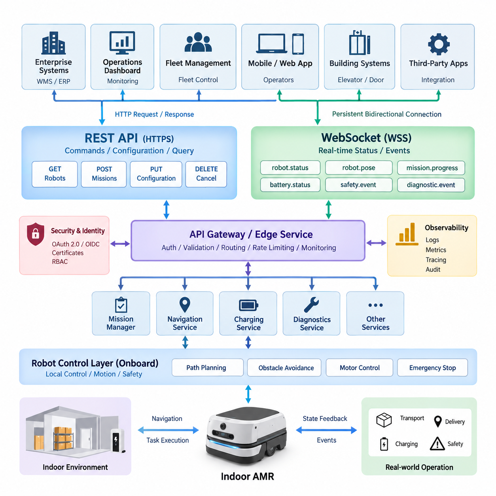
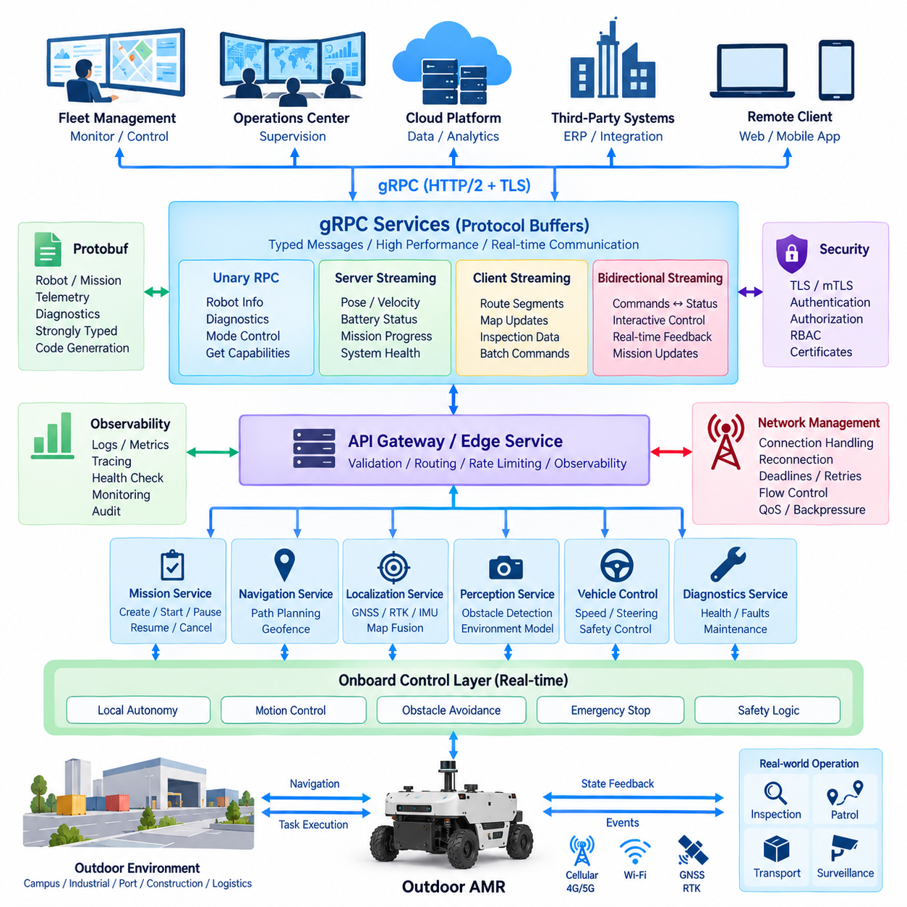
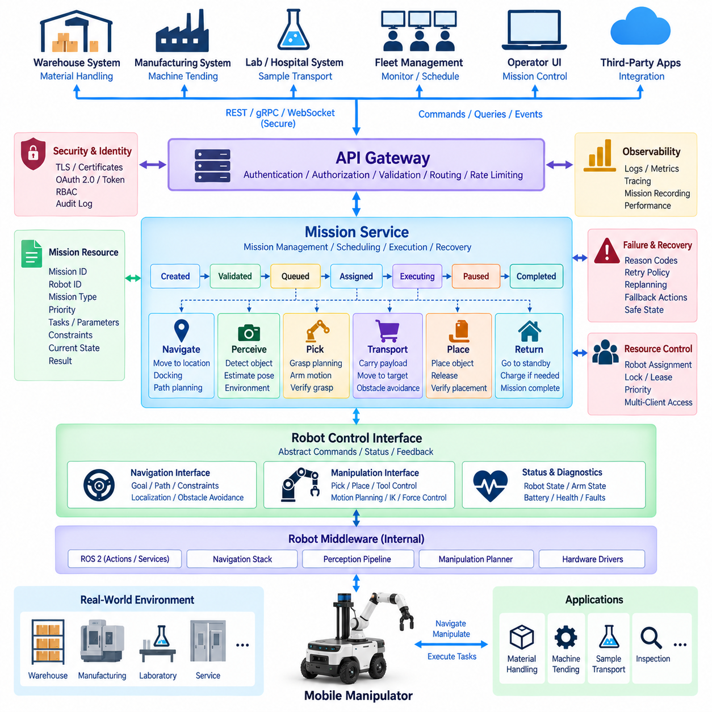
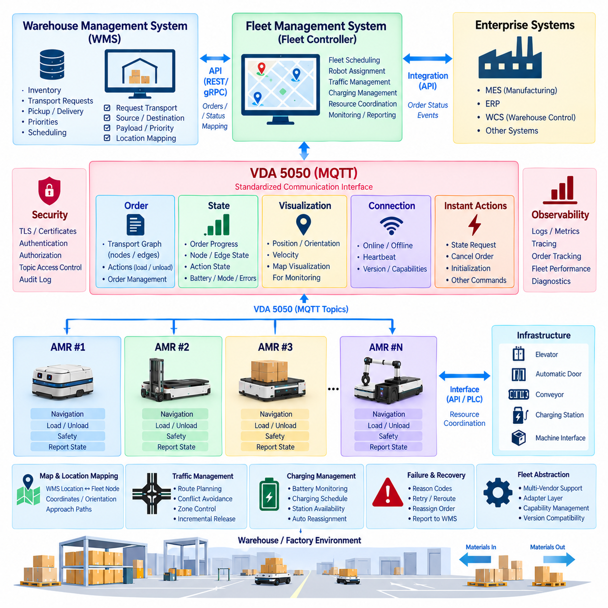
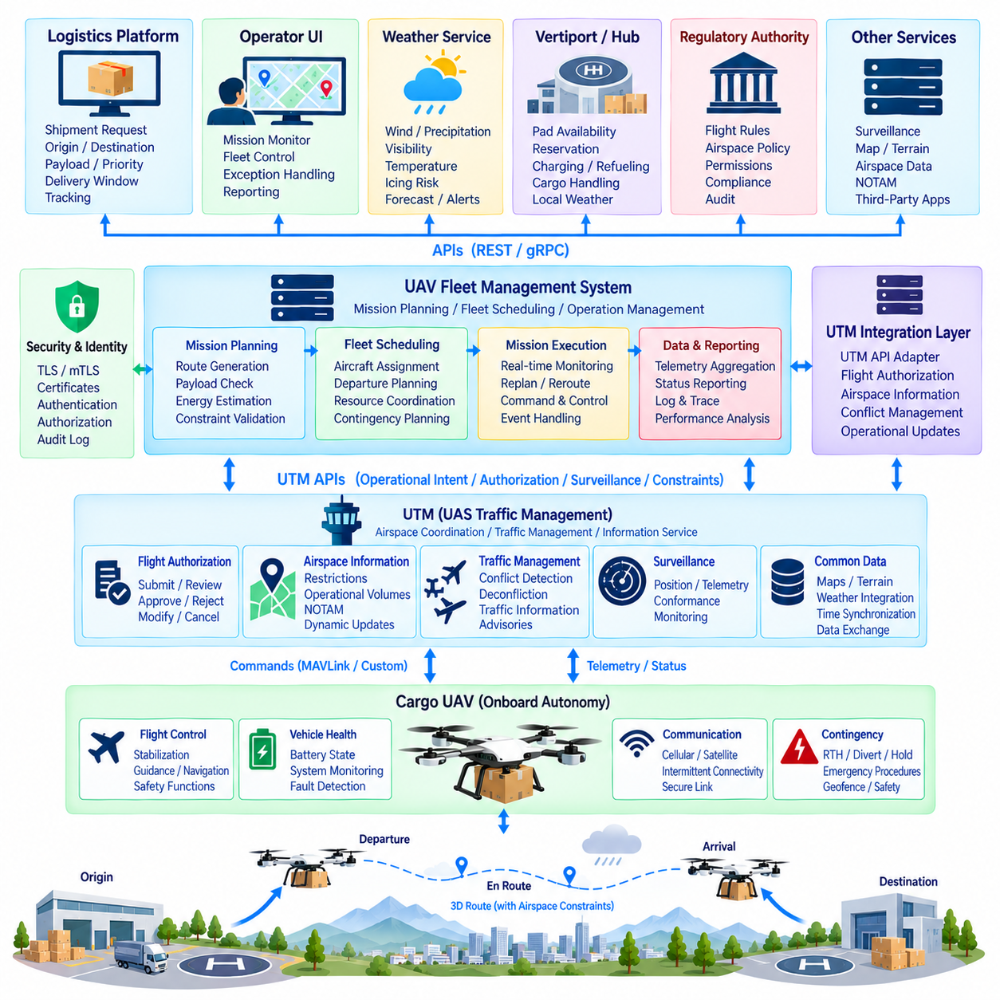
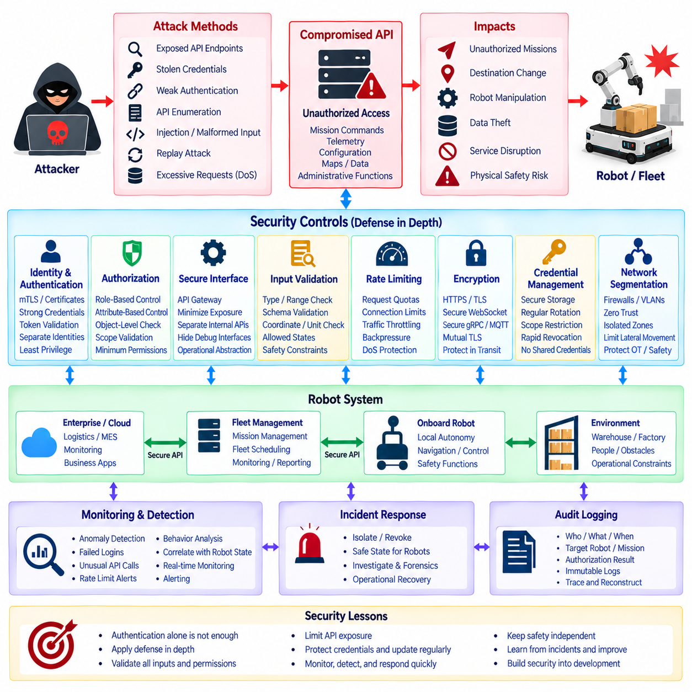
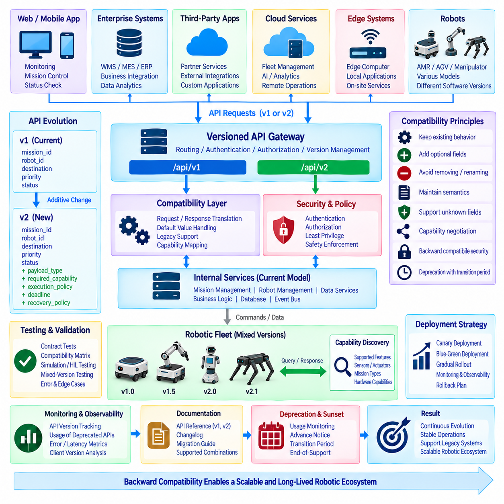
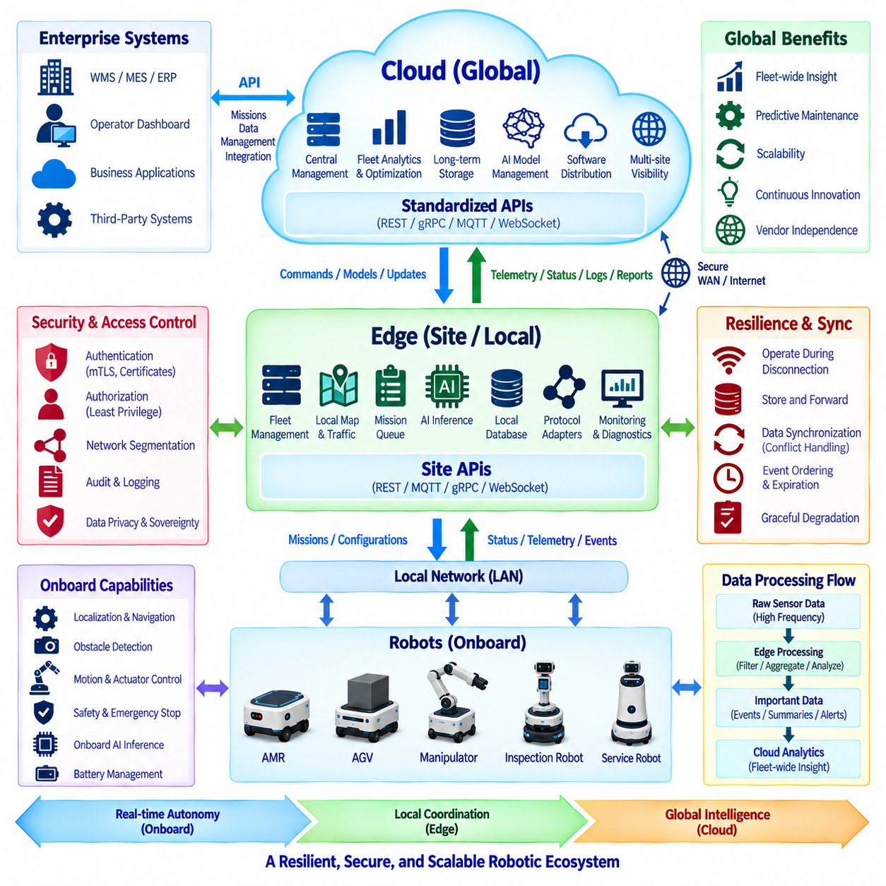
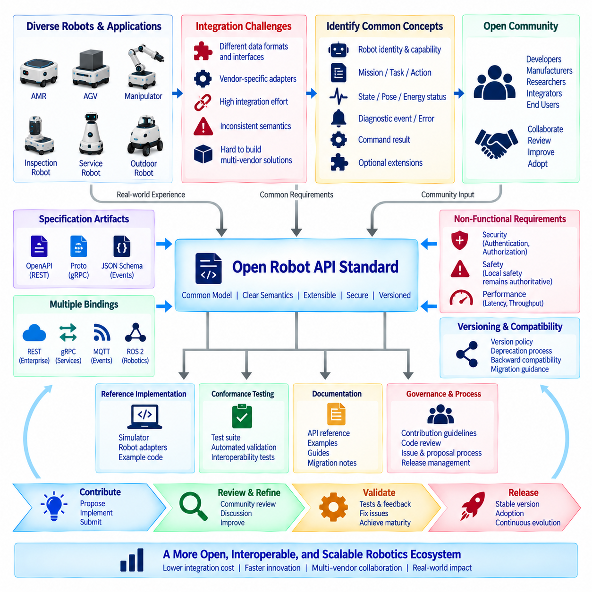
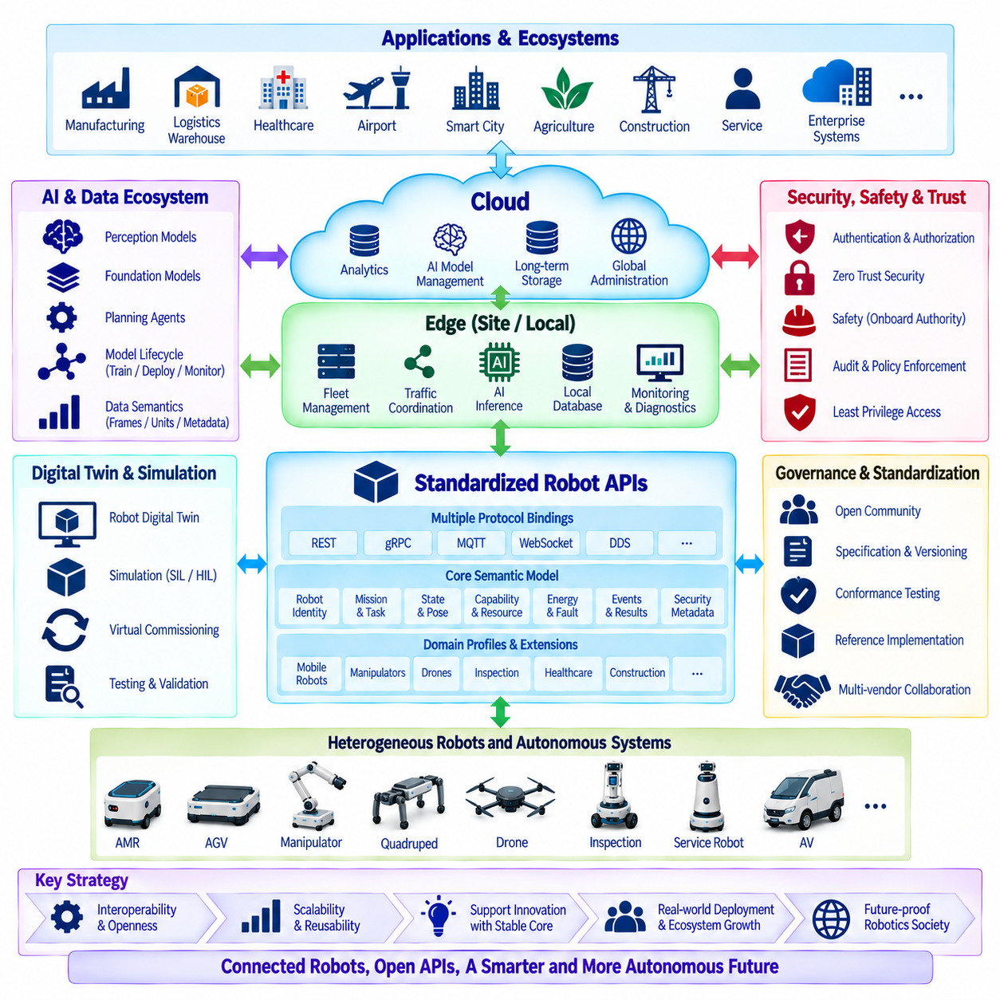

**Volume 06 Robot Communication and APIs**


# 12. API Case Studies

##  

## 12.01 Hills Indoor AMR: REST / WebSocket API Architecture

{width="7.268055555555556in" height="7.268055555555556in"}

Indoor autonomous mobile robots operate in environments where navigation, task execution, human interaction, and fleet supervision must be coordinated through interfaces that remain understandable to enterprise software. A practical architecture therefore separates transactional operations from continuously changing robot information. REST APIs provide a stable resource-oriented interface for commands and configuration, while WebSocket channels provide persistent bidirectional connections for real-time operational data.

The REST layer represents each AMR as a collection of resources such as robots, missions, maps, charging stations, tasks, diagnostics, and configuration profiles. Enterprise applications can retrieve robot information through GET requests, create missions through POST operations, modify permitted configuration through PUT or PATCH, and cancel appropriate resources through defined control endpoints. This resource abstraction prevents external systems from depending directly on internal ROS 2 nodes or hardware-specific interfaces.

A typical indoor AMR exposes identification, operational mode, localization state, battery status, current mission, fault information, and capability metadata through a robot resource. Mission resources contain destinations, waypoints, priorities, payload requirements, execution constraints, and lifecycle information. Separating robot resources from mission resources allows the API to preserve a clear distinction between the physical platform and the work assigned to that platform.

Mission creation is particularly suitable for REST because it represents a discrete transaction with a persistent result. A client may submit a transport request containing pickup and delivery locations, priority, payload information, and optional scheduling constraints. The server validates the request, creates a mission identifier, and returns an accepted or created response. The client can subsequently retrieve the mission resource without maintaining a continuous connection to the robot.

REST alone becomes inefficient when dashboards or fleet applications require rapidly changing information. Repeated polling for position, velocity, battery level, navigation state, obstacle conditions, and mission progress generates unnecessary HTTP transactions and introduces latency between an event and its observation. WebSocket complements REST by establishing a persistent communication channel through which the AMR or fleet server can publish operational changes immediately.

The WebSocket data model should use explicit event categories rather than transmitting arbitrary internal messages. Typical categories include robot.status, robot.pose, mission.progress, battery.status, navigation.state, safety.event, diagnostic.event, and connection.state. Every message should contain a robot identifier, timestamp, event type, schema version, and payload. This envelope structure makes real-time streams easier to validate, route, record, and evolve independently of individual robot implementations.

REST and WebSocket should share a common domain model. A mission created through REST must use the same mission identifier that appears in WebSocket progress events, while robot identifiers and state definitions must remain consistent across both interfaces. This avoids the architectural mistake of building separate command and monitoring models. The client can create a mission through REST, receive its identifier, subscribe to relevant WebSocket events, and track execution using the same semantic objects.

Inside the robot, an API gateway or edge service isolates external communication from the real-time control domain. REST requests are translated into validated high-level commands and delivered to mission management, navigation, charging, or diagnostic services. WebSocket publishers collect selected state changes from these services and transform them into external event schemas. Low-level motor commands, raw control loops, and safety-critical actuation remain outside the public API boundary.

This separation is essential because an enterprise API must never become the timing mechanism for motion control. HTTP and WebSocket communication can experience network delay, congestion, reconnection, or client failure. Navigation controllers, obstacle avoidance, emergency stopping, and motor control therefore continue locally with deterministic or bounded behavior. External APIs request intentions such as "execute mission" or "go to station," while onboard controllers determine how those intentions are safely executed.

Command semantics require explicit lifecycle management. After accepting a command, the system should distinguish states such as accepted, queued, executing, completed, canceled, rejected, and failed. Long-running operations should not keep an HTTP request open until physical completion. Instead, REST returns an operation or mission identifier immediately, and subsequent state transitions are available through resource queries and WebSocket events. This pattern scales better and provides clearer failure handling.

Idempotency is equally important because wireless communication can fail after a client sends a command but before it receives the response. Repeating a mission-creation request without protection could generate duplicate robot jobs. An idempotency key or client-generated request identifier allows the server to recognize retries and return the original result. Cancellation and configuration operations should similarly define whether repeated requests are harmless, rejected, or interpreted according to current state.

Indoor AMRs frequently move between wireless access points, enter elevators, pass through areas with weak coverage, or temporarily lose communication with the fleet server. WebSocket clients must therefore implement heartbeat monitoring, ping-pong mechanisms, timeout detection, exponential reconnection, and session recovery. Critical robot functions continue locally during interruption, while buffered operational events can be synchronized after connectivity returns according to retention and priority policies.

After reconnection, clients should not assume that every missed WebSocket event can be replayed. A robust design treats REST resources as authoritative snapshots and WebSocket messages as notifications of change. The client reconnects, retrieves the latest robot and mission states through REST, and then resumes event subscriptions. Sequence numbers or event offsets can additionally identify gaps when ordered event recovery is required for auditing or operational analysis.

Security must protect both interfaces consistently. REST endpoints should use HTTPS, while real-time connections use WSS. Authentication can be based on OAuth 2.0, OpenID Connect, signed tokens, certificates, or enterprise identity infrastructure according to deployment requirements. Authorization should distinguish monitoring, mission creation, mission cancellation, configuration, maintenance, and administrative privileges rather than granting every authenticated application unrestricted robot control.

Robot identity deserves separate treatment from human identity. Each AMR can possess a unique device credential or certificate, while operators and enterprise applications receive identities associated with defined roles. This allows the system to determine whether a message originated from a specific robot, fleet service, maintenance tool, WMS, or authenticated operator. Audit records can consequently associate important commands with their authenticated origin and execution result.

Safety-related events should receive higher semantic priority than ordinary telemetry. Emergency-stop activation, localization loss, blocked motion, protective-field activation, collision risk, hardware faults, and mission failures should be represented as structured events containing severity, source, timestamp, acknowledgement requirements, and recovery information. WebSocket delivery improves operational awareness, but reception of these messages must never replace the robot\'s local safety mechanisms.

Bandwidth management becomes important as fleet size grows. Publishing every pose update from every robot to every connected dashboard wastes network and server resources. Clients should be able to subscribe by robot, event class, fleet, or operational area, while the server applies appropriate update rates and change thresholds. High-frequency visualization data can be reduced independently from critical alarms, allowing one communication architecture to support both detailed diagnostics and large fleet supervision.

The architecture also provides a clean integration boundary for warehouse management systems, hospital logistics applications, building systems, elevators, automatic doors, and fleet management software. These systems interact with standardized mission and robot resources rather than directly controlling ROS 2 topics or vendor-specific navigation components. This abstraction supports replacement or upgrading of internal software while preserving stable interfaces for external applications.

Observability should cover both communication paths as one operational system. Useful measurements include REST request latency, response codes, authentication failures, mission submission rates, WebSocket connection counts, event throughput, reconnect frequency, dropped messages, queue depth, and end-to-end event latency. Correlating API requests with mission identifiers and robot identifiers allows engineers to trace a transaction from enterprise request through robot execution and final completion.

Version management should protect deployed integrations over the long service life of industrial robots. REST resources may use explicit API versions, while WebSocket event envelopes carry schema versions that allow consumers to interpret evolving payloads. Additive changes are preferable when possible, and deprecated fields should remain available during defined transition periods. Contract testing can verify that WMS, RMS, dashboards, and robot software remain compatible before deployment.

The combined REST-WebSocket pattern therefore creates a practical boundary between enterprise transactions and real-time robot observation. REST provides durable resources, explicit command semantics, configuration access, and recovery snapshots, while WebSocket provides efficient asynchronous status and event delivery. Together they form an API architecture suited to indoor AMRs without exposing safety-critical control loops or tightly coupling external applications to internal middleware.

In a production deployment, the most important architectural principle is not simply choosing two communication technologies, but assigning each technology the correct responsibility. REST governs stable resources and transactional intent; WebSocket distributes time-sensitive state changes; onboard software preserves autonomous and safe operation; and the API gateway enforces identity, policy, validation, and observability. This division creates an extensible foundation for individual AMRs, multi-robot fleets, and enterprise-scale robotic services.

실내 자율이동로봇(Indoor Autonomous Mobile Robot, Indoor AMR)은 내비게이션(Navigation), 작업 실행(Task Execution), 인간 상호작용(Human Interaction), 플릿 감독(Fleet Supervision)을 기업용 소프트웨어(Enterprise Software)가 이해할 수 있는 인터페이스를 통해 조정해야 하는 환경에서 동작한다. 따라서 실용적인 아키텍처(Architecture)는 트랜잭션 기반 동작(Transactional Operations)과 지속적으로 변화하는 로봇 정보(Continuously Changing Robot Information)를 분리한다. REST API는 명령과 설정을 위한 안정적인 리소스 지향 인터페이스(Resource-Oriented Interface)를 제공하고, 웹소켓(WebSocket) 채널은 실시간 운영 데이터를 위한 지속적인 양방향 연결(Persistent Bidirectional Connection)을 제공한다.

REST 계층(REST Layer)은 각각의 AMR을 로봇(Robots), 미션(Missions), 맵(Maps), 충전 스테이션(Charging Stations), 작업(Tasks), 진단(Diagnostics), 설정 프로파일(Configuration Profiles) 등의 리소스 집합으로 표현한다. 기업 애플리케이션(Enterprise Application)은 GET 요청을 통해 로봇 정보를 조회하고, POST 동작으로 미션을 생성하며, PUT 또는 PATCH를 통해 허용된 설정을 변경하고, 정의된 제어 엔드포인트(Control Endpoint)를 통해 적절한 리소스를 취소할 수 있다. 이러한 리소스 추상화(Resource Abstraction)는 외부 시스템이 내부 ROS 2 노드(Node)나 하드웨어 종속 인터페이스에 직접 의존하는 것을 방지한다.

일반적인 실내 AMR은 로봇 리소스(Robot Resource)를 통해 식별 정보(Identification), 운영 모드(Operational Mode), 위치추정 상태(Localization State), 배터리 상태(Battery Status), 현재 미션(Current Mission), 고장 정보(Fault Information), 기능 메타데이터(Capability Metadata)를 제공한다. 미션 리소스(Mission Resource)는 목적지, 웨이포인트(Waypoint), 우선순위, 페이로드 요구사항(Payload Requirements), 실행 제약조건(Execution Constraints), 생명주기 정보(Lifecycle Information)를 포함한다. 로봇 리소스와 미션 리소스를 분리하면 물리적 플랫폼(Physical Platform)과 해당 플랫폼에 할당된 작업 사이의 명확한 구분을 유지할 수 있다.

미션 생성(Mission Creation)은 지속적인 결과를 갖는 개별 트랜잭션(Discrete Transaction)을 나타내기 때문에 REST에 특히 적합하다. 클라이언트(Client)는 픽업 및 배송 위치, 우선순위, 페이로드 정보, 선택적 스케줄링 제약조건(Optional Scheduling Constraints)을 포함하는 운송 요청(Transport Request)을 제출할 수 있다. 서버(Server)는 요청을 검증하고 미션 식별자(Mission Identifier)를 생성한 후 승인 또는 생성 응답을 반환한다. 이후 클라이언트는 로봇과 지속적인 연결을 유지하지 않고도 해당 미션 리소스를 조회할 수 있다.

REST만으로는 대시보드(Dashboard)나 플릿 애플리케이션(Fleet Application)이 빠르게 변화하는 정보를 요구할 때 비효율적이다. 위치(Position), 속도(Velocity), 배터리 수준(Battery Level), 내비게이션 상태(Navigation State), 장애물 상태(Obstacle Conditions), 미션 진행 상태(Mission Progress)를 반복적으로 폴링(Polling)하면 불필요한 HTTP 트랜잭션이 발생하고 이벤트 발생과 관측 사이의 지연시간(Latency)이 증가한다. 웹소켓(WebSocket)은 지속적인 통신 채널을 구축하여 AMR 또는 플릿 서버가 운영 상태의 변화를 즉시 전달할 수 있도록 함으로써 REST를 보완한다.

웹소켓 데이터 모델(WebSocket Data Model)은 임의의 내부 메시지를 전송하기보다는 명확하게 정의된 이벤트 범주(Event Category)를 사용해야 한다. 대표적인 범주에는 robot.status, robot.pose, mission.progress, battery.status, navigation.state, safety.event, diagnostic.event, connection.state 등이 포함된다. 각 메시지는 로봇 식별자(Robot Identifier), 타임스탬프(Timestamp), 이벤트 유형(Event Type), 스키마 버전(Schema Version), 페이로드(Payload)를 포함해야 한다. 이러한 엔벌로프 구조(Envelope Structure)는 실시간 스트림(Real-Time Stream)의 검증, 라우팅, 기록, 확장을 개별 로봇 구현과 독립적으로 수행하기 쉽게 만든다.

REST와 웹소켓은 공통 도메인 모델(Common Domain Model)을 공유해야 한다. REST를 통해 생성된 미션은 웹소켓 진행 이벤트(WebSocket Progress Event)에 나타나는 것과 동일한 미션 식별자를 사용해야 하며, 로봇 식별자와 상태 정의도 두 인터페이스에서 일관성을 유지해야 한다. 이를 통해 명령 모델(Command Model)과 모니터링 모델(Monitoring Model)을 별도로 구축하는 아키텍처적 오류를 방지할 수 있다. 클라이언트는 REST로 미션을 생성하고 식별자를 받은 뒤 관련 웹소켓 이벤트를 구독하여 동일한 의미 객체(Semantic Object)를 기반으로 실행 과정을 추적할 수 있다.

로봇 내부에서는 API 게이트웨이(API Gateway) 또는 엣지 서비스(Edge Service)가 외부 통신을 실시간 제어 영역(Real-Time Control Domain)으로부터 격리한다. REST 요청은 검증된 상위 수준 명령(High-Level Command)으로 변환되어 미션 관리(Mission Management), 내비게이션, 충전 또는 진단 서비스에 전달된다. 웹소켓 퍼블리셔(WebSocket Publisher)는 이러한 서비스에서 선택된 상태 변화를 수집하고 외부 이벤트 스키마(External Event Schema)로 변환한다. 저수준 모터 명령(Low-Level Motor Command), 원시 제어 루프(Raw Control Loop), 안전 필수 구동(Safety-Critical Actuation)은 공개 API 경계 밖에 유지된다.

이러한 분리는 기업 API가 절대로 모션 제어(Motion Control)의 타이밍 메커니즘(Timing Mechanism)이 되어서는 안 되기 때문에 중요하다. HTTP와 웹소켓 통신은 네트워크 지연(Network Delay), 혼잡(Congestion), 재연결(Reconnection), 클라이언트 장애(Client Failure)를 경험할 수 있다. 따라서 내비게이션 제어기(Navigation Controller), 장애물 회피(Obstacle Avoidance), 비상 정지(Emergency Stop), 모터 제어(Motor Control)는 결정론적 또는 제한된 동작(Deterministic or Bounded Behavior)을 유지하면서 로컬에서 계속 실행된다. 외부 API는 "미션 실행(Execute Mission)"이나 "스테이션으로 이동(Go to Station)"과 같은 의도(Intent)를 요청하며, 온보드 제어기(Onboard Controller)는 이러한 의도를 안전하게 실행하는 방법을 결정한다.

명령 의미론(Command Semantics)에는 명확한 생명주기 관리(Lifecycle Management)가 필요하다. 명령을 수락한 이후 시스템은 승인(Accepted), 대기(Queued), 실행 중(Executing), 완료(Completed), 취소(Canceled), 거부(Rejected), 실패(Failed) 등의 상태를 구분해야 한다. 장시간 실행되는 작업(Long-Running Operation)은 물리적 실행이 완료될 때까지 HTTP 요청을 유지해서는 안 된다. 대신 REST는 작업 또는 미션 식별자를 즉시 반환하고, 이후 상태 전환(State Transition)은 리소스 조회와 웹소켓 이벤트를 통해 제공한다. 이러한 패턴은 확장성이 우수하고 보다 명확한 장애 처리(Failure Handling)를 제공한다.

멱등성(Idempotency) 역시 중요하다. 무선 통신이 클라이언트의 명령 전송 이후 응답을 수신하기 전에 실패할 수 있기 때문이다. 보호 메커니즘 없이 미션 생성 요청을 반복하면 중복된 로봇 작업이 생성될 수 있다. 멱등성 키(Idempotency Key) 또는 클라이언트 생성 요청 식별자(Client-Generated Request Identifier)를 사용하면 서버가 재시도 요청을 인식하고 원래의 결과를 반환할 수 있다. 취소 및 설정 작업 역시 반복 요청이 무해한지, 거부되는지, 현재 상태에 따라 해석되는지를 명확하게 정의해야 한다.

실내 AMR은 무선 액세스 포인트(Wireless Access Point) 사이를 이동하거나, 엘리베이터에 탑승하거나, 통신 품질이 낮은 영역을 통과하거나, 플릿 서버와의 통신을 일시적으로 상실하는 경우가 많다. 따라서 웹소켓 클라이언트는 하트비트 모니터링(Heartbeat Monitoring), 핑퐁 메커니즘(Ping-Pong Mechanism), 타임아웃 감지(Timeout Detection), 지수적 재연결(Exponential Reconnection), 세션 복구(Session Recovery)를 구현해야 한다. 통신이 중단되어도 핵심 로봇 기능은 로컬에서 계속 동작하며, 버퍼링된 운영 이벤트(Buffered Operational Event)는 보존 및 우선순위 정책에 따라 연결 복구 후 동기화할 수 있다.

재연결 이후 클라이언트는 누락된 모든 웹소켓 이벤트를 재생할 수 있다고 가정해서는 안 된다. 견고한 설계에서는 REST 리소스를 권위 있는 상태 스냅샷(Authoritative Snapshot)으로 취급하고, 웹소켓 메시지를 상태 변화 알림(Notification of Change)으로 취급한다. 클라이언트는 재연결한 뒤 REST를 통해 최신 로봇 및 미션 상태를 조회하고 이벤트 구독을 다시 시작한다. 순서가 지정된 이벤트 복구가 감사(Auditing) 또는 운영 분석(Operational Analysis)에 필요한 경우 시퀀스 번호(Sequence Number)나 이벤트 오프셋(Event Offset)을 통해 누락 구간을 식별할 수도 있다.

보안(Security)은 두 인터페이스를 일관되게 보호해야 한다. REST 엔드포인트는 HTTPS를 사용하고 실시간 연결은 WSS를 사용해야 한다. 인증(Authentication)은 배포 요구사항에 따라 OAuth 2.0, 오픈아이디 커넥트(OpenID Connect, OIDC), 서명 토큰(Signed Token), 인증서(Certificate), 기업 아이덴티티 인프라(Enterprise Identity Infrastructure)를 기반으로 구성할 수 있다. 권한부여(Authorization)는 인증된 모든 애플리케이션에 무제한 로봇 제어 권한을 제공하는 대신 모니터링, 미션 생성, 미션 취소, 설정, 유지보수, 관리자 권한을 구분해야 한다.

로봇 아이덴티티(Robot Identity)는 사람의 아이덴티티(Human Identity)와 별도로 관리할 필요가 있다. 각 AMR은 고유한 디바이스 자격증명(Device Credential)이나 인증서를 가질 수 있으며, 운영자와 기업 애플리케이션에는 정의된 역할(Role)에 연결된 아이덴티티가 부여된다. 이를 통해 시스템은 특정 메시지가 특정 로봇, 플릿 서비스, 유지보수 도구, 창고관리시스템(Warehouse Management System, WMS), 인증된 운영자 중 어디에서 발생했는지를 판단할 수 있다. 따라서 감사 기록(Audit Record)은 중요한 명령을 인증된 발생 주체 및 실행 결과와 연결할 수 있다.

안전 관련 이벤트(Safety-Related Event)는 일반 텔레메트리(Ordinary Telemetry)보다 높은 의미적 우선순위(Semantic Priority)를 가져야 한다. 비상 정지 활성화(Emergency-Stop Activation), 위치추정 상실(Localization Loss), 이동 차단(Blocked Motion), 보호 영역 활성화(Protective-Field Activation), 충돌 위험(Collision Risk), 하드웨어 고장(Hardware Fault), 미션 실패(Mission Failure)는 심각도(Severity), 발생원(Source), 타임스탬프, 확인 요구사항(Acknowledgement Requirements), 복구 정보(Recovery Information)를 포함하는 구조화된 이벤트로 표현해야 한다. 웹소켓 전달은 운영 인지성(Operational Awareness)을 향상시키지만 이러한 메시지 수신이 로봇의 로컬 안전 메커니즘(Local Safety Mechanism)을 대체해서는 안 된다.

플릿 규모가 증가하면 대역폭 관리(Bandwidth Management)가 중요해진다. 모든 로봇의 모든 위치 업데이트(Pose Update)를 연결된 모든 대시보드에 전송하는 것은 네트워크 및 서버 자원을 낭비한다. 클라이언트는 로봇, 이벤트 클래스(Event Class), 플릿, 운영 영역(Operational Area)을 기준으로 구독할 수 있어야 하며 서버는 적절한 업데이트 주기(Update Rate)와 변화 임계값(Change Threshold)을 적용해야 한다. 고주파 시각화 데이터(High-Frequency Visualization Data)는 중요 경보(Critical Alarm)와 독립적으로 축소할 수 있으므로 하나의 통신 아키텍처가 상세 진단과 대규모 플릿 감독을 모두 지원할 수 있다.

이 아키텍처는 또한 창고관리시스템(WMS), 병원 물류 애플리케이션(Hospital Logistics Application), 빌딩 시스템(Building System), 엘리베이터(Elevator), 자동문(Automatic Door), 플릿 관리 소프트웨어(Fleet Management Software)를 위한 명확한 통합 경계(Integration Boundary)를 제공한다. 이러한 시스템은 ROS 2 토픽(Topic)이나 공급업체별 내비게이션 구성요소를 직접 제어하는 대신 표준화된 미션 및 로봇 리소스와 상호작용한다. 이러한 추상화는 외부 애플리케이션을 위한 안정적인 인터페이스를 유지하면서 내부 소프트웨어를 교체하거나 업그레이드할 수 있도록 한다.

관측가능성(Observability)은 두 통신 경로를 하나의 운영 시스템으로 포괄해야 한다. 유용한 측정 항목에는 REST 요청 지연시간(Request Latency), 응답 코드(Response Code), 인증 실패(Authentication Failure), 미션 제출률(Mission Submission Rate), 웹소켓 연결 수(Connection Count), 이벤트 처리량(Event Throughput), 재연결 빈도(Reconnect Frequency), 손실 메시지(Dropped Message), 큐 깊이(Queue Depth), 종단간 이벤트 지연시간(End-to-End Event Latency)이 포함된다. API 요청을 미션 식별자 및 로봇 식별자와 연계하면 기업 시스템의 요청부터 로봇 실행 및 최종 완료까지 전체 트랜잭션을 추적할 수 있다.

버전 관리(Version Management)는 산업용 로봇의 긴 서비스 수명 동안 이미 배포된 통합 시스템을 보호해야 한다. REST 리소스는 명시적인 API 버전을 사용할 수 있으며, 웹소켓 이벤트 엔벌로프는 소비자(Consumer)가 변화하는 페이로드를 해석할 수 있도록 스키마 버전을 포함한다. 가능한 경우 추가적 변경(Additive Change)을 우선해야 하며, 사용 중단 예정 필드(Deprecated Field)는 정의된 전환 기간(Transition Period) 동안 유지되어야 한다. 계약 테스트(Contract Testing)를 통해 배포 전에 WMS, 로봇관리시스템(Robot Management System, RMS), 대시보드, 로봇 소프트웨어 간의 호환성을 검증할 수 있다.

REST-웹소켓 결합 패턴(Combined REST-WebSocket Pattern)은 기업 트랜잭션(Enterprise Transaction)과 실시간 로봇 관측(Real-Time Robot Observation) 사이에 실용적인 경계를 형성한다. REST는 지속 가능한 리소스(Durable Resource), 명확한 명령 의미론, 설정 접근(Configuration Access), 복구용 스냅샷(Recovery Snapshot)을 제공하며, 웹소켓은 효율적인 비동기 상태 및 이벤트 전달(Asynchronous Status and Event Delivery)을 제공한다. 두 방식을 결합하면 안전 필수 제어 루프를 외부에 노출하거나 외부 애플리케이션을 내부 미들웨어에 강하게 결합하지 않으면서 실내 AMR에 적합한 API 아키텍처를 구성할 수 있다.

실제 운영 환경(Production Deployment)에서 가장 중요한 아키텍처 원칙은 단순히 두 가지 통신 기술을 선택하는 것이 아니라 각각의 기술에 올바른 책임(Responsibility)을 할당하는 것이다. REST는 안정적인 리소스와 트랜잭션 의도(Transactional Intent)를 담당하고, 웹소켓은 시간에 민감한 상태 변화(Time-Sensitive State Change)를 전달하며, 온보드 소프트웨어(Onboard Software)는 자율적이고 안전한 동작을 유지한다. API 게이트웨이는 아이덴티티, 정책(Policy), 검증(Validation), 관측가능성을 담당한다. 이러한 역할 분리는 개별 AMR에서 다중 로봇 플릿(Multi-Robot Fleet), 그리고 기업 규모 로봇 서비스(Enterprise-Scale Robotic Service)로 확장할 수 있는 기반을 제공한다.

##  

## 12.02 Outdoor AMR gRPC-Based Real-Time Control API

{width="7.268055555555556in" height="7.268055555555556in"}

Outdoor autonomous mobile robots operate across campuses, industrial yards, ports, construction sites, logistics facilities, and infrastructure corridors where communication latency and network quality can vary significantly. For these systems, gRPC provides a strongly typed, high-performance API layer based on Protocol Buffers and HTTP/2. It is particularly suitable for structured command exchange, continuous telemetry, mission coordination, and service-to-service communication between outdoor AMRs, edge servers, and fleet controllers.

The architecture should separate external mission-level communication from safety-critical onboard control. A remote fleet controller may request navigation toward a destination, initiate an inspection route, modify mission parameters, or retrieve diagnostic information through gRPC services. However, steering, traction control, obstacle avoidance, emergency braking, and other deterministic functions remain within the robot. The API communicates operational intent rather than directly closing real-time motor-control loops over an unreliable external network.

Protocol Buffers define the communication contract shared by the robot and external systems. Messages can describe robot identity, pose, velocity, localization quality, battery state, mission information, detected obstacles, system health, and command results using explicit field types. Compared with loosely structured payloads, this schema-driven approach reduces interpretation ambiguity and supports automatic client and server code generation for languages commonly used in robotic systems, including C++, Python, Java, and Go.

Unary remote procedure calls are appropriate for operations that naturally follow a request-response pattern. Examples include retrieving robot information, requesting current diagnostics, loading mission parameters, changing an operating mode, or querying supported capabilities. The client sends one structured request and receives one structured response. Deadlines should be defined for each call so that communication failure or an unavailable robot cannot leave a remote application waiting indefinitely for a response.

Server streaming becomes valuable when the fleet controller requires continuous information from an outdoor AMR. After establishing a subscription, the robot can stream pose, velocity, battery level, localization confidence, mission progress, safety state, and diagnostic information over a persistent HTTP/2 connection. This eliminates repeated polling and enables the receiver to process state changes as they arrive while preserving a clearly defined protobuf schema for every transmitted message.

Client streaming can support cases in which an edge or fleet system needs to transmit a sequence of related data to the robot service. Route segments, map updates, inspection parameters, or batches of operational information may be delivered as a stream and acknowledged after processing. This model should be used selectively because unrestricted continuous command transmission can create unnecessary coupling between remote infrastructure and the robot\'s autonomous execution layer.

Bidirectional streaming provides the most flexible gRPC communication model for interactive robot operations. The robot and supervisory system can exchange messages independently over the same logical connection, allowing commands, acknowledgements, state transitions, and operational feedback to coexist. A fleet controller can issue high-level updates while the AMR continuously returns execution status, but message semantics must remain explicit so that streaming convenience does not blur the boundary between supervision and safety-critical control.

A mission-oriented gRPC service can represent operations such as CreateMission, StartMission, PauseMission, ResumeMission, CancelMission, and GetMissionStatus. Mission messages may include mission identifiers, destinations, route constraints, priorities, payload information, operating zones, and execution policies. Long-running missions should return an acknowledgement or mission handle quickly rather than keeping a unary request active until physical completion. Progress is then reported through streaming status messages.

Outdoor localization requires richer state representation than a simple two-dimensional position. A telemetry schema may include GNSS coordinates, map-frame pose, heading, linear and angular velocity, localization source, covariance, GNSS RTK state, IMU status, and timestamp information. The API should identify coordinate frames and measurement units explicitly because ambiguity between geographic coordinates, local map coordinates, and robot-relative coordinates can cause serious integration errors in autonomous navigation systems.

Real-time communication also requires consistent time semantics. Each message should contain timestamps generated from a defined clock source, while sequence numbers can identify ordering and missing messages. Systems using GNSS, PTP, or other synchronization mechanisms can correlate robot telemetry with sensor data and server-side events more accurately. The API contract should distinguish measurement time from transmission or reception time so that network delay is not mistakenly interpreted as robot state delay.

Command processing should incorporate identifiers, deadlines, acknowledgements, and lifecycle states. A remote command may transition through received, validated, accepted, executing, completed, rejected, canceled, or failed states. The command identifier allows responses and telemetry to be correlated with the originating request. When a client retries after communication loss, the server should detect duplicate identifiers where appropriate rather than executing the same physical operation multiple times.

gRPC deadlines are especially important for outdoor robots because mobile networks can introduce unpredictable delays. Clients should specify how long a request remains meaningful, and servers should stop unnecessary processing when that deadline expires. Retry policies must consider command semantics carefully. Automatically retrying a read-only status query is generally safe, whereas automatically retrying a movement or mission command without idempotency protection could create duplicate physical actions.

The architecture must assume temporary network disconnection rather than treating connectivity as permanently available. Outdoor AMRs may move through radio shadows, transition between Wi-Fi and cellular networks, or experience congestion and packet loss. When connectivity disappears, the robot should continue executing locally permitted behavior according to mission and safety policies. Remote control services should detect connection loss, expose communication state, and reconcile mission status after connectivity is restored.

Flow control and backpressure are necessary when telemetry production exceeds the receiver\'s processing capacity. High-frequency pose, perception, or diagnostic streams should not consume unlimited memory or delay safety-relevant information. Telemetry services can define different update frequencies, subscription classes, or data priorities. High-bandwidth sensor information such as camera images and raw LiDAR data should generally use dedicated data paths rather than being mixed indiscriminately with essential command and state messages.

The gRPC API gateway or edge service forms a controlled boundary between external networks and internal robot middleware. It validates requests, authenticates clients, applies authorization policies, translates external protobuf messages into internal service commands, and exposes selected robot states. ROS 2, DDS, CAN, Ethernet-based controllers, or proprietary interfaces can remain behind this boundary, allowing external systems to use a stable API without becoming dependent on internal implementation details.

Security should use transport encryption and authenticated identities throughout the communication path. TLS protects gRPC traffic, while mutual TLS can authenticate both robot and server when stronger device identity is required. Certificates, tokens, or enterprise identity mechanisms can be combined with role-based authorization so that monitoring applications, fleet controllers, maintenance tools, and administrative services receive only the operations required for their responsibilities.

Remote motion-related commands require particularly strict authorization and validation. The server should verify operating mode, mission state, permitted geographic area, speed constraints, command freshness, and safety conditions before accepting an instruction. Even after validation, onboard safety logic retains final authority over physical motion. A valid API request therefore represents permission to attempt an operation, not an unconditional instruction that overrides obstacle detection, emergency stopping, or local safety constraints.

Health and diagnostic services can expose processor utilization, memory usage, network quality, battery condition, motor-controller state, localization health, sensor availability, thermal conditions, and active fault codes. Structured diagnostic messages allow fleet software to distinguish warnings from critical failures and identify whether degraded operation is still permitted. Streaming diagnostics can additionally support remote maintenance and predictive analysis without exposing unrestricted access to internal robot processes.

Observability should trace communication from the client request to robot execution. Useful measurements include RPC latency, deadline expiration, error status, active stream count, message throughput, reconnect frequency, authentication failure, command acceptance rate, and telemetry delay. Correlation identifiers can connect a fleet-level mission to individual RPC calls and onboard events, enabling engineers to determine whether an operational problem originated in networking, API processing, navigation, hardware, or mission logic.

The protobuf contract must also evolve without unnecessarily breaking deployed robots and fleet applications. Existing field numbers should remain stable, removed fields should be reserved, and compatible additive changes should be preferred. New capabilities can be introduced through optional fields or new RPC methods while older clients continue using the subset they understand. Automated compatibility and contract tests should verify communication between multiple robot software and fleet-server versions before field deployment.

Large outdoor fleets can place gRPC services behind redundant edge or fleet infrastructure, but connection ownership must be designed carefully because streaming sessions are long-lived. Service discovery, load balancing, health checking, and failover mechanisms should preserve robot identity and mission continuity. The system should distinguish temporary server migration from robot failure and prevent multiple controllers from simultaneously assuming authority over the same physical robot without an explicit coordination mechanism.

In a production outdoor AMR system, gRPC is therefore best positioned between high-level fleet supervision and autonomous onboard execution. Unary RPC supports discrete operations, server streaming delivers continuous telemetry, and bidirectional streaming enables interactive supervision when necessary. Protocol Buffers provide a stable typed contract, while deadlines, identity, security, observability, reconnection, and lifecycle semantics make the communication layer suitable for real operational environments.

The resulting architecture does not attempt to transform an external network into a deterministic robot control bus. Instead, it uses gRPC to create an efficient, strongly defined communication boundary around an autonomous machine. The fleet system communicates goals and policies, the robot reports state and execution results, and onboard controllers retain responsibility for immediate motion and safety. This separation enables outdoor AMRs to combine responsive remote integration with resilient local autonomy as deployments expand from individual robots to large heterogeneous fleets.

실외 자율이동로봇(Outdoor Autonomous Mobile Robot, Outdoor AMR)은 캠퍼스, 산업단지, 항만, 건설 현장, 물류 시설, 인프라 구간 등 통신 지연시간(Communication Latency)과 네트워크 품질(Network Quality)이 크게 변화할 수 있는 환경에서 운용된다. 이러한 시스템에서 gRPC는 프로토콜 버퍼(Protocol Buffers)와 HTTP/2를 기반으로 하는 강한 형식(Strongly Typed)의 고성능 API 계층을 제공한다. 특히 실외 AMR, 엣지 서버(Edge Server), 플릿 제어기(Fleet Controller) 사이의 구조화된 명령 교환, 연속 텔레메트리(Continuous Telemetry), 미션 조정(Mission Coordination), 서비스 간 통신(Service-to-Service Communication)에 적합하다.

아키텍처는 외부 미션 수준 통신(External Mission-Level Communication)과 안전 필수 온보드 제어(Safety-Critical Onboard Control)를 분리해야 한다. 원격 플릿 제어기는 gRPC 서비스를 통해 목적지를 향한 내비게이션을 요청하고, 점검 경로를 시작하거나, 미션 파라미터를 변경하고, 진단 정보를 조회할 수 있다. 그러나 조향(Steering), 구동 제어(Traction Control), 장애물 회피(Obstacle Avoidance), 비상 제동(Emergency Braking), 기타 결정론적 기능(Deterministic Function)은 로봇 내부에 유지된다. API는 신뢰성이 보장되지 않는 외부 네트워크를 통해 실시간 모터 제어 루프를 직접 폐루프(Closed Loop)로 구성하는 대신 운영 의도(Operational Intent)를 전달한다.

프로토콜 버퍼(Protocol Buffers)는 로봇과 외부 시스템이 공유하는 통신 계약(Communication Contract)을 정의한다. 메시지는 명시적인 필드 형식(Field Type)을 사용하여 로봇 아이덴티티(Robot Identity), 자세(Pose), 속도(Velocity), 위치추정 품질(Localization Quality), 배터리 상태(Battery State), 미션 정보(Mission Information), 감지된 장애물(Detected Obstacles), 시스템 상태(System Health), 명령 결과(Command Result)를 표현할 수 있다. 이러한 스키마 기반 접근법(Schema-Driven Approach)은 해석의 모호성을 줄이고 C++, Python, Java, Go 등 로봇 시스템에서 일반적으로 사용하는 언어의 클라이언트 및 서버 코드를 자동 생성할 수 있도록 한다.

단항 원격 프로시저 호출(Unary Remote Procedure Call)은 자연스럽게 요청-응답(Request-Response) 패턴을 따르는 동작에 적합하다. 예를 들어 로봇 정보 조회, 현재 진단 정보 요청, 미션 파라미터 로딩, 운영 모드 변경, 지원 기능 조회 등에 사용할 수 있다. 클라이언트는 하나의 구조화된 요청을 전송하고 하나의 구조화된 응답을 받는다. 각 호출에는 데드라인(Deadline)을 정의하여 통신 장애나 로봇의 응답 불가 상태로 인해 원격 애플리케이션이 무기한 응답을 기다리는 상황을 방지해야 한다.

서버 스트리밍(Server Streaming)은 플릿 제어기가 실외 AMR로부터 지속적인 정보를 필요로 할 때 유용하다. 구독(Subscription)이 설정되면 로봇은 지속적인 HTTP/2 연결을 통해 자세, 속도, 배터리 수준, 위치추정 신뢰도(Localization Confidence), 미션 진행 상태, 안전 상태, 진단 정보를 스트리밍할 수 있다. 이를 통해 반복적인 폴링(Polling)을 제거하고 수신 시스템이 상태 변화를 도착 즉시 처리하면서 각 전송 메시지에 대해 명확하게 정의된 프로토콜 버퍼 스키마를 유지할 수 있다.

클라이언트 스트리밍(Client Streaming)은 엣지 또는 플릿 시스템이 서로 연관된 데이터의 연속적인 집합을 로봇 서비스에 전달해야 하는 경우 활용할 수 있다. 경로 구간(Route Segment), 맵 업데이트(Map Update), 점검 파라미터(Inspection Parameter), 운영 정보 배치(Batch of Operational Information)를 스트림으로 전송하고 처리 완료 후 확인 응답을 받을 수 있다. 다만 제한 없는 연속 명령 전송은 원격 인프라와 로봇의 자율 실행 계층(Autonomous Execution Layer) 사이에 불필요한 결합을 만들 수 있으므로 선택적으로 사용해야 한다.

양방향 스트리밍(Bidirectional Streaming)은 대화형 로봇 운용(Interactive Robot Operation)을 위한 가장 유연한 gRPC 통신 모델을 제공한다. 로봇과 감독 시스템(Supervisory System)은 동일한 논리적 연결(Logical Connection)을 통해 독립적으로 메시지를 교환할 수 있으므로 명령, 확인 응답(Acknowledgement), 상태 전환(State Transition), 운영 피드백(Operational Feedback)을 함께 처리할 수 있다. 플릿 제어기는 상위 수준의 업데이트를 전송하고 AMR은 지속적으로 실행 상태를 반환할 수 있지만, 스트리밍의 편의성 때문에 감독과 안전 필수 제어 사이의 경계가 모호해지지 않도록 메시지 의미론(Message Semantics)을 명확하게 정의해야 한다.

미션 지향 gRPC 서비스(Mission-Oriented gRPC Service)는 CreateMission, StartMission, PauseMission, ResumeMission, CancelMission, GetMissionStatus와 같은 동작을 표현할 수 있다. 미션 메시지에는 미션 식별자(Mission Identifier), 목적지(Destination), 경로 제약조건(Route Constraints), 우선순위(Priority), 페이로드 정보(Payload Information), 운영 구역(Operating Zone), 실행 정책(Execution Policy)이 포함될 수 있다. 장시간 실행되는 미션은 물리적 완료까지 단항 요청을 유지하는 대신 확인 응답 또는 미션 핸들(Mission Handle)을 빠르게 반환해야 하며, 이후 진행 상태는 스트리밍 상태 메시지를 통해 보고한다.

실외 위치추정(Outdoor Localization)은 단순한 2차원 위치보다 풍부한 상태 표현을 요구한다. 텔레메트리 스키마(Telemetry Schema)는 GNSS 좌표, 맵 좌표계 자세(Map-Frame Pose), 헤딩(Heading), 선속도 및 각속도(Linear and Angular Velocity), 위치추정 소스(Localization Source), 공분산(Covariance), GNSS RTK 상태, IMU 상태, 타임스탬프 정보를 포함할 수 있다. 지리 좌표(Geographic Coordinates), 로컬 맵 좌표(Local Map Coordinates), 로봇 상대 좌표(Robot-Relative Coordinates) 사이의 모호성은 자율주행 시스템 통합에서 심각한 오류를 발생시킬 수 있으므로 API는 좌표계(Coordinate Frame)와 측정 단위(Measurement Unit)를 명확하게 정의해야 한다.

실시간 통신에는 일관된 시간 의미론(Time Semantics)도 필요하다. 각 메시지는 정의된 클록 소스(Clock Source)에서 생성된 타임스탬프를 포함해야 하며, 시퀀스 번호(Sequence Number)를 통해 메시지 순서와 누락 여부를 식별할 수 있다. GNSS, 정밀 시간 프로토콜(Precision Time Protocol, PTP), 기타 동기화 메커니즘을 사용하는 시스템은 로봇 텔레메트리를 센서 데이터 및 서버 측 이벤트와 더욱 정확하게 연계할 수 있다. 네트워크 지연이 로봇 상태 지연으로 잘못 해석되지 않도록 API 계약은 측정 시간(Measurement Time)과 전송 또는 수신 시간(Transmission or Reception Time)을 구분해야 한다.

명령 처리(Command Processing)는 식별자, 데드라인, 확인 응답, 생명주기 상태(Lifecycle State)를 포함해야 한다. 원격 명령은 수신(Received), 검증(Validated), 승인(Accepted), 실행 중(Executing), 완료(Completed), 거부(Rejected), 취소(Canceled), 실패(Failed) 등의 상태를 거칠 수 있다. 명령 식별자(Command Identifier)를 사용하면 응답 및 텔레메트리를 최초 요청과 연계할 수 있다. 통신 장애 이후 클라이언트가 재시도할 경우 서버는 동일한 물리적 동작을 여러 번 실행하는 대신 필요에 따라 중복 식별자를 탐지해야 한다.

gRPC 데드라인(Deadline)은 모바일 네트워크에서 예측하기 어려운 지연이 발생할 수 있는 실외 로봇에서 특히 중요하다. 클라이언트는 요청이 유효한 시간을 지정하고 서버는 데드라인이 만료되면 불필요한 처리를 중단해야 한다. 재시도 정책(Retry Policy)은 명령의 의미를 신중하게 고려해야 한다. 읽기 전용 상태 조회(Read-Only Status Query)의 자동 재시도는 일반적으로 안전하지만, 멱등성 보호(Idempotency Protection) 없이 이동 또는 미션 명령을 자동으로 재시도하면 중복된 물리적 동작이 발생할 수 있다.

아키텍처는 네트워크 연결이 항상 유지된다고 가정하는 대신 일시적인 네트워크 단절(Temporary Network Disconnection)을 정상적인 운영 조건으로 고려해야 한다. 실외 AMR은 무선 음영지역(Radio Shadow)을 통과하거나 Wi-Fi와 셀룰러 네트워크(Cellular Network) 사이를 전환하거나 네트워크 혼잡 및 패킷 손실(Packet Loss)을 경험할 수 있다. 연결이 끊기면 로봇은 미션 및 안전 정책에 따라 로컬에서 허용된 동작을 계속 수행해야 한다. 원격 제어 서비스는 연결 상실을 감지하고 통신 상태를 제공하며 연결 복구 후 미션 상태를 다시 일치시켜야 한다.

텔레메트리 생성 속도가 수신 시스템의 처리 능력을 초과하는 경우 흐름 제어(Flow Control)와 역압(Backpressure)이 필요하다. 고주파 자세, 인지(Perception), 진단 스트림이 무제한 메모리를 소비하거나 안전 관련 정보의 전달을 지연시켜서는 안 된다. 텔레메트리 서비스는 서로 다른 업데이트 주기(Update Frequency), 구독 클래스(Subscription Class), 데이터 우선순위(Data Priority)를 정의할 수 있다. 카메라 영상이나 원시 LiDAR 데이터와 같은 고대역폭 센서 정보는 핵심 명령 및 상태 메시지와 무분별하게 혼합하지 않고 일반적으로 별도의 데이터 경로(Dedicated Data Path)를 사용하는 것이 적절하다.

gRPC API 게이트웨이(API Gateway) 또는 엣지 서비스(Edge Service)는 외부 네트워크와 내부 로봇 미들웨어(Robot Middleware) 사이에 제어된 경계를 형성한다. 요청을 검증하고 클라이언트를 인증하며 권한 정책을 적용하고 외부 프로토콜 버퍼 메시지를 내부 서비스 명령으로 변환하며 선택된 로봇 상태를 외부에 제공한다. ROS 2, DDS, CAN, 이더넷 기반 제어기(Ethernet-Based Controller), 독자 인터페이스(Proprietary Interface)는 이 경계 내부에 유지할 수 있으므로 외부 시스템은 내부 구현 세부사항에 종속되지 않고 안정적인 API를 사용할 수 있다.

보안(Security)은 전체 통신 경로에서 전송 암호화(Transport Encryption)와 인증된 아이덴티티(Authenticated Identity)를 사용해야 한다. TLS는 gRPC 트래픽을 보호하며, 보다 강력한 디바이스 아이덴티티(Device Identity)가 필요한 경우 상호 TLS(Mutual TLS, mTLS)를 통해 로봇과 서버를 모두 인증할 수 있다. 인증서, 토큰(Token), 기업 아이덴티티 메커니즘을 역할 기반 권한부여(Role-Based Authorization)와 결합하여 모니터링 애플리케이션, 플릿 제어기, 유지보수 도구, 관리 서비스에 각 역할에 필요한 작업 권한만 제공할 수 있다.

원격 이동 관련 명령(Remote Motion-Related Command)은 특히 엄격한 권한부여와 검증이 필요하다. 서버는 명령을 승인하기 전에 운영 모드, 미션 상태, 허용된 지리적 영역(Permitted Geographic Area), 속도 제약조건(Speed Constraints), 명령 최신성(Command Freshness), 안전 조건(Safety Conditions)을 검증해야 한다. 검증이 완료된 이후에도 온보드 안전 로직(Onboard Safety Logic)이 물리적 이동에 대한 최종 권한을 유지한다. 따라서 유효한 API 요청은 장애물 감지, 비상 정지, 로컬 안전 제약조건을 무시하는 무조건적인 명령이 아니라 특정 동작을 시도할 수 있는 권한을 의미한다.

상태 및 진단 서비스(Health and Diagnostic Service)는 프로세서 사용률, 메모리 사용량, 네트워크 품질, 배터리 상태, 모터 제어기 상태, 위치추정 상태, 센서 가용성(Sensor Availability), 열 상태(Thermal Conditions), 활성 고장 코드(Active Fault Code)를 제공할 수 있다. 구조화된 진단 메시지를 통해 플릿 소프트웨어는 경고(Warning)와 치명적 장애(Critical Failure)를 구분하고 성능이 저하된 상태에서도 운용이 허용되는지를 판단할 수 있다. 스트리밍 진단은 내부 로봇 프로세스에 무제한 접근 권한을 제공하지 않으면서 원격 유지보수와 예측 분석(Predictive Analysis)을 지원할 수 있다.

관측가능성(Observability)은 클라이언트 요청부터 로봇 실행까지 전체 통신 과정을 추적해야 한다. 유용한 측정 항목에는 원격 프로시저 호출 지연시간(RPC Latency), 데드라인 만료(Deadline Expiration), 오류 상태(Error Status), 활성 스트림 수(Active Stream Count), 메시지 처리량(Message Throughput), 재연결 빈도(Reconnect Frequency), 인증 실패(Authentication Failure), 명령 승인율(Command Acceptance Rate), 텔레메트리 지연시간(Telemetry Delay)이 포함된다. 상관관계 식별자(Correlation Identifier)를 사용하면 플릿 수준 미션을 개별 RPC 호출 및 온보드 이벤트와 연결하여 운영 문제가 네트워크, API 처리, 내비게이션, 하드웨어, 미션 로직 중 어디에서 발생했는지를 분석할 수 있다.

프로토콜 버퍼 계약(Protobuf Contract)은 이미 배포된 로봇과 플릿 애플리케이션의 호환성을 불필요하게 손상시키지 않으면서 발전해야 한다. 기존 필드 번호(Field Number)는 안정적으로 유지하고 제거된 필드는 예약(Reserved) 처리하며 가능한 경우 호환 가능한 추가 변경(Compatible Additive Change)을 우선해야 한다. 새로운 기능은 선택적 필드(Optional Field) 또는 새로운 RPC 메서드를 통해 도입할 수 있으며 기존 클라이언트는 자신이 이해하는 기능의 부분집합을 계속 사용할 수 있다. 자동화된 호환성 테스트(Compatibility Test)와 계약 테스트(Contract Test)를 통해 현장 배포 전에 서로 다른 로봇 소프트웨어 및 플릿 서버 버전 간 통신을 검증해야 한다.

대규모 실외 플릿(Large Outdoor Fleet)은 gRPC 서비스를 이중화된 엣지 또는 플릿 인프라(Redundant Edge or Fleet Infrastructure) 뒤에 배치할 수 있지만, 스트리밍 세션은 장시간 유지되므로 연결 소유권(Connection Ownership)을 신중하게 설계해야 한다. 서비스 디스커버리(Service Discovery), 부하분산(Load Balancing), 상태 점검(Health Checking), 장애조치(Failover) 메커니즘은 로봇 아이덴티티와 미션 연속성을 유지해야 한다. 또한 시스템은 일시적인 서버 전환과 실제 로봇 장애를 구분하고 명시적인 조정 메커니즘 없이 여러 제어기가 동일한 물리적 로봇에 대한 제어 권한을 동시에 획득하는 것을 방지해야 한다.

실제 운영용 실외 AMR 시스템에서 gRPC는 상위 수준 플릿 감독(High-Level Fleet Supervision)과 자율적인 온보드 실행(Autonomous Onboard Execution) 사이에 배치하는 것이 적합하다. 단항 RPC(Unary RPC)는 개별 동작을 지원하고, 서버 스트리밍은 지속적인 텔레메트리를 전달하며, 필요한 경우 양방향 스트리밍은 대화형 감독을 지원한다. 프로토콜 버퍼는 안정적인 형식 기반 계약(Typed Contract)을 제공하며, 데드라인, 아이덴티티, 보안, 관측가능성, 재연결, 생명주기 의미론을 결합함으로써 실제 운영 환경에 적합한 통신 계층을 구성할 수 있다.

결과적으로 이 아키텍처는 외부 네트워크를 결정론적인 로봇 제어 버스(Deterministic Robot Control Bus)로 변환하려 하지 않는다. 대신 gRPC를 사용하여 자율 기계(Autonomous Machine)를 둘러싼 효율적이고 명확하게 정의된 통신 경계(Communication Boundary)를 구축한다. 플릿 시스템은 목표와 정책을 전달하고, 로봇은 상태와 실행 결과를 보고하며, 온보드 제어기는 즉각적인 이동과 안전에 대한 책임을 유지한다. 이러한 분리를 통해 실외 AMR은 개별 로봇에서 대규모 이기종 플릿(Heterogeneous Fleet)으로 확장되는 과정에서도 응답성이 높은 원격 통합(Remote Integration)과 복원력 있는 로컬 자율성(Resilient Local Autonomy)을 동시에 확보할 수 있다.

##  

## 12.03 Mobile Manipulator Mission API Design Case

{width="7.268055555555556in" height="7.268055555555556in"}

A mobile manipulator combines autonomous mobility with robotic manipulation, creating mission workflows that are more complex than those of a conventional AMR. A single mission may require navigation, localization, docking, object detection, grasp planning, arm motion, force-controlled interaction, transport, and placement. The mission API must therefore coordinate multiple robot capabilities through a unified abstraction without exposing every internal navigation or manipulator command to external applications.

The central design principle is to represent a mission as an ordered or conditionally connected collection of high-level actions. External applications should request goals such as move to workstation, identify target object, pick object, transport payload, place object, or return to standby. Internal motion planners and controllers determine the trajectories required to execute these goals, preserving a clear separation between enterprise-level mission intent and low-level physical control.

A mission resource should contain a unique mission identifier, robot identifier, mission type, priority, creation time, execution constraints, task sequence, current state, and result information. Additional metadata can describe payload properties, target locations, object identifiers, manipulation requirements, or environmental constraints. This structure allows the same API model to represent warehouse picking, machine tending, laboratory transport, inspection, and service operations without redesigning the entire interface.

Mission execution can be modeled through lifecycle states such as created, validated, queued, assigned, executing, paused, completed, canceled, and failed. Individual actions require their own states because a mission may remain active while one navigation or manipulation step is being executed. Maintaining both mission-level and action-level state enables external software to understand overall progress without requiring knowledge of internal controller states.

Navigation actions describe where the mobile base must move rather than how wheel velocities should be generated. A destination may be represented by a named station, map pose, docking point, or semantic location. Optional constraints can specify allowed zones, approach direction, speed restrictions, or required positioning accuracy. The navigation subsystem translates these requirements into global paths, local trajectories, and obstacle-avoidance behavior.

Manipulation actions require a similarly abstract interface. A pick request may specify an object identifier, expected pose, grasp constraints, tool requirements, or target container, while a place request describes the destination and placement conditions. The API should avoid requiring external clients to calculate joint trajectories. Manipulator planning, collision checking, inverse kinematics, trajectory generation, and actuator control remain internal robot responsibilities.

Perception forms an important bridge between mission intent and physical manipulation. An object referenced by an enterprise application may initially be represented by a logical identifier rather than an exact six-degree-of-freedom pose. The mission executor can request object detection or pose estimation, associate the perceived object with the mission target, and pass the resulting spatial information to the manipulation planner. This preserves abstraction while allowing execution to adapt to real environments.

Composite actions are useful when several internal operations always belong to one meaningful task. A PickObject operation, for example, may internally include object localization, base alignment, manipulator pre-positioning, grasp planning, collision checking, approach, gripper closure, grasp verification, and retreat. Exposing the composite operation simplifies external integration while detailed sub-action states remain available for diagnostics and engineering tools.

Mission dependencies must account for physical preconditions. Manipulation may require the mobile base to be stationary, localization confidence to exceed a threshold, the robot to be correctly docked, the manipulator workspace to be clear, and the required end effector to be available. The mission API should express these conditions through validation and execution policies rather than assuming every requested action can immediately begin.

Asynchronous execution is essential because physical missions may take seconds or minutes. A mission submission API should validate the request, assign a mission identifier, and return promptly. Clients can then retrieve mission status or subscribe to progress events. Holding a synchronous API call open throughout navigation and manipulation would tightly couple network availability to physical execution and make recovery from communication interruptions unnecessarily difficult.

Progress events should provide meaningful semantic information such as navigating_to_pickup, aligning_with_station, detecting_object, planning_grasp, grasping, verifying_grasp, transporting, placing, and completed. Each event can include the mission identifier, action identifier, robot identifier, timestamp, progress state, and optional diagnostic information. Such events provide useful operational visibility without exposing raw internal controller messages.

Failure handling becomes more complex when mobility and manipulation are combined. Navigation may fail because a path is blocked, while manipulation may fail because an object cannot be detected, a grasp is unstable, or a target location is occupied. The API should represent failure domains and reason codes clearly so that a fleet system can distinguish recoverable operational conditions from hardware failures or safety-related faults.

Recovery policies can be associated with missions or individual actions. A failed object detection step might permit another perception attempt, while an unsuccessful grasp could trigger repositioning and replanning. A blocked route might allow navigation replanning or waiting for a defined interval. The mission layer coordinates these policies, but retry limits and safety constraints prevent uncontrolled repetition of physical actions.

Cancellation requires explicit semantics because stopping a physical robot is different from deleting a software transaction. A cancellation request may arrive while the robot is driving, holding an object, approaching a machine, or executing an arm trajectory. The mission executor must transition toward a defined safe state before reporting cancellation as complete. Immediate emergency stopping remains a separate safety mechanism and should not be confused with normal mission cancellation.

Pause and resume operations require similar consideration. Pausing during navigation may allow the robot to stop at a safe location, while pausing during manipulation may require completing or reversing a critical motion before suspension. The API therefore communicates the requested mission state, while onboard execution logic determines the physically safe transition. Resume operations should verify that environmental and robot conditions remain valid before continuing.

Resource ownership is important when multiple applications can request missions. A fleet manager, warehouse system, operator interface, and maintenance tool should not independently issue conflicting commands to the same mobile manipulator. The mission service can implement assignment, locking, leases, priorities, or authority rules so that only the appropriate controller owns mission execution at a given time.

Idempotency prevents duplicate physical operations when clients retry requests after network failure. Mission creation should support a client request identifier or idempotency key so that repeated submissions do not cause the robot to pick or deliver the same object twice. Similar protection is necessary for actions that produce irreversible physical effects. Query operations, by contrast, can normally be repeated without such risk.

Safety must remain below the mission API boundary. Collision avoidance, joint limits, force limits, protective stops, emergency stops, speed restrictions, and other safety functions are enforced locally even when a mission request is valid. The mission API grants an intention to perform work but never guarantees that the requested physical action will execute when onboard safety conditions prohibit it.

Authentication and authorization should distinguish mission submission, manipulation control, status monitoring, maintenance, configuration, and administrative privileges. Robot and application identities can be authenticated through certificates, tokens, or enterprise identity mechanisms. Audit records should associate important mission operations with authenticated identities, timestamps, mission identifiers, and execution results, providing traceability for industrial deployments.

The API gateway separates external clients from internal robotics middleware. REST, gRPC, WebSocket, or event-based interfaces may be exposed externally while the gateway translates requests into internal mission services. Behind this boundary, ROS 2 actions, services, topics, manipulation planners, navigation components, perception pipelines, and hardware drivers can evolve without forcing enterprise applications to understand their implementation details.

Observability should correlate the complete mission chain from submission to physical completion. Logs and metrics can record mission queue time, navigation duration, perception latency, grasp-planning time, manipulation success, retry count, cancellation behavior, and failure reasons. Correlation identifiers connecting mission, action, robot, object, and workstation information make it possible to reconstruct complex operations during troubleshooting and performance analysis.

A well-designed mobile manipulator mission API therefore acts as an orchestration contract between business-level objectives and embodied robotic execution. It expresses what work should be performed, monitors meaningful progress, manages lifecycle and recovery, and reports results while leaving navigation, perception, manipulation, and safety decisions within appropriate onboard services. This separation reduces coupling and supports long-term evolution of both robot software and external systems.

The resulting architecture enables mobile manipulators to participate in larger robotic ecosystems as reusable service providers rather than isolated machines. Warehouse systems can request material handling, manufacturing software can request machine tending, and laboratory applications can request sample transport without controlling joints or wheels directly. A stable mission abstraction consequently becomes the foundation for scalable deployment of increasingly capable mobile manipulation systems.

모바일 매니퓰레이터(Mobile Manipulator)는 자율 이동(Autonomous Mobility)과 로봇 조작(Robotic Manipulation)을 결합하므로 일반적인 자율이동로봇(Autonomous Mobile Robot, AMR)보다 복잡한 미션 워크플로(Mission Workflow)를 가진다. 하나의 미션에는 내비게이션(Navigation), 위치추정(Localization), 도킹(Docking), 객체 탐지(Object Detection), 파지 계획(Grasp Planning), 로봇 팔 동작(Arm Motion), 힘 제어 상호작용(Force-Controlled Interaction), 운송(Transport), 배치(Placement)가 포함될 수 있다. 따라서 미션 API는 모든 내부 내비게이션이나 매니퓰레이터 명령을 외부 애플리케이션에 노출하지 않으면서 여러 로봇 기능을 통합된 추상화(Unified Abstraction)를 통해 조정해야 한다.

핵심 설계 원칙은 미션을 순차적 또는 조건부로 연결된 상위 수준 동작(High-Level Action)의 집합으로 표현하는 것이다. 외부 애플리케이션은 작업 스테이션으로 이동(Move to Workstation), 대상 객체 식별(Identify Target Object), 객체 픽업(Pick Object), 페이로드 운송(Transport Payload), 객체 배치(Place Object), 대기 위치 복귀(Return to Standby)와 같은 목표를 요청해야 한다. 내부 모션 플래너(Motion Planner)와 제어기(Controller)는 이러한 목표를 실행하는 데 필요한 궤적(Trajectory)을 결정함으로써 기업 수준의 미션 의도(Enterprise-Level Mission Intent)와 저수준 물리 제어(Low-Level Physical Control)를 명확하게 분리한다.

미션 리소스(Mission Resource)는 고유한 미션 식별자(Mission Identifier), 로봇 식별자(Robot Identifier), 미션 유형(Mission Type), 우선순위(Priority), 생성 시간(Creation Time), 실행 제약조건(Execution Constraints), 작업 순서(Task Sequence), 현재 상태(Current State), 결과 정보(Result Information)를 포함해야 한다. 추가 메타데이터(Metadata)는 페이로드 속성, 대상 위치, 객체 식별자, 조작 요구사항(Manipulation Requirements), 환경 제약조건(Environmental Constraints)을 설명할 수 있다. 이러한 구조를 통해 전체 인터페이스를 다시 설계하지 않고도 창고 피킹(Warehouse Picking), 머신 텐딩(Machine Tending), 실험실 운송, 점검, 서비스 작업을 동일한 API 모델로 표현할 수 있다.

미션 실행(Mission Execution)은 생성(Created), 검증(Validated), 대기(Queued), 할당(Assigned), 실행 중(Executing), 일시정지(Paused), 완료(Completed), 취소(Canceled), 실패(Failed)와 같은 생명주기 상태(Lifecycle State)를 통해 모델링할 수 있다. 하나의 내비게이션 또는 조작 단계가 실행되는 동안에도 전체 미션은 활성 상태로 유지될 수 있으므로 개별 동작에도 자체 상태가 필요하다. 미션 수준 상태와 동작 수준 상태를 함께 관리하면 외부 소프트웨어가 내부 제어기 상태를 알지 않고도 전체 진행 상황을 이해할 수 있다.

내비게이션 동작(Navigation Action)은 휠 속도를 어떻게 생성할 것인지가 아니라 모바일 베이스(Mobile Base)가 어디로 이동해야 하는지를 정의한다. 목적지는 명명된 스테이션(Named Station), 맵 자세(Map Pose), 도킹 지점(Docking Point), 의미적 위치(Semantic Location)로 표현할 수 있다. 선택적 제약조건에는 허용 구역(Allowed Zone), 접근 방향(Approach Direction), 속도 제한(Speed Restriction), 요구 위치 정밀도(Positioning Accuracy)를 지정할 수 있다. 내비게이션 서브시스템(Navigation Subsystem)은 이러한 요구사항을 전역 경로(Global Path), 로컬 궤적(Local Trajectory), 장애물 회피 동작(Obstacle-Avoidance Behavior)으로 변환한다.

조작 동작(Manipulation Action) 역시 유사한 추상화 인터페이스(Abstract Interface)를 필요로 한다. 픽업 요청(Pick Request)은 객체 식별자(Object Identifier), 예상 자세(Expected Pose), 파지 제약조건(Grasp Constraints), 도구 요구사항(Tool Requirements), 대상 컨테이너(Target Container)를 지정할 수 있으며, 배치 요청(Place Request)은 목적지와 배치 조건(Placement Conditions)을 정의한다. API는 외부 클라이언트가 관절 궤적(Joint Trajectory)을 계산하도록 요구해서는 안 된다. 매니퓰레이터 계획(Manipulator Planning), 충돌 검사(Collision Checking), 역기구학(Inverse Kinematics), 궤적 생성(Trajectory Generation), 액추에이터 제어(Actuator Control)는 로봇 내부의 책임으로 유지된다.

인지(Perception)는 미션 의도와 물리적 조작 사이를 연결하는 중요한 역할을 한다. 기업 애플리케이션에서 참조하는 객체는 초기에는 정확한 6자유도 자세(Six-Degree-of-Freedom Pose)가 아니라 논리적 식별자(Logical Identifier)로 표현될 수 있다. 미션 실행기(Mission Executor)는 객체 탐지 또는 자세 추정(Pose Estimation)을 요청하고, 인식된 객체를 미션 대상과 연결한 후 생성된 공간 정보(Spatial Information)를 조작 플래너(Manipulation Planner)에 전달할 수 있다. 이를 통해 추상화를 유지하면서 실제 환경 변화에 맞게 실행을 조정할 수 있다.

복합 동작(Composite Action)은 여러 내부 작업이 항상 하나의 의미 있는 작업으로 수행될 때 유용하다. 예를 들어 객체 픽업(PickObject) 동작은 내부적으로 객체 위치추정(Object Localization), 베이스 정렬(Base Alignment), 매니퓰레이터 사전 위치 설정(Manipulator Pre-Positioning), 파지 계획, 충돌 검사, 접근(Approach), 그리퍼 폐쇄(Gripper Closure), 파지 검증(Grasp Verification), 후퇴(Retreat)를 포함할 수 있다. 복합 동작을 외부에 제공하면 외부 시스템 통합을 단순화하면서도 상세 하위 동작 상태(Sub-Action State)는 진단 및 엔지니어링 도구에서 활용할 수 있다.

미션 종속성(Mission Dependency)은 물리적 사전조건(Physical Preconditions)을 고려해야 한다. 조작을 수행하려면 모바일 베이스가 정지 상태여야 하고, 위치추정 신뢰도(Localization Confidence)가 기준값 이상이어야 하며, 로봇이 올바르게 도킹되어 있어야 하고, 매니퓰레이터 작업공간(Manipulator Workspace)이 확보되어야 하며, 필요한 엔드 이펙터(End Effector)가 사용 가능한 상태여야 할 수 있다. 미션 API는 요청된 모든 동작을 즉시 실행할 수 있다고 가정하지 않고 이러한 조건을 검증 및 실행 정책(Validation and Execution Policy)을 통해 표현해야 한다.

물리적 미션은 수초에서 수분 이상 소요될 수 있으므로 비동기 실행(Asynchronous Execution)이 필수적이다. 미션 제출 API는 요청을 검증하고 미션 식별자를 할당한 뒤 신속하게 응답해야 한다. 이후 클라이언트는 미션 상태를 조회하거나 진행 이벤트(Progress Event)를 구독할 수 있다. 내비게이션과 조작이 완료될 때까지 동기식 API 호출(Synchronous API Call)을 계속 유지하면 네트워크 가용성과 물리적 실행이 강하게 결합되어 통신 중단 이후 복구가 불필요하게 어려워진다.

진행 이벤트는 pickup 위치로 이동 중(Navigating to Pickup), 스테이션 정렬 중(Aligning with Station), 객체 탐지 중(Detecting Object), 파지 계획 중(Planning Grasp), 파지 중(Grasping), 파지 검증 중(Verifying Grasp), 운송 중(Transporting), 배치 중(Placing), 완료(Completed)와 같이 의미 있는 정보를 제공해야 한다. 각 이벤트에는 미션 식별자, 동작 식별자(Action Identifier), 로봇 식별자, 타임스탬프(Timestamp), 진행 상태(Progress State), 선택적 진단 정보(Optional Diagnostic Information)를 포함할 수 있다. 이러한 이벤트는 원시 내부 제어기 메시지를 노출하지 않으면서 유용한 운영 가시성(Operational Visibility)을 제공한다.

이동성과 조작을 결합하면 장애 처리(Failure Handling)는 더욱 복잡해진다. 내비게이션은 경로가 차단되어 실패할 수 있으며, 조작은 객체를 탐지할 수 없거나 파지가 불안정하거나 목표 위치가 점유되어 실패할 수 있다. API는 장애 영역(Failure Domain)과 원인 코드(Reason Code)를 명확하게 표현하여 플릿 시스템(Fleet System)이 복구 가능한 운영 조건(Recoverable Operational Condition)을 하드웨어 장애 또는 안전 관련 고장(Safety-Related Fault)과 구분할 수 있도록 해야 한다.

복구 정책(Recovery Policy)은 미션 또는 개별 동작과 연결할 수 있다. 객체 탐지 실패는 추가적인 인지 시도(Perception Attempt)를 허용할 수 있으며, 파지 실패는 재배치(Repositioning)와 재계획(Replanning)을 수행할 수 있다. 경로가 차단된 경우에는 내비게이션 재계획 또는 정의된 시간 동안 대기하는 방식을 사용할 수 있다. 미션 계층(Mission Layer)은 이러한 정책을 조정하지만, 재시도 제한(Retry Limit)과 안전 제약조건을 적용하여 물리적 동작이 통제되지 않은 상태로 반복되는 것을 방지해야 한다.

취소(Cancellation)는 물리적 로봇을 정지시키는 것이 소프트웨어 트랜잭션을 삭제하는 것과 다르기 때문에 명확한 의미론이 필요하다. 로봇이 주행 중이거나 객체를 들고 있거나 장비에 접근하거나 로봇 팔 궤적을 실행하는 도중에 취소 요청이 도착할 수 있다. 미션 실행기는 취소 완료를 보고하기 전에 정의된 안전 상태(Safe State)로 전환해야 한다. 즉각적인 비상 정지(Emergency Stop)는 별도의 안전 메커니즘이며 일반적인 미션 취소와 혼동해서는 안 된다.

일시정지(Pause)와 재개(Resume) 동작도 유사한 고려가 필요하다. 내비게이션 중 일시정지는 로봇이 안전한 위치에서 정지하도록 할 수 있지만, 조작 중 일시정지는 중단하기 전에 중요한 동작을 완료하거나 역동작(Reverse Motion)을 수행해야 할 수 있다. 따라서 API는 요청된 미션 상태를 전달하고 온보드 실행 로직(Onboard Execution Logic)이 물리적으로 안전한 전환을 결정한다. 재개 동작을 수행하기 전에는 환경 및 로봇 조건이 여전히 유효한지를 확인해야 한다.

여러 애플리케이션이 미션을 요청할 수 있는 환경에서는 리소스 소유권(Resource Ownership)이 중요하다. 플릿 관리자(Fleet Manager), 창고 시스템(Warehouse System), 운영자 인터페이스(Operator Interface), 유지보수 도구(Maintenance Tool)가 동일한 모바일 매니퓰레이터에 서로 충돌하는 명령을 독립적으로 전달해서는 안 된다. 미션 서비스는 할당(Assignment), 잠금(Locking), 리스(Lease), 우선순위, 제어 권한 규칙(Authority Rule)을 구현하여 특정 시점에 적절한 제어 주체만 미션 실행 권한을 갖도록 할 수 있다.

멱등성(Idempotency)은 네트워크 장애 이후 클라이언트가 요청을 재시도할 때 중복된 물리적 동작이 발생하는 것을 방지한다. 미션 생성은 클라이언트 요청 식별자(Client Request Identifier) 또는 멱등성 키(Idempotency Key)를 지원하여 반복된 요청으로 인해 로봇이 동일한 객체를 두 번 픽업하거나 배송하지 않도록 해야 한다. 되돌릴 수 없는 물리적 결과(Irreversible Physical Effect)를 발생시키는 동작에도 유사한 보호가 필요하다. 반면 조회 동작(Query Operation)은 일반적으로 이러한 위험 없이 반복할 수 있다.

안전(Safety)은 항상 미션 API 경계 아래에서 유지되어야 한다. 충돌 회피(Collision Avoidance), 관절 제한(Joint Limits), 힘 제한(Force Limits), 보호 정지(Protective Stop), 비상 정지, 속도 제한(Speed Restriction), 기타 안전 기능은 미션 요청이 유효한 경우에도 로컬에서 강제 적용된다. 미션 API는 작업을 수행하려는 의도(Intention)를 허가하지만 온보드 안전 조건이 물리적 동작을 금지하는 경우 요청된 동작의 실행을 보장하지 않는다.

인증(Authentication)과 권한부여(Authorization)는 미션 제출(Mission Submission), 조작 제어(Manipulation Control), 상태 모니터링(Status Monitoring), 유지보수(Maintenance), 설정(Configuration), 관리자 권한(Administrative Privilege)을 구분해야 한다. 로봇 및 애플리케이션 아이덴티티는 인증서(Certificate), 토큰(Token), 기업 아이덴티티 메커니즘(Enterprise Identity Mechanism)을 통해 인증할 수 있다. 감사 기록(Audit Record)은 중요한 미션 동작을 인증된 아이덴티티, 타임스탬프, 미션 식별자, 실행 결과와 연결하여 산업 환경에서 추적가능성(Traceability)을 제공해야 한다.

API 게이트웨이(API Gateway)는 외부 클라이언트와 내부 로봇 미들웨어(Robotics Middleware)를 분리한다. REST, gRPC, 웹소켓(WebSocket), 이벤트 기반 인터페이스(Event-Based Interface)를 외부에 제공할 수 있으며, 게이트웨이는 요청을 내부 미션 서비스로 변환한다. 이 경계 내부에서 ROS 2 액션(Action), 서비스(Service), 토픽(Topic), 조작 플래너, 내비게이션 구성요소, 인지 파이프라인(Perception Pipeline), 하드웨어 드라이버(Hardware Driver)는 기업 애플리케이션이 구현 세부사항을 이해하지 않아도 독립적으로 발전할 수 있다.

관측가능성(Observability)은 미션 제출부터 물리적 완료까지 전체 미션 체인(Mission Chain)을 연계하여 추적해야 한다. 로그와 메트릭(Metrics)은 미션 대기시간(Mission Queue Time), 내비게이션 소요시간, 인지 지연시간(Perception Latency), 파지 계획 시간, 조작 성공 여부, 재시도 횟수, 취소 동작, 장애 원인을 기록할 수 있다. 미션, 동작, 로봇, 객체, 작업 스테이션 정보를 연결하는 상관관계 식별자(Correlation Identifier)를 사용하면 문제 해결 및 성능 분석 과정에서 복잡한 작업의 전체 실행 과정을 재구성할 수 있다.

잘 설계된 모바일 매니퓰레이터 미션 API(Mobile Manipulator Mission API)는 비즈니스 수준 목표(Business-Level Objective)와 체화된 로봇 실행(Embodied Robotic Execution) 사이의 오케스트레이션 계약(Orchestration Contract)으로 기능한다. 수행해야 할 작업을 표현하고, 의미 있는 진행 상태를 모니터링하며, 생명주기와 복구를 관리하고, 실행 결과를 보고하면서 내비게이션, 인지, 조작, 안전 관련 의사결정은 적절한 온보드 서비스(Onboard Service)에 맡긴다. 이러한 분리는 시스템 간 결합도(Coupling)를 낮추고 로봇 소프트웨어와 외부 시스템 모두의 장기적인 발전을 지원한다.

결과적으로 이러한 아키텍처는 모바일 매니퓰레이터가 고립된 기계가 아니라 재사용 가능한 서비스 제공자(Reusable Service Provider)로서 더 큰 로봇 생태계(Robotic Ecosystem)에 참여할 수 있도록 한다. 창고 시스템은 자재 취급(Material Handling)을 요청하고, 제조 소프트웨어는 머신 텐딩을 요청하며, 실험실 애플리케이션은 관절이나 휠을 직접 제어하지 않고도 샘플 운송(Sample Transport)을 요청할 수 있다. 따라서 안정적인 미션 추상화(Mission Abstraction)는 점점 더 높은 기능을 갖추는 모바일 매니퓰레이션 시스템(Mobile Manipulation System)을 대규모로 배포하기 위한 핵심 기반이 된다.

##  

## 12.04 Fleet VDA 5050 / WMS Integration Case

{width="7.268055555555556in" height="7.268055555555556in"}

A fleet integration architecture based on VDA 5050 provides a standardized communication boundary between warehouse management systems, fleet controllers, and autonomous mobile robots. The Warehouse Management System, or WMS, determines logistics requirements such as material movement, pickup, delivery, priority, and scheduling, while the fleet controller translates these business-level requests into executable robot orders and coordinates multiple vehicles across the facility.

The integration should maintain a clear separation of responsibilities. The WMS manages inventory and logistics workflows but should not directly control robot motion. The fleet controller understands robot capabilities, traffic conditions, charging requirements, and resource availability. Individual AMRs remain responsible for local navigation, obstacle avoidance, motion control, and safety. VDA 5050 connects these layers through standardized order, state, visualization, connection, and action-related messages.

A typical workflow begins when the WMS creates a transport request describing a source location, destination, payload, priority, and optional timing constraints. This request enters the fleet management system through an enterprise API or integration adapter. The fleet controller evaluates available robots, current assignments, battery state, position, capabilities, and operational restrictions before selecting an appropriate AMR and converting the logistics request into a VDA 5050-compatible order.

VDA 5050 represents a transport mission primarily as a graph composed of nodes and edges. Nodes describe significant locations or operational points, while edges represent traversable connections between them. Actions may be attached to nodes or edges to describe operations such as loading, unloading, docking, waiting, or interacting with equipment. This representation allows the fleet controller to describe intended movement without transmitting low-level steering or velocity commands.

Each order requires identifiers and update semantics that allow the master control system and vehicle to determine whether information is new, repeated, or superseded. The fleet controller manages the relationship between the WMS transport request and the corresponding robot order identifiers. Maintaining this correlation is essential because enterprise applications normally reference logistics jobs, while AMRs execute VDA 5050 orders with their own lifecycle and state information.

MQTT commonly provides the messaging transport for VDA 5050 communication. The fleet controller publishes order-related information through defined topic structures, while robots publish state, connection, and visualization information. This publish-subscribe model decouples communicating components and allows multiple systems to observe selected information without establishing dedicated point-to-point connections between every fleet component.

The state channel provides the fleet controller with the operational information required to supervise execution. Robot state can communicate current order information, node and edge progress, action states, battery information, operating mode, errors, safety-related information, and other vehicle conditions. The fleet controller converts these detailed robot states into logistics-level progress that the WMS can understand, such as assigned, moving to pickup, loading, transporting, unloading, completed, or failed.

Visualization information serves a different purpose from authoritative execution state. Position, orientation, velocity, and related data can support dashboards and operational monitoring, but the WMS should not depend on high-frequency visualization messages to determine whether a logistics transaction has completed. Business process transitions should instead be derived from validated mission and action states managed by the fleet controller.

Instant actions provide a mechanism for operations that are not simply part of the normal node-and-edge sequence. Depending on vehicle capabilities and system policy, these may support operations such as state requests, cancellation-related behavior, initialization, or other immediate commands. The fleet controller should validate such actions carefully because asynchronous operations can interact with an already executing transport order and create conflicting robot behavior if authority is not controlled.

Heterogeneous fleets require an abstraction layer above individual robot implementations. Robots from different manufacturers may use different navigation stacks, coordinate representations, charging strategies, docking mechanisms, or internal state machines. A VDA 5050 adapter can translate the standardized external order and state model into vendor-specific interfaces, allowing the fleet controller to coordinate diverse vehicles without embedding every proprietary robot protocol directly into the WMS.

Map and coordinate consistency is critical for fleet integration. The WMS may identify locations using warehouse-oriented names such as receiving station, storage zone, or production cell, while VDA 5050 orders require locations that correspond to the navigation topology understood by the fleet system and robot. A mapping service therefore associates enterprise location identifiers with fleet nodes, coordinates, orientations, and allowable approach paths.

Traffic management remains primarily a fleet-level responsibility. The WMS should request transportation rather than determining which robot traverses a particular corridor. The fleet controller evaluates route conflicts, shared intersections, narrow passages, elevators, automatic doors, and restricted areas before releasing appropriate route segments. Individual robots continue to perform local obstacle avoidance, but fleet coordination prevents systematic conflicts that cannot be solved efficiently by independent local planning.

Order execution should be incremental when infrastructure or traffic conditions require controlled route release. The fleet controller can authorize an executable portion of the route while retaining later segments until conditions are appropriate. This allows centralized traffic coordination without requiring the robot to stop autonomous local navigation. The distinction between released and unreleased route elements is therefore important for coordinating multiple AMRs in shared spaces.

External infrastructure can be integrated through the fleet layer rather than independently controlled by every robot. Elevators, automatic doors, conveyors, machine interfaces, and charging stations may expose separate APIs or programmable logic controller interfaces. The fleet controller coordinates these resources with VDA 5050 mission execution, ensuring that infrastructure reservations and robot actions occur in the correct sequence while keeping infrastructure-specific protocols outside the standardized robot interface.

Failure handling must translate technical robot conditions into meaningful logistics outcomes. A robot may report localization problems, blocked motion, action failures, low battery, hardware faults, or safety events. The fleet controller interprets these conditions according to operational policy and determines whether to wait, reroute, retry an action, reassign the transport request, or report failure to the WMS. This prevents enterprise software from requiring detailed knowledge of robot-specific fault mechanisms.

Communication loss must also be treated as a defined operational state. MQTT connection monitoring and VDA 5050 connection information allow the fleet controller to recognize whether a robot remains reachable. The system should distinguish a temporary network interruption from a confirmed robot failure. During disconnection, the robot follows locally defined safety and execution policies, while the fleet controller avoids issuing conflicting assignments until communication and authoritative state are restored.

Charging illustrates the difference between logistics objectives and fleet execution. The WMS normally cares that required material movements are completed, whereas the fleet controller must maintain sufficient energy across the fleet. Battery information reported by each AMR can be combined with mission demand, charging-station availability, and expected workload. The controller may schedule charging or select another robot without requiring the WMS to manage battery behavior directly.

Security should protect the integration from the enterprise layer to individual vehicles. MQTT communication can use TLS, client certificates, authentication, and topic-level access control. WMS-facing APIs require their own authentication and authorization policies. Robot identities should be distinguishable from user and application identities, while audit logs record order creation, assignment, modification, cancellation, important state transitions, and administrative actions.

Reliability requires duplicate detection and clear ownership of commands. Network reconnection or application retries must not unintentionally create duplicate logistics missions or repeated physical actions. Correlation identifiers can link the WMS request, fleet mission, VDA 5050 order, robot assignment, and execution result. These identifiers also provide the traceability required to investigate why a particular pallet, container, or material transfer did not reach its expected destination.

Observability should span the complete WMS-to-robot workflow. Useful metrics include transport request rate, assignment latency, robot utilization, order completion time, queue duration, route waiting time, action failures, communication interruptions, charging time, and fleet throughput. Logs should preserve the relationship between enterprise requests and VDA 5050 messages so engineers can reconstruct execution without manually correlating independent systems.

Version and capability management become important when fleets contain vehicles with different software revisions or supported features. The fleet controller should maintain capability information and avoid assigning actions that a particular robot cannot execute. VDA 5050 interface evolution should be managed through controlled compatibility policies, adapter testing, schema validation, and staged deployment rather than assuming every vehicle and enterprise application can be upgraded simultaneously.

The resulting architecture creates a layered integration model in which the WMS defines what logistics work is required, the fleet controller determines which robot should perform it and how fleet resources should be coordinated, and VDA 5050 standardizes communication with participating vehicles. The robot then executes the authorized mission using its onboard navigation and safety functions while continuously reporting state back through the fleet layer.

This separation allows warehouse and manufacturing applications to remain independent from robot-specific implementations while enabling heterogeneous AMRs to participate in a coordinated fleet. VDA 5050 does not replace the WMS, fleet scheduler, traffic manager, or onboard autonomy; instead, it provides a common communication contract between these domains. The integration consequently supports scalable robot deployment while preserving clear boundaries among logistics orchestration, fleet coordination, and physical robot execution.

VDA 5050 기반 플릿 통합 아키텍처(Fleet Integration Architecture)는 창고관리시스템(Warehouse Management System, WMS), 플릿 제어기(Fleet Controller), 자율이동로봇(Autonomous Mobile Robot, AMR) 사이에 표준화된 통신 경계(Standardized Communication Boundary)를 제공한다. WMS는 자재 이동, 픽업, 배송, 우선순위, 스케줄링과 같은 물류 요구사항(Logistics Requirements)을 결정하고, 플릿 제어기는 이러한 비즈니스 수준 요청을 실행 가능한 로봇 오더(Robot Order)로 변환하여 시설 내 여러 로봇을 조정한다.

통합 아키텍처는 명확한 책임 분리(Separation of Responsibilities)를 유지해야 한다. WMS는 재고 및 물류 워크플로(Logistics Workflow)를 관리하지만 로봇의 움직임을 직접 제어해서는 안 된다. 플릿 제어기는 로봇 기능(Robot Capabilities), 교통 상황(Traffic Conditions), 충전 요구사항(Charging Requirements), 리소스 가용성(Resource Availability)을 관리한다. 개별 AMR은 로컬 내비게이션(Local Navigation), 장애물 회피(Obstacle Avoidance), 모션 제어(Motion Control), 안전(Safety)을 담당한다. VDA 5050은 표준화된 오더(Order), 상태(State), 시각화(Visualization), 연결(Connection), 액션(Action) 관련 메시지를 통해 이러한 계층을 연결한다.

일반적인 워크플로는 WMS가 출발 위치(Source Location), 목적지(Destination), 페이로드(Payload), 우선순위(Priority), 선택적 시간 제약조건(Optional Timing Constraints)을 정의하는 운송 요청(Transport Request)을 생성하면서 시작된다. 이 요청은 기업 API(Enterprise API) 또는 통합 어댑터(Integration Adapter)를 통해 플릿 관리 시스템(Fleet Management System)에 전달된다. 플릿 제어기는 사용 가능한 로봇, 현재 할당 작업, 배터리 상태, 위치, 기능, 운영 제약조건을 평가한 후 적절한 AMR을 선택하고 물류 요청을 VDA 5050 호환 오더로 변환한다.

VDA 5050은 운송 미션(Transport Mission)을 주로 노드(Node)와 엣지(Edge)로 구성된 그래프(Graph)로 표현한다. 노드는 중요한 위치 또는 운영 지점(Operational Point)을 나타내며, 엣지는 노드 사이에서 주행 가능한 연결을 의미한다. 액션(Action)은 노드 또는 엣지에 연결되어 적재(Loading), 하역(Unloading), 도킹(Docking), 대기(Waiting), 설비 상호작용(Equipment Interaction) 등의 작업을 표현할 수 있다. 이러한 표현 방식을 통해 플릿 제어기는 저수준 조향이나 속도 명령을 전송하지 않고도 의도된 이동을 정의할 수 있다.

각 오더에는 마스터 제어 시스템(Master Control System)과 차량이 정보가 신규인지, 반복된 것인지, 새로운 정보로 대체되었는지를 판단할 수 있도록 식별자(Identifier)와 업데이트 의미론(Update Semantics)이 필요하다. 플릿 제어기는 WMS 운송 요청과 이에 대응하는 로봇 오더 식별자 사이의 관계를 관리한다. 기업 애플리케이션은 일반적으로 물류 작업(Logistics Job)을 기준으로 관리하는 반면 AMR은 자체 생명주기와 상태 정보를 갖는 VDA 5050 오더를 실행하므로 이러한 상관관계(Correlation)를 유지하는 것이 중요하다.

MQTT는 일반적으로 VDA 5050 통신을 위한 메시징 전송 계층(Messaging Transport)으로 사용된다. 플릿 제어기는 정의된 토픽 구조(Topic Structure)를 통해 오더 관련 정보를 발행(Publish)하고, 로봇은 상태(State), 연결(Connection), 시각화(Visualization) 정보를 발행한다. 이러한 발행-구독 모델(Publish-Subscribe Model)은 통신 구성요소 간 결합도를 낮추고 모든 플릿 구성요소 사이에 전용 일대일 연결(Point-to-Point Connection)을 구성하지 않아도 여러 시스템이 선택된 정보를 관찰할 수 있도록 한다.

상태 채널(State Channel)은 플릿 제어기가 실행을 감독하는 데 필요한 운영 정보를 제공한다. 로봇 상태는 현재 오더 정보, 노드 및 엣지 진행 상태, 액션 상태(Action State), 배터리 정보, 운영 모드(Operating Mode), 오류(Error), 안전 관련 정보, 기타 차량 상태를 전달할 수 있다. 플릿 제어기는 이러한 상세 로봇 상태를 WMS가 이해할 수 있는 할당됨(Assigned), 픽업 위치로 이동 중(Moving to Pickup), 적재 중(Loading), 운송 중(Transporting), 하역 중(Unloading), 완료(Completed), 실패(Failed)와 같은 물류 수준 진행 상태로 변환한다.

시각화 정보(Visualization Information)는 권위 있는 실행 상태(Authoritative Execution State)와는 다른 목적으로 사용된다. 위치(Position), 방향(Orientation), 속도(Velocity), 관련 데이터는 대시보드와 운영 모니터링을 지원할 수 있지만 WMS는 물류 트랜잭션의 완료 여부를 판단하기 위해 고주파 시각화 메시지에 의존해서는 안 된다. 비즈니스 프로세스의 상태 전환은 플릿 제어기가 관리하는 검증된 미션 및 액션 상태를 기반으로 결정해야 한다.

즉시 액션(Instant Action)은 일반적인 노드-엣지 순서(Node-and-Edge Sequence)에 단순히 포함되지 않는 작업을 처리하기 위한 메커니즘을 제공한다. 차량 기능 및 시스템 정책에 따라 상태 요청(State Request), 취소 관련 동작(Cancellation-Related Behavior), 초기화(Initialization), 기타 즉시 명령을 지원할 수 있다. 비동기 작업(Asynchronous Operation)은 이미 실행 중인 운송 오더와 상호작용할 수 있고 제어 권한이 적절히 관리되지 않으면 충돌하는 로봇 동작을 발생시킬 수 있으므로 플릿 제어기는 이러한 액션을 신중하게 검증해야 한다.

이기종 플릿(Heterogeneous Fleet)은 개별 로봇 구현 위에 추상화 계층(Abstraction Layer)을 필요로 한다. 서로 다른 제조사의 로봇은 서로 다른 내비게이션 스택(Navigation Stack), 좌표 표현(Coordinate Representation), 충전 전략(Charging Strategy), 도킹 메커니즘(Docking Mechanism), 내부 상태 머신(Internal State Machine)을 사용할 수 있다. VDA 5050 어댑터(Adapter)는 표준화된 외부 오더 및 상태 모델을 공급업체별 인터페이스(Vendor-Specific Interface)로 변환함으로써 플릿 제어기가 모든 독자 로봇 프로토콜을 WMS에 직접 구현하지 않고도 다양한 차량을 조정할 수 있도록 한다.

맵 및 좌표 일관성(Map and Coordinate Consistency)은 플릿 통합에서 매우 중요하다. WMS는 입고 스테이션(Receiving Station), 저장 구역(Storage Zone), 생산 셀(Production Cell)과 같은 창고 중심의 명칭으로 위치를 식별할 수 있지만 VDA 5050 오더에는 플릿 시스템과 로봇이 이해하는 내비게이션 토폴로지(Navigation Topology)에 대응하는 위치가 필요하다. 따라서 매핑 서비스(Mapping Service)는 기업 위치 식별자(Enterprise Location Identifier)를 플릿 노드, 좌표, 방향, 허용 접근 경로(Allowable Approach Path)와 연결한다.

교통 관리(Traffic Management)는 주로 플릿 수준의 책임으로 유지된다. WMS는 특정 로봇이 어느 통로를 지나야 하는지를 결정하는 대신 운송을 요청해야 한다. 플릿 제어기는 적절한 경로 구간을 허가하기 전에 경로 충돌(Route Conflict), 공유 교차로(Shared Intersection), 좁은 통로(Narrow Passage), 엘리베이터(Elevator), 자동문(Automatic Door), 제한 구역(Restricted Area)을 평가한다. 개별 로봇은 로컬 장애물 회피를 계속 수행하지만 플릿 조정(Fleet Coordination)은 독립적인 로컬 계획만으로 효율적으로 해결하기 어려운 체계적인 충돌을 방지한다.

인프라 또는 교통 상황에 따라 제어된 경로 해제(Controlled Route Release)가 필요한 경우 오더 실행은 점진적으로 이루어져야 한다. 플릿 제어기는 경로의 실행 가능한 일부 구간을 승인하고 이후 구간은 조건이 적절해질 때까지 보류할 수 있다. 이를 통해 로봇의 자율적인 로컬 내비게이션을 중단시키지 않으면서 중앙집중식 교통 조정(Centralized Traffic Coordination)을 수행할 수 있다. 따라서 해제된 경로 요소(Released Route Element)와 아직 해제되지 않은 경로 요소(Unreleased Route Element)의 구분은 공유 공간에서 여러 AMR을 조정하는 데 중요하다.

외부 인프라(External Infrastructure)는 각각의 로봇이 독립적으로 제어하기보다 플릿 계층을 통해 통합할 수 있다. 엘리베이터, 자동문, 컨베이어(Conveyor), 장비 인터페이스(Machine Interface), 충전 스테이션(Charging Station)은 별도의 API 또는 프로그래머블 로직 컨트롤러(Programmable Logic Controller, PLC) 인터페이스를 제공할 수 있다. 플릿 제어기는 이러한 리소스를 VDA 5050 미션 실행과 조정하여 인프라 예약(Infrastructure Reservation)과 로봇 액션이 올바른 순서로 이루어지도록 하면서 인프라별 프로토콜을 표준화된 로봇 인터페이스 외부에 유지한다.

장애 처리(Failure Handling)는 기술적인 로봇 상태를 의미 있는 물류 결과(Logistics Outcome)로 변환해야 한다. 로봇은 위치추정 문제(Localization Problem), 이동 차단(Blocked Motion), 액션 실패(Action Failure), 배터리 부족(Low Battery), 하드웨어 고장(Hardware Fault), 안전 이벤트(Safety Event)를 보고할 수 있다. 플릿 제어기는 운영 정책에 따라 이러한 상태를 해석하고 대기, 경로 재설정(Rerouting), 액션 재시도, 운송 요청 재할당(Reassignment), WMS에 실패 보고 중 적절한 대응을 결정한다. 이를 통해 기업 소프트웨어가 로봇별 세부 고장 메커니즘을 이해할 필요가 없어진다.

통신 단절(Communication Loss) 역시 정의된 운영 상태(Operational State)로 처리해야 한다. MQTT 연결 모니터링(Connection Monitoring)과 VDA 5050 연결 정보를 통해 플릿 제어기는 로봇과 통신 가능한 상태인지 판단할 수 있다. 시스템은 일시적인 네트워크 중단과 확인된 로봇 장애를 구분해야 한다. 연결이 끊어진 동안 로봇은 로컬에서 정의된 안전 및 실행 정책을 따르고, 플릿 제어기는 통신과 권위 있는 상태가 복구될 때까지 충돌할 수 있는 작업 할당을 방지한다.

충전(Charging)은 물류 목표와 플릿 실행의 차이를 잘 보여준다. WMS는 일반적으로 필요한 자재 이동이 완료되는지를 중요하게 생각하지만 플릿 제어기는 전체 플릿에 충분한 에너지를 유지해야 한다. 각 AMR이 보고하는 배터리 정보를 미션 수요(Mission Demand), 충전 스테이션 가용성, 예상 작업량(Expected Workload)과 결합할 수 있다. 플릿 제어기는 WMS가 직접 배터리 동작을 관리하지 않아도 충전을 스케줄링하거나 다른 로봇을 선택할 수 있다.

보안(Security)은 기업 계층에서 개별 차량까지 전체 통합 경로를 보호해야 한다. MQTT 통신에는 TLS, 클라이언트 인증서(Client Certificate), 인증(Authentication), 토픽 수준 접근 제어(Topic-Level Access Control)를 적용할 수 있다. WMS 연계 API에도 자체 인증 및 권한부여(Authorization) 정책이 필요하다. 로봇 아이덴티티(Robot Identity)는 사용자 및 애플리케이션 아이덴티티와 구분되어야 하며, 감사 로그(Audit Log)는 오더 생성, 할당, 변경, 취소, 주요 상태 전환, 관리 작업을 기록해야 한다.

신뢰성(Reliability)을 확보하려면 중복 감지(Duplicate Detection)와 명확한 명령 소유권(Command Ownership)이 필요하다. 네트워크 재연결이나 애플리케이션 재시도로 인해 중복된 물류 미션이나 반복적인 물리 동작이 의도치 않게 생성되어서는 안 된다. 상관관계 식별자(Correlation Identifier)는 WMS 요청, 플릿 미션, VDA 5050 오더, 로봇 할당, 실행 결과를 연결할 수 있다. 이러한 식별자는 특정 팔레트, 컨테이너 또는 자재 운송이 예상 목적지에 도달하지 못한 원인을 조사하는 데 필요한 추적가능성(Traceability)도 제공한다.

관측가능성(Observability)은 WMS에서 로봇까지의 전체 워크플로를 포괄해야 한다. 유용한 메트릭에는 운송 요청률(Transport Request Rate), 할당 지연시간(Assignment Latency), 로봇 활용률(Robot Utilization), 오더 완료시간(Order Completion Time), 대기시간(Queue Duration), 경로 대기시간(Route Waiting Time), 액션 실패, 통신 중단, 충전시간(Charging Time), 플릿 처리량(Fleet Throughput)이 포함된다. 로그는 기업 요청과 VDA 5050 메시지 사이의 관계를 유지하여 엔지니어가 독립된 여러 시스템의 정보를 수작업으로 연결하지 않고도 실행 과정을 재구성할 수 있도록 해야 한다.

플릿에 서로 다른 소프트웨어 버전 또는 지원 기능을 가진 차량이 포함되면 버전 및 기능 관리(Version and Capability Management)가 중요해진다. 플릿 제어기는 기능 정보를 유지하고 특정 로봇이 실행할 수 없는 액션을 할당하지 않아야 한다. VDA 5050 인터페이스의 발전은 모든 차량과 기업 애플리케이션을 동시에 업그레이드할 수 있다고 가정하는 대신 제어된 호환성 정책(Compatibility Policy), 어댑터 테스트(Adapter Testing), 스키마 검증(Schema Validation), 단계적 배포(Staged Deployment)를 통해 관리해야 한다.

결과적으로 이 아키텍처는 WMS가 어떤 물류 작업이 필요한지를 정의하고, 플릿 제어기가 어떤 로봇이 해당 작업을 수행할지와 플릿 리소스를 어떻게 조정할지를 결정하며, VDA 5050이 참여 차량과의 통신을 표준화하는 계층형 통합 모델(Layered Integration Model)을 형성한다. 이후 로봇은 온보드 내비게이션(Onboard Navigation)과 안전 기능을 사용하여 승인된 미션을 실행하면서 플릿 계층을 통해 지속적으로 상태를 보고한다.

이러한 책임 분리는 창고 및 제조 애플리케이션이 로봇별 구현(Robot-Specific Implementation)으로부터 독립성을 유지하면서 이기종 AMR이 하나의 조정된 플릿(Coordinated Fleet)에 참여할 수 있도록 한다. VDA 5050은 WMS, 플릿 스케줄러(Fleet Scheduler), 교통 관리자(Traffic Manager), 온보드 자율주행(Onboard Autonomy)을 대체하는 것이 아니라 이들 영역 사이에 공통 통신 계약(Common Communication Contract)을 제공한다. 따라서 이러한 통합 구조는 물류 오케스트레이션(Logistics Orchestration), 플릿 조정, 물리적 로봇 실행 사이의 명확한 경계를 유지하면서 확장 가능한 로봇 배포를 지원한다.

##  

## 12.05 Cargo UAV UTM API Integration Case

{width="7.268055555555556in" height="7.268055555555556in"}

Cargo unmanned aerial vehicles require an API architecture that connects mission management, aircraft autonomy, ground infrastructure, and unmanned aircraft system traffic management, or UTM. Unlike conventional ground robots, cargo UAVs operate within shared three-dimensional airspace where flight authorization, route constraints, dynamic restrictions, weather, surveillance, and contingency management affect mission execution. The integration API must therefore coordinate logistics objectives with aviation operational requirements.

The architecture should separate cargo business logic from airspace management and onboard flight control. A logistics platform determines what cargo must move, its origin, destination, payload, priority, and delivery window. A UAV fleet management system converts this demand into an aircraft mission, while the UTM interface manages airspace-related information and operational coordination. The aircraft remains responsible for flight stabilization, guidance, navigation, vehicle health, and immediate safety functions.

A cargo mission resource can contain a mission identifier, aircraft identifier, origin, destination, payload characteristics, planned departure time, expected arrival time, route reference, altitude constraints, and operational status. Additional fields may represent landing-site requirements, energy reserves, cargo handling conditions, and contingency policies. The API should maintain correlation between the logistics shipment identifier and the aviation mission throughout planning, execution, and completion.

Before departure, the fleet system creates an intended flight trajectory based on aircraft performance, payload, available energy, weather, terrain, airspace constraints, and destination requirements. The route is represented as a structured operational plan rather than a sequence of direct actuator commands. Depending on the UTM environment, this plan can be submitted through an authorization or operational-intent interface and updated when mission conditions change.

The UTM integration layer acts as an adapter between the UAV fleet platform and external airspace services. It translates internal mission information into the schemas required by the applicable UTM ecosystem and converts external responses into normalized fleet events. This boundary prevents aircraft software and logistics applications from becoming tightly coupled to a particular UTM implementation, regional service provider, or regulatory interface.

Flight authorization should be modeled as a lifecycle rather than a single Boolean result. A requested operation may move through states such as drafted, submitted, under review, accepted, activated, modified, completed, rejected, or canceled according to the external service model. The fleet platform maps these states into its internal mission workflow and prevents departure when the required operational authorization or prerequisite information has not been obtained.

UTM information can include airspace constraints, temporary restrictions, operational volumes, route conflicts, traffic information, and other relevant operational data. The fleet system evaluates these inputs together with aircraft capabilities and mission requirements. Changes received after mission creation may require route modification, delayed departure, altitude adjustment, holding, diversion, or mission cancellation depending on the authority of the information and the operational policy.

Real-time flight monitoring requires the aircraft to report position, altitude, ground speed, heading, vertical speed, navigation quality, energy state, flight mode, communication status, and mission progress. The fleet platform can aggregate this telemetry and expose only the information required by external UTM or surveillance services. High-frequency internal flight-controller data should remain separated from external API traffic unless explicitly required for a defined integration purpose.

Coordinate and altitude semantics require strict definition. Geographic latitude and longitude must use an agreed geodetic reference, while altitude data must identify whether it represents ellipsoidal height, mean-sea-level altitude, or another reference. Route volumes should also include temporal information because airspace occupancy depends on both position and time. Ambiguous coordinate, altitude, or timestamp interpretation can produce serious errors in automated airspace integration.

Time synchronization is therefore fundamental. Flight plans, surveillance observations, authorization windows, dynamic restrictions, and aircraft telemetry must be correlated using consistent timestamps. GNSS-derived timing or other synchronized clock mechanisms can support onboard data alignment, while APIs should distinguish event time, measurement time, transmission time, and reception time where necessary. Sequence information can additionally identify delayed or missing telemetry.

Communication architecture must assume intermittent connectivity. Cargo UAVs may operate across cellular, private wireless, satellite, or other communication networks whose availability changes during flight. Loss of the UTM or fleet connection must not directly destabilize the aircraft. The onboard autonomy system continues according to predefined communication-loss procedures while the fleet platform detects the interruption and updates mission supervision according to established contingency policies.

Contingency management is a core part of the API design. Events such as navigation degradation, propulsion anomalies, low energy, communication loss, severe weather, destination unavailability, or unexpected airspace restrictions may require predefined responses. The API should communicate structured contingency states and reason codes rather than relying on unstructured text, allowing fleet systems, operators, and external services to interpret abnormal conditions consistently.

A contingency may trigger actions such as holding, rerouting, returning to origin, diverting to an alternate landing site, or executing another predefined safe procedure. The external API can request or coordinate the operational objective, but immediate aircraft safety remains under onboard flight-control and autonomy logic. Network-delivered instructions must never bypass flight-envelope protection, vehicle limitations, or other safety mechanisms implemented within the aircraft.

Weather integration is particularly important for cargo UAVs because wind, precipitation, visibility, temperature, icing risk, and severe weather can affect route feasibility and energy consumption. Weather services can be connected through separate APIs and normalized within the mission-planning layer. The resulting information can influence departure approval, route selection, cruise profile, reserve-energy calculations, and contingency-site selection without exposing weather-provider details to the flight controller.

Vertiports, logistics hubs, and landing sites form another integration domain. Their APIs may provide pad availability, reservation windows, charging or refueling status, cargo-handling readiness, local weather, and ground-resource information. The fleet platform coordinates these resources with flight planning so that an aircraft is not dispatched toward a destination that cannot safely receive it during the expected arrival interval.

For larger cargo UAVs, payload and aircraft performance must be closely connected to mission planning. Payload mass and distribution influence energy demand, range, takeoff performance, landing requirements, and potentially route feasibility. The mission API should therefore treat payload information as operational data rather than simple business metadata. Validation occurs before flight authorization and again when relevant mission or aircraft conditions change.

Security must protect communication among aircraft, fleet services, logistics platforms, and UTM interfaces. TLS or mutually authenticated TLS can protect service connections, while certificates, signed tokens, and role-based authorization establish trusted identities. Aircraft identities should remain distinct from operator and application identities. Sensitive operations such as mission activation, route modification, diversion, or cancellation require stronger authorization and comprehensive audit records.

API commands should incorporate freshness and replay protection because delayed or duplicated commands can have physical consequences. Mission identifiers, command identifiers, timestamps, sequence numbers, expiration times, and idempotency mechanisms help determine whether a request is valid and current. Repeated network requests should not unintentionally create duplicate flights, repeated route changes, or conflicting contingency actions.

Observability should connect the complete logistics-to-flight workflow. Logs and metrics can correlate shipment creation, aircraft assignment, route planning, UTM submission, authorization, departure, flight progress, landing, cargo delivery, and mission closure. Additional measurements such as API latency, telemetry delay, communication availability, route modification frequency, authorization response time, and contingency events help identify operational bottlenecks.

The architecture should also preserve evidence needed for post-flight analysis. Mission plans, authorization changes, aircraft state transitions, relevant telemetry, operator actions, external service responses, and contingency events can be associated with common correlation identifiers. This creates an auditable record of how a cargo mission progressed from a logistics request through airspace coordination to physical delivery without requiring every subsystem to maintain identical internal data models.

Interface versioning becomes increasingly important when cargo UAV fleets operate across different regions or interact with multiple service providers. The integration layer should isolate regional schemas and maintain adapters for supported interface versions. Contract validation, schema testing, backward compatibility policies, and staged deployment reduce the risk that changes to an external UTM API unexpectedly prevent operational aircraft from communicating with fleet infrastructure.

Scalability requires the fleet platform to manage many simultaneous aircraft without turning the UTM interface into a centralized flight-control loop. Mission planning, authorization, surveillance exchange, and operational updates can be processed centrally or regionally, while immediate flight behavior remains distributed onboard. Event-driven processing and asynchronous APIs allow large numbers of missions to progress independently without requiring persistent synchronous transactions for entire flights.

A well-designed cargo UAV UTM integration therefore forms a layered chain from logistics management to fleet orchestration, airspace coordination, and autonomous flight execution. The logistics system defines the transportation requirement, the fleet platform selects an aircraft and constructs the mission, the UTM integration coordinates applicable airspace information, and the aircraft executes the authorized operation while continuously maintaining onboard safety and reporting operational state.

This separation becomes increasingly important as cargo UAV capacity and mission range grow. Larger aircraft, longer routes, multiple logistics hubs, and shared airspace increase the consequences of tightly coupled interfaces. A standardized and adaptable API boundary allows logistics applications, UTM services, fleet intelligence, and aircraft autonomy to evolve independently while remaining operationally coordinated, providing the software foundation for scalable autonomous aerial cargo networks.

화물 무인항공기(Cargo Unmanned Aerial Vehicle, Cargo UAV)는 미션 관리(Mission Management), 항공기 자율비행(Aircraft Autonomy), 지상 인프라(Ground Infrastructure), 무인항공기 교통관리(Unmanned Aircraft System Traffic Management, UTM)를 연결하는 API 아키텍처가 필요하다. 일반적인 지상 로봇과 달리 화물 UAV는 비행 승인(Flight Authorization), 경로 제약조건(Route Constraints), 동적 제한(Dynamic Restrictions), 기상(Weather), 감시(Surveillance), 비상상황 관리(Contingency Management)가 미션 실행에 영향을 미치는 공유 3차원 공역(Shared Three-Dimensional Airspace)에서 운용된다. 따라서 통합 API는 물류 목표와 항공 운용 요구사항(Aviation Operational Requirements)을 조정해야 한다.

아키텍처는 화물 비즈니스 로직(Cargo Business Logic)을 공역 관리(Airspace Management) 및 온보드 비행 제어(Onboard Flight Control)와 분리해야 한다. 물류 플랫폼(Logistics Platform)은 운송해야 할 화물, 출발지, 목적지, 페이로드(Payload), 우선순위, 배송 시간 범위(Delivery Window)를 결정한다. UAV 플릿 관리 시스템(Fleet Management System)은 이러한 수요를 항공기 미션(Aircraft Mission)으로 변환하고, UTM 인터페이스는 공역 관련 정보와 운영 조정(Operational Coordination)을 관리한다. 항공기는 비행 안정화(Flight Stabilization), 유도(Guidance), 항법(Navigation), 기체 상태(Vehicle Health), 즉각적인 안전 기능을 담당한다.

화물 미션 리소스(Cargo Mission Resource)는 미션 식별자(Mission Identifier), 항공기 식별자(Aircraft Identifier), 출발지(Origin), 목적지(Destination), 페이로드 특성(Payload Characteristics), 계획 출발시간(Planned Departure Time), 예상 도착시간(Expected Arrival Time), 경로 참조(Route Reference), 고도 제약조건(Altitude Constraints), 운영 상태(Operational Status)를 포함할 수 있다. 추가 필드는 착륙장 요구사항(Landing-Site Requirements), 에너지 예비량(Energy Reserves), 화물 취급 조건(Cargo Handling Conditions), 비상상황 정책(Contingency Policies)을 표현할 수 있다. API는 계획, 실행, 완료 전 과정에서 물류 화물 식별자(Logistics Shipment Identifier)와 항공 미션 사이의 상관관계를 유지해야 한다.

출발 전에 플릿 시스템은 항공기 성능(Aircraft Performance), 페이로드, 사용 가능한 에너지, 기상, 지형(Terrain), 공역 제약조건, 목적지 요구사항을 기반으로 예정 비행 궤적(Intended Flight Trajectory)을 생성한다. 경로는 직접적인 액추에이터 명령(Actuator Command)의 연속이 아니라 구조화된 운영 계획(Structured Operational Plan)으로 표현된다. UTM 환경에 따라 이러한 계획은 승인(Authorization) 또는 운영 의도(Operational Intent) 인터페이스를 통해 제출할 수 있으며 미션 조건이 변경될 경우 업데이트할 수 있다.

UTM 통합 계층(UTM Integration Layer)은 UAV 플릿 플랫폼과 외부 공역 서비스(External Airspace Service) 사이의 어댑터(Adapter) 역할을 한다. 내부 미션 정보를 해당 UTM 생태계에서 요구하는 스키마(Schema)로 변환하고 외부 응답을 정규화된 플릿 이벤트(Normalized Fleet Event)로 변환한다. 이러한 경계는 항공기 소프트웨어와 물류 애플리케이션이 특정 UTM 구현, 지역 서비스 제공자(Regional Service Provider), 규제 인터페이스(Regulatory Interface)에 강하게 결합되는 것을 방지한다.

비행 승인(Flight Authorization)은 단일 불리언(Boolean) 결과가 아니라 생명주기(Lifecycle)로 모델링해야 한다. 요청된 운항(Operation)은 외부 서비스 모델에 따라 초안(Drafted), 제출됨(Submitted), 검토 중(Under Review), 승인됨(Accepted), 활성화됨(Activated), 변경됨(Modified), 완료됨(Completed), 거부됨(Rejected), 취소됨(Canceled) 등의 상태를 거칠 수 있다. 플릿 플랫폼은 이러한 상태를 내부 미션 워크플로에 매핑하고 필요한 운영 승인이나 사전 정보가 확보되지 않은 경우 출발을 방지한다.

UTM 정보에는 공역 제약조건(Airspace Constraints), 임시 제한(Temporary Restrictions), 운영 볼륨(Operational Volumes), 경로 충돌(Route Conflicts), 교통 정보(Traffic Information), 기타 관련 운영 데이터가 포함될 수 있다. 플릿 시스템은 이러한 입력을 항공기 기능 및 미션 요구사항과 함께 평가한다. 미션 생성 이후 수신되는 변경 사항은 정보의 권한 수준과 운영 정책에 따라 경로 변경, 출발 지연, 고도 조정, 대기(Holding), 우회(Diversion), 미션 취소를 요구할 수 있다.

실시간 비행 모니터링(Real-Time Flight Monitoring)을 위해 항공기는 위치(Position), 고도(Altitude), 지상 속도(Ground Speed), 기수방향(Heading), 수직 속도(Vertical Speed), 항법 품질(Navigation Quality), 에너지 상태(Energy State), 비행 모드(Flight Mode), 통신 상태(Communication Status), 미션 진행 상태를 보고해야 한다. 플릿 플랫폼은 이러한 텔레메트리(Telemetry)를 집계하고 외부 UTM 또는 감시 서비스에 필요한 정보만 제공할 수 있다. 고주파 내부 비행제어기 데이터(High-Frequency Internal Flight-Controller Data)는 명확한 통합 목적에 필요하지 않은 경우 외부 API 트래픽과 분리해야 한다.

좌표 및 고도 의미론(Coordinate and Altitude Semantics)은 엄격하게 정의해야 한다. 지리적 위도와 경도(Geographic Latitude and Longitude)는 합의된 측지 기준(Geodetic Reference)을 사용해야 하며, 고도 데이터는 타원체고(Ellipsoidal Height), 평균해수면 고도(Mean-Sea-Level Altitude), 또는 다른 기준 중 어떤 것을 나타내는지 명시해야 한다. 공역 점유는 위치뿐 아니라 시간에도 의존하므로 경로 볼륨(Route Volume)에는 시간 정보도 포함되어야 한다. 좌표, 고도, 타임스탬프 해석의 모호성은 자동화된 공역 통합에서 심각한 오류를 발생시킬 수 있다.

따라서 시간 동기화(Time Synchronization)는 기본적인 요구사항이다. 비행 계획(Flight Plan), 감시 관측(Surveillance Observation), 승인 시간 범위(Authorization Window), 동적 제한, 항공기 텔레메트리는 일관된 타임스탬프를 사용하여 상호 연계되어야 한다. GNSS 기반 시간 또는 기타 동기화 클록 메커니즘(Synchronized Clock Mechanism)을 통해 온보드 데이터 정렬을 지원할 수 있으며, API는 필요한 경우 이벤트 시간(Event Time), 측정 시간(Measurement Time), 전송 시간(Transmission Time), 수신 시간(Reception Time)을 구분해야 한다. 시퀀스 정보(Sequence Information)를 추가하면 지연되거나 누락된 텔레메트리를 식별할 수 있다.

통신 아키텍처는 간헐적인 연결(Intermittent Connectivity)을 전제로 해야 한다. 화물 UAV는 셀룰러(Cellular), 사설 무선(Private Wireless), 위성(Satellite), 기타 통신 네트워크를 이용할 수 있으며 비행 중 네트워크 가용성이 변화할 수 있다. UTM 또는 플릿 연결이 상실되더라도 항공기의 안정성이 직접적으로 영향을 받아서는 안 된다. 온보드 자율 시스템(Onboard Autonomy System)은 사전에 정의된 통신 단절 절차(Communication-Loss Procedure)에 따라 계속 동작하고, 플릿 플랫폼은 통신 중단을 감지하여 설정된 비상상황 정책에 따라 미션 감독 상태를 업데이트한다.

비상상황 관리(Contingency Management)는 API 설계의 핵심 요소이다. 항법 성능 저하(Navigation Degradation), 추진계 이상(Propulsion Anomaly), 에너지 부족(Low Energy), 통신 단절, 악천후(Severe Weather), 목적지 사용 불가(Destination Unavailability), 예상하지 못한 공역 제한은 사전에 정의된 대응을 요구할 수 있다. API는 비정형 텍스트에 의존하지 않고 구조화된 비상상황 상태(Structured Contingency State)와 원인 코드(Reason Code)를 전달하여 플릿 시스템, 운영자, 외부 서비스가 비정상 상황을 일관되게 해석할 수 있도록 해야 한다.

비상상황은 대기(Holding), 경로 재설정(Rerouting), 출발지 복귀(Return to Origin), 대체 착륙장으로 우회(Diverting to an Alternate Landing Site), 기타 사전에 정의된 안전 절차의 실행을 유발할 수 있다. 외부 API는 운영 목표를 요청하거나 조정할 수 있지만 항공기의 즉각적인 안전은 온보드 비행제어 및 자율 로직(Onboard Flight-Control and Autonomy Logic)의 책임으로 유지된다. 네트워크를 통해 전달되는 명령이 비행영역 보호(Flight-Envelope Protection), 기체 제한(Vehicle Limitations), 기타 항공기 내부 안전 메커니즘을 우회해서는 안 된다.

기상 통합(Weather Integration)은 바람, 강수, 시정(Visibility), 온도, 결빙 위험(Icing Risk), 악천후가 경로 실행 가능성과 에너지 소비에 영향을 미칠 수 있으므로 화물 UAV에서 특히 중요하다. 기상 서비스(Weather Service)는 별도의 API를 통해 연결하고 미션 계획 계층에서 정규화할 수 있다. 생성된 정보는 기상 제공업체의 세부사항을 비행제어기에 노출하지 않으면서 출발 승인, 경로 선택, 순항 프로파일(Cruise Profile), 예비 에너지 계산(Reserve-Energy Calculation), 비상 착륙지 선택에 영향을 줄 수 있다.

버티포트(Vertiport), 물류 허브(Logistics Hub), 착륙장(Landing Site)은 또 다른 통합 영역을 형성한다. 이들의 API는 착륙 패드 가용성(Pad Availability), 예약 시간 범위(Reservation Window), 충전 또는 급유 상태, 화물 처리 준비 상태(Cargo-Handling Readiness), 지역 기상(Local Weather), 지상 리소스 정보를 제공할 수 있다. 플릿 플랫폼은 이러한 리소스를 비행 계획과 조정하여 예상 도착시간 동안 항공기를 안전하게 수용할 수 없는 목적지로 항공기가 출발하는 것을 방지한다.

대형 화물 UAV에서는 페이로드와 항공기 성능이 미션 계획과 밀접하게 연결되어야 한다. 페이로드 질량(Payload Mass)과 분포는 에너지 요구량, 항속거리(Range), 이륙 성능(Takeoff Performance), 착륙 요구사항, 잠재적인 경로 실행 가능성에 영향을 미친다. 따라서 미션 API는 페이로드 정보를 단순한 비즈니스 메타데이터가 아니라 운영 데이터(Operational Data)로 취급해야 한다. 검증은 비행 승인 전에 수행되며 관련 미션 또는 항공기 조건이 변경되는 경우 다시 수행해야 한다.

보안(Security)은 항공기, 플릿 서비스, 물류 플랫폼, UTM 인터페이스 사이의 통신을 보호해야 한다. TLS 또는 상호 인증 TLS(Mutually Authenticated TLS, mTLS)를 통해 서비스 연결을 보호할 수 있으며, 인증서(Certificate), 서명된 토큰(Signed Token), 역할 기반 권한부여(Role-Based Authorization)를 통해 신뢰할 수 있는 아이덴티티를 구성할 수 있다. 항공기 아이덴티티(Aircraft Identity)는 운영자 및 애플리케이션 아이덴티티와 구분해야 한다. 미션 활성화, 경로 변경, 우회, 취소와 같은 민감한 작업에는 더욱 강력한 권한부여와 포괄적인 감사 기록(Audit Record)이 필요하다.

지연되거나 중복된 명령은 물리적인 결과를 초래할 수 있으므로 API 명령에는 최신성(Freshness)과 재생 공격 방지(Replay Protection)를 포함해야 한다. 미션 식별자, 명령 식별자(Command Identifier), 타임스탬프, 시퀀스 번호(Sequence Number), 만료시간(Expiration Time), 멱등성 메커니즘(Idempotency Mechanism)을 통해 요청이 유효하고 최신 상태인지를 판단할 수 있다. 반복적인 네트워크 요청으로 인해 중복 비행, 반복적인 경로 변경, 서로 충돌하는 비상상황 동작이 의도치 않게 발생해서는 안 된다.

관측가능성(Observability)은 물류에서 비행까지의 전체 워크플로를 연결해야 한다. 로그와 메트릭(Metrics)은 화물 생성(Shipment Creation), 항공기 할당(Aircraft Assignment), 경로 계획(Route Planning), UTM 제출, 승인, 출발, 비행 진행, 착륙, 화물 배송, 미션 종료를 상호 연계할 수 있다. API 지연시간(API Latency), 텔레메트리 지연(Telemetry Delay), 통신 가용성(Communication Availability), 경로 변경 빈도(Route Modification Frequency), 승인 응답시간(Authorization Response Time), 비상상황 이벤트와 같은 추가 측정값은 운영 병목현상(Operational Bottleneck)을 파악하는 데 도움이 된다.

아키텍처는 비행 후 분석(Post-Flight Analysis)에 필요한 증거도 보존해야 한다. 미션 계획, 승인 변경사항, 항공기 상태 전환(Aircraft State Transition), 관련 텔레메트리, 운영자 동작(Operator Action), 외부 서비스 응답, 비상상황 이벤트를 공통 상관관계 식별자(Common Correlation Identifier)와 연결할 수 있다. 이를 통해 모든 서브시스템이 동일한 내부 데이터 모델을 유지하지 않더라도 물류 요청에서 공역 조정을 거쳐 실제 배송에 이르기까지 화물 미션이 어떻게 진행되었는지 감사 가능한 기록(Auditable Record)을 생성할 수 있다.

화물 UAV 플릿이 여러 지역에서 운항하거나 여러 서비스 제공자와 연동하는 경우 인터페이스 버전 관리(Interface Versioning)는 더욱 중요해진다. 통합 계층은 지역별 스키마(Regional Schema)를 격리하고 지원되는 인터페이스 버전에 대한 어댑터를 유지해야 한다. 계약 검증(Contract Validation), 스키마 테스트(Schema Testing), 하위 호환성 정책(Backward Compatibility Policy), 단계적 배포(Staged Deployment)를 통해 외부 UTM API 변경으로 인해 실제 운항 중인 항공기가 플릿 인프라와 갑자기 통신하지 못하는 위험을 줄일 수 있다.

확장성(Scalability)을 확보하려면 플릿 플랫폼이 다수의 항공기를 동시에 관리하면서도 UTM 인터페이스를 중앙집중식 비행제어 루프(Centralized Flight-Control Loop)로 만들지 않아야 한다. 미션 계획, 승인, 감시 정보 교환, 운영 업데이트는 중앙 또는 지역 시스템에서 처리할 수 있지만 즉각적인 비행 동작은 온보드에 분산된 상태로 유지된다. 이벤트 기반 처리(Event-Driven Processing)와 비동기 API(Asynchronous API)를 활용하면 전체 비행 동안 지속적인 동기식 트랜잭션을 유지하지 않고도 다수의 미션을 독립적으로 진행할 수 있다.

잘 설계된 화물 UAV UTM 통합(Cargo UAV UTM Integration)은 물류 관리(Logistics Management), 플릿 오케스트레이션(Fleet Orchestration), 공역 조정(Airspace Coordination), 자율 비행 실행(Autonomous Flight Execution)을 연결하는 계층형 구조를 형성한다. 물류 시스템은 운송 요구사항을 정의하고, 플릿 플랫폼은 항공기를 선택하여 미션을 구성하며, UTM 통합 계층은 적용 가능한 공역 정보를 조정한다. 항공기는 승인된 운항을 실행하면서 지속적으로 온보드 안전을 유지하고 운영 상태를 보고한다.

화물 UAV의 적재 능력과 미션 거리가 증가할수록 이러한 책임 분리는 더욱 중요해진다. 대형 항공기, 장거리 경로, 다수의 물류 허브, 공유 공역은 강하게 결합된 인터페이스(Tightly Coupled Interface)가 초래하는 영향을 더욱 크게 만든다. 표준화되고 적응 가능한 API 경계(Standardized and Adaptable API Boundary)는 물류 애플리케이션, UTM 서비스, 플릿 지능(Fleet Intelligence), 항공기 자율비행이 서로 독립적으로 발전하면서도 운영적으로 조정될 수 있도록 하며, 확장 가능한 자율 항공 화물 네트워크(Scalable Autonomous Aerial Cargo Network)를 위한 소프트웨어 기반을 제공한다.

##  

## 12.06 Robot API Security Breach Case and Lessons

{width="7.268055555555556in" height="7.268055555555556in"}

Robot APIs create a bridge between digital services and physical machines, so a security breach can produce consequences beyond conventional information loss. An attacker who compromises an exposed robot interface may gain access to mission commands, telemetry, configuration, credentials, maps, or operational data. In severe cases, unauthorized API access can influence physical behavior, making robot cybersecurity a combined problem of information security, operational technology security, and functional safety.

A representative breach scenario begins with an externally reachable robot or fleet API that was deployed with insufficient access control. During development, engineers may expose diagnostic endpoints, temporary credentials, test tokens, or administrative functions for convenience. If these interfaces remain accessible in production, an attacker can discover endpoints, identify API behavior, and attempt unauthorized requests without initially compromising the robot\'s low-level controller.

Weak authentication is often the first architectural failure. Shared passwords, long-lived API keys, hard-coded credentials, improperly validated tokens, or missing client authentication can allow unauthorized systems to impersonate legitimate applications. Robot and fleet architectures should therefore treat every API request as untrusted until identity is verified. Device identities, user identities, and service identities must be managed separately so that compromise of one credential does not automatically expose the entire robotic environment.

Broken authorization can be even more dangerous than weak authentication. A user may be legitimately authenticated but still gain access to operations outside the intended role. For example, a monitoring application should not automatically receive permission to create missions, modify navigation parameters, disable services, or access administrative functions. Fine-grained role-based or attribute-based authorization should therefore be enforced at the API gateway and service boundaries.

Another breach path occurs when APIs accept identifiers without validating ownership or scope. An attacker who changes a robot identifier, mission identifier, or fleet identifier in a request may retrieve or modify resources belonging to another robot or operational domain. Object-level authorization must verify not only whether the caller is authenticated, but also whether that identity is permitted to access the specific resource referenced by each request.

Excessive API exposure increases the attack surface. Internal ROS 2 services, debugging interfaces, actuator commands, raw configuration endpoints, database administration functions, and maintenance operations should not automatically become public APIs. External clients normally require mission-level and operational abstractions rather than direct access to internal middleware. An API gateway can expose a controlled subset of capabilities while keeping safety-critical and implementation-specific interfaces inside trusted boundaries.

Input validation is another critical defense. Robot APIs may receive coordinates, velocities, mission priorities, map identifiers, payload values, configuration parameters, or action names. Malformed or intentionally extreme values can cause application errors or unsafe operational requests if they pass directly into downstream components. Validation should enforce data types, ranges, units, coordinate frames, allowed states, schema versions, and operational constraints before requests reach robot execution services.

Rate-limit failures can transform otherwise valid APIs into denial-of-service vectors. An attacker or malfunctioning client may generate large numbers of mission requests, telemetry queries, authentication attempts, or WebSocket connections. This can exhaust gateway resources, overload fleet services, increase message queues, or reduce availability for legitimate operators. Rate limiting, quotas, connection limits, request prioritization, and backpressure should therefore be designed as part of normal robot API operation.

Replay attacks are particularly important when API requests trigger physical actions. An attacker who captures a valid command may attempt to transmit it again later, potentially repeating a mission, opening equipment, moving a robot, or changing an operational state. Command identifiers, timestamps, expiration periods, sequence numbers, nonces, and idempotency mechanisms help determine whether a message is fresh and whether an apparently valid request has already been executed.

Transport encryption protects commands and telemetry while they cross untrusted networks. HTTPS, secure WebSocket connections, and TLS-protected gRPC or MQTT channels reduce the risk of interception and modification. Mutual TLS can additionally authenticate both communicating endpoints. Encryption alone, however, does not provide authorization or application-level validation, so it must operate together with identity management, access control, command validation, and secure credential storage.

Credential leakage can expand a local incident into a fleet-wide compromise. API keys or certificates stored in source repositories, container images, configuration files, logs, or robot file systems may be extracted and reused against other services. Secrets should therefore be stored using protected mechanisms, rotated regularly, scoped to the minimum required privileges, and revoked rapidly after suspected compromise. Fleet-wide shared credentials should be avoided whenever individual device identity is practical.

Network segmentation limits the blast radius after an intrusion. Enterprise IT systems, cloud services, fleet servers, engineering workstations, robot networks, safety controllers, and maintenance interfaces should not exist within one unrestricted trust zone. Firewalls, gateways, VLANs, service policies, and zero-trust principles can constrain communication paths. A compromised dashboard should not automatically provide direct network access to motor controllers or safety-critical onboard components.

The breach scenario becomes more serious when an attacker obtains mission-control privileges. Unauthorized requests could attempt to change destinations, cancel missions, generate conflicting assignments, or alter operating parameters. The robot must therefore enforce local operational constraints even when a request originates from an authenticated API. Valid network credentials must never be interpreted as permission to bypass obstacle avoidance, speed limits, geofencing, protective stops, or emergency-stop functions.

Safety architecture provides an essential final boundary. Motion safety, emergency stopping, collision protection, actuator limits, and other critical functions should remain locally enforceable and independent from cloud or enterprise API availability. If the fleet server is compromised or communication becomes suspicious, the robot should be capable of entering a defined degraded or safe state. Cybersecurity controls reduce attack probability, while safety controls limit physical consequences when prevention fails.

Detection is as important as prevention because not every attack can be blocked immediately. API gateways and fleet services should monitor authentication failures, unusual request rates, unexpected administrative calls, repeated authorization errors, abnormal robot identifiers, geographic anomalies, and sudden changes in mission behavior. Security monitoring becomes more effective when network events are correlated with robot operational state rather than analyzed only as conventional web traffic.

Comprehensive audit logging enables incident reconstruction. Important records include authenticated identity, source service, requested operation, target robot, mission identifier, timestamp, authorization decision, configuration change, command result, and security event. Logs should be protected against unauthorized modification and synchronized across gateways, fleet services, and robots. Correlation identifiers allow investigators to reconstruct how an API request propagated through the robotic system.

Incident response for robots must consider physical operations as well as digital containment. Revoking credentials or isolating a server may interrupt active missions, charging operations, elevator coordination, or material transport. Response procedures should therefore define how affected robots transition to safe states, how control authority is transferred, how communications are isolated, and how operations resume after verification. Cyber recovery and operational recovery must be planned together.

A breach investigation should identify the initial access path, affected credentials, exposed services, unauthorized API calls, impacted robots, configuration changes, and possible persistence mechanisms. Teams should also determine whether the attacker reached only enterprise services or crossed into fleet and onboard domains. This distinction is important because restoring a web service is insufficient if robot credentials, software images, certificates, or internal configuration can no longer be trusted.

Recovery should rebuild trust rather than simply restore connectivity. Compromised credentials are revoked, certificates and tokens are rotated, vulnerable endpoints are disabled or patched, affected systems are verified, and robot configurations are compared with trusted baselines. Where integrity cannot be demonstrated, software or firmware may need to be redeployed from trusted sources. Services should return gradually while monitoring confirms that abnormal behavior has ceased.

Post-incident analysis should convert technical findings into architectural improvements. A breach caused by an exposed maintenance endpoint indicates a need for stronger interface separation. Stolen credentials indicate weaknesses in secret management and identity scope. Excessive permissions reveal authorization design problems, while delayed detection exposes observability gaps. The objective is not only to repair the exploited vulnerability but also to eliminate the architectural conditions that made the breach effective.

Secure development practices reduce these weaknesses before deployment. API schemas, authentication flows, authorization policies, threat models, dependency management, secret handling, and security tests should be reviewed throughout development. Automated testing can check malformed inputs, unauthorized resource access, expired tokens, excessive request rates, replay attempts, and incompatible protocol versions. Security becomes part of API engineering rather than a final gateway configuration task.

Version and patch management are equally important because robotic systems often remain deployed for many years. API gateways, operating systems, middleware, cryptographic libraries, containers, and robot applications may accumulate vulnerabilities over time. A controlled update process should maintain asset inventories, dependency versions, vulnerability status, compatibility testing, rollback procedures, and deployment records while minimizing disruption to operational fleets.

The principal lesson from a robot API breach is that authentication alone is not a sufficient security architecture. Effective protection requires layered controls across identity, authorization, transport security, input validation, rate limiting, segmentation, monitoring, auditability, credential management, software integrity, and local safety enforcement. Each layer assumes that another layer may eventually fail and limits the consequences of that failure.

A secure robot API architecture therefore follows defense in depth from enterprise applications to the physical machine. External systems communicate through controlled gateways, services receive only necessary privileges, commands are validated before execution, networks restrict lateral movement, monitoring detects abnormal behavior, and onboard safety retains final authority over physical actions. This approach transforms breach lessons into architectural requirements for resilient robotic systems.

로봇 API(Robot API)는 디지털 서비스(Digital Service)와 물리적 기계(Physical Machine)를 연결하므로 보안 침해(Security Breach)는 일반적인 정보 유출보다 더 큰 영향을 발생시킬 수 있다. 공격자가 외부에 노출된 로봇 인터페이스를 침해하면 미션 명령, 텔레메트리(Telemetry), 설정, 자격증명(Credential), 맵, 운영 데이터 등에 접근할 가능성이 있다.

심각한 경우 승인되지 않은 API 접근은 실제 로봇의 물리적 동작에 영향을 줄 수 있다. 따라서 로봇 사이버보안(Robot Cybersecurity)은 단순한 정보보안(Information Security)의 문제가 아니라 운영기술 보안(Operational Technology Security)과 기능안전(Functional Safety)을 함께 고려해야 하는 복합적인 시스템 문제이다.

대표적인 침해 시나리오(Breach Scenario)는 접근제어(Access Control)가 충분하지 않은 로봇 또는 플릿 API(Fleet API)가 외부 네트워크에 노출되면서 시작된다. 개발 과정에서 엔지니어가 편의를 위해 진단 엔드포인트(Diagnostic Endpoint), 임시 자격증명, 테스트 토큰(Test Token), 관리자 기능을 외부에 노출하는 경우가 있다.

이러한 개발용 인터페이스가 운영 환경(Production Environment)에 그대로 남으면 공격자는 엔드포인트를 탐색하고 API의 동작을 분석한 뒤 승인되지 않은 요청을 시도할 수 있다. 이 단계에서는 로봇의 저수준 제어기(Low-Level Controller)를 직접 침해하지 않고도 플릿이나 미션 계층에 대한 공격이 가능할 수 있다.

취약한 인증(Weak Authentication)은 대표적인 초기 아키텍처 실패 원인이다. 공유 비밀번호, 장기간 유지되는 API 키, 하드코딩된 자격증명(Hard-Coded Credential), 부적절하게 검증된 토큰, 클라이언트 인증 부재는 승인되지 않은 시스템이 정상적인 애플리케이션으로 위장할 수 있도록 만든다.

따라서 로봇 및 플릿 아키텍처는 모든 API 요청을 아이덴티티(Identity)가 검증되기 전까지 신뢰하지 않는 요청으로 취급해야 한다. 디바이스 아이덴티티(Device Identity), 사용자 아이덴티티(User Identity), 서비스 아이덴티티(Service Identity)를 분리하여 하나의 자격증명 침해가 전체 로봇 환경의 침해로 확대되지 않도록 해야 한다.

잘못된 권한부여(Broken Authorization)는 취약한 인증보다 더 위험할 수도 있다. 사용자가 정상적으로 인증되었더라도 자신의 역할을 넘어서는 기능에 접근해서는 안 된다. 예를 들어 모니터링 애플리케이션이 미션 생성, 내비게이션 파라미터 변경, 서비스 비활성화, 관리자 기능까지 자동으로 사용할 수 있어서는 안 된다.

따라서 세분화된 역할 기반 권한부여(Role-Based Authorization) 또는 속성 기반 권한부여(Attribute-Based Authorization)를 API 게이트웨이(API Gateway)와 서비스 경계(Service Boundary)에 적용해야 한다. 각각의 사용자와 서비스에는 실제 업무 수행에 필요한 최소한의 권한만 제공하는 것이 중요하다.

또 다른 침해 경로는 API가 식별자의 소유권(Ownership)이나 범위(Scope)를 확인하지 않는 경우 발생한다. 공격자가 요청의 로봇 식별자, 미션 식별자, 플릿 식별자를 변경하여 다른 로봇이나 운영 영역에 속하는 리소스를 조회하거나 수정할 수 있기 때문이다.

객체 수준 권한부여(Object-Level Authorization)는 호출자가 인증되었는지만 확인해서는 안 된다. 각각의 API 요청에서 참조하는 특정 리소스에 대해 해당 아이덴티티가 실제 접근 권한을 가지고 있는지를 추가로 검증해야 한다.

과도한 API 노출(Excessive API Exposure)은 공격 표면(Attack Surface)을 확대한다. 내부 ROS 2 서비스, 디버깅 인터페이스(Debugging Interface), 액추에이터 명령(Actuator Command), 원시 설정 엔드포인트, 데이터베이스 관리 기능, 유지보수 기능을 자동으로 외부 API로 제공해서는 안 된다.

외부 클라이언트에는 일반적으로 내부 미들웨어에 대한 직접 접근보다 미션 수준 및 운영 수준 추상화(Mission-Level and Operational Abstraction)가 필요하다. API 게이트웨이는 제한된 기능만 외부에 제공하고 안전 필수 기능과 구현 종속적인 인터페이스는 신뢰할 수 있는 내부 영역에 유지할 수 있다.

입력 검증(Input Validation)도 핵심적인 방어 수단이다. 로봇 API는 좌표, 속도, 미션 우선순위, 맵 식별자, 페이로드 값, 설정 파라미터, 액션 이름 등을 입력받을 수 있다. 비정상적이거나 의도적으로 극단적인 값이 하위 시스템에 직접 전달되면 애플리케이션 오류나 위험한 운영 요청을 발생시킬 수 있다.

따라서 요청이 로봇 실행 서비스(Robot Execution Service)에 전달되기 전에 데이터 형식, 허용 범위, 측정 단위, 좌표계(Coordinate Frame), 허용된 상태, 스키마 버전(Schema Version), 운영 제약조건(Operational Constraints)을 검증해야 한다.

속도 제한(Rate Limiting)이 부족하면 정상적인 API도 서비스 거부(Denial-of-Service) 공격 경로가 될 수 있다. 공격자 또는 오작동하는 클라이언트가 대량의 미션 요청, 텔레메트리 조회, 인증 시도, 웹소켓(WebSocket) 연결을 생성하면 게이트웨이와 플릿 서비스의 자원이 고갈될 수 있다.

이러한 공격은 메시지 큐(Message Queue)를 증가시키고 정상 운영자의 서비스 가용성을 감소시킬 수 있다. 따라서 속도 제한, 할당량(Quota), 연결 수 제한(Connection Limit), 요청 우선순위(Request Prioritization), 역압(Backpressure)을 로봇 API의 정상적인 운영 아키텍처에 포함해야 한다.

재생 공격(Replay Attack)은 API 요청이 물리적 동작을 발생시키는 로봇 시스템에서 특히 중요하다. 공격자가 정상적인 명령을 확보한 후 이를 다시 전송하면 미션 반복, 장비 개방, 로봇 이동, 운영 상태 변경과 같은 물리적 동작이 다시 실행될 가능성이 있다.

명령 식별자(Command Identifier), 타임스탬프(Timestamp), 만료시간(Expiration Period), 시퀀스 번호(Sequence Number), 논스(Nonce), 멱등성 메커니즘(Idempotency Mechanism)을 이용하면 메시지의 최신성과 해당 요청이 이미 실행되었는지를 판단할 수 있다.

전송 암호화(Transport Encryption)는 신뢰할 수 없는 네트워크를 통과하는 명령과 텔레메트리를 보호한다. HTTPS, 보안 웹소켓(Secure WebSocket), TLS로 보호되는 gRPC 또는 MQTT 채널을 사용하면 통신 도청과 데이터 변조 위험을 줄일 수 있다. 상호 TLS(Mutual TLS, mTLS)를 이용하면 통신하는 양쪽 엔드포인트를 모두 인증할 수도 있다.

그러나 암호화 자체가 권한부여나 애플리케이션 수준 검증(Application-Level Validation)을 제공하는 것은 아니다. 따라서 전송 암호화는 아이덴티티 관리, 접근제어, 명령 검증, 안전한 자격증명 저장(Secure Credential Storage)과 함께 적용되어야 한다.

자격증명 유출(Credential Leakage)은 국지적인 보안 사고를 전체 플릿 침해로 확대시킬 수 있다. 소스 저장소(Source Repository), 컨테이너 이미지(Container Image), 설정 파일, 로그, 로봇 파일 시스템 등에 저장된 API 키나 인증서가 유출되면 다른 서비스에 재사용될 가능성이 있다.

비밀정보(Secret)는 보호된 메커니즘을 사용하여 저장하고 정기적으로 교체(Rotation)하며 필요한 최소 권한으로 범위를 제한해야 한다. 침해가 의심되면 신속하게 폐기(Revocation)할 수 있어야 하며, 개별 디바이스 아이덴티티를 사용할 수 있는 환경에서는 플릿 전체가 동일한 자격증명을 공유하는 방식을 피해야 한다.

네트워크 분할(Network Segmentation)은 침입 이후 피해 범위(Blast Radius)를 제한한다. 기업 IT 시스템, 클라우드 서비스, 플릿 서버, 엔지니어링 워크스테이션, 로봇 네트워크, 안전 제어기(Safety Controller), 유지보수 인터페이스를 하나의 제한 없는 신뢰 영역(Trust Zone)에 배치해서는 안 된다.

방화벽(Firewall), 게이트웨이, 가상 근거리 통신망(Virtual LAN, VLAN), 서비스 정책(Service Policy), 제로 트러스트(Zero Trust) 원칙을 사용하여 통신 경로를 제한할 수 있다. 하나의 대시보드가 침해되더라도 모터 제어기나 안전 필수 온보드 구성요소에 직접 접근할 수 없도록 설계해야 한다.

공격자가 미션 제어 권한(Mission-Control Privilege)을 획득하면 보안 사고는 더욱 심각해진다. 승인되지 않은 요청을 이용하여 목적지를 변경하거나 미션을 취소하고, 충돌하는 작업을 생성하거나 운영 파라미터를 변경하려고 시도할 수 있다.

따라서 요청이 인증된 API에서 전달되더라도 로봇은 로컬 운영 제약조건(Local Operational Constraints)을 강제 적용해야 한다. 유효한 네트워크 자격증명이 장애물 회피, 속도 제한, 지오펜싱(Geofencing), 보호 정지(Protective Stop), 비상 정지(Emergency Stop)를 우회할 권한으로 해석되어서는 안 된다.

안전 아키텍처(Safety Architecture)는 최종적인 방어 경계를 제공한다. 모션 안전(Motion Safety), 비상 정지, 충돌 보호(Collision Protection), 액추에이터 제한(Actuator Limits), 기타 핵심 안전 기능은 로컬에서 강제할 수 있어야 하며 클라우드나 기업 API의 가용성에 의존해서는 안 된다.

플릿 서버가 침해되거나 통신이 의심스러운 상태가 되면 로봇은 정의된 성능 저하 상태(Degraded State) 또는 안전 상태(Safe State)로 전환할 수 있어야 한다. 사이버보안 제어는 공격 가능성을 줄이고, 안전 제어는 보안 방어가 실패했을 때 물리적인 피해를 제한하는 역할을 한다.

모든 공격을 즉시 차단할 수 있는 것은 아니므로 탐지(Detection)는 예방(Prevention)만큼 중요하다. API 게이트웨이와 플릿 서비스는 인증 실패, 비정상적인 요청 빈도, 예상하지 못한 관리자 호출, 반복적인 권한 오류, 비정상 로봇 식별자, 위치 이상(Geographic Anomaly), 갑작스러운 미션 동작 변화를 모니터링해야 한다.

보안 모니터링(Security Monitoring)은 네트워크 이벤트만 일반적인 웹 트래픽처럼 분석하는 것보다 로봇의 실제 운영 상태와 연계할 때 더욱 효과적이다. 예를 들어 비정상적인 API 호출과 동시에 발생한 목적지 변경이나 로봇 상태 변화를 함께 분석하면 침해 징후를 보다 빠르게 식별할 수 있다.

포괄적인 감사 로깅(Audit Logging)은 사고 과정을 재구성할 수 있도록 한다. 중요한 기록에는 인증된 아이덴티티, 요청 발생 서비스, 요청 작업, 대상 로봇, 미션 식별자, 타임스탬프, 권한부여 결과, 설정 변경, 명령 결과, 보안 이벤트가 포함된다.

로그는 승인되지 않은 변경으로부터 보호되어야 하며 게이트웨이, 플릿 서비스, 로봇 사이에서 시간이 동기화되어야 한다. 상관관계 식별자(Correlation Identifier)를 사용하면 조사자가 하나의 API 요청이 로봇 시스템 내부에서 어떤 경로로 전달되고 실행되었는지를 추적할 수 있다.

로봇의 사고 대응(Incident Response)은 디지털 시스템의 격리뿐 아니라 물리적 운영도 함께 고려해야 한다. 자격증명을 폐기하거나 서버를 격리하면 실행 중인 미션, 충전 작업, 엘리베이터 연동, 자재 운송 등이 중단될 수 있기 때문이다.

따라서 사고 대응 절차는 영향을 받은 로봇이 안전 상태로 전환하는 방법, 제어 권한(Control Authority)을 이전하는 방법, 통신을 격리하는 방법, 검증 후 운영을 재개하는 방법을 정의해야 한다. 사이버 복구(Cyber Recovery)와 운영 복구(Operational Recovery)는 하나의 통합된 절차로 계획되어야 한다.

보안 침해 조사(Breach Investigation)에서는 최초 접근 경로(Initial Access Path), 영향을 받은 자격증명, 노출된 서비스, 승인되지 않은 API 호출, 영향을 받은 로봇, 설정 변경, 잠재적인 지속성 메커니즘(Persistence Mechanism)을 식별해야 한다.

또한 공격자가 기업 서비스 영역에만 접근했는지, 아니면 플릿 및 온보드 영역까지 침투했는지를 확인해야 한다. 로봇 자격증명, 소프트웨어 이미지, 인증서, 내부 설정을 더 이상 신뢰할 수 없는 상태라면 단순히 웹 서비스를 복구하는 것만으로는 충분하지 않다.

복구(Recovery)는 단순한 연결 복원이 아니라 시스템에 대한 신뢰(Trust)를 다시 구축하는 과정이어야 한다. 침해된 자격증명을 폐기하고 인증서와 토큰을 교체하며, 취약한 엔드포인트를 비활성화하거나 패치하고, 영향을 받은 시스템과 로봇 설정을 신뢰할 수 있는 기준 상태(Trusted Baseline)와 비교해야 한다.

무결성(Integrity)을 확인할 수 없는 경우에는 신뢰할 수 있는 소스에서 소프트웨어 또는 펌웨어(Firmware)를 다시 배포해야 할 수도 있다. 서비스는 단계적으로 복구하고, 비정상적인 동작이 더 이상 발생하지 않는다는 사실을 모니터링하면서 정상 운영 범위를 확대해야 한다.

사고 후 분석(Post-Incident Analysis)은 기술적인 조사 결과를 아키텍처 개선사항으로 전환해야 한다. 유지보수 엔드포인트 노출로 발생한 침해는 인터페이스 분리 강화가 필요함을 의미하며, 자격증명 탈취는 비밀정보 관리와 아이덴티티 범위 설정에 문제가 있었음을 나타낸다.

과도한 권한은 권한부여 설계의 문제를 나타내며 탐지가 늦었다면 관측가능성(Observability)에 공백이 존재했음을 의미한다. 사고 대응의 목표는 공격자가 이용한 단일 취약점만 수정하는 것이 아니라 해당 침해가 효과적으로 작동하도록 만든 구조적인 조건까지 제거하는 것이다.

보안 개발 관행(Secure Development Practice)은 이러한 취약점을 배포 이전부터 감소시킨다. API 스키마, 인증 흐름(Authentication Flow), 권한부여 정책, 위협 모델(Threat Model), 의존성 관리(Dependency Management), 비밀정보 처리, 보안 테스트를 전체 개발 과정에서 지속적으로 검토해야 한다.

자동화 테스트(Automated Testing)를 통해 비정상 입력, 승인되지 않은 리소스 접근, 만료된 토큰, 과도한 요청 빈도, 재생 공격 시도, 호환되지 않는 프로토콜 버전을 검증할 수 있다. 이를 통해 보안을 최종 단계의 API 게이트웨이 설정 작업이 아니라 API 엔지니어링(API Engineering)의 일부로 통합할 수 있다.

버전 및 패치 관리(Version and Patch Management)도 중요하다. 로봇 시스템은 장기간 현장에 배포되는 경우가 많기 때문에 API 게이트웨이, 운영체제, 미들웨어, 암호화 라이브러리(Cryptographic Library), 컨테이너, 로봇 애플리케이션에 시간이 지나면서 새로운 취약점이 누적될 수 있다.

통제된 업데이트 프로세스(Controlled Update Process)는 자산 목록(Asset Inventory), 의존성 버전, 취약점 상태(Vulnerability Status), 호환성 테스트, 롤백 절차(Rollback Procedure), 배포 기록을 관리해야 한다. 동시에 실제 운영 중인 플릿에 대한 서비스 중단을 최소화하도록 업데이트 절차를 설계해야 한다.

로봇 API 보안 침해 사례에서 얻을 수 있는 핵심 교훈은 인증(Authentication)만으로 충분한 보안 아키텍처를 구성할 수 없다는 것이다. 효과적인 보호를 위해서는 아이덴티티, 권한부여, 전송 보안, 입력 검증, 속도 제한, 네트워크 분할, 모니터링, 감사가능성(Auditability), 자격증명 관리, 소프트웨어 무결성, 로컬 안전 제어를 계층적으로 적용해야 한다.

각 보안 계층(Security Layer)은 다른 계층이 언젠가 실패할 수 있다는 가정 아래 설계되어야 하며, 특정 방어 계층이 침해되더라도 그 영향이 전체 로봇 시스템과 물리적 동작으로 확산되는 것을 제한해야 한다. 이러한 다계층 접근 방식은 로봇 API의 보안성과 운영 복원력(Operational Resilience)을 동시에 향상시킨다.

따라서 안전한 로봇 API 아키텍처(Secure Robot API Architecture)는 기업 애플리케이션에서 물리적 로봇까지 심층 방어(Defense in Depth)를 적용한다. 외부 시스템은 통제된 게이트웨이를 통해 통신하고, 각각의 서비스에는 필요한 최소 권한만 부여하며, 모든 명령은 실행 전에 검증되어야 한다.

동시에 네트워크는 횡적 이동(Lateral Movement)을 제한하고, 모니터링 시스템은 비정상 동작을 탐지하며, 온보드 안전 시스템(Onboard Safety System)은 물리적 동작에 대한 최종 권한을 유지해야 한다. 이러한 접근 방식은 보안 침해 사례에서 얻은 교훈을 실제 로봇 시스템의 복원력 있는 아키텍처 요구사항(Resilient Architecture Requirements)으로 전환한다.

##  

## 12.07 API Version Upgrade: Backward Compatibility Case

{width="7.268055555555556in" height="7.268055555555556in"}

API version upgrades in robotic systems are more complex than ordinary software interface changes because APIs connect fleet platforms, edge computers, autonomous robots, enterprise applications, mobile applications, cloud services, and external infrastructure that may operate on different release cycles. A new API version may introduce improved mission models, telemetry fields, security mechanisms, or robot capabilities, while older deployed systems must continue operating. Backward compatibility therefore becomes an architectural requirement rather than a temporary migration convenience.

A representative upgrade case begins with a fleet platform operating API version 1 while hundreds of robots, warehouse applications, monitoring dashboards, and third-party integrations depend on the existing contract. Development of version 2 may introduce richer mission definitions, new robot states, improved error structures, or additional security metadata. Replacing version 1 immediately would require every connected component to upgrade simultaneously, which is rarely practical in operational robotic environments.

The fundamental compatibility principle is that an API contract should evolve without unexpectedly changing the meaning of previously valid requests and responses. Existing clients should continue to perform the operations they already understand, even when the server supports newer capabilities. New clients may use additional functionality when communicating with upgraded services, but they should detect whether the target system actually supports those features before depending on them.

Compatibility must be considered separately for syntax, schema, semantics, behavior, and operational expectations. A response can remain syntactically valid while changing the meaning of a field in a way that breaks an existing robot or application. Similarly, changing default values, timing behavior, error handling, ordering guarantees, or retry semantics may create incompatibility even if the JSON, protobuf, or message schema itself remains structurally unchanged.

An additive evolution strategy is generally safer than modifying or removing existing elements. New optional fields can be introduced while preserving existing fields and their original meanings. New endpoints or RPC methods can extend functionality without redefining established operations. Existing enumeration values should remain valid, and clients should be designed to tolerate unknown fields or future values whenever the serialization technology and application semantics permit it.

Consider a mission API in which version 1 defines mission_id, robot_id, destination, priority, and status. Version 2 may add payload_type, required_capability, execution_policy, deadline, and recovery_policy. If these new fields are optional or have well-defined defaults, a version 1 client can continue submitting its original mission representation while a version 2 server enriches processing internally. This allows capability growth without forcing immediate client replacement.

Removing or renaming fields creates significantly greater migration risk. If a field must eventually disappear, it should first be marked as deprecated while remaining operational for a defined transition period. Documentation should explain the replacement field, behavioral differences, migration path, and planned retirement policy. Deprecation is therefore not simply a documentation label; it is a managed lifecycle between supported usage and eventual removal.

Semantic changes require particular caution. Suppose a robot status field originally uses READY to mean that the robot is connected and available for mission assignment. If a later version redefines READY to mean only that communication is active, older fleet software may assign work to a robot that is not operationally prepared. A safer design introduces a new state or field while preserving the established interpretation of the original contract.

Version identifiers can be represented through URL paths, headers, content negotiation, service names, protobuf packages, message versions, or negotiated capability metadata. REST systems commonly expose paths such as /api/v1 and /api/v2, while gRPC systems may use versioned packages or service definitions. Event-driven systems require message schema versions because producers and consumers may not be upgraded together. The mechanism should be explicit, consistent, and observable.

Versioning should distinguish major compatibility boundaries from normal additive evolution. A major version change is appropriate when the contract intentionally introduces behavior that cannot remain compatible with existing clients. Minor extensions should normally preserve existing behavior. Excessive creation of major versions increases operational complexity because gateways, services, documentation, tests, monitoring, and support procedures must maintain several contracts simultaneously.

A compatibility layer can reduce the impact of major upgrades. When a version 1 client sends an older mission request to a version 2 platform, an adapter can translate the request into the current internal model. Responses can then be transformed back into the representation expected by the older client. This approach allows the internal architecture to evolve while keeping legacy integrations operational during a controlled migration period.

The adapter should not hide incompatible semantics that cannot be translated reliably. If version 2 requires information that version 1 never supplied, the system needs a defined default, derived value, compatibility policy, or explicit rejection condition. Silently inventing critical mission or safety parameters can produce unpredictable physical behavior. Compatibility translation should therefore be deterministic and documented rather than based on ambiguous assumptions.

Robotic systems also require capability negotiation because API version alone does not fully describe what a particular robot can perform. Two robots may both support version 2 while only one has a manipulator, precision docking capability, thermal camera, elevator interface, or outdoor navigation module. A fleet controller should therefore query or maintain capability information independently from protocol version and assign missions according to both interface compatibility and physical functionality.

A capability response may describe supported mission types, actions, sensors, payload limits, localization modes, charging methods, optional API extensions, and protocol features. Before sending an advanced request, the client verifies that the target supports the required capability. This prevents the incorrect assumption that every device implementing the same API version provides an identical set of physical functions.

Telemetry compatibility introduces another challenge because telemetry consumers frequently include dashboards, databases, analytics pipelines, monitoring systems, and machine-learning services. Adding fields is usually manageable when consumers ignore unknown data, but changing field names, units, coordinate frames, timestamp definitions, or sampling semantics can corrupt downstream analysis without causing an obvious communication failure. Telemetry contracts therefore require semantic version control as well as schema validation.

Units and coordinate systems should never change implicitly between versions. A velocity field expressed in meters per second must not later represent kilometers per hour under the same name. A pose referenced to a local map frame should not silently change to a global geographic frame. If the representation must change, a new field or message type should identify the new semantics explicitly while the legacy representation remains available during migration.

Event-driven APIs require special compatibility discipline because publishers often do not know every active subscriber. A new fleet service may publish an expanded mission event while an older warehouse application continues consuming the previous schema. Schema registries, compatibility validation, versioned topics, or event envelopes can help control evolution. Consumers should process the fields they understand while safely handling optional extensions and unknown information.

Protocol Buffers provide useful mechanisms for compatible evolution when used correctly. New fields can generally be added with new field numbers without breaking older clients, because unknown fields can be ignored by implementations that do not understand them. Existing field numbers should not be reused for different meanings. When a field is removed, its number and name should be reserved where appropriate to prevent accidental reuse and dangerous interpretation by mixed-version systems.

Enumeration evolution also requires care. A newer server may return a state value that an older client has never seen. Clients should avoid assuming that all future values are already known unless the protocol explicitly guarantees a closed set. Where appropriate, an UNKNOWN or UNSPECIFIED handling strategy allows older components to fail safely or degrade gracefully rather than crashing or interpreting a new operational state incorrectly.

REST APIs face similar challenges with JSON payloads. Clients should normally avoid rejecting responses merely because additional optional fields appear. Servers should validate required request fields while tolerating compatible extensions according to the contract. Strict validation remains important for safety-relevant parameters, but unnecessary rejection of harmless unknown response data can make otherwise additive upgrades operationally disruptive.

Backward compatibility also applies to authentication and security mechanisms. An upgrade may introduce stronger token formats, mutual TLS, certificate rotation, additional authorization scopes, or new identity claims. Security improvements should be deployed through a transition plan that avoids unexpectedly disconnecting operational robots. Temporary support for old and new mechanisms may be required, but the compatibility window should be controlled so that legacy security does not remain indefinitely.

Authorization changes can create subtle compatibility problems. A new API may divide one broad permission into several narrower scopes to improve least-privilege enforcement. Existing applications using the previous scope may suddenly lose functionality unless permissions are mapped during migration. The upgrade plan should therefore address not only API payload compatibility but also identity, roles, certificates, secrets, and policy changes across every participating system.

Database and internal data-model evolution should remain separated from the public API contract. A fleet platform may redesign its mission database, split services, rename internal objects, or move from a monolithic application to microservices without forcing external clients to change. Stable external resource identifiers and translation layers protect integrations from unnecessary exposure to internal implementation changes.

Testing is the primary mechanism for proving compatibility rather than merely assuming it. Contract tests should verify that version 1 clients can still communicate correctly with upgraded servers and that version 2 clients receive expected behavior from supported deployments. Tests should cover normal requests, optional fields, missing fields, unknown values, error responses, authentication, retries, timeouts, cancellation, and asynchronous state transitions.

A compatibility test matrix becomes important when several robot and server versions coexist. The organization may need to validate combinations such as old robot with old fleet server, old robot with new server, new robot with old server where supported, and new robot with new server. Not every combination must necessarily be supported, but the supported combinations should be explicitly defined and verified before deployment.

Simulation and hardware-in-the-loop testing can extend contract verification into physical behavior. A message may pass schema validation but still cause unexpected navigation, manipulation, docking, or charging behavior because semantics changed. Testing mission execution with representative robot software and simulated or real hardware provides stronger evidence that compatibility exists at the operational level rather than only at the communication level.

Deployment should normally proceed gradually instead of upgrading an entire fleet simultaneously. A canary deployment can update a small number of robots or fleet services first while monitoring API errors, mission completion, latency, telemetry consistency, and unexpected state transitions. If results remain acceptable, deployment expands through additional groups. This staged strategy limits the operational impact of compatibility defects that escaped laboratory testing.

Blue-green deployment can be useful for fleet or cloud services when two API environments can operate in parallel. Existing traffic remains on the stable environment while selected clients are directed to the new version. After validation, traffic is progressively shifted. If a serious issue appears, routing can return to the previous environment without immediately requiring every robot or enterprise client to be modified.

Rollback must be designed before deployment because reverting software does not automatically revert data or protocol state. A new version may have created mission records, configuration fields, certificates, database migrations, or events that the previous version cannot understand. The upgrade process should therefore define which changes are reversible, how data compatibility is preserved, and what conditions trigger rollback rather than attempting improvisation during an incident.

Observability is essential during mixed-version operation. Logs and metrics should identify the API version, client version, robot software version, schema version, requested operation, response status, translation path, and compatibility warning where appropriate. Engineers should be able to determine whether an error results from network failure, application logic, unsupported capability, version mismatch, deprecated behavior, or adapter translation.

Deprecation telemetry can reveal whether legacy interfaces are still actively used. Instead of removing version 1 based only on an expected migration date, operators can measure which clients continue calling deprecated endpoints, which robots still publish older schemas, and which enterprise systems depend on legacy fields. This evidence supports a safer retirement decision and identifies systems that require additional migration work.

Documentation should describe compatibility as an operational contract. Each version should clearly identify supported endpoints, schemas, fields, capabilities, authentication requirements, deprecated elements, known limitations, and migration guidance. Changelogs should distinguish compatible additions from breaking changes. Machine-readable API specifications can further support automated client generation, contract validation, and regression testing.

A sunset process is required when legacy versions can no longer be maintained. Retirement should include advance notice, migration documentation, usage monitoring, compatibility testing, and a clearly defined end-of-support point. Critical robotic operations should not discover API retirement through unexpected production failures. The objective is to move clients deliberately rather than allowing old versions to remain permanently because nobody knows whether they are still required.

Long-lived robots make this especially important. A physical robot may remain operational for ten years or more while cloud platforms and enterprise applications evolve much faster. Hardware limitations may also prevent older robots from adopting every new software stack. Gateway adapters, edge compatibility services, or long-term support branches can preserve interoperability while preventing legacy constraints from freezing the entire fleet architecture.

Multi-vendor fleets introduce an additional dimension because manufacturers may implement upgrades on different schedules. A fleet platform cannot assume that every vendor will support the newest API simultaneously. Standard interfaces, capability discovery, conformance testing, vendor adapters, and explicit compatibility profiles allow mixed-generation robots to operate together while the fleet gradually transitions toward newer contracts.

The same principle applies to external systems such as WMS, MES, ERP, cloud analytics, building infrastructure, and mobile applications. Their release schedules may be controlled by different organizations. The robot API architecture should therefore minimize coordinated upgrade requirements and favor asynchronous migration. Stable contracts reduce organizational coupling as effectively as they reduce software coupling.

From an architectural perspective, the preferred flow is external client to versioned API gateway, compatibility and policy layer, current internal service model, and robot execution services. Older requests are normalized before reaching core business logic, while responses are transformed according to the client\'s supported contract. This prevents every internal service from independently implementing multiple generations of legacy behavior.

Security and safety constraints must remain authoritative during compatibility translation. An older client must not gain access to operations that newer authorization policies prohibit simply because a legacy endpoint previously allowed them. Similarly, an adapter must not translate an incomplete legacy command into a physical operation when required safety information is unavailable. Compatibility preserves supported behavior, but it should not preserve obsolete security weaknesses.

The principal lesson from API version upgrades is that backward compatibility is a lifecycle management discipline involving contracts, semantics, capabilities, security, testing, deployment, monitoring, documentation, and retirement. Version numbers alone cannot provide compatibility. The organization must understand which behaviors are guaranteed, which extensions are optional, which combinations are supported, and how legacy dependencies will eventually be removed.

A robust robot API architecture therefore evolves through additive change whenever possible, explicit major versions when necessary, controlled adapters during transition, capability negotiation for heterogeneous robots, and extensive contract and operational testing. Gradual deployment, observability, rollback preparation, and measured deprecation reduce upgrade risk while allowing the platform to continue evolving.

When these principles are applied consistently, API evolution no longer requires synchronized replacement of every robot and connected application. Older robots can continue executing established missions, newer robots can expose advanced capabilities, enterprise systems can migrate according to their own schedules, and fleet infrastructure can progressively adopt improved services. Backward compatibility thus becomes a foundation for scalable, long-lived, and continuously evolving robotic ecosystems.

로봇 시스템에서 API 버전 업그레이드(API Version Upgrade)는 일반적인 소프트웨어 인터페이스 변경보다 복잡하다. API는 플릿 플랫폼(Fleet Platform), 엣지 컴퓨터(Edge Computer), 자율 로봇(Autonomous Robot), 기업 애플리케이션(Enterprise Application), 모바일 애플리케이션, 클라우드 서비스, 외부 인프라를 연결하며 각각의 시스템은 서로 다른 릴리스 주기(Release Cycle)로 운영될 수 있기 때문이다.

새로운 API 버전은 향상된 미션 모델(Mission Model), 텔레메트리 필드(Telemetry Field), 보안 메커니즘(Security Mechanism), 새로운 로봇 기능을 제공할 수 있다. 그러나 이미 현장에 배포된 구형 시스템도 계속 운영되어야 한다. 따라서 하위 호환성(Backward Compatibility)은 단순한 마이그레이션 편의 기능이 아니라 로봇 시스템의 핵심 아키텍처 요구사항(Architectural Requirement)이 된다.

대표적인 업그레이드 사례는 수백 대의 로봇, 창고 애플리케이션, 모니터링 대시보드(Monitoring Dashboard), 서드파티 통합(Third-Party Integration)이 API 버전 1에 의존하는 플릿 플랫폼에서 시작할 수 있다. 버전 2에서는 더욱 풍부한 미션 정의, 새로운 로봇 상태, 개선된 오류 구조, 추가적인 보안 메타데이터(Security Metadata)가 도입될 수 있다.

이때 버전 1을 즉시 제거하고 버전 2로 교체하면 연결된 모든 구성요소를 동시에 업그레이드해야 한다. 그러나 실제 로봇 운영 환경에서는 이러한 동시 업그레이드가 현실적으로 어렵다. 따라서 일정 기간 동안 서로 다른 API 버전과 로봇 소프트웨어 버전이 공존하는 혼합 버전 운영(Mixed-Version Operation)을 고려해야 한다.

호환성의 기본 원칙은 이전에 유효했던 요청과 응답의 의미를 예상하지 못한 방식으로 변경하지 않으면서 API 계약(API Contract)을 발전시키는 것이다. 기존 클라이언트는 서버가 새로운 기능을 지원하더라도 자신이 이미 이해하고 있는 기존 작업을 계속 수행할 수 있어야 한다.

새로운 클라이언트는 업그레이드된 서비스와 통신할 때 추가 기능을 사용할 수 있다. 그러나 해당 기능에 의존하기 전에 대상 시스템이 실제로 이를 지원하는지를 확인해야 한다. 따라서 API 버전뿐 아니라 기능 지원 여부를 확인하는 기능 협상(Capability Negotiation)도 중요하다.

호환성은 구문(Syntax), 스키마(Schema), 의미론(Semantics), 동작(Behavior), 운영 기대사항(Operational Expectations)을 각각 구분하여 검토해야 한다. 응답의 구조가 동일하더라도 특정 필드의 의미가 변경되면 기존 로봇이나 애플리케이션이 정상적으로 동작하지 않을 수 있다.

마찬가지로 기본값(Default Value), 처리 시간, 오류 처리(Error Handling), 순서 보장(Ordering Guarantee), 재시도 의미론(Retry Semantics)이 변경되면 JSON, 프로토콜 버퍼(Protocol Buffers), 메시지 스키마가 구조적으로 동일하더라도 실질적인 비호환성(Incompatibility)이 발생할 수 있다.

추가적 진화 전략(Additive Evolution Strategy)은 기존 요소를 수정하거나 제거하는 방식보다 일반적으로 안전하다. 새로운 선택적 필드(Optional Field)를 추가하면서 기존 필드와 원래 의미를 유지할 수 있으며, 기존 작업을 재정의하지 않고 새로운 엔드포인트(Endpoint)나 RPC 메서드를 추가하여 기능을 확장할 수 있다.

기존 열거형 값(Enumeration Value)도 계속 유효해야 한다. 또한 직렬화 기술(Serialization Technology)과 애플리케이션 의미론이 허용하는 경우 클라이언트는 자신이 알지 못하는 새로운 필드나 미래의 값을 안전하게 처리할 수 있도록 설계하는 것이 바람직하다.

예를 들어 버전 1의 미션 API가 mission_id, robot_id, destination, priority, status를 정의한다고 가정할 수 있다. 버전 2에서는 payload_type, required_capability, execution_policy, deadline, recovery_policy 등의 새로운 정보를 추가할 수 있다.

이러한 신규 필드가 선택적이거나 명확한 기본값을 가진다면 버전 1 클라이언트는 기존 미션 표현을 그대로 전송할 수 있다. 동시에 버전 2 서버는 내부적으로 더욱 풍부한 정보를 활용하여 처리할 수 있으므로 기존 클라이언트를 즉시 교체하지 않고도 시스템 기능을 확장할 수 있다.

필드 제거(Removal)나 이름 변경(Renaming)은 훨씬 큰 마이그레이션 위험(Migration Risk)을 발생시킨다. 특정 필드를 최종적으로 제거해야 한다면 먼저 사용 중단 예정(Deprecated) 상태로 표시하고 정의된 전환 기간(Transition Period) 동안 기존 기능을 유지해야 한다.

문서에는 대체 필드, 동작 차이, 마이그레이션 경로(Migration Path), 향후 종료 정책(Retirement Policy)을 설명해야 한다. 따라서 사용 중단(Deprecation)은 단순한 문서상의 표시가 아니라 현재 지원되는 사용 방식에서 최종 제거까지 이어지는 관리된 생명주기(Managed Lifecycle)이다.

의미론 변경(Semantic Change)은 특히 주의해야 한다. 예를 들어 기존 로봇 상태의 READY가 로봇이 연결되어 있고 미션을 할당받을 수 있다는 의미라고 가정할 수 있다. 새로운 버전에서 READY를 단순히 통신이 활성화되었다는 의미로 변경하면 기존 플릿 소프트웨어가 실제로 준비되지 않은 로봇에 작업을 할당할 수 있다.

더 안전한 설계는 기존 계약의 의미를 그대로 유지하면서 새로운 상태나 필드를 추가하는 것이다. 즉, 기존 필드의 의미를 변경하여 새로운 기능을 표현하기보다 새로운 의미를 명시적으로 나타내는 별도의 데이터 구조를 추가해야 한다.

버전 식별자(Version Identifier)는 URL 경로, 헤더(Header), 콘텐츠 협상(Content Negotiation), 서비스 이름, 프로토콜 버퍼 패키지(Protobuf Package), 메시지 버전, 협상된 기능 메타데이터(Capability Metadata) 등 다양한 방식으로 표현할 수 있다.

REST 시스템에서는 일반적으로 /api/v1과 /api/v2 같은 경로를 사용할 수 있으며, gRPC 시스템에서는 버전별 패키지 또는 서비스 정의를 사용할 수 있다. 이벤트 기반 시스템(Event-Driven System)은 생산자와 소비자가 동시에 업그레이드되지 않을 수 있으므로 메시지 스키마 버전(Message Schema Version)을 관리해야 한다.

버전 관리는 주요 호환성 경계(Major Compatibility Boundary)와 일반적인 추가적 기능 확장을 구분해야 한다. 기존 클라이언트와 호환될 수 없는 동작을 의도적으로 도입할 때는 메이저 버전 변경(Major Version Change)이 적절하며, 단순한 기능 확장은 가능한 기존 동작을 유지해야 한다.

메이저 버전을 지나치게 자주 생성하면 운영 복잡성(Operational Complexity)이 증가한다. 게이트웨이, 서비스, 문서, 테스트, 모니터링, 지원 절차에서 여러 API 계약을 동시에 유지해야 하기 때문이다. 따라서 새로운 버전 생성 자체보다 기존 계약을 안정적으로 확장할 수 있는지를 먼저 검토해야 한다.

호환성 계층(Compatibility Layer)은 주요 업그레이드의 영향을 줄일 수 있다. 버전 1 클라이언트가 이전 형식의 미션 요청을 버전 2 플랫폼에 보내면 어댑터(Adapter)가 이를 현재 내부 데이터 모델(Current Internal Model)로 변환할 수 있다.

응답 역시 기존 클라이언트가 예상하는 형식으로 다시 변환할 수 있다. 이러한 접근 방식은 내부 아키텍처가 발전하더라도 관리된 마이그레이션 기간 동안 레거시 통합(Legacy Integration)을 계속 운영할 수 있도록 한다.

그러나 어댑터가 안정적으로 변환할 수 없는 비호환 의미론을 숨겨서는 안 된다. 버전 2에서 반드시 필요한 정보를 버전 1이 제공하지 않는다면 시스템에는 정의된 기본값, 파생값(Derived Value), 호환성 정책 또는 명시적인 거부 조건이 필요하다.

중요한 미션 또는 안전 파라미터를 임의로 생성하면 예측할 수 없는 물리적 동작이 발생할 수 있다. 따라서 호환성 변환(Compatibility Translation)은 모호한 가정에 의존하지 않고 결정적(Deterministic)이며 문서화된 방식으로 수행되어야 한다.

로봇 시스템에서는 API 버전만으로 특정 로봇이 수행할 수 있는 기능을 완전히 표현할 수 없기 때문에 기능 협상(Capability Negotiation)이 필요하다. 두 로봇이 모두 버전 2를 지원하더라도 한 대에만 매니퓰레이터, 정밀 도킹, 열화상 카메라, 엘리베이터 인터페이스 또는 실외 주행 모듈이 있을 수 있다.

따라서 플릿 제어기(Fleet Controller)는 프로토콜 버전과 독립적으로 기능 정보를 조회하거나 관리해야 한다. 미션은 인터페이스 호환성뿐 아니라 실제 로봇의 물리적 기능(Physical Capability)을 함께 확인한 후 할당해야 한다.

기능 응답(Capability Response)은 지원하는 미션 유형, 액션(Action), 센서, 페이로드 제한, 위치추정 모드(Localization Mode), 충전 방식, 선택적 API 확장(Optional API Extension), 프로토콜 기능 등을 설명할 수 있다.

클라이언트는 고급 요청을 전송하기 전에 대상 로봇이 필요한 기능을 지원하는지 확인해야 한다. 이를 통해 동일한 API 버전을 구현한 모든 디바이스가 동일한 물리적 기능을 제공할 것이라는 잘못된 가정을 방지할 수 있다.

텔레메트리 호환성(Telemetry Compatibility)도 중요한 문제이다. 텔레메트리 소비자는 대시보드, 데이터베이스, 분석 파이프라인(Analytics Pipeline), 모니터링 시스템, 머신러닝 서비스(Machine-Learning Service) 등 다양한 구성요소를 포함하는 경우가 많다.

소비자가 알지 못하는 데이터를 무시할 수 있다면 새로운 필드를 추가하는 것은 비교적 관리하기 쉽다. 그러나 필드 이름, 단위, 좌표계, 타임스탬프 정의, 샘플링 의미론(Sampling Semantics)을 변경하면 명확한 통신 오류 없이도 하위 분석 결과가 손상될 수 있다.

따라서 텔레메트리 계약(Telemetry Contract)은 스키마 검증뿐 아니라 의미론적 버전 관리(Semantic Version Control)가 필요하다. 데이터 구조가 동일하다는 이유만으로 실제 데이터의 의미까지 호환된다고 판단해서는 안 된다.

단위와 좌표계는 버전 사이에서 암묵적으로 변경해서는 안 된다. 초당 미터(m/s)로 표현되던 속도 필드가 동일한 이름을 유지한 채 시간당 킬로미터(km/h)를 나타내도록 변경되어서는 안 된다.

마찬가지로 로컬 맵 좌표계(Local Map Frame)를 기준으로 표현하던 포즈(Pose)가 아무런 명시 없이 글로벌 지리 좌표계(Global Geographic Frame)로 변경되어서는 안 된다. 표현 방식을 변경해야 한다면 새로운 필드 또는 메시지 유형을 사용하여 새로운 의미를 명시해야 한다.

이벤트 기반 API(Event-Driven API)는 발행자(Publisher)가 모든 활성 구독자(Subscriber)를 알지 못하는 경우가 많기 때문에 더욱 엄격한 호환성 관리가 필요하다. 새로운 플릿 서비스가 확장된 미션 이벤트를 발행하는 동안 이전 창고 애플리케이션이 기존 스키마를 계속 사용할 수 있다.

스키마 레지스트리(Schema Registry), 호환성 검증(Compatibility Validation), 버전별 토픽(Versioned Topic), 이벤트 엔벌로프(Event Envelope)를 활용하면 이러한 진화를 관리할 수 있다. 소비자는 자신이 이해하는 필드를 처리하면서 선택적 확장이나 알 수 없는 정보를 안전하게 처리해야 한다.

프로토콜 버퍼(Protocol Buffers)는 올바르게 사용하면 호환 가능한 진화를 지원하는 유용한 메커니즘을 제공한다. 새로운 필드는 새로운 필드 번호(Field Number)를 사용하여 추가할 수 있으며, 이전 클라이언트는 자신이 이해하지 못하는 필드를 무시할 수 있다.

기존 필드 번호를 다른 의미로 재사용해서는 안 된다. 특정 필드를 제거한 경우에도 혼합 버전 시스템(Mixed-Version System)에서 잘못된 해석이 발생하지 않도록 필요에 따라 해당 번호와 이름을 예약(Reserved)하여 재사용을 방지해야 한다.

열거형 진화(Enumeration Evolution)도 주의가 필요하다. 새로운 서버는 이전 클라이언트가 알지 못하는 새로운 상태 값을 반환할 수 있다. 프로토콜이 닫힌 값 집합(Closed Set)을 명확하게 보장하지 않는다면 클라이언트는 미래의 모든 값이 이미 정의되어 있다고 가정해서는 안 된다.

적절한 경우 UNKNOWN 또는 UNSPECIFIED와 같은 처리 전략을 사용하면 이전 구성요소가 새로운 상태를 잘못 해석하거나 충돌하는 대신 안전하게 실패(Fail Safely)하거나 기능 저하 방식(Graceful Degradation)으로 동작할 수 있다.

REST API에서도 JSON 페이로드(JSON Payload)를 사용할 때 유사한 문제가 발생한다. 일반적으로 클라이언트는 응답에 새로운 선택적 필드가 추가되었다는 이유만으로 전체 응답을 거부하지 않도록 설계하는 것이 바람직하다.

서버는 계약에 따라 필수 요청 필드를 검증하면서 호환 가능한 확장을 허용해야 한다. 안전 관련 파라미터에는 엄격한 검증이 필요하지만, 무해한 추가 응답 데이터를 불필요하게 거부하면 원래 호환 가능한 업그레이드도 운영 중단으로 이어질 수 있다.

하위 호환성은 인증(Authentication)과 보안 메커니즘에도 적용된다. 업그레이드 과정에서 더 강력한 토큰 형식, 상호 TLS(Mutual TLS, mTLS), 인증서 교체(Certificate Rotation), 추가적인 권한 범위(Authorization Scope), 새로운 아이덴티티 클레임(Identity Claim)이 도입될 수 있다.

보안 개선은 운영 중인 로봇의 연결을 갑자기 차단하지 않는 전환 계획(Transition Plan)을 통해 배포해야 한다. 일정 기간 동안 기존 방식과 새로운 방식을 함께 지원해야 할 수도 있지만, 레거시 보안 방식이 영구적으로 유지되지 않도록 호환성 기간을 통제해야 한다.

권한부여(Authorization) 변경도 미묘한 호환성 문제를 발생시킬 수 있다. 새로운 API는 최소 권한(Least Privilege)을 강화하기 위해 하나의 광범위한 권한을 여러 개의 세분화된 범위로 분리할 수 있다.

기존 애플리케이션이 이전 권한 범위를 사용하고 있다면 마이그레이션 과정에서 적절한 권한 매핑(Permission Mapping)이 없을 경우 기능을 갑자기 상실할 수 있다. 따라서 업그레이드 계획에는 API 페이로드뿐 아니라 아이덴티티, 역할(Role), 인증서, 비밀정보(Secret), 정책 변경도 포함되어야 한다.

데이터베이스와 내부 데이터 모델(Internal Data Model)의 진화는 공개 API 계약(Public API Contract)과 분리되어야 한다. 플릿 플랫폼은 외부 클라이언트 변경 없이 미션 데이터베이스를 재설계하거나 서비스를 분할하고 내부 객체의 이름을 변경할 수 있어야 한다.

또한 모놀리식 애플리케이션(Monolithic Application)에서 마이크로서비스(Microservices)로 전환하더라도 외부 API를 반드시 변경할 필요는 없다. 안정적인 외부 리소스 식별자와 변환 계층(Translation Layer)은 내부 구현 변경이 외부 통합 시스템에 불필요하게 노출되는 것을 방지한다.

호환성을 가정하는 것보다 실제로 증명하는 가장 중요한 방법은 테스트(Testing)이다. 계약 테스트(Contract Test)는 버전 1 클라이언트가 업그레이드된 서버와 정상적으로 통신할 수 있는지 확인하고, 버전 2 클라이언트가 지원 대상 시스템에서 예상된 동작을 수행하는지 검증해야 한다.

테스트에는 정상 요청뿐 아니라 선택적 필드, 누락된 필드, 알 수 없는 값, 오류 응답, 인증, 재시도, 타임아웃(Timeout), 취소(Cancellation), 비동기 상태 전환(Asynchronous State Transition)까지 포함해야 한다.

여러 로봇 버전과 서버 버전이 공존하면 호환성 테스트 매트릭스(Compatibility Test Matrix)가 중요해진다. 예를 들어 구형 로봇과 구형 플릿 서버, 구형 로봇과 신형 서버, 지원되는 경우 신형 로봇과 구형 서버, 신형 로봇과 신형 서버의 조합을 검증할 수 있다.

모든 조합을 반드시 지원할 필요는 없다. 그러나 어떤 버전 조합이 공식적으로 지원되는지를 명확하게 정의하고 실제 배포 전에 검증해야 한다. 이를 통해 현장에서 예상하지 못한 버전 조합으로 인해 운영 장애가 발생하는 위험을 줄일 수 있다.

시뮬레이션(Simulation)과 하드웨어 인 더 루프 테스트(Hardware-in-the-Loop Testing)는 계약 검증을 실제 물리적 동작 수준으로 확장할 수 있다. 메시지가 스키마 검증을 통과하더라도 의미 변화로 인해 내비게이션, 조작, 도킹, 충전 동작에서 예상하지 못한 결과가 발생할 수 있기 때문이다.

대표적인 로봇 소프트웨어와 시뮬레이션 또는 실제 하드웨어를 사용하여 미션 실행을 검증하면 통신 수준뿐 아니라 운영 수준(Operational Level)에서도 호환성이 유지되는지 확인할 수 있다.

배포(Deployment)는 전체 플릿을 동시에 업그레이드하기보다 점진적으로 진행하는 것이 바람직하다. 카나리 배포(Canary Deployment)를 통해 소수의 로봇이나 플릿 서비스를 먼저 업데이트하고 API 오류, 미션 완료율, 지연시간, 텔레메트리 일관성, 예상하지 못한 상태 전환을 모니터링할 수 있다.

초기 결과가 정상적이면 다음 그룹으로 배포 범위를 확대한다. 이러한 단계적 배포(Staged Deployment)는 실험실 테스트에서 발견하지 못한 호환성 결함이 존재하더라도 전체 운영 플릿에 미치는 영향을 제한한다.

블루-그린 배포(Blue-Green Deployment)는 두 개의 API 환경을 병렬로 운영할 수 있는 플릿 또는 클라우드 서비스에서 유용하다. 기존 트래픽은 안정적인 환경에 유지하면서 일부 클라이언트만 새로운 버전으로 전달할 수 있다.

검증이 완료되면 트래픽을 점진적으로 새로운 환경으로 이동한다. 심각한 문제가 발생하면 모든 로봇이나 기업 클라이언트를 즉시 수정하지 않고도 라우팅을 이전 환경으로 되돌릴 수 있다.

롤백(Rollback)은 소프트웨어를 이전 버전으로 되돌리는 것만으로 해결되지 않기 때문에 배포 이전부터 설계해야 한다. 새로운 버전이 기존 버전에서 이해할 수 없는 미션 레코드, 설정 필드, 인증서, 데이터베이스 마이그레이션, 이벤트를 이미 생성했을 수 있기 때문이다.

따라서 업그레이드 프로세스는 어떤 변경을 되돌릴 수 있는지, 데이터 호환성을 어떻게 유지할 것인지, 어떤 조건에서 롤백을 수행할 것인지를 사전에 정의해야 한다. 실제 장애가 발생한 이후 즉석에서 복구 방식을 결정하는 것은 위험하다.

혼합 버전 운영에서는 관측가능성(Observability)이 필수적이다. 로그와 메트릭(Metrics)은 API 버전, 클라이언트 버전, 로봇 소프트웨어 버전, 스키마 버전, 요청 작업, 응답 상태, 변환 경로, 호환성 경고 등을 식별할 수 있어야 한다.

엔지니어는 오류가 네트워크 장애, 애플리케이션 로직, 지원되지 않는 기능, 버전 불일치, 사용 중단 예정 동작, 어댑터 변환 중 어느 원인에서 발생했는지를 구분할 수 있어야 한다.

사용 중단 텔레메트리(Deprecation Telemetry)는 레거시 인터페이스가 실제로 계속 사용되는지를 확인할 수 있게 한다. 예정된 날짜만을 기준으로 버전 1을 제거하기보다 어떤 클라이언트가 사용 중단 예정 엔드포인트를 호출하고 있는지를 측정하는 것이 안전하다.

또한 어떤 로봇이 이전 스키마를 계속 발행하고 어떤 기업 시스템이 레거시 필드에 의존하는지를 확인할 수 있다. 이러한 운영 데이터는 안전한 종료 결정을 지원하며 추가적인 마이그레이션 작업이 필요한 시스템을 식별하는 데 활용된다.

문서화(Documentation)는 호환성을 운영 계약(Operational Contract)으로 설명해야 한다. 각 버전에서 지원되는 엔드포인트, 스키마, 필드, 기능, 인증 요구사항, 사용 중단 예정 요소, 알려진 제한사항, 마이그레이션 지침을 명확하게 정의해야 한다.

변경 이력(Changelog)은 호환 가능한 추가 기능과 호환성을 깨뜨리는 변경(Breaking Change)을 구분해야 한다. 기계 판독 가능한 API 명세(Machine-Readable API Specification)는 자동 클라이언트 생성, 계약 검증, 회귀 테스트(Regression Testing)를 추가로 지원할 수 있다.

레거시 버전을 더 이상 유지할 수 없는 시점에는 종료 프로세스(Sunset Process)가 필요하다. 종료 과정에는 사전 공지, 마이그레이션 문서, 사용량 모니터링, 호환성 테스트, 명확하게 정의된 지원 종료 시점(End-of-Support Point)이 포함되어야 한다.

중요한 로봇 운영 시스템이 예상하지 못한 운영 장애를 통해 API 종료 사실을 알게 되어서는 안 된다. 목표는 아무도 사용 여부를 알지 못해 구형 버전을 영구적으로 유지하는 것이 아니라, 클라이언트를 계획적으로 새로운 버전으로 이동시키는 것이다.

장기간 운용되는 로봇(Long-Lived Robot)에서는 이러한 관리가 특히 중요하다. 물리적 로봇은 10년 이상 현장에서 운영될 수 있지만 클라우드 플랫폼과 기업 애플리케이션은 훨씬 빠른 주기로 발전할 수 있다.

하드웨어 제한으로 인해 구형 로봇이 모든 새로운 소프트웨어 스택을 적용하지 못할 수도 있다. 게이트웨이 어댑터(Gateway Adapter), 엣지 호환성 서비스(Edge Compatibility Service), 장기 지원 브랜치(Long-Term Support Branch)를 활용하면 전체 플릿 아키텍처가 레거시 제약에 고정되는 것을 방지하면서 상호운용성을 유지할 수 있다.

다중 공급업체 플릿(Multi-Vendor Fleet)에서는 제조사마다 서로 다른 일정으로 업그레이드를 제공할 수 있으므로 추가적인 문제가 발생한다. 플릿 플랫폼은 모든 제조사가 동시에 최신 API를 지원할 것이라고 가정해서는 안 된다.

표준 인터페이스(Standard Interface), 기능 검색(Capability Discovery), 적합성 테스트(Conformance Testing), 공급업체 어댑터(Vendor Adapter), 명시적인 호환성 프로파일(Compatibility Profile)을 이용하면 서로 다른 세대의 로봇을 함께 운영하면서 점진적으로 새로운 계약으로 전환할 수 있다.

동일한 원칙은 창고관리시스템(Warehouse Management System, WMS), 제조실행시스템(Manufacturing Execution System, MES), 전사적자원관리(Enterprise Resource Planning, ERP), 클라우드 분석, 건물 인프라, 모바일 애플리케이션 같은 외부 시스템에도 적용된다.

이러한 시스템의 릴리스 일정은 서로 다른 조직이 관리할 수 있다. 따라서 로봇 API 아키텍처는 동시 업그레이드 요구를 최소화하고 비동기 마이그레이션(Asynchronous Migration)을 지원해야 한다. 안정적인 계약은 소프트웨어 결합뿐 아니라 조직 간 결합(Organizational Coupling)도 감소시킨다.

아키텍처 관점에서 권장되는 흐름은 외부 클라이언트(External Client), 버전이 적용된 API 게이트웨이(Versioned API Gateway), 호환성 및 정책 계층(Compatibility and Policy Layer), 현재 내부 서비스 모델(Current Internal Service Model), 로봇 실행 서비스(Robot Execution Service)의 순서이다.

이전 버전의 요청은 핵심 비즈니스 로직(Core Business Logic)에 도달하기 전에 현재 내부 모델로 정규화되고, 응답은 클라이언트가 지원하는 계약에 따라 다시 변환된다. 이를 통해 각각의 내부 서비스가 여러 세대의 레거시 동작을 독립적으로 구현하는 문제를 방지할 수 있다.

보안 및 안전 제약조건(Security and Safety Constraints)은 호환성 변환 과정에서도 최종적인 권한을 유지해야 한다. 이전 엔드포인트가 과거에 특정 작업을 허용했다는 이유만으로 구형 클라이언트가 새로운 권한부여 정책에서 금지된 작업을 수행할 수 있어서는 안 된다.

마찬가지로 필요한 안전 정보가 존재하지 않는다면 어댑터가 불완전한 레거시 명령을 물리적 동작으로 임의 변환해서는 안 된다. 호환성은 지원되는 기존 동작을 유지하는 것이지만 오래된 보안 취약점까지 유지하는 것을 의미하지는 않는다.

API 버전 업그레이드에서 얻을 수 있는 핵심 교훈은 하위 호환성이 계약, 의미론, 기능, 보안, 테스트, 배포, 모니터링, 문서화, 종료를 포함하는 생명주기 관리 원칙(Lifecycle Management Discipline)이라는 것이다.

버전 번호만으로는 호환성을 보장할 수 없다. 조직은 어떤 동작을 보장하는지, 어떤 확장이 선택적인지, 어떤 버전 조합을 지원하는지, 그리고 레거시 의존성을 최종적으로 어떻게 제거할 것인지를 명확하게 이해하고 관리해야 한다.

견고한 로봇 API 아키텍처(Robust Robot API Architecture)는 가능한 경우 추가적 변경(Additive Change)을 사용하고, 필요한 경우에만 명시적인 메이저 버전을 도입하며, 전환 기간에는 통제된 어댑터를 사용한다. 이와 함께 이기종 로봇을 위한 기능 협상과 광범위한 계약 및 운영 테스트를 수행해야 한다.

점진적 배포, 관측가능성, 롤백 준비(Rollback Preparation), 측정 기반 사용 중단(Measured Deprecation)은 업그레이드 위험을 줄이면서 플랫폼이 지속적으로 발전할 수 있도록 한다. 이를 통해 새로운 기능 도입과 기존 시스템의 안정적인 운영을 동시에 달성할 수 있다.

이러한 원칙을 일관되게 적용하면 API 진화를 위해 모든 로봇과 연결된 애플리케이션을 동시에 교체할 필요가 없다. 구형 로봇은 기존 미션을 계속 수행하고, 신형 로봇은 새로운 고급 기능을 제공하며, 기업 시스템은 각자의 일정에 맞추어 새로운 API로 마이그레이션할 수 있다.

동시에 플릿 인프라는 개선된 서비스를 점진적으로 적용할 수 있다. 따라서 하위 호환성(Backward Compatibility)은 단순히 오래된 API를 유지하는 기술이 아니라 확장 가능하고 장기간 운영되며 지속적으로 발전하는 로봇 생태계(Scalable, Long-Lived, and Continuously Evolving Robotic Ecosystem)를 구축하기 위한 핵심 기반이 된다.

##  

## 12.08 Cloud.Edge Hybrid API Operation Case

{width="7.268055555555556in" height="7.268055555555556in"}

A cloud-edge hybrid API architecture allows robotic systems to divide intelligence and operational responsibility between cloud infrastructure and computing resources located close to the robots. The objective is not simply to connect robots to a remote server, but to place each function where latency, connectivity, computational demand, data volume, security, and operational continuity can be handled most effectively. APIs provide the controlled boundaries that allow cloud, edge, fleet, and onboard services to cooperate without becoming tightly coupled.

In a typical deployment, autonomous mobile robots communicate first with an edge platform located inside a factory, hospital, warehouse, campus, or logistics facility. The edge environment may host fleet management, map services, mission coordination, local databases, AI inference, video processing, and protocol gateways. Cloud services provide broader functions such as multi-site analytics, centralized administration, long-term storage, model management, software distribution, business integration, and global fleet visibility.

The robot itself remains responsible for functions that require deterministic or near-real-time behavior. Localization, obstacle avoidance, trajectory tracking, actuator control, emergency response, and immediate safety decisions should not depend on a cloud round trip. These functions operate through onboard controllers and local autonomy software, while APIs expose higher-level capabilities such as mission execution, status reporting, configuration, diagnostics, and controlled operational commands.

The edge layer forms the operational bridge between robots and cloud services. It can translate robot-specific protocols into standardized APIs, aggregate telemetry, coordinate multiple robots, cache maps and missions, and maintain local services when the external network becomes unavailable. This architecture prevents every robot from requiring a permanent direct connection to the cloud and reduces the amount of raw operational traffic transmitted through wide-area networks.

A mission may originate from a warehouse management system, hospital logistics application, manufacturing execution system, or cloud orchestration service. The request normally describes the operational objective rather than low-level motion commands. The edge fleet manager converts this objective into robot assignments, routes, tasks, and local execution policies according to robot availability, capabilities, battery state, traffic conditions, and site-specific constraints.

REST APIs are useful for configuration, mission creation, historical queries, administrative operations, and other request-response interactions. WebSocket, MQTT, gRPC streaming, or similar mechanisms can support asynchronous events and continuous operational data. The hybrid architecture does not require one protocol for every interface. Instead, each API style is selected according to communication pattern, latency requirement, reliability, message volume, and integration environment.

Telemetry demonstrates why hybrid processing is valuable. A robot can generate localization data, motor status, battery measurements, sensor information, diagnostic events, images, and other high-frequency streams. Sending every raw sample directly to the cloud increases bandwidth requirements and storage costs. The edge layer can filter, aggregate, compress, classify, or summarize this data before forwarding operationally meaningful information to centralized services.

For example, high-frequency motor current and vibration measurements may remain at the edge while statistical summaries and detected anomalies are transmitted to the cloud. Raw data surrounding a fault can be preserved for detailed analysis when required. This selective data movement allows cloud analytics to maintain fleet-wide visibility without turning the external network into a transport channel for every internal sensor sample.

Cloud services become particularly valuable when information from multiple facilities must be combined. A centralized platform can compare utilization, mission completion, energy consumption, failure patterns, software versions, and maintenance indicators across many sites. These results can support fleet optimization, predictive maintenance, capacity planning, operational benchmarking, and product improvement while local edge systems continue controlling individual facilities.

AI workloads can also be divided across onboard, edge, and cloud resources. A robot may perform immediate perception and obstacle detection onboard, while the edge server executes computationally heavier site-level inference using data from several robots or fixed cameras. The cloud may perform large-scale training, model evaluation, dataset management, and cross-site analysis. APIs and model registries coordinate how models and inference results move between these layers.

Model deployment should follow a controlled lifecycle. A cloud model-management service can register a validated model, its version, supported hardware, input schema, performance characteristics, and deployment policy. The edge platform downloads the approved artifact, verifies its integrity, tests compatibility, and distributes it to selected robots. Deployment status and inference health are then reported back through management APIs.

An edge system should not automatically activate every model received from the cloud. Hardware capability, GPU memory, runtime version, sensor configuration, model dependencies, and safety implications must be checked before activation. Canary deployment can introduce a new model to a small subset of robots first. If operational metrics remain within acceptable limits, the deployment can gradually expand across the local or global fleet.

Connectivity loss is one of the most important design conditions for cloud-edge operation. A robot fleet must not become unusable simply because the internet connection to the cloud is interrupted. The edge platform should retain the maps, active missions, robot registrations, credentials, policies, and operational data required for local continuity. Robots should continue executing authorized work according to predefined degraded-mode policies.

During cloud disconnection, new operations that require centralized authorization or unavailable business information may be restricted, while already authorized local missions can continue where appropriate. The edge system records events and state changes locally until connectivity returns. This behavior should be explicitly designed rather than assuming that network availability will remain continuous throughout robotic operation.

Store-and-forward mechanisms support this disconnected operation. Telemetry, mission histories, logs, and other cloud-bound events can be placed in durable local queues. Each event should contain identifiers, timestamps, sequence information, and schema metadata that allow later synchronization. When connectivity is restored, the edge platform transmits pending information without losing operational history or unnecessarily duplicating previously delivered events.

Synchronization introduces consistency challenges because both cloud and edge systems may change data while disconnected. Not every object should therefore support unrestricted bidirectional modification. Ownership rules should define which system is authoritative for robot configuration, mission state, maps, user policies, software versions, and business data. Clear authority boundaries reduce conflict when disconnected systems reconnect.

Some data can follow eventual consistency, while safety-critical or transactional operations may require stronger rules. Historical telemetry can normally arrive late without affecting immediate robot behavior. In contrast, a command to cancel a mission or modify a restricted operating zone may require freshness validation and explicit acknowledgement. The consistency model should therefore reflect the operational meaning of each resource rather than applying one synchronization policy to all data.

API requests transmitted across cloud-edge boundaries should include sufficient context to determine whether they remain valid after delay. Request identifiers, timestamps, expiration times, sequence numbers, idempotency keys, and version information can prevent stale or duplicated operations. A command created before a network interruption should not automatically execute hours later if its operational context is no longer valid.

Security boundaries are particularly important because the hybrid architecture connects public or enterprise cloud environments with operational robot networks. Cloud services should not receive unrestricted direct network access to onboard controllers. API gateways, edge proxies, firewalls, network segmentation, and service authentication establish controlled paths between security zones while preventing unnecessary lateral access.

Mutual TLS can authenticate cloud and edge services, while certificates or workload identities can distinguish individual sites and service instances. Authorization policies should restrict each API to the minimum required scope. A cloud analytics service may read aggregated telemetry without receiving permission to command robots, while a deployment service may distribute approved software without accessing unrelated operational or business information.

Credential management must also support intermittent connectivity and long-lived deployments. Certificates, tokens, and device identities require expiration, renewal, revocation, and rotation mechanisms that do not unexpectedly disable an entire facility. Edge platforms can maintain protected local credentials while synchronizing trust information with centralized identity services whenever connectivity permits.

Data sovereignty and privacy requirements can influence which information is allowed to leave the site. Video, audio, medical information, facility maps, production data, or personally identifiable information may require local processing or controlled retention. The edge layer can perform anonymization, feature extraction, event detection, or data reduction so that cloud APIs receive only the information permitted by organizational or regulatory policy.

Observability must span all layers of the architecture. Engineers should be able to trace a business request from the cloud or enterprise system through the API gateway, edge fleet manager, robot mission service, and onboard execution state. Correlation identifiers make it possible to connect distributed logs and determine where a mission was delayed, rejected, transformed, or interrupted.

Monitoring should distinguish cloud health, edge health, robot health, and network health. Metrics can include API latency, message backlog, synchronization delay, edge CPU and GPU utilization, robot connectivity, mission completion, telemetry loss, model inference performance, storage capacity, and external network availability. A single dashboard can summarize these layers without assuming that every component has the same operational importance.

Failure handling should isolate problems rather than propagate them through the architecture. If a cloud analytics service fails, local robot execution should continue. If an edge AI service becomes unavailable, the fleet may fall back to onboard capabilities or disable only the dependent feature. If one robot disconnects, the fleet manager can reassign appropriate work without treating the entire site as unavailable.

The architecture should define degraded modes for each major dependency. Loss of cloud connectivity, edge database failure, message broker overload, GPU service failure, identity-service interruption, or map-service unavailability may require different responses. Explicit degradation policies allow the system to preserve essential operations while suspending functions whose prerequisites are no longer trustworthy.

Software updates provide another important hybrid API use case. The cloud can manage software catalogs, release policies, signatures, compatibility information, and rollout schedules. Edge services download approved packages once and distribute them locally, reducing repeated wide-area transfers. Robots verify package integrity and compatibility before installation and report installation status through the edge to centralized management.

Update orchestration should account for fleet availability. Upgrading every robot simultaneously may interrupt facility operations, so the edge fleet manager can coordinate rolling updates according to workload and charging state. A small group is updated first, operational behavior is observed, and subsequent groups follow. Rollback artifacts should remain available when a new release produces unexpected API or robot behavior.

Version compatibility is especially important because cloud, edge, and robot software rarely upgrade simultaneously. A cloud platform may support a newer API while an edge site still operates an earlier release and some robots use older firmware. Versioned APIs, schema compatibility, adapters, capability negotiation, and explicit support matrices allow mixed-version components to communicate during staged migration.

The edge gateway is a useful location for compatibility translation. Legacy robot messages can be normalized into the current internal fleet model, while newer cloud requests can be translated into operations supported by older robots where semantics remain valid. Translation must not invent missing safety information or bypass new authorization rules merely to preserve compatibility.

Multi-site deployments benefit from a hierarchical architecture. Each facility can maintain an independent edge domain containing local robots, maps, traffic management, and operational services. The cloud sees each site through a standardized management interface rather than communicating individually with every robot. This reduces global complexity and allows site-specific robot technologies to remain hidden behind common API contracts.

A hospital, warehouse, airport, factory, and outdoor logistics campus may therefore use different robot models while presenting similar cloud-level resources such as sites, fleets, robots, missions, alerts, software versions, and performance metrics. Local adapters translate these standardized concepts into vendor-specific interfaces, allowing the central platform to manage heterogeneous deployments without embedding every robot protocol into cloud applications.

Scalability improves because high-frequency control traffic remains local. If thousands of robots continuously depended on a centralized cloud service for navigation decisions, network latency and service load would become operational bottlenecks. Keeping immediate autonomy onboard and fleet coordination at the edge allows cloud services to scale primarily with management, analytics, synchronization, and business transactions rather than control-loop frequency.

Disaster recovery should also respect the layered architecture. Cloud services may replicate data across regions, while edge systems maintain local backups of maps, configurations, certificates, and operational databases. Robot controllers retain the information necessary for safe behavior. Recovery procedures should define how each layer is restored and how synchronization resumes without overwriting newer or authoritative state.

Audit records should capture commands and configuration changes crossing trust boundaries. Important information includes the requesting identity, originating cloud or edge service, target site, target robot, API version, operation, authorization result, timestamp, and execution outcome. These records support cybersecurity investigation, operational troubleshooting, regulatory evidence, and accountability across distributed robotic infrastructure.

A cloud-edge hybrid design also improves vendor independence. The cloud platform can operate against stable site-level APIs while edge adapters isolate differences among robot manufacturers, message brokers, middleware versions, and facility systems. Replacing one robot type therefore does not necessarily require redesigning global applications, provided the edge layer continues exposing the established operational contract.

The most important architectural principle is placement by responsibility. Physical safety and immediate control belong onboard. Site-level coordination, low-latency integration, data reduction, and disconnected operation belong primarily at the edge. Cross-site intelligence, large-scale storage, global administration, model lifecycle management, and enterprise integration are natural cloud responsibilities. APIs define and protect the boundaries between these domains.

A well-designed hybrid system therefore does not treat cloud and edge as competing alternatives. They form complementary layers with different timing, reliability, computational, and governance characteristics. The robot continues operating safely, the edge maintains local operational continuity, and the cloud provides global intelligence and lifecycle management. Each layer remains useful even when another layer is temporarily unavailable.

The resulting architecture provides a scalable foundation for large robotic deployments. Robots can maintain real-time autonomy, facilities can continue operating during external network disruptions, high-volume data can be processed close to its source, and centralized services can coordinate multiple sites without entering safety-critical control loops. Cloud-edge hybrid APIs thus connect local autonomy with global intelligence while preserving resilience, security, interoperability, and long-term system evolution.

클라우드-엣지 하이브리드 API 운영(Cloud-Edge Hybrid API Operation)은 로봇 서비스를 온보드 컴퓨터(Onboard Computer), 로컬 엣지 인프라(Local Edge Infrastructure), 중앙집중형 클라우드 플랫폼(Centralized Cloud Platform)에 분산하는 아키텍처 접근 방식이다. 기능의 배치는 지연시간, 가용성, 연산 성능, 보안, 데이터 관리 요구사항에 따라 결정된다.

이 구조는 클라우드를 로봇의 주 제어기로 사용하는 방식과 다르다. 실시간 자율성(Real-Time Autonomy)은 로봇이 담당하고, 사이트 수준 조정(Site-Level Coordination)은 엣지가 담당하며, 글로벌 지능(Global Intelligence)과 생명주기 관리(Lifecycle Management)는 클라우드가 담당한다. API는 미션, 텔레메트리, 이벤트, AI 모델, 설정, 운영 상태를 교환하는 안정적인 경계를 제공한다.

일반적인 배포 환경에서는 자율이동로봇(Autonomous Mobile Robot, AMR)이 창고, 병원, 공장, 공항, 물류 단지 등에서 운영될 수 있다. 각각의 로봇은 시설 내부의 엣지 플랫폼(Edge Platform)과 통신하고, 엣지 플랫폼은 통제된 연결을 통해 클라우드 서비스와 통신한다.

엣지 환경에는 플릿 관리(Fleet Management), 교통 조정(Traffic Coordination), 로컬 맵, 미션 큐(Mission Queue), AI 추론(AI Inference), 데이터베이스, 메시지 브로커(Message Broker), 프로토콜 어댑터(Protocol Adapter), 모니터링 서비스 등을 배치할 수 있다. 클라우드는 사이트 간 관리, 분석, 장기 저장, 소프트웨어 및 AI 모델 관리, 기업 시스템 통합을 담당한다.

온보드 로봇(Onboard Robot)은 예측할 수 없는 네트워크 지연을 허용할 수 없는 기능을 담당한다. 위치추정(Localization), 장애물 감지, 로컬 경로 계획(Local Path Planning), 궤적 추종(Trajectory Tracking), 액추에이터 제어, 비상 대응, 즉각적인 안전 메커니즘은 클라우드 가용성과 관계없이 계속 동작해야 한다.

따라서 외부 API는 모터를 직접 제어하기보다 미션 및 운영 수준(Mission and Operational Level)에서 동작하는 것이 적절하다. 예를 들어 "화물을 Station B로 이동하라"는 명령은 운영 목표를 나타내며, 실제 경로 생성과 물리적 이동 방법은 로봇의 온보드 자율 시스템(Onboard Autonomy System)이 결정한다.

엣지 계층(Edge Layer)은 로컬 로봇과 원격 서비스 사이의 핵심 운영 경계를 제공한다. 기업 또는 클라우드 애플리케이션으로부터 미션을 받아 검증하고, 적절한 로봇을 선택하며, 교통을 조정하고, 미션 실행을 모니터링하고, 운영 데이터를 집계한다.

엣지 서버는 로봇과 가까운 위치에 있으므로 통신 지연과 광역 네트워크(Wide-Area Network)에 대한 의존성을 줄일 수 있다. 또한 제조사별 로봇 인터페이스의 차이를 공통 플릿 API(Common Fleet API)로 변환하여 상위 시스템이 특정 로봇 제조사의 프로토콜에 직접 의존하지 않도록 할 수 있다.

클라우드 서비스(Cloud Service)는 더 넓은 범위를 담당한다. 조직, 사이트, 플릿, 사용자, 소프트웨어 버전, AI 모델, 유지보수 이력, 운영 성능, 비즈니스 워크플로를 중앙에서 관리할 수 있다. 글로벌 클라우드 플랫폼은 개별 로봇의 내비게이션 루프에 직접 참여하지 않고도 수십 또는 수백 개의 독립된 시설을 관리할 수 있다.

이러한 역할 분리를 통해 중앙집중형 지능(Centralized Intelligence)은 대규모로 확장될 수 있으며, 로컬 운영은 높은 응답성과 복원력(Resilience)을 유지할 수 있다. 클라우드 장애가 발생하더라도 현장의 핵심 로봇 운영이 직접적으로 중단되지 않도록 설계하는 것이 중요하다.

미션은 창고관리시스템(Warehouse Management System, WMS), 제조실행시스템(Manufacturing Execution System, MES), 병원 물류 애플리케이션, 전사적자원관리(Enterprise Resource Planning, ERP), 운영자 대시보드 또는 클라우드 오케스트레이션 서비스(Cloud Orchestration Service)에서 생성될 수 있다.

요청에는 위치 간 자재 운송, 검사 수행, 물품 수거 등 필요한 비즈니스 결과가 포함된다. 엣지 플릿 관리자(Edge Fleet Manager)는 로봇의 기능, 가용성, 배터리 상태, 맵 조건, 교통 상황, 운영 정책을 고려하여 이러한 요청을 사이트별 작업(Site-Specific Task)으로 변환한다.

하이브리드 아키텍처에서는 서로 다른 API 기술이 함께 사용될 수 있다. REST는 미션 생성, 설정, 리소스 조회, 소프트웨어 관리, 관리자 작업에 적합하다. 웹소켓(WebSocket)이나 MQTT는 비동기 상태 변화와 이벤트를 전달할 수 있으며, gRPC 스트리밍(gRPC Streaming)은 효율적인 서비스 간 통신과 연속 텔레메트리에 활용할 수 있다.

모든 인터페이스를 하나의 기술로 통일할 필요는 없다. 각 API 프로토콜은 통신 패턴, 지연 요구사항, 신뢰성, 메시지 양, 통합 환경에 따라 선택해야 한다. 이러한 다중 프로토콜 접근 방식은 로봇 시스템의 다양한 통신 특성을 효율적으로 지원할 수 있다.

텔레메트리(Telemetry)는 엣지 처리가 중요한 이유를 잘 보여준다. 로봇은 위치 데이터, 배터리 측정값, 모터 전류, 진단 정보, 센서 관측값, 이미지, 영상, AI 추론 결과 등 대량의 데이터를 지속적으로 생성할 수 있다.

모든 원시 데이터를 클라우드로 직접 전송하면 네트워크 대역폭을 과도하게 사용하고 불필요한 저장 공간을 요구한다. 엣지 계층은 이러한 데이터 스트림을 집계(Aggregation), 필터링(Filtering), 압축(Compression), 분류(Classification), 요약(Summarization)하여 중앙 분석에 필요한 정보만 클라우드로 전달할 수 있다.

고주파 데이터(High-Frequency Data)는 진단을 위해 로컬에 유지하고 낮은 주기의 요약 정보만 클라우드로 전송할 수 있다. 예를 들어 진동 또는 모터 전류 데이터를 엣지에서 처리하여 통계적 지표를 계산하고 비정상 패턴을 탐지할 수 있다.

이상이 발생하면 엣지는 해당 시점 주변의 원시 데이터 구간을 보존하고 클라우드에 알림을 전송할 수 있다. 이러한 방식은 모든 센서 샘플을 지속적으로 전송하지 않으면서도 상세한 고장 분석에 필요한 데이터 깊이(Data Depth)를 유지할 수 있도록 한다.

클라우드는 여러 시설의 정보를 결합할 때 특히 높은 가치를 제공한다. 플릿 전체 분석(Fleet-Wide Analytics)을 통해 사이트별 로봇 활용률, 미션 성공률, 충전 동작, 에너지 소비, 고장 패턴, 소프트웨어 버전, 유지보수 요구사항, 운영 효율성을 비교할 수 있다.

중앙집중형 분석은 하나의 시설만 분석할 때 발견하기 어려운 패턴을 식별할 수 있다. 반면 즉각적인 운영 결정은 계속 로컬 시스템이 담당하도록 유지함으로써 글로벌 분석과 현장 실시간 운영을 분리할 수 있다.

인공지능(AI) 워크로드도 시간 및 연산 요구사항에 따라 분산할 수 있다. 즉각적인 장애물 인식과 내비게이션 인지는 온보드에서 실행하고, 다중 카메라 분석, 사이트 수준 행동 감지, 로컬 최적화와 같이 더 높은 연산 성능이 필요한 작업은 엣지 GPU에서 실행할 수 있다.

대규모 학습(Large-Scale Training), 데이터셋 관리(Dataset Management), 모델 평가(Model Evaluation), 사이트 간 학습(Cross-Site Learning), 글로벌 최적화(Global Optimization)는 클라우드 인프라에서 수행할 수 있다. 이를 통해 각 계층의 연산 자원을 목적에 맞게 사용할 수 있다.

AI 모델 생명주기(Model Lifecycle)를 관리하기 위한 별도의 API도 필요하다. 클라우드 모델 레지스트리(Model Registry)는 모델 식별자, 버전, 지원 하드웨어, 입력 및 출력 스키마, 검증 결과, 의존성, 배포 정책을 관리할 수 있다.

엣지 플랫폼은 승인된 모델을 다운로드한 후 무결성(Integrity)과 호환성을 검증하고 선택된 로봇에 배포한다. 이후 배포 상태, 추론 성능, 자원 사용량, 탐지된 오류를 관리 인터페이스를 통해 다시 중앙 시스템으로 보고한다.

새롭게 다운로드한 AI 모델을 즉시 운영에 적용해서는 안 된다. 엣지 플랫폼은 GPU 호환성, 사용 가능한 메모리, 런타임 버전(Runtime Version), 센서 구성, 소프트웨어 의존성, 적용 가능한 안전 제약조건을 먼저 확인해야 한다.

카나리 배포(Canary Deployment)를 통해 소수의 로봇에서 새로운 모델을 먼저 활성화할 수 있다. 성능과 실제 운영 동작을 관찰하고 문제가 없음을 확인한 이후에 로컬 또는 글로벌 플릿 전체로 배포 범위를 점진적으로 확대할 수 있다.

네트워크 단절(Network Disconnection)은 예외적인 장애가 아니라 정상적인 운영 조건 중 하나로 취급해야 한다. 통신사업자 문제, 방화벽 변경, 클라우드 장애, 유지보수, 물리적 네트워크 장애 등으로 인터넷 연결이 언제든 중단될 수 있기 때문이다.

따라서 시설은 지속적인 클라우드 연결 없이도 핵심 운영을 유지할 수 있는 충분한 로컬 정보를 보유해야 한다. 이러한 설계 원칙은 외부 네트워크 상태와 현장의 물리적 로봇 운영을 분리하는 데 중요한 역할을 한다.

엣지 환경은 맵, 로봇 등록 정보, 활성 미션, 로컬 사용자 정책, 운영 규칙, 자격증명(Credential), AI 모델, 설정 데이터를 캐시(Cache)할 수 있다. 이러한 정보는 클라우드와 연결되지 않은 상황에서도 사이트의 자율적인 운영을 가능하게 한다.

클라우드 연결이 중단되면 이미 승인된 미션은 사전에 정의된 정책에 따라 계속 수행할 수 있다. 반면 중앙집중형 정보나 추가 승인이 필요한 작업은 연결이 복구될 때까지 지연하거나 제한할 수 있다.

저장 후 전달(Store-and-Forward) 메커니즘은 연결이 끊어진 동안 생성된 정보를 보존한다. 미션 이벤트, 텔레메트리 요약, 경보, 로그, 유지보수 기록 등을 내구성 있는 로컬 큐(Durable Local Queue)에 저장할 수 있다.

각 이벤트에는 타임스탬프, 식별자, 시퀀스 정보, 스키마 버전, 상관관계 메타데이터(Correlation Metadata)를 포함할 수 있다. 연결이 복구되면 엣지는 불필요한 중복을 방지하면서 대기 중인 정보를 클라우드 서비스와 동기화한다.

동기화(Synchronization)를 안정적으로 수행하려면 명확한 데이터 소유권(Data Ownership)이 필요하다. 연결이 끊어진 상태에서 클라우드와 엣지가 동일한 리소스를 독립적으로 수정하면 재연결 후 서로 충돌하는 상태가 발생할 수 있다.

따라서 각 리소스에 대해 어떤 계층이 최종 권한(Authority)을 가지는지 정의해야 한다. 예를 들어 클라우드는 조직 정책과 글로벌 소프트웨어 릴리스를 관리하고, 엣지는 활성 로컬 미션 실행을 관리하며, 로봇은 즉각적인 모션과 안전 상태에 대한 최종 권한을 가질 수 있다.

데이터 유형마다 서로 다른 일관성 모델(Consistency Model)이 필요하다. 과거 텔레메트리는 늦게 도착하더라도 즉각적인 로봇 동작에 영향을 주지 않으므로 최종적 일관성(Eventual Consistency)을 적용할 수 있다.

반면 미션 취소, 지오펜스(Geofence) 변경, 보안 정책 변경 등은 더욱 강력한 최신성(Freshness) 검증과 확인응답(Acknowledgement)이 필요할 수 있다. 따라서 하나의 동기화 정책을 모든 API 리소스에 적용하기보다 실제 운영 결과에 따라 일관성 수준을 결정해야 한다.

지연된 명령(Delayed Command)은 특별히 주의해야 한다. 네트워크 장애 전에 생성된 클라우드 요청은 연결이 복구되는 시점에는 더 이상 유효하지 않을 수 있다. API 메시지에는 명령 식별자, 생성 타임스탬프, 만료시간, 시퀀스 번호, 버전 정보, 멱등성 키(Idempotency Key)를 포함할 수 있다.

엣지는 명령 실행 전에 이러한 정보를 검증하여 오래되었거나 중복된 명령이 실제 로봇 동작에 예상하지 못한 영향을 주지 않도록 해야 한다. 특히 물리적 동작을 발생시키는 명령에는 시간적 유효성 검증이 중요하다.

하이브리드 아키텍처는 기업 또는 클라우드 환경과 운영 로봇 네트워크 사이에 중요한 사이버보안 경계(Cybersecurity Boundary)를 형성한다. 원격 클라우드 서비스가 로봇 제어기에 제한 없이 직접 네트워크 접근을 할 수 있도록 구성해서는 안 된다.

API 게이트웨이(API Gateway), 리버스 프록시(Reverse Proxy), 방화벽(Firewall), 네트워크 분할(Network Segmentation), 서비스 아이덴티티(Service Identity)를 사용하여 클라우드, 엣지, 로봇 보안 영역 사이에 통제된 통신 경로를 구축해야 한다.

상호 TLS(Mutual TLS, mTLS)는 클라우드와 엣지 엔드포인트를 상호 인증할 수 있으며, 인증서와 워크로드 아이덴티티(Workload Identity)는 각각의 사이트와 서비스를 구분한다. 권한부여 정책(Authorization Policy)은 각 서비스가 필요한 작업만 수행할 수 있도록 접근 범위를 제한한다.

예를 들어 클라우드 분석 애플리케이션은 집계된 텔레메트리를 읽을 수 있지만 로봇에 미션을 전달할 권한은 갖지 않을 수 있다. 반대로 소프트웨어 배포 서비스는 승인된 패키지를 전달할 수 있지만 관련 없는 비즈니스 데이터나 로봇 제어 정보에는 접근할 수 없도록 구성할 수 있다.

자격증명 생명주기 관리(Credential Lifecycle Management)는 장기간 운영되는 로봇 시스템을 지원해야 한다. 인증서, 토큰, API 키, 디바이스 아이덴티티는 안전한 프로비저닝(Provisioning), 저장, 교체(Rotation), 만료, 폐기(Revocation) 절차를 가져야 한다.

엣지 플랫폼은 보호된 자격증명을 로컬에 유지하면서 중앙 아이덴티티 인프라와 신뢰 정보를 동기화할 수 있다. 또한 일시적인 인터넷 장애가 단순히 인증서 갱신 실패 때문에 시설 전체의 로봇 운영 중단으로 확대되지 않도록 갱신 메커니즘을 설계해야 한다.

개인정보보호(Privacy)와 데이터 주권(Data Sovereignty) 요구사항도 데이터 처리 위치를 결정할 수 있다. 영상, 음성, 의료 정보, 생산 기록, 시설 맵, 직원 데이터 등 민감한 정보는 사이트 외부로 전송하는 것이 제한될 수 있다.

엣지 서비스는 익명화(Anonymization), 특징 추출(Feature Extraction), 이벤트 탐지, 집계, 데이터 축소(Data Reduction)를 수행하고 조직 또는 규제 정책에서 허용된 정보만 클라우드로 전송할 수 있다.

관측가능성(Observability)은 전체 하이브리드 체인에 대한 종단간 가시성(End-to-End Visibility)을 제공해야 한다. 하나의 비즈니스 요청을 기업 또는 클라우드 애플리케이션에서 API 게이트웨이, 엣지 서비스, 플릿 관리자, 로봇 미션 서비스, 온보드 실행 상태까지 추적할 수 있어야 한다.

상관관계 식별자(Correlation Identifier)를 사용하면 서로 독립적인 시스템에서 생성된 로그를 동일한 미션이나 트랜잭션(Transaction)에 연결할 수 있다. 이를 통해 어느 계층에서 미션이 지연, 거부, 변환 또는 중단되었는지를 분석할 수 있다.

모니터링(Monitoring)은 클라우드 서비스, 엣지 인프라, 통신 네트워크, 개별 로봇의 장애를 구분해야 한다. 주요 메트릭에는 API 지연시간, 메시지 적체(Message Backlog), 동기화 지연, 네트워크 가용성, 엣지 CPU 및 GPU 사용률, 디스크 용량, 로봇 연결 상태 등이 포함될 수 있다.

또한 미션 완료율, 텔레메트리 손실, 모델 추론 지연시간(Model Inference Latency), 소프트웨어 배포 상태 등을 함께 모니터링할 수 있다. 이러한 계층별 구분은 운영자가 실제 장애 영역(Failure Domain)을 빠르게 파악하도록 지원한다.

장애 격리(Failure Isolation)는 이 아키텍처의 핵심 장점이다. 클라우드 분석 서비스의 장애가 로컬 로봇 미션을 중단시켜서는 안 되며, 엣지 AI 서비스 장애도 로봇이 자체 인지 기능을 유지한다면 반드시 내비게이션 전체를 중단시킬 필요는 없다.

한 대의 로봇이 연결을 잃더라도 전체 플릿이 중단되어서는 안 된다. 따라서 각각의 서비스는 의존 관계(Dependency)와 대체 동작(Fallback Behavior)을 정의하여 가능한 경우 장애가 다른 계층으로 확산되지 않고 국지적으로 유지되도록 해야 한다.

주요 의존성에 대해서는 성능 저하 운영 모드(Degraded Operating Mode)를 정의해야 한다. 클라우드 연결 단절, 엣지 데이터베이스 장애, 메시지 브로커 과부하, GPU 장애, 맵 서비스 중단, 인증 서비스 장애, 저장공간 부족 등은 각각 서로 다른 대응 방식을 요구한다.

영향을 받은 기능에 따라 핵심 미션은 계속 수행하면서 신규 할당을 중단하거나, AI 기능을 축소하거나, 데이터를 로컬에 보존하거나, 특정 로봇을 안전 상태(Safe State)로 전환하는 등의 정책을 적용할 수 있다.

소프트웨어 배포(Software Distribution)는 대표적인 클라우드-엣지 API 활용 사례이다. 클라우드는 릴리스 카탈로그(Release Catalog), 소프트웨어 버전, 전자서명(Signature), 호환성 정보, 롤아웃 정책(Rollout Policy), 배포 이력을 관리할 수 있다.

엣지는 승인된 패키지를 한 번 다운로드한 후 여러 로봇에 로컬로 배포하여 반복적인 광역 네트워크 전송을 줄일 수 있다. 로봇은 설치 전에 패키지 무결성과 호환성을 검증하고 설치 결과를 엣지를 통해 중앙 관리 시스템에 보고한다.

업데이트는 플릿 운영과 조정되어야 한다. 모든 로봇을 동시에 업데이트하면 시설 전체의 운영이 중단될 수 있으므로 엣지 플릿 관리자는 작업량, 배터리 상태, 충전 가능 여부, 운영 우선순위에 따라 롤링 업데이트(Rolling Update)를 수행할 수 있다.

먼저 소수의 로봇을 업데이트하고 운영 상태를 모니터링한 후 다음 그룹으로 확대한다. 새로운 릴리스에서 예상하지 못한 API 또는 로봇 동작이 발생하는 경우를 대비하여 롤백 패키지(Rollback Package)도 유지해야 한다.

클라우드, 엣지, 로봇 소프트웨어가 항상 동일한 릴리스 버전으로 운영되는 것은 현실적으로 어렵다. 따라서 버전이 적용된 API(Versioned API), 스키마 호환성(Schema Compatibility), 어댑터, 기능 검색(Capability Discovery), 명시적인 호환성 매트릭스(Compatibility Matrix)가 필요하다.

클라우드는 이미 새로운 API를 지원하지만 특정 시설의 엣지는 이전 릴리스를 사용하고 일부 로봇은 레거시 펌웨어(Legacy Firmware)를 계속 사용할 수 있다. 이러한 혼합 버전 운영(Mixed-Version Operation)은 하이브리드 시스템에서 일반적인 상태로 고려해야 한다.

엣지 게이트웨이(Edge Gateway)는 호환성 변환(Compatibility Translation)을 수행하기에 적합한 위치이다. 레거시 로봇 메시지를 현재 플릿 데이터 모델로 정규화하고, 의미가 호환되는 경우 새로운 클라우드 요청을 구형 로봇이 이해할 수 있는 작업으로 변환할 수 있다.

그러나 통신 호환성을 유지하기 위해 누락된 안전 정보를 임의로 생성하거나 새로운 보안 정책을 우회해서는 안 된다. 하위 호환성(Backward Compatibility)은 기존 동작을 유지하는 것이지 안전과 보안 요구사항을 약화시키는 것을 의미하지 않는다.

다중 사이트 운영(Multi-Site Operation)은 계층적 구조(Hierarchical Organization)를 통해 효과적으로 관리할 수 있다. 각각의 시설은 자체 로봇, 맵, 미션 큐, 교통 조정, 로컬 데이터베이스, 운영 서비스를 포함하는 독립적인 엣지 도메인(Edge Domain)으로 운영될 수 있다.

클라우드는 모든 로봇과 개별적으로 통신하는 대신 표준화된 관리 API(Standardized Management API)를 통해 사이트와 상호작용한다. 이를 통해 글로벌 시스템의 복잡성을 줄이고 각각의 사이트가 독립적인 운영 능력을 유지할 수 있다.

이 구조에서는 병원, 공장, 창고, 공항, 캠퍼스, 실외 물류 시설이 서로 다른 로봇 모델을 사용하더라도 유사한 클라우드 수준의 리소스를 제공할 수 있다. 표준 리소스에는 사이트, 플릿, 로봇, 미션, 경보, 맵, 소프트웨어 버전, 모델 버전, 유지보수 기록, 성능 메트릭 등이 포함될 수 있다.

로컬 어댑터(Local Adapter)는 이러한 공통 개념을 각각의 사이트 기술과 제조사별 인터페이스로 변환한다. 결과적으로 중앙 클라우드 플랫폼은 개별 로봇 기술의 세부사항을 직접 처리하지 않고도 이기종 로봇 환경(Heterogeneous Robot Environment)을 관리할 수 있다.

고주파 운영 트래픽을 데이터 발생 위치 근처에 유지하면 확장성(Scalability)이 향상된다. 수천 대의 로봇이 모든 제어 관련 메시지를 중앙 클라우드 인프라로 전송할 필요가 없으며, 즉각적인 자율성은 온보드에, 사이트 조정은 엣지에 유지할 수 있다.

클라우드 트래픽은 관리, 분석, 동기화, 배포, 기업 트랜잭션에 집중된다. 따라서 클라우드의 확장 요구사항은 로봇의 제어 루프 주파수(Control-Loop Frequency)가 아니라 비즈니스 및 플릿 관리 활동을 중심으로 결정될 수 있다.

하이브리드 API는 동적 워크로드 배치(Dynamic Workload Placement)도 지원할 수 있다. 엣지 GPU가 과부하 상태가 되면 네트워크 조건이 허용하는 경우 중요도가 낮은 분석 작업을 클라우드 자원으로 이동할 수 있다.

반대로 지연시간이나 개인정보보호 요구가 중요해지면 클라우드에서 실행하던 추론 서비스를 엣지에 복제할 수 있다. 실제 구현 위치가 변경되더라도 API 계약을 안정적으로 유지하면 상위 애플리케이션을 변경하지 않고 워크로드를 재배치할 수 있다.

서비스 검색(Service Discovery)과 상태 정보(Health Information)는 이러한 유연성을 지원한다. 엣지와 클라우드 구성요소는 사용 가능한 서비스, 버전, 기능, 부하 상태, 상태 정보를 제공할 수 있으며 오케스트레이션 계층(Orchestration Layer)은 정책에 따라 적절한 실행 위치를 선택할 수 있다.

그러나 워크로드 이동은 상태 소유권(State Ownership), 데이터 지역성(Data Locality), 보안 경계, 로봇 기능의 시간 요구사항을 준수해야 한다. 단순히 연산 자원이 존재한다는 이유만으로 실시간 기능을 임의의 위치로 이동해서는 안 된다.

재해 복구(Disaster Recovery)는 각각의 아키텍처 계층에 맞게 별도로 설계해야 한다. 클라우드 서비스는 데이터베이스와 객체 저장소(Object Storage)를 여러 지역에 복제할 수 있고, 엣지는 맵, 설정, 운영 데이터베이스, 인증서, 배포 아티팩트(Deployment Artifact)의 로컬 백업을 유지할 수 있다.

로봇 제어기는 상위 계층이 장애를 일으키더라도 안전하게 정지하거나 허용된 로컬 동작을 계속 수행하는 데 필요한 상태를 유지해야 한다. 이를 통해 특정 계층의 장애가 전체 시스템의 안전한 복구 능력을 제거하지 않도록 할 수 있다.

복구 절차는 아이덴티티 서비스, 데이터베이스, 메시지 브로커, 플릿 서비스, API, 로봇 연결을 어떤 순서로 복원할 것인지 정의해야 한다. 복구 후 동기화 과정에서는 데이터를 병합하기 전에 타임스탬프, 버전, 소유권, 트랜잭션 상태를 비교해야 한다.

오래된 클라우드 백업을 사용하여 더 최신의 엣지 정보를 자동으로 덮어쓰는 것은 데이터 손실만큼 심각한 문제를 발생시킬 수 있다. 따라서 복구 과정에서도 데이터 권한과 최신성을 명확하게 판단해야 한다.

감사가능성(Auditability)도 필수적이다. 클라우드와 엣지 경계를 통과하는 명령과 설정 변경에는 요청한 아이덴티티, 요청을 발생시킨 서비스, 대상 사이트, 대상 로봇 또는 플릿, API 버전, 작업 내용, 권한부여 결과, 타임스탬프, 실행 결과를 기록해야 한다.

이러한 기록은 사이버보안 조사(Cybersecurity Investigation), 운영 문제 해결, 규제 요구사항, 책임 추적(Accountability)을 지원한다. 특히 여러 사이트와 다양한 로봇이 연결된 환경에서는 일관된 감사 기록 체계가 전체 운영의 추적성을 크게 향상시킨다.

하이브리드 모델은 글로벌 애플리케이션과 로봇별 인터페이스를 분리함으로써 공급업체 의존성(Vendor Dependency)을 줄일 수 있다. 클라우드 애플리케이션은 표준화된 사이트 API와 통신하고 엣지 어댑터는 제조사별 로봇 인터페이스의 차이를 처리한다.

엣지 계층은 ROS 2 인터페이스, 독점 프로토콜(Proprietary Protocol), 메시지 브로커, 시설 시스템 등의 차이도 흡수할 수 있다. 따라서 엣지가 기존 운영 계약을 계속 제공한다면 특정 로봇 모델을 교체하더라도 기업 또는 클라우드 애플리케이션 전체를 다시 설계할 필요가 없다.

가장 중요한 설계 원칙은 책임 기반 배치(Responsibility-Based Placement)이다. 즉각적인 물리적 안전, 모션 제어, 실시간 자율성은 로봇에 배치해야 한다. 사이트 수준 플릿 조정, 교통 관리, 저지연 통합, 데이터 축소, 캐싱, 연결 단절 운영은 주로 엣지에서 담당하는 것이 적절하다.

사이트 간 분석, 글로벌 관리, 대규모 저장, AI 모델 생명주기 관리, 기업 시스템 통합은 클라우드에 적합하다. 이러한 책임 분리를 통해 각 계층은 자신의 강점을 활용하면서 다른 계층과 API를 통해 명확하게 협력할 수 있다.

컴퓨팅 기술의 성능이 향상되더라도 이러한 경계를 명확하게 유지해야 한다. 단순히 클라우드 자원을 사용할 수 있다는 이유로 기능을 클라우드로 이동하면 불필요한 지연시간과 네트워크 의존성이 발생할 수 있다.

반대로 모든 기능을 로봇에 배치하면 하드웨어 요구사항이 증가하고 글로벌 조정이 어려워진다. 적절한 실행 위치는 연산 성능만이 아니라 시간, 신뢰성, 데이터, 보안, 거버넌스(Governance), 운영 요구사항을 종합하여 결정해야 한다.

성숙한 클라우드-엣지 아키텍처(Cloud-Edge Architecture)는 세 계층을 서로 경쟁하는 기술로 보지 않고 상호 보완적인 구조로 취급한다. 로봇은 즉각적인 자율성과 안전을 제공하고, 엣지는 로컬 지능(Local Intelligence)과 운영 연속성(Operational Continuity)을 제공한다.

클라우드는 글로벌 지능과 생명주기 조정을 제공한다. API는 각각의 계층이 독립적으로 발전하면서도 다른 계층과 정의된 계약을 유지할 수 있도록 한다. 이를 통해 시스템 전체를 동시에 변경하지 않고도 개별 계층을 지속적으로 개선할 수 있다.

이러한 구조에서는 하나의 계층이 일시적으로 사용할 수 없더라도 나머지 계층이 계속 유용하게 동작할 수 있다. 로봇은 엣지나 클라우드 장애 중에도 안전한 동작을 유지할 수 있고, 엣지는 인터넷 연결이 끊어져도 로컬 운영을 계속할 수 있다.

클라우드는 연결이 복구되고 동기화가 다시 시작되면 글로벌 운영 가시성(Global Operational Visibility)을 회복할 수 있다. 이러한 우아한 성능 저하(Graceful Degradation)는 하이브리드 아키텍처를 적용하는 가장 중요한 이유 중 하나이다.

클라우드-엣지 하이브리드 API 운영은 궁극적으로 대규모 이기종 로봇 생태계(Heterogeneous Robotic Ecosystem)를 위한 확장 가능한 기반을 제공한다. 안전 필수 결정은 물리적 기계 가까이에 유지하고, 대용량 데이터는 발생 위치 근처에서 처리하며, 외부 네트워크 장애 중에도 시설 운영을 지속할 수 있다.

동시에 중앙집중형 서비스는 실시간 제어 루프에 직접 개입하지 않고도 다수의 사이트를 조정할 수 있다. 이를 통해 로컬 자율성과 글로벌 관리 능력을 동시에 확보하면서 시스템의 복잡성과 네트워크 의존성을 통제할 수 있다.

안정적인 API 계약(Stable API Contract), 명확한 책임 경계(Explicit Responsibility Boundary), 복원력 있는 동기화(Resilient Synchronization), 계층형 보안(Layered Security), 버전 호환성, 관측가능성, 통제된 배포, 로컬 자율성을 결합하면 글로벌 지능과 물리적 운영을 효과적으로 연결할 수 있다.

이러한 균형은 클라우드와 현장 로봇 중 어느 한쪽이 다른 한쪽에 완전히 의존하지 않도록 한다. 결과적으로 개별 로봇 배포에서 시작한 시스템을 안전하고 복원력이 높으며 여러 사이트에서 장기간 지속적으로 발전할 수 있는 로봇 플랫폼으로 확장할 수 있다.

##  

## 12.09 Open Source Robot API Standard Contribution Case

{width="7.268055555555556in" height="7.268055555555556in"}

Open-source robot API standard contribution is the process of transforming practical interfaces developed for individual robots, fleets, or applications into reusable specifications that can be implemented by a broader robotics community. The objective is not merely to publish source code, but to define stable concepts, message structures, behaviors, compatibility rules, and implementation guidance that reduce integration effort across heterogeneous robotic systems.

A contribution case often begins with repeated integration problems observed in real deployments. Different mobile robots may represent missions, poses, battery states, errors, capabilities, and operational modes using incompatible schemas. Fleet software then requires vendor-specific adapters for every platform. When these differences represent common robotics concepts rather than true product distinctions, they become candidates for standardization through an open interface.

The first contribution step is identifying the smallest useful common model. A proposed standard should not attempt to expose every internal variable of every robot. Instead, it should define interoperable abstractions such as robot identity, capability, mission, task, action, state, pose, energy status, diagnostic event, and command result. Vendor-specific details can remain behind adapters or optional extensions without contaminating the common contract.

Real operational experience is particularly valuable when designing these abstractions. A mission schema tested only in a laboratory may overlook cancellation, partial completion, communication loss, charging interruption, blocked routes, localization degradation, or manual intervention. Field deployments reveal the state transitions and failure conditions that an API must represent if it is to become a practical interoperability standard rather than an idealized data format.

The proposed specification should separate normative requirements from implementation examples. Normative definitions describe what an implementation must or should provide, including field meanings, units, state transitions, error behavior, security expectations, and compatibility rules. Reference implementations demonstrate one possible realization using technologies such as REST, gRPC, MQTT, WebSocket, ROS 2, or another transport without unnecessarily restricting the standard to one software stack.

Schema design requires precise semantics. A field named position is insufficient unless the coordinate frame, units, orientation convention, timestamp, and validity conditions are defined. Battery percentage requires clarification of range and unavailable values. Mission status requires explicit state meanings and permitted transitions. Open standards become interoperable only when independent implementations interpret the same data in substantially the same way.

The contribution should therefore include machine-readable definitions where appropriate. OpenAPI documents can describe REST resources, Protocol Buffers can define gRPC messages, and JSON Schema or similar mechanisms can describe event payloads. These artifacts allow developers to generate clients, validate messages, automate testing, and detect incompatible changes while the human-readable specification explains operational meaning that cannot be captured completely by syntax alone.

Versioning policy must be established early because an open API will evolve after adoption. Compatible additions should normally preserve existing behavior, while breaking changes require explicit version boundaries and migration guidance. Fields that are no longer recommended should pass through a documented deprecation period. Implementations should tolerate compatible extensions so that different software generations can coexist during gradual fleet upgrades.

Extension mechanisms are necessary because robots vary significantly in physical capability. A basic mobile robot, manipulator, inspection robot, hospital service robot, and outdoor autonomous platform cannot expose identical functions. The standard can define a stable core while allowing namespaced or capability-specific extensions. Successful extensions that become widely useful can later be proposed for inclusion in the common specification.

Capability discovery helps prevent extensions from becoming assumptions. A client should be able to determine which mission types, actions, sensors, payload operations, docking methods, localization modes, or optional protocol features a robot supports. This allows generic software to adapt dynamically instead of identifying capabilities only through manufacturer names or hard-coded model tables.

Security must be part of the proposed standard rather than left entirely to each implementation. The specification can define expectations for authenticated communication, authorization boundaries, secure transport, credential handling, command freshness, audit information, and sensitive operations. It should also distinguish interoperability requirements from deployment-specific security mechanisms so that organizations can apply stronger controls without breaking the common API contract.

Safety boundaries require equally careful treatment. An interoperable API should normally communicate operational intent rather than bypassing onboard safety functions. A mission command can request navigation to a destination, but local collision avoidance, actuator limits, emergency stopping, and other safety mechanisms remain authoritative. The standard should clearly state that successful authentication does not grant permission to override safety constraints.

Before submitting a contribution, maintainers should provide a reference implementation that demonstrates the specification in realistic conditions. A simulator can represent several robot types and execute missions through the proposed API. An adapter can connect an existing robot platform to the standard interface. These implementations expose ambiguities that may remain invisible when reviewing specification documents alone.

Conformance testing converts the specification into measurable behavior. Test suites can verify required fields, units, state transitions, error responses, unknown values, optional capabilities, authentication behavior, timeout handling, and version compatibility. A vendor can run the same tests against its implementation, making interoperability claims more meaningful than simply stating that a product supports the standard.

Interoperability testing should involve implementations developed independently whenever possible. If two systems created by the same engineering team communicate successfully, they may share undocumented assumptions. Testing robots, fleet controllers, simulators, and adapters from different organizations reveals ambiguous definitions and hidden dependencies. Multi-vendor test events can therefore provide valuable evidence before a proposed interface is considered mature.

An open-source contribution also requires clear repository governance. The project should define contribution guidelines, code-review procedures, issue templates, release processes, maintainership responsibilities, and decision-making rules. API changes affect many downstream systems, so accepting a pull request solely because the code works locally is insufficient. Changes must be evaluated for semantics, compatibility, security, documentation, and ecosystem impact.

Design discussions should remain traceable. Significant changes can be proposed through issues, request-for-comment documents, design proposals, or enhancement processes before implementation is merged. The proposal should explain the problem, existing behavior, suggested interface, alternatives, compatibility impact, migration requirements, and unresolved questions. This record allows future maintainers to understand why the standard evolved in a particular direction.

Community review is especially important for terminology. Words such as mission, task, action, order, state, fault, pause, cancel, abort, and complete may have different meanings across robotics domains. A useful standard defines these concepts explicitly rather than assuming universal interpretation. Review from mobile robotics, manipulation, industrial automation, logistics, and service robotics communities can reveal domain-specific assumptions.

Backward compatibility should be evaluated before every release. Automated contract tests can compare new schemas with previously published versions and detect removed fields, changed types, reused identifiers, or incompatible required properties. Semantic review is still necessary because automated tools cannot always detect a change in operational meaning. Compatibility is therefore both a machine-verifiable and engineering-review responsibility.

Documentation should serve both implementers and integrators. The specification needs concise resource definitions, message examples, state diagrams described in text where necessary, error models, authentication expectations, extension rules, and migration notes. A quick-start implementation can help developers begin testing, while detailed reference material supports production integration and troubleshooting.

Licensing must be explicit for both code and specification artifacts. Contributors need to understand how implementations, examples, schemas, and documentation may be reused. The project should also establish a clear contribution policy so that intellectual-property expectations are understood before organizations submit substantial work. Ambiguous licensing can prevent industrial adoption even when the technical interface is strong.

A practical contribution strategy is to publish technology-neutral concepts together with several bindings. The same mission and robot-state model may be represented through REST for enterprise applications, gRPC for service communication, MQTT for event distribution, and ROS 2 adapters for robotic middleware. Shared semantics across bindings are more important than forcing every environment to adopt an identical transport protocol.

Performance requirements should be validated rather than assumed. Reference benchmarks can measure request latency, event throughput, message size, connection recovery, and resource consumption on representative edge computers and robots. The standard does not necessarily need to prescribe one performance target for every deployment, but implementers should understand the operational cost of required behaviors and message structures.

The project should also define how experimental features mature. New capabilities can begin in an experimental namespace or extension package, allowing implementations to gain field experience without destabilizing the core API. After sufficient adoption, interoperability testing, and semantic review, successful extensions can move into the stable specification. Unsuccessful experiments can be removed without creating permanent legacy obligations.

Contribution does not end when the first specification is merged. Issue reports from deployments, interoperability failures, security findings, implementation questions, and requests for new capabilities create a continuous feedback loop. Maintainers must distinguish genuine common requirements from product-specific requests so that the standard expands without becoming an uncontrolled collection of vendor features.

A successful open robot API standard therefore emerges from repeated interaction between implementation and specification. Field experience identifies common problems, the specification defines shared semantics, reference software demonstrates feasibility, conformance tests verify behavior, independent implementations expose ambiguity, and community governance controls evolution. Each cycle improves both the technical interface and the confidence of adopters.

For a robotics company, contributing an interface developed internally can also reduce long-term integration burden. If customers, partners, fleet platforms, and other robot manufacturers adopt compatible contracts, fewer custom adapters are required. The company can continue differentiating through hardware, autonomy, AI, performance, and application capability while using common interfaces for functions that provide little competitive value when implemented differently.

The broader lesson is that open-source API standardization is not simply code publication. It combines domain modeling, precise semantics, machine-readable schemas, reference implementations, security and safety boundaries, version governance, conformance testing, documentation, licensing, and community collaboration. The quality of the ecosystem depends on how consistently these elements are maintained after initial release.

A mature contribution creates a stable interoperability layer between heterogeneous robots and the software systems that coordinate them. Robots from different generations and vendors can expose common operational concepts, while specialized capabilities remain available through controlled extensions. This balance between a stable core and extensibility allows the standard to grow without forcing every robot into an identical architecture.

When maintained through transparent governance and real deployment feedback, an open robot API can evolve from a company-specific interface into shared infrastructure for the robotics ecosystem. The result is lower integration cost, more portable fleet software, clearer compatibility expectations, faster development of multi-vendor applications, and a stronger foundation for scalable robotic systems that must operate across organizations, technologies, and product generations.

오픈소스 로봇 API 표준 기여(Open-Source Robot API Standard Contribution)는 개별 로봇, 플릿(Fleet), 애플리케이션을 위해 개발된 실무 인터페이스를 더 넓은 로보틱스 커뮤니티에서 구현할 수 있는 재사용 가능한 명세(Specification)로 전환하는 과정이다. 목표는 단순히 소스 코드를 공개하는 것이 아니라 안정적인 개념, 메시지 구조, 동작, 호환성 규칙, 구현 지침을 정의하여 이기종 로봇 시스템(Heterogeneous Robotic System) 간의 통합 부담을 줄이는 것이다.

표준 기여 사례는 실제 배포 환경에서 반복적으로 발견되는 통합 문제에서 시작되는 경우가 많다. 서로 다른 모바일 로봇은 미션, 위치 자세(Pose), 배터리 상태, 오류, 기능, 운영 모드 등을 서로 호환되지 않는 스키마(Schema)로 표현할 수 있다. 이 때문에 플릿 소프트웨어는 플랫폼마다 제조사별 어댑터(Vendor-Specific Adapter)를 필요로 한다. 이러한 차이가 제품 고유 특성이 아니라 공통 로보틱스 개념에서 발생한다면 개방형 인터페이스(Open Interface)를 통한 표준화 대상이 될 수 있다.

첫 번째 기여 단계는 실용성을 갖춘 최소 공통 모델(Smallest Useful Common Model)을 식별하는 것이다. 제안된 표준이 모든 로봇의 모든 내부 변수를 노출하려고 해서는 안 된다. 대신 로봇 식별자, 기능(Capability), 미션, 태스크(Task), 액션(Action), 상태, 위치 자세, 에너지 상태, 진단 이벤트, 명령 결과와 같은 상호운용 가능한 추상화(Interoperable Abstraction)를 정의해야 한다. 제조사별 세부사항은 공통 계약을 오염시키지 않고 어댑터나 선택적 확장 기능(Optional Extension) 뒤에 유지할 수 있다.

이러한 추상화를 설계할 때 실제 운영 경험(Operational Experience)은 특히 중요하다. 실험실에서만 검증된 미션 스키마는 취소, 부분 완료, 통신 단절, 충전 중단, 경로 차단, 위치추정 성능 저하, 수동 개입 등의 상황을 놓칠 수 있다. 현장 배포(Field Deployment)는 API가 이상적인 데이터 형식이 아니라 실질적인 상호운용성 표준이 되기 위해 표현해야 하는 상태 전이(State Transition)와 장애 조건을 보여준다.

제안된 명세는 규범적 요구사항(Normative Requirement)과 구현 예제(Implementation Example)를 구분해야 한다. 규범적 정의는 필드 의미, 단위, 상태 전이, 오류 동작, 보안 요구사항, 호환성 규칙 등을 포함하여 구현체가 반드시 또는 권고적으로 제공해야 하는 내용을 정의한다. 참조 구현(Reference Implementation)은 REST, gRPC, MQTT, WebSocket, ROS 2 등의 기술을 사용한 하나의 구현 방법을 보여주되, 표준 자체가 특정 소프트웨어 스택에 불필요하게 종속되지 않도록 해야 한다.

스키마 설계(Schema Design)에는 정확한 의미론(Semantics)이 필요하다. 단순히 position이라는 필드를 정의하는 것만으로는 충분하지 않으며 좌표계(Coordinate Frame), 단위, 방향 표현 규칙(Orientation Convention), 타임스탬프, 유효 조건을 함께 정의해야 한다. 배터리 백분율은 값의 범위와 사용할 수 없는 값의 표현 방법을 명확히 해야 하며, 미션 상태는 각 상태의 의미와 허용되는 상태 전이를 명시해야 한다. 독립적인 구현체가 동일한 데이터를 실질적으로 동일한 의미로 해석할 때 비로소 개방형 표준(Open Standard)의 상호운용성이 확보된다.

따라서 제안에는 필요한 경우 기계 판독 가능한 정의(Machine-Readable Definition)가 포함되어야 한다. OpenAPI 문서는 REST 리소스를 설명할 수 있고, 프로토콜 버퍼(Protocol Buffers)는 gRPC 메시지를 정의할 수 있으며, JSON 스키마(JSON Schema) 등의 메커니즘은 이벤트 페이로드(Event Payload)를 정의할 수 있다. 이러한 산출물을 이용하면 클라이언트 생성, 메시지 검증, 테스트 자동화, 비호환 변경 탐지가 가능하며, 사람이 읽을 수 있는 명세는 구문만으로 완전히 표현하기 어려운 운영적 의미를 설명한다.

오픈 API는 채택 이후에도 지속적으로 발전하므로 버전 관리 정책(Versioning Policy)을 초기에 수립해야 한다. 호환 가능한 추가 기능은 기존 동작을 유지하는 것이 원칙이며, 호환성을 깨뜨리는 변경(Breaking Change)은 명확한 버전 경계와 마이그레이션 지침(Migration Guidance)을 요구한다. 더 이상 권장되지 않는 필드는 문서화된 사용 중단 기간(Deprecation Period)을 거쳐야 하며, 구현체는 호환 가능한 확장을 허용하여 서로 다른 소프트웨어 세대가 점진적인 플릿 업그레이드 과정에서 공존할 수 있도록 해야 한다.

로봇은 물리적 기능이 매우 다양하기 때문에 확장 메커니즘(Extension Mechanism)이 필요하다. 기본 모바일 로봇, 매니퓰레이터(Manipulator), 검사 로봇, 병원 서비스 로봇, 실외 자율주행 플랫폼이 완전히 동일한 기능을 제공할 수는 없다. 표준은 안정적인 핵심(Core)을 정의하면서 네임스페이스 기반 또는 기능별 확장(Namespaced or Capability-Specific Extension)을 허용할 수 있다. 널리 사용되는 성공적인 확장 기능은 이후 공통 명세에 포함하도록 제안할 수 있다.

기능 검색(Capability Discovery)은 확장 기능이 암묵적인 전제가 되는 것을 방지한다. 클라이언트는 로봇이 지원하는 미션 유형, 액션, 센서, 페이로드 작업, 도킹 방식, 위치추정 모드, 선택적 프로토콜 기능 등을 확인할 수 있어야 한다. 이를 통해 범용 소프트웨어는 제조사 이름이나 하드코딩된 모델 테이블에 의존하지 않고 로봇의 실제 기능에 따라 동적으로 적응할 수 있다.

보안(Security)은 각 구현체에 전적으로 맡겨서는 안 되며 제안된 표준의 일부로 포함되어야 한다. 명세는 인증된 통신, 권한부여 경계(Authorization Boundary), 안전한 전송, 자격증명 처리(Credential Handling), 명령 최신성(Command Freshness), 감사 정보(Audit Information), 민감한 작업에 대한 요구사항을 정의할 수 있다. 또한 조직이 공통 API 계약을 깨뜨리지 않으면서 더 강력한 보안 통제를 적용할 수 있도록 상호운용성 요구사항과 배포별 보안 메커니즘을 구분해야 한다.

안전 경계(Safety Boundary) 역시 신중하게 다루어야 한다. 상호운용 가능한 API는 일반적으로 온보드 안전 기능을 우회하기보다 운영 의도(Operational Intent)를 전달해야 한다. 미션 명령은 목적지까지 이동하도록 요청할 수 있지만 로컬 충돌 회피, 액추에이터 제한, 비상 정지 등의 안전 메커니즘은 항상 우선적인 권한을 유지한다. 인증에 성공했다는 사실이 안전 제약을 무시할 권한을 의미하지 않는다는 점을 표준에서 명확히 해야 한다.

기여안을 제출하기 전에 유지관리자(Maintainer)는 실제적인 조건에서 명세를 검증하는 참조 구현(Reference Implementation)을 제공해야 한다. 시뮬레이터는 여러 종류의 로봇을 표현하고 제안된 API를 통해 미션을 실행할 수 있다. 또한 어댑터를 이용해 기존 로봇 플랫폼을 표준 인터페이스에 연결할 수 있다. 이러한 구현은 명세 문서만 검토할 때 발견하기 어려운 모호성을 드러낸다.

적합성 시험(Conformance Testing)은 명세를 측정 가능한 동작으로 변환한다. 테스트 스위트(Test Suite)는 필수 필드, 단위, 상태 전이, 오류 응답, 알 수 없는 값, 선택적 기능, 인증 동작, 타임아웃 처리, 버전 호환성을 검증할 수 있다. 제조사는 동일한 시험을 자신의 구현체에 적용할 수 있으므로 단순히 제품이 표준을 지원한다고 주장하는 것보다 훨씬 의미 있는 상호운용성 근거를 제공할 수 있다.

가능하다면 상호운용성 시험(Interoperability Testing)은 독립적으로 개발된 구현체들을 대상으로 수행해야 한다. 동일한 엔지니어링 팀이 개발한 두 시스템은 문서화되지 않은 동일한 가정을 공유할 가능성이 있다. 서로 다른 조직에서 개발한 로봇, 플릿 제어기, 시뮬레이터, 어댑터를 시험하면 모호한 정의와 숨겨진 의존성을 발견할 수 있다. 따라서 다중 공급업체 시험(Multi-Vendor Test)은 제안된 인터페이스의 성숙도를 검증하는 중요한 근거가 된다.

오픈소스 기여(Open-Source Contribution)에는 명확한 저장소 거버넌스(Repository Governance)도 필요하다. 프로젝트는 기여 지침, 코드 검토 절차, 이슈 템플릿, 릴리스 프로세스, 유지관리 책임, 의사결정 규칙을 정의해야 한다. API 변경은 수많은 하위 시스템에 영향을 미치므로 코드가 로컬 환경에서 동작한다는 이유만으로 풀 리퀘스트(Pull Request)를 승인해서는 안 된다. 변경 사항은 의미론, 호환성, 보안, 문서화, 생태계 영향을 함께 평가해야 한다.

설계 논의(Design Discussion)는 추적 가능하게 유지해야 한다. 중요한 변경 사항은 실제 구현이 병합되기 전에 이슈(Issue), 의견 요청 문서(Request for Comment, RFC), 설계 제안서(Design Proposal), 개선 프로세스(Enhancement Process)를 통해 제안할 수 있다. 제안서에는 문제, 기존 동작, 제안 인터페이스, 대안, 호환성 영향, 마이그레이션 요구사항, 해결되지 않은 질문을 설명해야 한다. 이러한 기록을 통해 미래의 유지관리자는 표준이 특정 방향으로 발전한 이유를 이해할 수 있다.

커뮤니티 검토(Community Review)는 용어 정의에서 특히 중요하다. 미션(Mission), 태스크(Task), 액션(Action), 오더(Order), 상태(State), 장애(Fault), 일시정지(Pause), 취소(Cancel), 중단(Abort), 완료(Complete) 등의 용어는 로보틱스 분야에 따라 서로 다른 의미로 사용될 수 있다. 유용한 표준은 이러한 용어가 보편적으로 동일하게 해석된다고 가정하지 않고 명시적으로 정의해야 한다. 모바일 로보틱스, 매니퓰레이션, 산업 자동화, 물류, 서비스 로보틱스 분야의 검토를 통해 도메인별 숨겨진 가정을 발견할 수 있다.

각 릴리스 이전에는 하위 호환성(Backward Compatibility)을 평가해야 한다. 자동화된 계약 테스트(Contract Test)는 새로운 스키마를 이전에 공개된 버전과 비교하여 삭제된 필드, 변경된 데이터 형식, 재사용된 식별자, 호환되지 않는 필수 속성을 탐지할 수 있다. 그러나 자동화 도구가 운영적 의미의 변화를 항상 탐지할 수 있는 것은 아니므로 의미론적 검토(Semantic Review)도 필요하다. 따라서 호환성은 기계 검증과 엔지니어링 검토가 함께 책임져야 한다.

문서화(Documentation)는 구현 개발자와 시스템 통합자 모두에게 유용해야 한다. 명세에는 간결한 리소스 정의, 메시지 예제, 필요한 경우 텍스트로 설명된 상태 전이, 오류 모델, 인증 요구사항, 확장 규칙, 마이그레이션 정보를 포함해야 한다. 빠른 시작 구현(Quick-Start Implementation)은 개발자가 신속하게 시험을 시작하도록 지원하며, 상세 참조 문서는 실제 운영 환경의 통합과 문제 해결을 지원한다.

코드와 명세 산출물 모두에 대해 라이선스(Licensing)를 명확하게 정의해야 한다. 기여자는 구현 코드, 예제, 스키마, 문서를 어떤 조건에서 재사용할 수 있는지 이해해야 한다. 또한 조직이 상당한 규모의 작업물을 제출하기 전에 지식재산권(Intellectual Property)과 관련된 기대사항을 이해할 수 있도록 명확한 기여 정책(Contribution Policy)을 수립해야 한다. 기술적으로 우수한 인터페이스라도 라이선스가 모호하면 산업계 채택을 방해할 수 있다.

실용적인 기여 전략은 기술 중립적인 개념(Technology-Neutral Concept)과 여러 바인딩(Binding)을 함께 공개하는 것이다. 동일한 미션 및 로봇 상태 모델을 기업 애플리케이션용 REST, 서비스 간 통신용 gRPC, 이벤트 배포용 MQTT, 로봇 미들웨어용 ROS 2 어댑터로 표현할 수 있다. 모든 환경에 동일한 전송 프로토콜을 강제하는 것보다 각 바인딩에서 공통 의미론을 유지하는 것이 더 중요하다.

성능 요구사항(Performance Requirement)은 가정하기보다 실제 검증해야 한다. 참조 벤치마크(Reference Benchmark)를 통해 대표적인 엣지 컴퓨터와 로봇에서 요청 지연시간, 이벤트 처리량, 메시지 크기, 연결 복구, 자원 사용량을 측정할 수 있다. 표준이 모든 배포 환경에 하나의 성능 목표를 강제할 필요는 없지만 구현자는 필수 동작과 메시지 구조가 요구하는 운영 비용을 이해해야 한다.

프로젝트는 실험적 기능(Experimental Feature)이 어떻게 성숙하는지도 정의해야 한다. 새로운 기능은 실험적 네임스페이스(Experimental Namespace) 또는 확장 패키지에서 시작하여 핵심 API를 불안정하게 만들지 않으면서 실제 현장 경험을 축적할 수 있다. 충분한 채택, 상호운용성 시험, 의미론 검토를 거친 성공적인 확장은 안정적인 명세로 이동할 수 있으며 실패한 실험은 영구적인 레거시 부담을 만들지 않고 제거할 수 있다.

기여는 최초 명세가 병합되었다고 끝나는 것이 아니다. 실제 배포에서 발생하는 이슈 보고, 상호운용성 장애, 보안 문제, 구현 관련 질문, 새로운 기능 요구사항은 지속적인 피드백 루프(Feedback Loop)를 형성한다. 유지관리자는 표준이 공급업체 기능을 무분별하게 모은 구조로 확대되지 않도록 진정한 공통 요구사항과 제품별 요구사항을 구분해야 한다.

성공적인 개방형 로봇 API 표준(Open Robot API Standard)은 구현과 명세 사이의 반복적인 상호작용을 통해 발전한다. 현장 경험은 공통 문제를 발견하고, 명세는 공유 의미론을 정의하며, 참조 소프트웨어는 구현 가능성을 입증한다. 적합성 시험은 동작을 검증하고, 독립적인 구현은 모호성을 발견하며, 커뮤니티 거버넌스는 표준의 발전을 통제한다. 이러한 반복 과정은 기술 인터페이스와 채택자의 신뢰를 함께 향상시킨다.

로보틱스 기업의 관점에서 내부적으로 개발한 인터페이스를 공개 표준으로 기여하면 장기적인 통합 부담을 줄일 수 있다. 고객, 파트너, 플릿 플랫폼, 다른 로봇 제조사가 호환 가능한 계약을 채택하면 필요한 맞춤형 어댑터의 수를 줄일 수 있다. 기업은 공통 인터페이스를 활용하면서도 하드웨어, 자율주행, AI, 성능, 응용 기능을 통해 차별화를 계속할 수 있다.

더 넓은 관점에서 오픈소스 API 표준화(Open-Source API Standardization)는 단순한 코드 공개가 아니다. 도메인 모델링(Domain Modeling), 정확한 의미론, 기계 판독 가능한 스키마, 참조 구현, 보안 및 안전 경계, 버전 거버넌스, 적합성 시험, 문서화, 라이선스, 커뮤니티 협업을 결합하는 활동이다. 생태계의 품질은 최초 공개 이후 이러한 요소를 얼마나 일관되게 유지하는가에 달려 있다.

성숙한 기여는 이기종 로봇과 이를 조정하는 소프트웨어 시스템 사이에 안정적인 상호운용성 계층(Interoperability Layer)을 형성한다. 서로 다른 세대와 제조사의 로봇은 공통 운영 개념을 제공할 수 있으며, 특화된 기능은 통제된 확장 기능을 통해 계속 사용할 수 있다. 안정적인 핵심과 확장성 사이의 균형을 통해 모든 로봇에 동일한 아키텍처를 강제하지 않으면서 표준을 발전시킬 수 있다.

투명한 거버넌스(Transparent Governance)와 실제 배포 피드백을 기반으로 지속적으로 관리하면 개방형 로봇 API는 기업별 인터페이스에서 로보틱스 생태계의 공유 인프라(Shared Infrastructure)로 발전할 수 있다. 그 결과 통합 비용 절감, 플릿 소프트웨어의 이식성 향상, 명확한 호환성 기준, 다중 공급업체 애플리케이션의 빠른 개발이 가능해진다.

궁극적으로 이러한 접근은 서로 다른 조직, 기술, 제품 세대를 연결해야 하는 확장 가능한 로봇 시스템을 위한 강력한 기반을 제공한다. 개방형 표준은 특정 제조사의 내부 구현을 획일화하는 것이 아니라 공통적으로 필요한 운영 계약을 안정화함으로써 다양한 로봇과 소프트웨어가 장기간 함께 발전할 수 있는 로보틱스 생태계를 구축하는 데 기여한다.

##  

## 12.10 Future Robot API Standardization and Strategy

{width="7.268055555555556in" height="7.268055555555556in"}

Future robot API standardization must evolve from simple message interoperability toward a shared operational architecture for heterogeneous autonomous systems. Robots are increasingly connected to fleet managers, AI services, digital twins, enterprise platforms, smart infrastructure, and cloud-edge environments. Future standards must therefore describe not only how data is exchanged, but also how capabilities, missions, states, policies, security, and lifecycle information are interpreted consistently across systems.

A central strategy is to separate stable semantic models from rapidly changing communication technologies. REST, gRPC, MQTT, WebSocket, DDS, and future protocols may coexist or change over time, while concepts such as robot identity, mission, task, action, pose, capability, energy state, fault, and execution result should remain comparatively stable. Standardization should focus first on shared meaning and then provide multiple protocol bindings for different deployment environments.

The future API model should adopt a layered structure rather than attempting to create one universal interface for every robotic function. A stable core can define common robot resources, mission lifecycle, state reporting, diagnostics, capabilities, and security metadata. Domain profiles can extend this foundation for mobile robots, manipulators, drones, inspection systems, healthcare robots, construction equipment, and other specialized platforms without fragmenting the common ecosystem.

Capability-driven interaction will become increasingly important as fleets become heterogeneous. Applications should not assume functionality from a manufacturer name or robot model. A robot should advertise supported actions, payload limits, sensors, mobility modes, docking interfaces, manipulation functions, localization technologies, AI services, and optional extensions through machine-readable capability descriptions. Clients can then construct missions according to actual available functions.

Mission APIs will also need to evolve from simple destination commands toward composable task models. Future missions may combine navigation, manipulation, perception, inspection, human interaction, charging, waiting, data collection, and conditional execution. Standard task primitives can provide interoperability, while vendors retain freedom to implement planning, control, optimization, and autonomy internally. This preserves innovation beneath a stable operational contract.

The boundary between robot APIs and fleet APIs should remain explicit. A robot interface describes the capabilities and state of an individual machine, while a fleet interface manages assignment, traffic, scheduling, shared resources, and coordination among many robots. Standardization should define how these layers interact without forcing every manufacturer to expose internal planning algorithms or adopt an identical fleet architecture.

Multi-vendor fleet interoperability will remain a major strategic requirement. Warehouses, hospitals, factories, airports, campuses, and smart cities may operate robots from several suppliers over long service periods. Common mission semantics, capability discovery, state models, traffic coordination interfaces, and conformance profiles can reduce dependence on proprietary integrations and allow fleet systems to coordinate heterogeneous machines more predictably.

Cloud-edge hybrid operation should become a first-class part of API standards. Real-time safety and motion remain onboard, site-level coordination and low-latency services operate at the edge, while cloud systems provide cross-site analytics, model management, long-term storage, and global administration. Standard APIs should define how missions, telemetry, events, configurations, software, and AI models move across these boundaries while preserving local operation during network disruption.

Offline and degraded operation therefore require standardized semantics. APIs should distinguish unavailable, disconnected, degraded, paused, failed, and safely operating states rather than representing every communication problem as a generic error. Store-and-forward behavior, command expiration, synchronization, conflict resolution, and data ownership should be defined so that distributed robotic systems can reconnect without creating ambiguous operational states.

Event-driven architectures will become increasingly important as robotic ecosystems scale. Instead of relying entirely on synchronous requests, robots and infrastructure can publish mission transitions, faults, safety events, capability changes, maintenance indicators, and environmental observations. Standard event envelopes should include identifiers, timestamps, source information, schema versions, correlation data, and event types so that independent consumers can process streams consistently.

Data semantics require stronger standardization as AI and analytics become integrated with robotics. Position values require coordinate frames, measurements require units, timestamps require clock definitions, and sensor observations require validity metadata. Without these definitions, syntactically compatible APIs can still produce incorrect analytics or unsafe decisions. Future standards should treat semantic metadata as part of the contract rather than optional documentation.

Artificial intelligence introduces another standardization layer. Robots will increasingly expose perception models, foundation-model services, world models, planning agents, and learned policies. APIs should describe AI capability, model identity, version, required inputs, output confidence, hardware requirements, and operational limitations without requiring every vendor to expose proprietary model internals. This allows AI functions to become discoverable services while preserving intellectual property.

AI model lifecycle APIs can connect cloud training infrastructure with edge and onboard deployment. A standardized workflow can describe model registration, validation, approval, distribution, activation, monitoring, rollback, and retirement. Model artifacts should be associated with compatible hardware, runtime environments, sensor configurations, and safety constraints so that an orchestration system does not deploy technically valid but operationally inappropriate models.

Future robot APIs will increasingly interact with digital twins. A digital representation may include robot configuration, geometry, software version, capability, maintenance state, battery condition, mission history, and environmental context. Standard identifiers and synchronization interfaces can connect physical robots with simulation, monitoring, predictive maintenance, and virtual commissioning systems without requiring separate integration models for each application.

Simulation should become part of API standardization strategy rather than merely a development tool. The same mission and state interfaces used by physical robots can be implemented by simulators, allowing applications to operate against virtual and real assets through comparable contracts. This supports regression testing, virtual commissioning, interoperability validation, training, and large-scale evaluation before software is deployed to physical fleets.

Security must evolve toward zero-trust principles across robot, edge, cloud, and enterprise boundaries. Every service and device should have a verifiable identity, communication should be authenticated and encrypted, and authorization should be based on explicit permissions rather than network location. API standards should define security metadata and behavioral expectations while allowing deployments to choose technologies appropriate to their risk environment.

Machine-to-machine authorization will become more granular as autonomous systems gain greater capabilities. Permission to read telemetry should not imply permission to command motion, modify maps, deploy software, change safety-related configuration, or activate AI models. Future standards should define resource and action boundaries that allow least-privilege authorization policies to be applied consistently across heterogeneous systems.

Safety and cybersecurity must remain separate but coordinated concerns. A valid authenticated command may still be physically unsafe, while a safe motion request may originate from an unauthorized source. APIs should preserve onboard safety authority while providing sufficient information for authentication, authorization, command validation, audit, and policy enforcement. Standardization should never create interfaces that bypass certified or authoritative safety mechanisms.

Lifecycle management will become increasingly important because robots may remain operational for ten years or longer while cloud software evolves rapidly. Standards must support mixed-version environments, backward-compatible schema evolution, capability negotiation, long-term-support profiles, controlled deprecation, and migration procedures. Compatibility should be treated as an operational property rather than merely a version number.

Machine-readable specifications and automated conformance testing will be essential for scaling adoption. OpenAPI, Protocol Buffers, JSON Schema, interface definitions, test vectors, and reference datasets can allow vendors to validate implementations continuously. Certification or conformance programs can test required behavior, optional profiles, error handling, security expectations, and version compatibility rather than relying only on documentation claims.

Standardization should also include observable behavior. Common metrics for API availability, mission latency, command rejection, synchronization delay, event backlog, robot connectivity, and software version can improve monitoring across multi-vendor fleets. Standard diagnostic and audit interfaces allow operators to investigate failures without learning a completely different observability model for every robot platform.

Open-source reference implementations can accelerate this strategy. A specification accompanied by simulators, robot adapters, fleet connectors, test suites, and example applications is easier to evaluate than a document alone. Open implementations also reveal ambiguous semantics early and allow universities, startups, manufacturers, integrators, and customers to participate in interoperability testing before committing to commercial deployments.

Governance will determine whether future standards remain useful. Stable specifications require transparent proposal processes, technical review, release policies, compatibility rules, security response procedures, and clearly defined maintainership. No single vendor should be able to redefine shared semantics solely for its own product advantage. At the same time, governance must remain efficient enough that standards can respond to rapid developments in robotics and AI.

A practical strategy is to standardize mature common behavior while allowing experimental innovation through controlled extensions. New AI agents, manipulation capabilities, sensor types, or mission primitives can first appear in namespaced extensions. Once multiple implementations demonstrate common requirements and interoperable behavior, the extension can be considered for promotion into a stable profile or core specification.

Regional regulations and data-governance requirements will also influence API architecture. Different markets may impose requirements concerning cybersecurity, privacy, data localization, AI governance, radio systems, or critical infrastructure. A global standard should define common technical semantics while allowing policy profiles and deployment configurations to satisfy regional requirements without creating completely incompatible API families.

Organizations developing robot platforms should therefore treat standardization as a product and ecosystem strategy rather than a final documentation activity. Internal APIs should be designed with explicit semantics, versioning, capability discovery, security boundaries, testing, and extensibility from the beginning. Interfaces that repeatedly prove useful across projects can then become candidates for external publication, industry collaboration, or open-standard contribution.

The strategic value of standard APIs is not the elimination of differentiation. Robot manufacturers can continue competing through mechanical design, reliability, autonomy, perception, AI, energy efficiency, safety, cost, and application expertise. Standardization is most valuable where proprietary differences create integration expense without creating meaningful customer value, such as basic mission submission, status reporting, diagnostics, and capability description.

Future ecosystems are likely to contain robots, autonomous vehicles, manipulators, drones, smart infrastructure, AI agents, digital twins, and enterprise systems operating together. The API layer must therefore evolve from a collection of device interfaces into a common machine ecosystem language. Shared semantics will allow higher-level orchestration systems to reason about capabilities and missions without requiring detailed knowledge of every underlying machine.

The long-term architecture should support composability. A business workflow may request material movement, inspection, manipulation, verification, and reporting without specifying which individual machines perform every step. An orchestration platform can discover available capabilities and compose services from multiple robots. Standard APIs provide the descriptions, state information, and execution contracts required for this transition from device integration toward capability orchestration.

This direction also prepares robotics for increasingly autonomous software agents. An AI planner may generate missions or coordinate resources, but it should interact through the same governed interfaces as other clients. Identity, authorization, validation, safety boundaries, observability, and auditability remain necessary regardless of whether a command originates from a human operator, enterprise application, optimization algorithm, or autonomous AI agent.

The future standardization strategy should therefore combine stable semantics, layered profiles, capability discovery, composable missions, cloud-edge operation, event-driven communication, AI lifecycle integration, digital twins, security, safety, version compatibility, automated conformance, open-source reference implementations, and transparent governance. These elements collectively provide a foundation that can evolve without repeatedly rebuilding integration interfaces.

The ultimate objective is not to create one API that controls every robot identically. It is to establish a durable interoperability framework in which different machines can communicate common operational concepts while preserving specialized capabilities and internal innovation. Such a framework can reduce integration cost, extend software reuse, support multi-vendor fleets, and make robotic systems easier to deploy and maintain over long product lifecycles.

As robotics expands from isolated automation toward connected physical AI ecosystems, API standardization becomes infrastructure rather than convenience. A well-designed strategy allows robots, software platforms, AI services, and enterprise systems to evolve independently while remaining interoperable. This combination of stable contracts and controlled extensibility provides the foundation for secure, scalable, and continuously evolving robotic ecosystems.

미래 로봇 API 표준화(Future Robot API Standardization)는 단순한 메시지 상호운용성(Message Interoperability)을 넘어 이기종 자율 시스템(Heterogeneous Autonomous System)을 위한 공유 운영 아키텍처(Shared Operational Architecture)로 발전해야 한다. 로봇은 플릿 관리자, AI 서비스, 디지털 트윈(Digital Twin), 기업 플랫폼, 스마트 인프라, 클라우드-엣지 환경과 점점 더 긴밀하게 연결되고 있다. 따라서 미래 표준은 데이터 교환 방법뿐 아니라 기능, 미션, 상태, 정책, 보안, 생명주기 정보를 시스템 간에 일관되게 해석하는 방법까지 정의해야 한다.

핵심 전략은 안정적인 의미 모델(Semantic Model)을 빠르게 변화하는 통신 기술과 분리하는 것이다. REST, gRPC, MQTT, WebSocket, DDS 및 미래의 프로토콜은 함께 사용되거나 시간이 지나면서 변경될 수 있지만, 로봇 식별자, 미션, 태스크(Task), 액션(Action), 위치 자세(Pose), 기능(Capability), 에너지 상태, 장애(Fault), 실행 결과와 같은 개념은 상대적으로 안정적으로 유지되어야 한다. 표준화는 먼저 공통 의미를 정의하고 이후 다양한 배포 환경을 위한 여러 프로토콜 바인딩(Protocol Binding)을 제공해야 한다.

미래 API 모델은 모든 로봇 기능을 하나의 범용 인터페이스로 만들기보다 계층형 구조(Layered Structure)를 채택해야 한다. 안정적인 핵심(Core)은 공통 로봇 리소스, 미션 생명주기, 상태 보고, 진단, 기능, 보안 메타데이터를 정의할 수 있다. 도메인 프로파일(Domain Profile)은 이러한 기반을 모바일 로봇, 매니퓰레이터(Manipulator), 드론, 검사 시스템, 의료 로봇, 건설 장비 등의 특화 플랫폼으로 확장하면서도 공통 생태계가 분리되지 않도록 해야 한다.

플릿이 점점 이기종화됨에 따라 기능 기반 상호작용(Capability-Driven Interaction)의 중요성이 더욱 커질 것이다. 애플리케이션은 제조사 이름이나 로봇 모델만으로 기능을 가정해서는 안 된다. 로봇은 지원 액션, 페이로드 제한, 센서, 이동 모드, 도킹 인터페이스, 조작 기능, 위치추정 기술, AI 서비스, 선택적 확장 기능을 기계 판독 가능한 기능 설명(Machine-Readable Capability Description)을 통해 제공해야 한다. 클라이언트는 실제 사용 가능한 기능을 기반으로 미션을 구성할 수 있다.

미션 API(Mission API)는 단순한 목적지 명령에서 조합 가능한 태스크 모델(Composable Task Model)로 발전해야 한다. 미래의 미션은 내비게이션, 조작, 인지, 검사, 인간과의 상호작용, 충전, 대기, 데이터 수집, 조건부 실행 등을 결합할 수 있다. 표준 태스크 프리미티브(Standard Task Primitive)는 상호운용성을 제공하면서 제조사가 내부적으로 계획, 제어, 최적화, 자율주행 기술을 자유롭게 구현하도록 해야 한다. 이를 통해 안정적인 운영 계약 아래에서 지속적인 기술 혁신이 가능하다.

로봇 API와 플릿 API(Fleet API)의 경계는 명확하게 유지해야 한다. 로봇 인터페이스는 개별 기계의 기능과 상태를 설명하는 반면, 플릿 인터페이스는 여러 로봇의 작업 할당, 교통, 스케줄링, 공유 자원, 협업을 관리한다. 표준화는 모든 제조사가 내부 계획 알고리즘을 공개하거나 동일한 플릿 아키텍처를 채택하도록 강제하지 않으면서 이 두 계층이 어떻게 상호작용하는지를 정의해야 한다.

다중 공급업체 플릿 상호운용성(Multi-Vendor Fleet Interoperability)은 앞으로도 중요한 전략적 요구사항으로 남을 것이다. 창고, 병원, 공장, 공항, 캠퍼스, 스마트시티에서는 긴 운영 기간 동안 여러 공급업체의 로봇을 함께 사용할 수 있다. 공통 미션 의미론, 기능 검색, 상태 모델, 교통 조정 인터페이스, 적합성 프로파일(Conformance Profile)은 독점 통합에 대한 의존성을 줄이고 이기종 로봇을 더욱 예측 가능하게 조정하도록 지원한다.

클라우드-엣지 하이브리드 운영(Cloud-Edge Hybrid Operation)은 API 표준의 핵심 구성요소가 되어야 한다. 실시간 안전과 모션은 온보드에서 유지하고, 사이트 수준의 조정과 저지연 서비스는 엣지에서 운영하며, 클라우드는 사이트 간 분석, 모델 관리, 장기 저장, 글로벌 관리를 제공한다. 표준 API는 네트워크 장애 중에도 로컬 운영을 유지하면서 미션, 텔레메트리, 이벤트, 설정, 소프트웨어, AI 모델이 이러한 경계를 어떻게 이동하는지를 정의해야 한다.

따라서 오프라인 및 성능 저하 운영(Offline and Degraded Operation)에 대한 표준화된 의미론도 필요하다. API는 모든 통신 문제를 일반적인 오류로 표현하는 대신 사용 불가(Unavailable), 연결 해제(Disconnected), 성능 저하(Degraded), 일시정지(Paused), 실패(Failed), 안전 운영(Safely Operating) 상태를 구분해야 한다. 저장 후 전달(Store-and-Forward), 명령 만료, 동기화, 충돌 해결, 데이터 소유권을 정의하여 분산 로봇 시스템이 재연결될 때 모호한 운영 상태가 발생하지 않도록 해야 한다.

로봇 생태계가 확장됨에 따라 이벤트 기반 아키텍처(Event-Driven Architecture)의 중요성도 더욱 증가할 것이다. 동기식 요청에만 의존하는 대신 로봇과 인프라는 미션 상태 전이, 장애, 안전 이벤트, 기능 변경, 유지보수 지표, 환경 관측 정보를 발행할 수 있다. 표준 이벤트 엔벨로프(Standard Event Envelope)는 식별자, 타임스탬프, 발생원 정보, 스키마 버전, 상관관계 데이터, 이벤트 유형을 포함하여 독립적인 소비자가 이벤트 스트림을 일관되게 처리할 수 있도록 해야 한다.

AI와 분석 기술이 로보틱스에 통합됨에 따라 데이터 의미론(Data Semantics)에 대한 더욱 강력한 표준화가 필요하다. 위치 값에는 좌표계가 필요하고, 측정값에는 단위가 필요하며, 타임스탬프에는 시간 기준이 필요하고, 센서 관측에는 유효성 메타데이터(Validity Metadata)가 필요하다. 이러한 정의가 없다면 구문적으로 호환되는 API도 잘못된 분석이나 안전하지 않은 의사결정을 만들 수 있다. 미래 표준은 의미 메타데이터를 선택적 문서가 아니라 계약의 일부로 취급해야 한다.

인공지능(AI)은 또 다른 표준화 계층을 도입한다. 로봇은 앞으로 인지 모델, 파운데이션 모델(Foundation Model) 서비스, 월드 모델(World Model), 계획 에이전트(Planning Agent), 학습 정책(Learned Policy)을 점점 더 많이 제공할 것이다. API는 제조사의 독점 모델 내부 구조를 공개하도록 요구하지 않으면서 AI 기능, 모델 식별자, 버전, 필수 입력, 출력 신뢰도, 하드웨어 요구사항, 운영 제한을 설명해야 한다. 이를 통해 AI 기능을 지식재산권을 보호하면서 검색 가능한 서비스로 제공할 수 있다.

AI 모델 생명주기 API(AI Model Lifecycle API)는 클라우드 학습 인프라와 엣지 및 온보드 배포 환경을 연결할 수 있다. 표준화된 워크플로는 모델 등록, 검증, 승인, 배포, 활성화, 모니터링, 롤백(Rollback), 폐기를 정의할 수 있다. 모델 아티팩트(Model Artifact)는 호환 가능한 하드웨어, 런타임 환경, 센서 구성, 안전 제약조건과 연결되어야 하며, 이를 통해 오케스트레이션 시스템이 기술적으로는 유효하지만 실제 운영에 부적절한 모델을 배포하는 것을 방지할 수 있다.

미래 로봇 API는 디지털 트윈(Digital Twin)과의 상호작용도 더욱 확대될 것이다. 디지털 표현에는 로봇 설정, 형상, 소프트웨어 버전, 기능, 유지보수 상태, 배터리 상태, 미션 이력, 환경 컨텍스트 등이 포함될 수 있다. 표준 식별자와 동기화 인터페이스를 통해 각각의 애플리케이션마다 별도의 통합 모델을 구축하지 않고도 실제 로봇을 시뮬레이션, 모니터링, 예지정비(Predictive Maintenance), 가상 시운전(Virtual Commissioning) 시스템과 연결할 수 있다.

시뮬레이션(Simulation)은 단순한 개발 도구가 아니라 API 표준화 전략의 일부가 되어야 한다. 실제 로봇에서 사용하는 동일한 미션 및 상태 인터페이스를 시뮬레이터에서도 구현하면 애플리케이션은 유사한 계약을 통해 가상 자산과 실제 자산을 모두 운영할 수 있다. 이는 소프트웨어를 실제 플릿에 배포하기 전에 회귀시험(Regression Testing), 가상 시운전, 상호운용성 검증, 학습, 대규모 평가를 수행할 수 있도록 지원한다.

보안(Security)은 로봇, 엣지, 클라우드, 기업 시스템 경계 전반에서 제로 트러스트(Zero Trust) 원칙으로 발전해야 한다. 모든 서비스와 장치는 검증 가능한 아이덴티티(Verifiable Identity)를 가져야 하며, 통신은 인증되고 암호화되어야 한다. 권한부여(Authorization)는 네트워크 위치가 아니라 명시적인 권한을 기반으로 해야 한다. API 표준은 보안 메타데이터와 동작 요구사항을 정의하면서 각 배포 환경이 위험 수준에 적합한 기술을 선택할 수 있도록 해야 한다.

자율 시스템의 기능이 확대될수록 기계 간 권한부여(Machine-to-Machine Authorization)는 더욱 세분화될 것이다. 텔레메트리를 읽을 수 있는 권한이 로봇의 모션 명령, 맵 변경, 소프트웨어 배포, 안전 관련 설정 변경, AI 모델 활성화 권한까지 의미해서는 안 된다. 미래 표준은 이기종 시스템 전체에서 최소 권한(Least Privilege) 정책을 일관되게 적용할 수 있도록 리소스와 액션의 권한 경계를 정의해야 한다.

안전(Safety)과 사이버보안(Cybersecurity)은 서로 구분되면서도 조정되어야 한다. 인증된 정상 명령도 물리적으로 위험할 수 있고, 안전한 모션 요청도 승인되지 않은 출처에서 발생할 수 있다. API는 온보드 안전 권한을 유지하면서 인증, 권한부여, 명령 검증, 감사, 정책 집행에 필요한 충분한 정보를 제공해야 한다. 표준화가 인증되거나 권한을 가진 안전 메커니즘을 우회하는 인터페이스를 만들어서는 안 된다.

로봇은 10년 이상 운영될 수 있지만 클라우드 소프트웨어는 훨씬 빠르게 발전하기 때문에 생명주기 관리(Lifecycle Management)의 중요성은 계속 증가한다. 표준은 혼합 버전 환경(Mixed-Version Environment), 하위 호환 스키마 진화(Backward-Compatible Schema Evolution), 기능 협상(Capability Negotiation), 장기지원 프로파일(Long-Term Support Profile), 통제된 사용 중단(Controlled Deprecation), 마이그레이션 절차를 지원해야 한다. 호환성은 단순한 버전 번호가 아니라 실제 운영 특성으로 취급해야 한다.

기계 판독 가능한 명세(Machine-Readable Specification)와 자동화된 적합성 시험(Automated Conformance Testing)은 표준 채택을 확장하는 데 필수적이다. OpenAPI, 프로토콜 버퍼(Protocol Buffers), JSON 스키마(JSON Schema), 인터페이스 정의, 테스트 벡터(Test Vector), 참조 데이터셋을 이용하면 공급업체가 구현체를 지속적으로 검증할 수 있다. 인증 또는 적합성 프로그램은 문서상의 지원 선언에만 의존하지 않고 필수 동작, 선택 프로파일, 오류 처리, 보안 요구사항, 버전 호환성을 실제로 검증할 수 있다.

표준화에는 관측 가능한 동작(Observable Behavior)도 포함되어야 한다. API 가용성, 미션 지연시간, 명령 거부, 동기화 지연, 이벤트 적체, 로봇 연결 상태, 소프트웨어 버전 등에 대한 공통 메트릭은 다중 공급업체 플릿의 모니터링을 개선할 수 있다. 표준 진단 및 감사 인터페이스를 제공하면 운영자가 각 로봇 플랫폼마다 완전히 다른 관측가능성 모델(Observability Model)을 학습하지 않고도 장애를 조사할 수 있다.

오픈소스 참조 구현(Open-Source Reference Implementation)은 이러한 전략의 도입을 가속할 수 있다. 시뮬레이터, 로봇 어댑터, 플릿 커넥터, 테스트 스위트, 예제 애플리케이션이 명세와 함께 제공되면 문서만 존재하는 경우보다 훨씬 쉽게 평가할 수 있다. 개방형 구현은 모호한 의미론을 조기에 발견하게 하며, 대학, 스타트업, 제조사, 시스템 통합업체, 고객이 상용 배포를 결정하기 전에 상호운용성 시험에 참여할 수 있도록 한다.

거버넌스(Governance)는 미래 표준이 지속적으로 유용할 수 있는지를 결정한다. 안정적인 명세를 위해서는 투명한 제안 절차, 기술 검토, 릴리스 정책, 호환성 규칙, 보안 대응 절차, 명확한 유지관리 책임이 필요하다. 하나의 공급업체가 자신의 제품 이익만을 위해 공유 의미론을 임의로 변경할 수 없어야 한다. 동시에 로보틱스와 AI의 빠른 발전에 대응할 수 있을 정도로 효율적인 거버넌스를 유지해야 한다.

실용적인 전략은 성숙한 공통 동작을 표준화하면서 통제된 확장 기능(Controlled Extension)을 통해 실험적 혁신을 허용하는 것이다. 새로운 AI 에이전트, 조작 기능, 센서 유형, 미션 프리미티브는 먼저 네임스페이스 기반 확장(Namespaced Extension)으로 도입할 수 있다. 여러 구현체에서 공통 요구사항과 상호운용 가능한 동작이 확인되면 해당 확장을 안정적인 프로파일 또는 핵심 명세로 승격할 수 있다.

지역별 규제와 데이터 거버넌스(Data Governance) 요구사항도 API 아키텍처에 영향을 미칠 것이다. 시장마다 사이버보안, 개인정보보호, 데이터 지역화(Data Localization), AI 거버넌스, 무선 시스템, 중요 인프라에 대한 요구사항이 다를 수 있다. 글로벌 표준은 공통 기술 의미론을 정의하면서 정책 프로파일(Policy Profile)과 배포 설정을 통해 완전히 서로 다른 API 체계를 만들지 않고도 지역별 요구사항을 충족할 수 있어야 한다.

따라서 로봇 플랫폼을 개발하는 조직은 표준화를 최종 문서화 작업이 아니라 제품 및 생태계 전략(Product and Ecosystem Strategy)으로 다루어야 한다. 내부 API는 처음부터 명확한 의미론, 버전 관리, 기능 검색, 보안 경계, 시험, 확장성을 고려하여 설계해야 한다. 여러 프로젝트에서 반복적으로 유용성이 검증된 인터페이스는 이후 외부 공개, 산업 협력 또는 개방형 표준 기여(Open-Standard Contribution)의 후보가 될 수 있다.

표준 API의 전략적 가치는 제품 차별화를 제거하는 데 있지 않다. 로봇 제조사는 기계 설계, 신뢰성, 자율주행, 인지, AI, 에너지 효율, 안전, 비용, 응용 전문성을 통해 계속 경쟁할 수 있다. 표준화는 기본 미션 제출, 상태 보고, 진단, 기능 설명처럼 서로 다르게 구현해도 고객에게 실질적인 차별화 가치를 제공하지 못하면서 통합 비용만 증가시키는 영역에서 가장 큰 가치를 제공한다.

미래 생태계에는 로봇, 자율주행 차량, 매니퓰레이터, 드론, 스마트 인프라, AI 에이전트, 디지털 트윈, 기업 시스템이 함께 운영될 가능성이 높다. 따라서 API 계층은 단순한 장치 인터페이스 집합에서 공통 기계 생태계 언어(Common Machine Ecosystem Language)로 발전해야 한다. 공유 의미론을 통해 상위 오케스트레이션 시스템은 모든 하위 기계의 세부 구현을 알지 못하더라도 기능과 미션을 이해하고 조정할 수 있다.

장기적인 아키텍처는 조합 가능성(Composability)을 지원해야 한다. 하나의 비즈니스 워크플로는 각각의 단계를 수행할 개별 기계를 직접 지정하지 않고 자재 이동, 검사, 조작, 검증, 보고를 요청할 수 있다. 오케스트레이션 플랫폼은 사용 가능한 기능을 검색하고 여러 로봇의 서비스를 조합할 수 있다. 표준 API는 이러한 장치 통합(Device Integration) 중심 구조에서 기능 오케스트레이션(Capability Orchestration) 중심 구조로 전환하는 데 필요한 설명, 상태 정보, 실행 계약을 제공한다.

이러한 방향은 점점 더 자율화되는 소프트웨어 에이전트(Autonomous Software Agent) 시대에도 대비할 수 있도록 한다. AI 플래너(AI Planner)가 미션을 생성하거나 자원을 조정하더라도 다른 클라이언트와 동일하게 관리되는 인터페이스를 통해 상호작용해야 한다. 명령이 인간 운영자, 기업 애플리케이션, 최적화 알고리즘, 자율 AI 에이전트 중 어디에서 생성되었는지와 관계없이 아이덴티티, 권한부여, 검증, 안전 경계, 관측가능성, 감사가능성은 계속 필요하다.

따라서 미래 표준화 전략은 안정적인 의미론, 계층형 프로파일, 기능 검색, 조합 가능한 미션, 클라우드-엣지 운영, 이벤트 기반 통신, AI 생명주기 통합, 디지털 트윈, 보안, 안전, 버전 호환성, 자동화된 적합성 시험, 오픈소스 참조 구현, 투명한 거버넌스를 결합해야 한다. 이러한 요소는 통합 인터페이스를 반복적으로 다시 구축하지 않고도 지속적으로 발전할 수 있는 기반을 제공한다.

궁극적인 목표는 모든 로봇을 동일한 방식으로 제어하는 하나의 API를 만드는 것이 아니다. 서로 다른 기계가 특화된 기능과 내부 혁신을 유지하면서도 공통 운영 개념을 교환할 수 있는 지속 가능한 상호운용성 프레임워크(Durable Interoperability Framework)를 구축하는 것이다. 이러한 프레임워크는 통합 비용을 절감하고 소프트웨어 재사용성을 높이며 다중 공급업체 플릿을 지원하고 긴 제품 생명주기 동안 로봇 시스템의 배포와 유지보수를 더욱 용이하게 한다.

로보틱스가 고립된 자동화(Isolated Automation)에서 연결된 피지컬 AI 생태계(Connected Physical AI Ecosystem)로 확장됨에 따라 API 표준화는 편의 기능이 아니라 핵심 인프라(Infrastructure)가 된다. 잘 설계된 전략은 로봇, 소프트웨어 플랫폼, AI 서비스, 기업 시스템이 서로 독립적으로 발전하면서도 상호운용성을 유지하도록 한다. 안정적인 계약(Stable Contract)과 통제된 확장성(Controlled Extensibility)의 결합은 안전하고 확장 가능하며 지속적으로 진화하는 로봇 생태계를 위한 기반을 제공한다.
